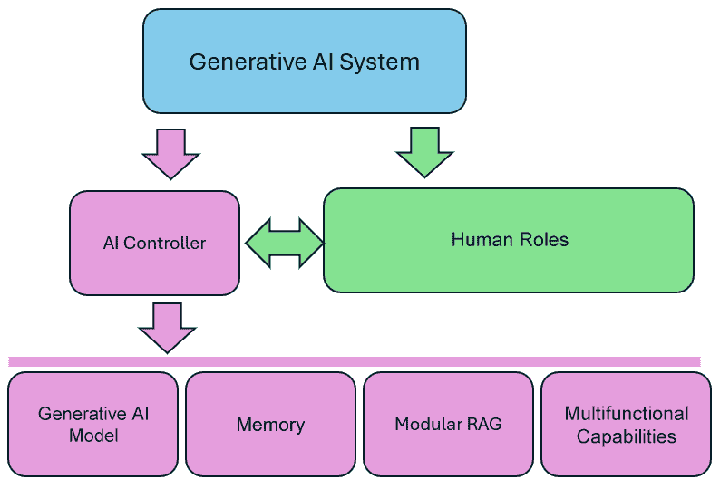
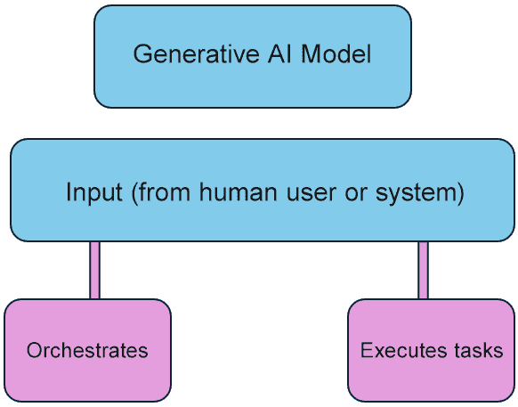
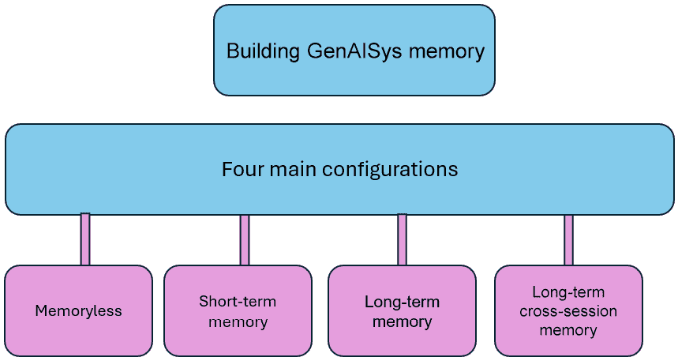
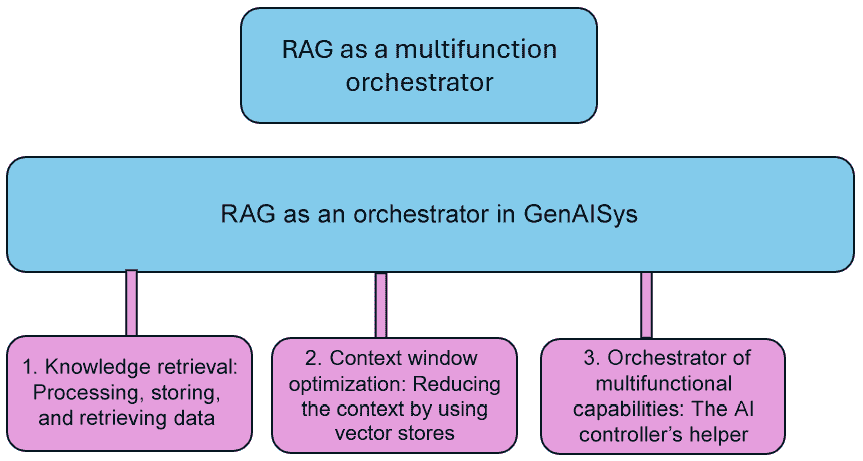
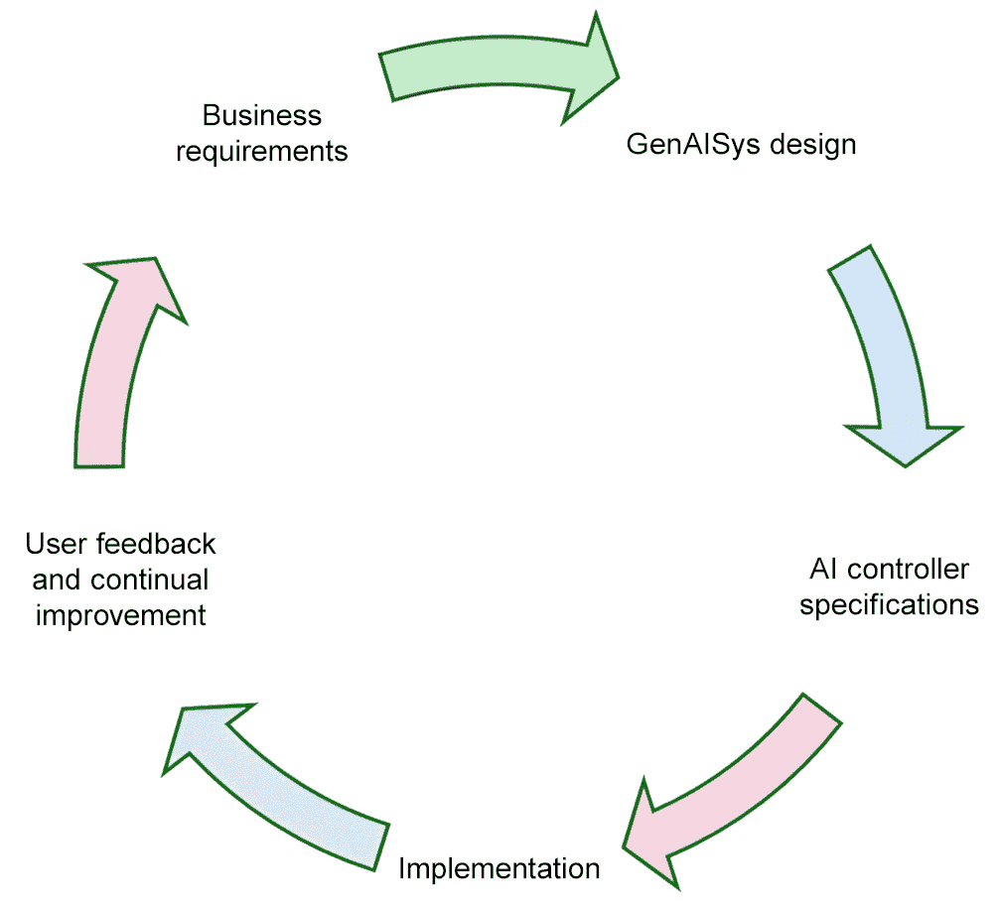
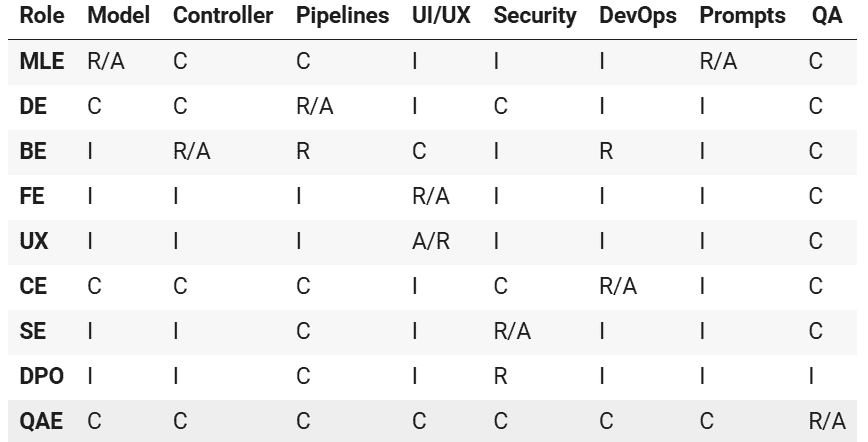
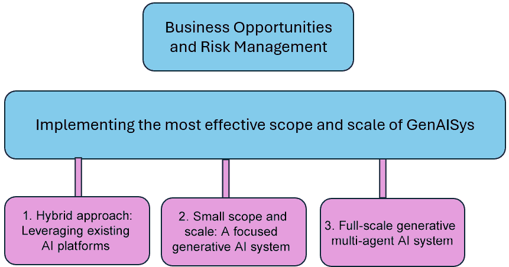

# 第一章：定义一个适合商业应用的生成性 AI 系统

在组织中实施**生成性 AI 系统**（**GenAISys**）不仅仅是通过 API 集成一个独立的模型，如 GPT、Grok、Llama 或 Gemini。虽然这通常是起点，但我们常常错误地将其视为终点。随着 AI 在所有领域的扩展，对 AI 的需求不断上升，需要实施超越简单集成预建模型的先进 AI 系统。

一个适合商业应用的 GenAISys 应在组织中提供 ChatGPT 级别的功能，但也要超越它。其能力和功能必须包括**自然语言理解**（**NLU**）、通过对话中的记忆保持实现情境意识，以及自主图像、音频和文档分析和生成的代理功能。将生成性 AI 模型视为一个具有广泛功能的实体，包括作为代理同事的 AI 代理。

我们将首先定义什么是适合商业应用的 GenAISys。从那里，我们将关注生成性 AI 模型（如 GPT-4o）的核心作用，这种模型既能协调也能执行任务。在此基础上，我们将为情境意识和记忆保持奠定基础，讨论四种生成性 AI 记忆类型：无记忆、短期、长期和多会话。我们还将定义一种新的**检索增强生成**（**RAG**）方法，它为数据检索引入了一个额外的维度：指令和代理推理场景。通过检索存储在向量存储中的指令，将 RAG 提升到另一个层次，我们可以将这些指令添加到提示中。同时，我们将检查 GenAISys 的一个关键组件：人类角色。我们将看到在其生命周期中，一个 AI 系统如何需要人类的专业知识。此外，我们还将定义几个实施级别，以适应 GenAISys 的范围和规模，不仅适应商业需求，还要适应可用的预算和资源。

最后，我们将通过 OpenAI 的 LLM 和多功能 API 展示如何实现情境意识和记忆保持。一个 GenAISys 系统如果没有坚实的记忆保持功能是无法工作的——没有记忆就没有情境，没有情境就没有可持续的生成。在本章中，我们将根据任务需求创建无记忆、短期、长期和多会话类型的模块。到本章结束时，你将获得一个清晰的框架，了解什么使 AI 系统适合商业应用，并在构建 AI 控制器的第一块砖石方面获得实践经验。

简而言之，本章涵盖了以下主题：

+   适合商业应用的 GenAISys 组件

+   AI 控制器和代理功能（模型无关）

+   混合人类角色与 AI 协作

+   商业机会和范围

+   通过记忆保持实现情境意识

让我们从定义什么是适合商业应用的 GenAISys 开始。

# 商业就绪的 GenAISys 的组成部分

一个商业就绪的 GenAISys 是一个模块化的编排器，它无缝地将标准人工智能模型与多功能框架集成，以提供混合智能。通过结合生成式人工智能与代理功能、RAG、**机器学习**（**ML**）、网络搜索、非人工智能操作和多个会话记忆系统，我们能够为各种复杂任务提供可扩展和自适应的解决方案。以 ChatGPT 为例；人们将“ChatGPT”这个名称交替用于生成式人工智能模型以及该应用程序本身。然而，在聊天界面背后，ChatGPT 和 Gemini 等工具是更大系统——在线副驾驶的一部分，这些系统由智能人工智能控制器完全集成和管理，以提供流畅的用户体验。

是 Tomczak（2024）将我们从将生成式人工智能模型视为一个集体实体转变为考虑复杂的 GenAISys 架构。他的论文使用“GenAISys”这个术语来描述这些更复杂的平台。本书中的方法将扩展 GenAISys 的视野，包括商业就绪生态系统中高级人工智能控制器功能和人类角色。GenAISys 没有单一的银弹架构。然而，在本节中，我们将定义实现 ChatGPT 级别功能所需的主要组件。这些包括生成式人工智能模型、记忆保持功能、模块化 RAG 和多功能能力。每个组件如何贡献于 GenAISys 框架在 *图 1.1* 中得到了说明：



图 1.1：GenAISys，人工智能控制器和人类角色

现在我们来定义构成 GenAISys 的 AI 控制器和人类角色的架构。

## 人工智能控制器

商业就绪的 GenAISys 的核心是一个 **人工智能控制器**，它根据输入上下文激活定制的 ChatGPT 级别功能。与传统具有预定任务序列的管道不同，人工智能控制器没有固定的顺序，根据每个输入的具体上下文动态地调整任务——如网络搜索、图像分析和文本生成。这种代理上下文驱动的方法使人工智能控制器能够无缝地编排各种组件，确保生成式人工智能模型的有效和连贯性能。

要实现有效的结果，需要大量工作来定制 ChatGPT 级别的 AI 控制器。然而，回报是能够承受现实世界压力并产生实际业务成果的新一代 AI 系统。一个稳固的 AI 控制器生态系统可以支持多个领域的用例：客户支持自动化、销售线索生成、生产优化（服务和制造）、医疗响应支持、供应链优化以及市场将带你去到的任何其他领域！因此，GenAISys 需要一个 AI 控制器来协调多个管道，例如上下文感知来理解提示的意图和记忆保持以支持会话间的连续性。

GenAISys 还必须定义人类角色，这些角色决定了哪些功能和数据可以访问。然而，在我们继续讨论人类角色之前，让我们首先分解驱动 AI 控制器的关键组件。如图*1.1*所示，生成式 AI 模型、记忆、模块化 RAG 和多功能能力在实现灵活、上下文驱动的协调中发挥着至关重要的作用。让我们探索这些元素如何协同工作来构建一个业务就绪的 GenAISys。我们首先定义生成式 AI 模型的角色。

### 生成式 AI 的无模型方法

当我们构建一个可持续的 GenAISys 时，我们需要模型*互操作性*——根据需要替换底层模型的灵活性。生成式 AI 模型应作为系统中的一个组件，而不是作为系统围绕其构建的核心。这样，如果我们的模型被弃用或需要更新，或者我们只是找到一个性能更好的模型，我们可以简单地用另一个更适合我们项目的模型来替换它。

因此，生成式 AI 模型可以是 OpenAI 的 GPT、Google 的 Gemini、Meta 的 Llama、xAI 的 Grok 或任何 Hugging Face 模型，只要它支持所需的任务。理想情况下，我们应该选择一个多用途、多模态模型，它包括文本、视觉和推理能力。Bommasani 等人（2021 年）对这些基础模型进行了全面分析，其范围超越了 LLMs。

生成式 AI 模型有两个主要功能，如图*1.2*所示：

+   **协调**通过确定基于输入需要触发哪些任务。这个输入可以是一个用户提示或来自管道中另一个功能的系统请求。协调功能代理可以触发网络搜索、文档解析、图像生成、RAG、ML 函数、非 AI 函数以及任何集成到 GenAISys 中的其他功能。

+   **执行**协调层请求的任务或直接根据输入执行任务。例如，一个简单的查询，如请求美国的首都，可能不需要复杂的功能。然而，对文档分析的要求可能需要几个功能（分块、嵌入、存储和检索）。



图 1.2：一个用于协调或执行任务的生成式 AI 模型

注意到*图 1.2*有一个独特功能。没有箭头指向输入、协调和执行组件。与传统硬编码的线性管道不同，灵活的 GenAISys 组件是无序的。我们构建组件，然后让由协调函数选定的自动化场景动态排序任务。

这种灵活性确保了系统对各种任务的适应性。我们可能无法构建一个解决所有任务的系统，但我们可以构建一个满足公司内广泛任务需求的系统。以下两个示例工作流程说明了 GenAISys 如何根据涉及的角色动态排序任务：

+   可以配置人类角色，在某些情况下，用户输入执行一个简单的 API 调用以提供直接响应，例如请求一个国家的首都。在这种情况下，生成式 AI 模型直接执行请求。

+   系统角色可以动态配置，以协调一系列指令，例如先搜索网页，然后总结网页内容。在这种情况下，系统会经过协调过程以生成输出。

可能性无限；然而，所有场景都将依赖于记忆以确保一致、上下文感知的行为。让我们看看记忆。

### 构建 GenAISys 的记忆

高级生成式 AI 模型，如 OpenAI 的 GPT、Meta 的 Llama、xAI 的 Grok、Google 的 Gemini 以及许多 Hugging Face 变体，无论其具体版本或性能水平如何，都是*以上下文驱动的*。您将根据您的项目选择模型，但基本规则仍然简单：

无上下文 => 无意义生成

当我们使用 ChatGPT 或任何其他合作者时，我们无需担心，因为上下文记忆由我们处理。我们只需开始对话，然后根据我们获得的响应级别调整提示，事情就会顺利运行。然而，当我们从头开始开发一个使用生成式 AI API 的系统时，我们必须明确构建上下文意识和记忆保留。

在众多可能的记忆保留策略中，有四种方法脱颖而出：

+   **无状态和无记忆会话**：向 API 发送请求，并返回响应，没有记忆保留功能。

+   **短期记忆会话**：在会话期间，请求和响应之间的交换存储在记忆中，但不会超出会话范围。

+   **多个会话的长期记忆**：请求和响应之间的交换存储在记忆中，并在会话结束后被记住。

+   **多个跨主题会话的长期记忆**：此功能将多个会话的长期记忆链接到其他会话。每个会话都分配了一个角色：系统或多个用户。此功能在 ChatGPT 等平台上不是标准功能，但在组织内部的流程管理中至关重要。

*图 1.3*总结了这四种记忆架构。我们将在接下来的章节*上下文意识和记忆保持*中，使用 GPT-4o 在 Python 中演示每个配置。



图 1.3：四种不同的 GenAISys 内存配置

这四种记忆类型可以作为开发 GenAISys 时的起点，根据需要可以进一步扩展。然而，实际实现通常需要额外的功能，包括以下内容：

+   **人类角色**来定义可以访问会话历史或多个主题的会话集的用户或用户组。这将使我们超越 ChatGPT 级别的平台。我们将在*第二章*中介绍这一方面，*构建生成式 AI 控制器*。

+   **存储策略**来定义我们需要存储什么，以及我们需要丢弃什么。我们将在第*第三章*中介绍存储策略，并在*第三章*中进一步探讨这个概念，即*将动态 RAG 集成到 GenAISys 中*。

在生成模型中，两种关键的记忆类别之间有本地的区别：

+   **语义记忆**，包含如硬科学等事实

+   **情景记忆**，包含个人时间戳记忆，如时间中的个人事件和商务会议

我们可以看到，构建 GenAISys 的内存需要仔细的设计和深思熟虑的开发来实现 ChatGPT 级别的记忆和额外的内存配置，如长期、跨主题会话。然而，这个高级记忆系统的最终目标却是增强模型的上下文意识。虽然像 GPT-4o 这样的生成式 AI 模型具有内置的上下文意识，但要扩展我们正在构建的以上下文驱动的系统（如 GenAISys）的范围，我们需要集成高级 RAG 功能。

### RAG 作为一个多功能的代理协同调度器

在本节中，我们解释了在 GenAISys 内部使用 RAG 进行三个核心功能的动机：

+   **知识检索**：检索有针对性的、细微的信息

+   **上下文窗口优化**：工程优化的提示

+   **多功能能力的代理调度**：动态触发功能

让我们从知识检索开始。

#### 1. 知识检索

生成式 AI 模型在揭示它们所学习的参数化知识方面表现出色，这些知识嵌入在其权重中。这种知识是在训练期间学习的，并嵌入到 GPT、Llama、Grok 和 Gemini 等模型中。然而，当没有向模型提供更多数据时，这种知识就停止在截止日期。在那个时刻，为了更新或补充它，我们有两个选择：

+   **隐式知识**：微调模型，以便将更多训练知识添加到其权重（参数化）。如果你正在处理每天都会变化的数据，如天气预报、新闻源或社交媒体消息，这个过程可能会很具挑战性。如果微调过程对你的数据效果不佳，这也伴随着成本和风险。

+   **显式知识**：将数据存储在文件中或将数据嵌入到向量存储中。知识将因此结构化、可访问、可追溯和更新。然后我们可以使用高级查询检索信息。

这里需要特别注意的是，没有动态显式知识的支持，静态隐式知识无法有效扩展。更多内容将在后续章节中介绍。

#### 2. 上下文窗口优化

生成式 AI 模型正在扩展上下文窗口的边界。例如，在撰写本文时，以下为支持的上下文长度：

+   Llama 4 Scout：1,000 万个标记

+   Gemini 2.0 Pro 实验：2,000,000 个标记

+   Claude 3.7 诗篇：200,000 个标记

+   GPT-4o：128,000 个标记

虽然这些大的上下文窗口令人印象深刻，但在标记成本和计算方面可能会很昂贵。此外，主要问题是当上下文变得过大时，它们的精度会降低。而且，我们不需要最大的上下文窗口，只需要最适合我们项目的那个。这可以证明在必要时实施 RAG 以优化项目是有道理的。

RAG 的分块过程将大型内容拆分为更细致的标记组。当我们嵌入这些块时，它们变成了可以存储和从向量存储中高效检索的向量。这种方法确保我们只为每个任务使用最相关的上下文，最小化标记使用并最大化响应质量。因此，我们可以依赖生成式 AI 的参数化隐式知识能力，以及 RAG 在向量存储中的大量显式非参数数据。我们可以进一步扩展 RAG 并将其用作编排者。

#### 3. 多功能能力的代理编排者

AI 控制器通过生成式 AI 模型与 RAG 互通。RAG 用于通过灵活的指令范围增强模型的输入。现在，使用 RAG 检索指令可能一开始看起来有些反直觉——但想想看。如果我们把指令存储为向量，并为一项任务检索最佳集合，我们就能得到一种快速、灵活的方法来启用代理功能，生成有效结果，并避免每次更改我们希望其表现的行为的指令策略时都需要微调模型。

这些指令作为优化的提示，针对当前任务量身定制。从这个意义上说，RAG 成为了 AI 系统编排层的一部分。如 *图 1.4* 所示，Pinecone 这样的向量存储可以存储并返回此功能信息：



图 1.4：RAG 编排功能

这些场景的编排通过以下方式执行：

+   **场景检索**：AI 控制器将从向量数据库（如 Pinecone）接收结构化指令（场景），这些指令是根据用户的查询进行适配的

+   **动态任务激活**：每个场景指定了一系列任务，例如网络搜索、机器学习算法、标准 SQL 查询或我们需要的任何功能

将经典功能和机器学习功能添加到 GenAISys 中，可以显著增强其功能。GenAISys 的模块化架构使得这种多功能方法有效，如下面的用例所示：

+   **网络搜索**进行实时搜索以增强输入

+   **文档分析**以处理文档并填充向量存储库

+   **文档搜索**从向量存储库中检索处理过的文档的部分

+   **机器学习**，例如 **K-means 聚类**（**KMC**）用于分组数据，以及 **k 近邻**（**KNN**）用于相似性搜索

+   **SQL 查询**以在结构化数据集上执行基于规则的检索

+   您项目或工作流程所需的其他任何功能

RAG 仍然是 GenAISys 的一个关键组件，我们将在 *第三章* 中将其构建到我们的 GenAISys 中，*将动态 RAG 集成到 GenAISys 中*。在 *第三章**将动态 RAG 集成到 GenAISys 中* 中，我们还将增强系统的多功能特性。

现在我们将转向人类角色，它们是任何 GenAISys 的骨架。

## 人类角色

与公众普遍的看法相反，GenAISys（如 ChatGPT 平台）的成功部署和运营在其整个生命周期中高度依赖于人类参与。虽然这些工具可能看起来可以轻松处理复杂任务，但在幕后有多个层次的人类专业知识、监督和协调，使得它们能够平稳运行。

软件专业人员必须首先设计架构，处理大量数据集，并在配备尖端计算资源的百万美元服务器上微调系统。部署后，需要大型团队来监控、验证和解释系统输出——持续适应错误、新兴技术和监管变化。此外，当涉及到在组织内部部署这些系统时——无论是在企业内部网、面向公众的网站、研究环境还是学习管理系统——需要跨多个领域的跨职能协调努力。

这些任务需要高水平的专业知识和合格的团队。因此，人类不仅不可替代，而且是至关重要的！他们是他们创建和维护的 AI 系统的建筑师、监督者、馆长和守护者。

### GenAISys 的实施和管理团队

实施 GenAISys 需要技术技能和团队合作来获得最终用户的支持。这是 AI 控制器设计、用户角色和期望之间的协作挑战。对于任何认为部署现实世界 AI 系统只是获取模型——如最新的 GPT、Llama 或 Gemini——的人来说，仔细查看所需资源将揭示真正的挑战。可能需要大量的人力资源来开发、部署和维护 AI 系统。当然，并非每个组织都需要所有这些角色，但我们必须认识到涉及的技能范围，如下所示：

+   **项目经理**（**PM**）

+   产品经理

+   项目经理

+   **机器学习工程师**（**MLE**）/数据科学家

+   软件开发员/**后端工程师**（**BE**）

+   **云工程师**（**CE**）

+   **数据工程师**（**DE**）和隐私经理

+   UI/UX 设计师

+   合规和监管官员

+   法律顾问

+   **安全工程师**（**SE**）和安全官

+   每个特定部署领域的主题专家

+   **质量保证工程师**（**QAE**）和测试员

+   技术文档编写员

+   系统维护和支持技术人员

+   用户支持

+   训练员

这些只是例子——仅足够展示在构建和运营一个全规模 GenAISys 中涉及多少不同的角色。*图 1.5*显示，设计和实施 GenAISys 是一个持续的过程，每个阶段都需要人力资源。



图 1.5：GenAISys 生命周期

我们可以看到，GenAISys 生命周期是一个永无止境的过程：

+   **业务需求**将随着市场约束不断演变

+   **GenAISys**的设计必须随着每个业务转变而适应

+   **AI 控制器**规范必须适应技术进步

+   **实施**必须适应不断变化的企业规范

+   **用户反馈**将推动持续改进

现实世界的 AI 严重依赖人类能力——那种 AI 本身无法复制的情境和技术理解。AI 可以有效地自动化广泛的任务。但正是人类带来了与真实业务目标对齐所需的深刻洞察。

让我们进一步探讨，看看 RACI 热图来展示为什么人类是 GenAISys 的一个关键组成部分。

### GenAISys RACI

组织 GenAISys 项目需要的人力资源远远超出了仅靠 AI 自动化所能提供的。**RACI**是一个责任分配矩阵，通过确定谁负责（**Responsible**）、负责（**Accountable**）、咨询（**Consulted**）和通知（**Informed**），帮助定义每个任务或决策的角色和责任。RACI 非常适合管理构建 GenAISys 的复杂性。它为系统生命周期中所需的人类角色增长列表增添了结构，并为协调他们的参与提供了一个实用框架。

与任何复杂项目一样，在 GenAISys 上工作的团队需要在多个学科之间进行协作，RACI 有助于定义谁做什么。RACI 中的每个字母代表一种特定的角色类型：

+   **R（责任人）**：积极从事任务的人。他们负责工作的适当完成。例如，MLE 可能负责使用机器学习算法处理数据集。

+   **A（问责人）**：对任务的成功或失败负责的人。他们监督其他人负责执行的任务。例如，**产品负责人**（**PO**）必须确保 MLE 的任务按时并符合规格完成。如果没有，PO 将对失败负责。

+   **C（咨询者）**：向团队中的其他人提供输入、建议和反馈以帮助他们的人。他们不负责执行工作。例如，零售领域的专家可能帮助 MLE 理解机器学习算法的目标。

+   **I（知情者）**：被保持在任务进度或结果循环中的人。他们不参与任务，但只想简单地了解或需要做出决定。例如，**数据隐私官**（**DPO**）可能希望了解系统的安全功能。

RACI 热图通常包含项目中每个人类角色的图例。让我们构建一个包含以下角色的热图：

+   **MLE** 开发和集成 AI 模型

+   **数据工程师**（**DE**）设计数据管理管道

+   **BE** 构建 API 交互

+   **前端工程师**（**FE**）开发面向最终用户的功能

+   **UI/UX 设计师**设计用户界面

+   **CE/DevOps 工程师**管理云基础设施

+   **提示工程师**（**PE**）设计最佳提示

+   **SE** 处理安全数据和访问

+   **DPO** 管理数据治理和法规遵从性

+   **法律/合规官**（**LC**）审查项目的法律范围

+   **QAE** 测试 GenAISys

+   **产品负责人**（**PO**）定义产品的范围和规模

+   **项目经理**（**PM**）协调资源和时间表

+   **技术文档编写者**（**TW**）制作文档

+   **供应商经理**（**VM**）与外部供应商和服务提供商沟通

并非每个 GenAISys 项目都会包含所有这些角色，但根据项目的范围和规模，其中许多角色将是关键的。现在，让我们列出在典型的生成式 AI 项目中定义的角色的关键职责：

+   **模型**：AI 模型开发

+   **控制器**：API 和多模态组件的编排

+   **管道**：数据处理和集成工作流程

+   **UI/UX**：用户界面和体验设计

+   **安全**：数据保护和访问控制

+   **DevOps**：基础设施、扩展和监控

+   **提示**：设计和优化模型交互

+   **QA**：测试和质量保证

我们已经定义了角色和任务。现在，我们可以展示它们如何映射到现实世界场景。*图 1.6*展示了 GenAISys 的一个示例 RACI 热图。



图 1.6：RACI 热图示例

例如，在这个热图中，MLE 有以下职责：

+   （**R**）对模型负责，该模型可能是 GPT-4o。

+   （**R**）对模型的提示负责和（**A**）负责

+   （**C**）作为控制器、管道和测试（QA）的专家咨询

+   （**I**）了解 UI/UX、安全和 DevOps

我们可以用一条简单的规则来总结 GenAISys：

没有人 -> 没有系统！

我们可以看到，*我们*在整个 GenAISys 的生命周期中都是必要的，从设计到维护和支持，包括持续进化以跟上用户反馈。人类已经在这里，并将长期存在！接下来，让我们探索 GenAISys 可以解锁的商业机会。

# 商业机会和范围

更多的时候，我们无法获得 OpenAI、Meta、xAI 或 Microsoft Azure 等不可思议的数十亿美元资源来构建类似 ChatGPT 的平台。上一节展示了，在类似 ChatGPT 的看似简单、无缝的界面之下，有一个复杂的、昂贵的基础设施层、罕见的人才以及持续改进和演变，这些都需要只有大公司才能负担的资源。因此，从一开始就选择一条更聪明的路径，确定我们处于哪个项目类别，并利用现有模块和库的力量来构建我们的 GenAISys。无论用例如何，如营销、金融、生产或支持，我们都需要找到合适的范围和规模来实现一个现实的 GenAISys。

任何 GenAISys 的第一步是定义项目的目标（机会），包括其范围和规模，正如我们提到的。在这一步中，你将评估风险，如成本、机密性和资源可用性（风险管理）。

我们可以根据我们的资源、我们的目标、用例的复杂性和我们的预算，将 GenAISys 项目分为三种主要业务实现类型。这些在*图 1.7*中展示：

+   **混合方法**：利用现有的 AI 平台

+   **小范围和规模**：一个专注的 GenAISys

+   **全面生成式多智能体 AI 系统**：一个完整的 ChatGPT 级生成式 AI 平台



图 1.7：三个主要的 GenAISys 业务实现

让我们从混合方法开始，这是一种在不过度建设的情况下实现业务成果的实用方法。

## 混合方法

混合框架允许你通过结合现成的 SaaS 平台和仅在必要时定制的组件（如网络搜索和数据清洗）来最小化开发成本和时间。这样，你可以在不从头开始开发一切的情况下利用生成式 AI 的力量。让我们通过关键特性和一些示例用例来探讨。

### 关键特性

+   依赖于经过验证的云服务，如 OpenAI 的 GPT API、AWS、Google AI 或 Microsoft Azure。这些平台提供了核心的生成功能。

+   通过整合特定领域的向量存储和你的组织专有的数据集来定制你的项目。

+   专注于开发目标功能，例如客户支持自动化或营销活动生成。

### 用例示例

+   实施特定领域的向量存储以处理法律、医疗或产品相关的客户查询。

+   在社交媒体平台上构建具有实时功能的客户支持系统。

这个类别提供了以更少的成本和开发努力做更多的事情的能力——在成本和开发努力方面。一个混合系统可以是独立的 GenAISys，也可以是更大生成式 AI 平台内的子系统，其中不需要全面开发。现在让我们看看一个小范围、小规模的 GenAISys 如何能带我们更进一步。

## 小范围和规模

一个小规模的 GenAISys 可能包括一个智能的、由 GenAI 驱动的 AI 控制器，连接到向量存储。这种配置允许系统检索数据、触发指令并调用额外的功能，如网络搜索或机器学习——而不需要全规模的基础设施。

### 关键特性

+   一个明确定义的盈利系统，旨在通过最优的开发时间和成本实现合理的目标。

+   人工智能控制器协调指令场景，进而触发 RAG、网络搜索、图像分析和符合你需求的额外自定义任务。

+   重点是高优先级、高效能的特性

### 用例示例

+   一个用于文档检索和摘要的 GenAISys，可以对任何类型的文档进行细微的分析，通过分块和嵌入的内容进行。

+   通过实时网络搜索增强 GPT 或 Llama 等模型，以绕过其数据截止日期——非常适合需要不断微调的应用，如天气预报或新闻监控。

这个类别将我们带入了混合方法的更高层次，同时仍然保持对中小型企业或大型组织内部部门来说既现实又可管理的状态。

## 全规模 GenAISys

如果你在一个拥有大量预算和先进基础设施的组织中的专家团队工作，这个类别适合你。你的团队可以构建一个全规模的 GenAISys，开始接近 ChatGPT 级平台的性能。

### 关键特性

+   一个完整的 AI 控制器，可以管理和协调复杂的自动化工作流程，包括 RAG、指令场景、多模态功能和实时数据。

+   需要大量的计算资源和高度熟练的开发团队

将本书中构建的 GenAISys 视为一个 alpha 版本——一个可以克隆、配置并在组织中的任何地方按需部署的模板。

### 用例示例

+   GenAISys 已经在医疗保健领域出现，用于协助患者诊断和疾病预防。例如，巴黎的居里研究所拥有一个非常先进的 AI 研究团队：[`institut-curie.org/`](https://institut-curie.org/).

+   许多大型组织已经开始实施 GenAISys 用于欺诈检测、天气预报和法律专业知识。

您可以加入这些大型组织之一，它们拥有构建可持续 GenAISys 的资源，无论是在云平台上、本地服务器上还是在两者上。

这三个类别——混合型、小规模和大规模——为构建 GenAISys 提供了不同的路径，具体取决于您组织的目标、预算和技术能力。在本书中，我们将探讨构成 GenAISys 的关键组件。到结束时，您将能够为这些类别中的任何一个做出贡献，并为您正在工作的项目提供现实、技术基础的建议。

现在让我们揭开盖子，开始构建代码中的情境意识和记忆保持。

# 情境意识和记忆保持

在本节中，我们将开始使用 Python 实现情境意识和记忆保持的模拟，以说明在 *构建 GenAISys 的记忆* 部分中引入的概念。目标是展示管理情境和记忆的实用方法——这两个功能随着生成式 AI 平台的演变变得越来越重要。

打开位于 GitHub 存储库 `chapter01` 文件夹中的 `Contextual_Awareness_and_Memory_Retention.ipynb` 文件([`github.com/Denis2054/Building-Business-Ready-Generative-AI-Systems/tree/main`](https://github.com/Denis2054/Building-Business-Ready-Generative-AI-Systems/tree/main))。您会看到笔记本被分为五个主要部分：

+   **设置环境**，构建可重用函数，并将它们存储在存储库的 `commons` 目录中，这样我们就可以在整本书中必要时重复使用它们

+   **无状态和无记忆会话**具有语义和情景记忆

+   **短期记忆会话**用于会话期间的情境意识

+   **跨多个会话的长期记忆**用于跨不同会话的情境保留

+   **多个跨主题会话的长期记忆**，扩展长期记忆覆盖以前分开的会话

目标是明确地展示每种记忆类型的过程。这些示例目前故意保持手动，但它们将被自动化并由我们在下一章开始构建的 AI 控制器管理。

由于生成模型的概率性质，您可能会在不同的运行中观察到相同的提示符产生不同的输出。请确保在单个会话中运行整个笔记本，因为在这个笔记本中，内存保留在不同单元格中是明确的。在*第二章*中，此功能将变得持久并由 AI 控制器完全管理

第一步是安装环境。

## 设置环境

我们需要一个`commons`目录来存放我们的 GenAISys 项目。此目录将包含本书 GitHub 存储库中所有笔记本所需的主要模块和库。动机是专注于设计维护和支持的系统。因此，通过将主要模块和库分组在一个目录中，我们可以专注于需要我们注意的资源，而不是在每个笔记本中重复设置步骤。此外，本节将作为本书 GitHub 存储库中所有笔记本的参考点。我们将只描述下载每个资源一次，然后在全书各处重用它们来构建我们的教育 GenAISys。

因此，我们可以从`commons`目录下载笔记本资源并安装需求。

第一步是下载`grequests.py`，这是一个我们将全书使用的实用脚本。它包含一个函数，可以直接从 GitHub 下载我们需要的文件：

```py
!curl -L https://raw.githubusercontent.com/Denis2054/Building-Business-Ready-Generative-AI-Systems/master/commons/grequests.py --output grequests.py 
```

**快速提示**：使用**AI 代码解释器**和**快速复制**功能增强您的编码体验。在下一代 Packt Reader 中打开此书。点击**复制**按钮

（**1**）快速将代码复制到您的编码环境，或点击**解释**按钮

（**2**）让 AI 助手为您解释代码块。


**下一代 Packt Reader**随本书免费赠送。扫描二维码或访问[packtpub.com/unlock](http://packtpub.com/unlock)，然后使用搜索栏通过名称查找此书。请仔细检查显示的版本，以确保您获得正确的版本。


该脚本的目的是通过调用`grequests`中的`download`函数从存储库的任何目录下载文件：

```py
import sys
import subprocess 
from grequests import download
download([directory],[file]) 
```

此函数使用`curl`命令从指定的目录和文件名下载文件。它还包括基本的错误处理，以防命令执行失败。

代码首先导入`subprocess`来处理路径和命令。`download`函数包含两个参数：

```py
def download(**directory**, **filename**): 
```

+   `directory`：存储文件的 GitHub 存储库子目录

+   `filename`：要下载的文件名

然后定义 GitHub 存储库的基本 URL，指向我们将需要的原始文件：

```py
base_url = 'https://raw.githubusercontent.com/Denis2054/Building-Business-Ready-Generative-AI-Systems/main/' 
```

我们现在需要使用`directory`和`filename`参数定义文件的完整 URL：

```py
file_url = f"{base_url}{directory}/{filename}" 
```

函数现在定义了`curl`命令：

```py
curl_command = f'curl -o {filename} {file_url}' 
```

最后，执行`download`命令：

```py
subprocess.run(curl_command, check=True, shell=True) 
```

+   `check=True`在`curl`命令失败时激活异常

+   `shell=True`通过 shell 运行命令

使用`try-except`块来处理错误：

```py
try:
    # Prepare the curl command with the Authorization header
    curl_command = f'curl -o {filename} {file_url}'
    # Execute the curl command
    subprocess.run(curl_command, check=True, shell=True)
    print(f"Downloaded '{filename}' successfully.")
except subprocess.CalledProcessError:
    print(f"Failed to download '{filename}'. Check the URL and your internet connection") 
```

我们现在有一个独立的下载脚本，将在整本书中使用。让我们继续下载本程序所需的资源。

### 下载 OpenAI 资源

本笔记本需要三个资源：

+   `requirements01.py`用于安装我们想要的精确的 OpenAI 版本

+   `openai_setup.py`用于初始化 OpenAI API 密钥

+   `openai_api_py`包含一个可重用的函数来调用 GPT-4o 模型，因此你不需要在多个单元格或笔记本中重写相同的代码

我们将在整本书中重复使用相同的函数来执行标准的 OpenAI API 调用。如果你想重新访问安装过程，可以随时回到这一节。当需要时，其他场景将被添加到`commons`目录中。

我们可以使用`download()`函数下载这些文件：

```py
from grequests import download
download("commons","requirements01.py")
download("commons","openai_setup.py")
download("commons","openai_api.py") 
```

第一资源是`requirements01.py`。

#### 安装 OpenAI

`requirements01.py`确保安装了特定的 OpenAI 库版本，以避免与其他已安装库冲突。因此，代码会卸载现有版本，强制安装请求的指定版本，并验证结果。该函数执行安装并带有错误处理：

```py
def run_command(command):
    try:
        subprocess.check_call(command)
    except subprocess.CalledProcessError as e:
        print(f"Command failed: {' '.join(command)}\nError: {e}")
        sys.exit(1) 
```

函数的第一步是卸载当前存在的 OpenAI 库（如果有的话）：

```py
print("Installing 'openai' version 1.57.1...")
run_command([sys.executable, "-m", "pip", "install", "--force-reinstall", "openai==1.57.1"]) 
```

函数随后安装 OpenAI 的特定版本：

```py
run_command(
    [
        sys.executable, "-m", "pip", "install", 
        **"--force-reinstall"****,** **"openai==1.57.1"**
    ]
) 
```

最后，函数会验证 OpenAI 是否正确安装：

```py
try:
    import openai
    print(f"'openai' version {openai.__version__} is installed.")
except ImportError:
    print("Failed to import the 'openai' library after installation.")
    sys.exit(1) 
```

函数末尾的输出应如下所示：

```py
'openai' version 1.57.1 is installed. 
```

我们现在可以初始化 OpenAI API 密钥。

#### OpenAI API 密钥初始化

在笔记本中初始化 OpenAI API 密钥有两种方法：

1.  **使用 Google Colab secrets**：在 Google Colab 的左侧面板中点击密钥图标，如图 1.8 所示，然后点击**添加新密钥**，并添加你将在笔记本中使用的密钥变量名称：


图 1.8：添加新的 Google 密钥

然后，我们可以在`openai_setup.py`中的`openai_setup`函数中调用它来使用 Google 的函数初始化密钥：

```py
# Import libraries
import openai
import os
from google.colab import userdata
# Function to initialize the OpenAI API key
def initialize_openai_api():
# Function to initialize the OpenAI API key
def initialize_openai_api():
    # Access the secret by its name
    API_KEY = userdata.get('API_KEY')

    if not API_KEY:
        raise ValueError("API_KEY is not set in userdata!")

    # Set the API key in the environment and OpenAI
    os.environ['OPENAI_API_KEY'] = API_KEY
    openai.api_key = os.getenv("OPENAI_API_KEY")
    print("OpenAI API key initialized successfully.") 
```

如果`google_secrets`设置为`True`，则激活此方法：

```py
google_secrets=True
if google_secrets==True:
    import openai_setup
    openai_setup.initialize_openai_api() 
```

+   **自定义安全方法**：你也可以选择自定义方法，或者通过设置`google_secrets`为`False`，取消注释以下代码，并直接输入你的 API 密钥，或者任何你选择的方法：

    ```py
    if google_secrets==False: # Uncomment the code and choose any method you wish to initialize the API_KEY
        import os
        #API_KEY=[YOUR API_KEY]
        #os.environ['OPENAI_API_KEY'] = API_KEY
        #openai.api_key = os.getenv("OPENAI_API_KEY")
        #print("OpenAI API key initialized successfully.") 
    ```

在这两种情况下，代码将创建一个环境变量：

```py
os.environ['OPENAI_API_KEY'] = API_KEY
openai.api_key = os.getenv("OPENAI_API_KEY") 
```

OpenAI API 密钥已初始化。我们现在将导入一个自定义的 OpenAI API 调用。

#### OpenAI API 调用

接下来的目标是创建一个在`openai_api.py`中的 OpenAI API 调用函数，我们可以在两行中导入它：

```py
#Import the function from the custom OpenAI API file
import openai_api
from openai_api import make_openai_api_call 
```

因此，该函数在调用时构建以接收四个变量并无缝显示它们：

```py
# API function call
response = openai_api.make_openai_api_call(
    uinput,mrole,mcontent,user_role)
print(response) 
```

此函数中的参数如下：

+   `input`: 包含输入（用户或系统），例如，`夏威夷在哪里？`

+   `mrole`: 定义系统的角色，例如，`你是一位地质学专家。` 或简单地 `系统。`

+   `mcontent`: 是我们期望系统成为的内容，例如，`你是一位地质学专家。`

+   `user_role`: 定义用户的角色，例如，`用户`

函数中的代码的第一部分定义了我们将在此笔记本中使用的模型，并创建了一个带有我们发送的参数的 API 调用消息对象：

```py
def make_openai_api_call(input, mrole,mcontent,user_role):
    # Define parameters
    gmodel = "gpt-4o"
    # Create the messages object
    messages_obj = [
        {
            "role": mrole,
            "content": mcontent
        },
        {
            "role": user_role,
            "content": input
        }
    ] 
```

然后我们为这个笔记本定义 API 调用参数的字典：

```py
# Define all parameters in a dictionary named params:
    params = {
        **"temperature"**: 0,
        **"max_tokens"**: 256,
        **"top_p"**: 1,
        **"frequency_penalty"**: 0,
        **"presence_penalty"**: 0
    } 
```

字典参数如下：

+   `temperature`: 控制响应的随机性。`0` 将产生确定性响应。更高的值（例如，`0.7`）将产生更具创造性的响应。

+   `max_tokens`: 限制响应的最大标记数。

+   `top_p`: 产生核采样。它通过从累积概率为 1 的顶部标记中进行采样来控制响应的多样性。

+   `frequency_penalty`: 通过减少标记的重复来避免冗余。`0` 将不应用任何惩罚，而 `2` 则应用强烈的惩罚。在这种情况下，由于 OpenAI 模型的高性能，`0` 已经足够了。

+   `presence_penalty`: 通过惩罚现有内容来鼓励新内容，以避免冗余。它适用于与频率惩罚相同的值。在这种情况下，由于 OpenAI 模型的高性能，它不需要这种控制。

然后我们初始化 OpenAI 客户端以创建 API 调用的实例：

```py
 client = OpenAI() 
```

最后，我们通过发送模型、消息对象和展开的参数来执行 API 调用：

```py
 # Make the API call
    response = client.chat.completions.create(
        model=gmodel,
        messages=messages_obj,
        **params  # Unpack the parameters dictionary
    ) 
```

函数通过返回我们需要的 API 响应内容结束：

```py
 #Return the response
    return response.choices[0].message.content 
```

这个函数将帮助我们专注于 GenAISys 架构，而无需在笔记本中加载重复的库和函数。

在笔记本中，我们有以下内容：

+   程序将输入、角色和消息内容提供给函数

+   `messages_obj` 包含对话历史

+   API 行为的参数定义在 `params` 字典中

+   使用 OpenAI 客户端对 OpenAI 模型进行 API 调用

+   函数仅返回 AI 的响应内容

GenAISys 将包含许多组件——包括一个生成模型。你可以选择适合你项目的模型。在这本书中，模型仅用于教育目的，不作为认可或推荐。

现在我们构建并运行一个无状态和无记忆的会话。

## 1. 无状态和无记忆会话

如果我们只想进行一次性和临时的交换，且请求之间没有存储信息，那么无状态和无记忆的会话是有用的。本节中的示例既无状态又无记忆：

+   *无状态* 表示每个请求都将独立处理

+   *无记忆*意味着没有机制来记住过去的交流

让我们从语义查询开始。

### 语义查询

这个请求期望一个纯粹语义、事实性的响应：

```py
uinput = "Hawai is on a geological volcano system. Explain:"
mrole = "system"
mcontent = "You are an expert in geology."
user_role = "user" 
```

现在，我们调用 OpenAI API 函数：

```py
# Function call
response = openai_api.make_openai_api_call(
    uinput,mrole,mcontent,user_role)
print(response) 
```

如您所见，响应完全是语义性的：

```py
Hawaii is located on a volcanic hotspot in the central Pacific Ocean, which is responsible for the formation of the Hawaiian Islands. This hotspot is a region where magma from deep within the Earth's mantle rises to the surface, creating volcanic activity… 
```

下一个查询是情景式的。

### 情景查询带有语义背景

本例中的查询是情景式的，并借鉴了个人经验。然而，由于对夏威夷的描述，存在语义背景。以下是一条相当诗意的消息：

```py
# API message
uinput = "I vividly remember my family's move to Hawaii in the 1970s, how they embraced the warmth of its gentle breezes, the joy of finding a steady job, and the serene beauty that surrounded them. Sum this up in one nice sentence from a personal perspective:"
mrole = "system"
mcontent = "You are an expert in geology."
user_role = "user" 
```

`mcontent` 从语义查询示例（“你是地质学专家”）中重用，但在这个案例中，它对响应的影响并不大。由于用户输入非常个人化和叙事驱动，系统提示的作用很小。

如果需要，我们可以在函数调用之前插入外部信息。例如，我们可以添加来自另一个来源的信息，比如当天从家庭成员那里收到的短信：

```py
text_message='I agree, we had a wonderful time there.'
uninput=text_message+uinput
text_message="Hi, I agree, we had a wonderful time there." 
```

现在，我们调用函数：

```py
# Call the function
response = openai_api.make_openai_api_call(
    uinput,mrole,mcontent,user_role)
print(response) 
```

我们看到响应主要是情景式的，并包含一些语义信息：

```py
Moving to Hawaii in the 1970s was a transformative experience for my family, as they found joy in the island's gentle breezes, the security of steady employment, and the serene beauty that enveloped their new home. 
```

### 无状态和无记忆验证

我们之前没有添加任何记忆保留功能，使得对话无状态。让我们检查一下：

```py
# API message
uinput = "What question did I just ask you?"
mrole = "system"
mcontent = "You already have this information"
user_role = "user" 
```

当我们调用函数时，我们的对话将被遗忘：

```py
# API function call
response = openai_api.make_openai_api_call(
    uinput,mrole,mcontent,user_role
)
print(response) 
```

输出确认会话是无记忆的：

```py
I'm sorry, but I can't recall previous interactions or questions. Could you please repeat your question? 
```

API 调用是无状态的，因为 OpenAI API 不会在请求之间保留记忆。如果我们直接使用 ChatGPT，交换会被保存在那个会话中。这对实现有重大影响。这意味着我们必须构建自己的记忆机制，以赋予 GenAISys 有状态的行为。让我们从第一层：短期记忆开始。

## 2. 短期记忆会话

本节的目标是使用两步过程模拟短期记忆会话：

1.  首先，我们从一个用户输入到一个响应的会话：

用户输入 => 生成模型 API 调用 => 响应

为了实现这一第一步，我们将会话运行到响应：

```py
uinput = "Hawai is on a geological volcano system. Explain:"
mrole = "system"
mcontent = "You are an expert in geology."
user_role = "user"
response = openai_api.make_openai_api_call(
    uinput,mrole,mcontent,user_role)
print(response) 
```

响应的输出存储在 `response` 中：

```py
"Hawaii is part of a volcanic system known as a hotspot, which is a region of the Earth's mantle where heat rises as a thermal plume from deep within the Earth. This hotspot is responsible for the formation of the Hawaiian Islands. Here's how the process works:…" 
```

1.  下一步是将之前的交互输入到下一个提示中，并附带一个后续问题：

    +   解释情况：`当前对话会话为：`

    +   添加用户的初始输入：`夏威夷位于一个地质火山系统。解释：`

    +   添加我们在上一个调用中获得的响应

    +   添加用户的新的输入：`用最多 20 个字总结你之前的回答。`

这里的目标是压缩会话日志。我们并不总是需要压缩对话，但在较长的会话中，大的上下文窗口会迅速堆积。这项技术有助于保持令牌计数低，这对成本和性能都很重要。在这个特定案例中，我们只管理一个响应，如果我们想的话，可以保留整个交互在内存中。不过，这个例子介绍了一个有用的习惯，有助于扩展。

一旦提示被组装：

+   调用 API 函数

+   显示响应

场景在代码中得到了说明：

```py
ninput = "Sum up your previous response in a short sentence in a maximum of 20 words."
uinput = (
    "The current dialog session is: " +
    uinput +
    response +
    ninput
)
response = openai_api.make_openai_api_call(
    uinput, mrole, mcontent, user_role
)
print("New response:", "\n\n", uinput, "\n", response) 
```

输出提供了一个很好的、简短的对话摘要：

```py
New response: Hawaii's islands form from volcanic activity over a stationary hotspot beneath the moving Pacific Plate. 
```

这个功能在这里并不是严格必要的，但它为我们设置了在书中稍后遇到的更长时间对话的基础。接下来，让我们构建一个多个会话的长期模拟。

请记住：由于会话目前只保存在内存中，如果笔记本断开连接，对话就会丢失。目前还没有任何内容存储在磁盘或数据库中。

## 3. 多个会话的长期记忆

在本节中，我们通过从早期会话继续对话来模拟长期记忆。这里的区别在于，我们不仅仅是“记住”单个会话中的对话——我们正在“重用”过去会话的内容来扩展对话。在这个时候，“会话”这个词有了更广泛的意义。在传统的副驾驶场景中，一个用户在一个自包含的会话中与一个模型交互。在这里，我们正在混合会话并支持多个子会话。多个用户可以在共享环境中与模型交互，有效地创建一个具有分支记忆线程的单个全局会话。想象一下，模型就像一个正在进行的 Zoom 或 Teams 会议中的客人。你可以要求 AI 客人参与或保持安静——当它加入时，它可能需要回顾。

为了避免重复过去对话的第一步，我们正在重用我们刚刚运行的短期记忆会话的内容。让我们假设之前的会话已经结束，但我们仍然想从我们离开的地方继续：

```py
session01=response
print(session01) 
```

输出包含了我们短期记忆会话的最终响应：

```py
Hawaii's islands form from volcanic activity over a stationary hotspot beneath the moving Pacific Plate. 
```

本节中的过程将在之前的会话基础上构建，类似于你离开一段时间后再次与在线副驾驶进行对话的方式：

保存上一个会话 => 加载上一个会话 => 将其添加到新会话的场景中

让我们先测试一下 API 是否能够自己记住一些东西：

```py
uinput="Is it safe to go there on vacation"
response = openai_api.make_openai_api_call(
    uinput,mrole,mcontent,user_role
)
print(response) 
```

输出显示它忘记了我们正在进行的对话：

```py
I'm sorry, but I need more information to provide a helpful response. Could you specify the location you're considering for your vacation? … 
```

API 忘记了之前的调用，因为无状态 API 不会保留过去的对话。这取决于我们决定在提示中包含什么。我们有几个选择：

+   我们是否希望以大量消耗令牌的方式记住所有内容？

+   我们是想总结之前的部分对话还是全部对话？

在一个真实的 GenAISys 中，当输入触发请求时，AI 控制器会决定应用任务的最佳策略。现在的代码将之前会话的上下文和记忆与新的请求关联起来：

```py
ninput = "Let's continue our dialog."
uinput=ninput + session01 + "Would it be safe to go there on vacation?"
response = openai_api.make_openai_api_call(
    uinput,mrole,mcontent,user_role
)
print("Dialog:", uinput,"\n")
print("Response:", response) 
```

响应显示系统现在记住了过去的会话，并且有足够的信息提供可接受的输出：

```py
Response: Hawaii is generally considered a safe destination for vacation, despite its volcanic activity. The Hawaiian Islands are formed by a hotspot beneath the Pacific Plate, which creates volcanoes as the plate moves over it. While volcanic activity is a natural and ongoing process in Hawaii, it is closely monitored by the United States Geological Survey (USGS) and other agencies… 
```

现在我们将构建一个跨不同主题的多个会话的长期模拟。

## 4. 多个跨主题会话的长期记忆

本节说明了如何将两个单独的会话合并为一个。这不是标准 ChatGPT-like 平台提供的东西。通常，当我们开始一个新的主题时，共乘者只记得当前会话中发生的事情。但在企业环境中，我们可能需要更多的灵活性——特别是在多个用户协作时。在这种情况下，AI 控制器可以被配置为允许用户组查看和合并同一组中其他人生成的会话。

假设我们想要总结两个单独的对话——一个关于夏威夷的火山系统，另一个关于组织到亚利桑那州的地质野外考察。我们首先保存先前的长期记忆会话：

```py
session02=uinput + response
print(session02) 
```

然后，我们可以从另一个位置，即亚利桑那州，开始一个单独的多用户子会话：

```py
ninput ="I would like to organize a geological visit in Arizona."
uinput=ninput+"Where should I start?"
response = openai_api.make_openai_api_call(
    uinput,mrole,mcontent,user_role
)
#print("Dialog:", uinput,"\n") 
```

我们现在期望对亚利桑那州有响应，而夏威夷则被排除在外：

```py
Response: Organizing a geological visit in Arizona is a fantastic idea, as the state is rich in diverse geological features. Here's a step-by-step guide to help you plan your trip:… 
```

响应是可以接受的。现在，让我们通过结合两个会话并提示系统总结它们来模拟跨多个主题的长期记忆：

```py
session02=response
ninput="Sum up this dialog in a short paragraph:"
uinput=ninput+ session01 + session02
response = openai_api.make_openai_api_call(
    uinput,mrole,mcontent,user_role
)
#print("Dialog:", uinput,"\n")#optional
print("Response:", response) 
```

系统的输出显示，系统的长期记忆是有效的。我们看到第一部分是关于夏威夷的：

```py
Response: The dialog begins by explaining the formation of Hawaii's volcanic islands as the Pacific Plate moves over a stationary hotspot, leading to active volcanoes like Kilauea…. 
```

然后响应继续到关于亚利桑那州的段落：

```py
It then transitions to planning a geological visit to Arizona, emphasizing the state's diverse geological features. The guide recommends researching key sites such as the Grand Canyon… 
```

我们现在已经涵盖了 GenAISys 的核心记忆模式——从无状态和短期记忆到多用户、多主题的长期记忆。现在，让我们总结本章的旅程，并进入下一个层次！

# 摘要

一个商业就绪的 GenAISys 提供了与 ChatGPT-like 平台相当的功能。它汇集了生成式 AI 模型、代理功能、RAG、记忆保持以及一系列 ML 和非 AI 功能——所有这些都由一个 AI 控制器协调。与传统管道不同，控制器不遵循固定的步骤序列。相反，它动态地编排任务，适应上下文。

GenAISys 通常在 GPT-4o 或最适合您用例的任何模型上运行。但正如我们所见，仅仅访问 API 是不够的。上下文意识和记忆保持是必不可少的。虽然 ChatGPT-like 工具默认提供这些功能，但当我们创建定制系统时，我们必须自己构建它们。

我们探索了四种类型的记忆：无记忆、短期记忆、长期记忆和跨主题记忆。我们还区分了语义记忆（事实）和情景记忆（个人、带时间戳的信息）。上下文意识在很大程度上依赖于记忆——但上下文窗口有局限性。即使我们增加窗口大小，模型仍然可能错过复杂任务中的细微差别。这就是高级 RAG 发挥作用的地方——将内容分解成更小的块，嵌入它们，并将它们存储在 Pinecone 等向量存储中。这扩大了系统可以“记住”并用于推理的内容。

我们还看到，无论 GenAISys 如何先进，没有人类专业知识它就无法运行。从设计到部署、维护和迭代，人在整个系统生命周期中始终至关重要。然后，我们根据可用资源和目标概述了三种现实世界的实施模型：利用现有 AI 平台的混合系统、针对特定商业需求的小规模系统以及为 ChatGPT 级别性能构建的全规模系统。

最后，我们亲自动手——使用 GPT-4o 在 Python 中构建了一系列内存模拟模块。这些示例为下一步奠定了基础：将管理 GenAISys 中的内存、上下文和编排的 AI 控制器。我们现在准备好构建 GenAISys AI 控制器了！

# 问题

1.  API 生成式 AI 模型如 GPT 是否是 AI 控制器？（是或否）

1.  无记忆的会话是否记得最后的交流？（是或否）

1.  RAG 是否用于优化上下文窗口？（是或否）

1.  GenAISys 的整个生命周期中人类角色是否重要？（是或否）

1.  AI 控制器能否动态运行任务？（是或否）

1.  使用有限数量的关键特性构建的小规模 GenAISys 是否？（是或否）

1.  全规模的类似 ChatGPT 的系统是否需要大量资源？（是或否）

1.  在多个会话中是否需要长期记忆？（是或否）

1.  向量存储如 Pinecone 是否支持知识和 AI 控制器功能？（是或否）

1.  GenAISys 是否可以在没有上下文意识的情况下运行？（是或否）

# 参考文献

+   Tomczak, J. M. (2024). *生成式人工智能系统：生成式人工智能的系统视角*。[`arxiv.org/pdf/2407.11001`](https://arxiv.org/pdf/2407.11001)

+   Zewe, A. (2023, November 9). *解释：生成式人工智能*。MIT News。从 [`news.mit.edu/2023/explained-generative-ai-1109`](https://news.mit.edu/2023/explained-generative-ai-1109) 获取。

+   OpenAI 模型：[`platform.openai.com/docs/models`](https://platform.openai.com/docs/models)

+   Bommasani, R.，Hudson, D. A.，Adeli, E.，Altman, R.，Arora, S.，von Arx, S.，... & Liang, P. (2021). *关于基础模型的机会与风险*。arXiv 预印本 arXiv:2108.07258。从 [`arxiv.org/abs/2108.07258`](https://arxiv.org/abs/2108.07258) 获取。

# 进一步阅读

+   Feuerriegel, S.，Hartmann, J.，Janiesch, C.，& Zschech, P. (2023). *生成式人工智能。商业与信息系统工程*。[`doi.org/10.1007/s12599-023-00834-7`](https://doi.org/10.1007/s12599-023-00834-7)

+   Eloundou 等人 (2023)。*GPTs 是 GPTs：大型语言模型对劳动力市场影响潜力的早期观察*。[`arxiv.org/abs/2303.10130`](https://arxiv.org/abs/2303.10130)

    |

    #### 现在解锁此书的独家优惠

    扫描此二维码或访问 [packtpub.com/unlock](http://packtpub.com/unlock)，然后通过书名搜索此书。 |  |

    | *注意：在开始之前，请准备好您的购买发票。* |
    | --- |
