# 第四章：构建 AI 控制器编排界面

今天的商业需要以前从未达到的速度来设计、生产和交付商品和服务。响应性几乎在每一个领域都已成为关键，从在线云服务到交付食物、药物、服装等等。这样一个事件驱动的经济产生了一连串的任务，只有同样事件驱动的、以人为本的**生成式 AI 系统**（**GenAISys**）才能跟上。

即使是最自动化的工作流程，人类的判断仍然是基础：当火灾爆发、风暴摧毁基础设施或供应链出现问题时，团队——而不仅仅是算法——必须采取行动。一个将人类排除在外的先进 GenAISys 只是一个神话。因此，本章首先概述了一个架构，该架构拆除了用户和 AI 之间的墙壁，以创建一个协作的多用户聊天机器人。

首先，我们从高层次概述事件驱动的 GenAISys 界面，展示早期章节中的构建块——短期、情景和长期记忆，多轮对话代理，以及用于指令场景和数据的双 RAG 管道——是如何组合在一起的。为了实现响应式系统，我们必须编码 GenAISys 的过程，然后是管理生成式 AI 代理的对话代理。一旦我们的 GenAISys 界面构建完成，我们将进行多用户、多轮对话，三个用户在一个在线旅行社中工作。他们的在线会议将包括一个作为参与者的对话 AI 代理。

这些用户将能够与或没有 AI 代理进行在线会议。他们可以利用 RAG 来查找指令场景或简单地要求生成式 AI 代理回答问题。到本章结束时，我们将有一个完全工作的 GenAISys 界面，准备进行多模态思维链扩展（*第五章*）。

简而言之，本章涵盖了以下主题：

+   事件驱动的 GenAISys 界面架构的高层次视图

+   GenAISys 界面的低级、实战流程图

+   实现对输入、AI 代理和活跃用户的响应小部件

+   聊天机器人在多轮对话中的事件驱动流程

+   以 AI 代理作为参与者的多用户 GenAISys 对话

+   对话代理的响应 RAG 功能

+   GenAISys 界面和 AI 代理的编排能力

我们的首要任务是定义一个事件驱动的 GenAISys 界面。

# 事件驱动的 GenAISys 界面架构

我们的事件驱动 GenAISys 界面集成了我们在前几章中构建的功能。该界面将利用 IPython 小部件的灵活性，创建一个反应式的事件驱动环境，其中以下内容适用：

+   高级任务将是事件驱动的，由用户输入触发

+   生成式 AI 任务将触发生成式 AI 代理功能

我们将首先从高层次上检查我们正在构建的程序，如图 *4.1* 所示：

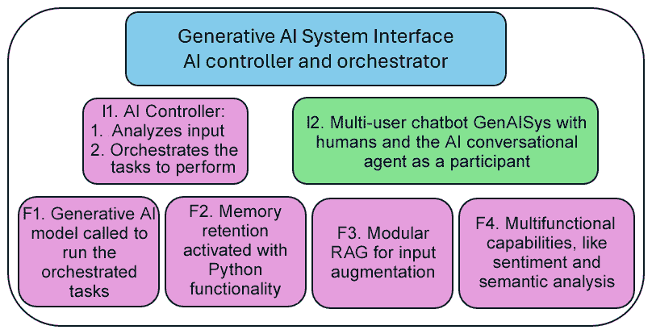

图 4.1：GenAISys 接口的高级架构

让我们回顾一下在前几章中已经构建的功能，并列出本章添加的关键功能：

+   **I1 – AI 控制器**：本章的主要新组件是具有响应式小部件的生成式 AI Python 接口，它将作为 AI 控制器和协调器运行

+   **I2 – 多用户聊天机器人**：多个用户同时交互的聊天界面

+   **F1 – 生成式 AI 模型**：继承自所有前面的章节，特别是 *第三章*，其中我们使用 GPT-4o 运行生成式 AI 调用

+   **F2 – 记忆保持**：继承自 *第一章*，其中介绍了不同类型的记忆

+   **F3 – 模块化 RAG**：继承自 *第三章* 的指令和数据管道

+   **F4 – 多功能能力**：从 *第二章* 和 *第三章* 中提取语义和情感分析，将在 *第五章* 中扩展，包括图像、音频、网络搜索和机器学习功能

要构建这个架构，我们将执行以下操作：

+   构建 GenAISys 接口的事件驱动流程

+   使用 GPT-4o 和 OpenAI 嵌入式模型实现对话代理

+   运行一个多用户、多轮会话，探索 GenAISys AI 控制器和协调器的主要功能

决定在没有箭头的情况下展示 GenAISys 架构的主要组件（在本章和下一章），这是一个故意的选择，旨在传达一个核心概念：模块化和架构灵活性。该图不是一个刚性的蓝图，而是一个概念工具包。它展示了您可用的强大组件——**I1. AI 控制器**、**I2. 多用户聊天机器人**、**F1. 生成式 AI 模型**、**F2. 记忆保持**、**F3. 模块化 RAG** 和 **F4. 多功能能力**——作为独立的、可互操作的块。这赋予您权力，说明您可以自由设计自己的系统架构。例如，用户可以选择运行一些功能组件，如 **F4. 多功能能力**，作为独立的、分布式的代理，由控制器调用。或者，他们可以实施一个完全不同的界面，甚至在没有界面的情况下运行系统。

然而，这个架构的重点在于展示以人为中心的 GenAISys。在这个配置中，**I1. AI 控制器**（生成式 AI IPython 界面）作为中央枢纽和协调者。这种以人为中心的架构保证了完全控制和透明度。这在构建风险规避的企业环境中的信任至关重要。虽然控制流程没有用箭头表示，但它是隐含的：**I2. 多用户聊天机器人**的用户交互由 AI 控制器管理，然后战略性地将任务委托给各种功能组件（**F1**到**F4**）以生成响应、访问内存、执行 RAG 或执行特定功能。这种方法提供了一条清晰、稳定且可解释的路径，用于构建商业就绪的生成式 AI 系统。

让我们先探讨以场景驱动的任务执行。

# 构建事件驱动的 GenAISys 界面流程

让我们从构建*图 4.2*中显示的 GenAISys 界面开始，使用 IPython 小部件创建一个响应式、事件驱动的环境。结果将是一个动态的多用户聊天界面，带有下拉菜单、文本输入字段和复选框——所有这些对于人们/用户与生成式 AI 代理之间的实时协作都是必需的。

在 GitHub 的 Chapter04 目录中打开`Event-driven_GenAISys_framework.ipynb`笔记本（[`github.com/Denis2054/Building-Business-Ready-Generative-AI-Systems/tree/main`](https://github.com/Denis2054/Building-Business-Ready-Generative-AI-Systems/tree/main)）。设置环境与前面章节中描述的相同：

+   要设置 OpenAI，请参考*第一章*，包括此处使用的自定义 OpenAI API 调用：`openai_api.make_openai_api_call`

+   请参考*第三章*以设置 Pinecone，连接到索引并查询它

需要额外的包（`ipython`）用于笔记本环境。Google Colab 中已预装 IPython；如果需要，请使用以下命令安装：

```py
!pip install ipython 
```

我们将要构建的代码演示了核心概念，例如事件驱动的交互、动态内容更新和模块化函数组织。在本节结束时，你将学会如何弥合人工智能功能与最终用户参与之间的差距。

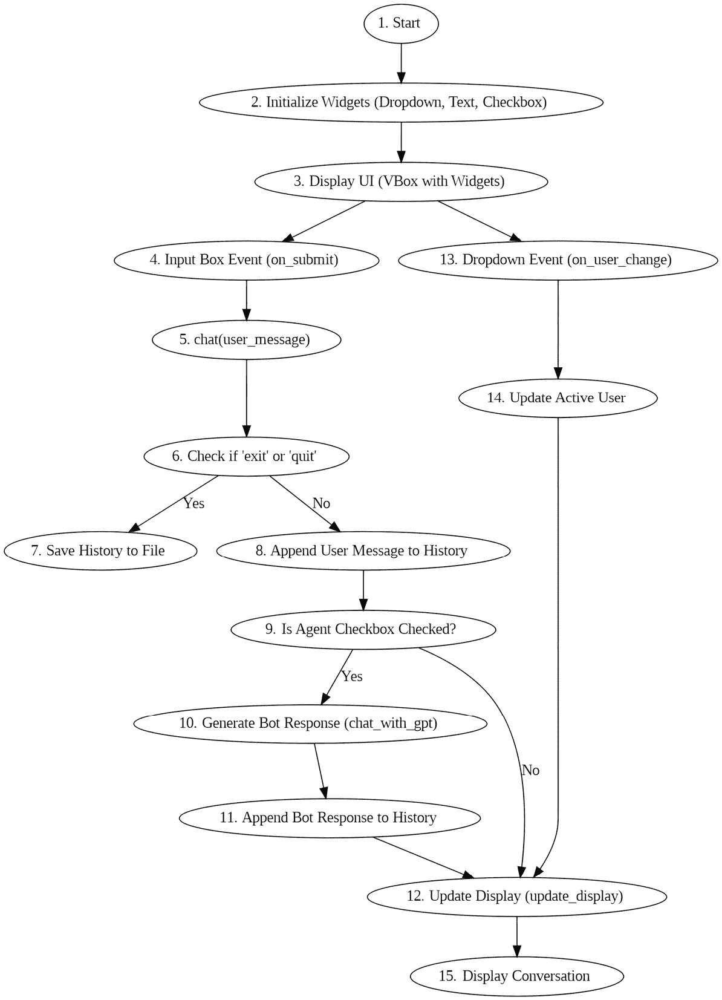

图 4.2：事件驱动的 GenAISys 界面流程图

构建此界面所需的主要功能组如下：

+   初始化小部件

+   处理用户输入和选择更改

+   处理聊天消息，包括触发函数和退出命令

+   生成和处理 AI 响应

+   动态更新 UI

+   保存对话历史

在从开发者的角度深入代码之前，让我们牢记用户的视角。我们必须构建一个直观的界面，可以无缝执行*图 4.2*中概述的流程。


图 4.3：从用户角度看到的 GenAISys

**提示**：需要查看此图像的高分辨率版本？在下一代 Packt Reader 中打开此书或在其 PDF/ePub 副本中查看。

**下一代 Packt Reader**随本书免费赠送。扫描二维码或访问[packtpub.com/unlock](http://packtpub.com/unlock)，然后使用搜索栏通过书名查找此书。请仔细核对显示的版本，以确保您获得正确的版本。


UI 中只包含三个小部件：一个用于输入提示的输入框、一个用于选择活动用户的下拉列表和一个用于激活和停用对话 AI 代理的复选框。

让我们逐步了解设置和运行此交互式 GenAISys 环境的过程。

## 1. 开始

程序从“*与代理作为参与者的多用户对话*”单元格开始。我们首先导入所需的模块和库，从`IPython`开始：

```py
from IPython.display import display, HTML, clear_output 
```

让我们逐一了解在 Google Colab 中将要实现的功能：

+   `display`和`HTML`用于显示小部件、图像和丰富的 HTML 输出

+   `clear_output`用于清除单元格的输出

然后，我们导入由 Jupyter 项目管理的`ipywidgets`：

```py
from ipywidgets import Dropdown, Text, Checkbox, VBox, Layout 
```

`ipywidgets`是本笔记本交互界面的核心组件，我们将使用以下小部件：

+   `Dropdown`：一个下拉小部件，可以从选项列表中选择一个值

+   `Text`：一个用于用户文本输入的小部件

+   `Checkbox`：一个用于布尔值选中/未选中输入的小部件

+   `Vbox`：一个容器小部件，用于以垂直框布局排列子小部件

+   `Layout`：使用布局属性（如宽度、高度和边距）自定义小部件的样式

最后，我们导入 JSON，用于存储多用户对话历史：

```py
import json 
```

然后，我们初始化所有用户的对话历史，定义第一个活动用户，并将活动对话设置为`True`：

```py
# Initialize conversation histories for all users and active user
user_histories = {"User01": [], "User02": [], "User03": []}
active_user = "User01"  # Default user
conversation_active = True 
```

因此，从一开始，我们就在初始化一个多用户协作的 GenAISys，其中用户可以是人类提示和系统提示。例如，“用户”可以是从另一个系统来的消息，并通过读取待处理消息的事件触发此界面。用户列表可以扩展，存储在变量中，或用于满足项目需求的各种用户管理系统，包括访问权限、密码和各种应用程序的角色。接下来，我们初始化小部件本身。

## 2. 初始化小部件

代码现在设置了所需的`Dropdown`、`Text`和`Checkbox`小部件。这些小部件也链接到事件处理器。用户`Dropdown`小部件定义了在对话开始时初始化的三个用户：

```py
# Create a dropdown to select the user
user_selector = Dropdown(
    options=["User01", "User02", "User03"],
    value=active_user,
    description='User:',
    layout=Layout(width='50%')
) 
```

选择器有四个参数：

+   `options` 列出了可用于扩展并可访问任何用户管理仓库的可用用户。

+   `value` 确定活动用户。程序以 `User01` 作为初始用户启动。当授权用户首次连接到 GenAISys 时，这可以自动化。

+   `description` 为将要显示的下拉列表提供标签。

+   `layout` 设置将要显示的小部件的宽度。

注意，我们正在创建一个核心 GenAISys，而不是一个平台。目标是掌握 GenAISys 的内部工作原理。一旦它按预期工作，我们就可以添加经典的用户管理层（名称、角色和权限）。在这种情况下，我们保持专注于 GenAISys 的灵活核心概念，而不是它们将如何封装在特定的平台和框架中。我们正在学习如何成为生成式 AI 代理架构师，而不是特定框架的操作员。

下一步是插入事件处理器。在这种情况下，它是一个事件监听器，用于检测 `user_selector` 的值何时发生变化。当选择其他用户时，`on_user_change` 函数会自动调用，并且 `value` 变为新的用户：

```py
user_selector.observe(on_user_change, names='value') 
```

在 GenAISys 对话中用户动态变化代表了一种从一对一聊天机器人到重大进化。它为与 AI 作为共同参与者的协作团队合作引入了一个全新的维度。

需要激活的第二个小部件是输入小部件：

```py
# Create the input box widget
input_box = Text(placeholder="Type your message here or type 'exit' to end the conversation.", layout=Layout(width='100%')) 
```

输入可以是任何文本，并将占用 UI 布局的 100%。当用户输入 `exit` 或 `quit` 时，对话结束。当文本输入并按下 *Enter* 按钮时，事件处理器接管：

```py
input_box.on_submit(handle_submit)  # Attach the on_submit event handler 
```

`on_submit` 是 `input_box` 小部件的方法。`handle_submit` 是我们可以按自己的意愿编写的回调函数，将在本节后面描述。

第三个小部件是 AI 对话代理的复选框：

```py
# Create a checkbox to toggle agent response
agent_checkbox = Checkbox(
    value=True,
    description='Agent',
    layout=Layout(width='20%')
) 
```

复选框显示描述标签，在这种情况下是一个代理。布局将占用 UI 的 20%。如果 `value` 设置为 `True`，则对话式 AI 代理将被激活。我们将在本章的 *对话代理* 部分构建 AI 代理。AI 代理也将是事件驱动的。

UI 容器现在已准备好显示。

## 3. 显示用户界面

UI 容器小部件现在结合了我们定义在 `VBox`（`V` 代表垂直；即，在垂直框中）中的三个事件驱动小部件。这三个小部件用括号括起来：

```py
# Display the initial interface
display`(`
    `VBox(`
       `[user_selector, input_box, agent_checkbox]`,
        layout=Layout(
            display='flex', flex_flow='column',
            align_items='flex-start', width='100%'
        )
    )) 
```

接下来定义布局：

```py
layout=Layout(
    display='flex', flex_flow='column',
    align_items='flex-start', width='100%'
))) 
```

此响应式 UI 的参数如下：

+   `display='flex'` 激活 CSS 弹性盒模型以动态布局，而不指定项目的大小。

+   `flex_flow='column'` 垂直排列子小部件。

+   `align_items='flex-start'` 将小部件对齐到 UI（左侧）容器的起始位置（左侧）。

+   `width='100%'` 使容器占据可用空间的全部宽度。

这样，UI 就准备好了。我们可以选择从三个小部件中的任何一个开始。用户选择器可以在输入之前运行，以及 AI 代理复选框。在这种情况下，用户选择器被设置为默认值 `User01`，AI 代理复选框被设置为默认值 `True`。

三个小部件及其过程可以根据项目需求构建到任何经典网页或软件界面中。由于输入没有默认值，让我们继续使用输入小部件。

## 4. 输入框事件

输入文本由上一节中描述的 UI 管理，当用户输入文本时触发 `input_box.on_submit(handle_submit)`。反过来，`submit` 方法调用 `handle_submit` 函数：

```py
# Function to handle the submission of the input
def handle_submit(sender):
    user_message = sender.value
    if user_message.strip():
        sender.value = ""  # Clear the input box
        chat(user_message) 
```

现在，该函数执行以下三个操作：

+   `user_message = sender.value` 处理从输入小部件接收到的文本

+   `if user_message.strip()` 检查是否存在消息，并使用 `sender.value = "" # 清空输入框` 清空输入框以供下一次输入。

+   如果有消息，则调用 `chat(user_message)`

`chat(user_message)` 是下一个处理过程，也是 GenAISys 的关键事件处理中心。让我们来看看它。

## 5. `chat(user_message)` 函数

`chat(user_message)` 函数是我们事件驱动 GenAISys 的 *协调器* 组件。它应该保持以人为中心，以便进行关键的人机控制。一旦系统赢得了用户的信任，并在经过仔细考虑后，它可以被系统消息触发的动作中的一些动作可以触发。协调器在处理从 `handle_submit(sender)` 函数接收到的用户消息时包含重要的决策。它封装了几个选择和功能，如 *图 4.2* 所示：决定是否继续对话，将对话历史记录追加或保存到文件中，确定是否调用 AI 对话代理，以及更新 UI 显示。

它首先继承了对话变量（`conversation_active = True`）的全局状态，我们在对话开始时（在 *图 4.2* 中的节点 `1`）初始化了它：

```py
# Function to handle user input and optional bot response
def chat(user_message):
    global conversation_active 
```

它会继续通过检查用户是否退出或结束对话来确定多轮对话是否结束（见 *图 4.2* 中的 `6`）：

```py
 if user_message.lower() in ['exit', 'quit']: 
```

让我们看看如果用户选择退出对话会发生什么。

## 6. 如果选择“退出”

假设用户输入 `exit` 或 `quit`；那么我们在对话开始时（在 *图 4.2* 中的节点 `1`）设置的 `conversation_active` 变量现在将被设置为 `False`。系统现在知道不再需要更新显示。然后它告诉 `clear_output` 函数等待到下一个对话轮次来清除输出，以避免闪烁效果：

```py
clear_output(wait=True) 
```

退出过程继续，显示一条消息，表示对话结束，并指示正在保存对话历史记录：

```py
display(HTML("<div style='color: red;'>Conversation ended. Saving history...</div>")) 
```

通过调用对话的 *save* 函数结束退出过程，该函数将保存所有历史记录到文件中（见 *图 4.2* 的节点 `7`）：

```py
save_conversation_history() 
```

因此，对话将在会话结束时保存以供进一步使用（用于新会话或会议摘要），如 *图 4.2* 的节点 `7` 所示：

```py
# Function to save conversation history to a file
def save_conversation_history():
    filename = "conversation_history.json"  # Define the filename
    with open(filename, 'w') as file:
        json.dump(user_histories, file, indent=4)  # Write the user histories dictionary to the file in JSON format
    display(HTML(f"<div style='color: green;'>Conversation history saved to {filename}.</div>")) 
```

现在，让我们通过用户（们）选择继续对话的过程来进行分析。

## 7\. 如果用户继续对话

如果用户输入不包含 `exit` 或 `quit`，则多轮、多用户对话将继续。然而，我们在这个功能上需要做出一些重大决策。我们是将其附加到每个用户请求上，还是不附加？如果我们将其附加到每个用户请求上，在某个时刻，上下文窗口将完整，但我们通过 API 发送的标记数量将增加处理时间和成本。

第一步是将我们在开始时初始化的对话历史记录（在 *图 4.2* 的节点 `1`）附加上：

```py
# Append user message to the active user’s history 
user_histories[active_user].append(
    {“role”: “user”, “content”: user_message}
) 
```

因此，在这个笔记本的混合场景中，在这个时候，我们将用户历史记录保存在内存中，直到会话结束，因此我们将使用户的输入历史记录增加每个用户的输入，正如在 *图 4.2* 的节点 **11** 所见。如果用户输入不包含 `exit` 或 `quit`，则多轮、多用户对话将继续。它将用户消息附加到用户的历史记录（在 *图 4.2* 的节点 `8`）中。

然而，如果我们不想将用户请求附加到其中，但仍然想保留整个对话的记录以供上下文参考，我们也可以在对话的中点或结束时总结对话。如果在对话中总结，我们可以添加一个函数，每次都将其附加到用户输入中。如果在会话结束后总结，我们可以继续一个新的、全新的会话，并带有前一个会话的历史记录摘要。

在这个笔记本中，我们将实现一个混合的短期和长期记忆过程。我们可以通过不输入 `'quit'` 或 `'exit'` 来继续对话。现在，`chat(user_message)` 函数将检查对话式代理的复选框值：

```py
if agent_checkbox.value: 
```

这种验证在 *图 4.2* 的节点 `9` 中显示。如果复选框被勾选，则我们之前章节中创建的函数将通过调用 `chat_with_gpt` 被激活：

```py
 response = chat_with_gpt(user_histories[active_user],
        user_message) 
```

一旦返回响应，它将被附加到之前描述的响应历史记录中：

```py
 user_histories[active_user].append( 
            {“role”: “assistant”, “content”: response} 
        ) 
```

我们现在有一个入口点记忆框架。然后程序调用 `update_display()`，这是在 *图 4.2* 的节点 **14** 中显示的另一个关键函数。如果代理复选框被勾选，`chat_with_gpt` 将被调用。

## 8\. 生成机器人响应

`chat_with_gpt` 函数将我们在前几章中完成的工作组装起来，以创建一个具有基于 Pinecone 的 RAG 功能的对话式人工智能代理。我们将在本章的 *对话式代理* 部分完全实现这一集成。

`chat_with_gpt`通过提供信息来编排 AI 会话代理，使其具有动态性和响应性。将此对话的用户历史和用户消息发送到`chat_with_gpt`会话代理函数：

```py
response = chat_with_gpt(user_histories[active_user], user_message) 
```

一旦返回响应，`update_display`函数将从`chat(user_message)`中调用。

## 9. 更新显示

`update_display`函数通过更新会话历史刷新 UI，并显示小部件的状态。它首先通过将`wait`设置为`True`告诉 UI 等待新的输出到来：

```py
def update_display():
    clear_output(wait=True) 
```

函数随后过滤并显示活跃用户的会话历史（参见*图 4.2*中的节点**15**）：

```py
 for entry in user_histories[active_user]:  # Show only the active user's history
        if entry['role'] == 'user':
            display(HTML(f"<div style='text-align: left; margin-left: 20px; color: blue;'>{active_user}: {entry['content']}</div>"))
        elif entry['role'] == 'assistant':
            display(HTML(f"<div style='text-align: left; margin-left: 20px; color: green;'>Agent: {entry['content']}</div>")) 
```

如果会话是活跃的，UI `VBox`将显示，同时显示小部件的状态：

```py
 if conversation_active:
        display(VBox([user_selector, input_box, agent_checkbox]))  # Keep input box, selector, and checkbox visible if active 
```

输入框被清除，代理复选框已被用户独立检查，系统已验证其状态。活跃用户将根据用户的独立决定显示。在这种情况下，会话开始时（`1`）初始化的活跃用户`active_user`保持不变。如果用户改变了，`on_user_change`下拉事件（**13**）将由`user_selector`小部件的`observe`方法触发：

```py
user_selector.observe(on_user_change, names='value') 
```

在那种情况下，`user_selector.observe`将独立调用`update active_user`函数（**14**），并首先确保活跃用户是一个全局变量：

```py
def on_user_change(change):
    global active_user 
```

然后，它将使新用户成为活跃用户：

```py
 active_user = change['new'] 
```

最后，它将调用我们在本小节中构建的`update_display`函数：

```py
 update_display() 
```

现在我们已经实现了动态 UI 和事件驱动的功能，接下来让我们实现被`chat_with_gpt`调用的会话代理逻辑。

# 会话代理

我们在*第一章*和*第二章*中实现了一个 AI 会话代理，并在*第三章*中构建了查询 Pinecone 功能。前往笔记本中的*会话代理*部分。如果需要，在继续之前花时间回顾那些章节。在本节中，是我们将这些组件集成到一起的时候，为我们的 GenAISys 会话代理准备多用户会话。

我们首先导入 OpenAI 并初始化客户端：

```py
from openai import OpenAI
# Initialize the OpenAI client
client = OpenAI() 
```

然后，我们决定是否存储每个调用中所有用户的会话历史，以优化上下文窗口大小，从而优化成本和清晰度：

```py
user_memory = True # True=User messages are memorized False=User messages are not memorized 
```

在生产环境中，应战略性地监控内存设置。例如，在这里我们将`user_memory`设置为`True`，但在 RAG 查询期间避免应用它，因为历史上下文可能会混淆 Pinecone 相似度搜索。然后我们定义`chat_with_gpt`函数，该函数在*图 4.2*中的节点**10**被调用：

```py
def chat_with_gpt(messages, user_message): 
```

函数首先在输入文本中搜索关键词以触发从 Pinecone 索引中进行的 RAG 检索，如`Query_Pinecone.ipynb`中实现并在*第三章*中描述。代码首先确定命名空间：

```py
 try:
      namespace=""
      if "Pinecone" in user_message or "RAG" in user_message:
        # Determine the keyword
        if "Pinecone" in user_message:
            namespace="genaisys"
        elif "RAG" in user_message:
            namespace="data01"
        print(namespace)
… 
```

如果用户消息包含“Pinecone”，查询将针对包含指令场景的`genaisys`命名空间。`genaisys`命名空间实现不同于静态数据检索，它带我们进入代理式的、动态的决策来触发指令或任务。如果用户消息包含“RAG”，查询将针对包含静态数据的`data01`命名空间。Pinecone 索引的查询和内容是在*第三章*中实现的：

```py
 #define query text
        query_text=user_message
        # Retrieve query results
        query_results = get_query_results(query_text, namespace)
        # Process and display the results
        print("Processed query results:")
        qtext, target_id = display_results(query_results)
        print(qtext) 
```

一旦查询结果返回，我们将用户消息附加到其中以增强输入：

```py
 #run task
        sc_input=qtext + " " + user_message
        mrole = "system"
        mcontent = "You are an assistant who executes the tasks you are asked to do."
        user_role = "user" 
```

消息参数和 OpenAI API 调用在*第一章*的*设置环境*部分中描述。OpenAI 的响应存储在`task response`：

```py
 task_response = openai_api.make_openai_api_call(
            sc_input,mrole,mcontent,user_role
        )
        print(task_response) 
```

OpenAI API 调用返回的响应，加上 Pinecone 查询的结果，存储在`aug_output`：

```py
 aug_output=namespace + ":" +task_response 
```

如果用户消息不包含触发 RAG 功能的关键词，用户请求将直接发送到 OpenAI API 调用，响应将存储在`aug_output`。然而，系统必须首先检查`user_memory`是否为`True`。系统还必须提取`user_message`的文本内容：

```py
 else:
        if user_memory:
                # Extract ALL user messages from the conversation history
                user_messages_content = [
                    msg["content"] for msg in messages
                    if msg["role"] == "user" and "content" in msg
                ]
                # Combine all extracted user messages into a single string
                combined_user_messages = " ".join(user_messages_content)
                # Add the current user_message to the combined text
                umessage = f"{combined_user_messages} {user_message}" 
```

在这种情况下，`umessage`现在包含从`combined_user_messages`中提取并存储的活跃用户的对话历史和用户消息本身在`user_message`中的拼接。生成式 AI 模型现在对这个用户的对话有完整的上下文信息。

管理对话历史的策略将严重依赖于每个实际应用场景。例如，我们可能会选择提取会话中所有用户的对话历史，或者只提取特定用户的。或者，一个团队可能会决定在整个对话中使用一个共享的用户名。通常，最佳实践是与最终用户一起组织研讨会，以定义和配置最适合他们工作流程的对话记忆策略。

在某些情况下，我们可能会决定完全忽略对话历史。在这种情况下，我们将`user_memory`参数设置为`False`，系统将忽略之前的交流：

```py
 else:
                umessage = user_message 
```

`umessage`变量现在可以直接发送到生成式 AI 模型：

```py
 mrole = "system"
        mcontent = "You are an assistant who executes the tasks you are asked to do."
        user_role = "user"
        task_response =openai_api.make_openai_api_call(
            umessage,mrole,mcontent,user_role
        )
        aug_output=task_response 
```

OpenAI API 调用的响应随后返回到`chat_with_gpt`函数（在*图 4.2*的节点**10**）：

```py
 # Return the augmented output
      return aug_output 
```

如果 OpenAI API 调用失败，将引发异常并返回：

```py
 except Exception as e:
        # Return the error message in case of an exception
        return f"An error occurred: {str(e)}" 
```

有了这些，我们已经汇集了在前三章中开发的生成式 AI 功能。在这个阶段，我们已经构建了一个响应式的 GenAISys 界面，并集成了一个生成代理，共同形成一个统一的 AI 控制器和协调者。现在让我们将我们的 GenAISys 付诸行动。

# 多用户、多轮 GenAISys 会话

现在我们有一个响应式的事件驱动型 GenAISys，能够以多种方式执行多个任务，如图 4.4 所示。我们将探讨我们使用 IPython 构建的 GenAISys 接口的灵活性，并组装来自前几章的 OpenAI 和 Pinecone 组件。

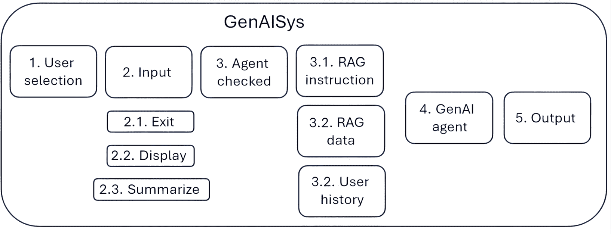

图 4.4：总结本章构建和组装的组件

由于 GenAISys 内的功能是事件驱动的，用户（人类或系统）或一组用户可以利用这个框架来解决多个跨领域任务。该系统以人为中心，在人类和生成式 AI 代理之间创造一个协作、无摩擦的环境。重要的是，在这个框架中人类和 AI 之间没有竞争。团队可以在使用 GenAISys 来提升他们的表现和生产力的同时，与同事保持人类社交关系。这种以人为中心的方法是我几十年来一直倡导的，为全球公司、中型企业和小型组织提供 AI 驱动的自动化解决方案。当团队将 AI 视为协作工具而不是竞争对手时，它营造了一种积极的环境，从而迅速取得胜利——展示了团队合作和技术结合的有效性。

如果我们深入探讨 GenAISys 框架在团队合作场景中的应用，我们可以建立几个在现实世界项目中通常需要的根本事件序列：

1.  用户选择 => 输入 => 代理检查 => RAG 指令 => GenAI 代理 => 输出

1.  用户选择 => 输入 => 代理检查 => RAG 数据 => GenAI 代理 => 输出

1.  用户选择 => 输入 => 代理检查 => 用户历史 => GenAI 代理 => 输出

1.  用户选择 => 输入 => 代理检查 => 无用户历史 => GenAI 代理 => 输出

1.  用户选择 => 输入 => 代理未检查 => 输出

这些基本序列构成了一组序列，`S`：

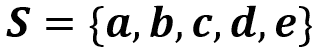

为了实现单个用户或一组用户的目标，序列可以组装如下：

+   {a, b}: 使用 RAG 进行情感分析，随后检索过去会议的情景记忆。

+   {d, e}: 运行 OpenAI API 请求，然后为其他用户发表评论。在这个案例中的新意在于，AI 代理在团队中仍然是一个同事，有时它不会表达自己，让团队思考它提出的想法。

这些序列可以根据具体任务和场景的需要排列成更长的会话流程。因为序列可以重复，所以我们有无限多的可能动态组合。例如，这里是对这种灵活性的一瞥：

+   三人小组，例如 {a, c, e}, {b, d, e}, {a, b, c}

+   四人小组，例如 {a, b, c, d}, {b, c, d, e}, {a, c, d, e}

+   五人小组，例如 {a, b, c, d, e}

我们可以向这些序列添加退出会话和总结，以及重新加载保存的文件并继续会话。还可以有重复的集合、不同用户的集合以及具有更多功能的集合。在接下来的章节中，我们将添加新的功能，包括图像生成、音频、网络搜索和机器学习，这将扩大我们构建的 GenAISys 框架的范围。

然而，在本节中，我们将以简单的顺序运行两个用户的会话。然后，我们将运行具有多个用户和一些基本序列的场景。让我们从简单的事件序列开始。

## 两个用户的会话

在这个示例会话中，两个用户合作构思他们可以向在线旅游网站客户推荐的吸引人的旅游目的地。我们首先运行一个界面会话，然后显示对话历史，最后总结讨论。要开始会话，打开`Event-driven_GenAISys_framework.ipynb`并运行这些单元格部分：

+   **设置环境**：运行所有单元格

+   **会话代理**：运行单个单元格

+   **在 GenAISys IPython 接口运行界面**：这将初始化对话

由于生成式 AI 模型的随机性，输出可能会在每次执行时略有不同。同样，在质量控制期间多次运行，因此本笔记本与打印章节之间可能存在细微差异。

对话初始化后，现在让我们运行交互式会话。

### 交互式对话

对话默认从`User01`开始，显示输入框和激活的代理复选框。在此场景中触发的事件和函数序列如*图 4.5*所示。

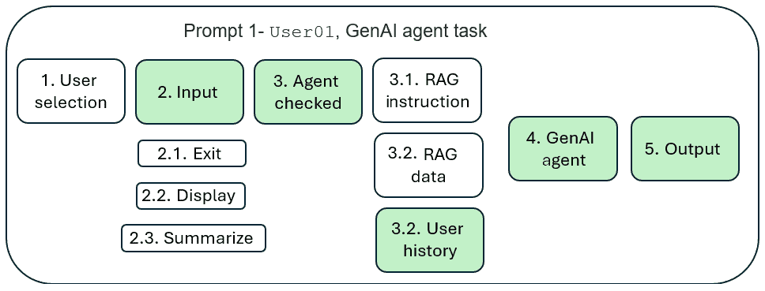

图 4.5：GenAI 代理使用用户的历史记录执行任务

流程遵循以下顺序：

用户选择 => 输入 => 代理检查 => 用户历史记录 => GenAI 代理 => 输出

对于用户来说，这个过程无缝衔接，如*图 4.6*所示。然而，为了产生这种平滑的效果，需要仔细设计和开发底层功能。


图 4.6：带有 GenAI 代理复选框的 UI

从用户的角度来看，这个过程很简单。`User01` 在输入框中输入提示：`法国的首都是什么？`。

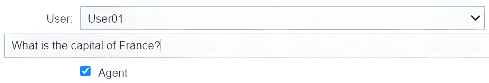

图 4.7：用户输入简单提示

输出将显示在输入小部件上方，如下所示：

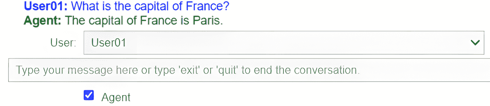

图 4.8：输出显示在输入框上方

到目前为止，即使是没有经过训练的用户也可以直观地使用一页文档中提供的基本信息运行 GenAISys。`User01` 继续提出后续问题：

```py
`User01:` What is there to visit? 
```

由于在对话代理中用户历史选项设置为 `True`，代理知道问题关于巴黎，并提供了一些值得参观的标志性地点的信息：

```py
**Agent:** The capital of France is Paris. There are numerous attractions to visit in Paris, including: 1\. **Eiffel Tower** - An iconic symbol of Paris, offering stunning views of the city. 2\. **Louvre Museum** - The world's largest art museum, home to the Mona Lisa… 
```

`User02` 现在通过在下拉菜单中选择 **User02**，如 *图 4.9* 所示，进入对话。**User02** 然后询问西班牙的首都是哪里，代理进行了回答，输出显示在输入框上方。

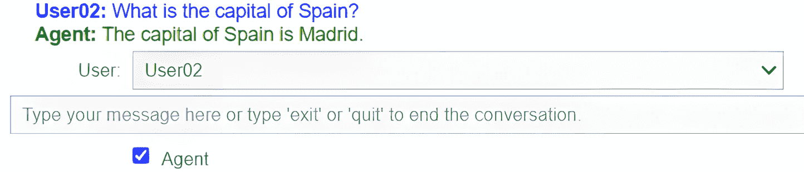

图 4.9：输入：另一个用户可以进入对话

到目前为止，GenAISys 核心框架已经设置好，我们将在后续章节中通过解决诸如安全性、用户访问控制和数据隐私等特性来逐步增强它。`User02` 进一步询问值得参观的地方。代理正确响应，因为用户历史选项已被激活：

```py
**User02:** What is there to visit? 
```

```py
**Agent:** The capital of Spain is Madrid. There are many attractions to visit in Madrid, including: 1\. **The Royal Palace of Madrid** - The official residence of the Spanish royal family, although it is now used only for state ceremonies. 2\. **Prado Museum** … 
```

现在，一个关键特性开始发挥作用。`User02` 如 *图 4.10* 所示，停用了 AI 代理，并直接对 `User01` 进行了交流，类似于社交媒体或远程协作平台上的互动。

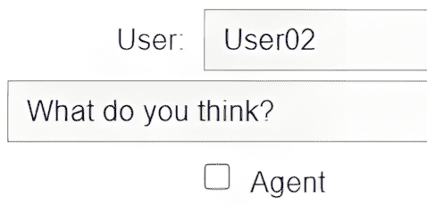

图 4.10：没有 AI 代理的团队直接沟通

`User01` 非正式地回应：“是的，这是个好主意，但让我们再考虑一下。”随后，`User01` 通过输入 `exit` 来结束会话。正如 *图 4.11* 所示，这种能力使我们的 GenAISys 在本书将要探讨的使用案例中达到了一个新的水平，例如以下配置：

+   用户可以单独与 GenAISys 进行一对一的对话

+   团队可以一起工作，通过 AI 代理作为合作者来提高他们的表现

+   当人类管理者不可用时，用户可以是来自不同地点的 AI 代理，扮演管理者的角色

+   用户可以是向人类用户提供实时信息的系统

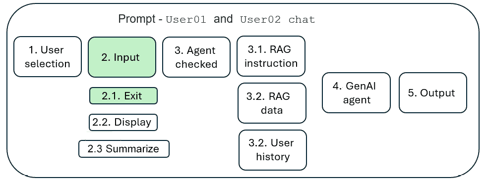

图 4.11：团队直接沟通然后结束会话

退出时，会话结束，对话历史保存到 `conversation_history.json` 文件中：


图 4.12：保存并结束对话

就像这个框架中的所有其他功能一样，退出行为可以根据个别项目进行定制。以下是一些例子：

+   对话历史可以保存也可以不保存

+   只能保存对话历史的一部分

+   保存的对话历史文件名可以包含时间戳

+   选择“…转到下一个单元格”是可选的

这些是为每个用例做出的决策。它们不会修改 GenAISys 的整体框架，但允许高度定制。

在这种情况下，团队希望显示他们刚刚进行的对话。

### 加载和显示对话

这个函数的代码是一个标准的 IPython 显示函数，用于将 JSON 文件`conversation_history.json`转换为 Markdown 格式。我们首先检查会话历史参数和/或摘要参数是否已激活：

```py
`display_conversation_history=True`
`summary=True` 
```

在这种情况下，会话历史和摘要函数都已激活。现在，我们将检查是否存在会话历史文件：

```py
import json
from IPython.display import display, Markdown
import os
if display_conversation_history == True or summary==True:
    # File path
    file_path = 'conversation_history.json'
    # Check if the file exists
    if os.path.exists(file_path):
        display_conversation_history=True
        summary=True
        print(f"The file '{file_path}' exists.")
    else:
        display_conversation_history=False
        summary=False
        print(f"The file '{file_path}' does not exist.")
        print("The conversation history will not be processed.") 
```

如果存在文件，`display_conversation_history`将被设置为`True`和`summary=True`（即使之前设置为`False`）。将显示一条消息，表明文件存在：

```py
The file 'conversation_history.json' exists. 
```

如果`display_conversation_history==True`，则将显示会话：

```py
# Display option
if display_conversation_history==True:
  # File path
  file_path = 'conversation_history.json'
  # Open the file and read its content into the 'dialog' variable
  with open(file_path, 'r', encoding='utf-8') as file:
      dialog = json.load(file)  # Parse JSON content
…
# Function to format JSON content as markdown
def format_json_as_markdown(data, level=0):
    html_output = ""
    indent = "  " * level
…
return html_output
# Format the JSON into markdown
formatted_markdown = format_json_as_markdown(dialog)
# Display formatted JSON as Markdown
display(Markdown(formatted_markdown)) 
```

输出格式良好：

```py
…
**User01**:
**role**:
user
**content**:
What is the capital of France?
**role**:
assistant
**content**:
The capital of France is Paris.
…
**Content**:
The capital of Spain is Madrid.
**role**:
user
**content**:
What is there to visit?
**role**:
assistant
**content**:
The capital of Spain is Madrid. There are many attractions to visit in Madrid, including:
**The Royal Palace of Madrid** – … 
```

团队已经显示了会话，但希望将过程进一步深入，并总结包括 AI 代理作为参与者的在线会议。

### 加载和总结会话

我们正在总结的会话展示了如何将 AI 代理融入现有的人类团队以提升生产力。在某些情况下，GenAISys 将独立完成自动化任务。在其他情况下，GenAISys 将成为一个或多个用户的副驾驶。在其他情况下，在组织的许多关键时刻，人类和 AI 代理的团队将能够一起工作来做出决策。

在本节中，我们将要求 AI 代理总结会话。我们将在接下来的章节中将此功能集成到 GenAISys 中作为一个函数。目前，我们将在显示会话后单独运行它，如图*4.13*所示。

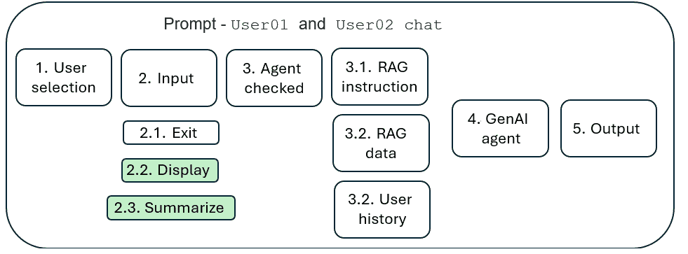

图 4.13：显示和总结会话

代码首先以显示函数中的方式加载`conversation_history.json`文件。然后，我们定义一个函数，将会话历史内容转换为 OpenAI API 的最佳格式：

```py
# Function to construct dialog string from the JSON conversation history
def construct_dialog_for_summary(conversation_history_json):
    dialog = ""
    for user, messages in conversation_history_json.items():
        dialog += f"\n{user}:\n"
        for message in messages:
            role = message["role"]
            content = message["content"]
            dialog += f"- {role}: {content}\n"
    return dialog 
```

构建完整会话历史的函数被调用：

```py
# Construct the full dialog from the JSON history
formatted_dialog = construct_dialog_for_summary(conversation_history_json) 
```

现在，我们准备为系统构建的定制 GenAISys API 调用准备完整消息，并在我们笔记本的*设置环境*部分的*OpenAI*子部分中导入：

```py
# Task to summarize the conversation
mrole = "system"
mcontent = "Your task is to read this JSON formatted text and summarize it."
user_role = "user"
task = f"Read this JSON formatted text and make a very detailed summary of it with a list of actions:\n{formatted_dialog}" 
```

最后，我们调用 GenAISys OpenAI 函数：

```py
# The make_openai_api_call function is called
task_response = openai_api.make_openai_api_call(
    task, mrole, mcontent, user_role
) 
```

将以 Markdown 格式显示 API 响应代码：

```py
from IPython.display import Markdown, display
# Display the task response as Markdown
display(Markdown(task_response)) 
```

现在，一切准备就绪。如果`summary==True`，我们可以调用摘要函数：

```py
if summary==True:
    # File path to the JSON file
    file_path = '/content/conversation_history.json'
    # Check if the file exists before calling the function
    if os.path.exists(file_path):
        summarize_conversation(file_path)
    else:
        print(f"File '{file_path}' does not exist. Please provide a valid file path.") 
```

注意，在 Google Colab 中，`/content/`是默认目录。因此，以下文件路径指向相同的目录：

```py
 file_path = ‘/content/conversation_history.json’ or
 file_path = ‘conversation_history.json’ 
```

在另一个环境中，你可能需要绝对路径。

输出是一个包含简介和详细摘要的会话历史摘要。可以修改此摘要的提示以请求更短或更长的长度。我们还可以设计一个提示，要求生成式 AI 模型针对会话的一部分或为特定项目设计任何其他特定提示。在这种情况下，输出是令人满意的：

```py
The JSON formatted text contains interactions between users and an assistant, where users inquire about the capitals of France and Spain and seek recommendations for attractions to visit in these cities. Below is a detailed summary with a list of actions:
**User01 Interaction:**
**1\. Question about the Capital of France:**
    User01 asks for the capital of France.
    The assistant responds that the capital of France is Paris.
**2\. Inquiry about Attractions in Paris:**
    User01 asks what there is to visit in Paris.
    The assistant provides a list of notable attractions in Paris:
 **1\. Eiffel Tower** - Iconic symbol and must-visit landmark.
 **2\. Louvre Museum** - Largest art museum, home to the Mona Lisa…. 
```

通过运行许多可能的任务和事件序列，我们看到了 GenAISys 给我们的灵活性。让我们运行一个更复杂的多人会话。

## 多用户会话

在本节中，我们将运行一个技术会话，激活我们在前几章和本章中构建的主要功能：

+   语义和情感分析

+   用于情节记忆检索的 RAG

+   没有 AI 对话代理的对话

+   加载、显示和总结对话历史

如果你没有中断之前的会话，那么只需在我们的笔记本中再次运行 *在 GenAISys IPython 接口运行界面部分* 单元格即可，这将启动一个新的对话。

如果你是从零开始，那么要开始会话，请打开 `Event-driven_GenAISys_framework.ipynb` 并运行以下单元格部分：

+   设置环境：所有单元格

+   对话代理：包含一个单元格

+   在 GenAISys IPython 接口运行界面：将启动对话

我们准备探索 GenAISys 的一些高级功能。我们将突出显示每个提示触发的事件和函数。会话的第一个序列是语义和情感分析。

### 语义和情感分析

要执行语义和情感分析，我们需要运行 GenAISys 如 *图 4.14* 所示编排的以下序列：

+   **1. 用户选择** 未激活，因为 `User01` 是会话开始时的默认用户。如果我们愿意，可以根据用例称此用户为“主机”。

+   `User01` 在 **2. 输入** 触发 **3. 代理检查**，这是会话开始时的默认值。

+   AI 对话 AI 控制器接管，解析提示，在提示中找到 `Pinecone` 关键词，在指令场景命名空间中触发 Pinecone 查询，增强提示，并触发 **4. GenAI 代理**。

+   **4. GenAI 代理** 触发对 GPT-4o 的 API 调用并返回响应。

+   **5. 输出** 触发显示的更新。系统已准备好接受新的输入。

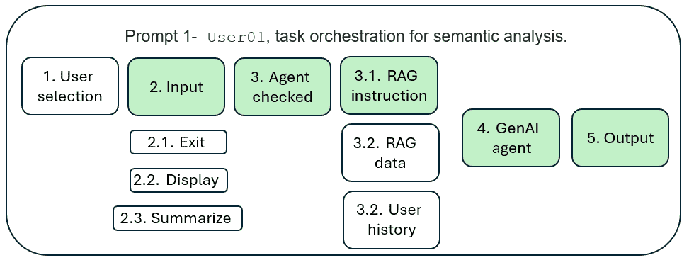

图 4.14：执行语义和语义分析的的事件和函数序列

触发此序列的函数和事件的提示如下：

```py
A customer said that our travel agency was pretty good but should have more activities. Let's ask Pinecone for ideas. 
```

生成式 AI 控制器正确地将 `Pinecone` 识别为查询指令场景命名空间的触发器，GPT-4o 使用它来生成令人满意的响应：

```py
**Agent:** genaisys:To enhance your travel agency's offerings based on the customer's feedback, … 3\. **Gather Data**: Collect data from various sources such as travel blogs, customer reviews, social media, and travel forums. This data can be used to train or query your semantic search model. 4\. **Generate Ideas**: Use the results from the semantic search to generate a list of potential activities. For example, if you're looking to expand adventure activities, the search might suggest zip-lining, rock climbing, or guided hiking tours…. 
```

注意，AI 代理以 `genaisys` 开头开始响应，这表明已查询了正确的命名空间。这是一个可选的质量控制功能，在开发 GenAISys 时实施是良好的实践。

如 *图 4.15* 所示的提示 2 情感分析序列与语义分析序列相同，但有两个区别：

+   由于 `User02` 被选中，**1. 用户选择**事件被激活。

+   提示将包含对情感分析的暗示。

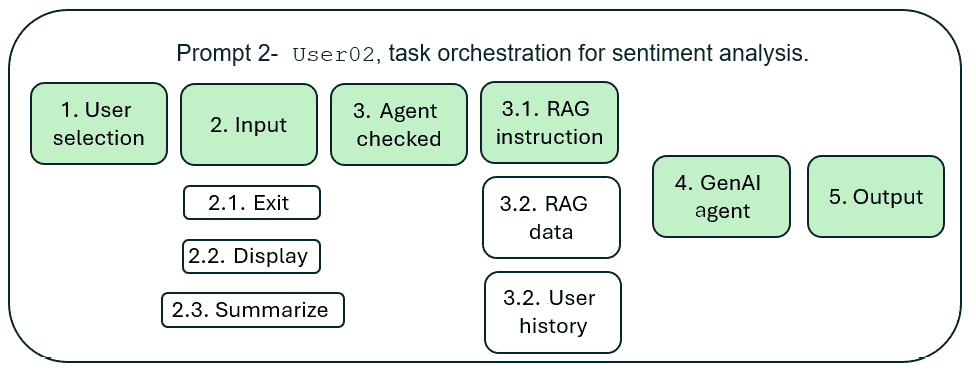

图 4.15：情感分析的任务编排

提示包含 `Pinecone` 关键字以激活 Pinecone 查询，以及表示相似性搜索的单词`sentiment`。

```py
`A customer said that our travel agency was worse than our competition and should have better service. Let's ask Pinecone what its sentiment is.` 
```

我们可以为所有请求的任务添加一个明确的下拉列表，我们将在某些情况下这样做。但在这个案例中，我们依赖于隐式关键字搜索。显式（在下拉列表中选择任务等）和隐式（使用关键字或依赖于提示内容）之间的平衡应在与用户的研讨会中决定。

在这种情况下，选择了 `Pinecone` 关键字 `genaisys` 命名空间，输出令人满意：

```py
**Agent:** genaisys:Sentiment analysis score: 0.2 Explanation: The text expresses a negative sentiment towards the travel agency. The customer explicitly states that the agency is "worse than our competition" and suggests that it "should have better service." These statements indicate dissatisfaction and a negative comparison to competitors, which justifies a low sentiment score. 
```

会话继续触发情景记忆检索。

### RAG 用于情景记忆检索

情景记忆检索的序列将在 Pinecone 索引中搜索团队成员的个人记忆。该记忆与保存并更新到 `data01` 命名空间中的 Pinecone 索引的过去会议相关。`User03` 将触发以下函数和事件序列，如图 4.16 所示：

+   **1. 用户选择**独立触发，因为用户已更改。

+   **2. 输入**触发**3. 代理检查**的验证。

+   **3. 代理检查**触发对话式 AI 代理控制器，该控制器随后触发基于提示中的 `RAG` 关键字的 `data01` 命名空间中的**3.2. RAG 数据**检索。

+   最后，生成式 AI 代理 GPT-4o 使用增强输入运行请求并返回输出。

+   **4. 输出**将触发显示更新，系统准备进行对话的新一轮。

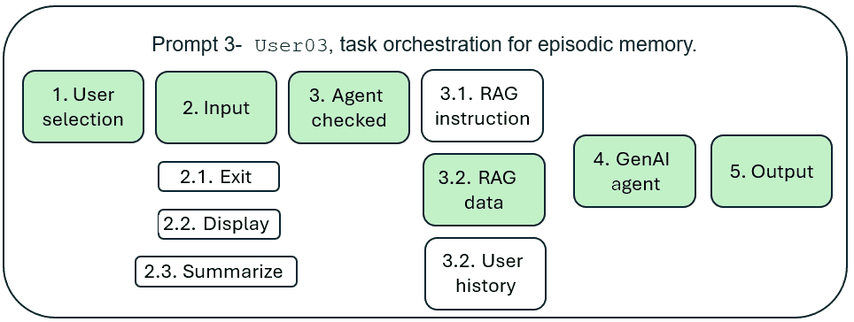

图 4.16：情景记忆检索

提示明确指代与团队个人经历相关的历史事件。此事件的痕迹是存储在 Pinecone 索引中的情景记忆：

```py
The CTO was talking about leveraging different kind of memories the other day. What did he mean by that? Let's search RAG. 
```

代理的响应令人满意：

```py
**Agent:** data01:RAG, or Retrieval-Augmented Generation, is a framework that combines retrieval-based methods with generative models to enhance the capabilities of AI systems. When your CTO mentioned leveraging different kinds of memories, they were likely referring to the various ways in which information can be stored, accessed, and utilized within such a system. Here are some types of "memories" that might be relevant in this context: 1\. **Short-term Memory**: 
```

我们可以看到代理正确找到了命名空间，并且使用了短语“你的 CTO 提到”，认识到这是一个与团队个人经历相关的事件，而不是非个人语义数据。

会话继续进行创意活动。

### 生成式 AI 代理用于创意

会话继续进行创意活动。在这种情况下，我们希望利用生成式 AI 模型 GPT-4o 的力量，以获得想法。因此，序列将不会使用 Pinecone 索引检索指令或数据，如图 4.17 所示：

+   用户保持不变，**2. 输入**直接进入**3. 代理检查**。

+   系统随后忽略 Pinecone 索引，但考虑**3.2. 用户历史**。

+   最后，**4. GenAI 代理**触发生成式 AI 调用并返回输出。

+   **5. 输出** 触发显示更新，系统准备进行另一轮对话。

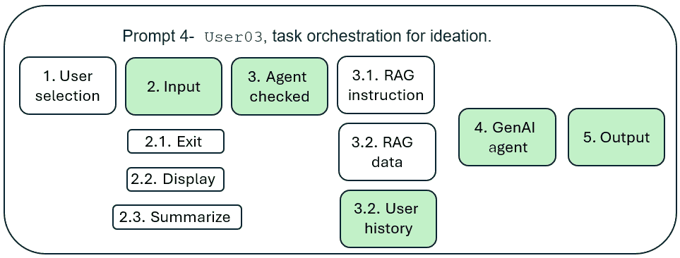

图 4.17：GenAISys 作为创意生成器

提示要求 AI 代理提供一些想法：

```py
But what do you, the AI Agent, suggest we do to leverage these types of memories in our traveling promotion campaigns? 
```

由于 AI 代理继承了情景记忆，它引用了对话历史中 CTO 的反思，现在它根据对话的历史给出建议：

```py
When the CTO mentioned leveraging different kinds of memories, they were likely referring to the concept of using various types of memory systems in artificial intelligence and computing to enhance performance and capabilities.…
…consider the following strategies: 1\. **Personalized Recommendations**: Use short-term and long-term memory to analyze customer preferences and past interactions to provide personalized travel recommendations and offers. 2\. **Dynamic Content**: Utilize episodic memory to tailor marketing content based on past customer interactions and experiences, making the promotions more relevant and engaging. … 
```

GenAISys 为团队提供了想法。现在，团队希望仔细考虑这些想法。

### 没有 AI 对话代理的对话

团队已经进行了一次简短的对话，他们本可以继续对话直到他们需要停止。`User01` 接管并直接与团队沟通。现在，GenAISys 被用作协作远程会议工具，如图 *图 4.18* 所示：

1.  用户选择被触发，因为 `User01` 正在介入。

1.  `User01` 取消了 **代理** 小部件的勾选。

1.  输入了一条消息，但提示是针对其他用户，而不是 AI 代理

1.  然后，`User01` 结束对话，并将其保存。

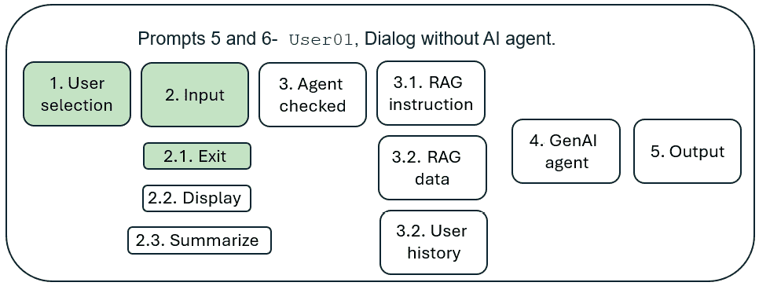

图 4.18：没有 AI 代理的对话

`User01` 为其他人输入了一条消息：

```py
OK. Let's stop here, get a summary, and go see the manager to get some green lights to move ahead. 
```

*图 4.19* 显示 `User01` 取消了 AI 代理的勾选以发送消息，现在准备通过输入 `exit` 来结束会话。

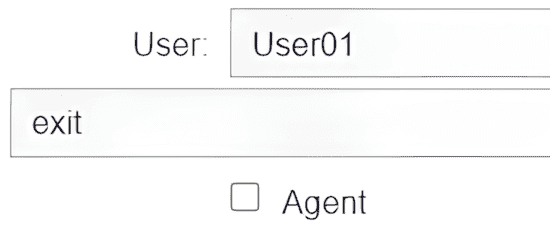

图 4.19：用户结束对话

GenAISys 显示了 *对话结束* 的消息，如图 *图 4.20* 所示。


图 4.20：对话结束

**快速提示**：需要查看此图像的高分辨率版本？在下一代 Packt Reader 中打开此书或在其 PDF/ePub 版本中查看。

**下一代 Packt Reader** 在购买本书时免费赠送。扫描二维码 OR 前往 [packtpub.com/unlock](http://packtpub.com/unlock)，然后使用搜索栏通过名称查找本书。请仔细检查显示的版本，以确保您获得正确的版本。


消息指示用户继续到下一个单元格以显示和总结对话。

### 加载、显示和总结对话

对话的显示和总结将集成到 GenAISys 框架的 *第五章* 功能中，*通过思维链添加多模态、多功能推理*。

在本笔记本中，我们将按照 *与两位用户会话* 部分所述继续进行下一单元格。

显示函数的输出提供了对话的 Markdown 文本：

```py
…assistant
**content**:
When the CTO mentioned leveraging different kinds of memories, they were likely referring to the concept of…
**Episodic Memory**: This involves storing information about specific events or experiences. In AI, episodic memory can be used to recall past interactions or events to inform future decisions…
…To leverage these types of memories in your travel promotion campaigns, consider the following strategies:
**Personalized Recommendations**: Use short-term and long-term memory to analyze customer preferences and past interactions to provide personalized travel recommendations and offers.
**Dynamic Content**: Utilize episodic memory to tailor marketing content based on past customer interactions and experiences, making the promotions more relevant and engaging….
The summary is interesting because it provides useful suggestions for this online travel agency:
**AI Suggestion for Travel Promotion**:
**1.Personalized Recommendations**: Use short-term and long-term memory for personalized travel offers.
**2.Dynamic Content**: Utilize episodic memory for tailored marketing content.
**3.Knowledge-Based Insights**: Leverage semantic memory for travel tips and destination information.
**4.Real-Time Engagement**: Use working memory for real-time customer interactions.
**5.Feedback and Improvement**: Implement long-term memory systems to analyze feedback and improve campaigns. 
```

我们构建了将在下一章中增强的 GenAISys 框架的基本结构。我们还进行了一些基本的对话。让我们总结本章，并提升到下一个层次。

# 摘要

一个复杂、事件驱动、快速发展的经济体需要强大的自动化来处理即时消费者需求产生的数百个任务。GenAISys 可以通过响应式界面和生成式 AI 能力来满足这些需求。挑战在于提供一个动态、直观的系统。无论生成式 AI 如何自动化任务——它们可以非常自动化——最终的决定将由人类做出。人类需要在会议中沟通，无论这些会议是物理组织还是在线组织。挑战随后转变为向组织提供多用户 GenAISys。

在本章中，我们首先探索了一个高级框架来构建多用户、多轮次、多功能和 RAG 功能。该框架包括实时记忆功能和存储在向量存储中的长期知识。整体上，类似于 ChatGPT 的系统需要一个我们将增强的响应界面和对话代理。

我们随后使用 IPython 构建了一个事件驱动的 GenAISys 响应界面。对于最终用户来说，这个界面是无缝的，他们可以使用三个小部件来使用系统。第一个小部件管理用户的输入，第二个小部件是活跃用户，第三个小部件是一个代理复选框，用于激活或停用使用 GPT-4o 构建的 AI 对话代理。

最后，我们为在线旅行社团队进行了一次多用户、多轮次的 GenAISys 会话，主题是旅行。第一个目标是运行一个无缝的 GenAISys，为用户提供三个小部件。第二个目标是探索短期、长期、语义和情景记忆的范围。第三个目标是运行 RAG 来检索指令和数据。最后，目标是让用户能够与或没有 AI 代理进行交流。我们通过保存和总结会话来结束这次会话。

我们现在有一个框架，我们可以在接下来的章节中进行配置和增强，首先是在*第五章*中添加多模态功能和外部扩展到 GenAISys，即《通过思维链添加多模态、多功能推理》。

# 问题

1.  GenAISys 的界面必须对用户无缝。（对或错）

1.  IPython 是构建 GenAISys 界面的唯一工具。（对或错）

1.  使用 GPT-4o 构建的 AI 对话代理必须通过 RAG 进行增强。（对或错）。

1.  GPT-4o 可以提供足够的信息并很好地完成任务。（对或错）

1.  Pinecone 可以用于检索指令场景。（对或错）

1.  命名空间仅用于 Pinecone 中的数据。（对或错）

1.  向量存储如 Pinecone 是存储情景记忆的好方法。（对或错）

1.  我们不需要代理复选框选项。（对或错）

1.  在 GenAISys 中，查询 Pinecone 是由用户完成的。（对或错）

1.  GenAISys 是一个对用户来说应该无缝对接的复杂系统。（对或错）

# 参考文献

+   IPython 文档：[`ipython.org/`](https://ipython.org/)

+   OpenAI 多轮对话：[`platform.openai.com/docs/guides/audio/multi-turn-conversations/`](https://platform.openai.com/docs/guides/audio/multi-turn-conversations/)

+   Google Colab 功能：[`colab.research.google.com/`](https://colab.research.google.com/)

# 进一步阅读

+   刘，J.，谭，Y. K.，傅，B.，与林，K. H.（n.d.）.*在生成式对话系统中平衡多轮意图分类的准确性和效率：针对 LLM 的生产系统*：[`arxiv.org/abs/2411.12307`](https://arxiv.org/abs/2411.12307)

# 免费电子书订阅

新框架、演进的架构、研究更新、生产分析——*AI_Distilled* 将噪音过滤成每周简报，供实际操作 LLM 和 GenAI 系统的工程师和研究人员阅读。现在订阅，即可获得免费电子书，以及每周的洞察力，帮助您保持专注并获取信息。

在 `packt.link/TRO5B` 订阅或扫描下面的二维码。


