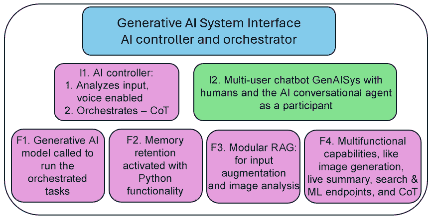
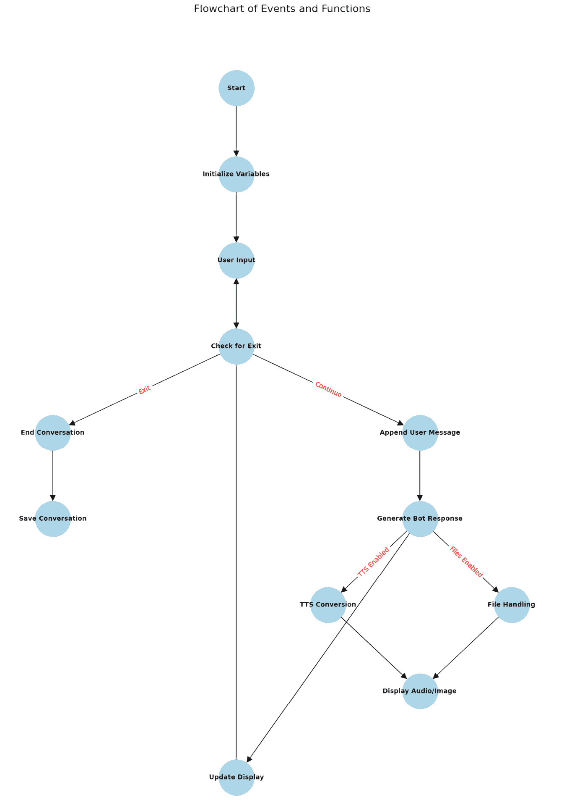
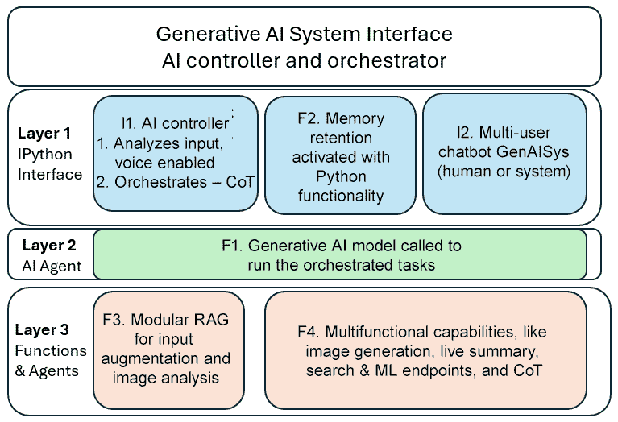
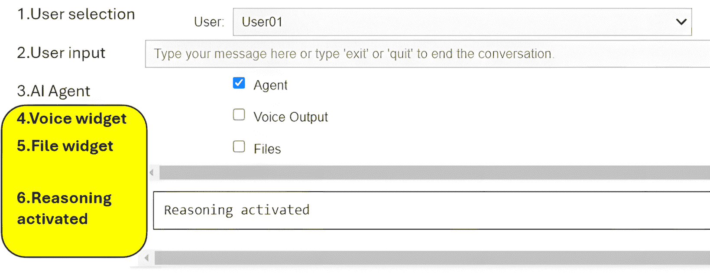
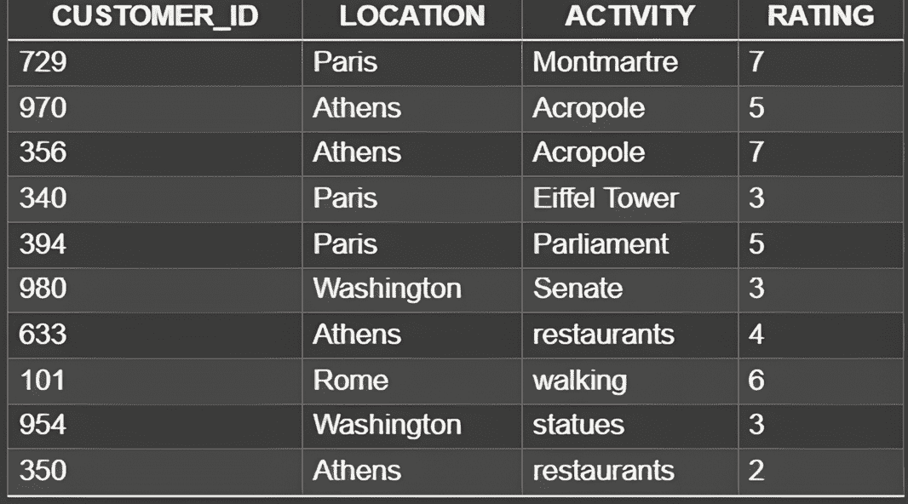
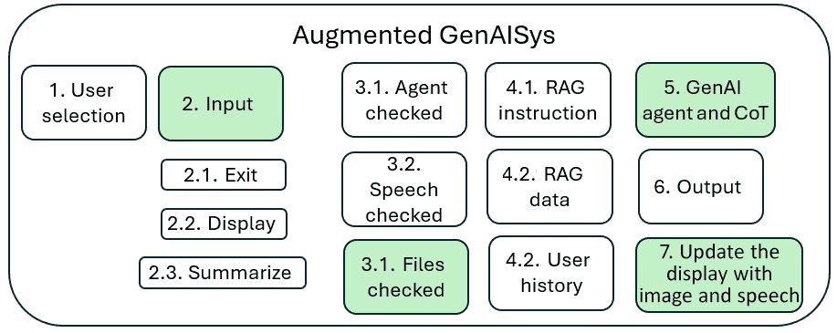
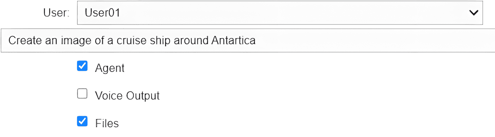
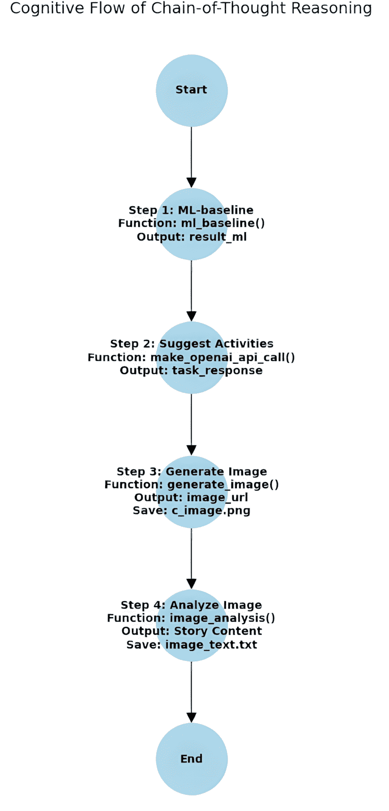

# 第五章：添加基于思维链的多模态、多功能推理

在我们旅程的这个阶段，我们已经构建了 GenAISys 的核心框架。我们有一个响应式的、小规模的、类似 ChatGPT 的交互界面。我们超越了典型的点对点协同助手交互，创造了一个多用户协作环境，其中人工智能代理积极参与讨论。我们通过集成 RAG 进一步扩展了以人为中心的设计，使我们的 AI 代理能够访问一个能够管理指令场景和数据的 Pinecone 索引。最后，我们构建了一个灵活的 GenAISys，允许用户在协作会议期间激活或停用 AI 代理。简而言之，我们创造了一个以人为中心的 AI 系统，它增强而不是试图用机器智能取代人类团队。

然而，尽管其以人为中心的特点，全球跨大陆供应链的指数级增长以及大量日常商品、服务和数字内容的流动，需要显著程度的自动化。例如，我们无法合理地期望像 Meta、X 或 LinkedIn 这样的社交媒体平台每天雇佣数百万人来审核数十亿条消息——包括图像、音频和视频文件。同样，像亚马逊这样的公司不能仅通过人力来管理数百万在线交易和实物配送。自动化对于增强人类决策和推理至关重要，尤其是在大规模的关键任务中。因此，在本章中，我们将通过添加多模态能力和推理功能来扩展 GenAISys 框架。为了解决跨领域自动化的挑战，我们将实施图像生成和分析，并开始集成机器学习。我们的目标是构建一个新的代理人工智能层到我们的 GenAISys 中。

我们将首先概述我们将集成到现有 GenAISys 框架中的功能。鉴于 GenAISys 范围的扩大，我们将引入**思维链（CoT**）推理过程，以有效地编排和管理复杂任务。然后，我们将引入计算机视觉能力。这包括使用 DALL-E 构建图像生成功能和使用 GPT-4o 进行图像分析功能。接下来，我们将为偏好语音交互的用户添加音频功能——使用**语音转文本（STT**）作为输入提示和**文本转语音（TTS**）作为响应。最后，我们将在 GenAISys 中引入一个决策树分类器，作为机器学习端点，能够预测活动。到本章结束时，我们将成功将 GenAISys 扩展为一个完全交互的多模态推理平台，准备好应对复杂的跨领域用例。

总的来说，本章涵盖了以下主题：

+   为我们的 GenAISys 添加附加功能架构

+   实现小部件图像文件处理

+   实现小部件以启用语音对话

+   使用 DALL-E 进行图像生成

+   使用 GPT-4o 进行图像分析

+   建立决策树分类器的机器学习端点

+   实施 CoT 推理

让我们从为我们的 GenAISys 设计一个具有额外 AI 能力的增强界面开始。

# 增强事件驱动的 GenAISys 界面

到目前为止，我们开发的 GenAISys 框架是事件驱动的，由用户输入（人工或系统生成）触发特定 AI 代理功能激活。在本章中，我们将通过添加几个新功能来扩展 GenAISys：

+   **语音交互**，允许用户通过语音管理 GenAISys

+   使用决策树分类器进行预测任务的新**机器学习端点**

+   **多模态功能**，包括使用 DALL-E 进行图像生成和使用 GPT-4o 进行图像分析

+   一个用于协调复杂、自我反思指令场景的**CoT**推理协调器

让我们从检查*图 5.1*中显示的扩展 GenAISys 架构开始：



图 5.1：增强的 GenAISys 界面架构

此图（是前一章中*图 4.1*的扩展版本）突出了我们将集成到我们的 GenAISys 中的新功能：

+   **I1** – **AI 控制器**：通过 CoT 推理增强，能够根据需要自动执行任务序列，并包含一个用于管理基于语音的用户交互的小部件

+   **I2** – **多用户聊天机器人**：与之前章节中设计保持完全一致

+   **F1** – **生成式 AI 模型**：扩展以处理多模态任务

+   **F2** – **记忆保留**：与早期章节保持不变

+   **F3** – **模块化 RAG**：与早期章节保持不变

+   **F4** – **多功能能力**：新增涵盖音频和图像处理的功能，包括用于预测的决策树分类器

    **提醒**

    决定不使用箭头展示 GenAISys 架构的主要组件是一个旨在传达核心概念的故意选择：模块化和架构灵活性。此图不是一个刚性的蓝图，而是一个概念工具包。它展示了您可用的强大组件——**I1. AI 控制器**、**I2. 多用户聊天机器人**、**F1. 生成式 AI 模型**、**F2. 记忆保留**、**F3. 模块化 RAG**和**F4. 多功能能力**——作为独立、可互操作的块。

我们通过添加新层而不是替换现有组件来扩展 GenAISys 的功能，正如在*第四章*中构建的那样。我们在这里的重点是增强和无缝集成。以下图提供了一个高级流程图，展示了附加功能将如何集成到我们现有的 GenAISys 架构中：



图 5.2：GenAISys 附加功能的流程图

以下附加功能将集成到我们现有的 GenAISys 接口中：

+   **启动**：初始化两个新的小部件——一个用于 TTS 功能，另一个用于处理图像文件

+   **用户输入**：现在包括可选的语音输入，如果用户选择则启用

+   **生成机器人** 和 **生成机器人响应**：这些过程直接连接到现有的 `VBox` 接口，当 AI 代理使用 CoT 逻辑时，会清晰地显示推理步骤。

为了实现这一扩展功能，我们将开发以下关键特性：

+   **语音识别和语音合成**：集成使用 **Google Text-to-Speech** (**gTTS**)

+   **机器学习端点**：实现决策树分类器以提供预测能力

+   **图像生成和分析**：由 OpenAI 的 DALL-E 和 GPT-4o 模型提供支持

+   **CoT 推理**：协调任务、功能和扩展，从而为 GenAISys 提供明确的机器（而非人类）推理能力

虽然我们添加了包括推理功能（CoT）在内的几个新功能，但我们只引入了一个新的包安装，即 gTTS，以最小化本章的复杂性。我们主要关注构建一个可靠的架构，并实现最佳的依赖关系管理。首先，让我们探索 IPython 接口的更新元素和 AI 代理的增强。

## IPython 接口和 AI 代理增强

我们开发的 GenAISys 架构现在可以看作由三个相互连接的层组成，如 *图 5.3* 所示。这些增强模糊了协调、控制和代理功能之间的界限，因为这些角色现在分布在多个层中：

+   **第一层（IPython 接口）** 通过事件驱动的小部件管理用户和系统输入，根据用户交互（输入和复选框）协调任务。

+   **第二层（AI 代理）** 控制生成式 AI 模型（在我们的案例中是 OpenAI 模型）并可以触发 CoT 推理序列。

+   **第三层（功能和代理）** 包含由 AI 代理触发的功能。值得注意的是，CoT 功能本身作为一个代理，能够协调生成式 AI 任务、机器学习以及所需的其他功能。



图 5.3：事件驱动的 GenAISys 的三层结构

这种高级架构集成了协调器、控制器和代理，每个部分都分解为特定的 Python 功能。让我们从功能角度开始探索 **第一层**，即 IPython 接口。

### 第一层：IPython 接口

IPython 接口现在集成了三个新特性（在 *图 5.4* 中以黄色突出显示）：一个语音小部件、一个文件处理小部件以及由用户输入和 AI 代理活动触发的专用推理接口。这些增强使得接口总共有六个交互式小部件和功能。



图 5.4：将语音、文件和推理功能添加到 IPython 界面

让我们逐一查看每个小部件和功能：

1.  **用户选择**在*第四章*中按原设计保留。它是 GenAISys 协作设计的关键，且保持不变。

1.  **用户输入**未经修改地保留自*第四章*；此小部件仍然是捕获用户提示的中心。

1.  如*第四章*所述，**AI 代理**激活或停用生成式 AI 代理（`chat_with_gpt`）。

1.  **语音小部件**通过 STT 和 TTS 实现基于语音的交互。我们使用的是免费的内置 STT 功能：

    +   **Windows**：按 Windows 键 + *H*

    +   **macOS**：在**键盘设置**下启用**语音输入**并选择一个自定义快捷键

对于语音合成（TTS），使用的是 gTTS 服务，默认通过一个设置为`False`的复选框进行控制和利用：

```py
# Create a checkbox to toggle text-to-speech
tts_checkbox = Checkbox(
    value=False,
    description='Voice Output',
    layout=Layout(width='20%')
) 
```

如果 AI 代理的复选框被勾选，则调用 TTS 函数：

```py
if agent_checkbox.value:
…
if tts_checkbox.value:
            text_to_speech(response) 
```

生成的 MP3 文件（`response.mp3`）在`update_display()`函数中自动播放：

```py
def update_display():
…
#Audio display
    if os.path.exists("/content/response.mp3"):
      display(Audio("/content/response.mp3", autoplay=True))
      !rm /content/response.mp3 
```

1.  **文件小部件**是一个新的小部件，用于激活文件管理。它将显示在 AI 代理功能`chat_with_gpt`中触发的生成式 AI 模型（DALL-E）生成的和保存的图像。它通过另一个复选框进行控制，初始设置为`False`：

    ```py
    # Create a checkbox to toggle agent response
    files_checkbox = Checkbox(
        value=False,
        description='Files',
        layout=Layout(width='20%')
    ) 
    ```

如果存在图像，它将在`update_display()`函数中使用**Python 图像库**（**PIL**）显示：

```py
 if os.path.exists("/content/c_image.png") and files_checkbox.value==True:
    # Open the image using PIL
    original_image = PILImage.open("/content/c_image.png")
    # Resize the image to 50% of its original size
    new_size = (original_image.width //2, original_image.height//2)
    resized_image = original_image.resize(new_size)
    # Display the resized image
    display(resized_image) 
```

1.  **推理激活**是 GenAISys 的另一个新小部件。用户输入将触发 AI 代理中的事件，进而触发 CoT 推理过程。推理界面将实时显示 CoT 的思考过程。推理输出小部件在会话开始时创建：

    ```py
    # Create an output widget for reasoning steps
    reasoning_output = Output(
        layout=Layout(border="1px solid black", padding="10px",
            margin="10px", width="100%")
    ) 
    ```

该小部件将从 CoT 过程中接收输出，并在`update_display()`函数中独立显示，并持久化：

```py
def update_display():
…
# Display reasoning_output persistently
    display(reasoning_output)… 
```

`VBox`界面现在包含所有交互式小部件，包括新添加的 TTS 和文件小部件：

```py
if conversation_active:
        display(
            VBox(
                [user_selector, input_box, agent_checkbox,
                tts_checkbox, files_checkbox],
                layout=Layout(display='flex', flex_flow='column',
                    align_items='flex-start', width='100%')
            )
        ) 
```

由于 AI 代理（特别是在 CoT 过程中）的响应长度和复杂性，我们引入了使用 Markdown 的增强格式化功能。`update_display()`函数现在格式化条目清晰，调用专门的格式化函数：

```py
def update_display():
    clear_output(wait=True)
    for entry in user_histories[active_user]:
        formatted_entry = format_entry(entry)
        display(Markdown(formatted_entry)) 
```

`format_entry(entry)`函数格式化用户的（蓝色）和助手的（绿色）响应，确保可读性：

```py
def format_entry(entry):
    """Format the content of an entry for Markdown display."""
    if entry['role'] == 'user':
        formatted_content = format_json_as_markdown(entry['content'])
            if isinstance(entry['content'], (dict, list))
            else entry['content']
        formatted_content = formatted_content.replace("\n", "<br>")  # Process newlines outside the f-string
        return f"**<span style='color: blue;'>{active_user}:</span>** {formatted_content}"
…
    elif entry['role'] == 'assistant':
        formatted_content = format_json_as_markdown(entry['content'])
        …
        return f"**<span style='color: green;'>Agent:</span>** {formatted_content}" 
```

此设计强调 IPython 界面（**层 1**）纯粹是为了编排用户交互并触发底层函数和代理。这种架构确保了如果您想直接调用函数和代理而不使用用户界面，您将拥有所需的灵活性。

在描述了 IPython 界面后，让我们探索**层 2**，即 AI 代理的增强功能。

### 层 2：AI 代理

在**层 1**中由 IPython 接口调用的 AI 代理仍然是`chat_with_gpt`函数，这加强了 GenAISys 的对话性质。随着推理能力的引入，现在 AI 代理之间可以直接进行对话。

`chat_with_gpt`函数已添加了几个新功能。如有必要，请回顾第*第四章*中描述的核心功能。

让我们探索添加到 AI 代理中的新增强功能：

+   在函数开头引入了`continue_functions=True`，以确保一次只执行一个请求的任务。

+   在 Pinecone 查询过程的末尾将`continue_functions`设置为`False`，这是由用户消息中出现的`Pinecone`关键字触发的。这停止了任何额外的未预期任务执行。

+   在后续的*使用 CoT 进行推理*部分中描述的新功能`reason.chain_of_thought_reasoning`在特定条件下被调用：

    ```py
    if "Use reasoning" in user_message and "customer" in user_message and "activities" in user_message and continue_functions==True: 
    ```

`continue_functions==True`条件确保推理函数使用初始用户查询进行调用。作为此过程的一部分，还下载了一个样本客户活动文件：

```py
initial_query = user_message
download("Chapter05","customer_activities.csv")
reasoning_steps = reason.chain_of_thought_reasoning(initial_query) 
```

在本章的示例用例中，一个团队可以自动访问和查询一个定期更新的客户活动数据源。提供的样本文件包含 10,000 条历史客户活动记录，包括客户 ID、位置、活动类型和活动评分：



图 5.5：历史地点的客户评分

后续的决策树分类器在 CoT 推理函数中使用此数据集来预测最受欢迎的客户活动。一旦生成响应，它就被添加到输出中，并将`continue`设置为`False`：

```py
aug_output=reasoning_steps
continue_functions=False 
```

+   我们将在*图像生成和分析*部分中实现的`reason.generate_image`新功能也已集成。它的调用方式如下：

    ```py
    prompt = user_message
    image_url = reason.generate_image(prompt, model="dall-e-3", 
        size="1024x1024", quality="standard", n=1) 
    ```

返回生成的图像 URL，并将图像本身下载并保存在本地以供显示或进一步处理：

```py
# Save the image locally
save_path = "c_image.png"
image_data = requests.get(image_url).content
with open(save_path, "wb") as file:
    file.write(image_data) 
```

在输出中添加了相应的消息，并将`continue`标志设置为`False`：

```py
aug_output="Image created"
continue_functions=False 
```

+   之前称为`openai_api.make_openai_api_call`的函数现在重命名为`reason.make_openai_api_call`。它保持了与*第四章*中相同的函数性，但现在它是 GenAISys 推理库的一部分。内存管理`if user_memory…else`条件，该条件考虑了完整用户历史或仅考虑当前用户消息，已更新为具有显式条件，这些条件检查`user_memory`的状态和`continue_functions`标志：

    ```py
    if user_memory==False and continue_functions==True:    
    …
    if user_memory==True and continue_functions==True: … 
    ```

因此，AI 代理充当中间编排者，调用和管理低层函数的执行，而不是直接执行它们。Pinecone 接口仍然是顶层，它调用 AI 代理，AI 代理随后与**第 3 层**中的特定函数进行交互。

### 第 3 层：函数

在这一层，我们的重点是引入的新功能，通过 CoT 认知代理实现高级推理。Pinecone 索引和标准的 OpenAI 调用保持与*第四章*中实现的方式相同。本章的主要新增内容如下：

+   **使用 DALL-E 和 GPT-4o 进行图像生成和分析**

+   **CoT 推理**，它引入了一个能够编排任务的认知代理

+   **通过 gTTS 启用语音交互功能**

+   **利用决策树分类器的机器学习端点**

我们将在本章接下来的部分中探索这些功能，如下所示：

+   gTTS 和机器学习的环境设置和初始化在*设置环境*部分中详细说明

+   图像功能在*图像生成和分析*部分进行介绍

+   推理编排构建在*使用 CoT 进行推理*部分

到本章结束时，我们的增强型三层 GenAISys 将拥有新的、强大的功能，这些功能旨在在后续章节中进一步扩展。现在让我们深入探讨这些增强，从环境设置开始。

# 设置环境

在本节中，我们将增强、扩展和重新排列之前构建的环境，以最终确定 GenAISys 框架。这些更改对于后续章节中的用例至关重要。在 GitHub 的 Chapter05 目录中打开`Multimodal_reasoning_with_Chain_of_Thought.ipynb`笔记本([`github.com/Denis2054/Building-Business-Ready-Generative-AI-Systems/tree/main`](https://github.com/Denis2054/Building-Business-Ready-Generative-AI-Systems/tree/main))。

关于包安装，笔记本中的*设置环境*部分与上一章（`Event-driven_GenAISys_framework.ipynb`）基本保持不变，仅增加了一个新项：*Google Text-to-Speech (gTTS)*。

然而，为了支持 CoT 生成式 AI 推理功能，已经进行了几个重大更新。让我们逐一检查这些更新，从*OpenAI*部分开始。

## OpenAI

我们下载的前两个文件与之前章节相同。然而，第三和第四个文件是新的，已被添加以支持高级功能：

```py
from grequests import download
download("commons","requirements01.py")
download("commons","openai_setup.py")
**download(****"commons"****,****"reason.py"****)**
**download(****"commons","machine_learning.py")** 
```

`reason.py`现在包含生成式 AI 库，其中包含之前章节中构建的函数以及本章中添加的函数。生成式 AI 库中的这些函数及其状态如下：

+   `make_openai_api_call(input, mrole,mcontent,user_role)` 是在 *第一章* 的 *设置环境* 部分描述的通用 OpenAI API 调用。现在它如下导入：

    ```py
    from reason import make_openai_api_call 
    ```

+   `image_analysis` 是一个图像分析函数，它可以描述图像或使用图像作为起点生成内容，如故事。该函数在本章的 *图像生成和分析* 部分有描述。

+   `generate_image` 是一个新函数，它使用 DALL-E 生成图像，在本章的 *图像生成和分析* 部分有详细说明。

+   `chain_of_thought_reasoning` 是我们正在构建的 GenAISys 的新 CoT 逻辑函数。我们将在本章的 *使用 CoT 进行推理* 部分实现它。它可以调用来自其他库的函数，例如 `machine_learning`。

`machine_learning.py` 现在将包含一个名为 `ml_agent` 的函数中的决策树分类器。该函数接受两个参数：

```py
ml_agent(ml_agent(feature1_value, feature2_column) 
```

在我们的示例用例中，`feature1_value` 将代表客户位置，而 `feature2_column` 将代表客户活动。基于历史数据，`ml_agent` 分类器将预测特定位置的最受欢迎的客户活动。

我们如下从 `machine_learning.py` 导入 `ml_agent`：

```py
# Import the function from a custom machine learning file
import os
import machine_learning
from machine_learning import ml_agent 
```

剩余的 OpenAI 设置子部分，包括包安装和 API 密钥初始化，与前面的章节相同。现在让我们初始化我们的新功能。

## 初始化 gTTS、机器学习和 CoT

我们将初始化以下新函数：

+   **gTTS** 使用 `!pip install gTTS==2.5.4` 安装，这是一个开源、免费的 TTS 库，适用于原型设计目的：[`pypi.org/project/gTTS/`](https://pypi.org/project/gTTS/). `` `click` ``, 一个命令行库，是 gTTS 所必需的。第一个单元检查我们是否希望使用 gTTS，通过将 `use_gtts` 设置为 `True`：

    ```py
    use_gtts = True #activates Google TTS in Google Colab if True and deactivates if False 
    ```

笔记本的第二个单元将检查并设置正确的 `` `click` `` 版本，如果 `use_gtts` 设置为 `True`。如果需要更新，它将在笔记本输出中显示一个清晰的提示信息，提示您手动重新启动运行时。重启后，只需点击 `` `Run All` `` 继续即可。如果版本已更新，代码将显示一个 HTML 消息以重启：

```py
import importlib.metadata
from IPython.display import display, HTML # Required for the message
# ... (define required_click_version, current_click_version, and html_message as in your code) ...
if current_click_version != required_click_version: 
    # --- Commands to uninstall and install ‘click’ would go here --- 
    # Example: !pip uninstall -y click 
    # Example: !pip install click==8.1.8
    # Display the styled message prompting for manual restart 
    display(HTML(html_message)) 
    # Stop the Python cell execution gracefully, prompting restart 
    raise SystemExit(“Please restart the Colab runtime to apply changes.”)
else: 
    print(f”--- ‘click’ is already at the correct version ({required_click_version}). No action needed. ---”) 
```

如果 `use_gtts` 设置为 `True`，我们将安装 gTTS 并定义一个 TTS 转换函数：

```py
# use_gtts activates Google TTS in Google Colab if True and deactivates if False
if use_gtts: 
  !pip install gTTS==2.5.4 
  from gtts import gTTS 
  from IPython.display import Audio
def text_to_speech(text): 
    # Convert text to speech and save as an MP3 file 
    if use_gtts: 
      if not isinstance(text, str): 
          text = str(text) # Making sure the text is a string not a list 
      tts = gTTS(text) 
      tts.save(“response.mp3”) 
```

当 AI 代理返回响应时，该函数将在 IPython 界面中激活，如前文在 *层 1：IPython 界面* 部分所述。

+   **ml_agent 算法端点** 从 `machine_learning.py` 导入：

    ```py
    # Import the function from the custom OpenAI API file
    import os
    import machine_learning
    from machine_learning import ml_agent 
    ```

此决策树分类器函数将根据历史数据预测流行的客户活动，增强我们 GenAISys 的预测能力。

+   **CoT 推理** 框架从 `reason.py` 导入：

    ```py
    # Import the function from the custom OpenAI API file
    import os
    import reason
    from reason import chain_of_thought_reasoning 
    ```

然后如*第三章*和*第四章*中所述，定义 Pinecone 的安装、初始化和查询。如有需要，请花些时间回顾这些章节，因为我们将会重用之前开发的函数。我们现在已经准备好构建图像生成和分析功能。

# 图像生成和分析

在本节中，我们将首先创建一个使用 OpenAI 的 DALL-E 模型的可灵活图像生成函数。随后，我们将构建一个图像分析函数。目标是增强 GenAISys 的计算机视觉能力，同时保留其响应式、事件驱动的功能，如图*图 5.6*所示：



图 5.6：使用灵活的事件驱动触发生成图像

前面的图是我们在*第四章*中首先开发的架构的演变。它已经增加了新的功能：激活语音（声音）功能、管理图像文件、增强显示功能以及通过 CoT 进行推理。在本节中，我们将特别关注将计算机视觉能力与增强的显示功能相结合。

图像生成和分析过程被设计成灵活的：

+   对于图像生成或分析，不需要进行强制选择或显式小部件激活。如果用例需要，我们可以轻松添加标记为**图像生成**或**图像分析**的显式小部件。然而，我们这里采用的方法是有意为之的灵活，为在更复杂的自动化推理工作流程（如 CoT）中集成铺平道路。

+   **文件**复选框小部件有两个不同的用途：

    +   如果*未勾选*，DALL-E 将生成图像，保存到文件中，但不会显示。这允许图像在后台安静地生成，以供以后使用或存储。

    +   如果*勾选*，生成的或分析后的图像将在用户界面中显示，如图*图 5.7*所示。

+   人工智能对话代理会根据用户提示自动激活图像生成或分析。这些视觉能力还可以触发自动化推理过程，使系统能够无缝执行综合 CoT 任务。

注意，只有当**文件**小部件被勾选时，显示才会显示图像文件。现在让我们深入了解这些视觉功能如何在 GenAISys 界面中集成。具体来说，我们将演示**文件**复选框被激活（勾选）的情景，如图*图 5.7*所示：



图 5.7：文件复选框被勾选，以便显示图像

当选择**文件**复选框时，DALL-E 根据用户提示生成的图像将立即显示，如图*图 5.8*所示：


图 5.8：输入提示并显示生成的图像

如果未勾选**文件**选项，图像将被生成并保存，但不会显示。同样，图像显示功能也适用于从外部来源下载的图像分析。当**文件**复选框未勾选时，分析将运行而不显示图像。我们现在可以检查图像生成函数的实现细节。

## 图像生成

生成图像的函数位于自定义生成式 AI 库`reason.py`中的`commons`目录。用户提示或 CoT 框架可以触发此函数。该函数的名称为`generate_image`，并接受五个参数：

```py
def generate_image(
    prompt, model="dall-e-3", size="1024x1024", quality="standard", n=1
): 
```

五个参数如下：

+   `prompt`: 用户或系统提供的与图像相关的查询。

+   `model`: 要使用的 OpenAI 模型。在这种情况下，默认值为`gpt-4o`。

+   `size`: 图像的大小。图像的默认大小为`1024x1024`。

+   `quality`: 定义图像的质量。默认值是`standard`，其成本低于更高品质的`hd`选项。

+   `n`: 定义要生成的图像数量。默认值为`1`。

函数返回生成图像的 URL。代码首先初始化 OpenAI 客户端：

```py
def generate_image(
    prompt, model="dall-e-3", size="1024x1024", quality="standard", n=1
):
    # Initialize the OpenAI client
    client = OpenAI() 
```

然后通过 OpenAI API 调用 DALL-E 模型，并使用指定的参数：

```py
 # Generate the image using the OpenAI API
    response = client.images.generate(
        model=model,
        prompt=prompt,
        size=size,
        quality=quality,
        n=n,
    ) 
```

参数在*设置环境*部分的*第一章*中详细描述。

一旦定义了内容、消息和参数，就调用 OpenAI API：

```py
 # Make the API call
    response = client.chat.completions.create(
        model=model,
        messages=messages,
        **params  # Unpack the parameters dictionary
    ) 
```

从`response`中提取图像的 URL 并返回：

```py
# Extract and return the image URL from the response
    return response. data[0].url 
```

一旦生成或检索到图像，我们可以根据需要选择显示或分析它。

## 图像分析

分析图像的函数也位于自定义生成式 AI 库`reason.py`中的`commons`目录。该函数名为`image_analysis`，如下定义，并接受三个参数：

```py
def image_analysis(image_path_or_url, query_text, model="gpt-4o"): 
```

三个参数如下：

+   `image_path_or_url (str)`: 访问本地图像文件的路径或图像的 URL。

+   `query_text (str)`: 用户或系统提供的与图像相关的查询

+   `model (str)`: 要使用的 OpenAI 模型。在这种情况下，默认值为`gpt-4o`，它具有视觉能力（生成和分析）。

函数使用提供的查询文本初始化 API 调用的内容结构：

```py
# Initialize the content list with the query text
    content = [{"type": "text", "text": query_text}] 
```

该函数随后在 URL 或本地文件中搜索图像：

```py
 if image_path_or_url.startswith(("http://", "https://")):
        # It's a URL; add it to the content
        content.append({"type": "image_url", 
            "image_url": {"url": image_path_or_url}})
    else:
        # It's a local file; read and encode the image data
        with open(image_path_or_url, "rb") as image_file:
            image_data = base64.b64encode(
                image_file.read()).decode('utf-8') 
```

如果图像在 URL 中，则将其附加到内容中。如果图像是本地文件，则将其编码为 Base64 并格式化为 UTF-8 字符串。这种格式使得可以在基于文本的系统（如 JSON 或 HTML）中嵌入图像数据。然后创建一个数据 URL 并将其附加到内容中：

```py
# Create a data URL for the image
    data_url = f"data:image/png;base64,{image_data}"
    content.append({"type": "image_url", "image_url": {"url": data_url}}) 
```

OpenAI 消息是在包含查询信息和图像的上下文中创建的：

```py
# Create the message object
    messages = [{"role": "user", "content": content}] 
```

API 调用包括一组标准参数，在*第一章*（在*设置环境*部分）中详细说明：

```py
# Define the parameters
    params = {
        "max_tokens": 300,
        "temperature": 0,
        "top_p": 1,
        "frequency_penalty": 0,
        "presence_penalty": 0, 
```

一旦定义了内容、消息和参数，就调用 OpenAI API：

```py
 # Make the API call
    response = client.chat.completions.create(
        model=model,
        messages=messages,
        **params  # Unpack the parameters dictionary
    ) 
```

为了进一步集成，特别是与*第六章*中使用的 Pinecone 结合 RAG，将响应保存为文件中的文本。这使后续使用和检索成为可能：

```py
# Save the result to a file
    with open("image_text.txt", "w") as file:
        file.write(response.choices[0].message.content)
return response.choices[0].message.content 
```

此`image_analysis`函数也将被本章后面构建的 CoT 推理过程调用，其中`query_text`将动态创建并传递到该函数中：

```py
 response = image_analysis(image_url, query_text) 
```

我们现在已经将功能齐全的计算机视觉组件集成到我们的 GenAISys 中。有了这些功能，我们准备构建 CoT 推理过程。

# 使用 CoT 进行推理

全球市场的指数级加速导致每天在社交媒体、电子商务网站、生产线和 SaaS 平台等平台上产生数十亿个微任务。没有强大的自动化，跟上这些实时需求是不可能的。速度和效率变得至关重要，需要实时或接近实时地执行任务。最近在 AI 方面的进步显著帮助我们适应这些市场范式，在这些范式中，我们必须在越来越短的时间内处理越来越多的任务。然而，随着我们将 AI 功能的数量和范围增加以解决问题，用户运行复杂场景与共飞行员一起变得令人困惑。对于开发团队来说，创建包含他们需要的功能并包含清晰直观的操作序列以解决问题的 GenAISys 也相当具有挑战性。

在本节中，我们通过实现 CoT 推理来解决这些挑战。CoT 推理将复杂任务分解成更小、更易于管理的步骤，其中一步的输出成为下一步的输入。这个过程模仿（而不是取代）类似人类的推理。它减少了用户的认知负荷，使他们能够主要专注于决策。此外，CoT 推理使 AI 代理的内部思维过程变得透明，提供了每个推理步骤的实时可解释性。

本节的目标是使用 Python 构建一个 CoT 推理过程，利用我们开发的灵活和交互式的 GenAISys 框架。具体来说，我们将应用 CoT 来模拟在线旅游平台的客户偏好分析，生成活动创意建议，使用 DALL-E 生成图像，以及基于这些图像使用 GPT-4o 创建叙事叙述。

初看之下，CoT 认知代理可能看起来与传统软件开发中发现的函数序列相似。因此，在我们深入代码之前，让我们首先明确它们之间的重要区别。

## GenAISys 中的 CoT 与传统的软件序列

经验丰富的软件开发者习惯于实现复杂的函数序列。为了弥合传统软件序列和认知 CoT 推理（它模仿而不是取代人类认知）之间的概念差距，让我们首先明确它们的用途：

+   **传统序列**的非 AI 或 AI 函数由一系列独立执行的步骤组成，遵循一个黑盒模型，其中一个函数的输出作为下一个函数的静态输入。

+   在**CoT 推理过程**中，步骤模仿人类的推理方式。每个步骤都超越了一个简单的函数，并遵循逻辑的进展。每个新的过程都建立在之前步骤的输出之上，正如我们在实现 CoT 时将看到的。我们将通过我们的交互界面实时观察 GenAISys 的“思考过程”。这个过程是透明的且可解释的，因为它在 IPython 界面中实时可视化。我们可以看到系统正在做什么，并在必要时隔离任何功能以调查过程。

CoT 的另一个关键方面是其**中间推理**：

+   CoT 过程中的每一步都建立在之前的基础上，但并非所有步骤都是静态的。例如，当 DALL·E 生成一个图像时，它创造了一些全新的东西——而不是从数据库中检索出来的。这依赖于一个生成式 AI 模型，而不是预先编程的内容。

+   过程的下一步不是预先生成的，而是一个固定的消息列表。例如，当 DALL-E 生成一个图像时，我们将要求 GPT-4o 执行一个基于它接收到的输入**从无到有**创造的故事讲述任务。或者，我们也可以要求 GPT-4o 简单地描述图像——无需更改或微调模型。

CoT 推理提供了更接近人类思维模式的**认知对齐**。我们人类将单一问题分解成更小的部分，处理每个部分，然后将中间结论组装起来以得出全局解决方案。我们在本章中构建的 CoT 过程的类似人类框架使 GenAISys 更加直观和富有创造力，模仿（而不是取代）人类的问题解决方法。在接下来的章节中，特别是在第六章中，我们将进一步扩展和增强 CoT 推理能力。这里的要点是，CoT 涉及一系列任务，但比经典的非 AI 或 AI 序列更加灵活和富有创造力。让我们继续前进，并定义 CoT 推理的认知流程。

## CoT 推理的认知流程

我们将使用术语 *认知流程* 而不是传统的术语流程图来描述我们正在实现的 CoT 过程。这个术语强调了我们的 AI 代理类似人类的推理和动态问题解决能力，与经典的软件流程图有明显的区别。一个经典的流程图提供了函数序列的视觉表示。推理 CoT 认知流程或认知工作流程映射了 AI 代理从一步到另一步的思维过程的逻辑进展。认知流程显示了 AI 代理如何模仿人类推理。

让我们先了解一下我们将在 Python 中实现的认知流程，如图 5.9 所示。我们将使用的 Python 函数位于 `commons` 目录下的 `reason.py` 文件中，并在本章的 *设置环境* 部分的 *OpenAI 子节* 中详细描述。



图 5.9：CoT 过程的认知流程

我们 CoT 推理过程的认知流程由五个主要阶段组成，由 `chain_of_thought_reasoning()` 函数编排。这个序列从 **开始** 开始。

### 开始

当 CoT 推理过程接收到 AI 代理提供的输入文本时，它开始。AI 代理分析用户输入，然后触发 CoT 函数，如前文在 *层 2：AI 代理* 部分所述。在 CoT 函数的开始，发生两个关键初始化：推理记忆（`steps = []`）被初始化，并在 IPython 交互式界面中激活推理显示小部件：

```py
steps = []
    # Display the reasoning_output widget in the interface
    display(reasoning_output) 
```

`display(reasoning_output)` 触发 `display` 小部件，它使交互式 IPython 接口能够实时更新，确保 CoT 过程对用户保持透明且易于理解。

### 第一步：ML 基准

第一步，**ML 基准**，激活机器学习端点 (`machine_learning.ml_agent()`)。它使用决策树分类器动态分析客户数据并预测感兴趣的活动。该函数接受一个位置（例如，`"Rome"`）和 `"ACTIVITY"` 作为预测的目标列：

```py
# Step 1: Analysis of the customer database and prediction
    steps.append("Process: Performing machine learning analysis of the customer database. \n")
    with reasoning_output:
        reasoning_output.clear_output(wait=True)
        print(steps[-1])  # Print the current step
    time.sleep(2)  # Simulate processing time
    result_ml = machine_learning.ml_agent("Rome", "ACTIVITY")
    steps.append(f"Machine learning analysis result: {result_ml}") 
```

这段代码会为每个推理步骤重复：

+   思维过程的每一部分都以类似这样的注释开始：`# 第一步：分析客户数据库和预测`

+   `steps.append("Process: Performing machine learning analysis of the customer database. \n")` 将步骤描述追加到推理记忆步骤列表中

+   `with reasoning_output` 为显示小部件启动代码块

+   `reasoning_output.clear_output(wait=True)` 清除 `reasoning_output t`

+   `print(steps[-1]) # 打印当前步骤` 打印最近添加的步骤

+   `time.sleep(2) # 处理时间` 引入两秒延迟

+   `result_ml =machine_learning.ml_agent("Rome", "ACTIVITY")` 调用 `ml_agent`

+   `steps.append(f"Machine learning analysis result: {result_ml}")` 将机器学习函数返回的结果追加到步骤列表中

来自 `machine_learning.ml_agent` 的输出，该输出预测了位于 `"Rome"` 的顶级客户偏好活动，成为后续步骤的输入，暗示了创意活动。

在进行下一步之前，让我们简要探索 `machine_learning.py` 内部的底层决策树分类器。

#### 决策树分类器

决策树分类器非常适合我们的任务，因为它是一种通过根据特征值将数据分割成树状结构进行预测的机器学习模型。它通过在每次分割时递归地选择最优特征，直到达到定义的停止条件（如最大深度或每个叶子的最小样本大小）来工作。在每一步，可能性会缩小，直到出现单个预测。

要运行它，我们首先导入处理数据和构建决策树所需的库。我们还禁用了警告以避免 cluttering IPython 输出：

```py
import pandas as pd
import random
from sklearn.preprocessing import LabelEncoder  # For encoding categorical variables
from sklearn.tree import DecisionTreeClassifier  # For training the Decision Tree model
import warnings
warnings.simplefilter(action='ignore', category=UserWarning) 
```

接下来，我们定义我们的分类器函数 `ml_agent()`，它有两个参数：

```py
def ml_agent(feature1_value, feature2_column): 
```

两个参数如下：

+   `feature1_value`：我们想要预测活动位置的价值。

+   `feature2_column`：我们想要预测的目标列（`"ACTIVITY"`）。

函数首先将客户活动数据集加载到 pandas DataFrame 中：

```py
 # Load the dataset from a CSV file into a DataFrame
    df = pd.read_csv("customer_activities.csv") 
```

然后，我们将分类变量（`LOCATION` 和 `ACTIVITY`）进行编码以进行处理：

```py
 # Create LabelEncoder objects for encoding categorical variables
    le_location = LabelEncoder()
    le_activity = LabelEncoder()
# Encode categorical values
    df["LOCATION_ENCODED"] = le_location.fit_transform(df["LOCATION"])
    df["ACTIVITY_ENCODED"] = le_activity.fit_transform(df["ACTIVITY"]) 
```

如果没有提供特定位置（`feature1_value`），则函数默认选择最频繁的位置：

```py
# Select default location if feature1_value is empty
    if not feature1_value.strip():  # If empty string or only spaces
        feature1_value = df["LOCATION"].mode()[0]  # Most common location 
```

然后，我们从编码的数据中准备特征（`X`）和目标变量（`y`）：

```py
 # Select the encoded 'LOCATION' column as the feature (X)
    X = df[["LOCATION_ENCODED"]]
    # Select the encoded 'ACTIVITY' column as the target variable (y)
    y = df["ACTIVITY_ENCODED"] 
```

在数据准备就绪后，我们训练决策树模型：

```py
 # Train a Decision Tree Classifier on the dataset
    model = DecisionTreeClassifier(random_state=42)
    model.fit(X, y) 
```

设置 `random_state=42` 确保每次运行代码时结果一致。现在，我们将提供的（或默认的）位置输入编码以准备预测：

```py
 # Encode the input location using the same LabelEncoder
   feature1_encoded = le_location.transform([feature1_value])[0] 
```

Python 的 `.transform` 方法在 `le_location` 对象上将分类字符串转换为唯一的整数代码。

函数现在已准备好预测最可能的活动并将其转换回其原始标签。我们将使用训练模型的 Python `.predict` 方法来查看它对这个新数据点的预测：

```py
 # Predict the encoded activity for the given location
    predicted_activity_encoded = model.predict([[feature1_encoded]])[0]
    # Convert the predicted numerical activity back to its original label
    predicted_activity = le_activity.inverse_transform(
        [predicted_activity_encoded]
    )[0] 
```

最后，该函数构建一个针对预测活动的客户描述性输出消息：

```py
 # Generate output text
    text = (f"The customers liked the {predicted_activity} because it reminded them of how "
            f"our democracies were born and how it works today. "
            f"They would like more activities during their trips that provide insights into "
            f"the past to understand our lives.") 
```

此描述性输出返回到 CoT 函数：

```py
 return text 
```

要从 CoT 函数调用分类器，我们使用以下方法：

```py
result_ml = ml_agent("", "ACTIVITY")
print(result_ml) 
```

我们让分类器找到位置和活动。在这种情况下，预期的输出将是以下内容：

```py
Machine learning analysis result: The customers liked the Forum of Rome because it reminded them of how our democracies were born and how it works today. They would like more activities during their trips that provide insights into the past to understand our lives. 
```

现在，我们将使用此步骤的输出建议活动。

### 第 2 步：建议活动

此步骤遵循与 *步骤 1* 相同的逻辑和结构。该过程的名称如下：

```py
steps.append("Process: Searching for activities that fit the customer needs. \n") 
```

*步骤 1* 的输出 (`result_ml`) 成为发送给 GPT-4o 以增强输入上下文的指令的一部分。GPT-4o 的组合查询 (`umessage`) 如下所示：

```py
umessage = (
        "What activities could you suggest to provide more activities and excitement in holiday trips."
        + result_ml
    ) 
```

在这个阶段，指令专门针对我们的以旅行为重点的领域。在 *第六章* 中，我们将这些指令演变为动态的事件驱动变量。在这里，我们继续使用我们在早期章节中构建的 GenAISys OpenAI API 调用：

```py
mrole = "system"
    mcontent = (
        "You are an assistant that explains your reasoning step by step before providing the answer. "
        "Use structured steps to break down the query."
    )
    user_role = "user"
    task_response = make_openai_api_call(umessage, mrole, mcontent, user_role) 
```

从 GPT-4o 收到的输出 (`task_response`) 将作为下一步 (*步骤 3*) 的输入。添加和显示推理步骤的方法与 *步骤 1* 保持一致。

### 第 3 步：生成图像

此步骤首先从上一步收到的详细建议 (`task_response`) 中获取，并将其直接作为提示传递给 DALL-E 的图像生成函数。这里的结构和逻辑与之前的步骤一致，现在专注于生成图像：

```py
prompt = task_response
image_url = generate_image(prompt) 
```

一旦生成，该图像将被下载并保存在本地，文件名为 `c_image.png`。如果检查了 **文件** 小部件，该图像文件将通过 IPython 接口显示，如 *层 1：IPython 接口* 部分所述：

```py
 …
    save_path = "c_image.png"
    image_data = requests.get(image_url).content
    with open(save_path, "wb") as file:
        file.write(image_data)
    steps.append(f"Image saved as {save_path}")
    … 
```

图像生成并保存后，CoT 流程将推进到分析这个新创建的图像。

### 第 4 步：分析图像

此分析步骤的输入是 *步骤 3* 中生成的图像的 URL，存储为 `image_url`。如前所述，在这个笔记本中，查询文本目前被设置为针对 GPT-4o 的一个通用、但特定于旅行的请求。在随后的章节中，此查询文本将变为事件驱动和更动态。

对于我们的图像分析，我们指示生成式 AI 模型根据生成的图像编写一个引人入胜的故事：

```py
query_text = "Providing an engaging story based on the generated image" 
```

包含指令的代码与之前的步骤相同。CoT 函数现在激活了在 *图像生成和分析* 部分之前描述的 `image_analysis` 函数：

```py
 response = image_analysis(image_url, query_text) 
```

输出返回到 `response` 变量，并保存在 `image_text.txt` 文件中供进一步使用。这标志着 CoT 推理步骤的完成。

### 结束

完成所有推理任务后，CoT 函数通过清除和更新 IPython 显示来表示过程的结束。

```py
 # Clear output and notify completion
    with reasoning_output:
        reasoning_output.clear_output(wait=True)
        print("All steps completed!")
    return steps 
```

从这里开始，IPython 接口接管。现在让我们从用户角度运行 CoT。

# 从用户角度运行 CoT 推理

在本节中，我们将无缝运行自本书开头以来一直在构建的复杂 GenAISys。一个提示将触发整个 CoT 流程。

我们将模拟一个用户激活 GenAISys 的推理能力，以获得在线旅行社的综合构思。具体来说，我们旨在预测客户偏好的活动，生成吸引人的图像，并创建讲述故事性的叙述来唤起客户的情景记忆。这些情景记忆可能是现实世界的经历或访问某个地方并参与特定活动的梦想。

要运行此场景，请确保勾选**AI 代理**和**文件**复选框，并仔细输入以下提示：

```py
Use reasoning to suggest customer activities. 
```

`使用`、`推理`、`客户`和`活动`关键词将被 AI 代理识别并触发本章构建的 CoT 流程。或者，我们可以在 Pinecone 索引中实现下拉菜单或执行相似性搜索以检索特定的指令场景。STT 输入也是可能的。然而，在本章中，我们将使用带有关键词的输入提示来清楚地说明 CoT 流程。

在*第七章*中，我们将构建一个中心关键词注册表和一个协调器，以进一步优化 AI 代理的决策过程。

一旦用户按下 *Enter*，我们只需坐下来观看，就像我们与在线 ChatGPT 类的共飞行员一样。第一个过程是分析客户基础，根据每日数据找到排名靠前的活动，如图所示。


图 5.10：寻找活动

一旦整个流程完成，决策树分类器将返回结果：

```py
..Machine learning analysis result: The customers liked the Forum of Rome because it reminded them of how… 
```

下一个阶段涉及搜索适合客户偏好的合适活动：


图 5.11：寻找符合客户需求的活动

GPT-4o 的创意输出提供了结构化步骤来增强在线产品：

```py
Activity suggestions: To enhance holiday trips with more activities, especially focusing on cultural experiences, we can consider a variety of options. Here's a structured approach to brainstorming and suggesting activities:
…### Step 3: Suggest Activities
1\. **Historical Tours and Sites**:
- **Athens, Greece**: Visit the Acropolis and the Agora, where democracy was born. Include guided tours that explain the significance of these sites.
- **Philadelphia, USA**: Explore Independence Hall and the Liberty Bell, focusing on the birth of modern democracy.
- **Westminster, UK**: Tour the Houses of Parliament and learn about the evolution of the British democratic system… 
```

接下来，CoT 指示 DALL-E 根据这些建议的活动生成一个吸引人的图像：


图 5.12：基于前一步输出的图像生成

因为勾选了**文件**复选框，所以生成的图像会显示出来。这个图像相当有创意，并且每次运行都会有所不同：


图 5.13：一幅文化和历史图像

在这种情况下，图像包含诸如`…对历史及其对现代生活的影响的理解。`之类的文本，这与我们的请求完美契合。

注意，由于上下文变化和生成式 AI 模型（如 GPT-4o）的随机（概率）性质，每次运行可能会产生不同的输出。

下一个过程涉及要求 GPT-4o 为一个利用过去真实生活经历或想象之旅的情景记忆的故事性促销创建叙述：


图 5.14：基于生成的图像创建引人入胜的故事

如前所述，GPT-4o 生成的叙事输出是说明性的，并将有所不同：

```py
…Story response: In the bustling town of New Haven, a place where history and technology intertwined, a young historian named Clara discovered an ancient artifact that would change everything. The artifact, a mysterious tablet, was said to hold the secrets of the past, capable of bringing historical figures to life through augmented reality… 
```

一旦 CoT 序列结束，GenAISys 将保持其推理状态，等待新的独立提示或进一步的 CoT 运行：


图 5.15：在 GenAISys 中持续激活推理

笔记本中的*加载并显示对话历史*和*加载并总结对话历史*部分使用了详细说明的相同功能*第四章*。

我们现在已经成功构建了一个小型 ChatGPT-like GenAISys，它配备了自定义功能，包括多用户支持、特定领域的 RAG 和定制的 CoT 能力。在接下来的章节中，我们将把这个 GenAISys 框架应用于几个实际的商业领域。

# 摘要

在本章中，我们已经完成了 GenAISys 的基本框架，由三层组成。第一层是一个 IPython 交互式界面，充当协调器。现在它包括语音功能、文件显示和 CoT 功能，以及用户输入、用户选择和 AI 代理小部件。

第二层是 AI 代理协调器，由用户提示触发。这表明在 GenAISys 中，由于这些组件的交互性质，协调和控制功能之间的界限有些模糊。AI 代理在 Pinecone 索引查询和 OpenAI API 代理生成任务（如内容生成和图像生成）之间分配任务。AI 代理还可以触发 CoT 过程，我们将在下一章进一步增强其功能。

第三层和最后一层包含 GenAISys 的核心功能，涉及由 GPT-4o 和 DALL-E 驱动的 AI 工作者。在本章中，我们介绍了 DALL-E 用于图像生成，并利用 GPT-4o 对这些图像提供有洞察力的评论。此外，我们还实现了一个决策树分类器来预测客户活动，将机器学习能力纳入我们的 GenAISys。

引入 CoT 功能标志着我们从用户角度创建无缝推理能力的初步步骤。复杂任务需要能够模拟人类推理的复杂人工智能系统。因此，在下一章中，我们将扩展 GenAISys 的推理能力，以及其他功能。

# 问题

1.  在线生成式 AI 系统的无缝界面表明，构建该系统是容易的。（对或错）

1.  选择一个**大型语言模型**（**LLM**）就足以构建一个 GenAISys。（对或错）

1.  生成式 AI 应用程序需要一个事件驱动的交互式界面。（对或错）

1.  一个 AI 系统可以模仿人类推理。（对或错）

1.  CoT 过程只是一个经典函数的序列。（对或错）

1.  CoT 可以处理自然语言，但不能处理计算机视觉。（对或错）

1.  CoT 是一个认知代理，可以包括非 AI 或 AI 功能。（对或错）

1.  推理 GenAISys 可以为最终用户分组一系列任务。（对或错）

1.  经济的持续加速需要更多的自动化，包括 AI。（对或错）

1.  以人为中心的推理 GenAISys 可以提升团队的效率。（对或错）

# 参考文献

+   查恩，安迪，凯西迪·埃泽尔，迈克尔·考夫曼，凯文·韦，劳拉尔·哈蒙德，亨特·布拉德利，埃利奥特·布卢姆克，南迪尼·拉贾库马尔，大卫·克鲁格，尼基塔·科尔特，卢卡斯·海姆，以及马克斯·安德尔容。 “AI 代理的可见性。” 在 2024 年 ACM 公平、问责和透明度会议（FAccT ‘24）论文集中，里约热内卢，巴西，2024 年 6 月 3 日至 6 日。纽约：ACM，2024 年。[`arxiv.org/pdf/2401.13138`](https://arxiv.org/pdf/2401.13138).

+   普塔，普拉文，埃里克·米尔斯，纳曼·加尔，索汉·莫特万尼，切尔西·芬恩，迪维亚恩什·加尔，以及罗汉·拉菲洛夫。 “Agent Q：为自主 AI 代理的高级推理和学习。” 最后修改于 2024 年。[`arxiv.org/abs/2408.07199`](https://arxiv.org/abs/2408.07199).

+   魏辛格，贾尼斯，彼得·马尔洛，以及弗拉基米尔·弗斯克维奇。 “代理。” Kaggle 白皮书。2025 年 7 月 8 日访问。[`www.kaggle.com/whitepaper-agents`](https://www.kaggle.com/whitepaper-agents).

+   OpenAI. OpenAI API 文档。2025 年 7 月 8 日访问。[`platform.openai.com/docs/api-reference/introduction`](https://platform.openai.com/docs/api-reference/introduction).

|

#### 现在解锁这本书的独家优惠

扫描此二维码或访问[packtpub.com/unlock](http://packtpub.com/unlock)，然后通过书名搜索此书。 |  |

| *注意：在开始之前准备好您的购买发票。* |
| --- |
