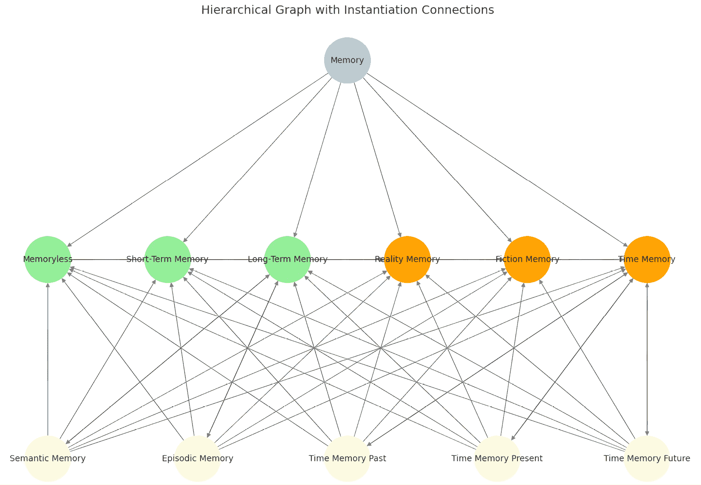

# 第六章：推理电子营销 AI 代理

成功广告活动的基础概念是**记忆**。想想昨天你看到的广告。那一年前甚至几年前的广告呢？你记得最清晰的是那些对你最有效的广告，但可能对其他人来说并非如此。任何广告公司的主要挑战是设计能够触发不同个体积极反应的促销内容。更重要的是，成功的营销活动努力让消费者记住品牌、产品和服务。

尼尔森神经科学团队（Brandt & Nieuwenhuis，2017）解释了为什么记忆在广告中如此重要。他们证明，记忆在仅仅 24 小时后就显著衰退，这使得广告难以产生持久的效果。包括重复和内容情感或智力影响在内的几个因素可以增强记忆的保持。代理系统如 GenAISys 的出现重塑了营销格局，因为这些系统能够复制类似人类专家的营销推理。

在本章中，我们将增强我们在前几章中构建的 GenAISys。首先，我们将设计一个针对特定市场段的**消费者记忆代理**。这个代理的目标是分析消费者如何编码促销信息。我们将从探讨记忆为什么重要以及它是如何结构化的开始，检查关键的记忆类别，如短期、长期、显性和隐性记忆，以及重要的维度，如智力编码和情感编码。接下来，我们将通过将消费者记忆的更深入理解整合到其知识库中，扩展 GenAISys 的架构。然后，我们将开发一个利用前几章中引入的多模态能力的战略消费者记忆代理。这个代理将采用神经科学启发的策略来制作定制化的营销信息。通过引入 OpenAI 的高级**o3 推理模型**中的**元认知**，我们将使代理能够在其多步骤 CoT 推理过程中执行复杂的、近似人类的自我反思。

此外，我们将把我们的生成式 AI 模型转变为一个类似神经科学的代理，它能够进行推理分析，而不仅仅是内容生成。复杂系统——如人脑——不仅仅是其各部分的简单总和，机器智能也是如此。使用 OpenAI 的 o3 推理模型的战略消费者记忆代理将应用复杂的神经科学提示来分析酒店评论中的消费者记忆编码模式。这些洞察将输入到一个多模态的**推理线程管道**，建立在*第五章*中引入的 CoT 框架之上，即“通过思维链增加多模态、多功能推理”。最终，GenAISys 将利用这种详细的记忆分析，通过 GPT-4o 生成定制营销内容，并辅以 DALL-E 生成的图像。

最后，我们将通过添加新功能进一步增强 IPython 交互式界面，包括一个能够触发记忆分析和客户服务任务的代理元认知小部件。用户可以选择分析各种类型的内容以获得与记忆相关的洞察，或启动以客户服务为导向的 CoT 交互。

到本章结束时，你将学会如何构建一个基于我们消费者记忆代理架构的定制、推理驱动的 GenAISys，适用于任何领域。我们将一步步构建它。

本章涵盖以下主题：

+   消费者记忆在营销中的重要性

+   人类记忆的高级结构

+   构建战略 CoT 消费者记忆代理

+   使用 CoT 分析酒店评论

+   设计类似神经科学的复杂提示

+   使用 o3，OpenAI 的能够深入分析内容的推理模型

+   使用 OpenAI 的 GPT-4o 生成内容，使用 DALL-E 生成图像

+   在推理线程函数中将推理和生成组装在一起

+   将消费者记忆代理 CoT 推广到任何内容

+   增强 IPython 交互式界面

让我们从设计增强的 GenAISys 界面及其 AI 驱动的功能开始。

# 设计消费者 GenAISys 记忆代理

消费者神经科学可以通过情感共鸣、个性化的信息显著提升品牌记忆度。在本章中，我们首先分析消费者如何编码记忆。Nicks 和 Carriou（2016）展示了有效的消费者神经科学通过叙事迁移来利用讲故事，使消费者情感投入并生动地记住促销信息。

在我们的实现中，我们将深入分析消费者如何编码记忆，保持一种真实的方法。如果消费者对一项服务表示不满，我们的系统将定制信息以强调改进的提供。我们的目标是通过对记忆深刻、情感共鸣的信息建立真正的联系。

在本节中，我们将描述如何增强我们在前几章中构建的 GenAISys：

+   **消费者记忆代理用例**：展示了如何将来自短期和**长期记忆**（LTM）框架的记忆原则应用于解释消费者反馈。

+   **定义记忆结构**：这超出了我们之前考察的基本类别，如**短期记忆**（STM）、LTM、情景记忆和语义记忆，并引入了新的类别和维度，为输入提供了更深入的分析。

+   **增强 GenAISys 的架构**：这为触发 AI 代理添加了新功能，并集成了一个新的 CoT 场景。

让我们先探索消费者记忆代理用例。

## 消费者记忆代理用例

本章中的用例展示了如何通过一个 CoT 消费者记忆代理来增强 GenAISys。我们的目标是通过对酒店评论的详细分析来理解特定消费者在选择酒店时的需求。我们开发的系统执行全面的内容分析，评估情感，并生成个性化的营销内容。CoT 代理通过酒店评论的详细记忆和情感分析启动此过程。它识别心理特征、情感标记和特定的记忆标签，为每个分析段分配情感分数。这些分数被组合起来产生一个整体情感分数和评分（0-5）。通过这种方法，代理有效地捕捉了特定酒店体验是如何被感知、情感处理并在消费者记忆中保留的。

基于这些提取的见解和由此产生的认知档案，代理使用评分来确定适当的营销策略。最终，消费者记忆代理生成定制的促销内容，包括一个带有相关图像的定制信息。例如，如果分析揭示了一个通常不喜欢酒店的客户，旅行社可以强调客户之前提到过的替代住宿或改进的服务。在这种情况下，代理生成一个带有吸引人图像的个性化信息，如图*图 6.1*所示。


图 6.1：由 DALL-E 生成的基于自定义内容的图像

代理通过分析从客户酒店评论中确定的认知档案来制作一个温暖、个性化的信息：

```py
Customer message: Dear Customer,
We invite you to consider a unique vacation experience that goes beyond the typical hotel stay. Imagine the warmth and comfort of staying with family or friends, where every moment is filled with genuine connections and cherished memories. From waking up to the aroma of freshly brewed coffee made just the way you like it to sharing home-cooked meals and laughter around a family table, this experience offers a heartfelt alternative to the impersonal nature of hotels. Embrace the spontaneity and freedom of living in the moment, surrounded by those who matter most. Whether it's a cozy evening of board games or a relaxed afternoon in the backyard, staying with loved ones provides a true home away from home. This vacation, choose the warmth of a family home and create memories that will last a lifetime. Book your stay with loved ones today and rediscover the true meaning of home.
Warm regards,
[Your Company Name] 
```

生成式 AI 是随机的，因此相同的输入不一定产生相同的输出。因此，响应可能从一个运行到另一个运行而变化。

现在我们来定义消费者记忆代理将使用的记忆结构。

## 定义记忆结构

让我们现在通过概述构建我们的消费者记忆代理所必需的人类记忆结构来扩展在*第一章*中引入的记忆类别。人类记忆是多方面的：**STM**暂时捕捉执行即时任务或情绪处理所需的信息，如果没有强化会迅速消失；**LTM**在长时间内存储重要事件、知识和经验；**语义记忆**存储一般知识和事实，独立于个人经验；**情景记忆**捕捉带有背景和细节的个人经历；**程序记忆**使无意识的任务检索成为可能，例如走路或驾驶；**情绪记忆**根据情绪强度对经历进行分类——积极或消极；**显性记忆**涉及有意识的回忆，而**隐性记忆**在无意识中运作。

我们的消费者记忆代理将使用这些记忆类别的灵活组合来分析消费者内容，如图*图 6.2*所示。这种分类为 o3 OpenAI 推理模型提供了足够的自由度，以有效地解释消费者数据。



图 6.2：记忆代理的记忆类别

上层的主要类别如下：

+   **无记忆**指系统或人类无法记住过去事件的信息。这些是我们最易忘记的事件，例如我们昨天眨眼的次数。

+   **短期记忆**用于暂时存储信息以执行任务或情绪过程。如果没有事件再次刺激，这种记忆会迅速衰退。这可能是阅读长文本的工作记忆。

+   **长期记忆**指我们在长时间内存储的信息，从几天到几年。这是一种至关重要的记忆，例如知道我们身处哪个国家，我们的年龄，以及我们的家庭成员是谁。

+   **现实记忆**是我们确信与实际事件或事实相关的内容，以及外部世界。

+   **虚构记忆**包括想象或假设的内部事件或叙述。

+   **时间记忆**对于区分过去、现在和未来事件至关重要。否则，我们会认为我们已经吃掉了我们打算明天午餐要吃的东西。

注意到无记忆、短期和长期记忆形成一个子集（浅绿色），而现实、虚构和时间记忆（浅橙色）都是相互连接的。这些类别并不是孤立的；它们在现实生活中动态地相互连接。换句话说，我们的记忆不是在子集中运作，而是在我们称之为*标签*的 AI 中运作。一个记忆可以是多个标签的组合：

+   一种无记忆的虚构，例如梦境

+   短期现实，例如阅读新闻

+   长期虚构，例如我们很久以前读过的小说

当检查这些记忆子类别时，我们很快就会意识到与主要记忆类别（如语义 STM 或情景 LTM）可能的标签组合数量众多。此外，记忆可以无缝地融合子类别；例如，短语“我去年访问了罗马”同时结合了情景、语义和时间记忆标签。此外，我们的记忆范围从隐性的（潜意识地整天眨眼）到显性的（由于不适而有意眨眼）。

在我们的消费者记忆代理中，我们将要求对内容进行彻底分析，为每个文本段分配适当的记忆标签。然而，即使这种详细的标签本身也不够。为了有效地捕捉消费者体验，我们将通过三个分析维度丰富每个记忆标签：

+   **智力维度**：识别文本中的思想、逻辑和推理。

+   **情感维度**：确定情感、感受和整体情绪——对于有效的消费者参与至关重要——并提供一个从 0 到 1 的可量化的情感评分，可扩展到熟悉的 1-5 评分，用于客户满意度表格。

+   **物理维度**：突出感官体验和身体感觉，例如“游泳太冷了”或“睡在那家酒店的床上后背疼。”

考虑到这些增强，让我们现在探索如何将它们整合到我们不断发展的 GenAISys 架构中。

## 增强 GenAISys 的架构

在本章中，我们将基于之前在*图 5.3*中展示的 GenAISys 现有三层架构，如下所示：


图 6.3：事件驱动的 GenAISys 的三个层次

我们的方法将是自下而上的，从基础功能开始，然后通过 AI 代理向上到 GenAISys 界面：

+   **第 3 层（功能和代理）**：在这里，我们将向我们的自定义 OpenAI 库（`reason.py`）中引入额外的功能，这些功能专门针对消费者记忆代理和 CoT 推理。我们还将开发一个独立的记忆分析功能，该功能提供类似于神经科学的分析，适用于任何内容。

+   **第 2 层（AI 代理）**：这一层管理我们 GenAISys 的行为和决策。我们将建立明确的输入触发器和命名规范，以有效地激活和控制 AI 代理。

+   **第 1 层（IPython 界面）**：交互式界面将扩展以方便用户交互。我们将添加一个新的小部件，使用户能够方便地选择如何调用消费者记忆代理。最初，我们将专注于酒店评论，然后推广到任何形式的输入。

让我们现在开始构建消费者记忆代理。

# 构建消费者记忆代理

在本节中，我们将我们的 GenAISys 提升到下一个层次，通过为其配备分析酒店评论的神经科学能力。消费者记忆代理将捕捉用户的认知、情感和身体心态，通过六个步骤的 CoT 过程解码每个评论段，如图*图 6.4*所示：


图 6.4：记忆代理的思维链过程

消费者记忆代理的 CoT 将使用 OpenAI 的 o3、GPT-4o 和 DALL-E 来运行其六个步骤：

+   **步骤 1：记忆和情感分析**：代理将使用复杂的记忆结构系统信息分析酒店评论的内容。它将逐段分析和标记内容。

+   **步骤 2：提取评分**：代理处理步骤 1 的输出，以提取每个内容段的情感评分。

+   **步骤 3：统计分析**：代理使用所有标记段的评分来生成内容的整体认知评分。

+   **步骤 4：创建内容**：代理现在必须根据评分做出决定。如果评分超过积极阈值，它将生成一条鼓励消费者选择酒店的短信。然而，如果评分是负面的，将创建一个客栈信息。一旦做出决定，代理将使用消费者的记忆标签创建一个定制的促销信息。

+   **步骤 5：图像创建**：代理现在使用步骤 4 的输出创建一个符合消费者心态的图像。

+   **步骤 6：信息创建**：代理现在拥有生成针对消费者定制信息的所有必要信息。

在单独开发这些步骤之后，我们将在接下来的部分中完全集成它们，即*GenAISys 界面：从复杂到简单*，旨在将 CoT 功能推广到酒店评论之外。

要开始我们的旅程，请打开`1_Building_the_Consumer_Memory_Agent.ipynb`笔记本，该笔记本在 GitHub 的 Chapter06 目录中重用了之前构建的功能（[`github.com/Denis2054/Building-Business-Ready-Generative-AI-Systems/tree/main`](https://github.com/Denis2054/Building-Business-Ready-Generative-AI-Systems/tree/main)）。我们首先将下载一组酒店评论数据集，以提供 AI 代理的输入。

## 数据集：酒店评论

我们将使用合成的酒店评论来构建记忆代理。在本章中，我们将处理酒店评论，并将代理的记忆结构推广到我们希望分析的其他内容。由于版权原因，我们使用的数据集是由人工创建并使用生成式 AI 辅助创建的合成评论数据集。

如果你想探索更多数据集，可以使用包含 Kaggle 上 TripAdvisor 酒店评论的类似数据集，用于非商业私人实施，网址为[`www.kaggle.com/datasets/andrewmvd/trip-advisor-hotel-reviews`](https://www.kaggle.com/datasets/andrewmvd/trip-advisor-hotel-reviews)。

在 GitHub 上运行**设置环境**部分，与*第五章*相同，并直接从 GitHub 仓库下载数据集：

```py
download("Chapter06","hotel_reviews.csv") 
```

**提示**：使用**AI 代码解释器**和**快速复制**功能增强您的编码体验。在下一代 Packt Reader 中打开此书。点击**复制**按钮

（*`1`*）快速将代码复制到您的编码环境，或点击**解释**按钮

（*`2`*）让 AI 助手为您解释一段代码。


**下一代 Packt Reader**随本书免费赠送。扫描二维码或访问[packtpub.com/unlock](http://packtpub.com/unlock)，然后使用搜索栏通过书名查找此书。请仔细核对显示的版本，以确保您获得正确的版本。


我们将使用 pandas DataFrame 处理数据集。程序现在加载 CSV 文件并显示数据：

```py
import pandas as pd
# Load the CSV file into a Pandas DataFrame
dfta = pd.read_csv('/content/hotel_reviews.csv',sep=',')
# display the DataFrame
dfta 
```

此数据集包含两个主要列：`Review`和`Rating`。例如，记录 0 有一个相对建设性的评分 3，而记录 1 显示一个明显的正面评分 5：


图 6.5：酒店评论数据集摘录

然而，仅凭评分不足以提供足够的深度——我们需要细微的情感分析来完全理解客户为何满意或不满意。我们将选择一篇具有挑战性的评论开始我们的分析：

```py
index_number = 0  # Specify the index number 
```

程序现在提取评论及其评分：

```py
 # Extract the desired fields
    review = row['Review']
    rating = row['Rating']
    # Display the results
    print(f"Review: {review}")
    print(f"Rating: {rating}")
except IndexError:
    print(f"Error: Index {index_number} is out of bounds for the DataFrame.")
except KeyError as e:
    print(f"Error: Column '{e}' not found in the DataFrame.") 
```

输出显示评论及其评分：

```py
Review: We got a nice hotel. The parking was rather expensive. However, we got a good deal for my birthday. We arrived in during the night because of a late flight but the parking was open 24hours The check in was rapid. The room was a large size. Cool. But we didn't get the view expected. The bed was super comfortable and got a nice sleep for a few hours but then there was a raucous of a noisy crowd going to bed late. Anyway the price was acceptable and we made it to the shopping mall next to the hotel which reminded me of the one we had at home.
Rating: 3 
```

我们选择了一篇难度较大的评论，因为它包含负面和正面情感。评论的负面方面将挑战代理生成建设性的解决方案。在继续之前，请自己分析每个评论段的记忆标签、情感分数和维度。这项练习明确了记忆类别使用情况，并为将您的见解与代理的分析进行比较提供了基准。将提取的评论作为初始输入：

```py
input1=review 
```

我们现在将为`input1`的**第 1 步**设计一个复杂系统消息。

## 第 1 步：记忆和情感分析

此步骤通过结合 OpenAI o3 推理模型中的元认知和元推理，将高级推理引入我们的消费者记忆代理。换句话说，代理不会仅仅处理文本——它将积极反思其内部推理，进行逐段分析以分类记忆类型并分配情感分数。

具体来说，o3 模型将在我们精心设计的系统消息中运行，我们将详细设计这个系统消息。这个系统消息明确地引导模型，促进深入推理，并确保它根据类似人类的认知过程准确分配记忆标签。我们确实处于推理和自我反思 AI 的时代！

在本节中，我们将执行以下操作：

+   设计一个复杂的系统消息，其中包含之前定义的详细记忆结构。这个消息被称为`system_message_s1`，将单独存储在 Python 文件中以实现模块化。

+   依靠 OpenAI 的 o3 的推理能力来完成繁重的工作并执行详细的段落级分析，从而减轻我们手动解释的负担。

注意，我们使用 o1 作为一个总称，向 LLM（大型语言模型）表明其作为推理模型的角色。此外，尽管我们在 API 中尽可能多地使用 o3，但 LLM 在回复中可能会直接提到 o1。

现在，让我们一步一步地构建这个详细的系统消息。

### 设计步骤 1 的复杂系统消息

我们必须设计一个足够全面的系统消息，以便模型能够深入理解和执行受神经科学启发的记忆分析。为此，我们仔细地将消息结构化成明确标记的各个部分，每个部分引导代理通过分析的各个方面。

#### 0. 模型介绍和代理的角色

第一行在两个层面上为代理设定了基调。第一个层面为代理提供了理解此任务高级记忆分析所必需的概念。第二个层面详细描述了代理的角色：

```py
You are a generative AI model, an advanced memory-analysis model. Your role is to examine **each segment** of an incoming text and generate a set of "memory encoding tags," similar to how the human brain encodes memories in neuroscience. For every segment in the input, you will identify which categories apply, discuss the rationale, and assign additional metadata (dimension, sentiment, etc.). 
```

现在，让我们通过这些说明来了解代理通过消息的这一部分所学习的内容：

+   `生成式 AI 模型，一个高级记忆分析模型`：我们以一种特殊的方式设定了系统的角色。我们要求模型思考，而不仅仅是生成文本。对于这个任务，我们不希望模型被创建，而是要分析和推理。

+   `检查**每个段落**`：我们正在教模型复制神经科学方法。我们的大脑以离散的包编码信息。在这种情况下，我们要求模型模仿人类的记忆过程。文本的每个部分可以是一个句子、一个句子片段或一个段落。这样，模型将以类似于人类大脑在独立包中编码信息的方式分析文本。

+   `生成一组“记忆编码标签”，类似于人类大脑编码记忆的方式`：人类大脑使用*标签*来编码记忆，这是一个我们可以在高层次上使用而无需深入了解生物过程的术语。我们的大脑将标签应用于它们编码的每一信息位，以区分过去的事件和未来的事件，例如，从语义数据或个人情感体验中。这些标签代表了我们在人类生成的文本中寻找的记忆类别。

+   `discuss the rationale, and assign additional metadata`: 模型必须解释它标记的记忆类别的理由。每个类别，如 STM 或 LTM，都必须解释。我们需要知道为什么将记忆标签分配给该段。模型被要求在其描述中添加维度，包括理性和情感原因。

你可能会在代码中注意到一个 Markdown 分隔符（`---`）。它向模型显示我们现在正在转向另一个主题。这可能看起来并不重要，但我们需要强调主题的变化，就像我们向人类给出指令时那样。现在，我们将给模型一个目的。

#### 1. 目的

第 3 行是一个标题，向模型显示我们正在进入消息的第一个重要部分：

```py
### 1\. Purpose 
```

第 4 行定义了 o3，OpenAI 推理模型的目标：

```py
The goal is for you, O1, to perform an **in-depth memory analysis** of each segment of the text. In other words, you will classify and label each segment you find using specific memory categories (also called "memory encoding tags"). This process provides insight into how different parts of the text might be encoded in human memory. 
```

注意消息中包含的“o1”，在这里用作 OpenAI 推理模型的通用术语。主要思想是让 API 理解我们期望推理。无论选择哪个推理模型，这条指令都将激活推理。*目的*部分的要点坚持我们期望的内容：

+   `in-depth memory analysis`: 我们不希望进行经典分析，而是一种深入到每个段落的细节的反思。

+   `Classify and label each segment you find using specific memory categories`: 这是一个强烈的指示，表明模型预期要标记的记忆类别。再次提醒智能体，我们不希望生成文本，而是对段落进行分类和标记。

+   `provides insight into how different parts of the text might be encoded in human memory`: 这是一个明确的指示，我们期望类似人类的思考，并复制大脑编码记忆的方式。

我们现在需要给智能体提供它需要学习的标题。前几行提供了清晰的指令。现在，我们已经到达了消息的第二节。

#### 2. 记忆编码标签

我们现在教智能体如何识别不同的人类编码标签类别。我们正在触及人类记忆编码的核心。记忆类别是本章 *定义记忆结构* 部分中讨论的那些：

```py
### 2\. Memory Encoding Tags (Categories) 
```

这个标题至关重要，因为智能体将通过这个标题的提示来学习我们期望的标签。现在，智能体已经吸收了这个标题。然后，我们给模型一个清晰的解释，说明我们期望它采取哪些行动：

```py
Below is a list of memory categories you must use. Consider them your "tagging schema." A single segment may exhibit one or more categories. If no category seems relevant, you may provide the special tag "memoryless" to indicate no significant memory encoding. 
```

让我们关注这条消息的关键部分：

+   `tagging schema`: 将模型与人类大脑编码不同记忆类别的方式对齐，使用 *标签* 来区分过去和现在

+   `A single segment may exhibit one or more categories`: 解释给模型知道一个记忆可以编码在多个类别中，就像在人类大脑中一样

+   `If no category seems relevant … memoryless`: 告诉模型，如果它无法确定一个记忆的类别，应该分配一个无记忆标签

我们随后明确定义了类别（例如，STM、LTM、情景记忆、语义记忆、时间记忆、现实记忆、虚构记忆、无记忆），如前所述：

```py
1\. **Short Term Memory (STM)**
   - Used for information that seems fleeting, recently introduced, or relevant only in the immediate context.
…
8\. **Memoryless**
  - If a segment does not appear to connect to any memory encoding or is purely functional text (e.g., disclaimers, random filler), label it "memoryless." 
```

记忆标签已经描述，但不足以捕捉人类记忆，人类记忆依赖于其他维度来编码事件。

#### 3. 维度

维度部分为智能体调查增添了智力、情感和身体特征。以下信息中这些维度的描述在之前的*定义记忆结构*部分已有描述：

```py
`Dimension Descriptions`
  1\. `Intellectual`
  2\. Logical, analytical, or factual thought processes.
      - `Explanation`: If the text focuses on reasoned arguments, data, 
        or factual details, it should be labeled "Intellectual."
  3\. `Emotional`
  4\. Feelings, mood, or affective elements.
      - `Explanation`: If the text displays happiness, sadness, or other 
        strong emotional content, "Emotional" is assigned.
  5\. `Physical (with Sensations` 
```

有了这些，我们已经定义了记忆类别和额外的维度。然而，我们还需要对情感进行更精细的分析。

#### 4. 情感得分

如在*定义记忆结构*部分所定义，情感得分衡量一个段落的情感价值。它提供一个介于 0（负面）和 1（正面）之间的数值得分，如果无法检测到情感，则为 0.5（中性）：

```py
### 4\. Sentiment Score
Assign each segment a **sentiment score** between **0.0** and **1.0**, where:
  - **0.0** = very negative
  - **0.5** = neutral
  - **1.0** = very positive
If a segment is purely factual with no emotional valence, use 0.5 (neutral). 
```

注意，信息中的每个部分都以清晰的 Markdown 指示符开始和结束，表明主题的变化。

接下来，我们将要求一个特定的响应格式。

#### 5. 响应格式

我们需要响应清晰地显示原始文本的每个部分，为每个部分提供记忆标签，确定每个部分的维度（智力、情感或身体），提供情感得分，并提供简短的解释以证明分析：

```py
### 5\. Format of the Response
For **each segment** in the incoming text:
  1\. Show the segment excerpt or a short summary.
  2\. **Memory Tags**: list any relevant categories.
  3\. **Dimension**: choose intellectual, emotional, or physical.
  4\. **Sentiment Score**: 0.0 → 1.0.
  5\. **Brief Explanation**: why these tags/dimensions. 
```

为了确保模型理解我们要求的内容，我们提供了一个示例格式：

```py
Example format:
Segment 1: "Excerpt..."
  - Memory Tags: [Time Memory Past, Reality Memory]
  - Dimension: Emotional
  - Sentiment Score: 0.7
  - Explanation: The speaker refers to a past real event with positive affect. 
```

如果我们正在编写一个传统的生成式 AI 模型信息，我们就可以在这里停止。然而，这是一个复杂的信息，因此我们需要添加指令来*坚持*我们期望的内容。

#### 6. 额外指令

我们避免了在信息的前几部分过度加载指令。如果我们试图塞入太多指令，模型可能会感到困惑。让我们提醒系统，我们始终希望进行分段分析。我们坚持认为，如果模型找不到类别，我们希望得到一个“无记忆”标签，而不是幻觉。此外，我们只希望有简短且清晰的解释：

```py
### 6\. Additional Instructions
  - Always analyze segment-by-segment.
  - If no memory category applies, use "memoryless."
  - Use a short but clear explanation. 
```

现在是棘手的部分。我们告诉模型，如果它完全找不到类别，则使用“无记忆”标签。然而，如果模型有一个想法但不是 100%确定，那么它被允许选择最可能的记忆标签，并附带一个强制性的情感得分：

```py
 - If uncertain about the correct memory category, pick the most likely.
  - Always include a sentiment score. 
```

到目前为止，我们已经向模型提供了许多指令。让我们确保它记得其主要任务。

#### 7. 主要任务回忆

在我们向模型提供的所有指令之后，我们将提醒模型其主要任务是文本段落的记忆标签分析。我们还期望输出格式按照定义的结构化：

```py
### 7\. Primary Task
When I provide multisegment text, you must do a thorough memory-tag analysis for each segment. Return the results in the structured format above.
[End of System Prompt] 
```

注意，我们添加了 `[系统提示结束]` 以确保模型理解全局提示的信息部分现在已完全定义。我们使用术语 `prompt` 来确保它理解它是一组指令，而不仅仅是一般信息。

我们现在已准备好运行记忆分析。

### 运行记忆分析

我们设计的复杂系统消息存储在名为`system_message_s1`的变量中，位于 GitHub 仓库的`commons`目录下的`cot_message_c6.py`中。目标是使这条消息以及其他步骤的消息与函数调用分开，以便 GenAISys 的 AI 代理可以在本步骤或其他步骤中重新使用此函数用于不同的任务。

我们首先下载包含消息的文件：

```py
download("commons","cot_messages_c6.py") 
```

然后我们导入`system_message_s1`消息以及我们将在*第 4 步*中需要的消息，我们稍后会讨论：

```py
from cot_messages_c6 import (
    system_message_s1, generation,imcontent4,imcontent4b)
print(system_message_s1) # Print to verify 
```

`print`函数取消注释后，将显示我们刚刚创建的消息。它可以在任何时间取消注释并使用，以验证消息是否正确导入。我们现在为 o3 准备消息：

```py
# Step 1 : Memory and sentiment analysis
mrole= system_message_s1
user_text=review 
```

+   `mrole`是`system_message_s1`，我们设计的系统消息

+   `user_text`是`review`，从酒店评论数据集中选择的评论

我们现在调用 o3 并将结果存储在一个变量中：

```py
retres=reason.make_openai_reasoning_call(user_text, mrole) 
```

`make_openai_reasoning_call`位于`reason`，GenAISys 的 AI 库。它接受我们刚刚定义的两个参数，创建 OpenAI 客户端，发出请求，并返回响应：

```py
# Implemented in Chapter06
def make_openai_reasoning_call(user_text, mrole):
    system_prompt=mrole
    client = OpenAI()
    rmodel = "o3-mini" # o1 or other models. model defined in this file in /commons to make a global change to all the notebooks in the repo when there is an OpenAI update
    response = client.chat.completions.create(
        model=rmodel,
        messages=[
            {"role": "system", "content": system_prompt},
            {"role": "user", "content": user_text}
        ],
    )
    return response.choices[0].message.content 
```

对于这次调用，我们选择了`o3-mini`版本的`o3`推理模型系列。可以选择其他版本和推理模型。程序显示了在`retres`中接收到的输出：

```py
# Print the generated output (memory analysis)
print(retres) 
```

输出显示了系统消息和 o3 推理模型的深度。AI 模型已将内容分解为段，并潜意识地解码了人类审阅者使用的记忆标签，如第一段所示。

模型首先提供段落数和该段的内容。让我们关注第 7 段，它需要我们的注意：

```py
Segment 7: "But we didn't get the view expected." 
```

它还提供了编码此段落的记忆标签：

```py
- Memory Tags: [Episodic Memory, Reality Memory] 
```

它继续提供维度，如下所示：

```py
• Dimension: Emotional 
```

接着给出一个情感分数，如下所示：

```py
• Sentiment Score: 0.4 
```

最后，它产生一个总结其分析的说明：

```py
 - Explanation: The disappointment regarding the view introduces a negative emotional element to this real-life account, impacting the overall perception of the stay. 
```

模型接着对其评论的所有段进行分析。我们现在已经完成了一个复杂的记忆分析，为后续步骤奠定了基础。让我们继续提取情感分数。

## 第 2 步：提取情感分数

从这一点开始，存储在`review`中的原始输入不再使用。CoT 过程依赖于前一步的输出，这将根据上下文不断变化。下一步涉及从*第 1 步：记忆和情感分析*产生的所有段提取情感分数。我们需要这些信息来为*第 4 步：内容创作*做出决策。

为了提取分数，我们首先创建一个`extraction`函数并提供详细的说明：

```py
def extract(tasks_response):
    umessage = """
    1) Read the following text analysis that returns detailed memory tags for each part of the text
    2) Then return the list of memory tags with absolutely no other text
    3) Use no formatting, no hashtags, no markdown. Just answer in plain text
    4) Also provide the sentiment analysis score for each tag in this format(no brackets) : memory tag sentiment Score
    """ 
```

我们已明确指示我们的 GenAISys 只以干净的格式提供情感分数。现在我们将使用之前定义的`reason.make_openai_api_call`调用 GPT-4o，并添加`reason.py`，这是我们之前章节开始构建的 AI 库。API 调用的输入是最后一步的输出`retres`，附加到指令消息`umessage`：

```py
 umessage+=retres 
```

`system`角色提醒代理其心理营销功能：

```py
 mrole = "system"
    mcontent = "You are a marketing expert specialized in the psychological analysis of content" 
```

`user`角色引入用户消息`umessage`，并执行 API 调用：

```py
 user_role = "user"
    task_response = reason.make_openai_api_call(
        umessage,mrole,mcontent,user_role
    )
    return task_response 
```

代理返回`task_response`，我们将从中提取记忆情感分数，处理并验证：

```py
# Step 2: Extract scores
task_response=extract(retres)
print(task_response) 
```

每个记忆标签预期的输出分数列表如下：

```py
Reality Memory sentiment 0.8
Episodic Memory sentiment 0.8
Reality Memory sentiment 0.4
Episodic Memory sentiment 0.4
Episodic Memory sentiment 0.8
Reality Memory sentiment 0.8
Time Memory Past sentiment 0.8
Episodic Memory sentiment 0.5… 
```

我们现在需要整合这些分数，以便用于决策。

## 第 3 步：统计

我们将使用一个简单的非 AI **正则表达式**（**re**）模块来执行此函数的匹配和提取。这表明 GenAISys CoT 可以包含非 AI 函数，从而扩展其范围，超越生成式 AI 模型。

要分析的文字是前一步的输出：

```py
# Input text
text=task_response 
```

我们正在寻找小数：

```py
# Regular expression to extract sentiment scores
pattern = r"(\d+\.\d+)"
scores = [float(match) for match in re.findall(pattern, text)] 
```

我们然后显示分数：

```py
# Output the extracted scores
print("Extracted sentiment scores:", scores) 
```

输出包含分数：

```py
Extracted sentiment scores: [0.8, 0.8, 0.4, 0.4, 0.8, 0.8, 0.8, 0.5, 0.5, 0.5, 0.7,… 
```

如果函数返回分数，我们首先计算一个总体分数：

```py
# Optional: calculate the overall score and scaled rating
if scores:
    overall_score = sum(scores) / len(scores) 
```

然后我们将分数从 1 到 5 进行缩放：

```py
scaled_rating = overall_score * 5 
```

最后，我们显示总体分数和缩放分数：

```py
print("Overall score (0–1):", round(overall_score, 2))
print("Scaled rating (0–5):", round(scaled_rating, 2)) 
```

输出是我们预期的：

```py
Overall score (0–1): 0.63
Scaled rating (0–5): 3.14 
```

输出需要一些人工分析：

+   在实际项目中，这个过程可能不会如此顺利！也许 AI 代理根本不会产生我们期望的结果；也许它会在某一步产生，但不会在分数上。当这种情况发生时，我们必须处理替代步骤。构建 GenAISys，就像任何 AI 系统一样，是一个迭代的过程。

+   在酒店数据集中，此评论的原始评分为 3，我们获得了 3.14，这更加精细。在线评分是主观的，可能无法准确反映评论的内容。AI 代理将通过类似本节中所述的高级分析过程提供更细致的评分。我们可以平均酒店评论和我们的评论。然而，我们的目标是生成针对消费者的定制信息。在实际项目中，我们会联系营销小组中的消费者，利用消费者记忆代理，并获取实时反馈。

然而，目前我们有了确定要创建的内容所需的信息。

## 第 4 步：内容创建

在决定要创建的内容之前，代理读取信息消息。第一条消息是`umessage4`：

```py
from cot_messages_c6 import umessage4 
```

消息包含有关如何创建促销活动的说明。我们将消息保存在一个变量中，以便函数可以根据任务使用不同的提示进行调用。

代理必须首先使用分析的内存标签生成文本，而不是分析：

```py
umessage4 = """
1) Your task is to generate an engaging text  for a customer based on a memory analysis of a text
2) The analysis of the text is provided in the following format: text segment, memory tags, dimension, sentiment score, and explanation
The text also contains the overall sentiment score and the list of memory tags in the text
3) Use no other memory tags than those provided to generate your engaging text 
```

然后，代理接收有关情感分析的说明：

```py
4) Use the overall sentiment score to give the tone of your response
If the overall sentiment score is positive write an engaging text addressing each segment with its memory tag and sentiment score
If the overall sentiment score is negative analyze why and find ideas and solutions to find a way to satisfy the customer
If the overall sentiment score is negative analyze make sure to show empathy for this negative feeling and then make the transition from negative to positive
4) Focus on the topic provided that begins with the term the topic which focuses on the core topic of the text to make the customer happy 
```

然后，代理接收有关要生成内容的最终说明：

```py
5) Use your training to suggest named entities for that topic to make sure that the customer receives a message tailored to the memory tags and sentiment score 
```

我们现在通过添加我们获得的评分和代理找到的记忆标签来创建输入：

```py
ugeneration=generation + "The advanced memory analysis of each segment of a text with a sentiment score:" + retres + " the scaled overall rating: "+ str(scaled_rating)+ " and the list of memory tags of the text "+ task_response 
```

代理现在对预期的任务有一个完整的表示。我们用`imcontent4`解释代理的角色：

```py
imcontent4 = "You are a marketing expert specialized in the psychological analysis of content" 
```

代理现在准备好使用`make_openai_api_call`调用进行生成：

```py
ugeneration=generation + …
mrole4 = "system"
mcontent4 = imcontent4
user_role = "user"
pre_creation_response = make_openai_api_call(
    ugeneration,mrole4,mcontent4,user_role
)
print(pre_creation_response) 
```

如果情绪是消极的，则响应是一个富有同情心的`pre_creation_response`，否则它会适应评论的语气：

```py
**Segment 7: "But we didn't get the view expected."**
Memory Tags: [Episodic Memory, Reality Memory]
Sentiment Score: 0.4
It's understandable to feel a bit let down when expectations aren't met. For future stays, … 
```

输出是一种认知格式。我们将运行相同的调用，但带有清理和准备内容以生成图片的消息：

```py
umessage4b="Clean and simplify the following text for use as a DALL-E prompt. Focus on converting the detailed analysis into a concise visual description suitable for generating an engaging promotional image" + pre_creation_response
mrole4b = "system"
mcontent4b = imcontent4b
user_role4b = "user"
creation_response = make_openai_api_call(
    umessage4b,mrole4b,mcontent4b,user_role4b
)
print(creation_response) 
```

输出是一个清晰的指令，要求创建一个包含令人兴奋的*豪华*优惠的图片，这种优惠总是受到欢迎的：

```py
"Luxurious hotel stay with spacious rooms and swift check-in; enjoy a comfortable bed and convenient 24-hour parking. Celebrate with special deals and nearby shopping reminiscent of home. Despite minor noise and view issues, the overall experience is positive and memorable." 
```

每次运行请求时，信息的输出可能会有所不同，但语气应保持一致。此外，我们可以调整指令以生成其他内容。在这种情况下，代理已经准备好使用此指令来创建图片。

## 第 5 步：创建图片

在这个阶段，消费者记忆代理使用在*第 4 步：内容创建*期间生成的指令（`creation_response`）来使用 OpenAI 的 DALL-E 创建定制的促销图片：

```py
# Step 5: Creating an image
import requests
prompt=creation_response
image_url = reason.generate_image(prompt) 
```

`generate_image(prompt)`函数是从上一章复用的。通过一致地复用函数，我们减少了开发开销并确保了代码的可维护性。正如*第五章*中所述，图片被生成并存储在文件`c_image.png`中：

```py
save_path = "c_image.png"
image_data = requests.get(image_url).content
with open(save_path, "wb") as file:
    file.write(image_data) 
```

图片现在准备好与我们的最终个性化信息一起使用。我们将在流程结束时显示该图片：

## 第 6 步：创建自定义信息

准备好促销图片后，我们现在生成一个简洁而吸引人的客户信息。首先，我们确认*第 5 步：创建图片*中的`creation_response`是可用的：

```py
if creation_response != "":
    umessage = """
    1) Read the following text carefully
    2) Then sum it up in a paragraphs without numbering the lines
    3) They output should be a text to send to a customer
    """ 
```

代理的输出提供了一个经过打磨的信息，适合客户沟通：

```py
Dear Customer,
Experience a luxurious hotel stay with spacious rooms and a swift check-in process. Enjoy a comfortable bed and the convenience of 24-hour parking. Take advantage of special deals and nearby shopping that feels like home. While there may be minor noise and view issues, the overall experience remains positive and memorable.
Best regards, 
```

如果我们愿意，现在可以用 Python 的`textwrap`显示输出格式：

```py
import os
from IPython.display import Image, display
import textwrap
# Set the desired width for each line
line_width = 70
# Wrap the text to the specified width
wrapped_message = textwrap.fill(process_response, width=line_width)
print(wrapped_message) 
```

显示的信息清晰、专业，适合直接与客户接触：

```py
Dear Customer,  Experience a luxurious hotel stay with spacious rooms
and a swift check-in process. … 
```

为了增强这条信息，你可能需要调整提示语，以省略对 AI 或任何内部系统细节的提及，专注于以客户为导向的语言。

最后，系统将生成的图片与信息一起显示，以创建一个吸引人的个性化促销套餐：

```py
# Define the image path
image_path = "/content/c_image.png"
# Check if the image file exists
if os.path.exists(image_path):
    # Display the image
    display(Image(filename=image_path))
else:
    print(f"Image file {image_path} not found.") 
```

最终的视觉效果强调了酒店的升级豪华产品，与客户根据他们的评论分析得出的期望完美匹配：


图 6.6：为顾客在酒店住宿的升级

你现在可以尝试使用额外的评论进行实验，测试代理的深度和灵活性。我们已经成功开发了一个复杂的、受神经科学启发的 CoT 消费者记忆代理。在下一节中，我们将把这个完整的过程集成到`reason.py`AI 库中，并进一步增强我们的 GenAISys 框架。

# GenAISys 界面：从复杂到简单

在本章中，我们的旅程带我们深入到自我反思、推理和元认知智能代理的时代。在本节的最后，我们将从复杂的消费者记忆 CoT 内部工作转移到清晰直观的用户体验。我们将添加一个 CoT 小部件，允许任何用户在任意文本上触发内存分析或完整内容生成。然后我们将扩展 AI 代理，使其对那个小部件的选项做出反应。最后，我们将通过一个航班评论演示通用工作流程，以展示相同的记忆逻辑如何应用于新的领域。

在 GitHub 上打开`2_Running_the_Reasoning_GenAISys.ipynb`笔记本。然后运行*设置环境*部分，这部分与*第五章*中的笔记本相同。我们将首先向 IPython 界面添加一个 CoT 小部件。

## 添加 CoT 小部件

为了使记忆代理简单直观，我们引入了一个简单的下拉菜单（*图 6.6*）。用户可以轻松选择他们希望 GenAISys 代理执行的任务：

+   **无**（默认）：不激活任何推理任务

+   **分析**：激活独立的内存分析功能

+   **生成**：执行完整的消费者记忆代理工作流程（*步骤 1–6*），包括情感分析、内容生成和定制消息创建

这种简化的用户交互显著降低了最终用户的复杂性，将复杂的内部操作移至后台。


图 6.7：选择推理任务

小部件的实现分为三个步骤——添加小部件、添加观察者以及将选项发送到 AI 代理：

1.  添加小部件只需几行代码。我们在 IPython 界面中定义了下拉菜单（`instruct_selector`）：

    ```py
    # Ensure 'Instructions' exists in the memory_selector options
    instruct_selector = Dropdown(
        options=["None","Analysis", "Generation"],
        value="None",  # Ensure default active_memory is in the options
        description='Reasoning:',
        layout=Layout(width='50%')
    ) 
    ```

下拉菜单提供了清晰的选择，确保用户容易理解他们的选择：**无**、**分析**或**生成**。接下来，我们将`instruct_selector`集成到现有的界面布局（`VBox`）中：

```py
VBox:
Box(
                [user_selector, input_box, agent_checkbox,
                    tts_checkbox, files_checkbox,instruct_selector],
                layout=Layout(display='flex', flex_flow='column',
                    align_items='flex-start', width='100%') 
```

当用户提交他们的选择时，处理器会更新输出消息，让用户看到他们的选择已被考虑，使用标准的提交代码：

```py
def handle_submit(sender):
    user_message = sender.value
    if user_message.strip():
        sender.value = ""  # Clear the input box
        # Check if instruct_selector is "Analysis" or "Generation"
        if instruct_selector.value in ["Analysis", "Generation"]:
            with reasoning_output:
                reasoning_output.clear_output(wait=True)
                print("Thinking...")  # Display "Thinking..." only when
            print("Reasoning activated")  # Restore default message… 
```

我们希望显示“正在思考…”，以向用户发出系统正在工作的信号。

1.  第二步是插入一个观察者，它会检测用户所做的更改并更新显示。`instruct_selector`通过`instruct_selector.observe`被调用：

    ```py
    # Ensure 'Instructions' exists in the memory_selector options
    instruct_selector = Dropdown(
        options=["None","Analysis", "Generation"],
        value="None",  # Ensure default active_memory is in the options
        description='Reasoning:',
        layout=Layout(width='50%')
    instruct_selector.observe(on_instruct_change, names='value') 
    ```

1.  最后，我们将用户的选择无缝地传递到 AI 代理调用中。选定的推理模式（`active_instruct`）集成到代理的执行路径中：

    ```py
    if agent_checkbox.value:
            pfiles = 1 if files_checkbox.value else 0
            active_instruct = instruct_selector.value  # Retrieve the selected instruction
            response = chat_with_gpt(user_histories[active_user],
                user_message, pfiles, active_instruct) 
    ```

通过明确集成这几行代码，AI 代理动态激活适当的推理模式，而无需额外的用户复杂性。我们现在可以增强 AI 代理。

## 增强 AI 代理

AI 代理现在将在名为`active_instruct`的新参数中接收到用户的部件选择，这将触发其决策：

```py
def chat_with_gpt(messages, user_message,files_status,active_instruct): 
```

当用户选择**分析**时，AI 代理将触发之前构建的推理函数`make_openai_reasoning_call`以执行记忆分析：

```py
if active_instruct=="Analysis" and continue_functions==True:
        from cot_messages_c6 import (
            system_message_s1, generation,imcontent4,imcontent4b)
        mrole= system_message_s1
        reasoning_steps=reason.make_openai_reasoning_call(
            user_message, mrole
        )
        aug_output=reasoning_steps
        continue_functions=False 
```

类似地，当选择**生成**时，代理使用自定义的`memory_reasoning_thread`函数运行完整的记忆代理工作流程：

```py
if active_instruct=="Generation" and continue_functions==True:
        from cot_messages_c6 import (
            system_message_s1, generation,imcontent4,imcontent4b)
        reasoning_steps = reason.memory_reasoning_thread(
            user_message,system_message_s1,
            generation,imcontent4,imcontent4b
        )
        aug_output=reasoning_steps
        continue_functions=False 
```

通过这些简单的集成，GenAISys 界面现在透明地提供了强大的推理能力。

## 泛化 GenAISys 的能力

通过增强的界面，用户可以轻松地将记忆代理推理应用于酒店评论以外的各种内容。让我们用一个关于航班的普通用户评论来说明这种灵活性。用户只需选择**分析**，然后提交航班评论，无需额外指令：

```py
`User01`: The flight from Tokyo to Honolulu was nice in general but the food was awful! 
```

GenAISys 立即返回详细的、逐段的记忆分析：

```py
**Agent:** Segment 1: "The flight from Tokyo to Honolulu was nice in general"
- Memory Tags: [Reality Memory, Time Memory Past]
- Dimension: Emotional
- Sentiment Score: 0.7
- Explanation: This segment recounts a real past experience (a flight) and expresses a positive emotional evaluation ("nice"). The reference to a completed event classifies it under reality and past time memory… 
```

用户随后重新输入句子，但这次选择了**生成**选项和**文件**选项，以便显示使用文本生成的图像。用户只需选择选项，输入文本，然后提交即可。再次强调，体验无缝，用户无需额外指令，响应完整：完全分析、处理和最终客户信息，正如我们在上一节中设计的那样——从记忆分析开始，接着是情感评分，内容生成，最后是定制的客户信息和吸引人的图像（见*图 6.8*），如果界面中勾选了`文件`：

```py
Process: Performing memory and sentiment analysis.
Memory analysis result: Segment 1: "The flight from Tokyo to Honolulu was nice in general but the food was awful!"
- Memory Tags: [Reality Memory, Episodic Memory, Time Memory Past]
- Dimension: Emotional
- Sentiment Score: 0.4
- Explanation: This segment recounts a specific past travel event (a flight between two cities), embedding personal experience and subjective evaluation (positive about the flight overall and strongly negative about the food). The use of experiential details and judgment indicates that the experience is encoded as a real, episodic, past memory with an emotional emphasis, resulting in an overall slightly negative sentiment.
…
Dear Customer,
Experience a serene flight from Tokyo to Honolulu while enjoying a gourmet meal inspired by the renowned Chef Nobu Matsuhisa. Indulge in diverse and vibrant dishes crafted to enhance your journey.
Best regards, 
```


图 6.8：与个性化信息相匹配的吸引人的客户图像

从用户的角度来看，我们的 GenAISys 运行得非常顺畅。我们给用户一种错觉，即生成式 AI 中的所有事情都很简单。当然，在实际项目中，我们可能需要投入资源尝试所有类型的文本，找到局限性，并解决问题，以覆盖边缘情况并完善输出。现在让我们总结本章的旅程，并将 GenAISys 提升到另一个层次。

# 摘要

本章将我们的 GenAISys 推进到超越经典 AI 的领域，进入了元认知、自我反思推理的领域。我们定义了一个实用记忆模型，将主要类别（短期、长期、现实、虚构和时间）与语义和情景标签相结合，然后在上面叠加了智力、情感和物理维度。使用这个框架，我们构建了一个六步推理代理，解码每个评论段，标记记忆类别，量化情感，并生成一个整体认知评分。基于认知配置文件和情感评分，代理生成了个性化的促销文本，并创建了一个匹配的 DALL-E 图像——然后将一切包装成精致的客户信息。

现在有一个新的下拉小部件，允许用户选择**无**、**分析**或**生成**，使复杂的推理任务成为单次点击体验。幕后，AI 代理将请求路由到独立的记忆分析或完整的消费者记忆工作流程。我们最终在航班评论中展示了代理，展示了它能够分析、评分并对任何文本做出响应——将 GenAISys 从酒店业扩展到更广泛的客户服务场景。

随着这些进步，GenAISys 已准备好进行实时、生产级决策。下一章将重点介绍扩展我们的 GenAISys 架构的功能，以实现即时、高吞吐量的 AI 操作。

# 问题

1.  情感记忆是电子商务的关键因素。（对或错）

1.  OpenAI 的 o3 是一个可以执行复杂任务的推理模型。（对或错）

1.  长期记忆不包括情感因素。（对或错）

1.  一个生成式 AI 模型不能分析复杂的记忆结构。（对或错）

1.  生成式 AI 模型不仅可以分析情感，还可以提供介于 0 和 1 之间的数值评分。（对或错）

1.  Pinecone 指数可以根据系统查询生成复杂的指令。（对或错）

1.  一个推理线程代理可以思考复杂的提示并执行多个协调任务。（对或错）

1.  一个推理线程场景可以通过用户输入触发。（对或错）

1.  一个推理代理可以处理来自 TripAdvisor 等网站的评论并生成定制信息。（对或错）

1.  生成式 AI 系统不能处理推理线程代理。（对或错）

# 参考文献

+   Brandt, Denise, and Ilja Nieuwenhuis. 2017\. 理解广告中的记忆. 尼尔森. 二月. [`www.nielsen.com/insights/2017/understanding-memory-in-advertising/`](https://www.nielsen.com/insights/2017/understanding-memory-in-advertising/)

+   尼尔森首页: [`www.nielsen.com/`](https://www.nielsen.com/)

+   Nicks, Guillaume, and Yannick Carriou. 2016\. 情感、注意力和记忆在广告中的应用. Ipsos 知识中心. [`www.ipsos.com/sites/default/files/2017-07/Emotion-Attention-and-Memory-in-Ads.pdf`](https://www.ipsos.com/sites/default/files/2017-07/Emotion-Attention-and-Memory-in-Ads.pdf)

+   Ipsos 主页: [`www.ipsos.com/`](https://www.ipsos.com/)

+   OpenAI. 2024\. OpenAI o3 系统卡：o3 模型系列的全面评估，概述了在安全性、推理和鲁棒性方面的进步。OpenAI. [`openai.com/index/o3-mini-system-card/`](https://openai.com/index/o3-mini-system-card/)

# 进一步阅读

+   Woodside, Arch G., Sanjay Sood, 和 Kimberly E. Miller. 2008\. “当消费者和品牌对话：心理学和市场营销中的叙事理论及研究.” 心理学与市场营销 25 (2): 97–145\. [`www.researchgate.net/publication/229889043_When_consumers_and_brands_talk_Storytelling_theory_and_research_in_psychology_and_marketing`](https://www.researchgate.net/publication/229889043_When_consumers_and_brands_talk_Storytelling_theory_and_research_in_psychology_and_marketing)

# 免费订阅电子书

新框架、演进的架构、研究更新、生产故障——*AI Distilled* 将噪音过滤成每周简报，供与 LLM 和 GenAI 系统实际操作的研究人员和工程师使用。现在订阅，即可获得免费电子书，以及每周的洞察力，帮助您保持专注并获取信息。

在 `packt.link/TRO5B` 订阅或扫描下面的二维码。


