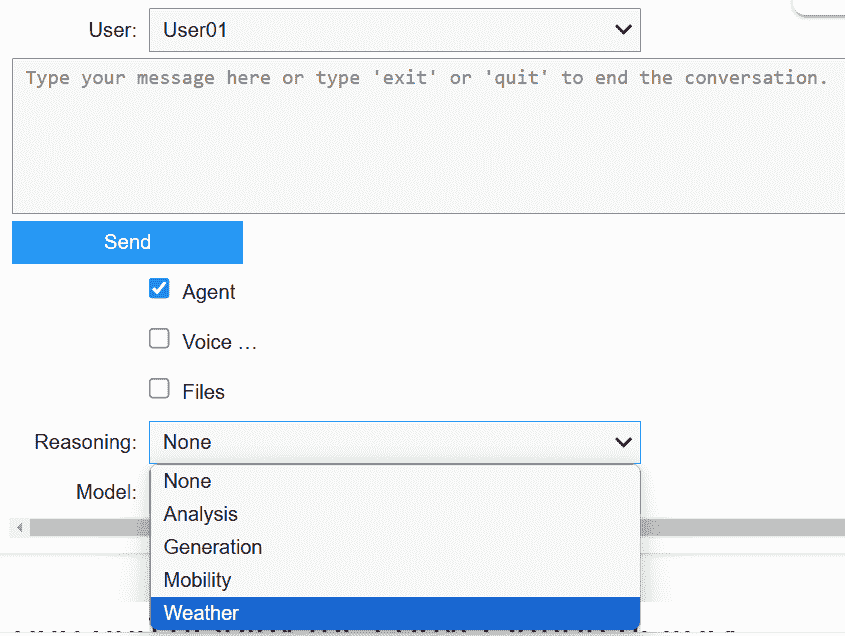

# 第九章：为客户服务升级 GenAISys 的数据安全和适度

在本章中，我们将通过将其与真实世界的在线服务集成来开放我们的 GenAISys——具体来说，通过将其连接到在线天气 API。这将使我们在整本书中一直支持的虚构在线旅行社能够访问实时天气数据。特定位置的天气预报是旅行社运营中各种必要任务的切入点，例如营销活动、旅游活动推荐和产品交付协调。

将我们的 GenAISys 连接到外部在线资源，使我们的系统从受控的内部环境过渡到不可预测的实时数据交互领域。然而，这种过渡引入了关键的安全问题。在没有足够保护的情况下打开系统可能会无意中暴露敏感数据或导致安全漏洞，对用户和整个组织都构成真正的风险。因此，在完全集成外部服务之前，强大的安全措施是必不可少的。因此，本章提出了三项挑战：使用 OpenWeather API 实现天气服务、利用 OpenAI 的适度能力构建适度系统，以及开发一个基于 RAG 的数据安全功能，使用 Pinecone 来检测和预防敏感主题的违规行为。我们将严重依赖现有 GenAISys 架构中灵活且强大的处理选择机制，以无缝集成这些新功能。我们的目标依然明确——最小化代码增强，最大化功能影响。

本章首先详细介绍了这些额外组件——适度、数据安全和实时天气——如何融入 GenAISys 的整体架构。然后，我们将深入探讨，利用 OpenAI 的适度端点构建适度功能。接着，我们将构建一个由 RAG 驱动的数据安全模块，使用 Pinecone 来主动检测和过滤掉敏感或不适当的内容。通过将这些两层安全措施直接集成到 GenAISys 的处理选择机制中，我们确保了对不受欢迎的交互的全面保护。

在安全措施得到巩固后，我们将实施 OpenWeather API。这种集成使我们能够检索实时天气信息，以支持一系列引人入胜、以用户为中心的任务。最后，我们将通过实际的多模式、多用户场景——例如基于天气的活动推荐、为旅游商品制作定制化的促销图片以及为旅行者动态创建个性化的天气感知信息——来展示增强型 GenAISys 的功能。到本章结束时，你将完全准备好将我们在 GenAISys 中探索的核心架构和概念应用于现实世界应用，自信地交付一个全面、安全且高度功能性的 **概念验证**。

本章涵盖以下主题：

+   增强 GenAISys

+   将安全功能添加到处理程序选择机制

+   构建天气预报组件

+   在 GenAISys 中运行用例

让我们先明确地绘制出新审查、数据安全和天气功能如何集成到我们的 GenAISys 中。

# 增强 GenAISys

将审查、数据安全和实时天气功能集成到我们的 GenAISys 中将影响所有三个架构层，如图 9.1 所示。我们将依靠围绕我们的处理程序选择机制构建的框架来实现这一三级、三功能的无缝实施。


图 9.1：审查、数据安全和天气预报集成

实施将对所有三个层次产生以下影响：

+   **层 1 (IPython 接口)**: 我们将在 IPython 接口的 **推理** 下拉菜单中引入一个新的 **天气** 选项。为什么放在这里？因为在现实世界的项目设置中，天气预报功能可以很容易地扩展成一个更复杂的多步骤 **思维链** (**CoT**) 流程，从而根据天气条件生成复杂、上下文感知的输出。

+   **层 2 (AI 代理)**: 我们 GenAISys 的核心协调器，即处理程序选择机制，现在将管理一个额外的组件——实时天气预报能力。更重要的是，我们将为处理程序集成一个综合的审查和数据安全机制，该机制将作为一个立即的 *关闭开关*，一旦检测到不适当或敏感内容，将立即终止进程并向用户返回安全警告。

+   **第 3 层（功能和代理）**：将在这一层实现三个新的关键功能——审核、数据安全和天气预报检索。由于这些功能是必需的，因此审核和数据安全检查将位于处理程序注册表之外。如*图 9.2*所示，这两个功能将形成一个强制性的全局安全屏障，直接由处理程序选择机制控制，在启动任何进一步任务之前保护用户和公司数据。


图 9.2：安全和审核检查直接在处理程序选择机制中管理

此安全系统将主动拦截和评估每个用户输入，如果检测到不适当或敏感内容，将通过 IPython 接口阻止进一步处理并立即向用户发出警报。

在构建和展示 GenAISys 作为灵活的证明概念时，请务必清楚地展示其可扩展性。突出其与附加 AI 功能、进一步的安全功能或替代生成模型的集成潜力。然而，要谨慎行事：避免在没有具体项目要求的情况下提前添加功能，因为这可能导致不必要的复杂性或过度开发项目。目标是清楚地展示项目的潜力，而不在未经请求的开发上投入资源。

带着这种战略清晰度，我们将首先构建安全功能。

# 将安全功能添加到处理程序选择机制中

在本节中，我们将构建**安全功能**、**审核功能**和**数据安全功能**，如*图 9.3*所示：


图 9.3：处理程序选择机制直接调用安全功能

我们将按以下方式实现这些功能：

+   安全功能将调用审核功能

+   安全功能还将调用数据安全功能

+   审核功能将包含子功能

+   数据安全功能将确保符合安全标准

让我们首先构建安全功能及其调用。

## 实现安全功能

安全功能直接集成到处理程序选择机制中，如*图 9.4*所示。它直接接收用户消息，在处理程序注册表中的任何处理程序选择之前。如果用户消息违反 GenAISys 内容策略，安全功能将向 IPython 接口返回一个 `False` 标志（表示内容违规）。


图 9.4：安全功能直接连接到处理程序选择机制

打开 `GenAISys_Customer_Service.ipynb` 并转到 GitHub 上 Chapter09 目录中的*安全*部分 ([`github.com/Denis2054/Building-Business-Ready-Generative-AI-Systems/tree/main`](https://github.com/Denis2054/Building-Business-Ready-Generative-AI-Systems/tree/main))。我们首先创建一个函数，将 `securitym` 标志设置为 `True`，表示内容不违反内容策略。在此函数中，`securityd=True` 表示未检测到敏感主题，消息符合数据安全标准：

```py
def security(user_message):
  securitym=True # default value
  securityd=True # default value 
```

**快速提示**：使用**AI 代码解释器**和**快速复制**功能增强您的编码体验。在下一代 Packt Reader 中打开此书。点击**复制**按钮

（*`1`*）快速将代码复制到您的编码环境，或点击**解释**按钮

（*`2`*）让 AI 助手为您解释代码块。


**下一代 Packt Reader** 在购买本书时免费提供。扫描二维码或访问 [packtpub.com/unlock](http://packtpub.com/unlock)，然后使用搜索栏通过名称查找本书。请仔细核对显示的版本，以确保您获得正确的版本。


函数开始时调用审核和内容可接受性函数：

```py
 response=moderation(user_message)
  # Moderation
  security = is_acceptable(user_message,response)
  #print(security)  # Outputs: True if acceptable, False otherwise 
```

+   `moderation(user_message)` 调用 OpenAI 审核 API

+   `is_acceptable(user_message, response)` 处理审核响应

+   在测试或故障排除期间可以取消注释调试行 (`print(securitym)`)

接下来，安全函数调用数据安全函数，检查用户消息中的敏感主题：

```py
 # Data security
  securityd = data_security(user_message)
  #print securityd 
```

`securityd` 变量将存储 `True` 或 `False`，具体取决于消息是否符合数据安全标准。

函数的最后部分评估两个标志（`securitym` 和 `securityd`），并根据结果返回安全状态：

```py
 if securitym==False or securityd==False:
    return False
  else:
    return True 
```

如果您不想激活审核或数据安全检查，可以在安全函数中取消注释相关行——特别是 `securitym=True` 和 `securityd=True` 赋值之间的代码，以及 `if securitym==False` 或 `securityd==False` 条件语句。这样，函数默认始终返回 `True`。

让我们来看看处理器选择机制如何与 IPython 界面交互。

## 处理器选择机制交互

处理器选择机制和 IPython 界面紧密交互，如*图 9.5*所示。当 IPython 界面将用户消息发送到处理器选择机制时，它确定消息是否符合安全策略。


图 9.5：处理器选择机制与 IPython 交互

处理程序选择机制函数的主要结构在之前的章节中保持不变：

```py
def chat_with_gpt(
    messages, user_message, files_status, active_instruct, models
):
    global memory_enabled  # Ensure memory is used if set globally 
```

然而，在这个函数的开始，我们现在调用安全函数。它返回一个安全状态（对于合规的返回`True`，对于不合规的返回`False`）：

```py
 try:
        if not security(user_message):
            return "Your message could not be processed as it may violate our security guidelines."d 
```

如果消息被标记为不合规，将立即向用户界面返回一个清晰的消息。我们将在*运行安全检查*部分中彻底测试安全函数示例。在那之前，让我们通过实现审查功能来继续前进。

## 实现审查功能

我们将使用 OpenAI Omni，它具有全面的分类选项，作为审查模型：[`platform.openai.com/docs/guides/moderation`](https://platform.openai.com/docs/guides/moderation)。

打开`GenAISys_Customer_Service.ipynb`笔记本，并导航到*安全*部分内的*审查*子部分。审查功能将由处理程序选择机制直接调用，如图 9.6 所示。它将分类用户消息，并在处理过程中提供任何被标记为不适当内容的详细信息。


图 9.6：调用审查函数

我们将按照以下方式使用 OpenAI Omni 实现审查功能：

```py
from openai import OpenAI
client = OpenAI()
def moderation(user_message):
  response = client.moderations.create(
      model="omni-moderation-latest",
      input=user_message,
  )
  return response 
```

此函数处理用户消息并返回一个审查响应。一旦被安全函数接收，响应将被发送到另一个函数`is_acceptable`以评估消息是否可接受：

```py
def is_acceptable(user_message, response):
    # Extract the 'flagged' status from the first result
    flagged = response.results[0].flagged 
```

响应包含`response.results[0].flagged`，如果内容被标记，则提供`True`值，如果响应可接受，则提供`False`状态。如果内容被标记，响应的详细信息将被保存在一个带时间戳的 JSON 文件中：

```py
 if flagged:
        # Generate filename based on current date and time
        timestamp = datetime.datetime.now().strftime("%Y%m%d%H%M%S")
        sanitized_message = ''.join(
            e for e in user_message if e.isalnum() 
            or e in (' ', '_')
        ).strip()
        filename = \
            f"{sanitized_message[:50].replace(' ', '_')}_{timestamp}.json"

        # Ensure the 'logs' directory exists
        os.makedirs('logs', exist_ok=True)
        # Convert the response to a dictionary
        response_dict = response.model_dump()

        # Write the response to a JSON file in the 'logs' directory
        with open(os.path.join('logs', filename), 'w') as file:
            json.dump(response_dict, file, indent=4) 
```

最后，函数返回标记状态为`not_flagged`：

```py
 # Return True if content is acceptable, False otherwise
    return **not_flagged** 
```

如果消息被标记，详细信息将被保存在位于`/logs`子目录中的带时间戳的 JSON 文件中。生成的 JSON 文件包含一个唯一 ID、使用的模型以及一系列类别的状态：

```py
{
    "id": "modr-bb021ae067c296c1985fca7ccfd9ccf9",
    "model": "omni-moderation-latest",
    "results": [
        {
            "categories": {
                "harassment": true,
                "harassment_threatening": false,
                "hate": false,
                "hate_threatening": false,
                "illicit": false,
                "illicit_violent": false,
                "self_harm": false,
                "self_harm_instructions": false,
                "self_harm_intent": false,
                "sexual": false,
                "sexual_minors": false,
                "violence": false,
                "violence_graphic": false,
                "harassment/threatening": false,
                "hate/threatening": false,
                "illicit/violent": false,
                "self-harm/intent": false,
                "self-harm/instructions": false,
                "self-harm": false,
                "sexual/minors": false,
                "violence/graphic": false
            },
            "category_applied_input_types": {
                "harassment": [
                    "text"
                ],
                "harassment_threatening": [
                    "text"
                ],… 
```

在这种情况下，`骚扰`类别已被标记，例如。文件还包含每个类别的分数，如下面文件摘录所示：

```py
 "category_scores": {
                **"harassment"****:** **0.8075929522141405**,
                …
            },
            "flagged": true
           … 
```

要执行快速质量控制检查或手动评估特定用户消息，请在您的笔记本中取消以下行的注释：

```py
# Uncomment to use as security user message evaluation
user_message="Your ideas are always foolish and contribute nothing to our discussions."
security(user_message) 
```

包含这些信息的文件可以根据您项目的需要使用其他功能进一步处理。我们可以将用户添加到文件中。我们还可以在笔记本的*加载和显示对话历史记录*部分查看对话的详细信息，以找出哪个用户输入了被标记的消息。我们将在*运行安全检查*部分中详细介绍这些功能。

现在让我们构建数据安全函数。

## 构建数据安全函数

现在我们将构建一个数据安全功能，用于检测用户消息是否包含敏感主题。此功能涵盖了广泛的与安全相关的问题，从保护机密信息到通过 GenAISys 界面防止不适当或敏感的讨论。数据安全功能包含两个组件，如图 9.7 所示：第一个组件将敏感主题填充到 Pinecone 索引中，第二个组件查询此索引以检测用户消息中的敏感主题。


图 9.7：数据安全功能的两个组件

### 填充 Pinecone 索引

我们首先将敏感主题填充到 Pinecone 索引中。打开`Pinecone_Security.ipynb`。这个笔记本反映了早期笔记本的结构*第三章*（`Chapter03/Pinecone_instruction_scenarios.ipynb`）。我们只需将其适应此处以容纳敏感主题。如有需要，请随时回顾`Pinecone_instruction_scenarios.ipynb`以进行详细的复习。

我们将简要介绍针对此领域特别适配的代码部分。第一步是下载我们的`sensitive_topics`数据集：

```py
download("Chapter09","sensitive_topics.csv") 
```

文件`sensitive_topics.csv`包含 100 个敏感主题，结构如下：

+   `id`：一个范围从`1000`到`1099`的唯一标识符

+   `values`：敏感主题的文本描述

例如，第一个主题如下：

```py
Discussing the mismanagement of client funds that has resulted in significant financial discrepancies which have raised concerns among regulatory bodies and could lead to potential legal actions being taken against the travel agency if corrective measures are not implemented promptly and with strict accountability this issue demands immediate thorough review. 
```

如果用户消息包含与该主题类似的内容，例如，它将被标记。基于向量的相似性搜索比传统方法提供更细致的检测。

下一步是从`sensitive_topics.csv`文件中分块数据：

```py
import time
start_time = time.time()  # Start timing
# File path
file_path = 'sensitive_topics.csv'
# Read the file, skip the header, and clean the lines
chunks = []
… 
```

我们然后在 Pinecone 中创建一个命名空间来存储这些敏感数据。我们将称此命名空间为`security`：

```py
from pinecone import ServerlessSpec
index_name = 'genai-v1'
namespace="security"
cloud = os.environ.get('PINECONE_CLOUD') or 'aws'
region = os.environ.get('PINECONE_REGION') or 'us-east-1'
spec = ServerlessSpec(cloud=cloud, region=region) 
```

插入更新函数保持不变，保留与`.csv`文件相同的列名：

```py
def upsert_to_pinecone(batch, batch_size, namespace="security"):
    … 
```

现在数据已填充到 Pinecone 中，我们将继续实现查询组件。

### 查询 Pinecone 索引

打开`GenAISys_Customer_Service.ipynb`并导航到“安全”部分的“数据安全”子部分。此处的目标是确定用户消息是否与存储在 Pinecone 安全索引中的任何敏感主题匹配。如果找到匹配项，则消息将被标记。

初始时，我们设置了默认的安全指标：

```py
# Define data security function
import datetime
def data_security(user_message):
    sec = True # Initialize to True (safe by default)
    target_id = 0
    score = None     # Initialize score
    security_level = 0.30 # Set your desired security threshold here (as a float, e.g., 0.0 to 1.0) 
```

默认值 `sec` 被设置为 `True`，这意味着用户消息在未发现其他情况之前是安全的。此外，`target_id` 被设置为 `0`，表示尚未在 Pinecone 索引中找到记录。此外，我们有一个安全级别阈值 `security_level`，在生产中可以将其设置为认为必要的值。您可以在代码中修改它，或者一旦与团队决定策略，创建一个安全接口。在这种情况下，`security_level` 被设置为 `0.30` 以避免在此教育示例中过滤低级别安全项。

我们随后定义我们的命名空间以进行查询：

```py
 namespace = **"security"**
    print(namespace) 
```

我们随后查询 Pinecone 索引以检测敏感话题：

```py
 query_text = user_message
    query_results = get_query_results(query_text, namespace) 
```

我们现在提取分数，我们将将其用作安全级别阈值：

```py
# Extract score directly from query_results BEFORE calling display_results
    if (
        query_results
        and "matches" in query_results
        and query_results["matches"]
    ):
        score = query_results['matches'][0]['score']
        print(f"Extracted Score: {score}") # Optional: print to verify 
```

现在，我们可以显示结果：

```py
 print("Processed query results:")
    qtext, target_id = display_results(query_results)
    print(qtext) 
```

如果发现类似敏感话题（通过得分超过阈值来指示），我们将启动安全逻辑流程：

```py
# --- LOGIC FOR SECURITY CHECK ---
    # Determine 'sec' based on score first, if a score is available.
    if score is not None:
        if score > security_level:
            sec = False # Breach detected: Score is above threshold
            print(f"Security flag triggered: Score ({score}) exceeds threshold ({security_level}).")
        else:
            sec = True # No breach: Score is below or equal to threshold
            print(f"Score ({score}) is below or equal to threshold ({security_level}). Not a score-based breach.")
    else:
        # If no score is available (e.g., no match found), then use target_id as a fallback.
        if target_id is not None and int(target_id) > 0:
            sec = False # Breach detected: Target ID is positive (fallback)
            print(f"Security flag triggered: Target ID ({target_id}) is greater than 0 (fallback check).")
        else:
            sec = True # No breach detected by target_id fallback
    # --- END SECURITY CHECK  LOGIC - 
```

查询结果将被跟踪并记录详细信息：

```py
 # Create a filename with the prefix "security_breach" and current datetime (format: YYYYMMDD_HHMMSS)
    if not sec: # Only log if a security breach is detected
        now = datetime.datetime.now().strftime("%Y%m%d_%H%M%S")
        filename = f"security_breach_{now}.txt"
        # Include score and threshold in the log for context
        log_content = f"Security Breach Detected!\nUser Message: {user_message}\nMatched Text: {qtext}\nTarget ID: {target_id}\nScore: {score}\nThreshold: {security_level}"
        with open(filename, "w") as file:
            file.write(log_content)
        print(f"Security breach logged to {filename}")
    else:
        print("No security breach detected.") 
```

结果，`True`（非敏感）或 `False`（敏感），被返回到安全功能：

```py
return sec 
```

要手动评估消息，您可以取消注释以下代码片段：

```py
#Uncomment for security message evaluations
'''
user_message="Some client funds were mismanaged"
response=data_security(user_message)
print(response)
''' 
```

现在让我们运行审查和敏感数据分类的安全检查。

## 正在运行安全检查

我们将执行两个安全评估：一个用于审查（骚扰）和一个用于敏感数据分类。让我们首先从审查用户消息开始。

考虑一个包含骚扰内容的用户消息，如下所示：


图 9.8：骚扰信息

审查功能检测到不适当的内容：

```py
**User01**: Your ideas are always foolish and contribute nothing to our discussions
**Agent**: Your message could not be processed as it may violate our security guidelines. 
```

在 `/logs` 目录中创建包含标记消息的 JSON 文件：

```py
/content/logs/Your_ideas_are_always_foolish_and_contribute_nothi_20250306213022.json 
```

该文件包含审查类别，并将用户消息标记为 `骚扰`：

```py
{
    "id": "modr-5ef1eeaaa3256a7c45feaa17396f11fd",
    "model": "omni-moderation-latest",
    "results": [
        {
            "categories": {
                "harassment": true, 
```

概率也被记录：

```py
…
            "category_scores": {
                "harassment": 0.8054343118110135, 
```

现在我们有一个数据安全功能。当我们对敏感话题进行安全检查，例如提及管理不善的客户资金时，输出确认检测到敏感话题：

```py
**User01:** Some client funds were mismanaged and used in a case of intellectual property violations.
**Agent:** Your message could not be processed as it may violate our security guidelines. 
```

创建包含标记消息的文件：

```py
/content/security_breach_20250306_213240.txt 
```

此文件包含在 Pinecone 索引中标记消息的记录：

```py
1063, Discussing disputes over intellectual property in travel brochure designs which have led to accusations of copyright infringement potential lawsuits and significant reputational damage to the travel agency thereby necessitating an immediate review of all creative materials and strict adherence to intellectual property laws with immediate legal consultation and review now. 
```

审查和敏感数据检查都创建了详细的记录。这些日志可以根据项目需求的发展进一步扩展，包括用户配置文件或附加数据。此外，GenAISys 存储完整的对话历史记录 (`conversation_history.json`) 和摘要，以供未来参考和审计。当我们输入 `exit` 时，会话历史记录被激活：

```py
Conversation ended. Saving history...
Conversation history saved to conversation_history.json.
History saved. Proceed to the next cell. 
```

*加载并显示会话历史记录* 输出包含带有用户名和安全标志的会话日志：

```py
**User01**:..
Your ideas are always foolish and contribute nothing to our discussions…
assistant…
Your message could not be processed as it may violate our security guidelines.
…
Some client funds were mismanaged and used in a case of intellectual property violations.
assistant…
Your message could not be processed as it may violate our security guidelines…. 
```

会话的原始日志被保存在 `/content/conversation_history.json` 中，以供进一步使用。*加载并总结会话历史记录* 部分包含对话的摘要，包括用户名、用户消息和助手的回复：

```py
**List of Actions:**
1\. User01's First Message:
- Action: User01 criticized the quality of ideas in discussions.
- Assistant's Response: The message was blocked due to potential security guideline violations.
2\. User01's Second Message:
- Action: User01 reported an issue regarding the mismanagement of client funds.
- Assistant's Response: The message was again blocked for potential security guideline violations. 
```

在这些核心功能到位后，我们系统的审核和安全措施可以轻松调整或扩展以满足您项目的特定要求。我们现在可以继续前进，通过集成外部天气预报组件来整合。

# 构建天气预报组件

在本节中，我们将通过集成天气预报库和构建使用外部 API 的专用天气预报功能来谨慎地打开 GenAISys。这种集成允许我们的 GenAISys 直接与实时天气信息交互，为与外部网络服务的更受控交互提供途径。在成功实现此功能后，GenAISys 可以根据需要授权与其他网站交互。

我们将为特定位置（例如城市）实现实时天气预报，以支持市场营销、生产计划、配送和客户服务，如即将到来的 *运行 GenAISys* 部分所示。

打开 `GenAISys_Customer_Service.ipynb` 笔记本。该笔记本使用 OpenWeather API，可在 [`home.openweathermap.org/`](https://home.openweathermap.org/) 找到。OpenWeather 提供了广泛的天气预报服务，但我们将专注于适合我们用例的实时预报。

要使用 OpenWeather API，请注册账户，获取您的 API 密钥，并仔细查看他们的定价计划 [`openweathermap.org/price`](https://openweathermap.org/price)。在撰写本文时，我们示例中所需的 API 调用可在其免费层中获取，但受请求限制。请在继续之前确认费用和限制。

我们将使用处理选择机制，如图 *图 9.9* 所示，无缝地将我们的天气预报功能集成到 GenAISys 框架中：


图 9.9：在 GenAISys 框架中集成天气预报 API

一旦我们设置了 OpenWeather 环境，我们将无缝地将天气预报功能与处理选择机制框架集成：

1.  **IPython 接口**：在界面中添加 **天气预报** 选项。

1.  **处理选择机制**：无变化。

1.  **处理注册表**：包含一个专门的天气预报处理程序。

1.  **AI 功能**：开发特定的天气预报功能。

让我们先设置 OpenWeather 环境。

## 设置 OpenWeather 环境

在 `GenAISys_Customer_Service.ipynb` 中，转到 *设置环境* 部分的 *天气* 子部分。

首先，从 Google Secrets 下载获取您的 OpenWeather API 密钥的脚本：

```py
download("commons","weather_setup.py") 
```

笔记本随后运行 API 密钥初始化函数：

```py
google_secrets=True
if google_secrets==True:
  import weather_setup
  weather_setup.initialize_weather_api() 
```

然后，使用此函数初始化 API 密钥：

```py
import requests
import os  # Make sure to import os to access environment variables
# Fetch the API key from environment variables
api_key = os.environ.get('Weather_Key')
if not api_key:
    raise ValueError("API Key is not set. Please check your initialization.") 
```

您也可以使用另一种方法设置 API 密钥，具体取决于您在哪个环境中运行笔记本。我们首先确保 `api_key` 已设置：

```py
def weather_location(city_name):
    # Fetch the API key from environment variables
    api_key = os.environ.get('Weather_Key') 
```

这种双重检查不是强制性的；它只是确保如果会话因微网页中断而中断，代码仍然是健壮的。如果您的环境稳定，请随意删除冗余检查。

OpenWeather 的调用非常简单。它只需要您的 API 密钥和城市名称：

```py
# OpenWeatherMap API URL for city name
url = f"https://api.openweathermap.org/data/2.5/weather?q={city_name}&units=metric&appid={api_key}" 
```

注意，`metric`是 OpenWeatherMap API 定义的特定关键字，表示摄氏度*`C`*，同时也提供风速为**米/秒**（**m/s**）。如果您想使用美国习惯单位，将`metric`改为`imperial`，`&units=imperial`，您将获得华氏度*`F`*和风速为**英里/小时**（**mph**）。

我们现在只需发出请求并检索响应：

```py
 # Fetch real-time weather data
    response = requests.get(url)
    weather_data = response.json() 
```

我们现在将提取并返回我们用例所需的实时天气信息。我们将使用当前温度、简短的天气描述和风速：

```py
# Extract relevant data
    current_temp = weather_data['main']['temp']
    current_weather_desc = weather_data['weather'][0]['description']
    wind_speed = weather_data['wind']['speed']
    return current_temp, current_weather_desc, wind_speed 
```

注意，我们只提供了城市名称，没有提供国家。OpenWeatherMap API 有一个智能系统来处理不同位置具有相同名称的城市的请求。当它搜索“巴黎”时，默认选择最突出和最知名的位置，即法国巴黎。

当 API 收到仅包含城市名称的请求（`q={city_name}`）时，它使用一个内部算法来确定最可能意图的位置。此算法优先考虑几个因素：

+   **人口**：更大、人口更多的城市通常排名更高

+   **重要性**：首都和主要文化或经济中心被优先考虑

+   **内部排名**：OpenWeatherMap 维护自己的数据库和位置排名系统

由于法国巴黎是一个具有比德克萨斯州巴黎更大的人口和国际知名度的全球首都，API 默认选择法国首都。

由于我们正在使用主要旅游地点构建一个教育示例，例如巴黎，算法很容易默认选择法国巴黎。如果在生产中需要，您可以修改函数以包括国家和国家代码，如下例所示：

```py
def weather_location(city_name, state_code="", country_code=""):
…
query = city_name if state_code: query += f",{state_code}" 
    if country_code: query += f",{country_code}" 
```

我们返回的信息足以让生成式 AI 模型解释实时天气预报并据此做出决策。有了这个，我们现在准备向 IPython 界面添加天气预报选项。

## 在界面中添加天气小部件

现在我们将在指令下拉列表中添加一个**天气**选项，如图 9.10 所示。为什么要在推理列表中添加天气预报选项？这种动机源于我们正在构建一个 GenAISys 原型。我们可以基于我们将在 GenAISys 中运行的用例想象几个 CoT 场景。然而，如果我们在与最终用户进行研讨会之前编写这些管道，他们可能会觉得系统过于僵化。



图 9.10：向 IPython 界面添加天气预报选项

最佳做法是提供一些 CoT 和管道场景来展示 GenAISys 的能力，但留出灵活性，直到用户建议我们自动化他们在运行 GenAISys 时执行的某些 CoT 场景。

因此，我们将此选项添加到 IPython 界面中的`instruct_selector`，使其使用方式保持开放，供讨论：

```py
# Dropdown for reasoning type
instruct_selector = Dropdown(
    options=["None", "Analysis", "Generation","Mobility","Weather"],
    value="None",
    description='Reasoning:',
    layout=Layout(width='50%')
) 
```

当运行预报时，用户选择**天气**并简单地输入一个城市名称。尽管添加城市选择器或位置自动完成可以提高用户体验，但对于这种实时用例来说，简单的文本输入更为实用，尤其是对于游客来说，通常知道他们确切的目的地名称。

这就是我们在 IPython 界面中**层 1**所需的所有内容。处理程序选择机制保持不变，所以我们直接进入处理程序注册表。

## 将处理程序添加到处理程序注册表

我们注册表中的天气处理程序只需要用户消息中的一个单词位置和在这个 OpenWeather 实现中使用的`"Weather"`指令：

```py
# Weather handler: determined by the instruct flag
    (
        lambda msg, instruct, mem, models, user_message, 
            **kwargs: instruct == "Weather",
        lambda msg, instruct, mem, models, user_message, 
            **kwargs: handle_weather(
                user_message, models=models)
    ), 
```

为什么不使用关键词呢？使用`"weather"`作为关键词而不是指令，可能会在以下语境中被误认为是后续问题，如下所示：

+   用户 1 可能会问：“巴黎的天气怎么样？”助手会回答：“20°C，晴朗，风速 5m/s”。

+   用户 2 可能会问：“在这种天气下我能参观什么？”在这种情况下，`weather`可能会触发一个 API 天气调用，但由于没有提供位置，这个调用会失败。

在撰写本章时，即使 ChatGPT Plus 在提交请求之前也有选项，如下所示：

+   在通用任务、图像的 DALL-E、推理的 o1-mini、高推理的 o3-mini、GPT-4.5 等多个模型之间进行选择

+   一个用于激活网络搜索的按钮，另一个用于**深度研究**

+   手动文件上传

这些多个交互式选择使界面灵活。然而，当我们致力于用户界面时，我们将看到许多这些选项的逐步自动化，以及包含多个旧模型功能的新生成 AI 模型。这是一场持续加速的生成 AI 进化！

我们现在将天气预报功能添加到 AI 功能库中。

## 将天气预报功能添加到 AI 功能

实时天气预报功能首先检查在会话期间`api_key`是否仍然有效。这个额外的检查确保了在我们在使用的虚拟机中会话出现微中断时，API 调用仍然稳定，不会断开连接：

```py
def handle_weather(user_message, **kwargs):
 # Fetch the API key from environment variables
  api_key = os.environ.get('Weather_Key')
  if not api_key:
      raise ValueError("API Key is not set. Please check your initialization.") 
```

城市名称是用户消息；将请求天气预报；并返回温度、描述和风速：

```py
 city_name = user_message
    current_temp, current_weather_desc, wind_speed = \
        weather_location(city_name)
    return f"Current Temperature in {city_name}: {current_temp}°C\nWeather: {current_weather_desc}\nWind Speed: {wind_speed} m/s" 
```

我们可以在较长的用户消息中添加关键词搜索。

在这个阶段，约束是用户消息必须只包含城市的名称。然而，根据在项目研讨会期间收集到的用户反馈，功能可以以各种方式扩展，如下所示：

+   如果启用了天气选项，扫描用户消息以获取位置。

局限性：只需要城市的名称。

+   有一个包含所有可能城市位置的下拉列表。

局限性：列表可能包含数百个城市。

+   有一个国家选择列表，然后选择一个地区（或地区的行政名称），然后选择城市。

局限性：客户可能不知道地区的名称或州名。此外，这比只输入城市名称要花更长的时间。

+   自动检测客户的位置。

局限性：查询可能是另一个城市，而不是客户所在的城市。

+   只输入城市名称，不要输入其他内容，就像我们现在这样做的一样。

局限性：我们可能需要增强功能，以城市关键词搜索来应对用户输入的不仅仅是城市名称的情况。此外，客户可能拼错了位置名称。

如您所见，在用户层面实现实时天气预报请求有几种方法。最佳做法是首先清楚地展示系统的基本功能，然后根据从客户小组讨论中获得的反馈来调整和扩展界面。

现在我们已经将天气预报功能集成到处理选择机制框架中，我们准备在 GenAISys 中展示实际应用案例。

# 运行 GenAISys

在本节中，我们将使用 GenAISys 进行多用户、跨领域、多模态交互，以提供实时旅游相关服务。通常，当游客访问一个城市时，他们会在一个应用程序中查看天气预报，并在另一个应用程序中决定他们的活动。在这里，我们将这些领域合并为一个无缝体验。用户将请求实时天气预报，GenAISys 将根据当前天气条件建议合适的活动——室内、室外或两者兼有。这种集成、跨领域的做法可以扩展到建筑规划、配送调度以及几乎任何需要多个应用程序来支持用户决策的场景。

本节的主要目标是灵活地展示 GenAISys 的跨领域能力，说明系统如何适应各种特定领域的场景。具体来说，我们将关注以下方面：

+   激活和停用天气预报功能

+   激活和停用文件显示选项

我们的目标是展示一个清晰且实用的概念验证，在用户工作坊中自动化决策最终确定之前突出潜在的工作流程。通过不提前自动化太多场景，GenAISys 保持了灵活性，允许实际用户首先自由实验，并确定哪些功能应该自动化。记住，你引入的自动化越多，你在用户交互中保留的灵活性就越少——尽管通过仔细规划，可以在自动化和交互性之间取得平衡。

如前所述，一个有效的策略始于支持交互式、手动工作流程，然后随着用户熟悉程度和反馈的提供，逐步自动化某些或所有任务。*时间不是目标；用户的成熟度是*。交互式场景可以按照用户的步伐过渡到完全自动化的管道或 CoT 流程。通过让用户反馈塑造开发，采用率自然会提高。

生成式 AI 系统依赖于概率性响应，这意味着输出可能会随着每次运行而略有变化。这种随机行为确保响应保持动态，而不是僵化或重复。

在笔记本的起始部分（`GenAISys_Customer_Service.ipynb`），您可以选择激活或停用 DeepSeek 模型：

```py
# DeepSeek activation deepseek=True to activate. 20 Go (estimate) GPU memory and 30-40 Go Disk Space
deepseek=False 
```

对于本章，`deepseek`设置为`False`，我们将依赖 OpenAI 来运行我们的用例。

在所有必要的基于天气的决策功能准备就绪后，现在让我们探索 GenAISys 中的交互式用例。

## 多用户、跨领域和跨模态的对话

我们将运行一个与 GenAISys 的交互式场景，模拟一个寻求特定城市实时、基于天气的建议的游客——无论天气是多云并有雨的可能还是晴朗。因此，GenAISys 必须调整其建议以适应该特定位置的实时天气预报。

以下用户之间的对话将是多用户的：

+   `User01`：一个期望根据天气提供建议的游客

+   `User02`：一个提供支持的客户服务代理

+   `User03`：一个协调营销、产品设计、生产、交付和客户服务的决策者

此对话中的每次交互都明确标记，表明是用户发起的请求。如果启动新的会话，它将以`New Session`为前缀。

界面操作将如下所示：

+   编写和提交提示

+   激活或停用天气预报功能

+   激活或停用文件显示

我们可以向 GenAISys 添加许多增强功能、改进、附加功能、CoT 流程和管道，以扩展我们的系统。然而，这应该与客户/用户小组合作完成。

让我们在巴黎开始对话。

```py
**User01**: Paris 
```

客户激活了**天气**功能并输入了**巴黎**，知道在这个概念验证中，这些是必须遵循的指令，如下所示：


图 9.11：请求实时天气预报

GenAISys 代理提供所需的信息：

```py
**Agent:** Current Temperature in Paris: 10.68°C
Weather: clear sky
Wind Speed: 3.09 m/s 
```

注意，天气响应将不断变化，因此，接下来的整个对话将采取不同的方向。不同的地点、不同的天气条件和客户的不同兴趣点将使此对话走向独特的方向。客户现在请求建议：

```py
**User01**: What should I first visit with this weather 
```

将**推理**选项设置为**无**时，GenAI 提供个性化建议：


图 9.12：询问在这种天气下做什么活动

GenAI 根据天气建议一些吸引人的活动：

```py
**Agent:** With clear skies and cool temperatures in Paris, it's a great opportunity to explore outdoor attractions. Here are a few suggestions:
1\. **Eiffel Tower**: Start your day with a visit to the iconic Eiffel Tower. You can enjoy the view from the ground or take an elevator ride to the top for a panoramic view of the city.
2\. **Champs-Élysées and Arc de Triomphe**: Take a stroll down the famous Champs-Élysées and visit the Arc de Triomphe. The clear weather will make for great photos and a pleasant walk.
…
4\. **Seine River Cruise**: Consider taking a Seine River cruise to see many of Paris's landmarks from the water. The clear sky will provide beautiful views of the city.
5\. **Luxembourg Gardens**: Enjoy a leisurely walk in the Luxembourg Gardens. It's a perfect spot to relax and take in the beauty of the well-maintained gardens.
Make sure to dress warmly, as the temperature is quite cool. Enjoy your visit! 
```

用户觉得这个回应很有用，但也想参观博物馆：

```py
**User01**:But what if I want to only visit one outdoor site and then go to a museum? 
```

在不改变界面配置的情况下，代理提供定制行程：

```py
1\. **Outdoor Site: Eiffel Tower**: Start your day with a visit to the Eiffel Tower. It's an iconic symbol of Paris and offers stunning views of the city. You can choose to admire it from the ground or take a trip to the top.
2\. **Museum: Musée d'Orsay**: After visiting the Eiffel Tower, head to the Musée d'Orsay. It's located along the Seine River and is housed in a beautiful Beaux-Arts railway station. The museum features an extensive collection of Impressionist and Post-Impressionist masterpieces by artists like Monet, Van Gogh, and Degas.
This combination allows you to enjoy both the outdoor beauty of Paris and its rich cultural heritage. Make sure to check the museum's opening hours and any ticket requirements in advance. Enjoy your day! 
```

现在，客户服务代理介入以增强客户的个性化体验：

```py
**User02**: Create an engaging image of the Eiffel tower and the Musée d'Orsay museum in Paris for a tourist 
```

这种多用户界面可以轻松地集成到一个具有文本和图像生成、客户资料和对话历史等功能的网站中——你的想象力是唯一的限制。

在这种情况下，确保**文件**被勾选以显示图像，如图所示：


图 9.13：为参观创建自定义图像

GenAISys 生成一个代表推荐定制参观的吸引人图像，如图所示：


图 9.14：为定制参观创建的自定义图像

我们的 GenAISys 可以扩展到将图像发送到游客的手机上，或者更好的是，GenAISys 可以开发成一个与 GenAISys 服务器连接的手机应用程序。

图像很棒，天气很好。满意的`User02`要求促销优惠：

```py
**User02**: Create an offer with a 10% discount for a Paris Seine River Cruise 
```

**文件**未被勾选，以便 GenAI 可以制作基于文本的促销信息，如图所示：


图 9.15：为定制参观创建的自定义图像

模型生成一个吸引人的信息：

```py
**Agent:****Exclusive Offer: 10% Discount on Paris Seine River Cruise!** 
Experience the magic of Paris from the water with our exclusive Seine River Cruise. Glide past iconic landmarks like the Eiffel Tower, Notre-Dame Cathedral, and the Louvre, all while enjoying the stunning views of the City of Light.
**Offer Details:**
- **Discount:** 10% off your Seine River Cruise ticket
- **Promo Code:** SEINE10
- **Validity:** Book by [insert date] for travel until [insert date]
**Highlights:**
- Breathtaking views of Paris's most famous attractions
- Relaxing and scenic cruise experience
- Perfect for couples, families, and solo travelers 
```

河流游轮优惠很棒，但现在`User03`提出一个前沿的想法来增强客户参与度：

```py
**User03**: Create an image of a cool travel bag with all the outdoor locations a tourist can visit in Paris on a sunny day. Add the Eiffel Tower and the Musée du Louvre to make it complete. 
```

**文件**再次被勾选，以便代理可以生成所需图像，如图所示：


图 9.16：检查文件以显示图像

结果是这里显示的引人注目的设计：


图 9.17：定制的旅行包图像

经理立即将这个定制设计转发给一个维护旅行包库存和专用印刷设备的本地印刷合作伙伴。旅行包将在半小时内打印并送到客户的酒店——这就像订购披萨一样方便和及时！这代表了实时客户服务的未来。

为了最后的润色，经理要求发送一封吸引人的电子邮件给客户：

```py
**User03**: Write an engaging email for the tourist that will receive this custom-printed travel bag at the hotel desk within 30 minutes! 
```

消息可以是应用中的通知、短信，以及/或在一个前沿的、多用户、跨领域、多模态网站上的在线对话的一部分！

在这种情况下，**文件**未被勾选，为 GenAI 生成文本腾出空间，如图所示：


图 9.18：取消勾选文件以发送消息

如果经理希望的话，**文件**可以保持勾选，图像可以被处理并附加到信息中。

信息吸引人并突出了旅行社提供的卓越客户服务级别：

```py
Dear [Tourist's Name],
Bonjour and welcome to the enchanting city of Paris!
We are thrilled to inform you that your custom-printed travel bag, designed exclusively for your Parisian adventure, is ready and waiting for you at the hotel desk. This isn't just any travel bag; it's your personal guide to the most iconic outdoor locations in the City of Light, all beautifully illustrated to inspire your journey.
….
We hope this bag not only serves as a practical companion but also as a cherished keepsake of your time in Paris. Whether you're strolling along the Seine or enjoying a café au lait at a local bistro, let this bag be your guide to unforgettable memories.
Please visit the hotel desk within the next 30 minutes to collect your bag and start your Parisian adventure in style.
…
P.S. Don't forget to share your adventures with us on social media using #ParisWith[HotelName]! We can't wait to see where your travels take you. 
```

在实时交付的背景下，“P.S.”信息很重要，因为它鼓励客户在社交媒体上分享他们的积极体验。这种用户生成的内容有助于品牌扩大其影响力并加强市场差异化，尤其是在几乎所有行业竞争加剧的情况下。

现在，让我们转到另一个地点，采用不同的方法。通过输入`退出`并重新运行笔记本的单元格来重启会话。客户服务代表将现在探索为访问东京的客户提供的选项：

```py
New Session. **User02**: Tokyo 
```

在这次会话中，`User02`（客户服务代表），`User03`（经理）正在试图弄清楚向到达东京的客户建议什么。他们希望定制体验以确保他们保持竞争优势。他们首先想知道当天的天气，因此选择**天气**（如图 9.19 所示）并输入`东京`。


图 9.19：文件未勾选，天气被选中

GenAISys 实时返回天气信息：

```py
**Agent:** Current Temperature in Tokyo: 9.51°C
Weather: moderate rain
Wind Speed: 10.8 m/s 
```

现在，`User02`想知道针对这种天气应该建议什么：

```py
**User02**: What places would you suggest a tourist visit in this weather? 
```

**天气**功能已禁用（见*图 9.11*）。GenAI 必须分析天气然后建议活动。


图 9.20：文件未勾选，推理设置为无

代理考虑了天气因素并提出了有趣的建议：

```py
**Agent:** In moderate rain and cooler temperatures, it's a good idea to suggest indoor activities or places where tourists can enjoy themselves without being too affected by the weather. Here are some suggestions for a tourist visiting Tokyo in such conditions:
1\. **Museums and Art Galleries**:
- **Tokyo National Museum**: Located in Ueno Park…
- **Mori Art Museum**: Situated in Roppongi Hills…
2\. **Shopping and Entertainment Complexes**:
- **Odaiba**: This man-made island has shopping malls…
- **Shibuya Scramble Square**: Offers shopping, dining, …
3\. **Aquariums and Zoos**:
- **Sumida Aquarium**: Located in…
- **Ueno Zoo**: While some parts…
… 
```

我们可以看到 GenAISys 以可接受的方式适应不同的场景。

现在，`User02`正在从响应中获得一些想法。由于天气下雨，为什么不建议巴士之旅呢？

```py
**User02**: Ok. Write an engaging email to offer a bus tour for some of these locations to visit in one day. Don't make it too dense. Make the bus tour nice and cool. 
```

配置（**文件**未勾选，**推理**设置为**无**）不会改变。GenAISys 提供了一个吸引人的巴士之旅报价：

```py
**Agent:** Subject: Discover Tokyo's Hidden Gems with Our Exclusive Bus Tour!
Hi [Name],
Are you ready to explore Tokyo like never before? Join us for a one-of-a-kind bus tour that takes you to some of the city's most fascinating indoor attractions, perfect for a day of adventure, rain or shine!
**Tour Highlights:**
…
Our comfortable, climate-controlled bus ensures a relaxing journey between stops, with a friendly guide sharing insider tips and stories about each location. Plus, enjoy complimentary snacks and refreshments on board!
**Tour Details:**
- **Date**: [Insert Date]
- **Time**: [Insert Time]
- **Pick-up Location**: [Insert Location] 
```

`User03`介入并要求 GenAISys 为食品和饮料撰写一条吸引人的信息：

```py
User03: Write an engaging email for the food and beverages for tourists taking a bus tour of Tokyo with some stops. Do not mention the stops at all or the locations. Just focus on the super discount prices for food and beverages. Make sure to have food with and without meat. No alcohol on the bus is allowed. Also, think of some gluten-free food. 
```

配置（**文件**未勾选，**推理**设置为**无**）没有改变。GenAISys 在巴士之旅期间为食品和饮料提供了一个吸引人的报价。目的是向客户展示旅行社在细节上非常关心他们。

GenAISys 理解情况并提供了一条吸引人的信息：

```py
**Agent:** Subject: Delicious Deals Await on Your Tokyo Bus Tour!
Dear Traveler,
Get ready to embark on a delightful culinary journey as you explore Tokyo with us! We're thrilled to offer you an array of mouth-watering food and beverage options at unbeatable prices, ensuring your taste buds are as entertained as your eyes.
**Savor the Flavors:**
- **Meaty Marvels:** …
- **Veggie Delights:** …
- **Gluten-Free Goodies:**…
**Thirst-Quenching Beverages:** Stay refreshed with our selection of non-alcoholic beverages…
**Exclusive Offer:…**
**…**
P.S. Remember, no alcohol is allowed on the bus so that you can enjoy a safe and family-friendly environment throughout your adventure! 
```

我们可以看到 GenAISys 具有灵活性并有效地利用生成式 AI 模型。

让我们在纽约结束我们的旅行体验。退出会话并重新运行 IPython 单元格。

`User02`想要预测纽约的活动：

```py
New session. **User02**: New York 
```

在这个环节中，`User02`（客户服务代表）和`User03`（经理）正在为即将抵达东京的游客头脑风暴个性化的推荐。他们希望定制体验以领先竞争对手。首先，他们通过选择**天气**选项（*图 9.21*）并输入`东京`来查看当前天气：


图 9.21：未勾选文件且选择天气

代理实时提供天气信息：

```py
**Agent:** Current Temperature in New York: 10.06°C
Weather: mist
Wind Speed: 4.12 m/s 
```

`User02`认为雾蒙蒙的天气不是带客户游览中央公园的最佳日子。GenAISys 能想出什么？

```py
**User02**: I'm a tourist customer service agent. Considering the weather, I was thinking of suggesting an exciting activity to my tourist group. Find one activity for the morning that could be exciting. 
```

`User02`在未勾选**文件**且没有**推理**指令的情况下运行 GenAISys（*图 9.22*）。情况并不那么简单，因为我们希望顾客参观新地方，并可能给他们一点惊喜：


图 9.22：未勾选文件且未选择天气

GenAISys 找到一个有趣的程序，可以为旅行增添文化气息：

```py
**Agent:** Considering the misty weather in New York, a great morning activity for your tourist group could be visiting the American Museum of Natural History. It's an exciting indoor experience where they can explore fascinating exhibits, including dinosaur fossils, the Hall of Ocean Life, and the Rose Center for Earth and Space. This activity will keep them engaged and comfortable regardless of the weather outside. 
```

在纽约之行的最后，经理`User03`介入，向顾客提供纪念品 T 恤：

```py
**User03**: The hotel was great for a tourist group in New York because the view reminded some of them of when they first came to  New York with their parents. I'm sure they would have like to receive a custom T-shirt as a souvenir to remind them of that experience. Make sure that the image you produce shows a T-shirt. 
```

`User03`决定激活全面的 GenAISys CoT 生成来分析客户反馈并制作一件漂亮的 T 恤。**文件**被勾选，**生成**被激活，如图所示：


图 9.23：勾选文件且选择生成

我们的 GenAISys 开始逐步进行生成过程：

```py
"The hotel was great for a tourist group in New York because the view reminded some of them of when they first came to New York with their parents.I'm sure they would have like to receive a custom T-shirt as a souvenir to remind them of that experience.Make sure that the image you produce shows a T-shirt." 
```

它首先对导游检测到的反馈进行记忆和情感分析：

```py
**Agent: Process: Performing memory and sentiment analysis.**
**Memory analysis result**: Segment 1: "The hotel was great for a tourist group in New York because the view reminded some of them of when they first came to New York with their parents."
- Memory Tags: [Episodic Memory, Time Memory Past, Reality Memory]
- Dimension: Emotional
- Sentiment Score: 0.8
- Explanation: This segment references a real past event (their first visit to New York with their parents) that triggers personal, nostalgic recollections, placing it in episodic and time (past) memory while affirming its reality and positive emotional tone. 
```

然后它从分析的内容中提取分数：

```py
**Process: Extracting scores from response.**
Memory analysis result: Episodic Memory sentiment 0.8
Time Memory Past sentiment 0.8
Reality Memory sentiment 0.8
Episodic Memory sentiment 0.75
Time Memory Past sentiment 0.75
Memoryless sentiment 0.5 
```

然后它进行统计分析，提供整体评分：

```py
**Process: Statistical analysis**
Extracted sentiment scores: [0.8, 0.8, 0.8, 0.75, 0.75, 0.5]
Extracted sentiment scores: 0.73
Scaled rating (0–5): 3.65
Process: Creating content 
```

分数不是 4 或 5，因为他们想要一个纪念品，一件 T 恤，但他们还没有得到！所以，GenAISys 现在创建了一个用于图像生成的提示：

```py
**Prompt created for image generation:** "Design a custom T-shirt featuring the iconic New York skyline or a memorable landmark like Times Square or Central Park, capturing the essence of a nostalgic and cherished tourist experience." 
```

GenAISys 现在为提示创建了一个图像（*图 9.24*）：

```py
Process: Creating an image
Image created 
```


图 9.24：定制 T 恤

GenAISys 现在为顾客创建了一条信息：

```py
**Process: Creating a message.**
Customer message: Dear Customer,
We invite you to design a custom T-shirt that beautifully showcases the iconic New York skyline or a memorable landmark such as Times Square or Central Park. This design aims to capture the essence of a nostalgic and cherished tourist experience.
Best regards, 
```

对于纽约之行，经理将指示当地印刷商将定制图像打印到印刷商现场已备好的 T 恤批量上。T 恤将在一小时内生产和交付到游客的酒店。

旅行社对 GenAISys 的概念验证非常满意，现在正在准备与所有团队成员一起组织研讨会，将系统提升到下一个水平。

让我们现在总结我们的旅程——并准备好探索接下来是什么！

# 摘要

现代市场的加速导致了等待时间的灭绝。*实时响应现在是默认的*。本章探讨的使用案例表明，一个商业就绪的 GenAISys 概念验证必须能够提供即时、现实世界的服务。我们实施了一个实时旅行社场景——一旦进入项目模式，它就可以轻松地适应其他领域。

为了使我们的概念验证适合向团队、客户或投资者进行现场演示，我们首先将审查组件集成到 GenAISys 中。我们实施了 OpenAI 的 Omni 模型来检测和标记多个类别的内容政策违规。此审查功能嵌入在处理程序选择机制级别，确保在进一步处理之前标记并拒绝不适当的用户消息。为了进一步让利益相关者放心，我们添加了一个数据安全层。使用向量相似性搜索，我们构建了一个检测用户消息是否与敏感话题一致的功能。我们创建了一个专门的 Pinecone 命名空间来存储这些话题，并针对每个传入的用户消息进行查询。如果找到匹配项，系统将标记内容，显示警告，并拒绝请求。

所有标记的审查和安全违规都记录在单独的文件中，完整的对话历史可以追溯到单个用户。有了这些基本的安全保障，我们继续实施实时天气预报功能，使用 OpenWeather—紧密集成到 GenAISys 中以进行天气感知决策。最后，我们走过了完整的 GenAISys 对话，展示了系统支持实时、多用户、跨领域、多模态交互的能力——这是生成式 AI 在生产环境中所能实现的有力证明。

下一步是什么？展示你的 GenAISys 概念验证以获得扩展和扩展系统所需的资源。但这样的展示必须精心制作——这正是我们将在下一章中关注的。

# 问题

1.  可以通过向量相似性搜索检测敏感话题。（对或错）

1.  包含 GenAISys 中敏感话题的标记用户消息不会停止对话。（对或错）

1.  OpenAI 的审查工具只为粗俗语言提供了一个类别。（对或错）

1.  包含违反 GenAISys 内容政策内容的标记用户消息不会停止对话。（对或错）

1.  实时天气预报以自动建议活动可以给公司带来竞争优势。（对或错）

1.  多用户、跨领域、多模态的 GenAISys 是应用的未来。（对或错）

1.  多用户、跨领域、多模态的应用程序还不存在。（对或错）

1.  将 GenAISys 添加到应用中将显著提高生产力和吸引用户。（对或错）

1.  GenAISys 应该与客户小组一起开发。（对或错）

# 参考文献

+   OpenAI 审查：[`platform.openai.com/docs/guides/moderation`](https://platform.openai.com/docs/guides/moderation)

+   OpenAI 审查对象：[`platform.openai.com/docs/api-reference/moderations/object`](https://platform.openai.com/docs/api-reference/moderations/object)

+   OpenWeather：[`openweathermap.org/`](https://openweathermap.org/)

# 进一步阅读

+   OpenWeather 的太阳辐射研究：[`home.openweathermap.org/solar_irradiance_history_bulks/new`](https://home.openweathermap.org/solar_irradiance_history_bulks/new)

|

#### 现在解锁这本书的独家优惠

扫描此二维码或访问 [packtpub.com/unlock](http://packtpub.com/unlock)，然后通过书名搜索这本书。 |  |

| *注意：在开始之前，请准备好您的购买发票。* |
| --- |
