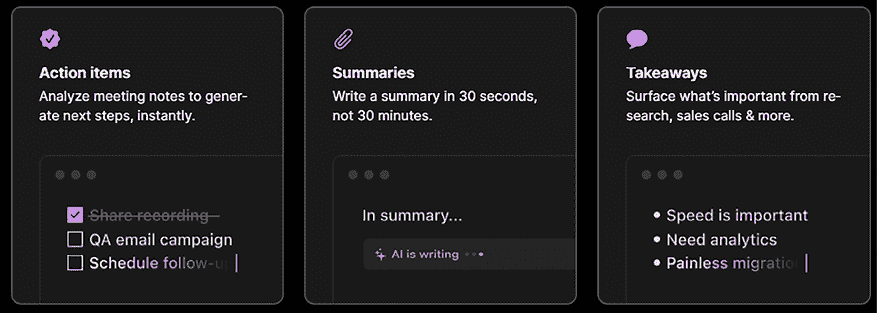
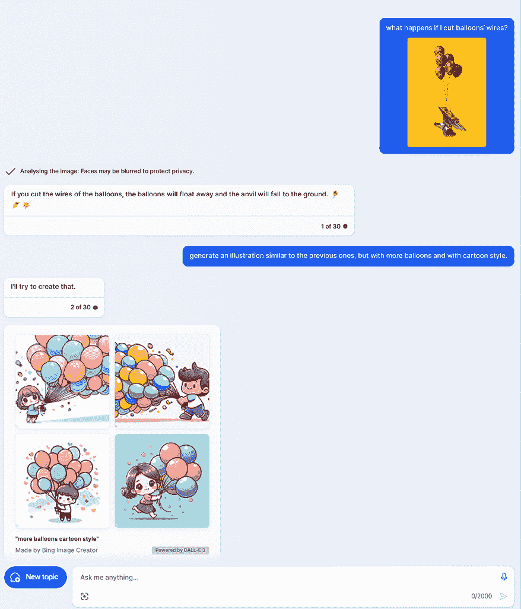

# 第十三章：新兴趋势和创新

亲爱的读者，如果您已经读到此处——恭喜！您成功完成了这次关于大型语言模型（LLM）及其如何与现代应用结合的旅程。从 LLM 的底层原理开始，我们涵盖了由 LLM 驱动的应用的各种场景，从对话聊天机器人，到数据库协同者，再到多模态代理。我们尝试了不同的模型，包括专有和开源的，我们还成功地微调了我们自己的 LLM。最后但同样重要的是，我们涵盖了关键主题“负责任的人工智能”以及如何在我们的 LLM 驱动的应用中嵌入伦理考量。

在本章的最后，我们将探讨生成式人工智能领域的最新进展和未来趋势。请注意，作为一个快速发展的领域，跟上最新的发布几乎是不可能的。尽管如此，本章中涵盖的进展将为您提供一个关于近期可以期待什么的概览。

我们将涵盖以下主题：

+   语言模型和生成式人工智能的最新趋势

+   拥抱生成式人工智能的公司

# 语言模型和生成式人工智能的最新趋势

正如我们在前几章中看到的，LLM 为极其强大的应用奠定了基础。从 LLM 开始，在过去的几个月里，我们见证了生成模型在多模态到新生的框架方面的爆炸性进步，以实现多代理应用。在接下来的几节中，我们将看到这些新发布的例子。

## GPT-4V(视觉)

GPT-4V(视觉)是由 OpenAI 开发的一个**大型多模态模型**（LMM），于 2023 年 9 月正式发布。它使用户能够指示 GPT-4 分析用户提供的图像输入。这种将图像分析集成到 LLM 中的做法代表了人工智能研究和发展中的一个重大进步。通过使用称为**图像分词**的技术实现了模型的多模态性，该技术将图像转换为可以被与文本相同的模型处理的令牌序列。这使得模型能够处理不同类型的数据，如文本和图像，并生成跨模态一致且连贯的输出。

自 2023 年 4 月的初始试验以来，GPT-4V 在各个领域都展现出了非凡的能力。此外，许多企业已经开始在早期测试阶段整合这个模型。一个成功的例子是 Be My Eyes，这是一个帮助超过 2.5 亿有视觉障碍或失明的人的应用程序。该应用将视力不佳或失明的人与能够帮助他们进行日常活动（如识别产品或机场导航）的助手联系起来。利用 GPT-4 的新视觉输入功能，Be My Eyes 在其应用程序中创建了一个虚拟志愿者™，该志愿者使用 GPT-4。这个虚拟志愿者可以产生与人类志愿者相同数量的上下文和理解力。

GPT-4 技术不仅能识别和标记图片中的内容，还能推断和检查情况。例如，它可以查看冰箱里的物品，并推荐你可以用它们做什么菜。将 GPT-4 与其他语言和机器学习模型区分开来的是其进行对话的能力以及该技术提供的更高水平的分析技能。简单的图像识别应用只识别你所看到的。它们不能进行对话以了解面条是否使用了适当的原料，或者地板上的东西是否不仅仅是一个球，而且可能会让你绊倒——并告诉你这一点。

针对 GPT-4V 在公开之前进行的早期实验，OpenAI 实施了多项缓解措施来应对风险和偏见。这些缓解措施旨在提高模型的安全性并减少其输出可能造成的潜在伤害：

+   **拒绝系统**：OpenAI 在 GPT-4V 中添加了对某些类型明显有害生成的拒绝。这个系统有助于防止模型生成推广仇恨团体或包含仇恨符号的内容。

+   **评估和红队测试**：OpenAI 对 GPT-4V 进行了评估，并咨询外部专家来检查该模型的优点和缺点。这个过程有助于检测模型输出中的潜在缺陷和风险。评估涵盖了科学能力、医疗指导、刻板印象、虚假信息威胁、仇恨内容和视觉漏洞等领域。

+   **科学能力**：红队测试人员评估了 GPT-4V 在科学领域的技能和挑战。虽然该模型展示了理解图像中复杂信息并验证科学论文中声明的技能，但它也显示出挑战，例如偶尔混合不同的文本元素和可能的事实错误。

+   **仇恨内容**：在某些情况下，GPT-4V 拒绝回答关于仇恨符号和极端主义内容的问题。然而，该模型的行为可能变化无常，它可能不会总是拒绝生成与不太知名的仇恨团体或符号相关的完成内容。OpenAI 认识到在处理仇恨内容方面需要进一步改进。

+   **无根据的推断**：OpenAI 实施了缓解措施来应对与无根据的推断相关的风险。现在，该模型拒绝了对人的无根据推断请求，减少了产生有偏见或不准确回应的可能性。OpenAI 的目标是完善这些缓解措施，以便未来能够在低风险环境中让模型回答关于人的问题。

+   **虚假信息风险**：GPT-4V 根据图像输入生成定制文本内容的能力增加了虚假信息的风险。OpenAI 承认在使用该模型时，对虚假信息进行适当的风险评估和上下文考虑的必要性。生成图像模型与 GPT-4V 的文本生成能力的结合可能会影响虚假信息风险，但可能还需要额外的缓解措施，如水印或溯源工具。

这些缓解措施，连同现有安全措施的贡献和持续的研究，旨在提高 GPT-4V 的安全性并减少其偏差。OpenAI 承认解决这些风险的动态和挑战性，并致力于在未来迭代中改进和优化模型的表现。

总体而言，GPT-4V 展示了非凡的能力，为 LLM 驱动的应用中的多模态铺平了道路。

## DALL-E 3

OpenAI 的最新图像生成工具 DALL-E 3 于 2023 年 10 月发布。与前版本相比，最重要的更新是其从文本生成图像时的准确性和速度的提高。它旨在生成更详细、更富有表现力和更符合用户规格的图像。实际上，即使使用相同的提示，DALL-E 3 与之前的版本相比也有显著的改进：

图 13.1：由 DALLE-2（左）和 DALL-E 3（右）根据提示“一幅表现力丰富的篮球运动员扣篮的油画，描绘成星云爆炸”生成的图像。来源：[`openai.com/dall-e-3`](https://openai.com/dall-e-3)

+   DALL-E 3 有更多的安全措施和规则，以避免创建包含成人、暴力或仇恨内容的图像。

+   DALL-E 3 现在通过 API 和 OpenAI 游乐场向 ChatGPT Plus 和企业客户提供。它还与微软的 Bing Chat 集成。

## AutoGen

2023 年 10 月，微软发布了一个名为 AutoGen 的新开源项目。这是一个 Python 轻量级框架，允许多个由 LLM（大型语言模型）驱动的代理相互协作以解决用户的任务。关于合作框架的概述，您可以参考[`github.com/microsoft/autogen/tree/main`](https://github.com/microsoft/autogen/tree/main)。

在本书的第二部分早期，我们讨论了许多 LangChain 代理利用外部工具的场景。在这些场景中，我们有一个由 LLM 驱动的代理，它动态地决定使用哪个工具来解决用户的查询。AutoGen 的工作方式不同，因为它让不同的代理，每个代理都扮演着特定的角色和专业知识，合作来处理用户的查询。这里的新颖之处在于，每个代理实际上可以生成输出，作为其他代理的输入，以及生成和修改要执行的计划。这就是为什么该框架也被设计为让人类或管理员参与其中，实际上批准或取消操作和执行。

根据*Wu 等人*的原始论文《*AutoGen：通过多代理会话实现下一代 LLM 应用*》，多代理会话表现出卓越性能的主要原因有三个：

+   **反馈整合**：由于 LLM 有能力阐述和利用反馈，它们可以通过自然语言会话相互合作，以及与人类合作，调整解决给定问题的方法。

+   **适应性**：由于 LLM 是通用模型，如果配置得当，可以适应不同的任务，因此我们可以以模块化和互补的方式初始化不同的代理，利用 LLM 的各种能力。

+   **分解复杂任务**：当 LLM 将复杂任务分解成更小的子任务时（如*第四章*中关于提示工程技术的讨论），它们的工作效果更好。因此，多代理会话可以增强这种分区，将每个代理分配到子任务，同时保持解决问题的整体图景。

要实现多代理会话，有两个主要组件需要注意：

+   **可对话的代理**是能够相互通信并具有不同能力的实体，例如使用 LLM、人类输入或工具。

+   **会话编程**是一种范式，允许开发者使用自然语言或编程语言定义代理之间的交互行为。

您可以在[`www.microsoft.com/en-us/research/publication/autogen-enabling-next-gen-llm-applications-via-multi-agent-conversation-framework/`](https://www.microsoft.com/en-us/research/publication/autogen-enabling-next-gen-llm-applications-via-multi-agent-conversation-framework/)上看到这些会话的样子。

AutoGen 框架已经在解决不同用例方面证明了其强大的能力，其中包括以下方面：

+   **代码生成和执行**。AutoGen 提供了一类可以执行给定目录中`.py`文件的代理。

+   **多智能体协作**。这种场景适用于您希望不同专业领域对特定任务进行推理的任何时候。例如，您可能希望建立一个研究小组，当接到用户的请求时，制定计划、评估计划、接收用户的输入，用不同的专业知识（即不同的智能体）执行计划，等等。

+   **工具集成**。AutoGen 还提供了一些类，这些类有助于外部工具的集成，例如来自提供的向量数据库的网页搜索和**检索增强生成**（**RAG**）。

您可以在[`microsoft.github.io/autogen/docs/Examples#automated-multi-agent-chat`](https://microsoft.github.io/autogen/docs/Examples#automated-multi-agent-chat)找到 AutoGen 框架不同应用的示例。

总体而言，AutoGen 提供了一个有用且创新的工具包，使得智能体之间的合作以及与人类在环中的合作变得更加容易。该项目欢迎贡献，将非常有趣地看到它的发展以及多智能体方法将发展到何种程度，以及它将变成最佳实践。

到目前为止，我们一直在谈论定义上“大”的 LLMs（例如，GPT-3 有 1750 亿个参数）。然而，有时较小的模型也是有用的。

## 小型语言模型

参数更少的较小模型可以在特定任务中展现出非凡的能力。这类模型为现在被称为**小型语言模型**（**SLMs**）的发展铺平了道路。SLMs 的参数比 LLMs 少，这意味着它们需要的计算能力更少，并且可以部署在移动设备或资源受限的环境中。通过使用相关的训练数据，SLMs 还可以微调以在特定领域或任务中表现出色，例如金融、医疗保健或客户服务。

SLMs（小型语言模型）有前景，因为它们相对于 LLMs（大型语言模型）提供了几个优势，例如：

+   它们更高效且成本效益更高，因为它们在训练和运行时需要的计算资源和能源更少。

+   它们更易于访问和便携，因为它们可以部署在移动设备或边缘计算平台上，从而实现更广泛的应用和用户。

+   它们更适应和专业化，因为它们可以使用相关数据微调到特定领域或任务，从而提高它们的准确性和相关性。

+   它们更可解释和值得信赖，因为它们具有更少的参数和更简单的架构，这使得它们更容易理解和调试。

Phi-2 是一个展示卓越推理和语言理解能力的有潜力的 SLM（序列到序列模型）示例，它在参数少于 130 亿的基语言模型中展示了最先进的性能。Phi-2 是微软研究院开发的一个 27 亿参数的语言模型，它在高质量数据源（如教科书和合成文本）上训练，并使用一种新型架构来提高其效率和鲁棒性。Phi-2 可在 Azure AI Studio 模型目录中找到，可用于各种研究和开发目的，例如探索安全挑战、可解释性或微调实验。

在下一节中，我们将看到哪些公司正在积极利用生成式人工智能来处理他们的流程、服务和产品。

# 采用生成式人工智能的公司

自 2022 年 11 月 ChatGPT 发布以来，直到市场上最新的大型基础模型（包括专有和开源的），不同行业的许多公司开始在其流程和产品中采用生成式人工智能。让我们讨论一些最受欢迎的例子。

## 可口可乐

可口可乐与贝恩公司和 OpenAI 合作，利用 DALL-E，一个生成式人工智能模型。这一合作于 2023 年 2 月 21 日宣布。

OpenAI 的 ChatGPT 和 DALL-E 平台将帮助可口可乐创建定制的广告内容、图片和信息。可口可乐的“创造真实魔法”倡议是 OpenAI 和贝恩公司合作的成果（[`www.coca-colacompany.com/media-center/coca-cola-invites-digital-artists-to-create-real-magic-using-new-ai-platform`](https://www.coca-colacompany.com/media-center/coca-cola-invites-digital-artists-to-create-real-magic-using-new-ai-platform)）。这个平台是一种独特的创新，它结合了 GPT-4 的能力，GPT-4 生成听起来像人类进行搜索引擎查询的文本，以及 DALL-E 的能力，DALL-E 可以根据文本创建图像。这使得可口可乐能够快速生成文本、图像和其他内容。这个战略联盟预计将为大型企业客户提供实际价值，使财富 500 强公司内部实现巨大的商业转型。它也为他们的客户树立了一个标准。

## Notion

Notion 是一个多功能的平台，它将笔记记录、项目管理以及数据库功能整合在一个空间内。它允许用户捕捉想法、管理项目，甚至以符合他们需求的方式运营整个公司。Notion 对于寻求一个简单应用以协作处理多个项目的个人、自由职业者、初创公司和团队来说非常理想。

Notion 引入了一个名为 Notion AI 的新功能，该功能使用生成式人工智能。这个功能本质上是一个预测引擎，它根据您输入的提示或文本猜测哪些单词将最适合。它可以执行以下任务：

+   概括长篇文本（例如，会议笔记和录音）

+   生成整个博客文章大纲和电子邮件

+   从会议笔记中创建行动项

+   编辑您的写作以修复语法和拼写错误，改变语气等。

+   协助研究和解决问题

以下截图显示了由生成式 AI 驱动的 Notion 的一些功能：

图 13.2：Notion AI 的某些功能。来源：[`www.notion.so/product/ai`](https://www.notion.so/product/ai)

Notion AI 由 OpenAI 的 GPT 模型驱动，并集成到核心 Notion 应用程序（桌面、浏览器和移动端），允许用户编写提示以生成文本，以及将 AI 应用于他们已编写或捕获的文本。这使得 Notion AI 成为一种强大的数字助手，增强了 Notion 工作空间的功能。

## Malbek

Malbek 是一个现代化的、创新的 **合同生命周期管理**（**CLM**）平台，拥有专有的 AI 核心。它满足您整个组织日益增长的合同需求，包括销售、财务、采购和其他关键业务部门。

Malbek 使用生成式 AI，通过 LLMs 和 ChatGPT 提供功能。它可以执行以下任务：

+   理解合同中的语言

+   进行更改

+   容易接受或拒绝红线

+   使用自然语言制作自定义请求

这一显著的新功能使用户能够加快谈判时间并缩短审查周期，提高了 Malbek 工作空间的功能。

## 微软

自从与 OpenAI 合作以来，微软已经开始在其所有产品中注入由 GPT 系列驱动的 AI，引入并创造了“副驾驶”这一概念。我们已经在 *第二章* 中介绍了副驾驶系统的概念，作为一种新的软件类别，它作为专家助手帮助用户完成复杂任务，与用户并肩工作，并在各种活动中支持他们，从信息检索到博客写作和发布，从头脑风暴到代码审查和生成。

2023 年，微软在其产品中发布了多个副驾驶，例如 Edge Copilot（以前的 Bing Chat）。以下插图显示了 Bing Chat 的用户界面：

图 13.3：微软 Bing Chat

Bing Chat 也是由 GPT-4V 和 DALL-E 3 驱动的多模态对话代理的完美例子。此外，您可以通过音频消息与之互动。以下截图展示了这些多模态功能的一个例子：

图 13.4：利用 Bing Chat 的多模态功能

微软的副驾驶将赋予专业人士和组织大幅提高其生产力和创造力的能力，为一种新的工作方式铺平道路。

总体而言，各个行业的公司都在抓住生成式 AI 的潜力，意识到竞争格局很快将提高协同驾驶和 AI 驱动产品的基准。

# 摘要

在本书的最后一章，我们瞥见了生成式 AI 领域的最新进展。我们涵盖了新的模型发布，如 OpenAI 的 GPT-4V，以及构建 LLM 驱动应用的新框架，如 AutoGen。此外，我们还概述了一些积极使用 LLM 推动其业务的公司的概况，例如 Notion 和微软。

生成式 AI 已被证明是 AI 中最有希望和最激动人心的领域，它有潜力释放人类的创造力，提高生产力，并解决复杂问题。然而，正如我们在上一章所学，它也带来了一些伦理和社会挑战，例如确保生成内容的品质、安全和公平，以及尊重原创创作者的知识产权和隐私权。因此，当我们探索生成式 AI 的新领域时，我们也应关注我们行动在当前时代背景下的影响。我们应该努力将生成式 AI 用于正当目的，并在研究人员、开发人员和用户之间培养合作、创新和责任的文化。尽管如此，生成式 AI 是一个不断发展的领域，在其领域中，一个月的进步相当于几年的技术进步。可以肯定的是，它代表了一个范式转变，公司和个人都在不断适应它。

# 参考文献

+   GPT-4V(ision)系统卡片：[GPTV_System_Card.pdf (openai.com)](https://openai.com)

+   AutoGen 论文：*Qingyun Wu 等人，2023，*AutoGen：通过多智能体对话实现下一代 LLM 应用*: [`arxiv.org/pdf/2308.08155.pdf`](https://arxiv.org/pdf/2308.08155.pdf)

+   AutoGen GitHub: [`github.com/microsoft/autogen/blob/main/notebook/agentchat_web_info.ipynb`](https://github.com/microsoft/autogen/blob/main/notebook/agentchat_web_info.ipynb)

+   DALL-E 3: *James Betker*, *通过更好的标题改进图像生成*: [`cdn.openai.com/papers/dall-e-3.pdf`](https://cdn.openai.com/papers/dall-e-3.pdf)

+   Notion AI: [`www.notion.so/product/ai`](https://www.notion.so/product/ai)

+   可口可乐与贝恩公司合作：[`www.coca-colacompany.com/media-center/coca-cola-invites-digital-artists-to-create-real-magic-using-new-ai-platform`](https://www.coca-colacompany.com/media-center/coca-cola-invites-digital-artists-to-create-real-magic-using-new-ai-platform)

+   Malbek 和 ChatGPT: [`www.malbek.io/news/chat-gpt-malbek-unveils-generative-ai-functionality`](https://www.malbek.io/news/chat-gpt-malbek-unveils-generative-ai-functionality)

+   微软 Copilot: [`www.microsoft.com/en-us/microsoft-365/blog/2023/09/21/announcing-microsoft-365-copilot-general-availability-and-microsoft-365-chat/`](https://www.microsoft.com/en-us/microsoft-365/blog/2023/09/21/announcing-microsoft-365-copilot-general-availability-and-microsoft-365-chat/)

# 加入我们的 Discord 社区

加入我们的 Discord 空间，与作者和其他读者进行讨论：

[`packt.link/llm`](https://packt.link/llm)

