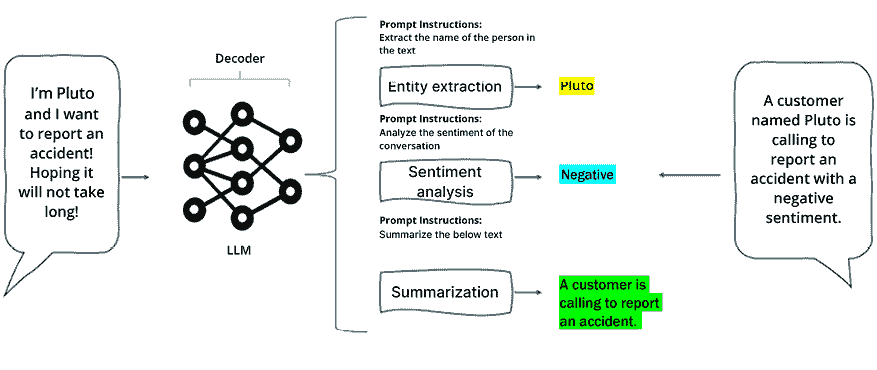
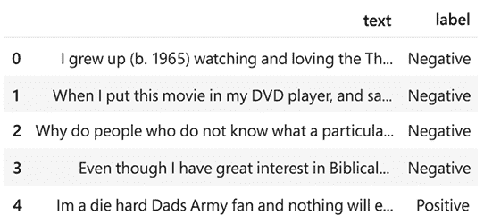

# 第四章：提示工程

在**第二章**中，我们介绍了提示工程的概念，即设计优化提示——引导**大型语言模型**（**LLM**）行为的文本输入——的过程，用于广泛的 LLM 应用和研究主题。由于提示对 LLM 性能有巨大影响，因此提示工程在设计 LLM 驱动的应用时是一个关键活动。实际上，有一些技术不仅可以完善你的 LLM 的响应，还可以降低与幻觉和偏差相关的风险。

在本章中，我们将介绍提示工程领域的新兴技术，从基本方法到高级框架。到本章结束时，你将拥有为你的 LLM 驱动的应用构建功能性和稳固提示的基础，这些内容在接下来的章节中也将相关。

我们将探讨以下主题：

+   提示工程简介

+   提示工程的基本原则

+   提示工程的高级技术

# 技术要求

要完成本章中的任务，你需要以下要求：

+   OpenAI 账户和 API

+   Python 3.7.1 或更高版本

你可以在本书的 GitHub 仓库`github.com/PacktPublishing/Building-LLM-Powered-Applications`中找到所有代码和示例。

# 什么是提示工程？

提示是一种文本输入，它指导 LLM 生成文本输出。

提示工程是设计有效的提示，以从 LLMs 中激发高质量和相关性输出的过程。提示工程需要创造力、对 LLM 的理解和精确性。

下图展示了如何通过一个精心编写的提示来指导同一模型执行三个不同的任务：



图 4.1：提示工程示例，用于专门化 LLM

如你所想，提示成为 LLM 驱动的应用成功的关键要素之一。因此，在这一步投入时间和资源至关重要，遵循我们将在下一节中介绍的一些最佳实践和原则。

# 提示工程原理

通常来说，由于需要考虑的变量太多（使用的模型类型、应用目标、支持的基础设施等），没有固定的规则来获得“完美”的提示。尽管如此，有一些明确的原理，如果将其纳入提示中，已被证明会产生积极的效果。让我们来探讨一些。

## 明确的指令

明确指令的原则是向模型提供足够的信息和指导，以便正确且高效地完成任务。明确的指令应包括以下要素：

+   任务的目标或目的，例如“写一首诗”或“总结一篇文章”

+   预期输出的格式或结构，例如“使用四行押韵的词”或“使用每项不超过 10 个单词的项目符号”

+   任务约束或限制，例如“不要使用任何粗俗语言”或“不要复制任何源文本”

+   任务的上下文或背景，例如“这首诗是关于秋天的”或“这篇文章来自科学期刊”

假设，例如，我们希望我们的模型能够从文本中获取任何类型的指令，并以项目符号列表的形式返回教程。此外，如果提供的文本中没有指令，模型应通知我们。以下是步骤：

1.  首先，我们需要初始化我们的模型。为此，我们将利用 OpenAI 的 GPT-3.5-turbo 模型。我们首先安装 `openai` 库：

    ```py
    $pip install openai == 0.28 
    ```

1.  为了初始化模型，我使用了 `openai` Python 库，并将 OpenAI API 密钥设置为环境变量：

    ```py
    import os
    import openai
    openai.api_key = os.environment.get('OPENAI_API_KEY')
    response = openai.ChatCompletion.create(
        model="gpt-3.5-turbo", # engine = "deployment_name".
        messages=[
            {"role": "system", "content": system_message},
            {"role": "user", "content": instructions},
        ]
    ) 
    ```

如您所见，聊天模型包含两个变量占位符：`system message`（或元提示），在这里我们定义我们希望模型如何表现，以及`instructions`（或查询），用户将向模型提问。

1.  然后，它获取用户的查询（在这种情况下，文本指令）。对于这个场景，我将两个变量 `system_message` 和 `instructions` 设置如下：

    ```py
    system_message = """
    You are an AI assistant that helps humans by generating tutorials given a text.
    You will be provided with a text. If the text contains any kind of istructions on how to proceed with something, generate a tutorial in a bullet list.
    Otherwise, inform the user that the text does not contain any instructions.
    Text:
    """
    instructions = """
    To prepare the known sauce from Genova, Italy, you can start by toasting the pine nuts to then coarsely
    chop them in a kitchen mortar together with basil and garlic. Then, add half of the oil in the kitchen mortar and season with salt and pepper.
    Finally, transfer the pesto to a bowl and stir in the grated Parmesan cheese.
    """ 
    ```

1.  现在让我们测试我们的模型：

    ```py
    print(response['choices'][0]['message']['content']) 
    ```

我们得到以下输出：

```py
Sure, I can generate a tutorial based on the given text. Here's a bullet list on how to prepare the Genovese pesto sauce:
- Toast the pine nuts on a pan until they are slightly browned.
- Coarsely chop the toasted pine nuts, along with basil leaves and garlic cloves, using a kitchen mortar.
- Add half of the olive oil into the kitchen mortar, and season the mixture with salt and pepper.
- Grind the mixture until it becomes a smooth paste.
- Transfer the pesto to a bowl, and stir in the grated Parmesan cheese.
- You can add more olive oil to achieve the desired consistency for the sauce.
- Your Genovese pesto sauce is now ready. It can be served with pasta, vegetables, or as a dip for bread. Enjoy! 
```

1.  注意，如果我们向模型传递另一段不包含任何指令的文本，它将能够按照我们的指示进行响应：

    ```py
    response = openai.ChatCompletion.create(
        model="gpt-3.5-turbo", # engine = "deployment_name".
        messages=[
            {"role": "system", "content": system_message},
            {"role": "user", "content": 'the sun is shining and dogs are running on the beach.'},
        ]
    )
    #print(response)
    print(response['choices'][0]['message']['content']) 
    ```

以下是对应的输出：

```py
As there are no instructions provided in the text you have given me, it is not possible to create a tutorial. May I have a different text to work with? 
```

通过给出清晰的指令，你可以帮助模型理解你想要它做什么以及你希望它如何去做。这可以提高模型输出的质量和相关性，并减少进一步修订或校正的需求。

然而，有时，即使清晰度足够，也可能存在一些场景。我们可能需要推断我们的 LLM 的思维方式，使其在任务上更加稳健。在下一节中，我们将检查这些技术之一，这在完成复杂任务时将非常有用。

## 将复杂任务分解为子任务

如前所述，提示工程是一种技术，涉及为 LLM 设计有效的输入以执行各种任务。有时，任务过于复杂或含糊不清，以至于单个提示无法处理，最好将它们分解为更简单的子任务，这些子任务可以通过不同的提示来解决。

下面是一些将复杂任务分解为子任务的例子：

+   **文本摘要：** 一个复杂任务，涉及生成一个简洁且准确的摘要。这个任务可以分为子任务，例如：

    +   从文本中提取主要观点或关键词

    +   以连贯流畅的方式重写主要观点或关键词

    +   将摘要修剪到期望的长度或格式

+   **机器翻译：** 一个复杂任务，涉及将文本从一种语言翻译成另一种语言。这个任务可以分为子任务，例如：

    +   识别文本的源语言

    +   将文本转换为保留原始文本意义和结构的中间表示

    +   从中间表示生成目标语言的文本

+   **诗歌生成**：一项创造性的任务，涉及创作遵循特定风格、主题或情感的诗歌。这项任务可以分解为以下子任务：

    +   选择诗歌的形式（如十四行诗、俳句、雷姆里克等）和押韵模式（如 ABAB、AABB、ABCB 等）为诗歌

    +   根据用户的输入或偏好生成诗歌的标题和主题

    +   生成符合所选形式、押韵模式和主题的诗行或诗节

    +   精炼和润色诗歌，以确保连贯性、流畅性和原创性

+   **代码生成**：一项技术任务，涉及生成执行特定功能或任务的代码片段。这项任务可以分解为以下子任务：

    +   选择编程语言（如 Python、Java、C++等）以及框架或库（如 TensorFlow、PyTorch、React 等）用于代码

    +   根据用户的输入或规格生成代码的函数名和参数列表以及返回值

    +   生成实现代码逻辑和功能的函数体

    +   添加注释和文档来解释代码及其用法

让我们考虑以下 Python 示例，我们将要求我们的模型生成一篇文章的摘要：

1.  我们将利用 OpenAI 的 GPT-3.5-turbo 模型，方式与本章前面讨论的示例类似：

    ```py
    import os
    import openai
    openai.api_key = os.environ.get("OPENAI_API_KEY")
    response = openai.ChatCompletion.create(
        model="gpt-35-turbo", # engine = "deployment_name".
        messages=[
            {"role": "system", "content": system_message},
            {"role": "user", "content": article},
        ]
    ) 
    ```

1.  让我们将`system_message`和`article`变量设置为以下内容（您可以在书籍的 GitHub 存储库中找到整个脚本）：

    ```py
    system_message = """
    You are an AI assistant that summarizes articles.
    To complete this task, do the following subtasks:
    Read the provided article context comprehensively and identify the main topic and key points
    Generate a paragraph summary of the current article context that captures the essential information and conveys the main idea
    Print each step of the process.
    Article:
    """
    article = """
    Recurrent neural networks, long short-term memory, and gated recurrent neural networks
    in particular, […]
    """ 
    ```

1.  要查看输出，您可以运行以下代码：

    ```py
    print(response['choices'][0]['message']['content']) 
    ```

这是获得的结果：

```py
Summary:
The article discusses the use of recurrent neural networks, specifically long short-term memory and gated recurrent neural networks, in sequence modeling and transduction problems. These models have achieved great success but are limited by their inherently sequential nature. Attention mechanisms have become popular in addressing this issue but are usually used in conjunction with recurrent networks. The authors propose the Transformer, an architecture that relies solely on attention mechanisms instead of recurrence. The Transformer allows for greater parallelization and can achieve state-of-the-art results in machine translation after only twelve hours of training on eight GPUs.
Steps:
1\. The article discusses the success and limitations of recurrent neural networks in sequence modeling and transduction problems.
2\. Attention mechanisms have become popular in addressing the limitations of recurrence but are usually used alongside recurrent networks.
3\. The authors propose the Transformer, a model architecture that relies solely on attention mechanisms and allows for greater parallelization.
4\. The Transformer can achieve state-of-the-art results in machine translation after only twelve hours of training on eight GPUs. 
```

如您所见，模型能够根据从给定文章中提取（并显示）的关键主题生成高质量的摘要。我们提示模型将任务分解为子任务“迫使”它降低每个子任务的复杂性，从而提高了最终结果的质量。这种方法在处理数学问题等场景时也能带来显著的效果，因为它增强了模型的推理能力。

**注意**

在众多不同的 LLM 中，了解同一个系统消息可能并不在所有模型中都同样有效。例如，与 GPT-4 完美配合的系统消息在应用于 Llama 2 时可能效率不高。因此，根据您为应用程序选择的 LLM 类型设计提示至关重要。

将复杂任务分解为更简单的子任务是一种强大的技术；然而，它并没有解决 LLM 生成内容的主要风险之一，即输出错误。在接下来的两个部分中，我们将看到一些主要旨在解决这一风险的技术。

## 要求进行论证

LLMs 是以一种方式构建的，它们根据前面的标记预测下一个标记，而不会回顾它们的生成内容。这可能会导致模型以非常令人信服的方式向用户输出错误的内容。如果 LLM 驱动的应用程序没有提供对该响应的具体参考，那么验证其背后的真实情况可能会很困难。因此，在提示中指定使用一些反思和论证来支持 LLM 的答案可能会促使模型从其行为中恢复过来。此外，要求进行论证也可能在答案正确但我们不知道 LLM 背后的推理时有用。例如，假设我们想让我们的 LLM 解决谜语。为此，我们可以这样指示它：

```py
system_message = """
You are an AI assistant specialized in solving riddles.
Given a riddle, solve it the best you can.
Provide a clear justification of your answer and the reasoning behind it.
Riddle:
""" 
```

如您所见，我在元提示中指定了要求 LLM 对其答案进行论证并提供其推理。让我们看看它是如何工作的：

```py
riddle = """
What has a face and two hands, but no arms or legs?
"""
response = openai.ChatCompletion.create(
    model="gpt-3.5-turbo",
    messages=[
        {"role": "system", "content": system_message},
        {"role": "user", "content": riddle},
    ]
)
#print(response)
print(response['choices'][0]['message']['content']) 
```

下面的输出结果如下：

```py
The answer to this riddle is a clock.
A clock has a face with numbers and two hands (the hour and minute hand), which rotate around the center of the clock to show the time. Although it doesn't have any arms or legs like humans do, it still has the ability to measure time, which is important in our daily lives.
Hence, a clock is the correct answer to this riddle. 
```

论证是使您的模型更加可靠和健壮的绝佳工具，因为它们迫使模型“重新思考”其输出，同时也为我们提供了如何设置推理以解决问题的一个视角。

使用类似的方法，我们也可以在不同的提示级别上进行干预，以改善我们的 LLM 性能。例如，我们可能会发现模型在系统地以错误的方式解决数学问题；因此，我们可能会在元提示级别上直接建议正确的方法。另一个例子可能是要求模型生成多个输出——包括它们的理由——以评估不同的推理技术，并在元提示中提示最佳的一个。

在下一节中，我们将关注这些例子中的一个，更具体地说，是生成多个输出然后选择最可能的一个的可能性。

## 生成多个输出，然后使用模型选择最佳的一个

正如我们在上一节中看到的，LLMs（大型语言模型）是以一种方式构建的，它们根据前面的标记预测下一个标记，而不会回顾它们的生成内容。如果这种情况发生，如果一个采样的标记是错误的（换句话说，如果模型运气不好），LLM 将会继续生成错误的标记，从而生成错误的内容。现在，坏消息是，与人类不同，LLMs 无法自行从错误中恢复。这意味着，如果我们要求它们，它们会承认错误，但我们需要明确提示它们去思考这一点。

克服这种限制的一种方法是通过扩大选择正确标记的概率空间。而不仅仅生成一个响应，我们可以提示模型生成多个响应，然后选择最适合用户查询的一个。这把我们的 LLM 的工作分成了两个子任务：

1.  对用户的查询生成多个响应

1.  比较这些响应并根据我们可以在元提示中指定的某些标准选择最佳的一个

让我们看看一个例子，继续探讨上一节中讨论的谜题：

```py
system_message = """
You are an AI assistant specialized in solving riddles.
Given a riddle, you have to generate three answers to the riddle.
For each answer, be specific about the reasoning you made.
Then, among the three answers, select the one that is most plausible given the riddle.
Riddle:
"""
riddle = """
What has a face and two hands, but no arms or legs?
""" 
```

在这种情况下，我提示模型对谜题生成三个答案，然后告诉我最有可能的答案，并说明理由。让我们看看结果：

```py
response = openai.ChatCompletion.create(
    model="gpt-3.5-turbo", # engine = "deployment_name".
    messages=[
        {"role": "system", "content": system_message},
        {"role": "user", "content": riddle},
    ]
)
#print(response)
print(response['choices'][0]['message']['content']) 
```

我们随后得到以下输出：

```py
Answer 1: A clock. A clock has a face with numbers and two hands to show minutes and hours. It does not have arms or legs because it is an object, and it does not have intrinsic limbs.
Answer 2: A watch. Similar to a clock, a watch also has a face with numbers and two hands to indicate the time. Although it is usually worn on a person's wrist, it does not have arms or legs.
Answer 3: A wall. While this answer may be less obvious, a wall does, in a way, have a face and two hands. The face is its outer surface, and the hands are the clock that usually hangs on the wall.
Among the three answers, the most plausible one is answer 1: a clock. The riddle distinctly mentions "two hands" and it's logical to associate hands with those that are found in clocks to indicate time. 
```

如您所见，模型选择了最合理的答案，并对其选择进行了说明。值得注意的是，“时钟”和“手表”可能看起来是相似的回答；然而，模型明确指出“手表”通常戴在人的手腕上，尽管这并不意味着它有手臂或腿，但这个元素可能降低了它成为正确答案的概率。

你会选择什么？

如前所述，迫使模型以不同的方法解决一个问题是一种收集多个推理样本的方法，这可能会作为元提示中的进一步指令。例如，如果我们想让模型始终提出不是问题最直接解决方案的建议——换句话说，如果我们想让它“思考不同”的话——我们可能迫使它以 N 种方式解决问题，然后使用最具创造性的推理作为元提示的框架。

我们将要检查的最后一个元素是我们想要赋予我们的元提示的整体结构。实际上，在之前的例子中，我们看到了一个包含一些声明和指令的示例系统消息。在下一节中，我们将看到那些声明和指令的顺序和“强度”并不是不变的。

## 重复指令在末尾

大型语言模型（LLMs）往往不会对元提示中的所有部分赋予相同的权重或重要性。实际上，在 John Stewart（微软的一名软件工程师）的博客文章《大型语言模型复杂摘要的提示工程》中，他发现了一些有趣的成果，这些成果来自于对提示部分的排列（[`devblogs.microsoft.com/ise/gpt-summary-prompt-engineering/`](https://devblogs.microsoft.com/ise/gpt-summary-prompt-engineering/)）。更具体地说，经过几次实验，他发现重复在提示末尾的主要指令可以帮助模型克服其内在的**近期偏差**。

**定义**

近期偏差是大型语言模型（LLMs）倾向于给予提示末尾出现的信息更多权重，而忽略或忘记早期出现的信息的倾向。这可能导致不准确或不一致的响应，这些响应没有考虑到整个任务的上下文。例如，如果提示是两个人之间的长对话，模型可能只会关注最后几条消息，而忽略之前的消息。

让我们看看一些克服近期偏差的方法：

+   克服近期偏差的一个可能方法是将任务分解成更小的步骤或子任务，并在过程中提供反馈或指导。这可以帮助模型专注于每个步骤，避免在无关的细节中迷失。我们在“将复杂任务拆分为子任务”部分讨论了这项技术。

+   使用提示工程技术克服近期偏差的另一种方法是，在提示的末尾重复指令或任务的主要目标。这可以帮助模型记住它应该做什么以及应该生成什么样的响应。

例如，假设我们想让我们的模型输出 AI 代理和用户之间整个聊天历史的情感。我们想确保模型将输出小写且不带标点的情感。

让我们考虑以下示例（对话被截断，但你可以找到整个代码在本书的 GitHub 仓库中）。在这种情况下，关键指令是只输出小写且不带标点的情感：

```py
system_message = """
You are a sentiment analyzer. You classify conversations into three categories: positive, negative, or neutral.
Return only the sentiment, in lowercase and without punctuation.
Conversation:
"""
conversation = """
Customer: Hi, I need some help with my order.
AI agent: Hello, welcome to our online store. I'm an AI agent and I'm here to assist you.
Customer: I ordered a pair of shoes yesterday, but I haven't received a confirmation email yet. Can you check the status of my order?
[…]
""" 
```

在这种情况下，我们在对话之前有关键指令，所以让我们初始化我们的模型，并用两个变量 `system_message` 和 `conversation` 来喂养它：

```py
response = openai.ChatCompletion.create(
    model="gpt-3.5-turbo", # engine = "deployment_name".
    messages=[
        {"role": "system", "content": system_message},
        {"role": "user", "content": conversation},
    ]
)
#print(response)
print(response['choices'][0]['message']['content']) 
```

这里是我们收到的输出：

```py
Neutral 
```

模型没有遵循只使用小写字母的指令。让我们尝试在提示的末尾也重复指令：

```py
system_message = f"""
You are a sentiment analyzer. You classify conversations into three categories: positive, negative, or neutral.
Return only the sentiment, in lowercase and without punctuation.
Conversation:
{conversation}
Remember to return only the sentiment, in lowercase and without punctuation
""" 
```

再次，让我们用更新的 `system_message` 调用我们的模型：

```py
response = openai.ChatCompletion.create(
    model="gpt-3.5-turbo", # engine = "deployment_name".
    messages=[
        {"role": "user", "content": system_message},
    ]
)
#print(response)
print(response['choices'][0]['message']['content']) 
```

这里是相应的输出：

```py
neutral 
```

如您所见，现在模型能够提供我们想要的精确输出。这种方法特别有用，每当我们在上下文窗口中存储对话历史时。如果这种情况发生，将主要指令放在开头可能会让模型在通过整个历史记录时不再考虑这些指令，从而减弱它们的影响力。

## 使用分隔符

我们要讨论的最后一个原则与我们想要给我们的元提示的格式有关。这有助于我们的 LLM 更好地理解其意图，以及将不同的部分和段落联系起来。

为了实现这一点，我们可以在提示中使用分隔符。分隔符可以是任何字符或符号的序列，它清楚地映射一个模式而不是一个概念。例如，我们可以考虑以下序列作为分隔符：

+   `>>>>`

+   `====`

+   `------`

+   `####`

+   `` ` ` ` ` ` ``

这导致一系列的好处，包括：

+   清晰分隔：分隔符在提示中标记不同的部分，分离指令、示例和期望的输出。

+   LLM 指导：正确使用分隔符可以消除歧义，有效地引导模型。

+   提高精确度：分隔符改进了提示理解，导致更相关的响应。

+   提高连贯性：有效使用分隔符组织指令、输入和输出，导致连贯的响应。

让我们考虑一个元提示，其目的是指导模型将用户的任务转换为 Python 代码，并提供一个示例：

```py
system_message = """
You are a Python expert who produces Python code as per the user's request.
===>START EXAMPLE
---User Query---
Give me a function to print a string of text.
---User Output---
Below you can find the described function:
```def my_print(text):

    return print(text)

```py
<===END EXAMPLE
"""
query = "generate a Python function to calculate the nth Fibonacci number" 
```

在上述示例中，我们使用了分隔符来指定一次学习方法的示例的开始和结束，并在示例内部指定了 Python 代码片段。

让我们看看它是如何工作的：

```py
response = openai.ChatCompletion.create(
    model="gpt-3.5-turbo", # engine = "deployment_name".
    messages=[
        {"role": "system", "content": system_message},
        {"role": "user", "content": query},
    ]
)
#print(response)
print(response['choices'][0]['message']['content']) 
```

这里是我们的输出：

```py
Sure, here's a Python function to calculate the nth Fibonacci number:
```python def fibonacci(n):

if n < 0:

return None

elif n == 0:

return 0

elif n == 1:

return 1

else:

return fibonacci(n-1) + fibonacci(n-2) ```py
The function takes a non-negative integer `n` as input and returns the nth Fibonacci number. If `n` is less than 0, the function returns `None`. If `n` is 0 or 1, the function returns the value of `n`. In all other cases, the function recursively calls itself with `n-1` and `n-2` and adds their results to compute the nth Fibonacci number. 
```

如你所见，它还打印了带有反引号的代码，正如系统消息中所示。

到目前为止所检查的所有原则都是通用规则，可以使你的基于 LLM 的应用程序更加健壮。无论你正在开发哪种类型的应用程序，都应该记住这些技术，因为它们是通用的最佳实践，可以提高你的 LLM 性能。在下一节中，我们将看到一些高级的提示工程技术。

# 高级技术

根据特定场景实施的高级技术可能针对模型推理和思考答案的方式，在向最终用户提供答案之前。让我们在接下来的章节中看看其中的一些。

## 少量样本方法

在他们的论文《Language Models are Few-Shot Learners》中，Tom Brown 等人证明了 GPT-3 在少量样本设置下可以在许多 NLP 任务上取得良好的性能。这意味着对于所有任务，GPT-3 都是未经任何微调应用的，任务和少量样本演示完全通过模型与文本的交互来指定。

这是一个示例和证据，说明了少量样本学习（few-shot learning）的概念——即向模型提供我们希望其如何响应的示例——是一种强大的技术，它可以在不干扰整体架构的情况下实现模型定制。

例如，假设我们希望我们的模型为我们的新登山鞋产品线——我们刚刚命名的 Elevation Embrace——生成一个标语。我们有一个关于标语应该是什么样的想法——简洁直接。我们可以用纯文本向模型解释它；然而，直接提供一些类似项目的示例可能更有效。

让我们通过代码来查看一个实现：

```py
system_message = """
You are an AI marketing assistant. You help users to create taglines for new product names.
Given a product name, produce a tagline similar to the following examples:
Peak Pursuit - Conquer Heights with Comfort
Summit Steps - Your Partner for Every Ascent
Crag Conquerors - Step Up, Stand Tall
Product name:
"""
product_name = 'Elevation Embrace' 
```

让我们看看我们的模型将如何处理这个请求：

```py
response = openai.ChatCompletion.create(
    model="gpt-3.5-turbo", # engine = "deployment_name".
    messages=[
        {"role": "system", "content": system_message},
        {"role": "user", "content": product_name},
    ]
)
#print(response)
print(response['choices'][0]['message']['content']) 
```

以下是我们输出的结果：

```py
Tagline idea: Embrace the Heights with Confidence. 
```

如你所见，它保持了提供的标签的风格、长度和写作规范。当你希望你的模型遵循你已有的示例时，例如固定模板，这非常有用。

注意，大多数情况下，少量样本学习足够强大，甚至可以在极端专业化的场景中定制模型，在这种情况下，我们可以将微调视为适当的工具。事实上，适当的少量样本学习可能和微调过程一样有效。

让我们看看另一个例子。假设我们想要开发一个专注于情感分析的模型。为此，我们提供了一系列具有不同情感的文本示例，以及我们想要的输出——正面或负面。请注意，这组示例只是监督学习任务的小型训练集；与微调的唯一区别是我们没有更新模型的参数。

为了向您提供一个具体的表示，让我们为每个标签提供两个示例：

```py
system_message = """
You are a binary classifier for sentiment analysis.
Given a text, based on its sentiment, you classify it into one of two categories: positive or negative.
You can use the following texts as examples:
Text: "I love this product! It's fantastic and works perfectly."
Positive
Text: "I'm really disappointed with the quality of the food."
Negative
Text: "This is the best day of my life!"
Positive
Text: "I can't stand the noise in this restaurant."
Negative
ONLY return the sentiment as output (without punctuation).
Text:
""" 
```

为了测试我们的分类器，我使用了 Kaggle 上可用的 IMDb 电影评论数据库，网址为[`www.kaggle.com/datasets/yasserh/imdb-movie-ratings-sentiment-analysis/data`](https://www.kaggle.com/datasets/yasserh/imdb-movie-ratings-sentiment-analysis/data)。正如您所看到的，数据集包含许多电影评论及其相关的情感——正面或负面。让我们将 0-1 的二进制标签替换为详尽的标签“负面-正面”：

```py
import numpy as np
import pandas as pd
df = pd .read_csv('movie.csv', encoding='utf-8')
df['label'] = df['label'].replace({0: 'Negative', 1: 'Positive'})
df.head() 
```

这给我们提供了数据集的前几条记录，具体如下：



图 4.2：电影数据集的第一观察

现在，我们想要测试我们的模型在数据集的 10 个观察样本上的性能：

```py
df = df.sample(n=10, random_state=42)
def process_text(text):
    response = openai.ChatCompletion.create(
        model="gpt-3.5-turbo",
        messages=[
            {"role": "system", "content": system_message},
            {"role": "user", "content": text},
        ]
    )
    return response['choices'][0]['message']['content']
df['predicted'] = df['text'].apply(process_text)
print(df) 
```

以下是我们输出的结果：


图 4.3：GPT-3.5 模型在少量示例下的输出

如您所见，通过比较“标签”和“预测”列，模型能够正确地分类所有评论，甚至没有进行微调！这只是您可以通过少量学习技术实现的例子——在模型专业化方面。

## 思维链

在 Wei 等人撰写的论文《思维链提示在大型语言模型中激发推理》中引入的**思维链**（**CoT**）是一种通过中间推理步骤实现复杂推理能力的技巧。它还鼓励模型解释其推理，迫使它不要过于迅速，以免给出错误响应（如我们在前面的章节中看到的）。

假设我们想要提示我们的 LLM（大型语言模型）解决一元一次方程。为此，我们将提供一个基本的推理列表，它可能想要遵循：

```py
system_message = """
To solve a generic first-degree equation, follow these steps:
1\. **Identify the Equation:** Start by identifying the equation you want to solve. It should be in the form of "ax + b = c," where 'a' is the coefficient of the variable, 'x' is the variable, 'b' is a constant, and 'c' is another constant.
2\. **Isolate the Variable:** Your goal is to isolate the variable 'x' on one side of the equation. To do this, perform the following steps:

   a. **Add or Subtract Constants:** Add or subtract 'b' from both sides of the equation to move constants to one side.

   b. **Divide by the Coefficient:** Divide both sides by 'a' to isolate 'x'. If 'a' is zero, the equation may not have a unique solution.
3\. **Simplify:** Simplify both sides of the equation as much as possible.
4\. **Solve for 'x':** Once 'x' is isolated on one side, you have the solution. It will be in the form of 'x = value.'
5\. **Check Your Solution:** Plug the found value of 'x' back into the original equation to ensure it satisfies the equation. If it does, you've found the correct solution.
6\. **Express the Solution:** Write down the solution in a clear and concise form.
7\. **Consider Special Cases:** Be aware of special cases where there may be no solution or infinitely many solutions, especially if 'a' equals zero.
Equation:
""" 
```

让我们看看它是如何实现的：

```py
equation = "3x + 5 = 11"
response = openai.ChatCompletion.create(
    model="gpt-3.5-turbo", # engine = "deployment_name".
    messages=[
        {"role": "system", "content": system_message},
        {"role": "user", "content": equation},
    ]
)
#print(response)
print(response['choices'][0]['message']['content']) 
```

以下是我们输出的结果：

```py
1\. Identify the Equation: The equation is 3x + 5 = 11.
2\. Isolate the Variable:

   a. Subtract Constants: Subtract 5 from both sides to move constants to one side:

      3x + 5 - 5 = 11 - 5

   Simplifying, we get:

      3x = 6

   b. Divide by the Coefficient: Divide both sides by 3 to isolate 'x':

      3x/3 = 6/3

   Simplifying, we get:

      x = 2

3\. Simplify: Both sides are already simplified.
4\. Solve for 'x': x = 2.
5\. Check Your Solution: Plug x = 2 back into the original equation:
   3(2) + 5 = 11

   Simplifying, we get:

   6 + 5 = 11

   The left side equals the right side, so the solution is correct.
6\. Express the Solution: The solution to the equation 3x + 5 = 11 is x = 2.
7\. Consider Special Cases: Since the coefficient 3 is not zero, there are no special cases to consider. 
```

如您所见，模型清楚地遵循了元提示中指定的七个步骤，这也允许模型“慢慢来”完成这项任务。请注意，您还可以将其与少量提示结合使用，以在需要推理才能回答的更复杂任务上获得更好的结果。

使用 CoT（思维链），我们正在提示模型生成中间推理步骤。这也是另一种推理技术的组成部分，我们将在下一节中对其进行探讨。

## ReAct

由姚等人发表的论文《ReAct：在语言模型中协同推理和行动》中引入的**ReAct**（**推理和行动**）是一个将推理和行动与 LLMs 结合的通用范式。ReAct 促使语言模型为任务生成口头推理轨迹和行动，并从外部来源（如网络搜索或数据库）接收观察结果。这使得语言模型能够执行动态推理，并根据外部信息快速调整其行动计划。例如，你可以提示语言模型首先对问题进行推理，然后执行一个动作向网络发送查询，然后从搜索结果中接收观察结果，接着继续这个思考、行动、观察的循环，直到得出结论。

CoT 和 ReAct 方法之间的区别在于，CoT 提示语言模型为任务生成中间推理步骤，而 ReAct 提示语言模型为任务生成中间推理步骤、行动和观察。

注意，“行动”阶段通常与我们的 LLM 与外部工具（如网络搜索）交互的可能性有关。

例如，假设我们想要询问模型有关即将到来的奥运会的最新信息。为此，我们将构建一个智能 LangChain 代理（如第二章所述），利用`SerpAPIWrapperWrapper`（将`SerpApi`包装以导航网络）、`AgentType`工具（决定为我们目标使用哪种类型的代理）和其他与提示相关的模块（使其更容易“模板化”我们的指令）。让我们看看我们如何做到这一点（由于下一章将完全专注于 LangChain 及其主要组件，因此我不会深入探讨以下代码的每个组件）：

```py
import os
from dotenv import load_dotenv
from langchain import SerpAPIWrapper
from langchain.agents import AgentType, initialize_agent
from langchain.chat_models import ChatOpenAI
from langchain.tools import BaseTool, StructuredTool, Tool, tool
from langchain.schema import HumanMessage
model = ChatOpenAI(
    model_name='gpt-35-turbo'
)
load_dotenv()
key = os.environ["SERPAPI_API_KEY"]
search = SerpAPIWrapper()
tools = [
    Tool.from_function(
        func=search.run,
        name="Search",
        description="useful for when you need to answer questions about current events"
    )
    ]
agent_executor = initialize_agent(tools, model, agent=AgentType.ZERO_SHOT_REACT_DESCRIPTION, verbose=True) 
```

如您所见，为此，我使用了 LangChain 中可用的预构建代理类型`ZERO_SHOT_REACT_DESCRIPTION`。它附带了一个遵循 ReAct 方法的预编译提示。让我们检查一下这个提示：

```py
print(agent_executor.agent.llm_chain.prompt.template) 
```

这里是相应的输出：

```py
Answer the following questions as best you can. You have access to the following tools:
Search: useful for when you need to answer questions about current events
Use the following format:
Question: the input question you must answer
Thought: you should always think about what to do
Action: the action to take, should be one of [Search]
Action Input: the input to the action
Observation: the result of the action
... (this Thought/Action/Action Input/Observation can repeat N times)
Thought: I now know the final answer
Final Answer: the final answer to the original input question
Begin!
Question: {input}
Thought:{agent_scratchpad} 
```

让我们现在通过询问有关即将到来的奥运会的问题并聚焦于中间步骤来测试我们的代理：

```py
agent_executor('who are going to be the italian male athletes for climbing at the Paris 2024 Olympics?') 
```

这是对中间步骤的输出：

```py
> Entering new AgentExecutor chain... I should search for recent news or updates about the Italian male athletes for climbing at the Paris 2024 Olympics Action: Search Action Input: "Italian male athletes climbing Paris 2024 Olympics"
>Observation: A select group of climbers ensured their participation in the 2024 Paris Olympics. Among them, Italy's Matteo Zurloni and Indonesia's Desak Made Rita Kusuma Dewi didn't just secure their Olympic berths; they also took home the world titles in their respective categories. Thought: I need to refine my search to find a more comprehensive list of Italian male climbers for Paris 2024 Olympics Action: Search Action
>Input: "List of Italian male climbers Paris 2024 Olympics" Observation: Italy fielded a squad of five male gymnasts for Paris after advancing to the final round ... Paris 2024 qualification berths, and medals table - complete list".
>Thought:This information does not seem to be readily available, I should try contacting the Italian climbing federation for more information Action: Search Action Input: "contact information for Italian climbing federation" Observation: IFSC HEADQUARTERS: Corso Vinzaglio 12 10121, Torino, ITALY. Opening Hours: Monday - Friday 9:00 AM - 5:00 PM CEST. IFSC OFFICE:. Thought: I can reach out to the Italian climbing federation to ask for a list of their male athletes participating in the Paris 2024 Olympics
>Action: Contact Action Input: Email or phone call to the Italian climbing federation requesting information on the male athletes for Paris 2024 Olympics Observation: Contact is not a valid tool, try one of [Search]. Thought: I will refine my search further to see if any new information has been released about the Italian male climbers for the Paris 2024 Olympics
>Action: Search Action Input: "Latest updates on Italian male climbers for Paris 2024 Olympics" Observation: Aleksandra Miroslaw and Bassa Mawem have secured quota spots to next summer's Paris 2024 Olympic Games following respective wins at the IFSC ...
>Thought: Based on the information I have gathered, it seems that there is no comprehensive list of Italian male climbers for the Paris 2024 Olympics readily available. However, I do know that Matteo Zurloni is one of the Italian male climbers who has secured a spot at the Olympics.
>Final Answer: Matteo Zurloni is one of the Italian male climbers who has secured a spot at the Paris 2024 Olympics, but a comprehensive list of Italian male climbers for the Olympics is not readily available. 
```

这里是获得的输出：

```py
'Matteo Zurloni is one of the Italian male climbers who has secured a spot at the Paris 2024 Olympics, but a comprehensive list of Italian male climbers for the Olympics is not readily available.' 
```

在这个问题的时间点（2023 年 10 月 7 日），答案肯定是正确的。注意模型如何经过几次“观察”/“思考”/“行动”的迭代，直到得出结论。这是一个很好的例子，说明通过提示模型逐步思考和明确定义推理的每一步，使其在回答之前变得更加“聪明”和谨慎。这同样是一种防止幻觉的绝佳技术。

总体而言，提示工程是一门强大的学科，尽管它仍处于起步阶段，但已经在 LLM 驱动的应用中得到广泛应用。在接下来的章节中，我们将看到这项技术的具体应用。

# 摘要

在本章中，我们讨论了提示工程活动的许多方面，这是在应用中提高大型语言模型（LLM）性能以及根据场景定制的一个核心步骤。提示工程是一个新兴学科，为注入 LLM 的新类别应用铺平了道路。

我们从提示工程的概念介绍及其重要性开始，然后转向基本原理——包括清晰的指令、要求理由等。然后，我们转向更高级的技术，旨在塑造我们 LLM 的推理方法：少样本学习、CoT 和 ReAct。

在下一章中，我们将通过使用 LLM 构建实际应用来展示这些技术的实际应用。

# 参考文献

+   ReAct 方法：[`arxiv.org/abs/2210.03629`](https://arxiv.org/abs/2210.03629)

+   什么是提示工程？：[`www.mckinsey.com/featured-insights/mckinsey-explainers/what-is-prompt-engineering`](https://www.mckinsey.com/featured-insights/mckinsey-explainers/what-is-prompt-engineering)

+   提示工程技术：[`blog.mrsharm.com/prompt-engineering-guide/`](https://blog.mrsharm.com/prompt-engineering-guide/)

+   提示工程原则：[`learn.microsoft.com/en-us/azure/ai-services/openai/concepts/advanced-prompt-engineering?pivots=programming-language-chat-completions`](https://learn.microsoft.com/en-us/azure/ai-services/openai/concepts/advanced-prompt-engineering?pivots=programming-language-chat-completions)

+   近期偏差：[`learn.microsoft.com/en-us/azure/ai-services/openai/concepts/advanced-prompt-engineering?pivots=programming-language-chat-completions#repeat-instructions-at-the-end`](https://learn.microsoft.com/en-us/azure/ai-services/openai/concepts/advanced-prompt-engineering?pivots=programming-language-chat-completions#repeat-instructions-at-the-end)

+   复杂摘要的 LLM 提示工程：[`devblogs.microsoft.com/ise/2023/06/27/gpt-summary-prompt-engineering/`](https://devblogs.microsoft.com/ise/2023/06/27/gpt-summary-prompt-engineering/)

+   语言模型是少样本学习者：[`arxiv.org/pdf/2005.14165.pdf`](https://arxiv.org/pdf/2005.14165.pdf)

+   IMDb 数据集：[`www.kaggle.com/datasets/yasserh/imdb-movie-ratings-sentiment-analysis/code`](https://www.kaggle.com/datasets/yasserh/imdb-movie-ratings-sentiment-analysis/code)

+   ReAct：[`arxiv.org/abs/2210.03629`](https://arxiv.org/abs/2210.03629)

+   思维链提示在大型语言模型中引发推理：[`arxiv.org/abs/2201.11903`](https://arxiv.org/abs/2201.11903)

# 加入我们的 Discord 社区

加入我们社区的 Discord 空间，与作者和其他读者进行讨论：

[`packt.link/llm`](https://packt.link/llm)


