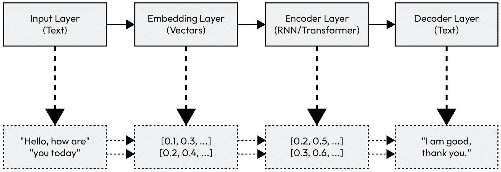
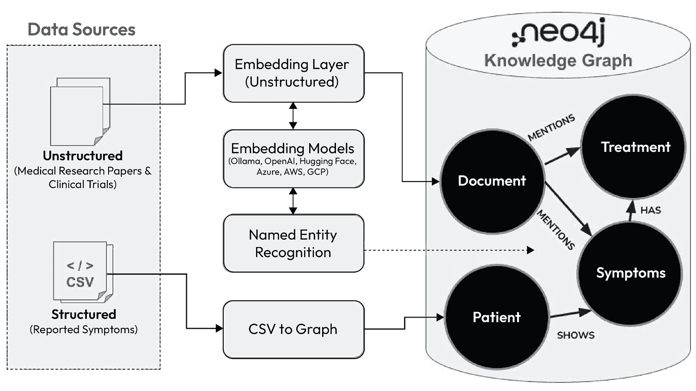

# 第一章：介绍 LLM、RAGs 和 Neo4j 知识图谱

**人工智能**（**AI**）正在从利基和专业化领域演变，变得更加易于访问，并能协助日常任务。最好的例子之一是**生成式人工智能**（**GenAI**）的爆炸性出现。在过去的几年里，GenAI 凭借其易用性和理解并回答问题的能力，在技术构建者和普通用户中引起了极大的兴奋。**大型语言模型**（**LLMs**）的突破推动了 GenAI 的发展，这为企业在如何与客户互动方面开辟了许多机会。客户可以用自然语言提问，并获得答案，而无需有人类存在来理解问题或从数据中提取智能。尽管 GenAI 在文本、音频和视频等不同模态的不同领域取得了重大进展，但本书的重点始终是 LLMs 及其在商业和工业用例中的应用。

在本章中，我们将通过 LLM 的视角来审视 GenAI，探讨其影响、陷阱和伦理问题。为了为本书奠定基础，我们将简要介绍可以增强 LLM 以使其更有效的技术。

在本章中，我们将涵盖以下主要主题：

+   通过 LLM 的视角概述 GenAI 的演变

+   理解 RAGs 和知识图谱在 LLMs 中的重要性

+   介绍 Neo4j 知识图谱

# 通过 LLM 的视角概述 GenAI 的演变

到 2022 年底，OpenAI 通过发布一个名为 ChatGPT 的人工智能引擎而震惊世界，该引擎能够像人类一样理解语言，并以自然语言与用户互动。这是很长时间以来 GenAI 的最佳代表。AI 概念最初是规则系统，90 年代演变为机器学习算法。随着深度学习和 LLMs 的兴起，GenAI 的概念变得更加流行。这些 AI 系统在经过现有内容的训练后可以生成新的内容。OpenAI 的 GPT-3 LLM 模型是第一批引起大众兴趣的 LLM 之一。GenAI 可以以类似人类互动的方式获取答案，也可以通过提供文本描述来生成图像，将图像描述为文本内容，使用文本内容生成视频，以及许多其他事情。它可以增强创造力，加速研发，使复杂概念易于理解，并提高个性化。

LLM 的演变是 GenAI 受欢迎的核心。让我们来看看 LLM 以及它们是如何推动 GenAI 发展的。

## 介绍 LLM

LLM 是一种为自然语言处理而构建的机器学习模型，它可以理解语言结构，并根据训练在该语言中生成内容。

在 GPT-3 流行之前，关于 LLMs 的研究已经进行了几年。一些开创性工作包括谷歌的**双向编码器表示从 Transformer**（**BERT** (https://github.com/google-research/bert)）和 OpenAI 的**生成预训练 Transformer**（**GPT**）。LLM 的训练需要大量的参数和计算能力。

在本质上，LLMs 是一种**循环神经网络**（**RNN**）架构。传统的 RNN 在处理序列数据中的长期依赖关系时存在困难。为了解决这个问题，LLMs 通常利用如**长短期记忆**（**LSTM**）网络或 Transformer 等架构。这些架构允许模型学习单词之间的复杂关系，即使这些单词在训练文本中相隔很远。

这里是基本 LLM 架构的一个简单示意图：

图 1.1 — 解释基本 LLM 架构的流程图

让我们剖析这个架构

+   **输入层**：这一层接收初始文本提示或序列

+   **嵌入层**：输入序列中的单词被转换为数值向量，捕捉其语义意义

+   **编码器**：这是一个多层 RNN（例如，LSTM）或 Transformer，它处理嵌入单词的序列，捕捉上下文信息

+   **解码器**：解码器利用编码表示逐词生成输出序列

你可以在这篇论文中了解更多关于 LLMs 的信息：https://arxiv.org/pdf/2307.06435。

构建一个 LLM 需要大量的努力和资源。让我们看看 OpenAI 为训练每个 GPT 模型所使用的参数数量：

+   **GPT-1**：这是第一个模型，使用了 1.17 亿个参数。

+   **GPT-2**：该模型使用了 15 亿个参数进行训练。

+   **GPT-3**：这是第一个发布的通用模型。该模型使用了 1750 亿个参数进行训练。

+   **GPT-4 系列**：这是 OpenAI 发布的最新模型。该模型使用了 170 万亿个参数进行训练。

这些训练数据表明，随着每个新版本的发布，参数数量增加了几个数量级。这意味着训练这些模型需要越来越多的计算能力。其他 LLM 模型也有类似的训练数据。

虽然生成人工智能是一项伟大的技术，但其应用也存在陷阱以及法律和伦理问题。我们将在下一节探讨这些问题。

## 理解生成人工智能的陷阱和伦理问题

虽然 LLM 在总结、生成上下文和其他用例方面很出色，但它们本身并不理解语言。它们根据训练文本识别模式来生成新文本。它们也不理解事实，不理解情感或伦理。它们只是预测下一个标记并生成文本。正因为这些缺陷，由 GenAI 生成的内容可能产生巨大的后果。

为了理解和解决这些方面，我们首先需要识别正在生成的任何有害或不准确的内容，并通过重新训练模型或添加单独的检查和平衡来处理这些问题，以确保这些内容不会被用作输出。

例如，最近有关于使用 LLM 生成法律摘要的案例，其中 LLM 创建了不存在的案例并基于这些案例生成了法律摘要。虽然技术上可能生成了所需解决方案，但这在法律上是不正确的。也有案例表明 LLM 被用来生成冒犯性的图像和视频并在互联网上分享。由于难以识别 AI 生成的内容，很容易被这种内容欺骗。这在社会、法律和伦理上都是不可接受的。有很多例子表明 LLM 只是编造事实。

微软网站上的这个教程（https://learn.microsoft.com/en-us/training/modules/responsible-ai-studio/）提供了这些担忧的详细解释以及我们如何识别它们。

**检索增强生成**（**RAG**）和**知识图谱**结合可以帮助解决这些问题，我们将在下一节讨论。

# 理解 RAG（检索增强生成）和知识图谱在 LLM（大型语言模型）中的重要性

为了解决 GenAI 的缺陷，我们可以通过微调模型或使用其他来源来使响应归因。

**微调**涉及使用额外信息训练现有模型，这可能导致高质量的响应。但这个过程可能既复杂又耗时。

**RAG 方法**涉及在我们向 LLM 提问时提供额外信息。

采用这种方法，可以将知识库集成到生成过程中。在这种情况下，LLM 可以利用从其他来源检索到的额外信息，调整响应以匹配提供的信息，从而使结果归因。

这些存储库和来源可以包括以下内容：

+   **公开可用的结构化数据集**（例如，如 PubMed 这样的科学数据库或如维基百科这样的公开可访问的百科全书资源）

+   **企业知识库**（例如，内部公司文档、产品目录或具有严格隐私和安全要求的合规相关内容）

+   **特定领域的来源**（例如，法律案例记录、医疗指南或针对特定行业的定制技术手册）

通过整合这些存储库和来源的相关信息，RAG 赋予 LLMs 生成既符合事实又与当前任务上下文一致输出的能力。与 LLM 训练数据中编码的静态知识不同，这些额外的数据源允许实时检索最新和专业的信息，解决数据新鲜度、准确性和特定性等挑战。我们将在*第二章*中详细讨论 RAG。

另一个信息来源，使 RAG 成为可能的是知识图谱。让我们简要谈谈它们及其在 LLM 领域的角色。

## 知识图谱在 LLMs 中的作用

知识图谱在为 LLMs 生成富有创造性和上下文丰富的内容方面发挥着巨大作用。它们提供了一个结构化、相互关联的基础，使信息检索更加相关。

通过在复杂和多层次的数据理解中定位 AI 结果，使其相关且富有洞察力。

将数据表示为图，为理解数据开辟了更多途径。同时，知识图谱不能是一个静态实体，只能在一个固定维度上表示数据。它的真正力量在于其动态和多维的能力。它可以通过实时数据流实时捕捉时间、空间或上下文信息。

除了作为存储信息的重要工具外，知识图谱还是智能、上下文感知 AI 的骨架。

有几个原因说明知识图谱对 GenAI 至关重要：

+   **增强的上下文理解**：知识图谱允许 GenAI 系统根据关系而非孤立的事实检索相关信息。例如，在医疗保健领域，知识图谱可以将症状、疾病和治疗联系起来，使 GenAI 能够基于相互关联的医学知识提出更准确的诊断见解。

+   **高效的数据检索**：与传统数据库不同，知识图谱允许多跳推理，这使得 GenAI 可以从几个分离度中提取见解。这在金融等领域非常有价值，GenAI 可以使用知识图谱揭示客户、交易和市场趋势等实体之间的隐藏关系。

+   **向量嵌入的集成**：当与向量嵌入结合时，知识图谱使 GenAI 能够理解和回应更细微的查询。向量嵌入捕捉数据点之间的语义相似性，知识图谱随后将其语境化，在响应中创造准确性和相关性相结合的强大组合。

+   **现实世界的影响**：主要组织已经开始利用知识图谱的力量来增强 GenAI 应用。例如，电子商务公司使用知识图谱提供不仅相关而且上下文丰富的产品推荐，这些推荐来自客户评价、购买历史和产品特性等多样化的数据源。

通过整合知识图谱，GenAI 模型超越了传统数据限制，有助于在不同领域创建更智能、更可靠的应用。

让我们谈谈**Neo4j 知识图谱**。

# 介绍 Neo4j 知识图谱

知识图谱是动态的，并随着数据及其关系随时间演变而持续发展。

Neo4j 是一个擅长以图形式存储数据的数据库。例如，在存储中，大多数产品都按照一定的分组排列并保持在那些组中。但这种情况有一个例外。当商店想要推广某些产品时，它们会被放置在商店的前面。这种灵活的思维方式应该适用于我们的知识图谱实现。随着数据语义的演变，知识图谱应该能够捕捉这种变化。

Neo4j，凭借其节点上的多个标签和可选的架构方法，通过帮助我们以额外的标签或提供更多相关上下文的具体关系来持久化（保留）我们对数据的理解，使得保持我们的图相关变得容易。我们将在接下来的章节中深入探讨如何从头开始构建 Neo4j 知识图谱。

现在，让我们看看 Neo4j 知识图谱是如何增强 LLM 的响应的。

## 使用 Neo4j 知识图谱与 LLMs

假设有一个基于 LLM 的聊天机器人与 Neo4j 知识图谱集成。这个 GenAI 聊天机器人旨在回答医疗查询。*图 1.2*展示了 Neo4j 知识图谱如何通过将结构化的患者症状记录与医学研究论文和临床试验中的非结构化见解联系起来，增强这个聊天机器人的医疗推理能力。

非结构化文本经过基于嵌入的模型处理，这些模型由**Ollama**、**OpenAI**和**Hugging Face**等提供商提供，然后进行**命名实体识别**（NER），以提取关键实体，如症状和治疗。这些数据被集成到一个 Neo4j 知识图谱中，其中文档提到症状和治疗，患者表现出症状，症状与潜在的治疗方法相联系。这使**多跳推理**成为可能，允许聊天机器人有效地回答如下复杂查询：

*哪些患者表现出与流感相似的症状，并且在过去也表现出 COVID-19 的症状？*

图 1.2 — 由 Neo4j 知识图谱驱动的医疗保健 Gen-AI

为了检索此查询的结果，将按照以下顺序遵循**多跳知识图谱查询路径**（*图 1.2*）：

1.  从研究文档中检索与流感相关的症状。

1.  识别目前表现出这些症状的患者。

1.  对比过去患者的 COVID-19 症状记录。

1.  返回同时符合两种条件并具有支持性文档来源的患者。

采用这种方法，LLM 的响应可以基于事实正确、相关且最新的结果来支持医疗决策。

类似的方法也可以用来增强支持其他应用的 LLMs。

我们现在已经看到了知识图谱如何增强 GenAI 提供上下文丰富、准确洞察的能力。但是，这种变革力量如何转化为现实生活中的具体好处呢？我们将在本书的剩余部分继续这一旅程。

# 摘要

在本章中，我们讨论了在 LLMs 背景下 GenAI 的演变。我们还探讨了 RAG 和知识图谱是如何成为这一变革的关键推动者，并有助于提供结构和上下文，从而提高 LLM 的准确性和推理能力。

展望未来，下一章将深入探讨 RAG——一种通过在检索到的、验证过的信息中定位响应来显著提高 GenAI 准确性的技术。
