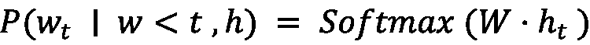

# 第二章：揭秘 RAG

在上一章中，我们探讨了 LLM 的演变以及它们如何改变 GenAI 的格局。我们还讨论了一些它们的陷阱。在本章中，我们将探讨如何使用 **Retrieval-Augmented Generation** （**RAG**）来避免这些陷阱。我们将探讨 RAG 的含义、其架构以及它在构建改进的智能应用程序的 LLM 工作流程中的位置。

在本章中，我们将涵盖以下主要主题：

+   理解 RAG 的力量

+   解构 RAG 流程

+   为您的 RAG 检索外部信息

+   构建端到端 RAG 流程

# 技术要求

本章需要熟悉 Python 编程语言（建议使用版本 `3.6` 或更高版本）以及深度学习的基本概念。

我们将利用流行的 AI 工具包，如 Hugging Face 的 Transformers 库 ([`huggingface.co/docs/transformers/en/index`](https://huggingface.co/docs/transformers/en/index)) 来构建和实验 RAG。虽然不是强制性的，但具备 Git 版本控制的基本理解可能会有所帮助。

Git 允许您轻松地克隆本章的代码存储库并跟踪您所做的任何更改。无需担心自己寻找或输入代码！我们已经在 GitHub 上创建了一个专门的公共存储库，[`github.com/PacktPublishing/Building-Neo4j-Powered-Applications-with-LLMs/tree/main/ch2`](https://github.com/PacktPublishing/Building-Neo4j-Powered-Applications-with-LLMs/tree/main/ch2)，您可以通过它轻松地克隆并跟随本章的动手练习。

本存储库包含实现 RAG 模型以及将 Neo4j 与高级知识图谱功能集成的所有必要脚本、文件和配置。

为了跟上进度，请确保您在环境中安装了以下 Python 库：

+   **Transformers**：安装 Hugging Face Transformers 库以处理模型相关功能：`pip install transformers`。

+   **PyTorch**：将 PyTorch 作为计算的后端进行安装。按照 [`pytorch.org/get-started/locally/`](https://pytorch.org/get-started/locally/) 上的说明安装适合您系统的相应版本。

+   **scikit-learn**：对于相似度计算，使用 `pip install scikit-learn` 命令安装 `scikit-learn`。

+   **NumPy**：安装 NumPy 以进行数值运算：`pip install numpy`。

+   **SentencePiece**：某些模型需要 SentencePiece 进行文本分词。您可以使用官方 GitHub 存储库中提供的说明进行安装：[`github.com/google/sentencepiece#installation`](https://github.com/google/sentencepiece#installation)。对于大多数 Python 环境，您可以通过 `pip` 安装它：`pip install sentencepiece`。

+   **rank_bm25**：实现基于关键字的检索的 BM25 算法需要 `rank_bm25` 库。您可以使用 `pip` 安装它：`pip install rank_bm25`。

+   **数据集**：Hugging Face 的`datasets`库提供了高效的工具，用于加载数据集、处理和转换数据集。它支持使用最小内存使用量处理大规模数据集。您可以使用`pip install datasets`进行安装。

+   **pandas**：`pandas`是 Python 中一个强大的数据分析库，用于操作表格数据。在这个例子中，它通过将其转换为 DataFrame 来帮助预处理数据集，以便更容易地进行操作。使用`pip install pandas`进行安装。

+   **faiss-CPU**：`faiss-cpu`是一个用于高效搜索和聚类密集向量的库。在这个例子中，它用于构建在推理期间检索相关段落的检索器。访问 Faiss 的 GitHub 仓库（[`github.com/facebookresearch/faiss`](https://github.com/facebookresearch/faiss)）以获取文档和示例。使用`pip`进行安装：`pip install faiss-cpu`。

+   **加速**：加速是 Hugging Face 的一个库，它简化了分布式训练和推理。它确保了在 CPU、GPU 和多节点设置中硬件利用的最优化。使用`pip install accelerate`进行安装。

通过确保您的环境配置了这些工具，您可以无缝探索本章提供的动手练习。

**注意**

本章的所有部分都专注于相关的代码片段。

完整代码，请参阅本书的 GitHub 仓库：[`github.com/PacktPublishing/Building-Neo4j-Powered-Applications-with-LLMs/tree/main/ch2`](https://github.com/PacktPublishing/Building-Neo4j-Powered-Applications-with-LLMs/tree/main/ch2)。

# 理解 RAG 的力量

RAG 是由 Meta 研究人员在 2020 年引入的（[`arxiv.org/abs/2005.11401v4`](https://arxiv.org/abs/2005.11401v4)），作为一个框架，允许 GenAI 模型利用模型训练之外的外部数据来增强输出。

众所周知，大型语言模型（LLMs）容易产生幻觉。一个经典的 LLMs 产生幻觉的真实世界例子是 Levidow, Levidow & Oberman 律师事务所，该律所在与哥伦比亚航空公司 Avianca 的案件中提交了一份包含由 OpenAI 的 ChatGPT 生成的虚假引用的法律简报，因此被罚款。他们随后被罚款数千美元，并且可能因声誉受损而损失更多。更多关于此事的信息，请参阅此处：[`news.sky.com/story/lawyers-fined-after-citing-bogus-cases-from-chatgpt-research-12908318`](https://news.sky.com/story/lawyers-fined-after-citing-bogus-cases-from-chatgpt-research-12908318)。

LLM 的幻觉可能由以下几个因素引起：

+   **过度拟合训练数据**：在训练过程中，LLM 可能会过度拟合到训练数据中的统计模式。这可能导致模型优先复制这些模式，而不是生成事实准确的内容。

+   **缺乏因果推理能力**：大型语言模型在识别词语之间的统计关系方面表现出色，但可能难以理解因果关系。这可能导致输出在语法上正确但在事实上不可信。

+   **温度配置**：大型语言模型可以通过一个名为**温度**的参数进行配置，这是一个介于`0`和`1`之间的数字，它控制文本生成的随机性。较高的温度增加了创造力，但也增加了模型偏离预期响应并产生幻觉的可能性。

+   **缺失信息**：如果生成准确响应所需的信息未包含在训练数据中，模型可能会生成听起来合理但实际上错误的答案。

+   **有缺陷或存在偏差的训练数据**：训练过程的质量起着重要作用。如果数据集包含偏差或不准确性，模型可能会持续这些问题，导致幻觉。

虽然幻觉是一个重大挑战，但几种方法可以在一定程度上帮助减轻它们：

+   **提示工程**：这涉及精心设计和迭代优化提供给大型语言模型的指令或查询，以产生一致和准确的响应。例如，向一个大型语言模型提问

    ```py
     List five key benefits of Neo4j for knowledge graphs 
    ```

相比于像“**提示工程**”这样的宽泛查询，它提供了更多的结构和精确性：

```py
Tell me about Neo4j 
```

前者查询指定了预期的输出，引导模型关注一个简洁且相关的利益列表，而后者可能产生冗长或离题的回答。提示工程有助于引导模型保持在所需的信息范围内，并减少其产生不相关或虚构输出的可能性。有关提示工程技术和最佳实践的详细探讨，请参阅此指南：[`cloud.google.com/discover/what-is-prompt-engineering`](https://cloud.google.com/discover/what-is-prompt-engineering)。

+   **情境学习**（**少样本提示**）：在此方法中，示例包含在提示中，以引导大型语言模型向准确、特定任务的响应。例如，当要求产品比较时，在提示中提供几个结构良好的比较示例有助于模型模仿该模式。这种方法利用了模型推断情境并根据给定示例调整其响应的能力，使其在特定领域任务中非常有效。

+   **微调**：这涉及在特定数据集上进一步训练已经预训练的 LLM，以适应特定领域或任务。这个过程增强了模型生成特定领域、相关和准确响应的能力。微调的一种流行方法是**强化学习与人反馈（RLHF**），其中人类评估者通过评分模型的输出来引导模型。这些评分用于调整模型的行为，使其与人类期望保持一致。例如，在公司的内部文档上微调 LLM 可以确保它产生准确且相关的输出，以满足组织的特定需求。如果提示：

    ```py
    Explain the onboarding process for new hires 
    ```

一个微调后的模型可能会提供一个与公司政策一致详细解释，而一个通用模型可能会提供模糊或不相关的响应。让我们再举一个例子场景，以了解如何使用 RLHF 来改进响应。

假设最初 LLM 被询问：

```py
What are the benefits of using XYZ software? 
```

响应可能包括与软件独特功能不匹配的通用好处。使用 RLHF，人类评估者根据准确性、相关性和完整性评分响应。例如，初始响应可能是：

```py
XYZ software improves productivity, enhances collaboration, and reduces costs. 
```

反馈可能包括：

```py
Too generic; lacks specifics about XYZ software. 
```

在经过人类反馈的微调后，结果可能是一个更准确和定制的响应，如下所示：

```py
XYZ software offers real-time data synchronization, customizable workflows, and advanced security features, making it ideal for enterprise resource planning. 
```

RLHF 在减少幻觉方面特别有价值，因为它强调从人类编辑的反馈中学习。

尽管这些方法提供了显著的改进，但它们在关键领域仍有所不足：使组织能够利用特定领域的知识快速构建准确、上下文相关且可解释的通用人工智能应用。解决方案在于**扎根**——一个将模型的响应与真实世界的事实或数据联系起来的概念。这种方法构成了文本生成新范式的基础，称为 RAG（Retrieval-Augmented Generation，检索增强生成）。通过从可靠的知识源动态检索事实信息，RAG 确保输出既准确又与上下文一致。RAG 通过结合来自事实知识库的相关信息来尝试解决大型语言模型（LLM）的幻觉问题。

术语检索增强生成（Retrieval-Augmented Generation），简称 RAG，首次由**Facebook AI Research（FAIR**）的研究人员在 2020 年 5 月提交的一篇题为《Retrieval-Augmented Generation for Knowledge-Intensive NLP Tasks》的论文中提出：[`arxiv.org/abs/2005.11401`](https://arxiv.org/abs/2005.11401)。

论文提出了 RAG（检索增强生成）作为一种混合架构（参见图 2.1），它结合了一个神经检索器和一个序列到序列生成器。**检索器**从外部知识库中检索相关文档，然后这些文档被用作生成器的上下文，以产生基于事实数据的输出。这种方法已被证明可以显著提高知识密集型 NLP 任务（如开放域问答和对话系统）的性能，通过减少对模型内部知识的依赖并提高事实准确性。RAG 通过引入一个关键元素来解决之前提到的 LLM 的不足：从补充或特定领域的数据源中检索相关知识的能力。


图 2.1 — FAIR 在“检索增强生成用于知识密集型 NLP 任务”研究论文中提出的 RAG 架构

此外，RAG 管道提供了在保持准确性的同时减少模型大小的潜力。而不是将所有知识嵌入到模型的参数中——这将需要大量资源——RAG 允许模型动态检索信息，保持其轻量级和可扩展性。

本章下一节将深入探讨 RAG 的内部工作原理，探讨它是如何弥合原始生成和基于知识文本生产之间的差距。

# 解构 RAG 流程

让我们现在解构 RAG 模型的构建块，并帮助您了解它是如何工作的。

首先，我们将查看常规 LLM 应用流程。*图 2.2*展示了这个基本流程。


图 2.2 — 带有 LLM 的聊天应用中的信息基本流程

当用户向 LLM（大型语言模型）提出请求时，会发生什么情况。

1.  **用户发送提示**：这个过程从用户向 LLM 聊天 API 发送提示开始。这个提示可能是一个问题、一个指令或任何其他请求信息或内容生成的请求。

1.  **LLM API 处理提示**：LLM 聊天 API 接收用户的提示并将其传输给 LLM。LLM 是经过大量文本数据训练的 AI 模型，允许它们对广泛的提示和问题进行沟通并生成类似人类的文本。

1.  **LLM 生成响应**：然后 LLM 处理提示并制定一个响应。这个响应被发送回 LLM 聊天 API，然后将其传输给用户。

从这个流程中，我们可以看到 LLM 负责提供答案，中间没有其他过程。这是没有 RAG 的请求-响应流程中最常见的用法。

现在我们来看看 RAG 在这个工作流程中是如何定位的。


图 2.3 — 带有 RAG 模型的聊天应用中的信息流

我们可以从*图 2.3*中看到，在调用实际的 LLM 服务之前，我们有一个中间数据源，它可以提供 LLM 请求的上下文：

1.  **用户发送提示**：该过程从用户通过聊天界面发送提示或问题开始。这个提示可能是用户想要了解的任何信息或需要帮助的内容。

1.  **RAG 模型处理提示**：提示被聊天 API 接收，然后将其转发给 RAG 模型。RAG 模型有两个主要组件协同工作：*检索器*（在第*3*步中讨论）和*编码器-解码器*（在第*4*步中讨论）。

1.  **检索器**：该组件在知识库中搜索，可能包括非结构化文档、段落或如表格或知识图谱之类的结构化数据。其作用是定位处理用户提示所需的最相关信息。

我们将涵盖检索器组件的一个简单示例。你可以在[`github.com/PacktPublishing/Building-Neo4j-Powered-Applications-with-LLMs/blob/main/ch2/dpr.py`](https://github.com/PacktPublishing/Building-Neo4j-Powered-Applications-with-LLMs/blob/main/ch2/dpr.py)查看完整的代码。

```py
context encoder model and *tokenizer* from Hugging Face’s Transformers library:
```

1.  让我们定义一组我们想要存储在文档存储中的文档。这里我们使用一些预定义的句子来演示：

    ```py
    documents = [
        "The IPL 2024 was a thrilling season with unexpected results.",
    .....
        "Dense Passage Retrieval (') is a state-of-the-art technique for information retrieval."
    ] 
    ```

1.  接下来，我们将之前定义的内容存储在内容存储中。然后我们将为每个文档生成一个嵌入并将它们存储在内容存储中：

    ```py
    def encode_documents(documents):
        inputs = tokenizer(
            documents, return_tensors='pt', 
            padding=True, truncation=True)
        with torch.no_grad():
            outputs = model(**inputs)
        return outputs.pooler_output.numpy()

    document_embeddings = encode_documents(documents) 
    ```

1.  现在，让我们定义一种方法，根据查询输入从文档存储中检索内容。我们将生成请求的嵌入并查询内容存储以检索相关结果。我们在这里利用向量搜索来获取相关结果：

    ```py
    def retrieve_documents(query, num_results=3):
        inputs = tokenizer(query, return_tensors='pt', 
            padding=True, truncation=True)
        with torch.no_grad():
            query_embedding = model(**inputs).pooler_output
                                             .numpy()
        similarity_scores = cosine_similarity(
            query_embedding, document_embeddings).flatten()
        top_indices = similarity_scores.argsort()[-num_results:]
            [::-1]
        top_docs = [
            (documents[i], similarity_scores[i]) 
            for i in top_indices]
        return top_doc 
    ```

我们可以看到对于给定的查询，我们会收到什么样的输出作为示例。

以下是一个示例输入：

```py
Query: What is Dense Passage Retrieval? 
```

下面是示例输出：

```py
Top Results:
Score: 0.7777, Document: Dense Passage Retrieval (') is a state-of-the-art technique for information retrieval.
... 
```

**注意**

检索器实现可能相当复杂。它们可能涉及

使用高效的搜索算法，如 BM25、TF-IDF 或神经检索器

例如**密集段落检索**。你可以在[`github.com/facebookresearch/`](https://github.com/facebookresearch/)了解更多信息。

1.  **编码器-解码器/增强生成**：该组件的编码器部分处理提示以及检索到的信息——无论是结构化还是非结构化——以创建一个全面的表示。然后解码器使用这个表示来生成一个准确、语境丰富且针对用户提示的响应。

这涉及到使用输入查询和上下文信息调用 LLM API。让我们看看一个示例，看看它是如何工作的。以下示例展示了如何使用上下文信息调用查询。这个示例展示了 T5Tokenizer 模型的使用：

1.  让我们先定义一个 LLM。我们将使用 Hugging Face 的 T5 模型：

    ```py
    tokenizer = T5Tokenizer.from_pretrained('t5-small', 
        legacy=False)
    model = T5ForConditionalGeneration.from_pretrained(
        't5-small') 
    ```

1.  定义 RAG 流程的查询和文档。通常，我们利用检索器进行 RAG 流程。在这里，为了演示目的，我们将使用硬编码的值：

    ```py
    query = "What are the benefits of solar energy?"
    retrieved_passages = """
    Solar energy is a renewable resource and reduces electricity bills.
    ......
    """ 
    ```

1.  我们将定义一个方法，它接受输入查询和检索到的段落，以使用 LLM API 来演示 RAG 方法：

    ```py
    def generate_response(query, retrieved_passages):
            input_text = f"Answer this question based on the provided context: {query} Context: {retrieved_passages}" 
        inputs = tokenizer(input_text, return_tensors='pt', 
            padding=True, 
            truncation=True, max_length=512
        ).to(device)
        with torch.no_grad():
            outputs = model.generate(
                **inputs,
                max_length=300,  # Allow longer responses
                num_beams=3,     # Use beam search for better results
                early_stopping=True
            )
        return tokenizer.decode(outputs[0], 
            skip_special_tokens=True) 
    ```

**注意**

我们正在使用**T5 模型**的束搜索解码来生成

准确且与上下文相关的响应。**束搜索解码**是一种在文本生成过程中寻找最可能序列（单词）的搜索算法。与贪婪解码不同，贪婪解码选择最

在每个步骤中，束搜索维护多个潜在的

序列（称为**束**）并同时探索它们。此

增加了找到高质量结果的机会，因为它避免了在生成过程中过早地做出次优选择。你可以在本文中了解更多关于 Transformers 中束搜索的信息：[`huggingface.co/blog/constrained-beam-search`](https://huggingface.co/blog/constrained-beam-search)。

现在，让我们调用此方法并审查响应。

1.  **聊天 API 提供响应**：以下代码将调用`generate_response`方法，并为输入查询提供聊天响应：

    ```py
    response = generate_response(query, retrieved_passages) 
    print("Query:", query) 
    print("Retrieved Passages:", retrieved_passages) 
    print("Generated Response:", response) 
    ```

当我们运行这个示例时，结果如下。

以下是一个示例输入：

```py
Query: What are the benefits of solar energy? 
```

检索到的段落如下：

```py
Solar energy is a renewable resource and reduces electricity bills.
...... 
```

以下是一个示例输出：

```py
Generated Response: it is environmentally friendly and helps combat climate change 
```

你可以在[`github.com/PacktPublishing/Building-Neo4j-Powered-Applications-with-LLMs/blob/main/ch2/augmented_generation.py`](https://github.com/PacktPublishing/Building-Neo4j-Powered-Applications-with-LLMs/blob/main/ch2/augmented_generation.py)找到这个示例的完整代码。

1.  **集成和微调**：现在让我们看看一个代码片段，它将检索器和 LLM 调用结合起来，作为完整的 RAG 流程。以下代码展示了这一点：

    ```py
    def rag_pipeline(query):
        retrieved_docs = retrieve_documents(query)
        response = generate_response(query, retrieved_docs)
        return response

    query = "How does climate change affect biodiversity?"
    generated_text = rag_pipeline(query)
    print("Final Generated Text:", generated_text) 
    ```

从代码中，我们可以看到流程很简单。我们使用检索器检索利用 RAG 流程所需的文档，并将输入查询和检索到的文档传递给 LLM API 调用。

在这次对 RAG 架构的深入研究中，我们关注了其机制，并展示了其核心组件的功能。通过结合高效的信息检索和高级语言生成模型，RAG 产生了上下文相关且知识丰富的响应。随着我们过渡到下一节，我们将讨论**检索过程**。

# 为你的 RAG 检索外部信息

理解 RAG 如何利用外部知识对于欣赏其生成事实准确和富有信息性的响应的能力至关重要。本节讨论了各种**检索技术**、整合检索信息的策略，以及说明这些概念的实例。

## 理解检索技术和策略

RAG 模型的成功取决于其使用常用检索技术之一从庞大的外部知识库中检索相关信息的能力。这些检索方法对于从大型数据集中获取相关信息至关重要。常见的技术包括传统的 BM25 方法以及现代的 DPR 神经网络方法。总的来说，这些技术可以分为三类：**向量相似度搜索**、**关键词匹配**和**段落检索**。我们将在以下小节中讨论每个技术。

### 向量相似度搜索

您传递给 LLM 的文本或查询被转换成一个称为**嵌入**的向量表示。向量相似度搜索通过比较向量嵌入来检索最接近的匹配项。其基本思想是相关和相似文本将具有相似的嵌入。该技术的工作原理如下：

1.  构建输入查询的嵌入。我们对输入查询进行分词，并生成其向量嵌入表示：

    ```py
    query_inputs = question_tokenizer(query, return_tensors="pt")
    with torch.no_grad():
      query_embeddings = question_encoder(
            **query_inputs
        ).pooler_output 
    ```

1.  构建文档的嵌入。我们使用分词器为每个文档生成一个嵌入，并将每个嵌入与其对应的文档关联：

    ```py
    for doc in documents:
        doc_inputs = context_tokenizer(doc, return_tensors="pt")
        with torch.no_grad():
            doc_embeddings.append(
                context_encoder(**doc_inputs).pooler_output)
    doc_embeddings = torch.cat(doc_embeddings) 
    ```

1.  使用点积计算查找相似文档。此步骤使用输入查询嵌入并在文档嵌入中搜索与输入查询相似的文档：

    ```py
    scores = torch.matmul(query_embeddings, doc_embeddings.T).squeeze() 
    ```

1.  按相关性分数对文档进行排序并返回结果。结果包含匹配的文档以及一个表示其与输入查询相似度的分数。我们将按照所需的顺序对结果进行排序，从最相似到最不相似：

    ```py
    ranked_docs = sorted(
        zip(documents, scores), key=lambda x: x[1], reverse=True) 
    ```

让我们运行这个示例，看看结果会是什么样子。

以下是一个示例输入查询：

```py
What are the benefits of solar energy? 
```

以下为示例输出（按相关性排序的文档）：

```py
Document: Solar energy is a renewable source of power., Score: 80.8264
....
Document: Graph databases like Neo4j are used to model complex relationships., Score: 52.8945 
```

上述代码演示了如何使用 DPR 将查询和一组文档编码成高维向量表示。通过计算相似度分数，例如查询向量与文档向量之间的点积，模型评估每个文档与查询的相关性。然后根据相似度分数对文档进行排序，最相关的文档将出现在顶部。这个过程突出了基于向量的检索在有效识别来自各种文档的上下文相关信息方面的强大功能，即使这些文档包含相关和不相关的混合内容。

本例的完整版本可在 GitHub 仓库中找到：[`github.com/PacktPublishing/Building-Neo4j-Powered-Applications-with-LLMs/blob/main/ch2/vector_similarity_search.py`](https://github.com/PacktPublishing/Building-Neo4j-Powered-Applications-with-LLMs/blob/main/ch2/vector_similarity_search.py)。

### 关键词匹配

**关键词匹配**是一种更简单的方法，它识别包含用户提示中关键词的文档。虽然效率高，但可能容易受到噪声的影响，并错过包含相关同义词的文档。BM25 是一种基于关键词的概率检索函数，它根据每个文档中出现的查询词对文档进行评分，考虑词频和文档长度。这种方法的基本流程如下：

1.  使用文档构建 BM25 语料库。我们将对文档进行分词并从这些文档中构建语料库。我们将构建 BM25 语料库：

    ```py
    tokenized_corpus = [doc.split() for doc in corpus]
    # Initialize BM25 with the tokenized corpus
    bm25 = BM25Okapi(tokenized_corpus, k1=1.5, b=0.75) 
    ```

1.  将查询分词以使用它进行搜索：

    ```py
    tokenized_query = query.split() 
    ```

1.  使用分词查询查询 BM25 语料库。这将返回匹配文档的分数：

    ```py
    scores = bm25.get_scores(tokenized_query) 
    ```

1.  我们将使用这些分数，按所需顺序排列文档，并返回它们：

    ```py
    ranked_docs = sorted(zip(corpus, scores), key=lambda x: x[1], 
        reverse=True) 
    ```

当我们运行此示例时，对于给定的输入，结果将如下所示。

以下是一个示例输入查询：

```py
quick fox 
```

以下是一个示例输出：

```py
Ranked Documents:
Document: The quick brown fox jumps over the lazy dog., Score: 0.6049
.....
Document: Artificial intelligence is transforming the world., Score: 0.0000 
```

BM25 算法根据文档与查询的相关性对文档进行排名。它依赖于词频（关键词在文档中出现的频率）和文档长度，应用概率评分函数来评估相关性。与将查询和文档都表示为高维空间中密集数值向量的向量相似度搜索不同，它使用如点积等数学函数来衡量相似度，BM25 直接在离散单词匹配上操作。这意味着 BM25 效率高且可解释，但可能在处理语义关系方面遇到困难，因为它无法识别同义词或上下文含义。相比之下，向量相似度搜索，如 DPR，在识别即使精确关键词不同时也能识别概念相似性方面表现出色，这使得它更适合需要深度语义理解的任务。此代码片段说明了 BM25 在简单关键词匹配任务中的实用性，其中效率和可解释性至关重要。

完整示例可在 GitHub 仓库中找到：[`github.com/PacktPublishing/Building-Neo4j-Powered-Applications-with-LLMs/blob/main/ch2/keyword_matching.py`](https://github.com/PacktPublishing/Building-Neo4j-Powered-Applications-with-LLMs/blob/main/ch2/keyword_matching.py)。

### 段落检索

与检索整个文档不同，RAG 可以专注于文档中直接针对用户查询的具体段落。这允许进行更精确的信息提取。这种方法的基本流程与向量搜索方法非常相似。我们使用向量搜索中显示的方法获取排名靠前的文档，然后如以下代码片段所示提取相关段落：

```py
# Extract passages for the reader
passages = [doc for doc, score in ranked_docs]

# Prepare inputs for the reader
inputs = reader_tokenizer(
    questions=query,
    titles=["Passage"] * len(passages),
    texts=passages,
    return_tensors="pt",
    padding=True,
    truncation=True
)
# Use the reader to extract the most relevant passage
with torch.no_grad():
    outputs = reader(**inputs)
# Extract the passage with the highest score
max_score_index = torch.argmax(outputs.relevance_logits)
most_relevant_passage = passages[max_score_index] 
```

当我们针对给定的输入查询运行此示例时，结果如下所示。

以下是一个示例输入查询：

```py
What are the benefits of solar energy? 
```

以下是一个示例输出：

```py
Ranked Documents:
Document: Solar energy is a renewable source of power., Score: 80.8264
.....
Document: It has low maintenance costs., Score: 57.9905

Most Relevant Passage: Solar panels help combat climate change and reduce carbon footprint. 
```

上述示例说明了**段落检索方法**，它比文档级检索更细粒度，专注于提取直接针对用户查询的特定段落。通过结合使用**读者模型**和**检索器**，这种方法增强了相关性和特异性，因为它不仅确定了最相关的文档，还确定了其中最佳回答查询的确切段落。

即使一个段落的检索器分数略低，读者也可能优先考虑它，因为它在词和跨度级别上更精确地评估相关性，考虑了上下文细微差别。检索器通常使用查询和段落嵌入的点积来计算相似度分数：


这里，𝑞是查询嵌入，是段落的嵌入，𝑑是嵌入的维度。

然而，读者通过分析每个段落的文本内容进一步细化这一过程。它根据给定段落包含答案的可能性分配一个**相关性分数**或**logit**（也称为**置信度分数**）。这个相关性分数是从读者模型的原始输出（logits）中计算出来的，该模型考虑了查询与段落之间的词级和跨度级交互。相关性分数的公式可以表示如下：


这里，我们有以下内容：

+   logits()指的是读者分配给段落的原始分数。

+   softmax 将这些原始分数转换为概率，强调最有可能相关的段落([`pytorch.org/docs/stable/generated/torch.nn.Softmax.html`](https://pytorch.org/docs/stable/generated/torch.nn.Softmax.html))

通过结合两个阶段，系统可以识别出不仅语义相似（检索器阶段），而且与查询意图上下文对齐的段落（读者阶段）。

这个双阶段过程突出了段落检索在信息检索管道中生成高度针对性的响应的优势。

完整示例可在 GitHub 仓库中找到：[`github.com/PacktPublishing/Building-Neo4j-Powered-Applications-with-LLMs/blob/main/ch2/passage_retrieval.py`](https://github.com/PacktPublishing/Building-Neo4j-Powered-Applications-with-LLMs/blob/main/ch2/passage_retrieval.py)。

## 集成检索信息

在 RAG 流程的最后一步，让我们看看我们如何以综合上下文相关且连贯的响应的方式将检索器信息与生成模型相结合。与早期示例不同，这种方法明确地将多个检索到的段落与查询相结合。通过这样做，它为生成模型创建了一个单一输入。这使得模型能够综合出一个统一且丰富的响应，而不仅仅是选择或排序段落：

```py
def integrate_and_generate(query, retrieved_docs):
    # Combine query and retrieved documents into a single input
    input_text = f"Answer this question based on the following context: {query} Context: {' '.join(retrieved_docs)}"

    # Tokenize input for T5
    inputs = t5_tokenizer(input_text, return_tensors="pt", 
        padding=True, truncation=True, max_length=512)

    # Generate a response
    with torch.no_grad():
        outputs = t5_model.generate(**inputs, max_length=100)

    # Decode and return the generated response
    return t5_tokenizer.decode(outputs[0], skip_special_tokens=True) 
```

以下是一个示例输入查询：

```py
What are the benefits of solar energy? 
```

以下为示例输出：

```py
Ranked Documents:
Document: Solar energy is a renewable source of power., Score: 80.8264
....
Document: It has low maintenance costs., Score: 57.9905

Most Relevant Passage: Solar panels help combat climate change and reduce carbon footprint. 
sized response. The generate() function processes the combined input (query and passages) through the encoder to produce contextual embeddings, *ℎ*. These embeddings are then used by the decoder, which generates each token sequentially based on probabilities:
```



这里， 是位置  的标记， 是隐藏状态，而  是模型的权重矩阵。Beam 搜索通过最大化跨标记的整体概率来确保选择最可能的序列。与前面示例中单独选择或排序段落不同，此代码明确地将多个检索到的文档与查询组合成一个单一输入。这使得 T5 模型能够全面处理组合上下文，并产生一个包含来自多个来源信息的连贯响应，这使得它在需要跨多个段落综合或总结查询时特别有效。

要参考此代码的完整版本，请参阅：[`github.com/PacktPublishing/Building-Neo4j-Powered-Applications-with-LLMs/blob/main/ch2/integrate_and_generate.py`](https://github.com/PacktPublishing/Building-Neo4j-Powered-Applications-with-LLMs/blob/main/ch2/integrate_and_generate.py)

通过探索各种检索技术和它们与生成模型的集成，我们看到了 RAG 架构如何利用外部知识来产生准确和有信息量的响应。

在下一节中，让我们看看从源读取输入文档并利用这些文档进行检索流程的整体流程，而不是本节示例中查看的简单硬编码句子。

# 构建端到端 RAG 流程

在前面的章节中，我们通过简单的数据深入探讨了 RAG 流程中的各个步骤以展示用法。退一步使用一个真实世界的数据集（尽管很简单）来完成整个流程是个不错的主意。为此，我们将使用 GitHub 的问题数据集（[`huggingface.co/datasets/lewtun/github-issues`](https://huggingface.co/datasets/lewtun/github-issues)）。我们将探讨如何读取这些数据并在 RAG 流程中使用它们。这将为后续章节中完整端到端 RAG 流程的实现奠定基础。

在本例中，我们将加载 GitHub 注释以回答诸如如何离线加载数据等问题。我们需要遵循以下步骤来加载数据并设置检索器：

1.  **准备数据**：首先，我们需要准备我们的数据集。我们将使用 Hugging Face `datasets` 库：

    ```py
    # Load the GitHub issues dataset
    issues_dataset = load_dataset("lewtun/github-issues", split="train")

    # Filter out pull requests and keep only issues with comments
    issues_dataset = issues_dataset.filter(
        lambda x: not x["is_pull_request"] and len(x["comments"]) > 0) 
    ```

1.  **选择相关列**：仅保留分析所需列：

    ```py
    # Define columns to keep
    columns_to_keep = ["title", "body", "html_url", "comments"]
    columns_to_remove = set(issues_dataset.column_names) - \ 
                        set(columns_to_keep)
    # Remove unnecessary columns
    issues_dataset = issues_dataset.remove_columns(columns_to_remove) 
    ```

1.  **将数据集转换为 pandas DataFrame**：将数据集转换为 `pandas` DataFrame 以便于操作：

    ```py
    # Set format to pandas and convert the dataset
    issues_dataset.set_format("pandas")
    df = issues_dataset[:] 
    ```

1.  **爆炸注释，将它们转换回数据集，并处理**：将注释展开成单独的行，将 DataFrame 转换回数据集，并计算每条注释的长度。这一步使得数据更适合与检索流程一起使用：

    ```py
    # Explode comments into separate rows
    comments_df = df.explode("comments", ignore_index=True) 
    # Convert the DataFrame back to a Dataset
    comments_dataset = Dataset.from_pandas(comments_df)

    # Compute the length of each comment
    comments_dataset = comments_dataset.map(
        lambda x: {"comment_length": len(x["comments"].split())}, 
        num_proc=1)
    # Filter out short comments
    comments_dataset = comments_dataset.filter(
        lambda x: x["comment_length"] > 15) 
    ```

1.  **拼接文本以生成嵌入**：让我们通过拼接相关文本字段来准备文档文本。我们将从每一行中提取单个字段，并准备代表该行文档文本的文本。这些文档存储在嵌入存储中，用于检索器使用：

    ```py
    # Function to concatenate text fields
    def concatenate_text(examples):
        return {
           "text": examples["title"] + " \n " + 
                   examples["body"] + " \n " + 
                   examples["comments"]
        }
    # Apply the function to create a text field
    comments_dataset = comments_dataset.map(concatenate_text, 
        num_proc=1) 
    ```

1.  **加载模型和分词器**：让我们加载 LLM，我们将使用它将文档转换为嵌入并将它们存储在嵌入存储中以用于检索器流程：

    ```py
    # Load pre-trained model and tokenizer
    model_ckpt = "sentence-transformers/all-MiniLM-L6-v2"
    tokenizer = AutoTokenizer.from_pretrained(model_ckpt)
    model = AutoModel.from_pretrained(model_ckpt).to("cpu") 
    ```

1.  **定义嵌入函数**：定义一个嵌入函数，该函数利用我们之前定义的模型来生成嵌入。我们可以迭代地调用此方法，一次生成一个文档的所有嵌入：

    ```py
    # Function to get embeddings for a list of texts
    def get_embeddings(text_list):
        encoded_input = tokenizer(text_list, padding=True, 
            truncation=True, return_tensors="pt").to("cpu")
        with torch.no_grad():
            model_output = model(**encoded_input)
        return cls_pooling(model_output).numpy() 
    ```

1.  **计算嵌入**：为数据集计算嵌入。现在我们已经定义了嵌入函数，让我们为我们的评论数据集中的所有文档调用它。请注意，我们正在将嵌入存储在同一数据集的新列`embedding`中：

    ```py
    # Compute embeddings for the dataset
    comments_dataset = comments_dataset.map(
        lambda batch: {"embeddings": [get_embeddings([text])[0] 
            for text in batch["text"]]},
        batched=True,
        batch_size=100,
        num_proc=1
    ) 
    ```

1.  **执行语义搜索**：让我们为问题执行检索器流程。这将检索与我们所提问题相关的所有问题。我们可以使用这些文档根据需要改进响应：

    ```py
    # Define a query
    question = "How can I load a dataset offline?"
    # Compute the embedding for the query
    query_embedding = get_embeddings([question]).reshape(1, -1) 
    # Find the nearest examples
    embeddings = np.vstack(comments_dataset["embeddings"])
    similarities = cosine_similarity(
        query_embedding, embeddings
    ).flatten()
    # Display the results
    top_indices = np.argsort(similarities)[::-1][:5]
    for idx in top_indices:
        result = comments_dataset[int(idx)]  # Convert NumPy integer to native Python integer
        print(f"COMMENT: {result['comments']}")
        print(f"SCORE: {similarities[idx]}")
        print(f"TITLE: {result['title']}")
        print(f"URL: {result['html_url']}")
        print("=" * 50) 
    ```

前面的代码展示了完整的流程，从我们将数据加载到数据存储中，这可以成为检索器的基础，到检索文档，这些文档可以用于在 LLM 生成答案时提供更多上下文。

现在，让我们看看运行此应用程序时的输出看起来如何。示例代码中硬编码了问题，它是：

```py
How can I load a dataset offline?. 
```

以下是一个示例输出：

```py
COMMENT: Yes currently you need an internet connection because the lib tries to check for the etag of the dataset script ...
SCORE: 0.9054292969045314
TITLE: Downloaded datasets are not usable offline
URL: https://github.com/huggingface/datasets/issues/761
==================================================
COMMENT: Requiring online connection is a deal breaker in some cases ...
SCORE: 0.9052456782359709
TITLE: Discussion using datasets in offline mode
URL: https://github.com/huggingface/datasets/issues/824
================================================== 
```

这个动手实验展示了端到端 RAG 架构的实际应用，利用强大的检索技术来增强语言生成。前面的代码是从 Hugging Face NLP 课程中改编的，可在[`huggingface.co/learn/nlp-course/chapter5/6?fw=tf`](https://huggingface.co/learn/nlp-course/chapter5/6?fw=tf)找到。

完整的 Python 文件以及如何运行的详细说明可在[`github.com/PacktPublishing/Building-Neo4j-Powered-Applications-with-LLMs/blob/main/ch2/full_rag_pipeline.py`](https://github.com/PacktPublishing/Building-Neo4j-Powered-Applications-with-LLMs/blob/main/ch2/full_rag_pipeline.py)找到。

# 摘要

在本章中，我们深入探讨了 RAG 模型的世界。我们首先理解了 RAG 的核心原则以及它们与传统生成式 AI 模型的不同之处。这种基础性知识至关重要，因为它为欣赏 RAG 带来的增强功能奠定了基础。

接下来，我们更详细地研究了 RAG 模型的架构，通过详细的代码示例来分解其组件。通过检查编码器、检索器和解码器，你了解了这些模型的内部工作原理以及它们如何整合检索信息以产生更具有上下文相关性和连贯性的输出。

我们随后探讨了 RAG 如何利用信息检索的力量。这些技术帮助 RAG 有效地利用外部知识源来提高生成文本的质量。这对于需要高精度和上下文感知的应用尤其有用。你还学习了如何使用像 Transformers 和 Hugging Face 这样的流行库构建一个简单的 RAG 模型。

随着我们迈向下一章节*第三章*，我们将在此基础上继续前进。你将了解图数据建模以及如何使用 Neo4j 创建知识图谱。
