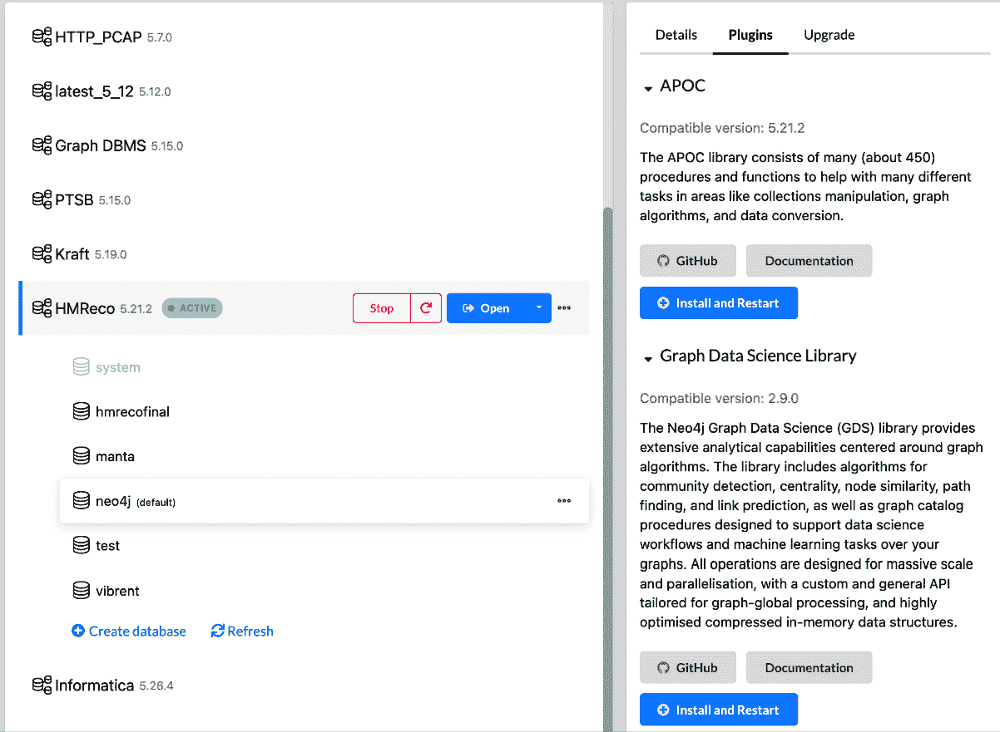
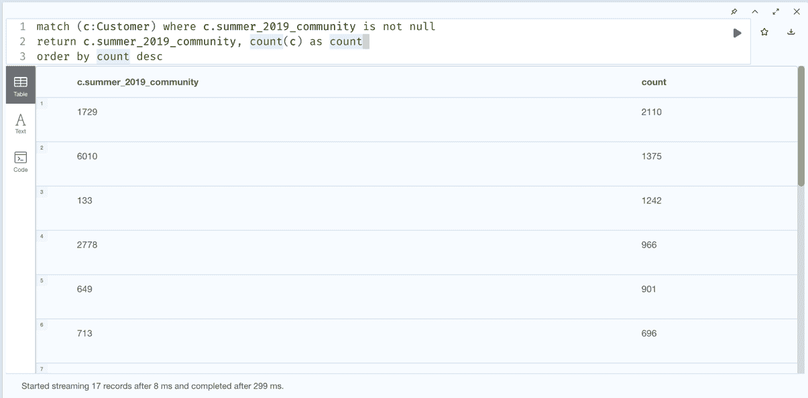

# 第十章：创建智能推荐系统

现在我们已经将数据加载到图中，并查看如何使用 Langchain4j 和 Spring AI 以及生成推荐来增强图，我们将探讨如何进一步利用**图形数据科学**（**GDS**）**算法**和机器学习来改进推荐。我们将回顾 Neo4j 提供的 GDS 算法，以超越我们在上一章中创建的推荐系统。我们还将学习如何使用 GDS 算法构建协同过滤以及基于内容的推荐方法。我们还将查看算法运行后的结果，以审查我们的方法是否有效，以及我们是否走上了构建更好推荐系统的正确道路。我们将试图理解为什么这些算法比我们在上一章中实现的方法更好。

在本章中，我们将涵盖以下主要主题：

+   使用 GDS 算法改进推荐

+   理解社区的力量

+   结合协同过滤和基于内容的策略

# 技术要求

我们将使用 Java IDE 环境来与 Langchain4j 和 Spring AI 项目一起工作。您需要安装这些项目并了解如何使用它们。

## 设置环境

我们将从上一章中构建的图数据库开始。代码与 Neo4j `5.21.2`版本的数据库进行了测试。

要设置环境，您需要

+   安装了以下插件的 Neo4j Desktop：

    +   APOC 插件 – `5.21.2`

    +   图形数据科学库 – `2.9.0`

*图 10.1* 展示了如何为数据库管理系统安装这些插件。



图 10.1 — 在 Neo4j Desktop 中安装插件

当您在 Neo4j Desktop 中选择数据库管理系统时，在右侧，它会显示其详细信息。单击**插件**选项卡并选择插件。一旦展开，单击**安装和重启**按钮。

接下来，我们将查看本章所需的数据库转储。

## 准备数据库

在开始之前，您需要创建社区。相似性和社区检测算法的完成需要一些时间。因此，建议从[`packt-neo4j-powered-applications.s3.us-east-1.amazonaws.com/hmreco_post_augment_with_summary_communities`](https://packt-neo4j-powered-applications.s3.us-east-1.amazonaws.com/hmreco_post_augment_with_summary_communities).dump 下载数据库转储，并使用它来在 Neo4j Desktop 中创建数据库。您可以使用以下说明将此转储加载到 Neo4j Desktop 中：[`neo4j.com/docs/desktop-manual/current/operations/create-from-dump/`](https://neo4j.com/docs/desktop-manual/current/operations/create-from-dump/)。

此数据库转储已创建所有 `SUMMER_2019_SIMILAR` 关系，并已识别社区。

让我们从使用 GDS 算法来增强我们的知识图，以改善推荐开始。

# 使用 GDS 算法改进推荐

在本节中，我们将探讨如何进一步优化图，以获得更多关于图的洞察，从而构建一个更好的推荐系统。我们将从上一章中创建的图数据库开始。为了参考，您可以从[`packt-neo4j-powered-applications.s3.us-east-1.amazonaws.com/Building+Neo4j-Powered+Applications+with+LLMs+Database+Dump+files.zip`](https://packt-neo4j-powered-applications.s3.us-east-1.amazonaws.com/Building+Neo4j-Powered+Applications+with+LLMs+Database+Dump+files.zip)下载它。

Neo4j GDS 算法([`neo4j.com/docs/graph-data-science/current/`](https://neo4j.com/docs/graph-data-science/current/))将帮助我们增强图。此过程包括以下步骤：

1.  根据我们创建的嵌入计算客户之间的相似性，并在这些客户之间创建相似关系。为此，我们将利用**K-Nearest Neighbors**（**KNN**）算法([`neo4j.com/docs/graph-data-science/current/algorithms/knn/`](https://neo4j.com/docs/graph-data-science/current/algorithms/knn/))。

1.  运行社区检测算法，根据相似关系将客户分组。为此，我们将利用**Louvain 社区检测**算法([`neo4j.com/docs/graph-data-science/current/algorithms/louvain/`](https://neo4j.com/docs/graph-data-science/current/algorithms/louvain/))。

首先，我们将利用 KNN 算法来增强图。

## 使用 KNN 算法计算相似性

**K-Nearest Neighbors**（**KNN**）算法收集节点对，计算节点与其邻居之间的距离值，并在节点与其**前 K 个**邻居之间创建关系。距离是根据节点属性计算的。我们需要提供一个同质图来使用此算法。当所有节点和关系都相同时，它被称为**同质图**。我们提供给 KNN 算法的节点对不需要任何节点标签或关系类型。KNN 算法只需要连接的节点对，以及一个可选的属性，该属性可以用作它们之间关系的上下文。您可以在[`neo4j.com/docs/graph-data-science/current/algorithms/knn`](https://neo4j.com/docs/graph-data-science/current/algorithms/knn)上了解更多信息。

要使用此算法，我们需要遵循以下过程：

1.  将感兴趣的图项目应用于算法。

1.  使用适当的配置调用算法。此算法有三种模式：

    +   **Stream**：此模式将算法应用于内存中的图，并流式传输结果。您可以使用流模式来检查结果，看看是否符合我们的期望。

    +   **变异**：这将在内存图中应用算法并将数据写回内存图。实际数据库不会改变。当我们要更新内存图并希望以后用于不同目的时，使用变异方法。

    +   **写入**：这将在内存图中应用算法并将关系写回实际数据库。当我们对过程有信心并希望立即将结果写回图时，使用此模式。

我们将从图投影开始。由于我们在 `SUMMER_2019` 关系中写入了嵌入，我们将使用这些嵌入进行处理。

此 Cypher 将内存中的图投影以调用此算法：

```py
MATCH (c:Customer)-[sr:SUMMER_2019]->()
  WHERE sr.embedding is not null
  RETURN gds.graph.project(
    'myGraph',
    c,
    null,
    {
      sourceNodeProperties: sr { .embedding },
      targetNodeProperties: {}
    }
  ) 
```

通常，我们将使用节点上的属性来构建投影。这里，我们将嵌入值写入关系，因为此嵌入是为了表示 2019 年夏季的购买而创建的。如果我们将其写入 `Customer` 节点，那么如果我们想了解各种场景下的客户购买行为，我们就需要使用一些巧妙的命名来只将这些写入 `Customer` 节点。通过将嵌入写入关系，我们在图中保留了嵌入的上下文。

从前面的 Cypher 可以看出，我们正在从关系中检索嵌入并将其作为投影中的源节点属性添加。现在，让我们调用算法将类似的关系写回图中。

此 Cypher 调用算法将结果写回：

```py
CALL gds.knn.write('myGraph', {
    writeRelationshipType: 'SUMMER_2019_SIMILAR',
    writeProperty: 'score',
    topK: 5,
    nodeProperties: ['embedding'],
    similarityCutoff: 0.9
})
YIELD nodesCompared, relationshipsWritten 
```

从 Cypher 中，我们可以看到我们正在调用算法的 `write` 模式。该算法将通过在嵌入上使用 **余弦相似度** 来计算客户之间的相似度，阈值分数为 `0.9`，按相似度分数的顺序选择前 5 个邻居，并在这些客户之间写入一个名为 `SUMMER_2019_SIMILAR` 的关系。

**注意**

余弦相似度计算两个向量之间的角度。因此，如果向量彼此更远，则相似度值将接近 0。如果它们彼此更近，则相似度值将接近 1。如果您想了解更多信息，可以阅读[`en.wikipedia.org/wiki/Cosine_similarity`](https://en.wikipedia.org/wiki/Cosine_similarity)。

相似度分数可以在 0 和 1 之间。如果两个实体之间的分数接近 0，则它们彼此不相似。如果接近 1，则它们更相似。我们使用 `0.9` 作为相似度阈值，因为我们基于生成的摘要文本生成嵌入 - 客户可能具有更高的相似度分数。我们不希望客户之间存在相似关系，因为有一些关键词是相似的。我们将在后续步骤中验证此假设。我们将限制自己只考虑前五个（`k` `=5`）相似客户行为，以获得更接近的推荐。

**注意**

请注意，KNN 算法默认是一个非确定性算法。这意味着不同的运行可能会得到不同的结果。您可以在[`neo4j.com/docs/graph-data-science/2.14/algorithms/knn/`](https://neo4j.com/docs/graph-data-science/2.14/algorithms/knn/)了解更多信息。如果您想要确定性结果，则必须确保并发参数设置为 1，并且显式设置`randomSeed`参数。

一旦调用算法，我们需要删除图投影。否则，它将继续使用数据库服务器中的内存：

```py
CALL gds.graph.drop('myGraph') 
```

此 Cypher 将删除图并清除图投影使用的内存。

我们将基于`SUMMER_2019_SIMILAR`关系查看社区检测。

为了做到这一点，我们将利用 Louvain 社区检测算法，这是最受欢迎的社区检测算法。

## 使用 Louvain 算法检测社区

**Louvain 算法**依赖于实体和组之间的相似度分数，并将它们分组到社区中。它通过查看邻居及其关系，将大型、网络化数据分组到更小、更紧密的社区中。这个层次聚类算法递归地将社区合并成一个节点，并在压缩图上执行模块度聚类。它为每个社区最大化模块度分数，评估社区内节点之间的连接密度与它们在随机网络中连接密度的差异。我们希望通过更自动化的方式将客户分组到更紧密的群体中，以提供更广泛的推荐。您可以在[`neo4j.com/docs/graph-data-science/current/algorithms/louvain/`](https://neo4j.com/docs/graph-data-science/current/algorithms/louvain/)了解更多信息。

这种方法与我们调用 KNN 算法的方式非常相似。要使用此算法，我们需要遵循以下过程。

1.  将感兴趣的图项目应用于算法。

1.  使用适当的配置调用算法。此算法有三种模式。

    +   **流式处理**：将算法应用于内存中的图，并将结果流式传输。您可以使用流式处理模式来检查结果，看看是否符合我们的预期。

    +   **变异**：将算法应用于内存中的图，并将数据写回内存中的图。实际数据库没有改变。当我们要更新内存中的图并希望以后用于不同目的时，使用`mutate`方法。

    +   **写入**：将算法应用于内存中的图，并将关系写回实际数据库。当我们对过程有信心并希望立即将结果写回图时，使用此模式。

让我们从**图投影**开始。我们将使用`SUMMER_2019_SIMILAR`关系及其上保存的`score`值来执行社区检测：

```py
MATCH (source:Customer)-[r:SUMMER_2019_SIMILAR]->(target)
RETURN gds.graph.project(
  'communityGraph',
  source,
  target,
  {
    relationshipProperties: r { .score }
  },
  { undirectedRelationshipTypes: ['*'] }
) 
```

之前的 Cypher 创建了一个名为`communityGraph`的内存投影。它使用源节点、目标节点和`SUMMER_2019_SIMILAR`关系上的分数来构建投影。

一旦构建了投影，我们就可以使用此 Cypher 来执行社区检测：

```py
CALL gds.louvain.write('communityGraph', { writeProperty: 'summer_2019_community' })
YIELD communityCount, modularity, modularities 
```

此 Cypher 执行社区检测并将社区 ID 作为名为`summer_2019_community`的属性写回`Customer`节点。

一旦社区检测完成，我们需要删除图投影。

```py
CALL gds.graph.drop('communityGraph') 
```

此 Cypher 将删除图并清除图投影使用的内存。

我们可以使用此 Cypher 来检查创建了多少社区：

```py
MATCH (c:Customer) WHERE c.summer_2019_community IS NOT NULL
RETURN c.summer_2019_community, COUNT(c) as count
ORDER BY count DESC 
```

此 Cypher 按社区中客户的数量顺序显示所有社区。响应将如图*图 10.2*所示。



图 10.2 — 客户数量社区

**注意**：

请注意，Louvain 社区检测算法默认是非确定性算法。这意味着不同的运行可能会得到不同的结果。您可以在[`neo4j.com/docs/graph-data-science/2.14/algorithms/louvain/`](https://neo4j.com/docs/graph-data-science/2.14/algorithms/louvain/)了解更多信息。

现在我们已经建立了社区，让我们来看看生成的社区。在下一节中，我们将检查其中的一些社区，以观察它们是否根据客户的购买行为对客户进行分组。

# 理解社区的力量

在之前的*第九章*中，我们探讨了使用向量相似性查找相似客户以及如何为客户提供推荐。让我们回顾*图 9.10*和*图 9.11*。*图 9.10*显示了与特定客户相似的客户的购买历史。*图 9.11*显示了基于相似客户购买的客户推荐。购买历史和客户推荐是我们之前在*微调您的推荐*部分中进行的 Cypher 查询的结果，以了解向量相似性的使用。

在本节中，我们将更深入地了解社区，并探讨为什么它们可能比利用简单的向量相似性来查找相似客户更有优势。

**注意**：

以下 Cypher 与*技术*部分中共享的数据库相关。

*要求*部分。

从我们在上一节中运行的 Cypher，*使用 Louvain 算法检测社区*，让我们选择一个包含大量客户的社区。我们将查看 ID 为`133`的社区，其中大约有`1,242`名客户。

以下 Cypher 显示前五个客户的客户购买摘要，不包括文章详情：

```py
MATCH (c:Customer)-[r:SUMMER_2019]->()
WHERE c.summer_2019_community=133
WITH split(r.summary, '\n') AS s
WITH CASE WHEN s[2] <> '' THEN s[2] ELSE s[3] END AS d
return d LIMIT 5 
```

当我们运行社区检测时，每次运行生成的社区 ID 可能都不同。所以，如果你已经运行了自己的 Cypher 脚本来创建客户社区，你需要查看这些社区并使用那些 ID 来验证数据。

当我们运行前面的 Cypher 脚本时，输出看起来像这样：

```py
The customer demonstrates a preference for stylish and modern pieces, particularly favoring dresses and lingerie that offer both comfort and elegance. The consistent choice of midi and short dresses paired with a variety of non-wired bras suggests a desire for chic yet relaxed fashion options. Additionally, the inclusion of tailored blouses and fashionable outerwear indicates an appreciation for versatile styles suitable for various occasions.
The customer exhibits a preference for comfortable yet stylish clothing, favoring light and soft colors such as light pink and light blue. Their purchases reflect a blend of casual and lingerie items, indicating a focus on both everyday wear and intimate apparel. The selection features a mix of high-waisted denim and lace detailing, suggesting an appreciation for modern, flattering silhouettes.
The customer demonstrates a strong preference for versatile and stylish pieces, favoring bold colors like pink and orange while incorporating comfortable fabrics such as jersey and cotton. Their purchases include a mix of casual wear, activewear, and lingerie, suggesting a balanced lifestyle that values both comfort and aesthetics. The frequent selection of shorts and dresses indicates a preference for easy-to-wear, fashionable items suitable for various occasions.
The customer demonstrates a preference for comfortable and stylish lingerie, favoring soft materials with unique design details such as lace trims and laser-cut edges. Additionally, their choice of everyday wear leans towards light and airy fabrics, showcasing a blend of casual and chic styles suitable for various occasions. The color palette reflects a soft and neutral aesthetic, with light pinks, beiges, and whites dominating their selections.
The customer exhibits a preference for comfortable and functional clothing, particularly in the realm of casual and lingerie wear. There is a clear inclination towards basic styles in neutral colors such as black and white, complemented by playful accents in perceived colors like orange and pink. The focus on versatile pieces suggests a desire for practicality combined with style. 
```

从摘要描述中，我们可以看出这个社区的顾客更喜欢一起购买休闲和内衣服装。

让我们看看这些客户购买的文章：

```py
MATCH (c:Customer)
WHERE c.summer_2019_community=133
WITH c LIMIT 10
MATCH (c)-[:SUMMER_2019]->(start)
MATCH (c)-[:FALL_2019]->(end)
WITH c, start, end
CALL {
    WITH start, end
    MATCH p=(start)-[:NEXT*]->(end)
    WITH nodes(p) as nodes
    UNWIND nodes as n
    MATCH (n)-[:HAS_ARTICLE]->(a)
    WITH a LIMIT 3
    RETURN collect(a.desc) as articles
}
WITH c, articles
RETURN articles 
```

这个 Cypher 语句给出了以下输出：

```py
["Calf-length dress in a crinkled weave with a V-neck, wrapover front with ties at the waist and short sleeves with a slit and ties. Unlined.", "Calf-length dress in a crinkled weave with a V-neck, wrapover front with ties at the waist and short sleeves with a slit and ties. Unlined.", "Soft, non-wired bras in cotton jersey with moulded, padded triangular cups for a larger bust and fuller cleavage. Adjustable shoulder straps that cross at the back and lace at the hem. No fasteners."]
["High-waisted jeans in washed superstretch denim with hard-worn details, a zip fly and button, back pockets and skinny legs.", "Lace push-up bra with underwired, moulded, padded cups for a larger bust and fuller cleavage. Adjustable shoulder straps and a hook-and-eye fastening at the back.", "Lace push-up bra with underwired, moulded, padded cups for a larger bust and fuller cleavage. Adjustable shoulder straps and a hook-and-eye fastening at the back."]
["Vest top in cotton jersey with a print motif.", "Soft, non-wired bras in microfibre with padded cups that shape the bust and provide good support. Adjustable shoulder straps and a hook-and-eye fastening at the back.", "Chino shorts in washed cotton poplin with a zip fly, side pockets, welt back pockets with a button and legs with creases."]
["Microfibre Brazilian briefs with laser-cut edges, a low waist, lined gusset, wide sides and half-string back.", "Hipster briefs in microfibre with lace trims, a low waist, lined gusset and cutaway coverage at the back.", "Blouse in an airy weave with a V-neck, covered buttons down the front, short dolman sleeves and a tie detail at the hem."]
["Round-necked T-shirt in soft cotton jersey.", "Round-necked T-shirt in soft cotton jersey.", "Thong briefs in cotton jersey and lace with a low waist, lined gusset, wide sides and string back."] 
```

我们限制自己只查看前三篇文章，这样我们不会在这里查看大量数据。我们可以从购买的文章中看到，摘要很好地总结了客户的购买行为。

让我们看看客户年龄组与社区之间的相关性是如何存在的。

以下 Cypher 语句为我们提供了社区中年龄组最频繁出现的年龄段：

```py
MATCH (c:Customer) where c.summer_2019_community is not null
WITH  c.summer_2019_community as community, toInteger(c.age) as age,  c
WITH community,
    CASE WHEN age < 10 THEN "Young"
         WHEN 10 < age < 20 THEN "Teen"
         WHEN 20 < age < 30 THEN "Youth"
         WHEN 30 < age < 50 THEN "Adult"
         ELSE "Old"
    END as ageGroup,
    C
WITH community, ageGroup, count(*) as count
CALL {
    WITH community
    MATCH (c:Customer) where c.summer_2019_community=community
    RETURN count(*) as totalCommunity
}
WITH community, ageGroup,count, totalCommunity
WITH community, ageGroup, round(count*100.0/totalCommunity, 2) as ratio
WITH community, collect({ageGroup: ageGroup, ratio:ratio}) as data
CALL {
    WITH community, data
    UNWIND data as d
    WITH community, d
    ORDER BY d.ratio DESC
    RETURN community as c, d.ageGroup as a, d.ratio as r
    LIMIT 1
}
RETURN c as community, a as ageGroup, r as ratio
ORDER BY r DESC 
```

结果将如图*图 10.3*所示。

| 社区 | 年龄组 | 比率 |
| --- | --- | --- |
| 1899 | “青年” | 60.87 |
| 5823 | “成人” | 56.68 |
| 770 | “青年” | 47.9 |
| 1729 | “青年” | 46.92 |
| 4602 | “青年” | 45.71 |
| 133 | “青年” | 44.61 |
| 921 | “青年” | 44.17 |
| 3444 | “青年” | 41.73 |
| 649 | “青年” | 41.62 |
| 1881 | “青年” | 41.26 |
| 1696 | “老年” | 41.06 |
| 2381 | “老年” | 40.94 |
| 6010 | “老年” | 37.67 |
| 713 | “青年” | 37.64 |
| 760 | “青年” | 36.09 |
| 1875 | “老年” | 35.09 |
| 2778 | “青年” | 34.47 |

图 10.3 — 每个社区中最频繁出现的年龄组和其比率

我们可以看到大多数社区都由**年龄组**，**青年**主导，他们的年龄在 20 到 30 岁之间。让我们看看一个**青年**年龄组不是主导的社区。让我们看看社区**5823**。

这个 Cypher 语句给出了社区`5823`前五个客户的购买摘要：

```py
MATCH (c:Customer)-[r:SUMMER_2019]->()
WHERE c.summer_2019_community=5823
WITH c, split(r.summary, '\n') AS s
WITH c, CASE WHEN s[2] <> '' THEN s[2] ELSE s[3] END AS d
RETURN d LIMIT 5 
```

当你使用特定客户的向量嵌入进行相似度搜索时，结果将主要是其他与目标客户向量表示接近的个体客户。你可能观察到一定程度的不一致性。一个重要的注意事项是，当我们仅仅基于向量距离寻找与目标客户相似的客户时，我们可能会错过潜在的相关推荐。

看看以下结果：

```py
The customer demonstrates a strong preference for `versatile and stylish pieces, with a notable inclination towards swimwear and casual skirts, reflecting an active and chic lifestyle`. The selection features a mix of practical and trendy items, highlighting an appreciation for both comfort and aesthetics. The color palette leans towards soft tones and earthy shades, suggesting a preference for understated elegance.
The customer exhibits a preference for stylish yet `comfortable footwear and swimwear, favoring pieces that blend functionality with trendy elements. The consistent use of white and orange in swimwear suggests a bold and lively aesthetic, while the choice of soft organic cotton for kids'` basics indicates an appreciation for quality and sustainability. Overall, there is a clear inclination towards versatile and fashionable pieces suitable for both leisure and casual settings.
The customer's fashion preferences indicate a strong inclination towards `relaxed and comfortable styles, particularly in children's denim wear. The consistent choice of blue tones across multiple purchases suggests a preference for classic and versatile colors.` Additionally, the inclusion of a dress with a structured yet casual design highlights an appreciation for both practicality and style in their wardrobe choices.
The customer exhibits a preference for `versatile and comfortable clothing, with a notable inclination towards knitwear and soft fabrics. Their choices reflect a balance of casual and practical styles suitable for everyday wear`, particularly in hues of black, dark orange, and grey, complemented by accents of pink. The selected items also indicate a focus on functionality, especially with the inclusion of nursing bras.
The customer demonstrates a preference for `versatile and stylish pieces that blend comfort with contemporary design. They appreciate a mix of youthful and sophisticated styles, as seen in their selection of both kids' dresses and women's wear.` The choice of colors suggests a fondness for neutral tones with pops of color, reflecting both playful and elegant aesthetics. 
```

这些摘要显示这个社区倾向于有孩子的家庭。在观察了这些社区和其中的一些客户摘要后，我们能够比仅仅根据向量相似度更好地理解购买行为。

我们下一步是将协同过滤和基于内容的途径结合起来，以提供更好的推荐。

# 结合协同过滤和基于内容的途径

**协同过滤**涉及根据客户的购买相似性提供推荐，我们据此构建了客户社区，或者根据他们的特征进行文章相似性过滤。**基于内容的过滤**允许根据文章属性或特征提供推荐。我们将探讨如何结合这两种方法以提供更好的推荐。

我们将尝试以下场景：

+   **场景 1**：过滤属于其他社区的文章

+   **场景 2**：根据特征过滤并属于其他社区的文章

让我们先讨论场景 1。

## **场景 1**：过滤属于其他社区的文章

在此场景中，我们首先找到所有同一社区内所有客户购买的商品。接下来，我们将找到属于其他社区的客户购买的商品。然后，我们将移除属于其他社区的商品。随后，我们将过滤掉（移除）这些属于其他社区的商品。

对于这个场景，我们将从社区`1696`中选取由`000ae8a03447710b4de81d85698dfc0559258c93136650efc2429fcca80d699a`标识的客户。

1.  让我们看看这位客户的购买摘要：

    ```py
    MATCH (c:Customer)-[r:SUMMER_2019]->()
    WHERE
    .id='000ae8a03447710b4de81d85698dfc0559258c93136650efc2429fcca80d699
    '
    WITH c, split(r.summary, '\n') AS s
    WITH c, CASE WHEN s[2] <> '' THEN s[2] ELSE s[3] END AS d
    RETURN d 
    ```

这个 Cypher 给出了以下输出：

```py
"The customer's fashion preferences indicate a strong inclination towards comfortable yet stylish pieces, often favoring soft fabrics and relaxed fits. The choices reflect a taste for versatile items that can be dressed up or down, particularly in a palette that leans towards darker shades with hints of pink. Overall, there is a notable emphasis on casual wear that combines simplicity with a touch of elegance." 
```

1.  现在让我们为这位客户获取推荐——他们之前未购买的商品，使用以下 Cypher：

    ```py
    MATCH (c:Customer {id:'000ae8a03447710b4de81d85698dfc0559258c93136650efc2429fcca80d699a'})
    WITH c
    CALL { 
    ```

1.  获取这位客户购买的商品：

    ```py
    WITH c
        MATCH (c)-[:SUMMER_2019]->(start)
        MATCH (c)-[:FALL_2019]->(end)
        MATCH p=(start)-[:NEXT*]->(end)
        WITH nodes(p) as txns
        UNWIND txns as txn
        MATCH (txn)-[:HAS_ARTICLE]->(a)
        WITH DISTINCT a
        RETURN collect(a) as articles
    }
    WITH c, articles, c.summer_2019_community as community
    CALL { 
    ```

1.  获取与原始客户属于同一社区的客户购买的商品：

    ```py
    WITH community
        MATCH (inc:Customer) WHERE inc.summer_2019_community = community
        MATCH (inc)-[:SUMMER_2019]->(start)
        MATCH (inc)-[:FALL_2019]->(end)
        MATCH p=(start)-[:NEXT*]->(end)
        WITH nodes(p) as txns
        UNWIND txns as txn
        MATCH (txn)-[:HAS_ARTICLE]->(a)
        WITH DISTINCT a
        RETURN collect(a) as inCommunityArticles
    }
    WITH c, articles,  community, inCommunityArticles
    CALL { 
    ```

1.  获取不属于与原始客户同一社区的客户购买的商品：

    ```py
    WITH community
        MATCH (outc:Customer) WHERE outc.summer_2019_community is not
    ull and outc.summer_2019_community <> community
        MATCH (outc)-[:SUMMER_2019]->(start)
        MATCH (outc)-[:FALL_2019]->(end)
        MATCH p=(start)-[:NEXT*]->(end)
        WITH nodes(p) as txns
        UNWIND txns as txn
        MATCH (txn)-[:HAS_ARTICLE]->(a)
        WITH DISTINCT a
        RETURN collect(a) as outCommunityArticles
    }
    WITH c, articles,  community, inCommunityArticles,
    utCommunityArticles 
    ```

1.  移除原始客户所属社区外的客户购买的商品：

    ```py
    WITH c, articles, apoc.coll.subtract(inCommunityArticles, outCommunityArticles) as onlyInCommunity 
    ```

1.  从`onlyInCommunityArticles`中移除原始客户购买的商品：

    ```py
    WITH c, apoc.coll.subtract(onlyInCommunity, articles) as notPurchasedButInCommunity 
    ```

1.  从剩余列表中提供 10 篇推荐文章。为了简单和演示目的，我们限制为 10 篇文章。我们可以查看所有文章，并可能根据其他方面进行分组，提供不同的推荐：

    ```py
    UNWIND notPurchasedButInCommunity as article
    RETURN article.id as id, article.desc as desc
    LIMIT 10 
    ```

在这里，我们首先获取客户购买的商品。然后，我们检索客户所属社区的所有商品。之后，我们获取属于其他社区的客户购买的所有商品。我们从这些商品中获取仅由社区内客户购买的商品子集。从这个集合中，我们移除客户购买的商品，并将这些商品作为推荐提供。

此查询的输出将如图 10.4 所示。

| Id | Desc |
| --- | --- |
| 0708679001 | 紧身，脚踝长牛仔裤，水洗，超弹力牛仔布，高腰，拉链前开，假前口袋和真后口袋。 |
| 0834749001 | 超大号柔软罗纹针织衫，含有部分羊毛，圆领，低落肩，长袖，袖口和下摆宽罗纹。该运动衫的聚酯含量为回收材料。 |
| 0513701002 | 有机棉针织圆领 T 恤。 |
| 0522374003 | 一件柔软、精细针织的落肩长袖毛衣，下摆圆滑。 |
| 0522374001 | 一件柔软、精细针织的落肩长袖毛衣，下摆圆滑。 |
| 0687041002 | 长袖合身上衣，柔软的有机棉针织，深领口，顶部有纽扣和圆下摆。 |
| 0724567004 | 带有细肩带和短裤的睡衣，柔软缎面，有蕾丝装饰。上衣有 V 领和窄可调节肩带。短裤腰部有窄弹性。 |
| 0785086001 | V 领缎面睡衣，顶部和下摆有蕾丝装饰，可调节的细肩带。 |
| 0725353002 | 高腰、包臀的针织裙，侧面有隐藏的拉链和钩扣闭合。有衬里。 |
| 0604655007 | 印花棉针织睡衣。圆领短袖上衣。底部有弹性腰围和宽大的、略微收窄的腿，边缘有罗纹。 |

图 10.4  — 通过过滤客户购买的文章和社区外客户购买的文章进行推荐

这些推荐似乎符合客户的购买摘要。

现在，让我们看看场景 2。

## 场景 2：通过特征和属于其他社区过滤文章

在此场景中，我们希望将文章特征添加到查询中。这意味着，对于一个客户，我们首先找到社区中以特定特征购买的 所有文章。然后我们将找到这些文章所属的社区，并移除属于其他社区的文章。

为此，我们将选择社区 `5823` 和 ID 为 `00281c683a8eb0942e22d88275ad756309895813e0648d4b97c7bc8178502b33` 的客户。让我们看看这位客户的购买情况。

1.  这个 Cypher 给我们以下信息：

    ```py
    MATCH (c:Customer) where c.id='00281c683a8eb0942e22d88275ad756309895813e0648d4b97c7bc8178502b33'
    WITH c
    CALL {
        WITH c
        MATCH (c)-[:SUMMER_2019]->(start)
        MATCH (c)-[:FALL_2019]->(end)
        MATCH p=(start)-[:NEXT*]->(end)
        WITH nodes(p) as txns
        UNWIND txns as txn
        MATCH (txn)-[:HAS_ARTICLE]->(a)-[:HAS_SECTION]->(s)
        WITH DISTINCT a,s
        RETURN collect({section:s.name, article:a.desc}) as articles
    }
    return articles 
    ```

根据前面的 Cypher 我们得到以下输出：

```py
{
  "article": "5-pocket jeans in washed stretch denim in a relaxed fit with an adjustable elasticated waist, zip fly and press-stud and tapered legs.",
  "section": "Kids Boy"}
,
{
  "article": "5-pocket jeans in washed stretch denim with hard-worn details in a relaxed fit with an adjustable elasticated waist, zip fly and press-stud, and tapered legs.",
  "section": "Kids Boy"
}
,
{
  "article": "Short dress in woven fabric with a collar, buttons down the front and a yoke at the back. Narrow, detachable belt at the waist and long sleeves with buttoned cuffs. Unlined.",
  "section": "Divided Collection"
}
,
{
  "article": "Dungarees in washed stretch denim with a three-part chest pocket, adjustable straps with metal fasteners, and front and back pockets. Fake fly, press-studs at the sides, jersey-lined legs and a lining at the hems in a patterned weave.",
  "section": "Kids Boy"
} 
```

由于这位客户正在购买 `"Kids Boy"` 部分的服装，让我们检索属于此部分的建议。

1.  这个 Cypher 通过将此部分的详细信息添加到早期查询中，给出推荐。让我们获取 ID 为：`00281c683a8eb0942e22d88275ad756309895813e0648d4b97c7bc8178502b33` 的客户和名为 `Kids Boy` 的部分：

    ```py
    MATCH (c:Customer {id:'00281c683a8eb0942e22d88275ad756309895813e0648d4b97c7bc8178502b33'})
    MATCH (s:Section) WHERE s.name='Kids Boy'
    WITH c,s
    CALL { 
    ```

1.  获取该客户购买且属于重要部分的文章：

    ```py
    WITH c,s
        MATCH (c)-[:SUMMER_2019]->(start)
        MATCH (c)-[:FALL_2019]->(end)
        MATCH p=(start)-[:NEXT*]->(end)
        WITH nodes(p) as txns
        UNWIND txns as txn
        MATCH (txn)-[:HAS_ARTICLE]->(a)-[:HAS_SECTION]->(s)
        WITH DISTINCT a
        RETURN collect(a) as articles
    }
    WITH c, articles,s, c.summer_2019_community as community
    CALL { 
    ```

1.  获取与原始客户属于同一社区的客户购买的重要部分的文章：

    ```py
    WITH community, s
        MATCH (inc:Customer) WHERE inc.summer_2019_community = community
        MATCH (inc)-[:SUMMER_2019]->(start)
        MATCH (inc)-[:FALL_2019]->(end)
        MATCH p=(start)-[:NEXT*]->(end)
        WITH nodes(p) as txns, s
        UNWIND txns as txn
        MATCH (txn)-[:HAS_ARTICLE]->(a)-[:HAS_SECTION]->(s)
        WITH DISTINCT a
        RETURN collect(a) as inCommunityArticles
    }
    WITH c, articles,  community, inCommunityArticles, s
    CALL { 
    ```

1.  获取原始客户所属社区之外的其他社区的客户购买的重要部分的文章：

    ```py
    WITH community, s
        MATCH (outc:Customer) WHERE outc.summer_2019_community is not
    ull and outc.summer_2019_community <> community
        MATCH (outc)-[:SUMMER_2019]->(start)
        MATCH (outc)-[:FALL_2019]->(end)
        MATCH p=(start)-[:NEXT*]->(end)
        WITH nodes(p) as txns, s
        UNWIND txns as txn
        MATCH (txn)-[:HAS_ARTICLE]->(a)-[:HAS_SECTION]->(s)
        WITH DISTINCT a
        RETURN collect(a) as outCommunityArticles
    }
    WITH c, articles,  community, inCommunityArticles,
    utCommunityArticles 
    ```

1.  从原始客户所属社区的客户购买的文章中移除社区外客户购买的文章：

    ```py
    WITH c, articles, apoc.coll.subtract(inCommunityArticles, outCommunityArticles) as onlyInCommunity 
    ```

1.  从上一步得到的文章列表中移除原始客户购买的文章：

    ```py
    WITH c, apoc.coll.subtract(onlyInCommunity, articles) as notPurchasedButInCommunity 
    ```

1.  提供以下 10 篇文章作为推荐：

    ```py
    UNWIND notPurchasedButInCommunity as article
    RETURN article.id as id, article.desc as desc
    LIMIT 10 
    ```

当我们运行这个查询时，我们将看到*图 10.5*所示的输出：

| Id | Desc |
| --- | --- |
| 0505507003 | 洗涤弹力牛仔布 5 口袋修身牛仔裤，可调节弹性腰带和拉链式前门襟。 |
| 0704150011 | 前面有图案、领口、袖口和下摆处有罗纹的套头衫长袖上衣。 |
| 0701969005 | 软质、图案棉斜纹布短裤，弹性抽绳腰带，假拉链和侧口袋。 |
| 0595548001 | 软质洗涤牛仔布短裤，弹性抽绳腰带和后口袋。 |
| 0704150006 | 前面有图案、领口和袖口处有罗纹的套头衫长袖上衣。 |
| 0626380001 | 长袖套头衫，柔软的图案棉质圆领 T 恤，胸前开口口袋和下摆开叉。后身略长。 |
| 0701972005 | 织物短裤，可调节弹性腰带和装饰性抽绳。拉链式前门襟和纽扣，斜侧口袋和贴袋。 |
| 0771489001 | 空气棉质圆领 T 恤，胸前口袋和侧面短开叉。后身略长。 |
| 0705911001 | 棉质圆领 T 恤，带有印花图案和领口及袖口罗纹装饰。 |
| 0666327011 | 前面有图案的柔软棉质圆领 T 恤。 |

图 10.5 — 通过过滤掉客户和社区外客户的购买文章，考虑购买和文章属性进行推荐的示例

本章的演示展示了如何通过使用这些方法，根据其他客户的相似购买提供不同类型的推荐。

# 摘要

在本章中，我们探讨了如何超越基本的推荐应用程序，利用图算法来增强图并提供更合适的推荐。我们探讨了如何使用 KNN 相似度算法和社区检测来从数据中获得隐藏的洞察。

在接下来的章节中，我们将探讨如何将这些应用程序部署到云中，以及我们可以在部署过程中遵循的最佳实践。
