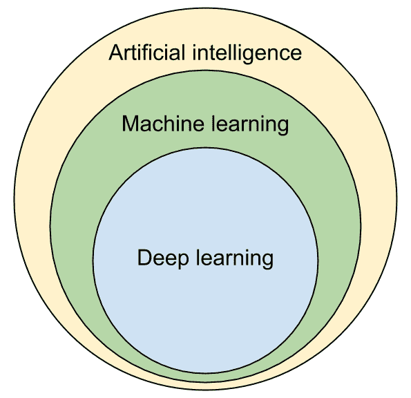

# 第一章：介绍与安装

欢迎阅读 Caffe2 快速入门指南。本书旨在为您提供 Caffe2 深度学习框架的快速入门，并指导您如何使用它来训练和部署深度学习模型。本书通过代码示例创建、训练并运行推理，解决实际问题。通过这种方式，读者可以快速将本书中的代码应用到自己的应用程序中。

本章简要介绍 Caffe2，并展示如何在您的计算机上构建和安装它。本章将涵盖以下内容：

+   深度学习和 Caffe2 介绍

+   构建和安装 Caffe2

+   测试 Caffe2 Python API

+   测试 Caffe2 C++ API

# 深度学习简介

如 **人工智能** (**AI**)、**机器学习** (**ML**) 和 **深度学习 (DL)** 等术语目前非常流行。这种流行可以归因于深度学习技术在过去几年中带来了显著的进展，使计算机能够“看”、“听”、“读”并“创造”。首先，我们将介绍这三个领域及其交集：



图 1.1：深度学习、机器学习和人工智能之间的关系

# 人工智能

**人工智能** (**AI**) 是一个通用术语，用来指代计算机的智能，特别是它们推理、感知、认知和响应的能力。它用来指代任何具备智能的非生物系统，而这种智能是由一套规则的结果。无论这些规则是由人类手动创建，还是计算机通过分析数据自动学习得到，都不影响 AI 的定义。AI 的研究始于 1956 年，此后经历了许多起伏和几次低谷，称为 **AI 冬天**。

# ML

**机器学习** (**ML**) 是 AI 的一个子集，利用统计学、数据和学习算法教计算机从给定的数据中学习。这些数据被称为 **训练数据**，它是针对特定问题而收集的，包含每个输入及其预期输出的示例。ML 算法通过训练数据自动学习模型或表示，这些模型可用于对新的输入数据进行预测。

机器学习中有许多流行的模型类型，包括 **人工神经网络** (**ANNs**)、贝叶斯网络、**支持向量机** (**SVM**) 和随机森林。本书中我们关注的 ML 模型是人工神经网络（ANN）。ANN 的结构灵感来自大脑中的连接。这些神经网络模型最初在机器学习中非常流行，但后来由于当时计算能力的不足，它们逐渐被冷落。

# 深度学习

在过去的十年中，利用**图形处理单元**（**GPU**）的并行处理能力来解决一般计算问题变得流行。这种类型的计算被称为**通用 GPU 计算（GPGPU）**。GPU 价格相对较低，并且通过使用如**CUDA**和**OpenCL**等 GPGPU 编程模型和 API 作为加速器使用非常方便。从 2012 年开始，神经网络研究人员利用 GPU 训练具有大量层次的神经网络，并开始在计算机视觉、语音识别和其他问题的解决方面取得突破。具有多层神经元的深度神经网络的使用，产生了**深度学习**这一术语。深度学习算法是机器学习的一个子集，利用多层抽象来学习和参数化数据的多层神经网络模型。

# Caffe2 介绍

深度学习的普及和成功受到许多流行和开源深度学习框架的推动，这些框架可用于神经网络的训练和推断。**Caffe**是最早流行的深度学习框架之一。它由*贾扬清*在加州大学伯克利分校为其博士论文创建，并于 2013 年底向公众发布。主要用 C++编写，并提供了 C++ API。Caffe 还提供了一个基本的 Python API，封装了 C++ API。Caffe 框架通过层来创建网络。用户通过在文本文件（通常称为**prototxt**）中列出和描述其层来创建网络。

随着 Caffe 的流行，许多大学、公司和个人创建并推出了许多深度学习框架。如今一些流行的框架包括 Caffe2、TensorFlow、MXNet 和 PyTorch。TensorFlow 由 Google 推动，MXNet 得到了亚马逊的支持，而 PyTorch 主要由 Facebook 开发。

Caffe 的创始人贾扬清后来加入了 Facebook，在那里创建了 Caffe 的后续版本——Caffe2。与其他深度学习框架相比，Caffe2 专注于可伸缩性、高性能和可移植性。它用 C++编写，同时具有 C++ API 和 Python API。

# Caffe2 和 PyTorch

Caffe2 和 PyTorch 都是流行的深度学习框架，由 Facebook 维护和推动。PyTorch 源自**Torch**深度学习框架。它以 Python API 为特点，易于设计不同的网络结构，并在其上进行训练参数和方案的实验。虽然 PyTorch 可以用于云端和边缘上的生产应用的推断，但在这方面效率不及。

Caffe2 具有 Python API 和 C++ API。它设计供那些对现有网络结构进行调试，并使用来自 PyTorch、Caffe 和其他 DL 框架的预训练模型，并准备将其部署到应用程序、本地工作站、边缘低功耗设备、移动设备和云中的从业者使用。

观察到 PyTorch 和 Caffe2 的互补特性后，Facebook 计划合并这两个项目。正如我们稍后将看到的那样，Caffe2 的源代码已经组织在 PyTorch 的 Git 存储库的一个子目录下。未来，预计这两个项目将更加融合，最终目标是将它们融合成一个单一的深度学习框架，易于实验和调试，高效训练和部署，并能够从云端到边缘，从通用处理器到特定加速器进行扩展。

# 硬件要求

使用深度学习模型，特别是训练过程，需要大量的计算能力。尽管您可以在 CPU 上训练流行的神经网络，但这通常需要数小时甚至数天，具体取决于网络的复杂性。强烈建议使用 GPU 进行训练，因为与 CPU 相比，GPU 通常能将训练时间缩短一个数量级或更多。Caffe2 使用 CUDA 来访问 NVIDIA GPU 的并行处理能力。CUDA 是一个 API，使开发者能够利用 NVIDIA GPU 的并行计算能力，因此您需要使用 NVIDIA GPU。您可以在本地计算机上安装 NVIDIA GPU，也可以使用像 Amazon AWS 这样的云服务提供商，提供带有 NVIDIA GPU 的实例。在长时间训练之前，请注意这些云实例的运行成本。

一旦您使用 Caffe2 训练了一个模型，您可以使用 CPU、GPU 或许多其他处理器进行推断。我们将在本书的第六章，*将模型部署到加速器进行推断*，和第七章，*Caffe2 在边缘和云端的应用*中探讨几种这样的选项。

# 软件要求

深度学习研究和开发的主要部分目前在 Linux 计算机上进行。**Ubuntu**是一种 Linux 发行版，非常受深度学习研究和开发者欢迎。在本书中，我们将选择 Ubuntu 作为操作系统。如果您使用不同版本的 Linux，您应该能够在线搜索到类似于 Ubuntu 命令的命令，用于执行描述的大多数操作。如果您使用 Windows 或 macOS，您需要用相应的命令替换本书中的 Linux 命令。所有的代码示例都应该在 Linux、Windows 和 macOS 上无需或只需做很小的修改就能运行。

# 构建和安装 Caffe2

Caffe2 可以很容易地从源代码构建和安装。从源代码安装 Caffe2 可以为我们提供更多的灵活性和对应用程序设置的控制。构建和安装过程分为四个阶段：

1.  安装依赖项

1.  安装加速库

1.  构建 Caffe2

1.  安装 Caffe2

# 安装依赖项

我们首先需要安装 Caffe2 所依赖的包，以及构建它所需的工具和库。

1.  首先，通过使用`apt-get`工具查询 Ubuntu 在线仓库，获取关于最新版本的 Ubuntu 软件包的信息：

```py
$ sudo apt-get update
```

1.  接下来，使用`apt-get`工具，安装构建 Caffe2 所需的库，以及 Caffe2 运行时所需的库：

```py
$ sudo apt-get install -y --no-install-recommends \
 build-essential \
 cmake \
 git \
 libgflags2 \
 libgoogle-glog-dev \
 libgtest-dev \
 libiomp-dev \
 libleveldb-dev \
 liblmdb-dev \
 libopencv-dev \
 libopenmpi-dev \
 libsnappy-dev \
 libprotobuf-dev \
 openmpi-bin \
 openmpi-doc \
 protobuf-compiler \
 python-dev \
 python-pip 
```

这些包包括下载 Caffe2 源代码所需的工具（Git）以及构建 Caffe2 所需的工具（`build-essential`、`cmake`和`python-dev`）。其余的包是 Caffe2 所依赖的库，包括 Google Flags（`libgflags2`）、Google Log（`libgoogle-glog-dev`）、Google Test（`libgtest-dev`）、LevelDB（`libleveldb-dev`）、LMDB（`liblmdb-dev`）、OpenCV（`libopencv-dev`）、OpenMP（`libiomp-dev`）、OpenMPI（`openmpi-bin`和`openmpi-doc`）、Protobuf（`libprotobuf-dev`和`protobuf-compiler`）以及 Snappy（`libsnappy-dev`）。

1.  最后，安装 Python Pip 工具，并使用它安装其他 Python 库，如`NumPy`和`Protobuf` Python API，这些在使用 Python 时非常有用：

```py
$ sudo apt-get install -y --no-install-recommends python-pip 

$ pip install --user \
 future \
 numpy \
 protobuf
```

# 安装加速库

使用 Caffe2 训练深度学习网络并用于推理涉及大量数学计算。使用数学运算和深度学习基本操作的加速库，可以通过加速训练和推理任务帮助 Caffe2 用户。CPU 和 GPU 的供应商通常提供这样的库，如果系统中可用，Caffe2 也支持使用这些库。

**英特尔数学核心库**（**MKL**）是加速在英特尔 CPU 上训练和推理的关键。此库对个人和社区使用是免费的。可以通过在此注册进行下载：[`software.seek.intel.com/performance-libraries`](https://software.seek.intel.com/performance-libraries)。安装过程包括解压下载的包，并以超级用户身份运行`install.sh`安装脚本。默认情况下，库文件会安装到`/opt/intel`目录中。如果 MKL 被安装到默认目录，接下来的 Caffe2 构建步骤会自动找到并使用 MKL 的 BLAS 和 LAPACK 例程。

**CUDA** 和 **CUDA 深度神经网络** (**cuDNN**) 库对于在 NVIDIA GPU 上进行更快的训练和推理是必不可少的。CUDA 在此注册后可免费下载：[`developer.nvidia.com/cuda-downloads`](https://developer.nvidia.com/cuda-downloads)。cuDNN 可以从这里下载：[`developer.nvidia.com/cudnn`](https://developer.nvidia.com/cudnn)。注意，你需要有一块现代的 NVIDIA GPU，并且已经安装了 NVIDIA GPU 驱动程序。作为 GPU 驱动程序的替代方案，你可以使用随 CUDA 一起安装的驱动程序。CUDA 和 cuDNN 库的文件通常会安装在 Linux 系统的 `/usr/local/cuda` 目录下。如果安装在默认目录，Caffe2 的构建步骤会自动找到并使用 CUDA 和 cuDNN。

# 构建 Caffe2

使用 Git，我们可以克隆包含 Caffe2 源代码及其所需所有子模块的 Git 仓库：

```py
$ git clone --recursive https://github.com/pytorch/pytorch.git && cd pytorch 
$ git submodule update --init
```

请注意，Caffe2 的源代码现在位于 PyTorch 源代码库的一个子目录中。这是因为 Facebook 为这两个流行的深度学习框架制定了共同发展计划，旨在在一段时间内合并两个框架的最佳特性。

Caffe2 使用 CMake 作为其构建系统。CMake 使得 Caffe2 能够轻松地为多种编译器和操作系统进行构建。

要使用 CMake 构建 Caffe2 源代码，我们首先创建一个构建目录，并从其中调用 CMake：

```py
$ mkdir build
$ cd build
$ cmake .. 
```

CMake 会检查可用的编译器、操作系统、库和软件包，并决定启用哪些 Caffe2 特性以及使用哪些编译选项。这些选项可以在根目录下的 `CMakeLists.txt` 文件中查看。选项以 `option(USE_FOOBAR "使用 Foobar 库" OFF)` 的形式列出。你可以通过在 `CMakeLists.txt` 文件中将这些选项设置为 `ON` 或 `OFF` 来启用或禁用它们。

这些选项也可以在调用 CMake 时进行配置。例如，如果你的 Intel CPU 支持 AVX/AVX2/FMA，并且你希望使用这些特性来加速 Caffe2 操作，那么可以通过以下方式启用 `USE_NATIVE_ARCH` 选项：

```py
$ cmake -DUSE_NATIVE_ARCH=ON ..
```

# 安装 Caffe2

CMake 最终会生成一个 `Makefile` 文件。我们可以使用以下命令来构建 Caffe2 并将其安装到系统中：

```py
$ sudo make install
```

这一步涉及构建大量的 CUDA 文件，可能会非常慢。建议使用 `make` 的并行执行功能，利用 CPU 的所有核心来加快构建速度。我们可以通过以下命令来实现：

```py
$ sudo make -j install
```

使用 `make` 安装方法来构建和安装，会使后续更新或卸载 Caffe2 变得困难。

相反，我更倾向于创建 Caffe2 的 Debian 软件包并进行安装。这样，我可以方便地卸载或更新它。我们可以使用 `checkinstall` 工具来实现这一点。

要安装 `checkinstall` 并使用它来构建和安装 Caffe2，请使用以下命令：

```py
$ sudo apt-get install checkinstall
$ sudo checkinstall --pkgname caffe2
```

这个命令还会生成一个 Debian `.deb` 包文件，你可以用它在其他计算机上安装或与他人共享。例如，在我的计算机上，这个命令生成了一个名为 `caffe2_20181207-1_amd64.deb` 的文件。

如果你需要更快速的构建，可以使用 `make` 的并行执行功能以及 `checkinstall`：

```py
$ sudo checkinstall --pkgname caffe2 make -j install
```

如果你以后需要卸载 Caffe2，现在可以使用以下命令轻松卸载：

```py
$ sudo dpkg -r caffe2
```

# 测试 Caffe2 Python API

我们现在已经安装了 Caffe2，但需要确保它已正确安装，并且 Python API 能正常工作。一种简单的方法是返回到你的主目录，并检查 Caffe2 的 Python API 是否能被导入并正常执行。可以使用以下命令进行检查：

```py
$ cd ~
$ python -c "from caffe2.python import core"
```

不要在 Caffe2 目录内运行前面的命令。这样做是为了避免 Python 在选择使用你已安装的 Caffe2 文件和源代码或构建目录中的文件时产生歧义。

如果你的 Caffe2 *没有*正确安装，你可能会看到某种错误，例如以下代码块中显示的错误：

```py
$ python -c "from caffe2.python import core"
Traceback (most recent call last):
 File "<string>", line 1, in <module>
ImportError: No module named caffe2.python
```

如果你的 Caffe2 已经正确安装，那么你可能不会看到错误。然而，如果没有 GPU，可能仍然会看到警告：

```py
$ python -c "from caffe2.python import core"
WARNING:root:This caffe2 python run does not have GPU support. Will run in CPU only mode.
```

# 测试 Caffe2 C++ API

我们现在已经安装了 Caffe2，但需要确保它已正确安装，并且 C++ API 能正常工作。一种简单的方法是创建一个小的 C++ 程序，初始化 Caffe2 的全局环境。这是通过调用一个名为 `GlobalInit` 的方法并传入程序的参数来完成的。这通常是 Caffe2 C++ 应用程序中的第一个调用。

创建一个名为 `ch1.cpp` 的 C++ 源文件，代码如下：

```py
// ch1.cpp
#include "caffe2/core/init.h"

int main(int argc, char** argv)
{
    caffe2::GlobalInit(&argc, &argv);
    return 0;
}
```

我们可以使用以下命令编译这个 C++ 源文件：

```py
$ g++ ch1.cpp -lcaffe2
```

我们要求链接器通过使用 `-lcaffe2` 选项来链接 `libcaffe2.so` 共享库文件。编译器使用默认的头文件位置，链接器使用默认的共享库文件位置，所以我们不需要指定这些路径。

默认情况下，Caffe2 的头文件安装在 `/usr/local/include` 下的 `caffe2` 子目录中。这个路径通常会自动包含在 C++ 编译中。同样，Caffe2 的共享库文件默认安装在 `/usr/local/lib` 中。如果你将 Caffe2 安装到其他位置，需要使用 `-I` 选项指定包含目录的位置，并使用 `-L` 选项指定共享库文件的位置。

我们现在可以执行编译后的二进制文件：

```py
$ ./a.out
```

如果执行成功，那么你的 Caffe2 安装是正确的。你现在可以开始编写 Caffe2 C++ 应用程序。

# 总结

恭喜！本章简要介绍了深度学习和 Caffe2。我们研究了在系统中构建和安装 Caffe2 的过程。现在我们准备好通过构建自己的网络、训练自己的模型并将其用于解决实际问题，来探索深度学习的世界。

在下一章中，我们将学习 Caffe2 操作符，并了解如何将它们组合以构建简单的计算图。然后，我们将继续构建一个能够识别手写数字的神经网络。
