# 第二章：构建网络

在本章中，我们将了解 Caffe2 操作符，并学习如何使用这些操作符构建网络。为了学习如何使用操作符，我们将从零开始构建一个简单的计算图。然后，我们将解决一个实际的计算机视觉问题——MNIST（通过构建一个带有训练参数的真实神经网络）并用于推理。

本章涵盖以下主题：

+   Caffe2 操作符简介

+   操作符与层的区别

+   如何使用操作符构建网络

+   MNIST 问题简介

+   为 MNIST 问题构建网络

+   通过 Caffe2 网络进行推理

# 操作符

在 Caffe2 中，神经网络可以被看作是一个有向图，其中节点是操作符，边表示操作符之间数据流的传递。操作符是 Caffe2 网络中的基本计算单元。每个操作符都定义了一定数量的输入和输出。当操作符被执行时，它读取输入，执行与之相关的计算，并将结果写入输出。

为了获得最佳性能，Caffe2 操作符通常用 C++ 实现，以便在 CPU 上执行，并用 CUDA 实现，以便在 GPU 上执行。Caffe2 中的所有操作符都来自一个通用接口。你可以在 Caffe2 源代码中的 `caffe2/proto/caffe2.proto` 文件中看到这个通用接口的定义。

以下是我在 `caffe2.proto` 文件中找到的 Caffe2 操作符接口：

```py
// Operator Definition
message OperatorDef {
  repeated string input = 1; // the name of the input blobs
  repeated string output = 2; // the name of output top blobs
  optional string name = 3; // the operator name. This is optional.
  // the operator type. This is needed to create the object from the 
  //operator
  // registry.
  optional string type = 4;
  repeated Argument arg = 5;

  // The device option that the operator should run under.
  optional DeviceOption device_option = 6;

  // Optionally, one can specify an engine when there are multiple
  // implementations available simultaneously for one device type.
  // If one specifies an engine but that engine does not exist in the    
  //compiled
  // Caffe2 binary, Caffe2 will fall back to the default engine of that 
  //device
  // type.
  optional string engine = 7;

  // Additional 'fake' inputs used for expressing control dependencies
  // in the operator graph. This can be used to ensure that an
  // operator does not run until another operator is ready, for e.g.
  // scheduling control. These are not passed as actual inputs to the
  // Operator implementation, and are only used by the Net class for
  // scheduling purposes.
  repeated string control_input = 8;

  // is_gradient_op argument is only used as a hint in shape inference
  // and has no runtime significance
  optional bool is_gradient_op = 9 [0,1][default = false];

  // debug information associated with the construction of the 
  //operator.
  // This is an optional string with no assumed characteristics as
  // operators can be constructed in any language.
  optional string debug_info = 10;
}
```

上述代码片段是**Google 协议缓冲区**（**ProtoBuf**）格式的定义。ProtoBuf 是一种用于需要序列化和反序列化结构化数据的应用程序的机制。ProtoBuf 的序列化和反序列化机制被大多数流行语言和平台所支持。Caffe2 使用 ProtoBuf，使得它的所有结构，如操作符和网络，都可以通过多种编程语言、不同操作系统和 CPU 架构轻松访问。

从上面的操作符定义中，我们可以看到，Caffe2 中的操作符定义了 `input` 和 `output` 数据块，并具有 `name`（名称）、`type`（类型）、`device`（执行设备，如 CPU 或 GPU）、`engine`（执行引擎）以及其他信息。

Caffe2 的一大亮点是，它拥有大量已经定义并为你优化的操作符，数量多达数百个。这样做的好处是，你可以使用丰富的操作符来构建自己的网络，并且你从其他地方借用的网络很可能在 Caffe2 中得到完全支持。这减少了你定义自己操作符的需求。你可以在 Caffe2 操作符目录中找到 Caffe2 操作符的完整列表及其文档，网址为 [`caffe2.ai/docs/operators-catalogue.html`](https://caffe2.ai/docs/operators-catalogue.html)。

# 示例——MatMul 操作符

作为 Caffe2 操作符的一个例子，考虑**MatMul**操作符，它可用于执行**矩阵乘法**。这一线性代数操作在深度学习中至关重要，并且是许多重要神经网络层（如全连接层和卷积层）实现的核心。我们将在本章稍后以及第三章《训练网络》中分别学习这些层。矩阵乘法操作如图 2.1 所示：

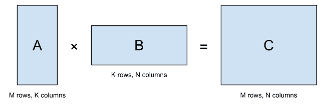

图 2.1：矩阵乘法

如果我们查阅 Caffe2 操作符目录中的 MatMul 操作符，我们将找到如图 2.2 所示的文档：

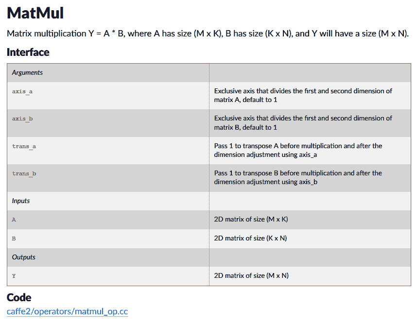

图 2.2：Caffe2 中 MatMul 操作符的文档

在图 2.2 中的 MatMul 操作符文档中，我们可以看到操作符的功能描述。在接口部分，我们看到它有两个输入：分别为大小为 M×K 和 K×N 的二维矩阵 A 和 B。它执行矩阵 A 和 B 的乘法，并生成一个大小为 M×N 的二维矩阵 C。我们还可以看到它有一些可选参数，用来指定 A 和 B 是否有专属轴，或者它们是否是转置矩阵。最后，我们还看到 Caffe2 文档贴心地为我们指向了定义`MatMul`操作符的实际 C++源代码。Caffe2 中所有操作符的文档都有以下有用结构：定义、输入、输出、可选参数，以及源代码指针。

学习了`MatMul`操作符的定义后，下面是一个代码片段，用于创建模型并向其中添加`MatMul`操作符：

```py
model = model_helper.ModelHelper("MatMul model")
model.net.MatMul(["A", "B"], "C")
```

在前面的代码中，我们首先使用 Caffe2 `model_helper`模块中的`ModelHelper`类创建一个名为“`MatMul model`”的模型。**模型**是用于承载网络的结构，**网络**是一个由操作符组成的有向图。`model_helper`是一个高级的 Caffe2 Python 模块，其`ModelHelper`类可以轻松创建和管理模型。我们之前创建的`model`对象在其`net`成员中持有网络定义。

我们通过调用模型网络定义中的`MatMul`方法将`MatMul`操作符添加到这个模型中。请注意`MatMul`操作符的两个参数。第一个参数是一个列表，包含需要乘法的两个矩阵的名称。在这里，“`A`”和“`B`”是 Caffe2 工作空间中存储矩阵元素的 blob 的名称。（我们将在本章稍后学习 Caffe2 工作空间的内容。）同样，第二个参数“`C`”表示工作空间中的输出矩阵 blob。

# 层与操作符的区别

旧版的深度学习框架，如 Caffe，并没有操作符。相反，它们的基本计算单元被称为**层**。这些旧框架选择使用“*层*”这一名称，灵感来源于神经网络中的层。

然而，现代框架如 Caffe2、TensorFlow 和 PyTorch 更倾向于使用术语*操作符*来表示它们的基本计算单元。操作符和层之间存在细微的差别。在早期的框架中，比如 Caffe，一个层由该层的计算函数和该层的训练参数组成。与此不同，Caffe2 中的操作符仅包含计算函数。训练参数和输入是外部的，需要显式地提供给操作符。

# 示例 – 一个全连接操作符

为了说明层和操作符之间的区别，考虑 Caffe2 中的**全连接**（**FC**）操作符。全连接层是神经网络中最传统的层。早期的神经网络大多由一个输入层、一个或多个全连接层以及一个输出层组成：

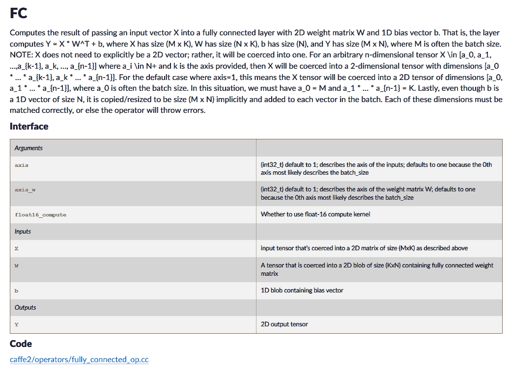

图 2.3：Caffe2 操作符目录中的 FC 操作符接口文档

输入 X 到 FC 操作符的大小应为 M×K。这里，M 是批次大小。这意味着，如果我们将 10 个不同的输入作为一个**批次**输入神经网络，M 将是批次大小的值，即 10。因此，每个输入实际上是一个 1×K 的向量传递给该操作符。我们可以看到，与之前介绍的没有训练参数的`MatMul`操作符不同，FC 操作符有输入的训练参数：W 和 b。训练参数 W 是一个 K×N 的二维矩阵，表示权重值；训练参数 b 是一个一维向量，表示偏置值。FC 操作符将输出 Y 计算为 X×W+b。这意味着，每个 1×K 的输入向量在经过该操作符处理后会产生一个 1×N 的输出。事实上，这也解释了全连接层的名称：每个 1×K 的输入都与每个 1×N 的输出完全连接：

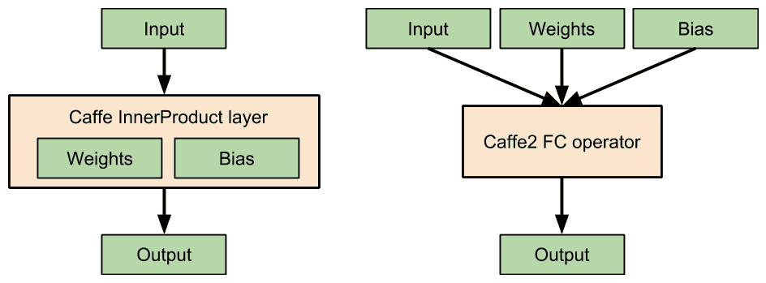

图 2.4：Caffe 层和 Caffe2 操作符之间的区别

在像 Caffe 这样的旧框架中，全连接层的权重和偏置训练参数与层一同存储。相比之下，在 Caffe2 中，FC 操作符不存储任何参数。训练参数和输入会被传递给操作符。*图 2.4*展示了 Caffe 层与 Caffe2 操作符之间的区别，以全连接层为例。由于大多数深度学习文献仍将这些实体称为层，因此我们将在本书的其余部分中交替使用*层*和*操作符*这两个词。

# 构建计算图

在本节中，我们将学习如何使用`model_helper`在 Caffe2 中构建一个网络。（`model_helper`在本章前面已经介绍过。）为了保持这个例子的简单性，我们使用不需要训练参数的数学操作符。所以，我们的网络是一个计算图，而不是神经网络，因为它没有从训练数据中学习的训练参数。我们将构建的网络由图 2.5 所示：

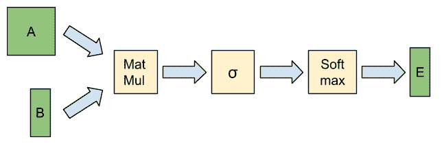

图 2.5：我们的简单计算图，包含三个操作符

如你所见，我们向网络提供了两个输入：一个矩阵**A**和一个向量**B**。对**A**和**B**应用`MatMul`操作符，并将其结果传递给`Sigmoid`函数，在图 2.5 中由**σ**表示。`Sigmoid`函数的结果被传递给`SoftMax`函数。（接下来我们将进一步了解`Sigmoid`和`SoftMax`操作符。）`Sigmoid`函数的输出**E**即为网络的输出。

以下是构建上述图形、提供输入并获取输出的 Python 代码：

```py
#!/usr/bin/env python2

"""Create a network that performs some mathematical operations.
Run inference on this network."""

from caffe2.python import workspace, model_helper
import numpy as np

# Initialize Caffe2
workspace.GlobalInit(["caffe2",])

# Initialize a model with the name "Math model"
model = model_helper.ModelHelper("Math model")

# Add a matrix multiplication operator to the model.
# This operator takes blobs "A" and "B" as inputs and produces blob "C" as output.
model.net.MatMul(["A", "B"], "C")

# Add a Sigmoid operator to the model.
# This operator takes blob "C" as input and produces blob "D" as output.
model.net.Sigmoid("C", "D")

# Add a Softmax operator to the model.
# This operator takes blob "D" as input and produces blob "E" as output.
model.net.Softmax("D", "E", axis=0)

# Create input A, a 3x3 matrix initialized with some values
A = np.linspace(-0.4, 0.4, num=9, dtype=np.float32).reshape(3, 3)

# Create input B, a 3x1 matrix initialized with some values
B = np.linspace(0.01, 0.03, num=3, dtype=np.float32).reshape(3, 1)

# Feed A and B to the Caffe2 workspace as blobs.
# Provide names "A" and "B" for these blobs.
workspace.FeedBlob("A", A)
workspace.FeedBlob("B", B)

# Run the network inside the Caffe2 workspace.
workspace.RunNetOnce(model.net)

# Extract blob "E" from the workspace.
E = workspace.FetchBlob("E")

# Print inputs A and B and final output E
print A
print B
print E
```

该程序可以分为四个阶段：

1.  初始化 Caffe2

1.  构建模型网络

1.  向工作区添加输入数据

1.  在工作区中运行模型的网络并获取输出

你可以在自己的程序中使用类似的结构来组成网络并将其用于推理。

让我们详细查看每个阶段的 Python 代码。

# 初始化 Caffe2

在调用任何 Caffe2 方法之前，我们需要导入可能需要的 Caffe2 Python 模块：

1.  首先，导入`workspace`和`module_helper`模块：

```py
from caffe2.python import workspace, model_helper
import numpy as np
```

这一步骤还导入了`numpy`模块，以便我们可以在程序中轻松创建矩阵和向量。**NumPy**是一个流行的 Python 库，提供多维数组（包括向量和矩阵）以及一大堆可以应用于这些数组的数学操作。

1.  接下来，使用以下调用初始化默认的 Caffe2 工作区：

```py
workspace.GlobalInit(["caffe2",])
```

工作区是 Caffe2 中所有数据创建、读取和写入的地方。这意味着我们将使用工作区加载输入、网络的训练参数、操作符之间的中间结果以及网络的最终输出。我们还使用工作区在推理过程中执行网络。

我们之前已经创建了 Caffe2 的默认工作区。我们也可以创建其他具有独特名称的工作区。例如，要创建第二个工作区并切换到它，可以执行以下代码：`workspace.SwitchWorkspace("Second Workspace", True)`

# 构建模型网络

1.  我们使用`ModelHelper`类（在本章前面描述）来创建一个空的模型并命名为`Math model`：

```py
# Initialize a model with the name "Math model"
model = model_helper.ModelHelper("Math model")
```

1.  接下来，我们将第一个操作符`MatMul`添加到该模型的网络中：

```py
# Add a matrix multiplication operator to the model.
# This operator takes blobs "A" and "B" as inputs and produces blob "C" as output.
model.net.MatMul(["A", "B"], "C")
```

`MatMul`运算符在本章前面有描述。我们在调用中指明了输入 blob`["A", "B"]`和输出 blob`"C"`的名称。**Blob**是一个具有名称的 N 维数组，存储相同类型的值。例如，我们可以将浮动点值矩阵表示为二维 blob。Blob 不同于大多数 Python 数据结构，如`list`和`dict`，因为它其中的所有值必须具有相同的数据类型（如`float`或`int`）。神经网络中使用的所有输入数据、输出数据和训练参数都以 blob 的形式存储在 Caffe2 中。

我们还没有在工作区创建这些 blob。我们将运算符添加到网络中，并告知 Caffe2，在网络实际使用时，这些名称的 blob 将会出现在工作区。

1.  之后，我们将下一个运算符`Sigmoid`添加到网络中：

```py
# Add a Sigmoid operator to the model.
# This operator takes blob "C" as input and produces blob "D" as output.
model.net.Sigmoid("C", "D")
```

# Sigmoid 运算符

`Sigmoid`运算符实现了**Sigmoid 函数**。这个函数在神经网络中非常流行，也被称为**逻辑函数**。其定义如下：

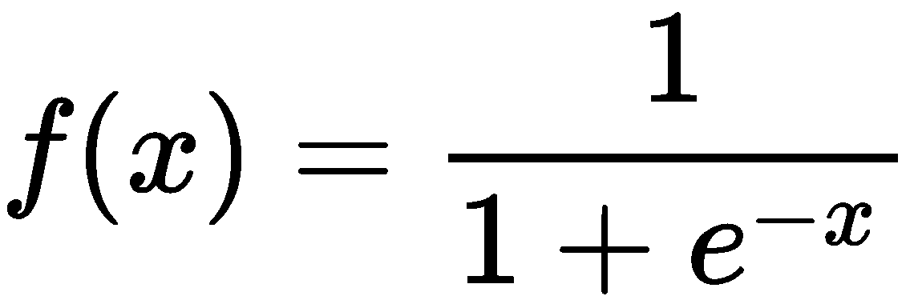

图 2.6 展示了该函数的图形：

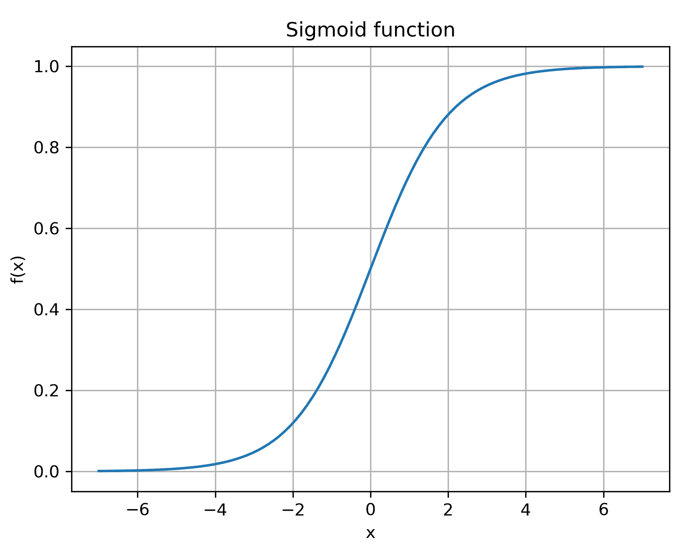

图 2.6：Sigmoid 函数的图形

`Sigmoid`是一个非线性函数，通常在神经网络中作为激活函数使用。**激活函数**是引入在一个或多个层序列之间的常见层。它将输入转换为激活值，决定接下来层中的神经元是否被激活（或触发）。激活函数通常会向网络中引入非线性特性。

注意*Sigmoid*的形状像字母*S*。它看起来像一个平滑的阶跃函数，其输出被限制在 0 和 1 之间。例如，它可以用于将任何输入值分类，判断该值是否属于某个类别（值为**1.0**）或不属于（值为**0.0**）。

Caffe2 中的 Sigmoid 函数是一个**逐元素运算符**。这意味着它会单独应用于输入的每一个元素。在我们之前的代码片段中，我们告知 Caffe2，网络中添加的这个运算符将从工作区获取名为`"C"`的输入 blob，并将输出写入工作区中的`"D"` blob。

作为最终的第三个运算符，我们将`Softmax`运算符添加到网络中：

```py
# Add a Softmax operator to the model.
# This operator takes blob "D" as input and produces blob "E" as output.
model.net.Softmax("D", "E", axis=0)
```

# Softmax 运算符

`Softmax`运算符实现了**SoftMax 函数**。该函数接受一个向量作为输入，并将该向量的元素标准化为概率分布。它在每个向量元素上的定义如下：

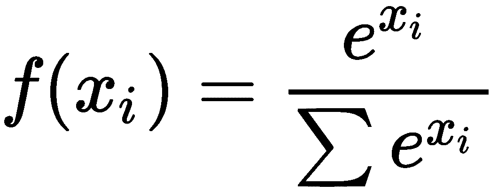

`SoftMax` 函数的输出值具有良好的特性。每个输出值  都被限制在  之间，并且输出向量的所有值总和为 1。由于这些特性，该函数通常作为分类神经网络中的最后一层使用。

在上面的代码片段中，我们向网络添加了一个 `Softmax` 操作符，该操作符将使用名为 `"D"` 的 Blob 作为输入，并将输出写入名为 `"E"` 的 Blob。`axis` 参数用于指示沿哪个轴将输入的 N 维数组拆分并强制转换为二维数组。通常，`axis=1` 表示 Blob 的第一个轴是批次维度，其他部分应被强制转换为向量。由于我们在本示例中使用的是单一输入，因此我们使用 `axis=0` 来表示整个输入应该被强制转换为 1D 向量以供 `Softmax` 使用。

# 将输入 Blob 添加到工作区

现在我们的模型已准备好。我们将通过 NumPy 初始化两个输入 Blob `A` 和 `B`，并为其分配线性分布的值：

```py
# Create input A, a 3x3 matrix initialized with some values
A = np.linspace(-0.4, 0.4, num=9, dtype=np.float32).reshape(3, 3)

# Create input B, a 3x1 matrix initialized with some values
B = np.linspace(0.01, 0.03, num=3, dtype=np.float32).reshape(3, 1)
```

请注意，我们指定了这些数组中的所有值都将是浮点数类型。在 NumPy 中，这通过 `np.float32` 来表示。NumPy 的 `reshape` 函数用于将一维数组的值转换为大小为  和  的矩阵。

由于我们将在 Caffe2 中对网络执行推理操作，我们需要将输入 Blob 设置到工作区中。**推理** 是将输入数据传递给经过训练的神经网络并进行“推断”或获取输出的过程。在 Caffe2 中，将 Blob 设置到工作区并为其指定名称和值的操作称为 **喂入**。

喂入输入 Blob 是通过 `FeedBlob` 调用来执行的，如下所示：

```py
# Feed A and B to the Caffe2 workspace as blobs.
# Provide names "A" and "B" for these blobs.
workspace.FeedBlob("A", A)
workspace.FeedBlob("B", B)
```

在前面的代码片段中，我们将张量 `A` 和 `B` 输入到工作区，并分别将这些 Blob 命名为 `"A"` 和 `"B"`。

# 运行网络

我们构建了一个网络，并且已经准备好在工作区中输入数据。现在我们准备在该网络上执行推理操作。在 Caffe2 中，这个过程称为 **运行**。我们在工作区的网络上执行运行操作，如下所示：

```py
# Run the network inside the Caffe2 workspace.
workspace.RunNetOnce(model.net)
```

运行结束后，我们可以从工作区中提取或获取输出 Blob，并打印我们的输入和输出 Blob 以供参考：

```py
# Extract blob "E" from the workspace.
E = workspace.FetchBlob("E")

# Print inputs A and B and final output E
print A
print B
print E
```

当执行此计算图代码时，应该产生如下所示的输出：

```py
$ ./computation_graph.py
A: [[-0.4 -0.3 -0.2]
 [-0.1  0\.   0.1]
 [ 0.2  0.3  0.4]]
B: [[0.01]
 [0.02]
 [0.03]]
E: [[0.3318345 ]
 [0.33333108]
 [0.33483443]]
```

你可以处理矩阵乘法、Sigmoid 和 SoftMax 图层，使用输入 `A` 和 `B`，并验证 `E` 确实具有正确的输出值。

# 构建多层感知器神经网络

在本节中，我们介绍了 MNIST 问题，并学习如何使用 Caffe2 构建 **多层感知器** (**MLP**) 网络来解决该问题。我们还学习了如何将预训练的参数加载到网络中并用于推理。

# MNIST 问题

**MNIST 问题**是一个经典的图像分类问题，曾在机器学习中非常流行。如今，最先进的方法已经可以在该问题上实现超过 99%的准确率，因此它不再具有实际意义。然而，它作为我们学习如何构建一个解决实际机器学习问题的 Caffe2 网络的垫脚石。

MNIST 问题的核心在于识别 28 x 28 像素大小的灰度图像中的手写数字。这些图像来自 MNIST 数据库，这是一个修改过的扫描文档数据集，最初由**国家标准与技术研究院**（**NIST**）共享，因此得名**修改版 NIST**（**MNIST**）。该数据集中的一些示例如图 2.7 所示：

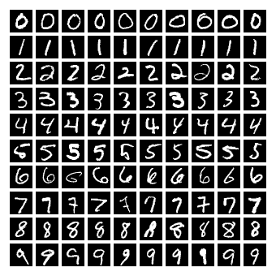

图 2.7：MNIST 数据集中每个数字（0 到 9）的 10 张随机样本

注意，有些手写数字即使对人类来说也可能难以分类。

每张 MNIST 数据集中的图像包含一个手写数字，范围从 0 到 9。每张图像中的灰度值已被归一化，并且手写数字被居中处理。因此，MNIST 是一个适合初学者的数据集，因为在用于推理或训练之前，我们无需进行图像清理、预处理或增强操作。（如果使用其他图像数据集，通常需要进行这些操作。）通常，我们会使用该数据集中的 60,000 张图像作为训练数据，另外 10,000 张图像用于测试。

# 构建一个 MNIST MLP 网络

为了解决 MNIST 问题，我们将创建一个神经网络，称为**多层感知器**（**MLP**）。这是给具有输入层、输出层和一个或多个隐藏层的神经网络的经典名称。MLP 是一种**前馈神经网络**，因为它的网络是一个**有向无环图**（**DAG**）；即，它没有循环。

用于创建本节所述的 MLP 网络、加载预训练参数并用于推理的 Python 代码，可以在本书附带的`mnist_mlp.py`文件中找到。在接下来的章节中，我们将对这段代码进行拆解并尝试理解它。

# 初始化全局常量

我们的 Python Caffe2 代码用于 MNIST MLP 网络的开始部分是初始化一些 MNIST 常量：

```py
# Number of digits in MNIST
MNIST_DIGIT_NUM = 10
# Every grayscale image in MNIST is of dimensions 28x28 pixels in a single channel
MNIST_IMG_HEIGHT = 28
MNIST_IMG_WIDTH = 28
MNIST_IMG_PIXEL_NUM = MNIST_IMG_HEIGHT * MNIST_IMG_WIDTH
```

MNIST 数据集中有`10`个（`MNIST_DIGIT_NUM`）数字（0-9），我们需要识别这些数字。每个 MNIST 图像的尺寸为 28 x 28 像素（`MNIST_IMG_HEIGHT`，`MNIST_IMG_WIDTH`）。

# 构建网络层

以下是我们将要构建的 MNIST MLP 网络的示意图：

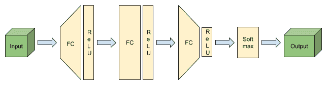

图 2.8：我们的 MNIST MLP 网络，包含输入层、三对 FC 和 ReLU 层以及最终的 SoftMax 层

我们将构建一个简单的前馈神经网络，包含三对全连接层和 ReLU 激活层。每一对层都连接到前一对层的输出。第三对全连接层和 ReLU 激活层的输出将通过 SoftMax 层，以获得网络的输出分类值。该网络结构如图 2.8 所示。

为了构建这个网络，我们首先使用`ModelHelper`初始化一个模型，就像我们在之前的计算图示例中做的一样。然后，我们使用**Brew** API 来添加网络的各个层。

虽然像我们在计算图示例中那样使用原始操作符调用也是可行的，但如果我们构建真实的神经网络，使用 Brew 更为优选。这是因为 Brew 中的`helper`函数使得为每层初始化参数和为每层选择设备变得非常容易。使用操作符方法来做相同的事情则需要多次调用并传入多个参数。

调用 Brew `helper`函数来添加一层通常需要这些参数：

+   包含我们正在添加该层的网络的模型

+   输入数据块或前一层的名称

+   该层的名称

+   该层的输入维度

+   该层的输出维度

我们首先通过以下代码添加第一对全连接层和 ReLU 层：

```py
# Create first pair of fullyconnected and ReLU activation layers
# This FC layer is of size (MNIST_IMG_PIXEL_NUM * 2)
# On its input side it is fed the MNIST_IMG_PIXEL_NUM pixels
# On its output side it is connected to a ReLU layer
fc_layer_0_input_dims = MNIST_IMG_PIXEL_NUM
fc_layer_0_output_dims = MNIST_IMG_PIXEL_NUM * 2
fc_layer_0 = brew.fc(
    model,
    input_blob_name,
    "fc_layer_0",
    dim_in=fc_layer_0_input_dims,
    dim_out=fc_layer_0_output_dims
)
relu_layer_0 = brew.relu(model, fc_layer_0, "relu_layer_0")
```

注意，在这一对层中，输入的维度是`MNIST_IMG_PIXEL_NUM`，而输出的维度是`MNIST_IMG_PIXEL_NUM * 2`。

# ReLU 层

以下图示展示了 ReLU 函数：

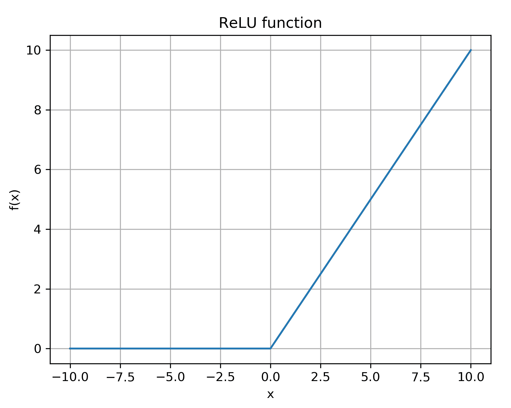

图 2.9：ReLU 函数

在构建计算图时，我们引入了一个激活层，叫做 Sigmoid。在这里，我们使用另一个流行的激活层叫做**修正线性单元**（**ReLU**）。该函数在*图 2.9*中可以看到，其定义如下：

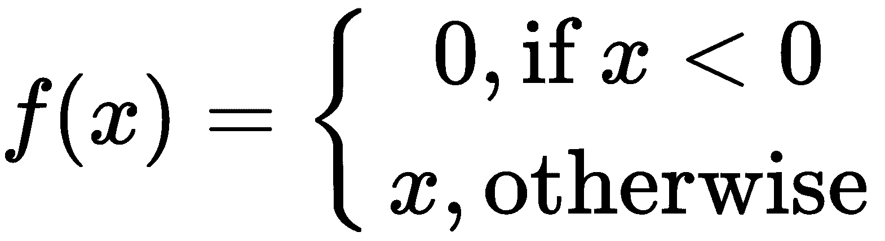

我们使用以下代码添加第二对和第三对层，分别命名为（`"fc_layer_1"`，`"relu_layer_1"`）和（`"fc_layer_2"`，`"relu_layer_2"`）：

```py
# Create second pair of fullyconnected and ReLU activation layers
fc_layer_1_input_dims = fc_layer_0_output_dims
fc_layer_1_output_dims = MNIST_IMG_PIXEL_NUM * 2
fc_layer_1 = brew.fc(
    model,
    relu_layer_0,
    "fc_layer_1",
    dim_in=fc_layer_1_input_dims,
    dim_out=fc_layer_1_output_dims
)
relu_layer_1 = brew.relu(model, fc_layer_1, "relu_layer_1")
# Create third pair of fullyconnected and ReLU activation layers
fc_layer_2_input_dims = fc_layer_1_output_dims
fc_layer_2_output_dims = MNIST_IMG_PIXEL_NUM
fc_layer_2 = brew.fc(
    model,
    relu_layer_1,
    "fc_layer_2",
    dim_in=fc_layer_2_input_dims,
    dim_out=fc_layer_2_output_dims
)
relu_layer_2 = brew.relu(model, fc_layer_2, "relu_layer_2")
```

第二对层接受`MNIST_IMG_PIXEL_NUM * 2`大小的输入，输出`MNIST_IMG_PIXEL_NUM * 2`。第三对层接受`MNIST_IMG_PIXEL_NUM * 2`并输出`MNIST_IMG_PIXEL_NUM`。

在使用神经网络解决分类问题时，我们通常需要对类别进行概率分布。我们在网络的末尾添加一个 SoftMax 层来实现这一点：

```py
# Create a softmax layer to provide output probabilities for each of
# 10 digits. The digit with highest probability value is considered to be
# the prediction of the network.
softmax_layer = brew.softmax(model, relu_layer_2, "softmax_layer")
```

注意，当`brew.softmax`方法能够从其连接的输入中获取输入和输出的维度时，它不需要显式地告知输入和输出的维度。这是使用 Brew 方法的优势之一。

# 设置网络层的权重

在组建完网络后，我们将预训练的层权重整合到网络中。这些权重是通过在 MNIST 训练数据上训练该网络得到的。我们将在下一章学习如何训练一个网络。在本章中，我们将重点介绍如何将这些预训练权重加载到我们的网络中并执行推理。

请注意，在我们使用的三种层类型中，只有全连接层需要预训练权重。我们已将这些权重存储为 NumPy 文件，以便于加载。可以通过使用 NumPy 的`load`方法从磁盘加载这些文件。这些值通过`workspace.FeedBlob`方法在工作区中设置，并通过指定它们所属的层名称来完成。

实现这一点的代码片段如下：

```py
for i, layer_blob_name in enumerate(inference_model.params):
   layer_weights_filepath = "mnist_mlp_weights/{}.npy".format(str(i))
   layer_weights = np.load(layer_weights_filepath, allow_pickle=False)
   workspace.FeedBlob(layer_blob_name, layer_weights)
```

# 运行网络

所以我们已经构建了一个网络，并且用预训练权重初始化了它的层。现在我们可以将输入数据提供给它，并通过网络执行推理来获得输出。

我们可以逐个将输入图像喂给网络，并获得输出的分类结果。然而，在生产系统中这样做并不能有效利用 CPU 或 GPU 的计算资源，且推理吞吐量低。因此，几乎所有深度学习框架都允许用户将一批输入数据同时提供给网络，无论是在推理还是训练过程中。

为了说明如何输入一批图像，我们有一个`mnist_data.npy`文件，其中包含一批 64 个 MNIST 图像的数据。我们从文件中读取这批数据，并将其设置为工作区中的数据块，使其作为网络的输入：

```py
# Read MNIST images from file to use as input
input_blob = None
with open("mnist_data.npy") as in_file:
   input_blob = np.load(in_file)
# Set MNIST image data as input data
workspace.FeedBlob("data", input_blob)
```

我们通过调用`workspace.RunNetOnce`方法并将网络作为输入来执行网络推理：

```py
workspace.RunNetOnce(inference_model.net)
```

我们从工作区获取网络的输出数据块，对于每一个 64 个输入，我们确定哪个 MNIST 数字类别的置信度最高；也就是说，网络认为该 MNIST 图像是哪个数字：

```py
network_output = workspace.FetchBlob("softmax_layer")
for i in range(len(network_output)):
    # Get prediction and confidence by finding max value and its index 
    # in preds array
    prediction, confidence = max(enumerate(network_output[i]), 
    key=operator.itemgetter(1))
    print("Input: {} Prediction: {} Confidence: {}".format(i, 
    prediction, confidence)
```

当我们执行此脚本时，我们会得到如下输出：

```py
Input: 0 Prediction: 5 Confidence: 0.609326720238
Input: 1 Prediction: 7 Confidence: 0.99536550045
Input: 2 Prediction: 9 Confidence: 0.877566576004
Input: 3 Prediction: 9 Confidence: 0.741059184074
Input: 4 Prediction: 2 Confidence: 0.794860899448
Input: 5 Prediction: 0 Confidence: 0.987336695194
Input: 6 Prediction: 7 Confidence: 0.900308787823
Input: 7 Prediction: 1 Confidence: 0.993218839169
Input: 8 Prediction: 6 Confidence: 0.612009465694
```

这意味着网络认为第一个输入图像是数字 5，第二个是数字 7，以此类推。

# 总结

在本章中，我们了解了 Caffe2 操作符，以及它们与旧深度学习框架中使用的层的区别。我们通过组合多个操作符构建了一个简单的计算图。然后，我们解决了 MNIST 机器学习问题，使用 Brew 辅助函数构建了一个 MLP 网络。我们将预训练的权重加载到该网络中，并用于对一批输入图像进行推理。我们还介绍了几个常见的层，例如矩阵乘法、全连接、Sigmoid、SoftMax 和 ReLU。

在本章中，我们学习了如何对我们的网络进行推理。在下一章，我们将学习训练网络，并了解如何训练网络来解决 MNIST 问题。
