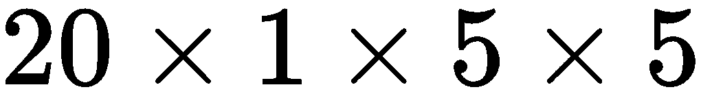

# 第三章：训练网络

在第二章，*构建网络*中，我们学习了如何创建 Caffe2 操作符，以及如何利用它们构建网络。在本章中，我们将重点介绍神经网络的训练。我们将学习如何创建一个用于训练的网络，并使用 Caffe2 进行训练。我们将继续使用 MNIST 数据集作为示例。然而，与上一章中构建的 MLP 网络不同，我们将在本章创建一个名为 LeNet 的流行网络。

本章将涵盖以下主题：

+   神经网络训练简介

+   构建 LeNet 的训练网络

+   训练和监控 LeNet 网络

# 训练简介

本节将简要概述神经网络的训练过程。这将帮助我们理解后续章节中如何使用 Caffe2 实际训练网络。

# 神经网络的组件

我们使用神经网络来解决某些类型的问题，对于这些问题，设计计算机算法将会非常繁琐或困难。例如，在 MNIST 问题中（在第二章，*构建网络*中介绍），手工设计一个复杂的算法来检测每个数字的常见笔画模式，并据此确定每个数字，将会非常繁琐。相反，设计一个适合该问题的神经网络，然后使用大量数据对其进行训练（如本章后面所示）来实现这一目标，会更为简单。如果训练数据多样且训练过程谨慎，这样的网络在处理输入数据的变化时也会比任何确定性的手工算法更加健壮。

神经网络有两个主要组件：其结构和权重。我们通常先设计网络结构，然后使用训练算法和训练数据来确定权重。经过训练后，网络结构及其嵌入的权重可以用于对新的未见过的数据进行推理，如下图所示：


图 3.1：用于推理的网络结构和权重

# 神经网络的结构

网络的结构是各层的系列、它们的类型和配置。这个结构通常由研究人员或熟悉神经网络所要解决问题的实践者设计。例如，为了解决图像分类问题，计算机视觉研究人员通常会在网络中使用一系列卷积层。（我们将在本章稍后学习卷积层。）每层的各种配置参数也需要事先确定，比如卷积层中卷积滤波器的大小和数量。现在有很多兴趣将深度学习本身用于确定适合特定问题的网络结构。然而，关于这个元学习主题的讨论超出了本书的范围。

# 神经网络的权重

网络的第二个组成部分是它的权重和偏置。我们通常将它们统称为**权重**，有时也称为**参数**。这些是网络中每一层的浮点值参数。每一层的权重如何使用取决于层的类型。例如，在全连接层中，较大的权重值可能表示输入信号和网络输出之间的更强相关性。在卷积层中，卷积滤波器的权重可能表示它在输入中寻找的特定模式或形状。

总结一下，我们坐下来设计一个网络的结构以解决特定问题。这个过程中我们的选择将受到对问题空间的理解、深度学习框架中可用的层类型、我们使用的加速器的硬件限制，以及我们愿意花费多少训练时间的限制。例如，GPU 或 CPU 中可用的内存可能会限制我们在一层中使用的权重数量或网络中使用的层数。我们愿意花费的训练时间也限制了我们可以在网络中使用的权重和层的数量，因为使用越多的权重和层，网络收敛和训练的时间可能会越长。

# 训练过程

一旦我们构建了一个网络结构，我们就可以使用像 Caffe2 这样的深度学习框架来描述该结构。然后，我们在训练数据上应用框架中可用的多种训练算法之一。这将训练网络并学习每一层的权重，以最佳方式放大信号并抑制噪声。这个过程如图 3.2 所示：


图 3.2：训练是使用训练算法和数据学习神经网络权重的过程

神经网络通常使用基于梯度的优化算法进行训练。为此，我们首先为网络定义一个**目标函数**或**损失函数**。该函数通过将网络在给定输入上的输出与该输入的真实结果进行比较，从而计算出损失或误差值。训练过程迭代地选择训练数据并计算其损失，然后使用优化算法更新权重，以减少误差。这个过程会不断重复，直到我们看到网络准确率没有进一步提高为止：


图 3.3：训练中迭代的三个阶段

训练过程的单次迭代如*图 3.3*所示。我们可以看到，它有三个不同的阶段。第一阶段是**前向传播**，在这一阶段，我们基本上使用当前权重对网络进行推理，以获得网络的结果或假设。第二阶段，我们使用损失函数计算网络的损失。第三阶段是**反向传播**，我们使用一种叫做反向传播（backpropagation）的算法来更新网络的权重。

# 梯度下降的变体

我们通常可以使用三种梯度下降的变体来采样每次训练迭代中使用的训练数据。如果每次迭代都使用整个训练数据集，这个过程叫做**批量梯度下降**。如果每次迭代都只使用一个随机选择的训练样本，那么这个过程叫做**随机梯度下降**。最常用的变体是**小批量梯度下降**，即每次迭代时使用一个随机选择的训练数据子集。为了获得最佳结果，我们会将训练数据打乱，然后将其划分为小批量，每次迭代使用一个小批量。完成一次训练数据的处理后，我们称之为**一个周期（epoch）**，然后再一次打乱并重新划分成小批量，继续训练。

在本章的其余部分，我们将学习可以用于 MNIST 的 LeNet 网络，如何构建它，以及如何使用 Caffe2 进行训练。

# LeNet 网络

在第二章，*构建网络*中，我们构建了一个由多个全连接层和激活层对组成的 MLP 网络。在本章中，我们将构建并训练一个**卷积神经网络**（**CNN**）。这种类型的网络之所以得名，是因为它主要使用卷积层（将在下一节介绍）。对于计算机视觉问题，CNN 相比 MLP 已经证明可以用更少的参数提供更好的结果。最早成功的 CNN 之一被用来解决我们之前提到的 MNIST 问题。这个名为**LeNet-5**的网络是由 Yann LeCun 及其同事创建的：


图 3.4：我们 LeNet 模型的结构

我们将构建一个与 LeNet 精神相似的网络。我们将在本书余下部分中称之为 LeNet 模型。从 *图 3.4* 中可以看到，我们的 LeNet 网络有八层。输入层之后，有两对卷积层和池化层。它们之后是一个全连接层和 ReLU 激活层的对，接着是另一个全连接层。最后使用 SoftMax 层来获得 MNIST 分类结果。

接下来，我们将介绍 CNN 中两个重要的层，它们是 LeNet 的一部分：卷积层和池化层。

# 卷积层

*卷积层* 是神经网络中最重要的一层，用于解决涉及图像和视频的计算机视觉问题。卷积层的输入张量至少具有三个维度：。也就是说，输入有  个通道，每个通道都是一个高度为  和宽度为  的 2D 矩阵。这自然符合图像的布局。例如，RGB 图像有三个通道，每个通道具有一定的高度和宽度。

当我们提到 **卷积** 时，通常指的是 **2 维** (**2D**) 卷积。一个 2D 卷积层有两组在训练过程中学习的参数：滤波器参数和偏置参数。

与 2D 卷积层相关的第一组参数是  滤波器。每个 **滤波器** 或 **卷积核** 都是一个 **3 维** (**3D**) 张量，形状为 ，包含在训练过程中学习到的浮点值。因此，对于一个 2D 卷积层，在训练过程中需要学习的滤波器参数总数为 。请注意，2D 卷积层的卷积核与层的输入具有相同的通道数 。

与 2D 卷积层相关的第二组参数是  偏置值，每个偏置值与之前描述的  个滤波器相关。

在卷积过程中，每个  卷积核会在输入的宽度和高度上滑动。在每个卷积核停止的地方，会计算卷积核值与输入值的点积，这些输入值与卷积核重叠，从而获得该位置的一个输出值。最后，卷积核相关的偏置值会加到每个输出值上。这个过程如图 3.5 所示：


图 3.5：二维卷积操作，输入  使用两个形状为  的滤波器。输出形状为 。

请注意，通过与每个卷积核进行卷积，结果输出张量的大小为 。因此，当输入大小为  时，输入到二维卷积层后的输出大小为 。如果我们将一批  输入送入二维卷积层，结果输出的大小为 。

二维卷积层还有其他一些参数。两个重要的参数是步幅（**stride**）和填充（**padding**）。**步幅**表示卷积核沿高度和宽度移动多少个值后才停下来进行卷积。例如，如果步幅为 ，卷积核只会访问输入中的每隔一个位置。**填充**表示为了进行卷积，输入的高度和宽度可以假设扩展了多少，通常是使用**零填充**，即填充零值。

# 池化层

另一种在卷积神经网络（CNN）中常用的层叫做**池化层**。它通常用于减少前一层输出的宽度和高度。池化层通过子采样输入来生成输出。与卷积层不同，池化层没有任何预训练参数。池化层有两个与之相关的参数：**窗口大小**和**缩减函数**。类似于卷积层，池化层也有一些参数，如步幅和填充。

池化层的作用是沿着输入滑动具有指定宽度和高度的窗口。在每个停靠位置，它会将其缩减函数应用于窗口中的输入值，以产生一个单一的输出值：


图 3.6：池化层在池化输入  时，使用  池化窗口产生的输出 。

常见的缩减函数有最大池化（max）和平均池化（average）。在最大池化层中，输入窗口中值的最大值成为输出值。在**平均池化层**中，输入窗口中值的平均值成为输出值。*图 3.6* 展示了最大池化层中的一个操作。

池化窗口是二维的，并沿着输入的宽度和高度进行移动。因此，它只减少输入的宽度和高度，输入和输出中的通道数保持不变。

我们现在准备查看一个训练 LeNet 网络的代码示例。完整的源代码可以在 `ch3/mnist_lenet.py` 中找到。我们将在下一节开始读取 MNIST 训练数据。

# 训练数据

我们在本章中使用 brew 来简化构建 LeNet 网络的过程。首先，我们使用 `ModelHelper` 初始化模型，该方法在上一章中介绍过：

```py
# Create the model helper for the train model
train_model = model_helper.ModelHelper(name="mnist_lenet_train_model")
```

然后我们使用 `add_model_inputs` 方法将输入添加到训练网络中：

```py
# Specify the input is from the train lmdb
data, label = add_model_inputs(
    train_model,
    batch_size=64,
    db=os.path.join(data_folder, "mnist-train-nchw-lmdb"),
    db_type="lmdb",
)
```

训练数据通常存储在 **数据库**（**DB**）中，以便高效访问。读取数据库通常比从数千个单独的文件中读取要快。对于 MNIST 数据集中的每张训练图像，数据库存储图像的  灰度像素值和图像中的数字。每个灰度像素值是一个 8 位无符号整数，取值范围为 。每张图像中的实际数字称为 **标签**，通常是由人工通过检查图像进行注释的。例如，如果图像中的手写数字是 9，那么人工注释者会查看图像并给它标注为 9。

在我们的 `add_model_inputs` 方法中，我们使用一个便捷的 brew 辅助函数 `db_input` 将 DB 连接到我们的模型：

```py
# Load data from DB
input_images_uint8, input_labels = brew.db_input(
    model,
    blobs_out=["input_images_uint8", "input_labels"],
    batch_size=batch_size,
    db=db,
    db_type=db_type,
)
```

我们指定工作区中存储图像和标签数据的 blob 名称：`input_images_uint8` 和 `input_labels`。我们还指定了批量大小和访问数据库所需的信息，如数据库的名称和类型。

神经网络几乎总是使用浮动值，理想情况下，值需要标准化到范围 。因此，我们将输入图像数据（它是一个 8 位无符号整数数据类型）转换为浮动数据类型并进行标准化：

```py
# Cast grayscale pixel values to float
# Scale pixel values to [0, 1]
input_images = model.Cast(input_images_uint8, "input_images", to=core.DataType.FLOAT)
input_images = model.Scale(input_images, input_images, scale=float(1./256))
```

请注意 Caffe2 的 `ModelHelper` 提供了有用的方法，使得执行这两项操作变得轻松：`Cast` 和 `Scale`。

最后，我们向图像数据 blob 添加一个 `StopGradient` 操作符，指示反向传递算法不要为其计算梯度：

```py
# We do not need gradient for backward pass
# This op stops gradient computation through it
input_images = model.StopGradient(input_images, input_images)
```

我们这样做是因为输入层不是神经网络的实际层。它没有可学习的参数，也没有需要训练的内容。因此，反向传递可以在这里停止，无需继续进行。`StopGradient` 是 Caffe2 中的一个伪操作符，它实现了这一效果。

# 构建 LeNet

我们通过在脚本中调用 `build_mnist_lenet` 方法来构建用于推理的 LeNet 层：

```py
# Build the LeNet network
softmax_layer = build_mnist_lenet(train_model, data)
```

请注意，我们只将图像像素数据输入到该网络，而不是标签。推理时不需要标签；标签用于训练或测试，以作为真实值与网络最终层预测结果进行比较。

接下来的各小节描述了如何添加卷积和池化层的对，完全连接层和 ReLU 层，以及最终的 SoftMax 层，以构建 LeNet 网络。

# 层 1 – 卷积

LeNet 的第一层是卷积层，我们在本章之前已经介绍过。我们使用 Caffe2 的二维卷积操作符 `Conv2D` 来构建该层，可以从操作符目录中找到。可以使用方便的 `brew.conv` 方法将其添加到模型中。

在创建操作符时，我们指定输入是一个单通道的灰度值矩阵。我们还指明输出应该有`20`个通道，每个通道保存一个矩阵。最后，我们指定每个卷积核的宽度和高度为`5`像素。在 Caffe2 中，我们只需要提供这样的最小信息，API 会自动处理其余的必要参数：

```py
# Convolution layer that operates on the input MNIST image
# Input is grayscale image of size 28x28 pixels
# After convolution by 20 kernels each of size 5x5,
# output is 20 channels, each of size 24x24
layer_1_input_dims = 1   # Input to layer is grayscale, so 1 channel
layer_1_output_dims = 20 # Output from this layer has 20 channels
layer_1_kernel_dims = 5  # Each kernel is of size 1x5x5
layer_1_conv = brew.conv(
    model,
    input_blob_name,
    "layer_1_conv",
    dim_in=layer_1_input_dims,
    dim_out=layer_1_output_dims,
    kernel=layer_1_kernel_dims,
)
```

让我们扩展这些值，以更好地了解该层的输入、输出和卷积核的尺寸。由于 MNIST 数据集是一个  的单通道灰度值网格，因此网络第一层的输入是一个尺寸为  的 3D 数组。我们这里执行的是二维卷积，每个卷积核的通道数与输入层的通道数相同。此外，我们指明卷积核的宽度和高度为 5。因此，每个卷积核的尺寸为 。由于我们要求此层的输出有 20 个通道，所以需要 20 个这样的卷积核。因此，这一层卷积核参数的实际尺寸为 。卷积层还使用偏置值，每个输出通道一个，所以偏置值的尺寸为 。

如果对一个  卷积核在  输入上进行卷积，步幅为 1，结果是 。当使用 20 个这样的卷积核时，结果是 。这就是该层输出的尺寸。

# 层 2 – 最大池化

第一个卷积层的输出连接到一个最大池化层，这个池化层在本章之前已经介绍过。我们使用 Caffe2 的最大池化操作符 `MaxPool` 来构建该层，该操作符可以从操作符目录中找到。可以使用方便的 `brew.max_pool` 方法将其添加到模型中。在创建此操作符时，我们指定其卷积核大小为 2 x 2，并且步幅为 2：

```py
# Max-pooling layer that operates on output from previous convolution layer
# Input is 20 channels, each of size 24x24
# After pooling by 2x2 windows and stride of 2, the output of this layer
# is 20 channels, each of size 12x12
layer_2_kernel_dims = 2 # Max-pool over 2x2 windows
layer_2_stride = 2      # Stride by 2 pixels between each pool
layer_2_pool = brew.max_pool(
    model,
    layer_1_conv,
    "layer_2_pool",
    kernel=layer_2_kernel_dims,
    stride=layer_2_stride,
)
```

上一层卷积的输出尺寸为 。当使用窗口大小  和步幅为 2 进行最大池化时，输出尺寸为 。

# 层 3 和层 4 – 卷积和最大池化

第一个卷积层和池化层后面是 LeNet 中的另一对卷积层和池化层，进一步减少宽度和高度并增加通道数：

```py
# Convolution layer that operates on output from previous pooling layer.
# Input is 20 channels, each of size 12x12
# After convolution by 50 kernels, each of size 20x5x5,
# the output is 50 channels, each of size 8x8
layer_3_input_dims = 20  # Number of input channels
layer_3_output_dims = 50 # Number of output channels
layer_3_kernel_dims = 5  # Each kernel is of size 50x5x5
layer_3_conv = brew.conv(
    model,
    layer_2_pool,
    "layer_3_conv",
    dim_in=layer_3_input_dims,
    dim_out=layer_3_output_dims,
    kernel=layer_3_kernel_dims,
)

# Max-pooling layer that operates on output from previous convolution layer
# Input is 50 channels, each of size 8x8
# Apply pooling by 2x2 windows and stride of 2
# Output is 50 channels, each of size 4x4
layer_4_kernel_dims = 2 # Max-pool over 2x2 windows
layer_4_stride = 2      # Stride by 2 pixels between each pool
layer_4_pool = brew.max_pool(
    model,
    layer_3_conv,
    "layer_4_pool",
    kernel=layer_4_kernel_dims,
    stride=layer_4_stride,
)
```

第二对卷积层和池化层与第一对相似，卷积核大小为 5 x 5，步长为 2，而最大池化窗口大小为，步长为 2。不同之处在于，第二个卷积层使用 50 个卷积核，生成一个具有 50 个通道的输出。在第二个卷积层之后，输出大小为。在第二个最大池化层之后，输出为。注意，输入的宽度和高度已经大幅度下降。

# 第 5 层和第 6 层 – 完全连接层和 ReLU 层

卷积层和池化层后面跟着一对完全连接层和 ReLU 层，通过便捷的方法`brew.fc`和`brew.relu`添加：

```py
# Fully-connected layer that operates on output from previous pooling layer
# Input is 50 channels, each of size 4x4
# Output is vector of size 500
layer_5_input_dims = 50 * 4 * 4
layer_5_output_dims = 500
layer_5_fc = brew.fc(
    model,
    layer_4_pool,
    "layer_5_fc",
    dim_in=layer_5_input_dims,
    dim_out=layer_5_output_dims,
)

# ReLU layer that operates on output from previous fully-connected layer
# Input and output are both of size 500
layer_6_relu = brew.relu(
    model,
    layer_5_fc,
    "layer_6_relu",
)
```

完全连接层的输入大小为。这个 3D 输入在传递给完全连接层时被展平为一个大小为 800 的向量。我们已经指定了该层的输出大小为`500`。因此，在训练过程中，这一层需要学习个值，再加上一个偏置值，这些值将在推理时使用。完全连接层的输出被传递给一个 ReLU 层，作为激活函数。

# 第 7 层和第 8 层 – 完全连接层和 Softmax 层

LeNet-5 使用第二个完全连接层将输出减少到预测 10 个数字概率所需的`10`个值：

```py
# Fully-connected layer that operates on output from previous ReLU layer
# Input is of size 500
# Output is of size 10, the number of classes in MNIST dataset
layer_7_input_dims = 500
layer_7_output_dims = 10
layer_7_fc = brew.fc(
    model,
    layer_6_relu,
    "layer_7_fc",
    dim_in=layer_7_input_dims,
    dim_out=layer_7_output_dims,
)
```

最终的 SoftMax 层将完全连接层的 10 个输出值转换为概率分布：

```py
# Softmax layer that operates on output from previous fully-connected layer
# Input and output are both of size 10
# Each output (0 to 9) is a probability score on that digit
layer_8_softmax = brew.softmax(
    model,
    layer_7_fc,
    "softmax",
)
```

# 训练层

在前面的章节中，我们构建了 LeNet 网络的层结构，这些层是推理所需的，并且添加了图像像素的输入以及与每张图像对应的标签。在这一部分，我们在网络的末端添加了一些层，旨在计算损失函数并进行反向传播。这些层只在训练过程中需要，使用训练好的网络进行推理时可以丢弃。

# 损失层

正如我们在*训练简介*部分中提到的，我们需要在网络的最后设置一个`loss`函数，用来确定网络的误差。Caffe2 在其操作符目录中提供了许多常见的损失函数的实现。

在本示例中，我们使用**分类交叉熵损失**计算损失值。该损失通常用于衡量分类模型的性能，其输出介于`0`和`1`之间。在 Caffe2 中，这个损失可以通过两个操作符的组合来实现，分别是`LabelCrossEntropy`和`AveragedLoss`，如以下所示：

```py
# Compute cross entropy between softmax scores and labels
cross_entropy = train_model.LabelCrossEntropy([softmax_layer, label], "cross_entropy")

# Compute the expected loss
loss = train_model.AveragedLoss(cross_entropy, "loss")
```

# 优化层

在*训练介绍*一节中，我们提到过，基于梯度的优化算法是训练过程的核心。

我们首先指示 Caffe2 使用我们之前添加的损失层的输出，在训练期间的反向传播计算梯度：

```py
# Use the average loss we just computed to add gradient operators to the model
train_model.AddGradientOperators([loss])
```

`AddGradientOperators` 方法免去了我们显式指定这些操作符的麻烦，并将其添加到网络中。

最后，我们指定基于梯度的优化算法**随机梯度下降**（**SGD**）用于我们的训练：

```py
# Specify the optimization algorithm
optimizer.build_sgd(
    train_model,
    base_learning_rate=0.1,
    policy="step",
    stepsize=1,
    gamma=0.999,
)
```

我们指定了重要的 SGD 参数，例如使用的学习率、调整学习率的策略、步长和 gamma。

优化算法在 Caffe2 中作为 `Optimizer` 实现。该深度学习框架实现了许多常见的优化算法，包括 SGD、Adam、AdaGrad、RMSProp 和 AdaDelta。在我们之前的调用中，我们使用了 `optimizer` 模块提供的有用包装器 `build_sgd`，该包装器为我们配置了 SGD 优化器。

# 准确率层

最后，我们通过调用 `add_accuracy_op` 方法来指示应该跟踪模型的准确性，该方法包含如下语句：

```py
brew.accuracy(model, [softmax_layer, label], "accuracy")
```

请注意函数调用的第二个参数。这表明 Caffe2 应该将 SoftMax 层的输出与真实标签进行比较，以确定模型的准确性。

`accuracy` 层有助于对训练过程进行人工监督。我们可以在训练过程的任何阶段执行推理，并通过准确率层的输出，了解网络在该阶段的准确性。

# 训练与监控

我们通过在工作空间中创建网络并初始化网络的所有参数 blob 来开始训练过程。这是通过调用工作空间的 `RunNetOnce` 方法完成的：

```py
# The parameter initialization network only needs to be run once.
workspace.RunNetOnce(train_model.param_init_net)
```

接下来，我们请求 Caffe2 在内存中创建网络：

```py
# Creating an actual network as a C++ object in memory.
# We need this as the object is going to be used a lot
# so we avoid creating an object every single time it is used.
workspace.CreateNet(train_model.net, overwrite=True)
```

我们终于准备好开始训练。我们会迭代一个预定的次数，并在每次迭代中使用工作空间的 `RunNet` 方法运行前向传播和反向传播。

训练像我们的 LeNet 模型这样的小型网络在 CPU 和 GPU 上都非常快速。然而，许多真实的模型训练可能需要数小时甚至数天。因此，建议通过在每次训练迭代后提取损失和准确性值来持续监控训练过程。

对于我们的 LeNet 模型，我们使用以下代码从我们先前添加到训练网络的损失层和准确率层的输出 blobs 中提取每次训练迭代后的损失和准确性值：

```py
# Run the network for some iterations and track its loss and accuracy
total_iters = 100
accuracy = np.zeros(total_iters)
loss = np.zeros(total_iters)
for i in range(total_iters):
    workspace.RunNet(train_model.net)
    accuracy[i] = workspace.blobs["accuracy"]
    loss[i] = workspace.blobs["loss"]
    print("Iteration: {}, Loss: {}, Accuracy: {}".format(i, loss[i], 
    accuracy[i]))

```

我们可以通过查看原始值、将其导入电子表格或绘制图表来监控训练的健康状况。图 3.7 显示了从一次训练会话的值绘制的图表：


图 3.7：训练我们模型的损失与准确性

我们可以看到，训练开始时损失值较高。这是预期的，因为我们通常以零或随机的权重初始化网络。随着训练的进行，损失值逐渐减小，相应地，网络的准确度也在提高。如果你没有看到损失值减少或准确度提升，那么说明我们的训练参数或训练数据可能存在问题。如果训练进度缓慢或出现值爆炸的情况，可能需要调整学习率等参数。

通常，我们可以在损失曲线趋于平稳且准确度适当时停止训练。为了便于在某一迭代时导出模型，最好在每次迭代后将模型导出到磁盘（如第五章中所示，*与其他框架的协作*）。这样，训练完成后，你可以选择在最佳迭代时保存的模型。

另一个有用的做法是，在每个 epoch 后，使用验证数据集来测量准确度。**验证数据**通常是从训练数据中分离出来的一部分，事先为此目的而准备。为了简化起见，我们在示例中没有使用验证数据。

# 总结

在本章中，我们学习了使用基于梯度的优化算法进行神经网络的一般训练过程。我们了解了卷积神经网络（CNN）及经典的 LeNet CNN，并使用它解决了 MNIST 问题。我们构建了这个网络，并学习了如何向其添加训练层和测试层，以便用于训练。最后，我们使用这个网络进行训练，并学习了如何在训练过程中使用 Caffe2 监控网络。在接下来的章节中，我们将学习如何使用其他框架（如 Caffe、TensorFlow 和 PyTorch）训练的模型。
