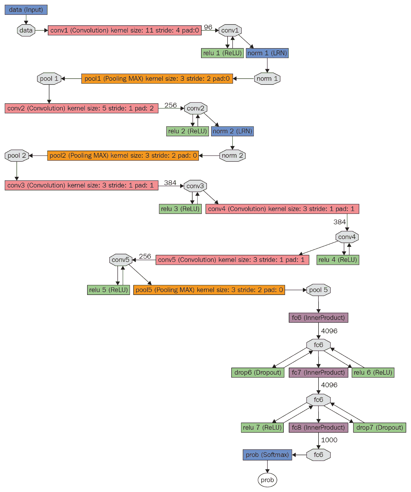
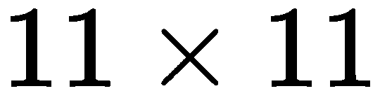
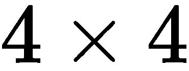
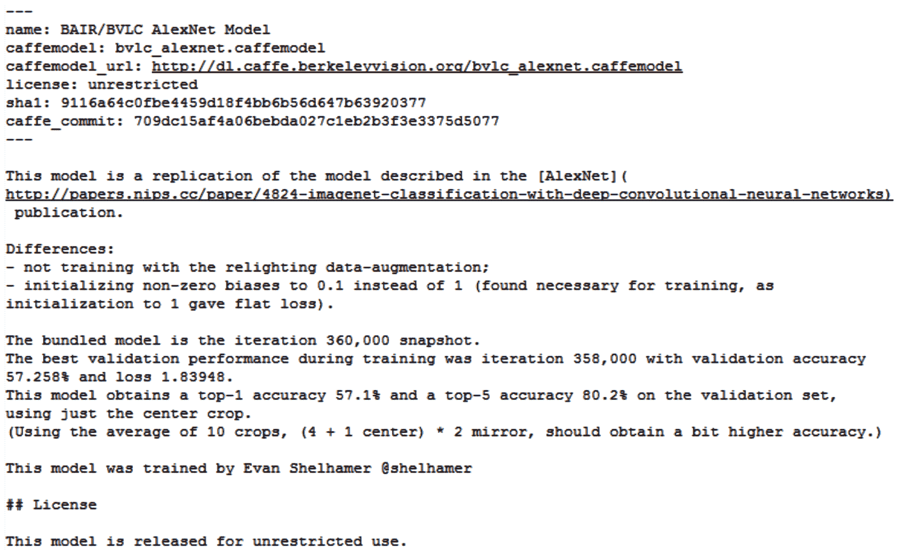
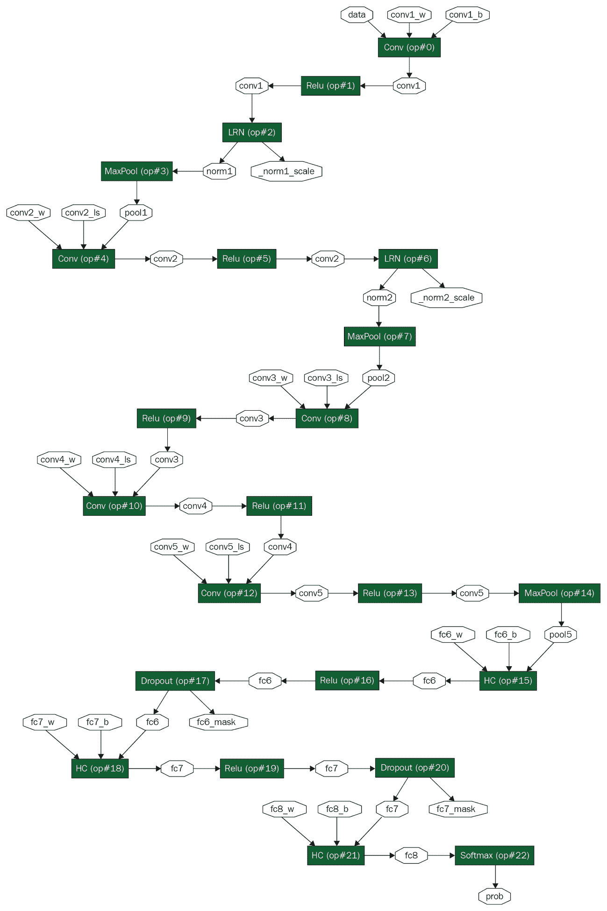

# 第四章：使用 Caffe

在第二章中，*组合网络*，以及第三章中，*训练网络*，我们分别学习了如何组合网络和训练网络。在本章中，我们将探讨 Caffe2 与 Caffe 之间的关系，并看看如何在 Caffe2 中使用 Caffe 模型，反之亦然。

本章的目标如下：

+   Caffe 与 Caffe2 的关系

+   AlexNet 简介

+   构建和安装 Caffe

+   Caffe 模型文件格式

+   Caffe2 模型文件格式

+   将 Caffe 模型转换为 Caffe2

+   将 Caffe2 模型转换为 Caffe

# Caffe 与 Caffe2 的关系

在 2012 年举办的*NIPS*学术会议上，Alex Krizhevsky 及其合作者，包括神经网络先驱 Geoffrey Hinton，展示了**ImageNet 大规模视觉识别竞赛**（**ILSVRC**）的突破性结果。研究团队在使用 ImageNet 数据集的各种图像识别任务中竞争。Krizhevsky 在图像分类任务上的结果比当时的技术水平提高了 10.8%。他首次利用 GPU 训练了一个具有多层的 CNN。这种网络结构后来被广泛称为**AlexNet**。设计这样一个具有大量层次的深度神经网络正是深度学习领域得名的原因。Krizhevsky 分享了他的整个网络源代码，现在称为**cuda-convnet**，以及高度 GPU 优化的训练代码。

不久之后，**贾扬清**及其来自加州大学**伯克利视觉与学习中心**（**BVLC**）的合作者尝试复制这些结果，将其软件命名为*DeCaf*。这个库后来经过改进和简化，并以**Caffe**的名义发布。

与其时代大多数存在缺陷和设计不良的研究代码不同，Caffe 是一个设计良好的深度学习库，通过 prototxt 文本文件轻松组合网络。其设计具有模块化特性，使得研究人员可以轻松添加新层和训练算法。这使得 Caffe 在 2012 年至 2016 年期间非常流行。图像识别领域的大多数重要网络和模型都是在 Caffe 中发布的。这就是为什么 Caffe 是一个重要的深度学习框架，你可能仍然会发现几个经典模型只能在 Caffe 中使用的原因。

与此同时，人们对 Caffe 的替代方案产生了越来越大的兴趣。这是因为 Caffe 开始暴露出其局限性。尽管在 2014 年底添加了 Python API，但 Caffe 主要是一个 C++库。这个 C++的要求导致了实验和开发的速度较慢。Caffe 还主要是为图像识别问题设计的。实践者发现，很难为解决其他问题（如语音识别）添加功能。其他有用的功能，如不同精度数据类型的利用、量化和多 GPU 训练，在 Caffe 中也没有。这些功能后来被痛苦地添加到 Caffe 中，但在工程和维护方面并不理想。

这些问题促使了新一代深度学习库的出现，这些库以易用性、分布式训练和定制化为核心，逐渐流行起来。这些库包括 TensorFlow 和 PyTorch。

颜清佳从大学转到 Facebook，并领导创建了现代深度学习库 Caffe2，本书的主题。因为他也创建了 Caffe，所以 Caffe2 借鉴了许多 Caffe 的好点子，并且被构建为与 Caffe 兼容。

# AlexNet 简介

我们在前面的部分中提到过 AlexNet，它是一个开创性的网络结构，因为它首次采用了大量的层，并展示了如何通过利用 GPU 在合理的时间内训练如此深的神经网络。

图 4.1 显示了由 Caffe 的网络可视化工具`draw_net.py`生成的 AlexNet 网络结构。此工具使用 GraphViz 库来呈现图形布局：



图 4.1：使用 GraphViz 布局的 AlexNet 网络结构

在此可视化中，层被绘制为矩形，而层之间的数据张量被绘制为拉长的八边形。例如，输入层之后的第一个矩形表示一个名为`conv1`的卷积层。它使用大小为的卷积核，步幅为`4`，填充为`0`。

从*图 4.1*中检查 AlexNet 结构时，我们可以看到，AlexNet 在精神上与我们在第三章中看到的 LeNet 模型相似，*训练网络*。然而，与 LeNet 相比，AlexNet 有更多的卷积层和末端的全连接层。此外，它还用 ReLU 代替了传统的 tanh 和 sigmoid 层。Krizhevsky 在他的论文中描述了这些变化，以及一些训练创新和 GPU 的使用，如何使得训练这样一个深层网络变得可行。

在本章的其余部分，我们将使用 AlexNet 作为示例模型，学习如何理解 Caffe 和 Caffe2 网络描述语言，并学习如何在两者之间转换。

# 构建与安装 Caffe

BVLC 维护的 Caffe 版本可以从 [`github.com/BVLC/caffe`](https://github.com/BVLC/caffe) 免费下载。由 NVIDIA 维护的 GPU 优化版 Caffe 可以从 [`github.com/NVIDIA/caffe`](https://github.com/NVIDIA/caffe) 下载。接下来的讨论中，我们将使用 BVLC 版本的 Caffe，尽管 NVIDIA 的 Caffe 也应能成功构建并类似地工作。

请注意，Caffe 提供了使用 CMake 或 Make 进行构建。在本书中，我们将讨论 CMake 构建过程。如果你希望 Caffe 使用 GPU，你需要提前安装 CUDA 和 cuDNN 库。

# 安装 Caffe 的前置依赖

安装以下前置依赖：

1.  首先，安装 Caffe 所依赖的库：

```py
$ sudo apt install libboost-all-dev libprotobuf-dev libleveldb-dev libsnappy-dev libopencv-dev libhdf5-serial-dev protobuf-compiler libgflags-dev libgoogle-glog-dev liblmdb-dev
```

1.  对于 CPU 上的 BLAS，最佳性能来自安装英特尔的 MKL 库。（MKL 的安装步骤已在第一章，“*简介与安装*”中描述。）如果没有 MKL，或者你不使用英特尔 CPU，那么可以安装 ATLAS 或 OpenBLAS：

```py
$ sudo apt install libatlas-base-dev libopenblas-dev
```

1.  要构建 Python 接口以使用 Caffe，请确保已安装以下软件包：

```py
$ sudo apt install libboost-python-dev python-skimage python-protobuf
```

我们现在准备从源代码构建 Caffe。

# 构建 Caffe

要构建 Caffe，请按照以下步骤操作：

1.  由于我们选择使用 CMake，构建过程既简单又直接：

```py
$ mkdir build
$ cd build
$ cmake ..
$ make
```

1.  要构建并运行 Caffe 单元测试，请执行以下命令：

```py
$ make runtest
```

这可能需要相当长的时间才能完成。

1.  要构建 Caffe 的 Python 接口，请执行以下命令：

```py
$ make pycaffe
$ make install
```

1.  默认情况下，安装目录将是 `build` 目录下的一个子目录。将此 `build/install/python` 路径添加到 `PYTHONPATH` 环境变量中，然后再将 Caffe 导入 Python。

# Caffe 模型文件格式

为了在 Caffe2 中使用 Caffe 模型，我们首先需要了解 Caffe 能够导出的模型文件格式。Caffe 会将训练好的模型导出为两个文件，如下所示：

1.  神经网络的结构以 `.prototxt` 文件形式存储

1.  神经网络各层的权重存储为 `.caffemodel` 文件

# Prototxt 文件

prototxt 是一个文本文件，包含神经网络结构的信息：

+   神经网络中各层的列表

+   每一层的参数，如其名称、类型、输入维度和输出维度

+   各层之间的连接

Caffe 通过使用 Google **协议缓冲区**（**Protocol Buffers**, **ProtoBuf**）序列化库将神经网络导出为序列化格式。prototxt 文件是神经网络结构在 ProtoBuf 文本格式中的序列化。

我们可以查看 Caffe 源代码中 `models` 目录下的一些流行 CNN 网络的 prototxt 文件。（参见*构建与安装 Caffe*部分，了解如何获取 Caffe 源代码。）你可能会在其中找到几个 prototxt 文件名，每个文件名都有不同的用途。

以下是一些典型 Caffe prototxt 文件名的含义：

+   `deploy.prototxt`：这个文件描述了可以用于推理的网络结构。它不包括通常用于训练网络的额外层。（我们在第三章，*训练网络*中查看了为训练网络添加的额外层或操作符。）这是我们通常希望的 prototxt 文件，如果我们希望将预训练的 Caffe 模型用于 Caffe2 中的推理。

+   `train_val.prototxt`：这个文件描述了用于训练的网络结构。它包括所有为帮助训练和验证过程而添加的额外层。如果我们希望将预训练的 Caffe 模型继续训练或微调到 Caffe2 中，这是我们通常需要的 prototxt 文件。

现在，让我们以 AlexNet 为例。（AlexNet 在本章前面介绍过。）AlexNet 预训练模型的一个版本可以在 Caffe 源代码中的 `models/bvlc_alexnet` 目录下找到。

下面是 AlexNet 的 `deploy.prototxt` 文件中的前两层：

```py
$ head -26 models/bvlc_alexnet/deploy.prototxt
name: "AlexNet"
layer {
  name: "data"
  type: "Input"
  top: "data"
  input_param { shape: { dim: 10 dim: 3 dim: 227 dim: 227 } }
}
layer {
  name: "conv1"
  type: "Convolution"
  bottom: "data"
  top: "conv1"
  param {
    lr_mult: 1
    decay_mult: 1
  }
  param {
    lr_mult: 2
    decay_mult: 0
  }
  convolution_param {
    num_output: 96
    kernel_size: 11
    stride: 4
  }
}
```

我们可以看到，`prototxt` 文件格式易于人类阅读和修改。请注意，网络的名称是 `"AlexNet"`。我们可以在前面的代码片段中看到两个名为 `"data"` 和 `"conv1"` 的层。`"data"` 层是一个 `Input` 层，我们可以看到它要求输入的尺寸是 。`"conv1"` 层是一个 `Convolution` 层，我们可以看到它的许多参数，包括核大小为  和步幅为 。

用于描述神经网络的 Caffe prototxt 文件的语法，本身是在一个 `caffe.proto` 文本文件中描述的。这个文件是用 Google 协议缓冲语言编写的。你可以在 Caffe 源代码中的 `src/caffe/proto/caffe.proto` 找到这个文件。

作为一个例子，下面是来自 `caffe.proto` 文件的 `ConvolutionParameter` 部分描述：

```py
message ConvolutionParameter {
  optional uint32 num_output = 1; // The number of outputs for the layer
  optional bool bias_term = 2 [default = true]; // whether to have bias 
  //terms

  // Pad, kernel size, and stride are all given as a single value for equal
  // dimensions in all spatial dimensions, or once per spatial dimension.
  repeated uint32 pad = 3; // The padding size; defaults to 0
  repeated uint32 kernel_size = 4; // The kernel size
  repeated uint32 stride = 6; // The stride; defaults to 1
  optional uint32 pad_h = 9 [default = 0]; // The padding height (2D only)
  optional uint32 pad_w = 10 [default = 0]; // The padding width (2D only)

  optional uint32 group = 5 [default = 1]; // The group size for group conv

  // ... Omitted other details.
  // ... Find all details in caffe.proto
}
```

通过查看这个，我们可以开始轻松理解 `deploy.prototxt` 中的卷积层参数，例如，`num_outputs`、`kernel_size` 和 `stride` 这些参数的含义。

通过这种方式，你可以理解遇到的任何 Caffe prototxt 文件。它本质上是一个层列表，包含层的名称和参数，并链接到前后层。有关特定层类型的信息，请参阅 `caffe.proto` 文件。

# Caffemodel 文件

`caffemodel` 文件是一个二进制文件，保存了神经网络各层的权重。这个文件是训练好的神经网络的 **ProtoBuf 二进制格式** 序列化。使用二进制格式是因为需要存储表示权重的浮动点或整数值。这个文件通常很大，通常达到数百兆字节，因此通常需要单独下载。

对于 Caffe 提供的每个流行模型，其源代码中都有相应的 `readme.md` 文件，其中包含下载该网络的 `caffemodel` 文件所需的详细信息。例如，图 4.2 显示了 AlexNet 模型的 `readme.md`：



图 4.2：AlexNet 模型的 readme.md

# 下载 Caffe 模型文件

Caffe 在其源代码中提供了一个 Python 脚本 `scripts/download_model_binary.py`，用于下载模型的 caffemodel 文件。此脚本需要提供模型目录作为输入。例如，要下载 AlexNet 的 `caffemodel` 文件，可以调用以下命令：

```py
$ python scripts/download_model_binary.py models/bvlc_alexnet/
```

此脚本在输入模型目录中寻找 `readme.md`（类似于 *Figure 4.2* 中的文件），从 `readme.md` 的序言中找出 caffemodel 的 URL，下载 `caffemodel` 文件，并通过将其 SHA1 哈希与序言中提供的哈希进行匹配，确保下载文件正确。

# Caffe2 模型文件格式

要能够在 Caffe2 中使用 Caffe 模型，我们还需要了解 Caffe2 可以导入的模型文件格式。与 Caffe 类似，Caffe2 也使用 Protobuf 对其模型文件进行序列化和反序列化。Caffe2 从两个文件导入训练好的模型：

1.  神经网络的结构以 `predict_net.pb` 文件或 `predict_net.pbtxt` 文件存储

1.  神经网络运算符的权重存储为 `init_net.pb` 文件

# predict_net 文件

`predict_net` 二进制文件通常命名为 `predict_net.pb`，保存神经网络中的运算符列表、每个运算符的参数以及运算符之间的连接。该文件以 ProtoBuf 二进制格式序列化神经网络结构。

我们可以观察到，与 Caffe 使用的文本序列化文件相比，Caffe2 使用了二进制序列化文件。在 Caffe2 中，这并不会带来太多麻烦，因为它有一个 Python API，可以在导入文件后轻松理解网络结构。

可选地，我们还可以使用 `predict_net` 文本文件，通常命名为 `predict_net.pbtxt`，这是一个等效于 `predict_net` 二进制文件的文本文件，但以 ProtoBuf 文本格式存储。

继续我们的 AlexNet 示例，该网络的第一个卷积层将出现在 `predict_net.pbtxt` 中，显示如下：

```py
name: "AlexNet"
op {
  input: "data"
  input: "conv1_w"
  input: "conv1_b"
  output: "conv1"
  type: "Conv"
  arg {
    name: "stride"
    i: 4
  }
  arg {
    name: "pad"
    i: 0
  }
  arg {
    name: "kernel"
    i: 11
  }
}
```

注意 `predict_net` 文本文件如何对人类非常易读，就像 Caffe 的 prototxt 文本文件一样。

描述 Caffe2 `predict_net` 文件的语法本身在 `caffe2.proto` 文本文件中描述。这是一个使用 Google protocol buffer 语言编写的文件。您可以在 Caffe2 源代码的 `proto/caffe2.proto` 中找到此文件。

这里是来自 `caffe2.proto` 的运算符定义：

```py
// Operator Definition.
message OperatorDef {
  repeated string input = 1; // the name of the input blobs
  repeated string output = 2; // the name of output top blobs
  optional string name = 3; // the operator name. This is optional.
  // the operator type. This is needed to create the object from the 
  //operator
  // registry.
  optional string type = 4;
  repeated Argument arg = 5;

  // The device option that the operator should run under.
  optional DeviceOption device_option = 6;

  // Optionally, one can specify an engine when there are multiple
  // implementations available simultaneously for one device type.
  // If one specifies an engine but that engine does not exist in the 
  //compiled
  // Caffe2 binary, Caffe2 will fall back to the default engine of that 
  //device
  // type.
  optional string engine = 7;

  // ... Omitted other details.
  // ... Find all details in caffe2.proto
}
```

我们可以看到，Caffe2 在更一般的术语中定义了操作符，而不是像 Caffe 那样明确地定义每个操作符（或层）。

# init_net 文件

`init_net 二进制文件`，通常命名为 `init_net.pb`，包含神经网络操作符的权重。该文件是经过训练的神经网络在 ProtoBuf 二进制格式中的序列化。与 Caffe 的 `caffemodel` 文件类似，这个文件通常也会很大，通常在几百兆字节的数量级。之所以命名为 `init_net`，是因为文件中的权重可用于初始化网络中的操作符。

# 将 Caffe 模型转换为 Caffe2

为了在 Caffe2 中使用 Caffe 模型，我们需要将其从 Caffe 格式转换为 Caffe2 文件格式。Caffe2 提供了一个名为 `python/caffe_translator.py` 的脚本，可用于此目的。

例如，我们可以通过如下方式将 AlexNet 文件从 Caffe 转换为 Caffe2：

```py
$ python python/caffe_translator.py path_to_caffe/models/bvlc_alexnet/deploy.prototxt path_to_caffe/models/bvlc_alexnet/bvlc_alexnet.caffemodel --init_net init_net.pb --predict_net predict_net.pb
```

运行此脚本会生成三个文件，分别是 `predict_net.pb`、`predict_net.pbtxt` 和 `init_net.pb`，用于 AlexNet：



图 4.3：Caffe2 中的 AlexNet 网络结构

*图 4.3* 显示了将 AlexNet 从 Caffe 模型转换为 Caffe2 后的网络结构图。该图的可视化是使用 `Caffe2 net_drawer.py` 工具生成的，该工具利用 GraphViz 来布局网络。你可以在 第七章，*Caffe2 在边缘和云端* 中找到有关 Caffe2 模型可视化的更多信息。

从图中可以看出，每个 Caffe 层都被替换成了 Caffe2 操作符。操作符以矩形表示，权重和数据张量以延长的八边形表示。通过查看第一个卷积操作符，我们注意到它有三个张量——一个用于数据（命名为 `data`），两个用于该操作符的权重和偏置（分别命名为 `conv1_w` 和 `conv1_b`）。

# 将 Caffe2 模型转换为 Caffe

在本章的前几节中，我们主要讨论了如何将 Caffe 模型转换为 Caffe2 模型。由于 Caffe 当前没有积极开发，而 Caffe2 部分是为了取代 Caffe2 创建的，因此大多数用户关注的就是将 Caffe 模型迁移到 Caffe2 的路径。

然而，如果你需要在 Caffe 中使用 Caffe2 模型，那么这个过程会更为艰难。目前似乎没有直接的方法将 Caffe2 模型转换为 Caffe。如果你确定 Caffe2 的操作符及其参数在 Caffe 中是完全支持的，那么你可以尝试通过一个中间格式，如 ONNX（参见 第五章，*与其他框架的协作*）来进行转换。

如果 ONNX 路径不可行，那么你可能需要手动执行以下任务：

1.  导出 Caffe2 操作符、参数和模型的权重

1.  手动创建一个 Caffe 网络，将 Caffe2 操作符与相应的 Caffe 层匹配

1.  如果没有与操作符匹配的层，使用 C++ 实现新的 Caffe 层

1.  手动加载权重到 Caffe 层并使用该 Caffe 网络进行推理

# 摘要

本章介绍了 Caffe 深度学习框架，并探讨了 Caffe 和 Caffe2 之间的关系。我们研究了 Caffe 和 Caffe2 的模型文件格式。以 AlexNet 为例网络，我们查看了如何将 Caffe 模型转换为 Caffe2 格式。最后，我们探讨了将 Caffe2 模型转换为 Caffe 的难点。

Caffe 是一个深度学习框架，已经进入生命周期的尾声，不再添加新特性。在下一章中，我们将讨论当代深度学习框架，如 TensorFlow 和 PyTorch，并了解如何在 Caffe2 和这些其他框架之间交换模型。
