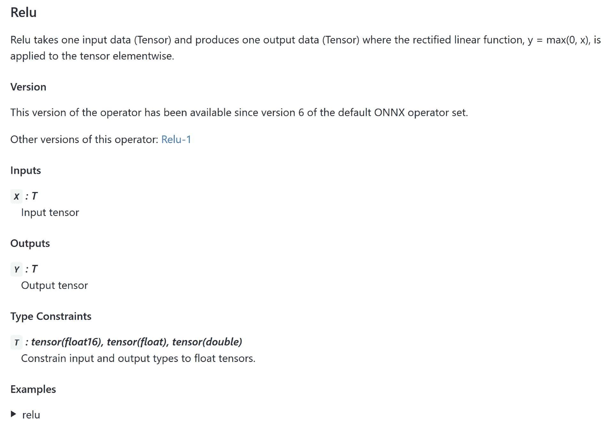

# 第五章：与其他框架合作

在第四章，*与 Caffe 合作*中，我们了解了 Caffe 及其与 Caffe2 的关系。我们研究了 Caffe 和 Caffe2 的模型文件格式，并以 AlexNet 为例，探讨了如何将一个预训练的 Caffe 模型导入 Caffe2。在本章中，我们将学习如何从其他流行的深度学习框架导出和导入到 Caffe2。同时，我们还将探讨如何使其他深度学习框架使用 Caffe2 训练的模型。

本章将涉及以下主题：

+   ONNX 模型格式

+   Caffe2 对 ONNX 的支持

+   如何将 Caffe2 模型导出为 ONNX 格式

+   如何将 ONNX 模型导入到 Caffe2

+   如何可视化 ONNX 模型

# 开放神经网络交换

**开放神经网络交换** (**ONNX**)，通常发音为*on-niks*，是一种表示计算图的格式，支持多种运算符和数据类型。这种格式足够通用，支持神经网络和传统机器学习模型。由 Facebook 和微软发起，这种格式迅速成为大多数深度学习框架中，导入和导出深度神经网络的流行格式。

# 安装 ONNX

ONNX 的源代码可以在线找到：[`github.com/onnx/onnx`](https://github.com/onnx/onnx)。其中包括格式定义和操作 ONNX 文件的脚本。用于从特定深度学习框架格式进行转换的库和工具通常由深度学习框架提供。

内建支持 ONNX 的深度学习框架包括 Caffe2、PyTorch、MXNet 和 Chainer。也有转换器可以在不同的深度学习框架之间进行转换，比如 TensorFlow。还有一些运行时可以在专用硬件加速器上使用 ONNX 模型。例如，TensorRT 提供了支持 ONNX 的推理运行时，用于 NVIDIA GPU，而 OpenVINO 则为 Intel CPU 提供了相应的支持。（我们将在第六章，*将模型部署到加速器进行推理*中讨论 TensorRT 和 OpenVINO。）

ONNX 的 Python 库可以轻松安装，使用以下命令在 Ubuntu 上进行安装：

```py
$ sudo pip install onnx
```

你可以通过以下命令在终端执行来检查安装是否成功：

```py
$ python -c "import onnx"
```

# ONNX 格式

ONNX 是一个开源格式，其规范和源代码可以在线找到：[`github.com/onnx/onnx`](https://github.com/onnx/onnx)。在第四章，*与 Caffe 合作*中，我们观察到 Caffe2 和 Caffe 都使用 Google ProtoBuf 来定义数据结构，以便进行网络结构和权重的序列化和反序列化。ONNX 也使用 Google ProtoBuf，支持 ProtoBuf 的版本 2 和 3。

图的定义，如神经网络或一般任何机器学习模型的图，定义了图所包含的各种操作符、操作符的参数以及操作符之间的关系。这些信息的语法和语义在 ONNX 中定义为两种不同的表示方式。**中间表示**（**IR**）定义了构造，例如图、节点和张量。操作符定义了图中可能的各种操作符类型。

# ONNX IR

ONNX 计算图及其数据类型的 ProtoBuf 定义可以在 ONNX 源代码中的`onnx/onnx.in.proto`文件中找到。这些也被称为 ONNX 的 IR。

通过检查前述文件中 ONNX 的 IR 定义，我们可以看到以下定义：

+   `NodeProto`：用于定义神经网络中的每一层或其他机器学习模型中的每个节点。

+   `ModelProto`：用于定义一个模型及其相关图。

+   `GraphProto`：用于定义神经网络的**有向无环图**（**DAG**）结构或其他机器学习模型的图结构。

+   `TensorProto`：用于定义一个 N 维张量。

+   `TypeProto`：用于定义 ONNX 数据类型。

# ONNX 操作符

ONNX 中操作符的定义可以在 ONNX 源代码中的`onnx/onnx-operators.in.proto`文件中找到。我们可以在该文件中找到`OperatorProto`、`OperatorSetProto`和`FunctionProto`的定义。

ONNX 中所有支持的操作符的实际定义可以在 ONNX 源代码中的`onnx/defs`目录下的子目录中的 C++源文件`defs.cc`中找到。例如，许多常见的神经网络操作符可以在 ONNX 源代码中的`onnx/defs/math/defs.cc`和`onnx/defs/nn/defs.cc`文件中找到。

另一个例子是我们在第三章《训练网络》中介绍的 ReLU 操作符。该操作符在 ONNX 中的名称为`Relu`（注意小写*lu*），并且在 ONNX 源代码中的`onnx/defs/math/defs.cc`文件中定义如下：

```py
static const char* Relu_ver6_doc = R"DOC(
    Relu takes one input data (Tensor<T>) and produces one output data
    (Tensor<T>) where the rectified linear function, y = max(0, x), is 
    applied to the tensor elementwise.
    )DOC";

ONNX_OPERATOR_SET_SCHEMA(
    Relu,
    6,
    OpSchema()
        .SetDoc(Relu_ver6_doc)
        .Input(0, "X", "Input tensor", "T")
        .Output(0, "Y", "Output tensor", "T")
        .TypeConstraint(
            "T",
            {"tensor(float16)", "tensor(float)", "tensor(double)"},
            "Constrain input and output types to float tensors.")
        .TypeAndShapeInferenceFunction(propagateShapeAndTypeFromFirstInput));
```

我们可以看到，每个操作符都是使用`ONNX_OPERATOR_SET_SCHEMA`宏定义的。这个宏在`onnx/defs/schema.h`源文件中定义，如下所示：

```py
#define ONNX_OPERATOR_SET_SCHEMA(name, ver, impl) \
ONNX_OPERATOR_SET_SCHEMA_EX(name, Onnx, ONNX_DOMAIN, ver, true, impl)
```

我们可以看到，每个操作符定义都有三个组成部分：名称（`name`）、版本（`ver`）和实现（`impl`）。

因此，对于我们在前述定义中看到的`Relu`操作符示例，我们可以推导出以下特征：

+   **名称**：操作符在 ONNX 中的名称。在本例中，它是`Relu`。请注意，单独的深度学习框架可能将这个名称映射到它们自己深度学习框架中的不同操作符或层名称。也就是说，ONNX 中的名称与深度学习框架中的对应名称不一定总是相同。

+   **版本**：该操作符定义的版本。在本例中，它是版本 6。

+   **实现**：

+   解释该操作符作用的文档字符串。在本例中，它如下所示：

"Relu 接受一个输入数据（Tensor<T>）并产生一个输出数据（Tensor<T>），其中应用了修正线性函数，y = max(0, x)，该函数逐元素作用于张量。"

+   输入操作数。在这种情况下，是一个单一的张量。

+   输出操作数。在这种情况下，是一个单一的张量。

+   张量值的数据类型限制。在这种情况下，ONNX 声明它仅支持浮点数（32 位）、双精度（64 位）和 float16（16 位，有时称为半精度）作为张量值的数据类型。

+   用于推断张量操作数类型和形状的函数。在这种情况下，它声明输出张量必须具有与输入张量相同的类型和形状。它通过使用名为 `propagateShapeAndTypeFromFirstInput` 的函数来实现这一点。

从前面定义的 Relu 操作符示例中，我们可以看到每个操作符定义中都包含了大量文档内容。所有这些内容用于自动生成完整的 ONNX 操作符文档。这个自动生成的文档可以在 ONNX 源代码中的 `docs/Operators.md` 文件中找到。当我们在寻找合适的 ONNX 操作符或尝试理解某个特定 ONNX 操作符的细节时，这是一个有用的参考。

例如，我们之前考虑过的 `Relu` 操作符的自动生成文档在图 5.1 中显示如下：



图 5.1：ONNX 中自动生成的 Relu 操作符文档

# ONNX 在 Caffe2 中

Caffe2 原生支持 ONNX。这包括将 Caffe2 模型导出为 ONNX 格式的支持，以及直接导入 ONNX 模型进行 Caffe2 推理的支持。与 Caffe2 支持 ONNX 相关的 C++ 源文件可以在 Caffe2 源代码中的 `onnx` 目录找到。提供 ONNX 前端和后端支持的 Python 源文件可以在 Caffe2 源代码中的 `python/onnx` 目录找到。

`onnx/onnx_exporter.h` 和 `onnx/onnx_exporter.cc` 包含了将 Caffe2 模型导出为 ONNX 格式所需的定义。从 Caffe2 导出到 ONNX 的支持包括操作符、数据类型的映射以及数据转换等细节。

例如，在 `onnx/onnx_exporter.cc` 中，我们可以找到一些 Caffe2 操作符到 ONNX 操作符的映射：

```py
const std::unordered_map<std::string, std::string>&
OnnxExporter::get_renamed_operators() const {
  const static std::unordered_map<std::string, std::string> kRenamedOperators{
      {"SpatialBN", "BatchNormalization"},
      {"Conv1D", "Conv"},
      {"Conv2D", "Conv"},
      {"Conv3D", "Conv"},
      {"ConvTranspose1D", "ConvTranspose"},
      {"ConvTranspose2D", "ConvTranspose"},
      {"ConvTranspose3D", "ConvTranspose"},
      {"MaxPool1D", "MaxPool"},
      {"MaxPool2D", "MaxPool"},
      {"MaxPool3D", "MaxPool"},
      {"AveragePool1D", "AveragePool"},
      {"AveragePool2D", "AveragePool"},
      {"AveragePool3D", "AveragePool"}};
  return kRenamedOperators;
}
```

每个使用 ONNX 的深度学习框架都有这样的映射。这是因为每个深度学习框架通常都有自己独特的操作符或层命名方式，并且在定义操作符特性和操作符之间的关系时有不同的术语。因此，清晰而完整的映射对于深度学习框架能够将 ONNX 模型定义转化为其自身的图定义至关重要。

从 Caffe2 和 ONNX 之间的映射关系可以看出，Caffe2 的 `SpatialBN` 操作符在 ONNX 中被重命名为 `BatchNormalization` 操作符。同样，Caffe2 的 `Conv2D` 操作符在 ONNX 中被重命名为 `Conv` 操作符。

# 将 Caffe2 模型导出为 ONNX

Caffe2 模型可以通过 Python 轻松导出为 ONNX 格式。这使得大量其他深度学习框架可以使用我们的 Caffe2 模型进行训练和推理。Caffe2-ONNX 提供的`frontend`模块完成了导出的所有繁重工作。该模块位于 Caffe2 源代码中的`python/onnx/frontend.py`文件。

本书源代码中提供的`ch5/export_to_onnx.py`脚本展示了如何将现有的 Caffe2 模型导出为 ONNX 格式。举个例子，考虑将我们在第四章中创建的 AlexNet Caffe2 模型转换为 ONNX。我们将这个网络的操作符和权重分别导出到`predict_net.pb`和`init_net.pb`文件中。

我们可以调用 ONNX 转换脚本，按照以下方式将这个 Caffe2 模型转换为名为`alexnet.onnx`的 ONNX 文件：

```py
./export_to_onnx.py predict_net.pb init_net.pb alexnet.onnx
```

让我们看看这个脚本中帮助我们从 Caffe2 导出到 ONNX 的相关部分。

首先是导入，如下代码所示：

```py
import onnx import caffe2.python.onnx.frontend from caffe2.proto import caffe2_pb2
```

`caffe2.proto.caffe2_pb2`模块具备导入存储在`protobuf`格式中的 Caffe2 模型所需的功能。`onnx`和`caffe2.python.onnx.frontend`模块具备导出到 ONNX 格式所需的功能。

在以下脚本中，我们还定义了模型输入的名称和形状：

```py
INPUT_NAME = "data"
INPUT_SHAPE = (1, 3, 227, 227)
```

在第四章，*使用 Caffe*中，你可能注意到输入层和参数是以 Caffe 的`protobuf`格式注解的。然而，这些信息并没有同时存储在 Caffe2 的`protobuf`格式和 ONNX 格式中。每次使用 Caffe2 和 ONNX 模型时，我们需要显式指定输入的名称和形状。

我们在这个示例中使用了 AlexNet 模型，该模型的输入名为`data`，输入形状为`(1, 3, 227, 227)`。请注意，并不是所有模型都有这个输入形状。例如，流行的 CNN 模型的输入形状是`(1, 3, 224, 224)`。

我们现在准备好使用`caffe2_pb2`方法读取 Caffe2 模型文件，示例如下：

```py
# Read Caffe2 predict and init model files to protobuf

predict_net = caffe2_pb2.NetDef()
with open(predict_net_fpath, "rb") as f:
    predict_net.ParseFromString(f.read())

init_net = caffe2_pb2.NetDef()
with open(init_net_fpath, "rb") as f:
    init_net.ParseFromString(f.read())
```

我们需要读取`predict_net.pb`和`init_net.pb`这两个 Caffe2 模型文件，分别表示网络和其权重。我们通过使用熟悉的`ParserFromString`方法来实现这一点，该方法来自 Google 的 ProtoBuf Python 库。

接下来，我们应该初始化输入的数据类型和张量形状，并使用 Python 字典将这些信息与输入名称关联起来，如下所示：

```py
# Network input type, shape and name

data_type = onnx.TensorProto.FLOAT
value_info = {INPUT_NAME: (data_type, INPUT_SHAPE)}
```

我们现在可以使用`frontend`模块的`caffe2_net_to_onnx_model`方法将 Caffe2 的`protobuf`对象转换为 ONNX 的`protobuf`对象，如下所示：

```py
# Convert Caffe2 model protobufs to ONNX

onnx_model = caffe2.python.onnx.frontend.caffe2_net_to_onnx_model(
    predict_net,
    init_net,
    value_info,
)
```

请注意，此转换方法需要转换所需的输入信息，这些信息存储在`value_info`中。

最后，我们可以使用 ProtoBuf 的`SerializeToString`方法将 ONNX 的`protobuf`对象序列化为字节缓冲区，然后将该缓冲区写入磁盘，如下所示：

```py
# Write ONNX protobuf to file

print("Writing ONNX model to: " + onnx_model_fpath)
with open(onnx_model_fpath, "wb") as f:
    f.write(onnx_model.SerializeToString())
```

`ch5/export_to_onnx.py`脚本的完整源代码如下所示：

```py
#!/usr/bin/env python2

"""Script to convert Caffe2 model files to ONNX format.

Input is assumed to be named "data" and of dims (1, 3, 227, 227)
"""

# Std
import sys

# Ext
import onnx
import caffe2.python.onnx.frontend
from caffe2.proto import caffe2_pb2

INPUT_NAME = "data"
INPUT_SHAPE = (1, 3, 227, 227)

def main():

    # Check if user provided all required inputs
    if len(sys.argv) != 4:
        print(__doc__)
        print("Usage: " + sys.argv[0] + " <path/to/caffe2/predict_net.pb> <path/to/caffe2/init_net.pb> <path/to/onnx_output.pb>")
        return

    predict_net_fpath = sys.argv[1]
    init_net_fpath = sys.argv[2]
    onnx_model_fpath = sys.argv[3]

    # Read Caffe2 model files to protobuf

    predict_net = caffe2_pb2.NetDef()
    with open(predict_net_fpath, "rb") as f:
        predict_net.ParseFromString(f.read())

    init_net = caffe2_pb2.NetDef()
    with open(init_net_fpath, "rb") as f:
        init_net.ParseFromString(f.read())

    print("Input Caffe2 model name: " + predict_net.name)

    # Network input type, shape and name

    data_type = onnx.TensorProto.FLOAT
    value_info = {INPUT_NAME: (data_type, INPUT_SHAPE)}

    # Convert Caffe2 model protobufs to ONNX

    onnx_model = caffe2.python.onnx.frontend.caffe2_net_to_onnx_model(
        predict_net,
        init_net,
        value_info,
    )

    # Write ONNX protobuf to file

    print("Writing ONNX model to: " + onnx_model_fpath)
    with open(onnx_model_fpath, "wb") as f:
        f.write(onnx_model.SerializeToString())

if __name__ == "__main__":
    main()
```

# 在 Caffe2 中使用 ONNX 模型

在前面的部分中，我们将一个 Caffe2 模型转换为 ONNX 格式，以便与其他深度学习框架一起使用。在这一节中，我们将学习如何使用从其他深度学习框架导出的 ONNX 模型在 Caffe2 中进行推断。

Caffe2 ONNX 包中提供的`backend`模块使得将 ONNX 模型导入到 Caffe2 成为可能。这可以在 Caffe2 源代码中的`python/onnx/backend.py`文件中看到。

本书附带的`ch5/run_onnx_model.py`脚本展示了如何加载一个 ONNX 模型到 Caffe2，并在输入图像上使用该模型进行推断。

首先，我们需要导入 Python 模块以处理图像（`PIL.Image`）、Caffe2 和 ONNX（`caffe2.python.onnx.backend`）：

```py
# Std
import PIL.Image
import json
import sys

# Ext
import numpy as np
from caffe2.python import workspace
import onnx
import caffe2.python.onnx.backend
```

`prepare_input_image`方法从输入文件路径读取图像，并准备将其作为 blob 传递给 Caffe2，如下例所示：

```py
def prepare_input_image(img_fpath):
    """Read and prepare input image as AlexNet input."""

    # Read input image as 3-channel 8-bit values
    pil_img = PIL.Image.open(sys.argv[1])

    # Resize to AlexNet input size
    res_img = pil_img.resize((IMG_SIZE, IMG_SIZE), PIL.Image.LANCZOS)

    # Convert to NumPy array and float values
    img = np.array(res_img, dtype=np.float32)

    # Change HWC to CHW
    img = img.swapaxes(1, 2).swapaxes(0, 1)

    # Change RGB to BGR
    img = img[(2, 1, 0), :, :]

    # Mean subtraction
    img = img - MEAN

    # Change CHW to NCHW by adding batch dimension at front
    img = img[np.newaxis, :, :, :]

    return img
```

在上述代码中，我们首先使用`PIL.Image`模块从输入文件中读取图像作为 3 通道字节值。然后，我们将图像调整大小以符合 AlexNet 所需的大小，并使用 NumPy 更轻松地进行其余的图像处理。PIL 按照`HWC`（高度、宽度、通道）顺序读取图像通道，通道以`RGB`顺序排列。但是 AlexNet 期望数据按`BGR`通道和`HW`大小排列。因此，我们进行了格式转换。最后，我们从图像值中减去平均值，然后添加了一个批次维度到前面，重新格式化数据为`NCHW`格式。

如果您使用`onnx`包的`load`方法，从文件加载 ONNX 模型是非常简单的，如下所示：

```py
model = onnx.load("alexnet.onnx")
```

最后，我们可以直接使用加载的 ONNX 模型进行推断，使用如下所示的`predict_img_class`方法：

```py
def predict_img_class(onnx_model, img):
    """Get image class determined by network."""

    results = caffe2.python.onnx.backend.run_model(onnx_model, [img])
    class_index = np.argmax(results[0])
    class_prob = results[0][0, class_index]

    imgnet_classes = json.load(open("imagenet1000.json"))
    class_name = imgnet_classes[class_index]

    return class_index, class_name, class_prob
```

我们需要使用 Caffe2 ONNX 后端提供的`run_model`方法（`caffe2.python.backend`）来传递输入并获取模型推断后的结果。因为我们使用的是 ImageNet 模型，所以应该使用一个 JSON 文件，其中包含从 ImageNet 类索引号到其类名的映射。我们应该选择具有最高概率值的类索引，并找到其对应的 ImageNet 类名。

# 可视化 ONNX 模型

在使用 ONNX 模型时，有一个有用的工具可以帮助可视化网络结构。ONNX 自带了一个名为`net_drawer.py`的脚本。您可以在 ONNX 源代码库的`onnx/onnx/tools`目录中找到此工具。如果您从其 Python 包中安装了 ONNX，则可以在`/usr/local/lib/python2.7/dist-packages/onnx/tools/net_drawer.py`找到此脚本。

该脚本可用于将 ONNX 文件转换为图网络的有向无环图表示，采用 GraphViz DOT 格式。例如，考虑我们在前一节将 Caffe2 模型转换为 ONNX 模型时获得的 `alexnet.onnx` 文件。

我们可以使用以下命令将这个 AlexNet ONNX 文件转换为 DOT 文件：

```py
$ python /usr/local/lib/python2.7/dist-packages/onnx/tools/net_drawer.py --input alexnet.onnx --output alexnet.dot
```

要将 DOT 文件转换为 PNG 图像文件进行查看，请使用以下命令：

```py
$ dot alexnet.dot -Tpng -o alexnet.png
```

由此生成的图像展示了 AlexNet 的可视化效果。

另一个优秀的 ONNX 模型可视化工具是 Netron。该工具的使用方法在第七章，*边缘和云中的 Caffe2* 中有详细介绍。

# 总结

本章介绍了 ONNX 格式的细节，这是一种流行的深度学习模型表示格式。我们探讨了它如何表示中间表示和操作符。然后，我们查看了 Caffe2 对 ONNX 的支持。以 AlexNet 为例，我们演示了如何将 Caffe2 模型文件转换为 ONNX 格式。接着，我们又探讨了反向过程：将 ONNX 模型文件导入 Caffe2，并用于推理。最后，我们介绍了一个有用的工具，用于可视化 ONNX 文件的图形表示。
