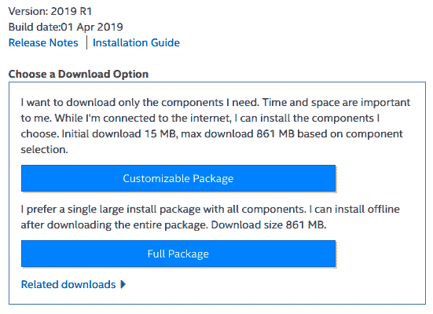

# 第六章：将模型部署到加速器上进行推理

在第三章，*训练网络*中，我们学习了如何使用 Caffe2 训练深度神经网络。在本章中，我们将专注于推理：将训练好的模型部署到现场，对新数据进行*推理*。为了实现高效的推理，训练好的模型通常会针对部署时的加速器进行优化。本章将重点讨论两种常见的加速器：GPU 和 CPU，以及可以用于在它们上部署 Caffe2 模型的推理引擎 TensorRT 和 OpenVINO。

本章我们将讨论以下主题：

+   推理引擎

+   NVIDIA TensorRT

+   Intel OpenVINO

# 推理引擎

常见的深度学习框架，如 TensorFlow、PyTorch 和 Caffe，主要设计用于*训练*深度神经网络。它们侧重于提供更有利于研究人员轻松实验不同网络结构、训练方案和技术的功能，以实现最佳训练精度，解决实际问题。在神经网络模型成功训练后，实践者可以继续使用相同的深度学习框架将训练好的模型部署用于推理。然而，也有更高效的推理部署解决方案。这些推理软件将训练好的模型编译成最适合所用加速器硬件的计算引擎，能够在延迟或吞吐量方面达到最佳性能。

与 C 或 C++ 编译器类似，推理引擎将训练好的模型作为输入，并对训练神经网络的图结构、层次、权重和格式应用多种优化技术。例如，它们可能会去除仅在训练过程中有用的层。引擎可能会将多个水平相邻的层或垂直相邻的层合并，以加快计算并减少内存访问次数。

虽然训练通常在 FP32（4 字节浮点数）下进行，但推理引擎可能会提供更低精度的数据类型进行推理，例如 FP16（2 字节浮点数）和 INT8（1 字节整数）。为了实现这一点，这些引擎可能会将模型的权重参数转换为较低精度，并可能使用量化技术。使用这些低精度数据类型通常能大幅加速推理，同时对训练网络的精度影响微乎其微。

目前可用的推理引擎和库通常侧重于优化训练好的模型，以适应特定类型的加速器硬件。例如，NVIDIA TensorRT 推理引擎（不要与 Google TensorFlow 深度学习框架混淆）专注于优化在 NVIDIA 显卡和嵌入式设备上进行推理的训练神经网络。同样，Intel OpenVINO 推理引擎专注于优化训练好的网络，以适应 Intel CPU 和加速器。

在本章的其余部分，我们将探讨如何使用 TensorRT 和 OpenVINO 作为推理引擎，在 GPU 和 CPU 上部署 Caffe2 模型进行推理。

# NVIDIA TensorRT

TensorRT 是部署已训练模型到 NVIDIA GPU 上进行推理的最流行推理引擎。毫不奇怪，这个库及其工具集由 NVIDIA 开发，并且可以免费下载安装。每个新的 TensorRT 版本通常会与每个新的 NVIDIA GPU 架构发布同步，添加对新 GPU 架构的优化，并且支持新的层、运算符和深度学习框架。

# 安装 TensorRT

TensorRT 安装程序可以从[`developer.nvidia.com/tensorrt`](https://developer.nvidia.com/tensorrt)网站下载。安装包可用于 x86-64（Intel 或 AMD 64 位 CPU）计算机、PowerPC 计算机、嵌入式硬件（如 NVIDIA TX1/TX2）以及用于汽车的 NVIDIA Xavier 系统。支持的操作系统包括 Linux、Windows 和 QNX（用于汽车的实时操作系统）。

对于 Linux，支持多个 LTS 版本的 Ubuntu，例如 14.04、16.04 和 18.04。其他 Linux 发行版，如 CentOS/Red Hat，也得到支持。每个 TensorRT 包都是为特定版本的 CUDA 构建的，例如 9.0 或 10.0。典型的安装程序下载网页如图 6.1 所示：


图 6.1：TensorRT 版本 5.0 的安装程序网页。注意查看安装指南、Ubuntu、Red Hat、Windows 的安装包，以及用于嵌入式系统的 Jetpack 和用于汽车的 DRIVE。

你需要下载与硬件、操作系统和已安装 CUDA 版本匹配的 TensorRT 安装程序。例如，在我的 x86-64 笔记本电脑上运行 Ubuntu 18.04，已安装 CUDA 10.0。所以，我将下载与该配置匹配的安装程序。

下载完安装包后，请按照 TensorRT 安装指南文档中的说明进行安装。你可以在安装页面找到该指南的 PDF 文档（见图 6.1）。安装通常需要使用 Ubuntu 上的`sudo dpkg -i`命令，或在 Red Hat 上使用`yum`命令。如果你下载了`.tar.gz`压缩包，可以将其解压到你选择的位置。不论采用哪种安装方式，TensorRT 包包含以下组件：C++头文件、C++共享库文件、C++示例、Python 库以及 Python 示例。

# 使用 TensorRT

使用 TensorRT 进行推理通常涉及以下三个阶段：

1.  导入预训练网络或创建网络

1.  从网络构建优化后的引擎

1.  使用引擎执行上下文进行推理

我们将在接下来的章节中详细介绍这三个阶段。

# 导入预训练网络或创建网络

模型是在深度学习框架中训练的，例如 Caffe2、Caffe、PyTorch 或 TensorFlow。一些实践者可能使用自己定制的框架来训练模型。第一步是在 TensorRT 中构建一个网络结构，并将这些深度学习框架模型中预训练的权重加载到 TensorRT 网络的各层中。此过程如图 6.2 所示，具体步骤如下*：*


图 6.2：如何在 TensorRT 中构建网络

如果您使用流行的深度学习框架训练了一个模型，那么 TensorRT 提供了 **parsers**（解析器）来解析您的预训练模型文件并从中构建网络。TensorRT 提供了一个名为 `IONNXConfig` 的 ONNX 解析器，可用于加载和导入已转换为 ONNX 格式的 Caffe2 预训练模型文件。有关如何将 Caffe2 模型转换为 ONNX 的信息，请参见 第五章，*与其他框架一起使用*。

TensorRT 提供了一个名为 `ICaffeParser` 的 Caffe 解析器，可以用来加载和导入您的 Caffe 模型。同样，它还提供了一个名为 `IUffConfig` 的 TensorFlow 解析器，用于加载和导入您的 TensorFlow 模型。

不是所有 Caffe2、ONNX 或其他框架中的层和运算符都能在 TensorRT 中得到支持。此外，如果您使用自己定制的训练框架训练了模型，则无法使用这些解析器。为了解决这种情况，TensorRT 提供了逐层创建网络的能力。TensorRT 不支持的自定义层可以通过 TensorRT 插件实现。通常，您需要在 CUDA 中实现不支持的层，以便与 TensorRT 达到最佳性能。这些用例的示例可以在与 TensorRT 一起发布的示例代码中找到。

无论您遵循上述哪一种过程，最终都会得到一个名为 `INetworkDefinition` 的 TensorRT 网络。该网络可以在第二阶段进行优化。

# 从网络构建优化引擎

一旦网络及其权重在 TensorRT 中表示，我们就可以对该网络定义进行优化。这个优化步骤是由一个名为 **builder** 的模块执行的。builder 应该在您计划稍后进行推理的相同 GPU 上执行。虽然模型是使用 FP32 精度训练的，但您可以请求 builder 使用较低精度的 FP16 或 INT8 数据类型，这些数据类型占用更少的内存，并且在某些 GPU 上可能具有优化的指令。此过程如图 6.3 所示，具体步骤如下：


图 6.3：TensorRT 中的构建过程以生成引擎

构建器会尝试各种针对你所运行 GPU 的特定优化。它会尝试适用于特定 GPU 架构和 GPU 型号的内核和数据格式。它会对所有这些优化机会进行计时，并选择最优的候选项。它所生成的网络优化版本被称为 **引擎**。这个引擎可以序列化成一个文件，通常称为 **PLAN 文件**。

# 使用引擎执行上下文进行推理

要在 TensorRT 中使用引擎进行推理，我们首先需要创建一个运行时。运行时可以在反序列化后从 PLAN 文件加载引擎。然后，我们可以从运行时创建一个或多个执行上下文，并使用它们进行运行时推理。这个过程如图 6.4 所示：


图 6.4：使用 TensorRT 引擎进行推理的过程

# TensorRT API 和使用方法

TensorRT 提供了 C++ API 和 Python API，供你使用。这些 API 可用于执行前面各个阶段所示的所有操作。你可以查看 TensorRT 附带的示例，以了解如何编写自己的 C++ 和 Python 程序来实现这些操作。例如，TensorRT 附带的 `sampleMNISTAPI` 示例演示了如何构建一个简单的网络来解决 `MNIST` 问题（见 第二章，*构建网络*），并将预训练权重加载到每一层中。

要使用 C++ API，基本上需要包含 `NvInfer.h` 和相关的头文件，并编译你的程序。当你需要链接程序时，确保 `libnvinfer.so` 和其他相关的 TensorRT 库文件在你的 `LD_LIBRARY_PATH` 环境变量中。

TensorRT 附带一个名为 `trtexec` 的工具，可以用来实验导入预训练模型并用于推理。例如，我们将展示如何在 TensorRT 中使用来自 第五章 *与其他框架的合作* 的 AlexNet ONNX 模型进行推理。

首先，我们需要导入我们的 AlexNet ONNX 模型文件（从 Caffe2 protobuf 文件转换而来），并从中构建一个优化后的引擎文件。这可以通过以下方式使用 `trtexec` 完成：

```py
./trtexec --onnx=/path/to/alexnet.onnx --output=prob --saveEngine=alexnet.plan
```

`--onnx` 选项用于指定输入的 ONNX 文件。如果你要导入 Caffe 或 TensorFlow 模型，分别可以使用类似的 `--deploy` 和 `--uff` 选项。`--output` 选项用于指定模型的最终输出名称。如果模型有多个输入或输出，可以使用多个 `--input` 和 `--output` 选项。`--saveEngine` 选项用于指定一个文件路径，工具将利用这个路径来序列化优化后的引擎。有关更多信息，请尝试 `./trtexec --help`。

接下来，我们可以加载已保存的优化引擎，然后使用它进行推理，如下所示：

```py
./trtexec --output=prob --loadEngine=alexnet.plan
```

该工具将 PLAN 文件反序列化为引擎，从引擎创建运行时，然后从运行时创建执行上下文。它使用此上下文运行一批随机输入，并报告该模型在所运行 GPU 上的推理运行时性能。`trtexec` 和所有 TensorRT 示例的源代码可在 TensorRT 包中找到。这些源代码是学习如何将 TensorRT 融入 C++ 或 Python 推理应用程序中的一个很好的教学辅助手段。

# 英特尔 OpenVINO

OpenVINO 由英特尔创建的库和工具组成，使你能够从任何框架优化训练好的深度学习模型，然后使用推理引擎在英特尔硬件上进行部署。支持的硬件包括英特尔 CPU、英特尔 CPU 中的集成显卡、英特尔 Movidius 神经计算棒和 FPGA。OpenVINO 可以免费从英特尔获得。

OpenVINO 包含以下组件：

+   **模型优化器**：一个工具，用于导入来自其他深度学习框架的训练好的深度学习模型，进行转换并优化它们。支持的深度学习框架包括 Caffe、TensorFlow、MXNet 和 ONNX。请注意，不支持 Caffe2 或 PyTorch。

+   **推理引擎**：这些是加载模型优化器生成的优化模型的库，并为你的应用程序提供在英特尔硬件上运行模型的能力。

+   **演示和示例**：这些简单的应用程序展示了 OpenVINO 的使用，并帮助你将其集成到你的应用程序中。

OpenVINO 旨在进行推理；它不提供研究新网络结构或训练神经网络的功能。使用 OpenVINO 是一个独立的大话题。在本书中，我们将重点介绍如何安装它、如何测试它，以及如何使用 Caffe2 模型进行推理。

# 安装 OpenVINO

在本节中，我们将介绍在 Ubuntu 上安装和测试 OpenVINO 的步骤。其他 Linux 发行版（如 CentOS）和其他操作系统（如 Windows）上的安装和测试步骤也类似。有关所有这些的指导，请参考适用于你操作系统的 *OpenVINO 安装指南*。该指南可在线查看并在安装程序中找到。

适用于你的操作系统或 Linux 发行版的 OpenVINO 安装文件可以从 [`software.intel.com/en-us/openvino-toolkit`](https://software.intel.com/en-us/openvino-toolkit) 下载。例如，对于 Ubuntu，它给我提供了下载可自定义包或单个大文件包的选项。图 6.5 展示了这些选项，如下所示：



图 6.5：Ubuntu 上 OpenVINO 安装程序的下载选项

下载的文件通常具有 `l_openvino_toolkit_p_<version>.tgz` 这样的文件名。解压缩此文件的内容到一个目录并进入该目录。您会在此找到两种格式的安装脚本：控制台和 GUI。可以按以下方式执行其中任何一个：

```py
$ sudo ./install_GUI.sh
$ sudo ./install.sh
```

这两种选项都提供了一个有用的向导，帮助您选择安装 OpenVINO 文件的位置以及您希望安装的 OpenVINO 组件。如果在没有使用 `sudo` 的情况下运行脚本，它们会提供一个选项，将文件安装到您主目录下的 `intel` 子目录中。使用 `sudo` 运行则会帮助您将文件安装到 `/opt/intel`，这是大多数英特尔工具传统上安装的位置。

图 6.6 显示了安装过程中可以选择的 OpenVINO 组件。至少，我建议安装模型优化器、推理引擎和 OpenCV。如果您想读取图像并将其传递给推理引擎，则需要安装 OpenCV。图 6.6 如下所示：


图 6.6：可以通过 GUI 安装程序向导安装的 OpenVINO 组件

完成主安装后，我们还需要通过执行以下命令来安装 OpenVINO 的一些外部依赖项：

```py
$ cd /opt/intel/openvino/install_dependencies
$ chmod +x install_openvino_dependencies.sh
$ sudo -E ./install_openvino_dependencies.sh
```

如果您没有使用 `sudo` 安装，您可以将前面的命令中的 `/opt/intel` 替换为您在主目录中安装 OpenVINO 的路径。

现在，我们准备设置 OpenVINO 所需的环境变量。我们可以通过以下命令来完成此操作：

```py
$ source /opt/intel/openvino/bin/setupvars.sh
```

接下来，我们配置 OpenVINO 以支持我们要导入的深度学习框架模型。我们可以通过以下命令拉取所有受支持的深度学习框架的配置：

```py
$ cd /opt/intel/openvino/deployment_tools/model_optimizer/install_prerequisites
$ sudo ./install_prerequisites.sh
```

现在我们准备测试我们的 OpenVINO 安装是否正常工作。我们可以通过运行一个 OpenVINO 演示来完成这一操作，该演示会下载一个使用 Caffe 训练的 *SqueezeNet* 模型，使用模型优化器优化它，并通过推理引擎在一张汽车图像上运行，具体操作如下：

```py
$ cd /opt/intel/openvino/deployment_tools/demo
$ ./demo_squeezenet_download_convert_run.sh
```

运行后，我们应该能够看到汽车图像的分类结果。概率最高的类别是运动型汽车，从而确认使用 OpenVINO 进行模型推理是正常的。这一点在图 6.7 中有显示，如下所示：


图 6.7：OpenVINO 在一张运动汽车图片上的演示分类结果

# 模型转换

OpenVINO 不支持 Caffe2 模型格式。然而，它支持流行的 ONNX 模型表示方式。因此，要在 OpenVINO 中使用 Caffe2 模型，我们需要遵循一个两步流程。

首先，我们需要将 Caffe2 模型转换为 ONNX 格式。此过程在 第五章，*与其他框架的协作* 中有详细描述。之后，我们可以使用 OpenVINO 模型优化器来导入、优化并将其转换为 OpenVINO **中间表示**（**IR**）格式。

让我们查看使用模型优化器处理 AlexNet 模型的过程，该模型我们在第五章中已转换为 ONNX，*与其他框架的协作*。我们已将 AlexNet Caffe2 模型转换为生成`alexnet.onnx`文件。

要使用模型优化器将此 AlexNet ONNX 模型转换为 OpenVINO IR，我们可以使用以下`mo.py`脚本：

```py
$ cd /opt/intel/openvino/deployment_tools/model_optimizer
$ python3 mo.py --input_model /path/to/alexnet.onnx
Model Optimizer arguments:
Common parameters:
 - Path to the Input Model:      /path/to/alexnet.onnx
 - Path for generated IR:        /opt/intel/openvino_2019.1.094/deployment_tools/model_optimizer/.
 - IR output name:       alexnet
 - Log level:    ERROR
 - Batch:        Not specified, inherited from the model
 - Input layers:         Not specified, inherited from the model
 - Output layers:        Not specified, inherited from the model
 - Input shapes:         Not specified, inherited from the model
 - Mean values:          Not specified
 - Scale values:         Not specified
 - Scale factor:         Not specified
 - Precision of IR:      FP32
 - Enable fusing:        True
 - Enable grouped convolutions fusing:   True
 - Move mean values to preprocess section:       False
 - Reverse input channels:       False
ONNX specific parameters:
Model Optimizer version:        2019.1.0-341-gc9b66a2

[ SUCCESS ] Generated IR model.
[ SUCCESS ] XML file: /opt/intel/openvino_2019.1.094/deployment_tools/model_optimizer/./alexnet.xml
[ SUCCESS ] BIN file: /opt/intel/openvino_2019.1.094/deployment_tools/model_optimizer/./alexnet.bin
[ SUCCESS ] Total execution time: 6.48 seconds.
```

这个转换过程会生成三个文件：

+   `.bin` 文件：该文件包含模型的权重。这也是为什么这个文件通常较大的原因。

+   `.xml` 文件：这是一个包含网络结构的 XML 文件。此文件中存储的详细信息包括关于模型的元数据、层列表、每个层的配置参数，以及层之间的边缘列表。

+   `.mapping` 文件：这是一个 XML 文件，包含从输入文件层到输出 OpenVINO 文件层的映射。

我们只需要`.bin`文件和`.xml`文件即可使用 OpenVINO 推理引擎进行模型推理。

# 模型推理

OpenVINO 提供了 C++ 和 Python 版本的推理引擎 API。这个 API 可以用于为训练好的 Caffe2 模型程序化创建网络结构。然后，您可以将每个网络层的权重加载到 OpenVINO 网络中，并在 Intel 硬件上进行推理。如果 OpenVINO 当前不支持您的训练模型所使用的网络层或操作符类型，那么您需要使用 OpenVINO 插件层来实现这一点。所有这些努力都是值得的，因为一旦 Caffe2 训练的模型在 OpenVINO 推理引擎上运行后，您将受益于延迟和吞吐量的提升。

对于大多数网络，有一个更简单的替代方法：使用 OpenVINO 模型优化器将 Caffe2 训练的模型转换为 OpenVINO IR。我们在前一节中已经介绍了如何执行此操作。完成此步骤后，可以使用 OpenVINO 推理引擎中的功能自动导入此 IR 模型进行推理。OpenVINO 提供了许多推理引擎示例，可以用来尝试此过程。

记得在执行此操作前运行`/opt/intel/openvino/bin/setupvars.sh`脚本。此脚本设置了 OpenVINO 使用所需的环境变量和配置。

转到推理引擎的`samples`目录，查看各种样本。这里有适用于许多常见用例的样本。例如，包含用于测试分类模型、测试物体检测模型、测试文本检测、测试延迟和吞吐量性能等样本。

要构建所有的推理引擎样本，请按照以下步骤进行：

```py
$ cd /opt/intel/openvino/deployment_tools/inference_engine/samples
$ ./build_samples.sh
```

推理引擎样本将使用 CMake 构建。样本的二进制文件将安装到你主目录下名为`inference_engine_samples_build/intel64/Release`的目录中。

这些示例使得快速尝试在 IR 模型上使用 OpenVINO 推理引擎变得非常方便。这些示例可能使用一些与 OpenVINO 一起安装的额外库。因此，如果你发现某个示例缺少某个库（`.so`文件），你可能需要将该库的路径添加到`LD_LIBRARY_PATH`环境变量中。

我发现使用以下`LD_LIBRARY_PATH`对我有效：

```py
$ export LD_LIBRARY_PATH=/opt/intel/openvino/deployment_tools/inference_engine/external/mkltiny_lnx/lib:/opt/intel/openvino/deployment_tools/inference_engine/lib:.:$LD_LIBRARY_PATH
```

最简单的示例之一是`hello_classification`。该示例接受两个输入：一个 OpenVINO IR 分类模型的路径和一个图像文件的路径。它通过导入 IR 模型并使用图像运行推理，创建了一个 OpenVINO 推理引擎。

要在我们之前从 AlexNet Caffe2 模型创建的 IR 模型上尝试 OpenVINO 推理引擎，请使用以下命令：

```py
$ ./hello_classification /path/to/alexnet.xml /path/to/sunflower.jpg

Top 10 results:
Image /path/to/sunflower.jpg
classid probability
------- -----------
985     0.9568181
309     0.0330606
328     0.0035365
946     0.0012036
308     0.0007907
310     0.0005121
723     0.0004805
108     0.0004062
950     0.0003640
947     0.0003286
```

我们可以看到，`hello_classification`示例成功地将 IR 模型加载到其推理引擎中，并对输入的向日葵图像进行了分类。它报告了 ImageNet 类 985（雏菊）作为最高分，这是在 1,000 个 ImageNet 类中与向日葵最匹配的类别。

OpenVINO 推理引擎可以用于执行 FP16 和 INT8 模式的推理。有关详细信息，请参阅 OpenVINO 文档。

# 摘要

在本章中，我们了解了推理引擎及其作为加速器上部署训练好的 Caffe2 模型的重要工具。我们重点讨论了两种流行的加速器：NVIDIA GPU 和 Intel CPU。我们学习了如何安装和使用 TensorRT 来将 Caffe2 模型部署到 NVIDIA GPU 上。我们还了解了如何安装和使用 OpenVINO，将 Caffe2 模型部署到 Intel CPU 和加速器上。

许多其他公司，如谷歌、Facebook、亚马逊以及像 Habana 和 GraphCore 这样的初创公司，正在开发用于推理 DL 模型的新型加速器硬件。还有像 ONNX Runtime 这样的努力，旨在将来自多个供应商的推理引擎汇聚到一个平台下。请评估这些选项，并选择最适合部署 Caffe2 模型的加速器硬件和软件。

在下一章中，我们将了解在树莓派上使用 Caffe2 进行边缘计算、在云端使用容器的 Caffe2 以及 Caffe2 模型可视化。
