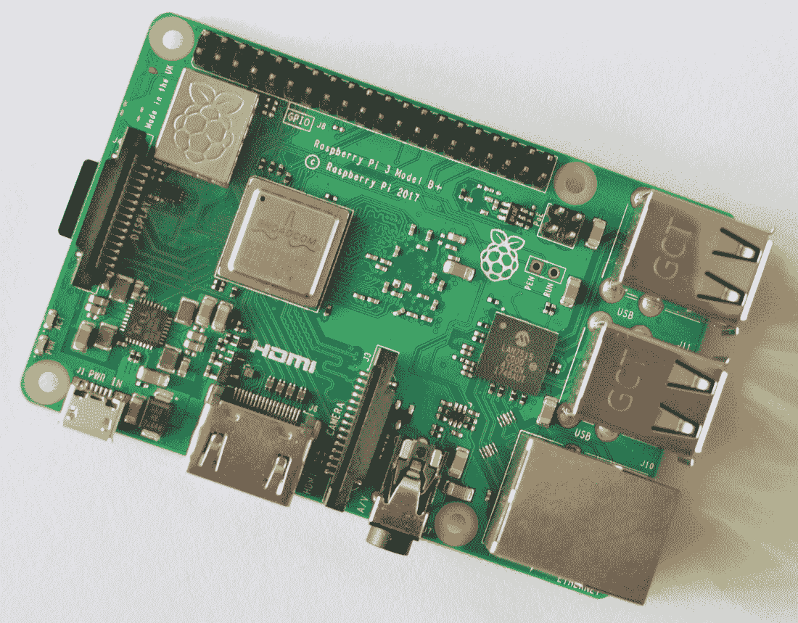
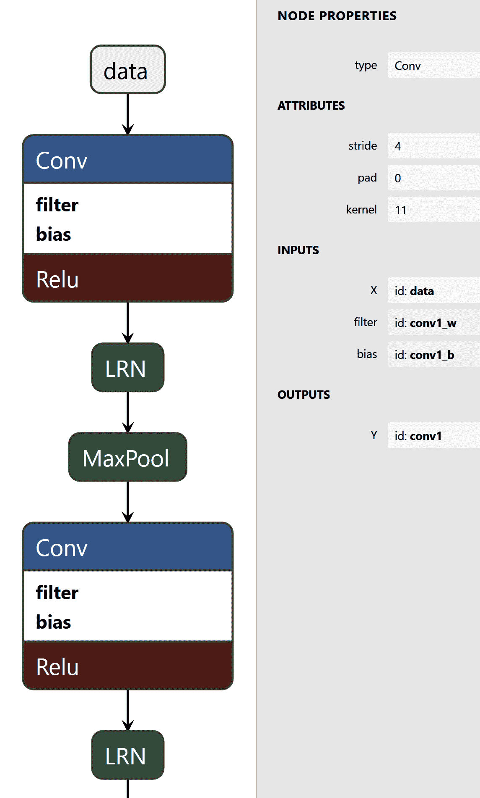

# 第七章：边缘计算中的 Caffe2 和云端中的 Caffe2

在本书的第 1 到第六章中，我们已经学习了如何安装和使用 Caffe2 来训练深度学习（DL）神经网络，以及如何与其他流行的 DL 框架一起工作。我们还学习了如何将训练好的 Caffe2 模型部署到流行的推理引擎中。在本章的最后，我们将探讨 Caffe2 的应用，特别是它如何从小型边缘设备（如 Raspberry Pi）扩展到在云中的容器运行。我们还将学习如何可视化 Caffe2 模型。

本章将涵盖以下主题：

+   在 Raspberry Pi 上的 Caffe2 边缘计算

+   使用容器在云中运行 Caffe2

+   Caffe2 模型可视化

# 在 Raspberry Pi 上的 Caffe2 边缘计算

在边缘计算中使用深度学习的兴趣非常大。这是将深度学习应用于在设备上或靠近设备进行计算的方案，这些设备使用传感器和摄像头捕捉数据。另一种深度学习边缘计算的替代方案是将边缘数据捕获后发送到云中进行处理。然而，边缘计算中的深度学习具有较低的延迟和更高的安全性优势。边缘设备通常便宜、小巧且功耗较低，处理器或加速器的计算能力较弱。Caffe2 的一个关键优势是它从一开始就被设计和开发为具有可扩展性：从多 GPU、多 CPU 服务器到微小的边缘设备。在这一节中，我们将以 Raspberry Pi 作为边缘设备的例子，学习如何在其上使用 Caffe2。

# Raspberry Pi（树莓派）

Raspberry Pi 是一系列由英国 Raspberry Pi 基金会推出的单板通用计算机。*图 7.1* 展示的是 Raspberry Pi B+ 单元的最新 Rev3 板，如下所示：



图 7.1：2018 年发布的 Raspberry Pi B+ Rev3 板

自 2012 年推出以来，Raspberry Pi（树莓派）已经在全球掀起了一股热潮，广泛应用于学校教学、个人项目和边缘计算的实际部署。每个树莓派的价格大约为 $35，非常适合各种类型的项目。树莓派计算机如此有用的原因在于其小巧的外形，它大约和一副扑克牌的大小相当。树莓派需要的电力很少，只需要一个 5V 的 micro-USB 电源供应。树莓派是一台完全通用的计算机，配备了常见的存储和 I/O 接口，如 SD/microSD 卡插槽、USB 接口、无线连接、以太网端口、HDMI 输出和复合视频输出。树莓派相比其他同类设备的最大优势之一是它提供了 Raspbian 操作系统，这是一个专门为树莓派移植的流行 Debian Linux 发行版。通过 Raspbian，树莓派用户可以使用与主流 Linux 发行版上相同的工具、编译器和编程库。

我们在 Raspberry Pi 上进行的 Caffe2 实验将涉及以下步骤：

1.  安装 Raspbian

1.  在 Raspbian 上构建和使用 Caffe2

# 安装 Raspbian

按照以下步骤安装 Raspbian：

1.  从 [`www.raspberrypi.org/downloads/raspbian/`](https://www.raspberrypi.org/downloads/raspbian/) 下载 Raspbian 版本。每个 Debian 版本都有一个对应的 Raspbian 版本。最新的 Debian 版本 9 被称为 **Stretch**，对应的 Raspbian 被称为 Raspbian 9 或 Raspbian Stretch。

1.  选择适合你的 Raspbian 版本。为了满足不同的应用需求，提供了三种类型的 Raspbian Stretch 套件。对于我们的目的，最小的套件 Raspbian Stretch Lite 就足够了。如果你想使用桌面环境和图形应用程序，可以尝试其他带有这些功能的套件。一旦你的 Raspbian 连接到网络，你可以通过 SSH 进入并获得完全访问权限，使用 Bash shell 执行命令、控制台工具和编辑器。如果你需要，之后也可以选择安装其他图形应用程序。Stretch Lite 足以满足所有这些需求。

1.  选择一个工具将 Raspbian 镜像刷写到 SD 卡中。一个推荐的易用工具是 **Etcher**。你可以从 [`www.balena.io/etcher/`](https://www.balena.io/etcher/) 下载它。

1.  安装 Etcher 后，将一个最小容量为 4 GB 的 SD 卡插入电脑的 SD 卡槽。使用 Etcher 将 Raspbian 镜像刷写到 SD 卡中。

Raspberry Pi 可以作为一个无头计算机使用，通过 SSH 登录而不是直接本地操作。如果你希望从 Raspbian 的第一次启动就启用此功能，请将已经刷写的 SD 卡重新插入电脑。然后，在 SD 卡的根目录下创建一个名为 `ssh` 的空文件。

1.  到此，我们已经完成了将 Raspbian 刷写到 SD 卡的操作。将这张 SD 卡插入 Raspberry Pi 板上的 SD 卡槽。确保 Pi 通过以太网电缆连接到你的家庭无线路由器。你还可以选择通过 HDMI 电缆将 Pi 连接到电视或电脑显示器，以便查看其启动信息。

1.  打开 Pi 电源。你可以在电视或显示器上看到 Raspbian 的启动信息。在启动过程结束时，它会显示由 DHCP 分配的 IP 地址，并要求你进行本地登录。你也可以通过检查无线路由器的管理控制台来找出 Pi 的 IP 地址。现在，你可以使用以下命令从任何网络上的计算机通过 SSH 登录到 Raspbian。

```py
$ ssh pi@<IP address of Pi>
```

1.  使用默认密码：`raspberry`。首次成功登录后，Raspbian 会提醒你更改默认密码。请通过在命令行中输入 `passwd` 命令来更改密码。从下次通过 SSH 登录到 Pi 时，可以使用此新密码。

1.  最后，确保使用以下命令更新软件包仓库并更新已安装的包：

```py
$ sudo apt update
$ sudo apt upgrade
```

# 在 Raspbian 上构建 Caffe2

Caffe2 已经移植到 Raspbian 上。但是，没有简单的方法可以从你的 x86_64 计算机交叉编译到树莓派，因此必须在树莓派本身上构建 Caffe2。

我们可以 SSH 连接到 Pi 并在其上克隆 Caffe2 Git 仓库。然而，完整的 PyTorch 和 Caffe2 仓库以及它们的子模块总大小超过 400 MB，这样的克隆操作在树莓派上可能需要很长时间才能完成。此外，请注意，克隆到 SD 卡比克隆到通过 USB 连接到树莓派的硬盘更快。后者速度非常慢，因为树莓派仅支持 USB 2.0（比 USB 3.0 慢），并且 USB 端口和以太网端口共享同一总线，进一步限制了 Git 克隆速度。

让我们开始在 Raspbian 上构建 Caffe 2：

1.  由于在本地计算机上克隆最为简便，首先使用以下命令在本地进行克隆：

```py
$ git clone --recursive https://github.com/pytorch/pytorch.git
$ cd pytorch
$ git submodule update --init
```

1.  克隆完成后，通过删除 Git 仓库数据来减少此目录的大小，操作如下：

```py
$ rm -rf .git
```

1.  现在，将其压缩为`.tar.gz`档案并通过 SSH 复制到 Pi，操作如下：

```py
$ cd ..
$ tar zcvf pytorch.tar.gz pytorch
$ scp pytorch.tar.gz pi@<IP address of Pi>:/home/pi
```

1.  SSH 连接到 Pi 并解压复制到那里的压缩档案，操作如下：

```py
$ tar xvf pytorch.tar.gz
$ cd pytorch
```

1.  用于在 Raspbian 上构建 Caffe2 的脚本是`scripts/build_raspbian.sh`。请注意，这个 Raspbian 构建最近没有得到维护。因此，在运行它之前，我们需要安装一些对于成功编译至关重要的 Python 包，具体如下：

```py
$ sudo apt install python-future python-typing python-yaml
$ sudo pip install -U protobuf
```

1.  我们现在准备好通过调用以下脚本来进行构建：

```py
$ cd scripts
$ ./build_raspbian.sh
```

1.  就像我们在第一章中使用的构建过程一样，*简介与安装*，这个过程也使用了 CMake，首先配置构建过程，然后调用`make`来构建必要的组件，并将构建的产物放入`build`子目录中。

请注意，构建过程需要很长时间，可能会花费半天时间。树莓派的内存为 500 MB 到 1 GB（取决于你使用的 Pi 型号），而 Raspbian 默认只分配大约 100 MB 的交换空间。因此，构建过程有时会因为内存不足而失败。如果发生这种情况，你可以通过打开`/etc/dphys-swapfile`文件并增加`CONF_SWAPSIZE`值来增加交换空间。我发现将其从`100`增加到`1000`就足以成功编译。

编译完成后，你可以像我们在第一章中所做的那样，安装并测试 Caffe2，*简介与安装*，如以下示例所示：

```py
$ cd ../build
$ sudo make install
$ python -c "from caffe2.python import core"
```

现在你已经在树莓派上成功运行 Caffe2。你可以连接传感器或摄像头模块，读取其中的图像和数据，并通过深度学习网络进行分类、检测和理解。

# 使用容器在云端运行 Caffe2

容器现在是一个普遍存在且必要的工具，用于在生产环境中强健地部署软件，既可以在本地，也可以在云端。它们使开发者能够为应用程序创建理想的软件环境，并确保在开发者工作站、测试计算机、预发布计算机以及最终部署到本地服务器或云实例时，完全复制这一软件环境。容器还帮助为每个应用程序创建一个独立的软件环境，在同一服务器上运行多个应用程序时，为每个应用程序创建一个专属的环境。

在众多可用的容器工具中，*Docker* 是最受欢迎的。我们将在本节中重点介绍如何使用 Docker。Docker 适用于所有流行的 Linux 发行版、macOS X 和 Windows。通过 Docker，你可以从指定的 Ubuntu 版本创建一个 Ubuntu 软件环境，并在不同版本的 RedHat 主机操作系统上运行你的 Caffe2 应用程序。Docker 使得这种多样化的部署变得轻松可行，并且只需几分钟。

# 安装 Docker

按照以下步骤进行安装：

1.  要使用与你的操作系统或发行版特定的软件包仓库和包来安装 Docker，请按照这里的说明进行操作 [`docs.docker.com/engine/installation/linux/docker-ce/ubuntu/`](https://docs.docker.com/engine/installation/linux/docker-ce/ubuntu/)。

1.  安装成功后，记得使用如下命令将你的用户名添加到 `docker` 用户组中：

```py
$ sudo adduser myusername docker
```

为了使这个小组的更改生效，你可能需要注销并重新登录。

1.  最后，为了测试你的 Docker 设置是否正确，可以运行 `hello-world` 镜像。如果成功，你将看到类似于以下示例的欢迎信息：

```py
$ docker run hello-world

Hello from Docker!
This message shows that your installation appears to be working correctly.

To generate this message, Docker took the following steps:
 1\. The Docker client contacted the Docker daemon.
 2\. The Docker daemon pulled the "hello-world" image from the Docker Hub.
 (amd64)
 3\. The Docker daemon created a new container from that image which 
    runs the executable that produces the output you are currently 
    reading.
 4\. The Docker daemon streamed that output to the Docker client, 
    which sent it to your terminal.

To try something more ambitious, you can run an Ubuntu container with:
 $ docker run -it ubuntu bash

Share images, automate workflows, and more with a free Docker ID:
 https://hub.docker.com/

For more examples and ideas, visit:
 https://docs.docker.com/get-started/
```

作为最后的实验，你可以在一个 Ubuntu 容器内获取 Bash shell，并使用以下命令在该 Ubuntu 实例内进行探索：

```py
$ docker run --rm -it ubuntu bash
```

在这里，我们启动一个 Ubuntu 容器。`-it` 选项表示这是一个交互式会话。也就是说，我们希望运行应用程序（bash）并保持该会话，直到退出容器。这与正常流程（例如在 `hello-world` 容器中的操作）相反，后者会在 Docker 执行应用程序并完成后自动退出。`--rm` 选项表示 Docker 应在我们退出容器后自动销毁容器。通常，Docker 会将容器保留在后台，随时准备再次使用。

你会注意到 Docker 会以 `root` 用户身份登录，并且你会获得一个 root shell。你会被放置在文件系统的根目录下。root 权限仅在此 Docker 容器内有效。在容器内创建或更改的任何文件都是临时的。当你退出容器时，这些文件会丢失。

完成对 Ubuntu 容器的探索后，你可以通过按 *Ctrl + D* 或输入 `exit` 来退出。

# 安装 nvidia-docker

在执行前述步骤后，你可以在 Docker 中运行 Caffe2、Python 和 C++ 应用程序（CPU 版本）。但是，如果你想在 GPU 上运行 Caffe2 应用程序，那么你需要安装并使用 nvidia-docker。

NVIDIA-Docker 为运行在 Docker 内的应用程序提供完全和不受限制的访问权限，能够访问系统上的 NVIDIA GPU。请注意，此功能依赖于安装在主机系统上的 NVIDIA GPU 驱动程序。然而，你无需在主机系统上安装 CUDA 或 cuDNN，因为你可以启动一个容器，并在其中安装你想要的任何 CUDA 版本。这是一种方便的方式，可以在不同的 CUDA 版本下构建和测试应用程序。

NVIDIA Docker 安装的说明可以在 [`github.com/NVIDIA/nvidia-docker`](https://github.com/NVIDIA/nvidia-docker) 上找到。撰写本文时，可以使用以下步骤安装 nvidia-docker：

1.  首先，添加 `nvidia-docker` 仓库并更新软件包缓存，操作如下：

```py
$ curl -s -L https://nvidia.github.io/nvidia-docker/gpgkey | sudo apt-key add - distribution=$(. /etc/os-release;echo $ID$VERSION_ID)
$ curl -s -L https://nvidia.github.io/nvidia-docker/$distribution/nvidia-docker.list | sudo tee /etc/apt/sources.list.d/nvidia-docker.list
$ sudo apt-get update
```

1.  接下来，安装 NVIDIA Docker 运行时，操作如下：

```py
$ sudo apt-get install -y nvidia-docker2
```

1.  最后，重启 Docker 守护进程，操作如下：

```py
$ sudo pkill -SIGHUP dockerd
```

现在，我们准备好测试我们的 NVIDIA Docker 是否正常工作并能访问系统上的 NVIDIA GPU。为此，我们需要在容器内运行 `nvidia-smi` 应用程序，操作如下：

```py
$ docker run --runtime=nvidia --rm nvidia/cuda:9.0-base nvidia-smi
```

`nvidia-smi` 是一个与主机系统上的 NVIDIA GPU 驱动程序通信的工具，用于打印系统上可用的 GPU 信息。如果你的 NVIDIA Docker 安装成功，你应该能够看到 `nvidia-smi` 列表、NVIDIA GPU 驱动程序版本和已安装的 GPU。

请注意我们在此命令中使用的 Docker 标签：`nvidia/cuda:9.0-base`。这是一个包含 CUDA 9.0 的 Docker 镜像。可用的 Docker 镜像和标签的完整列表可以在此处查看：[`hub.docker.com/r/nvidia/cuda/tags`](https://hub.docker.com/r/nvidia/cuda/tags)。每个 CUDA 版本兼容的 GPU 驱动版本的表格可以在 [`github.com/NVIDIA/nvidia-docker/wiki/CUDA`](https://github.com/NVIDIA/nvidia-docker/wiki/CUDA) 上找到。

在前述命令中，我们通过 `--runtime=nvidia` 选项指定了使用 NVIDIA Docker 运行时。我们也可以使用 `nvidia-docker` 别名来运行相同的命令，而无需指定运行时，操作如下：

```py
$ nvidia-docker run --rm nvidia/cuda:9.0-base nvidia-smi
```

# 运行 Caffe2 容器

Caffe2 项目为不同版本的 Caffe2 和 Ubuntu 提供了 Docker 镜像，既有 CPU 版本，也有 GPU 版本。可用 Docker 镜像的完整列表可以在 [`hub.docker.com/r/caffe2ai/caffe2/tags`](https://hub.docker.com/r/caffe2ai/caffe2/tags) 找到。Caffe2 镜像的 Docker 标签简明扼要地描述了其功能。例如，`c2v0.8.1.cpu.min.ubuntu16.04` 标签表示该镜像包含了 Ubuntu 16.04 上的 Caffe2 v0.8.1 CPU 版本。`c2v0.8.1.cuda8.cudnn7.ubuntu16.04` 标签表示该镜像包含了 Ubuntu 16.04 上带有 CUDA 8.1 和 cuDNN 7 的 Caffe2 v0.8.1 GPU 版本。

我们可以启动一个 Caffe2 CPU 镜像，并检查 Caffe2 是否在其中工作，方法如下：

```py
$ docker run --rm -ti caffe2ai/caffe2:c2v0.8.1.cpu.min.ubuntu16.04
root@13588569ad8f:/# python -c "from caffe2.python import core"
WARNING:root:This caffe2 python run does not have GPU support. Will run in CPU only mode.
```

我们可以启动一个 Caffe2 GPU 镜像，并检查 Caffe2 是否在其中工作，方法如下：

```py
$ nvidia-docker run --rm -ti caffe2ai/caffe2:c2v0.8.1.cuda8.cudnn7.ubuntu16.04
root@9dd026974563:/# python -c "from caffe2.python import core"
```

注意，如果我们使用的是 Caffe2 GPU 镜像，我们需要使用`nvidia-docker`而不是`docker`。

一旦你的 Caffe2 容器工作正常，你可以将 Caffe2 应用和数据挂载到容器中并执行它们。你可以使用`-v`选项将主机目录挂载到 Docker 容器中，并指定要挂载到的目标目录，如下所示：

```py
$ docker run --rm -ti -v /home/joe/caffe2_apps:/joe_caffe2_apps caffe2ai/caffe2:c2v0.8.1.cpu.min.ubuntu16.04
```

这将你的`/home/joe/caffe2_apps`目录挂载为容器内的`/joe_caffe2_apps`。现在你可以在容器内构建 Caffe2 应用，并将这些应用通过容器部署到本地或云服务器上。

# Caffe2 模型可视化

深度学习模型包含大量的层。每一层都有许多参数，例如它们的名称、类型、权重维度、特定层类型的参数、输入和输出张量名称。虽然典型的前馈神经网络结构没有循环，但**递归神经网络**（**RNN**）和其他网络结构有循环和其他拓扑结构。因此，能够可视化深度学习模型的结构非常重要，既对设计新网络来解决问题的研究人员来说如此，也对使用新网络的实践者来说如此。

# 使用 Caffe2 net_drawer 进行可视化

Caffe2 附带了一个用 Python 编写的简单可视化工具，名为`net_drawer`。你可以在 Caffe2 安装目录中找到这个 Python 脚本。例如，如果你将 Caffe2 安装在`/usr/local`，那么该工具会位于你的系统中`/usr/local/lib/python2.7/dist-packages/caffe2/python/net_drawer.py`。你也可以在 Caffe2 源代码中找到这个工具，路径为`caffe2/python/net_drawer.py`。

我们可以通过使用`net_drawer`来可视化来自第四章的 AlexNet 模型，*与 Caffe 配合使用*，如下所示：

```py
$ python net_drawer.py --input /path/to/bvlc_alexnet/predict_net.pb --rankdir TB
```

我们指定了要使用`--rankdir TB`选项按照从上到下的顺序可视化图中的节点。该命令渲染了在第四章中显示的 AlexNet 图，图示见*图 4.3*，*与 Caffe 配合使用*。

该命令会生成两个文件。第一个是名为`AlexNet.dot`的文本文件，包含以易于人类阅读的 GraphViz DOT 格式表示的图结构。第二个是名为`AlexNet.pdf`的 PDF 文件，包含该结构的图形渲染。

请注意，这个工具提供了其他选项来定制可视化。你可以通过使用`--help`选项来查找这些选项，如下所示：

```py
$ python net_drawer.py --help
usage: net_drawer.py [-h] --input INPUT [--output_prefix OUTPUT_PREFIX]
 [--minimal] [--minimal_dependency] [--
                     append_output]
 [--rankdir RANKDIR]

Caffe2 net drawer.

optional arguments:
 -h, --help            show this help message and exit
 --input INPUT         The input protobuf file.
 --output_prefix OUTPUT_PREFIX
 The prefix to be added to the output filename.
 --minimal             If set, produce a minimal visualization.
 --minimal_dependency  If set, only draw minimal dependency.
 --append_output       If set, append the output blobs to the operator 
                        names.
 --rankdir RANKDIR     The rank direction of the pydot graph.
```

# 使用 Netron 进行可视化

**Netron** 是一个基于浏览器的深度学习模型可视化工具，使用 Python 编写。它是开源的，并且可以在[`github.com/lutzroeder/netron`](https://github.com/lutzroeder/netron)找到。

与`net_drawer`相比，Netron 具有现代化的可视化风格，并允许更好地与图形节点交互，以查看其参数。此外，Netron 的缩放功能使其在处理大型网络时更加方便。使用 Netron 的最大优势是它支持来自多个深度学习框架的模型可视化，如 Caffe2、Caffe、TensorFlow，以及 ONNX 格式。

可以通过以下命令从 PyPI 仓库安装 Netron：

```py
$ pip3 install --user netron
```

我们可以使用 Netron 可视化我们的 Caffe2 AlexNet protobuf 文件，如下所示：

```py
$ netron -b /path/to/predict_net.pb
```

这将在您的浏览器中打开一个新标签页，地址为`http://localhost:8080`，并展示 AlexNet 模型的可视化。我们可以通过鼠标的滚动功能进行缩放。点击模型中的任何一层，会在右侧显示该层的参数。如*图 7.2*所示，我们的 AlexNet 模型如下：



图 7.2：Netron 可视化的 AlexNet，右侧显示第一层卷积层的参数

# 总结

在本指南的最后一章，我们介绍了 Caffe2 的两个应用案例，展示了它的能力。作为 Caffe2 在边缘设备上的应用，我们探讨了如何在树莓派单板计算机上构建 Caffe2 并在其上运行 Caffe2 应用程序。作为 Caffe2 在云端的应用，我们探讨了如何在 Docker 容器内构建和运行 Caffe2 应用程序。作为帮助理解深度学习模型结构的工具，我们还研究了两个有助于可视化 Caffe2 模型的工具。
