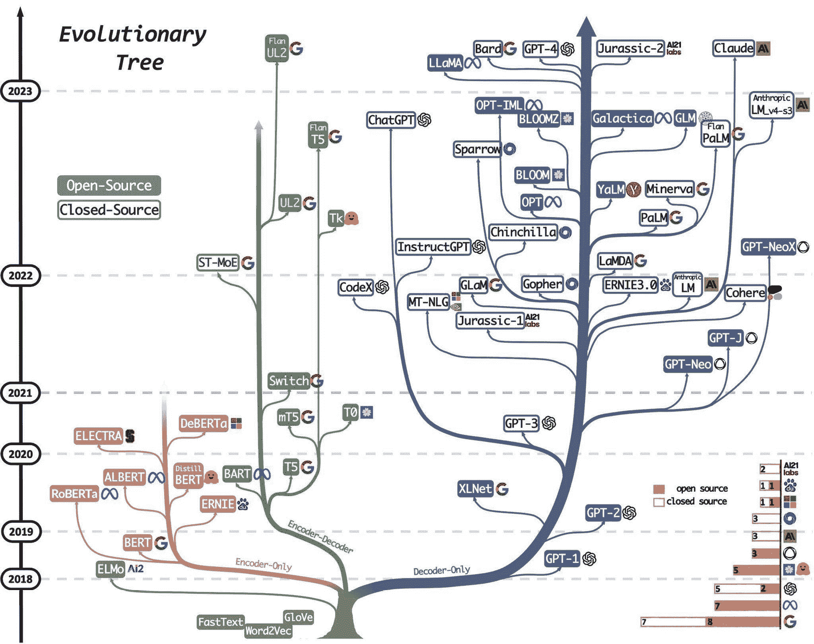
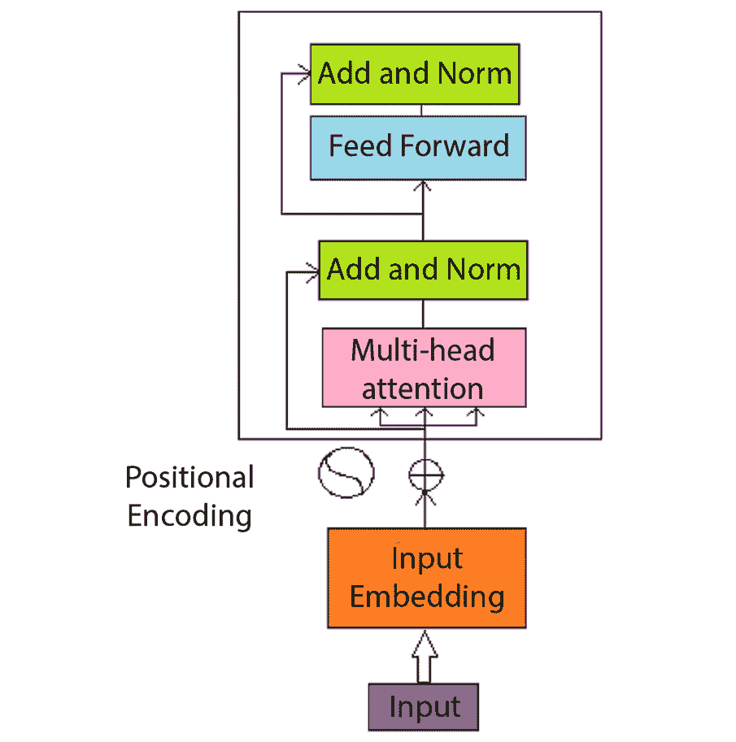
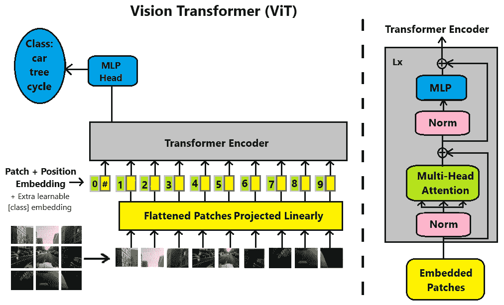
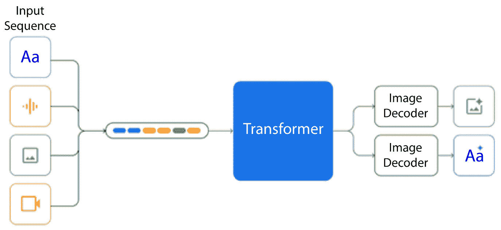
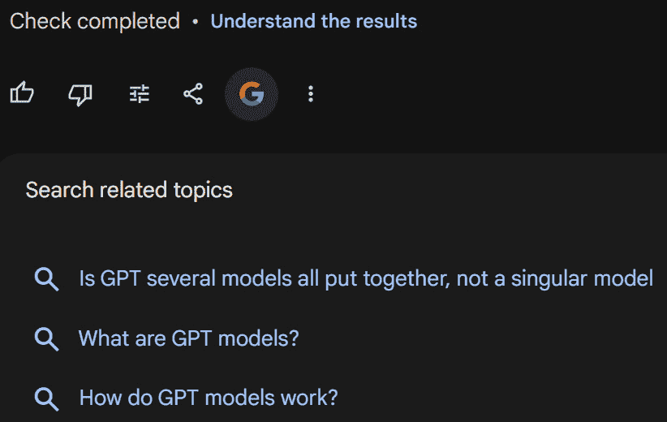
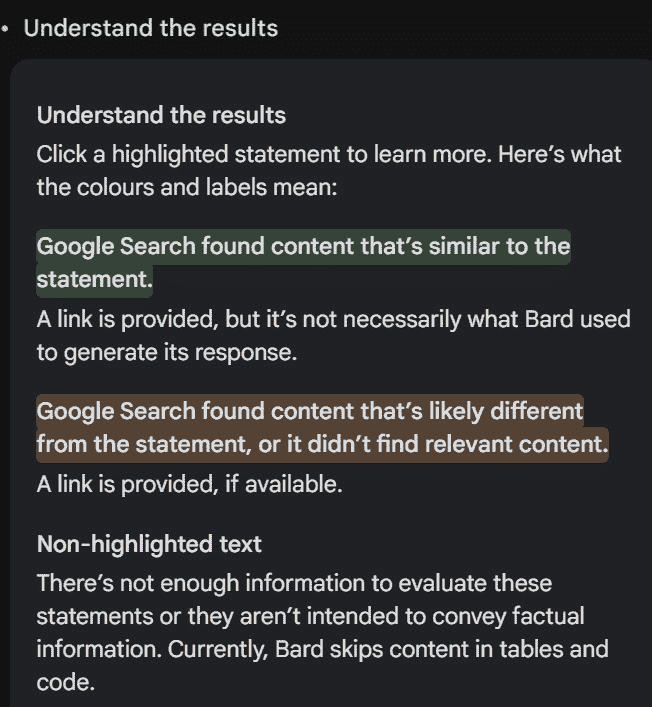
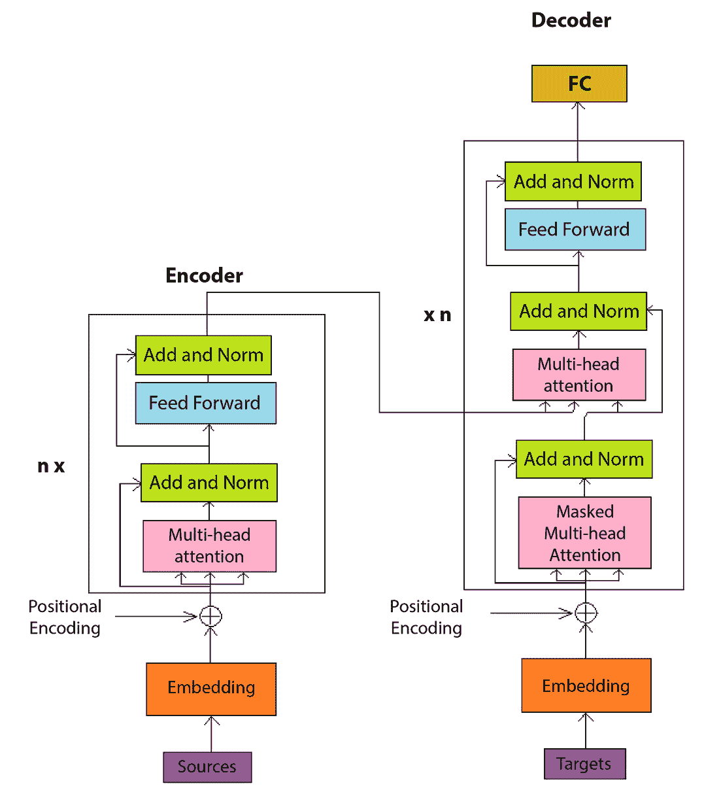

# 第一章：什么是 ChatGPT，LLM 是什么？

最近 AI 领域的进展，尤其是 **大型语言模型**（**LLM**），如 ChatGPT 和 Gemini（前身为 Bard），对世界产生了强烈影响。我们见证了 OpenAI 在五天内达成一百万用户、巨型科技公司裁员、历史修正图像丑闻、更多科技公司获得数万亿美元估值（微软和 NVIDIA）、为下一阶段技术筹集 5-7 万亿美元资金的呼声，以及关于如何*一切*都将发生革命性变化的讨论！

是的，这一切都归功于新的 AI 技术，尤其是 LLM 技术。

LLM 在多个方面都很庞大：不仅是大规模的训练集和高昂的训练成本，还有它们对世界的巨大影响！

本书是关于如何有效地利用这些技术为你带来好处，特别是如果你是程序员的话。

编程方式发生了变化，我们必须紧跟其后，否则我们的技能将变得过时或无用。本书提供了程序员需要的工具，以便快速生成代码并做到精良，同时进行注释、调试、文档编写，并保持道德和合法性。

如果你是程序员或开发人员，这部分内容适合你。软件，尤其是 AI/机器学习，正在以前所未有的速度改变一切，所以你必须快速学习这些知识，并利用它们来创造和理解未来的技术。

我不想再耽误你时间了，咱们进入第一章吧。

本章将介绍 ChatGPT、Gemini 和其他 LLM 的一些基础知识，讲解它们的来源、开发者以及架构的组成。我们还将介绍一些使用 LLM 的组织及其服务。我们也会简要提到 LLM 所涉及的一些数学原理。最后，我们将了解 LLM 在该领域的竞争态势和应用。

本章将涵盖以下内容：

+   LLM 入门

+   LLM 的起源

+   早期的 LLM

+   探索现代 LLM

+   变换器如何工作

+   LLM 的应用

# LLM 入门

ChatGPT 是一个大型语言模型（LLM）。LLM 可以用来回答问题、生成电子邮件、营销材料、博客、视频脚本、代码，甚至看起来像是由人类编写的书籍。然而，你可能更想了解这项技术。

让我们从 LLM 是什么开始讲起。

LLM 是深度学习模型，具体来说，是变换器网络（或简称“*变换器*”）。变换器无疑改变了我们的文化！

LLM 在巨大的文本数据上进行训练，数据量达到千兆字节（即数千个千兆字节），并预测下一个单词或词组。由于 LLM 的工作方式，它们在输出文本时并不完美；它们可能给出替代事实，或是“虚构”的事实。

截至本文撰写时，ChatGPT 是最受欢迎和最著名的 LLM，由 OpenAI 创建并管理。OpenAI 是一家总部位于旧金山的慈善机构和有限利润组织 [ *OpenAI_LP* , *OpenAIStructure* ]。

ChatGPT 现在被世界各地的许多人广泛用于多种目的。当然，还有 GPT-4 以及现在的 GPT-4 Turbo，它们是付费的，功能更强大，能够做更多事情，并且可以处理更多的提示文本。

它被称为 ChatGPT：“*Chat*”是因为这就是你与它的互动方式，它是一个聊天机器人，而**GPT**是技术的名称，代表**生成预训练的 Transformer**。我们将在*GPT* *传承*小节中进一步探讨这一点。

Transformer 是一种神经网络架构，也是当今最成功的 LLMs 的基础（2024 年）。GPT 是一个生成预训练的 Transformer。Gemini 是一个 Transformer [*ChatGPT*，*Gemini*，*Menon*，*HuggingFace*]。OpenAI 的 GPT-4 是人工智能领域的一个显著进步。这个模型是 GPT 系列的第四代，它引入了一个新功能：能够生成文本和图像。这是一个重大的飞跃，相比于其主要基于文本的前身。

OpenAI 还拥有一款图像生成 AI——DALL-E，以及一款可以将图像与文本结合并进行图像识别的 AI，叫做 CLIP（*OpenAI_CLIP*）。DALL-E 的图像生成能力是通过对图像数据训练 Transformer 模型实现的。这意味着，在训练过程中，模型接触到了大量的图像数据，从而使它能够理解并生成视觉内容 [*OpenAI_DALL.E*]。

此外，由于图像可以按顺序排列形成视频，DALL-E 也可以被视为一个视频生成器。这为内容创作开辟了无数可能性，从静态图像到动态视频。这证明了 Transformer 模型的多功能性和强大能力，展现了人工智能未来的潜力。

本质上，OpenAI 的工具不仅仅是文本生成器，而是一个综合的内容生成套件，能够生成各种输出。这被称为**多模态**。这使得这些工具在许多应用中都极具价值，从内容创作、图形设计到研究和开发。GPT-3 到 GPT-4 的演变标志着人工智能发展的一个重要里程碑，推动了 AI 模型能够实现的边界。

# LLMs 的起源

早期的神经网络凭借其读取句子并预测下一个词的能力，每次只能读取一个词，这些网络被称为**递归神经网络**（**RNNs**）。RNNs 尝试模拟类似人类的按顺序处理单词和句子的方式，但由于内存容量有限，它们在处理单词和句子之间的长期依赖关系时面临着挑战。

1925 年，Wilhelm Lenz 和 Ernst Ising 奠定了基础，提出了他们的非学习型 Ising 模型，被认为是早期的 RNN 架构 [*Brush*，*双子*]。

1972 年，天谷俊一（Shun’ichi Amari）使这一架构具备适应性，为学习 RNNs 铺平了道路。这项工作在 1982 年由 John Hopfield 进一步推广 [*天谷*，*双子*]。

因此，已经有相当多的研究试图找到方法，扩大这种记忆以包括更多文本，以获得更多上下文。RNN 是变压器。还有其他变压器，包括**LSTM**，即基于 RNN 的更高级版本的**长短期记忆**神经网络，但我们在此不再深入讨论 [*Brownlee_LLMs*，*Gemini*]。LSTM 由 Hochreiter 和 Schmidhuber 于 1997 年发明 [*Wiki_LSTM*，*Hochreiter1997*]。

还有一个网络叫做**卷积神经网络**（**CNN**）。不多讲，CNN 在图像处理方面非常出色，并引领着全球的图像识别等相关工作。CNN（或 ConvNets）由 Fukushima Kunihiko 于 1980 年发明，并由 Yann LeCun 发展，但直到 2000 年代，随着 GPU 的出现，CNN 才真正流行开来。Chellapilla *等人*测试了在 CPU 和 GPU 上训练 CNN 的速度，发现 GPU 训练速度比 CPU 快 4.1 倍 [*Fukushima1980*，*LeCun1989*，*Chellapilla2006*]。有时，发明需要时间才能取得成果，但继续发明吧！CNN 使用多个层或阶段对输入做许多不同的数学运算，并尝试从不同的角度来看待它们：不同的视角、去除细节（丢弃层）、对图像的邻近区域进行池化、将负数归零等技巧。

需要的是一个具备某种记忆功能的模型，能够记住并生成句子和更长的写作内容。

2017 年，Ashish Vaswani 等人发表了一篇名为*Attention Is All You Need*的论文，[*Vaswani*，*2017*]。在这篇重要的论文中，提出了基于注意力机制的 Transformer 架构。换句话说，这个模型没有使用递归和卷积，如 RNN 和 CNN。这些方法本身已经是非常成功和流行的 AI 架构。

与 RNN 和 CNN 相比，Vaswani 的 Transformer 在训练速度上表现更快，并且支持更高的并行化。

Transformer 成为了英德翻译的基准，并在 WMT 2014 英法翻译任务中建立了新的单一模型技术。它还在训练时间远低于下一个最佳现有模型的情况下，完成了这一壮举。事实上，Transformer 在自然语言处理领域是一次突破性的进展 [*Vaswani*，*2017*]。

现在我们已经了解了 LLM 的起源，接下来我们将看看一些最早创建的 LLM。

# 早期 LLM

今天有许多 LLM，它们可以被归类到一个家族树中；见*图 1.1*。该图展示了从 word2vec 到 2023 年最先进的 LLM：GPT-4 和 Gemini [*Bard*]的演变过程。



图 1.1：从 word2vec 到 GPT-4 和 Bard 的 LLM 家族树，来自 Yang2023，已获许可

这些就是所有版本，但现在我们将关注那些早期的 LLM，它们为今天最先进的技术奠定了基础。我们从 GPT 开始。

## GPT 谱系

GPT 的发展是一个不断变化的迭代过程，每一个新模型都在前代的优势和不足上进行构建。由 OpenAI 发起的 GPT 系列经历了许多演变，推动了**自然语言处理**（**NLP**）和理解的进展。

第三次迭代的 GPT-3 带来了在规模和复杂性方面的重大飞跃，拥有令人印象深刻的 1750 亿个参数。这使得它能够在广泛的主题和学科上生成相当类人化的文本 [*Wiki_GPT3* , *ProjectPro* ]。

随着 GPT 系列的发展，OpenAI 不断完善和增强架构。在后续的迭代中，GPT-4 和 GPT-4 Turbo 进一步推动了这些 LLM 所能实现的边界。迭代开发过程着重于增加模型大小和提高微调能力，从而使输出更具细致性和语境相关性。

此外，还有更多的模式，比如具有视觉和文本到语音功能的 GPT-4。

GPT 模型的迭代不仅仅是通过增加参数数量来扩展；它还涉及解决早期版本中发现的局限性。用户互动、研究成果和技术进步的反馈有助于 GPT 系列的迭代特性。OpenAI 始终致力于减少其聊天机器人生成的不准确信息和不连贯的输出（幻觉）。此外，每一次迭代都会吸取现实应用和用户反馈的经验教训。

GPT 模型通过在非常大且多样化的数据集上进行训练和微调，以确保聊天机器人能够适应许多不同的语境、行业和用户需求。迭代开发方法确保了后续的 GPT 模型更能理解和生成类人文本，使其成为各种应用场景中极具价值的工具，包括内容创作（如博客、视频剧本、广告文案写作）以及对话型代理（聊天机器人和 AI 助手）。

GPT 模型的迭代开发方式展示了 OpenAI 在 LLM 领域持续改进和创新的承诺，这为未来基于这些模型构建更复杂、更强大的模型奠定了基础。

以下是不同版本的 GPT 发布的日期：

+   GPT 首次发布是在 2018 年 6 月

+   GPT-2 于 2019 年 2 月发布

+   2020 年的 GPT-3

+   2022 年的 GPT-3.5/2022 年 11 月的 ChatGPT

关于 GPT 家族的内容将在稍后的*GPT-4 /GPT-4* *Turbo*部分详细讨论。

在这里，我们将详细介绍 LLM 的架构以及它们的工作原理。

## BERT

要理解**双向编码器表示法（来自变压器）**（**BERT**）的根源和发展，我们必须深入了解神经网络这一复杂且快速发展的领域。毫不夸张地说，BERT 在 NLP 领域是一个非常重要的创新，代表了 AI 不断进化的一部分。BERT 在 2018 年 10 月发布时，成为了广泛 NLP 任务的最前沿技术[*Gemini*]。这些任务包括问答、情感分析和文本摘要。

BERT 也为后来的 LLM 研发铺平了道路；它在 LLM 的发展中发挥了重要作用。由于 BERT 是开源的，它帮助加速了 LLM 的进展。

BERT 从 RNN（在*LLM 的起源*部分提到的神经网络）中汲取了一些 DNA，RNN 通过自我循环创建某种记忆，尽管这种记忆相对有限。

第一个变压器架构的发明是 BERT 起源的关键。作为双向编码器的 BERT（这些编码器在句子中前后移动）受变压器注意力机制的启发，能够捕捉句子中单词之间的双向上下文关系。

因此，BERT 的注意力是双向的（从左到右和从右到左的上下文）。在其创立之时，这种特性是独特的，它使得 BERT 能够更全面地理解语言的微妙语义。

虽然 BERT 的基础是变压器架构，但随着进一步的研究与发展，其特性也不断演变，尽管目前并未处于开发阶段。BERT 的每次迭代都在精炼和扩展其能力。

BERT LLM 是 AI 持续创新的一部分。BERT 理解语言的双向能力，从前后单词中汲取洞察，是为实现具有深刻自然语言理解的 AI 所做努力的一部分。



图 1.2：BERT 架构，双向编码器（转载自 GeekCultureBERT）

## LaMDA

理解**对话应用语言模型**（**LaMDA**）的起源涉及追溯其架构设计的根源以及它在自然语言处理（NLP）领域的发展路径。LaMDA 与其他模型一样，来自于一系列共同革新人类语言理解与生成方式的模型。

本章第一节提到的 RNN 在 LaMDA 的家族谱系中发挥着关键作用。

突破性进展来自于变压器架构的发明，而 LaMDA 要感谢具有革命性的*Attention Is All You Need*论文[*Vaswani* *2017*，*2023*]。这篇论文为一种新方法奠定了基础，推动了从顺序处理转向更加并行化和基于注意力的机制。

LaMDA LLM 从变压器家族继承了其核心架构，并由 Google 开发。这些模型非常擅长学习句子中词语之间的关系。这使得变压器能更丰富地理解语言。这一从传统的顺序处理转变为 NLP 中的范式转变，使得 LaMDA 能更有效地把握文本中微妙的交互和依赖关系。

虽然起源于变压器架构，但 LaMDA 的独特特性可能通过后续的研究和开发工作进行了精细调整和演进。LaMDA 的血统不仅仅是线性的进展，而是一个家族树，是许多可能性的分支探索，每一次迭代都在完善和扩展其能力。在 *Figure 1* *.1* 中，LaMDA 位于主要垂直蓝色分支右侧的 ERNIE 3.0、Gopher 和 PaLM 附近。

简单来说，LaMDA 是人工智能领域持续创新和精炼的产物，站在早期模型和研究突破的肩膀上。其理解和生成语言的能力深深扎根于从大量文本数据中学习的进化过程，模仿人类在大规模数字化环境中处理和理解语言的方式。

LaMDA 于 2021 年 5 月推出。

## LLaMA 家族树

LLaMA 是 Meta AI 的人工智能孩子。也许它不是你最常听说的，但其血统中充满了创新和进化的故事，穿越了 AI 沟通历史的一段迷人旅程。

像其他聊天机器人 LLM 一样，LLaMA 的根源也在变压器架构中。这些模型依赖复杂的注意机制，使它们能够分析单词之间的关系，而不仅仅是它们的顺序。

在大量文本和代码数据集上训练后，LLaMA 学会了生成基本的响应、翻译语言，甚至写不同类型的创意文本格式。

然而，就像一个新生的小马驹一样，它们的能力是有限的。它们在复杂语境中踉跄，缺乏常识推理，有时会发出不连贯的字符串。

然而，它们的潜力是不可否认的。从数据中学习和适应的能力使它们成为研究人员的宝贵工具。Meta AI 精心培养这些新生模型，仔细调整它们的架构并提供更丰富的数据集。它们深入理解人类语言，掌握了事实基础、推理能力和参与多轮对话的能力（Wiki_llama）。

Llama 家族树不是线性的进展，而是多个探索分支的家族。不同版本探索了特定的途径：Code Llama 专注于代码生成，而 Megatron-Turing NLG 530 B 则训练了填补缺失单词、阅读理解和常识推理等能力（ *CodeLlama 2023* , *Megatron-Turing 2022* ）。

关于 LLaMA 在进化树中的位置，可以参见左上角垂直蓝色分支上的*图 1* *1.1*，靠近 Bard（*Gemini*）。

每一次实验，每一次成功的进步，都为未来的世代贡献了宝贵的基因。

为什么叫*Megatron-Turing NLG 530 B*？*Megatron*代表着强大的硬件和软件框架；*Turing*是为了向艾伦·图灵致敬，图灵是第一个 AI 研究者，也是人工智能和机器学习的奠基人。**NLG**代表**自然语言生成**，它拥有 5300 亿个参数。

Meta AI 继续管理 Llama 家族，未来充满了更多激动人心的进展。

Llama LLM 于 2023 年 2 月发布，而 Megatron-Turing NLG 530 B 则在 2022 年 1 月发布。

既然我们已经讨论了 LLMs 的起源并探索了其早期阶段，让我们快进到下一部分，谈一谈现代 LLMs。

# 探索现代 LLMs

在 2022 年底 ChatGPT 爆炸性起飞之后，仅用了 5 天就达到了 100 万活跃用户，2023 年 1 月（大约两个月）活跃用户突破 1 亿，2023 年对大语言模型（LLMs）、人工智能研究以及人工智能的广泛应用来说是一个非常火热的年份。

大多数科技公司都在开发自己的 LLM 或变压器模型，并将其公开使用。许多公司、组织和个人（包括学生）都已将 LLM 应用于各种任务。OpenAI 不断更新其 GPT 家族，而 Google 则持续更新其 Bard 版本。Bard 在 2024 年 2 月变更为 Gemini，因此所有对 Bard 的引用都已更改为 Gemini。许多公司将 ChatGPT 或 GPT-4 作为其产品的核心，仅仅创建一个外壳并进行销售。

随着 OpenAI 不断为 GPTs 添加新的模态（语音、图像等）以及一个新的市场平台，用户可以在 OpenAI 的服务器上创建并销售自己的 GPT 代理，未来可能会发生变化。该平台在 2024 年 1 月初推出，面向付费用户（每月$20，未含增值税）。我们将在接下来的章节中介绍一些公司正在开发的最新 LLMs。

## GPT-4

GPT-4 Turbo，OpenAI 最新的热聊机器人，是另一次重大升级。它是你所熟悉的 GPT-4，但拥有了 10 倍的内存，并且对图像有了全新的理解。

如果说 GPT-4 是一个天才作家，那么 GPT-4 Turbo 就是一个多媒体博学者。它不仅能编织引人入胜的故事和诗歌，还能解读图像、绘制生动的数字画面，甚至用机智的评论为照片配上字幕。忘掉过时的信息吧——Turbo 的知识库不断更新，确保其在时事上保持如针锋般的敏锐。

但它不仅仅是一些炫酷的技巧。Turbo 是一个对事实极为挑剔的家伙。它能够访问外部知识库，并采用复杂的推理，确保其回答既准确又可靠。过去偏见或误导的输出已经成为历史——Turbo 力求真理与清晰，是学习和探索过程中的可靠伙伴。

最棒的部分？OpenAI 并没有将这个强大的技术封锁起来。他们制作了 API 和开发者工具，邀请程序员和创新者定制 Turbo 以应对特定的任务和领域。这种高级语言处理的民主化为未来开辟了大门，未来每个人，无论是艺术家还是科学家，都可以利用语言模型的力量创造、分析和理解周围的世界。

GPT-4 Turbo 可能被广泛认为是目前科技的巅峰，向我们展示了 LLM 的惊人潜力。它不仅仅是一个语言模型；它是我们走向一个未来的前瞻，未来机器将以前所未有的方式理解并与我们互动。所以，系好安全带！语言的未来已经到来，而它的动力来自 GPT-4 Turbo。

GPT-4 于 2023 年 3 月发布，GPT-4 Turbo 于 2023 年 11 月发布（*Wiki_GPT4*，*OpenAI_GPT4Turbo*，*Gemini*）。

GPT-4o 或 GPT-4 omni 于 2024 年 5 月发布，它可以理解多种格式的数据。Omni 比之前的模型更快，平均响应时间为 0.32 秒，类似于人类的反应时间，而 Turbo 在语音模式下大约需要 5.4 秒响应。

这部分是因为，尽管 Turbo 通过一个简单模型将音频转录为文本，再通过第三个模型将文本转回音频响应，而 omni 是一个理解音频、视频和文本的单一模型。Turbo 的三个模型比 omni 更慢，而且由于转录，GPT-4 Turbo 会丢失很多信息。

GPT-4o 在非英语人类语言处理方面远远优于 GPT-4 Turbo。

Omni API 的成本也仅为 Turbo 的一半（*OpenAI-GPT-4o*）！

GPT-4o 在代码生成方面表现非常出色，相较于 Claude 3 Opus 和 Gemini 1.5 Pro。Claude 表现中等，Gemini 被评为非常好，而 GPT-4o 的表现则是优秀的 [*encord*]。

### GPT-4 架构

OpenAI 尚未公开 GPT-4 的架构和完整细节，作为专有信息暂时保密，但我们可以从类似的工作中拼凑出一些元素。

GPT-4 拥有 1.75 万亿个参数（1.75 万百万）（*MotiveX_Gemini*）。

视觉 Transformer 很可能会采用某种编码器-解码器架构：图像和视频输入给编码器，然后解码器将生成输出，如文本描述或标题以及图像（*Gemini*）。

它将拥有一种注意力机制，因为“注意力就是你所需要的一切。”

视觉组件可能会采用多头机制来同时处理输入的各个方面。它应该还会有位置编码、图像预处理层和模态融合。

模态融合是指视觉能力与处理文本的能力相结合。从这个过程中，它需要生成对输入或场景的统一理解。

因此，GPT-4 能够理解图像，并且它被认为结合了 **Vision Transformer**（**ViT**）和 Flamingo 视觉语言模型。

*图 1* *.3* 显示了 ViT 的架构（转载自 Wagh）。



图 1.3：这是 ViT 内部工作的图示（摘自 Wagh）

因此，处理视觉处理的 GPT-4 内部工作很可能涉及到视觉转换器，正如前面的图示所示，以及在*LLM 如何处理句子*子部分中的文本处理器。

您可以在这里了解更多关于 ViT 的信息：[`github.com/lucidrains/vit-pytorch`](https://github.com/lucidrains/vit-pytorch)。

## LLaMA-2

最新的官方 LLaMA，LLaMA-2，能够进行复杂对话，生成各种创意文本格式，甚至根据特定用户的个性调整其响应。

OpenLLaMA 是由 Open LM Research 发布的 LLaMA 的开源版本（*Watson 2023*，*OpenLMR*，*Gemini*）。 OpenLLaMA 有几个版本，每个版本都是基于不同数据集进行训练，但训练过程与原始 LLaMA 非常相似。模型权重可以在 HuggingFace Hub 上找到，并且无需任何额外权限即可访问。有关 OpenLLaMA 的 HuggingFace 页面在这里：[`huggingface.co/docs/transformers/en/model_doc/open-llama`](https://huggingface.co/docs/transformers/en/model_doc/open-llama)。

+   OpenLLaMA 模型作为 LLM 研究的基准。它们的开源性质使得可以与其他模型进行比较。这得益于提供的 PyTorch 和 TensorFlow 格式。

+   LLaMA-2 于 2023 年 4 月发布。

+   OpenLLaMA 于 2023 年 6 月发布。

+   2024 年初，有传言称 LLaMA-3 将在今年发布。

## Gemini（前身为 Bard）

谷歌的 Gemini 是一个具有互联网访问权限的聊天机器人 LLM，只需一个谷歌登录即可。从技术上讲，Gemini 是面孔，而大脑则是谷歌插槽中的任何内容。

以前，Gemini 由 PaLM 2 驱动。

在撰写本文时（2024 年初），Bard 先前由 Gemini 供电。Gemini 有三个版本：Nano、Pro 和 Ultra。Nano 适用于移动设备。由于 Bard 由 Gemini Pro 供电，因此名称更改为 Gemini。可能很快会有付费版本。

Gemini 是在 2023 年 3 月发布的（*Wiki_Gemini*）。

Gemini 有 1.424 亿用户，其中 62.6%位于美国（*AnswerIQ*）。

### Gemini 的架构

Gemini 是 Google/Alphabet 开发和使用的 LLM 和 AI 之一。让我们来看看其内部运作，了解 Gemini 的工作原理！

Gemini 是基于世界书籍、文章和互联网交流的庞大文库进行训练的。Google Gemini 的 Infiniset 数据集中有 1.56 万亿字，即 750 GB 的数据。Gemini 有 1370 亿参数，这些是神经网络的权重（ChatGPT 有 1750 亿参数/权重）（*ProjectPro*）。

2023 年 11 月，Bard 升级，并开始由新的 AI 系统 Gemini（*SkillLeapAI*）提供支持。此前，Gemini 由 LaMDA 从 2023 年 3 月起供电，然后是 PaLM 2 从 2023 年 5 月起。

有三个型号，分别是 Gemini Nano、Gemini Pro 和 Gemini Ultra。截至 2024 年 1 月 19 日，Gemini 由 2023 年 12 月发布的 Gemini Ultra 驱动。

*图 1* *.4* 显示了 Gemini 的架构（ *GeminiTeam* ）。



图 1.4：Bard/Gemini 架构，来自 DeepMind GeminiTeam (GeminiTeam)

Gemini 可以处理文本、图像、音频和视频输入的组合，在这里它们用不同的颜色表示。输出可以是文本和图像的结合。

向 Gemini Ultra 的过渡标志着 Gemini 能力的重大飞跃，提供了更高的性能、更大的效率和更广泛的潜在应用（Gemini）。Bard/Gemini Ultra 有着复杂的架构，就像一个精密的语言处理工厂，每个组件在理解你的问题和制定完美回答方面都起着至关重要的作用。

关键组件是变压器解码器，它是整个操作的大脑。它分析输入的文本，剖析每个单词的含义及其与其他单词的关系。就像一位熟练的翻译员，解读你发送的信息，并准备流利地回应。

Gemini Ultra 多模态编码器不仅能处理文本。图像、音频及其他数据类型也能被处理，从而为解码器提供更丰富的上下文。这使得 Gemini 能够理解复杂的情境，例如描述你发送的图像或根据你的情绪创作音乐。

为了优化解码器的输出，预激活和后激活变压器起到了作用。这些额外的层次对响应进行了精炼和平滑处理，确保其清晰、语法正确，并且像自然语言一样流畅。通过减少幻觉现象，事实基础模块将其响应固定在现实世界中。就像一位可靠的老师，它确保 Gemini 提供的信息准确无误且不带偏见，并将其创造力建立在坚实的真实基础之上。除了基本的理解能力，Gemini Ultra 还具备推理能力。它能回答复杂的问题，得出逻辑结论，甚至解决问题。

实现 Gemini 的过程中还与 Google 有一些联系，帮助用户核实其回答。在输出的底部，输入框上方，Google 允许你双重检查其响应。


图 1.5：Gemini 的 Google 搜索按钮，用于核实其给出的输出。

点击此按钮后，它会显示**Google 搜索**，并输出一些搜索结果以及你所看到内容的指南。



图 1.6：基于其输出的 Google 搜索

*图 1* *.7* 显示了高亮部分的含义。



图 1.7：理解 Google 搜索的结果以帮助事实核查

在你的 Gemini 屏幕上，你会看到不同的段落被高亮显示为棕色或绿色。绿色高亮的文本与结果一致，棕色高亮的文本与源数据不一致，未高亮的文本表示信息不足以确认。

这只是 Gemini Ultra 架构和功能的简化介绍。凭借其庞大的参数量、自注意力机制和微调能力，它是一个不断进化的语言大师，推动着 LLM 所能实现的极限。

## 亚马逊奥林匹斯

亚马逊开发了一个庞大的新 LLM。它是一个巨大的存在，甚至在规模上也压倒了 OpenAI 的 GPT-4。但这不仅仅是实力的较量。奥林匹斯的目标是更远的目标：在连贯性、推理和事实准确性方面取得重大突破。他们的聊天机器人 Metis 由奥林匹斯提供支持：[`happyfutureai.com/amazons-metis-a-new-ai-chatbot-powered-by-olympus-llm/`](https://happyfutureai.com/amazons-metis-a-new-ai-chatbot-powered-by-olympus-llm/)。

没有半吊子的想法，奥林匹斯深入思考、逻辑推理，并在说出任何话之前反复核实事实。亚马逊据说正在努力减少偏见和错误信息。这款 LLM 力求达到高水平的智慧和可靠性。

这不仅仅是亚马逊炫耀实力。奥林匹斯代表着语言模型的一个潜在转折点。

目标是能够以极高的准确性处理复杂的任务，抓住细微的意义差异，并与其他 AI 进行智能、基于事实的对话。

希望奥林匹斯将成为一个更具思考性的伙伴，能够进行更深层次的理解和富有洞察力的交流。

奥林匹斯可能还未准备好加入你的书籍俱乐部，但它的故事值得关注。希望奥林匹斯能成为 LLM 的必要进步，不会产生幻觉，只会产生真相，并改变 LLM 的功能。

亚马逊奥林匹斯应该拥有大约两万亿个参数（权重和偏差）（*Life_Achritecture*）。

亚马逊奥林匹斯预计将在 2024 年下半年发布，但自 2023 年 11 月以来，尚未公开太多信息。

现在我们已经介绍了许多现代的 LLM，让我们看看它们是如何工作的，包括通过一个示例文本。

# 变换器是如何工作的

接下来是一般的变换器，*图 1.8*展示了一个变换器的结构：



图 1.8：变换器架构：输入的编码器和输出的解码器（来自 Zahere 的复原）

你可以看到它有一个编码器和一个解码器。编码器学习数据中的模式，解码器则试图重建这些模式。

编码器有多个神经网络层。在变换器中，每一层都使用自注意力机制，使得编码器能够理解句子的不同部分是如何组合的，从而理解上下文。

以下是变压器过程的简要版：

1.  编码器网络：

    使用多层神经网络。

    每一层都使用自注意力来理解句子部分之间的关系和上下文。

    创建输入的压缩表示。

1.  解码器网络：

    利用编码器的表示来生成新的输出。

    采用多层结构，并通过交叉注意力与编码器进行信息交换。

    生成有意义的输出，如翻译、总结或基于输入的答案。

1.  编码器-解码器合作：

    它们结合在一起，为变压器提供高准确性和灵活性的各种任务处理能力。

    例如，微软必应利用 GPT-4 这一变压器模型，理解用户的意图和上下文，不仅仅依靠关键词，从而提供相关的搜索结果。

1.  超越关键词：

    必应通过使用 GPT-4 从搜索引擎转变为 AI 驱动的副驾驶。

    它通过分析上下文和意图来解释问题和请求，而不仅仅是依赖关键词。

    例如，不仅提供食材列表，还根据饮食需求和技能水平推荐个性化的食谱。

1.  从链接到理解：

    必应不仅仅是寻找链接，而是能够理解用户需求并提供相关且有用的信息。

接下来是变压器过程的详细版。

## LLM 如何处理一段文本

编码器生成输入的压缩表示。这使得解码器不仅可以考虑自身的输出，还可以回顾编码器的表示，其中包含整个输入序列的表示，用于指导解码器的每一步输出生成。

解码器使用来自编码器的输出生成新的输出序列。得益于 Transformers，现代大语言模型（LLM）可以在其注意力中处理整个句子或段落，而不仅仅是像 RNN 那样一次处理一个词。

再次强调，这一部分包含很多层，但这一次有交叉注意力。

解码器与编码器压缩后的知识之间的反复对话，使得解码器能够生成有意义且相关的输出，例如将一句话翻译成另一种语言、总结一段文字或根据输入回答问题。

编码器和解码器共同构成了变压器的强大动力，使其能够以卓越的准确性和灵活性执行各种任务。

微软的必应搜索引擎使用 GPT-4 来提供更相关的搜索结果，理解你的意图和上下文，而不仅仅是关键词。

必应从一个搜索引擎转变为一个由 GPT-4 驱动的 AI 副驾驶。这种强大的语言模型作为必应的大脑，不仅仅通过关键词理解你的问题和请求，而是通过分析上下文和意图。

例如，你可以请求一个食谱，而不仅仅是食材；GPT-4 会在网上搜寻，考虑你的饮食需求和技能水平，然后呈现个性化的选择。这就像有一个知识丰富的朋友帮助你在浩瀚的信息海洋中导航。所以，Bing 不仅仅是找链接了；它是在理解你真正需要什么，并以相关且有帮助的方式提供它（[`www.bing.com/`](https://www.bing.com/)）。

将一段话输入到大型语言模型（LLM）中的整个过程如下：

1.  清洗

1.  分词

1.  词到数字转换（将词汇赋予索引：1、2、3、4……）

1.  数字被转化为向量

1.  上下文嵌入

1.  上下文向量被形成

1.  注意力向量被形成并输入到最后的块中

1.  随后的词语会被预测

（*ChatGPT*，*Gemini*，*Panuganty*，*Aakanksha*）。

在你潜意识中有了这个框架之后，我们可以详细讨论各个阶段。当你为 ChatGPT 提问并得到答案时（对于开发者来说更多），你是按成千上万个标记（tokens）来付费的。标记是将句子拆分成单词、标点符号或其他词汇的过程。标记被转换为数字（索引），然后放入向量中，因为使用向量或上下文向量进行数学运算更容易。注意力层会指示模型在每个句子中应聚焦的部分，从而预测下一个词。

这个过程是将词汇和句子输入到转换器模型中，以便训练和查询以获得响应。

在分词之前，数据（句子、段落等）需要清洗和规范化：去除特殊字符，将所有内容转为小写，以及其他一些基本的清理操作。

这是一个需要分词处理的段落示例：

“*游戏《辐射》在与《堡垒之夜》相比时，作为一种独特且沉浸式的游戏体验脱颖而出。《辐射》的优势在于其丰富的叙事，提供了一个充满复杂故事情节、角色发展和重要选择的后末日世界。与《堡垒之夜》的快节奏大逃杀模式不同，《辐射》提供了广阔的开放世界探索，鼓励玩家深入细致且富有氛围的环境。游戏中的角色扮演和决策制定的重视增添了多层次的复杂性，带来了更深刻的* *游戏沉浸感*。”

现在，这是经过分词处理的同一段文字（*ChatGPT*）：

```py
["The", "game", "Fallout", "stands", "out", "as", "a", "distinctive", "and", "immersive", "gaming", "experience", "when", "compared", "to", "Fortnite", ".", "Fallout's", "strength", "lies", "in", "its", "rich", "narrative", ",", "offering", "players", "a", "post-apocalyptic", "world", "filled", "with", "intricate", "storytelling", ",", "character", "development", ",", "and", "meaningful", "choices", ".", "Unlike", "Fortnite's", "fast-paced", "battle", "royale", "format", ",", "Fallout", "provides", "a", "vast", "open-world", "exploration", ",", "encouraging", "players", "to", "delve", "into", "a", "detailed", "and", "atmospheric", "environment", ".", "The", "emphasis", "on", "role-playing", "and", "decision-making", "in", "Fallout", "adds", "layers", "of", "complexity", ",", "contributing", "to", "a", "more", "profound", "gaming", "engagement", "."]
```

句子可以通过 **BertTokenizer**（*Metzger*）进行分词：

```py
from transformers import BertTokenizer
```

然后，通过词到数字的转换，一个词变成一个索引：

```py
1, 2, 3, 4, 5, 6, 7, 8, 9, 10, 11, 12, 13, 14, 15, 16, 17, 18, 19, 20, 21, 22, 23, 24, 25, 26, 27, 28, 29, 30, 31, 32, 33, 34, 35, 36, 37, 38, 39, 40, 41, 42, 43, 44, 45, 46, 47, 48, 49, 50, 51, 52, 53, 54, 55, 56, 57, 58, 59, 60, 61, 62, 63, 64, 65, 66, 67, 68, 69, 70, 71, 72, 73, 74, 75, 76, 77, 78, 79, 80, 81, 82, 83, 84, 85, 86, 87, 88
```

索引转化为向量，这是通过预训练的词表示来定义的，这些表示来自于在前面提到的巨大数据集上的训练。这些表示来自于 Word2Vec、GloVe 或 FastText、ELMo，或者著名的 BERT：

+   **"The": [0.2, 0.8, -** **0.5, 0.3]**

+   **"game": [0.5, -0.7,** **0.1, 0.6]**

+   **"Fallout": [0.9, 0.4, -** **0.2, -0.1]**

+   **"stands": [-0.3, 0.6,** **0.7, -0.5]**

+   **"out": [-0.7, 0.2, -** **0.4, 0.9]**

+   **"as": [0.3, 0.1, -** **0.6, 0.4]**

向量的大小取决于模型的维度数量。前面的模型暗示了一个四维模型，这个模型非常小，仅仅用于这个简单的解释。

只有两个维度的模型，可能会将**“女人”**放在**“男人”**的语境中，或者**“快”**放在**“慢”**的语境中。

接下来，我们有上下文嵌入：这个词的环境是什么？

这里有一些例子，展示了可能发生的情况：

+   句子 1，*游戏 Fallout 脱颖而出...* ：嵌入可能会强调独特性和游戏体验的方面

+   句子 2，*Fallout 的优势在于其丰富的叙事...* ：嵌入可能会集中在讲故事和叙事元素上

+   句子 3，*与《堡垒之夜》快速节奏的玩法不同，Fallout 提供了...* ：嵌入可能会突出与其他游戏的对比以及世界探索的方面

作为向量，它会像这样表示：

+   The: [0.12, 0.34, 0.56, 0.21, -0.05, ..., 0.90] （300 个值）

+   游戏： [0.78, 0.21, -0.45, 0.10, 0.83, ..., 0.68] （300 个值）

+   Fallout: [0.90, -0.10, 0.05, 0.75, 0.43, ..., -0.22] （300 个值）

有 300 个维度，因为这能让模型捕捉到较为微妙的语义关系，但也需要更多的训练数据和计算资源。

如果数据集很小，而且你不想花费大量的时间和金钱来计算所有内容，可以只用 50 个维度来完成。

## ChatGPT 使用来自人类反馈的强化学习

ChatGPT 在其他大语言模型（LLM）中脱颖而出，原因是它通过一种叫做**人类反馈强化学习**（**RLHF**）的过程不断改进。这意味着它不仅仅从大量的文本和代码数据集中学习，还融入了来自人类用户的直接反馈。

当一个新的 GPT 模型被训练（无论叫什么 GPT-X），在发布给公众之前，用户会与 GPT-X 互动，提问或发出指令。在收到回复后，他们可以通过各种方式表示赞同或反对，例如点赞/点踩评分或明确的反馈提示。这些宝贵的输入直接影响 GPT-X 模型如何精炼其内部模型，优先回应符合人类需求的回答，减少那些偏离的回答。

把它当作训练一只小狗。就像奖励鼓励期望的行为一样，强化学习中的正反馈会加强 GPT-X 中的有帮助且准确的响应。随着时间的推移，通过无数的互动和反馈循环，GPT-X 不断微调其响应，使其更加有信息量、吸引人并符合人类的偏好。这种“人类在环”方法使得 GPT 模型与其他模型不同，它们能够动态适应和学习，基于现实世界的互动不断发展其能力。

这就是研究人员和开发人员试图使人工智能具备伦理和道德的方法，依据他们对人类道德的理解，这种理解不会得到每个人的认同，但它符合普遍的文化，包括法律。

其他人则喜欢确保存在未经审查的 LLMs，这些 LLMs 不会鼓励开发者所在地区（如加利福尼亚科技公司）所持的政治观点。

这个过程应该能阻止人工智能协助任何人做任何暴力/非法的事情，比如制造武器或非法入侵组织的网站或服务器。

虽然 RLHF（强化学习与人类反馈）实现的具体细节仍然是专有的，但其影响在于 ChatGPT 能够处理多样的对话风格、生成不同的创意文本格式并提供有用的答案。随着 RLHF 技术的发展，我们可以预期像 ChatGPT 这样的 LLMs 会在理解和回应人类需求方面变得更加得心应手，模糊机器与人类沟通之间的界限。

## 大型语言模型（LLMs）非常昂贵

许多科技公司玩家一直在努力创建和训练自己的 LLMs 或聊天机器人，以借助这波创新浪潮赚取金钱并获取控制权。如今的 LLMs（2024 年）需要大量的训练，这需要巨额的资金。OpenAI 在微软购买 OpenAI 股份时获得了大约 130 亿美元的资金，其中很大一部分可能用于在微软自己的 Azure 云服务器上训练 GPT 系列 LLMs（*Sanman*）。

训练和运行 LLMs 需要现金和冷却（能源），因此，深度学习模型能够节省能源并减少污染是一件好事。DeepMind 曾经帮助谷歌数据中心节省了 40%的冷却费用！他们通过开发一个深度学习模型，提出了如何修改冷却系统运行方式的建议。后来，DeepMind 模型直接控制冷却系统的运行[Hooper 2021 和 DeepMind]。这些谷歌数据中心有自己的专用电站，因此节省了大量能源，同时也节省了金钱和减少了污染！

说到数字和计算，让我们简要了解一下 LLMs 涉及哪些数学领域。

# 关于 LLMs 数学的一点说明

进入 LLMs 的数学核心可能有些复杂，但理解它们的核心原理能揭示许多当前最强大且广泛使用的人工智能是如何运作的。因此，如果你想构建这些 AI 模型并进行研究，数学非常有趣：

+   **线性代数基础**：LLMs 的基石在于线性代数，其中矩阵和向量占主导地位。单词被映射到高维向量，捕捉它们在广阔语义空间中的意义和关系。每个单词都是多维空间中的一个点，相关的单词会聚集在一起。

+   **反向传播与优化**：训练 LLMs 需要庞大的数据集和复杂的优化算法。一个强大的工具是反向传播，这是一种数学技术，用于计算误差梯度——每个参数对模型输出偏差的贡献程度。通过根据误差梯度反复调整这些参数，LLMs 能够学习并改进其预测。

+   **损失函数和评估指标**：为了评估大语言模型（LLM）的性能，我们需要定量指标。损失函数定义了模型输出与期望结果之间的偏差，而像准确度、困惑度和 BLEU 分数等指标则评估模型生成流畅且上下文适当的文本的能力。

    +   **BLEU 分数**代表 **Bilingual Evaluation Understudy score**，源自翻译领域，但也可以作为一种方法来比较 AI 生成的翻译与参考翻译。可以使用 Python 中的 NLTK 代码库，通过 **sentence_bleu()** 函数（*Brownlee_BLEU*）计算 BLEU 分数。

+   **超越基础数学**：LLM 的数学远远超出了这些核心原理。技术如正则化、丢弃法和梯度裁剪有助于防止过拟合并提高泛化能力。RNN 增加了记忆能力，使模型能够从更长的序列中学习。数学的世界不断发展，推动 LLM 能力的边界。

+   **Transformers 和注意力**：这种数学架构构成了现代 LLM 的引擎。在 Transformers 中，计算注意力分数的机制涉及查询向量和键向量之间的点积。而在 LSTM 中，每个时间步既充当 *查询* 又充当 *键*，Transformers 则将这两个角色分开：查询来自当前词元的表示，而键来自序列中所有词元的值表示。这一区分有助于计算出注意力分数，指示每个词元在其上下文中的重要性或相关性。Transformers 还使用值，它们也来自所有词元的词嵌入，携带每个词元的实际信息。

    +   让我们来看一个例句，*The cat played with* *a ball*。

    +   在 Transformer 的注意力机制中，适用以下规则：

        +   词语及其意义通常使用嵌入表示为数值形式，如 Word2Vec 或 GloVe 向量。

        +   查询将来源于当前词元的表示；假设它是词 *played*。

        +   键是从序列中所有词元的值表示计算出来的，因此我们会为 *The*、*cat*、*played*、*with*、*a* 和 *ball* 计算键。

        +   然后，每个查询将与每个键向量做点积。

        +   这些点积将用于计算注意力分数。

        +   最终，这个过程有助于突出序列中哪些词在上下文中最相关或最重要，从而增强 Transformer 理解文本的能力。

虽然数学可能看起来令人畏惧，但必须记住，它只是一个工具。真正的力量在于这些算法如何结合在一起，创造出能够实现语言处理奇迹的模型。随着数学模型的不断发展和数据集的增大，LLM 有望突破语言的边界，以越来越迷人的方式模糊人类与机器交流之间的界限 [Llama3, Gemini]。

# LLM 的应用

LLM 革命正在将它的虚拟触角伸向生活的方方面面，从写大学论文到生成个性化的可口可乐广告和客户服务。以下是 16 个多样化应用的快速一瞥：

+   *DIYVA* : 设计惊艳的视觉效果和标志，即使是艺术天赋较差的人也能看起来像毕加索（[`diyva.life/`](https://diyva.life/)）。

+   *LimeWire* : 创造独特的 AI 生成艺术作品，将你最疯狂的创意愿景变为现实。从这里开始：[`limewire.com/studio?referrer=ml736b1k7k`](https://limewire.com/studio?referrer=ml736b1k7k)。

+   *Coca-Cola* : 创建有针对性的广告活动，为每个可口可乐消费者量身定制个性化的营销信息（[`www.coca-cola.com/gb/en`](https://www.coca-cola.com/gb/en)）。

+   *Slack* : 转录会议并自动总结关键要点，节省宝贵的时间和精力（[`slack.com/intl/en-gb`](https://slack.com/intl/en-gb)）。

+   *Octopus Energy* : 预测你的能源使用并建议个性化的方案，通过 LLM 智能优化你家中的电力（[`octopus.energy/`](https://octopus.energy/)）。

+   *Cheggmate* : 提供 AI 驱动的辅导，针对每个学生的具体需求进行定制，使学习更加高效和有趣（[`www.cheggmate.ai/`](https://www.cheggmate.ai/)）。

+   *Freshworks* : 自动化客户服务，分析聊天记录并在客服人员反应过来之前提供解决方案（[`www.cheggmate.ai/`](https://www.cheggmate.ai/)）。

+   *Udacity* : 设计个性化学习路径，带领你穿越技术丛林，借助 LLM 驱动的推荐（[`www.udacity.com/`](https://www.udacity.com/)）。

+   *Zalando* : 这家欧洲时尚零售商使用 LLM 根据用户的偏好和行为生成个性化的产品推荐（[`www.zalando.co.uk/`](https://www.zalando.co.uk/)）。

+   *Headspace* : Headspace 利用 LLM 个性化指导冥想，根据你的情绪、睡眠模式和个人目标调整冥想练习（[`www.headspace.com/`](https://www.headspace.com/)）。

+   *Spotify* : Spotify 的 Discover Weekly 播放列表和其他个性化推荐是由 LLM 生成的，通过分析你的听歌习惯和音乐偏好，为你的生活策划一条不断演变的背景音乐（[`open.spotify.com/`](https://open.spotify.com/)）。

+   *Peloton* : Peloton 的 AI 教练利用 LLM 在锻炼过程中提供动态实时反馈，根据你的个人表现和健身目标调整提示和挑战（[`www.onepeloton.co.uk/`](https://www.onepeloton.co.uk/)）。

+   *百度的文澜* : 帮助中国企业分析客户评论并个性化营销活动；本地的 LLM 巨头（[`ir.baidu.com/company-overview`](https://ir.baidu.com/company-overview)）。

+   *NVIDIA Megatron-Turing NLG*：生成不同的创意文本格式，如诗歌、代码、剧本等，推动 LLM 表现力的边界（[`gpt3demo.com/apps/mt-nlg-by-microsoft-and-nvidia-ai`](https://gpt3demo.com/apps/mt-nlg-by-microsoft-and-nvidia-ai)）。

+   *Grammarly*：这个写作助手使用 LLM 分析你的写作，为你提供实时的语法和风格建议，使你的沟通更加清晰、有影响力。

+   （[`app.grammarly.com/`](https://app.grammarly.com/)）。

+   *DeepBrain AI*：利用他们自己的 LLM，结合先进的动画和语音合成技术（[`www.deepbrain.io/aistudios?via=abtnews`](https://www.deepbrain.io/aistudios?via=abtnews)）。(*ForbesMarr*，*f6s*，*Gemini*)。

# 摘要

本章我们涵盖了 ChatGPT 是什么以及 LLM 一般是什么，一些广泛使用的 LLM 的起源，如 BERT、GPT 系列、LlaMDA、LlaMA，以及现代 LLM 如 GPT-4 和 Gemini。我们查看了 LLM 和变换器的一些架构。我们尝试了以 LLM 模型的方式全面处理一个句子：分词、Word2Vec 上下文嵌入等。我们还涉及了相关的数学类型及这项由公司部署的惊人技术的应用。

希望你现在已经理解了像 ChatGPT/Gemini 这样的 LLM 的性质；理解了 LLM 的架构；理解了一些 LLM 的数学原理；并且对这一领域的竞争以及如何将 LLM 教授给他人有了启发。

在*第二章*中，我们将探讨使用 LLM 编码的优势、规划基于 LLM 的编码、与 LLM 一起进行编码以及如何使其为你所用。

# 参考文献

+   *Amari*：“*通过自组织阈值元件网络学习模式与模式序列*”，S. I. Amari，[`ieeexplore.ieee.org/document/1672070`](https://ieeexplore.ieee.org/document/1672070)，发表于 IEEE 计算机学报，第 C-21 卷，第 11 期，第 1197-1206 页，1972 年 11 月，DOI: 10.1109/T-C.1972.223477

    关键词：{联想记忆，大脑模型，概念形成，阈值元件的逻辑网络，自组织，顺序回忆，状态转换的稳定性}

+   *AnswerIQ*：“*25+ Google Bard 统计数据 2024（使用量、流量和成本）*”，Paul Rogers：[`www.answeriq.com/google-bard-statistics/`](https://www.answeriq.com/google-bard-statistics/) 2024 年 1 月 6 日

+   *Brownlee_LLMs*：“*什么是大型语言模型*”，Adrian Tam：[`machinelearningmastery.com/what-are-large-language-models/`](https://machinelearningmastery.com/what-are-large-language-models/)

+   *Brownlee_BLEU*：“*用 Python 计算 BLEU 得分的温和入门*”，Jason Brownlee，[`machinelearningmastery.com/calculate-bleu-score-for-text-python/`](https://machinelearningmastery.com/calculate-bleu-score-for-text-python/)

+   *Brush* : “ *Lenz-Ising 模型的历史* ”, Stephen G. Brush, 1967, 《现代物理评论》, 39 (4): 883–893. [`journals.aps.org/rmp/abstract/10.1103/RevModPhys.39.883`](https://journals.aps.org/rmp/abstract/10.1103/RevModPhys.39.883)

+   *ChatGPT* :” *ChatGPT* ”, OpenAI, [`chat.openai.com/`](https://chat.openai.com/ )

+   *Chellapilla2006* : “ *高性能卷积神经网络用于文档处理* ”, Kumar Chellapilla; Sid Puri; Patrice Simard (2006). 见 Lorette, Guy (编.). 《第十届国际手写识别前沿研讨会》。Suvisoft. 2020 年 5 月 18 日档案保存。2016 年 3 月 14 日检索。[`inria.hal.science/inria-00112631/document`](https://inria.hal.science/inria-00112631/document )

+   *CodeLlama* *2023* : “ *推出 Code Llama，一个用于编程的 AI 工具* ”, Meta, [`about.fb.com/news/2023/08/code-llama-ai-for-coding/`](https://about.fb.com/news/2023/08/code-llama-ai-for-coding/ )

+   *DeepMind* : “ *DeepMind AI 帮助谷歌数据中心降低 40%的冷却费用* ”, Richard Evans, Jim Gao: [`deepmind.google/discover/blog/deepmind-ai-reduces-google-data-centre-cooling-bill-by-40/`](https://deepmind.google/discover/blog/deepmind-ai-reduces-google-data-centre-cooling-bill-by-40/)

+   *encord* : “ *Stephen Oladele, GPT-4o 与 Gemini 1.5 Pro 与 Claude 3 Opus：多模态 AI 模型* *对比* ”, [`encord.com/blog/gpt-4o-vs-gemini-vs-claude-3-opus/#:~:text=Code%20Generation%20Capability,GPT%2D4o%20in%20this%20domain`](https://encord.com/blog/gpt-4o-vs-gemini-vs-claude-3-opus/#:~:text=Code%20Generation%20Capability,GPT%2D4o%20in%20this%20domain )

+   *ForbesMarr* : “ *2023 年公司如何使用 ChatGPT 的 10 个惊人现实案例* ”, Bernard Marr: [`www.forbes.com/sites/bernardmarr/2023/05/30/10-amazing-real-world-examples-of-how-companies-are-using-chatgpt-in-2023/?sh=3fe5f9601441`](https://www.forbes.com/sites/bernardmarr/2023/05/30/10-amazing-real-world-examples-of-how-companies-are-using-chatgpt-in-2023/?sh=3fe5f9601441 )

+   *f62* : “ *2024 年 100 家顶级 ChatGPT 公司与初创企业* ”, f62: [`www.f6s.com/companies/chatgpt/mo`](https://www.f6s.com/companies/chatgpt/mo )

+   *Fukushima1980* : “ *Neocognitron：一种自组织神经网络模型，用于不受位置变化影响的模式识别机制* ”, Kunihiko Fukushima, J. Biological Cybernetics., [`doi.org/10.1007/BF00344251`](https://doi.org/10.1007/BF00344251)

+   *GeekCultureBERT* : “ *关于 GPT-4 的 4 个关键要点：使用 GPT-4 时你需要了解的* ”, Tirendaz AI, [`medium.com/geekculture/an-overview-of-gpt-4-in-4-steps-867bb81b31e3`](https://medium.com/geekculture/an-overview-of-gpt-4-in-4-steps-867bb81b31e3 )

+   *双子星* : “ *双子星* ”, 谷歌研究, [`gemini.google.com/`](https://gemini.google.com/)

+   *GeminiTeam* : “*Gemini：一系列高度智能的多模态模型*”，Gemini Team，谷歌，[`storage.googleapis.com/deepmind-media/gemini/gemini_1_report.pdf`](https://storage.googleapis.com/deepmind-media/gemini/gemini_1_report.pdf)

+   *Hochreiter1997* : “*长短期记忆*”，Sepp Hochreiter, Sepp；Jürgen Schmidhuber, Jürgen（1997-11-01）。神经计算。9（8）：1735–1780。doi:10.1162/neco.1997.9.8.1735。PMID 9377276。S2CID 1915014。[`direct.mit.edu/neco/article-abstract/9/8/1735/6109/Long-Short-Term-Memory?redirectedFrom=fulltexthttps://direct.mit.edu/neco/article-abstract/9/8/1735/6109/Long-Short-Term-Memory?redirectedFrom=fulltext`](https://direct.mit.edu/neco/article-abstract/9/8/1735/6109/Long-Short-Term-Memory?redirectedFrom=fulltexthttps://direct.mit.edu/neco/article-abstract/9/8/1735/6109/Long-Short-Term-Memory?redirectedFrom=fulltext)

+   *Hooper* : “*如何花费 1 万亿美元*”，Rowan Hooper（2021），[`www.goodreads.com/en/book/show/54823535`](https://www.goodreads.com/en/book/show/54823535)

+   *HuggingFace* : “*describeai/gemini*”，Hugging Face，[`huggingface.co/describeai/gemini`](https://huggingface.co/describeai/gemini)

+   *Investors.com* : “*OpenAI 的马戏团仍在继续，遭解职的首席执行官重返公司担任老板*”，Patrick Seitz：[`www.investors.com/news/technology/microsoft-stock-rises-on-sam-altman-return-to-openai/`](https://www.investors.com/news/technology/microsoft-stock-rises-on-sam-altman-return-to-openai/)

+   *LeCun1989* : “*反向传播应用于手写邮政编码识别*”，Y. LeCun；B.J. Boser；J.S. Denker；D. Henderson；R.E. Howard；W. Hubbard；L.D. Jackel（1989）。神经信息处理系统进展，1，323-331。[`doi.org/10.1162/neco.1989.1.4.541`](https://doi.org/10.1162/neco.1989.1.4.541)

+   *Life_Architecture* : “*亚马逊奥林匹斯（预计 2024 年下半年发布的大型语言模型）*”，Alan D. Thompson，[`lifearchitect.ai/olympus/`](https://lifearchitect.ai/olympus/)

+   *Llama3* : “*Llama3 8b*”，Meta，**https://llama.meta.com/llama3/**

+   *Mandlik* : “*GPT-4 图像如何工作*？”，Sanman Mandlik，[`sanmancreations.medium.com/how-gpt-4-image-works-4d7a87cf4497#:~:text=GPT%2D4%20Image%3A%20A%20Fusion,a%20pioneering%20advancement%20in%20AI`](https://sanmancreations.medium.com/how-gpt-4-image-works-4d7a87cf4497#:~:text=GPT%2D4%20Image%3A%20A%20Fusion,a%20pioneering%20advancement%20in%20AI)

+   *Megatron-Turing 2022* : “*使用 DeepSpeed 和 Megatron 训练 Megatron-Turing NLG 530B，一个大规模生成性语言模型*”，Shaden Smith；Mostofa Patwary；Brandon Norick；Patrick LeGresley；Samyam Rajbhandari；Jared Casper；Zhun Liu；Shrimai Prabhumoye；George Zerveas；Vijay Korthikanti；Elton Zhang；Rewon Child；Reza Yazdani Aminabadi；Julie Bernauer；Xia Song；Mohammad Shoeybi；Yuxiong He；Michael Houston；Saurabh Tiwary；Bryan Catanzaro：[`arxiv.org/abs/2201.11990`](https://arxiv.org/abs/2201.11990)

+   *Menon* : “ *大型语言模型与变换器架构简介* ”, Pradeep Menon, [`rpradeepmenon.medium.com/introduction-to-large-language-models-and-the-transformer-architecture-534408ed7e61`](https://rpradeepmenon.medium.com/introduction-to-large-language-models-and-the-transformer-architecture-534408ed7e61)

+   *Metzger* : “ *NLP 中的标记、向量和嵌入：初学者指南* ”, Sascha Metzger, `medium.com/@saschametzger/what-are-tokens-vectors-and-embeddings-how-do-you-create-them-e2a3e698e037`

+   *MotiveX_Gemini* : “ *GEMINI AI 是最强的吗？- 震撼力（GPT-4 的谦卑）* ”, MotiveX YouTube 频道, [`youtu.be/JvA9os8Oq20?t=144`](https://youtu.be/JvA9os8Oq20?t=144) , 2024 年 2 月 6 日

+   *OpenAI_CLIP* : “ *CLIP：连接文本与图像* ”, OpenAI, [`openai.com/index/clip/`](https://openai.com/index/clip/)

+   *OpenAI_DALL.E* : “ *DALL.E：从文本创建图像* ”, OpenAI, [`openai.com/index/dall-e/`](https://openai.com/index/dall-e/)

+   *OpenAI-GPT-4o* : “ *Hello GPT-4o* ”, OpenAI, [`openai.com/index/hello-gpt-4o/`](https://openai.com/index/hello-gpt-4o/)

+   *OpenAI_GPT4Turbo* : “ *在 DevDay 上宣布的新模型和开发者产品：GPT-4 Turbo，128K 上下文和更低价格，新助手 API，带视觉的 GPT-4 Turbo，DALL·E 3 API 等* ”, OpenAI, [`openai.com/blog/new-models-and-developer-products-announced-at-devday`](https://openai.com/blog/new-models-and-developer-products-announced-at-devday)

+   *OpenAI_LP* : “ *OpenAI LP* ”, OpenAI, [`openai.com/index/openai-lp/`](https://openai.com/index/openai-lp/)

+   *OpenAIStructure* : “ *我们的结构* ”, OpenAI, [`openai.com/our-structure/`](https://openai.com/our-structure/)

+   *OpenLMR* : “ *OpenLLaMA：LLaMA 的开放重现* ”, Xinyang (Young) Geng; Hao Liu; Martin, Jul, [`github.com/openlm-research/open_llama`](https://github.com/openlm-research/open_llama)

+   *Panuganty* : “ *从词语到向量：探索 LLM 变换器架构* ”, Harika Panuganty: `medium.com/@harikapanuganty/from-words-to-vectors-inside-the-llm-transformer-architecture-50275c354bc4`

+   *Patil* : “ *五大预训练词嵌入* ”, Aakanksha Patil, [`patil-aakanksha.medium.com/top-5-pre-trained-word-embeddings-20de114bc26`](https://patil-aakanksha.medium.com/top-5-pre-trained-word-embeddings-20de114bc26)

+   *ProjectPro* : “ *ChatGPT 与 Google BARD：大型语言模型之战* ”, Manika, [`www.projectpro.io/article/chatgpt-vs-google-bard/815`](https://www.projectpro.io/article/chatgpt-vs-google-bard/815)

+   *SkillLeapAI* ：“ *如何在 Bard 中使用 Google Gemini——包括新的提示* ”, Skill Leap AI YouTube 频道, [`www.youtube.com/watch?v=9qszKWO68wQ`](https://www.youtube.com/watch?v=9qszKWO68wQ)

+   *Vaswani* ：“ *注意力机制：一切所需* ”, 阿希什·瓦斯瓦尼; 诺姆·沙泽尔; 妮基·帕尔马尔; 雅各布·乌兹科雷特; 利昂·琼斯; 艾丹·N·戈梅兹; 卢卡什·凯泽和伊利亚·波洛苏金, [`arxiv.org/abs/1706.03762`](https://arxiv.org/abs/1706.03762)

+   *Wagh* ：“ *GPT-4 的新特性：下一代 AI 的 GPT-4 架构和能力概述* ”, 阿莫尔·瓦赫, `medium.com/@amol-wagh/whats-new-in-gpt-4-an-overview-of-the-gpt-4-architecture-and-capabilities-of-next-generation-ai-900c445d5ffe`

+   *Watson 2023* ：“Op *en Llama Unleashed: 颠覆 AI 在商业及其之外的应用* ” [`medium.com/nextgen-tech/open-llama-unleashed-revolutionizing-ai-for-business-beyond-18de67aa0b9d`](https://medium.com/nextgen-tech/open-llama-unleashed-revolutionizing-ai-for-business-beyond-18de67aa0b9d)

+   *Wiki_Gemini* ：“ *Gemini (聊天机器人)* ”, 维基百科, [`en.wikipedia.org/wiki/Gemini_(chatbot)`](https://en.wikipedia.org/wiki/Gemini_(chatbot))

+   *Wiki_GPT3* ：“ *GPT-3* ”, 维基百科, [`en.wikipedia.org/wiki/GPT-3`](https://en.wikipedia.org/wiki/GPT-3)

+   *Wiki_GPT4* ：“ *GPT-4* ”, 维基百科, [`en.wikipedia.org/wiki/GPT-4`](https://en.wikipedia.org/wiki/GPT-4)

+   *Wiki_llama* ：(2024), “ *LLaMA* ”, 维基百科, **https://en.wikipedia.org/wiki/LLaMA**

+   *Wiki_LSTM* ：“ *递归神经网络* ”, 维基百科, [`en.wikipedia.org/wiki/Recurrent_neural_network#:~:text=Long%20short%2Dterm%20memory%20(LSTM,models%20in%20certain%20speech%20applications`](https://en.wikipedia.org/wiki/Recurrent_neural_network#:~:text=Long%20short%2Dterm%20memory%20(LSTM,models%20in%20certain%20speech%20applications)

+   *Yang2023* ：“ *实践中利用 LLMs 的力量：ChatGPT 及其以后的调查* ”, 杨敬峰; 金洪烨; 唐瑞翔; 韩晓天; 冯启章; 蒋昊明; 殷冰和胡霞, [`arxiv.org/abs/2304.13712`](https://arxiv.org/abs/2304.13712)

+   *Zahere* ：“ *ChatGPT 是如何工作的：你需要知道的架构细节* ”, 扎赫鲁丁·塔瓦尔吉, [`zahere.com/how-chatgpt-works-the-architectural-details-you-need-to-know`](https://zahere.com/how-chatgpt-works-the-architectural-details-you-need-to-know)
