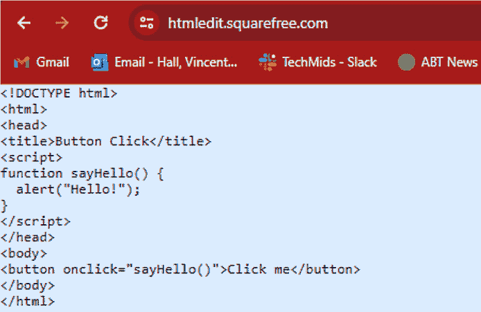
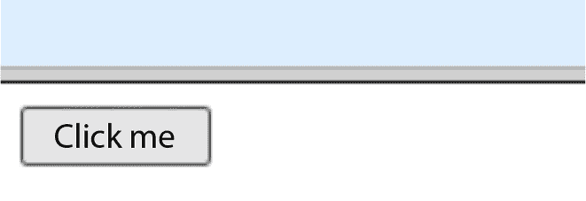
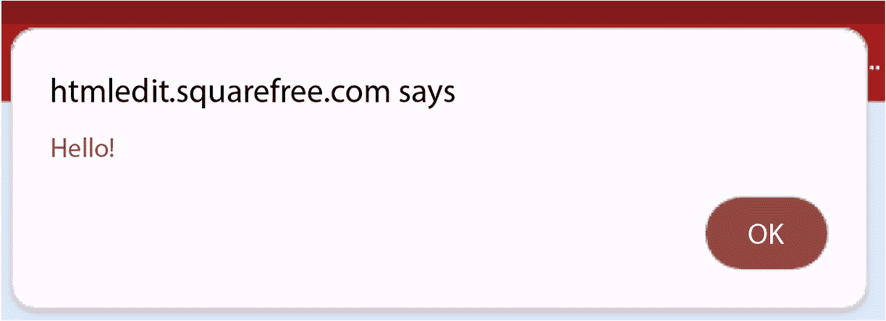
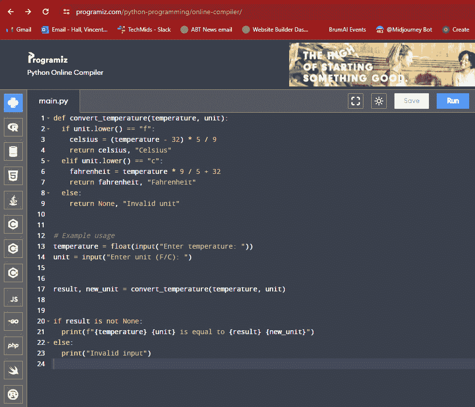
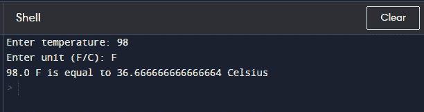
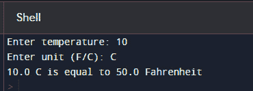
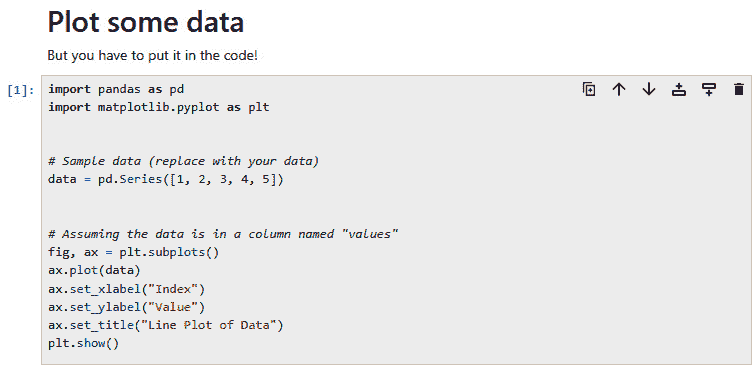
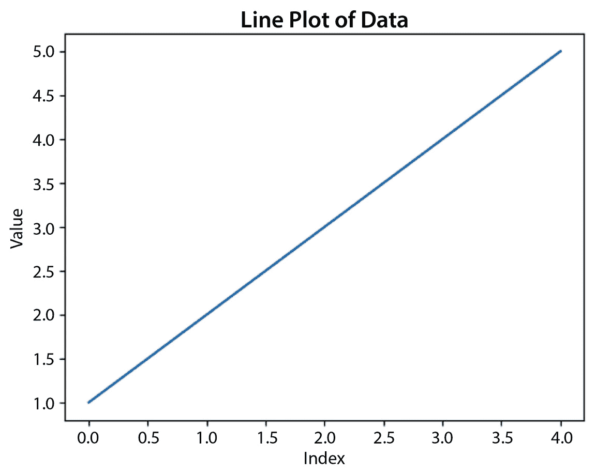
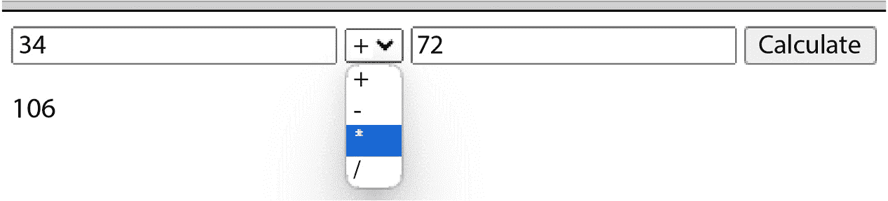

# 第二章：2  

# 利用 LLMs 的力量进行编程：一种范式转变  

在本章中，我们将揭示使用 LLMs 进行编程的优势，并探讨使用像 ChatGPT 和 Bard（现在称为 Gemini）等 LLMs 进行代码生成的可能性。在这里，你将了解如何开始获得良好的结果，认识到从 LLMs 获得的代码的局限性，并发现 LLM 在编程任务中的实际应用示例。  

这将帮助你进入一些编程和提示工程的领域。你将获得一些结果，之后逐步提升结果，最终开始编写更稳定的代码。  

我们将查看一些 LLMs 的示例提示及其生成的代码，逐步提高提示，以获得更好的代码。然而，这将需要多次提示。然后，在*第三章*中，我们将更详细地讨论修正和调试代码的整个过程。  

本章内容包括以下主题：  

+   揭示使用 LLMs 进行编程的优势  

+   规划你的 LLM 驱动编程  

+   进入 LLM 驱动的编程  

+   使其为你工作  

# 技术要求  

在本章中，你需要以下内容：  

+   需要访问一个 LLM/聊天机器人，如 GPT-4 或 Gemini；每个都需要登录。对于 GPT-4，你需要一个 OpenAI 账户；对于 Gemini，你需要一个 Google 账户。  

+   一个 Python 解释器或**集成开发环境**（**IDE**），如 Spyder、PyCharm、Visual Studio 或 Eclipse，或者一个在线解释器，如[`www.online-python.com/`](https://www.online-python.com/)或[`www.w3schools.com/python/python_compiler.asp`](https://www.w3schools.com/python/python_compiler.asp)。

+   一个 HTML 解释器，如[`htmledit.squarefree.com/`](https://htmledit.squarefree.com/)、[`onecompiler.com/html`](https://onecompiler.com/html)或[`www.w3schools.com/tryit/`](https://www.w3schools.com/tryit/)，或一个网站编辑器，如 Wix、GoDaddy、One.com 等。  

+   获取本书中的代码：[`github.com/PacktPublishing/Coding-with-ChatGPT-and-other-LLMs/tree/main/Chapter2`](https://github.com/PacktPublishing/Coding-with-ChatGPT-and-other-LLMs/tree/main/Chapter2)。  

现在，我们将进入本章，首先讨论使用 LLMs 进行编程的优势，以及你为何要这么做。  

# 揭示使用 LLMs 进行编程的优势  

为什么你会想使用像 Gemini 或 GPT-4 这样的 LLMs 来为你提供代码？  

## 简短版本  

使用 LLMs 进行编程既快捷又能轻松获得所需的代码，进行代码语言之间的转换，记录和解释代码，并与不同能力的程序员分享。  

## 更长的版本  

LLMs 在多个方面提升你的能力，包括提高生产力、加速创新、降低进入门槛和更好的协作。接下来我们将介绍最有用的优势：  

+   **大幅** **提高生产力**：  

    +   你可以节省大量时间，几乎可以立即获得与目标相关的代码示例。LLM 还很可能会给你提供有用的注释。  

    +   LLMs 还可以将代码从一种编程语言转换到另一种语言（例如，从 Python 到 C++）。

    +   LLMs 甚至可以自动生成代码文档，改善沟通与理解，方便其他开发者理解你的代码，或者如果你忘记了你当时在创建什么及其原因，帮助你回忆。

    +   **减少样板代码** : LLMs 可以自动生成重复的代码片段，节省开发者在常规任务上投入的时间和精力。

    这意味着更高的生产力。那么它如何提高创新速度呢？

+   **创新加速** : 

    +   **新想法的实验** : LLMs 可以生成替代的代码方法和解决方案，鼓励探索和创新。

    +   **探索小众和复杂算法** : LLMs 可以高效地浏览庞大的代码库，并为特定需求推荐相关算法。

    +   **快速原型设计** : LLMs 可以快速生成功能性原型，加快开发周期并测试新想法。

    +   **个性化优化** : LLMs 可以根据特定的使用案例和性能要求，建议代码优化方案。

+   **降低进入壁垒** : 

    +   **学习辅助** : LLMs 可以实时解释复杂的代码概念并回答问题，使初学者更容易进行编码。

    +   **代码补全建议** : LLMs 可以自动补全代码，提供有用的提示并减少语法错误。

    +   **个性化学习材料** : LLMs 可以根据个人需求和技能水平生成量身定制的学习材料。

    +   **数据的民主化** : LLMs 可以帮助分析和处理大数据集，使数据驱动的开发对所有人更加可及。

+   **增强协作** :

    +   **改进的沟通** : LLMs 可以简化技术解释并生成代码注释，促进开发者之间更清晰的沟通。

    +   **面向多样技能的可达性** : LLMs 可以弥合不同技能水平的开发者之间的差距，促进知识共享与合作。

    +   **团队增强** : LLMs 可以作为虚拟助手，协助开发者完成任务，使他们能专注于复杂问题。

    +   **版本控制协助** : LLMs 可以帮助跟踪更改并建议代码改进。

警告

你仍然需要了解如何编写代码以及执行与编程相关的其他任务。你还需要调试从 LLMs 获得的代码。

LLMs 可以建议已识别错误的可能修复方案，加速调试过程。

所以，这些是优势；然而，这可能并不直截了当，并且存在危险。我们将在后续章节中详细讨论这些内容：代码重构、调试和优化（ *第三章* ）、解决偏见和道德问题（ *第五章* ）、LLM 生成代码的法律环境（ *第六章* ）、安全考虑和措施（ *第七章* ）、以及使用 LLM 进行编码的限制（ *第八章* ）。

要生成良好且可操作的代码，与大多数事物一样，计划很重要。

这些是使用 LLM 来辅助编码的强大理由。在下一节中，你可以了解如何实际在编码中实现 LLM 工具，从规划阶段开始。

# 规划你的 LLM 驱动编码

要确保你有好的代码，你需要很好地计划你将需要什么。

你可能需要回答以下问题：

+   代码/软件的目的是什么？

+   谁将使用你的软件？

+   软件将在哪里使用？

+   用户如何进行交互？

+   是否需要任何数据源？

+   你将使用什么数据格式？

+   如何处理数据输入？

+   你的软件将是什么样子？GUI 还是命令行界面？

在跃入充满激情的 LLM 驱动编码世界之前，花一点时间精心规划你的项目对确保创造稳健有效的代码至关重要。这就像在建造房子之前绘制蓝图 - 你优先考虑稳定性和功能性，然后再添加最后的修饰。以下是一些需要深思熟虑的关键问题。

## 1. 理解你的目的 - 揭示为什么

每个伟大的创造都始于一个目的。你的 LLM 驱动代码也不例外。在深入技术细节之前，暂停一下，真正定义它的存在理由。你要解决什么问题？它将自动化哪些具体任务？是优化现有流程，创建全新解决方案，还是探索创新可能性？

清晰地表达你的目标就像给 LLM 一张路线图。你的愿景越清晰，它越能有效地将生成能力集中在与你愿望一致的相关代码上。把它看作是一场对话：“ *这是我想要实现的；LLM，指引我生成能让这个目标实现的代码* *。* ”

## 2. 确定你的受众 - 量身定制体验

想象一下你的软件正在使用。谁在使用它？是熟悉复杂界面的技术达人，还是寻求熟悉和直观体验的普通用户？确定你的目标受众至关重要，因为它在很大程度上塑造了 LLM 的输出。

对于技术熟练的受众，LLM 可能会侧重于生成高效且强大的代码，即使它涉及更多技术元素。但在面向普通用户时，重点则转向创建一个用户友好的界面，优先考虑清晰性和易用性。可以把它想象成设计一座建筑——你要根据受众的需求和偏好来创建一个既友好又易于访问的空间。

## 3. 定义环境 – 你的代码的“家”

想象一下你的代码有一个物理地址。它会在哪里驻留？是作为一个网络应用程序在线访问、作为一个移动应用程序在设备上随时可用，还是作为本地软件藏匿在特定硬件中？理解部署环境对 LLM 至关重要。

不同的环境有不同的需求。Web 应用需要优化在线访问性，移动应用要求便捷的可移植性和资源效率，而本地软件则可能优先考虑离线功能。每种情境都会影响 LLM 的代码生成，确保它满足特定部署环境的需求。

## 4. 用户交互映射 – 绘制导航流程图

想想用户如何与软件互动。他们是通过按钮和菜单等图形元素进行导航，还是依赖于终端类界面中的文本命令？甚至可能会有语音命令！定义交互方式会显著影响 LLM 的输出。

对于**图形用户界面**（**GUI**），LLM 优先生成元素位置、响应性和直观交互处理的代码。可以把它看作是绘制一张地图——你引导 LLM 创建清晰且高效的用户导航流程。相比之下，对于**命令行界面**（**CLI**），重点则转向文本输入、输出格式化和命令解析，帮助用户通过清晰简洁的文本命令与软件进行互动。

## 5. 确定数据源 – 喂养机器学习的“猛兽”

你的软件是否依赖外部数据来运行？也许它使用用户输入、从数据库检索信息或处理传感器读取值。如果是这样，确定数据源、它们的格式（CSV、JSON 等）以及它们将如何集成到代码中就变得至关重要。

把数据当作是驱动你的 LLM 的燃料。通过提供有关数据源的具体细节，你为 LLM 提供了它需要的知识，使其能够有效地访问和处理这些燃料。这确保了生成的代码可以正确地处理数据交互，从而实现准确且强大的功能。

## 6. 什么数据格式？

选择正确的数据格式对于与 LLM 驱动的代码无缝集成至关重要。考虑以下因素：

+   **兼容性**：你的 LLM 是否能够原生理解该格式，还是需要额外的转换步骤？像 CSV、JSON 和 XML 这样的常用格式广泛支持，而不太常见的格式可能需要额外的处理。

+   **效率**：对于大规模数据集，考虑使用空间高效的格式，如 Parquet 或 Apache DataFrames。对于频繁读写的结构化数据，关系型数据库如 MySQL 可能更为合适。分析你的数据大小、访问模式以及 LLM 兼容性，以找到最优的平衡点。

+   **可读性**：如果你需要手动理解数据，选择易于人类阅读的格式，如 CSV 或 JSON。但对于纯机器处理，更紧凑的格式可能更合适。

+   **未来需求**：考虑超越当前需求。数据格式能否随着项目的增长而良好扩展？你能否轻松地在以后添加新的数据类型？选择一种灵活且广泛采用的格式，可以避免日后遇到麻烦。

通过仔细考虑这些因素，你将选择一种数据格式，确保 LLM 和数据之间的顺畅沟通，从而有效地推动代码生成过程。

## 7. 你将如何管道化数据？

**管道**（Plumbing）指的是你的代码如何获取、处理和集成数据。在 LLM 的应用中，这变得尤为重要：

+   **数据访问机制**：你的 LLM 是否直接访问数据源（例如，数据库 API）？或者你的代码将作为中介，先获取并预处理数据，然后再传递给 LLM？根据复杂性、安全需求以及你对数据处理的控制要求来选择。

+   **数据转换**：LLM 是否要求特定的数据结构或格式？你可能需要在将数据传递给 LLM 之前对其进行转换或预处理（例如，清理和归一化）。考虑使用专门用于 AI 模型数据准备的库或工具。

+   **错误处理**：预见潜在的数据问题，如缺失值、不一致性或错误。设计代码时应优雅地处理这些问题，可能提供备用数据源或回退机制，防止 LLM 因为不良数据而生成错误的代码。

+   **灵活性和可扩展性**：随着项目的发展，数据访问和转换可能需要调整。确保你的代码模块化且具有适应性，便于更新和扩展，以适应数据源、格式或处理需求的变化。

通过有效地“管道化”数据，你为 LLM 提供了干净且有序的信息，使其能够生成稳健且准确的代码，从而增强你的 LLM 驱动的开发过程。

## 8. 可视化界面

你的软件是会有一个带有按钮、菜单和视觉元素的用户友好图形界面（GUI），还是将采用文本命令驱动的命令行界面（CLI）？选择界面就像是在决定你建筑的外观设计——它决定了用户如何与之互动并体验你的创作。以下是这种选择如何影响 LLM 的代码生成：

+   **GUI**：如果选择 GUI，LLM 将生成符合 UI 设计原则的代码。包括元素定位、响应式布局和交互处理的代码。考虑向 LLM 提供类似 GUI 或设计模型的示例，以指导其输出。

+   **CLI**：对于 CLI，LLM 将专注于文本输入、输出格式化和命令解析的代码。提供现有 CLI 工具或命令结构的示例，可以帮助 LLM 理解你所期望的用户体验。

记住，界面也会塑造用户的期望和感知。明智选择，并确保 LLM 生成的代码符合你对用户交互的愿景。

通过仔细处理这些基础元素，你为基于 LLM 的编程之旅奠定了坚实的基础。请注意：明确的目的、清晰的受众、合适的环境、直观的交互和可访问的数据源是成功的 LLM 驱动代码构建的支柱。

现在，你已经准备好深入探索技术方面，确信你的 LLM 拥有正确的路线图和工具，能够引导你实现编程目标。

现在，让我们实际获取那些代码！

# 开始进入 LLM 驱动的编程

在这里，你可以使用 LLM 为你生成代码！它可以根据一些英文内容直接为你生成一堆代码。如果你运气好，或者代码很简单且常用，代码可能会立刻就能正常工作！这将为你节省大量时间和精力！

以下是由 Gemini 提供的一系列提示及其生成的代码响应。通过这些，我们可以开始了解聊天机器人能够轻松完成的任务，以及哪些任务更加困难且容易出错。

然后，我们可以分析并学习如何改进我们的提示，并在出现错误时如何进行调试。

这是 *Prompt 1*：**请给我一个 Python 代码示例，制作一个网页按钮，当你点击按钮时，它会显示 "hello"。**

这是 HTML，因此应该将其放入网页编辑器中的网页，或者可以在 HTML 解释器中进行测试和操作，例如 [`htmledit.squarefree.com/`](https://htmledit.squarefree.com/)、[`onecompiler.com/html`](https://onecompiler.com/html) 或 [`www.w3schools.com/tryit/`](https://www.w3schools.com/tryit/)：

```py
<!DOCTYPE html>
<html>
<head>
<title>Button Click</title>
<script>
function sayHello() {
  alert("Hello!");
}
</script>
</head>
<body>
<button onclick="sayHello()">Click me</button>
</body>
</html>
```

在在线 HTML 解释器中，代码看起来是这样的：



图 2.1：这是粘贴到 HTML 解释器中的代码

我们将得到一个与下图相似的按钮。它非常简单！



图 2.2：生成的按钮

在 *图 2* *.3* 中，我们可以看到点击按钮后的输出。



图 2.3：点击从 Gemini 获得的 HTML 代码按钮后的输出

那么，第一段代码很好地运行了，似乎不需要调试。用户点击 **OK** 按钮，窗口消失了。你需要再次点击第一个按钮 **Click me** 才能再次弹出窗口。这部分也运行正常。

希望我们已经学到了（是的，我也是），LLM 聊天机器人可以提供一些不错的代码来做简单的事情，如果你把它放在正确的位置来执行该代码，它可以运行。

我通常不会将所有代码放在页面上，因为这样会变得笨重而且太啰嗦，对于一本书来说。

您可以从本书的 Packt GitHub 存储库获取代码：[`github.com/PacktPublishing/Coding-with-ChatGPT-and-Other-LLMs/`](https://github.com/PacktPublishing/Coding-with-ChatGPT-and-Other-LLMs/) 。

这段代码结合了 HTML 和 JavaScript：

+   HTML 创建一个带有文本 **Click me** 的按钮

+   **sayHello()** JavaScript 函数在点击按钮时显示带有消息 **Hello!** 的警报框

接下来，我们有巴德（现已被双子座替代）的第二个提示，你将看到一点数学是必要的。

这里是 *Prompt 2* ：**请给我一个 Python 代码示例，制作一个简单的脚本，如果输入华氏度，它给出摄氏度，如果输入摄氏温度，它给出华氏度。**

这将需要 Python 解释器或 IDE。

复制以下块中的代码，运行它，看看它的运行效果：

```py
def convert_temperature(temperature, unit):
    if unit.lower() == "f":
        celsius = (temperature - 32) * 5 / 9
        return celsius, "Celsius"
    elif unit.lower() == "c":
        fahrenheit = temperature * 9 / 5 + 32
        return fahrenheit, "Fahrenheit"
    else:
        return None, "Invalid unit"
# Example usage
temperature = float(input("Enter temperature: "))
unit = input("Enter unit (F/C): ")
result, new_unit = convert_temperature(temperature, unit)
if result is not None:
    print(f"{temperature} {unit} is equal to {result} {new_unit}")
else:
    print("Invalid input")
```

在 *Figure 2* *.4* 中，我们可以看到在线解释器中的代码。



图 2.4：华氏度和摄氏度转换器代码

接下来，在 *Figure 2* *.5* 中，我们可以看到代码执行一次：



图 2.5：F 到 C 和 C 到 F 温度转换脚本；这是网页上图 2.4 右边的位置

下图展示了在命令行中进行的摄氏度到华氏度转换：



图 2.6：命令行中的摄氏度转华氏度转换代码

我们可以从这里学到什么？再次证明，LLM 聊天机器人的简单代码片段第一次运行就可以很好地工作！这次，代码是 Python。

我们以后会改进这段代码；它非常简单，但我们可能可以使其更用户友好：易于使用和更漂亮。

这是 *Prompt 3* ：**一个 Jupyter 笔记本的代码块，如果给定一列数据，将显示绘图。**

这是针对 Jupyter Notebook 的，之前叫做 IPython Notebook，因此这些文件的格式是 **.ipynb**。你可以在 Anaconda Python 发行版中获得 Jupyter Notebook。如果你想更快速地测试这段代码，你可以使用 Google Colab（[`colab.research.google.com`](https://colab.research.google.com)）或 Jupyter Notebook 本身：[`jupyter.org/try-jupyter/notebooks/?path=notebooks/Intro.ipynb`](https://jupyter.org/try-jupyter/notebooks/?path=notebooks/Intro.ipynb)。

这些笔记本通过将 Python 代码放入单元格中来工作；见 *图 2* *.7*。

这是 Python 代码；如果你不知道如何使用这些笔记本，可以搜索 Jupyter Notebook 或 Google Colaboratory，当然也可以使用像 GPT-4 或 Gemini 这样的 LLM。

```py
import pandas as pd
import matplotlib.pyplot as plt
# Sample data (replace with your data)
data = pd.Series([1, 2, 3, 4, 5])
# Assuming the data is in a column named "values"
fig, ax = plt.subplots()
ax.plot(data)
ax.set_xlabel("Index")
ax.set_ylabel("Value")
ax.set_title("Line Plot of Data")
plt.show()
```

在 *图 2* *.7* 中，你会看到笔记本中的代码，以及标题和额外的文字。介绍你的代码块或单元格总是个好主意。



图 2.7：在 Jupyter Notebook 中的 Python 代码，给定一列数据后，应绘制数据

*图 2* *.8* 显示了输出图表：



图 2.8：来自 Prompt 3 的代码生成的图表

好吧，这个图表挺无聊的，但现在你知道如何在 Python 或 Jupyter Notebook 中制作图表了。如果你之前不知道，现在的章节和 LLM 已经给出了一些提示。

这是 *Prompt 4*：**一个脚本，会要求你加载 bench，然后帮助你浏览最终显示的图像。**

加载 bench？那是什么意思？

我弄错了提示！我说得不好，或者 AI 没有听懂，但它还是弄明白了我想要什么，并给了我代码！哈哈！

这是 Python 代码，旨在放入可以运行 Python 并加载如 tkinter 这类代码库的 IDE 中。因此，必须在你使用的代码环境中安装这个代码库。

让我们看看它在某个在线 Python 解释器中是否能工作……这部分内容在 *第三章* 中继续，在 Prompt 4 中。需要进行相当多的调试，这一章就是关于调试和其他内容的，所以过程在那儿。

以下是最终的代码，它来自 Gemini 和 Stack Overflow，以及我确保安装了相关代码库的结果。谷歌在 2024 年 2 月用 Gemini 替代了 Bard LLM。这段代码从 Bard 开始，最终由 Gemini 完成：

```py
from tkinter import Tk, Label, Button, filedialog
from PIL import Image, ImageTk
# Initialize Tkinter window
root = Tk()
# Create a label to display the image
label = Label(root)
label.pack()
# Define a function to load an image
def load_image():
    filename = filedialog.askopenfilename(title="Select an image", 
        filetypes=[("Image Files", "*.jpg;*.png")])
    if filename:
        try:
            # Open the image using PIL
            img = Image.open(filename)
            # Convert the image to Tkinter format
            tk_img = ImageTk.PhotoImage(img, master=root)
            # Update the label with the new image
            label.config(image=tk_img)
            label.image = tk_img  # Keep a reference to the image to prevent garbage collection
        except Exception as e:
            print("Error loading image:", e)
# Create a button to trigger the image loading
button = Button(root, text="Load Image", command=load_image)
button.pack()
# Run the window's main loop
root.mainloop()
```

这应该能很好地工作。我希望你从这里以及 *第三章*（*Prompt 4 调试*）的相关部分中学到的是，这些 LLM 可以生成相当不错的代码，但一旦代码变得稍微复杂一些，比如涉及到代码库和加载文件，代码通常需要调整：调试、检查在线论坛如 Stack Overflow、思考代码、测试它并反复迭代。

所以，你仍然需要编程技能。到 2024 年初，LLM 还不能处理复杂的代码。

这是 *Prompt 5* ：**显示图形用户界面的网页的 HTML 代码。但是，这个计算器是一个真正有效的计算器，点击按钮后可以实际运算** **这些按钮**

再次提醒，我稍微弄错了提示，但 LLM 仍然明白了意思。

了解 LLM 在一定程度上能够管理和理解用户输入中的错误，令人感到放心。

Bard 有时会给出多个版本供你选择。在这里，它提供了 HTML 和 Flask（Python）版本。HTML 和 JavaScript 脚本工作得很好，所以我们不需要 Flask 版本。

将其放入网站构建器或 HTML 解释器中：

```py
<!DOCTYPE html>
<html>
<head>
<title>Calculator</title>
</head>
<body>
<input type="number" id="num1" required>
<select id="operator">
  <option value="+">+</option>
  <option value="-">-</option>
  <option value="*">*</option>
  <option value="/">/</option>
</select>
<input type="number" id="num2" required>
<button type="button" onclick="calculate()">Calculate</button>
<p id="result"></p>
<script>
function calculate() {
  const num1 = parseFloat(document.getElementById("num1").value);
  const num2 = parseFloat(document.getElementById("num2").value);
  const operator = document.getElementById("operator").value;
  let result;
  switch (operator) {
    case "+":
      result = num1 + num2;
      break;
    case "-":
      result = num1 - num2;
      break;
    case "*":
      result = num1 * num2;
      break;
    case "/":
      if (num2 !== 0) {
        result = num1 / num2;
      } else {
        result = "Division by zero";
      }
      break;
    default:
      result = "Invalid operator";
  }
  document.getElementById("result").textContent = result;
}
</script>
</body>
</html>
```

*图 2.9* 显示了计算器的 GUI：



图 2.9：界面看起来是这样的

计算器非常简单，你可以输入数字或点击出现的小上下箭头。你还可以从下拉菜单中选择运算符 (**+** 、**-** 、***** 和 **/**)。这不是科学计算器，只是一个非常简单的算术计算器。

这段代码是 HTML，并调用了嵌入在 **<script>** 标签中的 JavaScript 来进行计算。因此，这不是纯粹的 HTML 代码。HTML 主要用于实现 GUI 部分。

好消息是，第二次尝试成功了。虽然有一个小的 bug。我将错误信息复制给了 LLM，它给出了解决方案。这个调试过程非常迅速，Gemini 给了我可用的代码。*第三章*是调试章节，你可以在该章节看到*第二章*代码的调试过程。

接下来，我们将 *Prompt 5* 转换为一个 Flask 应用（**app.py**），并使用 Python 代码。

这段代码应该在支持 Python 的 IDE 中运行：

```py
from flask import Flask, render_template
#app = Flask(__name__, template_folder=os.path.abspath('C:/Users/mutan/code/Python Script/Prompt5/templates/'))
app = Flask(__name__)#, template_folder='/templates/')
print(app.template_folder)
@app.route('/')
def index():
    return render_template('index.html')
if __name__ == '__main__':
    app.run(debug=True)
```

这是 HTML 代码（**templates/index.html**）：

```py
<!DOCTYPE html>
<html>
<head>
    <title>Calculator</title>
    <style>
        .calculator {
            width: 200px;
            margin: 0 auto;
            text-align: center;
        }
        .display {
            width: 100%;
            height: 40px;
            font-size: 24px;
            text-align: right;
            padding: 5px;
            box-sizing: border-box;
        }
        .buttons {
            display: grid;
            grid-template-columns: repeat(4, 1fr);
            grid-gap: 5px;
        }
        button {
            width: 100%;
            height: 40px;
            font-size: 18px;
        }
    </style>
</head>
<body>
    <div class="calculator">
        <input type="text" class="display" disabled>
        <div class="buttons">
            <button onclick="appendToDisplay('7')">7</button>
            <button onclick="appendToDisplay('8')">8</button>
            <button onclick="appendToDisplay('9')">9</button>
            <button onclick="appendToDisplay('/')">/</button>
            <button onclick="appendToDisplay('4')">4</button>
            <button onclick="appendToDisplay('5')">5</button>
            <button onclick="appendToDisplay('6')">6</button>
            <button onclick="appendToDisplay('*')">*</button>
            <button onclick="appendToDisplay('1')">1</button>
            <button onclick="appendToDisplay('2')">2</button>
            <button onclick="appendToDisplay('3')">3</button>
            <button onclick="appendToDisplay('-')">-</button>
            <button onclick="appendToDisplay('0')">0</button>
            <button onclick="appendToDisplay('.')">.</button>
            <button onclick="calculate()">=</button>
            <button onclick="clearDisplay()">C</button>
        </div>
    </div>
    <script>
        let display = document.querySelector('.display');
        let displayValue = '';
        function appendToDisplay(value) {
            displayValue += value;
            display.value = displayValue;
        }
        function calculate() {
            try {
                displayValue = eval(displayValue);
                display.value = displayValue;
            } catch (error) {
                display.value = 'Error';
            }
        }
        function clearDisplay() {
            displayValue = '';
            display.value = '';
        }
    </script>
</body>
</html>
```

要运行此代码，请按照以下步骤操作：

1.  将 Flask 代码保存为 **app.py**，并放在一个简单、短的文件路径中。

1.  创建一个 **templates** 文件夹，并将 HTML 代码保存为 **index.html**。

1.  使用**python app.py**运行 Flask 应用。

1.  打开你的浏览器并访问 **http://localhost:5000**。

你现在应该能在网页上看到一个功能齐全的计算器 GUI。当你点击按钮时，相应的值将添加到显示输入框中。点击 **=** 按钮会计算表达式并显示结果。**C** 按钮会清空显示。

重要提示

该实现使用了 JavaScript 中的 **eval** 函数来计算表达式，但如果直接接受用户输入，这可能会带来安全风险。在生产环境中，应该使用更安全的方法或专用库来进行表达式评估。

## 返回到 *Prompt 5* 的 HTML 代码

这段 HTML 代码没有提供可运行的代码，因此需要调试。

哇，这里有很多 **if** 、**else** 和 **elif** 语句！

关于这段代码的调试，请参见*第三章*，在*提示 5* *调试*部分。

## 回到 Prompt 5 的 Flask 代码

在 Claude 3 Sonnet 的帮助下，这段代码已被调试并开始正常运行。代码在哪里？

同样，你可以从本书的 Packt GitHub 仓库中获取这段代码，链接在此：[`github.com/PacktPublishing/Coding-with-ChatGPT-and-Other-LLMs/tree/main/Chapter2`](https://github.com/PacktPublishing/Coding-with-ChatGPT-and-Other-LLMs/tree/main/Chapter2)。

这对于初学者来说是可以的，但这并不出色。我们需要更高质量的代码，而且它不会立刻就能正常工作。会有 LLM 没有预见到的 BUG。

正如 Bard 在每个代码片段底部所说的，“*小心使用代码。* *了解更多*。”

这会引导你到一个关于当前引擎的常见问题页面，并告诉你应该期待什么。

如何让这个过程和这段代码变得更好？我们将在下一节讨论这个问题。

# 让它为你工作

以下是一些让 LLM 编程更适合你的技巧：

+   明确你希望代码做什么以及看起来是什么样子的。

+   精通提示工程。精心设计你的提示。你提供的指令越清晰、越详细，LLM 就越能理解你的意图并生成相关代码。可以把提示看作是精确的问题，指导 LLM 创建你想要的解决方案。

+   告诉 LLM 你使用的是哪一版本的编程语言，以及你使用的是哪种 IDE/环境进行编码。例如，我一直在使用 Python 3.10 版本和 Spyder IDE。

+   将任务拆解成更小的部分。不要让 LLM 处理复杂的、多步骤的任务。相反，将它们拆解成更小、更易管理的子任务。这样可以提供更专注的提示，便于更轻松地排查问题和改进。

+   通过多次迭代，持续改进。利用 LLM 检查你如何改进，并让它像一个好的顾问一样，向你提问关于你想要的内容。不要简单接受第一次生成的代码。把它当作一个起点，并给 LLM 提供建设性的反馈。解释哪些方面做得好，哪些需要改进。这个反馈循环帮助 LLM 更好地理解你的需求，并优化代码输出。

+   利用代码示例和文档。尽可能为 LLM 提供相关的代码示例、库或文档引用。这为 LLM 的代码生成提供了路线图，影响其在你所期望的背景下的代码输出。

+   将 LLM 的能力与您的专业知识结合。记住，LLM 是强大的工具，但它们不能取代你的编码知识。利用你的专业知识来策划提示、评估输出，并将 LLM 的建议融入到你现有的编码实践中。

+   探索不同的 LLM 和工具。并非所有 LLM 都一样。尝试不同的选项，探索专门为 LLM 辅助编程设计的工具。找到最适合你的需求和编程风格的组合。

+   拥抱学习过程。请记住，基于 LLM 的编码仍在发展中。拥抱学习旅程，实验，并且不要害怕犯错。与 LLM 的每次互动都有助于您的理解，并帮助您释放其全部潜力。

+   测试代码，看它是否按照你的意图运行；这是最重要的阶段。

就像任何代码一样，严格的测试是必不可少的。不要假设由 LLM 生成的代码是完美无缺的。让它经过考验，识别和解决任何错误，并在部署之前验证其功能。

我们将在*第三章* 中深入探讨调试。

# 总结

本章介绍了如何使用 LLM 编码。您探索了潜在的好处，学习了开始的实际步骤（规划和迭代），并获得了有效使用 LLM 的宝贵见解。请记住，这只是可以与一些建议一起完成的最简单的示例。

还有很多东西需要学习才能做得很好，但这可以帮助你入门。我们需要理解如何处理有 bug 并且不按我们意图运行的代码。

我们可能希望改进代码的速度或内存使用。

GPT-4、Gemini 等等并不天然知道你想要达到的目标或者你想要保存或充分利用的资源。

在*第三章* 中，我们将深入探讨调试、代码重构和优化。
