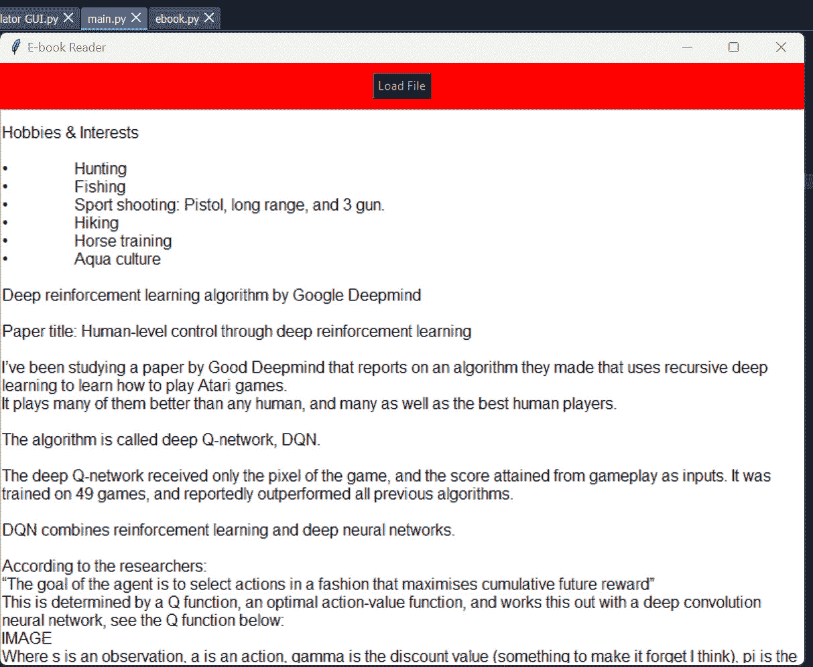

# 第三章：代码重构、调试和优化：实践指南

本章重点讲解如何使用 LLM 进行代码重构、调试和优化。这还包括解读错误信息，解释不熟悉的代码块及其可能产生的错误。LLM 可以帮助重构代码，提高可维护性和可读性。LLM 还可以训练以识别代码中反复出现的问题。到本章结束时，你将能够使用 ChatGPT 进行配对编程，帮助你理解代码，以及导致 bug 的原因和如何修复它们。

本章涉及以下主题：

+   处理错误代码 - 调试

+   代码重构

+   用 ChatGPT 解释代码

+   测试代码

# 技术要求

本章所需的工具：

+   需要访问 LLM/chatbot，如 GPT-4 或 Gemini，这两者都需要登录。GPT-4 需要 OpenAI 账户，Gemini 需要 Google 账户。

+   一个 Python IDE，如 Spyder、IDLE、PyCharm、Eclipse 或 Visual Studio。

+   在线解释器在这里不够用。

+   一个 HTML 解释器，可以在 [`htmledit.squarefree.com/`](https://htmledit.squarefree.com/)，[`onecompiler.com/html`](https://onecompiler.com/html) 或 [`www.w3schools.com/tryit/`](https://www.w3schools.com/tryit/) 找到，或者一个网站编辑器，如 Wix、GoDaddy 或 One.com。

+   获取本书中的代码： [`github.com/PacktPublishing/Coding-with-ChatGPT-and-other-LLMs/tree/main/Chapter3`](https://github.com/PacktPublishing/Coding-with-ChatGPT-and-other-LLMs/tree/main/Chapter3)。

现在，我们将通过处理错误代码来深入探讨本章的核心内容。几乎所有你编写的或从 LLM 获取的脚本或代码片段在运行时都会出现错误。如果第一次就完美无缺，要么它非常简单，要么就是你非常幸运！

# 处理错误代码 - 调试

正如我所说，你很少能得到一段完美的代码。*第二章*有一些，但那些例子其实非常简单，仅仅是为了让我们从“Hello World”级别的代码开始，并启动代码的基础。

所以，你得自己弄明白，理解其中所有内容，去一些论坛，如 Stack Overflow，向熟练的朋友/同事求助，或者问问 AI，如 Gemini 或 GPT-4 系列。

让我们调试一下来自*第二章*的代码。*提示 1-3* 没问题，但 *提示 4* 需要改进。

## 提示 4 调试

*提示 4* : **一个脚本，要求你加载 bench，然后帮助你浏览并最终显示图像。**

再次说明，我说了**bench**，所以那并不合适，但 Gemini 正确地理解了我的意思。

然而，代码并不完全可用。

重要说明

别运行这段代码，它不起作用，继续阅读。

请原谅我，我只是想展示它并非立即完美：

```py
from tkinter import Tk, filedialog, Label, Button
# Create the main window
root = Tk()
root.title("Image Browser")
# Function to select an image
def select_image():
    filename = filedialog.askopenfilename(
        filetypes=[("Image Files", "*.jpg;*.png")])
    if filename:
        # Display the selected image path
        label = Label(root, text="Image selected: " + filename)
        label.pack()
# Create the button to select an image
select_button = Button(root, text="Select Image", 
    command=select_image)
select_button.pack()
# Start the main loop
root.mainloop()
```

在*图 3* *.1*中，我们将看到在免费的在线标准 Python 解释器中请求代码库时发生了什么。


图 3.1：在免费的 Python 解释器中请求代码库（失败）

它在 Colab 中能工作吗？请参见*图 3* *.2*中的结果。


图 3.2：尝试在 Colab 中加载代码库（失败）

不过，它确实提供了比常规解释器更多的错误信息。

向 Bard/Gemini 询问如何安装库。

重要说明

截至 2024 年 2 月初，[Bard.Google.com](https://Bard.Google.com)会重定向到[Gemini.google.com](https://Gemini.google.com)。

Gemini 告诉我们，我们需要一个具有图形界面或已连接物理显示器的环境，因为它在云端运行。

Gemini 建议使用 Kaggle 笔记本，但那也是一个基于云的环境。

所以，我们必须在本地机器（家庭或工作 PC/Linux/Max）上运行它，如果之前没有安装 IDE，可能需要先安装。

我使用 Anaconda，它包括 Spyder 和 Jupyter Notebook（以及 Pylab），让我们在其中查看这个代码。我还需要确保已经安装了**tkinter**。

以下是一些在 Anaconda 中安装代码库的链接：[`docs.anaconda.com/free/working-with-conda/packages/install-packages/`](https://docs.anaconda.com/free/working-with-conda/packages/install-packages/) 或 [`francescolelli.info/python/install-anaconda-and-import-libraries-into-the-ide`](https://francescolelli.info/python/install-anaconda-and-import-libraries-into-the-ide)。

你可以使用**conda**或**pip**。我同时使用两者。

现在在 Spyder 中工作，这是 Anaconda 的一部分，逐行运行，我们得到以下代码：

```py
select_button = Button(root, text="Select Image", 
    command=select_image)
```

上述行给出了以下错误信息：

```py
NameError: name 'Button' is not defined.
```

所以，我去 Gemini 请求帮助，给出代码行和错误信息。

Gemini 告诉我，我需要从**tkinter**导入**Button**模块。

将第一行更改为以下内容：

```py
from tkinter import Tk, filedialog, Label, Button # Import Button class
```

现在，那部分功能正常。

所以，Gemini 给了我相当不错的代码，但遗漏了从**tkinter**导入**Button**。不过，它在收到错误反馈后成功自我修正。

当代码执行时，这些小窗口会弹出，如*图 3* *.3*所示。


图 3.3：询问用户要加载哪个图像的框/窗口——这些是 Gemini 根据提示 4 给出的代码输出。

当我浏览并尝试使用第一个小**选择图像**窗口加载图像时，输出仅为图像的文件路径。两个窗口都没有显示任何新的内容。

第二次运行代码时只有一个窗口，它只显示文件路径。好的，在这种时候，我们需要回到 Gemini/LLM 询问。Gemini 说我也需要导入**ImageTk**模块。

然后，在**select_image**函数中，更改代码如下：

```py
def select_image():
    filename = filedialog.askopenfilename(
        filetypes=[("Image Files", "*.jpg;*.png")])
    if filename:
        # Load the image
        img = ImageTk.PhotoImage(file=filename)

        # Create a label with the image
        label = Label(root, image=img)
        label.pack()
```

这是新的内容从下面的**if filename:**开始。这是 Python，所以确保缩进正确！

根据 Gemini 的说法，我需要安装 Pillow：

```py
pip install Pillow
```

然而，它已经安装好了。我需要重新启动内核。我需要使用以下语句：

```py
from PIL import ImageTk and Image
```

但是**Image**没有被使用。所以，忘记导入**Image**。代码仍然不能加载图片。

Gemini/LLM 给了大量建议来尝试解决这个问题。

我最终在 Stack Overflow 找到了一个基本的图像加载代码，带有硬编码的文件路径和名称，并请求 Gemini 添加一个浏览图像的按钮。这起作用了（*Stackoverflow_image_loading*）：

```py
import matplotlib
matplotlib.use("TkAgg")
from matplotlib.backends.backend_tkagg import FigureCanvasTkAgg
import matplotlib.pyplot as plt
import Tkinter as tk
from PIL import Image, ImageTk
fig = plt.figure()
root = tk.Tk()
image = Image.open("background.png")
photo = ImageTk.PhotoImage(image)
label = tk.Label(root, image=photo)
label.image = image
label.pack()
root.mainloop()
```

来自 Stack Overflow 和 Gemini 的最终代码如下：

```py
def load_image():
    filename = filedialog.askopenfilename(
        title="Select an image",
        filetypes=[("Image Files", "*.jpg;*.png")]
    )
    if filename:
        try:
            # Open the image using PIL
            img = Image.open(filename)
            # Convert the image to Tkinter format
            tk_img = ImageTk.PhotoImage(img, master=root)
            # Update the label with the new image
            label.config(image=tk_img)
            label.image = tk_img  # Keep a reference to the image to prevent garbage collection
        except Exception as e:
            print("Error loading image:", e)
# Create a button to trigger the image loading
button = Button(root, text="Load Image", command=load_image)
button.pack()
# Run the window's main loop
root.mainloop()
```

这是 Gemini 对 Stack Overflow 代码所做的解释：

```py
"I added several key parts to the code to enable the button to load an image using the browsing option:
1\. Button Creation:
I introduced a Button widget named button with the text "Load Image." I linked the button with the load_image function using the command attribute. This ensures that clicking the button triggers the defined function.
2\. load_image Function:
This function handles the image loading process triggered by the button click. It uses filedialog.askopenfilename to display a file selection dialog for choosing an image. If a file is selected, it uses Image.open from PIL to open the image. Then, it converts the image to a Tkinter-compatible format using ImageTk.PhotoImage.
Importantly, I added master=root as an argument to ImageTk.PhotoImage. This is crucial for proper interaction between the image and the Tkinter window, ensuring the image persists within the GUI.
The updated image is then assigned to the label widget's image property using label.config(image=tk_img).
To prevent the image from being garbage collected prematurely, I also added label.image = tk_img. The function includes an except block to handle potential errors during image processing.
3\. Modifications to the Label:
While not strictly necessary for the button functionality, I modified the Label initialization by initializing it without an image initially (label = Label(root)). This ensures the label is ready to display the loaded image later on.
By combining these elements, the button effectively initiates the image selection process, loads the chosen image, converts it to the appropriate format, and displays it within the designated Label widget."
```

注意在 Gemini 编码时

告诉 LLM 您正在使用的 Python 版本是有帮助的。

现在，让我们看看*Chapter 2*中*Prompt 5*的代码。

## Prompt 5 调试 - HTML

重要说明

不要运行这段确切的代码，它不起作用，继续阅读。

来自 Gemini（之前是 Bard）的原始代码如下：

```py
<!DOCTYPE html>
<html>
<head>
<title>Calculator</title>
</head>
<body>
<form action="{{ url_for 'calculate' }}" method="POST">
  <input type="number" name="num1" required>
  <select name="operator">
<option value="+">+</option>
<option value="-">-</option>
<option value="*">*</option>
<option value="/">/</option>
  </select>
  <input type="number" name="num2" required>
  <button type="submit">Calculate</button>
</form>
<p>{{ result }}</p>
</body>
</html>
```

这对**if**、**else**和**elif**语句有很大依赖！

这没有起作用，并给出了我们在*Figure 3* *.4*中看到的结果：计算器的界面，从*Chapter 2*复制。


图 3.4：由 Gemini 生成的计算器界面（这也是图 2.9）

*Figure 3* *.5*显示了来自*Prompt 5*的计算器输出。


图 3.5：由 Prompt 5 HTML 代码生成的计算器输出

我问了 Gemini，它给了我一个新的代码和这个新的提示：**请更正这个 HTML 代码以在 C 和 F 之间转换温度**。这不起作用——当我尝试获取计算时它会崩溃并且说：

```py
"Unfortunately, HTML alone cannot execute calculations or handle forms without the support of a server-side language like Python, JavaScript, or PHP. The error you encountered is likely due to this limitation."
```

然后，Gemini 给了我这个：

```py
"This option uses JavaScript to perform calculations directly in the browser without relying on a server. You can utilize JavaScript libraries like Math.js or libraries specifically designed for calculators.
Here's an example with JavaScript:"
<!DOCTYPE html>
<html>
<head>
<title>Calculator</title>
</head>
<body>
<input type="number" id="num1" required>
<select id="operator">
  <option value="+">+</option>
  <option value="-">-</option>
  <option value="*">*</option>
  <option value="/">/</option>
</select>
<input type="number" id="num2" required>
<button type="button" onclick="calculate()">Calculate</button>
<p id="result"></p>
<script>
function calculate() {
  const num1 = parseFloat(document.getElementById("num1").value);
  const num2 = parseFloat(document.getElementById("num2").value);
  const operator = document.getElementById("operator").value;
  let result;
  switch (operator) {
case "+":
     result = num1 + num2;
     break;
case "-":
     result = num1 - num2;
     break;
case "*":
     result = num1 * num2;
     break;
case "/":
     if (num2 !== 0) {
      result = num1 / num2;
     } else {
      result = "Division by zero";
     }
     break;
default:
     result = "Invalid operator";
  }
  document.getElementById("result").textContent = result;
}
</script>
</body>
</html>
```

这是最终的代码，在 HTML 环境中运行正常。

尽管这段代码给我一个舍入误差；要注意这些并测试它们，正如您可以在*Figure 3* *.6*中看到的那样。


图 3.6：简单的 GUI 计算器运行正常，但精度限制为 16 位小数

## Prompt 5 调试 - Python/Flask

重要说明

不要运行这段确切的代码，因为它不起作用；请原谅我，我试图表明它不是立即精确的。

来自 Gemini（之前是 Bard）的原始代码如下：

```py
from flask import Flask, render_template, request
app = Flask(__name__)
@app.route('/', methods=['GET', 'POST'])
def calculate():
if request.method == 'POST':
      num1 = float(request.form['num1'])
      operator = request.form['operator']
      num2 = float(request.form['num2'])
      if operator == "+":
           result = num1 + num2
      elif operator == "-":
           result = num1 - num2
      elif operator == "*":
           result = num1 * num2
      elif operator == "/":
           if num2 != 0:
                 result = num1 / num2
           else:
                 result = "Error: Division by zero!"
     else:
           result = "Invalid operator"
else:
     result = ""
return render_template('calc.html', result=result)
if __name__ == '__main__':
app.run(debug=True)
```

我把这个放入 Spyder 中，它给了我错误信息：

```py
* Serving Flask app 'prompt 5 flask calculator gui'
* Debug mode: on
WARNING: This is a development server. Do not use it in a production deployment. Use a production WSGI server instead.
* Running on http://127.0.0.1:5000
Press CTRL+C to quit
* Restarting with watchdog (windowsapi)
An exception has occurred, use %tb to see the full traceback.
SystemExit: 2
%tb
Traceback (most recent call last):
  File ~\anaconda3\lib\site-packages\spyder_kernels\py3compat.py:356 in compat_exec
    exec(code, globals, locals)
  File g:\.shortcut-targets-by-id\0b9nzz3j6kd37uy1nvfhfcmjpemc\business gd build\packt\the book  coding with chatgpt and other llms\code\chapter 2\prompt 5 flask calculator gui.py:58
    app.run(debug=True)
  File ~\anaconda3\lib\site-packages\flask\app.py:1188 in run
    run_simple(t.cast(str, host), port, self, **options)
  File ~\anaconda3\lib\site-packages\werkzeug\serving.py:1090 in run_simple
    run_with_reloader(
  File ~\anaconda3\lib\site-packages\werkzeug\_reloader.py:444 in run_with_reloader
    sys.exit(reloader.restart_with_reloader())
SystemExit: 2
```

Gemini 说可能是语法错误，或者是 HTML 的文件路径问题。我应该将 Gemini 给我的 HTML 代码部分保存为名为 **calc.html** 的文件，这样 Flask 应用才能加载它。但这在 Gemini 的回答中并不明显。

我将 HTML 代码放入同一文件夹中的一个文件，名为 **calc.html**，然后再次在 Spyder 中运行 Flask 代码。结果没有成功。

我提供了输出，包括错误信息和完整的追踪信息。我通过使用 **%tb** 获得了完整的追踪信息。Gemini 给出了许多建议：Spyder 的监控功能、模板重载问题、IDE 特定的冲突、代码相关的错误，或者在 Spyder 外进行测试。

我为 Claude 3 Sonnet 使用了一个非常相似的提示：**请让这段代码正常运行，它应该是一个 Flask 实现的网页代码，能够显示一个图形用户界面。一个真正能用的计算器，只要你点击** **按钮**。

Claude 3 Sonnet 给了我这个：

```py
"To create a Flask implementation of a web page with a functional calculator GUI, we'll need both Flask code for the server-side and HTML/JavaScript for the client-side. Here's an example that should work:"
Flask code (app.py)
from flask import Flask, render_template
#app = Flask(__name__, template_folder=os.path.abspath('C:/Users/mutan/code/Python Script/Prompt5/templates/'))
app = Flask(__name__)#, template_folder='/templates/')
print(app.template_folder)
@app.route('/')
def index():
    return render_template('index.html')
if __name__ == '__main__':
    app.run(debug=True)
HTML Code (templates/index.html)
<!DOCTYPE html>
<html>
<head>
    <title>Calculator</title>
    <style>
        .calculator {
            width: 200px;
            margin: 0 auto;
            text-align: center;
        }
        .display {
            width: 100%;
            height: 40px;
            font-size: 24px;
            text-align: right;
            padding: 5px;
            box-sizing: border-box;
        }
        .buttons {
            display: grid;
            grid-template-columns: repeat(4, 1fr);
            grid-gap: 5px;
        }
        button {
            width: 100%;
            height: 40px;
            font-size: 18px;
        }
    </style>
</head>
<body>
    <div class="calculator">
        <input type="text" class="display" disabled>
        <div class="buttons">
            <button onclick="appendToDisplay('7')">7</button>
            <button onclick="appendToDisplay('8')">8</button>
            <button onclick="appendToDisplay('9')">9</button>
            <button onclick="appendToDisplay('/')">/</button>
            <button onclick="appendToDisplay('4')">4</button>
            <button onclick="appendToDisplay('5')">5</button>
            <button onclick="appendToDisplay('6')">6</button>
            <button onclick="appendToDisplay('*')">*</button>
            <button onclick="appendToDisplay('1')">1</button>
            <button onclick="appendToDisplay('2')">2</button>
            <button onclick="appendToDisplay('3')">3</button>
            <button onclick="appendToDisplay('-')">-</button>
            <button onclick="appendToDisplay('0')">0</button>
            <button onclick="appendToDisplay('.')">.</button>
            <button onclick="calculate()">=</button>
            <button onclick="clearDisplay()">C</button>
        </div>
    </div>
    <script>
        let display = document.querySelector('.display');
        let displayValue = '';
        function appendToDisplay(value) {
            displayValue += value;
            display.value = displayValue;
        }
        function calculate() {
            try {
                displayValue = eval(displayValue);
                display.value = displayValue;
            } catch (error) {
                display.value = 'Error';
            }
        }
        function clearDisplay() {
            displayValue = '';
            display.value = '';
        }
    </script>
</body>
</html>
```

要运行此代码，请按照以下步骤操作：

1.  将 Flask 代码保存为 **app.py**，并保存在一个简单、短小的文件路径中。

1.  创建一个 **templates** 文件夹，并将 HTML 代码保存为 **index.html** 文件。

1.  使用 **python app.py** 运行 Flask 应用。

1.  打开浏览器并访问 **http://localhost:5000**。

现在，你应该能在网页上看到一个功能正常的计算器 GUI。当你点击按钮时，相应的值会添加到显示输入框中。点击 **=** 按钮会计算表达式并显示结果。**C** 按钮会清除显示。

重要提示

请注意，此实现使用了 JavaScript 中的 **eval** 函数来计算表达式，如果你直接接受用户输入，这可能会带来安全风险。在生产环境中，你应该使用更安全的方法或专门的库来进行表达式计算。

这段代码运行了，但在我告诉 Claude 3 Sonnet 我的文件路径之前，它一直崩溃。Claude 提示文件路径太长且复杂。因此，我将文件移到了一个更简单的路径 **C:/Users/username/code/** 文件夹中，但我必须将斜杠更改为正斜杠，像这里一样，而不是 Windows 资源管理器中使用的反斜杠（文件夹程序）。

它停止崩溃了，在检查文件路径和确保我处在正确的目录后，并再次询问 Claude，它成功地在浏览器中启动了，地址是 **http://127.0.0.1:5000/** 。

所以，Claude 3 完成了任务。

LLMs（如 Claude 3 Sonnet）不仅可以用来调试代码，它们还可以重构代码，接下来我们就来看看这个。

运行这个 Flask 和 HTML 代码会显示一个好看的、简单的 GUI 计算器，如 *图 3* *.7* 所示。第一次使用时效果很好。Claude 的编码能力比 Gemini 1 Ultra 更强，Gemini 1 Ultra 又比 ChatGPT（GPT 3.5）更强。而且，这些工具都是免费的！目前（2024 年 10 月），你不需要为它们付费。


图 3.7：在 Chrome 浏览器中运行的 GUI Flask 和 HTML 计算器应用程序，完全由 Claude 3 Sonnet 编写的代码

别忘了在完成后使用*Ctrl* + *C*或*command* + *C*退出该应用程序。

在撰写本章时，Devin，这个软件工程师 AI 代理已经由 Anthropic 发布。你可以申请访问权限，但目前它不像其他聊天机器人/AI 编程工具那样开放（2024 年 10 月）。

为什么不试试让聊天机器人大型语言模型（LLM）给你一些代码，看看它能多好地工作，以及 LLM 如何调试？

## 代码在哪里？

大部分的*第三章*代码与*第二章*共享，因此也位于 GitHub 仓库的相同部分：[`github.com/PacktPublishing/Coding-with-ChatGPT-and-Other-LLMs/tree/main/Chapter2`](https://github.com/PacktPublishing/Coding-with-ChatGPT-and-Other-LLMs/tree/main/Chapter2)，但是有一个*第三章*部分是重构后的代码：[`github.com/PacktPublishing/Coding-with-ChatGPT-and-Other-LLMs/tree/main/Chapter3`](https://github.com/PacktPublishing/Coding-with-ChatGPT-and-Other-LLMs/tree/main/Chapter3)。

# 重构代码

重构代码是什么意思？

**代码重构**是改变代码结构，而不改变其功能。这包括更改代码的设计、结构或具体实现方式。

改变代码结构意味着更改代码，使其更简洁、更易维护、更高效，并避免重复代码。触发因素可能是*代码味道*。**代码味道**是指冗余代码、庞大的函数或类、在多个位置修改代码时需要更改一个地方的情况。

重构是通过进行许多小的修改来避免产生新错误。

[*Wiki_refactoring, ChatGPT*]。然而，重构也可能涉及重大变更。

让我们让 ChatGPT 写一些故意写得很差的代码，用来压缩时间序列数据，使用离散余弦变换（DCT）。**DCT**是最优且最广泛使用的数据压缩算法中使用的一种压缩方式。它是有损压缩，因此信号可能会部分丢失，而不仅仅是噪声。

然而，我们应该能够获得不同级别的压缩：更高的压缩意味着更低的保真度，而更低的压缩意味着我们保留了更多的信号和噪声。

这是用于生成糟糕代码的提示：**能给我一些写得很差的 Python 代码吗？一些用离散余弦变换压缩时间序列数据的代码。这些代码应该是难以维护的代码示例，包含重复、坏代码味、庞大的类或其他** **不理想的东西。**

ChatGPT 似乎无法做到这一点。

也许这个任务太难了。我们可以尝试一下 Gemini。Gemini 在生成这个代码时没有任何问题。

这是一个糟糕代码的示例：

```py
# Class to hold DCT data (unnecessary and large class)
class DCTData:
  def __init__(self, data):
    self.data = data  # Large attribute holding all data
    self.coefficients = None  # Placeholder for coefficients
  def compute_dct(self):
    # Import numpy inside the function (not ideal)
    import numpy as np
    self.coefficients = np.fft.dct(self.data)
  def get_coefficients(self):
    if self.coefficients is None:
      self.compute_dct()
    return self.coefficients
# Main function with repetitive logic
def compress_timeseries(data, num_coefficients):
  # Create multiple DCTData objects (redundant)
  dct_data1 = DCTData(data[:len(data)//2])
  dct_data2 = DCTData(data[len(data)//2:])
  # Repeated calculation (DRY principle not followed)
  dct_data1.compute_dct()
  dct_data2.compute_dct()
  # Truncate coefficients (logic can be in a function)
  coefficients = np.concatenate((dct_data1.get_coefficients()[:num_coefficients],
                                 dct_data2.get_coefficients()[:num_coefficients]))
  return coefficients
# Example usage (error-prone and hard to read)
data = [1, 2, 3, 4, 5, 6, 7, 8]
compressed_data = compress_timeseries(data, 4)
print(compressed_data)
```

以下是这段代码的问题：

+   一个庞大的类（**DCTData**）显得繁琐且不必要，因为它的所有功能都可以通过函数来实现。

+   数据拆分是硬编码的，这是不好的做法，因为它引入了偏差。它应该是（伪）随机的（**compress_timeseries**）。

+   **重复的逻辑**：**compute_dct**函数在**get_coefficients**中被调用，导致冗余计算。这违反了**不要重复自己**（**DRY**）原则。

+   **容易出错的用法**：示例用法假设数据长度可以被 2 整除，如果不成立可能会导致错误。

+   **不必要的导入**：在函数内部导入**numpy**而不是在脚本开始时导入，降低了可读性和可维护性。

你可以通过以下方式改进代码：

+   使用函数代替一个庞大的类

+   将**compute_dct**和**get_coefficients**的逻辑合并为一个函数

+   创建一个函数来处理数据拆分和系数截断，以便重用。

+   改进示例用法中的错误处理

+   在脚本开始时导入**numpy**。

[ *Gemini* ]

这段代码不好，所以我们不要运行它。感谢 Gemini 提供了这段坏代码示例。

## 使用 Claude 3 进行代码重构

现在，让我们使用 Claude 3 Sonnet 来重构这段数据压缩代码，因为它可能是目前最好的编码 AI（2024 年 3 月）。

这是我用来重构 DCT 代码的提示：

**请告诉我一些编码/计算机编程的最佳实践。请使用这些原则检查以下使用 DCT 进行时间序列数据压缩的代码，并重构这段代码以遵循这些最佳实践：** *<insert code* *from above>* 。

这是 Claude 3 Sonnet 的响应：

当然，这里有一些编码/计算机编程的最佳实践：

1.  DRY（不要重复自己）：避免代码重复。应该将公共逻辑提取到可重用的函数或模块中。

1.  KISS（保持简单，傻瓜）：简洁性应是设计的关键目标。避免不必要的复杂性。

1.  职责分离：将代码分为不同的部分，每一部分都解决一个独立的问题或责任。

1.  模块化：将代码拆分为更小的、可重用的模块，这些模块可以组合和重用。

1.  可读性：编写简洁、易读的代码，使用有意义的变量和函数名称，适当的格式化，并在必要时添加注释。

1.  封装：隐藏实现细节，暴露清晰的公共接口。

1.  单一职责原则：每个类、函数或模块应有一个单一且明确的职责。

1.  依赖倒置原则：高层模块不应依赖低层模块，两者都应依赖于抽象。

1.  YAGNI（你现在不需要它）：避免实现那些未来可能需要但当前不需要的功能或特性。

1.  测试：编写单元测试以确保代码的正确性和可维护性。

现在，让我们重构提供的代码，遵循这些最佳实践：

```py
import numpy as np
def compute_dct(data):
    """
    Compute the Discrete Cosine Transform (DCT) of the input data.
    """
    return np.fft.dct(data)
def truncate_coefficients(coefficients, num_coefficients):
    """
    Truncate the DCT coefficients to keep only the specified number of coefficients.
    """
    return coefficients[:num_coefficients]
def compress_timeseries(data, num_coefficients):
    """
    Compress the time series data using DCT and return the truncated coefficients.
    """
    half_len = len(data) // 2
    dct1 = compute_dct(data[:half_len])
    dct2 = compute_dct(data[half_len:])
    coefficients = np.concatenate((truncate_coefficients(dct1, num_coefficients),
                                   truncate_coefficients(dct2, num_coefficients)))
    return coefficients
# Example usage
data = [1, 2, 3, 4, 5, 6, 7, 8]
compressed_data = compress_timeseries(data, 4)
print(compressed_data)
```

好的，这段代码看起来简单多了。它能工作吗？

出现了一个错误信息：

```py
AttributeError: module 'numpy.fft' has no attribute 'dct'
```

Claude 提供了这个修正后的代码，并说：

```py
"The only change is in the compute_dct function, where np.fft.dct has been replaced with np.fft.dctn. The dctn function in NumPy is used to compute the N-dimensional Discrete Cosine Transform of the input data.
This should resolve the AttributeError and allow the code to execute correctly."
```

然而，这导致了另一个错误：

```py
AttributeError: module 'numpy.fft' has no attribute 'dctn'.
```

提醒

告诉 LLM 你正在运行的 Python 版本（或其他语言版本）是一个好习惯。

Claude 建议我安装的 **numpy** 有问题。我需要通过 PowerShell 或 Terminal 使用 **pip install** **scipy** 命令来安装 **scipy**。

这是一个（非最终版）可工作的 **dct** 压缩代码：

```py
import numpy as np
from scipy.fft import dct, idct
def compute_dct(data):
    """
    Compute the Discrete Cosine Transform (DCT) of the input data.
    """
    return dct(data, norm='ortho')
def truncate_coefficients(coefficients, num_coefficients):
    """
    Truncate the DCT coefficients to keep only the specified number of coefficients.
    """
    return coefficients[:num_coefficients]
def compress_timeseries(data, num_coefficients):
    """
    Compress the time series data using DCT and return the truncated coefficients.
    """
    half_len = len(data) // 2
    dct1 = compute_dct(data[:half_len])
    dct2 = compute_dct(data[half_len:])
    coefficients = np.concatenate((truncate_coefficients(dct1, num_coefficients),
                                   truncate_coefficients(dct2, num_coefficients)))
    return coefficients
# Example usage
data = [1, 2, 3, 4, 5, 6, 7, 8]
compressed_data = compress_timeseries(data, 4)
print(compressed_data)
```

检查这段代码，它处理示例数据，**[1, 2, 3, 4, 5, 6, 7, 8]**，并将其压缩为 **[ 5. -2.2304425 0. -0.15851267 13. -2.2304425 0. -0.15851267]**。

你可以让聊天机器人描述程序的输出。

**compressed_data = compress_timeseries(data, 4)** 这一行指示只保留 4 个 DCT 系数。第一个系数（**5.0**）代表信号的平均值或直流分量，而其余的系数则表示按重要性递减的各种频率分量。

如果你想要更高的压缩率，使用更少的系数。如果你想要更高的保真度（更忠实地重现信号），可以要求使用超过 4 个 DCT 系数。

如果你不熟悉或需要复习，可以查看 DCT 压缩的介绍：[`timmastny.com/blog/discrete-cosine-transform-time-series-classification/#data-compression`](https://timmastny.com/blog/discrete-cosine-transform-time-series-classification/#data-compression) [*Mastny*]。

我用其他数据测试了这个代码。当相同的数字重复时，**[2,2,2,2,2,2,2,2]** 的输出为 **[4. 0. 0. 0. 4. 0. 0. 0.]**，这意味着 DC 为 **4**。没有频率分量，因此有很多零。通过只保留前两个非零系数（**4.0** 和 **4.0**），你可以在没有任何信息丢失的情况下重建原始信号。你可以选择完全去除这些零，或者使用类似于游程编码的方式进行压缩，这样会将重复的数字非常紧凑地压缩。

然而，DCT 在压缩具有大量冗余或重复的信号时特别有效，例如恒定或缓慢变化的信号 [*Claude* *3* , *ChatGPT*]。

我们将在本章的 *测试代码* 部分讨论如何使用 LLMs 来帮助你测试代码。还有其他测试，它们都产生了结果。

结果发现 Claude 3 有个 bug，我向 Gemini 1 Pro 提出了这个问题，并从 Gemini 1 那里得到了代码修改。

```py
    # change from Gemini 1 Pro
    coefficients = [truncate_coefficients(dct1, num_coefficients),
                truncate_coefficients(dct2, num_coefficients)]
```

最终的代码，处理了更多变化和复杂数据，如下所示：

```py
import numpy as np
from scipy.fft import dct, idct
def compute_dct(data):
    """
    Compute the Discrete Cosine Transform (DCT) of the input data.
    """
    return dct(data, norm='ortho')
def truncate_coefficients(coefficients, num_coefficients):
    """
    Truncate the DCT coefficients to keep only the specified number of coefficients.
    """
    return coefficients[:num_coefficients]
def compress_timeseries(data, num_coefficients):
    """
    Compress the time series data using DCT and return the truncated coefficients.
    """
    half_len = len(data) // 2
    dct1 = compute_dct(data[:half_len])
    dct2 = compute_dct(data[half_len:])
    # coefficients = np.concatenate((truncate_coefficients(dct1, num_coefficients),
    #                                truncate_coefficients(dct2, num_coefficients)))
    # change from Gemini 1 Pro
    coefficients = [truncate_coefficients(dct1, num_coefficients),
                truncate_coefficients(dct2, num_coefficients)]
    return coefficients
# Example usage
data = [0.15, 9.347, -5.136, 8.764, 4.17, 12.056, 2.45, 9.03, 16.125]
compressed_data = compress_timeseries(data, 2)
print(compressed_data)
```

这将生成一个包含四个数字的数组和两个子数组：

```py
[array([ 6.5625    , -1.70829513]), array([19.6018191 , -6.06603436])]
```

这些是 2 个系数，**num_coefficients = 2**，因此是 4 个数字。将系数数量设置为 **3** 会生成 2 个包含 3 个数字的子数组。

你现在应该能从 LLMs 中得到一些帮助，使你的代码更好地重构，但你可能无法理解别人的代码，甚至不清楚它是否有效。

所以，接下来的部分是关于文档化代码。

# 文档化代码

经常，你会遇到别人（包括你之前的版本）写的代码，而它对你来说没有意义。你可能需要逐行检查代码，检查每个函数和类，在脑中运行并在 IDE 中测试每一部分代码。

幸运的是，现在有了另一种选择：大型语言模型（LLM）或聊天机器人。你可以让它成为你个人的代码翻译器，帮助澄清发生了什么。

你可以将一些代码放入聊天窗口，询问机器人它的作用。通常，当聊天机器人给你代码时，你也会得到详细的解释。

## 让我们让 ChatGPT 来解释一些代码

统计测试对统计学家和数据科学家很有用，所以，让我们做一些。Jason Brownlee 可以在这里提供帮助 [ *Brownlee_17Stats* ]。什么是 Shapiro-Wilk 测试？

这是来自 [`machinelearningmastery.com/statistical-hypothesis-tests-in-python-cheat-sheet/`](https://machinelearningmastery.com/statistical-hypothesis-tests-in-python-cheat-sheet/) 的 Python 代码：

```py
# Example of the Shapiro-Wilk Normality Test
from scipy.stats import shapiro
data = [0.873, 2.817, 0.121, -0.945, -0.055, -1.436, 0.360, -1.478, -1.637, -1.869]
stat, p = shapiro(data)
print('stat=%.3f, p=%.3f' % (stat, p))
if p > 0.05:
print('Probably Gaussian')
else:
print('Probably not Gaussian')
```

ChatGPT 对此说了什么？

这是提示：

```py
Please explain this code to me, I don't understand it at all.
```

这是 ChatGPT 的回答：

（我将其放入一个 Markdown 解析器中，以便它能呈现出一个不错的样式，去掉了**标题周围的** [ *Dillinger* ]。）

当然！提供的代码是如何在 Python 中使用 Shapiro-Wilk 正态性检验的示例，具体是使用 **scipy.stats** 库。这个统计测试用于确定给定样本是否遵循高斯（正态）分布。以下是代码的详细解释：

```py
# Importing the Shapiro-Wilk test from the scipy.stats module
from scipy.stats import shapiro
# Creating a sample dataset (in this case, a list of numbers)
data = [0.873, 2.817, 0.121, -0.945, -0.055, -1.436, 0.360, -1.478, -1.637, -1.869]
# Applying the Shapiro-Wilk test to the dataset
stat, p = shapiro(data)
# Printing the test statistic and the p-value
print('stat=%.3f, p=%.3f' % (stat, p))
# Checking the p-value and making a decision based on a significance level (e.g., 0.05)
if p > 0.05:
    print('Probably Gaussian')  # If p > 0.05, we fail to reject the null hypothesis, suggesting the data is probably Gaussian.
else:
    print('Probably not Gaussian')  # If p <= 0.05, we reject the null hypothesis, suggesting the data is probably not Gaussian.
```

这是逐步的解释：

1.  导入 Shapiro-Wilk 测试函数：

    ```py
    from scipy.stats import shapiro
    ```

    这一行从 **scipy.stats** 模块导入 **shapiro** 函数。

1.  定义样本数据集：

    ```py
    data = [0.873, 2.817, 0.121, -0.945, -0.055, -1.436, 0.360, -1.478, -1.637, -1.869]
    ```

    这一行创建一个名为 data 的列表，包含一组数值。

1.  应用 Shapiro-Wilk 测试：

    ```py
    stat, p = shapiro(data)
    ```

    这一行将 Shapiro-Wilk 测试应用于数据集，结果存储在两个变量中：stat（测试统计量）和 p（p 值）。

1.  打印结果：

    ```py
    print('stat=%.3f, p=%.3f' % (stat, p))
    ```

    这一行打印测试统计量和 p 值，保留三位小数。

1.  解释结果：

    ```py
    if p > 0.05:
        print('Probably Gaussian')
    else:
        print('Probably not Gaussian')
    ```

根据显著性水平（**0.05** 通常是使用的标准），此代码会打印数据集是否可能是高斯分布（正态分布）。如果 *p > 0.05*，我们不能拒绝原假设，意味着数据可能是高斯分布。如果 *p <= 0.05*，我们拒绝原假设，意味着数据可能不是高斯分布。

这是我的评论：ChatGPT（不是 GPT-4，但绝对建议使用这个）告诉我们测试的用途，如何导入相关库及其来源，如何创建示例数据以及数据的类型，关于返回的统计信息，关于打印，以及每个统计结果的含义。这真是非常有帮助！

它能做得更好吗？也许它可以建议其他可能能做到这一点的测试，何时不使用此测试，以及它是否可以批评代码。我们可以问以下问题：

**ChatGPT，我什么时候不应该使用这个** **统计测试？**

ChatGPT 列出了六个要点并详细说明了样本量越大，检验效果越好，但也有一个上限。它还可能在样本量非常大的情况下找到不存在的显著性。ChatGPT 还提到了非高斯分布和对异常值的敏感性，使用其他检验和方法来确认数据是否符合正态分布。

还有更多细节，我在这里为了简洁没有深入讨论，但如果你向 AI 提问，它肯定会提供有用的信息 [ *ChatGPT* ]。

我们也可以请求 Gemini 对代码进行批评：

**批评代码并给我们一些可视化，帮助我们理解** **Shapiro-Wilk 检验**。

让我们检查一下与 Gemini 对代码的描述相比如何。

这是 Gemini 的回应：

当然，这段代码执行了 Shapiro-Wilk 检验，用于检查给定的数据点列表是否可能来自正态分布（也称为高斯分布）。下面是这段代码的分解：

1.  导入库：

    ```py
    Python
    from scipy.stats import shapiro
    ```

    这一行从 Python 的 **scipy.stats** 库中导入了**shapiro**函数。该函数用于执行 Shapiro-Wilk 正态性检验。

1.  创建数据：

    ```py
    Python
    data = [0.873, 2.817, 0.121, -0.945, -0.055, -1.436, 0.360, -1.478, -1.637, -1.869]
    ```

    这一行创建了一个名为**data**的列表，包含十个数值。这些是你想要检验正态性的数据。

1.  执行 Shapiro-Wilk 检验：

    ```py
    Python
    stat, p = shapiro(data)
    ```

    这一行调用了**shapiro**函数，并将数据列表作为参数传递给它。该函数返回两个值：

    +   **stat**：这是检验统计量，一个介于 0 和 1 之间的数值。值越高，表明数据越接近正态分布。

    +   **p**：这是 p 值，表示在数据确实符合正态分布的假设下，观察到的检验统计量和更极端的统计量的概率。较低的 p 值表示对正态性假设有更强的反驳证据。

1.  4. 结果解释：

    ```py
    Python
    print('stat=%.3f, p=%.3f' % (stat, p))
    if p > 0.05:
      print('Probably Gaussian')
    else:
      print('Probably not Gaussian')
    ```

    这些行打印出检验统计量和 p 值，保留三位小数，并根据常见的显著性水平 0.05 解释结果。

    +   如果 p 值大于 0.05，我们未能拒绝零假设，这意味着我们无法排除数据来自正态分布的可能性。在这种情况下，代码会打印出“可能是高斯分布”。

    +   如果 p 值小于或等于 0.05，我们拒绝零假设，意味着我们有证据表明数据不太可能来自正态分布。在这种情况下，代码会打印出“可能不是高斯分布”。

重要提示

重要的是要记住，Shapiro-Wilk 检验只是评估正态性的一种方式。其他检验方法和对数据的视觉检查也可以帮助确定数据的分布 [ *Gemini* ]。

**我的评论**：我认为这是一个更好的解释。Gemini 在这里给出了更多的解释，尤其是在 p 值方面。它还建议了其他方法，如视觉检查，因此我不必再次提问。Gemini 总是非常小心地提醒你，它提供的代码可能并不完美，这是需要注意的一个好事。

我会问我之前问过 ChatGPT 的问题。

**提示**：**那真是美妙且描述性强，请告诉我什么时候不应使用此** **统计测试**。

是的，我对 AI 很礼貌；你永远不知道它们什么时候会反叛，成为我们的主宰，并记得我们在它们是仆人时如何对待它们。

Gemini 列出了 5 个要点，包括小样本量、考虑其他测试、非正态分布的数据具有较重尾巴或偏斜、当你更关心正态性以外的因素时，比如变量间的关系、异常值，以及结合其他统计证据和领域知识来解释 p 值[ *Gemini 的强调* ]。

因此，Gemini 给出了类似的要点，比 ChatGPT 少一个，并且非常谨慎地对待 p 值，因为它们经常被统计测试用户误解和误用。我对 Gemini 和 ChatGPT 的回答相当满意。你呢？

接下来，让我们通过这些 LLM 聊天机器人来测试代码。

# 测试代码

测试代码至关重要。

首先，你需要知道它对你和其他人都有效。因此，你需要有类似于**requitements.txt**的文件，列出所有所需的代码库或“包”及其版本。是的，这本书非常偏向 Python。

始终查看完整的需求！

## 你如何测试代码？

这里有一些测试代码的选项。你应该至少选择第二、第三或第四个选项，并始终选择第五个选项。

+   在你的机器上自己运行代码

+   编写并使用测试工具，测试每个模块/功能以及整个代码。

+   让 ChatGPT/Gemini 为你编写一些测试工具

+   获取像 ChatDev 这样的虚拟软件公司为你完成此项工作。

+   最终，你仍然需要人类来测试所有内容，直到**人工通用智能**（**AGI**）得以实现。

注意

这个问题存在争议，但 AGI 的普遍概念是，AI 至少应具备和普通人类一样的智能和适应能力。其他人认为 AGI 的能力足以完成任何人类能做的事。还有人认为 AGI 是极限，而不是**人工** **超智能**（**ASI**）。

编写代码测试工具，测试输入和输出是否符合预期的数据类型。这实际上回归到良好的规划。从软件开发一开始，就应该有一份明确的书面计划，组织应达成共识，详细说明软件应执行的功能。这是为了确保代码能够满足业务方、研究方（如果有的话）、以及客户或最终用户的需求。

你可能需要一份**软件开发计划**（**SDP**）、一个产品待办事项列表、**软件设计文档**（**SDD**）或**技术需求文档**（**TRD**）。

然而，这本书讲的是使用 LLM 如 Gemini 和 ChatGPT 进行编码/编程，而不是项目管理。

我向 ChatGPT 和 Gemini 寻求了关于构建代码测试工具的建议：

**请给我关于如何为我的代码创建测试工具的指导，** **任何代码都可以。**

**或许给我一些** **示例。**

尽管问题描述得相当模糊，但我们还是来看看聊天机器人是如何回应如此模糊的问题的。

ChatGPT 给了我 11 个步骤和 1 个示例：

1.  选择一个测试框架

1.  组织你的测试

1.  编写单元测试

1.  包括测试用例（包括边缘情况）

1.  对依赖项使用模拟

1.  编写集成测试

1.  自动化测试

1.  处理测试数据

1.  测试文档

1.  测试覆盖率

1.  回归测试

1.  使用 Jest 的 JavaScript/Node.js 示例

最后的示例将所有内容整合起来。

我通常会使用 Python，但在这里使用 JavaScript/Node.js 也是一个不错的选择：

+   安装 Jest：

    **bash**

    ```py
    npm install --save-dev jest
    ```

+   在 **your_code.js** 中创建一个简单函数：

    **javascript**

    ```py
    // your_code.js
    function multiply(a, b) {
        return a * b;
    }
    module.exports = multiply;
    ```

+   在 **your_code.test.js** 中编写测试：

    **javascript**

    ```py
    // your_code.test.js
    const multiply = require('./your_code');
    test('multiply 2 by 3 to equal 6', () => {
        expect(multiply(2, 3)).toBe(6);
    });
    ```

+   运行你的测试：

    **bash**

    ```py
    npx jest
    ```

对于第 1 点，ChatGPT 提出了几个测试框架：

选择一个适合你编程语言的测试框架。示例包括：

+   Python: unittest, pytest

+   JavaScript/Node.js: Jest, Mocha, Jasmine

+   Java: JUnit, TestNG

+   C#: NUnit, xUnit

看起来我的模糊问题反而是个有利的事，因为聊天机器人为我们提供了一个很好的代码测试计划。[ *ChatGPT* ]

我认为涉及的内容更多，但这只是一个很好的开始。不要完全依赖聊天机器人提供的信息，特别是仅由一个公司开发的聊天机器人。

Gemini 给了我一个简介、一个最终提醒，只有五个要点，以及一个示例，这次是 Python 代码，使用 **unittest**：

```py
# test_math.py
import unittest
from math_functions import add, multiply
class TestMathFunctions(unittest.TestCase):
    def test_add(self):
        """Test the add function with positive numbers."""
        result = add(2, 3)
        self.assertEqual(result, 5)
    def test_add_negative(self):
        """Test the add function with negative numbers."""
        result = add(-2, 4)
        self.assertEqual(result, 2)
    def test_multiply(self):
        """Test the multiply function with positive numbers."""
        result = multiply(2, 3)
        self.assertEqual(result, 6)
    def test_multiply_zero(self):
        """Test the multiply function with zero."""
        result = multiply(2, 0)
        self.assertEqual(result, 0)
if __name__ == "__main__":
    unittest.main()
```

那五个要点如下：

1.  定义你的测试目标

1.  选择一个测试框架

1.  设置测试环境

1.  设计你的测试用例

1.  构建你的测试用例

    1.  设置测试环境

    1.  执行被测试的代码

    1.  断言预期结果

    1.  清理测试环境 [ *Gemini* ]

那远不如 ChatGPT，所以我将更多的分数给它，给 Gemini 较少的分数。然而，Gemini 提到要提高可读性、使用模拟数据和外部依赖，而 ChatGPT 并没有提到清理、扩展以及在代码发展过程中维护测试环境。所以，Gemini 做得也不算太差。

若要了解更多关于单元测试的信息，可以查看这篇指南：[`www.toptal.com/qa/how-to-write-testable-code-and-why-it-matters`](https://www.toptal.com/qa/how-to-write-testable-code-and-why-it-matters)。或者，你可以查看这篇指南：[`best-practice-and-impact.github.io/qa-of-code-guidance/testing_code.html`](https://best-practice-and-impact.github.io/qa-of-code-guidance/testing_code.html)。

在接下来的部分，我们将进入一个可以涉及所有这些内容的领域，并使用 ChatGPT 来驱动一个虚拟软件公司。

# 虚拟软件公司

虚拟软件公司是一个由 AI 代理组成的公司程序。所以，CEO、**首席技术官** (**CTO**)、**首席产品官** (**CPO**)、程序员、测试工程师、项目经理等，都是 AI 代理。

## 代理

什么是 AI 智能体？这是一个日益重要的概念。AI 智能体现在已经可以通过 OpenAI 获得，还有 AI 助手，但它们已经存在了一段时间。AI 智能体或**智能智能体**（**IAs**）是存在于环境中的事物，具有状态（存在状态），并执行动作。智能体拥有传感器和执行器，这使得它们能够感知环境并执行动作。它们还具有某种形式的推理能力，哪怕是非常简单的开关，因此它们能够决定该做什么。一些 IA 具有学习能力，以帮助实现它们的目标。一旦智能体执行了一个动作，它会检查其状态，并决定需要采取什么行动以朝向目标前进。

一个 IA 有一个“目标函数”，涉及它所有的目标。

例如，即使是一个温控器也是一个智能体：它感知温度，如果太冷，它就加热；如果温度足够暖和，它就停止加热。自动驾驶汽车也是一种 IA（同时也是机器人）。

人类也是 IA。我们每个人都能感知周围环境，采取行动，然后重新评估我们的环境，并通过这种方式反复进行，直到实现一个目标或获得另一个目标。

其他的 IAs 包括公司（人类公司）、国家的状态和生物群落（具有特定生命和气候的独特地区）[ *Wiki_Agent, ChatGPT* ]。

一个 AI 智能体是 AI 的一种类型。其他类型的 AI 可能会为你总结统计数据（统计 AI 模型），反应性 AI 是基于规则的，不学习，批处理系统离线处理数据（而不是实时处理），且没有与环境的持续交互，遗传和进化算法是受限的暴力破解方法；它们尝试许多解决方案，这些解决方案只是一些数字或参数串，用来优化某个解。它们不是智能体，因为它们不与环境实时交互，也不在实时中做出决策[ *ChatGPT* ]。

## 与虚拟软件公司有何相关性？

AI 类型的智能体是复杂的、自治的软件实体，在日常任务中非常有用，包括写电子邮件、发送电子邮件、在社交媒体上发帖和评论、写博客，当然，也包括聊天和编写代码。

## ChatDev

**ChatDev**（不要与*ChatDev IDE*（ [`chatdev.toscl.com/introduce`](https://chatdev.toscl.com/introduce) ）混淆，它是一个用于制作代理和城镇模拟的工具，使用 ChatGPT、Gemini、Bing Chat、Claude、QianWen、iFlytek Spark 等）是一款由**大模型基础开放实验室**（**OpenBMB**）开发的软件，作为 GitHub 上的一个代码库，它汇集了许多生成型 AI 代理。里面有 CEO、CTO、CPO、**首席人力资源官**（**CHRO**）、程序员、艺术设计师/首席创意官、代码评审员、软件测试工程师和顾问等，这些角色彼此互动，共同解释用户的提示并根据单一提示生成软件解决方案。他们会进行长时间的对话，您甚至可以在可视化工具中看到他们的小卡通形象，或者在名为**"<Project_Name>_DefaultOrganization_<14 位日期数字>.txt"**的文件中看到基本文本，例如：**"BookBreezeVinceCopy_DefaultOrganization_20240226172640.txt"**。

要在浏览器中运行可视化工具，请打开命令行/PowerShell，并使用以下命令：

```py
python online_log/app.py
```

您将被引导到浏览器中的本地地址；用*Ctrl* + *C*关闭它。

在这个聊天中，从 CEO 开始，他们会接收用户的提示，并为您/用户设计、编码、审查、测试并记录 Python 代码，最终为您提供软件解决方案。如果您想查看为代理分配角色的提示部分，请打开**RoleConfig.json**文件，任何文本编辑器都可以打开它。

我觉得这个视频非常有启发性：[`youtu.be/yoAWsIfEzCw`](https://youtu.be/yoAWsIfEzCw) [ *Berman,* *ChatDev, ChatDev_paper* ]。

您需要通过 API 密钥连接到 OpenAI，因此会收取费用。如果您每月能支付几美元用于代码生成，不必担心。这比雇佣一个人或一家公司要便宜得多。我在 3 次运行 ChatDev 时花费了 0.18 美元。

当然，您将从虚拟软件公司获得的服务远不如人类提供的服务，至少在 2024 年是这样。

我已经测试过 ChatDev，发现它非常快速、非常便宜，并且在制作一些简单程序方面表现出色。

然而，它确实经常需要调试，但 ChatGPT 和 Gemini 可以提供帮助。

这里有很多示例游戏、计算器、艺术程序、电子书阅读器等。请在仓库中查看它们：[`github.com/OpenBMB/ChatDev/tree/main/WareH ouse`](https://github.com/OpenBMB/ChatDev/tree/main/WareHouse)。

它们为您提供了工作内容和/或可以复制的东西，也能带来一些小的灵感。ChatDev 为您制作的任何新应用程序都会存储在 WareHouse 文件夹中。

记得安装正确版本的 Python，即 3.9 到 3.11 版本，因为我花了大约 3 小时尝试安装依赖包，结果因为我有一个较新的 Python 版本，它与包/库发生了冲突。这是因为我安装的 Python 版本太新了；GitHub 仓库中的代码要求 Python 3.11，但我安装的是 3.12。这导致了冲突，因为一些包无法正常工作。

每个应用程序都应该有一个**requirements.txt**文件，以确保你有所有必需的包。要运行你新的代码，进入 WareHouse 中的相关文件夹，并在 IDE 中运行**main**。应用程序文件夹中有一个手册文件，提供了更多的使用说明。

你可以在命令行中使用以下命令生成你自己的 requirements 文件：

```py
pip freeze > requirements.txt
```

### 我的应用程序

我尝试制作一个电子书阅读器，但它并没有完全成功。这个电子书阅读器本应支持打开**.pdf**、**.epub**、**.mobi**、**.doc/docx**，甚至是 Google Docs。我很有野心，好吗？我从*BookBreeze*（来自 WareHouse）抄袭了这个想法，并增强了提示功能来改变颜色，并尝试避免我发现的错误。

给 ChatDev 开发电子书阅读器的提示如下：

**开发一个简单的电子书阅读器，允许用户阅读多种格式的电子书。软件应支持 PDF、EPUB、MOBI 等基本格式，以及 .doc、.docx 和 Google Docs 文件，并提供用户在电子书中添加和管理书签的功能。为了确保用户友好的体验，电子书阅读器应该使用现代 GUI 库构建，提供直观的导航和交互功能。需要注意的是，软件不应依赖任何外部资源，确保所有必要的资源都包含在应用程序中。目标是创建一个强大且自包含的电子书阅读器，可以在任何兼容的设备或操作系统上无缝运行。确保我们不要遇到这个错误：AttributeError: module 'PyPDF2' has no attribute 'PdfReader'。彻底测试此应用程序，确保**没有错误**。**

要输入此提示，你需要在命令行中运行 ChatDev，像这样：

```py
python3 run.py --task "[description_of_your_idea]" --name "[project_name]"
```

**description_of_your_idea** 是前面一段的内容，不需要方括号**[]**。

生成加载 Word（**.docx**）文档的代码比生成**.pdf**代码更容易。它打开了我的文件浏览器应用程序来浏览文档。不过，当我加载第二个 .docx 文档时，应用程序没有清空空间，而是把文档的文本粘在了一起，而应该在加载新文档时清空空间。我的示例应用程序看起来像*图 3* *7*，它是一个电子书阅读器。我选择了红色作为背景色，黑色作为**加载文件**按钮的颜色，绿色作为按钮文本的颜色，仅仅是为了看看能做什么，而不是因为它好看——其实并不好看。



图 3.8：我用 ChatDev 制作的电子书阅读器截图

它在处理**.docx**文件时表现良好，但它将文档中的文本合并在了一起。这里是一个文档的结尾和下一个文档的开头。

接下来是关于调试过程的小节。

#### 应用的调试过程。

不幸的是，要解决**module 'PyPDF2' has no attribute 'PdfReader'**的错误并不容易，因为 Gemini 和 ChatGPT 不愿意移除或妥善处理它。

我一直遇到这个错误：

**AttributeError: module 'PyPDF2' has no** **attribute 'PdfReader'**。

我曾多次让 ChatGPT 和 Gemini 帮我修正**main.py**和**ebook.py**脚本，并且有些成功，但对于那个错误的修复不多。如果我再次运行 ChatDev 以获取新的代码，我会被收取费用。然而，如果我直接让 ChatGPT 或 Gemini 修正代码，我不会比每月的费用（$0）多支付费用。

但是，ChatDev 确实有多个阶段和角色（ChatGPT 扮演不同角色），包括文档、测试和审查。

我需要在这里强调，你应该将生成的应用传回 ChatDev，让它修正代码或添加新的功能、颜色、样式、图片、音频等。

那个 PDF 错误又来了：当然，我去 Stack Overflow 找了一些帮助，看起来可能是版本冲突。在**requirements.txt**文件中，我看到需要**PyPDF2==1.26.0**，而**pip show**告诉我我正在使用这个版本。所以问题不在这里。

长话短说，ChatDev 的代码仍然需要一些调试。因此，对我来说，反复强调人类-AI 协作是很有用的。ChatDev 是否支持人类与 AI 的协作？

ChatDev 是否提供人类与软件之间的迭代过程，用来调试、添加功能或改进其产生或接受的软件？我问过 Gemini 这个问题。

Gemini 说：“……目前，ChatDev 虚拟软件公司并没有直接提供人类与 AI 代理在迭代编码过程中进行协作的互动环境或功能。它是一个正在进行的研究项目，探索这种未来情景的可能性。”

然而，这个项目为 LLM 在软件开发中的潜力提供了宝贵的见解。它展示了未来人类与 AI 助手在这一领域合作的可能性。[ *Gemini* ]。

我还没找到其他能够生成完整、经过测试、审查、设计良好的代码的虚拟软件公司或代理，尤其是那些能够与人类互动进行迭代的公司。不过，我认为它们确实存在，且很快就会出现。关注一下 AI 领域的新闻。

有一家名为虚拟软件公司的公司，但那是由人工代理操作的，而不是 AI 代理，因此可能效率更高，且节省更多时间和金钱。

### 关于 ChatDev 的其他信息。

+   源代码可以在 Apache 2.0 许可证下使用。

+   他们鼓励你分享你的代码。

+   这里有一个关于如何自定义 ChatDev 的指南：[`github.com/OpenBMB/ChatDev/blob/main/wiki.md`](https://github.com/OpenBMB/ChatDev/blob/main/wiki.md)

+   跟随并查看更多 OpenBMB 的项目：[`github.com/OpenBMB`](https://github.com/OpenBMB)

# 摘要

在本章中，我们讨论了代码中的错误和调试、代码重构、测试和代码解释，并附有关于数据保护的说明。我们讨论了为什么要做好文档和测试的部分内容。我们介绍了代理，并回顾了虚拟软件公司。

在*第四章*中，我们将讨论如何使生成的代码更易读。内容将包括生成更可读的代码、总结代码以便理解，以及生成文档。

参考文献

+   *Berman* : *如何安装 ChatDev：一个完整的 AI 技术团队为您构建应用程序（重新上传），Matthew* *Berman* , [`youtu.be/yoAWsIfEzCw`](https://youtu.be/yoAWsIfEzCw)

+   *Brownlee_17Stats* : *Python 中的 17 种统计假设检验（备忘单），Jason Brownlee* , [`machinelearningmastery.com/statistical-hypothesis-tests-in-python-cheat-sheet/`](https://machinelearningmastery.com/statistical-hypothesis-tests-in-python-cheat-sheet/) , 阅读时间：2024 年 3 月 1 日

+   *ChatDev* : *ChatDev，陈倩等* *人* , [`github.com/OpenBMB/ChatDev`](https://github.com/OpenBMB/ChatDev)

+   *ChatDev_paper* : *经验共学，陈倩等* *人* [`arxiv.org/abs/2312.17025`](https://arxiv.org/abs/2312.17025)

+   *ChatGPT* : *ChatGPT,* *OpenAI* , [`chat.openai.com/`](https://chat.openai.com/)

+   *Claude 3* : *Claude 3 Sonnet,* *Anthropic* , [`claude.ai/chats`](https://claude.ai/chats)

+   *Dillinger* : *Markdown* *解释器* , [`dillinger.io/`](https://dillinger.io/)

+   *Gemini* : *Gemini Pro,* *谷歌* , [`gemini.google.com/`](https://gemini.google.com/)

+   *Mastny* : *离散余弦变换与时间序列分类, Tim* *Mastny* , [`timmastny.com/blog/discrete-cosine-transform-time-series-classification/`](https://timmastny.com/blog/discrete-cosine-transform-time-series-classification/)

+   *Stackoverflow_image_loading* : *如何修复“图像‘pyimage10’不存在”错误，为什么会发生？, Billal Begueradj* : [`stackoverflow.com/users/3329664/billal-begueradj`](https://stackoverflow.com/users/3329664/billal-begueradj) , [`stackoverflow.com/questions/38602594/how-do-i-fix-the-image-pyimage10-doesnt-exist-error-and-why-does-it-happen`](https://stackoverflow.com/questions/38602594/how-do-i-fix-the-image-pyimage10-doesnt-exist-error-and-why-does-it-happen)

+   *Wiki_Agent* : *智能代理, 维基百科* , [`en.wikipedia.org/wiki/Intelligent_agent`](https://en.wikipedia.org/wiki/Intelligent_agent) , 访问时间：2024 年 2 月 29 日

+   *Wiki_refactoring* : *代码重构，维基百科,* [`en.wikipedia.org/wiki/Code_refactoring`](https://en.wikipedia.org/wiki/Code_refactoring) , 访问时间：2024 年 2 月 29 日

# 第二部分：警惕 LLM 驱动编码的黑暗面

本节讨论了在软件开发中使用大语言模型（LLM）时所面临的关键挑战和风险。我们将探讨由于训练数据的局限性，偏见如何影响代码的生成，以及减少这些影响的伦理实践。我们还将分析可能的法律风险，如知识产权问题和司法管辖差异，并学习如何应对这些风险。同时，我们将了解如何减少 LLM 生成代码中可能出现的各种漏洞。最后，我们讨论 LLM 在处理编码任务时的固有局限性以及可能出现的不一致性。

本节涵盖以下章节：

+   *第四章* *，* *揭开生成代码的可读性*

+   *第五章* *，* *解决 LLM 生成代码中的偏见和伦理问题*

+   *第六章* *，* *在 LLM 生成代码的法律领域中导航*

+   *第七章* *，* *安全性考虑与对策*
