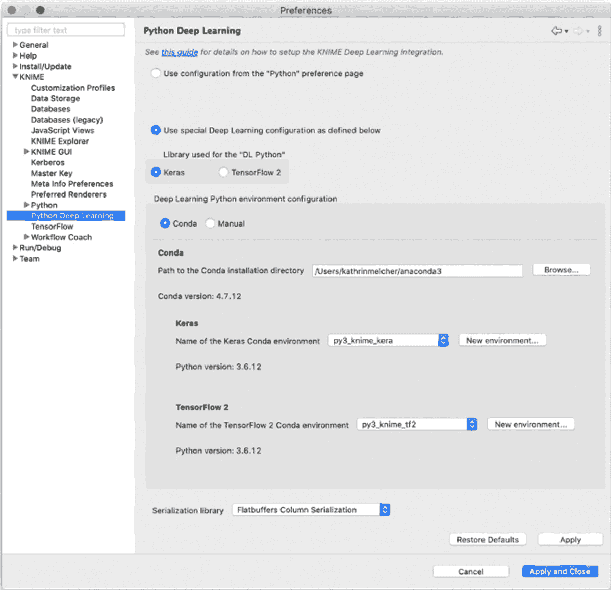

# 第一章：*第一章:* 使用 KNIME Analytics Platform 入门深度学习

我们将通过探索 KNIME Analytics Platform 来开始我们的**深度学习**（**DL**）范式之旅。如果你一直对神经网络和深度学习架构感兴趣，并且总觉得编码部分会成为你快速学习曲线的障碍，那么这本书就是为你而写的。

深度学习可能相当复杂，我们必须确保这一旅程值得获得的结果。因此，我们将再次从阐述深度学习技术在成功实施数据科学应用中的重要性开始本章内容。

接下来，我们将简要介绍本书所选工具——KNIME 软件，并重点讲解它如何与 KNIME Analytics Platform 和 KNIME Server 相辅相成。

本书中所做的工作将通过 KNIME Analytics Platform 实现，该平台是开源的，且可以免费使用。我们将专门有一部分介绍如何下载、安装和使用 KNIME Analytics Platform，尽管在接下来的章节中会提供更多细节。

KNIME Analytics Platform 的一个优势，当然是它无代码的深度学习 - Keras 集成扩展，我们将在本书中广泛使用该扩展。在本章中，我们将专注于该 KNIME 扩展的基本概念和要求。

最后，我们将通过阐明本书的目标和结构来结束本章。我们希望让本书更具实践性，因此大多数章节将围绕一个包括真实数据的实际案例研究展开。在每一章中，我们将有机会深入探讨所需的神经网络架构、数据准备、部署及其他使案例研究成功的要素。

本章将涉及以下主题：

+   深度学习的重要性

+   探索 KNIME 软件

+   探索 KNIME Analytics Platform

+   安装 KNIME 深度学习 - Keras 集成

+   本书的目标与结构

我们将从阐述深度学习在成功的数据科学应用中的重要性开始。

# 深度学习的重要性

如果你在**数据科学**——或者如今所说的**人工智能**（**AI**）——领域工作了几年，你可能注意到最近关于基于深度学习技术的成功解决方案的学术与实践文章激增。

重大突破发生在 2012 年，当时基于深度学习的 AlexNet 网络以空前的优势赢得了 ImageNet 挑战赛。这一胜利引发了深度学习网络应用的激增。自那时以来，深度学习已扩展到许多不同的领域和任务。

那么，当我们谈论深度学习时，究竟指的是什么呢？深度学习涵盖了一部分**机器学习**（**ML**）算法，其中大多数来源于神经网络。深度学习确实是传统神经网络的现代演进。除了经典的前馈、全连接、反向传播训练和多层感知机架构之外，还增加了*更深*的架构。更深意味着更多的隐藏层以及一些新的神经网络范式，包括**递归神经网络**（**RNNs**）、**长短期记忆网络**（**LSTM**）、**卷积神经网络**（**CNNs**）、**生成对抗网络**（**GANs**）等。

这些新型神经网络最近的成功有多个原因。首先，现代机器计算能力的提升有利于新范式和更复杂神经架构的引入与发展。在几分钟内训练一个复杂的神经网络，相较于将相同网络训练数小时或数天，留下了更多的实验空间。另一个原因是它们的灵活性。神经网络是通用的函数逼近器，这意味着只要它们的架构足够复杂，它们几乎可以逼近任何事物。

对这些算法的数学知识、对最有效的范式和架构的经验以及领域智慧，都是任何数据科学项目成功的基本、重要且必要的要素。然而，还有其他更多的偶然因素——例如学习的易用性、原型设计的速度、调试和测试选项以确保解决方案的正确性、实验的灵活性、外部专家帮助的可用性，以及自动化和安全功能——这些也会影响项目的最终结果。

在本书中，我们将展示可以通过开源、基于可视化编程、免费使用的工具 KNIME Analytics Platform 实现的深度学习解决方案。这些解决方案的某些部署阶段也使用了 KNIME Server 提供的一些功能。

接下来，我们将了解 KNIME Analytics Platform 和 KNIME Server 如何相互补充，以及它们各自适用于哪些任务。

# 探索 KNIME 软件

我们将主要使用两款 KNIME 产品：KNIME Analytics Platform 和 KNIME Server。KNIME Analytics Platform 包含数据科学项目所需的 ML 和深度学习算法及数据操作。另一方面，KNIME Server 提供了 IT 基础设施，便于安全部署以及随时间对模型进行监控。

我们将首先集中介绍 KNIME Analytics Platform，并概述它能完成的工作。

## KNIME Analytics Platform

**KNIME 分析平台**是一款满足所有数据需求的开源软件。它可以从 KNIME 官网（[`www.knime.com/downloads`](https://www.knime.com/downloads)）免费下载并使用。它涵盖了撰写时所有主要的数据清洗和机器学习技术，并且基于可视化编程。

**可视化编程**是 KNIME 分析平台的一个关键特性，用于快速原型开发。它使得该工具非常易于使用。在可视化编程中，**图形用户界面**（**GUI**）引导您完成构建专用模块（节点）流水线（工作流）的所有必要步骤。每个节点执行一个特定任务；每个节点的工作流将数据从起点处理到设计的终点。一个工作流替代了脚本，一个节点替代了一行或多行脚本。

如果没有广泛涵盖常用的数据清洗技术、机器学习算法、数据类型和格式，也没有与大多数常见的数据库软件、数据源、报告工具、外部脚本和编程语言的集成，软件的易用性将受到限制。因此，KNIME 分析平台被设计成支持不同数据格式、数据类型、数据源和数据平台的开放性，并且可以与 Python 和 R 等外部工具集成。

我们将从一些机器学习算法开始。KNIME 分析平台涵盖了大多数机器学习算法：从决策树到随机森林和梯度提升树，从推荐引擎到多种聚类技术，从朴素贝叶斯到线性回归和逻辑回归，从神经网络到深度学习。大多数算法原生支持 KNIME 分析平台，虽然一些算法可以通过集成其他开源工具（如 Python 和 R）来使用。

为了训练不同的深度学习架构，例如 RNN、自动编码器和 CNN，KNIME 分析平台通过**KNIME 深度学习 - Keras 集成**扩展集成了**Keras**深度学习库（[`www.knime.com/deeplearning/keras`](https://www.knime.com/deeplearning/keras)）。通过这个扩展，您可以拖放节点来定义复杂的神经网络架构，并训练最终的网络，而无需编写任何代码。

然而，定义网络只是必须采取的众多步骤之一。确保数据以正确的形式用于训练网络是另一个至关重要的步骤。为此，提供了大量的节点，以便我们可以实现各种**数据清洗**技术。通过结合专注于小任务的节点，您可以实现非常复杂的数据转换操作。

KNIME 分析平台还连接到大多数所需的数据源：从数据库到云存储库，从大数据平台到文件。

但是如果这些还不够呢？如果你需要一个针对特定领域的具体过程呢？如果你需要从 Python 中获取一个特定的网络操作功能呢？当 KNIME Analytics Platform 及其扩展无法满足需求时，你可以与其他脚本语言和编程语言进行集成，例如 **Python**、**R**、**Java** 和 **Javascript**，仅举几个例子。此外，KNIME Analytics Platform 与 BIRT（一款商业智能和报表工具）具有无缝集成。还可以与其他报表平台如 Tableau、QlickView、PowerBI 和 Spotfire 进行集成。

几个基于 JavaScript 的节点专门用于实现数据可视化的图表和图形：从简单的散点图到更复杂的旭日图，从简单的直方图到并行坐标图，等等。这些节点看似简单，但可能非常强大。如果你将它们组合在一个 **组件** 中，你可以跨多个图表交互选择数据点。通过这种方式，组件继承并结合了包含节点中的所有视图，并以一种方式将它们连接起来，使得如果在一个图表中选择并可视化数据点，它们也可以在组件的复合视图中的其他图表中选择并可视化。

*图 1.1* 显示了一个复合视图的示例：


图 1.1 – 包含散点图、条形图和并行坐标图的组件复合视图

*图 1.1* 显示了一个复合视图，包含散点图、条形图和并行坐标图。三个图表可视化相同的数据，并以一种方式连接，使得通过在条形图中选择数据，可以选择并在其他两个图表中可视化所选数据。

在创建数据科学解决方案时，KNIME Analytics Platform 提供了你所需的一切。然而，KNIME Server 提供了一些额外功能，以帮助你将解决方案投入生产环境。

## KNIME 企业版服务器

数据科学周期中的最后一步是将解决方案部署到生产环境中——对于企业来说，这意味着提供一个轻松、舒适且安全的部署方式。

将应用程序推向现实世界的过程称为 *投入生产*。将训练好的模型包含在最终应用程序中的过程称为 **部署**。这两个阶段紧密相关，并且可能会出现问题，因为在应用程序设计过程中出现的所有错误都将在这一阶段显现出来。

尽管有限，但使用 KNIME Analytics Platform 将应用程序投入生产是可能的。如果你是一个独立的数据科学家或数据科学学生，通常不需要定期部署应用程序和模型，那么 KNIME Analytics Platform 可能足够满足你的需求。然而，如果你在企业环境中工作，涉及调度、版本控制、访问权限、灾难恢复、Web 应用和 REST 服务等典型的生产服务器功能，那么仅使用 KNIME Analytics Platform 进行生产可能会显得繁琐。

在这种情况下，**KNIME Server**（需要年度许可费用）可以让你的工作更轻松。首先，它能够更好地适应企业 IT 环境的治理需求。它还为你的团队和整个数据科学实验室提供了一个受保护的协作环境。当然，它的主要优势在于简化和更安全的模型部署过程，因为它使用了*集成部署*功能，并允许你通过*一键部署*将模型投入生产。最终用户可以通过 KNIME Analytics Platform 客户端运行应用程序，或者——更好的是——通过 Web 浏览器运行。

还记得那些提供选定点的交互式互联视图的复合视图吗？当应用程序通过**KNIME Server 的 WebPortal**在 Web 浏览器中执行时，这些视图将变成完整的网页。

利用组件作为工作流中的接触点，我们可以在 Web 浏览器中获得[一个**引导分析**（](https://www.knime.com/blog/principles-of-guided-analytics))应用程序。引导分析将接触点插入到应用程序流中，供最终用户从 Web 浏览器中使用。最终用户可以利用这些接触点插入知识或偏好，并引导分析朝着期望的方向发展。

现在，让我们下载 KNIME Analytics Platform 并试试看！

# 探索 KNIME Analytics Platform

要安装 KNIME Analytics Platform，请[按照这些步骤：](http://www.knime.com/downloads)

1.  [前往](http://www.knime.com/downloads)。

1.  提供一些关于你的详细信息（*图 1.2*中的**第 1 步**）。

1.  下载适合你操作系统的版本（*图 1.2*中的**第 2 步**）。

1.  当你等待适当版本的下载时，浏览一下不同的入门步骤（*图 1.2*中的**第 3 步**）：


图 1.2 – 下载 KNIME Analytics Platform 包的步骤

下载完成后，找到安装包，启动它，并按照屏幕上显示的说明将其安装到任何你有写权限的目录中。

安装完成后，找到你安装的 KNIME Analytics Platform 实例——无论是从相应的文件夹、桌面链接、应用程序，还是开始菜单中的链接——并启动它。

当启动画面出现时，会弹出一个窗口要求你选择工作区的位置（*图 1.3*）。这个工作区是你计算机上的一个文件夹，用来存储你的所有工作。默认的工作区文件夹名为`knime-workspace`：


图 1.3 – KNIME Analytics Platform 启动窗口要求选择工作区文件夹

点击**启动**后，**KNIME Analytics Platform**的工作台将会打开。

KNIME Analytics Platform 的工作台如*图 1.4*所示组织：


图 1.4 – KNIME Analytics Platform 工作台

KNIME 工作台由不同的面板组成，可以通过点击`视图`菜单进行调整大小或移除。让我们来看看这些面板：

+   **KNIME Explorer**：位于左上角的**KNIME Explorer**面板显示了所选（**LOCAL**）工作区中的所有工作流、可能连接的 KNIME 服务器、与**EXAMPLES**服务器的连接以及与**My-KNIME-Hub**空间的连接。

    **LOCAL**工作区显示了在启动 KNIME Analytics Platform 时所选工作区文件夹中保存的所有工作流。第一次打开平台时，LOCAL 工作区仅包含*示例工作流*文件夹中的工作流和数据。这些是可以作为你项目起点的示例应用程序。

    **EXAMPLES**服务器是一个只读的 KNIME 托管服务器，包含了更多按类别组织的示例工作流。只需双击它即可自动以只读模式登录。完成此操作后，你可以浏览、打开、探索并下载所有可用的示例工作流。一旦找到一个工作流，双击它进行探索，或将其拖放到**LOCAL**中创建一个本地可编辑副本。

    **My-KNIME-Hub**提供了访问 KNIME 社区共享库（**KNIME Hub**）的途径，可以选择公共或私有模式。你可以使用**My-KNIME-Hub/Public**与 KNIME 社区共享你的工作，或者使用**My-KNIME-Hub/Private**作为你当前工作的空间。

+   **工作流教练**：**工作流教练**是一个节点推荐引擎，可以在你构建工作流时提供帮助。基于全球用户统计数据或你自己的私人统计数据，它会为你提供使用哪些节点的建议，以完成你的工作流。

+   **节点库**：**节点库**包含了你当前安装的所有 KNIME 节点，并按类别进行组织。为了帮助你进行定位，**节点库**面板的顶部有一个搜索框。搜索框左侧的放大镜图标可以切换精确匹配和模糊搜索选项。

+   **工作流编辑器**：**工作流编辑器**是页面中央的画布，你可以在这里组装工作流、配置和执行节点、检查结果并探索数据。节点可以从**节点库**面板通过拖放或双击的方式添加到工作流编辑器中。启动 KNIME Analytics Platform 后，工作流编辑器将在**欢迎页面**面板中打开，那里有许多有用的提示，告诉你如何找到帮助、课程、活动以及关于软件的最新资讯。

+   **大纲**：**大纲**视图显示整个工作流，即使在工作流编辑器中只有一小部分可见。这部分在**大纲**视图中以灰色标出。移动**大纲**视图中的灰色矩形会改变工作流编辑器中可见的工作流部分。

+   **控制台**和**节点监视器**：**控制台**和**节点监视器**共享一个面板，分为两个标签页。**控制台**标签页输出可能的错误和警告信息。相同的信息会写入日志文件，位置在工作空间目录中。**节点监视器**标签页显示你在工作流编辑器中选择执行节点的输出端口可用的数据。如果一个节点有多个输出端口，你可以从下拉菜单中选择感兴趣的数据。默认情况下，顶部输出端口的数据会显示出来。[链接](http://www.hub.knime.com)

+   [**KNIME Hub**: The **KNI**](http://www.hub.knime.com)**ME Hub** ([`hub.knime.com/`](https://hub.knime.com/)) 是一个外部空间，KNIME 用户可以在其中分享他们的工作。此面板允许你搜索由 KNIME 社区成员分享的工作流、节点和组件。

+   **描述**：**描述**面板显示有关所选节点或类别的信息。特别是，对于节点，它解释了节点的任务、背后的算法（如果有的话）、对话框选项、可用的视图、预期的输入数据以及产生的输出数据。对于类别，它显示所有包含的节点。

最后，在页面顶部，你可以找到**顶部菜单**，它包括文件管理和首选项设置、工作流编辑选项、附加视图、节点命令和帮助文档的菜单。

除了核心软件外，KNIME Analytics Platform 还受益于 KNIME 社区提供的外部**扩展**。在**文件**菜单中提供的**安装 KNIME 扩展**和**更新 KNIME**命令，允许你通过外部扩展扩展当前实例或将其更新到更新版本。

在顶部菜单下，提供了一个**工具栏**。当工作流打开时，工具栏提供工作流编辑、节点执行和自定义的命令。

通过从**节点库**面板将节点拖放到**工作流编辑器**窗口中，或者直接双击它们，可以构建一个**工作流**。节点是任何工作流的基本处理单元。每个**节点**都有多个输入和/或输出端口。**数据**通过连接从**输出端口**流向其他节点的**输入端口**。通过点击第一个节点的输出端口，并将鼠标释放到下一个节点的输入端口，两个节点就被连接起来——数据流也随之建立。由这样的一系列节点构成的数据处理流程便是一个工作流。

在*图 1.5*中，每个节点下方会看到一个**状态灯**：红色、黄色或绿色：


图 1.5 – 节点结构和状态灯

当创建一个新节点时，状态灯通常是红色的，这意味着节点的设置仍需要配置，才能执行任务。

要配置一个节点，右键点击它并选择**配置**，或者直接双击它。然后，在节点的对话框中调整必要的设置。当按下**确定**按钮关闭对话框时，节点就被配置好了，状态灯变为黄色；这意味着节点已准备好执行。再次右键点击节点时，会显示一个启用的**执行**选项；点击它将执行该节点。

左侧的端口是输入端口，来自前置节点输出端口的数据将通过它输入到节点中。右侧的端口是输出端口。节点对数据的操作结果通过后续节点的输出端口提供。当你将鼠标悬停在端口上时，会显示一个工具提示，提供节点输出维度的信息。

重要提示

只有相同类型的端口才能连接！

**数据端口**（黑色三角形）是最常见的节点端口类型，用于在节点之间传输平面数据表。**数据库端口**（棕色方块）用于在节点之间传输 SQL 查询。还有许多其他类型的节点端口，传输不同的对象。

执行成功后，节点的状态灯变为绿色，表示处理后的数据现在可以在输出端口中使用。结果可以通过查看输出端口视图来检查：右键菜单中的最后一项会打开它们。

到此为止，我们已经完成了 KNIME Analytics Platform 工作台的快速游览。

现在，让我们看看在哪里可以找到起始示例和帮助。

## 有用的链接和材料

此时，我们已经查看了 `read file`，你将获得一个示例工作流列表，展示如何读取 `CSV` 文件、`.table` 文件、`Excel` 文件等。（*图 1.6*）：


图 1.6 – 在 KNIME Hub 上搜索 "read file" 后得到的工作流列表

本书中描述的所有工作流也可以在 KNIME Hub 上找到，供你使用：[`hub.knime.com/kathrin/spaces/Codeless%20Deep%20Learning%20with%20KNIME/latest/`](https://hub.knime.com/kathrin/spaces/Codeless%20Deep%20Learning%20with%20KNIME/latest/)。

一旦你找到了感兴趣的工作流，点击它以打开其页面，然后下载或在 KNIME Analytics Platform 中打开它，以根据你的需要进行自定义。

另一方面，要在 KNIME Hub 上分享你的工作，只需将你的工作流从本地工作区复制到 **KNIME Explorer** 面板中的 *My-KNIME-Hub/Public* 文件夹中。这样，它将自动对所有 KNIME 社区成员可用。

KNIME 社区也非常活跃，**KNIME 论坛**（[`forum.knime.com/`](https://forum.knime.com/)）上有许多技巧和窍门。在这里，你可以提问或查找答案。

最后，社区的贡献可以通过**KNIME 博客**（[`www.knime.com/blog`](https://www.knime.com/blog)）上的帖子、**KNIME Press**（[`www.knime.com/knimepress`](https://www.knime.com/knimepress)）出版的书籍，或者通过**KNIME TV** () 频道在 YouTube 上观看。

两本书《*KNIME 初学者的幸运*》和《*KNIME 高级幸运*》为那些刚开始使用 KNIME Analytics Platform 从事数据科学的用户提供了教程。

现在，让我们构建我们的第一个工作流，好吗？

## 构建并执行你的第一个工作流

在本节中，我们将构建我们的第一个简单的小型工作流。我们将从一些基础的内容开始：从 ASCII 文件读取数据，进行一些过滤，并在条形图中显示结果。

在 KNIME Explorer 中，按以下步骤操作：

1.  通过以下步骤创建一个新的空文件夹：

    a) 右键点击 `第一章`。

1.  点击**完成**。然后你应该能在**KNIME Explorer**面板中看到一个新文件夹，名称就是你刚刚设置的名称。

    重要提示

    在 KNIME Explorer 中，文件夹被称为**工作流组**。

同样，你可以按照以下步骤创建一个新的工作流：

1.  通过以下步骤创建一个新的工作流：

    a) 右键点击 `第一章` 文件夹（或者在你希望放置工作流的地方）。

    b) 选择 `My_first_workflow`。

1.  点击**完成**。然后你应该能在**KNIME Explorer**面板中看到一个新工作流，名称就是你刚刚设置的名称。

点击**完成**后，工作流编辑器将打开空工作流的画布。

提示

默认情况下，新工作流的画布会显示网格；若要关闭它，请点击工具栏中**打开工作流编辑器设置对话框**按钮（倒数第二个按钮）。此按钮会打开一个窗口，你可以在其中自定义工作流的外观（例如，允许弯曲的连接线）并进行编辑（打开/关闭网格）。

*图 1.7* 显示了 **新工作流组**... 选项，在 KNIME Explorer 的上下文菜单中。它允许你创建一个新的空文件夹：


图 1.7 – 在 KNIME Explorer 中创建新文件夹和新工作流的上下文菜单

在我们的工作流中，首先需要读取包含数据的 ASCII 文件。让我们读取安装 KNIME Analytics Platform 时提供的*adult.csv*文件。它位于**Example Workflows/The Data/Basics**下。adult.csv 是一个美国人口普查公共文件，描述了 30K 人群体的年龄、性别、来源、职业和私人生活。

让我们**创建**该节点，以便能够读取*adult.csv* ASCII 文件：

a) 在`Node Repository`中，搜索**File Reader**节点（它实际上位于**IO/Read**类别中）。

b) 将`File Reader`节点拖放到**Workflow Editor**面板中。

c) 或者，直接双击`File Reader`节点，这将在**Workflow Editor**面板中自动创建它。

在*图 1.8*中，查看`Node Repository`中位于**IO/Read**下的`File Reader`节点：


图 1.8 – `Node Repository`中**IO/Read**下的 File Reader 节点

现在，让我们在 Workflow Editor 中使用`File Reader`节点，并手动配置文件路径以读取*adult.csv*文件。或者，直接将*adult.csv*文件从**KNIME Explorer**面板（或你计算机上的任何位置）拖放到**Workflow Editor**窗口中。你可以在*图 1.9*中看到这一操作：


图 1.9 – 将 adult.csv 文件拖放到 Workflow Editor 面板中。

这将自动生成一个 File Reader 节点，其中包含读取文件的大部分正确配置设置。

小贴士

在 File Reader 配置窗口中的**Advanced**按钮将引导你到更多高级设置：读取包含特殊字符（如引号）的文件；允许长度不同的行；使用不同的编码方式；等等。

要执行该节点，只需右键单击它，并从上下文菜单中选择**Execute**；或者，点击工具栏中可用的**Execute**按钮（绿色背景上的单白箭头和双白箭头）。

要检查由该节点执行生成的输出数据表，右键单击该节点并选择上下文菜单中的最后一个选项。这将打开作为读取*adult.csv*文件结果的数据表。你将看到**Age**、**Workclass**等列。

重要说明

KNIME Analytics Platform 中的数据是以表格形式组织的。每个单元格通过**列标题**和**行 ID**唯一标识。因此，列标题和行 ID 需要具有唯一的值。

`fnlwgt`是一个我们一直不确定其含义的列。因此，使用**Column Filter**节点将其从进一步分析中移除。

为此，搜索 `File Reader` 节点并将其连接到 `Column Filter` 节点的输入端口。或者，我们可以在节点库中选择 `Column Filter` 节点中的 `File Reader` 节点。这会自动在工作流编辑器中创建节点及其连接。

`Column Filter` 节点及其配置窗口如 *图 1.10* 所示：


图 1.10 – 配置 `Column Filter` 节点以从输入数据表中删除名为 fnlwgt 的列

同样，双击或右击节点，然后选择 **配置** 进行配置。该配置窗口包含三个选项，可以通过三个单选按钮选择：**手动选择**、**通配符/正则表达式选择** 和 **类型选择**。让我们更详细地了解这些选项：

+   **手动选择** 提供了一个包含/排除框架，您可以通过框架之间的按钮手动将列从 **包含** 集合转移到 **排除** 集合，反之亦然。

+   **通配符/正则表达式选择** 根据通配符（使用 ***** 作为通配符）或正则表达式提取您希望保留的列。

+   **类型选择** 根据列所包含的数据类型来保留列。

由于这是我们的第一个工作流，我们将选择最简单的方法；也就是手动选择。通过框架之间的按钮，将 `fnlwgt` 列移到 **排除** 集合中（这些按钮可以在 *图 1.10* 中看到）。

执行 `Column Filter` 节点后，如果我们检查输出数据表（右击并选择上下文菜单中的最后一个选项），我们会看到一个不包含 `fnlwgt` 列的表格。

现在，让我们提取所有每周工作超过 20 小时的人的记录。`hours-per-week` 是包含相关数据的列。

为此，我们需要创建一个 Row Filter 节点，并实现所需的条件：

```py
IF hours-per-week  > 20     THEN Keep data row.
```

再次，定位 `Column Filter` 节点到其输入端口，并打开其配置窗口。

在 `Row Filter` 节点的配置窗口中（*图 1.11*），我们将看到三个默认的过滤条件：**使用模式匹配**、**使用范围检查** 和 **仅缺失值匹配**。让我们来看一下它们的作用：

+   **使用模式匹配** 将给定的模式与 **测试列** 字段中选定列的内容进行匹配，并保留匹配的行。

+   **使用范围检查** 仅保留在 **测试列** 中值位于 **下限** 和 **上限** 之间的数据行。

+   **仅缺失值匹配** 只保留选定列中存在缺失值的数据行。

默认行为是将匹配的数据行包含在输出数据表中。然而，您可以通过配置窗口左侧的单选按钮启用 **按属性值排除行** 来更改此行为。

替代的过滤条件可以通过行号或行 ID 完成。也可以通过配置窗口左侧的单选按钮启用：


图 1.11 – 配置行过滤器节点，以仅保留输入数据表中每周工作小时数大于 20 的行

执行后，打开输出数据表（*图 1.12*）时，不应出现 *每周工作小时数 < 20* 的数据行：


图 1.12 – 右键点击成功执行的节点并选择最后一个选项，显示由该节点生成的数据表

现在，让我们来看一些非常基础的可视化。我们将可视化这个数据集中男性与女性的数量，该数据集包含每周工作超过 20 小时的人：


图 1.13 – 条形图节点及其配置窗口

为此，找到 `Row Filter` 节点，并打开其配置窗口（*图 1.13*）。这里有四个标签可以用于配置：**选项** 涵盖所有数据设置，**常规绘图选项** 涵盖所有绘图设置，**控制选项** 涵盖所有控制设置，**交互性** 涵盖所有与其他图表、视图和图形交互时的订阅事件。由于这是一个初学者的工作流，我们将采用所有默认设置，只设置以下内容：

+   从 `sex` 中，确保它出现在 *x* 轴上。然后，选择 **出现次数** 以按性别统计行数。

+   从 **常规绘图选项** 标签中，设置标题、副标题和轴标签。

该节点不会生成数据，而是生成条形图的视图。因此，要检查该节点执行后的结果，右键点击它并选择中央选项，即 **交互视图：分组条形图**（*图 1.14*）：


图 1.14 – 右键点击成功执行的可视化节点并选择交互视图：分组条形图选项，以查看生成的图表/图形

注意 *图 1.14* 右侧视图的右上角有三个按钮。这三个按钮分别启用 **缩放**、**切换到全屏** 和 **节点设置**。在视图本身中，您可以探索选择不同设置后的图表效果，例如选择不同的类别列或标题。

重要提示

大多数数据可视化节点生成的是视图，而不是数据表。要查看相应的视图，右键点击成功执行的节点并选择**交互视图：...**选项。

**条形图**节点的第二个下输入端口是可选的（一个白色三角形），用于读取颜色映射，这样你就可以给条形图中的条形上色。

重要提示

请注意，节点库中提供了多种不同的数据可视化节点：JavaScript、本地（Swing）、Plotly 等。在**节点库**面板中，可以找到来自 JavaScript 类别的 `条形图` 节点。

现在，我们将添加一些注释以记录工作流。你可以在节点级别或整个工作流级别添加注释。

工作流中的每个节点默认都会创建一个名为*节点 xx*的标签。双击它后，节点标签编辑器将出现。你可以自定义文本、字体、颜色、背景以及节点的其他类似属性（*图 1.15*）。我们需要在每个节点下写上一些简短的注释，明确它们正在执行的任务：


图 1.15 – 自定义每个节点下标签的编辑器

你还可以在工作流级别写注释。只需右键点击工作流编辑器中的任意位置，然后选择**新建工作流注释**。在编辑模式下，黄色框架将出现。在这里，你可以添加文本并自定义它以及其框架。要关闭注释编辑器，只需在工作流编辑器中的其他地方单击。要重新打开注释编辑器，双击注释的左上角（*图 1.16*）：


图 1.16 – 创建和编辑工作流注释

恭喜！你刚刚使用 KNIME 分析平台构建了你的第一个工作流。它应该看起来像*图 1.17*中的样子：


图 1.17 – 我的第一个工作流

这只是 KNIME 分析平台使用的简要介绍。

现在，让我们确保已安装并正常运行 KNIME 深度学习 – Keras 集成。

# 安装 KNIME 深度学习 – Keras 集成

在本节中，你将学习如何安装和设置**KNIME 深度学习 - Keras 集成**，以便在 KNIME 分析平台中训练神经网络。

KNIME 分析平台由软件核心和若干提供的扩展及集成组成。这些扩展和集成由 KNIME 社区提供，并通过多种数据科学功能扩展原始软件核心，包括用于人工智能的高级算法。

这里感兴趣的 KNIME 扩展叫做 **KNIME 深度学习 - Keras 集成**。它提供了一个基于图形用户界面的无代码集成 Keras 库，同时使用 TensorFlow 作为其后端。这意味着 Keras 库中的许多功能已被封装到 KNIME 节点中，并通过 KNIME 经典的、易于使用的视觉对话框窗口进行操作。由于这种集成，您可以在不编写代码的情况下读取、写入、创建、训练和执行深度学习网络。

另一种可用的深度学习集成是 **KNIME 深度学习 - TensorFlow 集成**。该扩展允许您将 **Keras** 模型转换为 **TensorFlow** 模型，还可以读取、执行和写入 TensorFlow 模型。

TensorFlow 是由谷歌提供的开源库，包含了多种深度学习范式。TensorFlow 函数可以在单个设备上运行，也可以在多个 CPU 和多个 GPU 上运行。这种并行计算功能是加速深度学习网络所需的计算密集型训练的关键。

然而，在 Python 中使用 TensorFlow 库可能会相当复杂，即使是经验丰富的 Python 程序员或深度学习专家也不例外。因此，开发了一些简化的接口，基于 TensorFlow，暴露了其部分功能和参数。最成功的 TensorFlow 基于库之一是 Keras。然而，甚至 Keras 仍然需要一定的编程技能。**KNIME 深度学习 - Keras 集成** 将 KNIME GUI 放置在 Keras 库之上，基本消除了编写代码的需求。

为了让 **KNIME 深度学习 - Keras 集成** 正常工作，需要安装几个必要的组件：

+   Keras 和 TensorFlow 节点

+   Python 环境

让我们从第一步开始：安装 Keras 和 TensorFlow 节点。

## 安装 Keras 和 TensorFlow 节点

要向节点库添加节点，您必须安装一些扩展和集成。

您可以通过点击 KNIME Analytics Platform 顶部菜单中的 **文件**，选择 **安装 KNIME 扩展…** 来安装它们。这将打开如 *图 1.18* 所示的对话框：


图 1.18 – 安装扩展的对话框

在这个新对话框中，您可以选择要安装的扩展和集成。使用顶部的搜索栏有助于过滤可用的扩展和集成。

提示

您还可以通过从 KNIME Hub 拖放扩展来安装它们。

为了安装将在本书案例研究中使用的 Keras 和 TensorFlow 节点，您需要选择以下内容：

+   **KNIME 深度学习 - Keras 集成**

+   **KNIME 深度学习 - TensorFlow 集成**

然后，按下 **下一步** 按钮，接受条款和条件，并点击 **完成**。安装完成后，您需要重新启动 KNIME Analytics Platform。

此时，你应该在节点库中看到 Keras 和 TensorFlow 节点（*图 1.19*）：


图 1.19 – 节点库中已安装的深度学习节点

很多节点实现了神经网络层：输入层和丢弃层的节点可以在 **Core** 子类别中找到，LSTM 层的节点可以在 **Recurrent** 中找到，嵌入层的节点可以在 **Embedding** 中找到。然后，还有用于训练、加载和存储网络的学习器（Learner）、读取器（Reader）和写入器（Writer）节点。这些节点都有配置窗口，并且不需要编写代码。Python 深度学习节点允许你使用 Python 代码定义、训练、执行和编辑网络。最后一个子类别包含基于 TensorFlow 的节点。

接下来，我们需要设置 Python 环境。

## 设置 Python 环境

KNIME Keras 集成和 KNIME TensorFlow 集成依赖于现有的 **Python** 安装，这需要安装一些 Python 依赖项。

与 KNIME Python 集成类似，KNIME 深度学习集成使用 **Anaconda** 来管理 Python 环境。如果你已经为 KNIME Python 集成安装了 Anaconda（例如），你可以跳过第一步。

让我们开始吧：

1.  首先，从 [`www.anaconda.com/products/individual`](https://www.anaconda.com/products/individual) 获取并安装最新版本的 Anaconda（Anaconda ≥ 2019.03，conda ≥ 4.6.2）。在 Anaconda 下载页面，你可以选择 Python 3.x 或 Python 2.x 的版本。两者都可以使用（如果不确定，建议选择 Python 3）。

1.  接下来，我们需要创建一个包含正确库的环境。为此，在 KNIME Analytics Platform 中打开 Python 深度学习偏好设置。然后，执行以下操作：

1.  首先，从顶部菜单中选择 **文件 -> 偏好设置**。这将打开一个新对话框，左侧会列出相关选项。

1.  在对话框中，选择 **KNIME** **-> Python Deep Learning**。

    你现在应该会看到一个像 *图 1.20* 中那样的对话框：

    

    图 1.20 – Python 深度学习偏好页面

    从此页面，可以创建一些 Conda 环境，并安装适用于 Keras 或 TensorFlow 2 的正确包。对于本书中的案例研究，设置一个适用于 Keras 的环境就足够了。

1.  要创建并设置新环境，启用 **使用特殊的深度学习配置**，并将 **Keras** 设置为 **用于 DL Python 的库**。接下来，启用 **Conda** 并提供 Conda 安装目录的路径。

1.  此外，要为 Keras 创建新环境，点击 Keras 框架中的 **新建环境…** 按钮。

    这将打开一个新的对话框，如 *图 1.21* 所示，你可以在此设置新环境的名称：

    

    图 1.21 – 设置新环境名称的对话框

1.  单击**创建新的 CPU 环境**或**创建新的 GPU 环境**按钮，可以为使用 CPU 或 GPU（如果有的话）创建一个新环境。

现在，您可以开始了。在本节中，您已经介绍了设置 Python 环境的最便捷方式。其他选项可以在 KNIME 文档中找到：[`docs.knime.com/2019-06/deep_learning_installation_guide/index.html#keras-integration`](https://docs.knime.com/2019-06/deep_learning_installation_guide/index.html#keras-integration)。

# 本书的目标与结构

在本书中，我们的目标是为您提供关于深度学习架构和训练范式的坚实理论基础，以及一些基于真实世界数据解决实际案例研究的详细无代码体验。

对于这一旅程，我们采用了无代码工具 KNIME Analytics 平台。KNIME Analytics 平台基于可视化编程，并利用用户友好的 GUI，使数据分析成为一项更经济的任务，无需编程障碍。与许多其他外部扩展一样，KNIME Analytics 平台在相同的 GUI 下集成了 Keras 库，从而将深度学习纳入其无代码扩展列表。在 KNIME Analytics 平台内，您只需拖放几下和鼠标几次点击，即可构建、训练和测试深度学习架构。我们在本章中对该工具进行了简要介绍，但在*第二章*中，我们将提供更详细的信息，*使用 KNIME Analytics 平台进行数据访问和预处理*。

之后，在*第三章*，*开始使用神经网络*，我们将快速概述神经网络和深度学习背后的基本概念。本章将绝不会完全涵盖所有涉及神经网络和深度学习的架构和范式。相反，它将为您提供一个快速概述，帮助您在继续实施之前，第一次或再次熟悉这些概念。如果您想了解更多关于深度学习的数学背景，请参考更专业的文献。

正如我们之前所述，我们决定以非常实际的方式讨论深度学习技术；也就是说，总是通过参考真实的案例研究，展示某种深度学习技术如何成功实施。我们将在*第四章*《构建与训练前馈网络》中开始这一趋势，在这一章中，我们将描述一些基本的示例应用，用以训练并应用我们在*第三章*《神经网络入门》中探讨的深度学习网络的基本概念。尽管这些只是简单的玩具示例，但它们仍然对于阐明如何应用我们在前一章中描述的理论概念非常有用。

在*第五章*《用于欺诈检测的自编码器》中，我们将开始研究真实的案例研究。我们将在本章中描述的第一个案例研究旨在通过每次检测到可疑交易时触发警报，从而防止信用卡交易中的欺诈行为。为了实现这一种异常检测子类，我们将采用基于自编码器架构的方法，以及网络输出与输入值之间计算出的距离。

在*第五章*《用于欺诈检测的自编码器》中，我们仍处于经典神经网络的范畴，包括前馈网络和通过反向传播训练的网络，尽管采用了原始架构。在*第六章*《用于需求预测的循环神经网络》中，我们将进入深度学习网络的领域，具体来说是使用 RNN，尤其是 LSTM。在这里，我们将利用此类网络的动态特性及其捕捉信号时间演变的能力来解决一个经典的时间序列分析问题：需求预测。

在介绍 RNN 后，我们将学习如何将其应用于**自然语言处理**（**NLP**）案例研究。*第七章*《实现 NLP 应用》中涵盖了几个这样的 NLP 用例：情感分析、自由文本生成和产品名称生成等等。所有这些用例在某种意义上是相似的，因为它们都分析文本流。它们也有所不同，因为它们解决的是不同的问题：前者的情感分析是分类任务，而后两者则是对词语或字符序列的无约束生成。然而，数据准备技术和 RNN 架构对于所有的案例研究来说都是相似的，这就是为什么它们被放在同一章中的原因。

*第八章*，*神经机器翻译*，描述了一个基于 RNN 的自由文本生成案例。在这里，网络的输出端会根据输入层中相应的词序列生成一段词序列。输出序列将以目标语言生成，而输入序列则以源语言提供。

深度学习不仅仅是 RNN 和文本挖掘的形式。实际上，深度学习网络的最初实例来源于图像处理领域。*第九章*，*用于图像分类的卷积神经网络*，专门描述了一个案例研究，其中需要将组织病理切片图像分类为三种不同类型的癌症之一。为此，我们将介绍 CNN。训练用于图像分析的网络在时间、数据量和计算资源方面并非易事。通常，为了训练一个神经网络使其能够识别图像，我们必须依赖于迁移学习的优势，正如*第九章*，*用于图像分类的卷积神经网络*中所描述的那样。

*第九章*，*用于图像分类的卷积神经网络*，总结了我们深入探讨的深度学习技术在实际案例中的应用。我们意识到，其他深度学习范式也被用于解决其他数据科学问题。然而，在此我们决定仅报告我们有实际经验的常见范式。

训练完网络后，必须进入部署阶段。由于这是所有问题都会暴露的阶段，因此部署阶段经常被忽略。这包括应用程序设计中的错误、网络训练中的错误、数据访问和准备中的错误：所有这些问题都会在此阶段显现出来。因此，本书的最后两章专门讨论了训练深度学习网络的部署阶段。

*第十章*，*部署深度学习网络*，将向你展示如何构建部署应用程序，而*第十一章*，*最佳实践及其他部署选项*，则将展示所有可用的部署选项（如网页应用或 REST 服务）。它还将为你提供一些我们自身经验中的小贴士和技巧。

每一章后都有相应的问题，帮助你测试自己对所学内容的理解。

在此，请继续阅读，了解如何使用 KNIME Analytics Platform 将各种深度学习架构应用于实际案例。

# 总结

本章的目的是为你提供本书内容的预备知识。

因此，我们通过提醒你深度学习的重要性以及它在第一次深度学习成功案例之后获得的广泛关注来开始本章。这种关注的激增可能正是将你吸引到这里的原因，带着对深度学习网络在实际应用中实现的更多了解的渴望。

目前，我们在学习深度学习时遇到的主要障碍是所需的编程技能。在这里，我们采用了 KNIME 软件，特别是开源的 KNIME Analytics Platform，以便我们可以查看本书中提出的案例研究。为此，我们详细描述了 KNIME 软件和 KNIME Analytics Platform。

KNIME Analytics Platform 还受益于一个名为 KNIME Deep Learning – Keras Integration 的扩展，它帮助整合 Keras 深度学习库。它通过将基于 Python 的库封装到无代码的 KNIME 图形用户界面中来实现这一点。我们专门为此安装过程提供了一个完整的章节。

最后，我们通过概述本书剩余章节的内容来结束本章。

在我们深入探讨深度学习网络的数学和应用之前，我们将在下一章中先熟悉 KNIME Analytics Platform 的基本功能。
