# 第二章：*第二章*：使用 KNIME 分析平台进行数据访问和预处理

在深入学习神经网络和深度学习架构之前，可能最好先熟悉 KNIME 分析平台及其最重要的功能。

本章将涵盖 KNIME 分析平台中的一些基本操作。由于每个项目都需要数据，我们将首先讲解如何访问数据：从文件或数据库中。在 KNIME 分析平台中，您还可以从 REST 服务、云存储库、特定行业格式等获取数据。我们将把这些其他选项的探索留给您自己。

数据有多种形状和类型。在*数据类型和转换*部分，我们将简要探讨 KNIME 数据表示的表格特性、数据表中的基本数据类型，以及如何将一种类型转换为另一种类型。

到目前为止，我们已经将数据导入到 KNIME 工作流中，接下来我们将展示一些基本的数据操作，如过滤、连接、拼接、聚合以及其他常用的数据转换。

静态工作流的参数化将总结我们对 KNIME 分析平台进行的基本操作的快速概述。

本章将介绍以下主题：

+   访问数据

+   数据类型和转换

+   数据转换

+   工作流参数化

让我们从如何将数据导入到 KNIME 工作流开始。

# 访问数据

在开始展示如何访问和导入数据到 KNIME 工作流之前，让我们先创建一个工作流：

1.  点击顶部菜单中的**文件**项，或右键点击一个文件夹，例如在**KNIME Explorer**中的**LOCAL**文件夹。

1.  然后，选择**新建 KNIME 工作流**选项。

1.  给它命名——例如，`Ch2_Workflow_Examples`——并选择一个目标位置。

    一个空白的画布将会在 KNIME 工作台的中央打开：工作流编辑器。

对于本章内容，我们将使用安装时已经提供的示例数据。安装时会一起安装一套工作流，您可以在`Example Workflows`文件夹中找到它们（见*图 2.1*），而`TheData`子文件夹包含一些免费的玩具数据集：

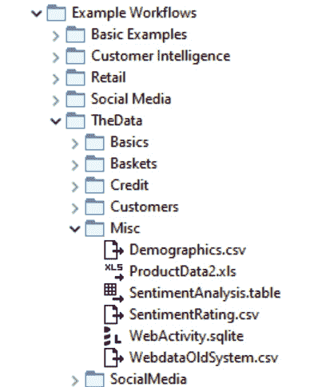

图 2.1 - KNIME Explorer 面板中示例工作流文件夹的结构

我们将主要使用`Misc`子文件夹中的数据集。

提示

为了将数据上传到**KNIME Explorer**面板，只需将其复制到您计算机当前工作区文件夹中的一个文件夹中。然后，文件夹及其内容将在**KNIME Explorer**的工作流、服务器、KNIME Hub 空间和可用数据列表中出现。

## 从文件中读取数据

让我们从经典的方法开始：读取**CSV 格式**的文本文件。要读取 CSV 格式的文本文件，您需要使用**文件读取器**节点或其简化版本**CSV 读取器**节点。让我们专注于文件读取器节点，尽管它更复杂，但也更强大和灵活。现在有两种创建和配置文件读取器节点的方法。

长方法中，您可以在节点库中搜索文件读取器节点；将其拖放到工作流编辑器中；双击打开其配置窗口，或者选择右键然后选择**配置**；设置所需的设置，至少需要通过**浏览**按钮设置文件路径（*图 2.2*）。

短方法中，您只需将 CSV 格式的文件从文件浏览器面板拖放到工作流编辑器中。这种方式会自动创建文件读取器节点，并填充大部分配置设置，包括文件路径，并保持配置窗口打开以便进一步调整（*图 2.2*）。

在文件路径下方，有一些基本设置：是否将第一行读取为列标题和/或将第一列作为`行 ID`，一般文本文件的列分隔符，以及如何处理空格和制表符。

在文件读取器节点的配置窗口中，还要注意两件事情：数据预览和**高级**按钮。窗口下部的数据预览允许您查看数据集是否被正确读取。**高级**按钮会带您到更高级的设置，例如启用更短的行，字符编码，引号和其他类似的偏好设置。

当使用短方法创建和配置**文件读取器**节点时，在节点配置窗口的预览面板中（*图 2.2*），您可以看到自动设置是否足够或是否需要额外的定制：

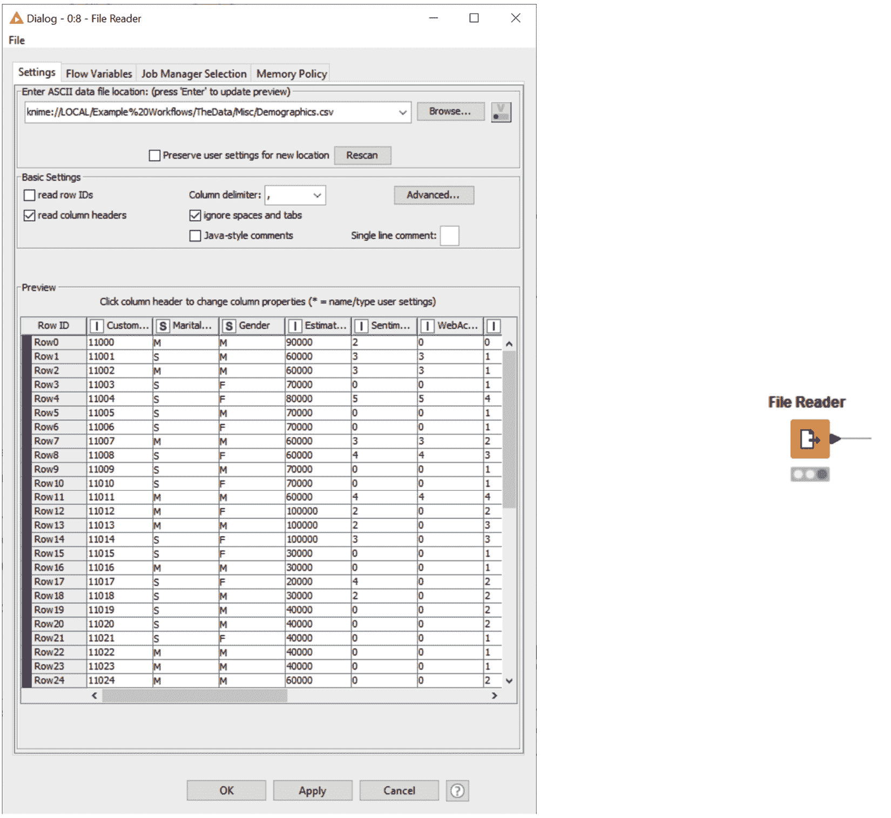

图 2.2 – 文件读取器节点及其配置窗口

我们将`Demographics.csv`文件从`示例工作流程/数据/其他`拖放到工作流编辑器中。在文件读取器节点的配置窗口中，我们看到`CustomerKey`列被解释为数据行的行 ID，而不是其自己的列。我们需要禁用**读取行 ID**选项以正确读取数据。配置完成后，点击**确定**；节点状态变为黄色，节点现在可以执行。

提示

通过文件拖放自动创建节点并配置其设置仅适用于特定的文件扩展名：`.csv`用于文件读取器节点，`.table`用于表格读取器节点，`.xls`和`.xlsx`用于 Excel 读取器节点等。

类似地，如果我们从 KNIME 资源管理器面板中将`ProductData2.xls`文件拖放到工作流编辑器中，则会创建并自动配置**Excel 读取器**（**XLS**）节点（*图 2.3*）：

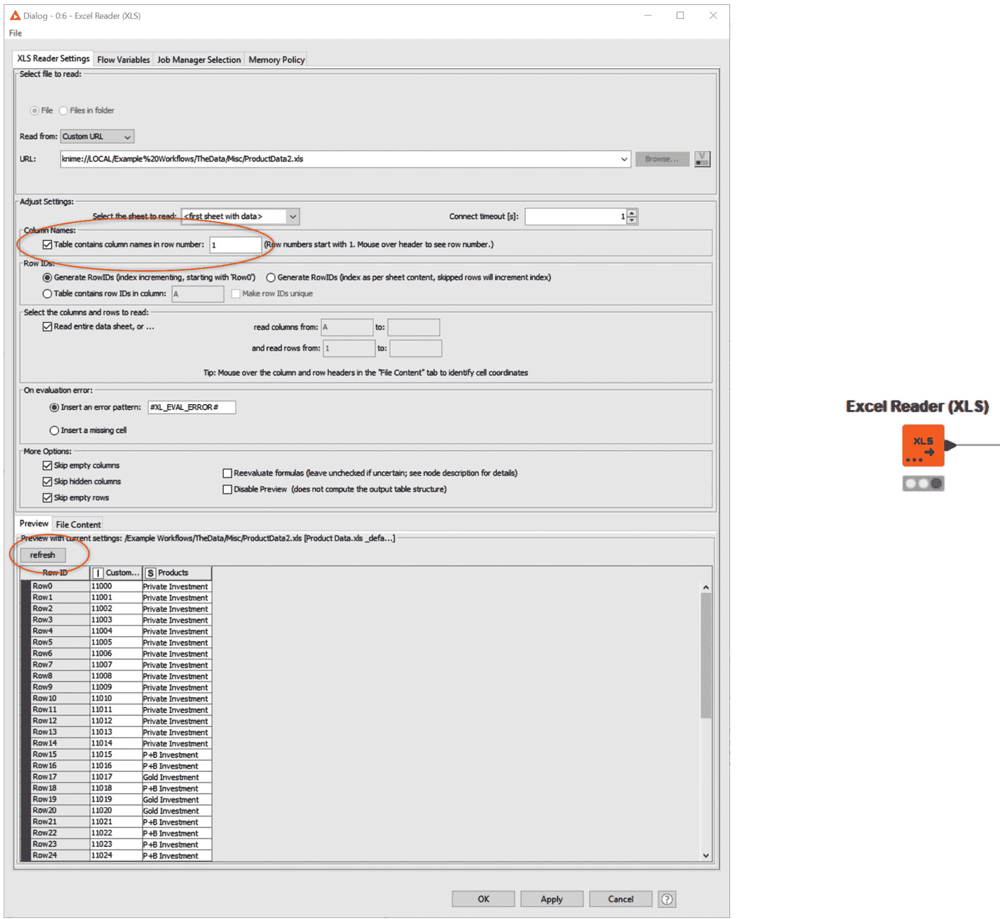

图 2.3 – Excel Reader (XLS)节点及其配置窗口

配置窗口（*图 2.3*）与**文件读取节点**的配置窗口相似，但当然是定制化的，用于处理 Excel 文件。特别有三个项是不同的：

+   预览部分由**刷新**按钮激活。你需要点击**刷新**来更新预览。

+   列头和行 ID 是从电子表格单元格中提取的，通过字母（列头所在的列）和数字（行 ID 所在的行）来标识，符合 Excel 标准。

+   在 URL 路径的顶部，有一个带有默认选择的菜单，**自定义 URL**。此菜单允许你将文件路径表示为绝对路径（**本地文件系统**）、相对于挂载点的路径（**Mountpoint**）、相对于当前位置之一（数据、工作流或挂载点）的路径，或者自定义路径（**Custom URL**）。此功能很快将扩展到其他读取节点。

在我们的例子中，自动配置过程并未包含列头。从预览段可以看出这一点。因此，由于我们在第一行中有列头，我们调整`1`，刷新预览，然后点击**确定**保存更改并关闭窗口。

接下来，让我们读取`SentimentAnalysis.table`文件。`.table`文件包含以 KNIME 专有格式优化的二进制内容，旨在提高速度和减小文件大小。这些文件由表格读取节点（Table Reader node）读取。由于文件中的所有信息已经包含在文件本身，因此`SentimentAnalysis.table`文件的配置窗口会自动生成一个预配置 URL 的表格读取节点。

为了总结本节内容，让我们通过两个额外的文件读取节点来读取最后两个文件，`SentimentRating.csv`和`WebDataOldSystem.csv`，然后在每个节点下的注释中添加文件名。最后，将所有这些读取节点组合在一个注释中，解释**从文件中读取数据**（*图 2.9*）。

`Demographics.csv`包含多个客户的基本信息，如年龄和性别。每个客户通过`CustomerKey`值进行标识。`ProductData2.xls`包含每个客户购买的产品，同样通过`CustomerKey`值进行标识。`SentimentAnalysis.table`包含客户对公司和产品表达的情感（以文本形式），再次通过`CustomerKey`值进行标识。`SentimentRating.csv`包含情感评分与情感文本之间的映射。最后，`WebdataOldSystem.csv`包含在迁移前旧网站系统中，每个客户的旧活动指标。

当然，如果有迁移之前的数据集，我们必须拥有一个包含迁移后系统数据的更新数据集。这个数据集可以在`WebActivity.sqlite` SQLite 数据库中的一个数据库表中找到。

这引导我们进入下一部分，在那里我们将学习如何从数据库读取数据。

### 从数据库读取数据

在节点库中，有一个名为 **DB** 的类别，专门用于 **数据库** 操作。所有数据库操作都按照相同的顺序执行（*图 2.4*）：连接数据库，选择要处理的表，构建 SQL 查询，并根据 SQL 查询导入数据。

如 *图 2.4* 所示，每个步骤都有相应的节点：

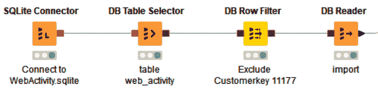

图 2.4 – 从数据库导入数据：连接、选择、构建 SQL 查询并导入

让我们逐一检查这些节点：

+   `WebActivity.sqlite` 文件。配置窗口只需要数据库文件路径，因为 SQLite 是基于文件的数据库。所有其他设置已经在节点中预设。事实上，在专用连接器中预设一些设置是很常见的，因此专用连接器所需的设置比通用 DB Connector 节点少。拖放 `.sqlite` 文件会自动生成带有预加载配置设置的 **SQLite DB Connector** 节点。

+   **选择表**：**DB Table Selector** 节点允许你从连接的数据库中选择要操作的表。如果你是 SQL 专家，**自定义查询** 标志允许你为要提取的数据子集创建自己的查询。

+   **构建 SQL 查询**：如果你不是 SQL 专家，你仍然可以构建自己的 SQL 查询来提取数据子集。**DB/Query** 类别中的 DB 节点将 SQL 查询作为输入，并在其基础上添加更多 SQL 查询。该节点的图形用户界面完全不需要编码，因此无需了解任何 SQL 代码。例如，**DB Row Filter** 节点的配置窗口在右侧提供了一个图形编辑器，用于构建行过滤的 SQL 查询。

在下面的截图中（*图 2.5*），**CustomerKey = 11177** 的记录已被排除：

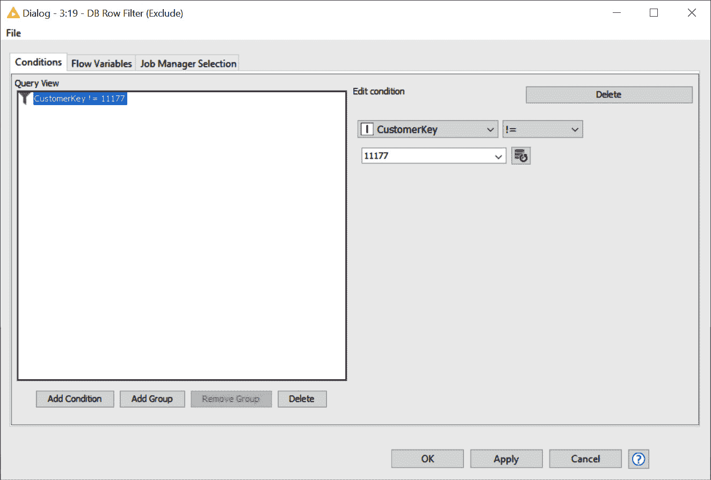

图 2.5 – DB 行过滤器节点的图形用户界面。该节点构建 SQL 查询以过滤掉没有使用任何 SQL 脚本的记录

+   **导入数据**：最后，**DB Reader** 节点根据输入的 SQL 查询从数据库连接中导入数据。DB Reader 节点没有配置窗口，因为导入数据所需的所有 SQL 设置都包含在其输入端口的 SQL 查询中。除了 DB Reader 节点外，还有许多其他节点可以在这样的序列末尾从数据库中导入数据。它们都位于节点配置面板中的 **DB/读/写** 类别下。

    重要提示

    您是否注意到*图 2.4*中的节点端口？我们从黑色三角形（数据）经过红色方块（连接）到棕色方块（SQL 查询）。只有相同类型的端口，传输相同类型的数据，才能连接！

为了检查结果，在成功执行 DB Reader 节点后，您可以右键点击序列中的最后一个节点——带有黑色三角形（数据）端口的节点，在此情况下是 DB Reader 节点——并选择菜单中的最后一项。这将显示输出数据表。

数据库节点只会生成一个 SQL 查询。在输出端口，您仍然可以通过右键点击节点，选择菜单中的最后一项，然后点击**缓存行数**按钮，在**表格预览**标签页中临时可视化所选数量的顶部行，以检查查询结果。

此时，我们也已经导入了最后一个数据集，包括迁移到新网站系统后的客户网页活动数据。

现在，让我们花点时间了解数据结构和数据类型。

# 数据类型和转换

如果您检查之前描述的任何节点的输出数据表，您将看到数据的表格化表示。在这里，每个值是通过`RowID`（记录的标识号）来识别的，并且通过`CustomerKey 11000`为`M`，如`Gender`列头所示，行 ID 为`Row0`。在读取节点中，行 ID 和列头可以自动生成，或者根据数据中的某列或某行的值分配。

以下是由 File Reader 节点输出的数据表的截图：

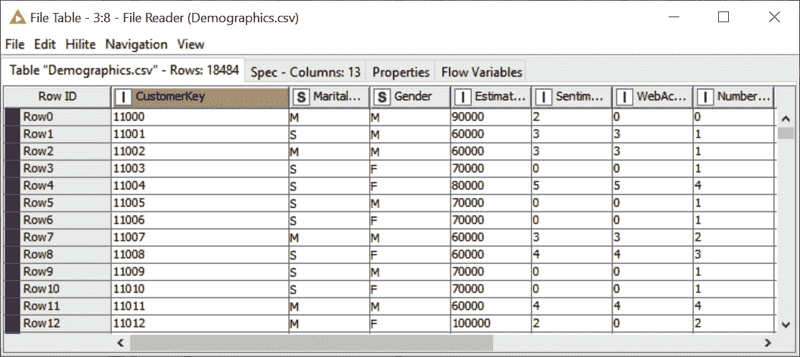

图 2.6 – 一个 KNIME 数据表。在这里，一个单元格是通过其 RowID 值和列头来识别的。

每个数据列也都有一个数据类型，正如您在*图 2.6*中看到的那样，可以通过列头中的图标来识别。基本数据类型有`true/false`和**String**。但是，也有更多复杂的数据类型，如**Date&Time**、**Document**、**Image**、**Network**等。我们将在接下来的章节中看到这些数据类型的一些例子。

当然，一个数据列并不是注定永远保持该数据类型。如果条件允许，它可以转换为另一种数据类型。某些节点专门用于转换，您可以在节点库中的**Manipulation/Column/Convert & Replace**下找到它们。

在我们读取的数据中，`CustomerKey`被导入为五位整数。但是，将其从整数类型表示转换为字符串类型表示可能会更方便。为此，我们使用**Number to String**节点。配置窗口由一个包含/排除框架组成，用于选择需要改变类型的列。相反的转换可以通过**String to Number**节点实现。**Double to Int**节点在从双精度浮点数转换为整数时也很有用。

提示

**字符串操作**和**数学公式**节点，虽然它们的主要任务是数据转换，但也提供一些转换功能。

我们希望引起你对**类别转数字**节点的注意。这个节点非常有用，可以将名义类别离散化，并将它们转换为数字，因为神经网络只接受数字作为目标类别。

特殊数据类型，如**图像**或**日期和时间**，提供了它们自己的转换节点。一个非常有用的节点是**字符串到日期和时间**节点。**日期**或**时间**对象通常被读取为**字符串**，而这个节点将它们转换为适当的类型对象。

在接下来的部分，我们将整合所有这些客户信息，从迁移前后的网络活动开始。在这两个数据集中，描述网络活动的列名不同：`First_WebActivity_` 和 `First(WebActivity)`。我们将它们标准化为相同的名称：`First_WebActivity_`。

这正是**列重命名**节点的功能：

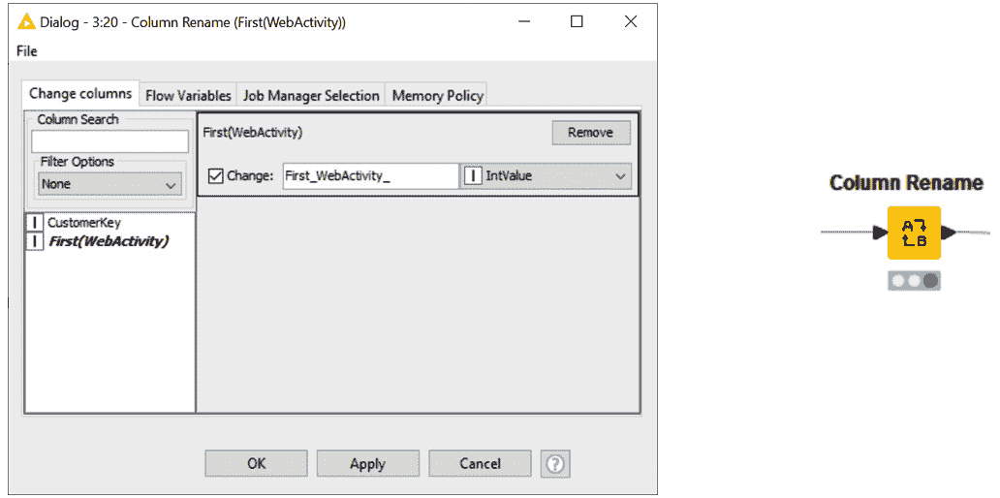

图 2.7 – 列重命名节点及其配置窗口

**列重命名**节点的配置窗口列出了输入数据表中所有的列名，在左侧显示。双击某一列会在右侧打开一个框架，显示当前的列名，并要求输入新的列名和/或新的类型。我们在本节中介绍的所有节点可以在*图 2.13*中的工作流中看到。

现在，我们准备好将两个网络活动数据集合并，并通过它们的`CustomerKey`值联接所有其他数据集。

# 数据转换

我们已经从文件和数据库中读取了数据。在本节中，我们将执行一些操作来整合、筛选、聚合和转换这些数据。我们将从整合操作开始。

### 联接与连接

来自旧系统的网络活动数据集来自一个 CSV 文件，经过列重命名后，包含两列数据：`CustomerKey` 和 `First_WebActivity_`。`First_WebActivity_`表示客户在公司网站上的活跃度：`0`表示不活跃，`3`表示**非常活跃**。

来自新网页系统的网络活动数据集来自 SQLite 数据库，包含三列：`CustomerKey`、`First_WebActivity_` 和 `Count`。`Count`只是与数据行相关的递增数字，对接下来的分析不重要。我们稍后可以决定是否删除它或保留它。

如果能够将来自旧系统和新系统的网页活动排名放在同一个数据表中，那就太好了。为此，我们使用 **Concatenate** 节点。两个输入数据表被放置在同一个输出数据表中。属于同名列的数据单元被放置在相同的输出列中。仅存在于一个表中的数据列可以保留（列的联合）或移除（列的交集），具体取决于节点配置窗口中的设置。节点配置窗口还提供了一些策略，用于处理在两个输入表中都存在相同行 ID 的行。

我们将两个网页活动数据表进行了合并，并在输出数据表中保留了数据列的联合。

重要提示

Concatenate 节点图标的左下角显示三个点。点击这三个点，您可以添加更多的输入端口，从而连接更多的输入数据表。

现在让我们来处理情感分析数据。`SentimentAnalysis.table` 生成了一个包含 `CustomerKey` 和 `SentimentAnalysis` 列的数据表。`SentimentAnalysis` 包含客户对公司和产品的情感，表达为文本。`SentimentRating.csv` 生成了一个包含两列的数据表：`SentimentAnalysis` 和 `SentimentRating`。这两列都表达客户情感：一列为文本，另一列为排名序数。这是一个映射数据表，用于将文本转换为排名情感，反之亦然。根据我们要进行的分析类型，我们可能需要文本表达或排名表达。因此，为了确保安全，我们将这两个数据表连接在一起，将它们的 `CustomerKey`、`SentimentAnalysis`（文本）和 `SentimentRating`（序数）都放在同一个数据表中。这是通过 **Joiner** 节点实现的。

Joiner 节点根据键值将两个输入数据表中的数据单元合并到同一行。在我们的例子中，键值由两个输入数据表中都存在的 `SentimentAnalysis` 列提供。因此，每个客户（`CustomerKey`）将拥有 `SentimentAnalysis` 文本值和相应的 `SentimentRating` 值。Joiner 节点提供四种不同的连接模式：**内连接**（两个表中键值的交集）、**左外连接**（左/上表中的所有键值）、**右外连接**（右/下表中的所有键值）和 **全外连接**（两个表中的所有键值）。

在 *图 2.8* 中，您可以找到 Joiner 节点配置窗口的两个选项卡：

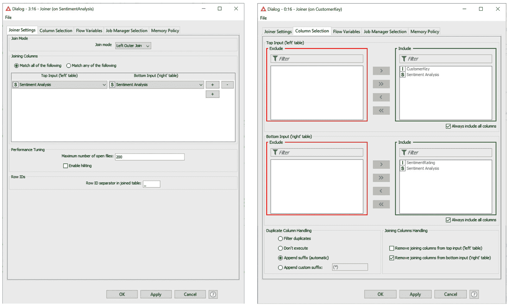

图 2.8 – Joiner 节点的配置窗口：Joiner 设置和列选择选项卡

连接器节点的配置窗口包含两个选项卡：**连接器设置**和**列选择**。**连接器设置**选项卡允许选择连接模式和包含关键值的数据列，适用于两个输入表格。**列选择**选项卡设置在构建最终连接数据行时，两个输入表格中要保留的列。还提供了一些附加选项，以处理两个表格中具有相同名称的列，并设置在连接执行后如何处理关键列。

重要提示

连接操作中可以有多个层级的关键列。只需在**连接器设置**选项卡中选择**+**按钮来添加更多关键列。如果有多个层级的关键列，您可以决定是否在所有关键值匹配时执行连接（**匹配所有以下条件**），或者仅当一个关键值匹配时执行连接（**匹配以下任意条件**），如左侧的单选按钮所设置（*图 2.8*）。

我们使用`SentimentAnalysis`作为两个表中的关键列，并使用左外连接将两个情感表连接在一起。左外连接包括左侧（上方）表格（客户表）中的所有关键值，因此确保所有客户的情感值都保留在输出数据表中。

在将`CustomerKey`与所有情感表达式连接后，我们将执行其他类似的连接操作，使用`CustomerKey`作为关键列，级联多次连接，以将同一客户的不同数据片段收集到一个表中（*图 2.13*）。

如果我们检查由`Demographics.csv`文件生成的输出，我们会注意到有两个数据列也由其他文件提供：`WebActivity`和`SentimentRating`。这些是旧列，应当用`SentimentAnalysis.table`文件和网页活动文件中的相应列替换。我们可以在**连接器**节点的**列选择**选项卡中删除这两列。或者，我们也可以通过专用节点将这两列过滤掉。

让我们来看一下如何从数据表中过滤列和行。

### 列和行过滤

**列过滤器**节点专门用于过滤输入数据表中的列。我们可以按如下方式进行操作：

+   手动选择要保留和排除的列（**手动选择**）。

+   使用通配符或正则表达式来匹配要排除或保留的列名（**通配符/正则表达式选择**）。

+   定义要包含或排除的列的数据类型（**类型选择**）。

这些选项都可以在**列过滤器**节点的配置窗口顶部找到。选择其中一个选项后，配置窗口会根据该选项的设置进行调整。以下是这些选项。

+   **手动选择**：提供一个包含/排除框架，用于将列从一个数据框移动到另一个数据框，以包含或排除输出数据表中的输入列（*图 2.9*）。

+   `*` 表示通配符字符；例如，`R*` 表示所有以 `R` 开头的单词，`R*a` 表示所有以 `R` 开头并以 `a` 结尾的单词，依此类推。正则表达式（Regex）指的是正则表达式。

+   **类型选择**：此选项提供了一个多项选择，用于选择列的数据类型。

Column Filter 节点的配置窗口如*图 2.9*所示：

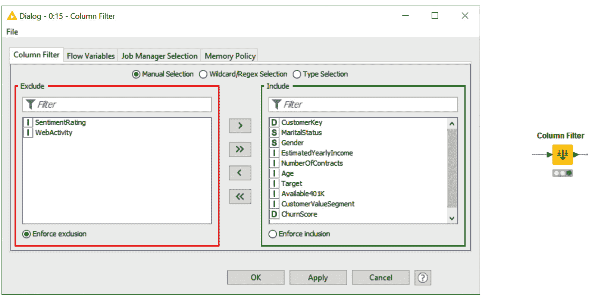

图 2.9 – Column Filter 节点及其配置窗口

到目前为止，我们一直是在按列过滤数据。数据过滤的另一种方式是按行过滤。在这种情况下，我们想要删除或保留表中的某些数据行。例如，在处理`Demographics.csv`文件中的数据时，我们可能只想保留数据集中的男性，或者删除所有**CustomerKey 为 11177**的记录。对于这种类型的过滤操作，有许多不同的节点：**行过滤器**、**行过滤器（实验室版）**、**基于规则的行过滤器**、**参考行过滤器**、**基于日期和时间的行过滤器**等：

+   **行过滤器**节点非常简单且非常强大：右侧是过滤条件，左侧是过滤模式。

+   **过滤条件**将数据列中的单元格内容与条件进行匹配。要匹配的输入数据列在顶部选择。条件可以包括**模式匹配**（包括通配符和正则表达式）、**范围检查**（对于数值列非常有用）和**缺失值匹配**。

    **过滤模式**在左侧设置，确定是否包括或排除匹配的行，可以通过属性值、行号或 **RowID** 进行匹配：

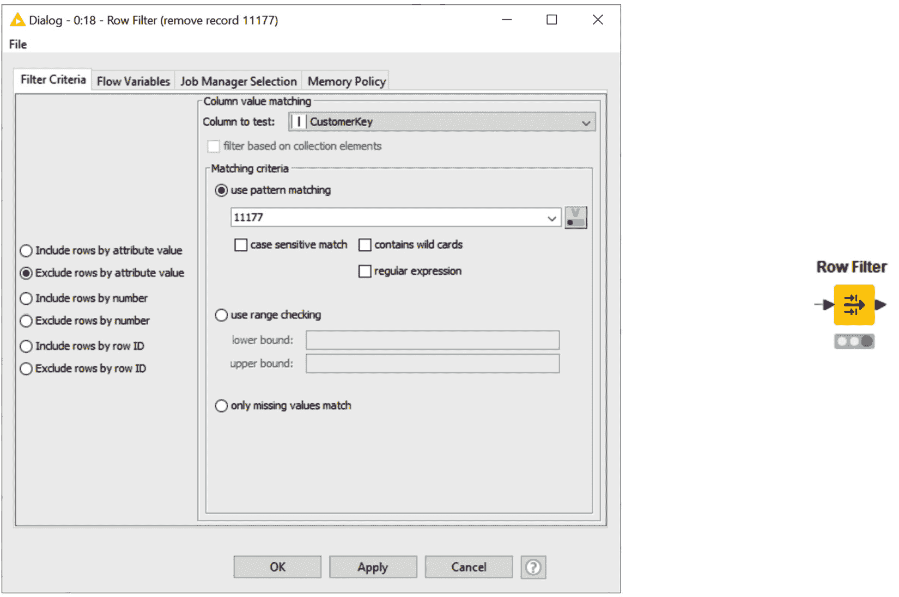

图 2.10 – 行过滤器节点及其配置窗口

在这里，我们使用`CustomerKey`属性过滤掉值为`11177`的数据。

+   使用 `11177` 输入到 **Table Creator** 节点的 **Reference Row Filter** 节点的下端口，也可以获得类似的结果。

+   **表格创建器**节点是一个非常有趣的节点，适用于临时的小数据。它充当内部电子表格的角色，可以存储几行数据。

另一组非常重要的节点是执行聚合操作的节点。

### 聚合

聚合是任何数据准备中非常重要的一部分。无论是用于仪表板还是机器学习算法，某些聚合操作通常是必要的。常用的聚合节点有两个：**GroupBy** 节点和 **Pivoting** 节点。

在*图 2.11*中，你可以看到 GroupBy 节点配置窗口中的两个标签页：

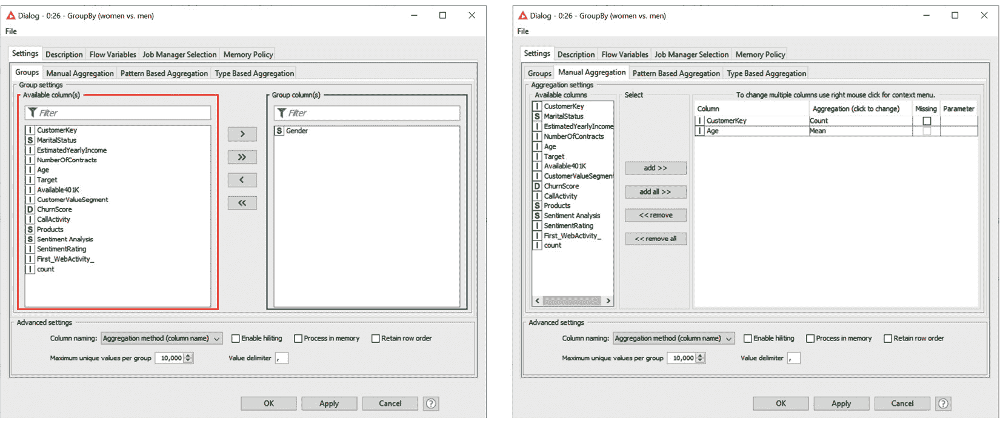

分组和手动聚合

图 2.11 – GroupBy 节点配置窗口的两个标签页：分组和手动聚合

**GroupBy** 节点将数据分组，并在这些组上计算一些度量，如简单计数、平均值、方差、百分比等。分组的识别发生在配置窗口中的 **Groups** 标签页，度量设置则发生在其他标签页中（*图 2.11*）。

在 **Groups** 标签页中，选择那些其值组合定义不同数据组的数据列。节点然后为每个组创建一行。例如，选择 **Gender** 列，且其不同值为 **male** 和 **female**，意味着识别出 **Gender** 为 **male** 或 **female** 的数据组。选择 **Gender**（**male**/**female**）和 **MaritalStatus**（**single**/**married**）列作为分组列，意味着识别出 **single-female**、**single-male**、**married-female** 和 **married-male** 数据组。

然后，我们需要选择为这些组提供的度量。我们可以通过以下方式进行：

+   手动选择列并逐一应用度量（**手动聚合**）

+   基于模式选择列，包括通配符或正则表达式，并为每组列应用的度量（**基于模式的聚合**）

+   按类型选择列并为每组列应用的度量（**基于类型的聚合**）

每种度量设置模式在配置窗口中都有自己的标签页（*图 2.11*）。在 `CustomerKey` 列和 `Age` 列中，选择 `Gender` 作为分组列后，我们得到输入表中女性和男性的数量以及平均年龄。

重要提示

**GroupBy** 节点提供了大量的度量方式。我们已经看到了 **Count** 和 **Mean**。然而，我们还可以使用百分比、中位数、方差、缺失值数量、总和、众数、最小值、最大值、首值、尾值、峰度、（不同）值的拼接、相关性等。值得花时间研究一下 **GroupBy** 节点中所有可用的度量方法。

类似于 `Gender`（`MaritalStatus`（`CustomerKey` 数据列）。最终结果是一个表格，其中 **male**/**female** 为行 ID，**married**/**single** 为列标题，每个组合的出现次数为单元格内容。

这意味着分组列中的不同值生成行，而透视列中的不同值生成列。

**Pivoting** 节点的配置窗口有三个标签：**Groups** 用于选择分组列，**Pivots** 用于选择透视列，**Manual Aggregation** 用于手动选择数据列和计算度量。如果使用多个手动聚合，则结果透视表将为每个聚合方法和透视值的组合生成一列。

此外，节点会根据仅包含组列的第二个输出端口和仅包含透视列的第三个输出端口返回总聚合。

现在，让我们继续看几个非常灵活且强大的节点，用于执行数据转换。

### 数学公式和字符串操作节点

KNIME 分析平台提供了许多用于数据转换的节点。我们无法在此描述所有节点。因此，我们将把发现它们的乐趣留给您，在这里我们将描述两个非常强大的节点：**字符串操作**节点和**数学公式**节点。

**字符串操作**节点对数据单元格中的字符串值进行转换。转换函数在节点配置窗口中的**功能**面板中列出（见*图 2.12*）。在这里，您可以看到函数及其可能的语法。如果您选择列表中的某个函数，右侧名为**描述**的面板将显示该函数任务和语法的完整描述。然而，转换是在窗口底部的**表达式**编辑器中实现的。

首先，从`""`或输入数据表中其他列的值中选择（双击）一个转换。通过双击左侧**列列表**面板中的列名称，列中的值会自动插入，且语法正确。

让我们以一个例子为例：

1.  在由`M`和`F`生成的数据表中，分别为男性（`M`）和女性（`F`）创建了一个表格，包含每组的出现次数和平均年龄（`M/F`）。让我们将`"M"`更改为`"Male"`，将`"F"`更改为`"Female"`。

1.  然后，我们将使用`replace(str, search, replace)`函数，其中`str`表示要操作的列，`search`表示要在单元格值中搜索的字符串，`replace`表示要用作替换的字符串。双击**性别**列中的**列列表**面板，并手动完成表达式，最终得到以下表达式：

    ```py
    replace($Gender$, "M", "Male")
    ```

1.  在随后的节点中，我们得到了以下结果：

    ```py
    replace($Gender$, "F", "Female")
    ```

    **字符串操作**节点及其配置窗口如下所示（见*图 2.12*）：

    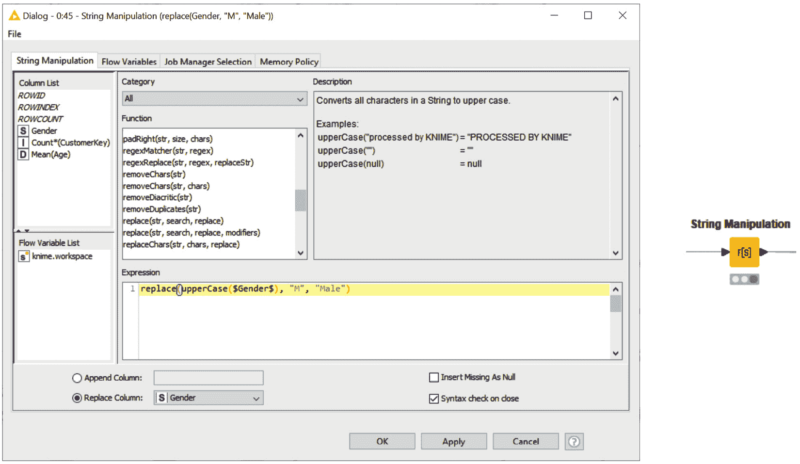

    ```py
    replace(upperCase($Gender$), "M", "Male")
    ```

    我们会得到类似的表达式来替换`"F"`和`"Female"`。

1.  最后，我们通过在配置窗口的下方使用**替换列**选项，将原始值替换为新值，以更新`性别`列。

也可以通过**字符串操作（多列）**节点将相同的转换应用于多个输入数据列。该节点的功能与**字符串操作**节点相同，只不过它将设置的表达式应用于所有选定的数据列。其配置窗口的下半部分与**字符串操作**节点相同，而上半部分则允许您选择应用表达式的所有列。

重要说明

在`$$CURRENTCOLUMN$$`常规列名称的**表达式**编辑器中，**函数**列表中大量的字符串转换使得此节点极为强大。

一个与字符串操作节点非常相似的节点，尽管它处理的是不同的任务，那就是**数学公式**节点。数学公式节点对输入数据执行数学表达式。此外，它的工作方式与字符串操作节点完全相同。在配置窗口中，可用的数学函数列出了中央**函数**面板。如果从列表中选择了某个函数，描述将在**描述**面板中显示。最终的表达式是在底部的**表达式**编辑器中编写的。可以通过双击左侧**列列表**面板中的列名，将列名插入到**表达式**编辑器中。可以嵌套使用数学函数。

**数学公式（多列）**节点扩展了**数学公式**节点，使其能够将相同的公式应用于多个选定的列。

*图 2.13* 显示了包含本章所描述的所有操作的最终工作流，且该工作流也可以在 KNIME Hub 上找到：[`hub.knime.com/kathrin/spaces/Codeless%20Deep%20Learning%20with%20KNIME/latest/Chapter%202/`](https://hub.knime.com/kathrin/spaces/Codeless%20Deep%20Learning%20with%20KNIME/latest/Chapter%202/)：

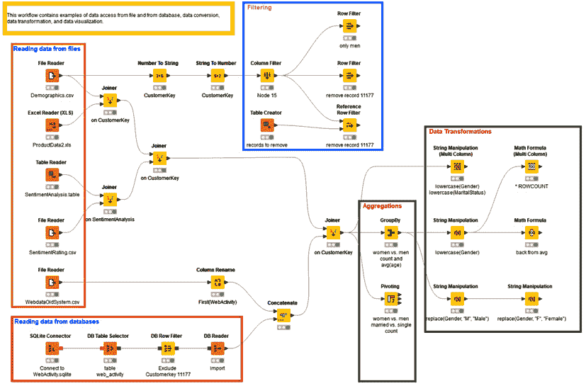

图 2.13 – 概述了在 KNIME Analytics Platform 中可用的一些数据访问、数据转换和数据转换节点

到目前为止，我们看到的是数据上的静态转换。那么，如何在不同的条件下使用不同的转换呢？以**行过滤器**节点为例。今天，我可能想要从数据表中过滤掉女性记录，而明天则是男性记录。我如何做到这一点，而不必在每次运行时都更改所有相关节点的配置设置呢？现在是时候向你介绍**流变量**了。

# 工作流参数化

让我们考虑一个简单的工作流：读取`Demographics.csv`文件，筛选出所有`Gender = M 或 F`的数据行，并将`M`或`F`分别替换为`Male`或`Female`。一旦我们决定是处理`M`还是`F`，工作流就变得相当简单，并且包括一个`replace()`函数：

1.  让我们添加一个节点，允许我们选择是处理`M`还是`F`记录：**字符串配置**节点。此节点生成一个流变量。流变量是一个随着数据流在工作流分支中传递的参数，它可以用来覆盖其他节点中的设置。

1.  就我们而言，目前在此节点的配置窗口中，有两个设置非常重要：默认值和变量名称。暂时使用默认值`M`来处理`Gender = M`记录，并将流变量命名为`gender_variable`。

1.  执行节点会创建一个名为`gender_variable`的流变量，其值为`M`：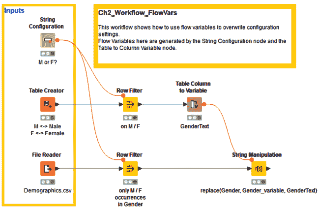

    图 2.14 – 该工作流展示了如何使用流变量

1.  现在，让我们通过**V**按钮使用`gender_variable`的值。

    你注意到**字符串配置**节点和**行过滤器**节点之间的红色连接了吗？这是一条**流变量**连接。流变量通过这些连接注入到节点和分支中。

    重要说明

    所有节点都有隐藏的红色圆形端口，用于流变量的输入和输出。点击节点的流变量端口并将其释放到另一个节点上，会显示出隐藏的流变量端口并连接这些节点。或者，在每个节点的上下文菜单中，**显示流变量端口**选项可以使它们可见。

1.  之后，我们创建一个包含两行的小表格，[`M, 男性`] 和 [`F, 女性`]。我们选择与`gender_variable`流变量中的值对应的行，并旨在将`M`或`F`字符替换为文本。对于这最后一部分，我们需要将`M`或`F`字符中的硬编码字符串替换为**流变量**。

1.  现在，我们将`Male`/`Female`文本转换为一个新的流变量。我们通过`gender_variable`来实现，这个变量是由`Row0`生成的，取决于在`$Gender$`中选择了[`M, Male`]或[`F, Female`]，以及流变量（`$$Sgender_variable$$`）。此外，流变量可以自动插入并使用正确的语法，在**表达式**编辑器中，通过双击**流变量列表**面板中流变量名称（位于字符串操作节点配置窗口的左侧）来完成（*图 2.12*）。

使用流变量的好处显而易见。当我们决定使用`F`而不是`M`时，只需在**字符串配置**节点中更改设置，而不需要在每个单独的节点中检查并更改设置。

我们展示的仅是处理流变量的节点中的一小部分。你可以在**工作流控制/变量**类别中进一步探索这些节点，位于节点库面板中。

# 摘要

本书没有足够的篇幅来描述 KNIME Analytics Platform 中更多的节点。我们将这项探索性任务留给你自己。

KNIME Analytics Platform 包括超过 2,000 个节点，并涵盖各种各样的功能。然而，大多数情况下工作的通用节点数量要少得多，例如，例如，文件读取器，行过滤器，GroupBy，Join，串联，数学公式，字符串操作，规则引擎等等。我们在本章中描述了大部分节点，为您构建更复杂的深度学习工作流程提供了坚实的基础，我们将在下一章中进行深入讨论。

# 问题和练习

通过回答以下问题来检查您对本章节中提出的概念的理解水平：

1.  如何读取变长文本文件的行？

    a) 通过使用 CSV 读取节点

    b) 通过使用文件读取节点

    c) 通过使用文件读取节点和启用短行选项

    d) 通过使用文件读取节点和启用的限制行选项

1.  如何筛选记录以 `Age > 42` 列？

    a) 通过使用列过滤节点并选择 `Age` 列

    b) 通过使用行过滤节点和模式匹配 `=42`，在右侧使用 **包括** 选项

    c) 通过使用行过滤节点和范围检查，下限为 *42*，在右侧使用 **包括** 选项

    d) 通过使用行过滤节点和范围检查，下限为 *42*，在右侧使用 **排除** 选项

1.  如何找到单身女性的平均情感评分？

    a) 通过使用 GroupBy 节点，以 `Gender` 和 `MaritalStatus` 作为组列，并在 `SentimentRating` 列上执行均值操作

    b) 通过使用 GroupBy 节点，以 `Gender` 作为组列，并在 `CustomerKey` 列上执行计数操作

    c) 通过使用 GroupBy 节点，以 `CustomerKey` 作为组列，并在 `SentimentAnalysis` 列上执行连接操作

    d) 通过使用 GroupBy 节点，以 `MaritalStatus` 作为组列，并在 `SentimentRating` 列上执行百分比操作

1.  为什么我们需要流变量？

    a) 生成新值

    b) 为了提供必要的红色连接

    c) 用于在配置窗口中填充流变量列表

    d) 为了参数化工作流程
