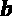
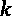
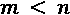
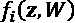
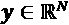
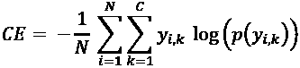

# 第三章：*第三章:* 神经网络入门

在深入使用 KNIME 分析平台和其与 Keras 库的集成进行深度学习网络的实际实现之前，我们将简要介绍一些神经网络和深度学习背后的理论概念。这是本书中唯一纯粹的理论性章节，它对于理解随后的实际实现的原理和原因至关重要。

在本章中，我们将覆盖以下主题：

+   神经网络与深度学习——基本概念

+   设计你的网络

+   训练神经网络

我们将从神经网络和深度学习的基本概念开始：从第一个人工神经元作为生物神经元的模拟，到使用反向传播算法训练一个全连接的前馈神经网络。

接下来，我们将讨论神经架构的设计以及最终神经网络的训练。实际上，在设计神经架构时，我们需要恰当地选择其拓扑结构、神经层和激活函数，并引入一些技术来避免过拟合。

最后，在进行训练之前，我们需要知道什么时候使用哪种损失函数，以及训练中需要设置的不同参数。这个内容将在本章的最后部分进行描述。

# 神经网络与深度学习——基本概念

当前你听到的几乎全是深度学习。深度学习源自传统的神经网络学科，属于机器学习领域。

神经网络领域经历了多个停滞与复兴的阶段。从 20 世纪 60 年代最初的感知机兴起，到感知机无法实现的局限性显现出来时的低谷；再到基于反向传播算法的多层前馈神经网络的重新兴起，以及训练递归网络所需的硬件能力在当时不可用时的又一低谷；直到今天，深度学习新范式、单元和架构的出现，运行在更强大的硬件上，可能还配备了 GPU。

让我们从头开始，在这一部分中，逐步了解神经网络和深度学习的基本概念。尽管这些基本概念对你来说可能并不陌生，特别是如果你已经参加过神经网络或深度学习课程，但我们仍希望在这里描述它们，作为接下来章节中关于 KNIME 深度学习功能描述的参考，并且为那些刚接触这个领域的新手提供帮助。

## 人工神经元与人工神经网络

**人工神经网络**（**ANNs**）始于模拟生物神经元，如 *图 3.1* 中左侧所示（Abbott, L.F. (1999) *Lapique's introduction of the integrate-and-fire model neuron* (*1907*[): https://web.archive.org/web/20070613230629/http:/neurotheory.columbia.edu/~larry/AbbottBrResBul99.](https://web.archive.org/web/20070613230629/http:/neurotheory.columbia.edu/~larry/AbbottBrResBul99.pdf)pdf. *Brain Research Bulletin. 50 (5/6)*: 303–304）。生物神经元是由细胞体（胞体）、几个输入树突和一个或多个轴突末端组成的神经细胞。激活时，它会产生一个尖锐的电位波动。树突通过化学突触接受电信号输入，通常来自其他神经元。突触中发生的化学反应增强或减少（即加权）输入的电信号，然后传递到神经元体。如果细胞体内的总电信号足够强，神经元会沿其轴突产生一个电位波动。然后轴突末端再次通过突触中的化学反应将波动传递给其他神经元。

图 3.1 – 左侧是生物神经元，具有树突上的输入 xj 和轴突端的输出 y（图片来源：维基百科）。右侧是人工神经元（感知器），其输入 xj 与权重 wj 相连，产生输出 y。

最简单的模拟试图仅使用两个输入和一个输出重现生物神经元，如 *图 3.1* 中右侧所示。现在树突的输入信号称为  和 ，通过两个权重  和  到达人工细胞的细胞体，模拟突触中的化学反应。如果达到细胞体的总输入信号超过给定的阈值 ，模拟“足够强”的概念，将生成一个输出信号 。这种简单的人工神经元称为**感知器**。

这里有两个需要澄清的细节：总输入信号和阈值函数。有许多神经电输入输出电压模型（Hodgkin, A. L.; Huxley, A. F. (1952), *膜电流的定量描述及其在[神经](https://www.ncbi.nlm.nih.gov/pmc/articles/PMC1392413)中的传导与兴奋中的应用*，《生理学杂志》 117 (4)：500–544）。表示总输入信号的最简单方法是使用所有输入信号的加权和，其中权重代表突触反应的作用。神经元细胞体的激发函数可以通过阶跃函数  来描述。因此，对于我们在 *图 3.1* 中的简化模拟，输出  的计算方式如下：

在这里， 是一个具有阈值  的阶跃函数：

，其中 。

如果推广到具有  输入信号的神经元，并且具有任何其他激活函数 ，我们可以得到以下公式：

在这里，阈值  已被转化为一个与输入信号  相连的权重 ，该信号始终处于开启状态——也就是说，始终设为 1。

然而，一个单独的人工神经元，就像一个单独的生物神经元一样，计算能力并不强大。它只能实现一些简单的功能，正如我们在下一个子节 *理解隐藏层的需求* 中看到的那样。正如生物界一样，神经元网络比单个神经元有更大的计算潜力。生物神经元网络，甚至是简单的大脑，能够学习并完成非常复杂的任务。同样，人工神经元网络也能够学习并完成非常复杂的任务。神经网络成功的关键在于其在形成复杂或简单的架构以及训练它们以执行复杂或简单任务方面的灵活性。

一个感知机网络的示例如*图 3.2*所示。这个网络有三层神经元：输入层接收输入信号 ；第一隐含层有两个神经元，连接到输入层的输出；第二隐含层有三个神经元，连接到第一隐含层的输出；最后是输出层，只有一个神经元，由隐含层的输出供给，并产生网络的最终输出 。神经元通过一个圆圈表示，其中包含表示输入信号加权和的  符号和表示激活函数的  符号：

图 3.2 – 左侧是生物神经元网络（图片来自维基百科）。右侧是人工神经元网络（多层感知机）

请注意，在这种特定的架构中，所有连接从输入层移动到输出层：这是一个完全连接的前馈架构。当然，**前馈神经网络**可以有任意数量的隐含层，每个神经层也可以有任意数量的人工神经元。一个感知机的前馈网络叫做**多层感知机**（**MLP**）。

## 前馈神经网络中的信号传播

一个简单的完全连接的前馈神经网络可以描述为一个将输入值  转换为输出值  的函数，通过一系列中间值 ：隐含层的输出。例如，对于*图 3.3*中的网络，我们有以下内容：

这里， 是输入值（和输入单元）的数量， ， 是具有输出值  的隐藏神经元的数量， 是最终的输出值（在此架构中唯一的一个），而  是神经元的激活函数。如果我们从输入到输出逐步编号神经层，我们将标记第 1 层为输入层，第 2 层为隐藏层，第 3 层为输出层。神经层的这种逐步编号也体现在权重和隐藏单元的表示法中。 是  神经单元在  （隐藏）层中的输出值， 是连接第  层中的神经单元与第  层中的神经单元之间的权重。

重要说明

请注意，在这种表示法中， 和  在  和  中不是指数。它们仅描述输出单元在  中的网络层，以及在  中的目标层。

图 3.3 – 具有一个隐藏层和一个输出单元的全连接前馈神经网络

有许多类型的**激活函数** 。我们在上一节中看到了阶跃函数，但它有一个主要缺陷：既不连续也不可导。近年来，已经引入了一些类似的激活函数，它们更容易处理，因为它们在任何地方都是连续的并且可导。常见的例子有**sigmoid** 函数和**双曲正切**，。最近，引入了一种新的激活函数，称为**修正线性单元**（**ReLU**），它似乎在具有多个隐藏层的全连接前馈神经网络中表现更好。我们将在接下来的章节中详细描述这些激活函数。

重要说明

通常，同一层中的神经元使用相同的激活函数 ，但不同层之间可以使用不同的激活函数。

网络的另一个参数是其**拓扑结构**或架构。我们已经看到一个完全连接的前馈网络，其中所有连接从输入流向输出，并且在这种约束下，所有单元都连接到下一层的所有单元。然而，当然这不是唯一可能的神经拓扑结构。层内的交叉连接、从层到层的反向连接，以及单个神经元与自身的自连接也是可能的。

不同的连接方式和不同的架构会产生不同的数据处理函数。例如，自连接引入了时间成分，因为神经元在时间的当前输出将成为同一神经元在时间的额外输入；一个前馈神经网络，输入和输出数量相同，可以实现自编码器，并用于压缩或异常检测。我们将在本书后续内容中看到一些不同的神经架构及其可以实现的任务。目前，我们只是给你提供一个*图 3.4*中的神经网络拓扑的初步了解：

图 3.4 – 一些神经网络拓扑结构的例子

*图 3.4*中最左侧的第一个网络，其神经元完全连接，因此层的定义变得不必要。这是一个霍普菲尔德网络，通常用作关联记忆。

第二个网络是一个前馈自编码器：三层，输入单元和输出单元的数量相同，隐藏层有个单元，通常；这种网络架构已被用于异常检测或实现输入空间的降维。

最后，第三种网络呈现了带有自连接的单元。如前所述，自连接在网络实现的函数中引入了时间成分，因此通常用于时间序列分析。这个最后的网络属于递归神经网络。

让我们回到完全连接的前馈神经网络。既然我们已经看到了它们的结构，接下来我们试着理解它们为何以这种方式构建。

## 理解隐藏层的需求

现在的问题是：我们真的需要如此复杂的神经架构吗？*图 3.1*中的感知机能做什么，不能做什么？感知机使用阶跃函数作为激活函数，将一条线（输入信号的线性组合）作为二维空间中的判别面，其中该线的参数是感知机的权重和阈值。

经典的例子是**OR**和**AND**问题，这些问题可以通过一条直线将“1”输出与“0”输出分开来解决。因此，感知器可以实现这两个问题的解决方案。然而，它无法解决**XOR**问题。当两个输入不同（一个是“0”，一个是“1”）时，XOR 函数输出“1”；当两个输入相同（都为“0”或都为“1”）时，输出“0”。事实上，XOR 操作符是一个非线性可分的问题，一条直线不足以将“1”输出与“0”输出分开（*图 3.5*）：

图 3.5 – 感知器实现了一个线性判别面，这在二维空间中是一条直线。所有线性可分的问题都可以通过单个感知器解决。而感知器无法解决非线性可分的问题

解决 XOR 问题的唯一可能方法是将一个具有两个单元的隐藏层添加到感知器架构中，从而使其成为 MLP（*图 3.6*）。绿色和红色的两个隐藏单元分别实现一条直线，用于分隔一些“0”和“1”。然后，输出层中的一个单元在之前两条直线的基础上构建一条新线，并实现最终的判别：

图 3.6 – 增加一个具有两个单元的隐藏层，使得 MLP 能够解决 XOR 问题

*图 3.7*中的示例显示了一个三层网络：一个接收输入值的输入层  和 ，一个包含两个单元的隐藏层，以及只有一个单元的输出层。这两个隐藏单元实现了两条判别线： 对应红色单元， 对应橙色单元。输出线则在这两条线之上实现了一个判别线，即 ，在*图 3.7*中显示的平面上由绿色区域标识：

图 3.7 – 左侧的网络仅在输入空间中的绿色区域的点处激活，如右侧所示

如你所见，单独添加一个隐藏层就可以使神经网络在实现可能的函数方面变得更强大。然而，还有更多内容。**通用逼近定理**指出，一个简单的前馈网络，拥有单一的隐藏层并且具有足够数量的神经元，能够逼近在紧凑子集上定义的任何连续函数！，前提是激活函数满足适当的假设，并且假设网络已经得到了足够的训练（Hornik K.、Stinchcombe M.、White H.（1989 年）《多层前馈网络》[*神经网络是通用逼近器*：http://www.sciencedirect.com/scie](http://www.sciencedirect.com/science/article/pii/0893608089900208)nce/article/pii/0893608089900208 《神经网络》，第 2 卷，第 5 期，(*1989*) 第 359-366 页）。这个定理证明了神经网络具有某种*普适性*特性。也就是说，任何函数都可以被一个足够大且训练充分的神经网络所逼近。所谓足够大，指的是前馈网络中神经元的数量。此外，引用的论文还提到网络架构只需一个隐藏层，并且神经元足够多。

因此，即使是非常简单的网络架构，也可以非常强大！当然，前提是隐藏层足够大（否则可能需要过长的训练时间），并且训练时间足够长。

一个带有单层的前馈网络足以表示任何函数，但该层可能过于庞大，且可能无法正确学习和泛化（Goodfellow I.、Bengio Y.、Courville A.（2016 年）《*深度学习*》，*MIT 出版社*）。

我们已经看到，引入一个或多个隐藏层到前馈神经网络中，使其变得极其强大。接下来我们来看看如何训练它。

## 训练多层感知器

神经网络包括几个自由参数：拓扑结构、权重和激活函数的参数。假设我们有一个完全连接的前馈网络，并且所有神经元都有一个预定义的激活函数，比如 sigmoid 函数。那么，唯一剩下的自由参数就是权重。

训练神经网络意味着反复展示训练集中的样本，并且每次都调整参数值（权重），以拟合基于期望输入输出行为计算的损失函数。为了找到最适合损失函数的权重，使用了梯度下降算法或**随机梯度下降（**SGD**）**的变体。其思路是通过沿着误差面最陡下降的方向更新权重。最陡下降的方向等同于梯度的负值。为了高效地计算梯度，采用了反向传播算法。让我们来看一下它是如何工作的。

### 反向传播背后的数学

回归问题的经典损失函数是总平方误差，定义如下：

这里， 和  分别是输出单元  的目标值和实际答案，求和在输出层的所有单元和训练集中的所有示例上进行 。

如果我们采用梯度下降策略以达到损失函数表面的最小值，在每次训练迭代中，网络中的每个权重必须在权重空间中按  的偏导数的相反方向增加（Goodfellow I.，Bengio Y.，Courville A.（2016）. *深度学习*，MIT 出版社）：

这个关于权重的误差偏导数是使用链式法则计算的：

这里， 是损失函数， 是神经元 j 的输出， 是它的总输入， 是来自前一层神经元  的输入权重：

对于连接到**输出层单元**的权重，偏导数将如下所示：

所以，最后：

因此，连接到输出单元的权重变化如下：

这里，， 是输入  到输出节点 ，而  是学习率。

对于连接到**隐藏层单元**的权重，偏导数的计算，因此权重的变化，更加复杂。虽然最后两个偏导数在提到隐藏层的神经元时保持不变，但  需要重新计算。

如果我们将损失函数  视为所有输入总和的函数，连接到神经元 j 的下一层所有神经元的输入总和为 ，经过一些数学操作后，我们得到了递归表达式：

这里，以下内容适用：

所有权重的更新公式，指向输出或隐藏神经元，如下所示：

这个递归公式告诉我们， 对于隐藏层中的单位  可以通过层  中所有的  的线性组合来计算，如果这是输出层，则为 ，如果这是另一个隐藏层，则为 。这意味着从输出层向输入层反向传播，我们可以计算所有的 ，从  开始，然后通过所有的 ，作为来自前一层的  的组合，层层相连。结合 ，我们还可以计算所有的权重更新 。

### 反向传播背后的理念

因此，前馈神经网络的训练可以视为一个两步过程：

1.  所有训练向量依次呈现给网络的输入层，信号在所有网络连接（和权重）中传播，直到输出层。所有训练样本通过网络后，计算输出层的总平方误差，作为单个平方误差的总和。这就是**前向传播**：

    图 3.8 – 在反向传播算法的前向传播中，所有训练样本依次呈现到输入层，并通过网络正向传播直到输出层，以计算输出值

1.  所有  在输出层的所有单位中计算。然后， 从输出层反向传播通过所有网络连接（和权重）直到输入层，所有隐藏层中的  也被计算。这就是**后向传播**：

图 3.9 – 在反向传播算法的后向传播中，所有  在输出层计算，并反向传播通过网络直到输入层。所有训练集的样本来回通过网络后，所有权重都会被更新

该算法被称为**反向传播**，因为在第二次传递过程中，误差信号沿着网络**反向传播**。

所有训练数据通过网络前后传递后，所有权重都会被更新。

同时注意单元激活函数的第一导数  在  中。显然，使用一个连续可导函数  有助于计算。这就是为什么  和  函数在神经网络架构中如此受欢迎的原因。

梯度下降算法无法保证到达误差函数的全局最小值，但通常会停留在局部最小值。如果局部最小值不能确保网络的满意性能，那么必须从新的初始条件开始重新训练，即网络权重的新的初始值。

神经网络在实现输入输出模型方面非常强大，并且在架构和参数方面非常灵活。通过不断增加更多的神经元和更多的隐藏层，构建庞大的神经网络变得极其容易。除了更长的训练时间外，另一个额外的风险是会迅速陷入**过拟合**训练数据的困境。过拟合是模型过于复杂的缺点，通常是自由参数过多，无法适应一个简单的任务。对于简单任务的过度维度化模型，结果是模型在某些时候会开始利用额外的参数来记忆训练集中的噪声和错误，从而显著降低模型的表现。神经网络的强大和灵活性使它们容易过拟合，特别是当我们处理的是小型训练集时。

重要提示

自神经网络引入以来，另一个主要的反对意见是它们的不可解释性。权重的调整与数据领域中的任何实体没有对应关系。在处理神经网络时，我们需要接受一个事实，那就是我们正在处理**黑箱**，我们可能无法理解其决策过程。

如果可解释性是我们项目的需求，那么神经网络可能不是我们应选择的工具。最近提出了一些技术，用于从黑箱模型中提取决策过程的知识，例如**SHAPLEY**值或**部分依赖图**（Molnar C. *可解释的机器学习*，https://christophm.github.io/interpretable-ml-book/index.html，GitHub）。它们目前处于初期阶段，尚未免于批评。然而，它们是解决神经网络可解释性问题的一个有趣尝试。这些内容超出了本书的范围，因此我们不会深入探讨。

基本理论已经介绍完，接下来让我们进入网络设计的部分。

# 设计你的网络

在上一节中，我们学习到神经网络的特点包括拓扑结构、权重和激活函数。特别是，前馈神经网络有输入层和输出层，中间还包含若干个隐藏层。尽管网络权重的值是通过训练过程自动估算的，但网络的拓扑结构和激活函数必须在训练前的网络设计阶段预先确定。不同的网络架构和不同的激活函数实现了不同的输入输出任务。为特定任务设计合适的神经网络架构仍然是深度学习领域的一个活跃研究领域（Goodfellow I.、Bengio Y.、Courville A.（2016）。*深度学习*，麻省理工学院出版社）。

训练算法中还涉及其他参数，如学习率或损失函数。我们也看到，神经网络容易出现过拟合问题；这意味着其灵活性使得它们很容易遭遇过拟合问题。是否有可能在训练过程中通过控制权重增长、更改损失函数或自我限制网络结构来避免过拟合问题呢？

本节为您概述了所有剩余的参数：网络的拓扑结构、训练算法中的参数、可能的激活函数、损失函数、正则化项等，始终关注控制过拟合效应，使训练算法更加高效，并开发更强大的神经网络架构。

## 常用激活函数

总结来说，单个神经层有多个输入  和多个输出 。神经元输出值的计算  需要经过两步：

1.  计算输入的加权和加上偏置 ：

     对于  和 

1.  应用激活函数  或  来计算输出 ，根据权重矩阵 ，并且可能是  或 ：

请注意， 是输入值到  号神经元的加权和，而  是所有加权输入和的向量。

网络也可以看作是一系列函数，每个函数实现一个神经层。根据网络架构，每个神经层有不同的输入值，并使用不同的激活函数，因此实现一个不同的函数，并且使用前面描述的两个计算步骤。

完整网络实现的总函数的复杂度还取决于涉及的层数；也就是说，它取决于网络的深度。

所有神经元都与上一层的所有输出连接的层称为**全连接层**。全连接前馈网络仅仅是一系列的全连接层，每一层都有其自己的激活函数。在前馈神经网络中，函数取决于层中神经元的数量、输入的数量以及激活函数。层之间的关键区别就是激活函数。让我们来看一下神经网络中最常用的激活函数。

### Sigmoid 函数

**Sigmoid 函数**是一个 S 形函数，其值介于和之间。对于层中的第个神经元，该函数定义如下：

它在*图 3.10*中左侧绘制。

对于二分类问题，这个函数是输出神经层的首选函数，因为其值范围使我们能够将输出解释为两个类别之一的概率。在这种情况下，输出神经层仅包含一个神经元，即单元大小为 1，并且使用 Sigmoid 激活函数。当然，相同的函数也可以作为具有更大单元大小的输出层和隐藏层的激活函数。

图 3.10 – Sigmoid 函数（左侧）可以作为解决二分类问题的网络单输出神经元的激活函数（中间）。它也可以作为网络中隐藏层或输出层中神经元的激活函数（右侧）

Sigmoid 函数的最大优点之一是它在任何地方都可导，并且具有简单的导数表达式。事实上，当使用 sigmoid 激活函数时，反向传播算法的权重更新规则变得非常简单，因为激活函数的导数只是，其中是神经元 j 的输出。

另一方面，在更复杂或深度的神经网络架构中，使用 sigmoid 作为神经元激活函数的最大缺点之一是梯度消失问题。事实上，在计算导数以更新网络权重时，sigmoid 函数输出值（< 1）的链式乘法可能会产生非常小的值。在这种情况下，每次训练迭代时会产生过小的梯度，导致训练算法收敛缓慢。

### 双曲正切（Tanh）

一种类似的激活函数是**双曲正切**，简称**tanh**。它也是一个 S 型函数，不同之处在于输出值介于和 1 之间，而不是介于和之间。对于号神经元，该函数定义如下：

它在*图 3.11*中显示在左侧：

图 3.11 – 双曲正切函数 tanh()也常用作神经单元的激活函数。在这种情况下，神经元的输出值位于(-1, +1)之间

在这里，函数的最大优点之一是其连续性和在任何地方都可导，这使得训练算法中权重更新的公式更为简单。还具有以 0 为中心的优势，这有助于稳定训练过程。

再次强调，使用 tanh 作为复杂或深度神经网络架构中的激活函数的最大缺点之一是梯度消失问题。

### 线性函数

一种特殊的激活函数是**线性激活函数**，也称为恒等函数：

这种函数通常在什么情况下使用？具有线性激活函数的神经层实现了线性回归模型。有时，线性激活函数的神经层也会被引入，以保持原始网络的响应，然后再经过变换以获得所需的范围或概率得分。在这种情况下，网络的最后一层被分为两层：一层使用线性激活函数保留原始输出，另一层则应用另一种激活函数以获得所需的输出格式。

在*第七章*中，*实现 NLP 应用*，我们描述了*生成产品名称*的案例研究，在该方法中，在线性激活函数层之后引入了一个新参数，称为**温度**。

### 修正线性单元

我们已经看到，使用 sigmoid 或 tanh 激活函数的深度神经网络通常会遭遇梯度消失问题。

一种有助于克服梯度消失问题的激活函数是**修正线性单元**函数，简称**ReLU**。ReLU 函数从 0 起像线性函数一样工作。实际上，ReLU 函数对于负值的  是 ，而对于正值的 ，它是恒等函数：

。

*图 3.12* 显示了 ReLU 函数的图形：

图 3.12 – ReLU 激活函数

ReLU 激活函数虽然能帮助解决梯度消失问题，但对于  是不可微分的。实际上，在训练神经网络时，这通常不是问题，因为通常使用的是单边导数，而不是报告导数未定义。

### Softmax 函数

到目前为止介绍的所有激活函数都是具有单一输出值的函数。这意味着仅使用加权和  来计算第  个神经元的输出值，而与加权和  无关，后者用于计算同一层中其他神经元的输出值。而**softmax 函数**则作用于整个输出向量 ，而不仅仅是单一的值 。

一般来说，softmax 函数将大小为  的向量  转换为大小为  的向量 ，该向量的值介于  和  之间，并且所有值  的和为 ：

这个额外的约束使我们能够将向量  的各个分量解释为不同类别的概率。因此，softmax 激活函数通常是多类分类问题中最后一个神经层的函数选择。输出向量的  位置的元素通过以下方式计算：

*图 3.13* 显示了一个使用 softmax 函数作为最后一层的示例网络，其中所有输出值的总和为 1：

图 3.13 – 一个简单的神经层，使用 softmax 激活函数

重要提示

softmax 函数也被逻辑回归算法用于多类分类问题。

### 其他支持的激活函数

自 sigmoid 函数以来，很多其他激活函数相继被提出。

ReLU 的变体包括 **泄露修正线性单元** 和 **参数化修正线性单元** (**PReLU**) 。LeakyReLU 对函数的负值部分提供了一个接近零的线条 ()，而纯 ReLU 则仅为零。PReLU 用参数化的斜率 () 代替 LeakyReLU 中固定的斜率来处理该线。参数  成为网络必须训练的参数之一。

这里是 LeakyReLU 和 PreLU 的定义：

+   LeakyReLU: 

+   PReLU: 

其他 ReLU 的变体，包括为了修复死 ReLU 引入的 **指数线性单元** (**ELU**) 和 **缩放指数线性单元** (**SELU**)。类似于 LeakyReLU，ELU 对负值有一个小斜率。它使用对数曲线而不是直线。缩放 ELU 向 ELU 添加了一个额外的参数 ，以供网络训练：

+   ELU: 

+   SELU: 

sigmoid 激活函数的一个近似是 **硬 sigmoid 激活函数**。它的计算速度比 sigmoid 快。尽管它是 sigmoid 激活函数的近似，但在分类任务中仍然能够提供合理的结果。然而，由于它只是近似，因此在回归任务中的表现较差：

+   Hard-Sigmoid: 

**SoftPlus** 激活函数也相当流行。它是 ReLU 激活函数的平滑版本：

+   SoftPlus: 

让我们看一下*图 3.14*：

图 3.14 – 一些额外流行的激活函数的图示，主要是 ReLU 和 sigmoid 函数的变体

*图 3.14* 中的图片显示了上述激活函数的图示。

## 避免过拟合的正则化技术

无论使用什么算法，目标始终是构建一个不仅在训练数据上表现良好，而且能够对新数据进行良好泛化的模型。

大型神经网络在使用过小的数据集进行训练时，常常会出现过度拟合训练数据的问题，无法对新数据进行有效的泛化。这个问题被称为过拟合。*图 3.15* 显示了神经网络在训练数据（满点）和测试数据（空心点）上的回归输入输出函数。在左侧，我们看到一个回归函数，甚至无法正确拟合训练数据，更不用说拟合测试数据了。这可能是由于架构规模不足或训练时间太短（**欠拟合**）。在中间，我们看到一个合理拟合训练数据和测试数据的回归曲线。在右侧，回归曲线完美拟合训练数据，但在拟合测试数据时失败；这就是**过拟合**问题：

图 3.15 – 从左到右，网络在欠拟合、拟合适当和过拟合训练数据时的回归曲线

我们如何事先知道神经网络架构的合适大小以及训练算法的合适训练轮数呢？有一些技巧可以用来解决过拟合问题，而无需过于担心网络的精确大小和训练轮数：范数正则化、丢弃法（dropout）和早停法（early stopping）。

### 范数正则化

过拟合的一个迹象是权重的值过高。因此，范数正则化的基本思想是通过在目标函数中添加惩罚项  来惩罚权重较大的值，即损失函数：

这里， 是真实值， 是预测值。通过添加这个惩罚项，得到一个新的损失函数 ：

因此，训练算法在最小化这个新的损失函数时，会得到一个具有较小权重值的权重配置。这是一种广为人知的**正则化**方法，你可能已经在线性或逻辑回归算法中见过。

参数  用于控制惩罚效应。 等同于没有正则化。较高的  值实现了更强的正则化效果，并导致较小的权重值。

有两种常用的惩罚范数函数：**L1 范数** 和 **L2 范数**。L1 范数是权重绝对值的总和，而 L2 范数是权重平方的总和：

 

 和  都是避免过拟合的常见方法，且有一个显著的区别。 正则化通常会导致较小的权重，但无法将权重减少到零。而另一方面， 正则化允许有一些较大的权重，同时将其他所有权重减小到零。在设计损失函数时，也可以同时使用  和  正则化。

此外，你还可以将正则化项应用于选定层的权重。已经设计了三种不同的范数正则化来作用于单一层：**核正则化**、**偏置正则化**和**活动正则化**。

核正则化惩罚权重，而不惩罚偏置；偏置正则化仅惩罚偏置；活动正则化导致选定层的输出值更小。

### Dropout

另一种常见的机器学习方法来避免过拟合是引入 Dropout 技术，这也是一种正则化技术。

这个思想是，在每次训练迭代中，随机忽略（丢弃）输入层或隐含层中的一些神经元，连同其所有的输入和输出连接。在每次迭代中，丢弃的神经元不同。因此，架构中的神经元数量以及哪些神经元被训练，实际上会随着迭代而变化。通过这种方式引入的随机化有助于控制过拟合效应。

Dropout 确保每个神经元和每一层不依赖于前一层的单个神经元，从而变得更加健壮，减少过拟合的可能性：

图 3.16 – Dropout 技术在每一层选择一些神经元，并在当前训练迭代中将其从更新中排除。左侧的完整网络只在右侧描述的四个训练迭代中部分训练。

**Dropout** 是分别应用于网络的每一层的。这通常意味着会在我们希望进行随机化的层后插入一个临时层，即 Dropout 层。Dropout 层控制在每次训练迭代中前一层的多少神经元被丢弃。

为了控制每一层中丢弃多少神经元，引入了一个新的参数：**丢弃率**。丢弃率定义了每次迭代中应该丢弃的神经元在该层中的比例。

提示

这里有两个关于 Dropout 的小贴士：

首先，丢弃层会导致每层神经元减少，从而降低层的容量。建议从每层神经元数较多的设置开始。

其次，丢弃层只应用于输入层或隐藏层，而不是输出层，因为我们希望模型的响应在每次迭代中始终相同。

### 早停法

另一种避免过拟合的选项是在网络开始过拟合之前停止训练过程，这被称为**早停法**。为了检测算法开始比测试数据更好地拟合训练数据的时刻，会使用额外的验证集来提供新的数据。在训练过程中，会监控网络在训练集和验证集上的表现。在训练阶段开始时，网络在训练集和验证集上的表现都会有所提升。然而，在某个时刻，网络在训练集上的表现持续改善，而在验证集上的表现开始恶化。一旦验证集上的表现开始变差，训练便会停止。

## 其他常用的层

到目前为止，我们已经介绍了两种不同类型的层：用于设计具有不同激活函数的全连接神经网络的密集层和用于正则化的丢弃层。通过这些层，你可以设计一个自动编码器，正如我们在*第五章*中所做的，*用于欺诈检测的自动编码器*。但实际上，还有许多其他层可以用于各种不同的任务。

### 卷积层

神经网络在图像分析领域非常强大，例如图像分类。前馈神经网络在这个领域也经常使用。然而，通常，密集层的顺序并不是单独使用的，而是与另一系列卷积层结合使用。**卷积层**被放置在神经网络的输入后，用于提取特征，并创建一个更好的图像表示，然后将其传递到下一个密集层——前馈架构——进行分类。这些网络被称为**卷积神经网络**，简称**CNN**。

*第九章*，*用于图像分类的卷积神经网络*，详细解释了卷积层的工作原理。它还将介绍一些其他相关的神经网络层，适用于分析具有空间关系的数据，如展平层和最大池化层。

### 循环神经网络

一类不属于前馈神经网络的神经网络是**递归神经网络**，简称**RNN**。通过在前馈神经网络中引入自连接或反向连接（递归连接），可以得到 RNN。这使得网络能够考虑上下文，因为它记住过去的输入，从而可以捕捉信号的动态。这些网络在处理序列数据时非常强大，例如时间序列数据或文本。

过去已经介绍了不同的 RNN 层，例如**长短期记忆**（**LSTM**）层或**门控循环单元**（**GRU**）层。 *第六章*，*需求预测的递归神经网络*详细讲解了 RNN 及 LSTM 单元的架构。

# 训练神经网络

在网络架构和激活函数设计之后，训练神经网络前的最后一步设计是选择损失函数。

我们将首先概览回归、二分类和多分类问题的可能损失函数。然后，我们将介绍一些优化器和训练算法的额外参数。

## 损失函数

为了训练前馈神经网络，必须选择合适的误差函数（通常称为**损失函数**）和匹配的最后一层。让我们先来概览一下常用于回归问题的损失函数。

### 回归问题的损失函数

在回归问题中，目标是预测一个单一的数值输出，输出层应该只有一个单元，并使用线性激活函数。训练这种网络的可能损失函数必须参考数值误差度量：

+   **均方误差**（**MSE**）**损失**：均方误差是回归问题的默认误差度量。对于训练样本，计算方法如下：

其中，是真实值，是预测值。MSE 对较大误差值赋予更多权重，并且总是为正值。一个完美的预测器将具有值为。

+   **均方对数误差**（**MSLE**）**损失**：MSLE 是一种损失函数，它对大误差的惩罚小于 MSE。它通过对预测值和真实值应用对数，然后使用 MSE 来计算。对于训练样本，计算方法如下：

MSLE 适用于大于或等于的数字，例如价格。为了避免出现，1 会被加到和上。

如果目标值的范围较大，且较大的误差不应比较小的误差受到显著的惩罚，推荐使用此损失函数。MSLE 始终为正，完美的模型损失为。

+   **平均绝对误差** (**MAE**) **损失**：MAE 损失函数对于离群点具有更强的鲁棒性。这意味着它对大误差的惩罚比之前的两个损失函数（MSE 和 MSLE）要小。对于训练样本，它的计算公式如下：

总结来说，我们可以在三种回归问题的损失函数中选择：MSE、MSLE 和 MAE。接下来，我们将继续讨论二分类和多分类问题的损失函数。

### 二分类问题的损失函数

对于二分类问题，常见的方法是将两个类别分别编码为和，并训练一个网络来预测类别的概率。在这种方法中，输出层只包含一个单元，并使用 sigmoid 激活函数。对于这种方法，推荐的默认损失函数是**二元交叉熵**。

在样本的训练集上，二元交叉熵可以按如下方式计算：

这里，是类别标签，真实值（ 1）是训练集中第*i*个样本的真实值，是网络对该类别预测的概率。由于这是一个二分类问题，损失函数的第二部分计算与另一类别相同的值。是之前显示的损失函数中的预测值。

对于二分类问题，其他可能的损失函数包括**铰链损失**和**平方铰链损失**。在这种情况下，两个类别必须分别编码为和，因此输出层中的单元必须使用 tanh 激活函数。

### 多分类问题的损失函数

在多分类问题中，通常每个类别通过一个整数值表示（类别 = 1, 2, 3, …），并使用独热编码（one-hot encoding）表示不同的类别。输出层应包含与类别数相等的神经单元，且每个单元都使用 softmax 激活函数，以便预测一个可以解释为每个类别概率的分数。

多分类问题的默认损失函数是**类别交叉熵**。在样本的训练集上，类别交叉熵可以通过对二元交叉熵进行扩展来计算，扩展到 C 个类别：

这里， 是类别标签 k，真实值（ 1）是训练集中的 *i* 样本的值， 是网络为类别 *k* 预测的相应概率。再者， 是输出神经元 k 为训练样本 *i* 预测的值 。

对于类别过多的多分类问题，例如语言建模，其中字典中的每个单词都是一个类别，**稀疏类别交叉熵**被使用。

另一个常用的损失函数是 **Kullback-Leibler 散度**。

除了前面介绍的常用损失函数，还可以定义自定义损失函数，以最好地适应当前的使用场景。

## 参数和训练算法的优化

现在我们的网络已经设计好，使用正确的输出层激活函数和合适的损失函数后，我们可以开始训练网络。现代训练算法通常基于 SGD 策略，利用反向传播来更新网络权重的值。在过去几年里，已经产生了不同变种的 SGD 算法（优化器），这些优化器经过优化，可以在具有不同属性的数据集上训练网络。例如，**Adagrad** 及其扩展 **Adadelta** 在稀疏数据上效果良好。**Adam** 涉及梯度及其平方梯度的移动平均，用于权重更新。Keras 文档页面概述了所有可用的训练算法：[`keras.io/optimizers/`](https://keras.io/optimizers/)。

重要提示

反向传播通常是指计算权重梯度的算法。训练神经网络的算法通常是某种变种的 SGD，并且使用反向传播来更新网络权重。

训练算法中一个重要的角色是 **学习率** 。学习率定义了在学习阶段沿着误差面上的梯度下降方向所采取的步长。过小的  会产生微小的步伐，因此需要很长时间才能到达损失函数的最小值，特别是当损失函数的斜率较平坦时。过大的  会产生较大的步伐，可能会超过最小值，尤其是当损失函数较窄且斜率较陡时。选择正确的学习率值  是至关重要的。一种可能的解决方案是使用自适应学习率，初始较大，并随着训练迭代次数的增加逐渐减小。

在 *图 3.17* 中，展示了使用过小、过大和自适应学习率在损失函数上移动的示例：

图 3.17 – 使用过小的学习率 （左侧），过大的学习率 （中间），以及自适应学习率  在一维权重空间中的误差逐步减少

所有损失函数都定义为对所有训练样本求和。这导致了在所有训练样本通过网络后更新权重的算法。该训练策略称为**批处理训练**。这是正确的操作方式，但它计算开销大且通常较慢。

替代方法是使用**在线训练**策略，其中权重在每个训练样本通过后更新。该策略计算开销较小，但它只是原始反向传播算法的近似。它也容易出现振荡现象。在这种情况下，采用较小的学习率是良好的实践。

几乎所有现代深度学习框架都采用了批处理和在线训练的混合模式，在这种模式下，它们使用小批量的训练样本执行单次更新步骤。

**动量**项被添加到权重的增量中 ，以增加权重更新，只要它们与前一个增量具有相同的符号。动量可以加速长时间平坦误差表面上的训练，并帮助网络通过局部最小值。此时，权重更新将包括一个额外的项：

这里， 是当前训练迭代， 是动量项。

### 其他训练参数

训练过程中的两个重要设置选项是训练批次大小和周期数。

+   **训练批次大小**：训练**批次大小**定义了每次训练迭代中使用的样本数量。如果训练批次大小设置为训练集中的所有样本数量，则训练将以所谓的批处理模式运行，这种模式计算开销大且慢。通常建议在小批量模式下训练模型，每次迭代只使用部分数据。建议在每个周期之前对数据进行洗牌，以便每个周期有不同的批次。

+   **周期数**：周期数定义了在完整训练数据集上运行的循环次数。

总结来说，算法会遍历整个训练集  次，其中  是轮次的数量。每个轮次包含多个迭代，每次迭代都会使用训练集的一个子集（即一个批次）。在每次迭代结束时，按照在线训练策略更新权重。

# 小结

我们已经结束了本章内容，在这一章中，我们学习了神经网络和深度学习网络背后的基本理论概念。所有这些都将有助于理解在接下来的章节中描述的深度学习网络的实际实现步骤。

我们从人工神经元开始，接着描述了如何通过梯度下降算法的变种来组装和训练一个完全连接的前馈神经网络，使用反向传播算法来计算梯度。

本章总结了设计和训练神经网络的一些提示。首先，我们描述了一些常用的网络拓扑结构、神经层和激活函数，用于设计合适的神经网络架构。

接下来我们分析了一些训练算法中涉及的参数的影响。我们介绍了更多的参数和技术，优化训练算法以适应选定的损失函数。

在下一章中，你将学习如何使用 KNIME Analytics 平台执行我们在本章介绍的所有步骤。

# 问题与练习

通过回答以下问题，测试你对本章概念的理解：

1.  前馈神经网络是一种架构，其中：

    a. 上一层的每个神经元都与下一层的每个神经元相连接。

    b. 存在自连接和反向连接。

    c. 输出层中只有一个单元。

    d. 输入单元的数量与输出单元的数量相同。

1.  为什么在前馈神经网络中需要隐藏层？

    a. 提供更多的计算能力

    b. 为了加速计算

    c. 实现更复杂的函数

    d. 为了对称性

1.  反向传播算法根据以下内容按比例更新网络权重：

    a. 输出误差反向传播通过网络

    b. 输入值通过网络向前传播

    c. 批量大小

    d. 在输出层计算出的增量并反向传播通过网络

1.  多类分类问题通常使用哪种损失函数？

    a. 平均绝对误差（MAE）

    b. 均方根误差（RMSE）

    c. 类别交叉熵

    d. 二元交叉熵

1.  哪种类型的网络适合图像分析？

    a. 循环神经网络（RNN）

    b. 卷积神经网络（CNN）

    c. 完全连接的前馈网络

    d. 自编码器

1.  在解决二分类问题时，网络的最后一层通常是如何配置的？

    a. 带有 sigmoid 激活函数的两个单元

    b. 一个带有线性激活函数的单元

    c. 带有 ReLU 激活函数的两个单元

    d. 带有 sigmoid 激活函数的单元

1.  RNN（循环神经网络）什么时候使用？

    a. 关于缺失值较多的数据

    b. 关于图像数据

    c. 关于序列数据

    d. 关于稀疏数据集
