# 第四章：*第四章：* 构建和训练前馈神经网络

在*第三章*，*开始使用神经网络*，您学习了神经网络和深度学习背后的基本理论。本章将这些知识付诸实践。我们将实现两个非常简单的分类示例：使用**鸢尾花**数据集的多类别分类，以及使用成人数据集（也称为**人口普查收入**数据集）的二元分类。

这两个数据集都相当小，相应的分类解决方案也相当简单。在这两个示例中，完全连接的前馈网络就足够了。然而，我们决定在这里展示它们作为玩具示例，描述使用 KNIME Analytics Platform 和 KNIME Keras Integration 构建、训练和应用全连接前馈分类网络的所有必需步骤。

这些步骤包括常用的预处理技术、神经网络架构的设计、激活函数的设置、网络的训练和应用，最后是结果的评估。

因此，本章涵盖以下主要主题：

+   准备数据

+   构建前馈神经网络架构

+   训练网络

+   测试和应用网络

# 准备数据

在*第三章*，*开始使用神经网络*，我们介绍了反向传播算法，它被梯度下降算法用于训练神经网络。这些算法处理数字，无法处理名义/分类输入特征或类值。因此，如果我们希望网络利用它们，名义输入特征或名义输出值必须被编码为数字值。在本节中，我们将展示几种数值编码技术及其在 KNIME Analytics Platform 中相应的节点来执行它们。

除此之外，我们还将通过许多经典的数据预处理步骤来为机器学习算法提供数据：从原始数据集创建训练、验证和测试集；归一化；以及缺失值插补。

在这个过程中，我们还将向您展示如何导入数据，如何执行一些额外的数据操作，以及 KNIME Analytics Platform 中一些常用的技巧。本章描述的工作流程可以在 KNIME Hub 上找到：[`hub.knime.com/kathrin/spaces/Codeless%20Deep%20Learning%20with%20KNIME/latest/Chapter%204/`](https://hub.knime.com/kathrin/spaces/Codeless%20Deep%20Learning%20with%20KNIME/latest/Chapter%204/)。

## 数据集和分类示例

在我们深入研究不同的预处理步骤之前，让我们快速查看两个选定的数据集和相关的分类示例：

+   基于鸢尾花数据集对三种鸢尾花进行分类

+   基于成人数据集对收入进行分类（二元类别）

我们的第一个数据集为我们提供了一个多类分类问题的示例。

鸢尾花数据集包含来自三种鸢尾植物（Iris-setosa、Iris-virginica 和 Iris-versicolor）的花朵示例。每朵花通过四个特征进行描述：花萼长度（cm）、花萼宽度（cm）、花瓣长度（cm）和花瓣宽度（cm）。这是一个小型数据集，每个品种有 50 个示例，总共有 150 个样本。*图 4.1*展示了数据集的概览。

目标是训练一个具有一个隐藏层（八个单元和 ReLU 激活函数）的神经网络，根据四个输入特征来区分三种花卉。

部分鸢尾花数据集显示在以下表格中：

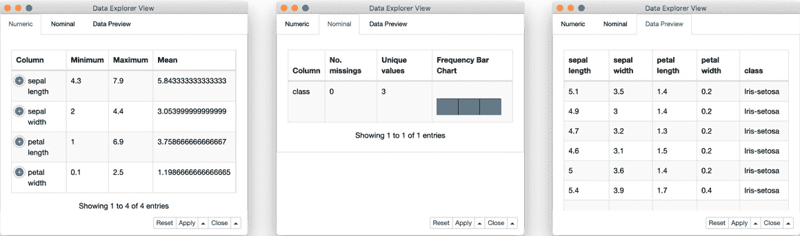

图 4.1 – 鸢尾花数据集概述，本文用于实现多类分类

第二个示例数据集为我们提供了一个二分类问题。

成人数据集包含 32,561 个住在美国的人的样本。每条记录通过 14 个人口统计特征描述一个人，其中包括其当前的年收入（> 50K/<= 50K）。*图 4.2*展示了数据集中特征的概览：数值特征，如年龄和每周工作小时数，以及名义特征，如工作类别和婚姻状况。

目标是训练一个神经网络，预测一个人是否每年赚取超过 50K 美元，使用所有其他属性作为输入特征。我们希望使用的网络应该有两个隐藏层，每个层有八个单元，并采用 ReLU 激活函数。

一些显示在表格中的人口普查收入数据集如下所示：

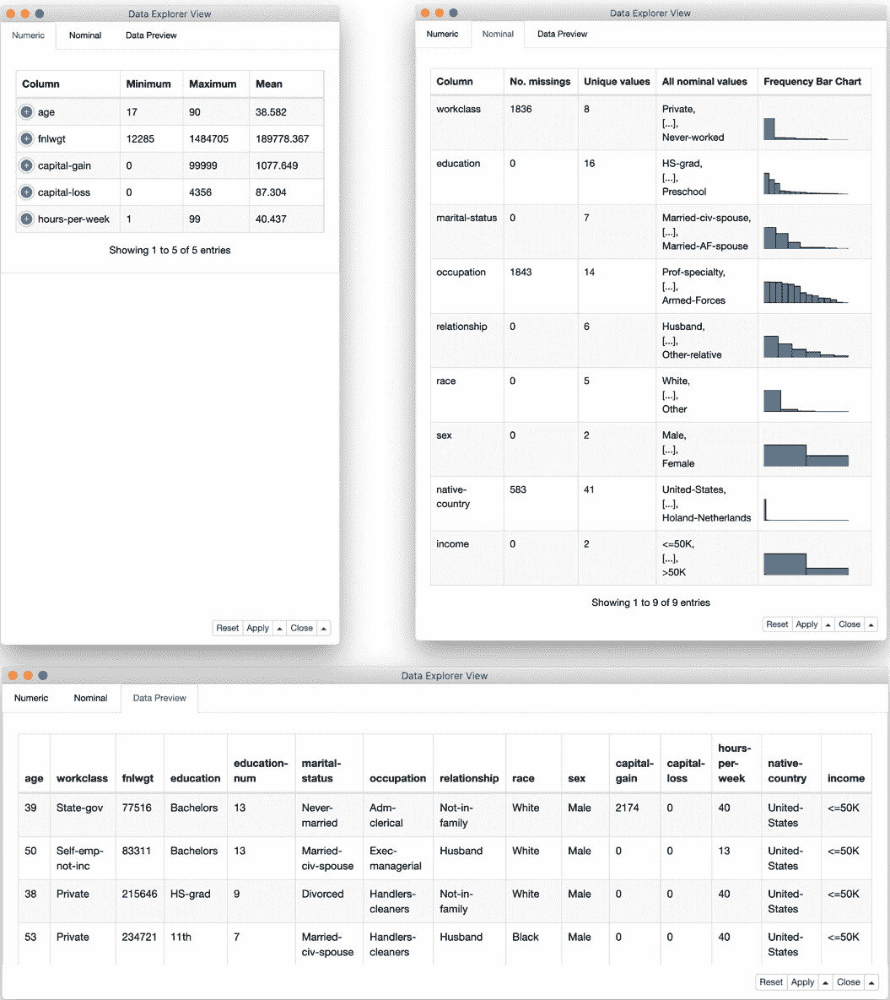

图 4.2 – 成人数据集概述，本文用于实现二分类问题

提示

为了获得数据集的概览，你可以使用**数据探索器**节点。此节点以交互式视图显示输入数据的一些统计量。在*图 4.1*和*图 4.2*中，你可以看到两个示例数据集的节点视图。

总结鸢尾花数据集，它包含四个数值特征和一个鸢尾花的名义类别；成人数据集则包含 14 个混合特征，包括数值特征和名义特征。因此，数据准备的第一步是将所有名义特征转换为数值特征。接下来，我们将介绍编码技术。

## 名义特征的编码

名义特征，有时也称为类别特征，只能采用字符串类型的值。例如，描述发色的特征的唯一可能值可以是字符串类型，如`black`、`brown`、`blond`和`red`；描述性别的特征传统上只接受两种字符串类型的值，`female`和`male`；教育特征的可能值可以是字符串，如`Doctorate`、`Masters`、`Bachelors`或`Some-college`。这个例子来自成人数据集中名为`education`的列。这些值应在输入神经网络之前转换为数字。

有两种常见的方式来编码名义特征：

+   **整数编码**

+   **独热编码**

整数编码为特征的每个可能的名义值分配一个整数值。例如，`"black"`可以是 1，`"brown"`可以是 2，`"blond"`可以是 3，`"red"`可以是 4。我们选择了数字 1、2、3 和 4，但它也可以是任何其他数字组合。该方法在不同值之间引入了一种人工关系——例如，`"black"`比`"red"`更接近`"brown"`。这种关系可以反映有序或层次特征中的真实关系，例如教育领域，其中`"Doctorate"`比`"Masters"`更接近`"Some-college"`。然而，在其他情况下，例如之前提到的发色示例，它引入了一种不反映现实的新附加关系，并且可能在学习过程中对模型产生偏见。一般来说，在名义无序特征上使用整数编码方法可能会导致模型性能较差。

独热编码通过用向量表示每个特征来克服这个问题，在所有向量之间的距离始终相同。该向量由与原始特征中可能值相同数量的二进制组件组成。然后，将每个组件与其中一个值关联，并为该值设置为`1`；其他组件保持为`0`。在发色示例中，`"black"`变成 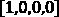，`"brown"`变成 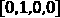，`"blond"`变成 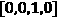，`"red"`变成 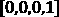。

重要说明

独热向量是一个只有一个`1`，所有其他值为`0`的向量。它可以用来编码不同的类别，而不会在它们之间添加任何人工距离。

现在让我们看看如何通过 KNIME 节点实现这些编码。

### KNIME Analytics Platform 中的整数编码

要执行整数编码，可以使用**Category to Number**节点。该节点有一个数据输入端口（在下图中由黑色三角形表示）和两个输出端口：

+   数据输出端口（黑色三角形）与整数编码数据

+   PMML 模型输出端口（蓝色方块）与映射规则

*图 4.3*显示了该节点及其配置窗口：

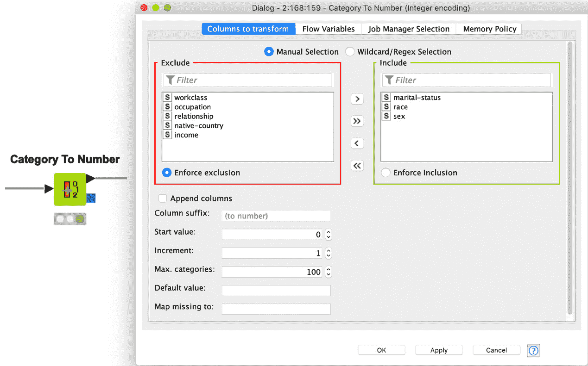

图 4.3 – **类别到数字**节点对选定的列执行整数编码

在配置窗口的上半部分，您可以选择字符串类型的输入列，应用整数编码。**包含**框架中的列将会被转换，而**排除**框架中的列将保持不变。您可以通过框架之间的按钮将列从一个框架移动到另一个框架。

默认情况下，原始列中的值会被整数编码值替换。然而，**附加列**复选框会为整数编码值创建额外的列，以免覆盖原始列。如果您启用此复选框，您还可以为新列的列头定义自定义后缀。

在配置窗口的下半部分，您可以定义编码规则：起始值、增量、允许的最大类别数以及所有缺失值的整数值。

默认的整数值会被传输到输出 PMML 转换模型中。**PMML**代表**预测模型标记语言**，是一种描述和交换预测模型的方式，可以在不同应用程序之间进行交换。输出端口的蓝色方框中的 PMML 模型包含此节点中内置的映射函数，并将应用于其他数据集。在应用此整数编码 PMML 模型时，默认值会分配给所有当前映射（如果有）未表示的输入值。如果没有默认值，则会使用缺失值代替。

提示

若要将存储在 PMML 输出端口中的相同整数编码映射应用于另一个数据集，您可以使用**类别到数字（应用）**节点。

**类别到数字**节点会自动定义映射。这意味着您无法手动定义哪个名义值应由哪个整数值表示。如果您希望手动定义，可以在 KNIME Analytics 平台中选择其他选项，我们将介绍其中两个：**单元格替换器**节点和**规则引擎**节点。

**单元格替换器**节点根据字典表替换列中的单元格值。它有两个输入：

+   替换值的目标列所在表格的上输入

+   字典表的下输入

*图 4.4*显示了单元格替换器节点的配置窗口：

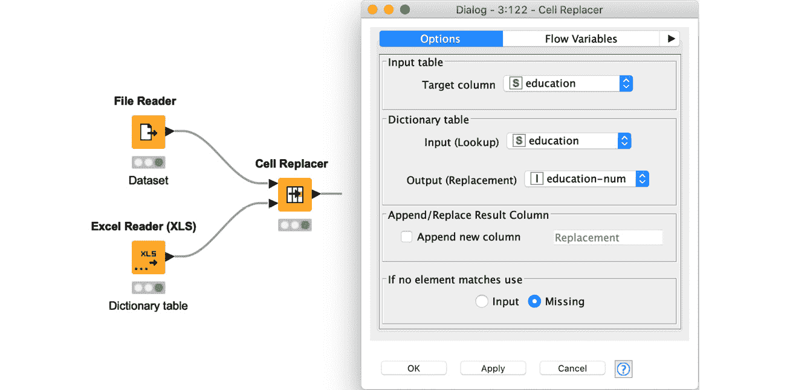

图 4.4 – 单元格替换器节点根据字典实现编码映射

在配置窗口的上半部分，您可以从顶部输入端口的输入表中选择目标列；即，您希望根据字典值替换其值的列。

在配置窗口的 **字典表** 部分，您可以从底部输入端口的数据表中选择查找值列——即 **输入（查找）** 列——以及包含替换值的列——即 **输出（替换）** 列。

目标列（第一个输入）中任何与查找值匹配的出现都将被相应的替换值替换。结果将存储在输出列中，该列要么被添加到表中，要么替换原始目标列。

缺失值被视为普通值；也就是说，它们既可以作为查找值，也可以作为替换值。如果字典表中的查找列存在重复项，则最后一次出现（最下面的行）定义替换对。

对于整数编码示例，您需要一个字典表来映射名义值和整数值。例如，每个教育水平应映射到一个对应的整数值。然后，您可以将原始数据集输入到顶部输入端口，将此映射/字典表输入到最底部的输入端口。

提示

**表创建器** 节点可以帮助手动创建查找表。

如果没有字典表且不想创建，可以使用 **规则引擎** 节点。

规则引擎节点根据一组手动定义的规则转换输入列中的值，这些规则在其配置窗口中定义。

*图 4.5* 显示了规则引擎节点的配置窗口：

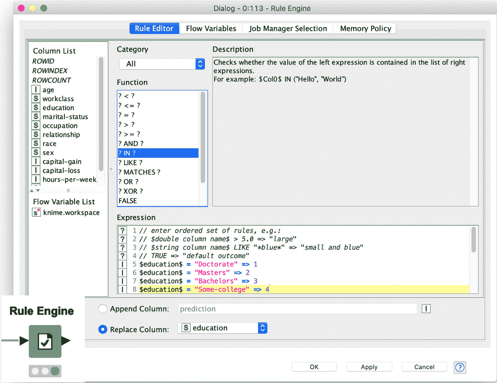

图 4.5 – 规则引擎节点实现来自用户定义规则的整数编码

在 `=>` 中，以 `"前提 => 结果"` 的形式。结果要么插入到新列中，要么替换选定列中的值。对于输入表中的每一行数据，规则匹配过程从顶部规则开始，直到最后一行：第一个匹配的规则决定结果，然后规则过程停止。最后的默认条件，将所有剩余数据行汇总，表示为 `"TRUE => 结果"`。

规则的结果可以是一个字符串（用 `"` 或 `/` 符号括起来）、一个数字、一个布尔常量，或对另一个列的引用。如果没有规则匹配，则结果是缺失值。对其他列的引用通过 `$` 包围列名表示。您可以手动插入列引用，或通过双击配置窗口左侧的 **列列表** 中的列来插入。

除了 **表达式** 面板，你还会看到 **函数**、**列列表** 和 **流变量列表** 面板。**函数** 面板列出了所有函数，**列列表** 面板列出了所有输入列，而 **流变量列表** 面板则包含了所有可用的流变量。双击其中的任何一个，都会将它们以正确的语法添加到 **表达式** 窗口中。此外，选择任何一个函数时会显示该函数的描述以及示例。

总结一下，在 KNIME Analytics Platform 中有很多种实现整数编码的方法。我们介绍了三种选项：

+   **类别到数字**节点提供了一种自动且简单的方法，如果你不想手动定义映射的话。

+   **单元格替换器**节点如果你手头有查找表会非常有用。

+   **规则引擎**节点在你想通过一组规则手动定义名义值与整数值之间的映射时非常有用。

接下来，让我们看一下 KNIME Analytics Platform 中的独热编码。

### KNIME Analytics Platform 中的独热编码

要对名义特征执行独热编码，可以使用 **One to Many** 节点。该节点获取列中可用的名义值列表，构建一个包含相同数量分量的向量，并生成每个值的独热编码：一个值变成多个二进制单元格，因此得名。

在配置窗口中，你可以选择执行独热编码的字符串类型列。对于每一列，将根据不同的值创建相同数量的新列。每个新列的标题将是名义列中的原始值，其单元格的值为 `0` 或 `1`，取决于原始列中是否存在该标题值。

*图 4.6* 显示了该节点的配置窗口：

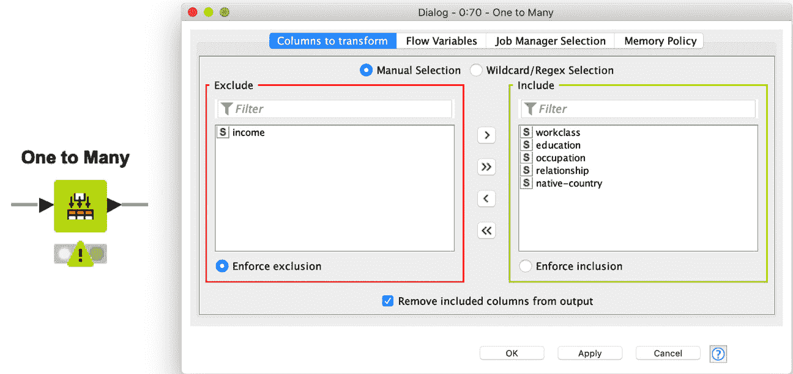

图 4.6 – One to Many 节点实现名义特征的独热编码

创建 one-hot 编码向量会导致非常大且稀疏的数据表，充满了大量零值。这可能会在执行过程中影响工作流性能。Keras Learner 节点确实可以接受大且稀疏的 one-hot 编码数据表。然而，它还提供了一个非常好的可选功能，避免了显式创建带有 one-hot 编码向量的数据表的整个步骤。它可以从原始列的整数编码版本内部创建 one-hot 编码向量。这样，数据的 one-hot 编码表示会被隐藏在 **Keras Network Learner** 节点内部，并且永远不会从节点传递到节点。在这种情况下，每个整数编码单元的值必须以集合类型单元的形式传递给 Keras Network Learner 节点。要创建集合类型单元，可以使用 **Create Collection Column** 节点。在本章的 *Training the Network* 部分，您将看到如何正确配置 Keras Network Learner 节点以利用此功能。

*图 4.7* 显示了 **Create Collection Column** 节点的配置窗口。在 **Exclude-Include** 框中，您可以选择一个或多个列以将其聚合为集合类型列。在配置窗口的下部，您可以决定是否移除原始列，并定义新集合类型列的名称：

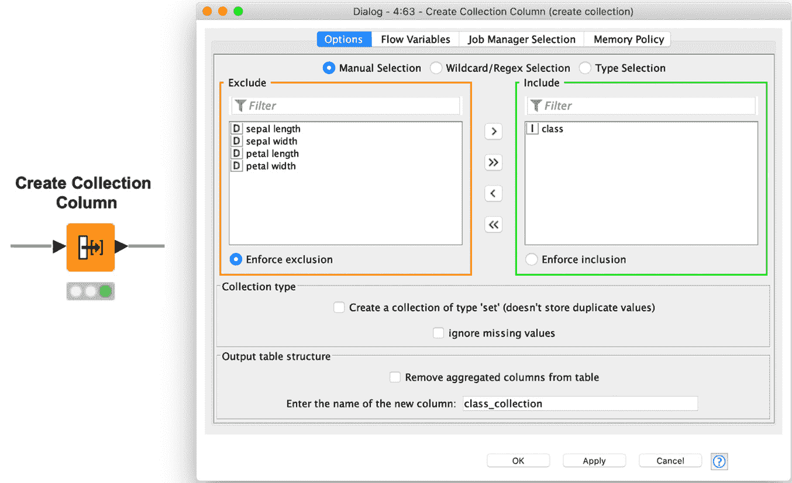

图 4.7 – **Create Collection Column** 节点将多个列的值作为集合聚合为单一列

请注意，对于这种两步 one-hot 编码——首先进行整数编码，然后进行 one-hot 编码——您需要使用前一节中列出的节点创建整数编码列，然后仅对一个列应用 **Create Collection Column** 节点：我们刚刚创建的整数编码列。

### 类别目标变量的编码

在上一章中，我们讨论了可以用于构建网络架构并训练网络解决分类问题的不同激活函数和损失函数。当然，输出层的激活函数和损失函数必须匹配。不仅如此，类别编码还必须与所选的激活函数和损失函数匹配。这意味着，不仅名义型输入特征需要进行编码，类别值也需要进行编码。与本节中描述的相同的编码技术和节点，也可以用于类别编码。

二分类的常见方法是使用 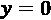 和 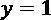 对两个类别进行编码，然后训练网络预测 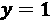 类别的概率。在这种情况下，**Category to Number** 节点或 **Rule Engine** 节点都可以使用。

在多分类问题中，编码类别列也有两个选择：**一对多**节点本身，或者是类别到数字节点后接创建集合列节点。

另一个推荐的神经网络预处理步骤是归一化。

## 归一化

大多数神经网络是使用带反向传播算法的随机梯度下降变体来训练的，以计算梯度。具有不可比拟范围的输入特征可能会在学习过程中造成问题，因为范围最大的输入特征可能会在计算权重更新时占据主导，甚至可能会越过局部最小值。这可能导致振荡并减慢学习过程的收敛速度。为了加速学习阶段，建议提前对数据进行归一化；例如，使用 z-score 归一化，使得每列中的值符合高斯分布，均值为 0.0，标准差为 1.0。

在*图 4.8*中，您可以看到**Normalizer**节点及其配置窗口，以及**Normalizer（Apply）**节点：

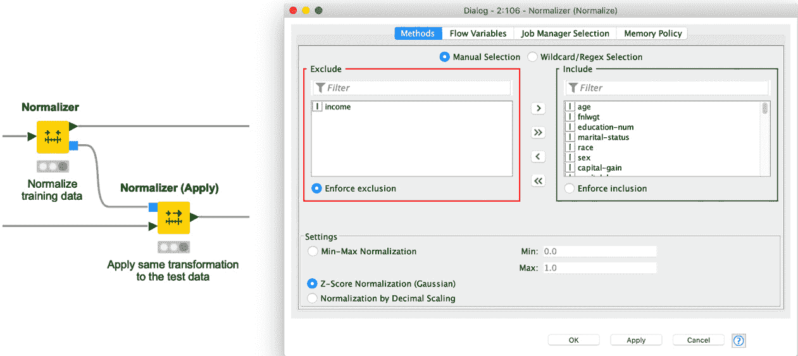

图 4.8 – Normalizer 节点为选定的输入列创建归一化函数。Normalizer（Apply）节点将相同的归一化函数应用于另一个数据集

Normalizer 节点在选定的输入列上创建一个归一化函数并进行归一化处理。Normalizer（Apply）节点采用一个外部预定义的归一化函数并将其应用于输入数据。这个节点对的经典应用场景是在训练集和测试集上。Normalizer 节点对训练数据进行归一化，而 Normalizer（Apply）节点则对测试数据应用相同的归一化转换。

Normalizer 节点有一个数据输入端口和两个输出端口：

+   一个数据输出端口，包含归一化后的输入数据

+   一个模型输出端口，包含归一化参数，可在 Normalizer（Apply）节点中用于另一个数据集

在 Normalizer 节点的配置窗口中，您可以选择要归一化的数值列和归一化方法。

Normalizer（Apply）节点的配置窗口非常简洁，因为所有必要的参数都包含在输入的归一化模型中。

提示

使用 Partitioning 节点，您可以在归一化数据之前创建训练集和测试集。

## 其他有用的预处理节点

在训练神经网络时，缺失值可能会成为问题，因为反向传播算法无法处理它们。在 KNIME 数据表中，用来表示缺失值的占位符是一个红色的问号。

一个强大的节点来填补缺失值是**缺失值**节点。该节点允许你从多种填补方法中进行选择，比如均值、固定值和最常见值等。

*图 4.9*展示了节点配置窗口的两个选项卡。在第一个选项卡，即**默认**选项卡中，你可以选择应用于数据集中所有同类型列的填补方法；所有除了在配置窗口第二个选项卡——**列设置**选项卡中设置的列。在第二个选项卡中，你可以为每个单独的列定义填补方法：

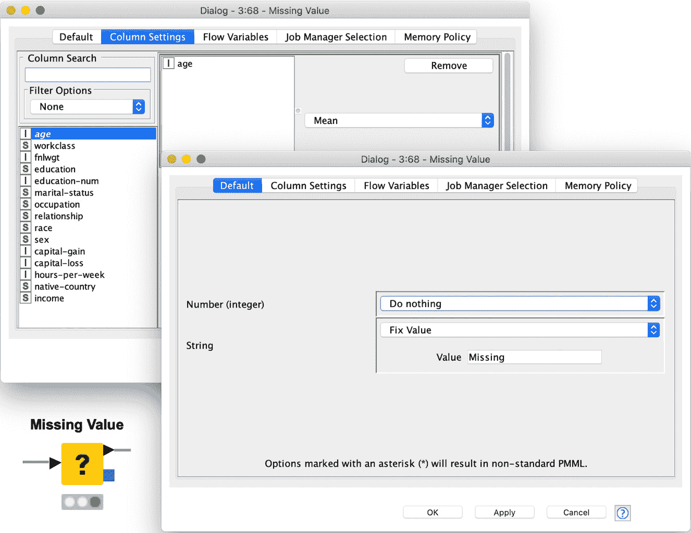

图 4.9 – 缺失值节点从多种缺失值填补方法中进行选择

大多数神经网络都是以监督方式训练的。因此，另一个必要的步骤是创建训练集和测试集，及可选的验证集。为了创建不同的不相交子集，你可以使用**分区**节点。

在*图 4.10*的分区节点配置窗口中，你可以通过绝对值或相对百分比来设置第一个分区的大小。在下面，你可以设置采样技术来创建第一个子集，可以选择根据所选列中的类别按数据分布进行随机抽取（分层抽样）、每隔`n`行按线性方式抽取，或者从顶部按顺序抽取。上方的输出端口生成结果分区；下方的输出端口生成所有其他剩余的数据行：

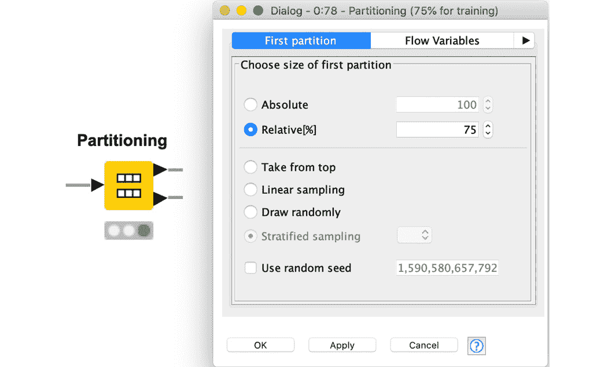

图 4.10 – 分区节点创建两个不相交的子集

对于分类问题，建议使用**分层抽样**选项。它确保所选列中的类别分布在两个分区中（大致）保持不变。对于时间序列分析，如果你的数据按日期升序排列，建议使用**从顶部提取**选项。较早的样本将进入一个分区，较新的样本进入另一个分区。

若要创建额外的验证集，需要两个分区节点的顺序操作。

我们已经讨论了类别特征的编码、数值特征的标准化、缺失值填补和数据集的分区。很可能这些并不是你为神经网络准备数据时可能需要的唯一节点。

让我们通过在前面提到的两个示例数据集上实现数据准备部分，来看数据准备在实际中是如何工作的。

## 鸢尾花数据集的数据准备

在*图 4.11*中，你可以看到工作流中用于访问和准备即将用于神经网络的数据的部分。

工作流从使用**表格读取器**节点读取鸢尾花数据集开始。

提示

你可以在本章的数据文件夹中找到数据集。

由于数据集只有数值型输入特征（花瓣和萼片的度量），因此不需要进行编码：

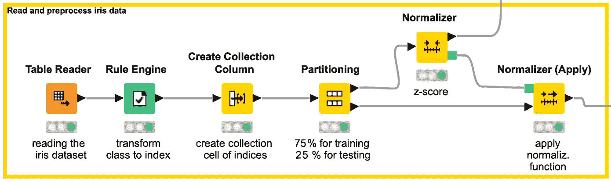

图 4.11 – 该工作流片段展示了 Iris 数据集示例中的数据预处理

然而，目标变量包含三种不同的类别：每种花卉物种的名称。这个名义型列中的类别需要通过某些编码技术转换成数字。为了避免引入不存在的关系，我们选择了独热编码。为了实现独热编码，我们选择通过节点进行整数编码，并在 Keras Learner 节点中进行独热编码。我们将在*训练网络*部分讨论 Keras Learner 节点内部的独热编码。在这里，我们将重点介绍如何在集合类型列中创建花卉类别的整数编码：

1.  为了将物种名称转化为索引，我们使用`class`列。

1.  然后，我们将规则引擎节点的结果通过一个`class`列传递，并在配置窗口中排除其他所有列。

1.  接下来，使用**分区**节点创建训练集和测试集，使用 75%的数据进行训练，剩下的 25%用于测试。

1.  最后，数据通过 z-score 标准化进行规范化处理。

Iris 数据集非常小且定义清晰。只有几个节点，满足最小需求，足以实现数据准备部分。

现在我们来看一下在一个更复杂（但仍然较小）的数据集上会发生什么，例如成人数据集。

## 成人数据集的数据准备

*图 4.12*中的工作流是关于收入预测示例的一部分，读取并预处理成人数据集：

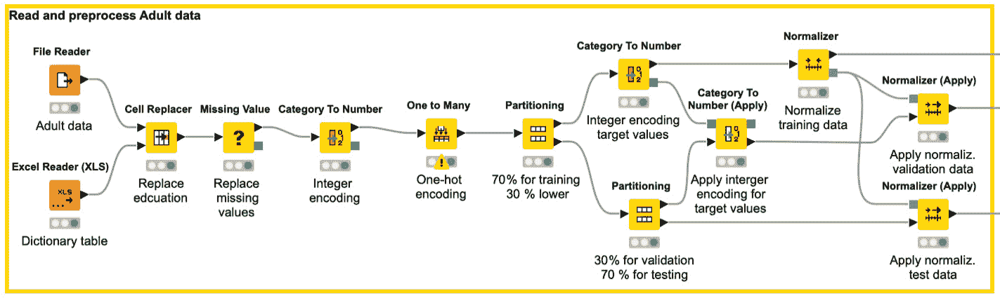

图 4.12 – 该工作流片段展示了成人数据集示例中的数据预处理

和 Iris 数据集一样，你可以在本章的数据文件夹中找到工作流中使用的两个数据集：成人数据集和字典 Excel 表格。在成人数据集中，教育水平以文本形式表示。字典 Excel 文件提供了教育水平与对应标准整数编码之间的映射。我们可以使用这些整数编码作为教育输入特征的数值编码。

接下来，**单元替换**节点将所有教育水平替换为相应的编码。我们几乎不费力就得到了一个编码。

一些名义型列有缺失值。位于`"Missing"`中。

接下来，我们对所有其他名义特征（除了教育）进行编码。对于以下特征，使用整数编码，由**类别转数字**节点实现：婚姻状况、种族和性别。我们可以在这里使用整数编码，因为这些特征要么是二进制的，要么只有少数几个类别。

对于其余的名义特征——工作类别、职业、关系和本国——使用的是独热编码，由**一对多**节点实现。请记住，该节点为所选列中的每个值创建一个新列。因此，在此转换之后，数据集的特征数从原始的 14 个变为 82 个。

接下来，使用两列`Income`类创建训练集、验证集和测试集。

最后，`Income`列在所有子集上进行整数编码，且所有数据都被归一化。

提示

为了隐藏复杂性并整理您的工作流程，您可以创建**元节点**。元节点以灰色节点表示，并包含子工作流节点。要创建元节点，请选择您要隐藏的节点，右键单击并选择**创建元节点**。

我们的数据已准备好。现在让我们开始构建神经网络。

# 构建前馈神经网络架构

要使用 KNIME Keras 集成构建神经网络架构，您可以使用一系列 Keras 层节点。用于构建层的可用节点在**节点库**中的**Keras->Layers**文件夹中按类别分组，例如**高级激活**、**卷积**、**核心**、**嵌入**和**递归**等。

**Keras->Layers**文件夹中显示的每个层都有其特色。例如，**高级激活**中的层创建具有特定激活函数的单元层；**卷积**中的层创建用于卷积神经网络的层；**核心**包含所有经典层，如用于收集输入值的**输入**层和用于全连接前馈神经网络的**密集**层；等等。

我们将在本书中沿途探索这些层中的许多内容。然而，在本章中，我们将仅限于构建一个全连接前馈神经网络所需的基础层。

网络中的第一层是接收输入值的层。让我们从 Keras 输入层节点开始。

## Keras 输入层节点

构建神经网络总是从定义网络的输入层开始的。**Keras 输入层**节点可以帮助您完成这一任务。实际上，这个节点构建了网络所需的输入，以便接受输入值。

在*图 4.13*的左侧，您可以看到 Keras 输入层节点，右侧是其配置窗口。如您所见，该节点没有输入端口，只有一个输出端口，其形状和颜色（红色方块）与之前遇到的节点不同：这就是**Keras 网络端口**：

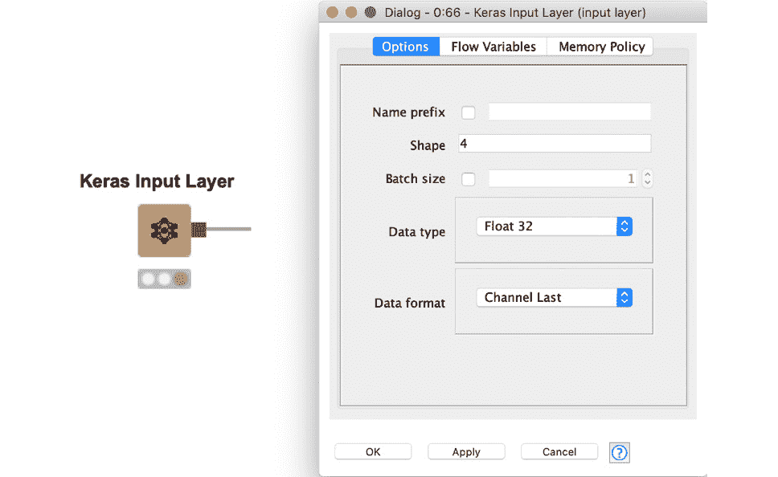

图 4.13 – Keras 输入层节点定义了神经网络的输入层

提示

端口的颜色和形状表示哪些端口可以互相连接。通常情况下，只有相同颜色和形状的端口才能连接，但也有例外。例如，你可以将一个灰色方块（Python DL 端口）与一个 Keras 端口（红色方块）连接。

每个层节点都有一个配置窗口，其中包含该特定层所需的设置选项。与其他层节点相比，这个节点的配置窗口较为简单，只有少数设置选项。

最重要的设置是**形状**。**形状**允许你定义网络的输入形状，意味着输入层有多少个神经元。记住，输入层的神经元数量必须与预处理过的输入列的数量匹配。

Iris 数据集有四个特征，我们将作为输入使用：花萼长度、花萼宽度、花瓣长度和花瓣宽度。因此，这里的输入形状是 4。

此外，在 Keras 输入层节点的配置窗口中，你还可以设置以下内容：

+   **层名称前缀**，便于以后识别（可选）。

+   **批量大小**（可选）。请记住，批量大小是训练设置选项之一。推荐的方式是在学习器节点和执行器节点中定义批量大小。此外，你也可以选择在这里定义它。如果定义了批量大小，那么学习器和执行器节点中的批量大小选项将不可用。

+   输入的**数据类型**和**数据格式**。

你的网络现在已经有了第一个层——输入层。现在，你可以通过创建并将下一个层节点连接到 Keras 输入层节点的输出，继续构建你的网络——例如，**Keras 密集层**节点。

提示

若要创建一个节点并立即将其连接到现有节点，请在工作流编辑器中选择现有节点，并双击节点库中的新节点。这将创建新节点并自动将其连接到所选的现有节点。

## Keras 密集层节点

**Keras 密集层**节点实现了一个经典的前馈全连接网络层。此处需要设置的参数是神经单元的数量和激活函数。

*图 4.14* 显示了此节点的配置窗口。设置选项分为两个标签：**选项**和**高级**。

**选项**标签包含最重要的设置，如神经元的数量，也称为单元，以及激活函数。

此外，**输入张量**设置定义了来自前一个节点的输入张量部分。在前馈网络中，输入张量是前一层的输出张量。然而，一些层节点——例如，**Keras LSTM Layer** 节点——不仅创建一个隐藏的输出张量，而是多个。在这种情况下，您必须从前一层节点产生的不同输入张量或隐藏状态中选择一个。Keras 输入层与 Keras Dense Layer 一样，只产生一个输出向量，这就是我们选择作为输入张量传递给 Keras Dense Layer 节点的内容。

在**高级**选项卡的上半部分，您可以选择如何随机初始化网络的权重和偏置；这意味着在学习过程的第一次迭代之前，所有权重和偏置的初始值。

**高级**选项卡的下半部分允许您为该层的权重添加范数正则化。范数正则化是一种避免过拟合的技术，我们在*第三章*《神经网络入门》中介绍过。在配置窗口中，您可以选择是否将其应用于核权重矩阵、偏置向量和/或层激活。激活相应的复选框后，您可以选择使用 L1 范数作为惩罚项、L2 范数作为惩罚项，或两者都使用。最后，您可以为正则化参数设置值，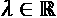，用于惩罚项和权重、偏置值的约束。

通过使用**Keras 输入层**节点和多个 Keras Dense Layer 节点，您可以为许多不同的任务构建一个前馈网络，例如，用于分类鸢尾花：

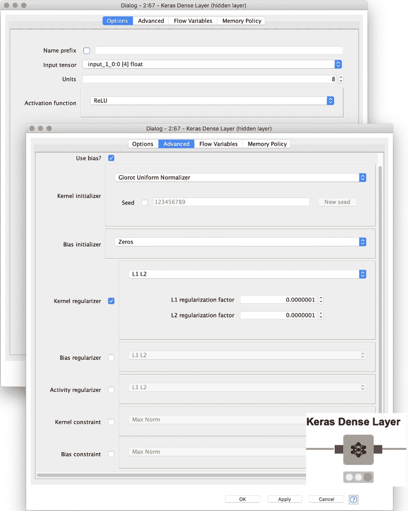

图 4.14 – Keras Dense Layer 节点允许您向神经网络添加一个全连接层，包括选择常用的激活函数。

其他层节点的配置与此处描述的密集层和输入层类似，您将在接下来的章节中学习更多内容。

由于本章中使用的两个基本示例都涉及前馈网络，我们现在已经具备了构建这两种前馈神经网络的所有必要部分。

## 构建用于鸢尾花分类的神经网络。

对于使用鸢尾花数据集的多类分类问题，目标是构建一个具有三层的全连接前馈神经网络：

+   一个输入层，包含四个单元，每个输入特征一个。

+   一个包含八个单元并使用 ReLU 激活函数的隐藏层。

+   一个输出层，包含三个单元，每个输出类一个，意味着每个鸢尾花品种一个，使用 softmax 激活函数。

我们选择在隐藏层使用 ReLU 激活函数，因为它在隐藏层中的表现更好，而在输出层使用 softmax 激活函数，具有较好的概率解释性。softmax 函数输出中最大值对应的单元是具有最高类别概率的单元。

*图 4.15* 展示了用于鸢尾花分类问题的神经网络架构：

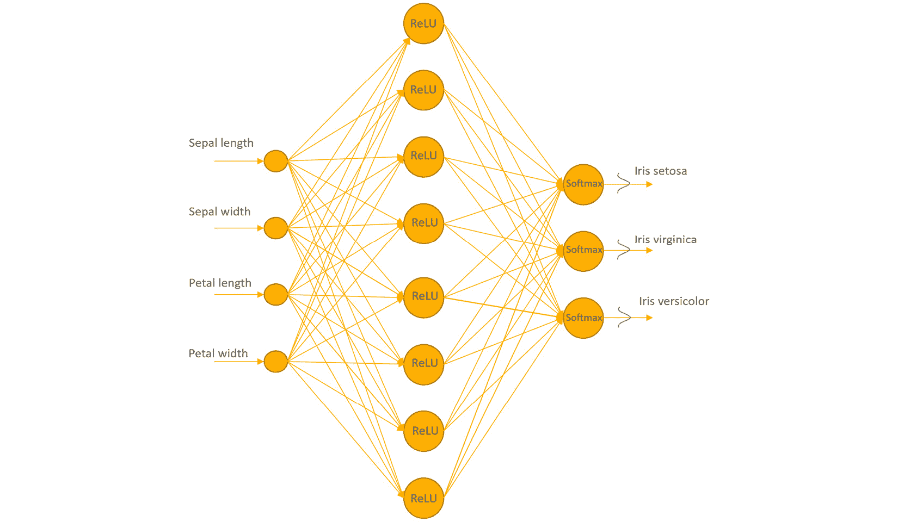

图 4.15 – 用于鸢尾花示例的前馈网络示意图。

*图 4.16* 展示了带有三个层节点并构建网络的工作流片段，以及它们的配置窗口，包括单元数量和激活函数：

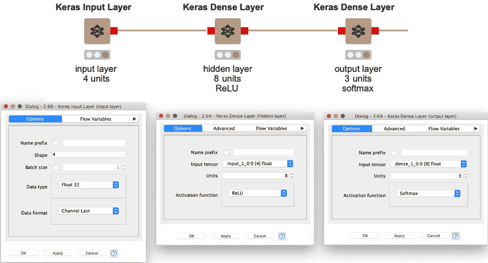

图 4.16 – 该工作流片段构建了图 4.15 中用于鸢尾花数据集示例的神经网络。下方的配置窗口显示了各节点的配置。

输入层有四个输入单元，`Shape = 4`，对应四个数值输入特征。第一个 Keras Dense Layer 节点是隐藏层，包含八个单元，并使用 ReLU 激活函数。在输出层，使用 softmax 激活函数，包含三个单元，每个类对应一个单元。

提示

在最后一层，使用了“**Output**”作为名称前缀。这使得在 **Executor** 节点中更容易识别该层，并且如果添加更多 Keras Dense Layer 节点作为隐藏层时，该层名称不会改变。

## 构建一个用于收入预测的神经网络

第二个示例是一个二分类问题：预测收入（每年是否大于 50K）在成人数据集中的情况。在这里，我们采用了一个包含两个隐藏层的神经网络，总共四层：

+   一个输入层，包含 81 个单元，与输入特征数量相同。

+   一个隐藏层，包含六个单元，并使用 ReLU 激活函数。

+   另一个隐藏层，包含六个单元，并使用 ReLU 激活函数。

+   一个输出层，包含一个单元，并使用 sigmoid 激活函数。

输出层使用经典的二分类实现：一个单一的单元，采用 sigmoid 激活函数。sigmoid 函数的输出范围是 0 和 1，可以通过 `0` 表示一个类，`1` 表示另一个类。因此，对于一个二分类问题，其中两个类分别编码为 `0` 和 `1`，仅使用一个 sigmoid 函数就可以生成类为 `1` 的概率。

*图 4.17* 向你展示了构建该全连接前馈神经网络的工作流片段：

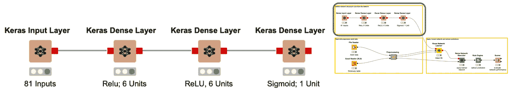

图 4.17 – 这个工作流片段构建了一个完全连接的前馈神经网络，用作成人数据集示例的解决方案。

经过预处理后，成人数据集包含 82 列，其中 81 列为输入特征，1 列为目标列。因此，输入层的`形状 = 81`。接下来，使用两个 Keras Dense Layer 节点构建了两个隐藏层，`单元 = 6`，并使用 ReLU 激活函数。输出层由一个 Keras Dense Layer 节点组成，`单元 = 1`，并使用 sigmoid 激活函数。

在本节中，您已经学习了如何使用 KNIME Keras 集成节点构建前馈神经网络。下一步是设置网络训练所需的其他参数，例如损失函数，然后开始训练网络。

# 训练网络

我们已经准备好了数据，也有了网络。本节的目标是向您展示如何使用训练集中的数据来训练网络。这需要选择损失函数、设置训练参数、指定训练集和验证集，并跟踪训练进度。

网络训练和所有这些训练设置的关键节点是 **Keras 网络学习器** 节点。这个节点非常强大且灵活，具有许多可能的设置，分布在四个标签页中：**输入数据**、**目标数据**、**选项**和 **高级选项**。

Keras 网络学习器节点有三个输入端口：

+   **顶部端口**：您想要训练的神经网络

+   **中间端口**：训练集

+   **最底端口**：可选的验证集

它有一个输出端口，用于导出训练好的网络。

此外，节点还具有 **学习监控器** 视图，您可以使用它来监控网络的训练进度。

在继续设置训练参数之前，让我们先了解如何选择损失函数。

## 选择损失函数

在*第三章*《神经网络入门》中，我们介绍了许多损失函数，每个损失函数适用于特定任务，作为网络设计的最后选择。例如，均方误差通常用于回归问题，或者在多类分类问题中使用分类交叉熵。在 **目标数据** 标签页的下方，您可以选择不同的标准预打包损失函数，或者使用 Python 定义自定义损失函数（见*图 4.18*）：

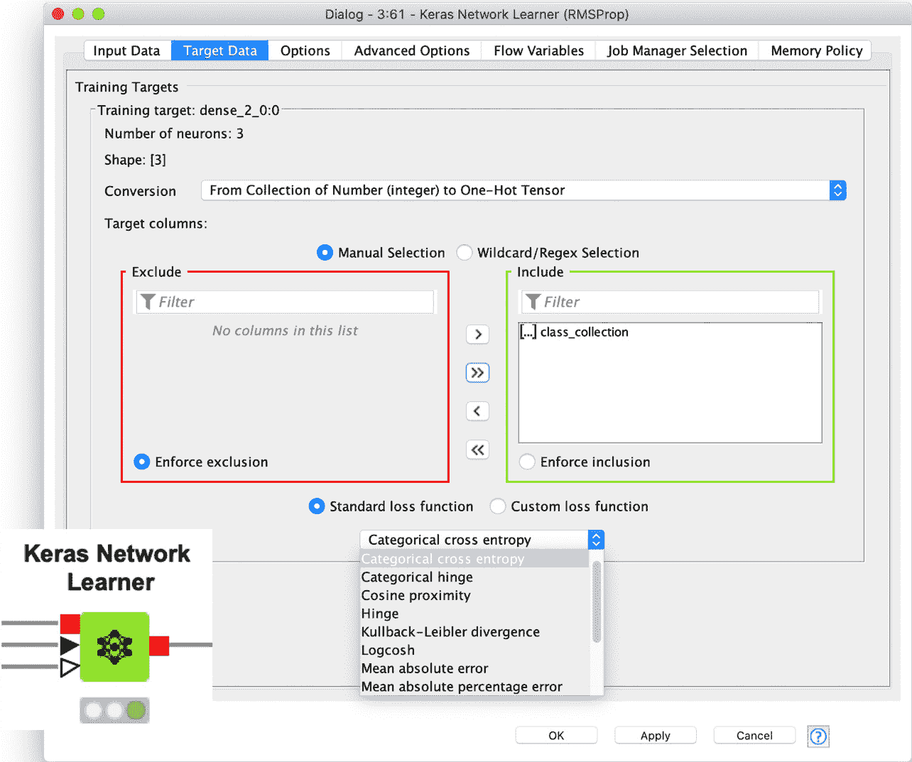

图 4.18 – 在 Keras 网络学习器节点的“目标数据”标签页中，您可以选择目标列和损失函数。

现在网络结构已定义，并且你已选择正确的损失函数，下一步是定义输入数据集中哪些列是网络的输入，哪些列包含目标值。

## 定义输入和输出数据

定义输入列和输出列是你可以在**输入数据**和**目标数据**选项卡中完成的操作。让我们首先关注输入数据。

输入数据是网络期望的输入数据，这意味着适合网络输入大小的列。在**输入数据**选项卡中，所选网络的输入神经元数及相应形状会显示在顶部：

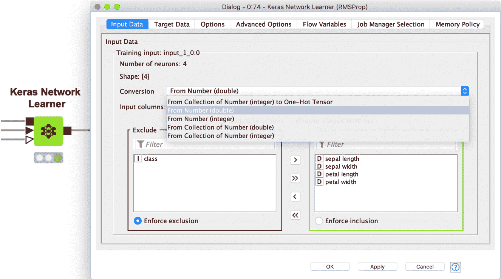

图 4.19 – 在 Keras 网络学习节点的输入数据选项卡中，你可以选择输入列和正确的转换

接下来，你必须选择转换类型；这意味着将所选输入列转换为网络输入规范所接受的格式。可能的转换类型如下：

+   **从数字集合（整数）到独热张量**

+   **从数字（双精度浮点）**

+   **从数字（整数）**

+   **从数字集合（双精度浮点）**

+   **从数字集合（整数）**

+   **从图像**

转换类型 1，**从数字集合（整数）到独热张量**，是当网络需要独热向量时非常有用的转换方式。与其创建一个包含所有独热向量的矩阵（这会占用空间和资源），不如输入一系列整数编码的值，然后逐一将它们转换为独热向量。在执行过程中，节点创建独热向量并将其输入到网络中。整个过程对最终用户是透明的，并且不会创建额外的庞大稀疏数据表。

其他转换类型仅接受指定格式（双精度浮点、整数或图像）的输入列，并将其呈现给网络。

选择转换类型后，你可以通过包含-排除框选择输入列到网络。请注意，该框已预加载所有与所选转换类型匹配的输入列。

现在，让我们选择目标列。目标数据必须符合输出层的规范。这意味着，如果输出层有 20 个单元，则目标数据必须是 20 维的向量；或者，如果输出层只有一个单元，则目标数据必须包含每个训练样本或数据行的一个单一值。

在**目标数据**标签中，最上方显示的是网络输出层中神经元的数量和结果形状。与**输入数据**标签中的操作类似，在这里你可以选择多种转换选项，将输入数据集转换为网络规格。菜单中预先加载了适合网络输出层规格的所有转换类型供你选择。

对于多类分类问题，将一组数字（整数）转换为 one-hot 张量的方式非常有用。你不需要提前创建 one-hot 向量，只需编码输入集合单元中类别的位置（1）即可。

让我们继续讨论训练参数。

## 设置训练参数

现在网络和损失函数已经定义，下一步是设置训练参数。例如，你想使用哪种优化器？你希望训练多少个纪元？有很多参数需要定义。

所有训练参数可以在**选项**和**高级选项**标签中找到。在*图 4.20*中，你可以看到**Keras 网络学习器**节点的**选项**标签：

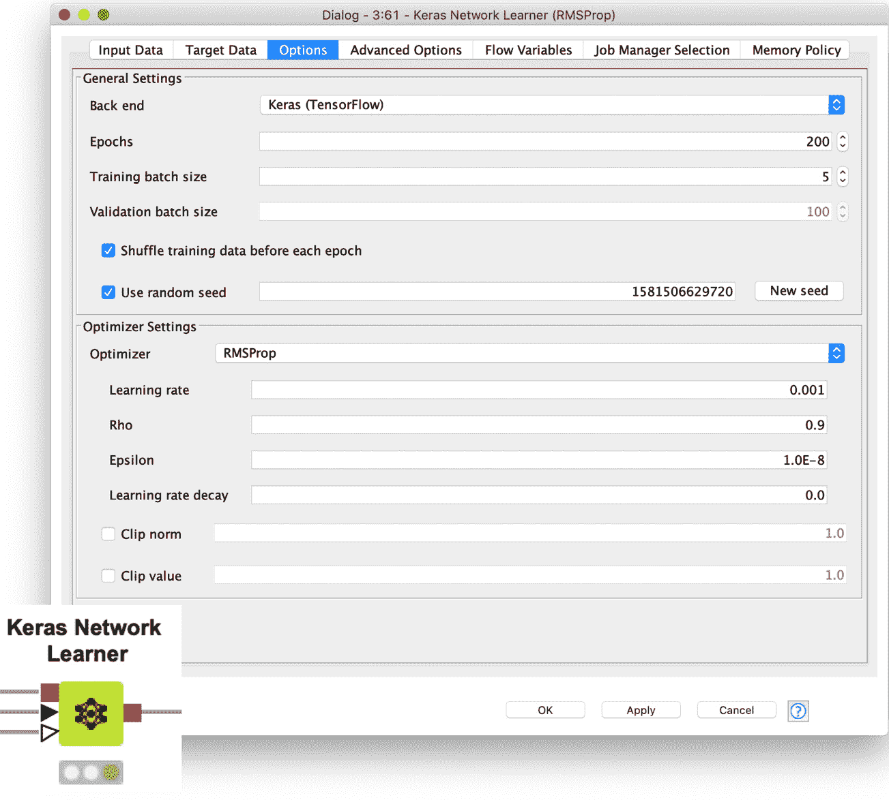

图 4.20 – 在 Keras 网络学习器节点的“选项”标签中，你可以设置所有的训练参数。

在**选项**标签的上部，在配置窗口中，你可以定义纪元数和批次大小。这决定了在每次训练迭代中，从训练集和验证集中按批次喂入网络的数据行数。

重要提示

如果在 Keras 输入层节点中定义了批次大小，则批次大小设置将被禁用。

在下面，有两个复选框。一个是在每个纪元之前随机打乱训练数据，另一个是设置随机种子。随机打乱训练数据通常有助于提高学习过程。实际上，使用相同的批次和相同的顺序更新网络可能会对训练的收敛速度产生不利影响。如果选中打乱数据的复选框，则随机种子的复选框会变为激活状态，并且显示的数字用于生成打乱操作的随机序列。使用随机种子可以生成可重复的随机打乱过程，从而使我们能够重复特定训练运行的结果。点击**新种子**按钮会生成一个新的随机种子和一个新的随机打乱过程。禁用随机种子的复选框会为每次节点执行生成新的种子。

在**选项**标签页的下部，您可以选择训练时使用的**优化器算法**及其参数。优化器算法是训练算法。例如，您可以选择**RMSProp**优化器，然后设置相应的**学习率**和**学习率衰减**值。当选择节点时，右侧的**描述**面板会显示关于该节点的详细信息。提供了优化器列表以及链接，链接指向原始 Keras 库，解释此框架中所有必需的参数。

在**选项**标签页的最下方，您可以限制梯度值的大小。如果选中**剪辑范数**，则 L2 范数超过给定范数的梯度会被剪辑到该范数。如果选中**剪辑值**，则绝对值超过给定值的梯度会被剪辑到该值（或其相反值）。

**高级选项**标签页包含一些用于特殊终止和学习率衰减的额外设置。最后一个选项允许您在有多个 GPU 的系统上指定使用哪个 GPU。

## 跟踪训练进度

在设置完所有训练参数后，您可以通过执行节点来开始训练网络。在执行节点时，您可以在**学习监控**视图中查看学习进度。您可以通过右键点击 Keras 网络学习节点并选择**查看：学习监控**来打开**学习监控**视图；参见*图 4.21*。

默认情况下，**学习监控**视图会显示训练集上每次权重更新后的准确度曲线变化，显示为红色，这意味着在数据批次通过网络后。准确度值显示在`y`轴上，批次的进度编号显示在`x`轴上。

点击上方的**损失**按钮可以显示训练集上的损失曲线，而不是准确度曲线。

更多关于训练进度的信息可以在**Keras 日志输出**视图中找到。您可以在 Keras 学习节点视图的顶部选项卡中选择它，位于**准确度**和**损失**之后的最后一个标签。

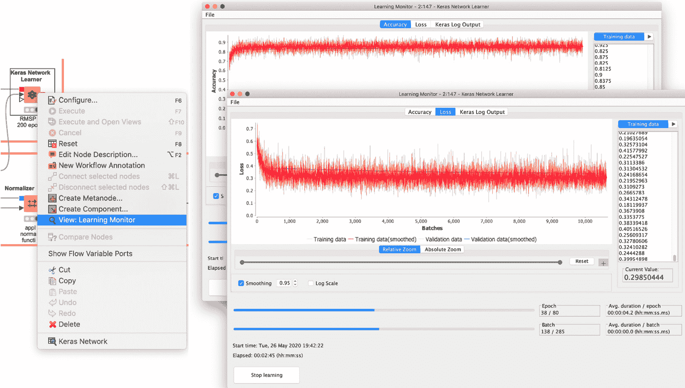

图 4.21 – 学习监控视图显示学习过程的进展

提示

**学习监控**视图属于 Keras 网络学习节点，您可以通过右键点击执行节点并选择**查看：学习监控**来打开它。

如果您正在使用验证集，准确度/损失图中会出现一条蓝色线。蓝色线显示的是训练过程在验证集上的对应进度。

在图表下方，您可以选择缩放`x`轴—即批次轴—以便更详细地查看每个批次后的进度。

**平滑**复选框引入了原始准确度或损失曲线的移动平均曲线。**对数刻度**复选框将曲线表示更改为对数刻度，以便更详细地评估训练运行。

最后，在视图底部，您可以看到**停止学习**按钮。这是一种按需提前停止训练过程的选项。如果在完成训练之前停止训练，则网络保存在当前状态。

## Iris 花分类训练设置

对于基于 Iris 数据集的 Iris 花分类示例，我们在网络学习节点中使用了以下设置。

在第一个标签页，**输入数据**标签页中，选择四个数值输入作为输入特征。在数据准备阶段，我们对输入特征没有进行标称特征编码。因此，我们将它们原封不动地馈送到网络的输入层，使用**从数字（双精度）**转换类型。

在第二个标签页中，包含整数编码类作为集合的`class_collection`输入列，并且我们应用了**从数字集合（整数）到独热张量**转换。因此，在执行过程中，Keras 网络学习节点创建了三维向量的独热编码版本，以匹配网络输出。在此第二个标签页的下半部分，选择**分类交叉熵**损失函数。

在名为**选项**的第三个标签页中，定义了训练参数。网络使用 50 个 epoch 进行训练，训练批次大小为 5，并使用**RMSProp**优化器。

**高级选项**标签页中的设置默认处于未激活状态。

## 收入预测的训练设置

对于诸如基于成人数据集的收入预测示例之类的多类分类问题，设置略有不同。我们使用了以下设置。

在第一个标签页中，`Income` 在`Exclude`部分。在这里，在数据准备阶段，一些输入特征已经是数值的，并且没有被编码，一些已经被整数编码，并且一些已经通过 KNIME 原生节点被独热编码。因此，所有输入特征都准备好按原样馈送到网络中。请注意，由于我们决定混合整数编码、独热编码和原始特征，唯一适用于所有这些不同特征的编码是简单的**从数字**类型转换。

在第二个标签页中，`0` 或 `1`。这也适用于网络输出层的 Sigmoid 函数的单输出。在包含-排除框架中，只包括目标列`Income`。接下来，选择**二元交叉熵**损失函数，以适应这样的二元分类问题。

在第三个标签页，**选项**，我们将网络设置为训练 80 个周期，训练批次大小为 80 条数据。在此示例中，我们还使用了验证集，以便在训练过程中能够看到网络在未包含在训练集中的数据上的进展。对于验证集的处理，设置了批次大小为 40 条数据。最后，我们选择**Adam**作为该训练过程的优化器。

同样，最后一个标签页，**高级选项**中的设置默认是禁用的。

# 测试和应用网络

现在神经网络已经训练完成，最后一步是将网络应用于测试集并评估其性能。

## 执行网络

要执行训练好的网络，您可以使用**Keras 网络执行器**节点，如*图 4.22*所示。该节点有两个输入端口：一个是用于训练好的 Keras 网络的端口，另一个是用于测试集或新数据的数据输入端口。

在配置窗口的第一个标签页，名为**选项**，您可以在上方选择后端引擎、输入数据的批处理大小，以及是否在输出数据表中保留原始输入列。

在此下方，您可以指定输入列和所需的转换。与 Keras 网络学习器节点中的输入规格一样，神经网络的输入规格会显示在顶部。请记住，由于您使用的是相同的网络和相同的数据格式，因此输入特征的设置必须与 Keras 网络学习器节点中的设置相同。

在此标签的最后部分，您可以添加输出的设置。首先，您需要指定输出的来源；这应该是输入网络中的输出层。要添加一个输出层，请点击**添加输出**按钮。在新窗口中，您会看到一个包含输入网络所有层的菜单。如果您在层节点中配置了前缀，您可以在下拉菜单中看到它们，这样可以更轻松地识别感兴趣的层。选择输出层：

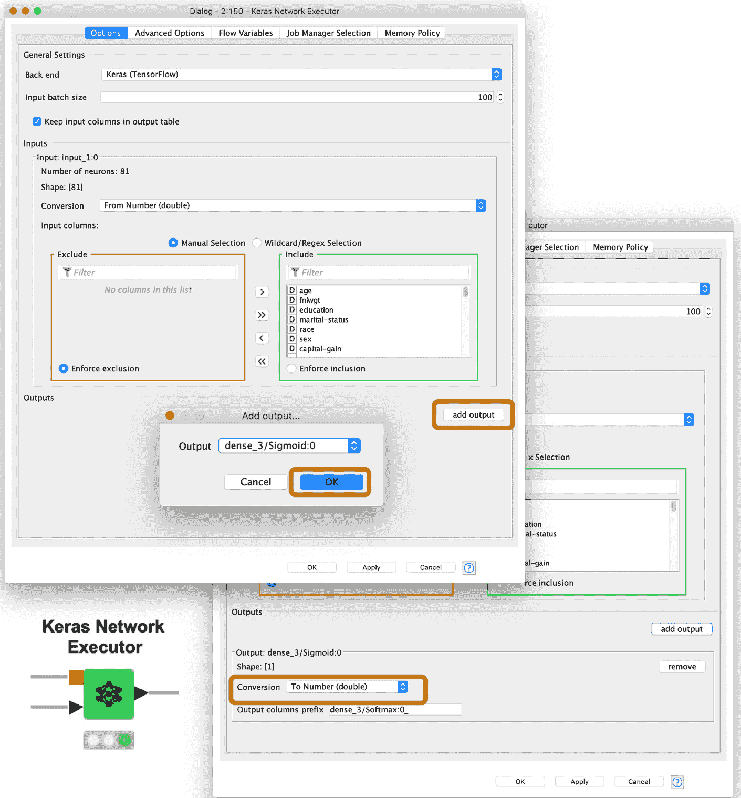

图 4.22 – Keras 网络执行节点在新数据上运行网络。在配置窗口中，您可以通过点击添加输出按钮来选择输出。

在本书中所有的使用案例中，网络的最后一层作为输出层。这一层很容易识别，因为它是下拉列表中唯一没有**（隐藏）**后缀的层。

提示

您还可以输出隐藏层的输出，例如用于调试目的。

最后，选择适当的转换类型，以便以你喜欢的格式获取输出值——例如，将值放在一个单元格中作为列表（**转为数字列表（双精度）**），或者为每个输出单元创建一个新列（**转为数字（双精度）**）。在最后一种情况下，你可以定义一个前缀，附加到输出列的名称上。

**高级选项（Advanced Options）**部分包含设置，允许网络在支持 GPU 的机器上运行。

## 提取预测结果并评估网络性能

根据使用场景，网络输出可能需要一些后处理来提取预测结果。例如，在二分类问题中，若只有一个输出单元且使用了 Sigmoid 激活函数，则输出值为表示类别 `1` 的概率。在这种情况下，你可以在规则引擎节点中应用一个阈值来产生实际的类别分配。

最后一步是评估模型。要评估分类模型，你可以使用**评分器（Scorer）**节点或**ROC 曲线（ROC Curve）**节点。评分器节点的输出提供了常见的性能指标，如准确率、Cohen's Kappa 或混淆矩阵。

提示

另一个非常不错的节点，用于评估二分类问题的性能，是**二分类检查器（Binary Classification Inspector）**节点。该节点是 KNIME 机器学习可解释性扩展的一部分：[`hub.knime.com/knime/extensions/org.knime.features.mli/latest`](https://hub.knime.com/knime/extensions/org.knime.features.mli/latest)。

对于回归解决方案的评估，**数值评分器（Numeric Scorer）**节点计算一些误差指标，如均方误差、均方根误差、平均绝对误差、平均绝对百分比误差、平均符号差异和 R 平方值。

## 测试训练好的鸢尾花分类网络

在*图 4.23*中，你可以看到应用训练好的网络、提取预测结果并评估用于分类鸢尾花的网络部分：

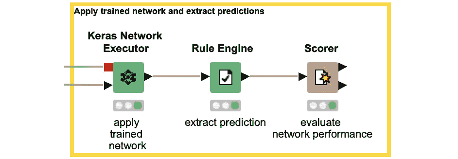

图 4.23 – 该工作流片段应用训练好的网络，提取并评估鸢尾花示例的预测结果

在 `"dense_2/Softmax:0_"` 的配置窗口中，已选择**转换类型：转为数字（双精度）**。由于鸢尾花数据集有三种不同的类别值，节点添加了三个新列，分别表示这三类的概率。另一种转换选项是**转为数字列表（双精度）**。这种转换选项会导致只新增一个列，将所有类别的概率以列表形式放入一个单元格中。

接下来，使用 Rule Engine 节点提取预测结果。不同类别的概率在 `$Output_1/Softmax:0_0for class 0` 列中为类别 0，在 `Output_1/Softmax:0_1` 列中为类别 1，在 `Output_1/Softmax:0_2` 列中为类别 2。此处，选取具有最高概率的类别作为预测结果。

第一条规则通过将编码为 `0` 的类别与其他两个类别的概率进行比较，检查是否其概率最大。第二条规则对编码为 `1` 的类别执行相同的操作，第三条规则则检查编码为 `2` 的类别。最后一条规则定义了默认值。

这些规则通过以下代码应用：

```py
$Output_1/Softmax:0_0$ > $Output_1/Softmax:0_1$ AND $Output_1/Softmax:0_0$ > $Output_1/Softmax:0_2$ => 0
$Output_1/Softmax:0_1$ > $Output_1/Softmax:0_0$ AND $Output_1/Softmax:0_1$ >$Output_1/Softmax:0_2$ => 1
$Output_1/Softmax:0_2$ > $Output_1/Softmax:0_0$ AND $Output_1/Softmax:0_2$ >$Output_1/Softmax:0_1$ => 2
TRUE => 3
```

最后，使用 Scorer 节点评估网络性能。

## 测试用于收入预测的训练网络

使用相同的节点组合，并调整设置，可以应用训练后的网络，提取预测结果，并评估成人数据集上的收入预测模型。

在 Keras Network Executor 节点的配置窗口中，将 `dense_3` 输出层作为输出添加。在此情况下，网络的输出为编码为 `1`（`">50K"`）的类别的概率。

最后，Rule Engine 节点通过以下代码检查输出概率是否高于或低于 `0.5` 阈值：

```py
$dense_3/Softmax:0_0$ < 0.5=> "<=50K"
TRUE => ">50K"
```

最后，使用 Scorer 节点评估网络性能。

到这里，我们已经完成了整个过程，从数据访问和数据准备，到使用 KNIME Analytics Platform 定义、训练、应用和评估神经网络。

# 总结

本章已接近尾声，在这里你学会了如何在 KNIME Analytics Platform 中执行训练神经网络的不同步骤。

我们从常见的预处理步骤开始，包括不同的编码、归一化和缺失值处理。接下来，你学习了如何通过使用不同的 Keras 层节点而不编写代码来定义神经网络架构。然后，我们进入了神经网络的训练，你学习了如何定义损失函数，以及如何监控学习进度、应用网络到新数据并提取预测结果。

每个部分结束时都有小的示例环节，帮助你准备独立完成所有这些步骤。

在下一章中，你将看到如何将这些步骤应用于本书的第一个用例：使用自编码器进行欺诈检测。

# 问题与练习

通过回答以下问题，检查你对本章中概念的理解程度：

1.  如何设置损失函数来训练你的神经网络？

    a) 通过使用 Keras 损失函数节点

    b) 通过使用 Keras 输出层节点

    c) 在 Keras Network Learner 节点的配置窗口中

    d) 在 Keras Network Executor 节点的配置窗口中

1.  如何对你的特征进行 one-hot 编码？

    a) 通过使用 One Hot Encoding 节点

    b) 通过使用 One to Many 节点

    c) 通过使用 Category to Number 节点创建整数编码，然后使用 Integer to One Hot Encoding 节点。

    d) 通过创建整数编码，将其转换为集合单元，并选择正确的转换。

1.  如何定义网络输入层的神经元数量？

    a) 通过使用 Keras 输入层节点。

    b) 通过使用没有任何输入网络的 Keras 全连接层节点。

    c) 输入维度根据在 Keras Network Learner 节点中选择的特征自动设置。

    d) 通过使用 Keras 起始层节点。

1.  如何监控神经网络在验证集上的训练过程？

    a) 将验证集输入到 Keras Network Learner 节点的可选输入端口，并打开训练监视器视图。验证集的性能以红色显示。

    b) 在训练监视器视图中点击**应用于验证集**按钮。

    c) 将验证集输入到 Keras Network Learner 节点的可选输入端口，并打开训练监视器视图。验证集的性能以蓝色显示。

    d) 将验证集输入到 Keras Network Learner 节点的可选输入端口，并打开训练监视器视图中的验证集标签。构建一个工作流来读取 Iris 数据集，并训练一个包含一个隐藏层（八个单元和 ReLU 激活函数）的神经网络，根据四个输入特征区分三种物种。
