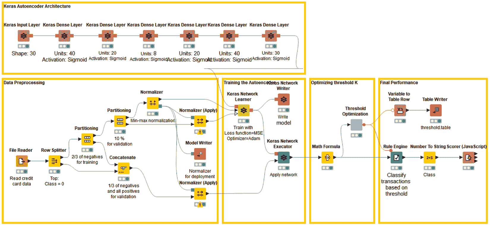

# 第五章：*第五章：* 用于欺诈检测的自编码器

到了本书的这个阶段，你应该已经掌握了神经网络背后的基本数学和概念，以及一些深度学习范式，还了解了数据准备中最有用的 KNIME 节点，如何构建神经网络、如何训练和测试它，最后如何评估它。我们在*第四章*《构建和训练前馈神经网络》中共同构建了两个全连接前馈神经网络的例子：一个用于解决 Iris 数据集的多分类问题，另一个用于解决 Adult 数据集的二分类问题。

那些是使用相对较小数据集的两个简单例子，所有类别都有充分的代表性，网络中仅有几层隐藏层，并且输出类别的编码也很直接。然而，它们达到了它们的目的：教你如何在 KNIME 分析平台中组装、训练和应用神经网络。

现在，时机已经成熟，开始探索更现实的例子，并应用更复杂的神经网络架构和更先进的深度学习范式，以解决有时基于条件较差数据集的更复杂问题。在接下来的章节中，你将看到一些更具现实性的案例研究，这些案例需要比单纯使用全连接前馈网络进行分类更具创意的解决方案。

我们将从一个二分类问题开始，数据集只包含两个类别中的一个。在这里，经典的分类方法无法工作，因为训练集缺少其中一个类别。这类问题有很多，例如预测机械故障的异常检测或欺诈检测，用以区分合法和欺诈的信用卡交易。

本章探讨了一种替代的神经网络方法，用于设计解决欺诈检测中极端情况的方案：**自编码器**架构。

我们将涵盖以下主题：

+   介绍自编码器

+   为什么欺诈检测这么难？

+   构建和训练自编码器

+   优化自编码器策略

+   部署欺诈检测器

# 介绍自编码器

在前几章中，我们看到神经网络是非常强大的算法。每个网络的力量来源于其架构、激活函数、正则化项，以及一些其他特性。在各种神经网络架构中，有一种非常通用的架构，特别适用于三项任务：检测未知事件、检测意外事件，以及降低输入空间的维度。这种神经网络就是**自编码器**。

## 自编码器的架构

自编码器（或**自关联器**）是一个多层前馈神经网络，训练的目标是将输入向量映射到输出层。像许多神经网络一样，它使用梯度下降算法或其现代变体进行训练，针对[损失函数](https://keras.io/losses/)，例如**均方误差**（**MSE**）。它可以有任意数量的隐藏层。也可以在这里应用正则化项和其他有助于避免过拟合或改善学习过程的通用参数。

架构的唯一约束是输入单元的数量必须与输出单元的数量相同，因为目标是训练自编码器将输入向量映射到输出层。

最简单的自编码器只有三层：一个输入层，一个隐藏层和一个输出层。更复杂结构的自编码器可能包含额外的隐藏层：

图 5.1 – 一个简单的自编码器

自编码器可以用于许多不同的任务。让我们首先看看自编码器如何用于降维。

## 使用自编码器减少输入的维度

让我们考虑一个非常简单架构的自编码器：一个输入层，包含个单元；一个输出层，也包含个单元；以及一个隐藏层，包含个单元。如果，自编码器将输入向量压缩到隐藏层，降低其维度，从降到。

在这种情况下，网络的第一部分，将数据从大小为的向量转换为大小为的向量，充当编码器的角色。网络的第二部分，将输入向量从空间重建回空间，充当解码器。压缩率则为。值为越大，值为越小，压缩率越高：

图 5.2 – 三层自编码器中的编码器和解码器子网络

当使用自编码器进行**降维**时，首先训练完整的网络，将输入向量映射到输出层。然后，在部署之前，它被拆分为两部分：**编码器**（输入层和隐藏层）和**解码器**（隐藏层和输出层）。这两个子网络被分别存储。

提示

如果你对瓶颈层的输出感兴趣，可以将**Keras 网络执行器**节点配置为输出中间层。或者，你也可以在**DL Python 网络编辑器**节点中，通过编写几行 Python 代码来拆分网络。

在部署阶段，为了压缩输入记录，我们只需将其传递通过编码器，并将隐藏层的输出保存为压缩记录。然后，为了重建原始向量，我们将压缩记录通过解码器并保存输出层的输出值作为重建向量。

如果自编码器使用了更复杂的结构——例如，拥有多个隐藏层——那么其中一个隐藏层必须作为压缩器的输出，产生压缩记录并将编码器和解码器子网络分开。

现在，当我们谈论数据压缩时，问题是原始记录能否被忠实地重建？使用隐藏层的输出而非原始数据向量，会丢失多少信息？当然，这一切都取决于自编码器的表现如何以及我们的误差容忍度有多大。

在测试阶段，当我们将网络应用于新数据时，我们会对输出值进行去归一化，并计算所选的误差度量——例如，**均方根误差**（**RMSE**）——在整个测试集上计算原始输入数据与重建数据之间的差异。这个误差值为我们提供了重建数据质量的衡量标准。当然，压缩率越高，重建误差就越大。因此，问题变成了训练网络以达到根据我们的误差容忍度所能接受的性能。

让我们继续讨论自编码器的下一个应用领域：异常检测。

## 使用自编码器检测异常

在大多数分类/预测问题中，我们拥有一组覆盖所有事件类别的示例，并基于这个数据集训练一个模型来分类事件。然而，有时我们想要预测的事件类别是非常稀有和意外的，以至于根本没有（或几乎没有）任何示例可用。在这种情况下，我们不再谈论分类或预测，而是谈论**异常检测**。

异常可以是任何稀有、意外、未知的事件：心律不齐、机械故障、欺诈交易或其他稀有、意外、未知的事件。在这种情况下，由于训练集中没有异常的示例，我们需要以比传统标准分类更具创造性的方式使用神经网络。自编码器结构非常适合这种创造性使用，正如解决异常检测问题所需要的那样（例如，参见 A.G. Gebresilassie，*神经网络用于异常（离群点）检测*，[`blog.goodaudience.com/neural-networks-for-anomaly-outliers-detection-a454e3fdaae8`](https://blog.goodaudience.com/neural-networks-for-anomaly-outliers-detection-a454e3fdaae8)）。

由于没有异常示例可用，自编码器仅对非异常示例进行训练。我们将这些示例称为“正常”类。在充满“正常”数据的训练集上，自编码器网络被训练以将输入特征向量重构到输出层。

这个思想是，当自编码器被要求重构“正常”类的向量时，它可能会表现得相当不错，因为这是它训练的目标。然而，当它被要求重构输出层中的异常时，它应该会失败，因为它在整个训练阶段没有见过这种类型的向量。因此，如果我们计算原始向量与重构向量之间的距离——任何一种距离——我们会发现对于“正常”类的输入向量，距离较小，而对于表示异常的输入向量，距离则大得多。

因此，通过设置一个阈值，，我们应该能够通过以下规则检测异常：

IF  THEN  -> "正常"

IF  THEN  -> "异常"

这里，是输入向量的重建误差，，以及是设定的阈值。

这种解决方案已经成功地应用于欺诈检测，正如在一篇博客文章中所描述的，*使用 Keras 中的自编码器进行信用卡欺诈检测--黑客的 TensorFlow（第六部分）*[*I)*，作者是 Venelin Valkov（[`medium.com/@curiousily/credit-card-fraud-detection-using-autoencoders-in-keras-tensorflow-for-hacker`](https://medium.com/@curiousily/credit-card-fraud-detection-using-autoencoders-in-keras-tensorflow-for-hackers-part-vii-20e0c85301bd)s-part-vii-20e0c85301bd)）。在这一章中，我们将使用相同的思想，通过不同的自编码器结构构建类似的解决方案。

让我们来了解自编码器的思想如何用于检测欺诈交易。

# 为什么欺诈检测如此困难？

**欺诈检测**是一组旨在通过虚假手段防止财物被非法获取的活动。欺诈检测被应用于许多行业，如银行业或保险业。在银行业中，欺诈可能包括伪造支票或使用盗窃的信用卡。对于本示例，我们将重点讨论信用卡交易中的欺诈行为。

这种信用卡交易中的欺诈问题，对于信用卡发行商和最终支付方来说都是一个巨大的问题。欧洲中央银行报告称，2016 年，使用**单一欧元支付区**（**SEPA**）发行的卡的卡欺诈案件总数为 1730 万件，而使用 SEPA 发行的卡的卡交易总数为 749 亿笔（[`www.ecb.europa.eu/pub/cardfraud/html/ecb.cardfraudreport201809.en.html#toc1`](https://www.ecb.europa.eu/pub/cardfraud/html/ecb.cardfraudreport201809.en.html#toc1)）。

然而，欺诈的数量并不是唯一的问题。从数据科学的角度来看，欺诈检测也是一个非常难解决的任务，因为关于欺诈交易的数据非常少。也就是说，我们通常有大量的合法信用卡交易数据，而关于欺诈交易的数据则寥寥无几。在这种情况下，经典的方法（训练，然后应用模型）是不可行的，因为其中一个类别的示例缺失。

然而，欺诈检测也可以看作是异常检测。异常检测是数据集中任何意外事件。欺诈交易确实是一个意外事件，因此我们可以将其视为合法*正常*信用卡交易数据集中的异常。

欺诈检测有几种不同的方法。

一种选择是判别方法。基于包含合法和欺诈交易的训练集，我们构建一个区分两类数据的模型。这可以是一个简单的基于阈值的规则，或者一个有监督的机器学习模型。这是基于包含两类数据的足够示例的经典方法。

或者，你可以将欺诈检测问题视为异常值检测。在这种情况下，你可以使用一种为异常值（噪声）留出空间的聚类算法，比如**DBSCAN**；或者使用**孤立森林技术**，它通过对合法数据进行少量切割来孤立异常值。然而，欺诈交易必须属于原始数据集，才能被孤立为异常值。

另一种方法，称为**生成方法**，在训练阶段只使用合法的交易。这使得我们能够将输入向量复制到输出层。一旦自编码器模型训练完成，我们将在部署过程中使用它来重现输入交易。然后我们计算输入值和输出值之间的距离（或误差）。如果该距离低于给定的阈值，则交易可能是合法的；否则，它将被标记为潜在欺诈交易。

在这个示例中，我们将使用[Kaggle 上的](https://www.kaggle.com/mlg-ulb/creditcardfraud)信用卡数据集。该数据集包含 2013 年 9 月来自欧洲持卡人的信用卡交易记录。欺诈交易标记为`1`，合法交易标记为`0`。数据集包含 284,807 笔交易，但其中仅有 492 笔（0.2%）是欺诈交易。出于隐私原因，使用主成分代替原始的交易特征。因此，每笔信用卡交易由 30 个特征表示：28 个从原始信用卡数据中提取的主成分、交易时间和交易金额。

让我们开始构建、训练和测试自编码器。

# 构建和训练自编码器

让我们详细讨论一下我们将构建的特定应用，用以解决通过神经自编码器进行欺诈检测的问题。像所有的数据科学项目一样，它包括两个独立的应用：一个用于在专用数据集上训练和优化整个策略，另一个用于将其应用到实际的信用卡交易中进行分析。第一个应用通过**训练工作流**实现；第二个应用通过**部署工作流**实现。

提示

通常，训练和部署是两个独立的应用，因为它们处理的数据不同，目标也不同。

训练工作流使用实验室数据集来生成一个可接受的模型，以实现任务，有时需要进行几次不同的尝试。部署工作流则不再改变模型或策略，它只是将模型应用于真实世界的交易中，以获取欺诈警报。

在本节中，我们将重点关注训练阶段，包括以下步骤：

+   **数据访问**：在这里，我们从文件中读取实验室数据，包括所有 28 个主成分、交易金额和相应的时间。

+   **数据准备**：数据通过**主成分分析**（**PCA**）已经被清理和转换。本阶段需要做的就是创建所有训练、优化和测试神经自编码器及整个策略所需的数据子集。

+   **构建神经网络**：自编码器是一种前馈神经网络，输入和输出的数量相同。接下来，我们决定隐藏层的数量、每层的隐藏神经元数量以及激活函数，并据此构建网络。

+   **训练神经自编码器**：在这一部分，自编码器将在仅包含合法交易的训练集上进行训练，使用其中一种训练算法（优化器），根据选择的训练参数，如至少损失函数、迭代次数和批次大小等。

+   **欺诈警报规则**：网络训练完成后，能够在输出层复现合法交易后，我们需要通过计算输入和输出层之间的距离，并设置基于阈值的规则来触发欺诈警报，从而完成策略。

+   **测试整体策略**：最后一步是测试整体策略的性能。多少合法交易被正确识别？多少欺诈警报被正确触发？有多少是误报？

## 数据访问和数据准备

来自 Kaggle 的信用卡数据集已经经过清理和转换。现在我们需要创建所有数据子集。具体来说，我们需要一个用于自编码器训练的训练集和一个验证集。它们必须仅包含合法交易。训练集用于训练网络，验证集用于在训练期间监控自编码器在未见数据上的性能。

然后，我们需要另一个数据子集，即阈值优化集，用于优化基于规则的欺诈警报生成器中的阈值值 。这个最后的子集应包括所有欺诈交易，以及一些合法交易，具体如下：

+   所有合法交易的 2/3 都专用于自编码器。

+   那些合法交易的 90%形成**训练集**。

+   10%来自**验证集**。

+   所有合法交易中的 1/3（96K）和所有 492 笔欺诈交易形成**阈值优化集**，用于优化基于阈值的欺诈警报生成器的阈值值 。

所有这些转化为一个**行分割器**节点，将合法交易与欺诈交易分开，一个**连接**节点将欺诈交易重新添加到阈值优化集中，以及若干**分区**节点。在分区节点中，所有数据的提取都是随机进行的。

图 5.3 – 用于欺诈检测过程的数据集

重要提示

训练集、验证集和阈值优化集必须完全分离。不能在任何子集之间共享记录。这是为了确保在评估期间有意义的性能度量和独立的优化过程。

接下来，必须对每个子集中的所有数据进行归一化，以确保它们落在 范围内。归一化是在训练集上定义并应用于其他两个子集。归一化参数也会保存用于部署工作流的**模型写入器**节点：

图 5.4 – 实施欺诈检测数据准备的工作流程

*图 5.4*显示了如何在 KNIME Analytics 平台中执行不同数据集的创建和归一化。

## 构建自编码器

对于这个案例研究，我们构建了一个具有五个隐藏层的自编码器，分别为`30-40-20-8-20-40-30`个单元，并且 sigmoid 作为激活函数。

神经网络是通过以下方式构建的（参见*图 5.5*）：

+   形状 = 30

+   使用五个**Keras Dense Layer**节点来实现隐藏层，使用 sigmoid 作为激活函数，分别是 40、20、8、20 和 40 个单元。

+   **Keras Dense Layer**节点用于输出层，具有 30 个单元和 sigmoid 作为激活函数：

图 5.5 – 训练以从输入层到输出层复制信用卡交易的神经自编码器的结构

现在我们已经构建了自编码器，让我们使用数据来训练和测试它。

## 训练和测试自编码器

要训练和验证网络，我们使用**Keras Network Learner**节点，训练集和验证集分别放置在输入端口，并使用以下设置（*见图 5.6*）：

+   epochs 数设置为`50`，训练和验证集的批次大小设置为`300`，并且使用了**Adam**（优化的反向传播的版本）训练算法，在**Options**标签中。

+   损失函数设置为**Target**标签中的 MSE。

+   输入标签和目标标签中的目标和输入特征相同，并且被接受为简单的双精度数。

在**Learning Monitor**视图的**Loss**标签中，您现在可以看到两条曲线：一条是批次中每个训练样本的平均损失（或错误）（红色），另一条是验证数据中每个样本的平均损失（蓝色）。

在训练阶段结束时，来自训练集的最终平均损失值约为[0.0012, 0.0016]，来自验证集的批次约为[0.0013, 0.0018]。计算的损失是一个批次的平均重建误差，由以下公式计算：

在这里， 是批次大小， 是输出层上的单元数， 是训练样本*k*中第*i*个神经元的输出值， 是相应的目标答案。

训练后，网络应用于优化集，使用**Keras Network Executor**节点，并将其保存为 Keras 文件以便部署，使用**Keras Network Writer**节点。

*图 5.6* 显示了 Keras 网络执行器节点中 **选项** 标签的配置：所有 30 个输入特征被作为 **Double** 数字传递，并且输入列被保留，以便稍后计算重建误差。最后一层被选择为输出，值作为简单的 **Double** 数字导出：

图 5.6 – Keras 网络执行器节点及其配置窗口

下一步是计算原始特征向量和复现特征向量之间的距离，并应用阈值 ，以发现欺诈候选。

## 侦测欺诈交易

当模型训练完成后，自编码器已经学会了如何将代表合法交易的特征向量复现到输出层。那么我们如何发现可疑交易呢？如果有一个新的交易，，我们如何判断它是可疑的还是合法的呢？

首先，我们通过 Keras 网络执行器节点，将这个新的交易  输入到自编码器中。原始交易的复现会在输出层生成。接下来，计算重建误差 ，即原始交易向量与复现向量之间的距离。根据以下规则，交易会被视为欺诈候选：

如果  那么  -> "合法交易"

如果  那么  -> "欺诈候选交易"

这里， 是交易  的重建误差值，*K* 是一个阈值。重建误差也采用了 MSE：

这里， 是交易  的 *i* 特征， 是网络输出层上对应的值。

 是通过 `1` 来计算的，`1` 是欺诈候选类，`0` 是合法交易类。一个 `1`。特异性是指真正的合法交易与所有没有触发任何警报的交易之间的比例。敏感性则相反，衡量实际触发欺诈交易的欺诈警报的比例。

特异性衡量我们可能错过的欺诈，而敏感性衡量我们发现的欺诈。

图 5.7 – 在规则引擎节点中实现的规则，通过与阈值比较重建误差

现在我们的模型已经训练和测试，需要进行优化。

# 优化自编码器策略

最佳阈值  是多少？在最后一节中，我们根据经验采用了 。但是，对于  来说，这是否是最佳值？在这种情况下，阈值  并不会通过训练过程自动优化。它只是训练算法外部的静态参数。在 KNIME Analytics 平台上，也可以在**学习者**节点外部优化静态参数。

## 优化阈值 

## 阈值  定义在名为**优化集**的数据的一个单独子集上。在这里有两个选择：

+   如果可用带有标记的欺诈交易优化集，则阈值  根据任何欺诈检测的准确性度量进行优化。

+   如果数据集中没有可用的标记欺诈交易，则阈值  的值被定义为优化集上重建误差的高百分位数。

在数据准备阶段，我们生成了三个数据子集：用于 Keras 网络学习者节点训练和验证自编码器的训练集和验证集，以及最后一个子集，我们称之为阈值优化集。这个最终子集包括所有合法交易的三分之一和少量欺诈交易。我们可以使用这个子集来优化阈值 ，以提高整个欺诈检测策略的准确性。

优化参数意味着在给定范围内找到最大化或最小化给定度量的值。根据我们的经验，我们假设 *K* 的值为正数（> 0），且在 0.02 以下。因此，优化阈值  的值意味着在  中找到最大化整个应用程序准确性的值。

应用程序的准确性通过一个 Scorer（JavaScript）节点计算，考虑规则引擎节点的结果作为预测，并将其与优化集中的原始类别（`0` = 合法交易，`1` = 欺诈交易）进行比较。

通过一个`loop start`节点和一个`loop end`节点执行值区间的跨度和最大准确性的阈值标识。在优化循环中，这两个节点分别是**参数优化循环起始**节点和**参数优化循环结束**节点。

**参数优化循环起始**节点在给定的区间内以给定的步长遍历参数值。区间  和步长  是根据重建误差特征的范围选择的，如数据表输出端口的**下限**和**上限**单元格所示，该表位于数学公式节点输出端，名为**MSE 输入-输出距离**，紧随 Keras 网络执行器节点之后。

**参数优化循环结束**节点将所有结果作为流变量收集，检测目标度量的最佳（最大或最小）值，并将其与生成该值的参数一起导出。在我们的案例中，目标度量是精度，通过规则引擎节点的预测进行测量，必须针对阈值  进行最大化。

循环起始和循环结束之间的所有节点构成了循环的主体——即，直到输入的参数值区间完全覆盖为止，这部分会根据需要重复多次。在循环主体内，我们增加了额外的约束条件，即只有当特异性和灵敏度接近时，才会找到最优的精度。这是名为 `Coefficient 0/1` 的元节点的目标。在这里，如果特异性和灵敏度相差超过 10%，系数被设置为 `0`，否则为 `1`。然后，这个系数将乘以来自评分器（JavaScript）节点的整体精度。通过这种方式，只有当特异性和灵敏度接近时，才能检测到最大精度：

图 5.8 – 优化循环

在提取最优阈值后，我们将其转化为流变量，并将其传递给最终的规则实现。

### 包装成一个组件

现在，这整个阈值优化部分似乎是一个逻辑上自包含的模块。为了保持我们的工作流程简洁且规范，我们可以将这个模块包装在一个元节点内。更好的是，我们可以通过一种更强类型的元节点——**组件**，确保包装紧密且封闭。

提示

元节点仅仅是收集和打包节点。而组件则不仅收集和打包节点，还继承了包含的 Widget 和 JavaScript 节点的视图以及包含的配置节点的配置窗口。更进一步，组件不允许外部流变量进入或内部流变量退出，除非特别定义。

组件的创建方式类似于元节点。只需选择要分组的节点，右键单击并选择**创建组件…**。创建组件后，其上下文（右键）菜单提供了多个命令，用于打开、展开、通过设置进行修改和共享。要查看组件的内容，只需*Ctrl* + 双击组件。进入后，你可以看到两个节点：**组件输入**和**组件输出**。在这两个节点的配置窗口中，你可以分别设置流变量以导入和导出组件内外的数据。

在我们创建的组件中，我们设置了**组件输出**节点来导出包含最优阈值的流变量。这个流变量需要从组件中输出，以便在最终的欺诈检测规则中使用。最终的规则在一个新的规则引擎节点中实现，最终的预测将在一个新的评分器（JavaScript）节点中与原始类别进行比较。

最终的工作流用于训练和测试神经自编码器，使用信用卡交易数据，并实现带有最优阈值的欺诈检测规则，详见*图 5.9*。该工作流名为`01_Autoencoder_for_Fraud_Detection_Training`，可以从 KNIME Hub 下载：[`hub.knime.com/kathrin/spaces/Codeless%20Deep%20Learning%20with%20KNIME/latest/Chapter%205/`](https://hub.knime.com/kathrin/spaces/Codeless%20Deep%20Learning%20with%20KNIME/latest/Chapter%205/)：

图 5.9 – 训练和测试自编码器并找到最优阈值 K 的工作流

既然我们已经找到了最佳阈值，让我们来看看自编码器的性能。

### 性能指标

本节中，我们报告了应用欺诈检测规则后，在阈值优化集上该方法的性能指标。最优阈值被发现为，准确率为 93.52%。

在*图 5.10*中，你可以看到**混淆矩阵**、基于此的类别统计以及一般的性能指标，所有这些都描述了欺诈检测器在优化集上的表现：

图 5.10 – 使用优化阈值 K 的最终欺诈检测器的性能指标

假设类别 1（欺诈）为正类。大量的假阳性（6,236）显示了这种方法的弱点：它容易产生假阳性。换句话说，它倾向于将完全合法的交易错误标记为欺诈候选交易。现在，确实有些案例研究中假阳性不是一个大问题，这就是其中之一。在假阳性的情况下，付出的代价是向信用卡持有者发送当前交易的消息。如果这条消息没有用处，与可能的风险相比，损害并不大。当然，这种容忍度并不适用于所有案例研究。在医学诊断中，假阳性比信用卡交易中的错误欺诈警报责任要大得多。

重要提示

通过在定义阈值*K*时引入基于专业知识的偏差，整个过程也可以被迫倾向于欺诈候选交易或合法交易。

一般来说，自动编码器能够捕获验证集中 87%的欺诈交易和 93%的合法交易，总体准确率为 85%，Cohen's kappa 值为 0.112。考虑到验证集中正常交易与欺诈交易的高度不平衡（96,668 比 492），结果仍然是有前景的。

请注意，这种容易产生假阳性的方式对于没有或几乎没有某一类别示例的案例研究来说是一个无奈的解决方案。在一个包含标注示例的训练集上，监督分类器可能会达到更好的表现。但这就是我们必须应对的数据！

我们已经训练好了自动编码器，并找到了我们规则系统的最佳阈值。在下一部分中，我们将看到如何在现实世界的实际数据上部署它。

# 部署欺诈检测器

到此为止，我们已经有了一个自动编码器网络和一个具有可接受性能的欺诈检测规则。在这一部分中，我们将实现**部署**工作流。

部署工作流（*图 5.11*），像所有部署工作流一样，接收新的交易数据，将其通过自动编码器，计算距离，应用欺诈检测规则，最后，将输入交易标记为欺诈或合法。

这个工作流名为`02_Autoencoder_for_Fraud_Detection_Deployment`，可以从 KNIME Hub 下载：[`hub.knime.com/kathrin/spaces/Codeless%20Deep%20Learning%20with%20KNIME/latest/Chapter%205/`](https://hub.knime.com/kathrin/spaces/Codeless%20Deep%20Learning%20with%20KNIME/latest/Chapter%205/)：

图 5.11 – 部署工作流

让我们详细看一下工作流的不同部分。

## 读取网络、新交易和标准化参数

在这个工作流中，首先通过**Keras 网络读取器**节点，从之前保存的 Keras 文件中读取自动编码器模型。

与此同时，一些新的信用卡交易数据通过**文件读取器**节点从文件中读取。这个特定的文件包含了两笔新的交易。

交易数据使用与训练数据相同的参数进行标准化，这些参数之前保存在名为 `normalizer model` 的文件中。这些标准化参数通过**模型读取器**节点从文件中读取。

最后一份文件包含了优化后的阈值值，*K*。

## 应用欺诈检测器

交易数据被输入到自编码器网络中，并通过 Keras 网络执行器节点在输出层进行重建。

随后，通过**数学公式**节点计算每笔交易的原始特征和重建特征之间的均方误差（MSE）。

规则引擎节点应用阈值，，这是在优化阶段定义的，用来检测可能的欺诈候选。

下表展示了两笔交易的重建误差以及随之而来的分类结果。应用（自编码器和距离规则）将第一笔交易定义为合法，第二笔交易定义为欺诈候选：

图 5.12 – 用于部署的数据集中信用卡交易的重建误差和欺诈分类结果

## 采取行动

在工作流的最后部分，我们需要采取行动：

+   如果交易是合法的（类别 0）=> 不做任何操作

+   如果交易是欺诈候选（类别 1）=> 向卡主发送确认消息

**IF-THEN** 条件和行动通过 KNIME 分析平台中的开关块实现。类似于循环，开关块有一个起始节点和一个结束节点。然而，开关块中的结束节点是可选的。开关起始节点只会激活一个输出端口，从而仅启用一个可能的数据流路径。开关结束节点收集来自不同分支的结果。最通用的开关块是**CASE switch**，它有多种变体：适用于数据、流变量或模型。

活动端口，然后是活动分支，通过**Switch CASE Start**节点的配置窗口进行控制。此配置设置通常通过流变量控制，流变量的值每次决定启用哪个输出。

在我们的案例中，我们有两个分支。上分支连接到端口 `0`，由类别 `0` 激活，不执行任何操作。第二个分支连接到端口 `1`，由类别 `1` 激活，并向信用卡持有者发送电子邮件。

在这里我们结束了基于自编码器的欺诈检测策略的实现部分。

# 总结

在本章中，我们讨论了在几乎没有或完全没有欺诈类别样本的情况下，构建信用卡交易欺诈检测器的方法。这一解决方案训练一个神经自编码器，将合法交易从输入重建到输出层。需要一些后处理步骤，通过重建误差为潜在欺诈行为设置警报。

在描述这个解决方案时，我们引入了训练与部署应用、组件、优化循环和开关块的概念。

在下一章，我们将讨论一种特殊类型的神经网络，即所谓的循环神经网络，以及它们如何用于训练处理序列数据的神经网络。

## 问题与练习

通过回答以下问题，检查你对本章概念的理解程度：

1.  自编码器在训练过程中的目标是什么？

    a) 将输入重建到输出

    b) 学习自动编码

    c) 对训练数据进行编码

    d) 训练一个能够区分两个类别的网络

1.  自编码器的常见应用场景有哪些？

    a) 时间序列预测

    b) 异常检测

    c) 多类别分类问题

    d) 回归问题

1.  自编码器如何用于降维？

    a) 通过训练一个输出层神经元数量少于输入层的网络

    b) 通过训练一个自编码器并仅提取编码器

    c) 通过构建一个自编码器并仅提取解码器

    d) 通过构建一个隐藏神经元比输入和输出层更多的网络
