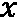
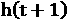
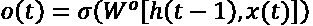
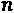
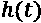

# 第六章：*第六章:* 用于需求预测的递归神经网络

到目前为止，我们已经通过两种变体的全连接前馈神经网络积累了一些经验：通过将输入样本分配到一组预定义的类中来实现分类任务，或者尝试通过自编码器架构重建输入向量的形状。在这两种情况下，输出响应仅依赖于当前输入向量的值。在时刻，输出响应，，依赖于且仅依赖于时刻的输入向量，。网络没有对之前的任何记忆，并且仅根据输入生成。

使用**递归神经网络**（**RNNs**），我们引入了时间组件。我们将发现网络的输出响应，，在时刻依赖于当前输入样本，，以及之前的输入样本，，，……，网络对过去样本的记忆依赖于网络架构。

我们首先介绍 RNN 的一般概念，然后在经典时间序列分析任务**需求预测**的领域中，介绍**长短期记忆**（**LSTM**）的具体概念。接着，我们将展示如何将网络输入不仅仅是静态向量，，还包括向量序列，例如 ，，，……，这些序列跨越了个过去输入信号的样本。这些基于训练集构建的输入向量（张量）序列将用于训练和评估基于 LSTM 的 RNN 的实际实现。

总结来说，本章将涵盖以下主题：

+   引入 RNN

+   需求预测问题

+   数据准备——创造过去

+   构建、训练和部署基于 LSTM 的 RNN

# 引入 RNN

让我们从 RNN 的概述开始。

**RNNs**是无法局限于前馈架构的神经网络家族。

重要提示

通过在前馈神经网络中引入自连接或反向连接——即递归连接——来获得 RNN。

在引入递归连接时，我们引入了时间的概念。这使得 RNN 可以考虑上下文；即通过捕捉信号的动态来记住过去的输入。

引入递归连接改变了神经网络的性质，从静态变为动态，因此适用于分析时间序列。事实上，RNNs 常用于解决涉及时间顺序序列的问题，例如时间序列分析、语言建模、自由文本生成、自动机器翻译、语音识别、图像描述等问题，这些问题都在研究给定信号的时间演化。

## 递归神经网络

如前一节所述，引入自连接或反向连接到前馈网络中会将其转变为 RNN。例如，考虑 *图 6.1* 中所示的简单前馈网络，查看其左侧的详细表示和右侧的紧凑表示：

图 6.1 – 左侧是简单的全连接前馈网络，右侧是其更紧凑的基于矩阵的表示

*图 6.1* 中网络的紧凑表示包括一个多维输入 、一个可能是多维的输出 、一个由包含神经元图标的框表示的隐藏层，以及从输入到隐藏层的两个权重矩阵 ，以及从隐藏层到输出层的权重矩阵 。

现在我们向这个网络引入一个递归连接，将输出向量  反馈到输入层，除了原始输入向量  之外（*图 6.2*）。这个对网络架构的简单修改改变了网络的行为。之前，网络实现的函数仅仅是 ，其中  是输入样本  被呈现给网络时的当前时间。现在，递归网络实现的函数变为 ；也就是说，当前的输出不仅依赖于当前的输入，还依赖于上一步为上一个输入样本产生的输出。我们引入了时间的概念：

图 6.2 – 向前馈网络添加递归连接

多亏了这些循环连接，RNN 的输出也包含了一些输入信号的历史信息。因此我们说它们具有记忆功能。记忆跨度能追溯到多远取决于递归架构和其中包含的范式。因此，RNN 比前馈网络更适合分析序列数据，因为它们也能处理来自过去的信息。过去的输入信息通过输出反馈转化到输入层，经过循环连接。

问题现在变成了如何训练一个网络，使得其输出不仅依赖于当前输入，还依赖于先前的输出。正如你可以想象的那样，多年来已经提出了许多算法。最简单的算法，也是最常被采用的，就是**反向传播通过时间**（**BPTT**）（Goodfellow I, Bengio Y., Courville A., *深度学习*，MIT 出版社，(2016)）。

BPTT 的基础是*展开*网络的概念。为了理解*展开*的概念，让我们在训练过程中查看网络在不同时间点的情况，：

+   在时刻，我们有原始的前馈网络，具有权重矩阵和，输入为和，输出为。

+   在时刻，我们再次得到了原始的前馈网络，具有权重矩阵和，但这次的输入是和，输出是。

+   在时刻，我们再次得到了原始的前馈网络，具有权重矩阵和，但这次的输入是和，输出是。

+   这对于输入序列中的样本是持续进行的。

实际上，我们可以将原始前馈网络复制多次，使用静态权重矩阵 和  ，复制的次数与输入序列中的样本数相同(*图 6.3*)。在时间时，原始网络的每个副本将接收当前输入向量和前一个输出向量作为输入。更一般地，在每个时间时，网络副本将产生一个输出和一个相关的状态。状态是网络的记忆，并馈送到下一个静态网络副本，而是每个网络副本的专用输出。在某些递归架构中，和是相同的。

让我们总结一下。我们有一个递归网络，具有以下特点：

+   由输入张量提供，大小为，由一系列 维向量组成

+   产生一个输出张量，，大小为，由一系列 维向量组成

+   生成一个状态张量，，与输出张量相关，用作网络记忆

    重要提示

    这个递归网络也可以只是一个子网络，作为更大神经架构中的一个隐藏单元。在这种情况下，它由前一层的输出作为输入，并且它的输出构成了更大网络中下一层的输入。此时，不是整个网络的输出，而只是这个递归单元的输出——即整个网络的中间隐藏状态。

在*图 6.3*中，我们提出了对*图 6.2*中简单递归网络的四个时间步展开：

图 6.3 – 随时间展开递归网络

到目前为止，我们已经将循环子网络转化为  个原始前馈网络的副本——也就是一个更大的静态前馈网络。尽管它可能非常庞大，但我们已经知道如何使用反向传播算法训练完全连接的前馈网络。因此，反向传播算法已经适应了展开过程，并用来训练得到的前馈网络。这就是基本的 BPTT 算法。多年来，也提出了许多 BPTT 算法的变种。

我们现在将深入了解最简单的循环网络，它由一个仅包含循环单元的单层网络组成。

## 循环神经单元

最简单的循环神经单元由一个仅包含单一隐藏层的网络组成，激活函数为 ，并带有自连接。通过相同的时间展开过程，我们可以将这个单元表示为  个具有一个隐藏层且仅有一个单元的前馈网络的副本（*图 6.4*）：

图 6.4 – 最简单的循环神经单元

在这种情况下，输出  也是网络的状态，它会反馈到输入中——也就是反馈到时间  时展开网络的下一个副本的输入中。

这个简单的循环单元已经展现出一些记忆功能，因为当前的输出也依赖于先前输入层呈现的样本。然而，它的架构过于简单，无法展示出显著的记忆跨度。当然，所需的记忆跨度取决于要解决的任务。一个经典的例子就是句子补全。

要完成一个句子，你需要知道句子的主题，而要知道主题，你需要了解句子中的前几个词。例如，分析句子 *Cars drive on the …*，我们意识到主题是 *cars*，然后唯一合逻辑的答案是 *road*。为了完成这个句子，我们只需要记住四个词。现在，我们来看看一个更复杂的句子，比如 *I love the beach. My favorite sound is the crashing of the …*。在这种情况下，可能的答案有很多，包括 *cars*、*glass* 或 *waves*。为了理解哪个是合逻辑的答案，我们需要回溯到句子中的 *beach* 这个词，回溯的距离是九个词。分析这个句子所需的记忆跨度是分析前一个句子所需记忆跨度的两倍多。这个简短的例子表明，有时需要更长的记忆跨度才能给出正确答案。

简单的循环神经单元提供了一些记忆，但通常不足以解决大多数需要的任务。我们需要更强大的东西，能够回溯更远的过去，而不仅仅是简单循环单元能做到的。这正是为什么引入了 LSTM 单元。

## 长短期记忆（LSTM）

LSTM 首次于 1997 年提出（Hochreiter, Sepp 和 Schmidhuber, Jürgen（1997），*长短期记忆。神经计算*，9. 1735-80。10.1162/neco.1997.9.8.1735，https://www.researchgate.net/publication/13853244_Long_Short-term_Memory）。它是一种更复杂的递归单元，使用了一个额外的隐藏向量——细胞状态或记忆状态，，以及门的概念。

*图 6.5* 显示了展开的 LSTM 单元的结构（C. Olah，*理解 LSTM 网络*，2015，[`colah.github.io/posts/2015-08-Understanding-LSTMs/`](https://colah.github.io/posts/2015-08-Understanding-LSTMs/)）：

图 6.5 – LSTM 层

如你所见，不同副本的单元通过两个隐藏向量相连。顶部的那个是细胞状态向量，，用于使信息在不同单元副本之间流动。底部的那个是单元的输出向量。

接下来，我们有三个门。门可以开启或关闭（或者部分开启/关闭），通过这种方式，它们决定了从隐藏向量中存储或删除什么内容。一个门由一个 Sigmoid 函数和逐元素相乘组成。实际上，Sigmoid 函数的输出值范围是 [0,1]。具体来说， 删除输入（即遗忘），而  让输入不变（即记住）。在  和  之间，可能会出现各种记忆和遗忘的细微差别。

这些 Sigmoid 层的权重（用于实现门）通过学习过程进行调整。也就是说，门通过反复猜测、反向传播误差，并通过梯度下降调整权重的迭代过程来学习何时允许数据进入、离开或被删除。LSTM 层的训练算法再次是反向传播算法的一个变体。

一个 LSTM 层包含三个门：遗忘门、输入门和输出门（*图 6.5*）。我们来仔细看看这些门。

### 遗忘门

最左边的第一个门，**遗忘门**，过滤掉细胞状态向量中的成分。基于当前输入向量中的值， 和上一单元的输出向量中的值，，该门做出遗忘或记住的决策，如下所示：

这里， 是遗忘门的权重矩阵。

决策向量  然后与隐藏的细胞状态向量  逐元素相乘，决定从上一状态中记住什么内容（）以及忘记什么内容（）。

那么，现在的问题是，为什么我们要忘记呢？如果引入了 LSTM 单元来获得更长的记忆，为什么还需要忘记某些内容呢？举个例子，分析文本语料库中的一篇文档时；你可能需要忘记之前文档中的所有知识，因为这两篇文档可能没有关联。因此，对于每个新文档，记忆应该重置为 0。

即使在同一文本中，如果你移动到下一个句子并且文本的主语发生变化，并且随着新主语出现新的性别，那么你可能希望忘记之前主语的性别，为了准备接受新的性别，并相应地调整词性。

### 输入门

输入门的目标更为直接：它保留那些新的和有用的输入信息。这里，同样，sigmoid 门完全通过输入成分（），完全阻止它们（），或者根据它们对最终当前和未来输出的重要性做出某种调整。

这个决策再次通过以下方式实现：

这当然是使用新的一组权重，，完成的。

输入门不会直接作用于先前的单元状态，。相反，基于当前输入向量中的值，，以及前一个单元的输出向量，，通过一个 tanh 层创建一个新的单元状态候选，。

结果如下：

再次使用另一组权重，。

输入门现在决定哪些信息应添加到单元候选状态向量，，应添加到单元状态向量，。因此，候选状态，，与输入门 sigmoid 层的输出，，逐点相乘，然后添加到过滤后的单元状态向量，。最终状态，，就会得到如下结果：

我们在这里做了什么？我们将新的内容添加到了之前的单元状态向量中，。假设我们要查看文本中的一个新句子，其中  是一个性别不同的主语。在遗忘门中，我们忘记了先前存储在单元状态向量中的性别。现在，我们需要填补空缺并将新的性别推入记忆中——也就是推入新的单元状态向量。

### 输出门

最后，输出门！我们有新的单元状态，，将其传递到下一个单元副本；我们只需要输出当前时刻的某些内容，。

同样，像所有其他门一样，输出门对输入向量的所有成分应用一个 Sigmoid 函数，，以及先前的输出向量，，以决定从新创建的状态向量，，传递到最终输出向量，时，应该阻止什么，传递什么。所有决策，，然后与新创建的状态向量，，逐点相乘，该状态向量通过函数进行标准化，以确保其在范围内：

这是一个新权重集，，用于这个输出门。

在这种情况下，由 LSTM 递归单元生成的输出向量，，和状态向量，，是不同的，，是的过滤版本。

为什么我们需要单元状态与输出不同的结果呢？嗯，有时输出需要与记忆不同。例如，当单元状态应该将性别记忆传递给下一个单元副本时，输出可能需要产生主语的数量（复数或单数），而不是它的性别。

LSTM 层是一种非常强大的递归结构，能够保持大量前期输入的记忆。因此，这些层非常适合——并且常常用于解决——涉及有序数据序列的问题。如果有序数据序列是按时间排序的，那么我们就称之为时间序列。实际上，基于 LSTM 的 RNN 已被广泛应用并成功解决时间序列分析问题。时间序列分析中的经典任务之一是需求预测。在接下来的部分中，我们将探讨将基于 LSTM 的神经网络应用于需求预测问题的一个实例。

# 需求预测问题

那么我们继续，探讨一个需求预测问题，以及它如何被视为时间序列分析问题。

需求预测是一个与未来估计需求相关的任务。我们都同意，了解未来的情况会让生活变得更加轻松。这对于生活事件同样适用，比如洗衣机和冰箱的价格，或者整个城市的电力需求。知道客户明天或下周将需要多少瓶橄榄油，可以让零售商制定更好的补货计划。知道可能会增加对汽油或柴油的需求，可以帮助卡车公司更好地规划其财务。未来需求的这种知识在无数的实例中都能提供帮助。

## 需求预测

**需求预测**，或称需求预报，是数据科学的一个重要分支。它的目标是通过使用历史数据和可能的其他外部信息，来对未来需求进行估计。需求预测可以指任何类型的数字：餐馆的访客数、生成的千瓦时、学校的新注册人数、啤酒瓶、纸尿裤包、家电、时尚服装和配饰等等。需求预测可用于生产计划、库存管理，有时还用于评估未来的产能需求，或者在决策是否进入新市场时提供参考。

需求预测技术通常基于时间序列分析。某一特定产品、商品或服务的历史需求值被存储并按时间排序形成时间序列。当利用时间序列中的历史值来预测同一时间序列中的未来值时，我们称之为自回归分析技术。当来自其他外部时间序列的历史值也被用来预测时间序列中的未来值时，我们则称之为多元回归分析技术。

**时间序列分析**是数据科学的一个传统领域，它已经提供了多种经典技术。传统的预测技术源自统计学，它们的顶尖技术可以在**自回归积分滑动平均**（**ARIMA**）模型及其变种中找到。这些技术要求假设一些统计假设，难以验证，而且通常不现实。另一方面，它们对于过去数据的要求较少。

最近，随着**机器学习**算法的日益普及，一些基于数据的回归技术也被应用于需求预测问题。这些机器学习技术的优点是无需统计假设，且数据转换的开销较小。缺点是需要大量的数据。此外，需要注意的是，在所有必需的统计假设都得到验证的时间序列情况下，传统方法通常表现更好。

让我们尝试根据过去的  值预测时间序列中下一个  值。当使用机器学习模型进行时间序列分析时，例如线性回归或回归树，我们需要提供过去  个样本的向量作为输入，以训练模型预测下一个  值。虽然这种策略已经被广泛实施并取得了令人满意的结果，但它仍然是时间序列分析的静态方法——**静态**指的是每个输出响应仅依赖于对应的输入向量。输入样本的呈现顺序不会影响响应。没有输入序列的概念，只有输入向量的概念。

提示

KNIME Analytics Platform 提供了几个节点和标准组件来处理时间序列分析。这里的关键节点是后台 `statsmodels` Python 模块中的 `EXAMPLES/00_Components/Time Series` 文件夹。因此，它们需要安装 KNIME Python 集成（[`www.knime.com/blog/setting-up-the-knime-python-extension-revisited-for-python-30-and-20`](https://www.knime.com/blog/setting-up-the-knime-python-extension-revisited-for-python-30-and-20)）。

在 *图 6.6* 中，你可以看到 KNIME Analytics Platform 中用于时间序列分析任务的可用组件列表：

图 6.6 – EXAMPLES/00_Components/Time Series 文件夹包含专门用于时间序列分析的组件

综合考虑，这些基于机器学习的策略，使用回归模型，并没有充分利用数据的顺序结构，其中！紧接着！带来了一些额外信息。正是在这里，RNN（递归神经网络），特别是 LSTM（长短时记忆网络），由于其内部的**记忆**，可能会在其他机器学习算法中提供优势。

现在，让我们引入本章的案例研究：预测每小时所需的 **千瓦**（**kW**）电力需求。

## 电力需求预测

作为需求预测的一个例子，我们想解决电力预测问题——即预测一个普通家庭消费者下一小时所需的千瓦数（kW）。

能源行业最棘手的问题之一是供需匹配。一方面，能源过度生产可能浪费资源；另一方面，生产不足可能导致人们无法获得现代生活所需的基本商品。因此，准确预测每一时刻的电力需求是数据科学中的一个重要课题。

正因为如此，几年前，能源公司开始通过智能电表监控每个家庭、商店或其他实体的电力消耗。爱尔兰**能源监管委员会**（**CER**）在 2009 年启动了一个试点项目。

智能电表电力**客户行为试验**（**CBTs**）于 2009 年到 2010 年之间进行，超过 5,000 个爱尔兰家庭和企业参与。试验的目的是评估智能电表对消费者电力消耗的影响，以便为全国推广的成本效益分析提供依据。参与试验的爱尔兰电力住宅和商业客户，以及博尔吉能源的商业客户，均在其家中或场所安装了智能电表，并同意参与研究，帮助确定智能电表如何有助于塑造不同人口群体、生活方式和家庭规模的能源使用行为。

原始数据集包含超过 5,000 个时间序列，每个时间序列测量每个安装的智能电表在略超过一年的时间内的电力使用情况。所有原始时间序列已被对齐并标准化，按小时报告能源数据。

最终目标是预测所有用户的能源需求。目前，我们面临一个困境：是为每个时间序列训练一个模型，然后将所有预测结果相加以得到下一个小时的需求，还是为所有时间序列训练一个单一模型，以获得下一个小时的全球需求？

在单一时间序列上训练一个模型较为简单，且可能更为准确。然而，训练 5,000 个模型（在实际情况中可能更多）可能会遇到一些技术问题。在所有时间序列上训练一个单一模型可能不那么准确。正如预期的那样，实施了一种折衷方案。智能电表已根据能源使用概况进行聚类，并计算出每个聚类的平均小时能源使用时间序列。现在的目标是计算每个聚类时间序列在下一个小时的能源需求，对其按聚类大小加权，然后将所有贡献加总，以得出下一个小时的总能源需求。

已经根据工作日与周末的能源使用差异、24 小时内的不同时间段以及平均小时消耗，检测到 30 个智能电表聚类。

有关此数据准备过程的更多细节，可以参考*数据厨师 ETL 战斗：今天的数据可以做什么？主题：能源消耗时间序列*的博客，网址为 [`www.knime.com/blog/EnergyConsumptionTimeSeries`](https://www.knime.com/blog/EnergyConsumptionTimeSeries)，以及*大数据、智能能源与预测分析*的白皮书，网址为 [`files.knime.com/sites/default/files/inline-images/knime_bigdata_energy_timeseries_whitepaper.pdf`](https://files.knime.com/sites/default/files/inline-images/knime_bigdata_energy_timeseries_whitepaper.pdf)。

最终的数据集包含 30 个簇的平均能耗的 30 条时间序列。每个时间序列显示了一个给定簇的智能电表的电力使用情况：从商店（在工作日从早上 9 点到下午 5 点有较高的能耗）到夜间商业用户（每天晚上 9 点到第二天早上 6 点有较高的能耗），从家庭住户（在工作日早上 7 点到 9 点以及下午 6 点到 10 点之间有较高的能耗）到其他不明确的实体（在一周 7 天的 24 小时内均有能耗）。例如，第 26 簇指的是商店（*图 6.7*）。在这里，电能主要在所有工作日的早上 9 点到下午 5 点之间使用：

图 6.7 – 第 26 簇按小时划分的能耗图

相反，第 13 簇包括许多餐厅（*图 6.8*），其能耗主要集中在晚上，从每周的每天 6 点到午夜。

图 6.8 – 第 13 簇按小时划分的能耗图

注意，第 26 簇是时间序列分析的典型例子，具有明显的季节性特征，包括一天 24 小时和一周 7 天的周期性变化。在本章中，我们将继续对第 26 簇的时间序列进行自回归分析。我们的目标是基于过去的平均能耗来预测下一小时的平均能耗！，并且这个预测将适用于第 26 簇。

现在，我们已经有了一组描述用户簇按小时使用电能的时间序列数据，我们将尝试对每个簇的未来使用情况进行预测。首先，让我们聚焦于这个时间序列问题的数据准备工作。

# 数据准备 – 创建过去的数据

现在让我们实际实现一个需求预测应用，使用第 26 簇的时间序列数据。我们将有两个独立的工作流程：一个用于训练基于 LSTM 的 RNN，另一个用于将其部署到生产环境中。两个应用程序都会包括一个数据准备阶段，且该阶段在两者中必须完全相同。在本节中，我们将介绍这个数据准备阶段。

处理**时间序列**时，**数据准备**步骤与其他分类或聚类应用中的实现略有不同。让我们逐步了解这些步骤：

+   **数据加载**：从文件中读取 30 个已识别簇的每小时平均能耗的时间序列及相应的时间。

+   **日期和时间标准化**：时间通常是以字符串的形式从文件中读取的。为了确保它能够被适当地处理，最好的做法是将其转换为**日期和时间**对象。有许多节点可以以适当且简单的方式处理日期和时间对象，尤其是以标准化的方式。

+   **时间戳对齐**：一旦时间序列被加载，我们需要确保它的采样是一致的，没有时间空缺。可能的时间空缺需要用缺失值填充。我们还需要确保时间序列的数据是按时间排序的。

+   **分割**：在这里，我们需要创建一个训练集来训练网络，以及一个测试集来评估其性能。与分类问题不同，这里我们需要遵循时间顺序，以避免在同一数据集中混淆时间序列的过去和未来。过去的样本应保留用于训练集，未来的样本用于测试集。

+   **缺失值填补**：时间序列的缺失值填补与静态数据集的缺失值填补也不同。由于后续的内容依赖于之前的内容，大多数时间序列的缺失值填补技术都是基于先前和/或后续样本的值。

+   **创建过去样本的输入向量**：一旦时间序列准备好进行分析，我们需要构建张量以供网络使用。这些张量必须包含过去样本，网络将使用这些样本预测下一个时间点的值。因此，我们需要为所有训练和测试记录生成过去的维向量（这些过去的样本）。

+   **创建供网络使用的列表**：最后，过去样本的输入张量必须转换为值的列表，因为这是网络所需的输入格式。

让我们从数据加载开始。

## 数据加载和标准化

数据集是通过**CSV**文件通过**文件读取器**节点读取的：30 个时间序列和一个日期列。日期列由文件读取器节点作为字符串导入，必须转换为 Date&Time 对象，以确保它在接下来的步骤中被适当地处理——例如，排序。**Date&Time**是 KNIME Analytics 平台中表示日期和时间实体的内部标准对象。为了将字符串转换为 Date&Time 对象，我们使用**字符串到日期和时间**节点：

图 6.9 – 字符串到日期和时间节点及其配置窗口

在配置窗口（*图 6.9*）中，您必须选择包含日期和/或时间信息的字符串输入列，并定义日期/时间格式。您可以手动进行此操作，提供一个字符串格式——例如，`dd.mm.yyyy`，其中`dd`表示天，`mm`表示月，`yyyy`表示年。

例如，如果你的日期格式是`day(2).month(2).year(4)`，你可以手动添加选项`dd.MM.yyyy`，如果该格式在**日期格式**选项中不可用。当手动添加日期/时间类型时，必须选择合适的**新类型**选项：**日期或时间**或**日期&时间**。

另外，你也可以通过点击**自动猜测数据类型和格式**按钮来自动提供日期/时间格式。选择此选项时，KNIME 分析平台会解析你的字符串以找出日期/时间格式。它通常能正常工作！如果无法识别格式，你总是可以手动输入日期/时间格式。

提示

在**字符串到日期&时间**节点的节点描述中，你可以找到格式结构中可能使用的占位符概述。最重要的占位符包括`y`表示年份，`M`表示年份中的月份，`d`表示月份中的日期，`H`表示一天中的小时（0 到 23 之间），`m`表示小时中的分钟，`s`表示分钟中的秒。还支持更多占位符——例如，`W`表示月份中的周数，`D`表示一年中的天数。

“字符串到日期&时间”节点只是众多处理日期&时间对象的节点之一，所有这些节点都位于**其他数据类型/时间序列**文件夹中，位于**节点库**面板内。一些节点用于操作日期&时间对象，例如计算时间差或生成时间偏移；而其他节点则用于将日期&时间对象从一种格式转换为另一种格式。

之后，插入“列过滤器”节点，以便仅隔离集群 26 的时间序列。这里唯一需要标准化的是将日期从字符串转换为日期和时间对象。我们现在可以继续进行数据清理了。

## 数据清理与分区

**时间戳对齐**组件被插入以检查时间序列中的时间空缺。此组件检查所选的时间戳列是否在选定的时间尺度上均匀采样。缺失的值将在跳过的采样时间点插入。在这种情况下，它检查包含时间戳的**rowID**列是否在按小时采样时存在缺失的采样时间。

时间戳对齐组件是`EXAMPLES/00_Components/Time Series`文件夹中专门针对时间序列的组件集合的一部分。要在工作流中创建一个实例，只需将其拖放到工作流编辑器中或双击它。

之后，我们将数据划分为训练集和测试集，用于训练基于 LSTM 的 RNN 并进行评估。这里我们没有提供额外的验证集来评估网络在训练过程中的表现。我们决定保持简单，只向 Keras 网络学习节点提供训练集，测试集用于测量时间序列预测任务的误差：

图 6.10 – 分区节点及其配置窗口。注意用于时间序列分析的从顶部提取数据模式

为了将输入数据集划分为训练集和测试集，我们再次使用**分区**节点。在这里，我们决定实现 80%–20%的划分：80%的输入数据将用于训练，20%用于测试。此外，我们将提取程序设置为**从顶部提取**（*图 6.10*）。在时间序列分析问题中，我们希望保持数据的固有时间顺序：我们使用过去的数据来训练网络，用未来的数据来测试网络。当使用**从顶部提取**的数据提取选项时，数据的顶部百分比将被分配到顶部输出端口，而底部剩余部分将分配到底部输出端口。如果数据按照时间顺序从过去到未来排列，则这种数据提取模式能够保持数据的时间顺序。

重要提示

在时间序列分析问题中，分区应该使用**从顶部提取**数据提取模式，以便保持数据的时间顺序，并用过去的数据进行训练，未来的数据进行测试。

对于每个数据集，缺失值插补操作都非常重要；首先，因为神经网络无法处理缺失值，其次，因为选择正确的缺失值插补技术可能会影响最终结果。

重要提示

缺失值插补必须在时间戳对齐组件之后实现，因为该组件定义上会创建缺失值。

在*第四章*《构建和训练前馈网络》中，我们已经介绍了**缺失值**节点及其不同的缺失值插补策略。这些策略中的一些在处理序列数据时特别有用，因为它们考虑了时间序列中的前后值。可能的策略如下：

+   **平均/线性插值**，用前后样本的平均值替代缺失值

+   **移动平均**，用样本窗口的均值替代缺失值

+   **下一个**，用下一个样本的值替代缺失值

+   **前一个**，用前一个样本的值替代缺失值

我们选择了在前后值之间进行线性插值来插补时间序列中的缺失值（*图 6.11*）：

图 6.11 – 缺失值节点及其配置窗口

用于缺失值插补的公式是在训练数据上的**Missing Value**节点计算的，应用于测试数据时使用**Missing Value (Apply)**节点，并通过模型写入节点保存到文件。仅在测试集上应用定义在训练集上的公式，能够防止测试数据干扰任何模型训练所需的转换实现。

接下来，让我们关注神经网络输入张量的创建。

## 创建输入张量

我们已经读取了数据，将日期单元格转换为 Date&Time 对象，隔离了集群 26 的时间序列，为缺失的采样步骤分配了缺失值，将数据划分为 80% 的训练集和 20% 的测试集，使用线性插值法填补缺失值。数据已经准备好，现在是时候为神经网络创建输入张量了。

重要说明

一个在时间序列分析中经常需要创建过去样本向量的关键节点是 Lag Column 节点。

*图 6.12* 显示了 Lag Column 节点及其配置窗口：

图 6.12 – Lag Column 节点及其配置窗口

**Lag Column** 节点会生成所选列的副本，并将它们下移一个数量的单元格，，其中  是 Lag 间隔， 是配置窗口中的**Lag**设置。

Lag Column 节点是一个非常简单但非常强大的节点，在很多情况下都非常有用。如果输入列已经按时间排序，那么下移单元格的操作就相当于将数据移动到过去或未来，具体取决于时间顺序。

在*图 6.13*中，我们解释了这个概念：

图 6.13 – Lag Column 节点根据 Lag 和 Lag 间隔设置，在不同时间拍摄同一列的快照

考虑 Lag = 4 和 Lag 间隔 = 2，Lag Column 节点会生成四个所选列的副本，每个副本按 2 的步长向后移动。也就是说，除了当前时间 `t` 的所选列外，我们还将拥有四个快照，分别是在时间 `t`-2、`t`-4、`t`-6 和 `t`-8 时的同一列（*图 6.13*）。

对于我们的需求预测问题，我们使用了过去 200 小时内集群 26 平均能耗的值来预测当前小时的平均能耗。也就是说，我们构建了一个包含过去 200 个小时样本的输入向量，使用了 Lag Column 节点，Lag=200 和 Lag 间隔=1（*图 6.12*）。

出于空间考虑，我们将单元格向量转换为单元格集合，使用**Column Aggregator**节点，因为它是通过 Keras Network Learner 节点将数据馈送到神经网络的可能格式之一。Column Aggregator 节点是另一种生成**列表**数据单元格的方式。该节点按行对选定列进行分组，并使用选定的聚合方法对其单元格进行聚合。在本例中，选择并应用了**List**聚合方法，将其应用于通过 Lag Column 节点创建的群集 26 的 200 个过去值。

实现数据准备部分，以便为即将到来的 RNN 进行需求预测任务的工作流片段，如*图 6.14*所示：

图 6.14 – 需求预测的数据准备：日期和时间标准化、时间对齐、缺失值填补、创建过去样本的输入向量以及数据分割

数据已经准备好。现在让我们构建、训练并测试基于 LSTM 的 RNN，以预测群集 26 在当前小时的电能平均需求，给定群集 26 在过去 200 小时的平均能耗。

# 构建、训练和部署基于 LSTM 的 RNN

让我们继续下一步：构建一个简单的基于 LSTM 的 RNN 进行需求预测。首先，我们将训练网络，然后测试它，最后部署它。在这个案例研究中，我们没有为网络使用验证集，并且没有对网络的静态超参数进行优化，例如 LSTM 层的大小。

一个相对简单的网络已经在我们的需求预测任务的测试集上取得了良好的误差度量，因此，我们决定将本节重点放在如何测试时间序列预测模型，而不是如何优化神经网络的静态参数。我们查看了*第五章*，*用于欺诈检测的自编码器*中的优化循环。通常，这个优化循环也可以应用于优化网络的超参数。现在，让我们开始构建基于 LSTM 的 RNN。

## 构建基于 LSTM 的 RNN

对于这个案例研究，我们选择了最简单的基于 LSTM 的 RNN：一个只有一个隐藏 LSTM 层的 RNN。因此，最终的网络包括以下内容：

+   一个输入层，接收 200 个过去的向量的张量——每个过去的向量仅为前一个样本，即大小为 1——通过 Keras 输入层节点获取，形状为 200, 1。

+   一个具有 100 个 LSTM 单元的隐藏层，通过**Keras LSTM Layer**节点接受先前的张量作为唯一输入

+   一个经典的全连接层作为输出，只有一个神经元生成预测的下一个时间序列样本的值，该值是通过使用带有 ReLU 激活函数的 Keras 全连接层节点得到的。

用于构建此神经网络架构的节点如*图 6.15*所示：

图 6.15 – 构建一个非常基础、非常简单的基于 LSTM 的 RNN

重要提示

输入张量的大小为[200,1]，这是一个包含 200 个大小为 1 的向量的序列。如果输入序列的长度未知，我们可以使用*?*表示未知的序列长度。下一章的 NLP 案例研究将向你展示一些相关的示例。

我们在之前的章节中已经描述了 Keras 输入层节点和 Keras 全连接层节点。在这一节中，我们将专门探讨 Keras LSTM 层节点。

重要提示

到目前为止，我们谈到输入、细胞状态和输出时使用了“向量”这个术语。张量是一种更广义的形式，表示沿着`k`维度拉伸的向量。秩为 0 的张量等于标量值，秩为 1 的张量等于向量，秩为 2 的张量等于矩阵。

请注意，Keras LSTM 层节点最多接受三个输入张量：一个是序列的输入值，两个用于初始化隐藏状态张量，和。

如果前一层神经网络输出多个张量，在当前 LSTM 层的配置窗口中，你可以通过下拉菜单选择哪个张量作为输入或用于初始化隐藏状态。

我们将在接下来的章节中探讨更复杂的神经网络架构。在这里，我们将架构限制为最简单的经典 LSTM 层配置，只接受来自输入层的一个输入张量。可以在*图 6.16*的 LSTM 层节点配置窗口中看到该输入张量：

图 6.16 – Keras LSTM 层节点及其配置窗口

对于 LSTM 层，我们可以设置两个激活函数，分别称为**激活**和**递归激活**。**递归激活**函数由门控机制用来过滤输入的成分。选定的**激活**函数用于创建细胞状态的候选值，，并在应用输出门之前对新的细胞状态进行标准化，。这意味着，对于我们在本章介绍的标准 LSTM 单元，**激活**的设置为 tanh 函数，**递归激活**的设置为 sigmoid 函数。

我们设置了该层为 LSTM 单元的不同层添加偏置，但决定不使用 dropout。

**实现**和**展开**设置选项不会影响结果，但可以根据硬件和序列长度提高性能。当激活**展开**复选框时，网络将在训练之前被展开，这可以加速学习过程，但它占用大量内存，只适合短输入序列。如果未选中，则会在 TensorFlow 后端使用所谓的符号循环。

你可以选择是否将中间输出张量  作为完整序列返回，还是只返回最后一个输出张量 （**返回序列**选项）。此外，你还可以选择将隐藏单元状态张量作为输出（**返回状态**选项）。在能源需求预测的案例研究中，仅使用 LSTM 单元的最终输出张量来馈送下一层具有 ReLU 激活函数的全连接层。因此，这两个复选框没有被激活。

节点配置窗口中的其他三个标签设置了正则化项、初始化策略和学习算法的约束条件。在这一层中，我们没有设置正则化和约束条件。现在开始训练这个网络。

## 训练基于 LSTM 的 RNN

然后，Keras 网络学习器节点继续在训练集上训练这个基于 LSTM 的 RNN。我们已经了解过这个节点。这里总结一下该案例研究中其配置窗口的规格：

+   输入张量通过转换为**从数字集合（双精度）**来接收。

+   输出向量通过转换为**数字（双精度）**生成。

+   损失函数在**目标**标签页中设置为**均方误差**（**MSE**）。

+   训练的迭代次数设置为`50`，训练批次大小设置为`256`，训练算法设置为**Adam**——一种反向传播的优化版本——在**选项**标签页中。

+   学习率设置为`0.001`，没有学习率衰减。

对于这个网络，输出层只有一个神经元时，MSE 损失函数在训练批次中的形式变得更简单，变为以下形式：

这里，是批次大小，是训练样本的输出值，而是对应的目标答案。

由于我们讨论的是数字预测，并且使用均方误差（MSE）作为损失函数，**学习监控器**视图中的**损失**标签页中的图表是用来评估学习过程的。由于我们尝试预测精确的数字，因此在这种情况下，准确度并不具备实际意义。*图 6.17*展示了此需求预测示例中 Keras 网络学习器节点的**学习监控器**视图：

图 6.17 – 在学习监视器视图的损失标签中，训练轮次期间 MSE 损失函数的绘图

*图 6.17*中的截图显示，经过几次批量训练迭代后，我们在训练集上至少达到了一个可接受的预测误差。训练完成后，应将网络应用于测试集，使用**Keras 网络执行器**节点，并使用**Keras 网络写入器**节点将其保存为 Keras 文件以供部署。

现在，让我们将训练好的 LSTM 网络应用到测试集上。

## 测试基于 LSTM 的 RNN

理论上，要测试网络的性能，我们只需将网络应用于测试集中的输入张量。这可以通过**Keras 网络执行器**节点轻松完成。

*图 6.18*展示了**样本内测试**组件内部：

图 6.18 – 样本内测试组件内部

样本内测试组件选择要测试的输入序列的数量（**行过滤器**节点），然后通过**Keras 网络执行器**节点处理它们，并将预测结果与相应的目标答案合并。

之后，在**样本内测试**组件之外，**数值评分器**节点计算一些误差度量，**线图（Plotly）**节点展示原始时间序列和重构后的时间序列（最终工作流程见*图* *6.25*）。数值误差度量量化了误差，而线图则直观地展示了预测结果的忠实度。采用这种方法生成的预测称为**样本内**预测。

数值评分器节点计算六个误差度量（*图 6.19*）：R2，**平均绝对误差**（**MAE**），MSE，**均方根误差**（**RMSE**），**平均符号差异**（**MSD**）和**平均绝对百分比误差**（**MAPE**）。对应的公式如下所示：

这里，是来自测试集的预测数量，是测试样本的输出值 ，而是对应的目标答案。我们选择在一个包含 600 个张量的测试集上应用该网络，生成相应的预测结果，并计算误差度量。以下是我们得到的结果：

图 6.19 – 样本内预测的 600 个值与对应目标值之间的误差度量

每个度量标准都有其优缺点。常用的时间序列预测误差包括 MAPE、MAE 或 MSE。例如，MAPE 在预测的时间序列的接下来的 600 个值上显示出仅 9%的误差，这是一个非常好的结果。*图 6.20*中的图表证明了这一点：

图 6.20 – 时间序列中接下来的 600 个样本预测值与目标值的比较

这是一个简单的测试。对于每一个要预测的值，我们将历史真实值输入网络。这是一个奢侈的情况，我们并不总是能承担。通常，我们仅根据过去预测的值预测接下来的 600 个值，一次一个。也就是说，一旦我们训练好网络，我们就用测试集中的前 200 个真实过去值触发下一次预测。然而，在此之后，我们将基于最新的 199 个真实值和当前预测值预测下一个值；然后再基于最新的 198 个真实值、之前预测的值以及当前预测的值进行预测，依此类推。这是一个次优的，但更现实的情况。使用这种方法生成的预测称为**外样本**预测，这种测试方式被称为外样本测试。

为了实现外样本测试，我们需要实现一个将当前预测反馈到过去样本向量中的循环。这个循环也在部署工作流中得到了实现。让我们来看一下这个实现的细节。

## 构建部署循环

为了实现外样本测试，我们需要实现上一节中描述的循环，其中当前预测值成为下一个预测的过去值张量的一部分。这是在名为**部署循环**的组件中完成的（*图 6.21*），该组件也位于最终工作流中的外样本测试组件内（*图 6.25*）：

每次迭代中的新输入序列](img/B16391_06_021.jpg)

图 6.21 – 部署循环。注意递归循环将新输入序列传回每次迭代

这里，`no_preds` 被创建为`no_preds=600`）。

Integer Configuration 节点属于一个特殊的配置节点组，因此其配置窗口会转移到包含它的组件的配置窗口中。因此，**部署循环**组件具有一个配置设置，用于设置递归循环中要生成的预测次数，如*图 6.22*所示：

图 6.22 – 部署循环组件的配置窗口

重要说明

递归循环是 KNIME 分析平台中少数几个允许将结果传回并在下一次迭代中使用的循环之一。

**部署循环**组件使用了两个新的重要节点：

+   **Keras 到 TensorFlow 网络转换节点**：Keras 到 TensorFlow 转换节点将一个带有 TensorFlow 后端的 Keras 深度学习模型转换为 TensorFlow 模型。TensorFlow 模型使用 TensorFlow Java API 执行，这通常比通过 Keras Python API 提供的 Python 内核要更快。如果在递归循环中使用 Keras 网络执行节点，那么每次迭代都必须启动一个 Python 内核，这会导致网络执行变慢。使用 TensorFlow 模型能显著加快网络执行速度。

+   **TensorFlow 网络执行节点**：TensorFlow 网络执行节点的配置窗口与 Keras 网络执行节点的配置窗口类似，唯一的区别是后端引擎，在这种情况下是 TensorFlow。

对于外样本测试，部署循环通过测试集中的第一个张量触发，从那里开始自动生成 600 个预测。在外样本测试组件中，这些预测会与目标值结合，而在外样本测试组件之外，数值误差节点会计算选定的误差指标。

显然，对于外样本测试，误差值变大了（*图 6.23*），因为预测误差受到前几步预测误差的影响。例如，MAPE 达到 18%，几乎是样本内测试结果的两倍：

图 6.23 – 外样本预测的 600 个值与相应目标值之间的误差度量

在*图 6.24*中，我们可以看到在可视化预测的时间序列并将其与原始时间序列进行比较时，前 600 个外样本预测的预测误差：

图 6.24 – 时间序列中接下来的 600 个外样本预测值（橙色）与接下来的 600 个目标值（蓝色）对比

在那里，我们可以看到第一次预测相当准确，但随着我们远离测试集的起点，预测开始变差。当然，这种效果在样本内预测中是不存在的。实际上，第一次外样本预测的误差值与相应样本内预测的误差值相当。

我们这里进行了一个相对粗略的时间序列预测，因为我们没有将季节性预测作为一个独立的问题来考虑。我们某种程度上让网络自行管理整个预测过程，而没有将季节性和残差分开。对于这个用例，结果是令人满意的。然而，对于更复杂的用例，可以计算季节性指数，扣除季节性部分，并仅对时间序列的残差值进行预测。希望这样的问题会更简单，并且会带来更准确的预测。不过，考虑到网络还需要处理季节性预测，我们对预测误差还是感到满意的。

最终的工作流，包括构建、训练和样本内测试网络，如*图 6.25*所示：

图 6.25 – 为时间序列预测问题准备数据、构建、训练并测试基于 LSTM 的网络的最终工作流

这个工作流可以在本书的 GitHub 空间中找到。接下来，我们将讨论部署工作流。

## 部署 LSTM 基于 RNN 的模型

在这一点上，部署非常简单。我们读取部署数据，例如从`.table`文件中；然后，按照与训练数据和测试数据相同的步骤进行数据准备。我们隔离出前 200 个过去的样本作为输入序列；我们应用部署循环生成  新样本（这里我们选择了 ）；我们在部署循环中应用训练好的基于 LSTM 的 RNN；最后，我们通过一个线图（Plotly）节点来可视化预测结果。请注意，这次没有预测与目标值的对比，因为部署数据是真实世界数据，而非实验室数据，因此没有目标值可以进行对比。

部署工作流如*图 6.26*所示，并可以在 KNIME Hub 上找到：[`hub.knime.com/kathrin/spaces/Codeless%20Deep%20Learning%20with%20KNIME/latest/Chapter%206/`](https://hub.knime.com/kathrin/spaces/Codeless%20Deep%20Learning%20with%20KNIME/latest/Chapter%206/)

图 6.26 – 需求预测问题的部署工作流

这是部署工作流，包括数据读取、与训练工作流中数据相同的数据准备、网络读取和部署循环生成预测。

在最后一节中，我们学会了如何将部署循环应用到部署工作流中，以生成现实生活中的新预测。

# 总结

在本章中，我们介绍了一种新的递归神经单元：LSTM 单元。我们展示了它是如何构建和训练的，以及如何将其应用于时间序列分析问题，如需求预测。

作为一个需求预测问题的例子，我们尝试预测一个用户群体在接下来一小时内的平均能耗，前提是给定过去 200 小时的能耗数据。我们展示了如何进行样本内和样本外预测测试，以及一些常用的数值衡量方法来量化预测误差。需求预测应用于能耗仅仅是众多需求预测用例中的一个。这里学到的相同方法也可以应用于预测餐厅的顾客数量、网站的访客数量，或超市中某种食品的需求量。

在本章中，我们还介绍了 KNIME Analytics Platform 中的一种新循环——递归循环，并提到了一个新的可视化节点——线性图（Plotly）节点。

在下一章中，我们将继续讲解 RNN，重点讨论不同的文本相关应用。

# 问题与练习

通过回答以下问题，检查你对本章所探讨概念的理解程度：

1.  为什么 LSTM 单元适用于时间序列分析？

    a). 因为它们比经典的前馈网络更快

    b). 因为它们能记住过去的输入张量

    c). 因为它们使用门控

    d). 因为它们具有隐藏状态

1.  时间序列分析中，进行数据分割时应使用哪种数据提取选项？

    a). 随机绘制

    b). 从顶部开始

    c). 分层抽样

    d). 线性抽样

1.  什么是张量？

    a). 张量是一个二维向量。

    b). 张量是一个`k`维向量。

    c). 张量仅仅是一个数字。

    d). 张量是一个数字序列。

1.  样本内测试和样本外测试有什么区别？

    a). 样本内测试使用来自测试集的真实过去值进行预测。样本外测试则使用过去的预测值来进行新的预测。

    b). 样本内测试比样本外测试更具现实性。

    c). 样本内测试比样本外测试更复杂。

    d). 样本内测试应用经过训练的网络，而样本外测试使用规则。
