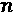
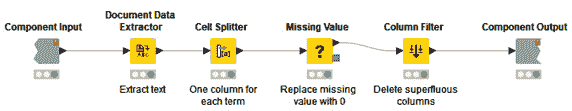
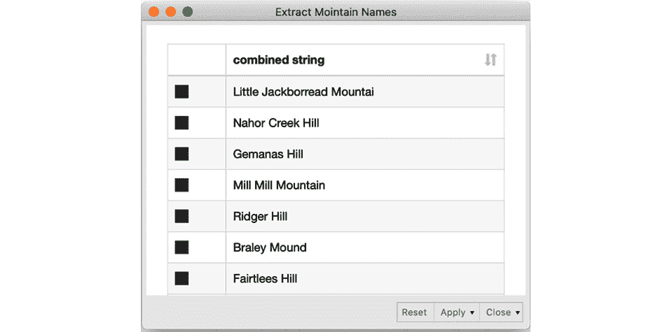

# 第七章：*第七章：* 实现 NLP 应用

在*第六章*《需求预测的循环神经网络》中，我们介绍了**循环神经网络**（**RNN**）作为一种特别擅长分析顺序数据的神经网络家族。作为案例研究，我们训练了一个基于**长短期记忆**（**LSTM**）的 RNN 来预测消耗的电能时间序列中的下一个值。然而，RNN 不仅仅适用于严格的数字时间序列，它们也成功地应用于其他类型的时间序列。

RNN 的另一个先进应用领域是**自然语言处理**（**NLP**）。实际上，RNN 已成功应用于文本分类、语言模型和神经机器翻译等任务。在所有这些任务中，时间序列是由单词或字符组成的序列，而不是数字。

本章我们将简要回顾一些经典的 NLP 案例研究及其基于 RNN 的解决方案：情感分析应用、自由文本生成解决方案，以及为新产品生成名称候选的类似解决方案。

我们将首先概述文本编码技术，以准备将单词/字符序列输入我们的神经网络。第一个案例研究将文本根据其情感进行分类。接下来的两个案例研究分别生成新的文本序列和新的单词序列，新的单词则由新字符序列构成。

本章我们将涵盖以下主题：

+   探索神经网络的文本编码技术

+   找到客户声音的语气——情感分析

+   使用 RNN 生成自由文本

+   使用 RNN 生成产品名称

# 探索神经网络的文本编码技术

在*第四章*《构建与训练前馈神经网络》中，你学习了前馈网络——以及所有其他神经网络——是通过数字进行训练的，并不理解名义值。在本章中，我们希望将单词和字符输入神经网络。因此，我们需要引入一些技术，将单词或字符序列——也就是名义值的序列——编码为数字序列或数值向量。此外，在使用 RNN 的 NLP 应用中，必须确保在整个文本编码过程中保持单词或字符序列的顺序。

在深入 NLP 案例研究之前，让我们先看一下几种**文本编码**技术。

## 索引编码

在*第四章*《构建与训练前馈神经网络》中，你学习了针对名义值的**索引编码**。其思想是用整数值表示每个名义类，这个整数值也叫做索引。

我们可以使用相同的思路进行文本编码。在这里，我们不是用不同的索引来编码每个类别，而是用不同的索引来编码每个单词或每个字符。首先，必须创建一个字典，将文本集合中的所有单词/字符映射到一个索引；然后，通过这个映射，每个单词/字符被转换成其对应的索引，从而将每个单词/字符序列转换成相应索引的序列。最终，每个文本被表示为一个索引序列，其中每个索引编码了一个单词或一个字符。下面的图给出了一个例子：


图 7.1 – 基于索引的单词级文本编码示例

注意，在序列中，单词*the*的索引 1 和单词*brown*的索引 13 在序列中被重复了两次，因为这两个单词在示例句子*the quick brown fox jumped over the brown dog*中各出现了两次。

在本章后面，在*找到客户声音的语气 – 情感分析*一节中，我们将使用基于索引的编码来表示文本中的单词。

另一方面，在*使用 RNN 进行自由文本生成*一节中，我们将使用独热向量作为字符级文本编码。让我们来探索什么是独热向量编码。

## 独热向量编码

索引序列的缺点在于，它在单词/字符之间引入了人为的距离。例如，如果*apple*被编码为 1，*shoe*为 2，*pear*为 3，那么*apple*和*pear*之间的距离是 2，而*shoe*和*pear*之间的距离是 1，这在语义上可能并不合理。通过这种方式，由于单词没有顺序结构，我们会人为地在单词之间引入一些可能在实际中并不存在的距离/相似性。我们在*第四章*《构建和训练前馈神经网络》中也遇到了这个问题，并通过引入独热向量的概念来解决它。

使用`1`来编码特定的单词/字符，否则使用`0`。这意味着每个单词/字符都被表示为一个独热向量，因此，每个文本是一个独热向量的序列。下图展示了句子*the quick brown fox jumped over the brown dog*的独热向量编码示例。

请注意，在*图 7.2*中，单词*the*和*brown*的独热向量在序列中被重复了两次：


图 7.2 – 基于独热向量的单词级文本编码示例

提示

记住，**Keras Learner**节点可以将基于索引的编码转换为独热向量。因此，要训练一个神经网络来处理独热向量，只需将文本文档的基于索引的编码输入即可。

一种常用的文本编码——类似于独热向量，但不保留单词顺序——是`1）`或缺失（`0`）的单词。一个向量表示一个文本文档，包含多个 1。请注意，这种编码不保留单词顺序，因为所有文本都被编码在同一个向量结构中，而不管单词的顺序如何。

在处理单词时，独热编码向量的维度等于词典大小——也就是说，等于文档语料库中可用单词的数量。如果文档语料库很大，词典大小会迅速变成整个语言中的单词数量。因此，在单词级别上的独热编码可能会导致非常大且稀疏的表示。

在处理字符时，词典大小是字符集的大小，即使包括标点符号和特殊符号，这也比前一种情况小得多。因此，独热向量编码适合字符编码，但在单词编码时可能导致维度爆炸。

要在单词级别对文档进行编码，一种更合适的方法是使用嵌入技术。

## 词编码的嵌入技术

词嵌入的目标是将单词映射到几何空间中。通过为词典中的每个单词关联一个数值向量来实现这一点，使得具有相似含义的单词具有相似的向量，并且任何两个向量之间的距离捕捉了这两个相关单词之间的某些语义关系。由这些向量构成的几何空间被称为*嵌入空间*。对于单词编码，嵌入空间的维度比独热编码的向量空间要低（通常只有几十或几百），而独热编码的向量空间维度则通常达到几千。

为了学习每个单词在连续向量空间中的投影，使用了一个专门的神经网络层，这个层被称为嵌入层。这个层学习将每个单词与一个向量表示关联起来。最著名的词嵌入技术是**Word2vec**和**GloVe**。

词嵌入可以有两种使用方式（J. Brownlee，*如何在 Keras 中使用词嵌入层进行深度学习*，机器学习精通博客，2017 年，[`machinelearningmastery.com/use-word-embedding-layers-deep-learning-keras/`](https://machinelearningmastery.com/use-word-embedding-layers-deep-learning-keras/)）：

+   采用一个已经在某些外部文本语料库上训练好的现成层

+   将新的嵌入层作为神经网络的一部分进行训练

如果与神经网络联合训练，嵌入层的输入是一个基于索引的编码序列。嵌入层中的输出单元数量定义了嵌入空间的维度。嵌入层的权重用于计算每个索引的嵌入表示，因此也是每个单词的嵌入表示，这些权重在网络训练过程中学习得到。

现在我们已经熟悉了不同的文本编码技术，接下来让我们进入第一个自然语言处理应用案例。

# 寻找客户声音的语气 – 情感分析

自然语言处理的一个常见用例是 **情感分析**。在这里，目标是识别文本中的潜在情感，无论是正面、负面，还是介于两者之间的各种细微差别。情感分析已被应用于许多领域，如分析来电信息、电子邮件、评论、录音对话及其他类似文本。

通常，情感分析属于更大范围的自然语言处理（NLP）应用组，被称为文本分类。在情感分析的情况下，目标是预测情感类别。

另一个常见的文本分类示例是语言检测。在这种情况下，目标是识别文本的语言。在这两种情况下，如果我们使用 RNN 来处理任务，我们需要采用 *多对一架构*。多对一神经网络架构接受不同时间的输入序列，，并利用输出单元的最终状态来预测单一类别——即情感或语言。

*图 7.3* 显示了一个多对一架构的示例：


图 7.3 – 一个多对一神经网络架构的示例：一系列在不同时间的输入，仅使用输出的最终状态

在本章的第一个用例中，我们想要分析电影评论的情感。目标是训练一个基于词级别的 RNN，并结合嵌入层和 LSTM 层。

在这个示例中，我们将使用 IMDb 数据集，该数据集包含两列：电影评论的文本和情感标签。情感标签用 `1` 表示正面评论，用 `0` 表示负面评论。

*图 7.4* 显示了一个小子集，其中包含一些正面和一些负面的电影评论：


图 7.4 – IMDb 数据集的摘录，显示了标记为正面和负面的评论

让我们从读取和编码电影评论文本开始。

## 电影评论的预处理

嵌入层期望基于索引的编码输入序列。也就是说，每条评论必须编码为一个索引序列，其中每个索引（整数值）代表字典中的一个词。

由于 IMDb 文档语料库中的可用词汇量非常大，我们决定在文本预处理阶段对其进行简化，方法是去除停用词并将所有词语还原为词干。此外，仅将训练集中的最频繁术语用专用索引进行编码，而其他所有术语则使用默认索引。

理论上，RNN 可以处理可变长度的序列。然而，在实践中，一个训练批次中的所有输入样本的序列长度必须相同。由于每个评论中的词汇数量可能不同，我们定义了固定的序列长度，并对过短的序列进行零填充 —— 即，我们添加 0 来补充序列 —— 并截断过长的序列。

所有这些预处理步骤都应用于训练集和测试集，唯一的区别在于：在训练集的预处理中，会创建一个包含最频繁词汇的字典。这个字典仅在测试集的预处理过程中使用。

总结一下，我们执行以下预处理步骤：

1.  读取并将数据集划分为训练集和测试集。

1.  对训练集和测试集中的电影评论进行分词、清理和词干提取。

1.  创建所有术语的字典。训练集中最频繁的术语由专用索引表示，所有其他术语由默认索引表示。

1.  将训练集和测试集中的词汇映射到相应的字典索引。

1.  截断训练集和测试集中过长的词序列。

1.  对训练集和测试集中的过短序列进行零填充。

*图 7.5* 中的工作流执行了所有这些步骤：


图 7.5 – 情感分析案例研究的预处理工作流片段

第一个元节点**读取并划分数据**读取包含电影评论和情感信息的表格，并将数据集划分为训练集和测试集。**预处理训练集**元节点对训练集执行不同的预处理步骤，创建并应用字典，该字典会通过第二个输出端口提供。最后一个元节点**预处理测试集**将创建的字典应用于测试集，并对测试集执行不同的预处理步骤。

让我们看看这些步骤是如何在 KNIME Analytics Platform 中实现的。

### 读取和划分数据集

第一步，读取和划分数据集，由**读取并划分数据**元节点执行。

*图 7.6* 显示了元节点内部的工作流片段：


图 7.6 – 读取并划分元节点内部的工作流片段

**表格读取器**节点读取包含情感信息的表格作为整数值，以及作为字符串值的电影评论。接下来，使用**数字转字符串**节点将情感信息转换为字符串。这一步骤是必要的，以便在**分区**节点中进行分层抽样。在最后一步，使用**字符串转数字**节点将情感列的数据类型转换回整数，以便在训练过程中作为目标列由 Keras Learner 节点使用。

现在我们已经有了训练集和测试集，让我们继续进行训练集的预处理。

### 训练集预处理和字典创建

训练集的预处理和字典的创建在**预处理训练集**元节点中进行。

*图 7.7* 显示了元节点内部的内容：


图 7.7 – 预处理训练集元节点中的工作流片段

对于电影评论的预处理，使用了**KNIME 文本处理**扩展。

提示

KNIME 文本处理扩展包含读取和写入多种文本格式文档的节点；转换单词；清理句子中的无关字符和无意义单词；将文本转换为数字表格；计算所有所需的文本统计信息；最后，探索主题和情感。

KNIME 文本处理扩展依赖于一种新的数据类型：**文档对象**。原始文本通过添加附加的元数据，如标题、作者、来源和类别，变成了文档。文档中的文本按照多种可用的语言特定分词算法进行分词。**文档分词**生成了文本项的层次结构：章节、段落、句子和单词。单词通常被称为令牌或术语。

为了利用 KNIME 文本处理扩展的预处理节点，我们需要通过**Strings To Document**节点将电影评论转换为文档。该节点从不同的列收集值，并在对主文本进行分词后将其转换为文档对象。

*图 7.8* 显示了 **Strings To Document** 节点的配置窗口：


图 7.8 – Strings To Document 节点的配置窗口

该节点为您提供了定义以下内容的机会：

+   通过**全文**选项获取文档文本。

+   文档标题，作为**列**、**行 ID**或**空字符串**值。

+   作为固定字符串或列值的文档来源、文档类别、文档作者和文档发布日期。如果使用列值，请记得启用相应的标志。通常，**文档类别**字段用于存储任务类别。

+   文档类型，如**事务**、**会议记录**、**书籍**，或只是**未知**。

+   输出文档列的名称。

+   执行词法分析器的最大并行进程数。

+   词法分析器算法。

接下来，文档对象通过一系列文本预处理节点进行清理，这些节点包含在工作流的**文本预处理**组件中，见*图 7.7*。**文本预处理**组件的内部结构如*图 7.9*所示：


图 7.9 – 显示预处理组件内部的工作流片段

工作流片段从**标点符号删除**节点开始，用于去除输入文档中的所有标点符号。

**数字过滤器**节点过滤掉所有数字，包含数字形式的数字、十进制分隔符（**,** 或 **.**）和可能的前导符号（**+** 或 **-**）。

**字符数过滤器**节点过滤掉所有少于  – 在我们的例子中，少于  – 字符的术语，正如在节点的配置窗口中指定的那样。

填充词，如*so*、*thus* 等，被称为**停用词**。它们承载的信息较少，可以通过**停用词过滤器**节点去除。该节点过滤掉所有在选定停用词列表中的术语。可以通过第二输入端口传递自定义停用词列表，或采用默认的内置停用词列表。为不同语言提供了多个内置停用词列表。

**大小写转换器**节点将所有术语转换为大写或小写。在这个案例中，它们被转换为小写。

最后，**Snowball 词干提取器**节点将单词简化为词干，去除语法屈折，使用 Snowball 词干提取库 ([`snowball.tartarus.org/`](http://snowball.tartarus.org/))。

重要说明

词干提取的目标是将屈折形式和派生相关形式归约为共同的基础形式。例如，*look*、*looking*、*looks* 和 *looked* 都被替换为它们的词干 *look*。

现在我们已经清理了训练集中的电影评论文本，可以创建词典了。

#### 基于训练集创建词典

词典必须为每个单词分配两个索引：

+   **索引**：为训练集中最常见的术语分配递增的整数索引，并为所有其他术语分配相同的默认索引。  

+   **计数器**：为每个单词分配一个递增的八位数索引。这个八位数索引只是一个临时索引，帮助我们处理截断问题。

*图 7.10* 显示了我们想要创建的词典的子集：


图 7.10 – 字典的小子集，其中每个单词由递增的整数索引和另一个递增的八位数字索引表示

两个索引都在**创建字典**组件中创建，*图 7.11*向您展示了组件内部的工作流片段：


图 7.11 – 创建字典组件中的工作流片段

**创建字典**组件有一个配置窗口，您可以在*图 7.12*中看到。配置窗口中的输入选项继承自**整数配置**节点，并要求字典大小为文档集合中出现最频繁的！[](img/Formula_B16391_03_173.png)个单词。默认值为！[](img/Formula_B16391_07_009.png)：


图 7.12 – 创建字典组件的配置窗口

组件内的工作流首先通过使用**独特术语提取器**节点在所有文档中创建一个独特术语的全局集合：


图 7.13 – 独特术语提取器节点的配置窗口

该节点允许我们创建索引列和频率列，如上面的截图所示。索引列包含从`1`开始的递增整数，其中`1`分配给最频繁的术语。

该节点可选择性地提供过滤最*常见的 k 个术语*的功能。为此，有三种频率度量可用：**词频**、**文档频率**和**逆文档频率**。现在，我们希望选择所有术语，字典大小稍后再处理。

重要提示

**词频**（**TF**）：术语在所有文档中出现的次数

**文档频率**（**DF**）：术语出现的文档数量

**逆文档频率**（**IDF**）：文档总数与文档频率（DF）之比的对数

八位数字索引是通过`1`作为步长创建的。这个最小值确保了八位数字格式。

然后，**索引**和**计数器**列将通过**数字转字符串**节点从整数转换为字符串。

接下来是字典大小的缩减。最上方的  最常见术语保留由**唯一术语提取器**节点分配的逐步索引，而所有其他术语都获得一个默认索引 。请记住， 可以通过组件的配置窗口进行更改。在这个例子中， 设置为 20,000。在组件子工作流的下部分，**行分割器**节点将输入数据表拆分为两个子表：最上方的  行（顶部输出端口）和其余行（底部输出端口）。

然后，**常量值列**节点将下方子表中的所有索引值替换为默认索引值 。最后，两个子表被重新连接在一起。

现在字典已经准备好，我们可以继续进行电影评论的截断。

#### 截断过长的文档

我们已经说明我们将处理固定大小的文档——即每个文档的最大单词数。如果文档的单词数超过允许的数量，它将被截断。如果文档的单词数少于允许的数量，它将被零填充。现在让我们看看**截断**过程是如何工作的——即如何从过长的文档中删除最后的单词。这一切都发生在**截断**组件中。*图 7.14*展示了组件内部的工作流片段：


图 7.14 – 截断组件中的工作流片段

首先，我们设置文档中允许的最大单词数 。同样，这个参数可以通过组件的配置窗口进行更改，形状由**整数配置**节点定义。我们设置文档中的最大单词数——即最大文档大小——为  个单词。如果文档太长，我们应该只保留前  个单词，并丢弃其余部分。

计算文本中的单词数并不容易。由于单词的长度可变，我们应该在循环中检测分隔单词的空格，然后计算单词数。然而，循环往往会减慢执行速度。因此，一个替代的技巧是使用文本中单词的八位数字表示。

在文本中，每个单词通过**字典替换器**节点用其八位数字代码进行替换。**字典替换器**节点将输入文档顶部输入端口中的术语与下方输入端口中的字典术语进行匹配，然后用字典表中对应的值进行替换。

**字典替换器**节点有两个输入端口：

+   上输入端口用于包含要替换术语的文档

+   下输入端口与用于匹配和替换操作的字典表

    重要提示

    字典表必须至少包含两列字符串。一列字符串列包含要替换的术语（键），另一列字符串列包含替换的字符串（值）。在配置窗口中，我们可以从数据表的下部输入端口设置这两列。

此时，我们得到的是具有固定长度（`8 位数字 + 1 <space>`）的文本，而不是可变长度的单词。因此，将文本限制为  个单词就等于将文本限制为  个字符，如果 ，则为 720 个字符。这个操作可以更容易地进行，无需使用循环或复杂的节点结构，只需使用 **字符串操作** 节点即可。然而，**字符串操作** 节点只对字符串对象进行操作，而不是对文档进行操作。为了使用它，我们需要暂时将文本返回为字符串。

文本通过 **文档数据提取器** 节点从文档中提取为简单的字符串。该节点提取文档单元格中的信息，例如文本和标题。

**数学公式（变量）** 节点获取流变量，以确定文档的最大大小，并计算文档中允许的最大字符数。

使用 `substr()` 函数，直到达到允许的最大字符数，`0`)。这实际上仅保留前  个单词并移除其他所有单词。

最后，文本被转换回一个称为 **截断文档** 的文档，所有多余的列将在 **列过滤器** 节点中被移除。

此时，八位数字索引已完成其任务，可以被逐渐递增的整数索引替代，用于编码。这在 **字典替换器** 节点中再次完成。

这样，我们就将过长的文档截断至允许的最大单词数。接下来，我们需要对过短的文档进行零填充。

#### 零填充过短的文档

当序列相对于设置的值数量过短时，通常会应用 **零填充**。零填充意味着向序列中添加 0，直到达到设定的值数量。在我们的例子中，如果文档的单词数少于设定数量，我们将用 0 填充剩余的空位。这发生在 **Zero Pad** 组件中。

*图 7.15* 展示了 Zero Pad 组件中的工作流片段：



图 7.15 – Zero Pad 组件中的工作流片段

Zero-padding 再次是在字符串级别进行，而不是在文档级别进行。文本通过 `<space>` 从输入文档中提取为字符串后，并为每个索引创建一个新的列。

记住，所有被截断的文本现在的最大长度是来自前一步骤的  索引。因此，从这些文本中，新生成的列数肯定是 。对于所有其他文本（具有较短术语序列的文本），**单元拆分器**节点将用缺失值填充空列。只需要将这些缺失值替换为 0，零填充过程就完成了。这种用 0 替换缺失值的操作是由**缺失值**节点完成的。

最后，所有多余的列在**列过滤器**节点中被移除。

现在，所有的术语序列——即所有文本——都有相同的长度，使用**创建集合单元**节点来创建集合单元，以便将其输入到 Keras 学习节点中。

接下来，我们需要对测试集进行相同的预处理，并应用已创建的字典。

### 测试集预处理

测试集的预处理是在**预处理测试集**元节点中执行的。此元节点有两个输入端口：上端口用于从**预处理训练集**元节点创建的字典，下端口用于测试集。

*图 7.16* 展示了预处理测试集元节点内的工作流片段：


图 7.16 – 预处理测试集元节点内的工作流片段

工作流的下半部分与**预处理训练集**元节点内的工作流片段类似，只不过包括字典创建的部分不同。在这里，测试集的字典是基于训练集的字典创建的。所有在训练集字典中可用的术语都将获得相应的索引编码；所有其余的术语将获得默认索引。

因此，首先使用**唯一术语提取器**节点创建测试集中的所有术语的列表。接下来，使用右外连接将该列表与训练集字典中的术语列表连接。右外连接允许我们保留来自下输入端口的所有行——即测试集中的所有术语——并添加训练字典中的索引（如果有的话）。对于所有不在训练字典中的术语，连接节点会在索引列中创建缺失值。这些缺失值随后会通过**缺失值**节点被替换为默认的索引值。

所有其他步骤，如截断和零填充，都与训练集的预处理方式相同。

我们已经完成了预处理阶段，现在可以继续定义网络架构并进行训练。

## 定义和训练网络架构

在本节中，我们将定义并训练用于情感分类任务的网络架构。

### 网络架构

我们希望使用基于 LSTM 的 RNN，其中我们也训练嵌入。嵌入由嵌入层进行训练。因此，我们创建一个具有四层的神经网络：

+   一个 **输入层** 用于定义输入大小

+   一个 **嵌入层** 用于生成术语空间的嵌入表示

+   一个 **LSTM 层** 用于利用文本的序列特性

+   一个 **全连接层**，具有一个单元，并使用 sigmoid 激活函数，因为我们面临的是一个二分类问题

嵌入层期望以基于索引的编码术语序列作为输入。因此，输入层必须接受  整数索引序列（在我们的例子中，）。这意味着在 **Keras 输入层** 节点的配置窗口中，`Shape = 80` 和 `data type = Int 32`。

接下来，**Keras 嵌入层**节点必须学习将整数索引嵌入到合适的高维向量空间中。*图 7.17* 显示了它的配置窗口。输入张量直接从前一个输入层的输出中恢复：


图 7.17 – Keras 嵌入层节点的配置窗口

对于 `128`，有两个重要的配置设置。输出张量为 `序列长度` ![`, 嵌入维度]`。在我们的例子中，这就是 `[80, 128]`。

接下来，`128` 单元，表示 `Units = 128`，`Activation = Tanh`，`Recurrent activation = Hard sigmoid`，`Dropout = 0.2`，`Recurrent dropout = 0.2`，并且返回序列，返回状态，反向传播，和展开所有 `unchecked`。

最后，使用一个 **Keras 全连接层** 节点，具有一个单元和 sigmoid 激活函数，用于预测最终的二元情感分类。

现在我们已经有了预处理的数据和神经网络架构，可以开始训练网络。

### 使用嵌入训练递归网络

网络按常规方式训练，通过 **Keras 网络学习器** 节点。

在第一个标签页，**输入数据**，选择了 **从数字集合（整数）** 转换，因为我们的输入是一个整数值集合单元（索引），它对我们的电影评论进行编码。接下来，选择集合单元作为输入。

在第二个标签页，**目标数据**，选择了 **从数字（整数）** 转换类型和带有情感类别的列。在下方选择了二元交叉熵作为损失函数，因为这是一个二分类任务。

在第三个标签页中，`Epochs = 30`，`训练批次大小 = 100`，在每个 epoch 之前对训练数据进行洗牌，`优化器 = Adam`（使用默认设置）。

现在网络已经训练完成，我们可以将其应用到测试集并评估其在预测评论文本情感方面的表现。

## 在测试集上执行并评估网络

要在测试集上执行该网络，使用**Keras 网络执行器**节点。

在配置窗口中，我们再次选择**从数字集合（整数）**作为转换类型，并将集合单元格作为输入。

作为输出，我们关注最后一个密集层的输出，因为它给出了情感为`1`（正面）的概率。因此，我们点击**添加输出**按钮，选择 sigmoid 层，并确保使用**转换为数字（双精度）**。

`1`。

接下来，**规则引擎**节点将此概率转换为类预测，使用以下表达式：

```py
$dense_1/Sigmoid:0_0$ > 0.5 => 1
TRUE => 0
```

这里，`$dense_1/Sigmoid:0_0$`是网络输出列的名称。

该表达式将所有大于`0.5`的值转换为 1，其它则转换为 0。

重要说明

请记住，**规则引擎**节点中的不同指令行是顺序执行的。当某一行的前提被验证时，执行停止。

最后，**评分器**节点评估模型的性能，**Keras 网络写入器**节点将训练好的网络保存以供部署。*图 7.18*展示了网络性能，从**评分器**节点的角度来看，在电影评论上的情感分类正确率达到了 83%：


图 7.18 – LSTM 和基于嵌入的网络在情感分类上的表现

到此，我们完成了第一个 NLP 案例研究。*图 7.19*展示了实现该示例所使用的完整工作流程。你可以从 KNIME Hub 下载该工作流程，网址为 https://hub.knime.com/kathrin/spaces/Codeless%20Deep%20Learning%20with%20KNIME/latest/Chapter%207/：


图 7.19 – 准备文本并构建、训练和评估情感分析神经网络的完整工作流程

目前，我们没有提供部署工作流程。在*第十章*中，*部署深度学习网络*，我们将回到这个已训练的网络，构建一个部署工作流程。

现在让我们继续进入下一个 NLP 应用：使用 RNN 生成自由文本。

# 使用 RNN 生成自由文本

现在我们已经看到 RNN 可以用于文本分类，我们可以进入下一个案例研究。在这里，我们想要训练一个 RNN 来生成具有特定风格的新自由文本，无论是莎士比亚式英语、rap 歌曲，还是模仿格林兄弟的童话故事。我们将专注于最后一个应用：训练一个网络以生成格林兄弟童话风格的自由文本。然而，该网络和过程可以轻松调整，以生成新的 rap 歌曲或莎士比亚风格的旧英语文本。

那么，我们如何训练一个 RNN 来生成新的文本呢？

## 数据集

首先，你需要一个文本语料库来训练网络生成新的文本。任何文本语料库都可以。然而，请记住，你用于训练的文本将自动决定生成文本的风格。如果你在莎士比亚的戏剧上训练网络，你将得到用古老的莎士比亚英语生成的新文本；如果你在说唱歌曲上训练网络，你将得到城市风格的文本，甚至可能带有韵律；如果你在童话故事上训练网络，你将得到童话风格的文本。

因此，为了让网络生成新的童话，它必须在现有的童话故事上进行训练。我们从古腾堡计划下载了格林兄弟语料库，链接地址为[`www.gutenberg.org/ebooks/2591`](https://www.gutenberg.org/ebooks/2591)。

## 预测单词还是字符？

第二个需要做出的决定是是否在单词级别或字符级别上训练网络。两种选择各有利弊。

在单词级别训练网络听起来更合逻辑，因为语言是由单词而非字符构成的。输入序列（单词序列）较短，但字典的大小（领域中的所有单词）非常大。另一方面，在字符级别训练网络依赖于更小且更易管理的字典，但可能导致非常长的输入序列。根据维基百科的说法，英语语言大约有 170,000 个不同的单词，而只有 26 个不同的字母。即使我们区分大小写，并添加数字、标点符号和特殊字符，字典也只有不到 100 个字符。

我们希望训练一个网络，以生成格林兄弟风格的文本。为了实现这一目标，我们使用了少量的格林兄弟故事来训练网络，这已经意味着字典中的单词数量非常庞大。因此，为了避免庞大字典和随之而来的网络规模管理问题，我们选择在字符级别上训练我们的童话生成器。

在字符级别上训练意味着网络必须学习在过去的！[](img/Formula_B16391_03_029.png)字符经过输入后，预测下一个字符。那么，训练集必须由许多包含！[](img/Formula_B16391_05_005.png)字符序列及其对应的下一个预测字符（目标值）的样本组成。

在部署过程中，一段启动序列的！[](img/Formula_B16391_05_005.png)字符必须触发网络生成新的文本。实际上，这个初始序列预测了下一个字符；然后在下一步中，最近的初始字符和预测字符将组成新的输入序列来预测下一个字符，以此类推。

在接下来的章节中，我们将解释如何清理、转换和编码格林童话的文本数据，以供网络使用。

## 预处理和编码

我们使用滑动窗口方法填充训练集——即，使用部分重叠的序列。为了更清楚地说明这一点，让我们使用窗口长度为并滑动步长为`1`的窗口，将句子`从前有一个`包含在训练集中。五个字符`Once<space>`应该预测`u`；然后，我们将窗口向右滑动一步，`nce<space>u`应该预测`p`。再次向右滑动窗口一个字符，`ce<space>up`应该预测`o`，依此类推。

在*图 7.20*的左侧，你可以看到创建的输入序列和目标值：


图 7.20 – 用于训练的重叠序列示例

接下来，我们需要对字符序列进行编码。为了避免引入字符之间的人工距离，我们选择了独热向量编码。我们将通过两个步骤进行独热编码。首先，我们执行基于索引的编码；然后，通过**Keras 网络学习器**节点，使用**从数字集合（整数）**转换选项为**独热张量**，将其转换为独热编码。训练集的重叠索引编码序列显示在*图 7.20*的右侧。

下一个图中的工作流片段读取并转换童话故事，生成重叠的基于索引编码的字符序列及其相关目标字符。输入序列和目标字符都存储在集合类型的列中：


《格林童话》](img/B16391_07_021.jpg)

图 7.21 – 预处理工作流片段，读取并转换《格林童话》中的文本

工作流执行以下步骤：

+   从语料库中读取所有童话故事，提取五个童话故事进行训练，并以`白雪公主与玫瑰红`作为部署的种子

+   重新调整文本格式，将每个字符放置在单独一行的单列中

+   创建并应用基于索引的字典，在本例中，字典由字符集组成，包括标点符号和特殊符号

+   使用**滞后列**节点创建重叠序列，然后按从最旧到最新的顺序对其进行重新排序

+   将输入序列和目标字符封装成集合类型的列

让我们详细了解这些步骤。

### 读取和提取童话故事

在**读取和提取童话故事**的元节点中，工作流片段首先通过**文件读取器**节点读取童话故事。该表只有一列，其中每一行的内容对应童话故事中的一行。

然后，**行过滤器**节点去除文件顶部和底部的不必要的元信息，如作者、标题、目录和许可协议。在训练或部署过程中，我们不会使用这些元信息。

`白雪公主与玫瑰红`和顶部输出端口的其他所有童话故事。我们将保存`白雪公主与玫瑰红`以供部署。

接下来，使用**行过滤器**节点提取前五个童话故事，这些将用于训练。

下一步是将文本重塑为单一列的字符序列。

### 重塑文本

在我们能够创建重叠的字符序列以输入网络之前，我们需要将所有童话故事文本转化为一个由单个字符组成的长序列（列）：每行一个字符。这个步骤叫做**重塑**，它是在**重塑文本**元节点中实现的。*图 7.22* 显示了它的内容：


图 7.22 – 重塑文本元节点中的工作流片段

它从两个`<space>`字符开始，使用`regexReplace()`函数。`regexReplace()`利用正则表达式，例如`"[^\\s]"`来匹配输入字符串中的任何字符，`"$0 "`为匹配的字符加上`<space>`。在`$Col0$`中使用的`regexReplace()`函数的最终语法如下：

```py
regexReplace($Col0$,"[^\\s]" ,"$0 ")
```

接下来，`<space>`字符用于生成多个列，每个单元格一个字符。

注意，段落中的最后一个字符（换行符）后面没有添加`<space>`字符。为了解决这个问题，使用**常量值列**节点添加了一个包含`<space>`字符的常量列。

**未旋转**节点将数据表从多列重塑为仅包含单字符序列的一列。让我们花些时间来了解**未旋转**节点及其意想不到的技巧，用于重塑数据表。**未旋转**节点执行输入数据表的去聚合操作。*图 7.23*为你展示了一个例子。它区分了值列和保持列。选中的值列随后会被旋转成行，并与保持列中的相应值相附加。由于值列的旋转可能会导致多行，因此可能需要重复保持列值的行：


图 7.23 – 展示了未旋转操作的示例，其中产品 1 和产品 2 是选择的值列，ID 和城市是选择的保持列

对文本进行重塑时，我们将所有列设置为值列，而没有设置任何列为保持列。最终结果是将童话故事表示为一列长字符序列。

最后进行一些清理：使用**行过滤器**节点删除所有缺失值的行。

### 创建并应用字典

我们现在需要创建字典和基于索引的编码映射。由于我们在字符级别进行操作，因此这里的字典实际上就是字符集——也就是童话语料库中的唯一字符列表。为了获得这个列表，我们使用**删除重复过滤器**节点从重塑后的文本中删除所有重复字符。

提示

**删除重复过滤器**节点在检测和处理数据集中的重复记录时非常强大。

接下来，我们为每一行分配一个索引——即为每个唯一字符分配一个索引——使用`0`表示`1`表示**缩放单元**。

现在我们已经准备好字典，接下来我们通过**单元替换器**节点应用它，之前在*第四章*中已经介绍过，*构建和训练前馈神经网络*。

### 创建并重新排序重叠的序列

为了创建重叠的字符序列，我们使用`100`、`1`，并且在输出表格的开始和结束处跳过不完整的行。

根据`col-100`的方式，它位于最右边的列；当前需要预测的字符（`col`）则位于最左边的列。基本上，序列的时间顺序是相对于网络期望的内容进行倒序排序的。

下图展示了一个示例：


图 7.24 – 滞后列节点的结果输出，时间按从右到左的升序排序

我们需要重新排序列，使其按从左到右的升序排列，以便最旧的字符位于左侧，最新的字符位于右侧。这一重新排序操作由**重新排序列**元节点执行。

*图 7.25*展示了元节点内部的内容：


图 7.25 – 包含在“重新排序列”元节点中的工作流片段

在这里，**参考列排序器**节点根据下输入端口数据表中所建立的顺序更改数据表的列顺序。下输入端口中的参考数据表必须包含一个字符串类型的列，列标题的顺序应与第一个输入表中的列标题顺序一致。然后，第一数据表中的列将根据第二数据表中列名的行顺序进行排序。

为了创建包含排序列标题的表格，我们使用**提取列标题**节点提取列标题。**提取列标题**节点将列标题从表格内容中分离，并在上输出端口输出列标题，在下输出端口输出内容。

然后，通过**转置**节点将列头的行转置为一列。

最后，我们通过**计数器生成**节点为每个列头分配一个递增的整数编号，并通过**排序器**节点按计数器值降序排序它们。

现在我们已经将来自第一个表的列头按时间顺序正确排序，可以将其输入到**参考列重新排序器**节点的下端口。结果是一个数据表，其中每一行都是一个由  字符组成的序列，时间从左到右排序，后续的行包含重叠的字符序列。在这一点上，我们可以为网络的输入和目标数据创建集合单元。

重要提示

即使目标数据只有一个单一的值，我们仍然需要将其转换为集合单元，这样索引就可以通过**Keras 网络学习器**节点转换为一个独热向量。

让我们进入下一步：定义和训练网络架构。

## 定义和训练网络架构。

现在我们来设计并训练一个适合处理时间序列、字符编码和过拟合的神经网络架构，以预测序列中的下一个字符。

### 定义网络架构。

在这个案例研究中，我们决定使用一个包含四层的神经网络：

+   一个**Keras 输入层**，用于定义输入形状。

+   一个**Keras LSTM 层**，用于处理时间序列。

+   一个**Keras Dropout 层**，用于防止过拟合。

+   一个**Keras 全连接层**，用于输出下一个字符的概率。

像往常一样，我们使用`?, 65`来定义神经网络的输入形状。

由于我们不需要中间的隐藏状态，我们将大部分设置保持为`512`的默认值。

自由文本生成可以视为一个多类分类应用，其中字符是类别。因此，网络输出的**Keras 全连接层**节点被设置为 65 个单元（每个字符集中的一个字符），并使用 softmax 激活函数来评分每个字符作为下一个字符的概率。

让我们继续在编码的重叠序列上训练这个网络。

### 训练网络。

再次，为了训练网络，我们使用已经熟悉的**Keras 网络学习器**节点。

在第一个配置标签中，**输入数据**，我们选择**从数字集合（整数）到独热张量**来处理编码转换，并将字符序列的集合列作为输入。

在第二个配置标签中，**目标数据**，我们再次在包含目标值的集合列上选择**从数字集合（整数）到独热张量**。由于这是一个多类分类问题，我们将损失函数设置为**分类交叉熵**。

在第三个配置标签中，`50 epochs`，训练批次大小为`256`，打乱选项为`on`，优化器选择`Adam`，学习率使用默认设置。

最终，网络使用**Keras 格式**通过**Keras 网络写入器**节点保存。此外，网络通过**Keras 到 TensorFlow 网络转换器**节点转换为 TensorFlow 网络，并通过**TensorFlow 网络写入器**节点保存。TensorFlow 网络在部署时使用，以避免 Keras 网络所需的耗时 Python 启动。

*图 7.26* 显示了完整的工作流，实施了所有描述的步骤来训练神经网络生成童话故事。此工作流和所使用的数据集可在 KNIME Hub 上找到，网址为 https://hub.knime.com/kathrin/spaces/Codeless%20Deep%20Learning%20with%20KNIME/latest/Chapter%207/：


图 7.26 – 训练神经网络生成童话故事的工作流

现在我们已经训练并保存了网络，接下来我们将进行部署，生成新的童话故事文本。

## 构建部署工作流

为了在部署期间触发新文本的生成，我们从与每个训练序列相同长度的输入序列开始（）。我们将该序列输入网络，以预测下一个字符；然后，我们删除序列中的最旧字符，添加预测的字符，再次将网络应用于新的输入序列，依此类推。这与我们在需求预测案例研究中使用的程序完全相同。因此，我们将在这里再次实现它，使用递归循环（*图 7.27*）：


图 7.27 – 部署工作流生成新的自由文本

触发序列取自**白雪公主与玫瑰红**的童话故事。触发序列的文本经过预处理、分序列和编码，方式与训练网络时使用的工作流相同。这是在**读取和预处理**元节点中完成的，如*图 7.28*所示：


图 7.28 – 读取和预处理元节点中的工作流内容，用于读取和预处理触发序列

该工作流读取**白雪公主与玫瑰红**的童话故事以及训练工作流中创建的字典文件。然后，应用与训练工作流相同的预处理步骤。

之后，我们读取训练好的 TensorFlow 网络，并将其应用于触发序列，使用**TensorFlow 网络执行器**节点。

网络的输出是每个字符成为下一个字符的概率。我们可以采用两种可能的策略来选择预测的字符：

+   概率最高的字符被分配为下一个字符，这就是贪心策略。

+   下一个字符是根据概率分布随机选择的。

我们已经在 **提取索引** 元节点中实现了这两种策略，并在两个不同的部署工作流中使用。

*图 7.29* 显示了实现第一种策略时 **提取索引** 元节点的内容：


图 7.29 – 提取具有最高概率的字符的工作流片段

这个元节点以已执行网络的输出概率为输入，提取具有最高概率的字符。这里的关键节点是 **多对一** 节点，它从网络输出中提取得分（概率）最高的单元格。

*图 7.30* 显示了实现第二种策略时 **提取索引** 元节点的内容：


图 7.30 – 基于概率分布选择下一个字符的工作流片段

这个工作流片段期望输入字符的概率分布，并根据它选择一个字符。这里的关键节点是 **随机标签分配器（数据）** 节点，它根据输入的概率分布分配一个值。

**随机标签分配器（数据）** 节点根据上游输入端口的概率分布为下游输入端口的每一行数据分配一个索引。上游输入端口的数据表必须包含两列：一列是类别值 —— 在我们的例子中，是以字符串格式编码的字符索引 —— 另一列是相应的概率。因此，*图 7.30* 中的工作流片段第一部分利用 **转置** 节点、**计数器生成** 节点和 **数字转字符串** 节点，准备好数据表供 **随机标签分配器（数据）** 节点的顶部输入端口使用，而 **表创建器** 节点则创建一个只有一行的新表。也就是说，**随机标签分配器（数据）** 节点根据第一输入端口的表中定义的概率分布，选择一个索引。

提示

递归循环的概念及其实现详细解释请参见 *第六章*，*需求预测的递归神经网络*。

你可以从 KNIME Hub 下载实现这两种选项的部署工作流：https://hub.knime.com/kathrin/spaces/Codeless%20Deep%20Learning%20with%20KNIME/latest/Chapter%207/.

## 新的童话故事

最后，我相信你一定想看看网络能够生成的自由文本。以下是使用第一种策略生成的自由文本示例。

触发序列中的 100 个字符（非斜体）来自童话故事的第一句话，*白雪公主与玫瑰红*。其余的文本由网络自动生成。

*雪白与玫红 从前有一位贫穷的寡妇，她住在一个孤独的小屋里*。小屋前有一只猫，门后有一百瓶酒；他回答道：“你想要的是什么？你说的那东西像是好事，还是哭了？我们会说我只给了寡妇那群人的大地去带走它。”但当父亲说：“猫很快就会死。”年青人，老人……

网络成功地学会了英语语言的结构。尽管文本不完美，但你可以看到合理的字符组合、完整的单词、一些正确使用的引号以及其他类似的有趣特征，这些都是网络从训练文本中吸收的。

# 使用 RNN 生成产品名称

这个最后的自然语言处理案例研究与前一个类似。前者我们希望网络根据一个起始序列生成新的自由文本；而在这里，我们希望网络根据一个起始符号生成新的自由单词。在前者中，我们希望网络生成新的单词序列；而在这里，我们希望网络生成新的字符序列。实际上，这个产品名称生成案例研究的目标是创造新的名称——也就是新的单词。尽管会有一些差异，但方法是相似的。

在本节中，我们将探讨这种新方法的细节。

## 产品名称生成问题

通常，我们不会将人工智能与创意联系在一起，因为它通常用于根据之前见过的例子预测结果。本案例的挑战是使用人工智能创造出一些新的东西，而这通常被认为是创意人才的领域。

让我们看一个经典的创意营销例子：产品命名。在新产品推出市场之前，它实际上需要一个名字。为了找到这个名字，公司的创意团队会集思广益，生成多个产品名称提案，并考虑不同的需求。例如，产品名称应该让顾客感到熟悉，同时又要新颖、富有创意。在这些候选名称中，最终只有一个能够脱颖而出，成为新产品的名称。这可不是一项容易的任务！

现在，我们来看一个最具创意的行业：时尚。一家专门生产户外服饰的公司准备推出一系列新款服装。任务是为这一新款服装系列生成足够多的名称候选。许多户外时尚品牌提出过山脉的名字，这些名字能唤起自然的感觉，而且顾客也会觉得很熟悉。然而，新名称还必须没有版权问题，并且要足够原创，能够在市场中脱颖而出。

那为什么不使用虚构的山脉名称呢？由于它们是虚构的，因此不受版权保护，并且与竞争者名称不同；然而，由于它们类似于现有的山脉名称，它们也足够熟悉，能吸引潜在客户。人工智能模型是否可以帮助生成既具有现实感又能唤起冒险精神的新虚构山脉名称？我们可以为这样的任务使用什么样的网络架构？

由于我们希望能够形成某种程度上类似于山脉名称的新词，因此网络必须基于已有的山脉名称进行训练。

为了形成训练集，我们使用从维基百科通过 Wikidata 查询提取的 33,012 个美国山脉名称列表。

*图 7.31* 显示了训练数据的一个子集：


图 7.31 – 训练集中美国山脉名称的子集

现在我们有了一些训练数据，可以开始考虑网络架构。这次，我们想训练一个**多对多**的基于 LSTM 的 RNN（见*图 7.32*）。这意味着在训练过程中，我们有一个输入序列和一个输出序列。在部署时，RNN 基于一些初始化的隐藏状态和开始标记，必须预测新名称候选的第一个字符；然后在下一步，根据预测的字符和更新后的隐藏状态，它必须预测下一个字符——依此类推，直到预测出结束标记并完成生成新候选名称的过程：


图 7.32 – 用于产品名称生成案例研究的多对多 RNN 架构的简化展开可视化

为了训练 LSTM 单元执行此任务，我们需要两个序列：一个输入序列，由开始标记和山脉名称组成，一个目标序列，由山脉名称和结束标记组成。请注意，在每次训练迭代中，我们将正确的字符输入到网络中，而不是它的预测。这称为**教师强制**训练方法。

让我们首先专注于预处理和编码输入及目标序列。

## 预处理和编码山脉名称

预处理的目标是创建并编码输入和目标序列，包括开始标记和结束标记。与前一个案例研究一样，我们希望使用独热编码。因此，我们创建一个基于索引的编码，并使用`1`作为开始标记的索引，`0`作为结束标记的索引。

在上一个案例研究中，你学到了在训练过程中，一批次中的序列长度必须相同。因此，我们将最长山脉名称的字符数（58）加 1 作为序列长度。由于这是最长山脉名称的长度，无需截断，但所有较短的序列将通过添加多个结束标记来进行零填充：


图 7.33 – 用于读取、编码和创建输入及目标序列的山脉名称生成工作流

上述图中的工作流片段通过以下方式创建输入和目标序列：

1.  使用**表格读取器**节点和**重复行过滤器**节点读取山脉名称并去除重复项

1.  使用两个**字符串操作**节点，将每个`<space>`替换为波浪号字符，然后将每个字符与字符本身和`<space>`一起替换（该步骤在前一个案例研究的预处理部分中有详细描述，*基于 RNN 的自由文本生成*）

1.  创建和应用字典（我们将在下一小节中仔细查看此步骤）

1.  基于`<space>`进行字符拆分，并将所有缺失值替换为结束标记，以零填充过短的序列

1.  创建输入和目标序列作为集合类型单元

大多数步骤类似于自由文本生成的预处理步骤，我们只会更仔细地查看*步骤 3*和*步骤 5*。我们从*步骤 3*开始。

### 创建和应用字典

创建和应用字典是在**创建和应用字典**元节点中实现的。*图 7.34* 展示了它的内容。该元节点的输入是具有空格字符的山脉名称：


图 7.34 – 创建和应用字典元节点中的工作流片段

在此元节点中，我们再次使用 KNIME 文本处理扩展中的节点。`2` 是因为我们希望使用索引 `0` 和 `1` 作为开始和结束标记。为了在下一步中将其用作字典，创建的数字索引通过**数字转字符串**节点转换为字符串。最后，字典被应用（**字典替换器**节点），以将字符转换为原始山脉名称中的索引，文本则通过**文档数据提取器**节点从文档中提取。

提示

KNIME 文本处理扩展及其一些节点，如**字符串转文档**、**唯一术语提取器**、**字典替换器**和**文档数据提取器**，在本章的第一个案例研究中有更详细的介绍，*寻找客户声音的语调——情感分析*。

在流程图的独立下分支中，我们通过添加一行用于结束标记，使用 `0` 作为整数单元的默认值，空字符串作为字符串单元的默认值，来为部署完成词典。这会为我们的词典表格增加一行，在索引列中填充 `0`，在字符列中填充空字符串。我们需要这个附加的行在部署工作流程中去除结束标记：


图 7.35 – 添加空行节点的配置窗口

让我们继续进行预处理的最后一步。

### 创建输入和目标序列

在**缺失值**节点处理之后，流程图中*图 7.35*展示了零填充的编码序列。然而，缺少的是输入序列开头的开始标记和目标序列末尾的结束标记，以确保输入序列和目标序列的长度一致。

附加的值是通过 `1` 来表示输入序列中的开始标记，而目标序列中的结束标记则由值 `0` 表示。对于输入序列，新的开始标记列必须放在序列的开头。这一过程由**列重排序器**节点处理。现在，可以将序列聚合并转换为集合单元，使用**创建集合列**节点。

现在我们来设计并训练适当的网络架构。

# 定义与训练网络架构

设计和训练网络的过程与之前 NLP 案例研究中使用的过程相似。

### 设计网络

在这种情况下，我们希望使用一个五层的网络：

+   一个**Keras 输入层**，用于定义输入形状

+   一个**Keras LSTM 层**用于序列分析

+   一个**Keras dropout 层**用于正则化

+   一个**Keras 全连接层**，使用线性激活

+   一个**Keras softmax 层**，用于将输出转化为概率分布

训练集中的唯一字符数量，也就是字符集的大小为 `95`。由于我们允许变长的序列，输入层的形状为 `?, 95`。其中 `?` 代表变量序列长度。

接下来，我们为该层设置了 `256` 单元，并且其他所有设置保持不变。

在这个案例研究中，我们希望在输出层增加更多的随机化，以提升网络的创造力。这是通过在训练好的输出层的 softmax 函数中引入  **温度**参数来实现的。

记住，softmax 函数的定义如下：

 与 

如果我们现在引入额外的  **温度**参数，则激活函数的公式将改变为如下所示：

 与 

这意味着我们在应用 softmax 函数之前将线性部分除以 。

为了能够在训练后插入温度参数，我们将输出层拆分为两个层：一个**Keras Dense Layer**节点，用于线性部分的线性激活函数，另一个**Keras Softmax Layer**节点用于应用激活函数。

重要提示

温度是一个可以在训练后添加的参数，用于控制网络输出的置信度。使网络更有信心，但也更保守，这通常导致每次运行时生成相同的结果。则对不同的输出实现更柔和的概率分布，从而带来更多的多样性，但同时也会带来更多的错误，比如在这个例子中，生成了英语中不可能的字符组合。

### 训练与后处理网络

网络使用**Keras Network Learner**节点进行训练。对于输入数据和目标数据，选择**从数字集合（整数）**转换为**One-Hot Tensor**。不同的字符再次类似于多类别分类问题中的不同类别，因此，采用**Categorical Cross Entropy**损失函数进行训练。

在第三个选项卡中，使用`30`个训练周期，`128`行数据的批量大小，在每个周期之前对数据进行洗牌，并使用`Adam`作为优化算法，采用默认设置。到目前为止，这与之前的 NLP 案例研究中的设置完全相同。

训练网络后，通过使用**DL Python Editor**节点和以下 Python 代码行来添加温度，：

```py
from keras.models import Model
from keras.layers import Input, Lambda
from keras import backend as K
# Define Inputs
state1=Input((256,))
state2=Input((256,))
new_input=Input((1,95))
# Extract layers
lstm=input_network.layers[-4]
dense_softmax=input_network.layers[-1]
dense_linear=input_network.layers[-2]
# Apply LSTM Layer on new Inputs
x, h1, h2=lstm(new_input, initial_state=[state1, state2])
# Apply the linear layer
linear=dense_linear(x)
# Add lambda
linear_div_temp=Lambda(lambda x: x*0.9)(linear)
# Apply Softmax activation
probabilities = dense_softmax(linear_div_temp)
output_network = Model(inputs=[new_input, state1, state2], outputs=[probabilities, h1, h2])
```

请记住，前一个 LSTM 单元的隐藏状态始终作为输入传递给下一个 LSTM 单元。因此，在代码中定义了三个输入：两个用于两个隐藏状态，一个用于最后预测的字符，编码为 one-hot 向量。

最终，网络被转化为一个 TensorFlow 网络对象并保存以供部署。最终的训练工作流如*图 7.36*所示：


图 7.36 – 产品名称生成案例的训练工作流

工作流可以在 KNIME Hub 上找到：[`hub.knime.com/kathrin/spaces/Codeless%20Deep%20Learning%20with%20KNIME/latest/Chapter%207/`](https://hub.knime.com/kathrin/spaces/Codeless%20Deep%20Learning%20with%20KNIME/latest/Chapter%207/)。

让我们继续部署工作流。

## 构建部署工作流

部署工作流再次使用递归循环方法，类似于 NLP 和需求预测案例中的部署工作流。不同的是，这次有一个重大区别。

在最后两个案例研究中，隐藏状态向量在每次迭代时都会重新初始化，因为我们总是有前一个字符或前一个值作为输入。在本案例研究中，我们从循环结束节点返回到循环起始节点时，不仅传递预测的索引，还包括来自 LSTM 层的两个隐藏状态张量。

在*图 7.37*中，您可以看到部署工作流，它也可以在 KNIME Hub 上找到：https://hub.knime.com/kathrin/spaces/Codeless%20Deep%20Learning%20with%20KNIME/latest/Chapter%207/。我们来详细看看设置的差异：


图 7.37 – 部署工作流以创建多个可能的产品名称

第一个组件，`1`。另外两列包含初始的隐藏状态——也就是，两个列中各有 256 个零的集合单元。

**TensorFlow 网络执行器**节点首次执行网络，输出索引的概率分布。在**TensorFlow 网络执行器**的配置窗口中，我们选择了作为输入的列：第一个隐藏状态、第二个隐藏状态和输入集合。此外，我们设置了三个输出列：一个用于概率分布的输出列，一个用于第一个隐藏状态的输出列，和一个用于第二个隐藏状态的输出列。然后，我们根据输出的概率分布，使用**随机标签分配器（数据）**节点在**第一个字符**元节点中选择下一个索引编码字符。所有这些输出值、预测的索引和隐藏状态都传送到循环起始节点，用于预测第二个索引编码字符。

接着，我们开始递归循环，每次生成一个字符。在每次迭代中，我们将网络应用于最后预测的索引和隐藏状态。然后，我们通过**随机数分配器（数据）**节点选取下一个字符，并将最后预测的值和新的隐藏状态输入到**递归循环结束**节点的下输入端口，以便它们能返回到循环起始节点。

在**提取山脉名称**组件中，我们最终应用了在训练工作流中创建的字典，并移除了在训练集中已经出现过的山脉名称。

在*图 7.38*中，您可以看到一些生成的山脉名称。事实上，它们是全新的、无版权的、富有山脉和自然感觉的名称，并且可以按照所需的数量自动生成！[](img/Formula_B16391_03_036.png)。



图 7.38 – 通过部署工作流生成的山脉名称

其中一个将最终被选为新的产品名称。

# 总结

我们已经结束了这一相对较长的章节。在这里，我们描述了三个 NLP 案例研究，每个案例都是通过训练一个基于 LSTM 的 RNN，应用于时间序列预测问题来解决的。

第一个案例研究分析了电影评论文本，以提取其中隐藏的情感。我们在这里处理了一个简化的问题，采用二分类（正面与负面）来代替考虑过多的用户情感细节。

第二个案例研究是语言建模。我们在给定文本语料库和风格的基础上训练了一个 RNN，产生了一个能够按照特定风格生成自由文本的网络。根据网络训练时使用的文本语料库，它可以生成童话故事、莎士比亚的对话，甚至是说唱歌曲。我们展示了一个生成童话风格文本的例子。相同的工作流可以轻松地扩展并成功地生成说唱歌曲（R. Silipo，*AI 生成说唱歌曲*，CustomerThink，2019，[`customerthink.com/ai-generated-rap-songs/`](https://customerthink.com/ai-generated-rap-songs/)）或莎士比亚的对话（R. Silipo，*AI 能像莎士比亚那样写作吗？*，Towards data Science，2019，[`towardsdatascience.com/can-ai-write-like-shakespeare-de710befbfee`](https://towardsdatascience.com/can-ai-write-like-shakespeare-de710befbfee)）。

最后的案例研究涉及生成新的产品名称候选，这些名称必须具有创新性、无版权并且在市场上突出，同时能够唤起自然的联想。因此，我们训练了一个 RNN 来生成虚构的山脉名称，作为新户外服装系列的名称候选。

在下一章中，我们将描述另一个 NLP 示例：神经机器翻译。

# 问题与练习

1.  什么是词嵌入？

    a) 可以在神经网络内训练的编码功能

    b) 文本清理程序

    c) RNN 的训练算法

    d) 一种后处理技术，用于选择最可能的字符

1.  哪种关于情感分析的说法是正确的？

    a) 情感分析只能通过 RNN 解决。

    b) 情感分析与情绪检测相同。

    c) 情感分析识别文本中的潜在情感。

    d) 情感分析是一个图像处理任务。

1.  多对多架构是什么意思？

    a) 具有输入序列和输出序列的架构

    b) 具有输入序列和向量作为输出的架构

    c) 具有多个隐藏单元和多个输出的架构

    d) 具有一个输入特征和一个输出序列的架构

1.  为什么我需要触发序列来生成自由文本？

    a) 计算概率

    b) 将预测与目标进行比较

    c) 在预测下一个字符之前初始化隐藏状态

    d) 以 TensorFlow 格式保存网络
