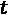

# 第八章：*第八章:* 神经机器翻译

在上一章中，*第七章*，*实现 NLP 应用程序*，我们介绍了几种文本编码技术，并将其应用于三个**自然语言处理**（**NLP**）应用程序。其中一个应用是自由文本生成。结果表明，网络有可能学习语言的结构，从而生成某种风格的文本。

在本章中，我们将在自由文本生成的案例研究基础上，训练一个神经网络来自动将句子从源语言翻译成目标语言。为此，我们将使用从自由文本生成网络以及在*第五章*，*用于欺诈检测的自编码器*中学到的概念。

我们将首先描述机器翻译的一般概念，然后介绍将用于神经机器翻译的编码器-解码器神经架构。接下来，我们将讨论实现该应用程序的所有步骤，从预处理到定义网络结构，再到训练和应用网络。

本章的结构分为以下几个部分：

+   神经机器翻译的理念

+   编码器-解码器架构

+   为两种语言准备数据

+   构建和训练编码器-解码器架构

# 神经机器翻译的理念

**自动翻译**一直是一个热门且富有挑战性的任务。人类语言的灵活性和模糊性使其至今仍然是最难实现的任务之一。同一个单词或短语根据上下文可以有不同的含义，而且通常并非只有一个正确的翻译，而是存在多种可能的翻译方式。那么，计算机如何学会将文本从一种语言翻译成另一种语言呢？多年来，已经提出了不同的方法，所有方法的目标都是相同的：将源语言的句子或文本自动翻译成目标语言。

自动翻译系统的发展始于 1970 年代初期，采用**基于规则的机器翻译**（**RBMT**）。在这里，自动翻译是通过专门的语言学家在句子的词汇、句法和语义层面上手工开发的规则和词典来实现的。

在 1990 年代，**统计机器翻译**模型成为了当时的先进技术，尽管统计机器翻译的第一个概念是在 1949 年由沃伦·韦弗提出的。与使用词典和手写规则不同，新的思路是使用大量的示例语料库来训练统计模型。这个任务可以描述为建模概率分布，，即目标语言（例如德语）中的一个字符串，，是源语言（例如英语）中的一个字符串，，的翻译。为建模这个概率分布，提出了不同的方法，其中最流行的来自贝叶斯定理，并将建模为。因此，在这种方法中，任务被分为两个子任务：训练一个语言模型，，以及建模概率，。更一般来说，可以定义多个子任务，并为每个子任务训练和调整多个模型。

最近，神经机器翻译在自动翻译任务中获得了相当大的关注。此外，在这里，训练翻译模型需要大量的源语言和目标语言的示例句子语料库。经典的基于统计的模型和神经机器翻译的区别在于任务的定义：不是训练许多小的子组件并分别调整它们，而是训练一个单一的网络，以端到端的方式进行训练。

一种可以用于神经机器翻译的网络架构是编码器-解码器网络。让我们来了解一下这是什么。

# 编码器-解码器架构

在本节中，我们将首先介绍编码器-解码器架构的基本概念。之后，我们将重点讨论编码器在神经机器翻译中的应用。在最后两个子节中，我们将集中讨论解码器在训练和部署过程中的应用。

神经机器翻译的一种可能结构是**编码器-解码器**网络。在*第五章*《用于欺诈检测的自编码器》中，我们介绍了由编码器和解码器组成的神经网络的概念。记住，在自编码器的情况下，编码器的任务是提取输入的密集表示，而解码器的任务是根据编码器提供的密集表示重建输入。

在神经机器翻译的编码器-解码器网络中，编码器的任务是将源语言（输入句子）的上下文提取为密集表示，而解码器的任务是根据编码器的密集表示在目标语言中生成相应的翻译。

*图 8.1* 可视化了这个过程：


图 8.1 – 神经机器翻译中编码器-解码器网络的通用结构

这里，源语言是英语，目标语言是德语。目标是将句子 `I am a student` 从英语翻译成德语，其中一种正确的翻译可能是 `Ich bin ein Student`。编码器接收句子 `I am a student` 作为输入，并输出句子内容的密集向量表示。这个密集向量表示被输入到解码器，解码器随后输出翻译结果。

在这个案例研究中，网络的输入和输出都是序列。因此，**循环神经网络**（**RNN**）层通常用于编码器和解码器部分，以捕获上下文信息并处理可变长度的输入和输出序列。

一般来说，基于编码器-解码器 RNN 的架构用于各种序列到序列的分析任务——例如问答系统。这里，问题首先由编码器处理，编码器为问题生成一个密集的数值表示，然后解码器生成答案。

现在让我们专注于神经翻译网络的编码器部分，在我们继续讲解解码器之前，理解需要哪些数据准备。

## 应用编码器

编码器的目标是从输入句子中提取上下文的密集向量表示。这可以通过使用 **长短期记忆**（**LSTM**）层来实现，其中编码器逐字或逐字符地读取输入句子（英语）。

提示

在 *第六章*，《需求预测的循环神经网络》中，我们介绍了 LSTM 层。请记住，LSTM 层有两个隐藏状态，一个是单元状态，另一个是它的过滤版本。单元状态包含了所有先前输入的摘要。

在经典的编码器-解码器网络架构中，LSTM 层的隐藏状态向量用于存储密集表示。*图 8.2* 展示了基于 LSTM 的编码器如何处理输入句子：


图 8.2 – 编码器如何处理输入句子的示例

编码器从一些初始化的隐藏状态向量开始。在每一步，序列中的下一个单词被输入到 LSTM 单元，隐藏状态向量得到更新。处理完源语言的整个输入序列后，最终的隐藏状态向量包含了上下文表示，并成为解码器中隐藏状态向量的输入。

编码器的中间输出隐藏状态不会被使用。

现在我们有了编码器的密集上下文表示，可以使用它来馈送给解码器。虽然编码器在训练和部署过程中的工作方式保持不变，但解码器在训练和部署过程中的工作方式有所不同。

让我们首先集中讨论训练阶段。

## 在训练过程中应用解码器

解码器的任务是从密集的上下文表示中生成目标序列的翻译，可以按单词或字符逐个生成，再次使用带有 LSTM 层的 RNN。这意味着，理论上，每个预测的单词/字符都应该被反馈到网络中作为下一次输入。然而，在训练过程中，我们可以跳过理论，应用**教师强制**的概念。在这里，实际的单词/字符会被反馈到 LSTM 单元，而不是预测的单词/字符，这极大地有利于训练过程。

*图 8.3* 显示了解码器训练阶段的教师强制示例：


图 8.3 – 解码器训练阶段的教师强制示例

编码器的密集上下文表示用于初始化解码器 LSTM 层的隐藏状态。接下来，LSTM 层使用两个序列来训练解码器：输入序列，包含真实的单词/字符值，从**开始标记**开始，和目标序列，也包含真实的单词/字符值。

重要说明

在这种情况下，目标序列是输入序列向右移动一个字符，并在末尾添加一个结束标记。

总结一下，训练过程中需要三组单词/字符序列：

+   编码器的输入序列

+   解码器的输入序列

+   解码器的输出序列

在部署期间，我们没有解码器的输入和输出序列。因此，让我们来看看训练好的解码器如何在部署过程中使用。

## 在部署过程中应用解码器

当我们应用训练好的网络时，我们并不知道翻译序列的真实值。因此，我们只将来自编码器的密集上下文表示和一个开始标记输入到解码器中。然后，解码器多次应用 LSTM 单元，每次都将上一个预测的单词/字符反馈到 LSTM 单元作为下一步的输入。*图 8.4* 展示了在部署期间解码器的使用：


图 8.4 – 解码器在部署期间的使用

在第一步中，编码器的密集上下文表示形成输入的隐藏状态向量，而**起始标记**作为解码器的输入值。基于此，预测第一个单词，并更新隐藏状态向量。在接下来的步骤中，更新后的隐藏状态向量和最后预测的单词将被反馈到 LSTM 单元，以预测下一个单词。这意味着，如果某个单词第一次被预测错误，这种错误会在这种顺序预测中累积。

在本节中，你学习了什么是编码器-解码器神经网络以及它们如何应用于神经机器翻译。

在接下来的几节中，我们将介绍训练一个神经机器翻译网络的步骤，目的是将英文句子翻译成德语。像往常一样，第一步是数据准备。

所以，让我们从创建训练神经机器翻译网络所需的三个序列开始，使用编码器-解码器结构。

# 准备两种语言的数据

在*第七章*《实现 NLP 应用》中，我们讨论了在字符级别和词汇级别训练神经网络的优缺点。由于我们已经有了一些字符级别的经验，因此决定也在字符级别训练这个自动翻译网络。

为了训练一个神经机器翻译网络，我们需要一个包含两种语言的双语句子对的数据集。不同语言组合的数据集可以从[www.manythings.org/anki/](http://www.manythings.org/anki/)免费下载。在那里，我们可以下载一个包含英语和德语常用句子的数据集。该数据集仅由两列组成：英文原文和相应的德语翻译。

*图 8.5*展示了一个子集数据集，作为训练集使用：


图 8.5 – 包含英语和德语句子的训练集子集

如你所见，对于一些英文句子，可能有多个翻译。例如，句子`Hug Tom`可以翻译成`Umarmt Tom`、`Umarmen Sie Tom`或`Drücken Sie Tom`。

请记住，网络并不理解字符，只有数字值。因此，字符输入序列需要转换为数字输入序列。在上一章的第一部分中，我们介绍了几种编码技术。

与自由文本生成的案例研究一样，我们采用了**独热编码**作为编码方案，这将分两步实现。首先，产生**基于索引的编码**；然后，在训练时通过**Keras 网络学习器**节点将其转换为独热编码，在应用训练好的网络时通过**Keras 网络执行器**节点进行转换。

此外，还需要一个字典，用于映射英语和德语字符及其索引。在上一章中，为了生成产品名称，我们使用了**KNIME 文本处理扩展**来生成基于索引的字符序列编码。我们将在此处做同样的操作。

为了训练神经机器翻译，必须创建三种索引编码的字符序列：

+   输入序列，用于输入编码器。这是来自源语言的索引编码字符序列——在我们的例子中是英语。

+   输入序列，用于输入解码器。这是目标语言的索引编码字符序列，以起始标记开头。

+   用于训练解码器的目标序列，是解码器的输入序列向后偏移一步，并以结束标记结尾。

*图 8.6* 中的工作流读取双语句子对，提取前 10,000 个句子，分别对英语和德语句子进行索引编码，最后将数据集划分为训练集和测试集：


图 8.6 – 用于准备训练神经机器翻译网络的数据的预处理工作流片段

预处理的主要工作发生在名为**索引编码和序列创建**的组件内。*图 8.7*展示了该组件的内容：


图 8.7 – 组件内名为索引编码和序列创建的工作流片段

组件内的工作流片段首先将英语文本与德语文本分离，然后为句子生成索引编码——上部分为德语句子，下部分为英语句子。然后，最终，为每种语言创建字典并应用并保存。

在对德语句子进行索引编码后，将为解码器创建两个序列：在上支路通过在序列开头添加一个起始标记，在下支路通过在序列末尾添加一个结束标记来创建。

德语和英语的所有序列随后会转换为集合单元格，以便在训练前将其转换为独热编码。

# 构建和训练编码器-解码器架构

现在，三个序列已准备好，我们可以开始在工作流中定义网络结构。在本节中，您将学习如何在 KNIME 分析平台中定义和训练一个编码器-解码器结构。一旦网络训练完成，您将学习如何将编码器和解码器提取成两个网络。在最后一节中，我们将讨论如何在部署工作流中使用提取的网络将英语句子翻译成德语。

## 定义网络结构

在编码器-解码器架构中，我们希望将编码器和解码器都设置为 LSTM 网络。编码器和解码器有不同的输入序列。英语的 one-hot 编码句子作为编码器的输入，而德语的 one-hot 编码句子作为解码器的输入。这意味着需要两个输入层：一个用于编码器，一个用于解码器。

**编码器**网络由两层组成：

+   通过**Keras 输入层**节点实现的输入层：输入张量的形状为 ，其中  是源语言的词典大小。输入张量形状中的*?*表示可变长度的序列，而`n`表示具有  个组件的 one-hot 向量。在我们的示例中，英语语言的形状为 ，输入张量的形状是[?,71]。

+   通过**Keras LSTM 层**节点实现的 LSTM 层：在这个节点中，我们使用 256 个单元并启用*return state*复选框，将隐藏状态传递到即将到来的解码器网络。

**解码器网络**由三层组成：

+   首先，使用**Keras 输入层**节点来定义输入形状。同样，输入形状  是一个元组，其中  代表变量长度， 代表输入序列中每个向量的大小——即目标语言（德语）的词汇表大小。在我们的示例中，德语的输入张量形状为 。

+   通过 Keras **LSTM 层**节点实现 LSTM 层。这一次，可选的输入端口用于将编码器中的隐藏状态传递到解码器。这意味着编码器网络中第一个 LSTM 层的输出端口连接到解码器网络中的两个可选输入端口。此外，Keras 输入层节点的输出端口用于连接德语输入序列到顶部输入端口。在其配置窗口中，选择正确的输入张量和隐藏张量是非常重要的。必须激活*return sequence*和*return state*复选框，以返回中间输出的隐藏状态，这些状态在下一层中用于提取下一个预测字符的概率分布。与编码器 LSTM 一样，使用 256 个单元。

+   最后，通过**Keras Dense 层**节点添加了一个 softmax 层，以生成目标语言（德语）词典中字符的概率向量。在配置窗口中，选择 softmax 激活函数，设定 85 个单元，这是目标语言词典的大小。

*图 8.8*中的工作流定义了这个编码器-解码器网络结构：


图 8.8 – 定义编码器-解码器网络的工作流片段

工作流的上半部分定义了带有 **Keras 输入层** 和 **Keras LSTM 层** 节点的编码器。在下半部分，解码器按之前描述的方式定义。

现在我们已经定义了编码器-解码器架构，可以开始训练网络了。

## 训练网络

正如本书中的所有其他示例一样，**Keras 网络学习器** 节点被用来训练网络。

在配置窗口的第一个标签页，名为 **输入数据** 中，选择了两个输入层的输入列：上半部分是源语言，即编码器的输入，下半部分是目标语言，即解码器的输入。为了将索引编码的序列转换为 one-hot 编码序列，两个列都使用 **从数字集合（整数）到 One-Hot 张量** 的转换类型。

在配置窗口的下一个标签页，名为 **目标数据** 中，选择了解码器的目标序列列，并再次启用 **从数字集合（整数）到 One-Hot 张量** 的转换类型。字符再次被视为多类分类问题中的类别；因此，训练过程中采用了分类交叉熵损失函数。

在第三个标签页 **Options** 中，训练阶段设置为最多运行 120 个周期，批量大小为 128 数据行，每个周期前对数据进行洗牌，并使用 Adam 作为优化算法，采用默认设置。

在训练过程中，我们使用 **Learner Monitor** 视图来监控 Keras 网络学习器节点的性能，并在准确率达到 94% 时决定停止学习过程。

## 提取训练好的编码器和解码器

为了将训练好的模型应用于翻译新的句子，我们需要将编码器和解码器分开。为此，每个部分都可以通过在 **DL Python 网络编辑器** 节点中使用几行 Python 代码从完整的网络中提取出来。该节点允许我们直接使用 **Python 库** 编辑和修改网络结构。

记住，解码器的输出是目标语言中所有字符的概率分布。在 *第七章*，*实现自然语言处理应用* 中，我们介绍了基于此输出概率分布预测下一个字符的两种方法。选项一是选择具有最高概率的字符作为下一个字符。选项二是根据给定的概率分布随机选择下一个字符。

在这个案例研究中，我们使用选项一，并通过额外的 **lambda 层** 直接在解码器中实现它。总结来说，在后处理时，我们需要执行以下步骤：

+   分离网络中的编码器和解码器部分。

+   引入一个带有 argmax 函数的 lambda 层，它选择 softmax 层中概率最高的字符。

    重要提示

    Lambda 层允许你在使用 TensorFlow 作为后端构建顺序模型和功能 API 模型时，使用任意的 TensorFlow 函数。Lambda 层最适合用于简单操作或快速实验。

让我们从提取编码器开始。

### 提取编码器：

在下面的代码中，你可以看到用于提取编码器的 Python 代码：

1.  加载包：

    ```py
    from keras.models import Model
    from keras.layers import Input
    ```

1.  定义输入：

    ```py
    new_input = Input((None,70))
    ```

1.  提取训练好的编码器 LSTM 并定义模型：

    ```py
    encoder = input_network.layers[-3]
    output = encoder(new_input)
    output_network = Model(inputs=new_input, outputs=output)
    ```

它从定义输入开始，将其输入到编码器的 LSTM 层，然后定义输出。

更详细地说，在前两行中，加载了所需的包。接下来，定义了输入层；然后，提取了`-3`层——编码器的训练 LSTM 层。最后，网络输出被定义为训练好的编码器 LSTM 层的输出。

现在我们已经提取了编码器，接下来看看如何提取解码器。

### 提取解码器并添加 lambda 层：

在下面的代码片段中，你可以看到在**DL Python 网络编辑器**节点中使用的代码，用于提取解码器部分并向其中添加 lambda 层：

1.  加载包：

    ```py
    from keras.models import Model
    from keras.layers import Input, Lambda
    from keras import backend as K
    ```

1.  定义输入：

    ```py
    state1 = Input((256,))
    state2 = Input((256,))
    new_input = Input((1,85))
    ```

1.  提取训练好的解码器 LSTM 层和 softmax 层：

    ```py
    decoder_lstm = input_network.layers[-2]
    decoder_dense = input_network.layers[-1]
    ```

1.  应用 LSTM 和全连接层：

    ```py
    x, out_h, out_c = decoder_lstm(new_input, initial_state=[state1, state2])
    probability_output = decoder_dense(x)
    ```

1.  添加 lambda 层并定义输出：

    ```py
    argmax_output = Lambda(lambda x: K.argmax(x, axis=-1))(probability_output)
    output_network = Model(inputs=[new_input, state1, state2], outputs=[probability_output, argmax_output, out_h, out_c])
    ```

这段代码首先加载了必要的包，然后定义了三个输入——两个是输入的隐藏状态，一个是单热编码的字符向量。接着，它提取了解码器中的训练 LSTM 层和 softmax 层。最后，它引入了带有 `argmax` 函数的 lambda 层并定义了输出。

为了在部署过程中加速执行，编码器和解码器会使用**Keras 到 TensorFlow 网络转换器**节点转换为 TensorFlow 网络。

现在我们已经训练好了神经机器翻译网络，并且分离了编码器和解码器，我们希望将它们应用到测试集中的句子上。

完整的训练工作流可以在 KNIME Hub 上找到：[`hub.knime.com/kathrin/spaces/Codeless%20Deep%20Learning%20with%20KNIME/latest/Chapter%208/.`](https://hub.knime.com/kathrin/spaces/Codeless%20Deep%20Learning%20with%20KNIME/latest/Chapter%208/.)

## 应用训练好的网络进行神经机器翻译：

为了将编码器和解码器网络应用到测试数据中，我们需要一个工作流，首先将编码器应用到索引编码的英文句子中以提取上下文信息，然后应用解码器生成翻译。

解码器应该使用来自编码器的第一个隐藏状态和输入序列中的起始符号进行初始化，以便在递归循环中逐字符地触发翻译。*图 8.9* 展示了这一过程：


图 8.9 – 部署过程中应用编码器和解码器模型的思路

*图 8.10*中的工作流片段正好执行了这些步骤：


图 8.10 – 此工作流片段应用训练好的编码器-解码器神经架构将英文句子翻译成德语句子

它从**TensorFlow 网络执行器**节点开始（位于*图 8.10*的最左侧）。此节点将编码器和索引编码的英文句子作为输入。在其配置窗口中，定义了来自 LSTM 隐藏状态的两个输出。

接下来，我们创建一个起始标记，并将其转换为一个集合单元。对这个起始标记，我们应用解码器网络，使用另一个**TensorFlow 网络执行器**节点（从左侧数第二个）。在配置窗口中，我们确保使用上一个**TensorFlow 网络执行器**节点中生成的编码器隐藏状态作为输入。作为输出，我们再次设置隐藏状态，以及下一个预测字符——即翻译句子的第一个字符。

现在，我们进入递归循环，在此过程中，使用来自上次迭代的更新隐藏状态和最后预测的字符作为输入，重复此过程多次。

最后，德语词典被应用于索引编码的预测字符，最终翻译结果得以获得。以下是翻译结果的摘录：


图 8.11 – 部署的翻译网络在新英文句子上的最终结果

在第一列，我们有新的英文句子，在第二列，有正确的翻译，在最后一列，有网络生成的翻译。尽管这些翻译大多数实际上是正确的，尽管它们与第二列的句子不匹配，因为相同的句子可以有不同的翻译。另一方面，`Talk to Tom`句子的翻译是不正确的，因为`rune`不是德语单词。

描述的部署工作流可以在 KNIME Hub 上找到：[`hub.knime.com/kathrin/spaces/Codeless%20Deep%20Learning%20with%20KNIME/latest/Chapter%208/`](https://hub.knime.com/kathrin/spaces/Codeless%20Deep%20Learning%20with%20KNIME/latest/Chapter%208/)。

在这一部分，你已经学会了如何根据字符级别的神经机器翻译示例，定义、训练并应用编码器-解码器架构。

# 总结

在本章中，我们探讨了神经机器翻译的主题，并训练了一个网络来生成英译德翻译。

我们从自动机器翻译的介绍开始，讲解了其历史，从基于规则的机器翻译到神经机器翻译。接着，我们介绍了基于编码器-解码器 RNN 架构的概念，这些架构可以用于神经机器翻译。一般来说，编码器-解码器架构可以用于序列到序列的预测任务或问答系统。

之后，我们讲解了训练和应用一个基于字符级的神经机器翻译模型所需的所有步骤，使用一个简单的网络结构，其中编码器和解码器都只有一个 LSTM 单元。由编码器和解码器结合而成的联合网络，采用了**教师强制**范式进行训练。

在训练阶段结束并在部署之前，**lambda 层**被插入到解码器部分，用于预测概率最高的字符。为此，训练后的网络结构在训练过程后被用几行 Python 代码修改。Python 代码将解码器和编码器网络分开，并添加了 lambda 层。这是唯一涉及一小段简单 Python 代码的部分。

当然，这个网络可以通过许多方式进一步改进——例如，通过堆叠多个 LSTM 层，或者使用额外的嵌入层在词汇级别上训练模型。

这是关于 RNN 的最后一章。在下一章中，我们将介绍另一类神经网络——**卷积神经网络**（**CNNs**），这种网络在图像处理方面已经证明了其非常成功的应用。

# 问题与练习

1.  编码器-解码器模型是一个：

    a.) 多对一架构

    b.) 多对多架构

    c.) 一对多架构

    d.) CNN 架构

1.  编码器在神经机器翻译中的任务是什么？

    a.) 编码字符

    b.) 生成翻译

    c.) 提取目标语言内容的密集表示

    d.) 提取源语言内容的密集表示

1.  编码器-解码器 LSTM 网络的另一个应用是什么？

    a.) 文本分类

    b.) 问答系统

    c.) 语言检测

    d.) 异常检测
