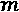
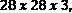
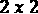
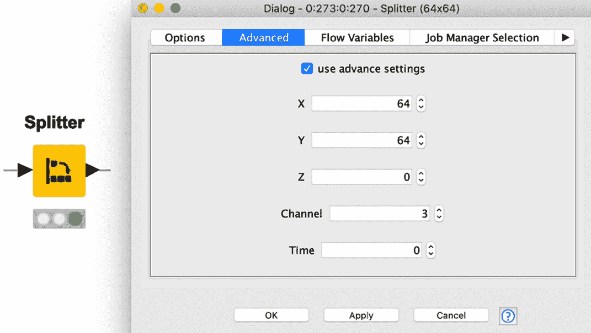

# 第九章：*第九章:* 卷积神经网络在图像分类中的应用

在前几章中，我们讨论了**递归神经网络**（**RNN**）及其如何应用于不同类型的序列数据和使用场景。本章我们将讨论另一类神经网络——**卷积神经网络**（**CNN**）。当应用于具有网格状拓扑和空间依赖的数据时，如图像或视频，CNN 尤其强大。

我们将首先进行 CNN 的基本介绍，解释卷积层背后的基本理念，并介绍一些相关术语，如填充、池化、滤波器和步幅。

随后，我们将从零开始构建并训练一个用于图像分类的 CNN。我们将涵盖所有必要的步骤：从读取和预处理图像到定义、训练和应用 CNN。

要从零开始训练一个神经网络，通常需要大量的标注数据。对于一些特定领域，如图像或视频，可能没有足够的数据，网络训练可能变得不可行。迁移学习是为了解决这个问题而提出的解决方案。迁移学习的理念是利用已经为任务 A 训练好的最先进神经网络作为任务 B 的起点，任务 B 是与 A 相关的另一个任务。

本章将涵盖以下主题：

+   CNNs 简介

+   使用 CNN 进行图像分类

+   迁移学习简介

+   应用迁移学习进行癌症类型预测

# CNNs 简介

CNN 常用于图像处理，并且在多个图像处理竞赛中获得了优胜。它们通常用于图像分类、物体检测和语义分割等任务。

有时，CNN 也用于与图像无关的任务，如推荐系统、视频或时间序列分析。事实上，CNN 不仅适用于具有网格结构的二维数据，还可以在一维或三维数据中应用。然而，本章我们将专注于 CNN 最常见的应用领域：**图像处理**。

CNN 是一种至少包含一个**卷积层**的神经网络。顾名思义，卷积层对输入数据执行卷积数学变换。通过这种数学变换，卷积层获得了从图像中检测和提取多个特征的能力，如边缘、角落和形状。这些提取特征的组合被用于对图像进行分类或检测图像中的特定物体。

卷积层通常与**池化层**一起出现，池化层也常用于图像处理中的特征提取部分。

本节的目标是解释卷积层和池化层如何单独以及共同工作，并详细说明这两种层的不同设置选项。

如前所述，在本章中我们将专注于图像分析的卷积神经网络（CNN）。因此，在深入探讨 CNN 的细节之前，让我们快速回顾一下图像是如何存储的。

## 图像是如何存储的？

灰度图像可以存储为矩阵，其中每个单元格表示图像的一个像素，单元格的值表示该像素的灰度级。例如，一张黑白图像，大小为像素，可以表示为维度为的矩阵，其中矩阵中的每个值介于和之间。表示一个黑色像素，表示一个白色像素，矩阵中的中间值表示灰度级。

*图 9.1*这里展示了一个例子：

图 9.1 – 灰度 5 x 5 图像的矩阵表示

由于每个像素仅由一个灰度值表示，一个**通道**（矩阵）就足以表示这张图像。另一方面，对于彩色图像，需要多个值来定义每个像素的颜色。一种选择是使用三个值来指定红色、绿色和蓝色的强度，从而定义像素颜色。在以下截图中，表示彩色图像时，使用了三个通道而不是一个：(*图 9.2*)：

图 9.2 – 使用三个通道表示 28 x 28 彩色图像（RGB）

从灰度图像到**红色、绿色和蓝色**（**RGB**）图像时，更为通用的**张量**概念——而不是简单的矩阵——变得必不可少。这样，灰度图像可以被描述为的张量，而具有像素的彩色图像则可以用一个张量表示。

一般来说，一个表示图像的张量，其高度为像素，宽度为像素，通道数为，其维度为 x  x 。

那么，为什么我们需要专门的网络来分析图像呢？我们不能只是**展平**图像，将每个图像表示为一个长向量，然后训练一个标准的全连接前馈神经网络吗？

重要提示

将图像的矩阵表示转换为向量的过程称为**展平**。

## 为什么我们需要卷积神经网络（CNN）？

对于基本的二值图像，展平和全连接前馈网络可能会得到可接受的性能。然而，对于更复杂的图像，图像中的像素依赖性较强，展平和前馈神经网络的组合通常无法有效工作。

确实，当图像被展平为一个向量时，空间依赖性会丧失。因此，完全连接的前馈网络不是平移不变的。这意味着它们对于同一图像的不同位移版本会产生不同的结果。例如，网络可能会学习在图像的左上角识别猫，但同一个网络无法检测图像右下角的猫。

此外，展平图像会生成一个非常长的向量，因此它需要一个非常大的完全连接的前馈网络，包含大量权重。例如，对于一个像素、三个通道的图像，网络需要个输入。如果下一层有个神经元，我们将仅在第一层训练个权重。你会发现，权重的数量可能会迅速变得难以管理，导致训练过程中出现过拟合。

卷积层是 CNN 的主要构建块，它利用图像的空间属性来解决这个问题。那么，让我们来看看卷积层是如何工作的。

## 卷积层是如何工作的？

卷积神经网络（CNN）的思路是使用滤波器来检测图像不同部分的模式——也叫特征——如角落、垂直边缘和水平边缘。

对于一个单通道图像，**滤波器**是一个小矩阵，通常大小为或，称为**卷积核**。不同的卷积核——即具有不同数值的矩阵——过滤不同的模式。卷积核在图像上滑动并执行卷积操作。这个卷积操作赋予了该层一个名称。这样的卷积输出称为**特征图**。

重要说明

对于一个具有三个通道的输入图像（例如，输入张量形状为），大小为 2 的卷积核的形状为。这意味着卷积核可以从所有通道获取信息，但仅限于输入图像的一个小区域（例如，在本例中为 2 x 2）。

*图 9.3* 这里展示了如何计算卷积，图像大小为，卷积核大小为：

图 9.3 – 通过将一个 3 x 3 的卷积核应用于一个 4 x 4 图像得到的卷积示例

在这个例子中，我们首先将卷积核应用于图像的左上角区域。图像的值与卷积核的值按元素相乘，然后求和，计算过程如下：

这种逐元素相乘并求和的结果就是输出特征图左上角的第一个值。接着，卷积核会在整张图像上滑动，计算输出特征图的所有其他值。

重要提示

卷积操作用*表示，且与矩阵乘法不同。尽管这一层叫做卷积层，但大多数神经网络库实际上实现的是一个相关的函数，叫做**交叉相关（cross-correlation）**。为了执行正确的卷积，按照其数学定义，核还必须翻转。对于卷积神经网络（CNN），这并不影响结果，因为权重无论如何都会被学习。

在卷积层中，大量的滤波器（核）会并行训练输入数据集，并针对所需任务进行优化。也就是说，核中的权重不是手动设置的，而是在网络训练过程中作为权重自动调整。在执行时，所有训练过的核都会应用于计算特征图。

特征图的维度随后变成一个大小为的张量。在*图 9.3* 的示例中，我们只应用了一个核，特征图的维度为。

从历史上看，核是手工设计的，用于特定任务。例如，*图 9.3* 中的核用于检测垂直线。*图 9.4* 显示了其他一些手工设计的核的影响：

图 9.4 – 一些手工设计的核对原始图像的影响

卷积操作只是卷积层的一部分。之后，偏置值和非线性激活函数会应用于特征图中的每个条目。例如，我们可以向特征图中的每个值添加偏置值，然后应用**整流线性单元（ReLU）**作为激活函数，将所有小于偏置的值设置为 0。

重要提示

在*第三章*，*神经网络入门*一章中，我们介绍了密集层。在密集层中，首先计算输入的加权和；然后，将偏置值添加到和中，最后应用激活函数。在卷积层中，密集层的加权和被卷积所取代。

卷积层有多个设置选项。我们已经在前面的内容中介绍了其中三个，这里列出它们：

+   核的大小，通常是

+   滤波器的数量

+   激活函数，其中 ReLU 是最常用的函数。

还有三个设置选项：填充（padding）、步幅（stride）和扩张率（dilation rate）。我们继续讨论填充（padding）。

## 引入填充（Padding）

当我们在*图 9.3*中的示例中应用滤波器时，特征图的维度相比输入图像的维度有所缩小。输入图像的大小为 ，而特征图的大小为 。

此外，通过查看特征图，我们可以看到输入图像内部的像素（值为 f, g, j, k 的单元格）在卷积过程中比角落和边缘的像素更常被考虑。这意味着内部值在后续分析中将获得更高的权重。为了解决这个问题，可以通过在额外的外部单元格中添加零来对图像进行零填充（*图 9.5*）。这就是所谓的**填充**过程。

*图 9.5* 这里展示了一个零填充输入的示例：

图 9.5 – 零填充图像示例

这里，在原始图像的每一行和每一列周围都添加了两个零值单元格。如果现在对这个零填充的图像应用大小为  的卷积核，特征图的输出维度将与原始图像的维度相同。用于零填充的单元格数量是卷积层中的另一个可配置参数。

另外两个影响输出大小的设置，如果不使用填充，分别叫做**步幅**和**膨胀率**。

## 介绍步幅和膨胀率

在*图 9.3*的示例中，我们将滤波器应用于每一个像素。对于大尺寸的图像，通常不需要对每个像素进行卷积。我们可以将卷积核按水平或垂直方向移动多个像素，而不是每次只移动一个像素。

用于卷积核滑动的像素数量称为**步幅**。步幅通常由一个元组定义，指定水平和垂直方向上滑动的单元格数量。较高的步幅值，在没有填充的情况下，会导致输入图像的下采样。

*图 9.6* 的顶部部分展示了一个大小为 3 x 3 的卷积核如何以步幅 2, 2 在图像上滑动。

卷积层的另一个设置选项是**膨胀率**。膨胀率表示输入图像中每  个连续单元格中只使用其中一个进行卷积操作。膨胀率为  时，仅使用输入图像中的每两个像素进行卷积。膨胀率为  时，使用三个连续像素中的一个。就像步幅一样，膨胀率是一个水平方向和垂直方向的值元组。当使用高于  的膨胀率时，核会膨胀成在原始图像上更大的视野。因此，一个 3 x 3 的核，膨胀率为  时，探索输入图像中大小为 5 x 5 的视野，同时仅使用九个卷积参数。

对于一个  核心和一个膨胀率为  的情况，核心仅使用其角值扫描输入图像上的  区域（见 *图 9.6* 下部）。这意味着对于膨胀率为  的情况，我们有一个大小为 1 的间隙；对于膨胀率为  的情况，我们会有一个大小为 2 的间隙，依此类推：

图 9.6 – 不同步幅和膨胀率值对输出特征图的影响

卷积神经网络中另一个常用的层是池化层。

## 引入池化

**池化**的思想是用汇总统计值替代特征图中的一块区域。例如，池化可以用每个  区域的最大值来替代该区域，称为**最大池化**，或者用其平均值来替代，称为**平均池化**（*图 9.7*）：

图 9.7 – 最大池化和平均池化的结果

池化层以更高效的方式减少输入图像的维度，并允许提取主导的、旋转不变和位置不变的特征。

和滤波器一样，在池化中我们需要定义要计算汇总统计的区域大小。一个常用的设置是池化大小为  像素，且每个方向的步幅为两个像素。这个设置将图像的维度减半。

重要提示

池化层没有任何权重，所有设置都是在层配置期间定义的。它们是静态层，其参数不会像网络中的其他权重一样进行训练。

池化层通常在一个卷积层或多个堆叠卷积层之后使用。

卷积层既可以应用于输入图像，也可以应用于特征图。事实上，多个卷积层通常会堆叠在一起形成 CNN。在这种层级结构中，第一层卷积可能会提取低级特征，如边缘。接下来的层中的滤波器将基于提取的特征进行处理，可能会学习检测形状，等等。

最终提取的特征可以用于不同的任务。在图像分类的情况下，特征图——由多个卷积层堆叠而成——被平展，然后在其上应用分类网络。

总结一下，标准的图像分类 CNN 首先使用一系列卷积层和池化层，然后是一个平展层，最后是一系列全连接层用于最终分类。

现在我们已经熟悉了卷积层和池化层，让我们看看如何将它们引入到图像分类网络中。

# 使用 CNN 进行图像分类

在本节中，我们将学习如何从零开始构建和训练用于图像分类的 CNN。

目标是使用来自**MNIST 数据库**的数据，将手写数字进行分类，MNIST 是一个常用的手写数字数据库，通常用于训练各种图像处理应用。MNIST 数据库包含 60,000 张训练图像和 10,000 张测试图像，数字为手写体，可以从以下网站下载：[`yann.lecun.com/exdb/mnist/`](http://yann.lecun.com/exdb/mnist/)。

为了读取和预处理图像，KNIME 分析平台提供了一组专用的节点和组件，在安装**KNIME 图像处理扩展**后可用。

小贴士

**KNIME 图像处理扩展**（[`www.knime.com/community/image-processing`](https://www.knime.com/community/image-processing)）允许你读取超过 140 种不同格式的图像（得益于生物格式**应用处理接口**（**API**））。此外，它还可以用来应用众所周知的图像处理技术，如分割、特征提取、跟踪和分类，利用 KNIME 分析平台中的图形用户界面。

通常，这些节点操作多维图像数据（例如，视频、3D 图像、多通道图像，甚至这些的组合），通过内部库 `ImgLib2-API`。几个节点计算分割图像（例如，单个细胞）的图像特征（例如，Zernike、纹理或直方图特征）。机器学习算法应用于结果特征向量，用于最终分类。

为了在图像上应用和训练神经网络，我们需要一个额外的扩展：**KNIME 图像处理 - 深度学习扩展**。这个扩展引入了一些有用的图像操作——例如，一些必要的转换，用于将图像数据输入到**Keras 网络学习器**节点中。

重要提示

为了在图像上训练和应用神经网络，您需要安装以下扩展：

KNIME 图像处理 ([`www.knime.com/community/image-processing`](https://www.knime.com/community/image-processing))

KNIME 图像处理 – 深度学习扩展 ([`hub.knime.com/bioml-konstanz/extensions/org.knime.knip.dl.feature/latest`](https://hub.knime.com/bioml-konstanz/extensions/org.knime.knip.dl.feature/latest))

让我们开始读取和预处理手写数字。

## 读取和预处理图像

对于本案例研究，我们使用 MNIST 数据集的一个子集：10,000 张图像样本用于训练，1,500 张用于测试。每张图像有像素且只有一个通道。训练和测试图像保存在两个不同的文件夹中，文件名为递增数字。此外，我们有一个包含图像标签的表格，按图像文件名的顺序进行排序。

读取和预处理工作流的目标是读取图像并将它们与标签匹配。因此，实施了以下步骤（也见于*图 9.8*）：

1.  读取并排序用于训练的图像。

1.  导入训练图像的数字标签。

1.  将标签与图像匹配。

1.  将像素类型从无符号字节转换为浮动。

1.  将标签转换为集合单元格。

这些步骤由以下截图中所示的工作流执行：

图 9.8 – 此工作流读取 MNIST 数据集的一个子集，添加对应的标签，并将像素类型从无符号字节转换为浮动

要读取图像，我们使用**图像读取器（表格）**节点。该节点需要输入一列包含指向图像文件的**统一资源定位符**（**URL**）路径。为了创建排序后的 URL 列表，**列出文件**节点首先获取训练文件夹中所有图像文件的路径。然后，使用**排序图像**元节点。这里的*图 9.9*展示了元节点内部的情况：

图 9.9 – 排序图像元节点内部

元节点通过**字符串操作**节点从文件名中提取图像编号，并通过**排序器**节点对其进行排序。然后，**图像读取器（表格）**节点读取图像。

**文件读取器**节点，在下部分支中，读取包含图像标签的表格。

在下一步中，**列附加器**节点将正确的标签附加到每个图像上。由于图像已经被排序以匹配相应的标签，简单的附加操作就足够了。这里的*图 9.10*展示了**列附加器**节点输出的一个子集：

图 9.10 – 列追加节点的输出，包含数字图像及其对应标签。

接下来，**图像计算器** 节点通过将每个像素值除以 255，将像素类型从 *无符号字节* 改为 *浮动*。

最后，**创建集合列** 节点为每个标签创建一个集合单元。这个集合单元在训练过程中用于创建 one-hot 向量编码的类别。

现在我们已经读取并预处理了训练图像，可以设计网络结构了。

## 设计网络结构

在本节中，你将学习如何定义一个经典的 CNN 用于图像分类。

一个经典的 CNN 用于图像分类，通常包含两部分，它们以端到端的方式共同训练，具体如下：

+   **特征提取**：第一部分通过训练若干滤波器来进行图像的特征提取。

+   **分类**：第二部分在提取到的特征上训练分类网络，提取后的特征存在于从特征提取部分得到的扁平化特征图中。

我们从一个简单的网络结构开始，只有一个卷积层，后面接着一个池化层用于特征提取部分。得到的特征图会被扁平化，随后在其上训练一个简单的分类网络，这个网络只有一个隐藏层，并使用 ReLU 激活函数。

这里的工作流在*图 9.11*中展示了这个网络结构：

图 9.11 – 这个工作流片段构建了一个简单的 CNN，用于 MNIST 数据集的分类。

工作流从 **Keras 输入层** 节点开始，用于定义输入形状。MNIST 数据集的图像具有  像素，并且只有一个通道，因为它们是灰度图像。因此，输入是形状为  的张量，输入形状设置为 。

接下来，卷积层通过 **Keras 卷积 2D 层** 节点实现。*图 9.12* 展示了该节点的配置窗口：

图 9.12 – Keras 卷积 2D 层节点及其配置窗口。

名为 **Filters** 的设置决定了要应用的滤波器数量。这将是特征图的最后一个维度。在这个例子中，我们决定训练 *32* 个滤波器。

接下来，你可以在像素中设置 **Kernel size** 选项，也就是一个整数元组，定义每个卷积核的高度和宽度。对于 MNIST 数据集，我们使用的卷积核大小是 。这意味着设置为 。50。

接下来，你可以将 `dilation_rate` 设置为大于 1 的值。

接下来，你可以选择是否使用零填充。**填充**选项让你在**有效**和**相同**之间进行选择。**有效**表示不执行填充操作。**相同**表示执行零填充，使得特征图的输出维度与输入维度相同。由于图像边缘主要是黑色像素，我们决定不对图像进行零填充，选择了**有效**。

接下来，你可以选择**膨胀率**选项，作为一个整数元组。目前，指定任何大于 1 的膨胀率值与指定任何大于 1 的步幅值是不兼容的。膨胀率为表示没有像素被跳过。膨胀率为表示每隔一个像素使用一个像素，这意味着间隔大小为 1。我们使用表示膨胀率为.52。

最后，必须选择**激活函数**选项。对于这个案例研究，我们选择了卷积层中最常用的激活函数：**ReLU**。

卷积层的输出张量（即我们的特征图）具有维度，因为我们有个滤波器，并且没有使用填充。

接下来，使用**Keras Max Pooling 2D Layer**节点对两个维度进行最大池化。

*图 9.13* 显示了节点的配置窗口：

图 9.13 – Keras Max Pooling 2D Layer 节点及其配置窗口

在**Keras Max Pooling 2D Layer**节点的配置窗口中，你可以定义**池化大小**。这同样是一个整数元组，定义了池化窗口。请记住，最大池化的理念是用池化窗口中的最大值来表示每个区域。

**步幅**再次是一个整数元组，用于设置池化窗口的步长。

最后，你可以选择是否应用零填充，选择**有效**表示不填充，选择**相同**表示应用填充。

对于这个 MNIST 示例，我们将**池化大小**设置为，**步幅**设置为，并且没有应用填充。因此，池化层的输出维度为。

接下来，使用一个**Keras Flatten Layer**节点将特征图转换为向量，维度为。

在**Keras 扁平化层**节点之后，我们构建了一个简单的分类网络，包含一个隐藏层和一个输出层。隐藏层使用 ReLU 激活函数和 100 个单元，由*图 9.11*中的第一个**Keras Dense 层**节点实现，而输出层由*图 9.11*中的第二个（也是最后一个）**Keras Dense 层**节点实现。由于这是一个有 10 个不同类别的多类分类问题，因此这里使用了带有 10 个单元的 softmax 激活函数。此外，使用**名称前缀** *output*，这样在将网络应用于新数据时可以更容易地识别输出层。

现在我们已经定义了网络结构，可以开始训练 CNN。

## 训练和应用网络

为了训练上一节中构建的 CNN，我们再次使用**Keras 网络学习器**节点。在前面的章节中，我们已经看到这个节点提供了许多输入和目标数据的转换类型（例如，**从数字集合（整数）到独热张量**的选项）。安装**KNIME 图像处理 – 深度学习扩展**后，新增了一个转换选项：**从图像（自动映射）**。这个新的转换选项允许我们从输入表中选择一个图像列，并自动创建张量以输入到网络中。

*图 9.14* 显示了**输入数据**标签，来自**Keras 网络学习器**节点的配置窗口，其中包括这个额外的转换选项：

图 9.14 – Keras 网络学习器节点配置窗口的输入数据标签，带有额外的转换选项：从图像（自动映射）

在**目标数据**标签中，选择了将**从数字集合（整数）到独热张量**的转换选项，适用于图像标签的集合单元列。

底部选择了*类别交叉熵*激活函数，因为这是一个多类分类问题。

在**选项**标签中，设置了以下训练参数：

+   `10`

+   `200`

+   `Adadelta 默认设置`

*图 9.15* 显示了**Keras 网络学习器**节点执行后的**学习监视器**视图，显示训练过程的进展：

图 9.15 – 学习监视器视图显示网络的训练进度

**学习监视器**视图显示了在多个训练批次中的网络训练进度。在右侧，你可以看到最后几个批次的准确率。**当前值**显示的是最后一个批次的准确率，在这个例子中是 **0.995**。

现在我们已经训练出了一个在训练集上表现良好的 CNN，可以将其应用于测试集。在此，必须对测试集执行与训练集相同的读取和预处理步骤。

**Keras 网络执行器**节点将训练好的网络应用于测试集中的图像。在配置窗口中，选择产生不同数字概率分布的最后一层作为输出。

此时，需要进行一些后处理，以便从网络输出中提取最终的预测结果。

## 预测提取与模型评估

**Keras 网络执行器**节点的输出是一个包含 12 列的表，包含以下内容：

+   图像列

+   真实类别值，命名为**实际值**

+   10 列包含图像类别的概率值，列标题为：`output/Softmax:0_x`，其中`x`是介于 0 到 9 之间的数字，用来表示类别。

后处理的目标是提取概率最高的类别，然后评估网络性能。这是通过*图 9.16*中所示的工作流片段实现的：

图 9.16 – 这个工作流片段提取概率最高的数字类别，并在测试集上评估网络性能

**一对多**节点提取每一行中概率最高的列的列标题。

然后，**列表达式**节点从列标题中提取类别。

提示

**列表达式**节点是一个非常强大的节点。它提供了通过表达式附加任意数量的新列或修改现有列的可能性。

对于每个需要附加或修改的列，可以定义一个单独的表达式。这些表达式可以像使用`=`一样简单地通过预定义函数创建。

可以通过提供的访问函数变量（"`variableName`"）和列（"`columnName`"）来访问可用的流程变量和输入表的列。

*图 9.17*这里显示了**列表达式**节点的配置窗口，其中包含工作流片段*图 9.16*中用于提取类别信息的表达式。在此案例中，表达式从名为**检测到的数字**的列中的字符串中提取最后一个字符：

图 9.17 – 列表达式节点及其配置窗口

接下来，预测类别的数据类型从`String`转换为`Integer`，通过**字符串转数字**节点实现，接着用**评分器**节点在测试集上评估网络性能。

*图 9.18*这里显示了**评分器**节点产生的视图：

图 9.18 – Scorer 节点视图，展示了网络在测试集上的表现

如你所见，这个简单的卷积神经网络已经在测试集上达到了 94%的准确率和 0.934 的 Cohen’s kappa 值。完整的工作流可以在 KNIME Hub 上找到：[`hub.knime.com/kathrin/spaces/Codeless%20Deep%20Learning%20with%20KNIME/latest/Chapter%209/`](https://hub.knime.com/kathrin/spaces/Codeless%20Deep%20Learning%20with%20KNIME/latest/Chapter%209/)。

在本节中，我们从头开始构建并训练了一个简单的卷积神经网络（CNN），并在这个相对简单的图像分类任务中达到了可接受的性能。当然，我们可以通过以下方法进一步提高该网络的性能：

+   增加训练周期数

+   添加第二个卷积层，并结合池化层

+   使用批归一化进行训练

+   使用数据增强

+   使用丢弃法（dropout）

我们将此留给你去完成，接下来介绍另一种网络学习方式，称为迁移学习。

# 迁移学习简介

**迁移学习**的基本理念是将用于任务**A**的网络在另一个相关任务**B**上重新使用。例如，如果我们训练一个网络来识别帆船（任务 A），我们可以将这个网络作为起点，训练一个新模型来识别摩托艇（任务 B）。在这种情况下，任务 A 被称为*源任务*，任务 B 则是*目标任务*。

将一个训练过的网络作为起点来训练一个新网络，与传统的网络训练方式不同，传统方法通常是将神经网络针对特定任务和数据集单独进行训练。*图 9.19* 这里可视化了传统的网络训练方式，其中不同的系统为不同的任务和领域进行训练：

图 9.19 – 传统的机器学习模型和神经网络训练方式

那么，为什么我们要使用迁移学习，而不是以传统、孤立的方式训练模型呢？

## 为什么使用迁移学习？

当前最先进的神经网络在处理特定复杂任务方面表现出了惊人的性能。有时，这些模型甚至超过了人类，在棋盘游戏中击败世界冠军，或在图像中检测物体。为了训练这些成功的网络，通常需要大量的标注数据，以及大量的计算资源和时间。

获取一个全面标注的数据集用于一个新领域，以便能够训练一个网络达到最先进的性能，可能是困难的，甚至是不可能的。举个例子，常用的**ImageNet 数据库**，用于训练最先进的模型，已经在多年的时间里开发出来。要为一个新的图像领域创建一个类似的新数据集需要时间。然而，当这些最先进的模型应用到其他相关领域时，它们往往会遭遇显著的性能下降，甚至更糟糕的是，模型可能会崩溃。这是因为模型对训练数据和领域存在偏倚。

转移学习使我们能够利用在一个任务和领域中训练时获得的知识（该领域有足够的标注数据）作为起点，在数据不足的新领域中训练新的模型。这种方法在许多计算机视觉和**自然语言处理**（**NLP**）任务中取得了显著的成果。

*图 9.20* 在这里可视化了转移学习的基本概念：

图 9.20 – 转移学习的基本概念

在我们讨论如何在训练神经网络时应用转移学习之前，先快速浏览一下转移学习的正式定义以及它可以应用的多种场景。

## 转移学习的正式定义

转移学习的正式定义及相关场景可以在 Sinno Jialin Pan 和 Qiang Yang 的论文《转移学习综述》中找到，IEEE Transactions on Knowledge and Data Engineering, 2009（[`ieeexplore.ieee.org/abstract/document/5288526`](https://ieeexplore.ieee.org/abstract/document/5288526)）。

这个定义涉及到**领域**和**任务**的概念。

在这篇论文中，引入了**领域** ，其定义为元组 {其中  是特征空间，  是  的边际概率分布。

对于一个给定的领域 ，一个任务  由以下两个组成部分构成：

+   标签空间 

+   预测函数 

在这里，预测函数  可以是条件概率分布 。一般来说，预测函数是基于标注的训练数据训练出来的，用来预测任何样本  在特征空间中的标签 。

使用这一术语，**转移学习**由 Sinno Jialin Pan 和 Qiang Yang 以以下方式定义：

*“给定一个源领域*  *和学习任务* *，一个目标领域*  *和学习任务*  *，迁移学习旨在帮助改善目标预测函数的学习*  *，使用在*  *中的知识*  *和* *，其中* *，或* *。”

Sebastian Ruder 在他的文章《迁移学习——机器学习的下一个前沿》*（2017）*中使用了这个定义（[`ruder.io/transfer-learning/`](https://ruder.io/transfer-learning/)），描述了迁移学习可以应用的以下*四种情境*：

1.  不同的特征空间：

    论文中的一个例子是跨语言适配，我们有不同语言的文档。

1.  不同的边际概率：

    一个例子是讨论不同主题的文档。这个情境称为*领域适配*。

1.  不同的标签空间：

    （例如，如果我们有不同标签的文档）。

1.  不同的条件概率  这通常与情境 3 一起发生。

现在我们对迁移学习有了基本的理解，接下来让我们探讨迁移学习如何应用于深度学习领域。

## 应用迁移学习

在神经网络中，训练过程中获得的知识存储在各层的权重中。例如，在 CNN 中，许多滤波器被训练以提取一系列特征。因此，从图像中提取这些特征的知识被存储在实现滤波器的卷积核权重中。

在用于图像分类的堆叠卷积神经网络（CNN）中，最初的卷积层负责提取低级特征，如边缘，而接下来的卷积层提取更高级的特征，如身体部位、动物或面部。最后的层被训练用于根据提取的特征对图像进行分类。

因此，如果我们想为不同的图像分类任务训练一个 CNN，处理不同的图像并使用不同的标签，我们就不能从零开始训练新的滤波器，而应该使用在最先进网络中训练过的卷积层作为起点。希望新的训练过程能够更快，且所需的数据量更少。

要使用另一个网络训练过的层作为训练起点，我们需要从原始网络中提取卷积层，然后在其上构建一些新的层。为此，我们有以下两个选择：

+   我们冻结已经训练好的层的权重，只根据被冻结层的输出训练新增的层。这种方法在 NLP 应用中经常使用，其中已训练的词向量会被重用。

+   我们使用训练好的权重来初始化网络中的新卷积层，然后在训练新增的层时对其进行微调。在这种情况下，会使用较小的学习率，以避免遗忘源任务中已经学到的知识。

作为本书的最后一个案例研究，我们希望训练一个神经网络，通过组织病理学切片图像预测癌症类型。为了加快学习过程，并考虑到我们所拥有的相对较小的数据集，我们将应用迁移学习，从这里作为源网络的流行 VGG16 网络的卷积层开始。

# 应用迁移学习进行癌症类型预测

我们将在这里介绍一个新的（也是最后的）案例研究。我们将从最先进的 VGG16 网络作为源网络，训练一个新的目标网络，该目标网络将基于描述三种不同类型淋巴瘤的图像数据集进行训练，这三种类型分别是**慢性淋巴细胞白血病**（**CLL**）、**滤泡性淋巴瘤**（**FL**）和**外套细胞淋巴瘤**（**MCL**）。

病理学家在医院的典型任务之一是查看组织病理学切片图像，并判断淋巴瘤的类型。即使是经验丰富的病理学家，这也是一项困难的任务，而且在许多情况下，仍需要后续检查来确认诊断。如果能有一种辅助技术来指导病理学家并加速他们的工作，那将具有极大的价值。

VGG16 是 2014 年 ImageNet 挑战赛中的获胜模型之一。它是一个堆叠的卷积神经网络（CNN），使用大小为  的卷积核，并且具有越来越深的结构——即，过滤器的数量逐渐增加。原始网络是在 ImageNet 数据集上训练的，该数据集包含了  图像，涵盖了超过 1,000 个类别。

*图 9.21*展示了 VGG16 模型的网络结构。

它从两个卷积层开始，每个卷积层有 64 个过滤器。经过一个最大池化层后，再使用两个卷积层，这次每个卷积层有 128 个过滤器。然后，另一个最大池化层后跟着三个卷积层，每个卷积层有 256 个过滤器。再经过一个最大池化层后，又有三个卷积层，每个卷积层有 512 个过滤器，接着是另一个池化层和三个卷积层，每个卷积层有 512 个过滤器。最后经过一个池化层后，使用了三层全连接层：

图 9.21 – VGG16 模型的网络结构

在这个案例研究中，我们希望重用 VGG16 模型训练好的卷积层，并在其上添加一些新的层来进行癌细胞分类任务。在训练过程中，卷积层将被冻结，只有新增的层会被训练。

为此，我们构建了三个独立的子工作流：一个工作流用于下载数据，一个工作流用于预处理图像，第三个工作流用于训练神经网络，使用迁移学习。你可以从 KNIME Hub 下载包含这三个子工作流的工作流：[`hub.knime.com/kathrin/spaces/Codeless%20Deep%20Learning%20with%20KNIME/latest/Chapter%209/`](https://hub.knime.com/kathrin/spaces/Codeless%20Deep%20Learning%20with%20KNIME/latest/Chapter%209/)。让我们从下载数据的工作流开始。

## 下载数据集

包含癌细胞图像的完整数据集以单个`tar.gz`文件的形式提供，包含 374 张图像：[`ome.grc.nia.nih.gov/iicbu2008/lymphoma/index.html`](https://ome.grc.nia.nih.gov/iicbu2008/lymphoma/index.html)。如*图 9.22*所示的工作流下载该文件，并创建一个包含每个图像文件路径和类别信息的表格：

图 9.22 – 这个工作流下载了完整的标注图像数据集，包含癌细胞图像

因此，工作流首先使用`tar.gz`文件定义一个目录来存储下载的数据，并将其解压到创建的目录中。`.table`文件。

下一步是预处理图像。

## 读取和预处理图像

在下一步中，将读取*图 9.22*中工作流创建的表格，并对图像进行预处理。每张图像的尺寸为 1388px x 1040px，具有三个颜色通道；这意味着 。为了减少计算的空间复杂度，我们采用与论文*Histology Image Classification Using Supervised Classification and Multimodal Fusion*（[`ieeexplore.ieee.org/document/5693834`](https://ieeexplore.ieee.org/document/5693834)）中类似的方法，将每张图像切割成 25 个块。对于这个用例，我们决定将每张图像切割成大小为  的块。

加载和预处理步骤由此处*图 9.23*所示的工作流执行：

图 9.23 – 这个工作流加载并预处理图像

第二个工作流从读取第一个工作流中创建的表格开始，其中包含图像路径以及类别信息。接下来，**类别到数字**节点用索引编码不同的类别值（FL、MCL 和 CLL），然后使用**分割**节点将数据集分为训练集和测试集。对于这个案例研究，我们决定使用 60% 的数据用于训练，40% 的数据用于测试，并在**类别**列上使用分层抽样。

在**加载和预处理图像（本地文件）**组件中，图像被上传并预处理。

*图 9.24* 显示了这个组件的内部结构：

图 9.24 – 加载和预处理图像（本地文件）组件的内部

该组件使用循环来依次加载和预处理每一张图像。**Chunk Loop Start**节点以每个块一行的方式启动循环，而**Loop End**节点则在循环迭代结束时将结果行连接起来，结束循环。

在循环体内，**Image Reader (Table)**节点始终加载一张图像。然后，使用**Image Calculator**节点将图像归一化，每个像素值除以 255。

接下来，使用**Image Cropper**节点裁剪图像到可被 64 整除的大小。由于原始图像的尺寸为 1388px x 1040px，因此每个图像的左侧裁剪掉前 44 个像素，顶部裁剪掉 16 个像素。

此处的*图 9.25*展示了该节点的配置窗口：

图 9.25 – 图像裁剪器节点及其配置窗口

接下来，**Splitter**节点将每个图像拆分成 336 个 64 x 64 像素的小图像，将每个新子图像存储在新的一列中，共生成约 75,000 个补丁。此处的*图 9.26*展示了**Splitter**节点配置窗口中的**高级**标签，已设置生成图像每个维度的最大尺寸：

图 9.26 – Splitter 节点及其配置窗口

接下来，表格被转置为一列并重命名，然后通过**Cross Joiner**节点将类别信息添加到每个图像中。

现在我们已经准备好图像，可以继续执行最后的工作流。

## 训练网络

训练工作流的第一步是定义网络结构，使用*VGG16 的卷积层*作为起点。

VGG16 模型最初是为了预测 ImageNet 数据集中的类别而训练的。尽管该数据集包含 1,000 个类别，但其中没有任何类别与本研究中的三种癌症类型相匹配。因此，我们只回收 VGG16 网络中已训练好的卷积层。然后，我们会在其上添加一些新的神经层用于分类任务，并最终对得到的网络进行微调，以适应我们的任务。

为了训练最终的网络，我们将使用**Keras Network Learner**节点和从训练集图像中创建的约 75,000 个补丁。以下步骤由*图 9.27*所示的工作流执行：

图 9.27 – 训练工作流以训练新的网络来分类癌细胞图像

工作流首先读取包含完整网络结构和权重的 VGG16 网络的`.h5`文件，或者网络保存在仅包含网络结构的`.json`或`.yaml`文件中。

在这种情况下，我们读取了训练好的 VGG16 网络的`.h5`文件，因为我们打算利用网络中嵌入的所有知识。

VGG16 网络的输出张量的尺寸为，这是最后一个最大池化层的输出大小。在我们能够为分类任务添加一些全连接层之前，我们使用**Keras 展平层**节点将输出展平。

现在，使用**Keras 全连接层**节点添加一个具有**ReLU**激活函数和 64 个神经元的全连接层。接下来，引入了一个**Dropout 层**节点，设置丢弃率为。最后，最后一个**Keras 全连接层**节点定义了网络的输出。由于我们正在处理一个有三个不同类别的分类问题，因此采用了具有三个单元的**softmax**激活函数。

如果我们将最后一个**Keras 全连接层**节点的输出连接到**Keras 网络学习器**节点，我们将微调所有层，包括从 VGG16 模型中训练出来的卷积层。但我们不希望丢失所有这些知识！因此，我们决定不微调 VGG16 模型的层，而只训练新增的层。因此，VGG16 模型的层必须被冻结。

为了冻结网络的层，我们使用**Keras 冻结层**节点。*图 9.28*展示了该节点的配置窗口：

图 9.28 – Keras 冻结层节点及其配置窗口

在配置窗口中，您可以选择要冻结的层。在之后训练网络时，所选层的权重将不会更新，其他所有层将会被训练。我们冻结了除了 VGG16 网络末端添加的层以外的所有层。

在工作流的下半部分，我们使用**表格读取器**节点读取训练数据，并使用**一对多**节点对类别进行一热编码。

现在我们有了训练数据和网络结构，我们可以使用**Keras 网络学习器**节点对其进行微调。

与本书中的所有其他案例研究一样，输入数据和目标数据的列会在**Keras 网络学习器**节点的配置窗口中选择，并选择所需的转换类型。在本例中，输入列选择了**从图像**转换，目标列选择了从数字（双精度）转换。因为这是一个多类别分类任务，所以采用了**类别交叉熵**损失函数。为了微调该网络，它已使用训练批次大小为 64、优化器为 RMSProp（默认设置）训练了 5 个 epoch。

一旦网络经过微调，我们就可以评估其在测试图像上的表现。经过预处理的测试图像，以 64 x 64 像素的小块形式，通过**Table Reader**节点读取。为了预测图像的类别，我们使用**Keras Network Executor**节点为每个 64 x 64 像素的小块生成预测。然后，所有预测结果通过一个简单的多数投票方案结合起来，这个方案在**Extract Prediction**元节点中实现。

最后，使用**Scorer**节点评估网络。分类器已经达到了 96%的准确率（再微调几个周期可以将准确率提高到 98%）。

提示

在这个使用案例中，VGG16 模型仅用于特征提取。因此，另一种方法是提前应用 VGG16 模型的卷积层来提取特征，并将其作为输入馈送到经典的前馈神经网络中。这样做的好处是，VGG16 的前向传播仅需对每张图像进行一次，而不是在每次批处理更新时都进行。

我们现在可以保存网络并将其部署，例如，让病理学家通过网页浏览器访问这些预测。如何使用 KNIME Analytics Platform 和 KNIME Server 来实现这一点将在下一章中展示。

# 总结

在本章中，我们探讨了 CNN，重点讨论了图像数据。

我们从卷积层的介绍开始，这也促成了这一新型神经网络家族的命名。在这个介绍中，我们解释了为什么 CNNs 如此常用于图像数据，卷积网络是如何工作的，以及各种设置选项的影响。接着，我们讨论了池化层，它通常用于 CNNs 中以高效地下采样数据。

最后，我们将所有这些知识付诸实践，通过从头开始构建并训练一个 CNN 来对 MNIST 数据集中的数字 0 到 9 的图像进行分类。之后，我们讨论了迁移学习的概念，介绍了四种迁移学习应用场景，并展示了如何在神经网络领域应用迁移学习。

在上一节中，我们应用迁移学习训练了一个 CNN 来分类组织病理学切片图像。这一次，我们没有从头开始训练，而是重新使用了经过训练的 VGG16 模型的卷积层来提取图像的特征。

现在我们已经涵盖了许多不同的使用案例，接下来我们将进入下一步，即训练好的神经网络的部署。在下一章中，你将了解使用 KNIME 软件的不同部署选项。

# 问题与练习

1.  卷积层中的核大小是什么？

    a) 用统计值总结的区域

    b) 图像中移动矩阵的大小

    c) 矩阵移动的像素数量

    d) 层使用的区域大小

1.  什么是池化层？

    a) 池化层是 RNN 中常用的层

    b) 池化层用统计值总结一个区域

    c) 池化层是前馈网络中常用的层

    d) 池化层可以用来对图像进行上采样

1.  转移学习在什么时候有帮助？

    a) 将数据转移到另一个系统

    b) 如果没有可用的模型

    c) 如果没有足够的标注数据

    d) 用于比较不同的模型
