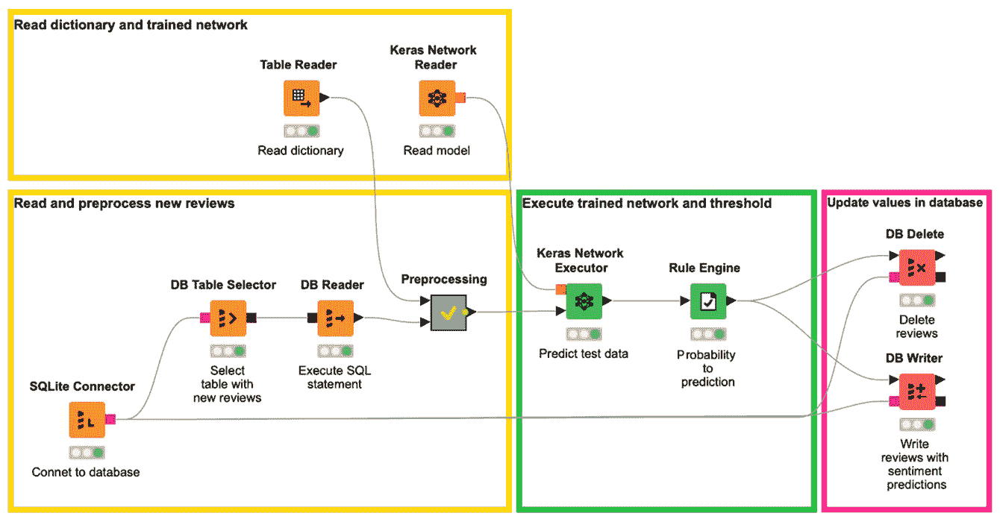
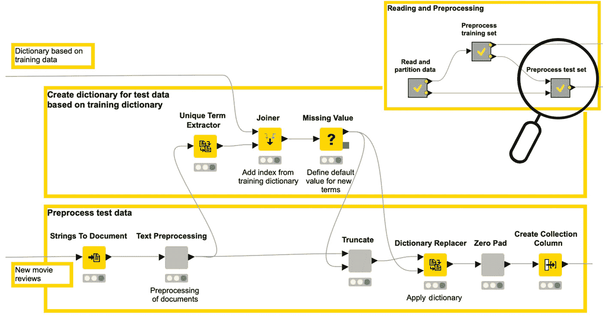
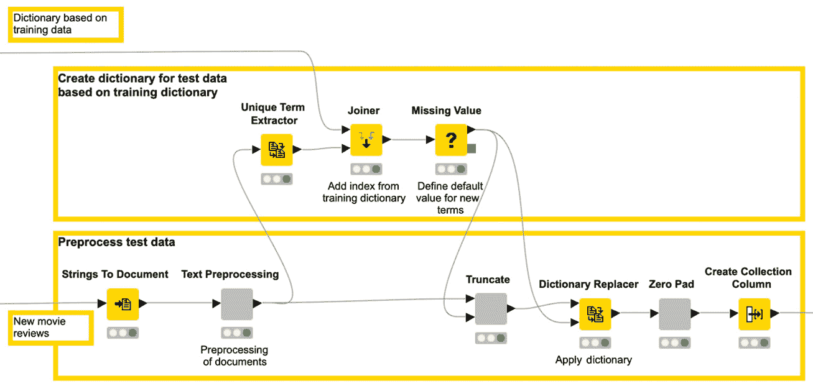
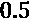
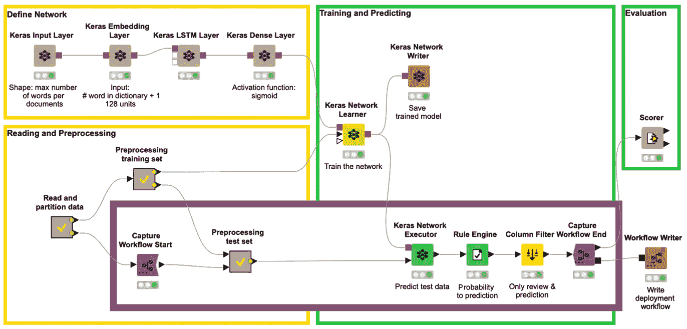
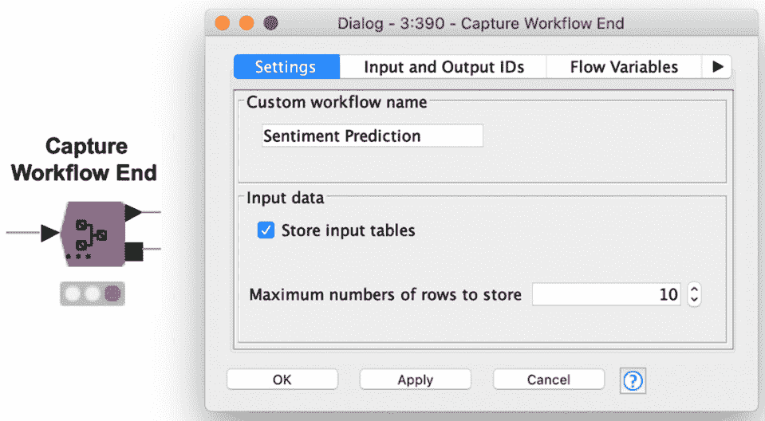
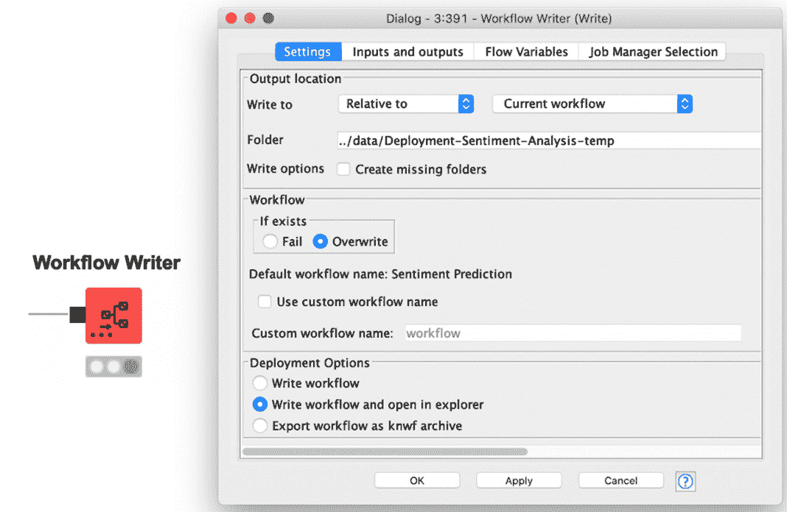
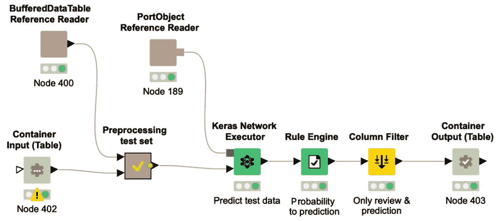
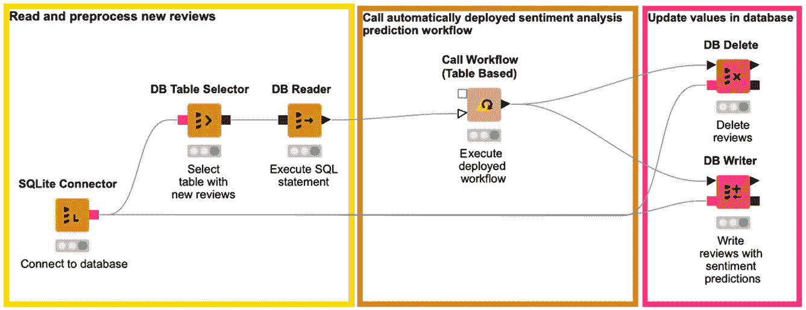

­

# 第十章：*第十章：* 部署深度学习网络

在本书的前几个部分，我们涵盖了多种不同用例下的深度神经网络训练，从用于欺诈检测的自编码器，到用于能耗预测和自由文本生成的 **长短期记忆**（**LSTM**）网络，再到癌细胞分类。但训练网络并不是项目的唯一部分。一旦深度学习网络训练完成，下一步就是进行部署。

在探索一些用例时，已经介绍了第二个工作流，用于将网络部署到实际数据中进行工作。因此，你已经看到了一些部署示例。然而，在本书的最后一部分，我们将重点关注机器学习模型的多种部署选项，特别是对于已训练的深度学习网络。

通常，会构建一个专门用于部署的第二个工作流。该工作流读取训练好的模型和新的实际数据，按照与训练数据相同的方式预处理这些数据，然后将训练好的深度学习网络应用于转换后的数据，并根据项目的需求生成结果。

本章重点介绍了部署工作流中数据的读取、写入和预处理。

本章首先回顾了保存、读取和转换训练网络的功能。接下来，介绍了如何在部署工作流中实现情感分析用例的预处理的两个示例。最后，本章展示了如何通过启用 GPU 支持来提高执行速度。

本章包含以下部分：

网络结构的转换

构建一个简单的部署工作流

提高可扩展性——GPU 执行

# 网络结构的转换

部署工作流的目标是将已训练的网络应用于新的实际数据。因此，训练工作流的最后一步必须是保存训练好的网络。

## 保存已训练的网络

本书中描述的所有网络都使用 Keras 库进行训练，并依赖 TensorFlow 作为后端。因此，保存网络的最自然方法是继续使用 Keras 库，并使用 `.h5` 文件。

然而，Keras 格式的网络只能通过 Keras 库进行解释和执行。这已经比 TensorFlow 库多了一层。在 TensorFlow Java API 上直接执行网络应用，而不是通过 Keras Python API 在 Python 内核上执行，可以提高执行速度。好消息是，KNIME 分析平台除了基于 Keras 库的节点外，还提供了用于 TensorFlow 执行的节点。

因此，如果需要更快的执行，应该将 Keras 网络转换为 TensorFlow 网络，使用 `SavedModel` 文件，即一个压缩的 `zip` 文件。`SavedModel` 文件包含完整的 TensorFlow 程序，包括权重和计算。它不需要原始的模型构建代码就能运行，这使得它在共享或部署时非常有用。

部署网络的第一步是读取一个已训练的网络。

## 读取已训练的网络

KNIME Analytics Platform 提供了许多节点用于读取已训练的神经网络，以下是其中一些：

+   Keras 网络读取器

+   TensorFlow 网络读取器（以及 TensorFlow 2 网络读取器）

+   DL Python 网络创建器

+   ONNX 网络读取器

`.h5` 文件）或者仅仅是没有权重的网络架构定义（如 `.json` 或 `.yaml` 文件）。你可以使用该节点读取通过 KNIME Analytics Platform 训练的网络，或者直接用 Keras 训练的网络，比如预训练的 Keras 网络。

`zip` 文件。如果是从目录读取，它必须是有效的 `SavedModel` 文件夹。如果是从 `zip` 文件读取，它必须包含一个有效的 `SavedModel` 文件夹。

提示

TensorFlow 网络读取器节点允许我们在其配置窗口中选择一个标签和一个签名。标签用于识别要加载的元图定义。`SavedModel` 的签名可以有多个标签，并且每个标签下可以有多个签名。通过 KNIME Analytics Platform 保存的网络只有一个标签和一个签名。在配置窗口的 **高级** 标签页中，你可以通过选择一个隐藏层作为输出，定义模型的输入和输出，从而定义自己的签名。

另一个节点是 **ONNX 网络读取器** 节点，它允许你在无需写任何代码的情况下读取预训练的网络。**ONNX** 代表 **开放神经网络交换**，是由微软和 Facebook 开发的神经网络标准格式。由于它是标准格式，ONNX 网络可以跨不同的机器学习框架使用，如 PyTorch、Caffe2、TensorFlow 等。你可以从 ONNX 模型库（[`github.com/onnx/models#vision`](https://github.com/onnx/models#vision)）下载预训练的网络，并使用 ONNX 网络读取器节点读取它们。ONNX 网络还可以通过 **ONNX 到 TensorFlow 网络转换器** 节点转换为 TensorFlow 网络，然后使用 TensorFlow 网络执行器节点进行执行。

提示

要使用 ONNX 节点，你需要安装 **KNIME 深度学习 – ONNX 集成** 扩展。

另一种使用 Python 代码读取网络的方式是 **DL Python 网络创建器** 节点，它可以通过几行 Python 代码读取预训练的神经网络。

提示

DL Python 网络创建器节点也可以在训练工作流中使用，使用 Python 代码定义网络架构，而不是使用层节点。

到目前为止，我们使用了基于 Keras 的节点，TensorFlow 1 作为后端。也有使用 TensorFlow 2 作为后端的节点来实现类似的操作。

## 使用 TensorFlow 2

本书中的所有示例都使用了基于 Keras 的节点，TensorFlow 1 作为后端。自 KNIME Analytics Platform 4.2 版本发布以来，TensorFlow 2 也得到了支持。在 KNIME Hub 上，您可以找到许多如何使用 TensorFlow 2 集成的示例。

TensorFlow 2 集成提供了三个节点：

+   **TensorFlow 2 网络执行器**节点

+   **TensorFlow 2 网络读取器**节点

+   **TensorFlow 2 网络写入器**节点

要使用 TensorFlow 2 训练深度学习模型，可以使用 **DL Python 网络学习器**节点。

现在我们已经回顾了保存和读取神经网络的多种选项，让我们专注于构建一个简单的部署工作流。

# 构建一个简单的部署工作流

到目前为止，在我们探讨的所有案例研究中，我们总是对输入数据进行某种预处理，例如对分类特征进行编码、对文本进行编码或对数据进行归一化，仅举一些采用的预处理步骤。部署期间，新的输入数据必须经过与训练数据完全相同的预处理，以确保与任务以及网络期望的输入一致。

在本节中，我们使用*第七章*中的情感分析案例研究，*实施 NLP 应用程序*，作为示例，构建两个部署工作流。两个工作流的目标是从数据库中读取新的电影评论，预测情感，并将预测写入数据库。

在第一个示例中，预处理步骤被手动实现到部署工作流中。在第二个示例中，使用了**集成部署**功能。

## 手动构建部署工作流，无需集成部署

部署工作流应从数据库中的表格获取新的评论，应用训练好的网络，将带有相应预测的评论写入数据库中的另一张表，并删除第一张表中的评论。

这些步骤由*图 10.1*中的工作流执行，您可以从 KNIME Hub 下载，网址为：[`hub.knime.com/kathrin/spaces/Codeless%20Deep%20Learning%20with%20KNIME/latest/Chapter_10/`](https://hub.knime.com/kathrin/spaces/Codeless%20Deep%20Learning%20with%20KNIME/latest/Chapter_10/)：

图 10.1 – 来自*第七章*的情感分析案例研究的部署工作流，实施 NLP 应用程序

工作流首先使用**SQLite 连接器**节点连接到 SQLite 数据库，数据库中存储了新的电影评论。

接下来，**SELECT** SQL 语句通过**DB Table Selector**节点来读取名为**new_reviews**的表中的新评论。

SQL 语句通过**DB Reader**节点执行。因此，我们在节点的输出端口得到了包含新评论的数据表。

提示

在*第二章*中，*使用 KNIME 分析平台进行数据访问和预处理*详细介绍了数据库扩展。请记住，数据库节点在其输出的棕色方形端口上创建 SQL 语句。

在将网络应用于这些新评论之前，我们需要执行与训练工作流中相同的转换。在*第七章*中报告的训练工作流中，存在一个名为**Preprocess test set**的元节点，所有必要的预处理步骤都在其中应用于测试数据。我们使用这个元节点作为创建部署工作流中传入数据预处理步骤的基础。

*图 10.2*显示了该元节点的内容，它专门用于测试集的预处理：

图 10.2 – 第七章情感分析案例研究中训练工作流的测试数据预处理

在*图 10.1*的部署工作流中，首先读取训练过程中创建的字典；然后在**Preprocessing**元节点中执行预处理步骤。

*图 10.3*向您展示了此元节点内的工作流片段：

图 10.3 – 部署工作流中预处理元节点内的工作流片段

如果我们对比*图 10.2*和*图 10.3*中的工作流片段，可以看到它们包含了相同的预处理步骤，正如预期的那样。

现在，已经对部署数据应用了与训练数据相同的预处理，训练好的网络可以通过**Keras Network Reader**节点引入（*图 10.1*）。

接下来，训练好的网络通过**Keras Network Executor**节点在预处理过的部署评论上运行。网络的输出是情感为 1 的概率，其中 1 表示正面的电影评论。与训练时相同的阈值也通过**Rule Engine**节点应用在此：阈值为 。

在最后一步，数据库中的表格被更新。首先，**DB Delete** 节点从 **new_reviews** 表中删除我们刚刚分析的评论。然后，**DB Writer** 节点将带有预测的新电影评论附加到数据库中的另一个表格，名为 **review-with-sentiment**。

这是使用 KNIME Analytics Platform 部署神经网络的第一个示例。这个工作流应该定期执行，以预测所有新进电影评论的情感。

提示

KNIME Server 可以调度工作流的执行，因此你可以定期自动触发它们的执行。

这种方法有一个缺点。如果模型在更多数据上重新训练或使用不同的设置（例如，在训练过程中考虑的术语更多或更少，或规则引擎节点的阈值发生变化），我们需要记得更新部署工作流中的预处理步骤。由于我们是健忘的人类，可能会忘记或犯错。

克服这个问题的解决方案是 **集成部署** 的概念。

## 使用集成部署自动构建部署工作流

直到 KNIME Analytics Platform 4.2 版本，以及其他工具中，常见的做法是在部署工作流中手动实现数据混合、数据转换和网络执行。这意味着你需要从训练工作流中复制不同的预处理代码段、参数和网络执行节点到部署工作流中，确保所有设置保持不变。

这一手动步骤会减慢过程，并且很容易导致错误。自动构建部署工作流的部分内容可以是一个更安全的选择，尤其是在模型经常改变的情况下，例如每天甚至每小时都可能变化。

重要提示

训练过程的其他常见名称是数据科学创建或建模工作流。

来自集成部署扩展的节点弥合了创建和部署数据科学之间的差距。

### 集成部署扩展

集成部署扩展允许数据科学家将模型训练和部署合并成一个单一的工作流。其思想是在执行训练工作流的过程中，捕捉训练工作流的部分内容，并自动将它们写入部署工作流中。

不必逐个手动复制预处理部分，训练工作流中所需的部分会在 **Capture Workflow Start** 和 **Capture Workflow End** 节点之间捕捉。然后，通过 **Workflow Writer** 节点，捕捉到的工作流部分可以写入新的工作流。

### 在训练工作流中使用集成部署扩展

让我们再次考虑情感分析案例的部署工作流，该工作流在 *第七章*《实施 NLP 应用程序》中进行了描述。在训练工作流中，我们引入了 **Capture Workflow Start** 节点和 **Capture Workflow End** 节点，以便精确地隔离我们希望在部署工作流中重现的工作流片段。

这包括以下内容：

+   名为 **Preprocessing test set** 的元节点，包括所有所需的预处理步骤

+   **Keras 网络执行器** 节点，用于在部署后的数据上应用训练好的网络

+   **Rule Engine** 节点，根据应用于输出类别概率的阈值决定正类或负类

图 *10.4* 展示了基于情感分析案例的工作流示例。你可以从 KNIME Hub 下载该工作流：[`hub.knime.com/kathrin/spaces/Codeless%20Deep%20Learning%20with%20KNIME/latest/Chapter_10/`](https://hub.knime.com/kathrin/spaces/Codeless%20Deep%20Learning%20with%20KNIME/latest/Chapter_10/)：

图 10.4 – 使用集成部署自动创建部署工作流的训练工作流

粗体框中的部分是捕获的工作流片段。**Capture Workflow Start** 节点定义了工作流片段的开始，**Capture Workflow End** 节点定义了工作流片段的结束。

起始节点不需要任何配置。图 *10.5* 显示了 **Capture Workflow End** 节点的配置窗口：

图 10.5 – **Capture Workflow End** 节点的配置窗口

在配置窗口中，你可以设置捕获的工作流片段的名称。你还可以设置是否将捕获的片段与数据一起存储，如果是，设置应包含的最大数据行数。稍后我们将看到，存储一些数据在捕获的工作流片段中是如何有帮助的。

捕获的工作流片段，是否包含数据，将通过 **Capture Workflow End** 节点的输出端口（黑色方块）导出。在图 *10.4* 中，工作流片段随后被 **Workflow Writer** 节点收集并写入部署工作流，设置和配置保持不变。

*图 10.6* 显示了 **Workflow Writer** 节点的配置窗口：

图 10.6 – Workflow Writer 节点及其配置窗口

在顶部，你可以设置目标工作流的文件夹位置（**输出位置**）。

接下来，您需要设置目标工作流的名称。该节点会自动提供默认名称，您可以通过**使用自定义工作流名称**选项进行自定义。如果您选择的名称已经指向一个现有的工作流，您可以选择让写入节点失败或者覆盖。

在底部，您可以选择目标工作流的部署选项：仅创建、创建并打开，或保存为`.knwf`文件进行导出。

下图，*图 10.7*，展示了由**工作流写入器**节点自动生成的部署工作流：

图 10.7 – 通过集成部署捕获的工作流片段自动生成的部署工作流

在捕获的工作流中，您可以看到**预处理测试集**元节点，以及**Keras 网络执行器**、**规则引擎**和**列过滤器**节点。此外，整个集成部署过程还添加了以下内容：

+   两个**引用读取器**节点。它们是通用的读取器节点，加载在捕获的工作流片段中未找到的静态参数的连接信息。

+   **容器输入（表格）**和**容器输出（表格）**节点用于接受输入数据和分别将输出数据发送至其他应用程序。

可以通过另一个工作流使用**调用工作流（基于表格）**节点或通过 REST 服务触发此部署工作流，如果工作流已经部署在 KNIME 服务器上。在下一章中，我们将详细讨论 REST 调用和 REST 服务。

在*图 10.7*中，示例部署工作流在工作流顶部使用两个读取器节点读取两个实体，这两个节点内部没有图标。左侧节点基于训练数据提供字典表，右侧节点提供训练好的神经网络。

此外，您可以看到另外两个新节点，即**容器输入（表格）**和**容器输出（表格）**节点。

**容器输入（表格）**节点从外部调用者（即**调用工作流（基于表格）**节点）接收数据表，并在输出端口上提供。配置参数使外部调用者能够向**容器输入（表格）**节点发送数据表。

**容器输入（表格）**节点还有一个可选的输入端口（用未填充的输入端口表示）。如果连接了数据表到可选输入端口，节点将简单地将此表转发到下一个节点；如果通过 REST API 提供了表格，则提供的表格将在输出端口上可用。

如果没有输入，则节点输出默认模板表。这里涉及到来自**捕获工作流结束**节点的**存储输入表格**设置。如果选择存储某些数据行，则它们用于定义此默认模板表。

**容器输出（表格）**节点将 KNIME 数据表发送到外部调用者。

现在，让我们了解一下如何在部署过程中使用自动创建的工作流来预测新评论的情感。

### 使用自动创建的工作流

现在让我们来看一下如何使用部署工作流。

*图 10.8*展示了如何使用自动创建的部署工作流来分类新电影评论的情感，您可以从 KNIME Hub 下载该工作流进行试用，网址：[`hub.knime.com/kathrin/spaces/Codeless%20Deep%20Learning%20with%20KNIME/latest/Chapter_10/`](https://hub.knime.com/kathrin/spaces/Codeless%20Deep%20Learning%20with%20KNIME/latest/Chapter_10/)：

: 图 10.8 – 调用自动创建的部署工作流的工作流

该工作流连接到数据库并读取新到的电影评论。

然后，**调用工作流（基于表格）**节点调用部署工作流（*图 10.7*），即自动构建的那个。**调用工作流（基于表格）**节点实际上会调用存储在本地工作区或挂载的 KNIME 服务器上的其他工作流。被调用的工作流必须至少包含一个容器输入节点和一个容器输出节点，以定义两个工作流之间的接口：被调用工作流和调用工作流。

通过**调用工作流（基于表格）**节点，我们将新的电影评论发送到部署工作流，以供**容器输入（表格）**节点使用。然后，部署工作流被执行，预测结果被发送回调用工作流，并通过**调用工作流（基于表格）**节点的输出端口提供。

这种策略的一个大优点是确保了训练工作流和部署工作流中的数据操作一致性。如果我们现在更改训练工作流中的数据操作设置，例如更改**规则引擎**节点中的阈值（*图 10.4*），并重新执行训练工作流，这些更改将自动导入到部署工作流的新版本中（*图 10.7*），并被任何依赖于该工作流的工作流使用（*图 10.8*）。

提示

**集成部署**扩展的另一个优秀节点是**工作流合并器**节点，它允许我们将不同原始工作流中的工作流片段合并在一起。

我们已进入本章的最后一部分，内容涉及可扩展性和 GPU 执行。

# 提高可扩展性 – GPU 执行

在本书中描述的案例研究中，我们使用了相对较小的数据集和小型网络。这使我们能够仅使用基于 CPU 的执行在几个小时内训练网络。然而，原本在小数据集上需要几分钟或几个小时的训练任务，在大数据集上可能需要几天或几周；小型网络架构很快就会增大，执行时间也会迅速变得不可承受。通常，在处理深度神经网络时，训练阶段是最为消耗资源的任务。

GPU 设计用于同时处理多个计算。这个范式非常适合训练深度学习网络所需的密集计算。因此，GPU 是在大数据集上高效有效地训练大规模深度学习网络的替代方案。

一些 Keras 库可以通过 TensorFlow 范式利用 NVIDIA® 兼容 GPU 的计算能力。因此，**KNIME Keras 集成** 也可以利用 GPU 的计算能力来更快速地训练深度学习网络。

在 *第一章*，*使用 KNIME 分析平台介绍深度学习* 中，我们介绍了如何为 KNIME Keras 集成和 KNIME TensorFlow 集成设置 Python。为了在 GPU 上运行 KNIME Keras 集成而不是在 CPU 上，您无需额外采取很多步骤。

当然，您需要一台支持 GPU 的计算机。TensorFlow 1.12 需要一张具有 CUDA 计算能力 3.5 或更高版本的 NVIDIA GPU 显卡。

此外，大多数所需的依赖项（即 CUDA® 和 cuDNN）将在安装 conda `tensorflow=1.12` 和 `keras-gpu=2.2.4` 软件包时由 Anaconda 自动安装。

安装过程中唯一的额外步骤是手动安装最新版本的 NVIDIA® GPU 驱动程序。

在安装时，通过选择 `keras-gpu=2.2.4` 创建。

在使用 TensorFlow 集成时，您还可以通过 GPU 执行以读取和执行 TensorFlow 的 SavedModel。

重要提示

**KNIME TensorFlow 集成**（使用 TensorFlow Java API）的 GPU 支持通常与 **KNIME Keras 集成**（使用 Python）的 GPU 支持是独立的。因此，两个 GPU 支持必须单独设置。由于 TensorFlow 的限制，KNIME TensorFlow 集成的 GPU 支持只能在 Windows 和 Linux 上运行，不能在 Mac 上运行。

在写作时，KNIME 推荐以下 GPU 配置。

KNIME TensorFlow 集成使用 TensorFlow 版本 1.13.1，这要求系统上安装以下 NVIDIA® 软件：

+   NVIDIA® GPU 驱动程序：CUDA® 10.0 需要 410.x 或更高版本。

+   CUDA® 工具包：TensorFlow（≥ 1.13.0）支持 CUDA® 10.0。

+   cuDNN（版本 ≥ 7.4.1）：选择 cuDNN v7.6.0（2019 年 5 月 20 日）用于 CUDA® 10.0。

有关详细的说明和最新的更新，请查看 KNIME 文档 ([`docs.knime.com/2019-06/deep_learning_installation_guide/index.html#tensorflow-integration`](https://docs.knime.com/2019-06/deep_learning_installation_guide/index.html#tensorflow-integration))。

# 总结

在这一章中，我们涵盖了三个不同的主题。我们从总结阅读、转换和写入神经网络的多种选项开始。

然后我们继续讨论神经网络的部署，使用来自 *第七章*的情感分析案例研究作为示例，*实现 NLP 应用程序*。这里的目标是构建一个工作流，使用训练好的神经网络预测存储在数据库中的新评论的情感。我们已经展示了可以通过两种方式组装部署工作流：手动或通过集成部署自动完成。

本章的最后部分讨论了网络训练和执行的可扩展性，特别是展示了如何在训练神经网络时利用 GPU 的计算能力。

在本书的下一章也是最后一章，我们将进一步探索部署选项以及在深度学习中工作的最佳实践。

# 问题和练习

1.  KNIME 分析平台支持哪些网络转换？

    a) Keras 到 TensorFlow 网络转换

    b) TensorFlow 到 Keras 网络转换

    c) ONNX 到 Keras 网络转换

    d) Keras 到 ONNX 网络转换

1.  关于集成部署，哪些陈述是正确的（有两个陈述是正确的）？

    a) 集成部署允许我们在执行期间重新训练模型。

    b) 自动生成的工作流的执行可以由另一个工作流触发。

    c) 训练工作流的执行由部署工作流触发。

    d) 集成部署缩小了训练和部署之间的差距。
