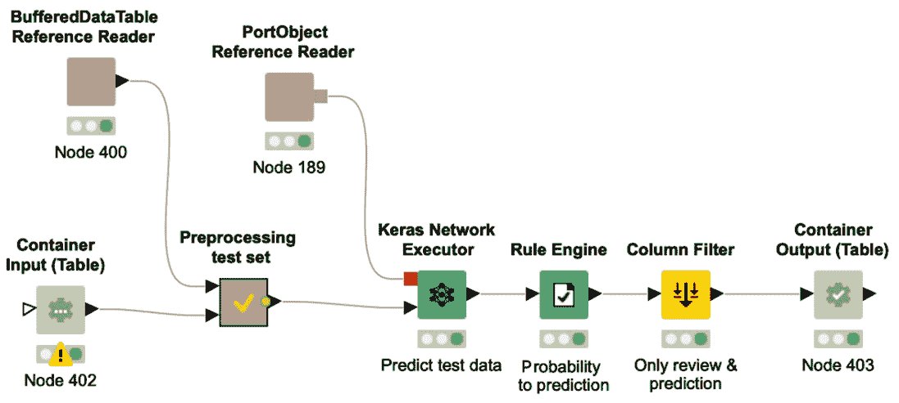

# 第十一章：*第十一章：*最佳实践和其他部署选项

在*第十章*，*深度学习网络的部署*中，我们介绍了部署的概念，并展示了如何构建一个工作流将网络应用于新数据。在本章中，我们将重点介绍使用 KNIME 软件的另外两种部署选项。

本章的第一部分，你将学习如何将深度学习模型部署为一个 web 应用程序，以便最终用户可以通过 web 浏览器执行、交互并控制该应用程序。为了实现 web 应用程序，我们需要介绍 KNIME WebPortal，这是 KNIME Server 的一项功能。组件在 web 应用程序开发中起着核心作用，因为它们用于根据 KNIME 软件的**引导分析**功能实现交互点。在本章中，你还将更多地了解组件。

另一种消费深度学习模型的部署选项是通过 REST 接口的 web 服务。由于 web 服务能够让你在同一生态系统中无缝而轻松地集成和协调多个应用程序，因此它们最近变得非常流行。在本章的第二部分，你将学习如何使用 KNIME 软件构建、部署并调用作为 REST 服务的工作流。

本章的结尾部分，我们将提供一些最佳实践建议以及在使用神经网络和 KNIME 分析平台时的技巧与窍门。这些最佳实践和技巧来源于我们多年来在深度学习项目中的实际经验，其中一些已经在本书中有所描述。

本章的组织结构如下：

+   构建 web 应用程序

+   使用 REST 接口构建 web 服务

+   KNIME 技巧与窍门

# 构建 web 应用程序

在这一部分中，我们将向你展示使用 KNIME 软件构建**web 应用程序**所需的几个步骤。

在简要介绍**KNIME** **WebPortal**之后，我们将展示如何创建复合视图，如何将它们包含在内以创建交互点，以及如何按照**引导分析**原则将应用程序结构化为一系列作为交互点的网页。

作为示例，我们将应用所学的知识，围绕*第九章*，*卷积神经网络在图像分类中的应用*案例研究中的癌细胞分类部署工作流，构建一个 web 应用程序。

## KNIME WebPortal 简介

构建 web 应用程序的第一步是设计并实现工作流中的一系列基于 web 的交互点。在一个癌细胞分类的案例研究中，我们的数据科学家可以构建一个部署工作流，包含两个交互点：一个允许最终用户上传组织病理切片图像，另一个在最终的网页上展示结果。在这两个交互点之间，工作流会摄取新的图像并执行训练好的模型来进行分类。

一旦工作流准备好，它将被转移到生产 **KNIME 服务器**。从此以后，工作流可以通过任何 web 浏览器通过 **KNIME WebPortal** 按需访问。基于 web 的交互方式使病理学家能够控制整个过程，而无需熟悉 KNIME Analytics Platform 或深度学习算法。*图 11.1* 向您展示了这个基于 web 的应用程序可能的样子：

](img/B16391_11_001.jpg)

图 11.1 – 通过 KNIME 工作流实现的 web 应用程序，运行在 KNIME Server 上，并可以通过任何 web 浏览器通过 KNIME WebPortal 调用

在这个例子中，web 应用程序非常简单。它只有两个交互点——即两个网页：第一个用于图像上传，第二个用于查看结果。

可以使用 KNIME Analytics Platform、KNIME Server 和 KNIME WebPortal 的组合，开发更复杂的无代码 web 应用程序。像 Guided Visualization、Guided Labeling 和 Guided Automation 等一些相当复杂且设计精美的 web 应用程序示例，可以从 KNIME Hub 下载（[`hub.knime.com`](https://hub.knime.com)）。

与 KNIME Analytics Platform 相比，KNIME Server 不包含数据操作或模型训练算法。然而，它包含了完整的 IT 基础设施，允许团队成员之间的协作，应用程序的按需和定时执行，定义每个注册用户或用户组的访问权限，模型管理，审计功能，当然还有部署选项，正如我们将在本章中看到的那样。此外，与 KNIME Analytics Platform 相比，KNIME Server 不是开源的，而是需要购买年度许可证。*图 11.2* 显示了 KNIME WebPortal 的登录页面：

图 11.2 – KNIME WebPortal 登录页面

在 KNIME Server 提供的众多 IT 功能中，KNIME WebPortal 允许您通过任何 web 浏览器查看和管理工作流。这个功能看起来很简单，但它可能是数据科学家和最终用户之间缺失的纽带。

重要提示

最终用户是某一领域的专家，通常既没有时间也没有兴趣打开 KNIME Analytics Platform 查看工作流和节点。最终用户所需要的，只是一个在网页浏览器上运行的舒适的 Web 应用程序，且只显示他们需要看到的信息；至少，包括数据上传页面和总结结果的最终页面。

WebPortal 不需要任何特殊安装。它已经随 KNIME Server 的安装预先打包。然而，其外观可以通过专用的*CSS 样式表*轻松定制。KNIME WebPortal 只接受注册用户，并且需要登录（*图 11.2*）。

成功登录后，起始页面会显示您有权限访问的文件夹。导航到您想要开始的工作流，然后点击**运行**（*图 11.3*）：

图 11.3 – 在 KNIME WebPortal 上选择的工作流的起始页面

重要提示

KNIME Server 是 KNIME Analytics Platform 的补充工具。虽然 KNIME Analytics Platform 拥有所有算法和数据操作功能，KNIME Server 提供了团队协作、应用自动化、模型管理和部署选项所需的 IT 基础设施。

让我们来看看工作流如何结构化，以便在 KNIME WebPortal 上创建一个具有定义交互选项的页面序列。

## 创建一个在 KNIME WebPortal 上运行的工作流

在 KNIME WebPortal 上执行工作流时，从一个网页移动到下一个网页。这些页面，也称为向导步骤，为最终用户提供了可视化引导操作的可能性，使其能够与流程进行交互。

现在，如果我们必须从头开始构建所有这些页面/步骤，那将会是漫长且复杂的。幸运的是，有了**组件**。每个页面/步骤只是将组件在底层工作流中的**复合视图**的内容可视化。因此，实际实现 WebPortal 的一系列网页仅仅对应于实现一系列具有所需复合视图的组件。

*图 11.4* 的上半部分展示了在 KNIME WebPortal 上运行的一个应用程序的三个网页：一个从数据库导入客户的表单；一个散点图和一个表格，二者相互连接，用于选择客户；最后是一个展示选定客户信息的页面。*图 11.4* 的下半部分展示了对应的工作流和三个组件。每个组件的复合视图在 KNIME WebPortal 上执行工作流时会生成一个页面：

图 11.4 – 上：在 KNIME WebPortal 上执行应用程序的步骤。下：生成网页的对应工作流

*图 11.4* 中的工作流用作从 web 浏览器执行工作流的步骤示例，并涉及客户数据集。我们将仅使用此数据集，因为它使我们能够展示在组件构建中使用的多种不同功能。此 web 应用程序旨在允许最终用户检查客户数据并选择高风险流失的客户，以便由团队成员联系。

第一个组件，**从数据库获取客户**，创建了左侧的第一页。在这里，最终用户必须提供他们的用户名和密码以连接到数据库。

点击右下角的**下一步**按钮后，工作流会执行直到到达下一个组件**选择要联系的客户**，并创建相应的网页。在此页面上，最终用户可以通过散点图和表格查看客户数据，并选择要联系的客户。选择时，视图提供了两个交互选项：通过左上角的单选按钮选择产品，或使用左下角的范围滑块更改流失分数。散点图和表格会根据新的选择参数自动更新。一旦最终用户对选择满意，他们再次点击**下一步**以进入 web 应用的最后一页。

最后一页由**浏览并下载客户列表**组件创建。在这里，每个选定客户的数据以卡片视图呈现，并可以导出为 Excel 文件。该工作流可在 KNIME Hub 上找到：[`hub.knime.com/kathrin/spaces/Codeless%20Deep%20Learning%20with%20KNIME/latest/Chapter_11/`](https://hub.knime.com/kathrin/spaces/Codeless%20Deep%20Learning%20with%20KNIME/latest/Chapter_11/)。

提示

要打开 KNIME Analytics Platform 中已存在组件的交互视图，执行后，右键点击该组件并选择**交互视图：<组件名称>**。

总结一下，每一页都是由工作流中的一个组件创建的，并显示其交互视图。组件及其复合视图是构建 web 应用工作流的关键元素。

现在让我们看看如何创建和自定义一个复合视图。

## 创建复合视图

组件的复合视图收集了其中包含的**视图**和**小部件**节点的所有交互视图。

提示

要创建一个新组件，您必须选择要包含在组件中的节点，然后右键点击并选择**创建组件...**选项。

在深入查看**视图**和**小部件**节点之前，我们先来看一下**选择要联系的客户**组件（*图 11.5*）：

图 11.5 – 选择要联系的客户组件的内容

在相应页面的左下角，最终用户可以通过滑块定义流失分数的阈值。这个交互式滑块由**交互式范围滑块筛选器小部件**节点创建。

在左上角，选择产品的选项由**交互式值筛选器小部件**节点创建。

此外，页面展示了一个交互式散点图和一个交互式表格。这两个视图分别由**散点图**节点和**表格视图**节点创建。

如你所见，每个小部件/视图节点为最终的复合视图添加一个元素，因此也为 WebPortal 中的相应页面添加内容。

提示

在 KNIME 分析平台中，右键点击节点并选择**交互式视图：<节点名称>**，即可查看每个小部件/视图节点的视图。

可以为复合视图贡献元素的节点可分为三类：

+   **小部件节点**

+   **视图节点**

+   **交互式小部件节点**

让我们详细看看每个类别。

### 小部件节点

小部件节点生成带有交互式表单的视图，用于设置参数。新设置的参数随后作为**流变量**导出，并可以被工作流中其他节点使用。

提示

在*第二章*《使用 KNIME 分析平台进行数据访问和预处理》中，我们介绍了流变量的概念以及它们如何用于覆盖设置选项。

每个小部件节点专门用于生成一种特定的输入或交互表单，如字符串输入、整数输入、从列表中选择一个或多个值等。你可以在节点库的**工作流抽象** | **小部件**中找到所有可用的小部件节点，如*图 11.6*所示：

图 11.6 – 节点库中的可用小部件节点

小部件节点本身可以分为三组：

+   **输入小部件节点**：*输入*类别中的小部件节点在网页上生成一个输入表单，允许你将不同类型的值输入到工作流中——整数、字符串、布尔值、双精度数或列表——以及其他格式的数据，如日期和时间或凭证。

+   **选择小部件节点**：*选择*类别中的小部件节点生成网页表单，用于从列表中选择值，例如从数据表中选择特定列、包括/排除数据集中的多列，或选择一个或多个值以从表中筛选数据。

+   **输出小部件节点**：这些小部件节点向复合视图中添加自定义文本、链接或图像。

作为一个例子，*图 11.7*展示了**单选小部件**节点及其配置窗口：

图 11.7 – 单选小部件节点及其配置窗口

大多数小部件节点共享一些重要的设置，如**标签**、**描述**和**变量名**：

+   **标签**：这将在小部件节点创建的表单顶部创建一个标签。

+   **描述**：该值作为工具提示显示在小部件表单上。

+   **变量名**：这为节点创建的流程变量提供名称。

让我们来看一下**单选小部件**节点的附加配置设置（*图 11.7*）：

+   **选择类型**：定义用于选择的对象：下拉菜单、垂直或水平单选按钮，或列表。

+   **可能的选择**：定义可供选择的值列表。

+   **默认值**：为选择操作分配一个初始默认值。

标准小部件节点产生一些流程变量或一个表格作为输出，可以在工作流中的下游节点中使用。一组特殊的小部件节点是交互式小部件节点。

### 视图节点

视图节点通过交互式图表、图形和表格可视化数据。

*图 11.8* 向您展示了节点库中可用的视图节点概览：

图 11.8 – 节点库中可用的视图节点

如果一个组件中包含多个视图节点，它们的视图将在生成的组件视图中相互交互；例如，通过选择，在一个节点的视图中选择的数据点可以在另一个节点的视图中被选择或甚至被隔离。

提示

**Plotly**节点和**JavaScript**节点位于**实验室**类别中，提供更多的交互式选项，用于在复合视图中可视化数据。来自**本地（Swing）**类别中（本地）节点的视图不能集成到组件的复合视图中。

### 交互式小部件节点

**交互式小部件**节点是特殊的小部件节点。它们实现过滤事件并提供视图节点。在执行过程中，交互式小部件节点的变化会立即反映在后续视图节点的视图中。

在撰写本文时，KNIME Analytics Platform 提供了两个交互式小部件节点：**交互式范围滑块过滤器小部件**节点和**交互式值过滤器小部件**节点。

这些节点可用于触发复合视图中的更新。在下游视图节点的配置窗口中，我们可以设置该节点是否应监听先前交互式小部件节点的过滤事件。如果设置为“是”，当先前交互式小部件节点的过滤事件中的设置发生变化时，由视图节点生成的视图会立即更新。

与标准小部件节点相比，这两个节点会在打开的复合视图或网页中触发直接的过滤事件。标准小部件节点创建的流程变量可以被后续节点使用，但不会在打开的页面或复合视图中触发直接变化。

现在我们已经概览了可用于构建复合视图的节点，让我们通过一些布局选项来定制一个组件的复合视图。

### 定义复合视图的布局

你可以为每个包含至少一个小部件或视图节点的组件定义复合视图的布局。

提示

要在工作流编辑器中以新标签页打开一个组件，必须按住*Ctrl*键并双击组件，或者右键点击组件并选择**组件** | **打开**。

复合视图中的布局通过组件内部的**布局编辑器**进行设置。在工作流编辑器中新标签页打开组件内容后，点击顶部工具栏最右侧的布局编辑器按钮，如*图 11.9*所示：

图 11.9 – 带有布局编辑器按钮的工具栏，位于最右侧

单击布局编辑器按钮后，打开可视化布局编辑器（*图 11.10*）：

图 11.10 – 可视化布局编辑器

布局编辑器使用具有行和列的网格结构。

左侧有不同列数的行模板，以及所有尚未放置的视图列表。右侧是布局编辑器本身。

你可以通过将新行模板从左侧的模板列表拖放到右侧的布局编辑器来更改布局。要添加一个新的空列，请点击布局编辑器中的**+**按钮。行中的列可以手动调整大小。

布局编辑器中的空单元格可以通过将未使用视图从视图列表中拖放到布局编辑器中的单元格来填充。

默认布局仅由一列组成，所有来自小部件和视图节点的视图都从上到下放置在其中。要从空白画布开始，请点击布局编辑器左上角的**清除布局**按钮。此清除操作将所有视图添加到左侧列表中。

提示

节点标签（节点下方的文本）在布局编辑器中用于标识视图。最佳实践是将节点标签更改为有意义的描述，以便在布局编辑器中轻松识别视图。

如果你想将一个节点的视图从复合视图中排除，可以进入布局编辑器的第一个标签，名为**节点使用**，并禁用 WebPortal/复合视图的节点视图。

还可以拥有嵌套组件，即一个组件内嵌另一个组件。如果嵌套组件有视图，它将在布局编辑器中显示为一个节点视图。因此，您可以像处理其他任何节点一样，将嵌套组件的视图集成到您的布局中。

复合视图可以很容易地美化——例如，通过添加一个头部或侧边栏，并对正文进行样式设置。幸运的是，KNIME Hub 上有共享组件可以帮助完成这一点。

*图 11.11* 显示了使用一些共享组件后，网页样式元素前后的变化：

图 11.11 – 没有（左）和有（右）页眉、侧边栏以及页面主体中附加信息的网页

在本节的末尾，当我们构建癌细胞分类示例时，你将看到一些共享组件的实际应用。

让我们首先了解更多关于共享组件的信息。

## 共享组件

在上一节《创建复合视图》中，我们讨论了如何使用组件创建复合视图，并为 WebPortal 应用程序创建页面。组件还可以打包成可重用的功能，并通过 KNIME Hub 和 KNIME Server 与他人共享。这些功能从简单的重复性任务，如将凭证输入数据库，到更复杂的任务，如优化参数，种类繁多。

与元节点相比，组件拥有自己的配置窗口。可以在不触及内部节点的情况下进行配置，这提供了一种便捷的方式来隐藏配置的复杂性。当然，如果需要，你仍然可以打开组件，深入查看细节，并根据你的使用情况进行任何调整。

要在组件的配置窗口中添加设置，可以使用 **配置节点**。它们的工作方式类似于小部件节点，但作用于配置窗口级别，而非复合视图级别。你可以在节点库中找到它们，路径为 **工作流抽象** | **配置**。与任何 KNIME 节点一样，组件也可以在 **描述** 面板中拥有描述。从组件内部，你可以通过点击 **描述** 面板左上角的笔图标来编辑描述。

要使组件变得像其他所有的 KNIME 节点一样，它们必须是共享的。

要共享一个组件，你可以右键点击它并选择 **组件** | **共享…**。

然后，你可以决定将模板保存在哪里：本地工作区、KNIME Hub 或 KNIME Server。

接下来，你可以选择链接类型，将组件实例与组件模板进行关联。链接类型定义了在检查更新时组件模板的位置。选择完组件模板的目标后，会弹出一个对话框询问你选择链接类型：

+   **创建绝对链接**：工作流在查找组件模板时使用绝对路径。

+   **创建挂载点相对链接**：工作流在查找组件模板时，使用从所选挂载点开始的相对路径。

+   **创建工作流相对链接**：工作流在查找组件模板时使用相对路径，该路径从当前工作流文件夹开始。

+   **不要与共享实例创建链接**：一个组件模板已创建，但没有与当前实例建立链接。

    小贴士

    当你将工作流部署到 KNIME 服务器时，请确保组件实例上的所有链接类型在服务器上也能正常工作。

要创建共享组件的实例，只需将组件模板从 KNIME Hub 或 KNIME Explorer 拖放到工作流编辑器中。新创建的实例是只读的，并且与相应的共享组件链接。

每次启动工作流时，KNIME 分析平台会搜索组件模板的可能更新，如果有任何更新，它会建议同时更新该实例。这有一个优点，如果组件模板中发生了变化，实例中的变化会自动反映出来。

小贴士

由于是只读的，新的实例无法编辑。你需要先断开实例与模板的连接才能更改其内容。为此，你需要右键点击组件实例，并选择 **组件** | **断开链接**。

在 EXAMPLES 服务器或 KNIME Hub 上有许多公共共享组件。你还可以在 KNIME Hub 的本章工作流组中找到一些共享组件。

现在你已经熟悉了共享组件和 WebPortal，让我们看看癌细胞分类的部署示例。

## 为癌细胞分类构建 WebPortal 应用程序

让我们回到癌症数据和 *第九章* 中描述的癌细胞分类工作流，*用于图像分类的卷积神经网络*。在这一节中，我们将展示如何使用 KNIME WebPortal 将训练好的深度学习模型部署为一个网页应用程序。

这里的目标是为那些不熟悉 KNIME 分析平台和数据科学的病理学家制作一个网页应用程序。它应该能帮助他们在日常工作中，通过分析组织病理学图像时，提供癌症分类的建议。另一个要求是，能够在不重新启动应用程序的情况下，连续上传多个图像。*图 11.12* 展示了实现该应用程序的工作流。你可以从 KNIME Hub 下载该工作流：[`hub.knime.com/kathrin/spaces/Codeless%20Deep%20Learning%20with%20KNIME/latest/Chapter_11/`](https://hub.knime.com/kathrin/spaces/Codeless%20Deep%20Learning%20with%20KNIME/latest/Chapter_11/)。

首先，让我们关注工作流的中间部分：注释框中的循环体：

图 11.12 – 从网页浏览器部署工作流评分新的组织病理学图像

每次迭代时，都会上传一张图像，生成分类，并向病理学家展示两个网页。循环负责迭代和循环体中的两个组件——**上传图像**组件和**查看结果**组件——的网页：

图 11.13 – 上传图像组件内的工作流及其创建的网页

循环体从**上传图像**组件开始，该组件创建了 Web 应用程序的第一个网页。您可以在*图 11.13*中看到创建的页面以及组件内部的情况。

网页的头部，由 KNIME 徽标和导航路径组成，是由名为**WebPortal Header**的共享组件创建的。对于具有多个步骤的 WebPortal 应用程序，这样的头部有助于最终用户概览当前步骤（在框架中）、已经完成的步骤（黄色框或浅灰色框）以及尚未完成的步骤（灰色框）。

**WebPortal Header**组件左下角的小绿箭头表示该组件实例与共享组件模板相连。**WebPortal Header**组件带有一个配置窗口（*图 11.14*），这是由其中的配置节点生成的。在该配置窗口中，您可以定义步骤标签，并设置是否用黄色框突出显示当前步骤：

图 11.14 – WebPortal Header 组件的配置窗口

**上传图像**步骤的网页仅包含一个项目，用于上传下一张图像。通过点击**选择文件**按钮，病理学家将含有组织病理切片图像的文件上传到临时本地文件夹。该项目由**文件上传控件**节点创建。该节点的输出变量包含指向临时文件夹中所选图像的文件路径。

在*图 11.12*中的工作流中，流变量通过**Variable to Table Row**节点写入一个表格。**加载和预处理图像**元节点执行与训练时相同的预处理步骤，如在*第九章*中所述，*卷积神经网络用于图像分类*。也就是说，它加载图像，进行归一化处理，将其分割为 64x64 像素的小块，并交换某些维度，以适应作为迁移学习起点的 VGG16 模型。

接下来，工作流使用**Keras 网络读取器**节点读取训练好的深度学习网络，并通过**Keras 网络执行器**节点将其应用于图像小块。

在**准备可视化**元节点中，根据图像属于三类癌症之一的概率，为图像小块分配颜色。

最后，结果通过最后一个组件**查看结果**进行可视化。*图 11.15*展示了该组件内部的工作流以及在浏览器中执行工作流后获得的相应网页：

图 11.15 – 查看结果组件内部的工作流片段及其创建的网页

在**查看结果**组件中，我们再次发现共享的**WebPortal Header**组件，用于创建页面头部，这一次带有**上传图片**框（过去步骤）和**结果**框（当前步骤），黄色框架。

**表格到图像**节点将选定列的第一行中的图像转换为图像对象。然后，该图像对象被传入**图像输出小部件**节点，在复合视图中显示出来。

最后，病理学家必须决定是否上传另一张图片。这个选择部分通过单选按钮在网页上实现，并通过**单选小部件**节点在工作流中实现。

这个节点在其输出端口生成一个带有选定选项的流变量：

图 11.16 – 变量条件循环结束节点的配置窗口

整个片段，从**上传图片**到**查看结果**，被包装在一个循环中，以满足额外的需求，给病理学家提供上传多张图片的选项。最后的单选按钮选择作为循环停止的标准。

提示

请记住，循环始终需要一个循环开始节点和一个循环结束节点。在这两个节点之间是循环体，它会在每次循环迭代时执行。

有许多不同的循环开始和循环结束节点可供选择。例如，有些节点每次迭代时只使用一部分行（**分组循环开始**和**块循环开始**），有些节点则只使用一部分列（**列列表循环开始**）。

*图 11.12* 中的工作流使用 `keepgoing` – 由 `No` 创建。由于**通用循环开始**节点始终需要输入表格，因此使用**空表创建器**节点创建了一个空表来喂给该节点。

在将此工作流部署到 KNIME 服务器并在 KNIME WebPortal 上运行后，病理学家可以轻松地上传新图像并获得自动分类的结果。

在本节中，您已经了解了如何使用 KNIME 软件构建 Web 应用程序，并且了解了如何将深度学习网络作为 Web 应用程序进行部署。

现在让我们来看看如何将深度学习网络作为 REST 服务进行部署。

# 使用 REST 接口构建 Web 服务

在本节中，您将学习如何使用 KNIME 软件构建**REST**服务。作为实际示例，我们将通过*第七章*中的情感分析示例的部署工作流进行讲解，*实现自然语言处理应用程序*。

KNIME 服务器 REST API 为非 KNIME 应用程序提供了一个接口，通过简单的 HTTP 请求与 KNIME 服务器进行通信。**RESTful Web 服务**的主要好处是它可以轻松地将应用程序集成到企业的 IT 环境中。自包含和独立的应用程序可以通过 REST 接口相互调用并交换数据。通过这种方式，向生态系统中添加新应用程序变得更加容易。

在 KNIME 服务器上上传的任何工作流都会通过**REST API**自动提供。这使得您能够通过 REST API 将 KNIME 工作流无缝部署为 Web 服务，并将其集成到数据科学实验室的基础设施中。

在情感分析示例中，我们希望将深度学习网络部署为**REST 服务**。通过这种方式，外部应用程序——例如，网站或移动应用——可以将一些文本发送到 REST 服务，并返回预测的情感。

让我们快速了解一下在 KNIME 分析平台中将部署工作流作为 REST 服务所需的步骤。

## 构建 REST 服务工作流

在情感预测示例中，目标是构建一个具有输入（新的电影评论）和输出（情感预测）的 REST 服务。

在构建有输入和输出的 REST 服务时，我们需要定义输入和输出的结构。在 KNIME 分析平台中，这可以通过**容器**输入和输出节点来完成。

重要说明

并非所有的 REST 服务都有输入和输出。例如，一个连接到数据库以获取最新数据的 REST 服务只有输出。一个通过将结果写入数据库来结束过程的 REST 服务则不需要输出任何结果。

KNIME 分析平台提供了多种输入节点，可以用来定义 REST API 的输入结构。您可以在节点库中的**工作流抽象** | **工作流调用**下找到这些节点（*图 11.17*）：

图 11.17 – 定义 REST API 的可用容器节点

如*图 11.17*所示，有四个**容器输入**节点——用于凭证、仅用于一行数据、用于数据表或用于流变量。表格输入允许您将单行数据或多行数据发送到 Web 服务。另一方面，行输入仅发送一行数据。

**容器输入（行）**和**容器输入（表格）**节点具有一个可选的输入端口。该端口接收一个模板数据表，并基于该表格定义输入结构。此模板有两个作用：首先，如果在通过 REST API 调用工作流时未提供输入表格，则使用模板中的值作为默认输入来执行工作流。其次，表格用于定义 Web 服务期望的输入结构。如果当前输入的结构与模板不同，Web 服务将产生错误信息。这种模板技术的优点是输入会自动解析并转换为指定的类型。

同样，若要定义 REST 服务的输出，可以使用其中一个**容器输出**节点：**容器输出（行）**节点或**容器输出（表格）**节点。

对于我们的部署工作流，为了对一次电影评论进行分类，我们使用了**容器输入（行）**节点来定义输入结构，并使用**容器输出（行）**节点来定义输出结构以传递给 REST 服务。为了同时分类一条或多条电影评论，可以使用**容器输入（表格）**节点和**容器输出（表格）**节点。

创建可以作为 REST 服务部署的工作流有两种方法：

+   通过**集成部署**功能自动化

+   手动从头构建工作流

在*第十章*，*部署深度学习网络*中，我们介绍了 KNIME Analytics Platform 的**集成部署**扩展，该扩展允许你捕获训练工作流的部分并自动部署它们。即使在此，我们也以情感分析案例研究为例。在*图 11.18*中，你可以看到通过**集成部署**自动创建的工作流，其中包括一个**容器输入（表格）**节点和一个**容器输出（表格）**节点，用于定义输入和输出数据结构：

图 11.18 – 从*第十章*《部署深度学习网络》自动创建的部署工作流

在*第十章*，*部署深度学习网络*中，我们将这个自动创建的工作流保存在本地，并通过**调用工作流（基于表格）**节点触发其执行。我们也可以选择不将工作流保存到本地，而是将其部署到 KNIME 服务器上。

另一种选择是从头手动构建一个 REST 服务。在这种情况下，我们必须提供字典和训练好的模型（*图 11.19*）：

图 11.19 – 手动构建的 REST 服务部署工作流

如你所见，它看起来与*图 11.18*中的工作流非常相似，唯一的区别是它使用了**Table Reader**节点和**Keras 网络读取器**节点来读取字典和训练好的模型。此外，已经插入了一个模板表来定义 REST API 的输入数据结构。

我们已经有了 REST 服务。接下来，看看如何调用它。

### 调用 REST 服务

要从外部应用程序调用已部署的工作流作为 REST 服务，你需要知道 REST 服务的路径以及预期的输入数据结构。KNIME 服务器可以在浏览器中显示 API 定义。只需右键点击服务器上已部署的工作流并选择**显示 API 定义**。浏览器窗口将打开，显示该特定工作流的 REST API 定义（*图 11.20*）：

图 11.20 – 使用 Swagger 的 REST API 文档

这个网页是使用一个名为**Swagger**的开源框架创建的。Swagger 已被集成到 KNIME 服务器中，用于文档化 REST API，方便地浏览不同的 HTTP 请求并进行测试。

例如，你可以测试如何通过**POST**请求触发 REST 服务的执行。通过选择 POST 请求，Swagger 会显示可能的参数概览、输入数据的架构以及调用的 URL。你还可以点击**尝试一下**按钮来进行测试。

你还可以通过使用**调用工作流（基于表格）**节点从另一个工作流中触发 REST 服务的执行。该节点可以调用本地或远程工作流，发送提供的输入表并输出 REST 服务的响应。

*图 11.21*中的工作流展示了如何在 KNIME 服务器上触发 REST 服务的执行：

图 11.21 – 此工作流触发在 KNIME 服务器上执行 REST 服务

如果你想在 KNIME 服务器上运行工作流，你必须确保**调用工作流**节点已连接到服务器。要连接到 KNIME 服务器，可以使用**KNIME 服务器连接**节点。在其配置窗口中，你需要提供服务器的地址，可以手动输入或选择一个挂载点并输入凭据。

在**调用工作流（基于表格）**节点的配置窗口中，你可以通过点击**浏览工作流**按钮查看所有在 KNIME 服务器上部署的工作流。选择工作流后，在高级设置中，你可以将输入表分配给被调用工作流的输入，将输出表分配给被调用工作流的输出。当部署的工作流有多个输入节点时，这个功能非常方便。

在本节中，你学习了如何将工作流部署为 KNIME Server 上的 REST 服务。现在，让我们通过一些来自我们自身经验的小贴士来做个总结。

# KNIME 小贴士与技巧

在本书中，我们讨论了许多使用 KNIME Analytics 平台实施的案例研究。在本书的 KNIME Hub 空间中，你可以找到这些工作流，并可以将它们作为深度学习项目的起点：[`hub.knime.com/kathrin/spaces/Codeless%20Deep%20Learning%20with%20KNIME/latest/`](https://hub.knime.com/kathrin/spaces/Codeless%20Deep%20Learning%20with%20KNIME/latest/)。在最后一节中，我们将分享一些在 KNIME Analytics 平台中进行深度学习的技巧与窍门。

让我们从训练数据的洗牌开始。

## 训练过程中洗牌数据

在训练神经网络时，为了加速训练过程的收敛并避免过拟合，建议在每个训练周期前对训练数据进行洗牌。

为此，确保在**Keras Network Learner**节点的配置窗口的**高级**标签中激活**每个训练周期前洗牌训练数据**复选框。

## 使用批量归一化

批量归一化是一种标准化每个批次数据的技术。这一技术有助于稳定学习过程，并显著减少训练深度网络所需的训练周期数。

要向你的网络添加批量归一化，你可以使用**Keras 批量归一化层**节点。

## 保持工作流的整洁和结构化

为了方便维护你的工作流，重要的是要以逻辑清晰、易于理解的块状结构来记录和组织它们：

+   **使用元节点和组件**：为了保持大型工作流的整洁，建议将实现细节和一些复杂性隐藏在元节点或组件中。事实上，为了让工作流在初次查看时就能容易理解，你可以为项目中的每个步骤创建一个元节点或组件，如数据访问、数据预处理、模型训练和模型评估。在每个元节点/组件内部，你还可以进一步创建元节点和组件来表示不同的子步骤，例如不同的预处理步骤或网络层。

+   **记录工作流**：KNIME Analytics 平台为你提供了三种记录工作流的方法：

    **a) 节点标签**

    **b) 注释框**

    **c) 工作流描述**

节点标签和注释框可以帮助你和其他用户一眼理解工作流的任务和子任务。

也可以通过**描述**面板向你的工作流添加元信息。为此，点击工作流编辑器中的任意位置（不要点击节点）。**描述**视图会切换为工作流描述，显示有关工作流的元信息：标题、描述以及相关链接和标签。

## 使用 GroupBy 节点和 Pivoting 节点来避免循环

循环的执行可能较慢，因为每次迭代时都必须执行节点。然而，通常由于我们编程背景的原因，我们会过度使用循环，甚至在有更高效的替代方案时也使用它们。

例如，可以通过简单地使用以下聚合节点来避免一些循环：**GroupBy**、**Pivoting**、**Ungroup** 和 **Unpivoting**。**Aggregation** 节点通常执行与循环相同的任务，并且在执行速度上更为高效。

## 指定执行顺序

当工作流中有并行分支时，有时需要定义执行顺序。*图 11.22* 向你展示了一个非常简单的例子，强制执行将表格写入 Excel 表格的顺序：

图 11.22 – 在此工作流中，使用流变量连接强制执行顺序。

当然，**Excel Sheet Appender (XLS)** 节点应在 **Excel Writer (XLS)** 节点之后执行。通过使用从 **Excel Writer (XLS)** 节点的流变量输出端口到 **Excel Sheet Appender (XLS)** 节点的流变量输入端口的流变量连接，我们强制 **Excel Sheet Appender (XLS)** 节点仅在 **Excel Writer (XLS)** 节点执行完成后才开始执行。

# 总结

在本章中，你了解了部署已训练的深度学习网络的另外两种选项：Web 应用程序和 REST 服务。我们以一些成功使用 KNIME Analytics Platform 进行深度学习的技巧和窍门结束了这一章——也是结束了本书。

在本章的第一部分，你学习了如何使用 KNIME Server 的 KNIME WebPortal 构建 Web 应用程序，以便最终用户可以方便地通过 Web 浏览器执行他们的工作流并与网页互动。

接下来，你学习了如何使用 KNIME Server 构建、部署和调用 REST 服务，将深度学习网络集成到公司的 IT 基础设施中。你了解了定义 REST 服务输入和输出数据结构的多种选项，如何使用开源 Swagger 工具检查 REST API，以及如何从 KNIME Analytics Platform 内部触发 REST 服务的执行。

在最后一节中，我们整理了一些来自我们自身经验的技巧和窍门，这些技巧在使用 KNIME Analytics Platform 进行深度学习时可能会非常有用。

此时，我们认为你已经掌握了足够的知识，能够开始使用 KNIME 软件构建和部署自己的工作流，以训练和使用适合你自己业务案例和数据的深度学习网络。

# 问题与练习

1.  你可以使用哪种类型的节点向复合视图添加输入字段？

    a) 配置节点

    b) 小部件节点

    c) 视图节点

    d) 容器输入节点

1.  如何创建复合视图？

    a) 通过选择一些节点，右键点击，选择**创建元节点**  

    b) 通过选择一些视图或小部件节点，右键点击，选择**创建元节点**  

    c) 通过选择一些视图或小部件节点，右键点击，选择**创建组件**  

    d) 通过在工作流中的任意位置右键点击并选择**创建组件**  

1.  如何定义复合视图的布局？  

    a) 右键点击组件并选择**组件** | **布局**  

    b) 双击组件并进入配置窗口中的**布局**标签  

    c) 进入组件内部，点击工具栏中的**布局**按钮  

    d) 右键点击组件并选择**布局**  

1.  哪个节点可以用来定义 REST 服务的输入和输出？  

    a) 配置节点

    b) 小部件节点  

    c) 查看节点  

    d) 容器节点  
