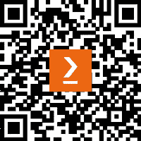

# 前言

*《ChatGPT 和会计人员的 AI》* *是一本全面指南，探讨了生成式人工智能（**GAI**）在会计中的变革潜力。它深入探讨了 AI 如何增强会计的各个方面，从实践管理和税务应用到欺诈检查和* *公司治理* *。

# 本书面向的对象

本书主要面向金融专业人士、会计商业教育工作者、学生和那些希望在他们的专业或个人生活中理解和应用 AI 的爱好者。假设读者对会计环境原则有基本了解。虽然熟悉 AI 概念可能有益，但这不是必需的，因为本书面向所有技术水平的用户*。

# 本书涵盖的内容

*第一章**，生成式人工智能（GAI）：了解这项技术*，介绍了 GAI 及其在会计中的潜在应用。

*第二章**，利用这项技术增强实践管理*，探讨了 AI 如何简化并优化会计实践管理。

*第三章**，在税务领域应用 AI*，讨论了 AI 在高效和准确地进行税务计算和合规性方面的应用。

*第四章**，利用 AI 增强审计*，深入探讨了 AI 如何通过提供更准确和及时的信息来改善审计流程。

*第五章**，将 AI 与欺诈检查和法医会计整合*，考察了 AI 如何帮助检测和预防欺诈活动。

*第六章**，利用 AI 加速财务分析和预测*，展示了 AI 如何增强财务分析和预测。

*第七章**，利用 AI 推进管理会计*，讨论了 AI 在管理会计中的整合，以实现更好的决策。

*第八章**，通过 AI 视角看会计信息系统（AIS）*，提供了 AI 如何转型传统 AIS 的见解。

*第九章**，AI 驱动的数据分析：使用数据可视化工具和仪表板*，探讨了 AI 在会计中的数据分析和可视化应用。

*第十章**，道德和安全 AI 影响*，讨论了在会计中使用 AI 的道德考虑和安全性影响。它提供了如何负责任和安全地使用 AI 的指南。

*第十一章**，利用 AI 革新公司治理*，探讨了 AI 如何通过提供实时洞察和预测分析来革新公司治理，以做出更好的决策。

*第十二章**，Web 增强版 ChatGPT：借助插件提升能力*，介绍了 ChatGPT 中插件的概念以及它们如何增强其功能，特别是在会计领域的应用。

*第十三章**，克服阻力，拥抱变革*，讨论了会计领域对人工智能采纳的常见阻力，并提供了克服这种阻力、拥抱变革的策略。

*第十四章**，人工智能时代的终身学习*，强调了在人工智能时代持续学习的重要性。它提供了资源和方法，以保持对人工智能和会计最新发展的了解。

*第十五章*，*未来已来：将人工智能融入会计*，通过讨论会计领域人工智能整合的现状和展望未来可能性来结束本书。它为会计专业人士提供了一条成功将人工智能融入其工作的路线图。

# 要充分利用本书

读者应具备会计原则的基本理解。熟悉人工智能概念可能有益，但不是强制性的。本书的结构旨在逐步介绍人工智能及其在会计中的应用，使其适合初学者和那些对人工智能有一定了解的人。

| **本书涵盖的软件/硬件** | **操作系统要求** |
| --- | --- |
| ChatGPT | 任何带有网络浏览器的现代操作系统 |
| 数据可视化工具和仪表板 | 任何带有网络浏览器的现代操作系统 |

免责声明

软件和硬件要求旨在尽可能包容。本书中讨论的大多数工具和平台都是基于网络的，因此您可以在任何有互联网连接和现代网络浏览器的设备上访问它们。

注意：

作者承认使用了如 ChatGPT 等尖端人工智能，其唯一目的是为了增强书中的语言和清晰度，从而确保读者有一个顺畅的阅读体验。需要注意的是，内容本身是由作者创作并由专业出版团队编辑的。

# 联系我们

欢迎读者反馈

**一般反馈**：如果您对本书的任何方面有疑问，请通过电子邮件发送至 customercare@packtpub.com，并在邮件主题中提及书名。

**勘误表**：尽管我们已经尽最大努力确保内容的准确性，但错误仍然可能发生。如果您在这本书中发现了错误，我们非常感谢您能向我们报告。请访问[www.packtpub.com/support/errata](http://www.packtpub.com/support/errata)并填写表格。

**盗版**: 如果你在网上任何形式下遇到我们作品的非法副本，如果你能提供位置地址或网站名称，我们将不胜感激。请通过版权@packt.com 与我们联系，并提供材料的链接。

**如果你有兴趣成为作者**：如果你在某个领域有专业知识，并且你感兴趣的是撰写或为书籍做出贡献，请访问[authors.packtpub.com](http://authors.packtpub.com)。

# 分享你的想法

一旦你阅读了《ChatGPT 和会计人员的 AI》，我们很乐意听到你的想法！请[点击此处直接进入该书的亚马逊评论页面](https://packt.link/r/1835466532)并分享你的反馈。

你的评论对我们和科技社区都很重要，并将帮助我们确保我们提供高质量的内容。

# 下载这本书的免费 PDF 副本

感谢你购买这本书！

你喜欢在路上阅读，但无法携带你的印刷书籍到处走吗？

你的电子书购买是否与你的选择设备不兼容？

别担心，现在每购买一本 Packt 书籍，你都可以免费获得该书的 DRM 免费 PDF 版本。

在任何地方、任何设备上阅读。直接从你最喜欢的技术书籍中搜索、复制和粘贴代码到你的应用程序中。

优惠远不止于此，你还可以获得独家折扣、时事通讯和每日免费内容的访问权限。

按照以下简单步骤获取优惠：

1.  扫描下面的二维码或访问以下链接

[`packt.link/free-ebook/9781835466537`](https://packt.link/free-ebook/9781835466537)

1.  提交你的购买证明

1.  就这些！我们将直接将你的免费 PDF 和其他优惠发送到你的电子邮件。
