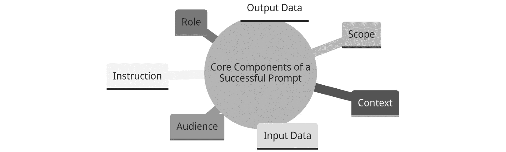
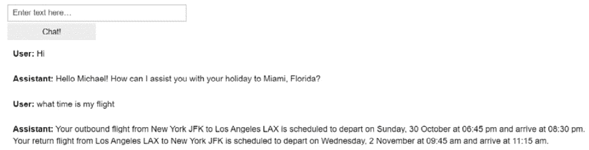

# 第四章：使用 ChatGPT 进行提示工程

在本章中，我们将把重点转向 ChatGPT 的提示工程艺术和科学，这是任何希望充分发挥对话式 AI 潜力的人的关键技能集。我们将剖析提示的结构、语气和复杂性，探讨它们如何影响模型的响应。

你将学习如何制作出适合专业对话的提示，我们还将分享一些技巧，以在不使模型感到不知所措的情况下引入复杂性。我们还将深入研究段落和项目符号的战略使用，以增强可读性和理解力。

此外，我们还将讨论如何在提供充分上下文的同时，保持提示的简洁性。对于那些想要扮演特定角色的人来说，我们将提供通过提示模仿对话式 AI 工程师专业知识的见解。

到本章结束时，你将准备好制作出能够引发准确和上下文相关的响应，同时提升 ChatGPT 能力到新高度的提示。

在本章中，我们将涵盖以下关键领域：

+   通过提示工程的概念

+   理解成功提示的核心组件

+   使用提示工程策略

+   了解提示工程技巧

本章旨在成为你掌握提示工程的终极指南，使你能够更有效、更细致地与 ChatGPT 互动。

# 技术要求

在本章中，我们将广泛使用 ChatGPT，因此你需要注册一个免费账户。如果你还没有创建账户，请访问[`openai.com/`](https://openai.com/)，然后在页面右上角点击**开始使用**，或者访问[`chat.openai.com`](https://chat.openai.com)。

为了执行本章中演示的示例，我建议除非另有说明，否则请通过网页或移动应用使用 ChatGPT。

最后一个示例技术需要安装 Python 3.9 和 Jupyter Notebook，请使用以下链接：[`jupyter.org/try-jupyter/notebooks/?path=notebooks/Intro.ipynb`](https://jupyter.org/try-jupyter/notebooks/?path=notebooks/Intro.ipynb)。

# 通过提示工程的概念

随着大型语言模型（LLMs）及其能力的兴起，提示工程已成为一门新学科，似乎每个人都正在谈论它。我们可以利用提示工程来帮助我们使用 LLMs 处理各种任务，从常见的问答到与其他系统的更复杂集成。对于任何使用 LLMs 的人来说，掌握这项技能是非常重要的。

那么，提示工程到底是什么呢？简单来说，提示工程是创建最优化输入以从与 LLMs 的交互中获得最大收益。因此，你的提示结构越好，输出的结果就会越好。

如果你发送模糊的提示，那么现实是你会得到模糊或不正确的结果。确实，提供一个简单的在线提示通常会得到一些有趣的结果。然而，它们不太可能是你希望得到的结果，尤其是如果你在寻找完成更复杂任务的话。

这里是一个简单提示语的例子。尝试用 ChatGPT 来试试：

```py
Tips on conversation design
```

好的，这确实返回了一些有用的信息。然而，如果我们想要返回更精确的结果，我们可以做得更好：

```py
"Suggest methods to enhance a conversation design to better capture and retain user engagement, with a particular focus on utilizing empathetic language and providing meaningful responses."
```

在这个改进的提示语中，我们提供了更多的清晰度和具体性，以确保 AI 的帮助能够指向我们感兴趣的对话设计领域。

构建一个成功的提示语不仅仅是提出正确的问题，还涉及到向 LLM 提供足够的信息以创建正确的答案，并确保一切都在 LLM 理解的理想格式中。提示工程完全在于根据你试图完成的任务了解使用哪些技术。

在下一节中，让我们首先看看提示语的不同组成部分，并考虑其他具体细节，例如最佳格式。

# 理解成功提示语的核心组件

没有一种万能的提示语可以保证成功。每个你想要执行的任务都是不同的，因此所需的提示语也是不同的。然而，由于模型训练的方式和用于训练它们的数据，有一些规则需要遵循以获得最佳结果。在*第二章*中，我们探讨了 ChatGPT 在对话设计任务中的应用。这包括提供详细的提示，包括成功提示的一些关键组成部分。是的，你已经进行了一些广泛的提示工程，并使用了以下列表中概述的一些核心提示组件：

+   **指令**：指定要采取的行动，通常通过输入动词（如设计或编写）来启动

+   **上下文**：提供额外的信息以指导模型，例如环境或目的

+   **范围**：缩小任务的重点，指定要涵盖的查询或主题类型

+   **角色**：定义 AI 应操作的能力，例如专家或客户服务代表

+   **受众**：表明预期输出接收者的知识水平和兴趣

+   **输入数据**：指定任务中要使用的数据，通常由分隔符分隔

+   **输出数据**：详细说明预期输出格式和结构，指导 AI 的响应

下一个图示说明了有助于构建成功提示语的核心组件：



图 4.1 – 成功提示语的核心组件

让我们更详细地看看成功提示语的关键组成部分。

## 指令

为你的提示给出明确的指令。一个好的做法是以动词开始提示，例如设计、草拟、创建、生成、撰写或制作。这样，ChatGPT 应该能确切地知道你希望它如何回应，并且没有误解的空间。同时，告诉 ChatGPT 你期望在回复中看到什么，例如对话流程、网站文案、博客文章、聊天记录或描述。

让我们看看一个例子提示，要求 ChatGPT 给我们一个聊天机器人对话示例：

```py
"Design a conversation flow for a customer service chatbot that handles product returns and exchanges, focusing on a friendly and efficient user experience"
```

在这个提示中，我们给出了一个精确的指令：`设计一个对话流程`。因此，指令越清晰、越精确，留给 ChatGPT 猜测你试图完成的事情就越少。

## 上下文

为了改进提示，我们可以在第一条指令之外提供更多信息。让我们通过提供一些上下文来继续这个例子，以指导模型理解我们对话设计请求的需求和目的：

```py
"Design a conversation flow for a customer service chatbot"
```

我们在我们的提示中添加了`for a customer service chatbot`。这应该有助于 ChatGPT 定制聊天机器人的对话和动作。因此，通过额外的上下文，我们可以引导模型理解对话流程将使用的环境。

## 范围

就像任何项目概要或工作说明书一样，向 ChatGPT 提供更多关于任务范围的信息是有意义的。在我们的案例中，我们的对话设计是为客户服务聊天机器人，这可能涉及任何类型的请求，从常见问题解答到投诉或退货。因此，让我们提供一个范围，以便我们可以专注于我们正在为哪些类型的查询进行设计：

```py
"Design a conversation flow for a customer service chatbot that handles product returns and exchanges"
```

希望通过向 ChatGPT 提供`处理产品退货和换货`，我们可以确保模型专注于生成与产品退货和换货相关的对话流程，避免离题的偏离。

## 角色

成功提示最重要的组成部分之一是角色组件。为 ChatGPT 提供一个角色，以指定 AI 在生成响应时应采取的能力。例如，你可以要求它扮演专家或具有特定的观点或能力：

```py
Act as a first line customer service representative and provide assistance on how to troubleshoot technical problems with the SAAS. Please ensure a professional tone and intermediate level of complexity in your response.
```

将此角色作为你提示的一部分将引导 ChatGPT 驱动的客户支持聊天机器人的语言和行为。在提供角色时，重要的是要具体、清晰且相关。记住，我们在*第二章*的*创建我们的用户和聊天机器人角色*部分探讨了提供更复杂的角色细节。

根据你的任务，提示中未定义的角色可能导致响应泛化或模糊，缺乏所需的关注或专业性。

## 受众

在你的提示中指定受众细节可以显著定制输出。例如，考虑以下提示：

```py
"Explain the principles of machine learning to a technical audience."
```

这可能结果是一个深入的解释，使用技术术语并讨论算法、数据训练、验证和背后的数学原理。

如果你想为更广泛的受众创建内容，你可以尝试以下类似的方法：

```py
Explain the principles of machine learning to a general audience.
```

预期的输出将是一个使用通俗易懂的语言进行简化的解释，避免使用技术术语。

通过在提示中包含受众的具体信息，你可以使 ChatGPT 的响应与目标接收者的知识水平和兴趣相匹配。

## 输入数据

输入数据通常是你的提示的重点。这可以是文本或其他格式的数据。

在提示的开头放置指令。如果你在提示中包含了 ChatGPT 用作提示部分的具体数据，使用某种分隔符是一种好的做法。我发现使用`###`或`"""`来分隔指令和输入数据效果很好：

```py
Summarize the conversation delimited with triple hashes
Conversation: ###{conversation}###
```

这里是一个示例，这个提示提供了我们的输入对话数据作为纯文本：

```py
Summarize the conversation below as a bullet point list of the most important points. The conversation is delimited with triple hashes
Conversation: ###
User: Hi, I'd like to return a product I purchased last week.
Chatbot: Of course, I can aid with that. May I have your order number, please?
User: Sure, it's 12345.
Chatbot: Thank you. I found your order. May I ask the reason for the return?
User: The product has a defect and doesn't work properly.
Chatbot: I apologize for the inconvenience. I can process the return for you. Would you like a refund or an exchange?
User: I'd prefer an exchange.
Chatbot: Great! I've started the exchange process. You'll receive an email with further instructions shortly.
User: Thank you!
###
```

ChatGPT 擅长分析各种输入类型，如**JavaScript 对象表示法**（**JSON**）、**超文本标记语言**（**HTML**）、**可扩展标记语言**（**XML**）、图像、标记和纯文本等。例如，如果你的对话数据存储为 JSON，你可以简单地将其传递到你的提示中：

```py
Summarize the conversation below as a bullet point list of the most important points. The conversation is delimited with triple hashes
Conversation: ###
{
"conversation": [
  {
    "speaker": "User",
    "message": "Hi, I'd like to return a product I purchased last week."
  },{
    "speaker": "Chatbot",
    "message": "Of course, I can assist with that. May I have your order number, please?"
  },{
    "speaker": "User",
    "message": "Sure, it's 12345."
  }]
}
###
```

确保输入数据的格式和结构的一致性对于获得可靠的响应至关重要。

一旦你提供了正确的输入，告诉 ChatGPT 它应该提供什么作为输出是很重要的。让我们看看下一个例子。

## 输出数据

指定预期的输出数据和详细程度，可以引导 AI 生成符合你要求的结果。我们可以提供详细的说明，说明我们想要的输出是文本、格式化数据还是代码。

为了获得最佳结果，明确定义所需输出的结构和格式是明智的。这可能包括指定使用数组、对象或其他数据结构来组织信息。也可能涉及定义属性或键的命名约定，确保输出标准化和可预测，从而简化数据提取和进一步处理，如果你计划在软件或管道中使用你的响应。你已经在许多例子中广泛应用了这种做法，当我们要求 ChatGPT 返回 JSON 数据时，在*第二章*。

### 简单文本

让我们看看更多的例子。在这个简单的例子中，我们要求以项目符号列表的形式输出文本：

```py
Summarize the conversation delimited with ### as a bullet point list of the most important points which should be no more than 150 characters each.
Conversation: ###{conversation}###
```

### 输出特定格式或代码

另一个技巧是指定编号的表格，例如，使用以下方式：

```py
Please can you create a numbered table of the components of a successful chatbot for a technical audience.
```

你可以用后续问题来引用编号的项目：

```py
can you provide more detail on number 3
```

我们也可以要求 ChatGPT 返回更复杂的特定格式，例如 HTML 中的表格数据：

```py
Create a table summarizing the chatbot's performance across four metrics (User Engagement, Response Accuracy, Processing Time, and User Satisfaction) over a span of three months. Output the table as HTML. The metrics are as follows:
- User Engagement: Jan: 1200 interactions, Feb: 1300 interactions, Mar: 1400 interactions
- Response Accuracy: Jan: 85%, Feb: 87%, Mar: 90%
- Processing Time: Jan: 1.2 seconds, Feb: 1.1 seconds, Mar: 1.0 second
- User Satisfaction: Jan: 80%, Feb: 82%, Mar: 85%
Include a column for the average across the three months for each metric.
```

你还可以更进一步，要求特定的格式以及基于我们选择的格式，最佳输出是什么。在下一个例子中，我们将要求 ChatGPT 提供 Vega-Lite（视觉分析的高级语法）：

```py
The following is data delimited in ### summarizing a chatbot's performance across four metrics (User Engagement, Response Accuracy, Processing Time, and User Satisfaction) over a span of three months.
Please can you create this for vega lite representation for this data?
Include a column for the average across the three months for each metric.
###
- User Engagement: Jan: 1200 interactions, Feb: 1300 interactions, Mar: 1400 interactions
- Response Accuracy: Jan: 85%, Feb: 87%, Mar: 90%
- Processing Time: Jan: 1.2 seconds, Feb: 1.1 seconds, Mar: 1.0 second
- User Satisfaction: Jan: 80%, Feb: 82%, Mar: 85%
###
```

另一个指定输出的好例子是指导 ChatGPT 查看非结构化数据并将其转换为我们可以用于进一步管道或软件应用的输出。在以下示例中，我们将请求 JSON 并指定我们想要创建的属性，以及添加一个用于填充情感的属性：

```py
Please look at these live chat transcripts and create JSON for this conversation as a list of message objects, add one extra property which will include sentiment for each message:
[2023-10-09 08:00:00] User: What's the weather like today?
[2023-10-09 08:00:05] Virtual Assistant: Today's forecast is cloudy with a high of 68°F and a low of 52°F. There's a 60% chance of rain in the afternoon.
[2023-10-09 08:01:00] User: Do you have any suggestions for indoor activities?
[2023-10-09 08:01:05] Virtual Assistant: Certainly! You might consider reading a good book or visiting a local museum. Both activities are excellent ways to spend a rainy day indoors.
```

LLM 的输出可能不一致，列表等结果可能脆弱，因此如果你想在软件或管道中使用输出，通常建议返回 JSON。

正如你所看到的，输出可以是几乎任何东西，因此仔细指定我们希望 ChatGPT 提供的确切内容是有意义的。

## 结论

一个提示并不需要所有这些元素，其格式根据你想要完成的特定任务而变化。还值得注意的是，相同的提示组件可以与任何大型语言模型（LLM）一起使用。

尽管这些组件并不全面，但它们应该能够帮助你持续获得更好的结果。

因此，现在你已经知道了提示的关键部分，让我们通过考虑你的提示策略来更详细地探讨提示工程。

# 与提示工程策略一起工作

提示工程是一个迭代的过程。你很可能不会在第一次、第二次或第三次尝试中就成功完成你的任务。这就是为什么我倾向于避免互联网上提供的 100 个最佳提示指南。在提示工程中没有一成不变的规则，但有一些策略可以遵循，同时使用一些或所有我们有效的提示组件。让我们更详细地探讨一些这些策略。

## 定义明确的目标

在你开始使用提示之前，最好考虑你试图完成的任务。明确的设计和目标将意味着整体迭代次数更少。因此，考虑你的任务，看看你是否能清楚地对自己解释它，或者用几句话描述它，包括一些适当的关键词，以确保你已经深思熟虑，并且有足够的细节提供给 ChatGPT。如果没有提供足够的细节，LLM 往往会偏离主题，因为它们有太多的可能性走向错误的方向。

## 采用迭代提示开发

提示开发是一个迭代的过程。你最初用来向 LLM 解释任务的提示可能不会是你在生产中使用的提示。关键是你要从简单开始，然后，根据每次输出的结果，在需要改进或缺乏的地方对提示进行迭代。在下一个示例中，我们将展示对特定任务的提示进行迭代。

### 迭代开发示例

在这个例子中，你被要求为即将部署在大学网站上的新聊天机器人设计一个对话流程，以回答有关招生、项目和校园设施的问题。对话流程应该是直观的、信息丰富的，并且能够吸引潜在学生找到他们所需的信息。

你有一些关于大学录取的数据，这些数据可以作为你的提示的一部分提供：

```py
Data:
Admissions:
Application Period: 6 September to 15 January
Requirements:
A-Level qualifications or equivalent (specific grade requirements may vary by program)
Personal Statement (4000 characters max)
Academic References (1 required, 2 recommended)
Transcripts from previous institutions
```

我们的第一尝试相当简单：

```py
Create a chatbot conversation flow for university inquiries
Data: {data}
```

这相当模糊，缺乏上下文和指导，让 ChatGPT 没有生成有意义对话流程所必需的信息。ChatGPT 的输出相当令人印象深刻，包括一个示例对话，但它相当基础。

让我们尝试通过更多细节来改进我们的提示：

```py
You are tasked with designing a conversational flow for a chatbot deployed on a university's website. The chatbot should be able to answer queries regarding admissions, programs, and campus facilities based on the provided data. Draft a conversational script for the following user inquiry: "Tell me about the admission process and deadlines."
Data: {data}
```

这是一个更好的提示；我们提供了更广泛的范围和更清晰的指示，以及一个场景，并要求为特定的用户查询编写脚本。然而，它并没有提供关于聊天机器人角色的任何指导或对聊天机器人语气的强调。

```py
Envision yourself as a chatbot developer crafting a conversational flow for a university chatbot called Unipal. Utilizing the given data, ensure the chatbot provides informative, clear, and engaging responses regarding admissions. Here's a scenario: A prospective student inquires, "I am interested in the Engineering program. Can you guide me through the admission requirements and process?" Create a conversational script that demonstrates how the chatbot would guide the user through this inquiry, providing all necessary details in a friendly and supportive manner.
Data: {data}
```

这个提示为 ChatGPT 创建了一个角色，将其置于一个现实场景中，并提供了一个特定的用户查询来响应。它强调了友好、支持和吸引人的语气的重要性，并为 ChatGPT 提供了构建有意义、信息丰富的响应所需的环境和数据，以满足我们的对话流程任务。

如你所见，提示工程是一个迭代的过程。我们开始得很简单，通过一系列提示改进，根据每个提示的结果逐步构建了我们的提示细节。

## 从简单开始

还要注意的是，根据你想要完成的任务，使用几个简单的提示可能比一个长而复杂的提示效果更好。如果你使用的是 ChatGPT 的网页或移动聊天界面，你可以从一个简单的明确提示开始，并通过后续的跟进提示来构建。记住，ChatGPT 应用在幕后管理上下文和对话历史，如果你使用的是 API，你必须自己实现这一点。

小贴士

如果你试图在一个提示中完成太多事情，LLMs 可能会变得困惑，可能不会提供最佳结果。如果你试图一次做四到五件事情以上，可能该将这些任务分解成一系列后续提示了。

如果你试图完成一个非常复杂的任务，可能更容易不是试图创建一个完美的提示，而是将任务分解成多个提示。从一个清晰简洁的提示开始，然后通过进一步的问题或澄清来跟进。

让我们考虑一个更复杂的任务：为医疗提供者设计一个多功能对话式 AI 系统，该系统能够处理预约安排、开具续方，并提供关于医疗状况的一般信息。与其让 ChatGPT 一次性提供所有信息，你不妨从一个清晰简洁的提示开始，为系统的构建奠定基础：

```py
Design a conversational interface for a healthcare provider that can greet users and ask for their primary concern.
```

一旦你有了基本结构，你可以通过后续问题深入了解每个功能，例如询问预约安排的更多细节：

```py
Elaborate on how the conversational AI should handle appointment scheduling including checking doctor availability and confirming appointment details with the user.
```

你在这里所做的是从简单开始，这样 ChatGPT 就能理解整体任务，然后将复杂任务分解成更小、更易于管理的子任务。这种方法对于更大、更复杂的任务，如编码和文本用例，效果很好。

## 使用后续提示测试多个示例

有时候你会有多个数据示例来评估你的提示。测试提示在一系列输入上是有意义的，这样你可以看到你的提示是否在多个示例中正确执行。如果你使用 ChatGPT 处理大量数据，这一点尤为重要。你可以使用 ChatGPT 来帮助完成这项工作。以下是一个例子。假设你有一个基于一组酒店数据的 LLM 自动化系统，用于创建酒店描述。这个提示可能看起来像这样：

```py
Act as a travel agent and provide a comprehensive hotel description of 200 words maximum for the following hotel data: {
  "hotel_name": "Mountain Lodge",
  "location": "Swiss Alps",
  "rating": 4.5,
  "no_of_rooms": 80,
  "facilities": [
    "Ski-in/Ski-out",
    "Fireplace",
    "Restaurant"
    ],
  "price_range": "£200-600",
  "description": "A lodge nestled among the snow-capped Swiss Alps."
  }
Output the description as a description property on the same JSON
```

可能是你并不完全确定设施数据将适用于每家酒店，你不想有任何虚构的设施细节或提及没有设施的情况，因此你可以检查描述中是否提到了设施，在另一个提示中进行检查：

```py
Look at the following hotel_description and return are_facilities_mentioned = true if facilities are mentioned or are_facilities_mentioned = false if not.
You don't need to explain your reasoning
hotel description: "situated in the..."
```

你可以在这里看到测试你的提示在一系列输入上的价值，并使用后续提示对 ChatGPT 的输出进行清理。

## 当你需要时使用温度

我们在*第三章*中介绍了如何更改温度。温度允许你改变模型响应的随机性。温度越高，响应就越多样化、越随机。通常，当你构建希望得到可预测响应的应用程序时，使用零温度是一个好习惯。因此，如果你试图构建一个可靠且可预测的系统，我建议使用零。对于你希望有更多创造性的应用，提高温度是个好主意。

## 处理 ChatGPT 中的内存限制

在尝试维持长时间或复杂对话或理解更广泛背景时，ChatGPT（或任何 LLM）的内存限制可能成为瓶颈。所有 GPT 模型都有一个令牌限制，包括输入和输出令牌。一旦达到令牌限制，你就必须截断、省略或以其他方式管理对话历史，为新输入和输出腾出空间。

### 管理内存问题的策略

在解决对话式 AI 的内存限制时，可以采用几种策略来优化交互流程。以下是一些有效的技术：

+   **选择性截断**：只保留对话的必要部分。例如，删除问候语或不太相关的交流，以在后续消息中节省空间。

+   **总结**：定期总结到目前为止讨论的内容，并在后续提示中使用这些内容。

+   **分页**：将对话或上下文内容分解成页面或部分，并独立处理每个部分。你可以使用如 [`www.chatsplitter.com/`](https://www.chatsplitter.com/) 这样的提示分割器将较长的输入文档分成更小的、可管理的段。如果你处理的是较大的文档，这很有用。这个工具允许你轻松上传多个文件，并将它们自动分割成多个块，你可以将它们加载到 ChatGPT 中。

+   **提示最小化**：在最小化提示长度方面有一些空间，但正如你在这章中学到的，在整个章节中创建最佳提示，限制它们并没有太多意义。结果可能微不足道。话虽如此，根据你的用例，可能值得删除你在提示中添加的输入数据。

### 重置机制

当达到内存限制时，重置模型非常重要。未能这样做可能会导致输入或输出不可预测地截断，造成上下文丢失或答案错误。重置应该是一个受控的操作，在丢弃可丢弃部分的同时保持对话的精髓。最有效的方法是总结对话并将其用于下一个提示。

小心复制早期迭代中的错误转向。如果回答偏离了轨道，确保你在重置模型时不要包括那部分内容。

以下是一些重置对话的不同方法：

+   **硬重置**：完全清除对话并从新的初始化上下文开始

+   **软重置**：保留先前对话的关键点或总结作为初始化上下文

+   **上下文缓存**：将关键信息存储在外部数据库或上下文管理器中，并在需要时重新引入

### 使用具有更大内存的 GPT-4 模型

这是一个简单的修复，并在缓解内存问题方面取得了重大进展。最新的 GPT-4 模型具有更大的内存。GPT-35-Turbo 的令牌限制为 4,096 个令牌，而 GPT-4 和 GPT-4-32k 的令牌限制分别为 8,192 和 32,768，因此通常明智的做法是使用这些。只需记住 API 成本。

## 结论

正如你所学的，拥有一个坚实的提示工程策略非常重要，这样你才能克服提示工程的挑战。遵循迭代策略，并确保你提供具体、清晰的提示，包含丰富的背景信息和上下文，并避免歧义。在下一节中，我们将探讨一些具体的提示工程技巧。

# 了解提示工程技巧

让我们利用所学的 ChatGPT 提示技巧和特定于对话式人工智能的应用场景来使用它们。

在本节中，我们将深入研究高级提示工程技术，旨在利用 ChatGPT 在对话式 AI 中的特定用例的潜力。我们将探讨诸如针对响应的少样本学习、数据解释的摘要以及为旅行聊天机器人迭代改进提示的方法。每种技术都是为了提高 AI 的理解和输出，确保最终交互尽可能有效和与任务相关。无论是塑造客户支持聊天机器人还是集成 LLMs 进行数据摘要，本节应有助于你学习使用最有用的提示技术。

## 针对客户支持聊天机器人的少样本学习

一种常见的提示 ChatGPT 的方法，同时为输出提供上下文和更严格的边界，是使用少样本学习方法。在少样本学习中，一组训练示例作为你的提示的一部分提供。这种方法的优点是提供了额外的上下文，每个响应都为 ChatGPT 提供了你期望的输出示例，因此你可以对响应有相当程度的信心。

为了观察这一过程，让我们考虑让 ChatGPT 扮演一家智能手机公司的客户支持聊天机器人的角色。

单次提示可能如下所示：

```py
Act as a dog training chatbot designed to answer questions about dog training.
- Only answer questions related to dog training
- If you're unsure of an answer, you can say "I don't know" or "I'm not sure" and recommend  a source on the internet
```

ChatGPT 的输出效果良好，但对我们用例来说有点过于详细。你可以提供更多的输出指南，或者，通过少样本学习方法，你可以指导 ChatGPT 以更结构化和一致的方式回答：

```py
Act as a dog training chatbot called Fido designed to answer questions about dog training.
- Only answer questions related to dog training
- If you're unsure of an answer, you can say "I don't know" or "I'm not sure" and recommend  a source on the internet
Example conversations:
Example 1:
User: How do I stop my dog from barking at strangers?
Assistant: To curb your dog's barking at strangers, work on socialization and desensitization techniques. Reward calm behavior and consider using a 'quiet' command.
Example 2:
User: What's the best way to potty train my puppy?
Assistant: Consistency is key for potty training. Take your puppy outside frequently, especially after meals or playtime, and reward them for doing their business outside.
Example 3:
User: My dog pulls on the leash. What should I do?
Assistant: To correct leash-pulling, use a short leash and stop walking when your dog pulls. Only resume walking when the leash is slack. This teaches them that pulling gets them nowhere.
```

对于同样的例子，如果你在与 ChatGPT 的完成 API 交互，你的示例将是你发送给 API 的消息数组的一部分：

```py
{"role": "system", "content": "You are a dog training chatbot called Fido designed to answer questions about dog training.  Only answer questions related to dog training - If you're unsure of an answer, you can say "I don't know" or "I'm not sure"},
{"role": "user", "content": " How do I stop my dog from barking at strangers "},
{"role": "assistant", "content": " To curb your dog's barking at strangers, work on socialization and desensitization techniques. Reward calm behavior and consider using a 'quiet' command."},
{"role": "user", "content": " What's the best way to potty train my puppy?"},
{"role": "assistant", "content": " Consistency is key for potty training. Take your puppy outside frequently, especially after meals or playtime, and reward them for doing their business outside "}
```

通过向 ChatGPT 提供示例，你正在为模型提供特定领域的知识，同时设置任务的交互角色、响应格式和任务理解。你也许还在帮助保持响应的一致性。

对于这个用例，少样本学习使 ChatGPT 能够充当专业助手，将其从通用聊天机器人转变为能够提供特定领域指导的机器人，在这个例子中是针对狗的训练。在下一节中，我们将探讨如何使用 ChatGPT 执行另一个具有一些额外复杂性的常见用例。

## 为对话式代理总结数据的提示

LLMs 的一个显著用途是利用它们进行摘要任务。我们的提示摘要示例与标准文本摘要任务不同。相反，我们将创建一个提示来回答有关 JSON 格式数据的疑问。

这种技术在你的聊天机器人或自动化助手旨在回答询问者关于特定数据的问题时非常有价值。

在这个例子中，假设您有一个在线旅行社的客户支持聊天机器人。您的聊天机器人正在处理客户关于其航班行李详情的询问。聊天机器人与机构的后台网络服务有直接集成。它还拥有当前用户的详细信息，因此查找客户的预订数据非常直接。复杂性在于解释和表示数据以回答用户的问题。

在我们的示例中，系统返回的航班数据看起来如下：

```py
"flights": [{
  "status": "CONFIRMED",
  "supplierName": "Easyjet Flight",
  "segments": [{
    "direction": "OUTBOUND",
    "legs": [{
    "flightNumber": "EZY8703",
    "airline": {
      "bagsConfiguration": {
      "cabinBagWeight": "NO_LIMIT",
      "holdWeight": "20kg",
      "baggageIncluded": false,        "cabinBagDimensions": "36x45x20 cm",                                      "cabinBagAllowance": 1}
    },"carrier": {"carrierCode": "EZY","name":"easyJet"}
  }
]},{
  "legs": [{
    "airline": {
    "bagsConfiguration": {
      "holdWeight": "20kg",
      "cabinBagDimensions": "36x45x20cm",
      "cabinBagAllowance": 1,
      lugageIncluded": false,
      "cabinBagWeight": "NO_LIMIT"
      }
},"carrier": {"name": "easyJet","carrierCode": "EZY"},
  "flightNumber": "EZY8706"
    }
  ],
  direction": "INBOUND"}
  ]
}]
```

在基于意图的对话式人工智能系统中，我们会根据数据构建对用户的响应，通过解析这些数据并手动或使用模板系统构建它。这可能会变得脆弱且难以维护。相反，我们可以使用 ChatGPT 来处理使用航班数据的总结来回答问题。

让我们看看一个实现这一目标的提示：

```py
You are a customer support chatbot for an online travel agency. look at the following flights information represented in JSON format delimited with ###, use this to create a summary of inbound and outbound flight baggage details
Summarize outbound then inbound and include all flights even if they have no baggage
If a flight has no baggage state "My records show no confirmed hold luggage for this part of your trip.
Include the following statement as the last part of the summary:
"Hold luggage is not per person, but for the entire booking."
flights: ###{flights}###
```

在收到 ChatGPT 的连贯输出后，我们可以迭代地改进我们的提示以适应我们的特定用例。例如，我们可以通过改变输出以生成针对 IVR 系统定制的摘要：

```py
create a summary of inbound and outbound flight baggage details for an IVR system
```

如您所见，当输入是结构化数据或非结构化文本时，使用 ChatGPT 进行总结的技术效果良好。如果您正在使用基于意图的系统，但希望谨慎地引入 LLM 技术，并且仅在意图级别或针对某些意图进行，这也是一种很好的技术。

ChatGPT 仍然可以做更多。让我们考虑在下一个示例中构建我们的示例，以创建一个完整的聊天机器人。

## 提示创建由 ChatGPT 驱动的自己的聊天机器人

我们可以通过使用 ChatGPT 创建自己的工作旅行助手聊天机器人来构建我们之前旅行助手代理的示例。

这个代码示例展示了使用 Python、ChatGPT 和 IPython 小部件在 Jupyter Notebook 环境中创建的一个简单的交互式聊天机器人。聊天机器人包含一些以 JSON 格式存储的节假日信息，这些信息包含在你的提示中。

### 导入必要的库

首先，我们需要导入所有必要的库：

```py
import os
import json
import openai
import ipywidgets as widgets
from IPython.display import display, clear_output, Markdown
openai.api_key = os.getenv("OPENAI_API_KEY")
```

导入了必要的库和模块以支持聊天机器人的功能。例如，使用 `openai` 与 GPT-3.5-Turbo 模型交互，使用 `ipywidgets` 和 `IPython.display` 在 Jupyter Notebook 中创建交互式用户界面。我们还传递了包含我们的 OpenAI 密钥的环境变量。

### 加载聊天机器人的预订数据

接下来，我们需要从 JSON 文件中加载聊天机器人的预订数据：

```py
with open('booking.json', 'r') as f:
    booking = json.load(f)
```

代码读取 `booking.json` 文件以获取一个虚构客户的预订详情，这样当您询问它关于您的假期时，聊天机器人将有一些信息。这模拟了与后台系统的集成。

### 定义用于调用完成端点的辅助函数

以下代码概述了调用带有我们的消息和其他参数的 completions 端点的辅助函数：

```py
def chat_with_gpt(messages, model="gpt-3.5-turbo",
    top_p=1, frequency_penalty=0,
    presence_penalty=0,temperature=0
):
    try:
        response = openai.ChatCompletion.create(
            model=model,
            messages=messages,
            top_p=top_p,
            frequency_penalty=frequency_penalty,
            presence_penalty=presence_penalty,
            temperature=temperature
        )
        return response.choices[0].message["content"]
    except Exception as e:
        return str(e)
```

此函数将对话历史（`messages`）发送到 GPT-3.5-Turbo 模型，并返回模型的响应。

### 创建 UI 元素

以下元素是构成我们聊天界面的简单 UI 组件：

```py
inp = widgets.Text(value="Hi",
    placeholder='Enter text here…')
chat_button = widgets.Button(description="Chat!")
output = widgets.Output()
panels = []
```

UI 组件使用 `ipywidgets` 创建。这包括一个文本输入字段（`inp`）、一个按钮（`chat_button`）和一个输出区域（`output`），用于显示对话，以及初始化以保存将要显示的对话面板的面板列表。

### 初始化上下文

接下来，我们将使用系统提示和预订信息为与系统的对话创建上下文：

```py
system_content = f"You are Shelley an automated travel assistant to answer questions about a customers holiday, \
start by greeting them by their first name and asking them how you can help with their holiday \
mention where they are going \
This customers holiday details are here: \
{booking}"
context = [{'role':'system', 'content':system_content}]
```

上下文数组以系统消息初始化，该消息指示助手提示细节和客户数据输入。这很重要，因为它为对话设置了场景。

### 定义 `collect_messages` 函数和 UI 元素

我们还将创建一个函数来格式化消息并创建我们的 UI 元素：

```py
def collect_messages(change):
    # ...
    context.append({'role':'user', 'content': f"{prompt}"})
    # ...
    context.append({'role':'assistant', 'content': f"{response}"})
    # ...
```

当用户点击 **Chat!** 按钮时，将触发此函数。

它读取用户的输入，清除输入字段，将用户的消息更新到上下文数组中，并通过调用 `chat_with_gpt` 获取助手的响应。

上下文数组再次更新，以包含助手的响应，从而形成对话历史。

用户和助手的消息将被格式化并添加到面板列表中，该列表用于保存对话。

`collect_messages` 函数也绑定到 `chat_button` 的点击事件：

```py
chat_button.on_click(collect_messages)
dashboard = widgets.VBox([inp, chat_button, output])
display(dashboard)
```

创建一个垂直框（`VBox`）小部件来包含文本输入、按钮和输出区域，形成聊天机器人仪表板。

使用 `display` 函数在 Jupyter Notebook 中渲染仪表板。

### 聊天机器人上下文

上下文数组在管理对话历史和确保 ChatGPT 提供连贯且与上下文相关的响应中起着关键作用。它随着用户和助手之间的每次交流而更新，为根据进行中的对话和初始系统指令生成有意义的响应提供必要的上下文。本质上，这就是当你与 ChatGPT UI 交互时幕后发生的事情。

运行代码后，你应该能够看到一个简单的聊天机器人界面：



图 4.2 – 聊天机器人界面

你现在可以通过说“你好”开始对话。你应该会被 ChatGPT 欢迎并能够就你的假期提出后续问题。

尝试更改 JSON 中的信息，并自己提出其他问题。

你也可以尝试更改提示和数据输入，创建不同类型的聊天机器人和用例。

# 摘要

在本章中，我们探讨了提示工程这一新兴领域。您对成功提示的核心组件有了理解。我们介绍了在提示中明确定义角色、受众、输入和输出数据的重要性，以便调整模型的响应以适应特定任务或用户群体。

在强调提示工程的迭代性质方面，我们看到了拥有一个稳固的提示工程策略的重要性。我们希望已经涵盖了在提示工程期间需要寻找或考虑的一些具体细节。

我们还探讨了提示工程的一些技术和如何在针对对话人工智能领域的实际案例中使用这些技术。

通过在多个数据示例上的迭代开发和测试，我们鼓励您优化提示以从 ChatGPT 中获得更好、更一致的结果，从而增强模型在各种应用中的实用性。

因此，您现在应该对继续探索更复杂的 ChatGPT 用例感到舒适。在我们下一章中，我们将深入探讨 LangChain，这是一个开源框架，有助于将 ChatGPT 与其他外部组件集成，从而创建更高级的应用。

# 进一步阅读

以下链接是该章的资源：

+   [`www.chatsplitter.com/`](https://www.chatsplitter.com/)

+   [`jupyter.org/`](https://jupyter.org/)
