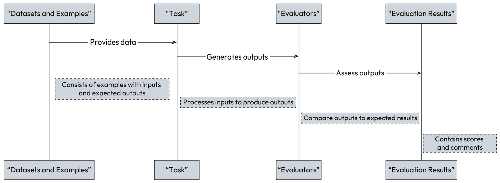
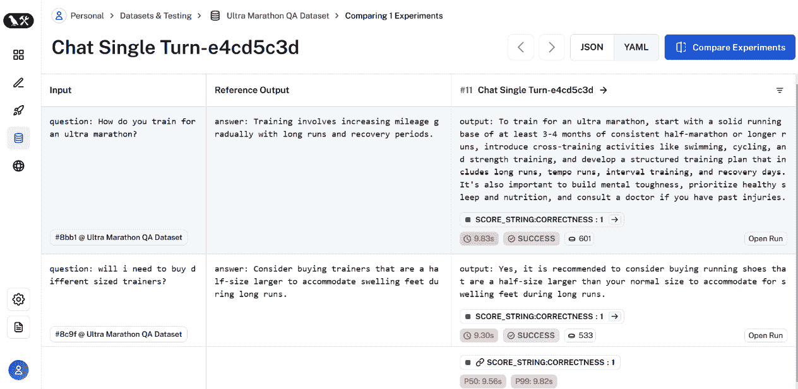
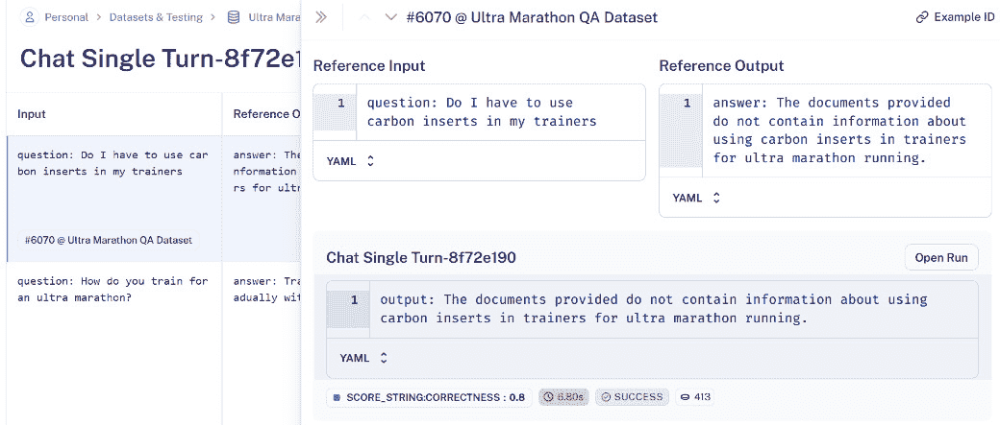
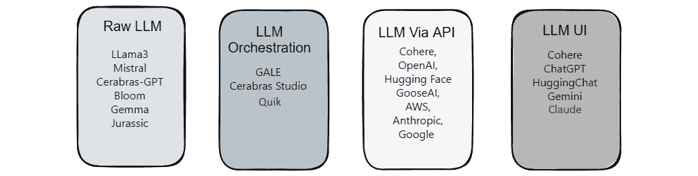

# 第九章：基于大型语言模型（LLMs）的对话式 AI 的未来

在本章中，我们将深入探讨与将我们的 ChatGPT 应用投入生产相关的话题。我们在本书的其它部分已经涉及了一些这些领域，但现在让我们更详细地考虑这些方面，同时也要看看行业中学到的经验教训。基于到目前为止我们从创建 ChatGPT 应用中学到的知识，我们可以做出明智的决定，并创建与我们的对话式 AI 项目相关的成功策略。

我们还将探讨在撰写本文时 ChatGPT 的其它替代技术，特别关注小型语言模型（SLM）的潜力。最后，我们将展望 LLMs 的未来可能，以及你的组织可能的发展方向，为你准备对话式 AI 演变中的下一个阶段。

在本章中，我们将涵盖以下主题：

+   投入生产

+   评估生产系统

+   学习如何使用 LangSmith 评估你的项目

+   LangSmith 的高级监控功能

+   ChatGPT 和 LangChain 的替代方案

+   **小型语言** **模型**（**SLM**）的增长

+   接下来的方向

# 技术要求

在本章中，我们将广泛使用 ChatGPT，因此你需要注册一个免费账户。如果你还没有创建账户，请访问[`openai.com/`](https://openai.com/)，并在页面右上角点击**开始使用**。

这些示例需要安装 Python 3.10 和 Jupyter Notebook [`jupyter.org/try-jupyter/notebooks/?path=notebooks/Intro.ipynb`](https://jupyter.org/try-jupyter/notebooks/?path=notebooks/Intro.ipynb)。这些示例需要安装 Python 3.10 和 Jupyter Notebook，你可以通过访问[`jupyter.org/try-jupyter/lab/index.html`](https://jupyter.org/try-jupyter/lab/index.html)来完成。

你可以在以下链接找到本章的代码：[`github.com/PacktPublishing/ChatGPT-for-Conversational-AI-and-Chatbots/chapter9`](https://github.com/PacktPublishing/ChatGPT-for-Conversational-AI-and-Chatbots/chapter9)。

# 投入生产

随着你在本书中的进展，你在如何创建由 ChatGPT 驱动的对话代理方面的知识得到了很大的提升。希望你也了解了一些由 LLMs 驱动的系统的局限性、挑战和陷阱，最重要的是，使它们准备好投入生产。这些挑战不容小觑，过去一年多来，尽管 LLMs 得到了广泛的应用，但完全由 LLMs 驱动的对话式 AI 代理的例子却很少，而且其中一些在某些情况下表现不佳。让我们在下一节中看看一个例子。

## 理解投入生产的危险

最近的一个例子是，LLM 在生产中如何迅速让你陷入困境，就是一个知名配送公司部署的聊天机器人出现的问题。我不会在这里点名这家公司；还有其他表现不佳的聊天机器人的例子。另一个例子是花一美元买了一辆雪佛兰塔霍——我建议你谷歌一下这个例子！

对于交付聊天机器人，一位不满意的客户决定通过提出一系列尴尬的问题来给他们的对话增添一些幽默感，结果聊天机器人开始咒骂，并背诵了一首诗，指责配送公司无用。这对客户支持聊天机器人来说并不是一次最好的对话，但却是任何没有适当防护措施的 LLM 驱动的对话代理可能出错的一个很好的例子。

那么，这里发生了什么？我无法对这家公司在聊天机器人项目中使用的技术栈或 LLM 技术发表评论。然而，如果一个代理开始用脏话回应，看起来他们没有采用任何输出验证器或内容审查检查。这允许公众成员直接提示 LLM。这看起来不太可能是模型训练的问题，而更可能是缺少防护措施来阻止恶意（好吧，有点夸张）的提示。这允许用户参与 LLM 的非品牌话题或超出范围的请求。因此，对 LLM 问题的内容过滤将阻止这种情况，同时结合对输出进行审查，以确保在发送给客户之前内容适当。

这里实际上有两个问题：输入和输出，你希望这些问题能够通过更稳固的提示策略来处理。例如，如果代理是一个由 ChatGPT 驱动的 LangChain 代理，那么我们会考虑创建一个强大的系统提示，并在我们进入主管道之前使用 LLM 调用检查初始问题。这需要有一个广泛评估过程的支持，不仅包括标准问题，还包括系统如何处理试图操纵和/或破坏系统的用户，以便他们在社交媒体上发布关于它。

记住——权力越大，责任越大，在创建 LLM 项目时，与传统**自然语言理解**（**NLU**）系统相比，这是一场不同的比赛。我们实际上已经从创建一个系统并关注正确、错误和缺失的答案，转变为一个所有这些都可以发生，而且几乎任何其他事情都可以发生的系统，除非你做出了足够的努力来阻止它。

到现在为止，我相信你已经意识到最受欢迎的 LLM 应用之一是 RAG 系统，我们已经在之前的章节中对此进行了广泛的讨论。然而，这些系统也并非没有挑战；让我们更详细地探讨一些这些问题。

## RAG 系统的挑战

正如我们所学的，RAG 系统是 LLM 对话式 AI 中流行的实现之一，可能出现在你目前正在尝试使用 LLM 技术或正在开发的绿色项目中重新创建的系统。你也了解到，你可以从这些系统中获得相当不错的性能，而不需要付出巨大的努力。然而，尽管 RAG 系统是 LLM 驱动对话式 AI 的典范，但它确实提出了挑战，随着你向生产阶段迈进，这些挑战变得更加重要，我们将在下一节中探讨这些挑战。因此，让我们考虑我们正在考虑将一个带有 RAG 系统的项目投入生产——例如，第八章中的项目：我们旅行助手的**概念验证**（**POC**）。到目前为止，关键利益相关者对 Ellie Explorer 印象深刻，并希望将其作为基于网络的聊天机器人发布，同时扩大其范围，提供更多针对性的个性化酒店建议，并回答常见问题以及更多交易性用例。为了回顾，我们使用了 RAG 系统，以便从我们的 LLM 准备好的酒店信息数据存储库中注入上下文参考数据，以提供简洁、可信的酒店推荐。

尽管它们采用了创新的方法，但简单的 RAG 系统存在一些挑战，可能会阻碍其有效性和可靠性。

从 POC 过渡到生产是一个巨大的步骤，在将 Ellie 投入市场之前，我们需要考虑 RAG 系统的挑战。

### 传统 RAG 的不足

让我们详细看看 RAG 系统的不足之处以及这些不足如何在我们的系统中体现：

+   **缺失内容**：当尝试处理一个无法从现有底层文档数据中找到答案的问题时，可能会出现失败，可能是因为信息根本不存在，或者存在一些分块或嵌入过程的问题。这可能很难调试，并且需要正确处理。理想情况下，RAG 系统将简单地回复一条消息，例如“抱歉，我没有这个信息。”然而，在问题与内容相关但缺乏具体答案的情况下，系统可能会被误导提供回应。或者，一个更难发现的失败可能是从我们之前的例子中得出的：如果 RAG 系统搜索没有返回结果——例如，对于不在我们提供的酒店数据库中的国家的酒店推荐。LLM 正在从它自己对酒店的知识中回应，而不是从 RAG 结果中，因此建议的公司酒店列表之外的酒店。这种行为可以通过提示来纠正，但你可以看到这里的问题：很难发现。现实情况下，我们需要定期检查我们的酒店结果建议，以确保这种情况不会发生。

+   **检索和精确度不足的问题**：对于 RAG 系统来说，检索相关信息是一个关键挑战。底层检索模型可能会获取相关数据，这可能导致生成误导性或不相关的文本。这种情况通常是由于在质量不足的数据上训练或数据未能准确代表目标领域而发生的。提高数据质量和确保其与目标领域的一致性是解决这一挑战的关键步骤。然而，这也可能表明我们需要更复杂的检索算法，这些算法可以准确理解查询的上下文和细微差别。

    也可能存在结果排名问题，其中文档包含问题的答案，但排名不够高，无法呈现给用户。也可能会出现结果排名问题，其中文档包含问题的答案，但它排名不够高，无法呈现给用户。在 Ellie 的情况下，如果我们返回*n*个酒店结果，从理论上讲，所有文档都会被排名，但这可能意味着一些文档可能无法达到标准，无法发送到上下文中。

    基本上，如果我们输入的提示包含错误或不恰当的上下文参考，那么结果响应可能不会提供良好的结果也就不足为奇了。基本上，如果我们输入的提示包含错误或不恰当的上下文参考，那么结果响应可能不会提供良好的结果。

+   **过时信息**：如果知识源没有定期更新或模型缺乏识别和整合时间信息的机制，RAG 生成的内容可能会基于过时的事实。保持知识库的时效性和设计检索系统以考虑信息的时效性是很重要的。

+   **增加的 RAG 成本**：有人担心，随着许多具有 RAG 组件的 ChatGPT 系统，将出现越来越多的不必要的令牌成本开销，这主要是由于未优化的检索和额外的文本结果被传递到上下文中造成的。

+   `AgentExecutor`将解决*a*，但*b*和*c*是你需要构建到你的系统中的内容。

+   **常见的 LLM 问题**：幻觉、毒性、不相关性

    幻觉和不相关性可能源于系统设计中的缺陷或知识库中的不准确，以及来自底层 RAG 数据或通过 ChatGPT 调用生成的响应中的毒性和偏见。所有这些都是需要在生产系统中注意的问题。

因此，现在我们已经讨论了你将要面对的挑战和解决方案，在下一节中，让我们考虑如何评估你的 LLM 应用程序。

# 评估生产系统

开发一个包含 RAG 组件的 ChatGPT 原型应用相对直接，但为生产做准备并有效维护它则需要持续的评估，这具有挑战性。使用 LLM 辅助评估是一个明显的途径；然而，请注意，由于 LLM 表现出位置偏差、答案风格偏好以及每次运行结果的不确定性，这导致需要更结构化的方法。还值得记住的是，代理的使用场景和性质将影响你的评估方法。例如，与更会话式的代理相比，简单的 RAG 问答需要不同的评估方法。

重要的是要理解，就像任何**机器学习**（**ML**）项目一样，你应该使用验证数据集和评估指标来评估 RAG 管道的性能。这涉及到对组件进行个别和集体评估：知识检索、响应生成以及它们的集成。你可以考虑多种不同的评估指标，例如上下文相关性、扎根性和答案相关性。

目前，确定合适的评估指标和收集良好的验证数据是一个快速发展的主题。为了解决 LLM 辅助评估的缺点，有各种方法和指标用于评估 RAG 系统，包括**检索增强生成评估**（**RAGAs**）或 RAG 三联指标，以及一系列工具选项和库。这些方法中的每一个都值得在这里详细讨论，并且值得阅读其中的一些，以了解不同的方法和它们如何实现。这些主要是通过关注知识检索的精确性和响应生成的质量，以结构化和全面的方式评估 RAG 应用有效性的方法。让我们在下一节中考虑使用 LangSmith 对 LangChain 应用进行评估的过程。

## 评估系统的组成部分

LangSmith 提供了一个强大的评估框架，旨在通过以下图中概述的精心设计的组件来监控和改进 LLM 应用：



图 9.1 – 评估过程

LangSmith 提供用于构建数据集、编辑和版本控制它们的 UI 和 SDK：一个用于定义自己的评估器或创建和使用自定义评估器的 SDK，以及一个用于执行检查和跟踪分析的 UI。

让我们更详细地探讨一个有效评估系统的组成部分：

+   **数据集** **和示例**：

    LangSmith 中任何评估系统的基本单元是数据集，它由多个示例组成。数据集中的每个示例代表一个包含输入和预期输出的测试用例：

    +   **输入**：这些是 LLM 将处理的数据点。

    +   **输出**：这些是 LLM 在给定输入时应产生的预期结果。

    数据集通常来自各种来源，包括手动创建、用户反馈或良好的对话示例，或从 LLMs 生成的输出。如果你正在考虑从现有系统迁移到 ChatGPT 驱动的代理，那么你的历史对话数据对于评估将是至关重要的。

+   **数据集类型**：LangSmith 支持不同类型的数据集：

    +   **KV**：键值对，可以容纳多个输入和输出。

    +   **LLM**：直接输入和输出字符串，通常用于简单的提示-响应模型。

    +   **聊天**：结构类似于聊天对话，适用于在对话上训练的模型。

    在 LangSmith 中创建数据集很容易，你可以创建和编辑数据集以及示例行，还可以从 CSV 导入。

+   **任务**：被评估的实际操作或模型。它处理数据集中的示例输入并生成输出，然后由评估器进行评估。

+   **评估器**：评估器是评估任务生成的输出的函数或机制。它们将这些输出与预期结果进行比较或应用特定标准以确定输出的质量。评估器返回分数，并为每个示例提供反馈。存在多种不同类型的评估器：

    +   **启发式评估器**：这些是执行检查的简单函数，例如验证输出格式（例如，JSON 验证）或与预期输出进行字符串匹配。

    +   **LLM-as-judge**：使用另一个 LLM 来根据内容标准（如冒犯性或相关性）评估输出质量的先进评估器。

    +   **人工**：手动审查输出，通常用于最终验证或在需要细微判断的情况下使用。

+   `EvaluationResult` 包含以下内容：

    +   **关键**：正在评估的度量名称（例如，准确度、完整性）。

    +   **分数**：衡量输出与预期结果匹配程度或满足评估标准的定量度量。

    +   **注释**：可选的见解或关于分数背后的推理。

现在你已经了解了评估系统组件，在下一节中，我们将通过一个示例来探讨如何将其应用于实践。

# 学习如何使用 LangSmith 评估你的项目

记住，不同类型的 AI 代理将需要不同的评估方法。没有一种适合所有情况的方案，你需要根据你的用例来决定采用的方法和途径。如果你想要支持特定领域的知识，例如来自 RAG 系统的公司特定信息，那么一个问答代理将更容易评估；而需要支持交易性对话的代理将需要一个更复杂的评估实现，因为你需要确保你的对话代理能够始终如一地完成任务。

在基于意图的系统下，你可以精确控制对话的每一步，而在 LLM 驱动的对话代理下，你通过提示来控制代理的动作和能力，这在我的看法中是一种更微妙且易变的方法。

Langsmith 使得这种深入的特定评估成为可能，让我们通过一个简单的代码示例来运行，这样你可以看到与 LangChain 一起工作的基本原理：LangSmith 使得这种深入的特定评估成为可能。让我们通过一个简单的代码示例来运行，这样你可以看到与 LangChain 一起工作的基本原理。

我们的示例由一个 RAG 系统组成，该系统从简单的知识库中回答关于超级马拉松跑步的问题：

1.  `source.text` 文档源.text 包含一些关于跑步的信息。请随意使用你自己的主题——我只是喜欢跑步！我们遵循前面章节中概述的标准工作流程，创建一个简单的基于简单文本语料库的 LangChain RAG 以进行评估——文档分块、嵌入创建以及使用 OpenAI 嵌入和内存中的 Chroma DB 作为向量存储的检索器创建：

    ```py
    loader = TextLoader('source.txt')
    documents = loader.load()
    text_splitter = RecursiveCharacterTextSplitter(
        chunk_size=500,
        chunk_overlap=20,
        length_function=len,
        is_separator_regex=False,)
    split_documents = text_splitter.split_documents(documents)
    embeddings = OpenAIEmbeddings(model="text-embedding-3-small")
    chroma_document_store = Chroma.from_documents(
        split_documents, embeddings)
    retriever = chroma_document_store.as_retriever(
        search_kwargs={"k": 4})
    ```

1.  创建一个 `ChatOpenAI` 类，并从模板字符串创建一个 `ChatPromptTemplate` 实例，其中包含问题和上下文的占位符，这些占位符将在 RAG 管道执行期间被填充。接下来，使用 **LangChain 表达式语言**（**LCEL**）将所有内容整合在一起，创建我们的链，你可以调用它来检查一切是否正常工作：

    ```py
    model = ChatOpenAI(model="gpt-3.5-turbo-0125")
    template = """You are a helpful documentation Q&A assistant, trained to answer questions about ultra marathon running.
    Use the following pieces of retrieved context to answer the question.
    If you don't know the answer, just say that you don't know.
    Use two sentences maximum and keep the answer concise.
    Question: {question}
    Context: {context}
    Answer:
    """
    prompt = ChatPromptTemplate.from_template(template)
    # Setup RAG pipeline
    rag_chain = (
        {"context": retriever,  "question": RunnablePassthrough()}
        | prompt
        | model
        | StrOutputParser()
    )
    chain.invoke("do i need to do any long runs in my training")
    ```

1.  `pip install -U langsmith`. 然后，设置你的环境以使用 LangSmith，然后创建你的 LangSmith 客户端：

    ```py
    from langsmith import Client, evaluate
    from langsmith.schemas import Run, Example
    # Initialize the LangSmith client
    client = Client()
    ```

1.  使用 `client.create_dataset()` 创建数据集，然后使用 `create_examples()` 添加我们的示例。我们也可以直接使用 LangSmith UI 添加这些示例：

    ```py
    dataset_name = "Ultra Marathon QA Dataset"
    description = "Dataset for evaluating QA correctness of an ultra marathon chatbot."
    dataset = client.create_dataset(dataset_name, 
        description=description)
    client.create_examples(
        inputs=[
            {"question": "How do...", "context": "..."},
            {"question": "will i...", "context": "..."}
        ],
        outputs=[
            {"answer": "Training..."},
            {"answer": "Consider buying..."}
        ],
        dataset_id=dataset.id,
    )
    ```

    向数据集添加示例的另一个简单选项是从 LangChain 中的现有运行中获取。只需转到 **运行详情** 页面，然后点击 **添加到** **数据集** 按钮即可。

1.  **定义一个** **评估方法**：

    创建一个函数来调用我们正在评估的东西，在我们的例子中是 RAG 链，但这可以是你的管道中的任何可运行元素：

    ```py
    def predict(inputs: dict):
        return rag_chain.invoke({"question": inputs["question"]})
    ```

1.  **定义一个用于评估器的输入格式化器**：

    定义一个函数来格式化评估器的输入。此步骤确保评估器函数以一致格式接收必要的数据：

    ```py
    def format_evaluator_inputs(run: Run, example: Example):
        return {
            "input": example.inputs["question"],
            "prediction": next(iter(run.outputs.values())),
            "reference": example.outputs["answer"],
        }
    ```

1.  `LangChainStringEvaluator` 评估器。这涉及到配置它以根据预定义的标准和归一化因素评估聊天机器人的响应的正确性。此评估器将处理字符串比较，从而允许精确测量答案的准确性：

    ```py
    from langsmith.evaluation import LangChainStringEvaluator
    correctness_evaluator = LangChainStringEvaluator(
        "labeled_score_string",
        config={"criteria": "correctness", "normalize_by": 10},
        prepare_data=format_evaluator_inputs)
    ```

    让我们看看创建评估器的详细信息：

    +   标签：``"labeled_score_string"`` 指定评估结果中输出的评分标签。`"labeled_score_string"` 指定评估结果中输出的评分标签。

    +   `"criteria"`：`"correctness"`，它定义了评估应测量的内容——在这里，是响应的准确性。

    +   `"normalize_by"`：`10`，将分数调整到 0 到 10 的比例，使其更容易解释结果。

1.  准备数据：`format_evaluator_inputs` 是一个函数，它以评估器可以有效地处理的方式格式化输入、预测和参考。`format_evaluator_inputs` 是一个函数，它以评估器可以有效地处理的方式格式化输入、预测和参考。

1.  使用 `evaluate()` 而不是正在被弃用的 `run_on_dataset()`，后者将返回评估结果：

    ```py
    results = evaluate(
        predict,
        data=dataset_name,
        experiment_prefix="Chat Single Turn",
        evaluators=[correctness_evaluator],
        metadata={"model": "gpt-3.5-turbo"},
    )
    ```

    让我们看看 `evaluate()` 调用的不同元素：

    +   `predict`) 是聊天机器人用来从输入生成答案的。

    +   `LangChainStringEvaluator` 评估器，在之前的步骤中设置。您也可以创建自己的自定义评估器并将其包含在这里；您可以使用多个评估器。

    +   **元数据**：包含有关所使用的模型版本的详细信息，便于进一步分析和追溯。

请记住，LangSmith 还会在您从 UI 选择创建实验时创建评估代码。这也提供了不同预构建评估链的示例，允许您评估以下内容：

+   正确性

+   简洁性

+   相关性

+   一致性

+   有害性

+   恶意

+   有用性

+   有争议性

+   偏见

+   犯罪性

+   不敏感

在编写本文时，代码示例使用 `run_on_dataset()`，但将其迁移到 `evaluate()` 应该相当简单。当您运行 `evaluate()` 时，这应在 LangSmith 中创建一个实验，您应该看到如下输出：

在以下位置查看实验：‘Chat Single Turn-46c45783’的评估结果：

```py
https://smith.langchain.com/...
```

此链接应带您进入 LangSmith 中的实验链接，您可以在其中查看每个实验的详细信息，如下面的截图所示：



图 9.2 – 在 LangSmith 的实验视图中显示的评估输出

点击**成功**或**失败**按钮将显示数据集中每个输入和输出的测试详情。从这一视角，你还可以深入到每个运行中，查看发生了什么，以及通过其他信息，如每个运行的令牌成本。评估的令牌成本可能会根据你的数据集大小迅速上升。

让我们尝试测试我们用来阻止 LLM 使用其他数据并反馈给用户（如果它无法回答）的提示。在 LangSmith 中尝试向你的数据集添加另一个问答对，但这次，让我们添加一个它不应该能够回答的问题。在我的例子中，这是关于训练师的一些具体信息，我知道我的知识库中没有提到：

```py
Input: {"question": "Do I have to use carbon inserts in my trainers"}
```

输出：{"answer": "提供的文档不包含关于在超长跑训练师中使用碳插件的任何信息。"}

当我重新运行评估时，我们可以看到测试通过，我们的智能体正在按照预期响应。你可以在下面的屏幕截图中看到输出：



图 9.3 – LangSmith 中显示幻觉测试的评估输出

尝试查看其他类型的现成评估器，看看你是否可以针对其他标准进行评估。

对于评估不同基于 LLM 的系统，没有一种适合所有情况的解决方案。不同类型的对话式 AI 智能体将需要不同类型的评估方法和不同的数据集。在 LangSmith 网站上查找不同类型智能体测试的示例。

任何评估系统的目标都是为了提供一个强大的框架来评估你的智能体。LangSmith 使运行评估和提供对单个和集成组件性能的详细洞察变得容易。使用 LangSmith，你可以更好地为 ChatGPT 应用的生产环境需求做好准备，确保它提供高质量、可靠的响应。

记住——成功开发 AI 的关键是持续测试和改进。评估不是一个一次性任务，而是开发周期中的常规部分。在下一节中，我们将考虑应用监控。

## 使用 LangSmith 进行生产中的应用监控

监控任何基于 LLM 的应用都是一项挑战，直到 LangSmith 的发布，很难全面了解 LangChain 应用底层的运作情况。对应用进行详细监控对于保持运行顺畅至关重要，LangSmith 提供了众多功能来实现这一点。

# LangSmith 的高级监控功能

LangSmith 的监控系统通过允许开发者配置和管理跟踪，使得对生产应用的有效监督成为可能。这个系统中的关键特性是针对优化生产过程中数据收集和使用的特性。

## 跟踪和数据管理

LangSmith 的跟踪和管理能力通过采样提供选择性数据点记录，通过元数据改进数据组织，并通过反馈集成提供关键见解：

+   **采样**：在生产中至关重要，此功能允许仅记录数据点的子集，以有效地管理数量和相关性。

+   **元数据**：将元数据附加到运行中增强了过滤和分组数据的能力，便于进行更有针对性的分析

+   **反馈**：整合用户反馈有助于突出显示重要数据点，将注意力集中在最需要的地方

## 监控工具

LangSmith 提供了一套全面的监控工具，旨在帮助监控您的应用。以下是关键功能：

+   **过滤功能**：用户可以使用高级过滤选项深入到特定的运行中，这些选项包括按名称、元数据、反馈和全文搜索进行过滤。

+   **监控图表**：在**项目**仪表板上的**监控**选项卡提供了各种指标的视觉表示，例如**跟踪延迟**、**每秒令牌数**和**成本**。这些图表支持时间序列分析，并可以深入到具体数据点以进行详细的跟踪表，有助于调试。

+   **元数据分组**：这允许在同一图表中并排比较不同的应用程序版本，这对于 A/B 测试变化特别有用。

## 高级监控功能

LangSmith 提供其他高级功能，帮助您理解复杂的对话并自动化一些任务。

+   **线程**：对于跟踪是同一对话一部分的应用，LangSmith 通过元数据键提供线程化，方便地分组相关跟踪。

+   **自动化**：为了减少人工监督，LangSmith 的自动化可以配置为处理重复性任务。设置过滤器后，开发者可以自动化将数据发送到数据集、注释队列或进行在线评估等操作。

在 LangChain 空间中，一直缺少一个功能齐全的监控工具，LangSmith 填补了这一空白。

它作为确保您 LLM 应用稳健性能的必备工具而脱颖而出。通过提供详细的指标和实时数据可视化，LangSmith 应允许您在对话式 AI 解决方案中保持高性能、可靠性和用户满意度的高标准。

# ChatGPT 和 LangChain 的替代方案

自 ChatGPT 的早期以来，不仅 LLM 技术在不断进步，而且服务提供的选择和可用性也在增加。在本节中，我们将探讨出现的各种服务提供，探索 ChatGPT 和 LangChain 之外的可行替代方案。

## ChatGPT 和 OpenAI LLMs 的替代方案

去年年初，你可能会争辩说 OpenAI 的**生成预训练转换器**（**GPT**）LLM 处于一场单马竞赛中，并且很可能是你构建 LLM 驱动项目的首选。如今，许多公司都在竞相发布最佳模型，导致可供选择的 LLM 数量不断增加，无论是开源的还是封闭的，都可以创建一个对话式 AI 系统。LLM 军备竞赛仍在继续；让我们看看一些例子，值得注意的是，这并不是一个详尽的列表：

+   **Meta**: Meta 提供的 Llama 模型系列是流行的 LLM。最新的模型，Llama 3 模型，具有 8B 和 70B 参数，在与其他 LLM 的测试中表现出令人印象深刻的表现，并且以多种方式提供。

+   **Anthropic**: Anthropic 以其专注于构建可靠和可解释的 AI 模型而闻名。他们的主要模型 Claude 旨在增强安全性和可控性，旨在减少有害或误导性的输出。Anthropic 强调道德 AI 开发，利用**从人类反馈中进行强化学习**（**RLHF**）等技术来微调模型响应，确保它们与人类价值观和安全期望紧密一致。

+   **AI21**: AI21 提供访问 Jurassic-2 和 Jamba transformer 模型。Jurassic-1 是 AI21 Labs 的旗舰模型系列。Jurassic-1 有多种尺寸，从小型模型适合成本效益的应用到可以生成更复杂和细微文本的非常大的模型。这些模型旨在执行广泛的任务，从回答问题和总结文本到生成内容和代码。

+   **Google**: Google 从不错过提醒我们他们发明了 transformer 架构，并创建了强大的模型，如 PaLM 2 和最近推出的 Gemini 系列。Gemini 系列，尤其是最新的 Gemini 1.5，以 1 百万 token 的巨大上下文窗口和据说更好的性能推动了边界。1.5 系列也提供 3 种尺寸：Ultra、Pro 和 Nano。Google 还将 Bard 更名为 Gemini。到目前为止，我所看到的 Gemini 性能与 GPT-4 模型相当。

+   Cohere: Cohere 专注于自然语言理解和生成。**Cohere**: Cohere 专注于 NLU 和**自然语言生成**（**NLG**）。他们的模型设计用于各种应用，如内容生成、摘要和语义搜索。Cohere 的模型以其用户友好的 API 和强大的安全特性而闻名，适用于数据隐私和应用程序完整性至关重要的企业环境。

+   **MistralAI**: MistralAI 将自己定位为专注于企业级 LLM，并拥有保护隐私的基础设施。他们提供开源模型：Mistral 7B、Mixtral 8x7B 和 Mixtral 8x22B，这些模型可定制。它们可以在 Mistral 平台上下载或按需使用。公司还提供大型和小型优化的商业模型。

+   **Cerebras**：Cerebras 发布了一系列 7 个 GPT 模型，参数量从 11 亿到 130 亿不等。他们声称这是训练速度最快、成本最低的模型之一。Cerebras 还提供云基础设施用于模型训练和 Cerebras AI Model Studio，这是一个专门用于训练和微调 LLMs 的平台。

测试这些模型的一种很好的方法是使用 Hugging Face Chat，在这里你可以从流行的 LLMs 中选择来回答你的问题。你会发现，除非被提示做其他事情，否则所有 LLMs 的回答都有一种细微的风格差异。这个观察是从我与 VUX World 的杰出人物凯恩·西蒙斯（Kane Simms）的对话中得出的。

有证据表明，LLMs 之间的差距正在缩小。最近的表现比较表明，不同 LLMs 之间的差距正在缩小。例如，Claude 3、GPT-4 和 Gemini Ultra 在多项选择题和推理等任务中取得了相似的成绩。有趣的是，一些较小的模型，如 Mixtral 和 Llama2，在某些领域（例如推理）的表现优于较大的模型，这表明并非总是最大的模型就是最好的。

我们在这本书中大量使用了 LangChain。让我们在下一节中看看 LangChain 的替代方案。

## LangChain 的替代方案

我非常喜欢 LangChain，现在 LangSmith 已经完全支持它在生产中监控和运行你的应用程序，这是一个稳固的平台。然而，LangChain 并不是适合每个人，在做出决定之前有许多定义因素在起作用。还有很多其他选择。你可以用代码构建自己的应用程序并直接与 LLM API 交互，同时仍然使用 LangSmith 进行监控。你也可以使用像 **企业生成式 AI 大型语言模型（GALE**）这样的东西：Kore.ai 的新生产力套件，这是一个无代码解决方案，用于使用最新的 LLM 模型。

或者，还有像 LlamaIndex 这样的选项。LlamaIndex 是一个针对在 LLMs 上构建的应用程序进行优化的全面数据框架。

它支持大量数据格式，例如 APIs、PDFs、文档和 SQL 数据库，允许你摄取、组织和结构化你的数据。该平台提供高级检索界面和创建提示链的能力，以创建 LLM 应用程序和评估能力，允许你创建高级 RAG 系统。

LlamaIndex，凭借其支持的 Python 和 TypeScript SDKs 以及一个充满活力的社区提供的丰富资源，例如连接器、工具和数据集，展示了在 LLM 领域出现的创新解决方案。这种 LLM 专用服务的增长标志着人工智能领域的一个重大趋势，我们将在下一节中进一步探讨。

## 观察不断增长的 LLM 领域

自从去年 ChatGPT 发布以来，LLM 领域的世界发生了巨大变化，了解这一点对于您可能为 ChatGPT 或 LLM 项目做出的任何技术决策都至关重要。

访问 LLM 的方式越来越多，这可以主要分为以下图表中展示的四种方法：



图 9.4 – 与 LLM 交互的不同方式

让我们来看看访问和利用 LLM 的四种不同方式的优缺点：

+   `llama.cpp`库。尽管免费使用，但托管和运营这些模型的相关成本可能相当高，需要专业知识。随着使用量的增加，这些费用和持续维护的需求往往会增加。

+   **LLM 编排**：提供专业云基础设施以托管和训练模型，同时提供一种简单的方式来编排和公开这些模型以供使用，以及针对特定领域专业知识和使用案例进行微调的手段。大多数云服务提供商（CSP），如 Google Cloud、Amazon Web Services（AWS）和 Microsoft Azure，提供基础设施即服务（IaaS）以托管您的模型。这可能很昂贵，但提供了在不承担基础设施成本的情况下利用开源 LLM 的能力。还有一些有前景的平台，允许您创建由 LLM 驱动的端到端对话助手，例如 Quiq。

+   **通过 API 使用 LLM**：这是组织将 LLM 功能集成到其应用程序中最常用的方法。API 为使用 LLM 开发应用程序提供了一条直接的路径。然而，使用这些 API 也带来了一些挑战，例如成本影响、对数据隐私的担忧、推理延迟问题、速率限制、灾难性遗忘的风险以及模型漂移。

+   **LLM 用户界面**：无需过多介绍，ChatGPT、HuggingChat、Cohere Coral 和 Gemini 等界面直接为用户提供对话体验，并已成为许多人日常生活的一部分。这些界面旨在提供与 LLM 互动的最高效和用户友好的方式。它们通常还使包括其他来源的上下文信息以及通过管理历史对话和利用外部工具进行聊天个性化变得容易。

这些与 LLM 交互的方法各自提供了不同的优势，并带来了独特的挑战，因此选择取决于您的用例、定制需求、技术专长、资源可用性和预算限制。最后，在下一节中，我们将简要考虑一种越来越受欢迎的新型模型：SLM（小型语言模型）。

# 小型语言模型（SLM）的增长

当考虑围绕 LLM 技术的复杂性以及最新和最伟大 LLMs 巨大收益放缓时，引入 SLM 是有意义的，SLM 的受欢迎程度一直在增长。SLMs 正在挑战“越大越好”和“大小不是一切”（请原谅这个双关语）的观念。模型大小可能不是性能的唯一决定因素，而诸如架构、训练数据和微调技术等因素也起着重要作用。

## LLMs 是否达到了极限？

当性能趋于平稳时，这引发了一个问题：LLMs 是否达到了极限？当 ChatGPT 首次发布时，我们都对它的广泛知识感到震惊，但随后的迭代并没有那么革命性。当涉及到训练数据时，随着使用新 GPT 版本的新鲜训练数据的采用，已经取得了一些改进，但事实上，除非模型定期训练，否则 LLM 数据将始终存在局限性，这似乎不太可能。

尽管 LLMs 具有令人印象深刻的性能，但它们也伴随着显著的缺点，我在本书中已经进行了概述。这里简要回顾一下。它们需要大量数据和参数进行训练，导致高计算能力和能源消耗。这导致了高昂的成本，使得小型组织和个人的核心 LLM 开发难以触及。此外，LLMs 由于涉及的工具和技术复杂，以及从训练到部署的漫长周期，给开发者带来了陡峭的学习曲线，这可能会减缓实验和创新工作。

其他挑战包括训练数据中的偏差以及幻觉问题、缓慢的推理性能、高令牌成本，以及如果您打算消费和从敏感数据中推断，严重的安全影响。将 LLMs 比作砸坚果的锤子，突显了庞大的互联网知识对于许多对话式 AI 用例可能并非必要。这引发了以下问题：对于有效的对话式 AI 项目，哪些品质真正重要，SLM 能否满足这些要求，甚至比 LLMs 提供优势？

## SLMs 的登场

从本质上讲，SLM（小型语言模型）是大型 AI 模型的紧凑版本，旨在理解、解释和生成人类语言。SLMs 为 LLMs（大型语言模型）提供了一个简化的替代方案。由于参数较少和设计简单，它们需要的数据、训练时间和计算能力更少——通常只需几分钟或几个小时。这使得 SLMs 更高效，并且更容易在现场或小型设备上实施，以及针对特定用例进行微调的小型数据集。

## SLMs 与 LLMs——关键区别

为了更清晰地了解 SLMs，直接将它们与 LLMs 进行比较是有帮助的：

+   **规模和范围**：SLMs 被设计成紧凑和高效，使其适合特定领域和任务。它们在较小的数据集上训练，允许更快的训练和推理时间以及针对性的知识。另一方面，LLMs 更大、更全面，在广泛和多样化的数据源上训练。LLMs 捕捉广泛的语言模式，在生成关于几乎所有主题的高度连贯和上下文相关的文本方面表现出色。

+   **训练时间和计算资源**：由于规模较大，LLMs 需要更多的计算资源和更长的训练时间。SLMs 由于其较小的规模和更简单的架构，在资源有限或需要快速部署的场景和预算中更为实用。

+   **领域专业知识**：虽然这两种模型都可以针对特定领域进行微调，但由于 SLMs 规模较小且推理时间更快，因此在需要特定领域专业知识的情况下，SLMs 通常更有效率。SLMs 还可以在更小的数据集上训练。一个训练良好的特定领域 SLM 在与在上下文级别提供领域知识的 LLM 相比时，可能表现足够好。

+   **多功能性和成本**：这完全取决于使用场景，但 LLMs 由于其更广泛的知识库，在内容生成、翻译和理解复杂查询方面表现出色。然而，经过适当微调的 SLMs 可以在计算成本的一小部分内实现与特定对话任务相当的性能。SLM 不一定需要理解每个主题。SLMs 可以被训练在与特定领域特定知识的基础上与客户互动，提供定制解决方案并改善用户体验。这可以通过使用专业训练数据微调 SLMs 来实现，并且可能更加直接。此外，微调 SLMs 需要很少的资源。具体的硬件要求以及相关的成本取决于模型大小、复杂性和数据集需求，但这些可能要少得多。

## SLMs 的优势

SLMs 的一个关键好处是它们适合特定应用。它们专注的范围和减少的数据需求使它们非常适合微调特定领域或任务。这种定制化使公司能够创建满足其特定需求的 SLMs，例如情感分析、**命名实体识别**（NER）或特定领域的问答。

SLMs 还提供了增强的隐私和安全。它们较小的代码库和简单的架构使它们更容易审计，不太可能包含漏洞。这对于医疗保健和金融等行业处理敏感数据来说特别有吸引力。SLMs 降低的计算需求还使本地处理成为可能，从而进一步提高了数据安全性。

SLMs 在其特定领域内不太容易出现幻觉。它们在目标数据集上的训练有助于它们学习相关模式、词汇和信息，减少了产生无关或不一致输出的可能性。由于参数较少，SLMs 也不太可能捕捉和放大训练数据中的噪声或错误。

## SLMs 的缺点

SLMs 尽管具有许多优点，但在某些情况下观察到其性能下降。一个关键限制是它们对上下文的理解减少，与大型模型相比，整体知识库不够全面。这使得 SLMs 在需要深入理解或广泛上下文意识复杂任务时效果较差。此外，由于 SLMs 尺寸较小且训练数据集聚焦，它们在生成连贯流畅的文本方面可能存在困难。例如，参数较少的模型通常在保持较长文本的连贯性或在更复杂的交互中表现出局限性。这可能会限制它们在需要高质量响应且在技术或复杂领域进行对话的应用中的效用。

## SLMs 的一些示例

Phi-3 是微软最新推出的轻量级 Mini 3B 和 14B 中端最先进的开放模型家族，在基准测试中获得了非常令人印象深刻的性能结果。谷歌的 Gemma 是一系列专为效率和用户友好性设计的 SLMs。与其他 SLMs 一样，Gemma 模型可以在日常设备上运行，无需专用硬件。Cerule 是一款强大的图像和语言模型，将 Gemma 2B 与谷歌的**Sigmoid 损失函数用于语言-图像预训练**（**SigLIP**）相结合，利用高效的数据选择技术。这使得 Cerule 非常适合边缘计算用例。另一个例子是 Llama 2 7B 和现在的 Llama 3 8B，它们不需要大量的硬件要求，还有 Stable Beluga 和 Hugging Face 的 Zephyr。许多这些模型都可在 Hugging Face 和 LLM API 提供商等平台上找到，以及像 Google Vertex AI 这样的云服务。这些模型都是针对对话用例进行训练的。尝试这些模型的一个好方法是使用 Ollama，这是一个轻量级框架，用于在本地机器上运行模型。

## SLMs 的变革潜力

SLMs 有潜力使人工智能访问民主化并推动创新。它们更快的开发周期和更高的效率使得成本效益高、目标明确的解决方案成为可能。在边缘部署 SLMs 为金融、娱乐、汽车、教育、电子商务和医疗保健等领域的实时、个性化、安全应用打开了可能性。

使用 SLM 的边缘计算通过本地处理数据来提高响应时间、数据隐私和用户体验，这是一个吸引人的解决方案，并且能够纠正企业希望在更敏感领域应用 LLM 时的许多缺点。这种去中心化的 AI 方法有潜力改变企业和消费者与 LLM 技术互动的方式。

通过将 SLM 暴露于专门的训练数据并对它们的能力进行微调，它们可以在训练 LLM 成本的一小部分内产生针对对话用例的准确和相关的输出。它们通常能够提供与 LLM 相似的对话能力并取得很好的结果。如果你正在寻找使用 LLM 技术但担心其缺点，考虑一个 SLM 模型可能是一个明智的选择。

然而，也存在局限性：虽然 SLM 提供了显著的好处，尤其是在效率和成本方面，但它们的适用范围有时会根据预期的用例而受到限制。

尽管存在任何缺点，它们都提出了一个有力的论点。随着特定模型**平台即服务**（**PaaS**）和模型训练平台的日益可用，探索和测试 SLM 能力的便利性越来越高，因此投入时间和精力去研究是非常值得的。

# 接下来该往哪里走

在这本书的整个过程中，我们专注于利用 ChatGPT 和 LLM 作为工具和技术来创造引人入胜的对话体验。自从我们开始这段旅程以来，LLM 的领域经历了巨大的变革，这得益于 LLM 技术的持续进步。尽管 ChatGPT 在发布时是一项突破性的创新，但现在它只是更大、更灵活的 LLM 生态系统中的一个组成部分。

我在对话式人工智能领域工作了多年，早在 ChatGPT 之前，就有幸参与并投入生产了许多基于 NLU 的应用。这让我对对话式人工智能的挑战有了深刻的理解，包括 LLM 需要做什么来克服这些挑战，以及它们是否能够做到。目前有数千个由 NLU 驱动的对话式人工智能应用正在运行，其中许多你可以认为可以被 ChatGPT 应用所取代。或者至少它们的一些元素可以被取代，这通常取决于现有平台的底层技术和供应商构建利用 LLM 技术以及传统基于意图的系统能力的速度和效率。

就像所有人一样，我最初对 ChatGPT 的发布和技术的无限可能性感到震惊。然而，我一直试图对技术的采用、其局限性和风险保持现实态度。当然，这都取决于具体的应用场景。如果你想深入讨论自己的数据，那么 RAG 系统在对话式人工智能领域是一个巨大的进步，但在交易性角色中，适度的克制是明智的。

我个人认为，向前发展的最大转变在于为更复杂的应用场景构建交易性 LLM 驱动应用的可行性。使用 LangChain 等框架创建这些应用已经成为一个更加现实的目标，但仍然不是一件简单的事情。随着专门用于测试和监控 LLM 行为的支持工具（如 LangSmith）的出现，部署交易性机器人的风险得到了缓解。这为考虑用 LLM 的灵活性和适应性来取代传统的基于意图的系统打开了大门。

LLM 的未来在于多模型方法。我们可以在 LLM 管道内利用适合特定任务的模型。想象一下，一个特定的 LLM 在 LangChain 应用中充当代理执行者，利用其他专业模型的优势来完成特定任务。此外，LLM 推理能力的进步也提供了令人兴奋的潜力。

然而，在规划 LLM 应用时，模型选择仍然是一个复杂的决策。使用案例、底层数据、领域类型、成本、安全考虑和可维护性等因素在规划生产时都起着至关重要的作用。这些因素突出了探索 ChatGPT 之外替代方案的重要性。SLMs 为特定场景提供了一个有趣的选项，尤其是在拥有大量对话日志和历史使用数据的长期对话式人工智能系统中，这些数据可以用于微调。

LangChain 生态系统仍然是构建 LLM 驱动应用的强大平台。随着针对几乎所有需求的集成和工具，我们只是触及了其潜力的表面。你可以利用不断增长的向量存储和服务，以及像 Tavily Search 这样的专业工具，来增强我们 LLM 应用的能力。有许多 LangChain 模板的例子，我建议这些是查看更复杂对话用例的好地方。

同样重要的是要承认将大型语言模型（LLMs）投入生产所涉及的风险。它们具有随机性，即输出中的固有随机性，可能导致不可靠的结果。这需要仔细规划和稳健的测试方法，尤其是在关键应用中。

OpenAI 不断通过其 GPT 模型突破边界。我们已经见证了从 GPT-3.5 到 GPT-4 及其针对聊天应用优化的 Turbo 版本的演变。最新的 GPT-4o，于 2024 年 5 月发布，通过将它们特定模态的模型整合到一个新的模型中，集成了多模态能力。结果是，它能够以类似人类的响应速度处理文本、音频、图像和视频输入，实现完全的多模态对话交互。以前，GPT 在语音交互中平均存在 3-6 秒的延迟问题。

当 OpenAI 不断通过令人叹为观止的能力增强其模型，包括多模态、多语言、扩展的上下文窗口、提高的准确性和改进的 LLM 推理时，他们还明智地保持了 API GPT-4o 的成本在较低水平，并将其包含在 ChatGPT 的免费版本中，使这项技术能够惠及更广泛的受众。OpenAI 不断通过令人叹为观止的能力增强其模型——多模态、多语言、扩展的上下文窗口、提高的准确性和改进的 LLM 推理——同时他们也明智地保持了 API GPT-4o 的成本在较低水平，并将其包含在 ChatGPT 的免费版本中，使这项技术能够惠及更广泛的受众。

我们最初所了解的景象已经发生了巨大的变化，反映了 LLM 技术的快速演变。LLM 生态系统持续繁荣，为开发者提供了越来越多的模型和简化工具，以构建和利用其能力。随着技术的持续发展，构建变革性对话体验的可能性也将随之增加。拥抱实验，探索不断扩大的 LLM 生态系统，并保持在这次激动人心的革命的前沿。

# 摘要

在本章中，我们探讨了将 ChatGPT 驱动的系统从原型验证过渡到完全运营的生产环境所涉及的关键考虑因素和挑战，突出了部署 LLM 驱动的应用程序，尤其是 RAG 系统所涉及的显著责任和风险。到目前为止，你应该已经理解了采取稳健的安全措施以防止不适当回应并确保可靠性的重要性。我们回顾了一个由于内容监管不力和系统控制不足而导致聊天机器人故障的事件，强调了适当安全措施的需求。

本章的大部分内容都致力于讨论 RAG 系统在生产过程中面临的具体挑战。我们还探讨了评估 LLM 应用的全面策略，强调了对广泛标准的持续验证的必要性，以确保系统的有效性和可靠性。我希望能通过介绍一个评估示例，让您对 LangSmith 这样的工具的重要性有一个坚实的理解，并为您构建稳健的评估打下良好的知识基础。评估和监控工具为管理、测试和改进 LLM 应用提供了一种结构化的方法，它们需要在您的 ChatGPT 项目中扮演重要的角色。

为了提供一个平衡的视角，在本章中，我们了解了一些替代的 LLM 服务提供者和模型，包括 LangChain 和 ChatGPT 的替代品，并反思了对话式 AI 技术快速发展的格局。这一领域已经取得了相当大的进展，您可能会对根据具体用例和运营需求选择正确模型的重要性有所把握。我们还探讨了 SLMs 作为传统大型 LLM 的更易于管理和专业化的替代品的潜力。

最后，我们探讨了下一步该怎么做，这取决于您和您的组织在 LLM 旅程中的位置，无论是继续实施 LLM 功能，将您的对话式 AI 项目过渡到生产，还是开始绿色场 LLM 应用。

我们在这里涵盖了大量的内容，但希望这能帮助您克服挑战，提出关键问题，以便您能够成功利用 LLM 技术向前发展。

# 进一步阅读

以下链接是本章节中精选的资源列表，旨在帮助您：

+   LangChain: [`chat.langchain.com`](https://chat.langchain.com)

+   LangChain 模板: [`templates.langchain.com`](https://templates.langchain.com)

+   LangSmith: [`docs.smith.langchain.com`](https://docs.smith.langchain.com)

+   RAGAs: [`github.com/explodinggradients/ragas`](https://github.com/explodinggradients/ragas)

+   [`docs.ragas.io/en/latest/`](https://docs.ragas.io/en/latest/)

+   LlamaIndex: [`www.llamaindex.ai`](https://www.llamaindex.ai)

+   HuggingChat: [`huggingface.co/chat/`](https://huggingface.co/chat/)

+   ChromaDB: [`docs.trychroma.com/`](https://docs.trychroma.com/)

+   LLMs: [`www.together.ai`](https://www.together.ai)

+   Ollama: [`ollama.com`](https://ollama.com)

+   Quiq: [`quiq.com`](https://quiq.com)
