# 第一章：释放变革：Power Platform 在数字演变中的作用

在本章中，我们深入探讨微软 Power Platform 在推动数字演变及其作为变革性变革催化剂的作用。我们探讨了围绕数字转型的经济动态，并阐明了其对各行各业组织的深远影响。具体来说，我们考察了微软在低代码应用和自动化开发市场中的显著市场份额，突出了 Power Platform 如何成为帮助企业以敏捷和高效的方式在数字景观中导航的领先力量。

此外，我们还探讨了 Power Platform 的最新进展，特别是与 OpenAI 合作开发的协作者功能。这些尖端功能利用 AI 的力量革命化低代码开发体验，使用户能够以惊人的轻松和速度创建应用程序和自动化流程。

通过深入研究经济学、微软的市场地位和创新的协作者功能，本章为寻求挖掘 Power Platform 潜力的组织提供了宝贵的见解和指导。它使你对如何利用 Power Platform 作为战略工具来释放变革、推动数字创新并在不断变化的数字景观中实现可持续增长有一个全面的理解。我们将涵盖以下主题：

+   利用 Power Platform 推动数字变革

+   理解数字化转型中的经济力量

+   领导低代码市场，微软

+   利用 AI 协作者革命化低代码开发

+   利用 Power Platform 实现战略增长

# 利用 Power Platform 推动数字变革

在漫长的岁月里，技术经历了显著的变化，这些变化改变了社会对技术的看法及其对我们工作和家庭生活的影响。

最终，创新将会发生，无论你对它的看法如何，无论你如何看待它。我们在历史上看到了许多不同的形式：汽车、自行车、食物、饮料、医学进步。人类天生好奇，并希望优化我们做事的方式，有时无论影响是好是坏。为了理解低代码在一般意义上的数字演变和变革性变化，特别是 Power Platform，我们需要探索“创新”真正意味着什么以及为什么它很重要。

## 创新的一个例子

我最喜欢的帮助理解我们今天所看到的创新转变的类比是简单的农业概念。我们都吃食物，我们都需要食物……农业是我们食物的主要来源之一，因此它非常重要。

许多年前，在一些地方至今仍是这样，农民会种植作物，然后走到水源处用桶收集水，然后走到他们种植作物的地方手动浇水。

这在很长一段时间里都运作得很好。然而，进一步的创新被应用，并采用了一种更少劳动密集型的作物灌溉方法。马车被用来携带更多的水到田野。由于可以分散更多的水，作物种植园变得更大。

随着进步的持续，农民们意识到他们可以通过挖掘水渠，让水流直接穿过田野，以一种更加创新的方式将水引到作物上。他们不再需要人们提桶或装载马车，而是计划水流并挖掘水渠。

随着时间的推移，水调配的概念变得更加复杂，农民们找到了更好的机制来引导水流。规划需要更多时间，灌溉专家被要求铺设管道、理解压力并均匀地分配水流。

由于这种作物维护方法，种植了更大的作物田，需要更多具有不同技能的人来维护和管理这些田地。

我们学得越多，创新越多，我们找到使我们的手动工作变得更简单的方法就越快。在未来，将会有更多巧妙的办法，让农民能够维护和管理他们的作物，以养活世界。

人工智能管理物质的事实是，创新正在发生，无论我们是否喜欢。人们总是会找到更聪明的方法来节省时间和避免手工劳动。

在这种情况下，随着时间的推移，这里从事工作的人们：提水桶、赶马车、灌溉作物、在田野中挖掘水渠、铺设管道、计算压力、编程计算机以管理水流；他们都需要学习。我们不是生来就懂得如何提桶或编写代码，我们是通过学习来掌握这些技能的！

随着时间的推移，我们学会了如何创新。

“嘿，也许我可以用两个中等大小的桶代替一个大的桶，这样实际上可以让我携带更多的水而不会洒出来。”这种情况已经持续了几个世纪，当然，在数字世界也是如此。

## 向数字化转变——开始

**数字化转型**是一个年轻的概念，随着时间的推移而迅速演变。如果我们把时钟拨回到大约 1990 年，当时第一个网络浏览器发布，以及 1998 年，当谷歌向公众发布时，人们对开发易于使用的解决方案的看法发生了根本性的转变。

由于许多人认为万维网搜索的概念最终会夺走他们的工作，因此出现了恐慌。想象一下那些整理词典和百科全书的人们的想法。

另一个有趣的例子是 Excel 首次发布时的情况。微软在 1990 年发布了一个精彩的视频，展示了几个在电梯里的人。其中一位男士拿着一个看起来像大型门档大小的笔记本电脑，当电梯到达一栋大楼的顶层时，他正在准备他的电子表格进行商业演示。他无缝地使用基本的拖放功能来生成一个看起来“很棒”的预算。

您可以在这里观看广告：[`www.youtube.com/watch?v=Ckr2mLXDw3A`](https://www.youtube.com/watch?v=Ckr2mLXDw3A)。

好吧，我明白这个广告有点讽刺；然而，想象一下在这个时候会计师们心中在想什么。

这里要理解的主要事情是，百科全书仍然以硬拷贝、软拷贝和数字拷贝的形式存在。人们每天都在使用搜索来帮助他们，Excel 仍然是世界上使用最广泛的会计工具。我们所做的只是找到适应正在发生的技术变化的方法。

事实上，1990 年至 2000 年是一个非常重要的时期，以至于人们对失业和技术革命感到非常不安和恐慌。最典型的例子是“*时钟恐惧症*”。如果时钟从 1999 年滴答到 2000 年，会发生什么？所有的电脑会坏掉吗？我们的数据怎么办？最终，我们都安然无恙，电脑没有坏，我们仍然在创新之路上稳步前进。

## 进入数字化转型

大约在 1990 年，一位名叫马克·麦克唐纳的人，在 Gartner 担任集团副总裁，提出了“数字化转型”这个术语。考虑到 20 世纪 90 年代发生的所有变化，这真是时候。随着时钟的滴答声，数字化转型开始巩固自己成为 20 世纪最广泛使用的流行语之一。数百个组织建立了数字化转型实践，正确地建议其他人通过从手动实践转向更高效的数字化流程来转型他们的运营。

这涉及许多方面，从向基于云的计算转移，到流程优化，以及远离基于文件和纸张的流程。这种运动当时和现在都非常巨大，并且随着赋能时代的到来和 AI 在组织中的日益突出，变得越来越重要。

在 2000 年至 2015 年大约 15 年的时间里，许多解决方案被创造出来，大量流程被优化，无数组织意识到跟上技术和数字创新对于他们的战略和增长至关重要，如此重要，以至于对 IT 的需求变得更加巨大。组织的 IT 团队过去和现在都无法跟上组织本身提出的需求。简而言之，面临的挑战远远超过了能够解决它们的人数。这被称为**“巨大的开发者短缺”**。

一些组织过去和现在仍然有多年陈旧的过程需要梳理，有纸张和文件需要数字化，以及需要改变的态度。周围的人和组织根本不足以在如此短的时间内提供帮助。有些情况下，需要梳理近 100 年的历史，这不可能也不可能在短时间内完成。云计算已经是一个巨大的挑战，但完全数字化一个组织的景观是一个全新的问题需要解决。原因在于，这不仅仅关乎技术；它需要能够重新设计流程、理解人们，并将这些流程和人员映射到一组最佳解决挑战的技术上。

## 进入低代码

大约在 2014 年，许多领先的研究和开发组织开始注意到存在技能差距和基于需要转型的组织数量的供需挑战。据推测，Forrester 大约在 2014 年提出了“低代码”这个术语。

实际上，这个概念存在于这样的情况下：例如微软、谷歌、Salesforce 等供应商对其平台进行了修改，使得人们能够在无需编写代码的情况下构建和扩展解决方案。在此之前，如果您面临业务挑战并希望使用技术来解决它，您可以这样做：

+   购买现成的解决方案

+   从零开始构建解决方案

+   通过基本配置和/或定制开发来扩展这些解决方案

现在有数百个软件开发和低代码平台可供选择，允许人们快速创建解决方案。*图 1**.1* 展示了一些可用的平台简要总结。

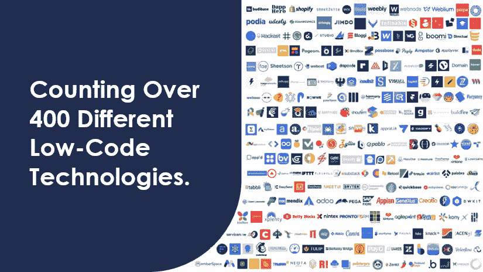

图 1.1：低代码平台的集合

### 现成解决方案

**现成**的解决方案，例如**开箱即用的客户关系管理解决方案**，是一个很好的起点，但并不总是符合组织的需求。世界上并非每家公司都相同。这些解决方案需要扩展和配置，以满足特定的需求。并非每个业务需求都有现成的解决方案。构建和扩展所需的技能变得非常抢手且难以找到。

供应商开始越来越多地专注于他们的基础产品，使得它们比以前更容易扩展。无需编写代码即可配置或定制解决方案的能力变得更加普遍。例如，Dynamics CRM 和 SalesForce 等工具允许进行字段、表视图、表单和仪表板的配置，而无需编写任何复杂的逻辑。这使得许多企业能够根据自身需求配置基于供应商的基础解决方案，并且仅在必要时通过定制代码进行扩展。

实际上，供应商基于的产品能够以更简单的逻辑进行配置的范围越广，就越好。事实上，这些产品变得如此可配置，以至于几个提供配置解决方案的组织创造了**xRM**这个术语，其中的 X 代表代数中的 X，X 可以是任何东西。因此，而不是**客户关系管理**，组织采用了**任何关系管理**，并且实际上比最初预期的更多地扩展和配置了它们的各种工具集。

### 从零开始构建的解决方案

有许多其他低代码开发平台值得提及；然而，最值得注意的是以下这些：

+   **Mendix**

+   **OutSystems**

两个组织都认识到基于市场上缺乏开发技能的**快速应用开发（RAD**）的需求，因此它们都专注于为开发者提供工具，以便软件解决方案能够快速创建并投入生产。

高德纳（Gartner）每年发布一份报告，讨论提供低代码平台的公司所采用的趋势和策略。这份报告包含一个增长指标，称为高德纳魔力象限，它将平台提供商分为四个类别：利基玩家、挑战者、愿景家和领导者。领导者象限位于右上角，代表领先的供应商。两个提供商都被发现位于高德纳报告的右上角，并且在组织中都非常受欢迎。在组织中找到大约三种低代码平台的混合体是非常常见的，而 Mendix 或 OutSystems 成为其中之一的情况更为普遍。

## Power Platform

微软 Power 平台是一套低代码工具，它使不同技术技能水平的制作者能够创建有用的解决方案，以应对各种复杂性的业务挑战。Power 平台是微软对快速应用开发（RAD）的持续增长回应。

Power 平台并非从头开始创建。它诞生于微软云中，是各种技术的组合，这些技术以民主化的方式被普及，使得快速应用开发对任何愿意学习的人开放。

制作者可以通过平台中的多个工具来操作、自动化、分析和可视化数据。随着微软的发展，Power 平台也在不断发展。微软始终致力于创新，创新越多，Power 平台中的工具就越好。这使得通过更少的点击就能实现结果并达到预期目标变得容易得多。我们越快得到即时满足，就越好。*图 1.2*展示了 Power 平台组件的概述以及它们之间的关系。

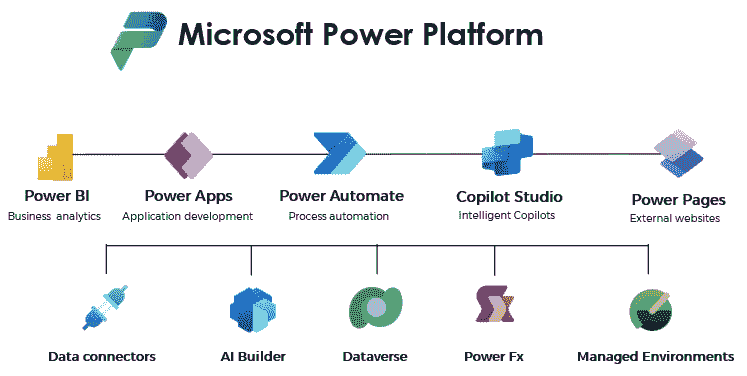

图 1.2：微软 Power 平台的概述总结

通常，当我们查看微软云堆栈时，我们可以识别出各种 Power Platform 产品是从哪里起源的，然后是如何扩展和成长，以与许多其他领域和产品协同工作的。*图 1**.3* 展示了 Power Platform 组件实际上是如何从微软堆栈中的现有领域发展而来的。

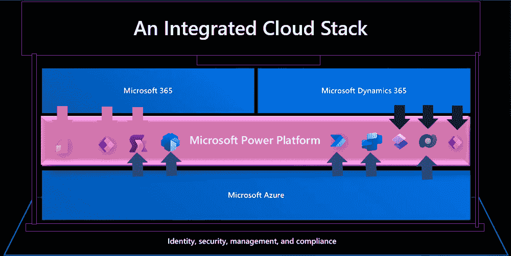

图 1.3：微软云的概述以及 Power Platform 如何融入其中

例如，Power BI 源自微软 Excel 和一个名为 **Power Pivot** 的产品。Excel 几年前就有在数据之上生成可视化的能力。为了推动数据集中到云端，这一功能被民主化，变成了一个基于云的可视化工具——Power BI。

Dataverse 是一个民主化的数据存储和治理设施，并作为许多 Dynamics 365 产品的基石。在此之前，这一层在客户和合作伙伴社区中被称为 xRM。

最终，Power Platform 在微软的集成云和产品堆栈中运行，这是它拥有如此高采用率的主要原因之一。

我们周围的世界正在迅速变化，这一点在我们过去看到的技术趋势和我们目前看到的趋势中都有体现。我们需要学会随着这些趋势而变化，并学会学习。我们现在明白，我们所有人都有巨大的机会去学习和改变我们做事的方式，并开始使用低代码作为一种更快工作的机制。我们使用低代码工具的时间可能比我们意识到的要长得多。在过去，能够使用微软的 Office、Azure 和 Dynamics 365 等工具，已经让许多人拥有了使用 Microsoft Power Platform 构建有用解决方案的工具。在下一节中，我们将探讨数字化转型背后的经济动态以及它们如何影响社会的各个方面。

# 理解数字化转型中的经济力量

数字化转型的经济动态有数百种，随着低代码平台和人工智能的引入，向数字化转型加速的推动力已经成为所有组织的一个真正焦点。那些早期就建立了数字化转型战略并实际分配预算以改变工作方式的组织，正在领先于许多其他组织，并在市场上占据更主导的地位。那些没有将数字化转型视为优先事项的组织可能在生产力和增长方面受到影响。

输出相对简单；那些数字化准备好的组织将能够更快、更准确地服务客户，减少对流程和人工工作的需求。一个典型的例子是，与其手动构建文档，不如让您的 CRM 系统为您完成，并自动与客户共享。这样每次可能就能为特定个人节省 30 分钟的工作时间。如果我们用金钱来衡量，通过做 X 我们节省了多少钱？这是可以计算出来的。

## 但我的工作怎么办？

技术的飞速进步及其在社会中的地位可能相当难以消化，因为构建文档的人可能处于风险之中，因为他们将被理解 CRM 系统制作文档的人超越。

对于使用 AI 的人来说，情况也将类似。AI 不会取代某人的工作；而是理解 AI 的人可能会取代某人的工作。

创新前沿的公司将有更多时间改变他们的工作方式，并培训他们的团队使用工具，提高生产力，并简单地说，超越其他组织。

正如提到的浇灌庄稼的人的类比，将需要进行大量的学习，最重要的是，有学习的空间。组织需要为人们分配学习时间，并确保有适应这一点的指标。再培训和提升技能很重要。

## 数字不平等

实际情况是，那些走在前面的组织花在前面时间越多，其他组织的员工就越糟糕。他们最终会赚更少的钱，花更多的时间做他们不想做的事情，并感受到数字不平等的影响。

当未来没有清晰的可见性，并且在技术和业务层面领导层缺乏参与时，就会发生这种情况。它将导致诸如**无声辞职**和**大辞职潮**等问题，最终人们将改变方向，将角色转移到他们更有效且最终能赚更多钱的地方。

这种大规模的转变对那些创新不足的组织来说并不好，因为它们将难以招聘并提供他们的服务。

## 谁来修理机器？

在任何有创新的场景中，并不总是会有工作流失，但通常会有工作创造。在一个创新的世界里，需要获得新的技能。牙膏厂的类比就浮现在脑海中。

人员 X 在牙膏厂拧牙膏盖。实施了一台机器，其拧牙膏盖的速度是人工的两倍。机器坏了。谁去修理这台机器？

好吧，当然，那个拧牙膏盖的人理解盖子应该如何拧上，机器需要做什么；他们只需要学习机器是如何工作的。

这个概念在社会上是普遍的，并且是数字转型经济动态的主要焦点。组织对转型需求的增长将需要新的技能、可转移的技能和技能提升。

在低代码的世界里，我们看到公交车司机、挡风玻璃修复工、安全管理员和职业开发者正在学习如何使用 Power Platform 来提升技能，并通过构建业务解决方案来解决以前手动管理且未优化的问题，从而帮助他们的企业。

## 规则

这是一个思维方式的根本转变，因为有一个绝对的确定性，即随着数字景观的变化，围绕数据安全和如何治理这些数据的规则和法律也会发生变化。数据是我们自己和我们的公司以及流程的数字足迹。如果数据受到不尊重，它可能会被用于邪恶的目的。

组织需要采取新的方法来理解和看待安全和治理，再次思考如何将现有员工引导到一个更加结构化的合规机器。随着人工智能开始进入组织并作为糟糕数据和安全的响亮喇叭，这一点将变得更加重要。合规经理需要成为数字合规经理。健康和安全经理现在将拥有一个显著的数字调性。当制定法律时，它们将需要一定程度的数字素养。

看看**通用数据保护条例**（**GDPR**），这是一项大约在 2018 年生效的法律，规定了任何组织在处理来自欧盟内部组织的任何数据时，数据应该如何被处理。

组织做了大量的准备工作，许多组织雇佣了首席数据官和数据团队来确保规则得到尊重。这导致了一系列全新的转型产品和流程，组织需要实施。

## 总是正是时候

重要的是要理解，创新和转型往往发生在我们身上，而不是为我们发生。我们现在正在进入一个赋能的时代，我们对自己如何创新和转型有更大的控制权！在这个场景中，等待不是一种选择！数字世界的变化浪潮正在变得越来越小，越来越快，所以如果你在考虑做任何事情的最佳时机，那就是现在，所以只管去做，并加入其中。

优先考虑数字化转型并分配预算、制定战略的组织将具有竞争优势。数字化转型使组织能够更快、更准确地服务客户，减少人工工作。然而，那些不优先考虑的组织将在生产力和增长方面受到影响。提升和再培训员工以跟上数字变化的必要性需要成为所有公司的投资领域。组织必须采取新的安全和管理方法，优先考虑合规性和数字素养。我们不能忽视创新和增长，这必须成为希望增长和成功的业务的一个重大关注领域。在下一节中，我们将探讨微软如何以包容的方式帮助我们推动转型和创新向前发展。

# 以微软引领低代码市场

已经变得非常清楚的是，微软已经成为低代码空间的主要领导者之一。通常，它们可以在 Gartner 的右上象限中看到，如下所示：

+   Mendix

+   Outsystems

+   ServiceNow

+   Salesforce

+   Appian

六大领先供应商通常根据其执行解决方案创建和实施的能力以及愿景的完整性进行相当大的调整。

有几件事情使微软成为明显的领导者，但使微软成为领跑者的主要事情之一是 Power Platform 如何与其他产品定位在一起。当购买许多 Microsoft 云产品，如 M365、Dynamics 365 和 Azure 服务时，Power Platform 作为预装许可证的一部分包含在内。

当购买 Dynamics 365 时，它实际上是一个复杂的 Power Apps（模型驱动应用）集合，其中包括 Power Automate Cloud Flows 作为工作流和流程自动化引擎。

当一个组织购买 Office 365 E5 时，许可证中包含 Power Apps 和 Power Automate 的级别，因此制作者可以将 Power Apps 和 Power Automate 流作为他们日常业务生产力流程的一部分。

全球有 12 亿 Microsoft Office 用户，这意味着有 12 亿不同级别的 Power Apps 和 Automate 用户。Power Platform 产品在 Microsoft Office 社区中非常受欢迎，因为它们增加了商业和个人生产力产品的景观。

最终，在许多场景中，当与一个组织谈论 Power Platform 时，工具集已经以不同的方式存在，并且由于它与 Microsoft 云堆栈的深度集成，无需进行额外的审查或安全分析，因为它已经作为现有 Microsoft 产品的组成部分通过了相关流程。

这种方法对于大多数其他低代码供应商来说并不存在，因为使用产品的选择需要是一个有意识的决策，而不是现有事物的自然演变。

## 制作者类型

自从全球 RAD（快速应用开发）的兴起以来，许多组织已经采用了各种低代码工具。一些组织只是将低代码工具保留在 IT 部门内，并作为一个中央单位提供，而其他组织则将这些工具向更广泛的商业社区开放，并允许他们按需构建。Power Platform 产品在制作者（开发者）采用方面非常广泛。有大量的工具和内容供人们采用，明显的是，不同技能水平和不同领域的生活中的制作者都使用了 Power Platform 中的工具来解决各种挑战。

在低代码社区中，通常有两种类型的开发者：

+   **公民开发者**：IT 部门外的人员制作解决方案

+   **专业开发者**：IT 部门内的人员制作解决方案

对于这里的术语存在不同的意见；然而，并不是所有的制作者（开发者）都可以同等对待。通常，公民开发者需要比专业开发者更多的培训和指导来创建解决方案。

要推动 Power Platform 的利用率，重要的是要理解，并非每个在制作生涯早期的人都会熟练掌握，因此工具需要感觉熟悉且易于使用。然而，这是一把双刃剑；工具还需要允许高度复杂的情况和经验丰富的专业开发者。这是一条非常难走的钢丝绳，因为可能会过分依赖某一方，从而失去制作社区中的一个非常重要的元素。

## 采用的便捷性

在任何组织中，当探索新技术并最终采用它们时，采用过程可能相对复杂。重要的是要理解，推动采用主要依赖于人，而不是技术。与更广泛的人群沟通的方式以及知识共享的方式至关重要。

### 入门

Power Platform 中的工具允许所有类型的开发者创建有用的解决方案，并且对于知道如何使用常规 Microsoft Office 工具（如 Excel 和 PowerPoint）的人来说，入门门槛并不高。例如，Power Apps 画布应用制作体验与 PowerPoint 和 Excel 非常相似。

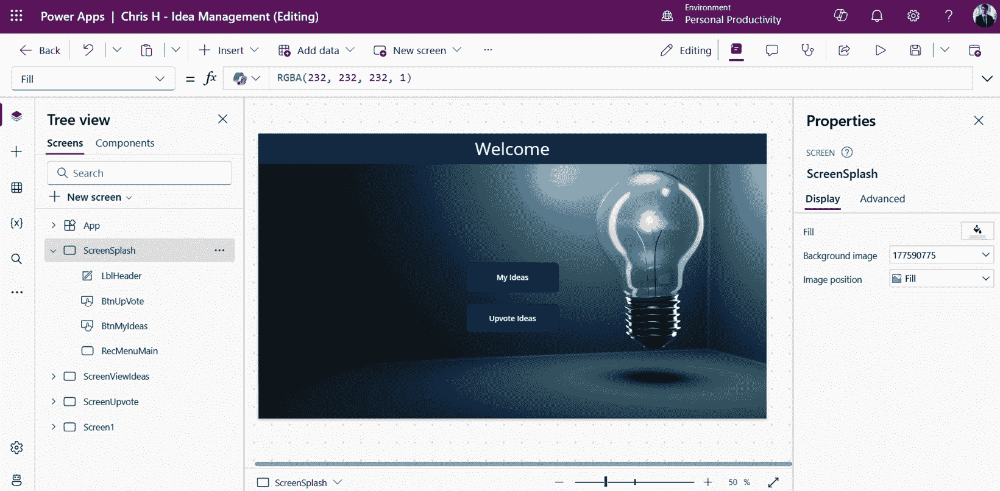

图 1.4：Power App 画布应用制作体验

这种入门障碍在工具集中是相似的，制作者可以轻松访问他们所需的工具集（前提是他们拥有相关的许可和安全访问权限）并开始创建有用的解决方案。

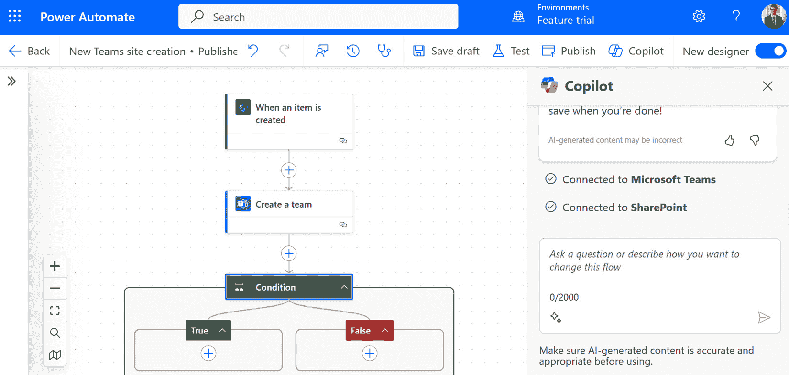

图 1.5：Power Automate 云流程制作体验

Power Automate 云流程设计者极其简单易懂，并且能够推动所有制作类型的高度采用。

### 对于已经装备齐全的制作者

对于那些已经了解并且已经理解 Power Platform 内部区域如何运作的制作者，他们可以深入挖掘以开始以更深入的方式与平台互动。如图 *图 1.6* 所示的 Visual Studio Code 和 Power Platform 工具等工具可以用来推动 Power Platform 中的专业发展。

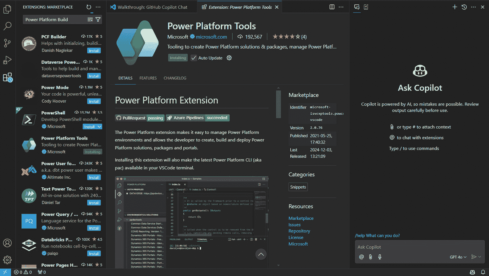

图 1.6：带有 Power Platform 工具的 Visual Studio Code

可以添加并使用像 Visual Studio Code 的 **Power Platform 工具** 这样的工具，以便更深入地探索解决方案，并在需要时扩展和构建更复杂的功能层。随着制作者在学习过程中不断进步，更广泛的工具集在采用方面变得越来越重要。

## 解决方案规模

可能存在一种观念，即 Power Platform 只是通过创建简单的解决方案来解决简单问题的。对此的最终回应是，这并不真实。有许多组织在其业务的关键和重要部分上运行 Power Platform。

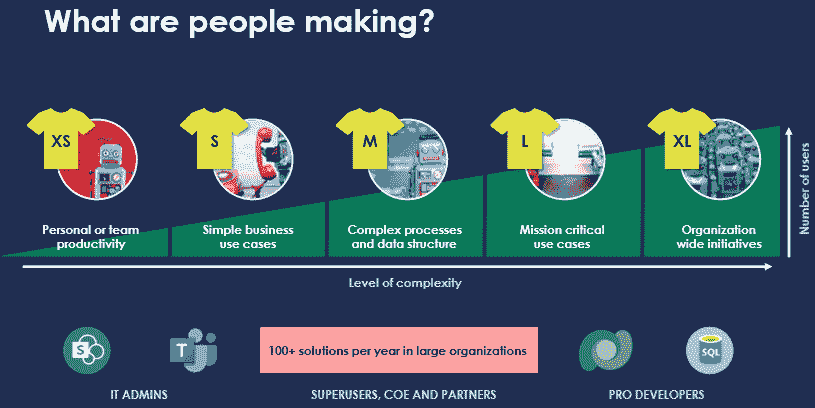

图 1.7：使用 Power Platform 技术定期创建的解决方案类型概述

实际情况是，解决方案的大小和类型将完全取决于制作者试图解决的问题类型。高关键性的解决方案通常需要非常严格的数据、安全和正常运行时间规则，因此将建立在非常可靠的架构（如 Dataverse）之上，因此与不那么关键的解决方案相比，成本也会不同，这些解决方案可以建立在管理较少的结构之上。

低代码并不意味着低复杂性！使用 Power Platform 工具可以构建的解决方案通常非常复杂且高度集成。

例如，Dynamics 365 销售服务、营销套件产品是建立在 Dataverse 之上的，是一套经过深思熟虑、非常健壮的模型驱动应用程序，使用了多个自定义组件和插件。模型驱动应用程序是 Power Platform 的数字构建块。

回顾一下，Power Platform 允许不同技能水平的制作者在高度灵活且通常已在组织内部获得批准的框架内，以安全可靠的方式构建不同复杂性的解决方案。Power Platform 是低代码空间中最广泛采用的技术之一，这一点可以归因于上述几点。

我们已经探讨了微软在低代码应用和自动化开发市场中的主导地位。微软是低代码领域的领导者之一，与其他领先供应商如 Mendix、OutSystems 和 Salesforce 并列。Power Platform 与其其他产品并列，使其成为市场中的明显领导者。Power Platform 产品在微软 Office 社区中非常受欢迎，因为它们增加了产品和业务及个人生产力景观。Power Platform 允许所有类型的开发者创建有用的解决方案，并且对于知道如何使用 Excel 和 PowerPoint 等常规 Microsoft Office 工具的人来说，入门门槛不高。它也非常灵活，通常已经在组织内部获得批准，使其成为低代码空间中最广泛采用的技术之一。在下一节中，我们将看到微软如何通过 AI 伴侣功能的形式，将这些产品与生成式 AI 结合起来。

# 用 AI 伴侣革命化低代码开发

在过去几年中，由于对业务生产力解决方案的需求增加，有必要提高对低代码平台的采用驱动力。在过去的几年里，**大型语言模型**（**LLMs**）已经出现在市场上，尤其是在 OpenAI 和 ChatGPT 等产品中。LLMs 是人工智能的一个子集，执行自然语言处理。本质上，它们利用自然语言来执行任务。

微软宣布与 OpenAI 建立了合作伙伴关系，并将 LLM 功能嵌入到各种产品中，如 Dynamics 365、Microsoft 365，以及对于这个关注领域来说非常重要的 Power Platform 产品。这些被称为**伴侣**。微软的特定产品将具有嵌入的伴侣功能，以使用自然语言创建和扩展解决方案。

这对 Power Platform 来说意义重大，主要原因之一是它降低了创建更低级解决方案的门槛。那些能够用自然语言简单书写的人现在可以要求伴侣在几秒钟内创建应用、自动化或机器人。

## 一个实时示例

让我们看看一个需要创建一个基本车辆检查应用的组织，该应用需要响应式，并允许用户进行快速车辆检查，这些检查将在稍后的报告中使用。要开始，只需用自然语言向 Power Apps 伴侣请求创建应用即可。

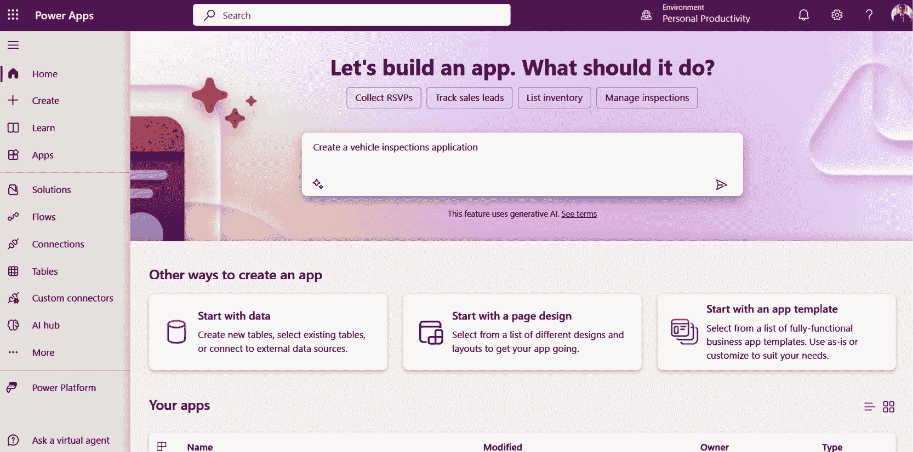

图 1.8：Power Apps 伴侣用户界面

Power Apps 伴侣将自然语言解释为在 Dataverse 中生成数据表。

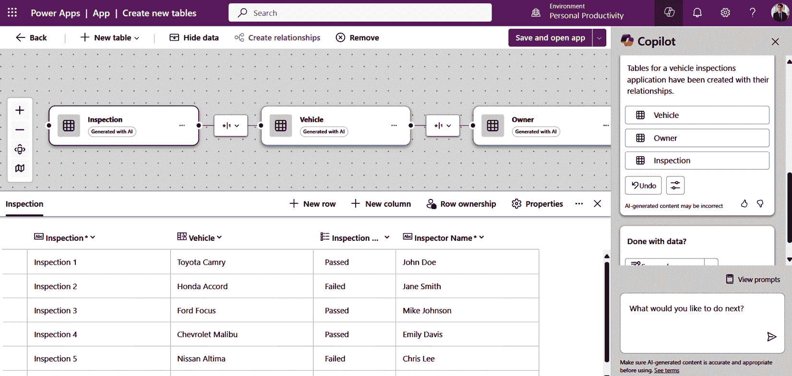

图 1.9：Power Apps 伴侣用户界面和数据

数据随后将被审查，并可以直接从这些数据中创建一个响应式的 Canvas 应用。

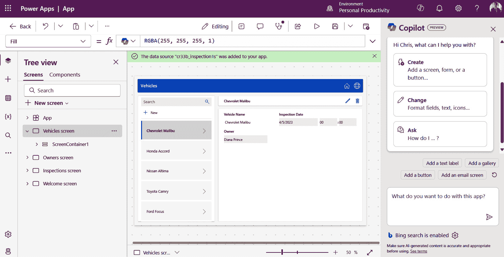

图 1.10：带有 Copilot 的 Power Apps Canvas 应用程序制作体验

这个简单的三步过程通常需要中级经验制作人员大约半天的时间。

## 这对整个 Power Platform 意味着什么？

在 Power Platform 工具中使用嵌入式 Copilot 功能具有多重好处。当创建特定规模的解决方案时，这种功能带来的生产力水平令人惊叹。使用自然语言构建和扩展解决方案的能力将推动制作和管理工作方式的重大转变。

随着人们在 Copilot 中使用沉浸式自然语言体验，并且将反馈与微软共享，这些工具将只会变得更好、更快。我们已经看到了这种模式在 Power Platform 当前产品堆栈中的体现。在过去几年中，这些产品已经显著增长，现在它们被 AI 超级充电，人们期待它们的技术基础和功能将飞速提升。

我们还可以期待工具的重命名，以映射到与 Copilot 功能相同的方式，正如我们看到 Power Virtual Agents 已经重命名为 Copilot Studio，并且 Copilot Studio 内的功能已经如此深入地融入了深度嵌入的 AI，以至于它已经拥有了生命。Copilot Studio 是从头开始创建低代码自定义 Copilot 的首选产品，同时也是扩展 Microsoft 365 Copilot 的产品。

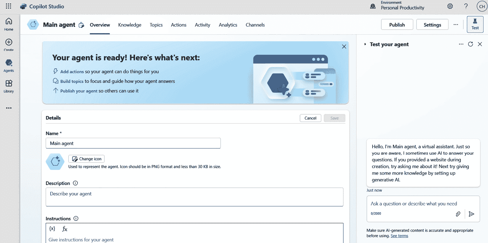

图 1.11：Copilot Studio 用户界面

我们可以期待生成式 AI 将以不同形式进一步集成到微软产品和 Power Platform 中。我们可以期待我们的制作体验将更多地依赖于提示 AI 引擎并在自然语言中进行配置，而不是编写数百行 Power Fx 和插件代码。

这是一段非常激动人心的时期。

我们已经研究了微软与 OpenAI 的最新合作，将大型语言模型（LLM）功能嵌入到各种微软产品中，包括 Power Platform。这使用户能够使用自然语言创建解决方案，并降低了创建应用程序、自动化和机器人的门槛。已经提供了一个现场示例，说明如何只需三步即可使用 Copilot 创建基本的车辆检查应用程序。讨论了使用 Copilot 的好处以及它如何推动生产力和革新制作和管理解决方案的方式。我们可以期待生成式 AI 进一步集成到微软产品和 Power Platform 中，使其更加依赖自然语言输入。我们明白，未来已经到来，因此在下文中，我们将深入探讨组织如何利用 Power Platform 创造战略增长。

# 利用 Power Platform 创造战略增长

Power Platform 正如其名称所说……它是一个平台！它不是一个应用程序。这是一个需要重新定位的持续视角，因为许多人和组织都认为 Power Platform 只能解决一个问题，而不是多个问题。许多组织认为购买 Power Platform 就是制作一个应用程序或一个自动化。这实际上并不是真的。这种观点与购买 Office 相同，但只是永远只发送一封电子邮件或制作一个 Excel 文档。

## 实现战略转型愿景

这个过程中的第一步是改变对 Power Platform 的看法和文化的视角。它不能仅仅是一个解决一个或两个问题的战术解决方案。从更广泛的组织的角度来看，这个平台应该是战略性的，应该被视为解决许多业务问题的方法。

为了实现这一点，必须在最高层面做出决定，投入时间和金钱在这个方法上，并使更广泛的生态系统的人、流程和技术得以启用。这需要是一个在所有层面都得到充分支持的决策。

当审查 1.2 亿人使用诸如 Microsoft Office 等工具的采用情况时，大多数高级和执行人员并没有真正理解所投入的是什么，只知道这些工具对业务生产力很重要，而且大多数他们的竞争对手也在使用它。

## 令人畏惧的投资回报率（ROI）

以与实现 Office 功能相同的方式实现 Power Platform 的功能至关重要。并非每封你发送的电子邮件或每个你创建的电子表格都会产生投资回报。你发送这些电子邮件和创建这些电子表格，因为最终人们理解它们很重要，是必需的。

当然，一些解决方案将需要投资回报率的计算，但只有那些需要大量时间和投资的解决方案。如果你再次审查解决方案规模的方法，许多解决方案最终不会花费大量时间来创建，解决方案的制作者最终可以拥有这个解决方案。

需要定义和达成一致的平台衡量机制和协议。定量和定性指标通常构成了需要其的解决方案衡量投资回报率的方式组合。

## 谁可以制作东西？

许多组织不允许所有业务人员创建解决方案，有些组织甚至不知道人们已经在做这些事情。有例子表明，IT 部门安装并审查了 Microsoft Center of Excellence 入门套件，并发现了成千上万由制作者创建的资产。

定义谁可以在你的生态系统中构建事物非常重要。你可能不希望在治理层和数据策略正确定义之前让公民开发者构建事物。如果生态系统中充斥着资产，而没有建立支持和运营结构，平台可能会因为缺乏正确的治理设置而名声受损。

如果你知道你希望向谁开放平台，你可以通过使用 Azure Entra ID 安全结构和 Power Platform 中的许多治理功能来控制这一点。

## 人们被允许做什么？

并非所有人都会构建复杂的解决方案。大多数情况下，公民开发者将创建不如专业开发者创建的复杂解决方案，或者他们可能与专业开发者合作创建复杂解决方案。公民开发者构建高度复杂事物的可能性极低。

并非所有解决方案都同等重要。并非所有解决方案都需要进入生产状态！并非所有解决方案都需要 IT 支持！并非所有解决方案都是永久的！在许多组织中，存在一种将一切生产化的文化；然而，Power Platform 并非如此。解决方案根据其规模和关键性遵循不同的规则。

如果你能够定义每种制造类型将构建什么，那么平台可以以最佳方式管理并治理，以推动更多关键解决方案的能力。

## 人们将在哪里构建事物？

一旦你了解了人们将制造什么以及谁被允许制造它，你将能够为他们设置一个创造事物的场所。这些环境的管理方式不同，规则和法规也因所构建的内容而异。

只有某些环境将获得 IT 的支持和指导。并非所有事物都需要支持。作为一个组织，你不会支持每个创建的电子表格。Power Platform 以类似的方式运作。通过提前设置规则，可以定义治理层。

## 勇敢地去尝试

在组织内部存在一群人，他们虽然不在 IT 部门，但相对技术。我们称这个特定群体为商业技术专家。这些员工比公民开发者更有经验，并积极使用技术来解决业务问题。你很可能在你的业务中找到很多人已经在使用技术来解决问题。这些人应该被接纳，并将 Power Platform 与他们共享，作为他们构建的批准工具集。在这种场景下，至少可以应用一定程度的治理到这个数字生态系统中，并为需要帮助的人提供正确的帮助。

Power Platform 不能被视为战术性的。它必须被视为战略性的，以便得到广泛采用，并使您的企业真正充分利用平台的价值。

注意

Power Platform 不仅仅是一个应用程序，而是一个解决多个商业问题的战略平台。为了充分发挥其功能，组织需要改变对平台的认识和观念，并投入时间和金钱。平台成功的衡量标准不应仅限于投资回报率（ROI），组织需要定义谁可以构建解决方案，他们可以构建什么，以及在哪里构建它们。通过拥抱商业技术专家，并将平台视为战略投资，企业可以充分利用其潜力。

# 摘要

在我们结束本章时，我们对 Power Platform 对数字演变的影响有了深刻的理解。Power Platform 已成为变革性变革的强大催化剂，使企业能够以敏捷和高效的方式在数字格局中导航。我们探讨了围绕数字转型的经济状况以及微软在低代码应用程序和自动化开发市场中的市场份额，突出了 Power Platform 在赋权组织中的领先作用。

此外，我们探讨了 Power Platform 的最新进展，包括与 OpenAI 合作开发的协同驾驶功能。这些尖端功能利用 AI 的力量革命性地改变低代码开发体验，使用户能够以惊人的轻松和速度创建应用程序和自动化流程。

本章为您提供了利用 Power Platform 作为战略工具推动数字创新、释放变革和实现可持续增长的有价值见解和指导。Power Platform 真正改变了数字格局，其变革性变革的潜力才刚刚开始被实现。

# 加入我们的 Discord 社区

加入我们的 Discord 空间，与作者和其他读者进行讨论：

[`packt.link/powerusers`](https://packt.link/powerusers)

