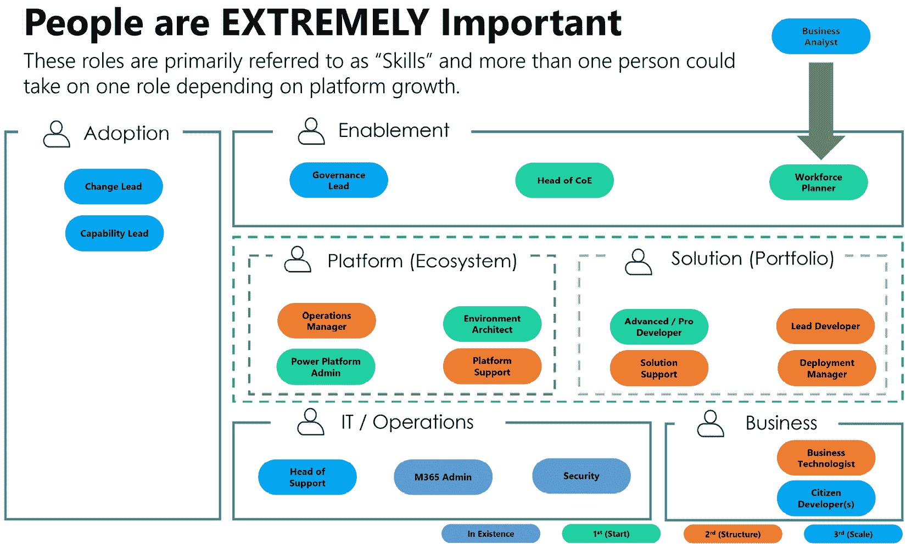
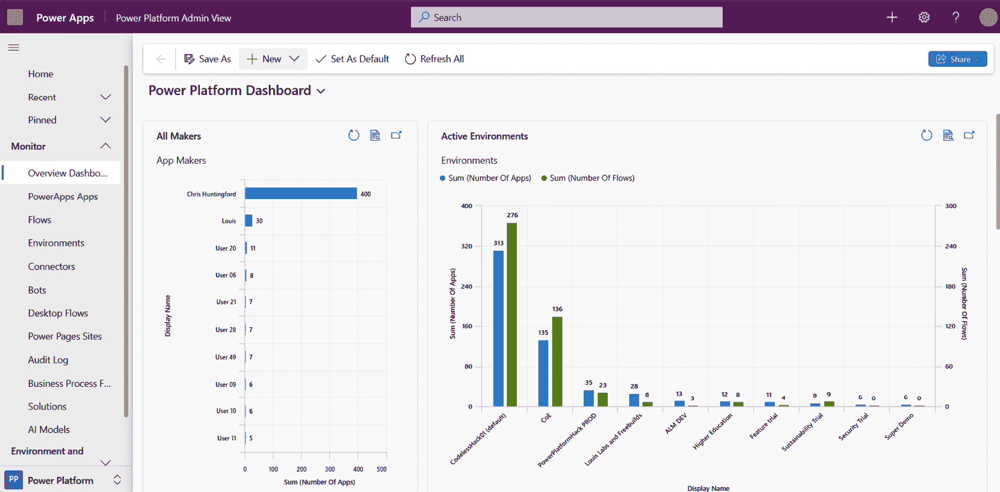
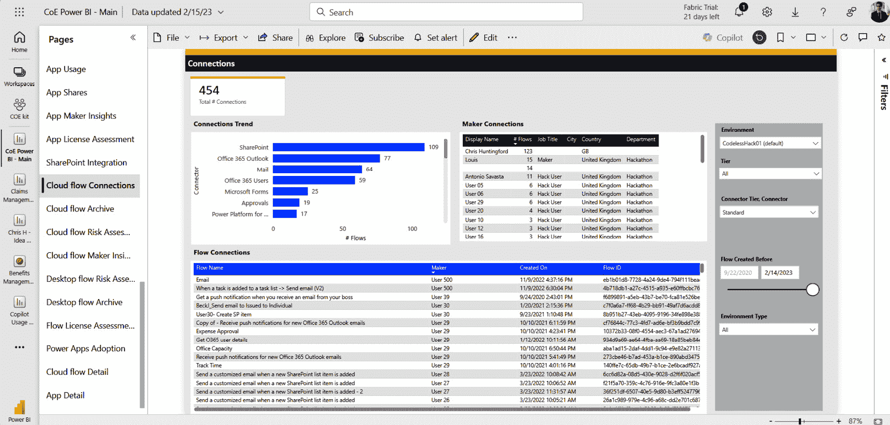
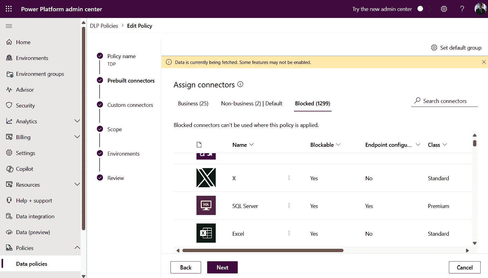

# 第四章：创建您的赋能中心

**赋能中心（C4E**）在使个人和团队在 Power Platform 中开始他们的数字化转型之旅中发挥着关键作用。它是一个安全的空间，人们可以探索、实验并创造创新解决方案，无需担心失败。通过提供培训、资源和支持，C4E 使用户能够充分发挥 Power Platform 的潜力，并在他们的组织中推动有意义的变革。

在 C4E，个人有机会提升他们在使用 Power Platform 工具套件方面的技能和熟练度。通过全面的培训计划和研讨会，用户可以学习如何设计、开发和部署应用程序，自动化流程，并从数据中获得洞察。C4E 营造了一个鼓励持续增长和知识分享的学习环境，确保个人具备必要的专业知识，以自信地驾驭数字景观。

此外，C4E 还作为一个协作和创新中心，汇集了来自不同背景和技能的个人。它为跨职能团队提供了一个协作、分享想法和共创解决方案的平台，以解决复杂的企业挑战。通过维护包容性和协作的文化，C4E 使组织能够利用其员工的集体智慧和创造力，推动数字化转型并促进持续改进的文化。

本章将涵盖以下主题：

+   在 C4E 中创造创新和探索的途径

+   通过 IT 治理使个人能够释放创造力。

+   鼓励创新和共创以实现数字化转型

# 培养创造力：在 C4E 中创造创新和探索的途径

在过去，我们经常将 Power Platform 中央治理团队称为“卓越中心”。在当时，这是一个合理的说法，因为这正是它的角色。卓越中心或 CoE 是由定义最佳实践并管理 Power Platform 资产和技术堆栈的人员组成的团队。这得到了微软发布的一个自定义工具——Power Platform **卓越中心**（**CoE**）入门套件的支持，该套件提供了许多监控、治理和培养工具，帮助管理员管理平台。

尽管这是一项极其有用的技术，但人们认为，一旦安装了入门套件，所有组织的治理问题都会得到解决。遗憾的是，事实并非如此。为了推动**卓越**，软件并不是唯一的配方成分。人们还需要考虑人和流程。随着这一概念变得越来越相关和被接受，CoE 已经转变为赋能中心，现在被称为 C4E。这更侧重于通过实施最佳实践流程和使用技术作为这些变化的促进者，在制作者社区中推动行为改变。最终，如果人们得到了赋能并展示了正确做事的方式，那么对严格治理的需求就会减少。最终，更多经过深思熟虑的指导和赋能，如社区和培训，会导致管理员不需要亲力亲为，他们可以专注于赋能更广泛的用户基础。

你如何开始创建你的赋能中心？

## 为制作者创造一个安全的空间

C4E 的核心价值之一是培养使用 Power Platform 解决商业问题和创新新解决方案的制作者们的创造力。为了鼓励这种创造力的文化，C4E 需要为制作者们创造一个安全的空间，让他们可以在没有失败或评判的恐惧中实验、学习和合作。

提供关于适用于 Power Platform 的治理和合规政策的明确和一致指导，例如数据安全、隐私、可访问性和质量标准，这一点非常重要。这些规则越清晰，人们就越容易遵循它们。C4E 应通过使用 CoE 入门套件、Power Platform 管理员中心和 Microsoft Learn 等工具，以透明和可访问的方式传达这些政策。C4E 还应为制作者提供培训和支持，帮助他们理解和遵循这些政策，并使用仪表板和报告监控和审计他们的遵守情况。当人们不知道平台正在被治理，也不觉得需要治理时，才是最佳治理形式。

我们应该鼓励制作者探索 Power Platform 的全部潜力，利用其 Pro 代码、低代码和无代码功能，与其他 Microsoft 产品和第三方服务的集成，以及通过自定义代码和连接器的可扩展性。C4E 应向制作者提供访问 Power Platform 最新功能和更新的权限，以及帮助他们学习和提高技能的资源和方法。C4E 还应展示组织内 Power Platform 的成功案例和使用案例，并庆祝制作者们的成就和创新。

在过去，为创作者提供机会在 Power Platform 内部以及跨团队和部门协作和分享他们的想法、反馈和经验，已被证明是非常成功的。协作越多，越有可能吸引更多人参与和分享。C4E 应该利用 Teams、Viva Engage、SharePoint 和 GitHub 等平台，促进创作者之间的沟通和知识共享。C4E 还应组织活动，如黑客马拉松、研讨会、网络研讨会和用户组，以推动创作者之间的社区和参与度。

通过为创作者提供一个安全的空间，C4E 可以鼓励 Power Platform 用户的创造力和潜力，并赋予他们为组织创造价值和影响力的能力。使用平台中的工具的人越多，平台的价值就越大。

一个有用的类比是将 Power Platform 与 Microsoft Office 进行比较。人们每天都在使用 Office 工具，这些工具使人们能够更有效率地工作。Power Platform 实质上是一种另一种商业生产力工具，将允许人们完成他们的工作。

## 创建冠军和倡导者

C4E 不仅应该为创作者创造机会，还应该识别和培养组织内部 Power Platform 的冠军和倡导者。冠军是那些展示了高级技能和对 Power Platform 的深入了解的创作者，他们愿意与其他创作者分享他们的专业知识和最佳实践。倡导者是商业领袖或影响者，他们可以向同行和利益相关者推广 Power Platform 的价值和好处，并赞助和支持 Power Platform 的倡议和项目。

创建冠军和倡导者对于在整个组织中扩大 Power Platform 的采用和影响力至关重要。C4E 应该根据如以下标准建立明确和一致的过程来识别、认可和奖励冠军和倡导者：

+   他们构建或贡献的 Power Platform 解决方案的数量和质量。这可能是一个单独的个人或融合团队的一部分。最理想的是融合团队选项。

+   他们对创作者社区所表现出的参与度和活动水平，例如回答问题、提供反馈、分享技巧和窍门以及指导新创作者。这些类型的贡献可以通过反馈和监控来跟踪。了解这种影响很重要，因为这将对采用产生直接影响。

+   他们使用 Power Platform 实现或促进的影响和成果，例如提高效率、生产力、客户满意度、收入或创新。这些类型的指标既包括定性也包括定量。

+   他们从其他创作者、用户、客户或利益相关者那里收到的反馈和证词。证词和反馈是很好的，这些创作者/冠军可以建立自己的作品集。

C4E 还应为冠军和倡导者提供各种机会和激励措施，以增长和展示他们的技能和影响力。再次强调，为他们建立一个作品集的机制。有几种方法和策略来奖励这些人并保持他们的参与度。确保他们的承诺保持一致至关重要。失去冠军的承诺并让他们离开项目，比失去项目中的其他人员要糟糕得多，因为冠军是最显眼的。

+   为冠军提供高级培训和认证项目，例如微软学习、Power 平台学院或微软认证：Power 平台开发人员助理，确保他们能够跟上最相关的内容和技术更新。

+   将冠军纳入邀请参加独家活动和网络研讨会，例如微软 Ignite、Power 平台社区会议或 Power 平台用户组，已成为保持参与度的一种极好方式。事实上，许多冠军在这些活动中登台分享故事。这是突出你组织创新性质的一种极好方式。

+   在内部和外部平台上生成认可和可见性，例如通讯、博客、播客、社交媒体或微软 Power 平台社区，是分享人们成就的一种极好方式。显然，确保有个人和业务/的同意。许多 Power 平台冠军已被微软在文章、视频内容中介绍，甚至有些人曾与微软领导团队合作登台。支持和对在内部或外部活动（如市政厅、展示、演示或会议）发表演讲或展示的支持，真的是对辛勤工作的极大奖励。

+   微软经常提前向某些较小的群体发布功能内容进行测试。从社区获得这些反馈对于产品的构建和发布方式至关重要。参与反馈和测试计划，如微软 Power 平台采用计划或微软产品反馈循环，对冠军来说非常有价值，因为他们可以早期接触产品，并对路线图有更深入的了解。这对他们、C4E 和组织都非常有好处。

通过创建冠军和倡导者，C4E 可以利用同伴学习和影响力的力量，利用 Power 平台创造一种赋权和创新的氛围。冠军和倡导者可以帮助推动 Power 平台的采用和使用，激励和指导其他创作者，并向组织展示 Power 平台的价值和影响。

最终，你的冠军和倡导者网络成为 C4E“人员”部分的核心。

## 激发热情和鼓励创造力

C4E 的一个关键挑战是在组织中推动和创造对 Power Platform 的热情。这一点非常重要，因为平台的使用越广泛，它就越有价值。当人们感到受到启发，使用平台来解决问题时，他们将成为其更广泛采用的动力。这种热情可以通过多种形式来推动，并且有几种方法可以用来促进这种创造力。

最终，人们需要对他们将要做的有助于自己的事情感到兴奋。Power Platform 需要被视为一个令人惊叹的工具，而不是一项繁琐的任务。

向不同的利益相关者传达 Power Platform 的愿景和好处，例如商业领导者、IT 专业人士和最终用户，这是最重要的第一步之一。C4E 可以展示 Power Platform 如何帮助解决业务问题、提高效率和在整个组织内促进创新。通过利用 CoE 入门套件中的标准监控功能来展示各种资产的实际实时使用，这是一种阐述这一点的绝佳方式。

通过为潜在和现有创作者提供学习机会和资源，例如培训课程、研讨会、黑客马拉松、网络研讨会、文档、视频、博客和论坛，你将向你的社区展示，这是组织已经投入的。C4E 还可以利用 Microsoft Learn 平台，该平台为 Power Platform 提供免费在线课程和认证。我们发现，当内部 C4E 团队成员和创作者及倡导者社区为团队生成自己的专用内容时，这些内容被更广泛地采用和利用。

与倡导者类似，认可和奖励创作者的成就和贡献，例如创建徽章、证书、奖项或激励措施，是激发热情的绝佳方式，它也能让其他人成为焦点。C4E 还可以庆祝和推广创作者的成功故事和最佳实践，例如在通讯、内部网或社交媒体上突出他们的应用程序和解决方案。庆祝创作者社区的成功可能会吸引其他人加入社区并参与其中。

在制作者之间建立实践社区和协作，例如成立用户组、俱乐部或网络，是 C4E 最有用和最重要的方面之一。C4E 还可以促进制作者之间想法、反馈和支持的交流，例如举办黑客马拉松、活动或竞赛。能够收集到的反馈和协作越多，社区增长的可能性就越大。实际上，根据经验，已经证明黑客马拉松是推动能力、参与度和热情的最有效方式之一。在创意环境中聚集人们并让他们一起合作构建有用的东西，已经证明融合团队是快速构建解决问题的最有效方式之一。

通过赋予和信任制作者在 Power Platform 上进行实验和探索的能力，同时提供指导和治理，将向您的社区展示这是您业务的一个战略领域。C4E 应该使制作者能够访问他们所需的工具和数据，同时确保合规性和安全标准。最终，制作者将找到一种方法来发挥创造力并构建事物，因此给他们一个安全的空间来发挥创造力是更好的选择。

通过推动和创造对 Power Platform 的热情，C4E 可以激发组织中的创造力和创新。创造力涉及提出新颖、有用且实用的想法，这些想法有可能被实施。创新则是将这些想法变为现实！实际上，为他人生产化这些想法，让他们受益。我们在 Power Platform 制作者社区中看到的是来自所有背景和技能水平的人们开始使用可用的工具来创建解决通常非常困难问题的出色解决方案。

Power Platform 的一个关键特性是它允许制作者在他们最舒适的地方工作和创新。无论是选择直接使用工具而不编写任何代码，还是进行全栈式的高代码开发。现在随着 AI 和协同驾驶程序融入平台，制作者可以更加富有创造力。出现了大量不仅仅是应用程序的解决方案。现在制作者开始使用协同驾驶程序工作室来创建基于他们数据的对话式用户体验。而且不仅仅是来自微软堆栈的数据，还有来自其他业务线解决方案的数据。这意味着几乎任何具有 API 的解决方案的数据都可以连接。这就是微软如何让我们能够将数据微服务化，无论数据在哪里，而不仅仅是微软生态系统内部。

我们现在看到制作者们更加跳出思维定式。在过去，我们一直执着于“一个应用”的概念，这个应用有一个我们与之交互的界面，但许多制作者采用的最具创新性的方法之一是利用自动化来使那些手动任务变得更加自动化。在我们工作的大多数生态系统中，几乎总是自动化工具多于应用程序。这是因为有时最好的用户界面就是没有用户界面。

组织应推广一种文化，鼓励制作者识别和优先考虑他们希望使用 Power Platform 解决的业务问题或机会，并定义他们应用程序和解决方案的目标和指标。这种类型的构思过程通常在研讨会环境中进行得最好，在那里最接近问题的人可以分享他们的挑战和需求，并在必要时构建原型。

鼓励制作者跳出思维定式，使用 Power Platform 探索不同的可能性和替代方案，并从用户和利益相关者那里寻求反馈和验证非常重要。平台在不断变化，随着 AI 工具的引入，重新思考工作方式变得更加重要。

作为 C4E 团队，支持制作者根据数据和反馈迭代和改进他们的应用程序、自动化和解决方案，并与他人分享他们的学习和发现至关重要。引入清晰的反馈机制和监控将帮助制作者根据什么有效和什么无效来理解下一步该做什么。组建您的 C4E 团队应该是首要任务和高优先级。您可以在 *图 4.1* 中看到 C4E 团队的示例，作为您团队可能的样子。

图 4.1：启用团队和技能中心的示例

从传统的 CoE 向现代 C4E 的演变，重点是培养 Power Platform 社区内的创造力和创新。C4E 的核心价值观包括为制作者提供一个安全的空间进行实验、学习和合作，无需担心评判，为制作者提供资源以探索 Power Platform 的全部潜力，以及培养实践和协作的社区。此外，C4E 识别并培养 Power Platform 的倡导者和冠军，建立认可和奖励他们贡献的程序。此外，激发热情和促进创造力对于推动 Power Platform 的更广泛采用和使用至关重要，鼓励制作者跳出思维定式，并从用户和利益相关者那里寻求反馈和验证。最终，C4E 在赋予制作者权力和支持他们在组织中创造价值和影响方面发挥着至关重要的作用。在下一节中，我们将探讨如何实现指导性赋权以及如何帮助您的 Power Platform 社区参与进来。

# 通过 IT 治理赋能个人释放创造力

你如何让你的 Power Platform 制作者释放他们的创造力和创新，同时确保与 IT 治理的合规性和安全性？这个问题本节将通过介绍引导赋权及其对制作者和组织的益处来解答。

在本节中，我们将探讨如何使用 Power Platform 平衡对 IT 治理的需求和对制作者赋权的渴望。我们将介绍引导赋权的概念，这是一种为制作者提供自由和支持以创建有影响力的解决方案的方法，同时使它们与 IT 最佳实践和政策保持一致。

这可能是一种平衡行为，并且确保业务的管理和风险规则得到尊重，并且给予制作者足够的空间和自由去构建有用且安全的东西是非常重要的。

## 创建一个赋能的环境

一个赋能的环境是赋予个人使用 Power Platform 表达他们的创造力和潜能的能力，同时确保与 IT 治理和最佳实践保持一致。重要的是所有相关方都应舒适于已经建立的管理和指导框架及流程。通常，平台在技术上可能可行与期望之间存在分歧，因此沟通和提前设定期望非常重要。

第一步是识别并吸引那些对使用 Power Platform 解决业务问题或改进流程感兴趣的组织的制作者。为他们提供资源、指导和支持，帮助他们开始并学习平台的基础知识。这可以通过利用 CoE 启动套件来实现，该套件列出了顶级制作者。通过与所有这些人互动，你的 C4E 将迅速发展成为一个积极参与的社区，并成为你冠军网络的潜在冠军。

人们需要遵循哪些规则？建立并传达使用 Power Platform 的明确政策和指南，例如命名约定、安全角色、数据源、应用共享和审批流程。使用 Power Platform 管理中心和卓越中心（CoE）工具包来管理并监控你组织中的平台使用和性能。越早建立这些规则越好。重要的是要理解：

+   人们正在制作什么？

+   人们在哪里制作东西？

+   谁在制作东西？

理解这三件事将使你能够以最佳方式设置你的生态系统，以最好地支持你的制作者。在*图 4*.*2*中，我们可以看到一个关于 CoE 启动套件监控的例子，我们可以看到在特定环境中构建的应用和流程的数量。

图 4.2：卓越中心启动套件打开仪表板。

### 人们正在制作什么？

如果您知道人们正在创建什么，那么作为一个 C4E 团队，您可以对这些解决方案应用适当的支持和管理级别。为更复杂或关键的解决方案提供支持，而对可能不那么关键的解决方案提供较少支持，这是一种很好的资源利用方式。并非每个解决方案都是平等的。

### 人们在哪里创造？

并非所有环境都是平等的。在默认环境中创建的事物不应得到 IT 的全部支持。确保解决方案在环境中得到隔离，这将反映您的环境策略。

### 谁在创造？

理解和定义您的创造者原型对于为创造者提供一个安全的空间至关重要。经验较少的创造者需要更严格的治理，因为他们可能不知道他们可能正在做错事。经验较丰富的创造者可能有权访问高级环境，在那里他们可以更自由地构建。帮助人们发现适合自己的正确路径，并在尽可能多的方面引导他们，这是非常重要的。

如果在创造者和其他利益相关者，如 IT 专业人员、业务分析师和最终用户之间建立了一种协作和知识共享的文化，那么创造者更有可能加入社区。利用现有的 Microsoft 社区，如 Power Platform 社区、技术社区和用户组，与其他全球创造者和专家建立联系，然后在此基础上构建。这将推动人们自学，并使他们能够在没有联系支持台的情况下创建有用的事物和解决问题。

通过转向“学习一切”的文化，并通过提供协作平台和指导，您可以创造一个专注于 Power Platform 使能的环境，在这里人们有动力和能力构建有用且有价值的应用，并在过程中学习。

## 确保数据和人员安全

在使用 Power Platform 构建解决方案时，数据和人员始终是首要考虑的因素。重要的是要理解数据是您、您的业务和您的客户的数字表示，因此我们必须保护好它并尊重它。数据泄露确实会发生，遗憾的是并非每个人都怀有最好的意图。我们必须始终确保我们有正确的人员、流程和平台，以确保人们和数据得到尊重。开始的一个简单方法就是查看 CoE 入门套件 Power BI 报告，了解正在使用哪些连接器。这在 *图 4.3* 中可见。

图 4.3：Power BI CoE 入门套件报告中的 Power Automate 连接器审查

一旦您了解了连接器，创建一个组织范围内的数据策略并阻止未使用的连接器！这是通过 Power Platform 管理中心管理的，这是在生态系统中停止连接器蔓延的绝佳方式。在*图 4.4*中，您可以看到许多未使用的连接器被列入了阻止列表，制作者将不允许使用这些连接器来构建解决方案。

图 4.4: 在 Power Platform 管理中心使用租户范围的数据策略阻止连接器

实质上，如果人们感觉他们可以轻易犯错并使组织处于风险之中，那么他们将在平台上构建时变得更加困难，因为他们会担心犯那个错误。硬治理很重要，但并不总是需要过于明显。

在任何生态系统中，始终需要硬治理和软治理。关键是知道何时应用每一种。硬治理将是一个物理执行的护栏，例如使用数据策略来阻止连接器，而软治理将是基于指导和学习的。应该混合使用这两种方法。

在您的组织中建立明确的政策和治理，以使用 Power Platform。定义制作者、管理员和最终用户的角色和责任，并执行适当的权限和安全设置。教育制作者了解开发和部署解决方案的最佳实践和标准，并监控他们的合规性和性能。组建正确的团队将确保治理和指导得到遵守。

保护 Power Platform 访问和集成的数据源和连接器。确保数据安全存储、加密和备份，以及在不同平台和应用程序中访问权限和数据策略的一致性。使用**数据丢失预防**（**DLP**）策略来防止敏感或机密数据的泄露或滥用，并定期审计数据流和用法。这里的一个重要观点是教育制作者了解他们正在使用的数据类型。通常，制作者社区甚至可能不理解将私人数据（**个人可识别信息**或**PII**）放入 Excel 和 SharePoint 等工具中可能被视为风险。

授权制作者构建安全、可靠和可扩展的解决方案。为他们提供测试、调试和故障排除解决方案的工具和资源，并解决可能出现的任何问题或错误。鼓励他们使用由管理员或微软社区验证和批准的预构建模板、组件和连接器。支持他们根据需求和技术的演变更新和维护他们的解决方案。

## 驱动人学习和成长

Power Platform 的一个关键优势是它使人们能够通过构建自己的解决方案来学习和成长，而无需依赖专业的开发人员或 IT 专业人员。当然，融合团队正是出于这种需求而发展起来的，但没有任何东西阻止人们自己开始。然而，这也意味着组织需要创造一个环境，让人们能够被激励和支持，专注于自己的学习和成长，并充分发挥 Power Platform 的潜力。

文化始终是鼓励学习和成长时需要考虑的首要因素。营造一种好奇心和实验的文化。鼓励人们探索 Power Platform 及其功能，并尝试不同的场景和可能性。庆祝成功，从失败中学习。奖励那些与他人分享知识和见解、寻求反馈和改进的学习者。快速失败的想法可能难以适应，但这正是创新的核心！尝试新事物，找到最佳解决方案。Power Platform 已经为我们增添了更多工具。

提供明确的指导和期望非常重要。定义制作者、管理员和最终用户的角色和责任，并传达创建和使用解决方案的最佳实践和标准。这些最佳实践可能不一定需要遵守的物理规则，它们可能是像“个人发展日”这样的概念，制作者可以利用这些时间学习和成长。或者团体培训日，人们可以参加黑客马拉松或探索他们特定职责之外的概念。这在过去非常有效，许多组织都推广自我学习的文化。

创建一个人们可以使用 Power Platform 连接、协作和共同创造解决方案的空间。提供同伴学习、导师制和辅导的机会。利用现有的 Microsoft 社区和资源，例如论坛、博客、网络研讨会和活动，并鼓励人们参与和贡献。认可和展示制作者的成就和创新，并激励他人效仿。

通过创造一个让人们专注于自己学习和成长的环境，组织可以赋权他们利用 Power Platform 并改变他们工作和解决问题的方式。这可以导致更多的创新、效率和客户满意度，最终实现数字化转型。

本节旨在探讨如何赋权 Power Platform 制作者进行创新，同时保持与 IT 治理的合规性和安全性。引入了指导赋权的概念，强调需要在 IT 治理与制作者赋权之间取得平衡。关键点包括识别和参与制作者、建立明确的政策和指南，以及培养协作和知识共享的文化。此外，本节还强调了确保数据和人员安全、推动学习和成长，以及为个人有效利用 Power Platform 创造支持性环境的重要性。在下一节中，我们将探讨构建创新和共创基础机制。

# 鼓励数字化转型中的创新和共创

Power Platform 被引入技术和转型社区，改变了解决方案的构思和创建方式。在过去，解决方案通常是由一个孤立的开发者团队根据某种规格来构建的。例如，业务的一个领域会分享一个需求与规格，开发者会创建解决方案，希望他们正确理解了规格。如果规格没有很好地定义或书写，输出或解决方案可能不适合用途。

随着低代码开发工具，特别是 Power Platform，进入市场，组织被鼓励让最接近问题的人参与到这些解决方案的创建中来。如前几章所述，最接近问题的人通常最能定义解决方案，甚至可以参与构建它。

因此，融合团队的概念应运而生。融合团队是由具有不同技能（不全是技术技能）的人组成的组合，他们聚集在一起为一个问题创造解决方案。

## 为人们提供一个平台和空间进行互动

建立创新和共创文化的关键方面之一是为人提供一个平台和空间，让他们能够相互交流并与 Power Platform 互动。这可以通过创建实践社区来实现，人们可以在其中分享他们的想法、挑战、解决方案和使用 Power Platform 的反馈。实践社区还可以为学习、指导、认可以及同行和专家之间的协作提供机会。

随着想法、问题和解决方案的共享，具有特定技能或知识的人可以相互交流并分享信息。通常，融合团队就是这样诞生的。某个领域专家会分享一个概念，其他人会认同这个概念并分享知识。

这导致了许多其他机会，例如构建**最小可行产品**（MVPs）和**概念验证**（PoCs）。这些不被视为完整的产品，而是解决方案的一部分，包含完整解决方案可能实现的具体方面。许多这些 MVPs 和 PoCs 都是在创新场景中构建的，如黑客马拉松，现在还有 Copilot，Promptathons（使用自然语言提示技术和微软 Copilot，而不是实际编写代码或构建某些东西）。

通过为人们提供一个参与的平台和空间，组织可以让他们相互学习，共同解决解决方案，并使用 Power 平台表达他们的创造力和潜力。这有助于进一步推动创新和共创文化，支持数字化转型。

## 寻找激发创造力和创新的方法

为了用 Power 平台激发创造力和创新，组织可以组织和参与各种展示工具可能性和益处的事件和活动。有如此多的机会来推动和激发创新；我们只需跳出思维定式，并考虑我们正在接触的人。

+   **黑客马拉松**：黑客马拉松是一个有时间限制的活动，开发者、商业分析师、领域专家和最终用户团队一起使用 Power 平台来创造解决方案。黑客马拉松可以是一个产生想法、解决问题、学习新技能以及促进协作和创新的绝佳方式。组织可以举办自己的内部黑客马拉松或加入外部活动，例如微软 Power 平台“为善而黑客”活动，该活动旨在利用技术解决社会和环境挑战。

+   **研讨会**：研讨会是一个结构化和互动式的学习会议，参与者可以在其中通过 Power 平台获得实际操作经验。研讨会可以根据不同水平的专业知识定制，从初学者到高级用户，涵盖各种主题，如数据建模、应用设计、自动化、人工智能和安全性。组织可以向其员工、客户、合作伙伴或社区成员提供研讨会，无论是线上还是线下，以帮助他们发现和探索 Power 平台的功能和特性。

+   **一日实验室**：微软创建了多个“一日实验室”，使用户可以通过遵循一系列说明来构建解决方案。这些是开始的好机制，对于想要了解基础知识的企业，这些非常推荐。场景是通用的，这是故意的。许多合作伙伴和社区成员已经建立了自己的“一日实验室”，这些实验室更加定制化。

+   **工具的采用**：为了激发创造力和创新，组织还应鼓励和支持用户采用 Power Platform 工具。这可以通过提供培训、文档、指导、最佳实践，以及创建反馈循环和认可系统来实现。通过赋予用户有效和自信地使用 Power Platform 工具的能力，组织可以让他们创建和分享满足其需求并增加组织价值的解决方案。

通过参与这些活动，组织可以用 Power Platform 激发创造力和创新，并围绕它建立一个充满活力和繁荣的社区。社区和创新精神的好坏取决于更广泛团队的支持，因此确保所有利益相关者都意识到并准备好参与这一运动是很重要的。

## 确保进步

用 Power Platform 激发创造力和创新的另一个关键方面是确保进步。这意味着组织应提供机会和资源，让制作者了解更多关于使用 Power Platform 工具解决日常问题以及提高他们的技能和知识。确保进步的一些方法包括：

+   **提供学习路径**：组织可以创建或使用现有的学习路径，引导制作者通过 Power Platform 工具的不同熟练度和复杂度级别。学习路径可以包括在线课程、视频、教程、测验、认证和动手项目，帮助制作者获取并展示他们的技能。例如，组织可以使用 Microsoft Learn 平台，该平台为各种 Power Platform 工具和场景提供免费和互动的学习内容。

+   **创造挑战**：组织还可以创建挑战，鼓励制作者运用他们的技能和创造力，使用 Power Platform 工具解决现实世界的问题。挑战可以基于特定的主题、领域或业务需求，并且可以有不同的难度和奖励级别。例如，组织可以使用 Power Platform 社区，该社区每月举办应用程序挑战和黑客马拉松，让制作者展示他们的解决方案并赢得奖品。

+   **培养协作**：组织可以通过创建空间和平台来培养制作者之间的协作，让他们可以相互分享想法、反馈、技巧和最佳实践。协作可以帮助制作者相互学习，发现新的可能性，并改进他们的解决方案。例如，组织可以使用 Power Platform 用户组，这些用户组是定期会面以建立联系、学习和交流 Power Platform 工具经验的用户社区。

通过确保进步，组织可以帮助制作者利用 Power Platform 推进他们的学习之旅，释放他们的全部潜能和创造力。人们学得越多，好奇心越强，就越有可能参与平台并开始解决问题。

Power Platform 被引入技术转型社区后，通过推动协作和创新实践，彻底改变了解决方案创建的方法。以前，解决方案是基于特定要求在孤岛中开发的，往往导致误解和不合适的解决方案。随着低代码开发工具如 Power Platform 的出现，组织现在正在拥抱协作方法，让最接近问题的人参与解决方案的创建。融合团队的概念应运而生，它由具有不同技能的个人组成，以应对这种方法的变化。创建实践社区对于提供分享想法、解决方案和反馈的平台至关重要，从而形成了融合团队。此外，还组织了各种活动，如黑客马拉松、研讨会和“一日”实验室，以激发创造力和推动创新。确保进步包括提供学习路径、创建挑战，并在制作者之间倡导协作，最终利用 Power Platform 解锁他们的全部潜能和创造力。

# 摘要

本章讨论了从传统的卓越中心（CoE）到现代的赋能中心（C4E）的演变，并侧重于在 Power Platform 社区中培养创造力和创新。C4E 强调为制作者创造一个安全的空间进行实验、学习和协作，无需担心评判，为制作者提供探索 Power Platform 全部潜能的资源，并培养实践社区和协作。此外，C4E 识别并培养 Power Platform 的倡导者和冠军，并建立了一个认可和奖励他们贡献的程序。此外，激发热情和培养创造力对于推动 Power Platform 的更广泛采用和使用至关重要，鼓励制作者进行创造性思考，并从用户和利益相关者那里寻求反馈和验证。C4E 在赋权和支持制作者在组织中创造价值和影响方面发挥着至关重要的作用。

下一个部分，"通过*IT 治理*释放个人创造力," 探讨了在保持与 IT 治理的合规性和安全性的同时，赋予 Power Platform 制造者创新机制。引入了指导赋权的概念，强调需要在 IT 治理与制造者赋权之间取得平衡。它还突出了确保数据和人们的安全、推动学习和成长，以及为个人创造一个有效利用 Power Platform 的支持性环境的重要性。

最后，"鼓励*创新和共同创造*以推动*数字化转型*," 讨论了通过提供一个参与平台、激发创造力和创新，并确保进步来培养创新和共同创造的文化。它强调了创建实践社区、组织如黑客马拉松和工作坊等活动，以及为制造者提供学习和成长机会的重要性，利用 Power Platform 的力量解锁他们的全部潜力和创造力。

在下一章中，我们将探讨如何利用 Power Platform 中的工具构建多种不同类型的解决方案，以及如何将这些解决方案连接到多个数据结构和服务，以便在整个组织中实现扩展。
