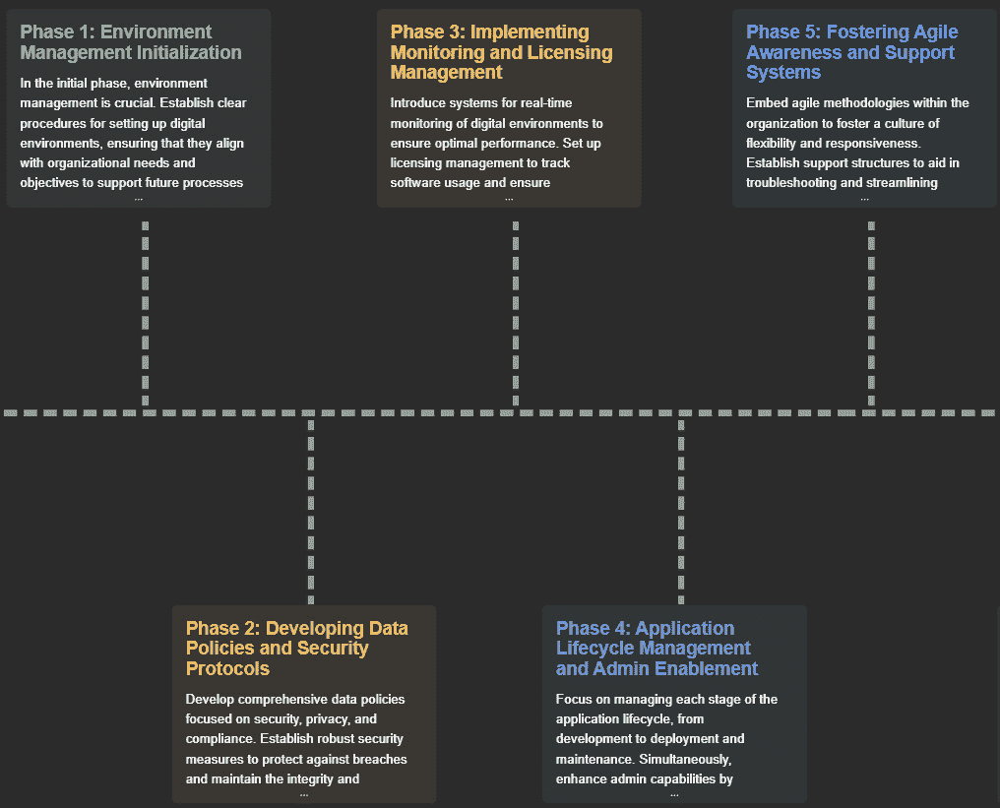
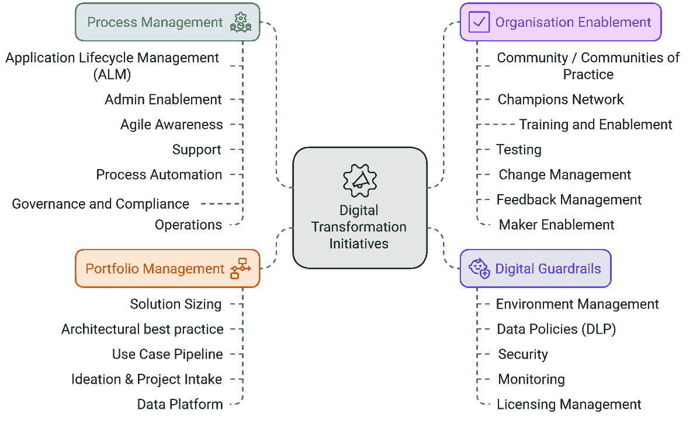
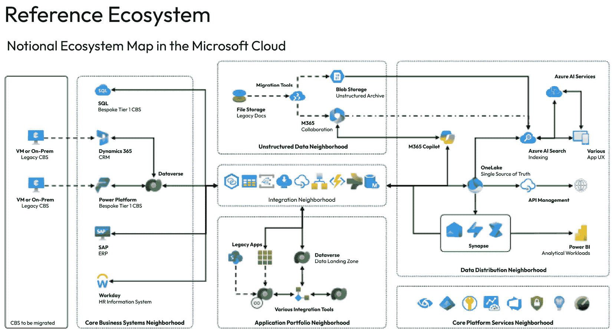
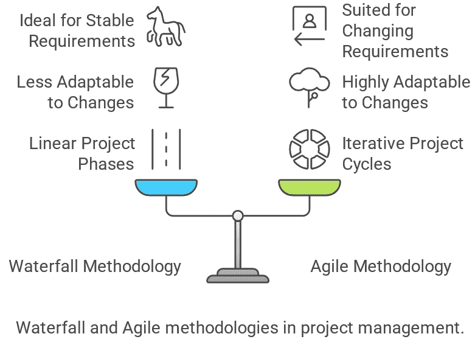
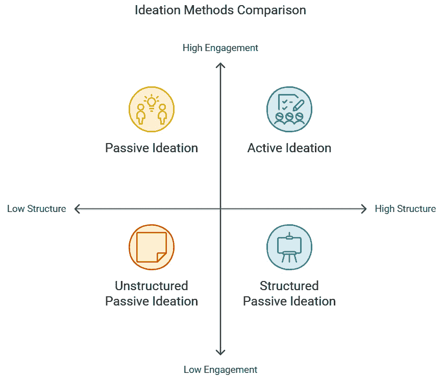
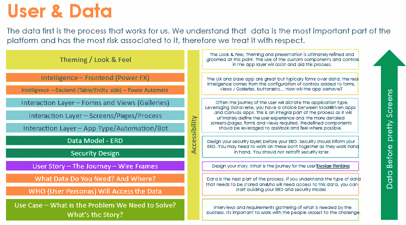
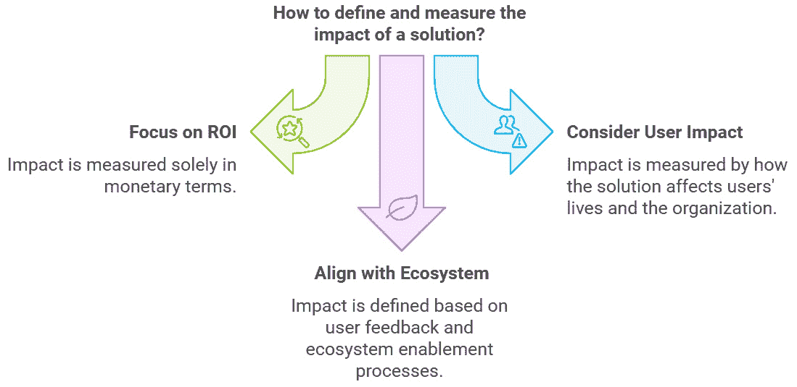
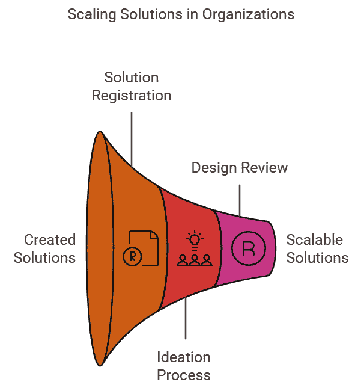
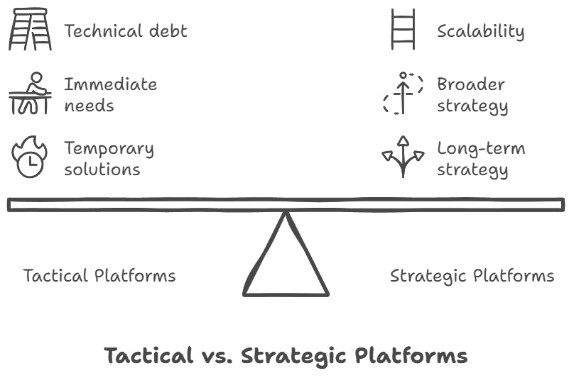

# 第五章：执行和扩展转型计划

Power Platform，凭借其低代码/无代码工具，通过执行和扩展转型计划，帮助组织将想法变为现实。其用户友好的界面和直观的设计允许业务用户和公民开发者快速原型设计、迭代和部署应用程序，而无需过度依赖传统的软件开发方法。这种方法释放了组织加速推动数字化转型潜力的可能性。

Power Platform 的一个关键优势是其无缝扩展解决方案的能力。组织可以从小规模计划开始，逐步扩展到企业级部署。Power Platform 与 Microsoft Azure 套件的企业产品集成，允许组织随着需求的发展利用额外的功能。通过利用 Power Platform 的优势，组织可以自信地执行和扩展他们的转型计划，快速开发应用程序，自动化流程，并与企业产品集成，在整个组织中推动有意义的变革。

在本章中，我们将涵盖以下主题：

+   开始你的愿景之旅

+   利用 Power Platform 进行快速原型设计和部署

+   利用 Power Platform 解锁解决方案

+   通过 Power Platform 实现有形成果并证明价值

# 开始你的愿景之旅

**Power Platform** 是一套功能极其强大的工具，可以轻松地从较小的个人解决方案扩展到广泛采用的组织计划，帮助管理和执行公司范围内的流程。这种规模只有在正确设置以支持它的生态系统下才能在可控状态下实现。可以采取多种方法和流程来确保您的组织愿景变为现实。在本节中，我们将探讨您可能采取的过程，以开始将您的愿景变为现实。

## 设定你的目标

许多组织没有机会为自己想要采用 Power Platform 的目的设定目标，因为这通常是在他们不知情的情况下发生的。Power Platform 资产通常在创建后很久才在数字生态系统中被发现。这是因为微软将其平台作为标准提供，并且它与许多其他 Office 365、Azure 和 Dynamics 365 工具深度集成。通常，制作者会意外地发现这个平台，并最终用它来构建令人惊叹的事物。

有一些情况下，IT 管理员安装了**卓越中心**（**CoE**）**入门套件**，并发现了成千上万被许多人采用的跨组织解决方案。这意味着人们已经在未受管理的状态下使用 Power Platform 解决业务问题。在许多情况下，平台已经远远超过了管理和治理的范畴，如果平台以某种方式关闭或阻止，人们的资产就会受损。这被称为**尖叫测试**；如果你尝试这样做并成功，请做好处理大量支持票的准备。重点是，在大多数情况下，关闭平台不是一种选择，这实际上向使用这些工具解决问题的人们传递了一个不健康的信号。无论你在 Power Platform 的旅程中处于哪个阶段，至少决定下一步应该做什么是很重要的。可见性和教育在这里都很重要。一个巧妙的主意是尽可能多地把人们召集到一起，共同为 Power Platform 和你的赋能中心定义一个目的。你可能想从考虑以下内容开始：

+   *谁*在使用这个平台？

+   *在平台上*构建了什么内容？

+   *在哪里*构建了这些内容？

从那里开始，这将是一个很好的起点，因为你可以决定下一步要做什么。通常，组织会采取先从简单的策略开始的办法。以下是一些例子：

+   从安全角度锁定平台

+   让内部 IT 和职业开发者使用它来构建

+   在稍后阶段向更广泛的受众推出

这三个简单的策略示例效果很好，而且足够简单，足以坚持并映射到你在设置和保障生态系统过程中的进展。

这里的想法是让每个人都同意目的，以便可以制定一个计划来确保目的得以实现。所有这些中最困难的部分是让合适的人聚集在一个房间里或进行一次通话。这在历史上一直很困难。

下一个棘手的部分是让人们就一件事达成一致！有一些技术可以帮助促进这一点，例如通过互动工具（如 Mural、Miro 或 Figma）进行的管理变革和设计思维研讨会。这样，如果人们互动并协作共享，他们更有可能更快地达到一个定义更明确的成果。

例如，你的目的陈述可以是以下这样：

*我们希望将 Power Platform 部署到 IT 团队和业务中的首批 power 用户中，这将能够实现快速解决方案的开发。我们希望用一个稳固的* *治理层* *来实现这一点*。

目的陈述必须清晰且明确！你不应该做任何不支持这一陈述的事情。为了推动这一目的，你需要一个计划！

## 你的计划是什么？

您的计划需要尽可能清晰地映射到您的目的。这就是为什么拥有一位优秀的项目领导或项目经理会大有帮助。准确规划您的项目将非常重要。您的计划应专注于帮助您实现目的的具体领域。通常，您可以将计划分解为不同的支柱，每个支柱下都会有具体的工作流（或类别）。

此计划，如*图 5**.1*所示，被称为**生态系统启用计划**，您可能需要考虑以下支柱，随后是具体分配的工作流或类别作为您计划的核心组件。每个工作流都关注您 Power Platform 生态系统的不同方面，并且每个工作流在确保为创作者创建一个安全空间以构建有用解决方案时都至关重要。

图 5.1：生态系统启用部署时间线的基本示例

### 数字护栏

**护栏**是放置在生态系统中的技术工具或平台，用于管理和维护您的生态系统。在 Power Platform 中，您可能希望将以下数字护栏工作流作为起点：

+   **环境策略**：环境是您生态系统的核心，并定义了人们将在哪里构建事物。环境策略将成为数字护栏的基础，并告知策略中的其他工作流，如数据政策和安全。

+   **数据政策**：这些政策构成了管理每个环境集可用连接器的核心机制。这些连接器是 Power Platform 的核心，需要在环境领域进行控制。

+   **安全**：Power Platform 和更广泛的 Microsoft 堆栈中的安全功能使组织能够管理谁有权访问相关工具、环境和连接器。一个稳健的安全策略将使正确的人能够访问正确的工具和环境，而无需担心数据泄露。例如，您可能希望考虑将 Dataverse 添加到所有环境中，因为它具有比在无 Dataverse 的环境中可用的更深入的安全功能。

+   **监控**：这是理解在 Power Platform 中正在利用什么的能力。通常，此过程从安装 CoE 入门套件以获得可见性开始，然后可以采用更广泛的监控功能，例如 Azure 应用程序洞察和合规中心审计报告。

### 流程

流程将定义生态系统内的人员和技术如何相互交互。您生态系统中的流程非常重要，因为它们将定义和细化工作方式。在流程支柱下，您需要考虑的一些关键领域包括但不限于以下内容：

+   **支持和运营**: 你的支持和运营结构是怎样的？平台以及平台上构建的资产是否已经定义了支持包装？可以在支持包装中定义多个流程，例如支持工单跟踪、反馈请求、事件管理等。确保这些流程定义良好非常重要，因为它们将直接影响你的支持台和人们的时间。

+   **治理和合规性**: 治理是一个广泛使用的词汇，但在 Power Platform 中，重要的是要创建和提供治理和合规性标准。通常，治理和合规性是一致的，以确保平台和平台上创建的工具以正确的方式与组织设定的规则相一致。你创建的参与规则，以确保你的生态系统得到保护，对于平台采用的成功至关重要。例如，你可以在特定环境中创建一个治理规则，规定应用只能与少于 500 人共享。

+   **应用程序生命周期管理**（**ALM**）: 这不仅仅是关于在环境之间自动移动解决方案，而是从解决方案的初始想法到不再需要后将其停用。了解解决方案如何通过这个过程以及如何进行管理非常重要。ALM 的一个重要部分是用于在环境之间移动解决方案的工具。许多组织使用 Azure DevOps。然而，Power Platform 在管理环境中提供了自己的管道功能。

+   **创意管理**: 怎样管理和追踪创意，使其进入一个合适的待办事项列表，以便提供给相关人员进行创作？这个过程定义了你的工作负载管理机制。许多组织基于 SharePoint 构建基本的创意管理解决方案，或者可能利用 CoE 启动套件中可用的创新待办事项解决方案。集中管理和创意很重要。使用平台中可用的工具构建的资产越多，平台的价值就越大。

+   **反馈**: 确保人们在使用平台时能够分享他们的经验非常重要，因为这推动了平台和生态系统的持续增长和改进。反馈信息有助于平台增长和采用。当人们的意见被听到时，那么管理和治理平台的过程就可以得到改进。可以创建一个简单的 Microsoft 表单，并在你的社区协作平台上共享，以便人们随时分享反馈。

### **组织赋能**

**组织赋能**指的是让人们了解并使用平台来创建有用事物的各种方法。启动此过程的方式通常更侧重于变革和赋能，并需要了解一些框架，例如**专业和科学**（**PROSCI**）框架。您可能想要探索的工作流程包括但不限于以下内容：

+   **实践社区**：创作者和用户将如何相互交流？一个人们可以协作和沟通的中心枢纽特别重要。考虑一个拥有共享资源和 Power Platform 指导的 Viva Engage 网站。这为 Power Platform 社区成员提供了一个中心位置，以分享知识和内容，这将有助于和支持更广泛社区的增长。

+   **倡导者**：您组织中的倡导者通常是那些持续创建事物并在整个生态系统中分享它们的积极创作者。这些人热情且乐于助人。倡导者计划对任何组织都极为有益，因为它们成为 Power Platform 社区的核心。通常，倡导者在社区中被视为英雄，并帮助他们激励周围的人。

+   **受影响群体管理**：人们将如何被引入各种创作者和用户社区？哪些人群将被分配 Power Platform 许可证？考虑受影响的群体，并思考如何推广以实现平台采用规模的扩大。

+   **利益相关者管理**：在平台采用领域，利益相关者尤为重要。您的利益相关者管理计划应推动利益相关者承担责任并积极参与，同时提供建议和领导力。

+   **培训和赋能**：最佳实践将如何在整个组织中传播？这是关键，因为人们想要学习。培训将从哪里来？一个培训和赋能计划对于在您的业务中采用 Power Platform 至关重要。

### 资料库

您的资料库包括您创建的有用事物以及您如何为创作者创造一个充满创意和成功的环境。开始这项工作计划有几种方式。在流程支柱下，您需要考虑的一些关键领域包括但不限于以下内容：

+   **创作者原型**：如前几章所述，创作者并非都相同，也不是所有创作者都拥有相同的技能集。设置您的创作者原型非常重要，这样您就可以定义人们可以访问的地方和内容。这将使创作者的生活变得更加容易。

+   **制造者旅程管理**：制造者将以不同的方式并在不同的时间参与平台。有些人确实需要学习和研究，而有些人则不需要。定义制造者原型旅程可能的样子将有助于简化制造者参与的方式。制造者原型旅程是制造者为了创建有用的东西而采取的旅程。通常，它是一系列步骤，从制造者发现平台开始，最终导致解决方案被创建并投入生产，以便在整个业务中消费。

+   **制造者最佳实践**：在制作解决方案时，始终需要遵循一些规则。这种实践应该在整个制造者基础中共享，并且制造者需要理解“这是我们在这里做事的方式。”

+   **数据、连接器和许可**：这是赋能和组合构建的重要组成部分。对于许多组织来说，这非常不同，因为一些组织将平台视为完全战略性的，并投资了高级许可，而另一些组织则将其视为战术性的，仅使用种子许可。为了在数据应存储和管理的地方做出明智的决定，以便尊重你组织的合规性和风险政策，了解数据连接器的核心基础非常重要。

+   **架构最佳实践**：这与制造最佳实践略有不同，因为它更加技术化。它涉及对平台层面的 Power Platform 的理解，而不是在应用或流程层面。这是为所有制造者设定场景。

如 *图 5.2* 所示的生态系统赋能计划应尽可能多地整合这些工作流作为其核心，并可以作为一个 *聚集和实施* 的敏捷方法来执行，其中你专注于每个工作流，尽可能多地提问，然后为每个工作流定义一个迷你实施计划。

图 5.2：经典生态系统赋能计划的分解

例如，对于实践社区工作流，你需要确保提出关于人们将在哪里协作、他们将如何获取访问权限、谁将管理这些区域以及如何入职人员的问题。

随后，需要执行以下操作：

+   实施 viva engage 或 teams 社区网站

+   指定社区领导者

+   定义社区入职流程

每个工作流中都有许多其他可以关注的领域，这些领域将与你的组织一起发现。

## 建立基础

建立基础是最困难的阶段。这是因为平台上可能已经存在需要审查的事物。在大多数情况下，这些解决方案需要不受在生态系统启用计划期间对平台所做的任何更改的影响。基础阶段之所以重要，是因为它侧重于技术（平台）作为建立所需治理的初始机制。这在市场上被称为*建立* *护栏*。

### 建立护栏

总是以护栏开始！护栏支柱中的工作流程至关重要，将立即提供最大价值。无论您的组织拥有数千个资产还是没有，护栏支柱都是开始的最佳地方。制定环境战略并确保数据政策到位。确保您正在保护任何新事物。您总是可以逐步清理环境。建立核心护栏将为 Power Platform 管理员带来安心。

下一步将取决于您生态系统中已经建立的内容。如果您已经拥有高采用率，您应该尽快开始处理流程。确保支持和运营流程到位是这里的主要关注点。

如果您的采用率较低，转向组织赋能工作流程，在那里您可以开始建立实践社区和冠军网络。确保合适的人处于合适的位置，并且基础设施到位，以适应制作者社区。这将从一个小规模开始，这是完全正常的！确保您为人们准备好基础设施。

然后，转向以流程为重点的工作流程，并确保您的支持包装、ALM、运营、治理、创新和反馈流程准备就绪。

最后，考虑如何确保制作者了解参与规则和“我们在这里是如何做事的”。这将在您在组合创建工作流程中设置的规则中体现出来。

Power Platform 提供了一套灵活的工具，可以从个人解决方案扩展到企业级项目。为确保成功实施，明确使用平台的目的并让相关利益相关者参与规划过程至关重要。这包括定义平台的目的、制定全面计划，并关注关键支柱，如数字护栏、流程、组织赋能和组合。通过遵循结构化方法并建立坚实的基础，组织可以有效地执行和扩展其使用 Power Platform 的转型计划。在下一节中，我们将探讨如何利用 Power Platform 的快速原型设计和部署能力开始。

# 使用 Power Platform 进行快速原型设计和部署

Power Platform 生态系统中最伟大且最广泛采用的概念之一是快速失败的能力！是的，这根本不是一件坏事。快速原型设计和快速创建有意义的解决方案的能力是一个极其强大的工具。然而，这确实涉及思维方式和文化的转变。我们不能用以前使用自定义代码做所有事情和采用这些高度复杂的发布周期和测试模式的方式来看待这个问题。当然，所有这些都有其时间和地点，但并非所有问题都具有相同的复杂程度，因此并非所有解决方案都是同等重要的。

在现实生活中，我们不会对每个问题或需求都投入相同程度的时间和细节，因为事实是，并非所有问题都像下一个问题那样重要或关键。如果一个问题的风险或危险更高，那么这个问题的关注度将远高于风险较低的问题。这个概念也应用于解决方案的创建和管理。

让我们来看两个用例：

+   一种赞美的解决方案，允许人们向同事发送免费的咖啡券

+   健康和安全日志解决方案，通过报告整个建筑中的问题来预防事故

如果赞美解决方案出现问题，最糟糕的情况是人们将无法互相发送免费的咖啡券。然而，如果健康和安全解决方案出现故障，一个关键问题被忽视，有人受伤，将产生法律后果，有人面临风险。

这两个解决方案可能以相似的方式构建，赞美解决方案甚至可能具有更多的技术复杂性，但健康和安全解决方案更为重要。因此，赞美解决方案不需要像健康和安全解决方案那样多的支持和架构严谨性。

## 解决方案规模

管理或编目人们所创造内容的一个绝妙方法是解决方案规模的概念。这个概念可以在应用构思和解决方案创建的任何阶段使用。因为你可以使用 Power Platform 创建数百万个资产，所以在结构和组织上必然存在一些共性，因此，解决方案可能被放入不同的类别中以便分类。例如，我们可以将我们的解决方案分为小型、中型或大型，或者你可能拥有青铜、银色或金色等级别。你可能甚至有超过三个类别，如超小型、小型、中型、大型或超大型。有如此多的方法可以实现这一点，这取决于人们想要构建的内容。

每个规模都有其特性，这将决定解决方案可能落入哪个类别。这还将取决于你的组织运作方式和当前的 IT 治理。让我们看看一种衡量解决方案规模的方法。有许多标准，其中一些如下：

| **类别** | **小型** | **中型** | **大型** |
| --- | --- | --- | --- |
| **数据** | 公共 | 内部 | 私密 |
| **支持** | 由制作者提供 | 由团队提供 | 由 IT 部门提供 |
| **用户数量** | <50 | 51 – 500 | 501 + |
| **重要性** | 低 | 中等 | 高 |
| **投资回报率** | 低 | 中等 | 高 |
| **技术复杂性** | 低 | 中等 | 高 |

表 5.1：确定解决方案影响时使用的解决方案规模标准

您可能会发现，在审查您的解决方案时，它可能是小型和中型的混合体，在这种情况下，最好选择两者中较大的一个，因为这将再次推动最佳实践，并且更有可能尊重您未来设置的规模框架。

构建所有解决方案的一个好方法是快速原型设计较小的解决方案，基于架构最佳实践，然后根据需要将其扩展为更大的解决方案。

## 应用架构最佳实践

对于您和您的制作者团队来说，定义什么是架构最佳实践尤为重要。这不仅仅关乎如何构建 Canvas 应用程序；它涉及更广泛的内容，侧重于如何为使用提供的工具构建的解决方案最佳地准备平台。需要提出的最重要的问题之一是：“我们将把数据存储在哪里？”

正如您在本章后面会发现的那样，数据始终是架构过程最重要的部分。关键是要开始考虑您的数据在哪里以及如何最好地提供给制作者。我们通常将此称为数据微服务，当做得好的时候，它为在之上构建许多解决方案提供了一个稳健的机制。以精心设计的架构数据开始任何解决方案设计和开发过程是避免以后出现问题的好方法。

最明确的企业架构方法之一是关注“生态系统架构”的概念，它侧重于将各种解决方案和工具类型划分为被称为数字社区的组别。

您可以在*图 5.3*中看到，核心业务系统和应用程序组合社区之间存在明显的区别。当时构建的解决方案利用了核心业务系统的数据或生成数据，并将其存储在 Dataverse 中。这是一个极具可扩展性的参考生态系统架构，为快速原型设计和可扩展解决方案提供了一个平台。

图 5.3：Cloud Lighthouse 团队开发的参考生态系统

强大生态系统架构的定义和管理对于 Power Platform 的更广泛利用和采用至关重要。生态系统的许多领域都可以从平台内的数据和功能中汲取，使其更加有用，并且总体上成为任何数字生态系统的关键部分。

## 以敏捷方式原型设计

通常，原型设计的文化和方法可能会有些令人畏惧，因为我们已经习惯了被束缚在这个极其漫长且复杂的发展过程中。这种方法的想法并不是所有东西都需要保留，有时解决方案比看起来要简单。原型设计允许我们更自由地创造，再次，快速失败。如果某个东西在平台上表现不佳，那没关系，继续前进。

自从低代码工具（如 Power Platform）的诞生以来，我们已经看到了巨大的转变，开发者/制作者更有可能只是尝试一下，然后根据结果决定是继续构建还是继续前进。在我们甚至考虑技术之前，我们需要理解这是一个文化转变，你和你所在的组织是否准备好以这种方式思考？

有几种交付方法可以在组织中用来交付项目。如图*图 5.4*所示，两种主要的交付方法是瀑布和敏捷。

瀑布交付方法论是一种线性项目管理方法，由一系列连续的阶段组成：需求分析、系统设计、实施、测试、部署和维护。每个阶段必须完成才能进入下一个阶段，这使得它非常适合具有明确、稳定需求的项目。然而，这种方法在开发过程中对变化的适应性较差。

敏捷交付方法论是一种迭代的项目管理方法，它强调灵活性、协作和客户反馈。它允许在整个开发过程中持续改进和适应。敏捷非常适合那些需求可能发生变化或对快速上市时间至关重要的项目。

图 5.4：瀑布和敏捷项目交付方法之间的区别

在将此方法公之于众之前，最好参与变更管理功能或咨询功能，因为这种方法极其敏捷。陷入瀑布方法的组织往往在解决方案构建过程的速度和变化上挣扎。确保人们准备好以不同的方式思考是很重要的。

超级敏捷策略提倡在 Power Platform 生态系统中使用低代码/无代码工具进行快速原型设计和部署。它强调接受失败作为开发过程中的自然部分的重要性，并鼓励心态和文化的转变。该策略强调，并非所有解决方案都需要相同程度的复杂性和关注，并引入了解决方案规模的概念，根据数据、支持、用户数量、关键性、投资回报率（ROI）和技术复杂性等因素对解决方案进行分类。此外，它强调了应用架构最佳实践的重要性，特别是关注数据微服务，并为快速原型设计定义可扩展的架构。该策略还促进了一种向更敏捷的解决方案构建方法的文化转变，并建议在实施这些实践之前，参与变革管理或咨询功能，以确保组织为转型做好准备。在下一节中，我们将探讨利用 Power Platform 增长解决方案的方法。

在本节中，我们强调在 Power Platform 生态系统中接受失败作为开发过程中的自然部分的重要性。它引入了解决方案规模的概念，根据数据、支持、用户数量、关键性、ROI 和技术复杂性等因素对解决方案进行分类。此外，它强调了应用架构最佳实践的重要性，特别是关注数据微服务，并为快速原型设计定义可扩展的架构。我们还促进了一种向更敏捷的解决方案构建方法的文化转变，并建议在实施这些实践之前，参与变革管理或咨询功能，以确保组织为转型做好准备。在下一节中，我们将探讨在 Power Platform 生态系统中解锁解决方案增长潜力的机制。

# 利用 Power Platform 解锁解决方案

Power Platform 被设计成超规模扩展！这意味着它被设计和构建成允许使用平台提供的工具创建多种类型的多重解决方案。事实上，这是许多微软（Microsoft Office 或 Microsoft Azure）工具的主要和核心设计。它们是出色的平台，已经取得了巨大的增长，并经受了时间的考验。仅 Office 就有 12 亿用户，并且还在增长。Power Platform 建立在微软生产力堆栈之上，因此实际上利用了该堆栈中的工具。

现实中确实存在一些组织，它们使用 Power Platform 构建了成百上千的资产。这些资产构成了丰富的生态系统，有助于企业运营，并帮助人们和团队提高生产力。观察一些组织的能力中心，并见证平台的发展，真是令人难以置信。

相比之下，当你查看 Purview 等工具并看到你的 Office 生态系统中存在的 Excel 文档数量时，Power Platform 的广泛应用也就不足为奇了。人们感兴趣的是解决问题。

## 从一个想法开始

创意是组织在利用 Power Platform 等平台时可以推广的最被低估且最有力的工具之一。创意的概念涉及跳出思维定式，并赋予人们这样做的能力。产生的想法越多，使用 Power Platform 实现这些想法的机会就越多。

有许多推动创意的方法，我们将探讨两种真正能够快速推动任何组织发展的简单方法。这两种方法在*图 5.5*中简要总结，显示了主动创意和被动创意之间的差异。

图 5.5：突出显示被动创意和主动创意之间的差异

### 被动创意

这是推动创意最简单但最有回报的机制。它培养了一种无需承担责任的想法生成文化。被动创意给人们提供了一个机会，将他们可能有的任何想法存储在中央位置。这些想法每隔*X*次就会被探索一次，然后要么被淘汰要么被批准。你可以下载由 Power Platform 工具制作的解决方案，或者你也可以简单地使用组织提供的 Microsoft 表单。甚至有工具允许其他人对你的想法进行点赞，而不是自己捕捉新的想法。

### 主动创意

这是一种不那么通用的创意形式，它更加有目的性和针对性。它通常在四到八小时的时间段内由多个人进行。有一些工具可以帮助促进这些类型的互动，例如 Microsoft 催化剂计划。这个过程以互动协作的方式运行，人们聚集在一起分享他们的想法，然后以互动的方式正式化，并跟踪到一个预定义的中央位置作为待办事项列表。这些都是推动 Power Platform 在团队范围内广泛采用的好方法。

## 如何扩展你的想法

一旦你的想法被捕捉到，重要的是要使它们成为现实！通常，人们期望所有想法都会经过一个审查过程，完成之后，被选中的想法将被放入一个有效管理的待办事项列表中并创建出来。尽管这是一个完全合理的流程，但如果它运行良好，它将创建一个机制，让组织中的其他人可以提出他们的想法供审查和创建。

一种不太正式的方法是**最小可行产品**（**MVP**）和**概念验证**（**PoC**）方法。两者都关注以最小的努力获得最大的产出，实际上是将想法扩展到可行解决方案的绝佳方式。

### MVP

这个过程侧重于审查需求并确定被认为比其他区域更重要的重要部分。然后，这些解决方案的关键部分被构建为一个最小可行产品（MVP），这意味着解决方案可以运行并满足一些核心需求，但并不完整。然后，这些 MVP 被用作基准或基础，以适应你组织或团队的工作节奏进行扩展。为规模和增长而设计这些 MVP 非常重要，这也是为什么需要坚实的、经过深思熟虑的架构最佳实践。

### PoC

PoC 方法是一种惊人的快速失败方法，它允许在解决方案开发中发挥创造力的自由。一旦选择了一个想法，就可以根据最佳实践和模式识别来构建该想法的元素。某些已知需求非常适合 Power Platform 中的几个工具。制作者可以轻松快速地尝试多种方法，找到最佳结果，并迅速前进。这证明了概念，如果需要，可以将其移动到 MVP 类型的场景。

## 数据驱动方法——为你的解决方案准备扩展

我们推荐你关注的最重要设计原则之一是**数据驱动方法**。这是一种推动解决方案设计最佳实践和你在数据之上开发资产的方式的绝佳方法。

这种方法来自许多解决方案尚未获得批准进行生产化的场景，这主要归因于数据和安全性。大多数制作者都不知道 Excel 不是存储个人身份信息的合适地方，在大多数情况下，SharePoint 列表也是如此。这两个工具都非常强大；然而，它们都服务于特定的目的。

在*图 5.6*中，你可以看到数据驱动的设计方法，我们总是从数据开始。从数据开始可以让你为你的解决方案打下坚实的基础，然后向上构建你的技术资产。如果你的数据经过审查并获得批准，那么你在此基础上构建的任何东西都将尊重数据。这避免了许多生产化场景，并使信息安全团队感到满意。

这种方法还允许你将数据视为一个微服务，并在其上构建许多资产。这是使用 Power Platform 设计和构建解决方案的可扩展方法。

图 5.6：构建解决方案的数据驱动方法

Power Platform 旨在实现无缝的可扩展性，允许创建多种类型的多个解决方案。通过利用 Microsoft 生产力堆栈中的工具，它使组织能够构建丰富的资产生态系统，帮助简化业务流程并提高生产力。创意在推动解决方案开发中扮演着关键角色，被动和主动的创意方法促进了创意生成文化。一旦捕捉到想法，它们可以通过 MVP 和 PoC 方法等流程扩展为可行的解决方案。此外，强调数据驱动方法以确保解决方案是在数据坚实的基础之上设计和开发的，从而促进安全性和可扩展性。在下一节中，我们将探讨逐步扩展与 Power Platform 的集成。

# 逐步扩展与 Power Platform 的集成

有时候，解决方案的采用范围会比计划中更广泛。这既是件好事，也是一项艰巨的任务。有时，你的解决方案大小根本不是你所预期的，有时，你所创造的东西如此令人印象深刻，以至于越来越多的人想要使用它。恭喜你，但现在，我们需要学会让我们的解决方案成长，以便它们可以扩展。

幸运的是，Power Platform 确实为可能需要扩展的解决方案提供了支持。遗憾的是，这并不像看起来那么简单，它将取决于你在业务中实施的架构最佳实践。提前规划总比事后尝试改造可扩展性要好。

通常，人们使用 Power Platform 构建东西，并抱怨速度或可扩展性，但这并不总是平台的问题；这取决于解决方案的设计方式。例如，使用 SharePoint 列表作为高度相关的数据结构并存储数千条记录将无法扩展，因为这不是它所构建的。或者，向画布应用程序添加数千个控件，然后 wonder why 它没有以最佳速度运行，很简单：控件越多，使用的内存越多，应用程序运行得越慢。这是合乎逻辑的。那么，我们如何确保我们创建的东西是可扩展的呢？

## 理解你的解决方案及其影响

影响力总是难以定义的指标，那么“影响力”究竟是什么意思呢？在不同的组织中，影响力可能有所不同，因此定义它对您来说很重要。什么定义了一个有影响力的解决方案？这并不总是关于货币回报率；它可能与解决方案如何影响使用者的生活有关。如果一个解决方案崩溃了，人们和你的组织会受到怎样的影响？解决方案的影响越负面，解决方案就越关键、越有影响力。这听起来可能有点难以理解，但请稍作思考。如果一个在 Power Platform 上的解决方案被错误地关闭，人们和你的业务受到负面影响，这意味着该解决方案非常重要。

你可能有其他指标和规则来定义这一点，并且这可能会因组织而异。在**图 5.7**中，你可以观察到定义解决方案影响的三种基本方法的概述。将此指标与你的解决方案规模规则进行比较，并确保一致，这将非常重要。理解解决方案的关键性需要持续的用户反馈。

图 5.7：定义和衡量解决方案影响的方法

通过倾听和回应用户和客户的声音，你可以从他们的角度理解解决方案的影响，发现他们的需求、期望和偏好。你还可以与用户和客户建立信任和忠诚度，并增加他们对解决方案的采用和倡导。这一切都与你在生态系统赋能计划中定义的生态系统用户反馈流程相联系。

## 建筑最佳实践

如果遵循建筑最佳实践框架，则更易于将解决方案扩展得更广泛，尤其是如果数据存储在可靠、健壮的数据存储设施中。将基于 Excel 和 SharePoint 构建的解决方案扩展到 Dataverse 和 SQL Server 等工具可能会很困难。这是因为，通常情况下，数据是以独特的方式进行存储和管理的。可能需要完全重新设计数据模型，以便将数据导入可以更广泛扩展的工具，这将需要工作。

数据驱动方法促使开发者思考其解决方案的可扩展性和更广泛业务潜在采用的可能性。基于免费数据结构作为原型验证可能没问题，但后来这不会扩展，因此需要了解正在创建的解决方案的潜在影响。强烈建议围绕这一概念制定指导方针，并将其广泛与制作社区分享，因为它将在未来的 Power Platform 解决方案努力中证明其价值。

如果你的建筑最佳实践得到尊重并遵循，那么随着它们被更广泛地采用，升级解决方案会变得更容易。

## 你的扩展框架——实施控制

你的扩展框架将由你在运行生态系统赋能计划时实施的控件和流程来定义。扩展框架是一套“有目的地”定义的规则，通过框架将解决方案推进到定义明确的微观生态系统。

例如，如果一个解决方案是在默认环境中构建的，并且位于 SharePoint 上，那么**每个人**都应该访问该解决方案吗？答案是，作为 IT 人员，你是否支持在默认环境中构建的**所有**内容？（你不应该；这就像支持创建的每个 Excel 工作簿一样。）

该框架应专注于将广泛采用的良好解决方案推进到定义明确、管理良好的生产环境，并具备正确的 ALM、治理和合规性。

考虑扩展框架的方式是，你能在前期做更多的事情来减轻解决方案在扩展过程中的巨大变化，这会更好。第一次就做最合适的事情往往说起来容易做起来难，因为并非所有创造者都明白如何进行扩展。

在这种情况下，一个建议是开始思考如何帮助创造者理解如何为扩展而构建。正如*图 5**.8*所示，许多组织在这些场景周围实施控制措施，如下所示：

+   **解决方案注册**：当创造者创建了一些东西后，他们需要将他们的解决方案在中央目录中注册。这有助于管理员了解已经创建的内容及其意图。

+   **构思流程**：构思流程允许组织内的人员留下一个想法。这允许管理员和待办事项经理/人力资源规划者挑选想法，正确地进行架构设计，并为扩展而构建。

+   **设计审查流程**：所有类型的创造者都可以注册一个设计以供审查和建议。这可以通过使用创新待办事项解决方案在 CoE 启动套件中轻松管理，或者可以构建一个定制的 Power App 来促进这一过程。

图 5.8：管理可扩展解决方案的三个关键方面

管理你的扩展框架有许多方法，但重要的是要将其与你的架构最佳实践相一致。

该摘录讨论了在 Power Platform 上扩展解决方案所涉及到的挑战和考虑因素。它强调了理解解决方案影响、遵循架构最佳实践以及实施带有控制和流程的扩展框架的重要性。关键点包括提前规划可扩展性、理解解决方案对用户和组织的影响、遵守架构最佳实践以及实施扩展框架以促进良好的生产环境管理。摘录还强调了用户反馈的重要性，并建议实施解决方案注册、构思和设计审查的控制措施，以有效管理扩展框架。在下一节中，我们将探讨执行和扩展你的转型计划的能力。

# 驱动可衡量的成果和证明价值

在每个组织中，当部署 Power Platform 时，都会对结果和价值有所疑问。在交付 Power Platform 解决方案时，总会讨论投资回报率（ROI）、可衡量的利益和价值。我们为什么要这样做？这对我们有什么好处？这些问题都是很好的问题！如果我们不发挥平台的优势，得不到一些真正强大的好处，那么实施战略平台就没有意义。

与此同时，有一个需要讨论的问题，那就是 Power Platform 不应被视为或被感知为战术平台。一旦被视为战略平台，进行收益讨论就更容易了，反之亦然。这是一个有点鸡生蛋的问题……哪个先来？

## 战术与战略

当你谈论战术平台时，我们指的是一种临时性的东西，它可以一次性解决一组特定的问题或场景。它不是全部；它只是其中的一部分，将被取代。很多时候，这可能是现成的、你从货架上购买的东西，或者是为了特定结果而专门创建的东西。这些战术解决方案在组织中往往会产生技术债务，但对于即时需求来说非常有效。

如**图 5**.9 所示，战略平台通常是考虑到更广泛的商业战略而建立的平台。它们通常被实施来解决多个问题，并且由于规模更大、价格更高，往往需要经过一个更长的审批周期。

图 5.9：战术平台与战略平台

前述每一项都有自己的价值，然而，当查看 Power Platform 的利用和采用方式时，为了使其有效并具有可扩展性，它需要被视为一个战略平台。大多数时候，它开始作为一个战术解决方案，然后发展成为需求更大、更具战略性的东西。

## 价值

在审查价值时，通常是基于每个用例进行的（例如，如果我们开发这个应用程序并节省 *X* 小时，我们就能节省 *X* 美元）。这很好，但这仍然是一个非常战术性的方法；它可能不适用于更广泛的平台。

让我们回顾一下！让我们比较一下微软办公软件！你是否要求你的业务中的每个人记录他们在 Excel 中制作的电子表格的回报率？或者他们发送的电子邮件？可能不会，因为整个平台可能已经通过基于价值的概述，并且很快确定它是一个有用的工具，并且对于业务生产力是必需的。因此，该平台是战略性的。其价值被广泛理解，并且对于大多数组织的功能至关重要。可能会有其他办公室部分需要讨论，因此组织可能会根据需要调整许可证。

由于 Power Platform 在其非高级水平上包含在许多 Office / Microsoft 365 **库存单位 (SKU)** 中，它被视为一种业务生产力工具。这个工具随后连接到 Office 堆栈中的许多工具，例如 OneDrive 和 SharePoint。因此，价值被 Office 许可证吸收。

这已经宠坏了我们这个用户群体。没有其他低代码工具能这样做！它们都为此收费。所以，当我们必须进行价值讨论并谈论连接到更健壮的数据源和 API 时，我们会感到不满，因为我们所拥有的一直是“免费”的。

因此，这是关于证明在 Power Platform 中使用优质工具的价值，并将其推动到组织内一个更可扩展、更注重优质战略和支持的平台。通常，仅仅将数据移动到首选数据源并降低数据风险就足够了。

我们常常根据定量指标，如时间和金钱来衡量 ROI 和价值，因为这是影响底线的东西。这个流程为我节省了多少小时？我节省了多少金钱？然而，我们常常忘记还有数百个这样的无形指标我们没有计算，但它们很重要，也可以量化，比如风险！

## 您的数据很有价值！请尊重它！

您的数据是您、您的业务和您的客户的数字表示！它极其宝贵，应该得到妥善照顾和保护。如果这样，为什么那么多组织不尊重他们的数据？总有一些不应提及的地方有遗留数据。许多企业中数据泄露现象普遍。我们常常只关注做便宜的事情，而不是正确的事情。例如，因为方便而将我们的个人和机密数据存储在公共 SharePoint 列表中。或者，将关键数据留在某人的桌面上的 Excel 文档中。这根本不够，事实上，许多组织因为对数据的忽视而陷入困境。

尊重数据时需要考虑许多方面。不尊重客户的资料就是没有尊重客户。过去已经有过一些案例，由于法律原因不能提及具体名称，一些组织因未能正确管理和存储客户数据而被发现。特别是，根据**通用数据保护条例**（**GDPR**）发出了罚款。在用 Power Platform 构建解决方案时，重视数据非常重要。将数据存放在适当的可扩展的优质数据存储设施中，如 SQL Server 或 Dataverse，可以降低数据风险。这是一个事实！

## 您的回报价值框架

通过价值框架审视您的解决方案，看看它们是否值得构建，以及它们是否需要与您生态系统中的其他解决方案相同的严谨性，这是一个好主意。事实上，将这些解决方案注册在可以实际跟踪和管理价值的地方，甚至是一个更好的主意。然而，重要的是不要混淆解决方案的价值和平台本身的绝对价值。

在许多组织中，被考虑为战略的一部分的平台实施是建立一个投资回报率和价值框架。这将允许您根据其价值来基准测试解决方案。这不仅仅关乎金钱和时间节省；可能有许多指标，例如员工留存率、努力程度、福祉、风险管理以及商业影响。您的框架应考虑推动您组织前进的定量和定性指标。对它们进行加权；在您的业务中，降低风险比花费的时间更有价值。这取决于您自己决定！没有固定的规则，并且根据您在组织中的谈话对象，您将得到不同的答案。

该摘录讨论了将 Power Platform 视为一个战略工具而非仅仅是战术工具的重要性。它强调了认识到平台价值不仅仅在于即时投资回报率（ROI）的必要性，突出了战略实施和长期效益的重要性。此外，它还强调了尊重和有效管理平台内数据以降低风险和最大化其价值的重要性。还强调了在组织内实施价值框架和考虑定量和定性指标来衡量解决方案整体影响的需求。

# 摘要

总之，为了充分利用 Power Platform 的潜力，您需要以无障碍的视野实施它，尊重和管理您的数据，并使用一个全面的框架来衡量您解决方案的价值和影响。通过这样做，您将能够创建创新、可扩展和安全的解决方案，从而赋予您的组织力量并推动其发展。我们希望这一章节为您提供了如何将 Power Platform 视为一个战略工具进行观察和使用的见解和指导。Power Platform 是一套极其强大的工具，可用于解决各种类型和规模的企业问题；它不仅用于构建简单的小型应用。如果组织要推动其业务中对 Power Platform 的采用，了解数字生态系统的状态并开展一个适当的生态系统启用计划至关重要，该计划包括几个关注平台、人员、流程和解决方案组合的工作流。遵循本章的指导将帮助您开始创建一个充满启用创造者和有用解决方案的繁荣的 Power Platform 生态系统。在下一章中，我们将关注成功协调和组织实施更广泛采用 Power Platform 的关键考虑因素。

# 进一步阅读

您可以在 Cloud Lighthouse 网站上找到更多[信息](https://cloudlight.house/blog/strategic-pyramid)。

# 加入我们的 Discord 社区

加入我们社区的 Discord 空间，与作者和其他读者进行讨论：

[`packt.link/powerusers`](https://packt.link/powerusers)

