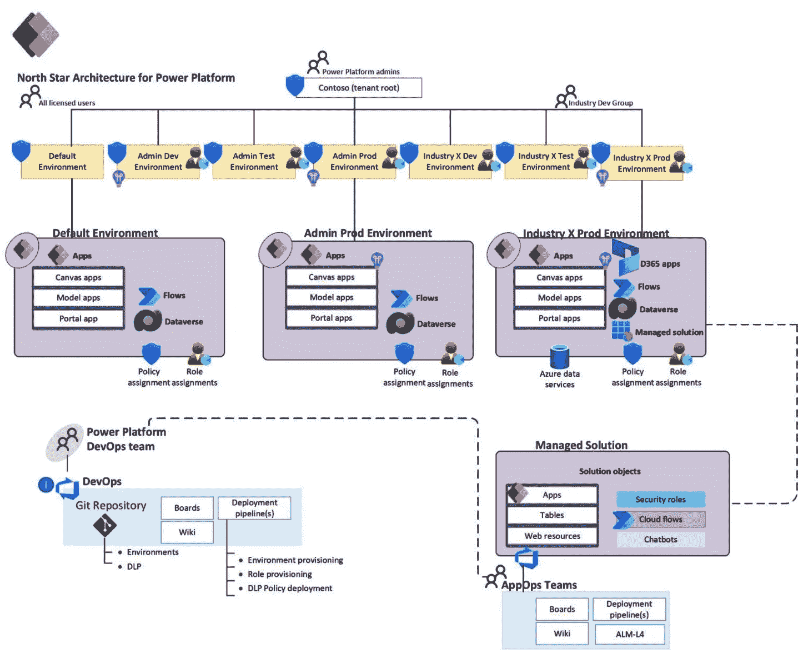
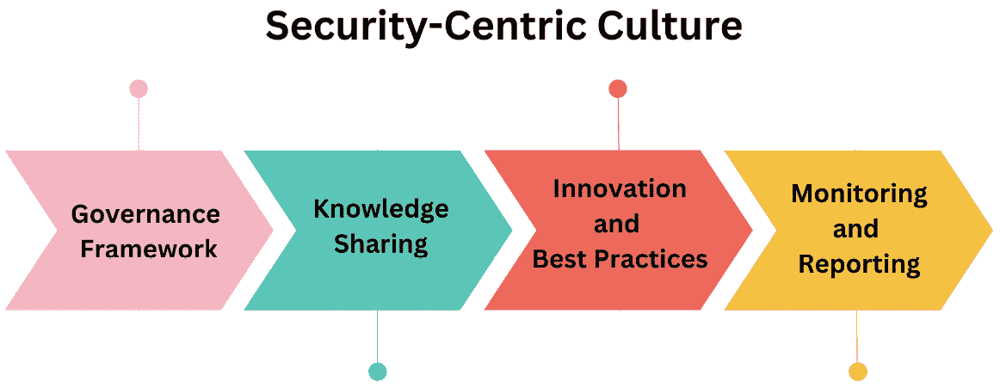
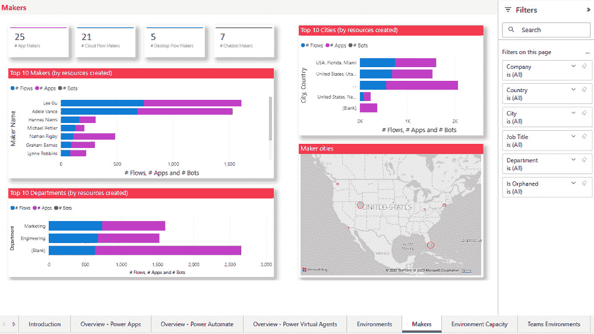
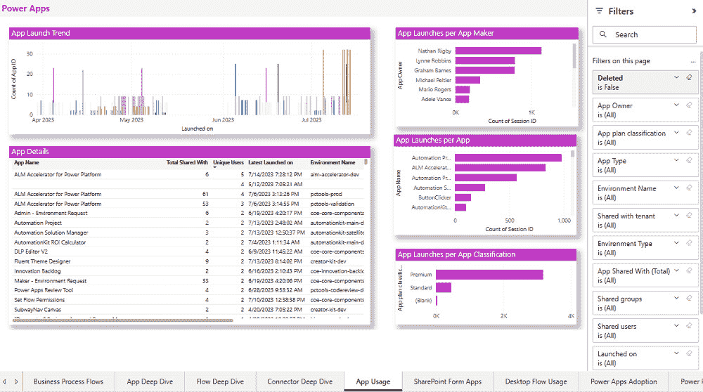
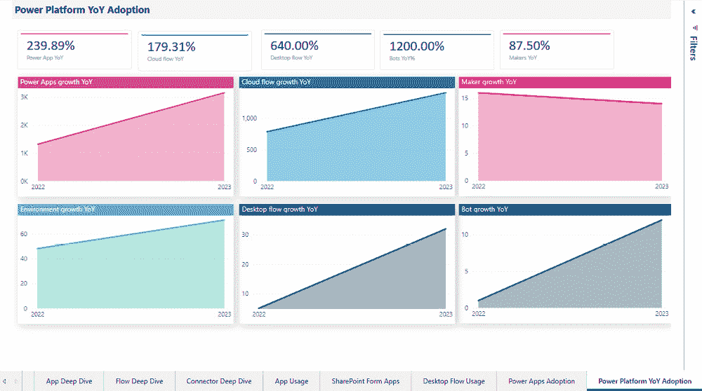
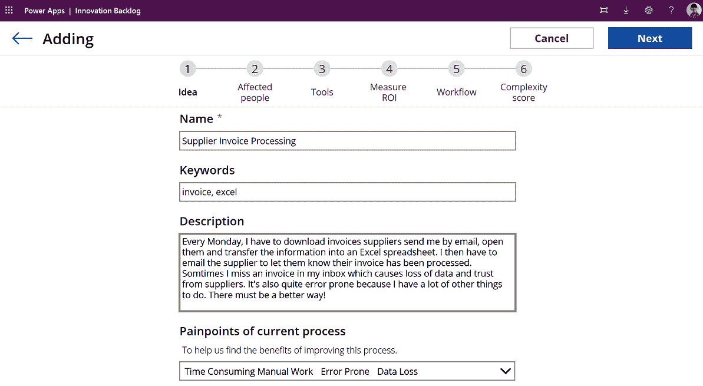

# 第十章：巩固基础：集成系统、确保治理和安全

随着技术的快速发展，组织需要建立一个坚实的基础，能够集成系统、执行治理和增强安全性。这需要一个**卓越中心**（**CoE**）之旅，它由四个关键阶段组成：安全、宣传、监控和演进。安全阶段基于行业标准最佳实践建立了一个全面的安全框架。宣传阶段在全体员工中传播最佳实践的知识和采用。监控阶段使用先进工具和技术持续监控和管理风险。演进阶段采用持续改进和创新的文化，利用监控和其他来源的见解和反馈。

本章将解释组织如何通过涵盖先前状态的 CoE 之旅来巩固其基础。通过这样做，他们可以创建一个强大且安全的科技生态系统，能够应对技术动态景观，并保护其宝贵的资产和数据。以下是本章我们将探讨的内容：

+   建立一个坚实的基础安全框架（安全）

+   培养以安全为中心的文化（宣传）

+   持续监控和主动风险管理（监控）

+   接受持续改进和创新（演进）

# 建立一个坚实的基础安全框架（安全）

微软 Power 平台是一套低代码工具套件，它使任何人都能构建应用程序、自动化工作流程、分析数据和创建聊天机器人。它赋予用户解决业务问题并更快创新的权力，而无需依赖 IT 或开发者。然而，这也为治理、安全和合规性带来了一些挑战。你如何确保你的用户遵循最佳实践、保护敏感数据以及使用正确的许可证和连接器？

这就是 CoE 策略的用武之地。CoE 是一个团队或功能，为组织内 Power 平台的采用和治理提供领导力、指导和支持。CoE 可以帮助你平衡自助服务和公民开发的好处与数据丢失、安全漏洞和许可证违规的风险。

一个协作中心（CoE）可以从一个单独的个人使用提供的工具和最佳实践开始，以了解他们在组织中的 Power Platform 采用情况，并可能发展成为更成熟的投资，具有多个功能和角色来管理组织的治理、培训、支持和自动化应用部署。我们鼓励你了解你在采用旅程中的位置，并相应地进行投资，正如本书前几章所描述的。我们建议你通过建立**数据丢失预防（DLP**）策略和管理对数据源的许可证和访问来开始你的治理之旅。让我们从 DLP 策略的定义开始，了解它们如何帮助你防止数据泄露和未经授权的访问，以及如何使用 Power Platform 管理中心创建和管理它们。我们还将涵盖如何管理 Power Platform 用户的许可证和数据源访问，以及如何使用 CoE 入门套件自动化和简化这些任务。

## 数据丢失预防策略

要控制在 Power Platform 中可以一起使用的连接器，你可以创建 DLP 策略。连接器是使应用、流程和聊天机器人能够从各种来源（如 SharePoint、Outlook、X（前身为 Twitter）或 Salesforce）访问数据和服务的组件。根据数据的敏感性和机密性，你可以将连接器分类为仅业务数据、不允许业务数据或被阻止。例如，你可能希望阻止用户创建一个连接到包含敏感客户信息和 X 账户的 SharePoint 站点并发布包含该信息的推文的应用。通过创建 DLP 策略，你可以避免数据泄露和未经授权的数据访问。

你可以使用 Power Platform 管理中心创建和管理 DLP 策略。这些策略可以在租户级别创建，适用于你组织中的所有环境，或在环境级别创建，适用于特定环境。你还可以为特定的安全组添加策略，这些策略适用于那些组的成员。你可以将连接器分配到三个组之一：仅业务数据、非业务数据或被阻止。你还可以使用 Microsoft 提供的默认策略，这些策略基于连接器分类和连接器认证状态。

当你创建或编辑一个数据丢失预防（DLP）策略时，你可以选择何时执行它以及如何应用它。你可以立即执行，或者在未来某个日期执行，通过将策略应用于特定的环境来实现，这取决于你的组织的需求。你可以查看你的策略对你组织中的应用和流程的影响，并查看是否有任何应用或流程会受到策略的影响或被阻止。你还可以查看策略违规情况，并采取行动解决它们，例如通知应用或流程的所有者或删除应用或流程。

图 10.1 – Power Platform DLP 级别

## 许可证和数据源访问

保护您的 Power Platform 采用的另一个方面是管理用户的许可证和数据源访问。许可证决定了用户可以在 Power Platform 中访问哪些功能和功能，例如他们可以创建和运行多少应用程序、流程和聊天机器人，他们可以使用哪些类型的连接器，以及他们的存储和容量限制。数据源访问决定了用户可以在其应用程序、流程和聊天机器人中连接和使用哪些数据和服务的类型，例如 SharePoint、Outlook、SQL Server 或 Salesforce。

您可以使用 Power Platform 管理中心、Microsoft 365 管理中心或 Microsoft Entra ID 管理中心来管理许可证和数据源访问。您可以单独或批量分配许可证给用户，或使用基于组的许可证自动将许可证分配给属于安全组的成员。您还可以查看组织中的许可证使用和消耗情况，并了解分配、使用和可用的许可证数量。

您可以单独或批量授予或撤销用户对数据源的访问权限，或使用条件访问策略来强制执行访问数据源的规则和条件，例如要求多因素身份验证、设备合规性或基于位置的限制。您还可以查看组织中的数据源使用和连接情况，并了解哪些数据源被使用，由谁使用，以及用于什么目的。

## CoE Starter Kit

管理许可证和数据源访问的一个挑战是，这可能非常耗时且繁琐，尤其是如果您组织中有很多用户、环境、应用程序、流程和聊天机器人。这就是我们推荐使用 CoE Starter Kit 的原因，它是一套工具和模板，可以帮助您自动化和简化任务，尤其是在安全方面。

CoE Starter Kit 由四个组件组成：

+   核心组件

+   治理组件

+   培育组件

+   审计组件

每个组件都包含一组应用程序、流程和仪表板，您可以安装和定制以适应您的组织。核心组件为您提供了对 Power Platform 库、使用情况和性能的整体视图。治理组件帮助您强制执行 DLP 策略，管理孤儿应用程序和流程，以及存档未使用的应用程序和流程。培育组件帮助您建立一个实践社区，提供培训和支援，并展示成功案例。审计组件帮助您监控和审计 Power Platform 用户的操作和活动。

注意

您可以从 GitHub 仓库下载并安装 CoE Starter Kit：[`github.com/microsoft/coe-starter-kit`](https://github.com/microsoft/coe-starter-kit)。您还可以找到有关如何使用和定制 CoE Starter Kit 以满足您组织需求的文档、教程和视频。

在建立了一个稳固的安全框架之后，下一步是确保您的组织培养一种以安全为中心的文化。在下一节中，您将了解如何在整个组织中推广以安全为首要考虑的心态。这包括以下方面：

+   在所有用户中建立对安全实践的认识和理解

+   为保持安全始终处于前沿，提供持续培训和资源

+   鼓励协作和沟通以保持警惕的安全态势

通过关注这些方面，您可以确保安全融入组织的结构中，形成一种积极主动且具有弹性的数据和应用保护方法。这将建立在当前章节所奠定的基础上，并进一步强化您组织的治理和安全实践。

# 培养以安全为中心的文化（传播）

以安全为中心的文化对于确保安全实践根植于组织的日常运营至关重要。这种文化确保安全考虑深深植根于组织的理念、决策过程和所有员工的日常实践中。在 Power Platform 和 CoE 的背景下，培养这种文化涉及推广安全意识、鼓励安全最佳实践，并利用特定工具来强化这些原则。让我们探讨如何利用 Power Platform 和 CoE 框架在您的组织中创建这样的文化。

## 推广安全意识

推广安全意识确保所有员工都了解安全的重要性以及他们在维护安全中的角色。这对于防止安全漏洞和确保合规至关重要。

在员工中推广安全意识的一些方法包括以下：

+   **定期开展安全意识宣传活动**：安全意识宣传活动是旨在教育和告知员工关于最新安全威胁、最佳实践和政策的举措。安全意识宣传活动可以通过各种方式传达，例如海报、视频、测验、游戏或通讯。它们应针对受众、与上下文相关，并对参与者具有吸引力。组织还可以通过跟踪参与率、反馈评分或知识保留等指标来衡量其活动的有效性。

+   **实施安全意识培训计划**：安全意识培训是一种正式和结构化的方式，用于教授员工保护组织数据和资产所需的技能和行为。安全意识培训应涵盖密码管理、钓鱼预防、设备安全、数据保护和事件报告等主题。安全意识培训对所有员工都是强制性的，并且应定期更新以反映不断变化的网络安全环境。组织还可以使用游戏化、模拟或情景来使培训更具互动性和现实性。

## 促进培训和教育工作

要有效地培养以安全为中心的文化，投资于全面的培训和教育工作至关重要。这些计划应旨在提高所有员工的安全意识，确保他们能够应对潜在威胁并理解他们在维护组织安全态势中的重要作用。以下是一些可以考虑的策略：

+   **定期培训会议**：定期举办涵盖一般安全最佳实践和 Power Platform 安全使用特定指南的培训会议。这些会议对所有员工都是强制性的，并为参与开发和 IT 的人员提供更深入培训。

+   **基于角色的培训**：为 Power Platform 内不同用户角色提供定制化的培训。例如，开发者应接受安全应用开发的培训，而 IT 管理员应专注于管理安全配置和监控。

+   **认证计划**：鼓励员工追求与 Power Platform 和安全相关的认证，例如 Microsoft Certified: Power Platform Fundamentals 和 Microsoft Certified: Security, Compliance, and Identity Fundamentals。

## 使用清晰的沟通

有效的沟通是营造组织内部安全环境的基础。通过确保员工充分了解并持续更新信息，组织可以显著提升其安全态势。以下是一些实现这一目标的方法：

+   **安全政策和指南**：制定和分发针对 Power Platform 使用的清晰、简洁的安全政策和指南。确保这些文档可以通过 CoE 门户或内部网络轻松访问。

+   **定期更新**：通过通讯、网络研讨会和内部网络发布，让员工了解新的安全威胁、政策更新和最佳实践。

+   **视觉辅助和提醒**：在办公空间和在线平台上使用海报、信息图表和数字标牌等视觉辅助工具，以加强关键安全信息和提醒。

## 鼓励安全最佳实践

鼓励安全最佳实践涉及赋予个人和团队在其责任范围内对安全负责的权力。以下是一些建议。

### 识别和推广安全倡导者

为了培养安全意识和主动参与的文化，组织必须采取明确的步骤来赋能员工并提供持续的支持：

+   **角色定义**：明确界定每个团队中安全倡导者的责任。他们的角色是倡导安全实践、协助执行政策，并在他们的团队与核心团队（CoE）之间充当联络人。

+   **赋能**：为安全倡导者提供高级培训、访问安全工具的权限，以及在其团队内影响安全决策的权力。定期向他们更新新的安全趋势和实践。

+   **认可**：通过奖励、奖金或公开认可等方式认可和奖励安全倡导者的努力。这种激励可以推动持续的参与和对安全的承诺。

## 建立反馈循环

为了有效解决安全问题和提升组织的网络安全态势，考虑实施以下策略：

+   **报告机制**：建立简单直接的报告安全问题的机制，例如专用电子邮件地址、聊天渠道或内部网络表单。确保这些渠道得到充分宣传且易于访问。

+   **匿名反馈**：启用匿名报告，以鼓励员工在没有报复恐惧的情况下报告安全问题。

+   **持续改进**：定期审查收到的反馈并实施更改以解决安全问题。向组织反馈他们的反馈如何推动改进，以培养参与感和所有权感。

+   **行动计划**：根据安全分数建议制定行动计划，以解决已识别的安全差距。在 Microsoft Defender for Cloud 中的安全分数是一个数值，总结了组织的网络安全态势。根据潜在影响和实施难度优先级排序行动。

+   **进度跟踪**：定期监控安全分数以跟踪进度并根据需要调整策略。将分数作为基准，衡量您安全倡议随时间的效果。

## 规划钓鱼模拟

为了提高安全意识并改善员工识别和应对钓鱼攻击的能力，组织可以实施以下全面的策略：

+   **模拟活动**：定期进行钓鱼模拟活动，以测试员工在识别和应对钓鱼攻击方面的意识和准备情况。使用现实场景来创造有影响力的学习体验。

+   **培训跟进**：对未通过测试的员工进行有针对性的培训。提供反馈和资源，帮助他们提高技能。

+   **指标和报告**：分析钓鱼模拟的结果，以识别趋势和改进领域。使用这些数据来完善您的培训计划并提高整体安全意识。

## 将安全文化与 CoE 整合

CoE 在将安全为中心的文化嵌入到组织内部中发挥着关键作用。CoE 可以提供确保安全成为所有 Power Platform 项目优先事项所需的架构、资源和治理。

### 在培养以安全为中心的文化中，CoE 的责任

+   **治理框架**：建立和维护一个包括针对 Power Platform 的安全政策、标准和最佳实践的治理框架。确保这些内容在整个组织中传达和执行。

+   **知识共享**：利用 CoE 促进在安全主题上的知识共享和协作。这可以包括创建安全资源的中央存储库、举办网络研讨会和组织研讨会。

+   **创新和最佳实践**：通过鼓励探索新工具和技术来促进安全实践的创新。在团队之间分享成功故事和最佳实践，以培养持续改进的文化。

+   **监控和报告**：利用 CoE 监控对安全政策的遵守情况，跟踪关键安全指标。定期向高级领导和利益相关者报告组织的安全态势。

图 10.2 – 以安全为中心的文化关键要素

## 分享成功故事

分享成功故事可以激励和鼓舞制作者和用户采用安全最佳实践，并从他人的经验中学习。这也可以展示 Power Platform 解决方案在组织安全态势和性能方面的价值和影响。

您的组织可以用来分享成功故事的一些方法如下：

+   **组织展示和讲述会**，制作者或用户可以展示他们的 Power Platform 解决方案，并演示他们如何实施安全功能和遵循安全指南。展示和讲述会可以是一种互动和吸引人的知识分享、技巧和经验教训交流的方式，同时也可以从观众那里征求反馈和建议。

+   **将案例研究作为通讯出版**，其中 CoE 可以突出 Power Platform 解决方案在组织部署或使用中的安全方面和成果。案例研究可以提供对安全挑战、解决方案、结果和 Power Platform 项目的益处的详细和全面概述，以及可以应用于类似场景的最佳实践和推荐。

在我们建立以安全为中心的文化时，确保安全措施持续监控和管理同样重要。在下一节中，我们将探讨持续安全监控和风险管理策略，以积极保护您的组织。这包括实施持续监控系统、建立主动风险管理协议，并确保对潜在威胁的实时响应。

这种方法将建立在您培养的安全文化之上，确保您的组织保持警惕并对新兴的安全挑战做出响应。

# 持续监控和主动风险管理（监控）

Microsoft Power Platform CoE 和管理中心强调持续监控和主动风险管理，以保持安全和高效的环境。通过利用高级工具和技术，如 Power Platform 管理中心、CoE、Power BI 仪表板、Power Automate 流和 Starter Kit Power Apps，组织可以跟踪使用和性能，早期识别和缓解潜在风险，以确保符合治理政策。此外，Power Platform 内的管理和行政连接器允许进行自动监控和管理任务。这些连接器以及 PowerShell cmdlet 有助于高效的风险管理和运营监督，确保技术环境具有弹性。

## 监控在 CoE 中的作用

CoE 作为组织内部 Power Platform 部署、维护和治理的中心枢纽。CoE 的有效监控涉及一种综合方法，以持续观察和评估各种组件的性能。这确保了与组织标准和法规要求保持一致，防止风险升级为重大问题。

## 关键指标和性能指标

要建立一个强大的监控框架，识别和跟踪关键指标和性能指标至关重要。以下包括以下内容：

+   **资源使用**：监控数据存储、计算能力和 API 调用等资源的消耗，以优化使用并防止瓶颈

+   **访问和使用模式**：跟踪用户活动以识别异常模式或未经授权的访问尝试

+   **Dataverse 利用情况**：评估 CDS 环境的健康状况和性能，以确保数据完整性和高效操作

+   **连接器管理**：监控连接器的使用情况，特别是新或自定义连接器，以维护安全和合规性

+   **共享和警报**：实施共享策略和警报机制以检测和应对未经授权的数据共享或政策违规

## 监控工具和技术

几种工具和技术可以帮助 CoE 实施有效的监控实践：

+   **Power Platform 管理中心**：提供集中式仪表板以监控 Power Platform 组件的健康状况、使用情况和安全性

+   **Azure Monitor**：为应用程序、基础设施和网络提供全面的监控，与 Power Platform 无缝集成

+   **Power BI**：启用高级数据可视化和分析，帮助从监控数据中识别趋势和洞察

+   **安全信息和事件管理（SIEM）系统**：与 Power Platform 集成以实时检测和应对安全威胁

## 主动风险管理

主动风险管理涉及预测潜在风险并在它们影响组织之前采取措施来减轻它们。关键策略包括以下内容：

+   **风险评估和分析**：定期进行风险评估以识别潜在漏洞和威胁。利用这种分析来优先考虑缓解措施。

+   **政策开发和执行**：开发和执行管理 Power 平台使用的安全政策。确保所有用户都了解这些政策和他们的责任。

+   **事件响应计划**：制定并维护一个事件响应计划，概述处理安全事件和违规行为的程序。定期测试和更新此计划以确保其有效性。

+   **用户培训和意识提升**：教育用户关于安全和合规的最佳实践。定期的培训课程可以帮助强化这些实践的重要性。

## 治理和合规

治理和合规是 Power 平台管理和监控框架的组成部分。管理中心和 CoE 入门套件提供了强大的功能，以确保平台内的所有活动都与组织政策和监管标准保持一致。管理员可以定义和执行治理规则，监控对这些规则的遵守情况，并在必要时采取纠正措施。

通过详细的审计日志和活动报告，合规监控得以实现，这些报告提供了用户交互和系统变化的全面视图。这些日志对于进行审计、调查事件和证明符合行业法规至关重要。CoE 入门套件的分析工具进一步帮助合规管理，通过突出关注领域并提出改进建议。

持续监控和主动风险管理是保障微软 Power 平台环境的不可或缺的支柱。利用高级工具，如 Power 平台管理中心、CoE Power BI 仪表板、Power Automate 流程和入门套件 Power Apps，使组织能够监控使用情况、跟踪性能指标，并在早期识别潜在风险。这种主动方法确保符合治理政策，并最小化对运营的干扰。以下是您可以期待的内容：

+   **持续改进策略**：实施迭代方法以随着时间的推移增强安全措施

+   **鼓励创新**：在保持严格的安全标准的同时，培养一种拥抱创造力的文化

+   **适应技术变化**：通过适应不断发展的技术和行业趋势保持领先

我们将探讨持续改进安全措施、鼓励创新解决方案以及适应不断变化的技术环境的方法，确保您的组织始终处于运营卓越和安全的前沿。

## 拥抱持续改进和创新（进化）

持续改进和创新是 Power Platform 内部管理和监控流程的关键目标。通过利用持续监控和主动风险管理获得的见解，组织可以识别优化和创新的机会。CoE Starter Kit 的反馈机制使管理员能够收集用户反馈和性能数据，这些数据可用于增强现有解决方案并开发新的解决方案。建立持续改进的文化确保 Power Platform 环境保持敏捷、响应，并与组织不断变化的需求保持一致。CoE 内可用的工具有助于维持创新文化，确保解决方案不断改进，并将开发与业务需求和用户期望保持一致。

## 持续改进和创新的作用

持续改进和创新对于维持竞争优势和运营效率至关重要。在 Power Platform CoE 的背景下，这些概念包括以下方面：

+   **定期评估和增强解决方案**：确保 Power Platform 应用程序和工作流程持续优化性能和用户体验

+   **鼓励创新**：营造一种员工乐于提出新想法和改进措施的文化

+   **与业务目标一致**：确保创新和改进与组织的战略目标相一致

## CoE Starter Kit 仪表板

CoE Starter Kit 中的仪表板为组织内的政策执行和程序改进提供关键支持。这些视觉工具主要服务于监控潜在安全问题的目的。此外，它们有助于识别最常使用的应用程序、它们的作者（制作者）以及正在使用的连接器。这些仪表板提供的信息帮助企业在决定谁、什么以及平台哪些方面需要关注和改进。

### 制作者仪表板

图 10.3 – 制作者仪表板

此仪表板页面提供了组织内制作者活动和贡献的全面视图。其主要功能包括活跃制作者的数量、制作者活动随时间变化的趋势、基于应用程序和流程创建的顶级制作者，以及每个制作者创建的应用程序和流程的详细列表。

### 应用使用仪表板

图 10.4 – 应用使用仪表板

应用使用仪表板跟踪和分析组织内应用程序的使用模式。此仪表板上突出显示的关键数据包括应用程序启动和活跃用户数、随时间变化的趋势，以及识别最常使用的应用程序。

### 年度同比增长（YoY）采用率

图 10.5 – 同比仪表板

此可视化比较了年度采用指标，以识别增长和趋势。所提供的数据包括应用和流程创建及使用的比较。这些信息有助于领导者决定哪些领域需要额外的关注。

## 创新待办事项应用

图 10.6 – 创新待办事项应用

创新待办事项应用旨在管理和优先处理员工和利益相关者提出的新想法和创新。它有助于确保创新想法被系统地捕捉、评估和实施。

以下是创新待办事项应用的一些关键特性。

+   **想法提交**：员工可以通过用户友好的界面提交他们的创新想法。提交可以包括详细描述、预期效益和任何相关文档。

+   **评估和评分**：根据可行性、潜在影响、与业务目标的一致性以及资源需求等标准评估想法。评分机制可用于对想法进行排名。

+   **跟踪和管理**：一旦批准，想法将通过实施的不同阶段进行跟踪。这包括资源分配、开发、测试和部署。

+   **协作和沟通**：该应用促进了利益相关者之间的协作，确保想法得到有效精炼和发展。

## 集成和协同效应

反馈和创新待办事项应用对于 Power Platform CoE 内持续改进和创新的整体方法至关重要。它们的集成提供了几个协同效应：

+   **统一改进和创新平台**：通过结合反馈管理和创新跟踪，CoE 可以确保增量改进和突破性创新都得到有效处理。

+   **数据驱动决策**：反馈分析的见解可以用于评估新想法，确保创新解决实际用户需求和痛点。

+   **增强协作**：统一的方法促进了不同团队（包括开发、运营和业务利益相关者）之间的更好沟通和协作。

## 实施最佳实践

为了最大化反馈和创新待办事项应用的好处，组织应考虑以下最佳实践：

+   **促进采用**：鼓励员工定期使用这些工具。这可以通过培训、意识宣传活动以及展示用户贡献的影响来实现。

+   **定义明确流程**：为反馈收集、想法评估和创新实施建立明确的流程。这包括设定优先级和决策的标准。

+   **利用分析**：使用这些应用的分析功能来识别趋势、衡量影响并做出明智的决策。

+   **定期审查**：定期审查反馈和创新待办事项，以确保最关键的问题和最有价值的想法得到及时解决。

+   **与业务战略保持一致**：确保持续改进和创新努力与组织的战略目标和目标紧密一致。

# 摘要

本章重点介绍了通过结构化的 CoE 方法构建强大、安全、良好治理的 Power Platform 环境。它介绍了 CoE 旅程的四个关键阶段：安全、传教、监控和进化，每个阶段都在为 Power Platform 的采用建立坚实基础方面发挥着关键作用。

安全阶段强调创建一个全面的框架，包括实施数据丢失预防（DLP）策略、管理许可证以及使用 CoE 启动套件来自动化安全任务。传教阶段侧重于通过意识、培训和清晰的沟通培养以安全为中心的文化，确保安全融入组织的日常实践。监控阶段涉及对平台性能、用户活动和治理政策的合规性的持续监控，利用如 Power Platform 管理员中心、CoE 仪表板和高级风险管理策略等工具。最后，进化阶段强调了持续改进和创新的重要性，利用监控和反馈的见解来完善现有解决方案并推动新的发展。

通过采用这种结构化的方法，组织可以确保其 Power Platform 项目安全、良好治理并持续优化，为持续成功和创新奠定基础。

在下一章中，你将学习如何通过应用治理和安全原则和实践来为你的 Power Platform 解决方案打下坚实的基础。你将看到如何定义和执行政策与标准，如何监控和审计你的环境，以及如何管理风险和合规性问题。通过这样做，你将确保你的 Power Platform 解决方案安全、可靠、值得信赖。

# 加入我们的 Discord 社区

加入我们的社区 Discord 空间，与作者和其他读者进行讨论：

[`packt.link/powerusers`](https://packt.link/powerusers)

