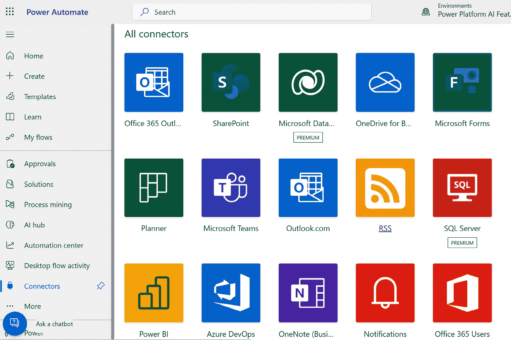
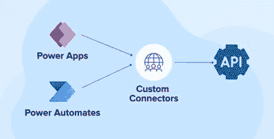
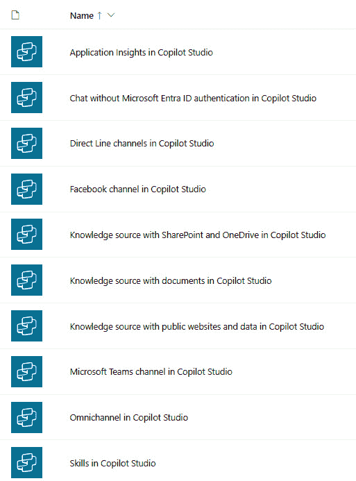
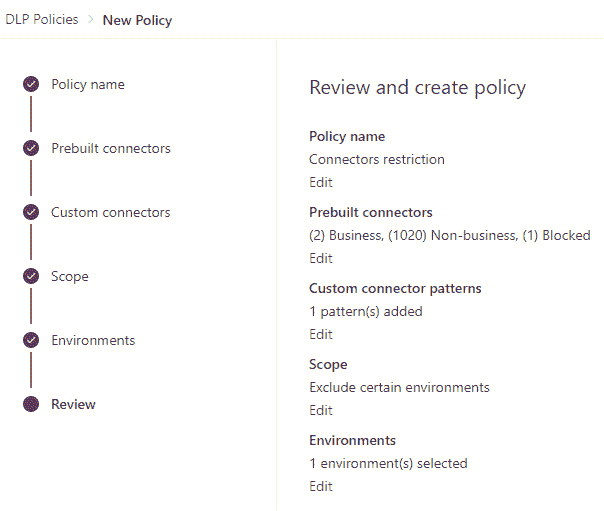
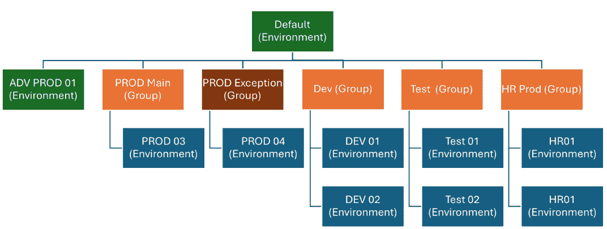
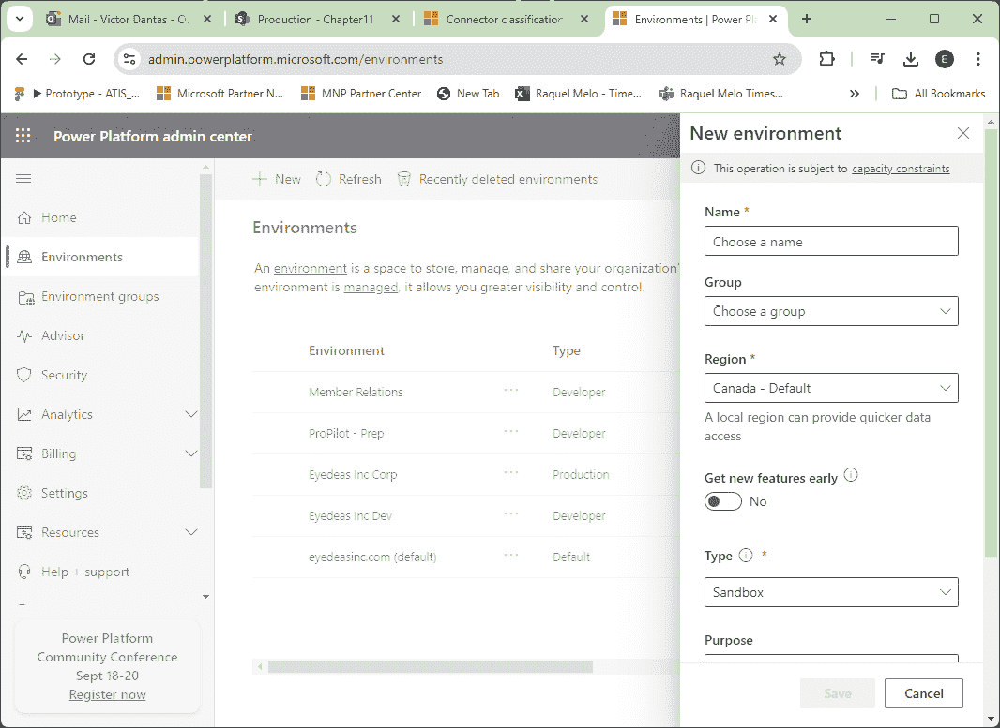
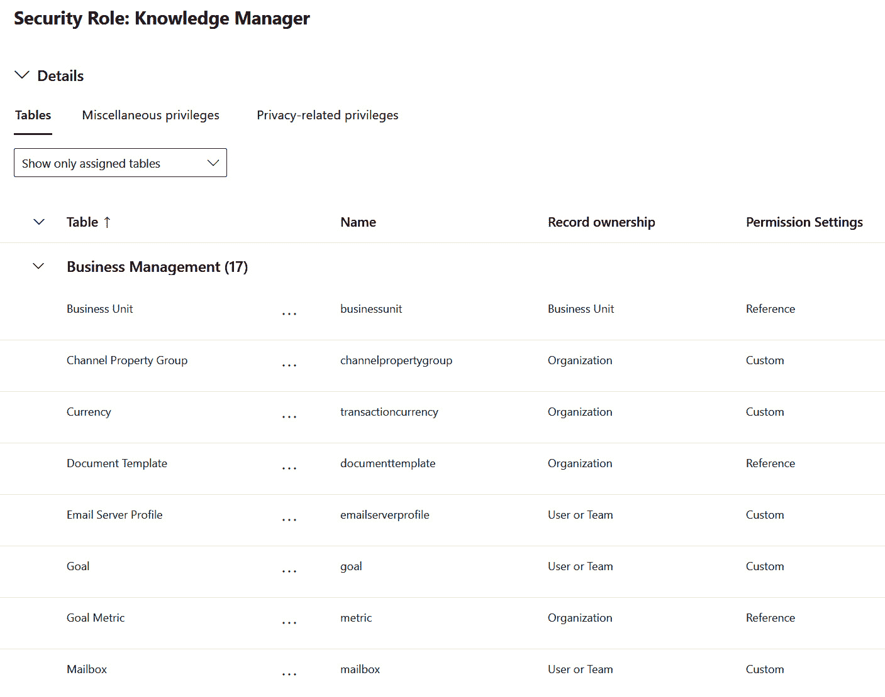
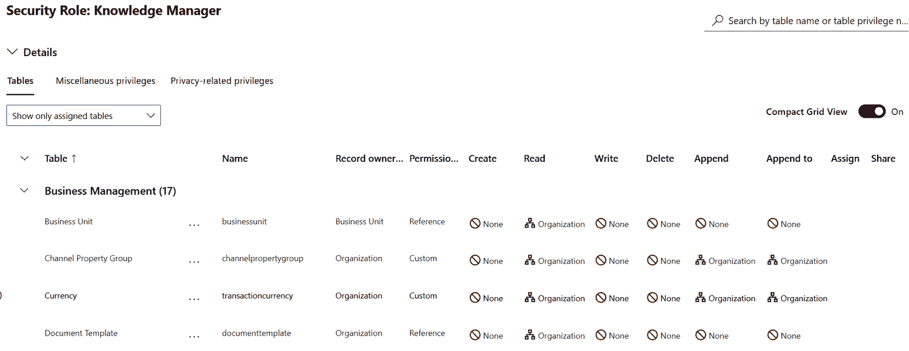
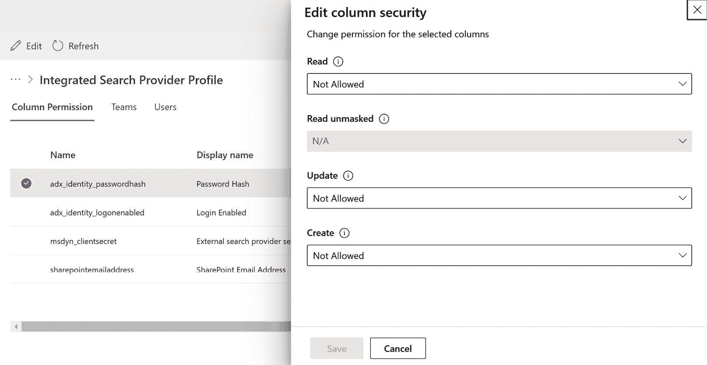
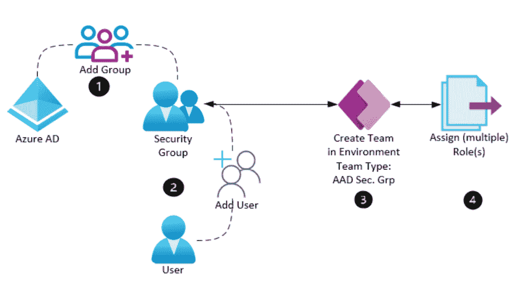

# 第十一章：建立坚实基础：Power Platform 解决方案中的治理和安全

Power Platform 中治理和安全的基石提供了一个全面的治理和安全解决方案，使用户能够在创建引人入胜的应用和工作流的同时保护他们的数据和信息。在本章中，您将学习如何利用 Power Platform 生态系统的以下特性和功能：

+   数据丢失预防（DLP）策略：保护组织数据

+   租户隔离：确保 Power Platform 连接器的安全使用

+   专门的安全角色

通过在治理和安全方面打下坚实基础，您将能够充分利用 Power Platform 生态系统的全部潜力，同时保护您宝贵的数据和信息。

# 数据丢失预防策略：保护组织数据

**DLP**策略是 Power Platform 生态系统中的关键特性之一，它使用户能够保护其组织数据并维护信息安全标准。DLP 策略充当安全护栏，防止敏感数据在不同连接器和环境中意外泄露。在本节中，您将学习如何实施数据保护措施，定义连接器使用规则，防止意外数据泄露，并评估 DLP 策略对租户中画布应用和云流程的影响。

## 连接器

**连接器**是一个组件，它使用户能够连接到数据源或服务，并在 Power Platform 内执行各种操作。在最基本的层面上，连接器是强类型化的 RESTful **应用程序编程接口**（也称为**API**）的表示。连接器可以分为三类：

+   **商业**：访问敏感或机密数据的连接器，例如 SharePoint、Dynamics 365 或 SQL Server

+   **非商业**：访问公共或非敏感数据的连接器，例如 Twitter、YouTube 或天气

+   **受限**：在租户中禁止使用的连接器，例如 Dropbox、Gmail 或 Facebook

除了组织数据类别外，连接器还可以根据设计和行业成熟度分为三类：**认证连接器**、**自定义连接器**和**虚拟连接器**。

*图 11**.1*列出了 Power Platform 中可用的连接器，展示了用户可以无缝集成各种服务和应用的选项范围。

图 11.1 – 认证连接器（图片来自 Microsoft Learn 门户）

**认证连接器**指的是经过严格测试和认证流程的连接器，以确保它们符合微软对安全性、可靠性和合规性的标准。这些连接器为用户提供了一种可靠的方式，将它们与其他微软服务和外部服务集成，同时保持数据完整性和安全性。

**自定义连接器**允许制作者创建自己的连接器，以集成标准认证连接器集之外的系统或服务。虽然提供了灵活性和定制选项，但自定义连接器需要仔细考虑，以确保它们符合数据策略，并且不会损害数据安全。*图 11.2*展示了制作者如何设计自己的连接器，从而实现与标准认证选项之外的外部系统和服务的无缝集成。

图 11.2 – 自定义连接器

**虚拟连接器**是出现在数据策略中供管理员控制的连接器；然而，它们不是基于 RESTful API。虚拟连接器的激增源于数据策略是 Power Platform（例如，Copilot Studio 连接器）中最受欢迎的治理控制之一。*图 11.3*突出了虚拟连接器在数据策略区域中的列出方式，使管理员能够有效地管理他们的租户和环境。

图 11.3 – 虚拟连接器

虚拟连接器，如 Copilot Studio，展示了 Power Platform 中的集成选项范围。下一节将介绍它们的优缺点，以帮助您充分利用它们。

## Power Platform 连接器的优缺点

Power Platform 连接器提供了几个优势，使它们成为集成各种服务和应用程序的有价值工具。其中主要的好处是它们提供的易于集成。这些连接器简化了连接不同服务的过程，而无需广泛的编码知识，这使得它们对非开发者来说易于访问。此外，该平台拥有广泛的连接器，适用于流行的服务，如 Microsoft 365、Azure、Salesforce 等，这提供了广泛的集成选项。这促进了不同系统之间的数据流畅，实现了实时数据同步和工作流程的自动化。

预构建的连接器通过减少创建集成所需的时间来节省时间，从而允许更快地部署解决方案。它们也是 Power Platform 低代码/无代码方法的一部分，这降低了具有最少编码经验用户的入门门槛。安全性和合规性也是关键优势，因为连接器设计时考虑了企业级安全功能，以确保数据隐私和保护。此外，连接器可以随着您的业务需求而扩展，支持从小型到大型企业级应用的各种规模的项目。最后，庞大的用户社区和广泛的文档提供了宝贵的支持和资源，以帮助故障排除和优化连接器的使用。

尽管使用 Power Platform 连接器有这些好处，但也有一些缺点。一个主要的缺点是它们提供的定制化有限，可能无法满足更复杂或独特的集成场景的需求。此外，由于连接器通常依赖于云服务，因此需要一个稳定的互联网连接才能正常工作。在处理大量数据或频繁操作时，也可能出现性能问题。另一个考虑因素是许可成本，因为一些连接器，尤其是高级连接器，可能需要额外的费用，这些费用可能会根据用户和服务集成的数量而累积。此外，连接器可能不会立即支持集成服务的最新功能或更新，从而导致利用新功能可能存在延迟。尽管它们易于使用，但有效使用和故障排除连接器仍然存在一个学习曲线，尤其是对于没有技术背景的用户来说。

考虑到潜在的风险和限制，通过建立良好的治理策略来控制连接器的访问和执行至关重要。实施治理确保连接器的使用与组织政策和合规性要求保持一致。治理的一个关键方面是管理 DLP 策略。让我们进一步探讨 DLP。

## 理解 Power Platform 中的 DLP

保护您组织的数据至关重要，尤其是在数据泄露和网络攻击频繁发生的世界上。您需要有效的方法来防止在 Power Platform 中丢失数据，一套帮助您创建业务解决方案的工具。本章解释了如何使用 Power Platform 中的 DLP 来保护您的企业数据。它还涵盖了拥有良好治理策略的重要性，以及如何设置 DLP 策略和遵循最佳实践以确保数据安全。

在 Power Platform 中，一个成熟的 DLP 策略为**制作者**、**管理员**和**开发者**提供了显著的优势，紧密地与 Power Platform 卓越中心（**CoE**）中定义的更广泛目标相结合。对于制作者来说，一个强大的 DLP 策略提供了一个安全的框架，他们可以在其中自信地创新，知道他们处理的数据受到保护，从而在不损害安全性的情况下培养创造力。管理员从简化的治理中受益，因为明确的 DLP 策略减少了数据泄露的风险，并确保符合监管标准，使得在整个组织中管理和监控数据使用变得更加容易。对于开发者来说，定义良好的 DLP 策略简化了各种服务和连接器的集成，因为他们有明确的数据处理指南，可以专注于构建有效的解决方案，而不是担心安全漏洞。

将这些 DLP 策略与 CoE 的原则相一致，组织可以标准化最佳实践，促进持续改进的文化，并确保所有利益相关者在数据安全和治理的方法上保持一致。这种全面的方法增强了协作，提高了效率，并最终有助于组织的整体成功。以下是在未能实施安全措施和纳入坚实的 DLP 策略的组织中发生的主要数据泄露的例子。

## 通过脆弱的 DLP 策略导致的主要数据泄露

数据泄露持续凸显了强大 DLP 策略的至关重要性。主要事件源于可以通过更强的 DLP 措施缓解的漏洞。这些重大的数据泄露，影响了数百万人，凸显了实施强大 DLP 政策、有效的补丁管理和持续监控以保护敏感信息和防止未授权访问的迫切需要：

+   **Equifax 数据泄露（2017）**：在 Web 应用程序框架中的一个漏洞导致大约 1.47 亿人的个人信息被曝光，这是最臭名昭著的数据泄露之一。这一事件归因于补丁管理不足和缺乏有效的 DLP 策略，这些策略本可以防止未授权访问。据《银行信息安全》杂志报道，2017 年 Equifax 数据泄露导致超过 14 亿美元的财务损失，包括罚款、法律和解和补救费用。

+   **塔吉特数据泄露（2013）**：攻击者获得了超过 4000 万客户的个人和信用卡信息。这次泄露是由于薄弱的 DLP 措施和对系统间数据流监控不足而促成的，强调了全面 DLP 策略的必要性。据 Breach Sense 报道，2013 年塔吉特数据泄露使公司损失超过 2.02 亿美元，包括法律费用、和解金、安全升级和收入损失。

+   **Capital One 数据泄露（2019 年）**：一个配置错误的防火墙导致超过 1 亿客户的个人信息泄露。这次泄露强调了严格执行 DLP 政策和持续监控以减轻对敏感数据的未授权访问的重要性。据 CBS News 报道，Capital One 数据泄露使公司损失数十亿美元，包括 8000 万美元的监管罚款、1.9 亿美元的集体诉讼和解以及大量的补救措施。

### DLP 的概念

DLP 包含一系列旨在确保敏感数据不会丢失、误用或被未授权用户访问的工具和流程。DLP 策略旨在通过监控、检测和阻止关键信息的传输来防止数据泄露。

在 Power Platform 的背景下，DLP 尤为重要，因为该平台集成了自动化各种业务流程，通常处理敏感数据。如果没有适当的 DLP 措施，组织可能会暴露机密信息，可能导致重大经济损失、声誉损害和监管处罚。

### DLP 的组成部分

一个全面的 DLP 策略通常包括以下内容：

+   **识别敏感数据**：识别组织内部构成敏感信息的要素

+   **认证连接器的枚举**：识别和列出组织内解决方案所需的全部连接器，并评估连接器对信息的访问权限

+   **政策创建**：建立处理敏感数据的规则和政策

+   **监控和检测**：持续监控数据流以检测潜在的 DLP 政策违规行为

+   **响应和缓解**：实施措施以阻止或修复未授权访问或数据泄露

### 在 Power Platform 中设置 DLP

在 Power Platform 中实施 DLP 政策对于保护您的组织数据并确保符合监管要求至关重要。通过在 Power Platform 管理中心遵循一个结构化的流程，您可以定义数据如何在不同的连接器之间移动，控制访问权限，并保护敏感信息。这种积极主动的方法有助于降低风险并加强您组织的数据安全框架。以下是在设置 DLP 政策中涉及的步骤：

1.  **识别敏感数据**：确定组织内部哪些数据是敏感的并需要保护。这包括个人信息、财务数据、知识产权以及任何对组织至关重要的其他数据。

1.  **创建 DLP 政策**：在 Power Platform 中，DLP 政策是在 Power Platform 管理中心创建的。这些政策定义了哪些连接器可以在应用程序和流程中使用，以及哪些数据可以在服务之间共享。

1.  **配置连接器**：将连接器分类为“业务”或“非业务”。业务连接器是处理敏感数据的连接器，而非业务连接器用于一般数据。这种分类有助于控制数据流，防止意外共享敏感信息。

1.  **执行策略**：将数据丢失预防（DLP）策略应用于 Power Platform 内的环境，以确保合规性。这种执行可以针对特定环境进行定制，确保不同部门或项目遵守相关的数据保护规则。

1.  **监控和审计**：持续监控 Power Platform 内连接器和数据流的使用情况。定期的审计有助于识别潜在的策略违规和需要调整策略的区域。

### 步骤指南

1.  访问 Power Platform 管理中心：

    1.  导航到 Power Platform 管理中心并使用管理员凭据登录。

1.  创建新的 DLP 策略：

    1.  在管理中心，转到**数据** **策略**部分。

    1.  点击**新建策略**以创建新的 DLP 策略。

    1.  为策略提供名称和描述。

1.  分类连接器：

    1.  选择您想要分类为业务或非业务的连接器。

    1.  例如，将 SharePoint、Dynamics 365 和 SQL Server 等连接器分类为业务连接器，将 Twitter 和 RSS 等连接器分类为非业务连接器。

1.  应用策略：

    1.  选择策略应应用的环境。

    1.  保存并发布策略以在所选环境中强制执行。

1.  监控和调整：

    1.  通过管理中心定期审查策略的有效性。

    1.  根据使用模式和新的数据保护要求进行调整。

*图 11**.4* 展示了 DLP 设置向导的视图。

图 11.4 – DLP 设置

在 Power Platform 中设置 DLP 策略是保护组织数据的重要措施，通过控制数据在连接器之间的流动。然而，创建策略只是第一步；持续的评估和监控对于确保合规性和识别任何潜在的安全漏洞至关重要。定期审查这些策略并根据需要调整它们将有助于维护数据的完整性，防止未经授权的访问，最终加强组织的整体安全态势。

# 租户隔离：确保 Power Platform 连接器的安全和安全使用

随着公司越来越多地采用云服务和平台以简化运营并提高生产力，确保这些平台内安全且隔离的环境至关重要。Power Platform 中的租户隔离是确保数据和资源安全隔离、防止未经授权访问和最小化数据泄露风险的关键策略。本节探讨了租户隔离的概念、其重要性、实施策略以及在隔离环境中安全使用 Power Platform 连接器的最佳实践。

## 理解租户隔离

租户隔离是指将资源和数据在多租户环境中分离，以确保每个租户的数据和活动与其他租户隔离。在 Power Platform 的背景下，这意味着为不同的部门、项目或客户创建单独的环境，确保一个环境中的数据和流程不会干扰或访问另一个环境中的数据和流程。

*图 11*.*5* 强调了 Power Platform 环境隔离在增强安全性、确保合规性、优化性能和实现定制化方面的重要性。

图 11.5 – Power Platform 中的环境隔离策略

租户隔离的重要性不容忽视。它具有多重作用：

+   **安全**: 防止未经授权访问敏感数据

+   **合规性**: 通过基于地理位置或部门边界的数据隔离来确保遵守监管要求

+   **性能**: 降低不同租户之间资源竞争导致的性能退化的风险

+   **定制化**: 允许进行特定环境的定制化，而不会影响其他租户

## 租户隔离的关键组件

有效的租户隔离涉及几个关键组件：

+   **环境**: Power Platform 内部分离的环境，作为资源和数据的隔离容器。

+   **安全组**: 用于控制对环境访问的 Microsoft Entra 安全组。

+   **数据策略**: 管理环境和环境之间数据共享及连接器使用的 DLP 策略。

+   **基于角色的访问控制**（**RBAC**）：基于用户角色的细粒度访问控制，以实施最小权限访问。我们将在*第十二章*中进一步探讨此主题。

## 在 Power Platform 中实施租户隔离

在 Microsoft Power Platform 中实施租户隔离对于保护数据和确保不同组织单位或外部合作伙伴之间的安全协作至关重要。租户隔离允许管理员控制跨租户连接，从而最大限度地降低未经授权的数据访问或泄露的风险。

### 理解租户隔离

在 Power Platform 中，租户隔离指的是限制或允许租户与外部租户之间的连接的能力。默认情况下，跨租户连接是被允许的，如果用户拥有有效的 Microsoft Entra 凭据，他们可以建立与外部数据源的连接。然而，启用租户隔离允许管理员阻止这些连接，确保数据除非明确允许，否则保持在组织边界内。

### 配置租户隔离

要设置租户隔离，请按照以下步骤操作：

1.  **访问 Power Platform 管理中心**：导航到 Power Platform 管理中心，并使用管理凭据登录。

1.  **启用租户隔离**：在管理中心，找到租户隔离设置。将设置切换到**开启**以激活租户隔离。此操作将默认阻止所有入站和出站的跨租户连接。

1.  **定义允许列表规则**：为了允许特定的跨租户连接，创建允许列表规则。这些规则指定哪些外部租户被允许连接到您的租户（入站）以及哪些外部租户用户可以连接到（出站）。您可以使用通配符模式“*”配置这些规则，以允许特定方向上的所有租户。

当前的租户隔离关注于确保数据流的安全以及限制租户之间的外部访问，而环境隔离则更进一步，通过在单个租户内创建不同的环境，确保数据和资源在内部层面上得到安全地分割。

### 环境隔离

环境隔离是信息隔离在整个**应用生命周期管理**（**ALM**）周期中的基石。通过为每个阶段创建不同的环境（例如开发、测试和生产），组织可以保持数据、应用程序和资源的清晰边界。这种分割最小化了意外数据泄露的风险，确保每个阶段都有受控的访问，并支持一个简化的工作流程，其中更改可以在不影响实时生产系统的情况下开发和测试。这种做法对于维护合规性、提高协作以及保护解决方案在 ALM 周期中的完整性至关重要。在 Power Platform 中创建环境是一个简单的过程，有助于您组织和管理工作应用程序和数据。在 Power Platform 管理中心，您首先选择创建新环境的选项。

### 设置隔离环境

在 Power Platform 中设置隔离环境涉及创建单独的工作空间以保持数据和应用程序的独立性和安全性。通过定义不同的环境，您可以确保每个项目或团队独立运作，拥有自己的资源集和配置。这种隔离有助于保护敏感信息，简化管理，并降低不同项目之间发生冲突的风险。这是维护一个组织有序且安全平台的关键步骤，其中每个环境都可以根据特定需求或合规性要求进行定制。在设计环境策略和创建特定环境时，以下是一些关键点：

1.  **创建环境**：

    1.  在 Power Platform 管理中心，为不同的部门、项目或客户创建单独的环境。

    1.  每个环境都应配置特定的资源和设置，以适应其用途。

1.  **配置** **安全组**：

    1.  使用 Microsoft Entra 为每个环境创建安全组。

    1.  根据用户的角色和职责分配用户到安全组。

1.  **应用** **DLP 策略**：

    1.  定义并实施 DLP 策略，以控制每个环境中可以使用哪些连接器。

    1.  确保敏感数据只能通过经过批准的连接器访问。

*图 11.6* 展示了与 Power Platform 环境创建相关的主要设置。

图 11.6 – 创建新环境

除了配置环境和应用数据丢失预防（DLP）策略外，建立专门的权限角色以增强治理和控制至关重要。这些角色在 Power Platform 和 Dataverse 环境中管理访问和权限方面发挥着重要作用，有助于构建一个强大的安全框架。

# 专门的权限角色

随着数字化转型迅速推进，对数据和应用程序进行强有力的治理和控制至关重要。Power Platform 使您能够构建、自动化和分析业务解决方案，但也需要一个稳固的安全框架。安全角色是 Power Platform 和 Dataverse 环境的关键组成部分，因为它们帮助您管理访问和权限。在本节中，您将了解不同类型的安全角色、数据访问级别、**开箱即用**（**OOB**）安全角色、基于字段的权限以及如何将这些角色与 Microsoft Entra 组集成以创建全面的安全策略。

## Power Platform/Dataverse 环境中的安全角色

Power Platform 和 Dataverse 环境中的安全角色定义了用户可以执行的操作以及他们可以访问的数据。这些角色对于通过确保用户根据其职责拥有适当的权限来维护安全环境至关重要。安全角色涵盖了数据和应用安全的多方面，包括访问控制、数据修改和用户管理。

*图 11**.7* 展示了 Dataverse 中的安全角色设置界面，界面中有一个网格，行代表实体，列显示权限级别，圆形图标表示访问范围。

图 11.7 – Dataverse 安全角色

Power Platform 和 Dataverse 中的安全角色对于定义用户可以执行的操作和可以访问的数据至关重要，确保了一个针对其职责的安全环境。这些角色对于管理访问控制、数据修改和用户管理至关重要，保护系统的完整性。了解这些角色是探索数据访问级别的基石，这将在下一节中讨论。

## 数据访问级别

Dataverse 安全角色中的数据访问级别定义了用户根据其角色可以访问的数据范围，从他们自己的记录到整个组织。这确保了用户拥有适当的可见性和控制权，与他们的工作职能保持一致，并维护数据安全。

Power Platform 中的数据访问级别决定了用户可以查看或修改数据的范围。这些级别包括以下内容：

+   **None**: 没有数据访问权限

+   **用户**: 访问用户拥有的数据

+   **业务单元**: 访问用户业务单元内的数据

+   **父：子业务单元**: 访问用户业务单元及其子业务单元内的数据。

+   **组织**: 访问组织内的所有数据。

*图 11**.8* 显示了 Dataverse 数据访问级别的关键，使用从**None**（空）到**组织**（完全填充）的圆形图标。每个级别，如**用户**和**业务单元**，都进行了颜色编码并标注，以便于参考。

图 11.8 – 数据访问级别

这些访问级别确保数据只对需要它的人可访问，从而最大限度地减少未经授权的访问和数据泄露的风险。

## 开箱即用（OOB）安全角色

Power Platform 和 Dataverse 提供了一些开箱即用的（OOB）安全角色，这些角色简化了用户权限的管理。一些关键的开箱即用安全角色包括以下内容：

+   **系统管理员**: 对所有数据和配置设置拥有完全访问权限。此角色可以在环境中执行任何操作。

+   **系统定制者**: 可以定制系统，但数据访问有限。

+   **环境创建者**: 可以在环境中创建应用程序、流程和其他资源。

+   **基本用户**: 访问他们拥有或与他人共享的应用和数据。

+   **基本用户**: 基本访问 Dataverse 数据和应用程序。

这些角色为在 Power Platform 中管理安全提供了一个基础，可以根据组织需求进行定制。管理员可以创建自定义角色来定义特定权限，仅授予用户其角色所需的数据和工具的访问权限。自定义安全角色可以针对表进行范围限制，并与 Microsoft Entra 安全组结合使用，以实现简化的管理。

## 列级安全

Dataverse 中的基于字段的网络安全允许对实体中特定字段的访问进行细粒度控制。这在需要保护敏感信息，即使是对记录的其他部分有访问权限的用户也不例外。基于字段的网络安全设置确定用户是否可以根据其安全角色读取、更新或创建特定字段。

Dataverse 中的字段安全涉及为单个字段定义权限并将它们分组到字段安全配置文件中，然后分配给特定的安全角色：

+   **字段级权限**：为单个字段定义读取、更新和创建权限

+   **字段安全配置文件**：将字段级权限分组并分配给安全角色

基于字段的网络安全功能确保敏感信息得到保护，同时仍然允许用户执行其必要的任务。

*图 11.9* 显示了 Dataverse 字段安全设置，列出了具有启用安全和设置 **读取**、**更新** 和 **创建** 权限开关的字段。

图 11.9 – 字段级安全

截图说明了 Dataverse 中的列级安全如何保护敏感数据。接下来，我们将探讨如何通过将 Microsoft Entra 组与 Power Platform 安全角色集成来简化安全。

## 将 Microsoft Entra 组与安全角色集成

将 Microsoft Entra 组与 Power Platform 中的安全角色集成，通过简化权限分配、确保应用程序间的一致性以及为大型组织提供可扩展性，增强了用户管理。

### 集成的好处

将 Microsoft Entra 组与 Power Platform 中的安全角色集成提供了几个好处：

+   **简化用户管理**：通过利用现有的 Microsoft Entra 组简化分配和管理用户权限的过程

+   **一致性**：确保用户在各种应用程序和服务中都能获得一致性的访问

+   **可扩展性**：便于管理大量用户的权限，尤其是在动态和成长型组织中

### 将 Microsoft Entra 组与安全角色集成的步骤

将 Microsoft Entra 组与 Dataverse 中的安全角色集成涉及一系列步骤，以使您的组织结构与用户访问需求相一致：

1.  **创建 Microsoft Entra 组**：在 Microsoft Entra 中创建反映组织结构和访问需求的组。

1.  **将用户添加到 Microsoft Entra 组**：管理 Microsoft Entra 组内的用户成员资格以控制访问。

1.  **在 Dataverse 中创建一个团队**：创建一个类型为 Microsoft Entra Security Group 的 Dataverse 团队。

1.  **将安全角色分配给 Microsoft Entra 组**：在 Power Platform 管理中心，将适当的安全角色分配给 Microsoft Entra 组。

*图 11**.10* 展示了将 Microsoft Entra 组与 Dataverse 中的安全角色集成的步骤。

图 11.10 – AAD 组和 Dataverse 团队集成

本节概述了将 Microsoft Entra 组与 Dataverse 中的安全角色集成的过程，包括创建 Microsoft Entra 组、管理用户成员资格、在 Dataverse 中形成相应的团队，以及通过 Power Platform 管理中心分配安全角色。让我们探讨一个实际场景，展示这些步骤在实际中的应用，并突出这一集成的实际益处。

### 示例场景

考虑一个场景，其中市场部门需要访问 Power Platform 中的特定数据集和应用程序。将 Microsoft Entra 组与安全角色集成的步骤如下：

1.  创建市场 AAD 组：创建一个名为`Marketing Department`的 Microsoft Entra 组。

1.  分配角色：在 Power Platform 管理中心，将**环境创建者**和**基本用户**安全角色分配给**市场部**组。

1.  添加用户：将所有市场团队成员添加到**市场部**的 AAD 组。

通过遵循这些步骤，市场部门的全体用户将根据其组别自动获得必要的权限，简化了安全角色的管理，并确保了访问控制的统一性。

### 管理安全角色的最佳实践

在 Dataverse 中，有效的安全管理依赖于关键实践，如执行最小权限原则、定期审计、根据业务需求定制角色，以及提供用户培训，以确保安全和合规的环境。让我们探讨每个实践的细节：

+   **最小权限原则**：仅授予用户完成任务所需的最小权限。定期审查和更新安全角色，以与职责和组织结构的变化保持一致。

+   **定期审计**：定期审计安全角色和权限，以识别和缓解差异或潜在的安全风险。这确保了一个安全和合规的环境。

+   **角色定制**：虽然 OOB 安全角色提供了一个坚实的基础，但根据特定的业务需求定制角色，有助于确保用户拥有适当的权限，降低未经授权访问的风险。

+   **用户培训**：教育用户关于安全角色的重要性以及权限的适当使用。培训有助于用户了解他们的责任以及他们的行为对数据安全的影响。

这些最佳实践将帮助您通过有效管理角色和确保适当实施来定义和维护安全。

# 摘要

在本章中，我们探讨了 Power Platform 内部治理和安全的根本方面，重点关注确保数据保护和合规性的关键领域。我们首先深入探讨了 DLP 策略，了解其在保护组织数据以及防止在各种连接器和环境中意外暴露方面的重要性。然后，我们讨论了租户隔离的概念，强调其在保护数据流和最小化与多租户环境相关的风险中的作用。最后，我们检查了专门的安全角色，强调它们通过提供对 Power Platform 内部数据和功能细粒度访问来增强治理和控制的重要性。

我们详细介绍了如何实施数据保护措施、定义连接器使用规则以及评估 DLP 策略对画布应用和云流程的影响。

我们探讨了如何在 Power Platform 内部实施隔离环境，以管理安全数据流、治理租户连接和最小化数据泄露风险。

我们讨论了如何分配基于角色的访问权限，控制平台功能，以及将 Microsoft Entra 组与安全角色集成以增强治理和控制。

通过建立这些强大的治理和安全基础，您将更好地利用 Power Platform 生态系统的全部潜力，同时保护您宝贵的数据和信息。

在下一章中，我们将把重点转向理解如何确保 Power Platform 解决方案符合行业特定的法规和标准。我们将探讨各种合规要求、满足这些标准的最佳实践，以及如何利用 Power Platform 工具和功能来维持法规遵从性。这包括关于 GDPR 以及其他关键法规框架的讨论，为您提供在 Power Platform 环境中导航合规性的全面指南。

# 加入我们的 Discord 社区

加入我们的 Discord 空间，与作者和其他读者进行讨论：

[`packt.link/powerusers`](https://packt.link/powerusers)

