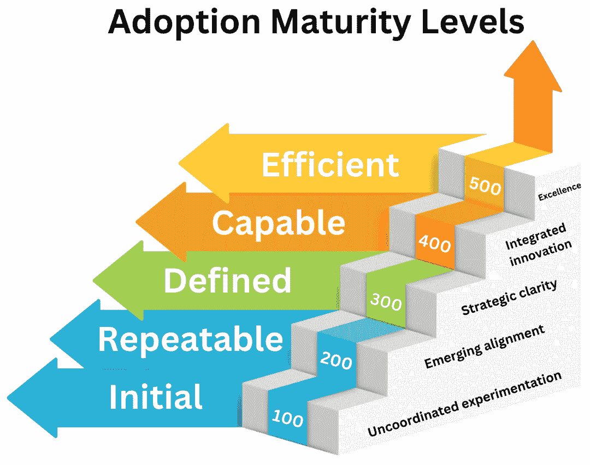
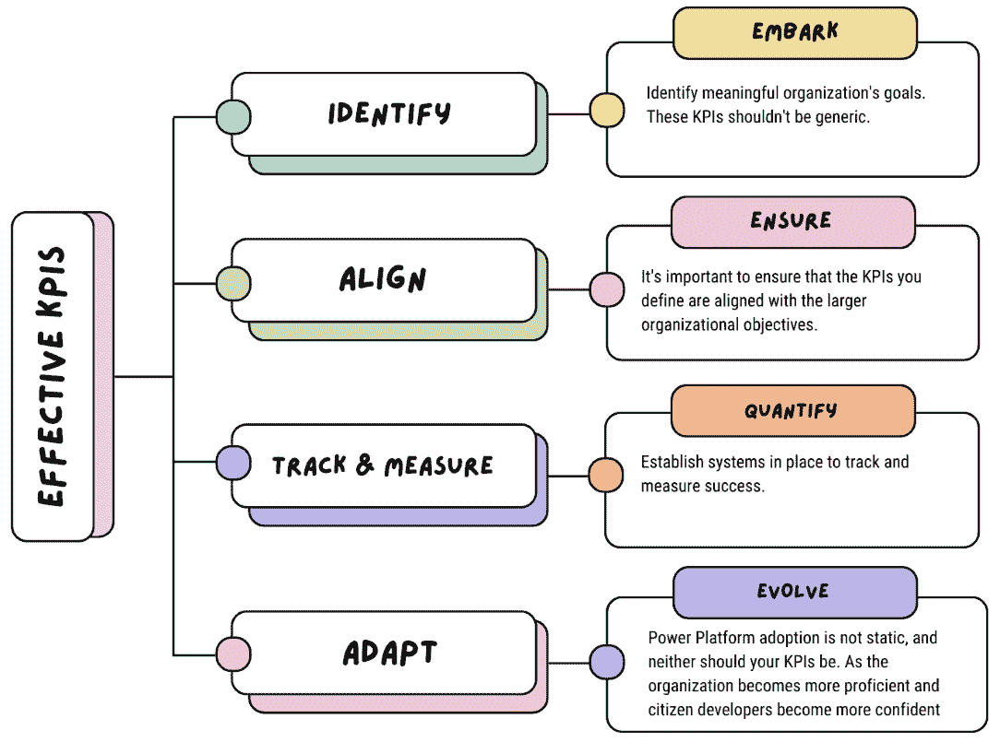

# 第十三章：从指标到里程碑：衡量 Power Platform 初始化项目的成功

本章将指导您定义和衡量您的 Power Platform 初始化项目的成功。Power Platform 是一个低代码平台，使您能够为组织的需求创建解决方案。您将学习如何使用 **卓越中心**（**CoE**）入门套件来创建 Power Platform 转型的战略路线图。您还将学习如何选择和调整 **关键绩效指标**（**KPIs**）以跟踪您的 Power Platform 解决方案的采用和影响。

在本章中，您将学习如何在 Power Platform 初始化项目中定义和衡量成功。您将探索以下主题：

+   战略和愿景

+   识别和衡量成功

+   SMART 目标和 KPI 基准

到本章结束时，您将能够展示您的进展以及您的 Power Platform 初始化项目对组织及其以外的价值。

# 使用 CoE 入门套件定义战略路线图

明确的战略对于在您的组织中成功采用和实施 Power Platform 的数字化转型至关重要。建立清晰的愿景和战略路线图确保您的 Power Platform 实施项目与更广泛的企业目标一致，并产生可衡量的价值。CoE 入门套件提供了必要的工具和框架来支持这一过程，使您能够创建一个强大的治理模型并培养创新文化。在我们深入研究实现成功的 Power Platform 实施的工具之前，让我们调查与定义采用战略和愿景相关的关键概念。

## 战略在 Power Platform 采用中的作用

清晰的战略是成功采用 Power Platform 的基础。组织必须制定一个路线图，概述短期和长期目标。这些目标应与整体业务目标一致，确保 Power Platform 的采用支持企业范围内的数字化转型。

战略路线图应涵盖以下内容：

+   **业务一致性**：Power Platform 如何解决关键业务挑战并支持组织目标

+   **技术准备性**：评估现有系统及其如何与 Power Platform 集成

+   **人员和文化**：确定组织内部平稳过渡所需的技能和能力

+   **投资规划**：为软件、培训和变革管理设定现实的预算

### 视觉成熟度水平

Power Platform 采用的成熟度模型包括五个不同的阶段：初级、可重复、定义、能干和高效。关注 **战略** 和 **愿景** 方面，我们将评估不同级别的成熟度。

#### 初级（级别 100）

在初始级别，组织以分散的方式在 Power Platform 上进行实验。采用可能由没有集中愿景或策略的个别部门或团队驱动。与整个企业级业务目标之间几乎没有一致性，因此，Power Platform 项目可能缺乏一致性：

+   **策略**：存在最少的正式策略。个人努力没有协调，导致孤立且通常未充分优化的解决方案。

+   **愿景**：Power Platform 的长期潜力尚未完全理解或阐述。愿景仅限于解决即时问题，而没有理解更广泛的业务背景。

#### 可重复（级别 200）

在可重复级别，组织开始认识到统一 Power Platform 策略的重要性。团队可能开始分享成功的实践，并开始出现更清晰的路线图：

+   **策略**：组织承认业务目标和科技解决方案之间需要一致。一些努力被用于优先考虑支持关键业务成果的 Power Platform 项目。

+   **愿景**：一个更广泛的愿景开始形成，重点是促进跨部门的创新。组织意识到 Power Platform 可以简化流程并创造效率，但范围仍然有限。

#### 定义（级别 300）

定义级别表示组织已经为 Power Platform 的采用制定了一个明确的全组织策略。团队被赋予了治理模型和资源，以实施与业务策略一致的 Power Platform 解决方案：

+   **策略**：战略路线图被正式记录，概述了 Power Platform 项目将如何支持当前和未来的业务目标。跨职能团队协作，以确保 Power Platform 解决方案与更大的数字化转型努力保持一致。

+   **愿景**：组织对 Power Platform 的愿景是全面的。目标是创建可扩展、可重复使用的解决方案，以促进创新并提供竞争优势。领导者阐述了一个长期计划，以扩大平台的使用范围，包括公民开发、自动化和人工智能集成。

#### 能够（级别 400）

在能够级别，组织将 Power Platform 完全整合到其数字化转型策略中。解决方案具有可扩展性，并在业务单元之间集成。策略根据绩效指标和不断变化的企业需求持续优化：

+   **策略**：路线图包括由数据和反馈驱动的持续优化。Power Platform 被视为企业 IT 基础设施的关键组成部分，对治理、安全和可扩展性的投资确保了其长期成功。

+   **愿景**：愿景超越了运营改进。Power Platform 被视为创新和竞争优势的关键推动者。处于这一级别的组织在平台内探索高级功能，如人工智能、机器学习和预测分析。

#### 有效（级别 500）

在有效级别，组织已将 Power Platform 完全整合到其数字生态系统中。该平台不仅推动效率和创新能力，还开辟了新的商业机会：

+   **战略**：Power Platform 与其他核心业务系统完全集成。战略路线图侧重于持续创新、持续改进和开启新的收入来源。

+   **愿景**：Power Platform 被视为推动企业战略的关键驱动力。领导者持续完善他们的愿景，包括新兴技术，使组织始终处于数字创新的前沿。

*图 13*.*1*展示了 Power Platform 采用级别，表示为通往更高成熟度和创新的楼梯。每个步骤代表一个不同的级别，从底部的初始阶段开始，经过可重复的、定义的、有能力的，最终达到顶部的有效级别。每个级别都有简短描述，提供对处于该阶段组织的特征和战略焦点的洞察。楼梯的比喻反映了通往一个完全运营和创新数字生态系统的旅程，其中 Power Platform 不仅推动效率，还开辟了新的商业机会和竞争优势。

图 13.1 – Power Platform 愿景成熟度级别

### 利用 CoE 启动套件评估 Power Platform 愿景成熟度

CoE 启动套件通过提供工具和见解来帮助组织识别其 Power Platform 愿景成熟度级别，这些工具和见解评估了他们平台使用、治理和创新能力的当前状态。

这一切始于对您当前环境的评估，帮助您了解组织在 Power Platform 使用方面的成熟度，并确定关键改进领域。此评估使您能够定义明确的目标，指导您的 Power Platform 之旅，确保每一步都与组织的长期目标保持一致。

使用 CoE 启动套件的主要好处之一是其能够将战略规划与运营执行相结合。它允许您建立治理结构，设置监控和报告机制，并定义跟踪进度和成功的 KPI。通过利用这些功能，您可以创建一个战略路线图，不仅概述实现愿景的路径，还提供了测量和调整所需方法的工具。

本质上，CoE 入门套件增强了您组织定义和执行 Power Platform 转型战略路线图的能力。通过遵循最佳实践并利用 CoE 入门套件提供的工具，您可以确保您的 Power Platform 战略与组织更广泛的愿景保持一致，得到有效管理，并能够持续创造业务价值。随着我们进入下一节，我们将探讨如何通过 KPI 识别和衡量成功，以跟踪您的 Power Platform 项目的影响。

这里有一些 CoE 入门套件如何用于评估组织 Power Platform 愿景成熟度的实际例子：

+   **跟踪平台使用和采用情况**：在 CoE 入门套件中使用 Power BI 采用仪表板，您可以监控活跃制作者、应用程序和流程的数量。如果数据显示只有少数部门使用有限，这可能表明组织处于初始或可重复阶段。相反，多个部门广泛使用则表明成熟度更高，如定义或能力级别。

+   **监控解决方案的可扩展性**：通过分析 CoE 入门套件中的应用程序和流程库存功能，组织可以评估其解决方案是否可扩展并在各部门之间重复使用。如果大多数应用程序都是为了解决孤立、特定部门的难题而构建的，没有更广泛的可扩展性，这表明成熟度较低。更高成熟度表现为为企业级使用设计的解决方案，反映了与长期战略和创新的协调一致。

+   **评估治理结构**：CoE 入门套件的治理仪表板有助于跟踪组织内政策的实施、安全和合规性。例如，处于定义或能力阶段的组织将拥有更结构化的治理，确保 Power Platform 与公司整体业务目标保持一致，并遵循统一战略。

+   **跟踪公民开发者参与度**：CoE 入门套件提供了对公民开发活动洞察——显示谁在创建应用程序，他们的频率以及解决方案的复杂性。如果公民开发有限，组织可能处于可重复或定义阶段。商业用户在创建应用程序和自动化方面的更高参与度表明成熟度更高，如能力或高效级别，其中 Power Platform 愿景包括一个强大的公民开发者计划。

+   **通过高级功能衡量创新**：CoE 入门套件可以跟踪高级 Power Platform 功能（如 AI Builder 或 Power Automate 的**机器人流程自动化**（RPA））的使用情况。广泛使用这些功能的组织可能处于能力或高效级别，其中创新和先进技术是其 Power Platform 愿景和战略的核心。

+   **审查变更管理和培训计划**：通过 CoE Starter Kit 的见解，组织可以评估其培训和变更管理努力的广度。如果只进行了基本培训或可用资源有限以帮助用户，则组织可能处于可重复阶段。然而，如果实施了全面且持续的训练计划，它们可能处于更高级的成熟度水平，例如具备能力或效率，并具有培养 Power Platform 文化的长期愿景。

这些示例展示了 CoE Starter Kit 如何提供可操作的见解，帮助组织评估其当前 Power Platform 视觉成熟度水平并确定战略改进领域。

# 识别和衡量成功

有效衡量 Power Platform 初始化的成功取决于识别和与组织目标一致的 KPI。通过利用这些 KPI，您可以跟踪 Power Platform 的采用及其影响，确保其推动预期的业务成果。在本节中，我们将探讨如何定义和调整 KPI 以有效衡量 Power Platform 采用的成功，同时保持业务目标和技术解决方案之间的战略一致性。

## 理解 KPI 在 Power Platform 采用中的作用

KPI 作为可衡量的值，展示了组织通过 Power Platform 采用实现其业务目标的效率。确定正确的 KPI 确保组织可以持续监控进度、优化资源并根据需要调整其策略。没有定义的 KPI，衡量 Power Platform 初始化的**投资回报率**（**ROI**）变得具有挑战性。

有效的 KPI 应该做到以下几点：

+   与更广泛的企业目标保持一致

+   **具体**、**可衡量**、**可实现**、**相关**和**时限性**（**SMART**）

+   提供采用进度的定量和定性见解

### 确定关键指标

衡量成功的第一步是确定与您的组织战略目标和业务目标一致的 KPI。这些 KPI 应根据您通过 Power Platform 采用寻求的具体成果进行定制，例如提高效率、降低成本或增强客户参与度。常见的指标包括通过自动化节省的时间、运营成本的降低和用户采用率。

以下是一些示例：

+   **运营效率**：KPI 可能会衡量通过自动化手动流程或减少对传统 IT 开发周期的依赖所节省的时间

+   **成本降低**：KPI 可以通过使用 Power Platform 构建内部解决方案来跟踪 IT 成本或第三方应用程序支出的减少

+   **客户满意度**：KPI 可能包括客户满意度评分或通过 Power Apps 或 Power Automate 工作流响应客户咨询的速度

通过将 Power Platform 采用的关键绩效指标直接与这些业务目标联系起来，组织确保每个倡议都能产生有意义的价值，并有助于战略成功。

### Power Platform 采用的关键绩效指标主要类别

为了有效地衡量 Power Platform 的采用，组织应关注几个关键类别的关键绩效指标，包括用户参与度、解决方案影响、创新和治理。每个类别都提供了独特的见解，了解 Power Platform 如何在整个业务中创造价值：

+   **用户参与度关键绩效指标**：这些关键绩效指标帮助组织评估 Power Platform 的采用程度，通过跟踪用户和团队如何与平台互动：

    +   **活跃的制作者和用户数量**：衡量在平台内积极构建应用程序或流程或利用 Power BI 的个人数量

    +   **应用使用情况**：追踪特定应用的使用频率和数量，显示它们为用户提供的价值

    +   **公民开发者参与度**：衡量非 IT 员工创建解决方案的数量，表明 Power Platform 如何有效地培养创新文化

+   **解决方案影响的关键绩效指标**：这些关键绩效指标评估 Power Platform 解决方案在满足特定业务需求和产生可衡量结果方面的成效：

    +   **自动化节省的时间**：量化通过 Power Automate 或定制应用程序自动化手动流程所节省的小时数，展示运营效率的提升

    +   **错误减少**：衡量先前手动流程中错误或不一致性的减少，突出准确性改进

    +   **内部应用开发节省的成本**：追踪通过内部构建定制解决方案而非购买第三方应用程序或服务所节省的成本

+   **创新和转型关键绩效指标**：以创新为重点的关键绩效指标衡量 Power Platform 如何促进更广泛的组织转型和新能力的发展：

    +   **数字化新业务流程的数量**：追踪使用 Power Platform 数字化的流程数量，表明组织对数字化转型承诺的信号

    +   **由 Power Platform 启用的新服务或产品**：衡量使用该平台推出的新客户面向服务或产品的数量，表明其在推动创新中的作用

    +   **创新采用率**：追踪新 Power Platform 功能或更新如何快速集成到组织工作流程中

+   **治理和合规关键绩效指标**：这些关键绩效指标评估组织在管理 Power Platform 采用治理和安全方面的成效：

    +   **遵守治理政策**：衡量与既定治理框架的合规率，表明平台控制与监控的成效

    +   **数据安全事件**：追踪与 Power Platform 解决方案相关的安全漏洞或合规问题数量，确保风险最小化

    +   **审计跟踪和监控效率**：衡量 Power Platform 活动监控和审计的有效性，以维护内部和外部法规的合规性

### 为 Power Platform 采用构建有效的 KPI 框架

为了确保 KPI 能够有效衡量 Power Platform 采用的成功，组织必须构建一个强大的 KPI 框架。这个框架应该做到以下几点：

+   **定义成功**：明确组织成功的样子。这可能包括提高客户满意度、更快响应时间、降低运营成本或提供更多创新服务。

+   **将 KPI 与目标对齐**：确保每个 KPI 直接支持一个或多个业务目标。例如，如果目标是降低 IT 成本，KPI 可能会关注自动化任务或构建内部应用带来的成本节约。

+   **设定基准**：为每个 KPI 建立基线指标，以便随着时间的推移跟踪进度。例如，组织可能会在今天衡量应用使用情况，并与六个月后主要 Power Platform 项目后的使用情况进行比较。

+   **使用实时数据**：利用 Power BI 等工具收集实时数据，为 Power Platform 的采用提供持续的见解。这确保了决策者能够及时调整策略和计划。

+   **审查和改进**：定期审查 KPI 以确保它们在组织需求和目标演变时保持相关性。随着 Power Platform 功能的扩展，可能需要新的 KPI 来衡量新兴的价值领域，如人工智能或机器学习的采用。

### 领导力在推动关键绩效指标（KPI）成功中的作用

领导力在任何一个 Power Platform 项目成功中都起着至关重要的作用，尤其是在识别和衡量 KPI 方面。领导者必须做到以下几点：

+   **倡导 Power Platform 的采用**：积极鼓励跨部门使用 Power Platform，确保所有团队都了解平台的价值及其与业务目标的契合度

+   **将团队与 KPI 对齐**：确保所有利益相关者，从 IT 到业务部门，都了解 KPI 并理解他们的贡献如何影响平台的整体成功

+   **培养数据驱动文化**：强调数据驱动决策的重要性，确保团队使用 KPI 来评估进度并持续改进

### 利用财务指标

财务 KPI，例如投资回报率（ROI）、**总拥有成本**（**TCO**）和回收期，对于衡量您的 Power Platform 项目的财务成功至关重要。这些指标有助于量化解决方案产生的经济价值。例如，通过比较 Power Platform 解决方案带来的成本节约或收入与初始投资来计算 ROI。

### 定性效益

除了量化的 KPIs 之外，还应考虑定性收益，如提高员工满意度、增强灵活性和提升协作。这些因素虽然难以用数字衡量，但对 Power Platform 采用的整体成功贡献显著。收集用户反馈和证词可以提供对这些定性改进的见解。

### 传达成功

有效传达 Power Platform 采用的成功对于维持利益相关者的支持至关重要。定期向领导层展示 KPI 结果，突出定量和定性收益。这种持续的沟通确保了 Power Platform 项目价值的认可，并确保对平台的持续投资。

通过获取和应用这些技能来识别和调整 KPIs，您的组织可以有效地衡量 Power Platform 采用的成功。这些 KPIs 将指导您跟踪进度、展示价值并就未来项目做出明智的决策。随着我们继续前进，下一节将探讨在 Power Platform 部署中确保数据传输和 API 访问，这是确保解决方案安全和可靠的关键组成部分。

*图 13.2* 展示了一个详细的流程图，说明了 KPI 定义和优化的持续循环。

图 13.2 – KPI 定义概述

此循环强调迭代方法的重要性，其中每个步骤都与一个旨在增强 KPI 识别、测量和改进整体过程的特定行动相匹配。从 KPI 的初始建立开始，该循环通过数据收集、分析和反馈的阶段，确保 KPIs 保持相关性和与组织目标的契合。定期的优化有助于组织适应不断变化的企业需求，发现新的见解，并在各个部门优化性能。

通过理解如何设置、监控和优化关键绩效指标（KPIs），组织可以确保其 Power Platform 项目与更广泛的企业目标保持一致，并产生可衡量的成果。下一节将通过实际案例和见解，指导您定义 SMART 目标和 KPI 基准，帮助您持续改进和优化您的 Power Platform 采用之旅。

# SMART 目标和 KPI 基准

设定明确、可操作的目标对于任何业务项目的成功，包括 Power Platform 的采用，都是至关重要的。在本节中，我们将探讨如何掌握设定 SMART 目标和建立与组织战略目标一致的 KPI 基准的技能。我们还将提供针对 IT 领导和 C 级高管量身定制的实际案例，展示 SMART 目标和 KPIs 如何推动可衡量的成果并确保 Power Platform 项目的成功。

### 理解 SMART 目标

SMART 目标为组织提供了一种结构化的框架，使它们能够设定清晰、可操作的目标，这些目标可以跟踪和衡量。SMART 目标的每个要素都在确保目标现实并与更广泛的业务目标一致方面发挥着关键作用：

+   **具体**：明确定义目标，不留任何含糊的余地。它应该回答“谁、什么、哪里、何时和为什么。”

+   **可衡量**：确定成功如何量化。KPI 在这里发挥着关键作用，因为它们提供了用于评估进展的指标。

+   **可实现**：目标应在给定的资源、技能和时间框架内是现实和可实现的。

+   **相关**：将目标与更广泛的业务目标对齐，以确保它支持整体组织战略。

+   **时限**：设定明确的截止日期或时间框架，以确保目标按计划进行并具有可问责性。

通过应用 SMART 框架，IT 领导者和 C 级专业人士可以确保他们的 Power Platform 项目不仅在战略上保持一致，而且可衡量和可操作。

### 建立 KPI 基准

KPI 提供了跟踪实现 SMART 目标进展所需的指标。在设定 KPI 基准时，以下事项很重要：

+   定义当前性能的基线指标

+   为每个关键绩效指标（KPI）设定现实的目标值

+   确保 KPI 与业务目标紧密相连，反映定量和定性结果

例如，如果目标是通过对公民开发者创建应用程序来减少 IT 积压，KPI 可能包括以下内容：

+   公民开发者构建的应用程序数量

+   在一定时期内 IT 积压任务减少的百分比

+   通过 Power Platform 解决方案自动化手动任务节省的时间

### SMART 目标和 KPI 基准对 Power Platform 项目的力量

在 Power Platform 采用的情况下，设定 SMART 目标和 KPI 基准确保数字化转型计划保持正轨并产生可衡量的结果。以下示例说明了 IT 领导者和 C 级高管如何应用此框架以实现成功。

### 示例 1 - 通过公民开发者减少 IT 积压

SMART 目标是通过使用 Power Apps 构建自定义应用程序来赋予公民开发者减少 IT 积压 30%的能力，在 12 个月内实现：

+   **具体**：专注于赋予公民开发者减少 IT 积压的能力

+   **可衡量**：将积压任务减少 30%设定为目标

+   **可实现**：为业务用户提供培训和支援以构建应用程序

+   **相关**：与提高敏捷性和减少对 IT 的依赖的目标一致

+   **时限**：目标应在 12 个月内实现

以下为 KPI 基准：

+   **基线**：IT 团队每月构建 10 个应用程序

+   **目标**：总应用程序开发的 25%由公民开发者处理

+   **衡量**：通过 IT 票务系统跟踪的业务单位对应用程序开发的请求减少

**实际案例**：一家在 IT 等待列表方面遇到困难的健康保健组织实施了 Power Platform，以使非技术部门的业务用户能够创建自动化行政任务（如患者接收或数据管理）的应用程序。通过设定一个 SMART 目标，即通过 30% 的 IT 等待列表减少和建立明确的 KPI，他们能够跟踪进度并展示在运营效率方面的可衡量改进。

### 示例 2 – 通过自动化提高运营效率

SMART 目标是在九个月内使用 Power Automate 自动化人力资源部门的 40% 的手动流程，减少 25% 的处理时间：

+   **具体性**：自动化手动人力资源流程

+   **可衡量性**：目标 40% 的流程，并力争将处理时间减少 25%

+   **可实现性**：利用现有的 Power Automate 功能和培训

+   **相关性**：减少运营成本并提高服务交付

+   **时间限制**：九个月完成自动化的最后期限

以下是一些关键绩效指标基准：

+   **基准**：手动人力资源流程所花费的时间，例如入职或工资发放

+   **目标**：通过 25% 的处理时间减少

+   **衡量指标**：通过工作流程日志和员工对效率的反馈跟踪人力资源部门实施的自动化工作流程数量

**实际案例**：一家在手动人力资源流程（如基于纸质的入职）方面遇到困难的金融服务公司，设定了一个 SMART 目标，即自动化 40% 的这些流程。使用 Power Automate，公司整合了数字工作流程，将处理时间缩短了 25%，简化了人力资源运营。这不仅提高了效率，还使人力资源团队能够专注于更多战略性的任务。

### 示例 3 – 通过数字解决方案提升客户体验

SMART 目标是在六个月内使用 Power Apps 推出一个新的客户自助服务门户，提高 20% 的客户满意度：

+   **具体性**：构建并推出客户自助服务门户

+   **可衡量性**：通过提高 20% 的客户满意度

+   **可实现性**：利用 IT 团队内现有的 Power Apps 专业知识

+   **相关性**：与提高客户体验的目标一致

+   **时间限制**：六个月内推出门户

以下是一些关键绩效指标基准：

+   **基准**：当前客户满意度评分来自反馈调查

+   **目标**：通过推出后的客户反馈，满意度提高 20%

+   **衡量指标**：门户的使用统计（例如，每日登录次数）和通过调查跟踪的客户满意度评分

**实际案例**：一家零售公司旨在通过使用 Power Apps 构建自助服务门户来减少客户支持查询量。目标是提高客户体验并降低支持成本。通过设定关于门户使用和满意度率的明确 KPI，公司成功推出了门户，在六个月内客户满意度提高了 20%。

### 案例 4 - 通过培养公民开发者来培养创新文化

SMART 目标是在接下来的 12 个月内通过提供培训、资源和导师制来培养和赋权 50 名新的公民开发者，从而至少构建 15 个解决特定部门挑战的新应用程序：

+   **具体性**：专注于培养 50 名新的公民开发者，并赋予他们创建 15 个解决特定部门问题的应用程序的能力

+   **可衡量性**：跟踪培训的新开发者和开发的应用程序数量

+   **可达成性**：提供全面的培训计划、导师制和资源，以鼓励参与

+   **相关性**：与培养创新和减少对 IT 的依赖的更广泛目标保持一致，通过鼓励公民开发来实现

+   **时限性**：在 12 个月内实现目标

以下是一些关键绩效指标基准：

+   **基线**：组织当前活跃的公民开发者数量

+   **目标**：在 12 个月结束时达到 50 名新的公民开发者

+   **衡量指标**：通过 Power Platform 的治理仪表板跟踪的新开发者成功开发和部署的应用程序数量

**实际案例**：一家旨在培养创新精神的制造公司设定了一个 SMART 目标，即在一年的时间内培养 50 名新的公民开发者。通过有针对性的培训课程、定期的工作坊和分配部门导师，他们赋予了非技术员工构建解决运营效率问题（如库存管理和员工排班）的应用程序的能力。到年底，成功部署了 20 个新应用程序，简化了内部流程，并减少了 IT 部门的工作量，展示了培养公民开发者如何推动组织内的创新和自给自足。

设定和实现公民开发的 SMART 目标不仅是一个战略需求，而且是培养组织内部创新和运营效率的催化剂。通过建立明确的基准、提供必要的资源并细致跟踪进度，公司可以将非技术员工转变为赋权的开发者，从而创造巨大的商业价值。这种结构化方法确保了 Power Platform 的采用与更广泛的组织目标保持一致，并为可持续增长和自给自足铺平了道路。

# 摘要

在本章中，我们深入探讨了定义、跟踪和衡量 Power Platform 采用成功所必需的关键组件。本章提供了一个建立战略路线图、设定 SMART 目标和将关键绩效指标与组织目标对齐的全面框架。这些步骤对于确保 Power Platform 项目不仅产生可衡量的成果，而且有助于长期业务转型至关重要。

在整个旅程中，我们强调了利用诸如 CoE 启动套件等工具的重要性。这个工具包在帮助组织评估其当前成熟度水平、监控其进度，并为在整个企业中扩展 Power Platform 采用提供必要的治理方面发挥着关键作用。

在下一章中，我们将探讨如何跟踪超越初始里程碑的进度，并深入了解如何保持动力。你将学习如何通过仔细监控、定期调整，并确保目标随着你的组织继续其数字化转型之旅而保持相关性，来维持 Power Platform 项目的价值。

从本质上讲，下一章将赋予你超越设定指标的能力，通过展示如何**跟踪**、**评估**和**维持**你的 Power Platform 成功，确保它为你的组织带来持续的价值。

# 加入我们的 Discord 社区

加入我们的 Discord 空间，与作者和其他读者进行讨论：

[`packt.link/powerusers`](https://packt.link/powerusers)

