# 第一章：深度学习生命周期

在本章中，我们将探讨深度学习生命周期的复杂性。深度学习生命周期与机器学习生命周期具有相似的特点，它既是一个框架，也是一个方法论，能够让一个深度学习项目要么取得巨大的成功，要么在适当的时候完全废弃。我们将掌握为什么这个过程是循环的，并深入理解生命周期的一些初步过程。此外，我们还将简单预览生命周期后续过程的高层次内容，这些内容将在未来的章节中深入探讨。

综合来看，本章将帮助你完成以下内容：

+   理解深度学习生命周期与机器学习生命周期之间的相似性和差异性

+   理解领域知识在深度学习项目中的作用

+   理解规划深度学习项目的几个关键步骤，确保它能够切实创造现实世界的价值

+   在高层次上掌握一些深度学习模型开发的细节

+   在高层次上掌握模型解释的重要性以及深度学习解释技术的多样性

+   探索模型部署的高层次概念及其治理

+   学会选择必要的工具来执行深度学习生命周期中的过程

我们将在以下章节中讲解这些内容：

+   机器学习生命周期

+   深度学习生命周期的构建策略

+   数据准备阶段

+   深度学习模型开发

+   提供模型洞察

+   风险管理

# 技术要求

本章包括一些**Python**编程语言的实用实现。要完成本章内容，你需要一台安装了以下库的计算机：

+   `pandas`

+   `matplotlib`

+   `seaborn`

+   `tqdm`

+   `lingua`

代码文件可在 GitHub 上找到：[`github.com/PacktPublishing/The-Deep-Learning-Architect-Handbook/tree/main/CHAPTER_1`](https://github.com/PacktPublishing/The-Deep-Learning-Architect-Handbook/tree/main/CHAPTER_1)。

# 理解机器学习生命周期

**深度学习**是更广泛的机器学习类别的一个子集。它与其他机器学习算法的主要区别在于其基础构建块——**神经网络**。随着深度学习自 2000 年代初以来的巨大进步，它通过其机器学习对等物实现了许多以前无法完成的壮举。特别是，深度学习在识别复杂模式方面取得了突破，这些模式存在于复杂且非结构化的数据中，例如文本、图像、视频和音频。如今，深度学习的一些成功应用包括图像中的人脸识别、音频数据中的语音识别和文本数据中的语言翻译。

另一方面，机器学习是更广泛的人工智能类别的一个子集。其算法，如基于树的模型和线性模型，虽然不被视为深度学习模型，但仍然适用于涉及表格数据的广泛应用场景，而表格数据是大多数小型和大型组织所存储的数据。这些表格数据可能存在于多个结构化数据库中，数据跨度可能达到 1 到 10 年的历史数据，且这些数据具有用于构建预测性机器学习模型的潜力。一些机器学习算法的显著预测应用包括金融行业中的欺诈检测、电子商务中的产品推荐以及制造业中的预测性维护。*图 1**.1* 显示了深度学习、机器学习和人工智能之间的关系，以便更清晰地区分它们：

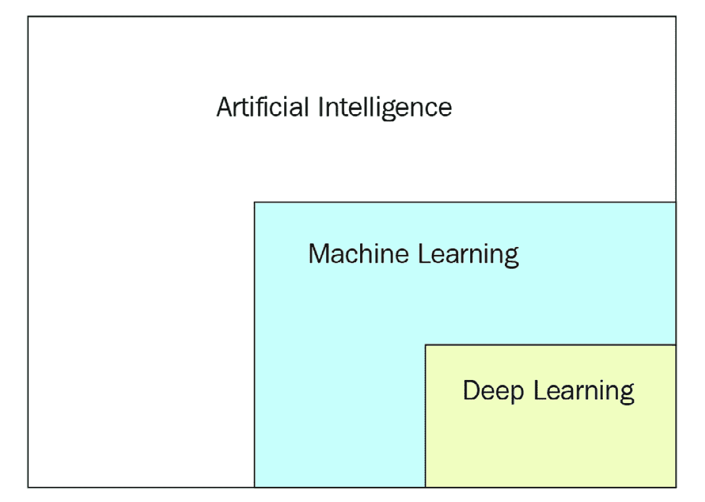

图 1.1 – 人工智能关系

现在我们大致了解了深度学习和机器学习的概念，我们准备好一窥机器学习生命周期，如*图 1**.2*所示：

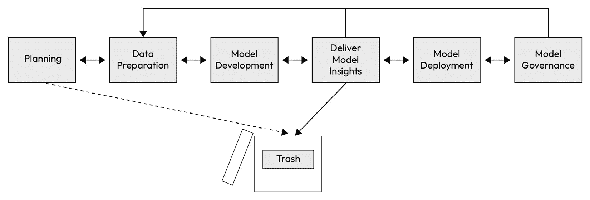

图 1.2 – 深度学习/机器学习生命周期

深度学习算法相比其他机器学习算法尽管更加先进和复杂，但确保这两个领域成功所需的指导方法无疑是相同的。机器学习生命周期涉及六个阶段，这些阶段之间以不同的方式相互作用：

1.  **规划**

1.  **数据准备**

1.  **模型开发**

1.  **交付** **模型洞察**

1.  **模型部署**

1.  **模型治理**

*图 1**.2* 展示了这六个阶段以及通过箭头表示的可能阶段转换。通常，一个机器学习项目会根据业务需求在各个阶段之间反复迭代。在深度学习项目中，大多数创新性的预测性应用场景需要手动数据收集和数据标注，这一过程属于**数据准备**阶段。由于这个过程通常非常耗时，尤其是当数据本身不容易获得时，一种解决方案是从一个可以接受的初始数据量开始，然后过渡到**模型开发**阶段，随后进入**交付模型洞察**阶段，以确保从想法中得到的结果是合理的。

在初步验证过程之后，依照业务需求，实践者将决定是否重新进入**数据准备**阶段，并根据不同数据量的里程碑，周期性地迭代这些阶段，直到模型开发和业务指标的结果都令人满意。获得必要的利益相关者批准后，项目将进入**模型部署**阶段，届时构建的机器学习模型将被提供，以便其预测结果得以使用。最后阶段是**模型治理**，在这一阶段，实践者执行管理已部署机器学习模型的风险、性能和可靠性的任务。模型部署和模型治理都值得更深入的讨论，并将在本书后期的章节中单独介绍。每当任何关键指标未能维持在某一确定的置信度水平时，项目将返回到**数据准备**阶段，并重新开始相同的流程。

理想的机器学习项目应根据业务需求，按周期性阶段流动。然而，机器学习项目通常容易遭遇高概率的失败。根据 Dimensional Research 和 Alegion 进行的一项调查，涵盖了来自 20 个不同业务行业的约 300 名机器学习从业者，78%的机器学习项目在部署前的某个阶段被拖延或受阻。此外，Gartner 预测，85%的机器学习项目将失败（[`venturebeat.com/2021/06/28/why-most-ai-implementations-fail-and-what-enterprises-can-do-to-beat-the-odds/`](https://venturebeat.com/2021/06/28/why-most-ai-implementations-fail-and-what-enterprises-can-do-to-beat-the-odds/)）。通过预见意外并在它们发生之前预判失败，实践者可以在规划阶段及早避免潜在的失败因素。这也引出了*图 1**.2*中与垃圾图标捆绑在一起的概念。一个良好的项目，通常只有在**交付模型洞察**阶段被舍弃，那时已明确提出的模型和项目无法交付令人满意的结果。

现在我们已经概述了机器学习生命周期，让我们逐个阶段深入探讨，并将其分解为多个部分，帮助你发现完成每个阶段所需的关键技巧和方法。这些阶段将以抽象的方式进行讨论，并不是对你在项目中最终应采取的实际步骤的具体描述，因为每个项目都是独特的，策略应始终根据具体情况进行评估。

# 策划构建深度学习系统

深度学习模型只有成为执行某种操作的系统的一部分，才能实现实际的价值。将深度学习模型从研究论文带到实际的现实世界应用并非易事。因此，在进行任何项目之前进行适当的规划，是实现目标的更可靠和结构化的方式。本节将讨论一些在规划深度学习项目以走向成功时，可能会有帮助的考虑因素和策略。

## 启程

如今，深度学习从业者往往过于专注于模型构建过程中的算法部分。要避免被**最先进**（**SOTA**）的研究技术吸引，需要相当大的心理耐力。像**pixtopix**这样的疯狂技术，它能够从草图或图像掩模中生成高分辨率的真实彩色图像，和像**自然语言处理**（**NLP**）技术中的**GPT-3**（一个拥有 1750 亿参数的文本生成模型，由 OpenAI 开发）和 GPT-4（GPT-3 及其子模型的继任者，一个多模态文本生成模型，能够生成从文本摘要到代码生成的任何文本格式内容）一样，为什么不让它们成为主流呢？！

开个玩笑，要成为一名真正的深度学习架构师，我们需要达成共识：任何成功的机器学习或深度学习项目都是从业务*问题*出发的，而不是从你刚在网上读到的、附带公共 GitHub 仓库的闪亮新研究论文开始的。规划阶段通常会涉及许多对机器学习算法细节不太了解的业务高管，而且通常，同一批人根本不关心这些内容。对于专注于业务的利益相关者来说，这些算法令人望而却步，再加上人工智能技术本身采纳所面临的巨大心理障碍，这并不会让项目更容易被采纳。

## 评估深度学习的价值

深度学习在处理非结构化数据方面最为突出。这包括图像数据、文本数据、音频数据和视频数据。这在很大程度上得益于模型自动学习并从原始数据中提取复杂、高层次特征的能力。在图像和视频的案例中，深度学习模型能够捕捉空间和时间模式，识别物体、场景和活动。对于音频数据，深度学习能够理解语音、噪音和各种声音元素的细微差别，使得构建语音识别、语音助手和音频分类系统等应用成为可能。对于文本数据，深度学习模型能够捕捉上下文、语义和语法，从而支持如情感分析、机器翻译和文本摘要等自然语言处理（NLP）任务。

这意味着，如果您的公司在其业务流程中存在并利用这些数据，可能有机会借助深度学习来解决一个问题。然而，切勿仅仅为了使用深度学习而过度复杂化问题。用一个更容易理解的比喻来说，你不会用一把巨大的大锤去把钉子钉进木头。虽然可能有效，而且你或许能成功，但你可能会把钉子弄弯，甚至可能在使用过程中伤到自己。

一旦识别出一个问题，就要评估解决它的商业价值。并非所有问题都是一样的，它们可以根据业务影响、价值、复杂度、风险、成本和深度学习的适用性进行排序。通常，你应该寻找高影响、高价值、低复杂度、低风险、低成本并且适合深度学习的问题。虽然这些指标之间存在权衡，但简而言之，要确保你发现的问题值得用深度学习来解决。一个普遍的经验法则是，面对问题时，总是优先选择更简单的解决方案，即使这意味着放弃使用深度学习技术。简单的方法往往更可靠、成本更低、风险更小，且更快见效。

考虑一个问题，在视频流中需要移除背景场景，只保留人类或必要的物体不受影响，以便可以将更合适的背景场景叠加为背景。这是当今所有电影类型中，专业电影制作行业常见的问题。

**语义分割**是指在图像的宽度和高度维度上为每个像素分配标签的任务，这是一种解决此类问题所需的方法。在这种情况下，任务需要分配标签，以帮助识别哪些像素需要被移除。随着许多公开可用的语义分割数据集的出现，深度学习在语义分割领域取得了显著进展，使其能够实现对世界的非常满意的细粒度理解，足以广泛应用于自动驾驶和机器人导航等行业。然而，深度学习并不以 100%无误著称，几乎总是存在一些误差，即使在受控的评估数据集上也是如此。例如，在人体分割的情况下，模型可能会在细小的发丝区域产生最多的错误。大多数电影制作人追求电影的完美呈现，并要求每一个像素都被恰当且无误地移除，因为电影演员的时间非常昂贵。此外，若场景没有使用绿幕拍摄，那么手动去除物体将浪费大量时间和金钱，而这些物体本可以通过绿幕简单去除。这是一个不应过度复杂化问题的例子。要解决上述问题，你只需要一个绿幕：具体来说，罕见的色度键绿色。当绿幕在需要数字化叠加图像的区域妥善准备时，图像处理技术本身可以去除被认为属于色度键绿色范围内的小光强度范围的像素，并通过基于规则的解决方案有效地实现语义分割。绿幕是一种更简单、经济、万无一失且快速设置的解决方案。

这真是一口气说完！现在，我们来看看一个更简单的问题。假设我们需要自动化地识别下雨的情况。在这个应用场景中，理解识别下雨的实际需求和目标是非常重要的：仅仅在下雨发生的瞬间检测到雨是否足够吗？还是我们需要识别雨是否会在不久的未来发生？我们将如何使用降雨事件的信息？这些问题将帮助我们判断是否需要使用深度学习。我们作为人类，知道通过视觉输入可以预测雨，比如通过观察降水的存在或者云层的状况。然而，如果应用场景仅仅需要在下雨时进行检测，并且识别下雨的目标是决定何时给植物浇水，那么一个更简单的方法就是使用电子传感器来检测水的存在或湿度。只有当你想预测未来是否会下雨，比如说在 15 分钟内，深度学习才更有意义，因为有很多气象因素之间的相互作用可能会影响降雨情况。只有通过对每个应用场景进行头脑风暴，分析所有潜在的解决方案，甚至是深度学习之外的方案，才能确保深度学习相较于其他解决方案带来切实的商业价值。不要因为想用深度学习就随便应用它。

有时，当你直接考虑某个应用场景时，价值不清晰，或者即使价值很明确，但你却不知道如何执行时，可以考虑寻找同行业公司的一些参考项目。同一行业的公司通常会有很高的可能性优化相同的流程或解决相同的痛点。类似的参考项目可以作为设计深度学习系统的指南，并且能够证明正在考虑的应用场景值得使用深度学习技术。当然，并不是每个人都能获得这种详细信息，但你会惊讶于谷歌现在能告诉你什么。即使没有类似的项目可以作为直接参考，你仍然有可能从其他已经在同一行业内带来价值的机器学习项目中获得灵感。

不得不承认，有时拒绝深度学习确实是一个难以接受的决定，因为大多数从业者都是靠实现深度学习解决方案来获得报酬的。然而，及早放弃深度学习将使你能将时间集中在更有价值的问题上，这些问题更适合通过深度学习来解决，并且能够避免在某些情况下，简单的解决方案胜过深度学习时，削弱深度学习潜力的风险。深度学习是否值得采用的标准应当根据具体情况进行评估，作为一名从业者，最好的建议是遵循常识。花足够的时间进行问题探索和价值评估。你最不想发生的事情，就是花费大量时间准备数据、构建深度学习模型，并提供非常有说服力的模型见解，结果却发现你试图预测的标签对于业务没有足够的价值，无法进一步投资。

## 定义成功

曾经听过类似这样的句子吗：“*我的深度学习模型在验证数据集上达到了 99%的准确率！*”？数据科学家经常犯一个错误，那就是仅仅通过验证指标来判断一个机器学习项目的成功，这些验证指标通常是在模型开发过程中用于评估机器学习模型的表现。像准确率、精确度或召回率这样的模型构建指标在机器学习项目中确实很重要，但除非这些指标能够为业务带来价值，并以某种方式与业务目标相连接，否则它们往往毫无意义。一个项目可能取得了不错的准确率，但仍然未能实现预期的业务目标。这种情况通常出现在没有在早期定义出合适的成功指标，从而导致在数据准备和模型开发阶段使用了错误的标签。此外，即使模型指标对业务流程产生了积极影响，也有可能无法有效地传达给业务相关方，最糟糕的情况是，当报告按原样呈现时，模型的成功并未得到认可。

成功指标在早期定义时，充当着机器学习项目的保护线，确保项目目标与业务目标一致。保护线之一是，成功指标可以帮助指导选择一个适当的标签，该标签在推理时能切实改善业务流程，或以其他方式为业务创造价值。首先，让我们确保我们对标签的含义有统一的理解，标签是你希望机器学习模型预测的一个值。机器学习模型的目的是根据某些形式的输入数据自动分配这些标签，因此在数据准备和模型开发阶段，需要选择一个标签来服务于这一目的。选择错误的标签可能会对深度学习项目造成灾难性后果，因为有时候，当数据无法直接获取时，意味着项目必须从数据准备阶段重新开始。标签应始终间接或直接与成功指标相关联。

成功指标，顾名思义，可以是复数，范围从基于时间的成功定义或里程碑到整体项目成功，从无形到有形。最佳实践是通常进行头脑风暴并记录所有可能的成功标准，从低层次到高层次。另一个最佳实践是确保始终与无形指标一起定义有形成功指标。无形指标能产生意识，但有形指标确保事物是可衡量的，从而使其更加可达。以下是一些无形且难以衡量的指标示例：

+   提高客户满意度

+   提高员工表现

+   改善股东前景

指标是衡量事物的方式，并与目标紧密相关，以确保交易的达成。目标本身可以是无形的，类似于前面列出的几个示例，但只要它与有形指标挂钩，项目就有了良好的开端。当你有了明确的目标时，问问自己，如何证明目标已经实现、展示或衡量。以下是一些可能与业务目标对齐的机器学习项目的有形成功指标示例：

+   增加客户的停留时间，这可以作为客户满意度的一个代理指标

+   增加公司收入，这可以作为员工表现的一个代理指标

+   增加**点击率**（**CTR**），这可以作为定向营销活动有效性的一个代理指标

+   增加**客户生命周期价值**（**CLTV**），这可以作为长期客户满意度和忠诚度的一个代理指标

+   提高转化率，这可以作为促销活动和网站用户体验成功的一个代理指标

这个概念并不新颖，也不仅限于机器学习项目——几乎每个为公司进行的项目都需要与业务目标对齐。许多基础的项目管理技术同样适用于机器学习项目，花时间学习一些项目管理技能对机器学习项目来说是有益的，并且这些技能可以迁移到机器学习项目中。此外，由于机器学习被认为是一项基于软件的技术，软件项目管理方法论同样适用。

最后需要记住的一点是，机器学习系统不仅仅关乎你的机器学习模型有多先进，而是关于人类与机器智能如何协作，以实现更大的目标并创造价值。

## 规划资源

深度学习通常涉及拥有大量参数（即权重）的神经网络架构。这些架构的大小可以从仅包含几个参数到包含数百亿个参数。例如，OpenAI 的 GPT-3 文本生成模型包含 1750 亿个神经网络参数，存储大小约为 350 GB。这意味着，要运行 GPT-3，你需要一台至少有 350 GB **随机存取内存**（**RAM**）的机器！

深度学习模型框架，如 PyTorch 和 TensorFlow，已经被构建为可以与被称为**图形处理单元**（**GPU**）的设备一起使用，这些设备能提供巨大的神经网络模型训练和推理加速。市面上的 GPU 设备通常配备 12 GB 的 GPU 内存，远远不足以在 GPU 模式下加载 GPT-3 模型。然而，仍然有方法将大型模型划分到多个 GPU 上，并在 GPU 上运行该模型。此外，某些方法还可以支持分布式 GPU 模型训练和推理，以支持在任何一个使用点更大的数据批量大小。GPU 并不是便宜的设备，最广泛使用的 GPU 品牌 Nvidia 的价格从几百美元到数十万美元不等。随着加密货币技术的兴起，GPU 的可用性显著下降，因为人们一有库存就会立即购买它们。所有这些都突显了在深度学习模型训练和推理之前规划计算资源的重要性。

在项目初期，将你的模型开发和部署需求与计算资源分配对齐是非常重要的。首先，通过浏览研究论文或提供技术总结的优质网站，评估适合当前任务的深度学习架构的规模范围，并为模型开发过程预留计算资源。

提示

[paperswithcode.com](http://paperswithcode.com) 提供了按各种任务分类的广泛技术总结！

当计算资源不可随时使用时，确保你总是提前制定购买计划，尤其是涉及到 GPU 时。但如果不想使用物理机器怎么办？使用计算资源的另一种选择是使用付费云计算资源提供商，您可以轻松地在世界任何地方在线访问。在模型开发阶段，分配更多 GPU 和更大 RAM 的一个好处是，可以通过在训练过程中使用更大的数据批次，或者允许同时训练多个模型，从而加速模型训练。通常也可以使用仅 CPU 进行深度学习模型训练，但模型训练时间会不可避免地更长。

在训练过程中所需的基于 GPU 和 CPU 的计算资源，通常在推理时使用时被认为是过剩的。不同的应用程序有不同的部署计算需求，决定分配哪些资源规格可以通过以下三个问题来评估：

+   推理请求的频率是多少？

    +   短时间内的多个推理请求可能意味着需要在多个计算设备上并行运行多个推理服务

+   每次请求预测时，平均请求的样本数量是多少？

    +   设备的 RAM 需求应与批处理大小预期相匹配

+   你需要多快的回复？

    +   如果响应时间要求为秒级或更快，则需要 GPU

    +   如果你不在乎响应时间，CPU 也能完成任务

资源规划不仅仅局限于计算资源规划，还扩展到人力资源规划。假设团队中有多少名深度学习工程师和数据科学家共同工作，最终将影响模型开发过程中所使用的软件库和工具的选择。选择这些工具的类比将在未来的章节中介绍。

下一步是准备数据。

# 数据准备

数据对于机器学习模型，就像燃料对于汽车、电力对于电子设备、食物对于身体一样。机器学习模型通过尝试捕捉提供的输入数据与输出数据之间的关系来工作。类似于人脑的工作方式，机器学习模型将尝试遍历收集到的数据示例，并慢慢建立记忆，以便将提供的输入数据映射到提供的目标输出数据。数据准备阶段包括为构建机器学习模型准备好可以直接使用的数据的方法和过程，其中包括以下内容：

+   原始输入和目标输出数据的获取

+   获取数据的探索性数据分析

+   数据预处理

我们将在以下小节中讨论这些话题。

## 深度学习问题类型

深度学习可以大致分为两类问题类型，即**有监督学习**和**无监督学习**。这两种问题类型都涉及构建一个能够根据明确的数据输入做出有根据的预测输出的深度学习模型。

**有监督学习**是一种涉及标签的问题类型，标签作为学习的真实来源。标签可以有多种形式，可以细分为两种问题类型，即**分类**和**回归**。分类是指在给定输入数据时，预测特定离散类别的问题。许多更复杂的问题来自于基础的分类问题类型，如**实例分割**、**多标签分类**和**目标检测**。而回归则是指在给定输入数据时，预测连续数值的问题。同样，复杂问题类型也可以从基础的回归问题类型中派生出来，如**多重回归**和**图像边界框回归**。

另一方面，**无监督学习**是一种不涉及标签的问题类型，其目标可以有很大的差异。异常检测、聚类和特征表示学习是最常见的属于无监督学习类别的问题类型。

我们将在*第八章*《探索有监督深度学习》和*第九章*《探索无监督深度学习》中分别讲解这两种问题类型。

接下来，让我们了解在获取数据时应该考虑的事项。

## 获取数据

在深度学习的背景下，获取数据通常涉及非结构化数据，包括图像数据、视频数据、文本数据和音频数据。有时候，数据可以通过某些业务流程在数据库中预先存储并随时使用，但更多时候，它必须从头开始从环境中手动收集。此外，通常这些数据的标签并不容易获得，需要手动标注。随着深度学习算法能够处理和消化高度复杂数据的能力，它也需要比传统机器学习方法更多的数据。执行大量数据收集和数据标注的需求是深度学习今天被认为具有高门槛的主要原因。

在机器学习项目中，不要急于快速选择一个算法。花一些时间正式定义可以用来预测目标变量的特征。在这个过程中，寻求领域专家的帮助，并集思广益，寻找与目标变量相关的潜在预测特征。在实际项目中，通常会花费大量时间规划和获取数据，同时确保获得的数据适合机器学习模型使用，之后才会将剩余时间用于模型构建、部署和治理。虽然关于如何处理模型开发阶段的低质量数据已经进行了大量研究，但大多数技术并不全面，且在一定程度上只能掩盖数据固有的质量问题。如果在数据采集阶段对质量保证表现出无知，只在数据科学部分表现出热情，那么项目从一开始就注定会失败。

制定数据采集策略是一项艰巨的任务，特别是当你不知道什么才算是高质量数据时。让我们来看一下，在实际商业应用和机器学习的背景下，你应该考虑的一些数据质量的关键要素：

+   **代表性**：数据在多大程度上能代表真实世界数据集？

+   **一致性**：注释方法有多一致？相同的模式是否匹配相同的标签，还是存在一些不一致之处？

+   **全面性**：收集的数据集中是否涵盖了特定标签的所有变体？

+   **独特性**：数据中是否包含大量重复或相似的数据？

+   **公平性**：收集的数据是否对某些特定标签或数据群体存在偏见？

+   **有效性**：数据中是否包含无效字段？数据输入是否与其标签匹配？是否存在缺失数据？

让我们详细看看这些要素。

### 代表性

数据应尽可能模仿在模型部署期间将接收到的数据方式进行收集。在基于研究的深度学习项目中，研究人员通常会在一个封闭的环境中收集数据，并控制环境变量。研究人员偏好从控制环境中收集数据的原因之一是他们可以建立更稳定的机器学习模型，并通常试图证明某个观点。最终，当研究论文发布时，你会看到使用精心挑选的数据得出的惊人结果，旨在给人留下深刻印象。这些基于控制数据建立的模型，在应用到随机的、无法控制的现实世界示例时，往往会惨遭失败。别误会——拥有这些控制数据集在某些时候有助于建立更稳定的机器学习模型，但将无法控制的现实世界示例作为训练和评估数据集的主要部分，是实现通用模型的关键。

有时，获取的训练数据有保质期，并不会永远保持代表性。这个场景被称为数据漂移，将在本章末尾的*管理风险*部分中详细讨论。数据质量的代表性指标还应根据模型在部署期间将接收的数据的未来预期进行评估。

### 一致性

标注不一致的数据标签使得机器学习模型更难从中学习。当多个标注者之间的领域理念和标注策略存在差异且没有正确定义时，就会发生这种情况。例如，“Regular”和“Normal”意思相同，但对机器而言，它们是两个完全不同的类别；同样，“Normal”和“normal”仅有大小写差异！

在执行实际标注过程之前，练习在规划阶段制定合适的标签标注策略。对于一些简单的一致性错误，在数据标注后可以进行清理，但有些一致性错误可能难以检测且复杂难以修正。

### 全面性

机器学习致力于建立一个对任何特定标签的多种变体和视角都能保持稳健的决策机制。具备这一能力和成功实现它是两回事。决策稳健性的先决条件之一是用于训练和评估的数据本身必须足够全面，以涵盖每个标签的所有可能变体。如何判断全面性呢？这取决于标签的复杂性以及它们在模型部署时自然呈现的变体有多大。更复杂的标签自然需要更多的样本，而较简单的标签则需要更少的样本。

在深度学习的背景下，一个好的起点是每个标签至少拥有 100 个样本，并进行模型构建和推导模型见解的实验，以查看是否有足够的样本使模型能够对标签的未见变体进行泛化。当模型未能产生令人信服的结果时，您需要回到数据准备阶段，收集更多特定标签的数据变体。机器学习生命周期本质上是一个循环过程，您将在不同阶段之间实验、探索并验证，以获得解决问题所需的答案，因此不要害怕循环执行这些不同的阶段。

### 独特性

虽然拥有完整和全面的数据有助于构建一个能应对数据变化的稳健机器学习模型，但在获取的数据集中重复相同数据变体的版本则有可能导致模型产生偏见。一个有偏见的模型会做出偏颇的决策，这些决策可能不道德、违法，甚至有时完全没有意义。此外，任何特定标签的获取数据量在所有数据都重复或非常相似时变得毫无意义。

机器学习模型通常是在获取的部分数据上进行训练，然后在其他数据子集上进行评估，以验证模型在未见数据上的表现。当获取的数据集中的非独特部分偶然被放入评估分区时，模型可能会报告对重复数据输入存在偏见的评分。

### 公平性

获取的数据集是否适当地代表了少数群体？该数据集是否对人口中的多数群体存在偏向？机器学习模型出现偏见的原因可能有很多，但其中一个主要原因是数据表示偏见。确保数据公平、公正地表示是所有机器学习从业者的道德责任。偏见的类型有很多，因此这个话题将有自己的一章，并将在*第十三章*《探索偏见与公平》中介绍，*偏见* *和公平*的缓解方法。

### 有效性

数据集中是否存在异常值？数据集中是否缺失数据？您是否不小心将一个空白的音频或图像文件添加到了正确收集和标注的数据集中？数据输入的标注标签是否被认为是有效标签？这些是考虑数据集有效性时应该问的一些问题。

无效数据对机器学习模型来说是无用的，其中一些会使所需的预处理变得复杂。无效性的原因可以从简单的人工错误到复杂的领域知识错误不等。减少无效数据的一种方法是将已验证的数据和未验证的数据分开。在数据样本进入已验证数据集类别之前，包含某种形式的自动化或人工数据验证过程。这些验证逻辑可以来源于业务流程或常识。例如，如果我们把年龄作为输入数据，存在可接受的年龄范围，也有一些完全不可能的年龄范围，如 1000 岁。设立简单的防护措施并在收集这些数据时验证这些值，可以立即纠正它们，从而获得准确且有效的数据。否则，在模型构建阶段，这些数据很可能会被丢弃。维护一个结构化的框架来验证数据可以确保大多数数据保持相关且可供机器学习模型使用，并避免简单的错误。

对于更复杂的无效数据，例如领域意识形态中的错误，领域专家在确保数据保持合理和逻辑性方面发挥着重要作用。在讨论如何收集和标注数据以进行模型开发时，始终确保包括领域专家来定义数据的输入和输出。

## 通过探索性数据分析（EDA）理解数据

数据获取后，分析数据以检查其特征、存在的模式以及数据的一般质量是至关重要的。了解你处理的数据类型可以帮助你为后续的模型构建阶段规划策略。绘制分布图、计算统计数据，并进行单变量和多变量分析，以理解数据之间的内在关系，这可以进一步确保数据的有效性。不同变量类型的分析方法不同，并且可能需要事先具备某种领域知识。在以下子部分中，我们将通过**探索性数据分析**（**EDA**）实际处理基于文本的数据，以了解进行 EDA 任务的好处。

### 实际文本 EDA

在本节中，我们将使用 Python 代码手动探索和分析一个特定于文本的数据集，目的是在本书的后续部分使用相同的数据集构建深度学习模型。我们使用的数据集将基于印度电商网站上商品的文本描述预测商品的类别。这个用例将有助于自动将广告商品进行分组，以供用户推荐使用，并可以帮助提高电商网站的购买量：

1.  我们先定义在笔记本中将使用的库。我们将使用`pandas`进行数据处理和结构化，`matplotlib`和`seaborn`用于绘制图表，`tqdm`用于可视化迭代进度，`lingua`用于文本语言检测：

    ```py
    import pandas as pd
    import matplotlib.pyplot as plt
    import seaborn as sns
    from tqdm import tqdm
    from lingua import Language, LanguageDetectorBuilder
    tqdm.pandas()
    ```

1.  接下来，让我们使用`pandas`加载文本数据集：

    ```py
    dataset = pd.read_csv('ecommerceDataset.csv')
    ```

1.  `pandas`有一些方便的函数来可视化和描述加载的数据集；我们来使用它们。我们从可视化原始数据的三行开始：

    ```py
    dataset.head(3)
    ```

    这将在你的笔记本中显示以下图形：


图 1.3 – 可视化文本数据集样本

1.  接下来，让我们通过可视化数据列的统计信息来描述数据集：

    ```py
    dataset.describe()
    ```

    这将在你的笔记本中显示以下图形：


图 1.4 – 显示数据集的统计信息

1.  通过这些可视化，可以明显看出，数据集的描述与数据集中的内容一致，其中**category**列包含四个独特的类别，与名为**description**的文本描述数据列配对，且有证据表明它们是字符串。从描述函数中获得的一个重要见解是，文本描述中存在重复项。我们可以通过取所有重复项中的第一个示例行来删除重复项，但我们还必须确保重复项属于相同类别，因此我们来做一下：

    ```py
    for i in tqdm(range(len(unique_description_information))):
         assert(
        len(
          dataset[
            dataset['description'] ==
            unique_description_information.keys()[i]
          ]['category'].unique()
        ) == 1
      )
    dataset.drop_duplicates(subset=['description'], inplace=True)
    ```

1.  让我们检查一下各列的数据类型：

    ```py
    dataset.dtypes
    ```

    这将在你的笔记本中显示以下图形：

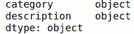

图 1.5 – 显示数据集各列的数据类型

1.  当某些样本本身不是字符串数据类型时，比如空数据或数字数据，pandas 会自动使用`Object`数据类型，这会将整个列分类为 pandas 无法识别的数据类型。让我们检查空值：

    ```py
    dataset.isnull().sum()
    ```

    这将给我们以下输出：

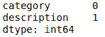

图 1.6 – 检查空值

1.  看起来描述列有一个空值，正如预期的那样。这可能是获取数据时的错误，或者它可能确实为空。无论如何，让我们删除这一行，因为我们无法恢复它，并将列转换为字符串：

    ```py
    dataset.dropna(inplace=True)
    for column in ['category', 'description']:
        dataset[column] = dataset[column].astype("string")
    ```

1.  之前，我们发现了四个独特的类别。让我们通过可视化其分布来确保每个类别都有足够的样本：

    ```py
    sns.countplot(x="category", data=dataset)
    ```

    这将显示以下图形：

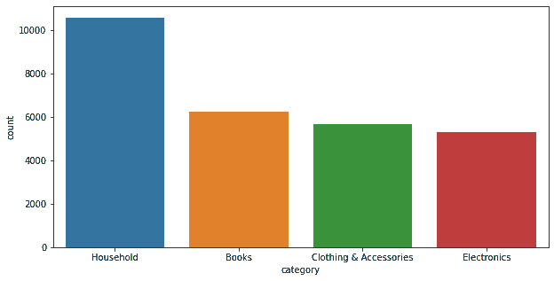

图 1.7 – 显示类别分布的图表

每个类别都有相当数量的数据样本，并且看起来没有异常类别。

1.  这里的目标是通过印度电子商务网站上的商品描述预测商品类别。从这个背景来看，我们知道印度公民讲印地语，因此数据集可能不仅包含英语数据。让我们尝试使用一个名为 Lingua 的开源语言检测工具来估计和验证数据集中可用的语言。Lingua 结合了基于规则的方法和基于机器学习模型的方法，能够检测 70 多种文本语言，非常适合短语、单词和句子的检测。由于这个原因，Lingua 在运行时和内存性能上表现更佳。让我们从`lingua`库初始化语言检测实例开始：

    ```py
    detector = LanguageDetectorBuilder.from_all_languages(
          ).with_preloaded_language_models().build()
    ```

1.  现在，我们将随机抽取数据集的一小部分进行语言检测，因为检测算法需要时间完成。使用数据的 10%作为样本应能充分理解数据：

    ```py
    sampled_dataset = dataset.sample(frac=0.1, random_state=1234)
    sampled_dataset['language'] = sampled_dataset[
        'description'
    ].progress_apply(lambda x: detector.detect_language_of(x))
    ```

1.  现在，让我们可视化语言的分布：

    ```py
    sampled_dataset['language'].value_counts().plot(kind='bar')
    ```

    这将显示以下图形：

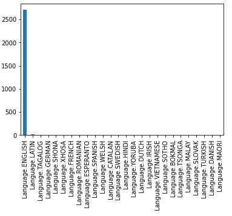

图 1.8 – 文本语言分布

1.  有趣的是，Lingua 检测到了一些异常样本，它们不是英语。异常语言看起来可能是 Lingua 检测错误的结果。印地语也被检测到了，这比其他语言更有说服力，因为数据来自印度的电子商务网站。让我们来看一下这些样本：

    ```py
    sampled_dataset[
        sampled_dataset['language'] == Language.HINDI
    ].description.iloc[0]
    ```

    这将显示以下文本：

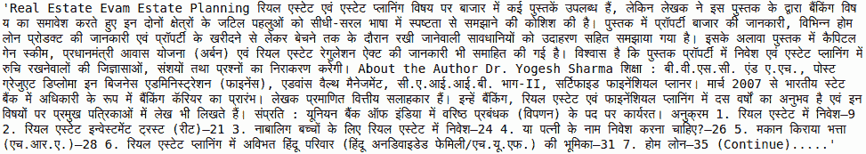

图 1.9 – 可视化印地语文本

1.  看起来这里混合了印地语和英语。那其他语言呢，比如法语？

    ```py
    sampled_dataset[
        sampled_dataset['language'] == Language.FRENCH
    ].description.iloc[0]
    ```

    这将显示以下文本：

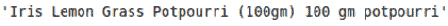

图 1.10 – 可视化法语文本

1.  看起来**potpourri**是这里的重点词，因为这是一个借用的法语词汇，但文本总体上还是英语。

1.  由于语言列表中不包括不使用空格作为逻辑词单元分隔符的语言，我们尝试通过基于空格的词分隔来衡量词语的分布。词计数和字符计数会影响深度学习神经网络的参数，因此在 EDA 过程中理解这些值会非常有用：

    ```py
    dataset['word_count'] = dataset['description'].apply(
        lambda x: len(x.split())
    )
    plt.figure(figsize=(15,4))
    sns.histplot(data=dataset, x="word_count", bins=10)
    ```

    这将显示以下条形图：

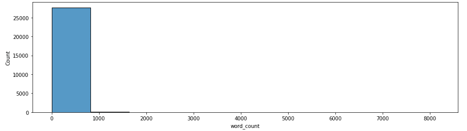

图 1.11 – 词计数分布

通过对文本数据的探索和分析，我们可以推测出几个原因，这些原因有助于在模型开发阶段确定我们应该使用的模型类型和结构：

+   标签样本采样得当，每个标签有 5,000-11,000 个样本，这使得它们适用于深度学习算法。

+   原始数据不干净，存在缺失数据和重复项，但可以通过手动处理修复。直接使用原始数据进行模型开发可能会导致模型产生偏差。

+   数据集包含多种语言，但主要是英文文本；这将帮助我们在模型开发阶段做出合适的模型选择。

+   大多数样本少于 1,000 个单词，一些样本有 1,000-8,000 个单词。在一些非关键性应用场景中，我们可以安全地将单词数限制在大约 1,000 个单词，以便我们可以构建一个具有更好内存和运行时性能的模型。

前面的实际示例应该提供了一个简单的 EDA 体验，足以让你理解在进入模型开发阶段之前执行深入 EDA 的好处和重要性。与实际文本 EDA 类似，我们在 Packt GitHub 仓库中为其他数据集准备了一个实际的 EDA 样本工作流，包括音频、图像和视频数据集，你可以探索这些内容，亲自动手实践。

本节中需要掌握的一个主要概念是 EDA 的重要性，以及你应该展现出多大的好奇心来揭示数据的真相。一些方法可以推广到其他类似的数据集，但将任何特定的 EDA 工作流视为灵丹妙药，会使你忽视人们在这一领域不断贡献的研究。每当你怀疑数据中存在某些问题时，就要对数据提出疑问，并尽可能通过手动或自动检查来揭示答案。在获得这些答案时要富有创造力，并保持对学习新方法的渴望，探索如何在数据中发现关键信息。

在本节中，我们已通过方法论和实践步骤讲解了不同类型数据的 EDA 过程。接下来，我们将探讨为实际模型使用准备数据需要做什么。

## 数据预处理

数据预处理包括数据清理、数据结构化和数据转换，以便深度学习模型能够使用处理后的数据进行模型训练、评估和部署推理。处理后的数据不仅仅是为了让机器学习模型接受，还应该以一种优化学习潜力并提高机器学习模型指标性能的方式进行处理。

数据清理是一个旨在提高数据质量的过程。EDA 过程是识别数据集问题的前提，只有在进行数据清理之前，才能发现数据中的任何问题。数据清理和 EDA 通常是迭代执行的，直到达到令人满意的数据质量水平。清理可能很简单，比如删除重复值、删除空值或删除不合逻辑的值，无论是从常识角度还是从业务逻辑角度来看。这些都是我们之前解释过的概念，同样的风险和问题也适用。

数据结构化是一个协调数据摄取和加载过程的过程，涉及从存储的数据中加载已经清理并验证过质量的数据。这个过程决定了数据应如何从一个或多个源加载，并输入到深度学习模型中。听起来很简单，对吧？如果这是一个小型的单一 CSV 数据集，可能不会出现性能或内存问题，这会非常简单。然而，实际上，在数据可能因存储限制而被分割并存储在不同源的情况下，这个过程可能非常复杂。以下是一些你需要在此过程中考虑的具体因素：

+   你的计算机有足够的内存来处理你所需的批次大小，以供模型使用吗？确保同时考虑模型大小，以免出现内存过载和**内存溢出**（**OOM**）错误！

+   你的数据来自不同的来源吗？确保你拥有访问这些数据源的权限。

+   访问这些源时的速度延迟可接受吗？考虑将数据转移到一个更好的硬件资源上，这样你就能以更高的速度访问，例如使用**固态硬盘**（**SSD**）代替**硬盘驱动器**（**HDD**），并从远程网络可访问的源转移到直接的本地硬件源。

+   你甚至有足够的本地存储空间来存储这些数据吗？确保你有足够的存储空间来保存这些数据，不要超载存储空间，以免影响性能，甚至导致计算机崩溃。

+   优化数据加载和处理过程，使其更加高效。存储和缓存固定的数据处理输出，这样你可以节省时间，避免重新计算这些输出。

+   确保数据结构化过程是确定性的，即使有些过程需要随机性。**随机确定性**指的是当随机性在循环重复时可以被复现。确定性有助于确保已获得的结果可以被复现，并确保模型构建方法可以公正且可靠地进行比较。

+   记录数据，以便在需要时调试过程。

+   数据划分方法。确保选择适合你数据集的正确交叉验证策略。如果包含时间特征，考虑是否应该构建基于时间的划分方法，其中训练数据来自早期时间的示例，而评估数据则来自未来。如果没有，分层划分方法将是最佳选择。

不同的深度学习框架，例如基于 TensorFlow 的`keras`，基于 PyTorch 的`Catalyst`，基于 PyTorch 的`fast ai`，基于 PyTorch 的`pytorch lightning`，以及基于 PyTorch 的`ignite`。

最后，数据转换是一个应用独特数据变量特定预处理的过程，用以将原始清理后的数据转化为更具表现力、可用和可学习的格式。在执行数据结构化和转换过程时，一个重要的因素是你打算使用的深度学习模型类型。任何形式的数据转换通常依赖于深度学习架构，并且依赖于它能接受的输入类型。最广为人知和常见的深度学习模型架构是为了解决特定的数据类型问题而发明的，例如卷积神经网络用于图像数据，变换器模型用于基于序列的数据，基础的多层感知器用于表格数据。然而，深度学习模型被认为是灵活的算法，可以适应不同形式和大小的数据，即使在多模态数据条件下也能处理。通过过去几年与领域专家的合作，深度学习专家已经能够构建出能够处理多种数据模态甚至多个非结构化数据模态的创意深度学习架构，这些架构在学习跨模态模式方面取得了成功。以下是两个例子：

+   *强健的自监督音视频语音识别*，由 Meta AI（前 Facebook）发布（[`arxiv.org/pdf/2201.01763v2.pdf`](https://arxiv.org/pdf/2201.01763v2.pdf)）

    +   这解决了在多重发言的情况下进行语音识别的问题，构建了一个基于深度学习变换器的模型，可以同时接受音频和视觉数据，称为 AV-HuBERT。

    +   视觉数据作为补充数据，帮助深度学习模型分辨应该关注哪个说话者。

    +   它在 LRS3-TED 视觉和音频唇语识别数据集上达到了最新的最先进的结果

+   *通过简单的序列到序列学习框架统一架构、任务和模态*，由达摩院和阿里巴巴集团发布（[`arxiv.org/pdf/2202.03052v1.pdf`](https://arxiv.org/pdf/2202.03052v1.pdf)）

    +   他们构建了一个模型，该模型可以处理文本和图像数据，并发布了一个预训练模型

    +   在 COCO 字幕数据集上完成了图像标注任务，并达到了最先进的结果

也就是说，数据转换主要分为两部分：**特征工程**和**数据缩放**。深度学习以其特征工程能力而闻名，特征工程替代了从原始数据中手动构建定制特征的需求。然而，这并不意味着始终没有进行特征工程的意义。许多成功的深度学习模型利用了经过工程处理的特征作为输入。

既然我们知道了数据预处理的内容，让我们理论上和实践上讨论和探索不同的非结构化数据预处理技术。

### 文本数据预处理

文本数据可以是不同语言的，并存在于不同领域，从描述性数据到信息文档和自然人类文本评论。以下是一些最常用的文本数据预处理方法，它们被广泛应用于深度学习：

+   **词干提取**：一种去除单词后缀的过程，试图将单词还原为其基础形式。这有助于促进不同形式的同一单词的特征跨使用。

+   **词形还原**：一种将单词简化为其基础形式的过程，从而生成真实的英语单词。词形还原具有与词干提取相似的许多好处，但由于其生成的语言学有效的单词简化输出，被认为是更好的选择。

+   **文本标记化**，通过**字节对编码**（**BPE**）：标记化是将文本分割成不同部分的过程，这些部分将被编码并供深度学习模型使用。BPE 是一种基于子词的文本分割算法，它允许常见词汇作为单个标记输出，而稀有词汇则被分割成多个标记。这些分割后的标记可以复用来自匹配子词的表示。这样做是为了减少同时存在的词汇量，减少超出词汇表范围的标记，并使标记表示的学习更加高效。

一种不常见的预处理方法，但对于构建更具泛化能力的文本深度学习模型非常有用的是文本数据增强。文本数据增强可以通过几种方式进行：

+   **用同义词替换动词**：这可以通过使用来自 NLTK 库的 WordNet 英语词汇数据库中的同义词词典集来完成。获得的增强文本将通过动词同义词替换保持相同的含义。

+   **回译**：这涉及将文本翻译成另一种语言，再翻译回原始语言，使用像 Google 这样的翻译服务或开源的翻译模型。获得的回译文本将会以略微不同的形式呈现。

### 音频数据预处理

音频数据本质上是基于序列的数据，在某些情况下，可能存在多个序列。音频最常用的预处理方法之一是将原始音频数据转换为不同形式的频谱图，使用**短时傅里叶变换**（**STFT**），这是一种将音频从时域转换为频域的过程。频谱图音频转换使得音频数据能够在多个频率范围内被分解和表示，而不是像单一波形那样表示所有音频频率的信号组合。这些频谱图是二维数据，因此可以作为图像处理，并输入卷积神经网络。数据缩放方法，如对数缩放和对数梅尔缩放，通常也会应用于这些频谱图，以进一步强调频率特征。

### 图像数据预处理

图像数据增强是一种基于图像的特征工程技术，能够增加原始数据的全面性潜力。应用此技术的最佳实践是构建数据流水线，在训练过程中按批次随机应用图像增强，而不是为深度学习模型提供固定的增强数据集。选择图像增强类型需要理解使用案例的业务需求。以下是一些不适合应用某些增强方法的示例：

+   当图像的方向影响目标标签的有效性时，方向修改类的数据增强方法，如旋转和图像翻转，不适用

+   当图像的颜色影响目标标签的有效性时，颜色修改类的数据增强方法，如灰度、通道混洗、色调饱和度变化和 RGB 偏移并不适用

在排除显然不适用的数据增强方法后，找出最佳增强方法列表的一个常见但有效的方法是通过迭代实验和模型比较。

# 开发深度学习模型

让我们从简短回顾一下什么是深度学习。深度学习的核心基础构建块是神经网络。神经网络是一种旨在模拟人类大脑的算法。它的构建块叫做神经元，模拟了人类大脑中数十亿个神经元。在神经网络的上下文中，神经元是存储简单信息（称为权重和偏置）的对象。把它们看作是算法的记忆。

深度学习架构本质上是具有三层或更多神经网络层的神经网络架构。神经网络层可以分为三大类——输入层、隐藏层和输出层。输入层是最简单的层组，其功能是将输入数据传递给后续层。该层组不包含偏置，可以看作是被动神经元，但它的连接中仍包含到后续层神经元的权重。隐藏层由包含偏置的神经元组成，并且与后续层的神经元之间有权重连接。最后，输出层由与类别数量和问题类型相关的神经元组成，并包含偏置。计算神经网络层时的最佳实践是排除输入层。因此，具有一个输入层、一个隐藏层和一个输出层的神经网络被视为一个两层神经网络。下图展示了一个基本的神经网络，也叫做**多层感知器**（**MLP**），它有一个输入层、一个隐藏层和一个输出层：

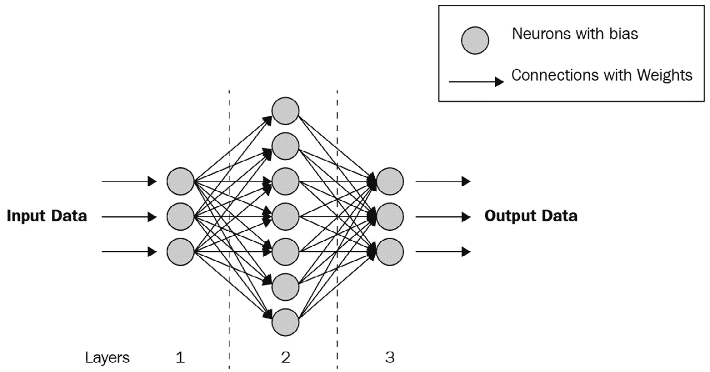

图 1.12 – 一个简单的深度学习架构，也叫做 MLP

作为更广泛机器学习类别的一个子集，深度学习模型能够通过损失函数和优化算法从数据中学习模式，优化算法用于优化损失函数。损失函数定义了模型的误差，以便更新其记忆（权重和偏差），使其在下一次迭代中表现得更好。优化算法是一种决定根据损失值更新权重的策略的算法。

通过这个简短的回顾，让我们深入总结一下常见的深度学习模型家族。

## 深度学习模型家族

这些层可以有多种形式，因为研究人员已经能够发明新的层定义来应对新的问题类型，并几乎总是配备有非线性激活函数，使得模型能够捕捉数据之间的非线性关系。随着层的变化，出现了许多不同的深度学习架构家族，专门针对不同的问题类型。一些最常见和广泛使用的深度学习模型如下：

+   **多层感知机**（**MLP**）用于表格数据类型。将在*第二章*中详细探讨，*设计深度学习架构*。

+   **卷积神经网络**用于图像数据类型。将在*第三章*中详细探讨，*理解卷积神经网络*。

+   **自编码器**用于异常检测、数据压缩、数据去噪和特征表示学习。将在*第五章*中详细探讨，*理解自编码器*。

+   **门控循环单元**（**GRU**）、**长短期记忆网络**（**LSTM**）和**变压器**用于序列数据类型。这些将在*第四章*中详细探讨，*理解循环神经网络*，以及*第六章*中详细探讨，*理解神经网络变压器*。

这些架构将是*第 2 到第六章*的重点，我们将讨论它们的方法论，并进行一些实际评估。接下来，让我们探索深度学习中可以解决的问题类型。

## 模型开发策略

今天，由于深度学习框架如 PyTorch 和 TensorFlow 的出现，以及它们的高级库封装，深度学习模型的发明和创建变得容易。此时，你应该选择哪个框架，取决于它们的接口偏好，因为这两个框架都经过多年改进，已经成熟。只有在迫切需要一个非常自定义的功能来应对独特问题时，才需要选择能够执行你所需要的框架。一旦选择了深度学习框架，深度模型的创建、训练和评估过程基本上就涵盖了所有内容。

然而，这些框架并不直接提供模型管理功能。模型管理是一个技术领域，它使团队、企业和深度学习从业者能够可靠、快速和高效地构建模型、评估模型、交付模型洞察、将模型部署到生产环境并管理模型。模型管理有时也被称为**机器学习运维**（**MLOps**）。你可能仍然在想，为什么需要这样的功能，尤其是如果你曾在 Kaggle 这样的平台上构建过深度学习模型，Kaggle 提供数据和机器学习问题作为竞赛。那么，以下是一些推动你需要利用这些功能的因素：

+   手动比较模型很繁琐：

    +   手动在 Excel 表格中输入性能数据以追踪模型性能既慢又不可靠

+   模型产物很难追踪：

    +   一个模型有许多产物，比如它的训练权重、性能图表、特征重要性和预测解释

    +   比较模型产物也很繁琐

+   需要进行模型版本管理，以确保模型构建实验不会被重复：

    +   用最可靠的模型洞察覆盖表现最好的模型，是你最不希望经历的事情

    +   版本控制应该依赖于数据分区方法、模型设置和软件库版本

+   部署和管理模型并不简单

根据参与项目的团队规模以及组件需要重复使用的频率，适合使用不同的软件和库。这些软件和库分为付费和免费的（通常是开源的）类别。**Metaflow**，一个开源软件，适用于数据科学团队规模较大的情况，其中组件需要在其他项目中频繁复用，而**MLFlow**（开源软件）更适合小型团队或单人团队。其他值得注意的模型管理工具包括**Comet**（付费）、**Weights & Biases**（付费）、**Neptune**（付费）和**Algorithmia**（付费）。

这样，我们已经简要概述了深度学习模型开发的方法和策略；接下来我们将在章节中深入探讨模型开发的相关话题。但在此之前，让我们继续概览模型洞察的交付主题。

# 交付模型洞察

模型性能指标，在仅用于模型比较和选择的情况下，通常不是可靠地获取最佳模型的最有效方法。当人们关注机器学习模型可能做出的决策时，他们通常需要更多的信息和洞察力，以最终将信任寄托于模型的决策能力。最终，当模型不被信任时，它们就不会被部署。然而，信任不仅仅依赖于模型的洞察力。建立对模型的信任涉及确保准确、可靠和无偏的预测，这些预测与领域专业知识和商业目标一致，同时向利益相关者提供有关模型性能指标、决策逻辑及其预测背后理由的洞察。解决潜在偏见并展示公平性是赢得对模型可靠性信心的关键。这个持续的信任建立过程超越了初始部署，因为模型必须始终展现合理的决策过程、证明预测的合理性，并保持无偏的表现。通过建立信任，模型成为一个有价值且可靠的工具，能在现实应用中发挥作用，推动各个领域和行业的广泛采用和利用。

提供对业务有价值的模型洞察。除了为确保模型信任并消除信任问题而提供模型洞察外，实际的性能指标同样重要。尽可能将模型指标转化为通俗易懂的商业指标，以有效地传达模型可能对业务带来的积极影响。成功指标应在规划阶段定义，并在此阶段报告实际值。

在模型部署后，建立对模型的信任并不会停止。类似于人类在生活中需要解释自己的决策，机器学习模型（如果预期替代人类来自动化决策过程）也需要如此。这一过程被称为预测解释。在某些情况下，模型的决策被期望作为参考，其中会有一个人类专家参与验证决策，确保决策正确后再执行。预测解释在这种情况下几乎总是必需的，因为模型的使用者希望了解模型为何做出预测，而不是直接使用预测结果。

模型洞察力也可以帮助你提升模型的表现。记住，机器学习生命周期本质上是一个迭代过程。以下是一些可能出现这种情况的具体示例：

+   你意识到模型对某一特定群体存在偏见，并决定回到数据获取阶段，增加来自该群体的数据，或者更换为对偏见具有鲁棒性的建模技术。

+   你意识到模型在某一类上的表现不好，然后回到模型开发阶段，使用一个不同的深度学习模型损失函数，专注于表现不佳的那一类。

深度学习模型被认为是一个黑箱模型。然而，实际上，今天已有许多关于深度学习解释方法的研究论文，这些方法使得深度学习突破了黑箱的局限性。我们将在本书的*第二部分*深入探讨我们可以如何解释并为深度学习模型提供洞见。

现在我们对深度学习生命周期中的相关过程有了更多的了解，在接下来的部分，我们将讨论你需要关注的、可能贯穿整个项目生命周期的风险。

# 风险管理

深度学习系统从一开始就暴露于多种风险中，从构思到系统采纳。通常，分配到深度学习项目中的大多数人仅负责机器学习生命周期的某个特定阶段，如模型开发或数据准备。当生命周期的一个阶段的工作在后期产生问题时，尤其是当相关团队成员缺乏对整个大局的理解时，这种做法可能会带来不利影响。深度学习系统中涉及的风险通常与机器学习生命周期各个阶段之间的交互有关，并遵循*垃圾进，垃圾出*的概念。确保所有参与构建系统的人都对系统最终输出的结果负责，而不仅仅是各个独立阶段的结果，这是管理机器学习系统风险的基础要素之一。

那么，风险是什么呢？让我们从一个可以在任何实际成果产生之前就能处理的问题开始——也就是在评估用例的价值时发生的事情。

## 伦理和监管风险

深度学习几乎可以应用于任何行业，但一些最难以在其中推广深度学习的行业是高度监管的行业，如医疗和金融行业。这些行业的法规最终决定了深度学习系统在行业中能做什么或不能做什么。这些法规大多由政府引入，通常涉及伦理和法律的考量。在这些高度监管的行业中，常常会出现每月、每周甚至每天进行的审计，以确保公司符合所施加的法规。某些行业之所以受到更加严格的监管，主要是因为这些行业的任何行为所带来的后果会对人民或国家的福祉造成巨大的成本。深度学习系统需要以符合这些法规的方式进行构建，以避免面临停用的风险，无法被采纳的风险，甚至最严重的，面临监管官员巨额罚款的风险。

有时，深度学习模型的表现可以远超其人类同行，但另一方面，没有任何深度学习模型是完美的。人类会犯错，大家都知道这一点，但我们需要意识到的另一个现实是，机器无疑也会犯错。最大的风险是，当人类过度信任机器，甚至完全依赖机器做决策时！那么，我们该如何考虑这些错误，并且谁将为这些错误负责呢？

让我们看看在人类没有机器的情况下，我们会怎么做。当风险较高时，重要的决策总是需要经过一系列的审批层级，才能最终做出决定。这些审批层级表明了重要决策需要有责任和可靠性。在决策过程中获得的审批越多，我们就越能说自己在做出这一重要决策时充满信心。一些常见的需要审批层级的重要决策包括：在公司中决定雇佣一名员工、决定向客户收取的保险费用，或者决定是否将资金投入到某个企业。考虑到这一点，深度学习系统在面对高风险应用时，需要具备类似的审批工作流程，以便在深度学习模型做出某个预测决策时获得批准。这些工作流程可以包括任何形式的洞察力，解释预测结果可以帮助领域专家更容易地判断决策的有效性。增加人类的参与使得深度学习系统变得更加符合伦理，并且足够值得信赖，能够成为高风险决策流程的一部分。

让我们以一个医疗行业的使用案例为例——例如，通过 X 光扫描预测肺病的使用案例。从伦理角度来看，深度学习模型完全有能力通过预测极其危害健康的疾病，如晚期肺癌，剥夺一个人的生存希望，这显然是错误的。如果预测到的极端疾病被误诊，患者可能会不必要地感到悲痛，或花费不必要的金钱进行昂贵的检查来验证结果。在深度学习系统中设立审批工作流程，允许医生将这些结果作为辅助方法使用，将解决使用自动决策系统时可能产生的伦理问题。

## 业务背景不匹配

重申在*定义成功*部分提到的观点，将所需的深度学习输入数据和目标标签选择与业务背景对齐，并了解这些目标预测如何被使用，是深度学习系统能否被采纳的关键所在。这里的风险在于，当业务价值未被恰当地定义，或者深度学习系统未能正确匹配时，可能会导致系统的失败。即使目标适合业务背景，如何消费这些预测才是获取价值的关键。如果在任何方面未能与业务背景匹配，系统可能会被拒绝。

理解业务背景涉及了解目标用户群体是谁，以及他们不包括谁。这个过程中的一个关键步骤是记录和构建用户群体画像。用户画像包含了关于他们的工作流程、历史、统计数据和关注点的信息，这些信息应当提供构建一个符合潜在用户具体需求的系统所需的背景。不要害怕进行市场调研，并在构建用户画像的过程中对目标用户需求进行适当验证。毕竟，构建一个深度学习系统需要付出大量努力，如果浪费时间构建一个没人愿意使用的系统，那就得不偿失。

## 数据收集和标注的风险

你的机器学习模型的效果将取决于数据的质量。与机器学习相比，深度学习需要大量更多的数据。此外，通常对于新的深度学习使用案例，数据不是现成的，需要手动收集并精心标注。确保数据收集和标注的方式能够保证质量，是一项非常艰巨的任务。

用于收集和标注数据以供深度学习使用的策略和方法因使用案例不同而有所差异。有时，数据收集和标注过程可以同时进行。这种情况可以发生在自然标签存在时，或者在数据收集之前已经预先指定标签时：

+   **自然标签** 是在一段时间后通常会自然产生的标签。例如，这可以是通过超声波图像确定婴儿的性别；另一个用例是房屋价格作为标签，其输入数据为该房产的一系列图像。

+   **预先指定的标签** 是在收集输入数据时预先确定的标签。例如，这可以是在受控环境中收集的一些语音数据的性别标签，仅用于构建机器学习模型，或者在拍摄面部照片以构建机器学习模型之前的某项调查中的个人年龄。

这两种类型的标签相对来说风险较低，因为标签很可能是准确的。

一种最终的数据收集和数据注释方法，具有相当大的风险，是在收集数据后进行标注。**后注释** 需要对所需标签的特征具有某种形式的领域知识，并且由于人为评估错误，不总是导致 100%的真实值。无意识的标注错误发生在标注者仅仅因为偶然而导致错误。另一方面，有意识的标注错误发生在标注者有意决定以错误的标签决策。这种意图可能源于数据中某种模式所根深蒂固的或宽泛的信念，或者仅仅是为某种原因故意制造的明显错误。这里所呈现的风险是标签可能被错误地注释。幸运的是，有几种策略可以执行以消除这些风险；这些将在以下段落中介绍。

由于人类易于出现一定程度的错误，无意识的标注错误很难避免。然而，不同的人通常有不同程度的注意力和选择性标签者的选择可能对某些人来说是一种可行的选择。如果标签者仅因金融补偿而被聘请来标注您的数据标签，另一个可行的选择是在提供需要标记数据的数据之间周期性地提供已经标记的秘密数据以供标签者标记。这种策略允许您评估单个标签者的表现，并根据其注释工作的准确性提供补偿（是的，我们也可以使用用于评估机器学习模型的指标）。作为积极的副作用，标签者还将被激励在他们的注释工作中表现更好。

有意识的标注错误是这里最危险的风险，因为它们可能影响整个数据集的质量。当对与任何目标标签相关的数据模式达成错误共识，并应用于整个标注过程中时，标签的合法性直到机器学习生命周期的后期才会被发现。机器学习模型仅具备学习所需模式的技术，以便将输入数据映射到提供的目标标签，即使标签是错误的，它们也很可能表现得很好。只要标注者在标注过程中强加了某种模式，不论对错，机器学习模型都会尽力学习所需的模式，以执行准确的输入到输出映射。那么，我们如何减轻这种风险呢？确保在领域专家的帮助下正确定义意识形态，在减轻过程中起着重要作用，但这一策略本身的有效性因涉及的领域专家数量、专家的专业水平、标注者数量以及收集数据的异常程度或质量而有所不同。

即使是领域专家有时也会犯错。以医生为例——你有多少次听说过医生开错药方或做出错误的医学评估？你有多少次误听别人说话后不得不猜测对方说了什么？在最后一个例子中，领域专家就是你，而领域是语言听力理解。此外，当标注者超过一个人并形成标注团队时，一个最突出的风险就是不同偏好的领域意识形态之间的标注数据不匹配。有时，这种情况发生是因为某些标签在数字格式中可能存在不同的变体，或者存在让标注者分析能力受阻的混乱模式。有时，这也可能是由于标注者或领域专家对某个标签或输入数据的固有偏见。随后，数据中的偏见会导致模型中的偏见，并引发伦理问题，从而削弱对机器学习模型决策的信任。当对机器学习模型缺乏信任时，项目将无法被采纳，并失去其商业价值。关于偏见、公平和信任的主题将在*第十三章*中更广泛地讨论，该章将详细阐述偏见的来源及其缓解方式。

标签错误但仍有正确标签的数据称为噪声标签。幸运的是，深度学习中有一些方法可以帮助你绕过噪声标签，例如弱监督学习。然而，请记住，最好的做法是从源头上解决问题，即在数据收集和标注时解决，而不是事后再修正。让我们深入探讨另一种可以使标注过程更安全的策略。深度学习项目的数据标注过程通常涉及使用软件工具来标注特定所需的标签。软件工具使得标注工作更快、更轻松，使用标注协作软件工具可以让标注工作更加防错。一个好的协作标注工具会让标注人员以某种方式对齐他们的数据发现，从而促进标注时的一致性。例如，当识别到容易误解的模式时，自动通知整个标注团队，可以帮助防止更多数据被错误标注，并确保之前相关的数据得到重新审查。

最后需要提到的是，未标记数据并不是一个风险，而是机器学习中巨大的潜力。尽管它缺乏具体的标签来实现特定目标，但数据之间存在固有的关系是可以学习的。在*第九章*《探索无监督深度学习》中，我们将探讨如何利用无监督学习将这些数据作为后续监督学习的基础，这就是更广为人知的半监督学习工作流程。

接下来，我们将讨论与机器学习模型使用数据时相关的另一个安全风险。

## 数据安全风险

在机器学习的背景下，安全性与防止数据被未经授权使用、保护数据隐私以及防止与数据使用相关的非预期事件或攻击有关。这里的风险是当数据安全受到破坏时，可能会导致未能遵守监管标准、模型性能的下降，或商业流程的破坏与损毁。在本节中，我们将介绍四种数据安全风险，分别是敏感数据处理、数据许可、软件许可和对抗性攻击。

### 敏感数据处理

一些数据比其他数据更敏感，并且可能与监管风险相关。敏感数据引发了数据隐私法规，这些法规管理在不同法域中个人数据的使用。法规的具体内容有所不同，但通常围绕合法保护个人数据使用权利，并要求对这些数据采取的任何行动都必须获得同意，同时在使用此类数据时需要遵循相关条款。这些法规的例子包括涵盖欧盟的**通用数据保护条例**（**GDPR**）、涵盖新加坡的**个人数据保护法**（**PDPA**）、仅涵盖美国加利福尼亚州的**加利福尼亚消费者隐私法**（**CCPA**）以及涵盖美国弗吉尼亚州的**消费者数据保护法**（**CDPA**）。这意味着，你不能仅仅收集被归类为个人的数据显示、标注数据、建立模型并部署，而不遵守这些法规，因为在某些法域中，这样做会被视为犯罪。除了请求同意外，常用的一种方法是通过匿名化数据来减轻这种风险，使得数据无法被任何单个个体识别。然而，匿名化必须可靠地进行，以确保关键的通用信息得以保留，同时可靠地消除任何重建个人身份的可能性。确保敏感和个人数据得到妥善处理，在建立机器学习模型的决策信任方面有着重要作用。在处理敏感和个人数据时，务必保持极高的谨慎，以确保你的机器学习项目的长期可持续性。

#### 数据与软件许可

尤其对于深度学习项目来说，构建一个高质量的模型需要大量数据。公开可用的数据集的存在有助于通过部分消除收集和标注数据所需的成本和时间，从而缩短项目的时间和复杂性。然而，大多数数据集与软件一样，都有相关的许可协议。这些许可协议规定了与其关联的数据可以如何使用。关于商业问题的机器学习模型，数据许可的最重要标准是数据是否允许商业使用。由于大多数商业用例因其产生的利润而被视为商业用例，因此具有禁止商业使用条款的数据集不能使用。防止商业使用的许可条款的一个例子是所有衍生自**创作共用署名-非商业性使用**（**CC-BY-NC**）许可的条款。同样，开源软件也会对深度学习项目构成风险。在使用任何公开可用的数据或软件之前，一定要确保三次检查其许可协议。将具有防止商业使用条款的数据或代码用于商业项目，会使项目面临因许可侵权而被罚款或起诉的风险。

#### 对抗攻击

当机器学习应用广泛时，它会暴露出自身容易受到针对性攻击的风险，这些攻击旨在恶意地破坏和操控模型的决策。这引出了一个可能影响已部署深度学习模型的攻击类型，称为**对抗性攻击**。对抗性攻击是一种攻击方式，通过特定的方式操控数据输入，从而影响机器学习模型的预测。最常见的对抗性攻击是通过对实际输入数据进行修改，生成对抗性数据示例。这些修改后的数据看起来仍然符合输入数据的合法性，但却能扭曲模型的预测。此类攻击的风险程度在不同的使用场景中有所不同，具体取决于用户与系统的交互程度，最终将输入数据传递给机器学习模型。对于深度学习模型来说，最广为人知的对抗性示例之一是经过优化的图像，它看起来像是随机的色彩噪声。当这种图像用于扰动另一张图像的像素值，通过覆盖其像素值时，就会生成一个对抗性示例。扰动后的原始图像从视觉上看起来与人眼几乎无差，但却能导致错误的误分类。下图展示了这种扰动的示例，摘自*第十四章*，*分析对抗性表现*。该图展示了一个神经网络 ResNet50 的结果，ResNet50 经过训练可以分类人脸身份，当给定人脸图像时，它能够正确预测身份。然而，当该图像与另一个噪声图像数组结合在一起时，这个噪声图像数组是通过访问预测类别概率自动生成的，模型错误地预测了人脸图像的身份，即使合成后的图像与原始图像在视觉上完全相同：

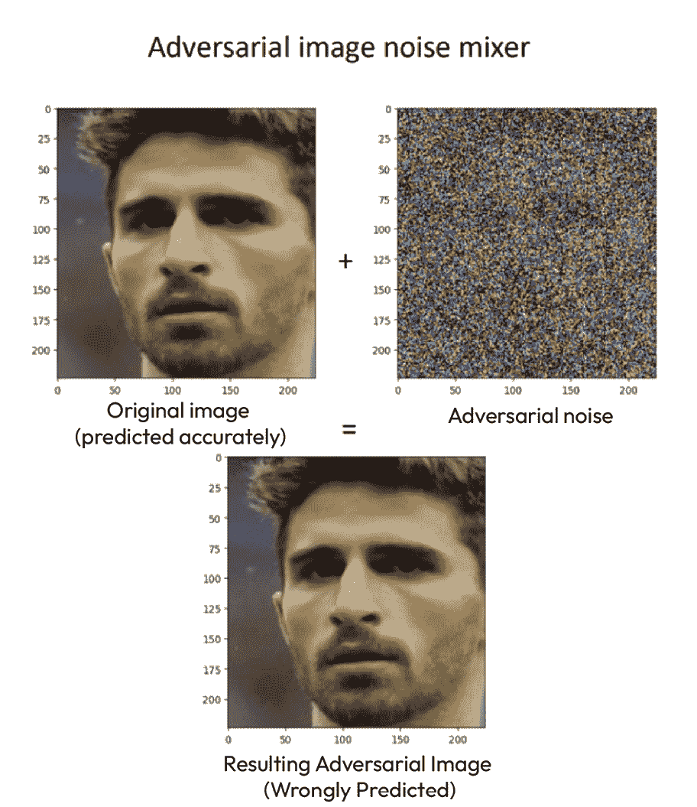

图 1.13 – 潜在的基于图像的对抗性攻击示例

理论上，对抗性攻击可以使用任何类型的数据进行，并不限于图像。随着机器学习应用场景的风险增大，攻击者更有可能投入资金组建研究团队，以产生新的对抗性示例。

一些对抗样本及其生成方法依赖于对深度学习模型本身的访问，以便制作定向对抗样本。这意味着，潜在的攻击者除非能够访问该模型，否则几乎不可能成功地混淆别人创建的模型。然而，许多企业直接使用公开可用的预训练模型，并应用迁移学习方法，以减少满足业务用例所需的工作量。任何公开可用的预训练模型也同样对攻击者开放，允许他们为个别模型构建定向对抗样本。这类预训练模型的例子包括所有公开可用的 ImageNet 预训练卷积神经网络模型及其权重。

那么，我们如何尝试减轻这种风险呢？

我们可以用来减轻对抗性攻击风险的方法之一，是通过使用公共研究中的已知方法集的示例来训练深度学习模型。通过使用已知的对抗样本进行训练，模型将学会在学习过程中忽略这些对抗信息，并在验证和推理阶段不受此类样本的影响。评估不同变体的对抗样本还帮助我们设定期望，了解模型何时会失败。

在这一节中，我们深入探讨了处理和使用数据进行机器学习时的安全问题。在*第十四章*，*分析对抗性表现*中，我们将深入实践评估针对不同数据模态的对抗性攻击技术，并探讨如何在深度学习的背景下减轻这些攻击。接下来，我们将深入探讨模型开发过程中的另一个核心风险类别。

### 过拟合和欠拟合

在模型开发过程中，即训练、验证和测试机器学习模型的过程中，最基础的风险之一就是过拟合和欠拟合。

**过拟合**是指机器学习模型对提供的训练数据集样本和已学习的模式产生过度偏向，以至于它只能区分训练数据集中的样本，而无法区分验证集和测试集中的任何样本。

**欠拟合**则是指机器学习模型未能捕捉到提供的训练、验证和测试数据集中的任何模式。

学习可泛化的模式输出映射能力是构建有价值且可用的机器学习模型的关键。然而，达成一个良好拟合的模型并没有银弹，通常需要在数据准备、模型开发和模型交付洞察阶段之间反复迭代。

以下是一些防止过拟合并确保深度学习中泛化的建议：

+   预测最终部署条件时，增加数据增强

+   收集足够的数据，覆盖目标标签的每一种可能变异

+   与领域专家合作，了解关键指标和模式

+   使用交叉验证方法，确保模型在未见数据上进行公平评估

+   尽可能使用更简单的神经网络架构

以下是一些防止欠拟合的建议：

+   评估各种不同的模型

+   与领域专家合作，了解关键指标和模式

+   确保数据清洁，尽可能减少错误

+   确保数据足够充足

+   在构建模型时，从少量数据输入开始，逐步增加更复杂的数据，以确保模型能在数据上恰当地拟合

在本节中，我们讨论了构建模型时的问题。接下来，我们将讨论一种在模型训练完成后会影响模型的风险。

### 模型一致性风险

机器学习过程的一个主要特征是它是循环的。模型会不断重新训练，旨在寻找更好的设置。这些设置可能是不同的数据划分方法、不同的数据转换方法、不同的模型，或是相同的模型但具有不同的模型设置。通常，构建的模型需要相互公平且公正地进行比较。模型一致性是确保不同模型版本和性能指标之间能够进行公平比较的唯一特征。在获得模型之前的每个过程都要求保持一致性，以便当任何人尝试用相同的设置执行相同的过程时，应该能够获得和再现相同的模型。我们需要重申，即使在构建模型时某些过程需要随机性，它也需要是可随机确定的。这是必要的，以确保设置中的唯一差异是目标设置，而不是其他任何因素。

模型一致性不仅仅体现在模型的可重现性上——它还扩展到模型预测的一致性。当使用不同的批量大小设置进行预测时，预测结果应该是相同的，而且相同的数据输入应始终产生相同的预测结果。模型预测中的不一致性是一个重大的警示信号，表明模型所产生的任何结果都无法代表在部署时的实际表现，任何由模型得出的见解都可能是误导信息。

为了应对模型一致性风险，始终确保通过尽可能地种子化随机数生成器，使代码产生一致的结果。在模型开发阶段，构建模型后，始终手动或自动验证模型的一致性。

### 模型退化风险

当你构建了一个模型、验证了它，并展示了它对业务的影响后，你接着将其进入模型部署阶段并准备好投入使用。一个常见的错误是认为这就意味着深度学习项目的结束，你可以把手放开，任由模型自我运行。遗憾的是，大多数机器学习模型会退化，这取决于你在模型开发阶段实现的泛化程度，以及在实际环境中可用数据的情况。一个常见的场景是，当模型被部署时，最初模型的表现和部署过程中接收到的数据特征保持一致，并随着时间推移发生变化。时间有可能改变环境条件以及世界上的任何事物。机器老化，季节变化，人也会改变，预见到这些条件和变量的变化可以帮助你确保模型在业务中保持相关性和影响力。

模型退化的方式可以分为三类，分别是**数据漂移**、**概念漂移**和**模型漂移**。从概念上讲，漂移可以与一艘船缓慢漂离其理想位置相联系。在机器学习项目中，不是船漂离，而是数据或模型从其原始的感知行为或模式中漂离。我们简要地介绍一下这几种漂移类型。

数据漂移是一种退化现象，涉及到模型所需提供预测值的输入数据。当一个部署后的模型经历数据漂移时，意味着在部署过程中接收到的数据不属于机器学习模型在训练和验证过程中所用数据的固有分布。如果有方法验证在部署过程中提供的新数据上的模型，数据漂移可能会导致模型验证期间原始预期指标性能的变化。一个深度学习模型中数据漂移的例子可以是在户外预测人类行为的用例。在这个用例中，数据漂移表现为原始数据是在夏季收集的，数据中包括穿夏季服装的人，而由于冬季的到来，人们则穿上了冬季服装。

概念漂移是一种与输入数据如何与目标输出数据交互变化相关的退化形式。在规划阶段，领域专家和机器学习从业者合作定义可能影响目标输出数据的输入变量。这个定义好的输入和输出设置随后将用于构建机器学习模型。然而，有时并不是所有可能影响目标输出数据的上下文都会作为输入变量包含在内，这可能是由于数据的可获得性或缺乏领域知识的原因。这就引入了依赖于缺失上下文条件的情况，这些缺失的上下文与为机器学习收集的数据相关。当缺失的上下文条件与训练和验证数据中存在的基本值发生漂移时，就会发生概念漂移，导致原始概念变得无关或发生偏移。简而言之，这意味着相同的输入不再映射到训练数据中的相同输出。在深度学习的背景下，我们可以以一个基于文本数据的情感分类用例为例。假设一个评论或讲话根据司法管辖区和文本本身可以是负面、中立或正面情感。这意味着在某些司法管辖区，人们对什么被视为负面、中立或正面的阈值不同，并且对事物的评分方式也不同。仅使用文本数据训练模型将无法准确地跨司法管辖区进行泛化，因此每当模型在另一个司法管辖区部署时，它都会面临概念漂移。

最后，模型漂移是一种与操作指标和易于测量的指标相关的退化形式。可以归类为模型漂移的退化因素包括模型延迟、模型吞吐量和模型错误率。与其他两种漂移类型相比，模型漂移的指标通常更容易衡量和跟踪。

缓解这些风险的最佳工作流程之一是跟踪这三种类型漂移下的指标，并为新机器学习模型的构建提供清晰路径，这个过程我称之为**漂移重置**。现在我们已经简要概述了模型退化，在*第十六章*《深度学习模型的管理》和*第十七章*《在动态环境中有效管理漂移效应》中，我们将更深入地讨论这些风险，并实际探讨如何在深度学习的背景下缓解这一风险。

# 总结

在本章中，你学到了如何以一种可重复、一致的方式成功完成深度学习项目，虽然这是从中高层次的视角来看。我们在本章讨论的主题被结构化为深度学习生命周期早期阶段的更全面内容，这包括规划和数据准备阶段。

在接下来的章节中，我们将更全面地探讨生命周期的中后期阶段。这涉及数据准备阶段之后的所有内容，包括模型开发、模型洞察、模型部署以及最后的模型治理。

在下一章，我们将更深入地探索常见和广泛使用的深度学习架构。

# 进一步阅读

+   石博文、徐维宁、阿卜杜勒拉赫曼·穆罕默德。*强大的自监督视听语音识别*，2022 年。芝加哥丰田技术学院，Meta AI：[`arxiv.org/pdf/2201.01763v2.pdf`](https://arxiv.org/pdf/2201.01763v2.pdf)。

+   王鹏、杨安、门锐、林俊阳、白帅、李志康、马建新、周畅、周靖仁、杨红霞。*通过简单的序列到序列学习框架统一架构、任务和模态*。达摩院，阿里巴巴集团：[`arxiv.org/pdf/2202.03052v1.pdf`](https://arxiv.org/pdf/2202.03052v1.pdf)。
