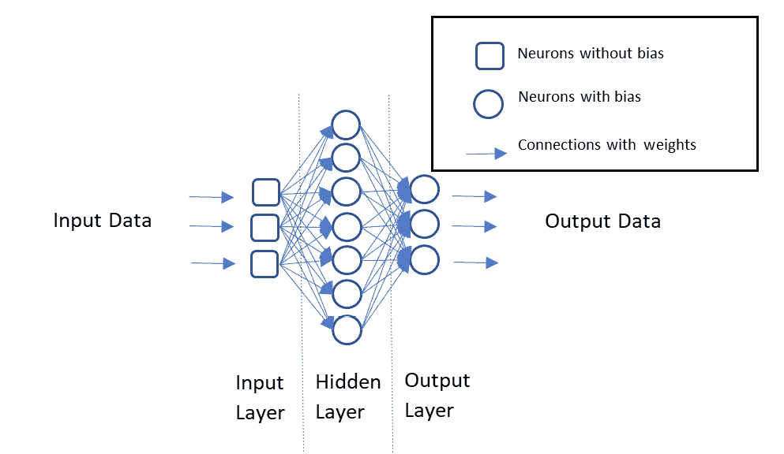
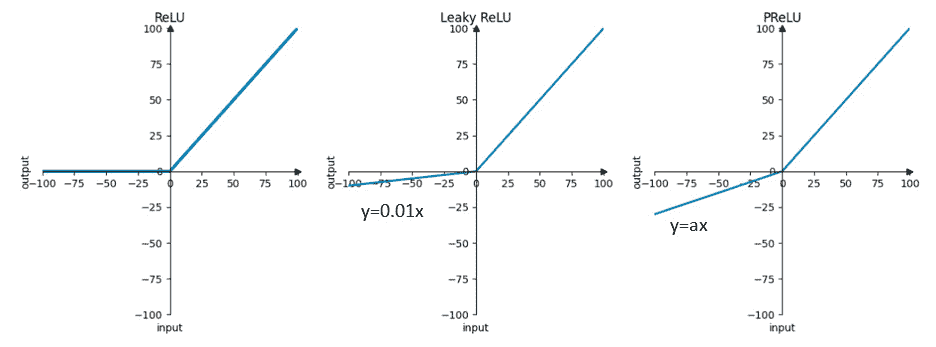
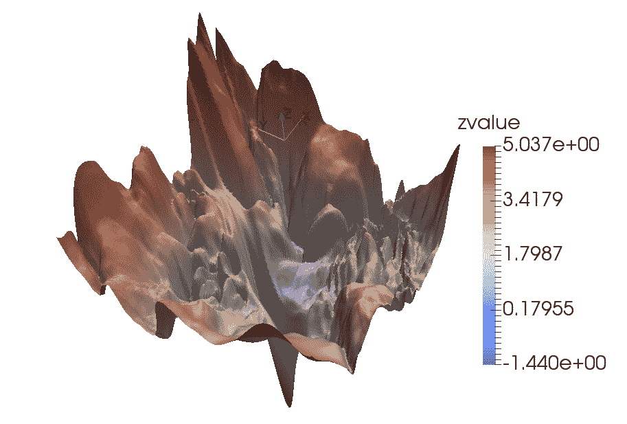
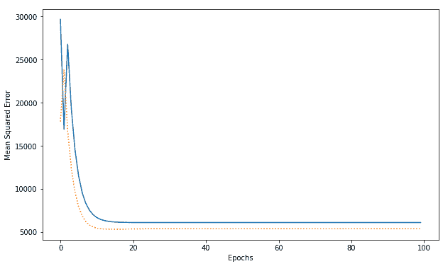

# 第二章：设计深度学习架构

在上一章中，我们回顾了整个深度学习生命周期，并理解了从头到尾使深度学习项目成功的含义。有了这些知识后，我们现在准备进一步深入探讨深度学习模型的技术细节。本章将深入探讨业界常用的深度学习架构，并理解每种架构设计背后的原因。对于中级和高级读者，这将是一个简要回顾，以确保术语的定义一致性。对于初学者，本章将以易于理解的方式呈现架构，帮助你快速掌握深度学习领域中有用的神经网络架构。

理解多种架构背后的方法论可以让你创新适用于特定使用案例的自定义架构，最重要的是，能够根据数据输入或问题类型选择合适的基础架构。

本章将重点介绍**多层感知机**（**MLP**）网络架构。全面讲解 MLP 及一些与神经网络实现相关的关键概念，如梯度、激活函数和正则化方法，为后续章节中更复杂架构类型的探索奠定基础。具体来说，本章将涵盖以下内容：

+   使用 MLP 探索神经网络的基础

+   理解神经网络的梯度

+   理解梯度下降

+   从零开始实现 MLP

+   使用深度学习框架实现 MLP

+   设计 MLP

# 技术要求

本章包括一些使用**Python**编程语言的实践实现。为完成这些内容，你需要在计算机上安装以下库：

+   `pandas`

+   `Matplotlib`

+   `Seaborn`

+   `Scikit-learn`

+   `NumPy`

+   `Keras`

+   `PyTorch`

代码文件可以在 GitHub 上找到：[`github.com/PacktPublishing/The-Deep-Learning-Architect-Handbook/tree/main/CHAPTER_2`](https://github.com/PacktPublishing/The-Deep-Learning-Architect-Handbook/tree/main/CHAPTER_2)。

# 使用 MLP 探索神经网络的基础

深度学习架构是通过至少使用三个感知机层（不包括输入层）来创建的。感知机是由神经元单元组成的单层网络。神经元单元包含一个偏置变量，并作为与其他神经元连接的节点。这些神经元将与不同层中的其他神经元进行交互，连接/节点之间应用权重。感知机也称为**全连接层**或**密集层**，而 MLP 也被称为**前馈神经网络**或**全连接****神经网络**。

让我们回顾上一章的 MLP 图示，以便更好地理解。



图 2.1 – 简单的深度学习架构，也叫做 MLP

该图显示了如何将三个数据列输入传递到输入层，然后逐步传播到隐藏层，最后通过输出层。尽管图中没有展示，但在隐藏层和输出层的输出上应用了额外的激活函数。隐藏层的激活函数为模型添加了非线性，使神经网络能够捕捉输入数据和输出数据之间的非线性关系。输出层使用的激活函数取决于问题类型，具体内容将在*第八章*《探索监督式深度学习》中更详细地讨论。

在深入讨论相关的隐藏激活方法之前，我们首先需要了解梯度消失问题。梯度消失问题是指在反向传播过程中，损失函数相对于模型参数的梯度变得非常小。这可能导致学习速度缓慢和收敛效果差，因为权重更新极少甚至没有更新。梯度消失问题在使用将输入值压缩到狭窄范围的激活函数时尤为突出。为了解决这个问题，**Rectified Linear Unit** (**ReLU**) 激活函数得到了广泛应用，因为它能够在一定程度上缓解梯度消失问题。ReLU 将负值映射为零，保持正值，如*图 2.2* 所示。



图 2.2 – ReLU、Leaky ReLU 和 PReLU 输入/输出图

除了 ReLU，还有其他一些有用的隐藏层激活函数，它们有助于缓解梯度消失问题，同时提供各种优点。以下是其中一些：

+   **Leaky ReLU**：Leaky ReLU 是 ReLU 函数的一种变体，它允许负输入值有一个小的、非零的梯度。这有助于缓解“死亡 ReLU”问题，当神经元的输入值持续为负时，神经元会变得不活跃并停止学习。Leaky ReLU 为负输入值引入了一个小的斜率，确保梯度不会完全消失。

+   **Parametric ReLU** (**PReLU**)：PReLU 是 ReLU 函数的另一种变体，其中负斜率在训练过程中进行学习，使得模型能够自适应其行为。这种灵活性可能会提高性能，但代价是增加了复杂性并存在过拟合的风险。

此外，随着我们在本书中深入探讨不同的主流架构，我们将探索更多的隐藏激活函数。这些激活函数各有优缺点，激活函数的选择取决于要解决的具体问题和所使用的架构。理解、实验和评估这些激活函数对于在神经网络的隐藏层中选择最适合的激活函数至关重要。此外，评估与模型构建相关的任何实验的推荐方法将在*第八章*中进行探讨，*探索监督式深度学习*。

接下来，从一层传播到另一层的过程称为前向传递或前向传播，其公式一般可以定义如下：

a = g( ∑ n=0 神经元 wx + b)

在这里，a 表示神经网络层的输出（称为**激活**），g 表示非线性激活函数，w 表示神经元连接之间的权重，x 表示输入数据或激活值，b 表示神经元的偏置。不同类型的神经网络层以不同方式消耗和输出数据，但通常仍以此公式为基础。

# 理解神经网络梯度

MLP（多层感知机）中的机器学习目标是找到能够有效地将输入映射到期望输出的权重和偏置。权重和偏置通常是随机初始化的。在训练过程中，使用提供的数据集，它们会以批次的方式进行迭代更新，以最小化损失函数，该函数使用一种叫做**反向传播**（backpropagation）的方法计算梯度。批次是用于训练或评估的数据集的一个子集，允许神经网络以较小的组处理数据，而不是一次性处理整个数据集。损失函数也被称为误差函数或代价函数。

反向传播是一种技术，用来找出每个神经元的权重和偏置变化对总体损失的敏感度，方法是利用损失函数相对于权重和偏置的偏导数。来自微积分的偏导数是衡量函数相对于某一变量变化速率的工具，使用一种叫做**微分**的技术，在神经网络中得到有效应用。一种方便的方法叫做**链式法则**，它允许通过分别计算每个函数的偏导数，即神经网络中的前向传播，来得到神经网络的导数。明确来说，导数可以称为变化的敏感度、梯度或变化率。其基本思想是，当我们知道哪个模型参数对误差的影响最大时，可以根据其幅度和方向相应地更新其权重。让我们以一个简单的两层多层感知机（MLP）为例，每一层有一个神经元，如*图 2.3*所示，来理解这一过程。


图 2.3 – 两层多层感知机的示意图

为了更清晰，**w**表示神经元连接的权重，**b**表示神经元的偏置，**L**表示层级。不同问题类型需要不同的损失函数，但为了说明问题，我们假设这是一个回归问题的 MLP，在这里我们使用均方误差作为损失函数，从最终层激活值和数值目标值中计算损失组件。损失函数可以定义为以下形式：

L =  1 _ n  ∑ i=1 n (a2 − y) 2

这里，n 表示神经元的总数。为了获得损失函数相对于输出层权重**w2**的变化率δL _ δw2，让我们基于链式法则定义公式。考虑以下内容：

z2 = w2 ∙ a1 + b2

所以，如果 a2 = g(z2)，其中 g 是 ReLU 函数，那么输出层权重 w2 的梯度将定义如下：

δL _ δw2  =  δL _ δa2  ∙  δa2 _ δz2  ∙  δz2 _ dw2

损失函数相对于 w2 的变化率可以通过将三个独立的变化组件相乘来计算：即损失函数相对于第二层输出的变化，激活输出相对于没有激活的包装 z2 的变化，以及包装 z2 相对于 w2 的变化。接下来我们定义这些组件。现在考虑以下内容：

e = a2 − y

基于链式法则，第一个变化组件将被定义为以下内容：

δL _ δa2  =  δL _ δe  ⋅  δe _ δa2

δL _ δe  = 2e

δe _ δa2  = 1

将这个简化的组件表示放入公式中，得到以下方程：

δL _ δa2  =  2 _ n (a2 − y)

对于第二个变化组件，它可以通过以下公式定义：

δa2 _ δz2  = g ′ (z2) = 1

在此情况下，输出层没有应用激活函数。

对于第三个也是最后一个变更组件，它可以用以下公式来定义：

δz2 _ δw2  = a1

最后，将三个组件的简化表示代入公式中，以获得输出层权重 w2 的梯度，结果为以下方程：

δL _ δw2 =  2 _ n(a2 − y) ∙ a1

现在你需要做的就是将实际值代入公式，以获得第二层的权重梯度。相同的公式结构可以类似地应用于隐藏层的权重 w1，如下所示：

a1 = g(z1)

z1 = w1 ∙ a0 + b1

δL _ δw1  =  δL _ δa1  ∙  δa1 _ δz1  ∙  δz1 _ δw1

在使用链式法则展开 δL _ δa1 后，公式可以变为以下形式：

δL _ δw1  =  δL _ δa2  ∙  δa2 _ δz2  ∙  δz2 _ δa1  ∙  δa1 _ δz1  ∙  δz1 _ δw1

额外的各个组件可以定义如下：

δz2 _ δa1  = w2

δa1 _ δz1  = g ′ (z1) = 0 如果 a2 < 0，1 如果 a2 > 0

δz1 _ δw1  = a0

这里的 a0 是输入数据。现在，我们定义隐藏层权重 w1 的梯度，并用表示法来代入实际值进行计算，如下所示：

δL _ δw1  =  2 _ n (a2 − y) ∙ w2 ∙ g ′ (z1) ∙ a0

相同的过程可以重复应用于偏置项，以获得其梯度。只需将 z 关于权重的偏导数替换为 z 关于偏置的偏导数，如下所示：

δz2 _ δb2  =  δz1 _ δb1  = 1

δL _ δb2  =  δL _ δa2  ∙  δa2 _ δz2  ∙  δz2 _ δb2

δL _ δb2  = 2(a2 − y)

δL _ δb1  =  δL _ δa2  ∙  δa2 _ δz2  ∙  δz2 _ δa1  ∙  δa1 _ δz1  ∙  δz1 _ δb1

现在，我们定义第一个偏置项的梯度，并用表示法来代入实际值进行计算，如下所示：

δL _ δb1  =  2 _ n  ∙ w2 ∙ (a2 − y) ∙ g ′ (z1)

之前定义的公式是特定于示例神经网络的，其中每层只有一个神经元。在实际应用中，这些层通常包含多个神经元。要计算包含多个神经元和多个数据样本的层的损失和导数，你只需对所有值进行平均。

一旦获得了梯度或导数，就可以使用不同的策略来更新权重。用于优化神经网络权重和偏置的算法称为优化器。如今有许多优化器选项，每种都有自己的优缺点。由于梯度用于优化权重和偏置，因此这个优化过程被称为**梯度下降**。

# 理解梯度下降

思考深度学习模型的损失，一种好的方式是将其视为一个三维损失景观，景观中有许多不同的山丘和谷底，谷底代表着更优的结果，如*图 2.4*所示。



图 2.4 – 一个示例损失景观

然而，实际上我们只能近似这些损失景观，因为神经网络的参数值可能存在无限多种组合。实践者通常用来监控每个训练和验证周期中损失表现的方式是简单地绘制一个二维折线图，其中 *x* 轴表示执行的周期数，*y* 轴表示损失表现。一个周期是神经网络训练过程中对整个数据集的单次迭代。*图 2.4* 中的损失景观是神经网络三维损失景观的近似。为了可视化 *图 2.4* 中的三维损失景观，我们可以使用两个随机初始化的参数和一个完全训练好的参数，这些参数来自神经网络中的相同神经元位置。损失可以通过对这三个参数进行加权求和来计算。完全训练好的参数的权重保持不变，而两个随机初始化的参数的权重则会被调整。这个过程使我们能够近似 *图 2.4* 中所示的三维损失景观。在这个图中，*x* 轴和 *y* 轴分别是来自同一个神经网络的两个随机初始化参数的权重，而 *z* 轴则是损失值。梯度下降的目标是尝试找到 *全局* 最深的谷底，而不是被困在 *局部* 谷底或 *局部* 最小值中。计算出来的梯度提供了建议的方向，用于逐步调整和更新权重与偏置。需要注意的是，梯度提供了最快增大损失函数的方向，因此在梯度下降时，参数会从梯度中被减去。让我们通过一个简单的梯度下降形式来了解如何更新权重和偏置：

w = w − α ∙  δL _ δw

b = b − α ∙  δL _ δb

在这里，α指的是学习率，它控制着你希望深度学习模型的训练进度。学习率是一个超参数，决定了神经网络在优化过程中学习和更新权重与偏置的速度。学习率越高，深度学习模型在损失函数中的步伐就越大。通过反复应用这个参数更新步骤，神经网络会慢慢地朝着下降的方向移动，从而使学习到的参数集能够有效地将输入映射到期望的目标值。所有数据样本的梯度会被计算并求平均，从而获得一个更新方向，用于更新权重和偏置。

数据集有时可能过大，导致基础梯度下降算法的学习过程变慢，因为在更新神经网络参数之前，需要从每个样本计算梯度。**随机梯度下降法**（**SGD**）就是为了解决这个问题而创建的。其核心思想是通过批次学习数据集，并通过不同的数据批次划分来迭代学习整个数据集，而不是等待从整个数据集获取梯度再更新网络参数。这样，即使数据集非常大，学习过程也能保持高效，并且能够快速看到初步结果。

梯度下降算法有很多变种，每种算法都有不同的优点，适用于特定的情况。在这里，我们将列出一些在各种数据集上表现良好且相关的梯度下降算法：

+   **动量法**（**Momentum**）：动量法是 SGD 的一种变体，它引入了一个“动量”项，帮助优化器更有效地在损失函数的空间中导航。这个动量项是梯度的移动平均值，帮助优化器克服局部最小值并加速收敛。动量项还为优化器增加了一些惯性，使其在具有一致梯度的方向上采取更大的步伐，从而加速收敛。

+   **均方根传播法**（**RMSProp**）：RMSProp 是一种自适应学习率优化算法，它为每个参数单独调整学习率。通过将学习率除以平方梯度的指数衰减平均值，RMSProp 有助于防止在 SGD 收敛过程中观察到的震荡现象。这使得收敛过程更加稳定且更快地趋向最优解。

+   **自适应矩估计**（**Adam**）：Adam 是另一种流行的优化算法，它结合了 Momentum 和 RMSProp 的优点。它为每个参数维持独立的自适应学习率，并且还包含一个动量项。这种组合使得 Adam 能够快速收敛并找到更精确的解，因此它成为许多深度学习任务中的常见选择。

尽管有许多梯度下降算法可供选择，但选择合适的算法取决于具体问题和数据集。一般来说，由于 Adam 算法的自适应特性及其结合了 Momentum 和 RMSProp 的优点，它通常被推荐作为一个好的起点。为了确定最适合您特定深度学习任务的算法，必须尝试不同的算法及其超参数，并验证它们的性能。接下来，我们将使用 Python 编写一个多层感知机（MLP）模型。

# 从零开始实现多层感知机（MLP）

如今，创建神经网络及其层并进行反向传播的过程已经被封装在深度学习框架中。微分过程已经被自动化，不再需要手动定义导数公式。移除深度学习库提供的抽象层将有助于巩固你对神经网络内部结构的理解。因此，让我们手动并显式地创建这个神经网络，并实现前向传播和反向传播的逻辑，而不是使用深度学习库：

1.  我们将首先导入 `numpy` 以及来自 scikit-learn 库的方法，以加载示例数据集并执行数据分区：

    ```py
    import numpy as np
    from sklearn import datasets
    from sklearn.model_selection import train_test_split
    ```

1.  接下来，我们定义 ReLU，这是使 MLP 非线性的方法：

    ```py
    def ReLU(x):
      return np.maximum(x, 0)
    ```

1.  现在，让我们部分定义初始化 MLP 模型所需的类，该模型有一个隐藏层和一个输出层，能够进行前向传播。层由权重表示，其中 `w1` 是隐藏层的权重，`w2` 是输出层的权重。此外，`b1` 是输入层和隐藏层之间连接的偏置，`b2` 是隐藏层和输出层之间连接的偏置：

    ```py
    class MLP(object):
      def __init__(
        self, input_layer_size, hidden_layer_size, output_layer_size, seed=1234
    ):
        rng = np.random.RandomState(seed)
        self.w1 = rng.normal(
          size=(input_layer_size, hidden_layer_size)
        )
        self.b1 = np.zeros(hidden_layer_size)
        self.w2 = rng.normal(
          size=(hidden_layer_size, output_layer_size)
        )
        self.b2 = np.zeros(output_layer_size)
        self.output_layer_size = output_layer_size
        self.hidden_layer_size = hidden_layer_size
    def forward_pass(self, x):
        z1 = np.dot(x, self.w1) + self.b1
        a1 = ReLU(z1)
        z2 = np.dot(a1, self.w2)  + self.b2
        a2 = z2
        return z1, a1, z2, a2
    ```

1.  为了让 MLP 学习，我们将现在实现反向传播方法，生成偏置和权重的平均梯度：

    ```py
    def ReLU_gradient(x):
          return np.where(x > 0, 1, 0)
    def backward_pass(self, a0, z1, a1, z2, a2, y):
        number_of_samples = len(a2)
        average_gradient_w2 = (
          np.dot(a1.T, (a2 - y)) *
          (2 / (number_of_samples * self.output_layer_size))
        )
        average_gradient_b2 = (
          np.mean((a2 - y), axis=0) * (2 / self.output_layer_size)
        )
        average_gradient_w1 = np.dot(
          a0.T, np.dot((a2 - y), self.w2.T) * ReLU_gradient(z1)
        ) * 2 / (number_of_samples * self.output_layer_size)
        average_gradient_b1 = np.mean(
          np.dot((a2 - y), self.w2.T) * ReLU_gradient(z1), axis=0
        ) *  2 / self.output_layer_size
        return (
          average_gradient_w2, average_gradient_b2, average_gradient_w1, average_gradient_b1
        )
    ```

    请注意，ReLU 函数的导数是 f′(x) = 1 如果 x > 0，f′(x) = 0 如果 x <= 0。

1.  对于最后一个类方法，我们将实现梯度下降步骤，利用反向传播得到的平均梯度，这是更新偏置和权重的过程：

    ```py
    def gradient_descent_step(
        self, learning_rate, average_gradient_w2, average_gradient_b2, average_gradient_w1, average_gradient_b1
      ):
        self.w2 = self.w2 - learning_rate * average_gradient_w2
        self.b2 = self.b2 - learning_rate * average_gradient_b2
        self.w1 = self.w1 - learning_rate * average_gradient_w1
        self.b1 = self.b1 - learning_rate * average_gradient_b1
    ```

1.  现在我们已经手动创建了一个正确的 MLP 类，让我们设置数据集并尝试从中学习。MLP 的结构只允许使用表格结构的数据集，这些数据集既是单维的又是数值型的，因此我们将使用一个名为 `diabetes` 的数据集，它包含 10 个数值特征，即年龄、性别、体重指数、平均血压和 6 项血清测量数据，作为输入数据，同时有一个衡量糖尿病疾病进展的定量指标作为目标数据。该数据集已经方便地保存在 scikit-learn 库中，因此让我们首先加载输入的 DataFrame：

    ```py
    diabetes_data = datasets.load_diabetes(as_frame=True)
    diabetes_df = diabetes_data['data']
    ```

1.  现在，我们将把 DataFrame 转换为 NumPy 数组值，以便准备好供神经网络使用：

    ```py
    X = diabetes_df.values
    ```

1.  加载数据的最后一步是从糖尿病数据中加载目标数据，并确保它有一个额外的外部维度，因为 PyTorch 模型以这种方式输出其预测结果：

    ```py
    target = np.expand_dims(diabetes_data['target'], 1)
    ```

1.  接下来，让我们将数据集分为 80% 用于训练，20% 用于验证：

    ```py
    X_train, X_val, y_train, y_val = train_test_split(
      X, target, test_size=0.20, random_state=42
    )
    ```

1.  现在，数据已经准备好，包括训练和评估分区，让我们从定义的类初始化一个 MLP 模型，包含一个 20 神经元的隐藏层和一个 1 神经元的输出层：

    ```py
    mlp_model = MLP(
      input_layer_size=len(diabetes_df.columns),
      hidden_layer_size=20,
      output_layer_size=target.shape[1]
    )
    ```

1.  数据和模型准备好后，到了训练我们从头开始构建的模型的时候。由于数据集足够小，有 442 个样本，所以使用梯度下降法时没有运行时问题，因此我们将在这里使用完整的梯度下降进行 100 个周期。一个周期意味着对整个训练数据集进行一轮完整的训练：

    ```py
    iterations = 100
    training_error_per_epoch = []
    validation_error_per_epoch = []
    for i in range(iterations):
      z1, a1, z2, a2 = mlp_model.forward_pass(X_train)
      (
        average_gradient_w2,
        average_gradient_b2,
        average_gradient_w1,
        average_gradient_b1
      ) = mlp_model.backward_pass(X_train, z1, a1, z2, a2, y_train)
      mlp_model.gradient_descent_step(
        learning_rate=0.1,
        average_gradient_w2=average_gradient_w2,
        average_gradient_b2=average_gradient_b2,
        average_gradient_w1=average_gradient_w1,
        average_gradient_b1=average_gradient_b1,
      )
      _, _, _, a2_val = mlp_model.forward_pass(X_val)
      training_error_per_epoch.append(mean_squared_error(y_train, a2)
      validation_error_per_epoch.append(
        mean_squared_error(y_val, a2_val)
      )
    ```

1.  让我们使用`matplotlib`绘制训练集和验证集的均方误差：

    ```py
    plt.figure(figsize=(10, 6))
    plt.plot(training_error_per_epoch)
    plt.plot(validation_error_per_epoch,  linestyle = 'dotted')
    plt.show()
    ```

    这将生成以下图表：



图 2.5 – 训练和验证集的均方误差与周期数的图

到此为止，你已经实现了一个 MLP，并且从头开始训练了它，而无需依赖深度学习框架！但是，我们的实现是否正确和合理？让我们在下一节验证这一点。

## 使用深度学习框架实现 MLP

深度学习框架旨在简化并加速深度学习模型的开发。它们提供了大量常用的神经网络层、优化器和通常用于构建神经网络模型的工具，并且提供了非常容易扩展的接口以实现新方法。反向传播本身被框架的用户抽象化，因为梯度会在后台自动计算，并在需要时使用。最重要的是，它们允许使用 GPU 来高效地进行模型训练和预测。

在本节中，我们将使用一个名为 PyTorch 的深度学习框架构建与上一节相同的 MLP 模型，并验证这两种实现是否产生相同的结果：

1.  我们将从导入必要的库开始：

    ```py
    Import torch
    import torch.nn as nn
    import torch.nn.functional as F
    ```

1.  接下来，让我们定义包含两个全连接层的 MLP 类，并定义一个前向传播方法，该方法带有可以设置输入层大小、隐藏层大小和输出层大小的参数：

    ```py
    Class MLPPytorch(nn.Module):
      def __init__(
        self, input_layer_size, hidden_layer_size, output_layer_size
      ):
        super(Net, self).__init__()
        self.fc1 = nn.Linear(input_layer_size, hidden_layer_size)
        self.fc2 = nn.Linear(hidden_layer_size, output_layer_size)
    class MLPPytorch(nn.Module):
      def __init__(
        self, input_layer_size, hidden_layer_size, output_layer_size
      ):
        super(Net, self).__init__()
        self.fc1 = nn.Linear(input_layer_size, hidden_layer_size)
        self.fc2 = nn.Linear(hidden_layer_size, output_layer_size)
      def forward(self, x):
        x = F.relu(self.fc1(x))
        x = self.fc2(x)
        return x
    ```

1.  你会注意到没有实现反向传播函数，这减少了定义神经网络模型所需的工作量。当你从`Pytorch`模块类继承时，反向传播功能将自动提供，与您定义的`Pytorch`层一起使用。最后，让我们使用隐藏层大小为 10 以及根据糖尿病数据集的输入和输出大小来初始化 MLP：

    ```py
    Net = MLPPytorch(
      input_layer_size=len(diabetes_df.columns),
      hidden_layer_size=10,
      output_layer_size=y_train.shape[1],
    )
    ```

1.  现在，让我们检查一下使用`numpy`变体的前向和反向传播功能。首先，让我们初始化`Pytorch` MLP，并从基于`numpy`的 MLP 模型复制权重：

    ```py
    with torch.no_grad():
           net.fc1.weight.copy_(
        torch.from_numpy(mlp_model.w1.T)
      )
      net.fc1.bias.copy_(
        torch.from_numpy(mlp_model.b1)
      )
      net.fc2.weight.copy_(
        torch.from_numpy(mlp_model.w2.T)
      )
      net.fc2.bias.copy_(
        torch.from_numpy(mlp_model.b2)
      )
    ```

1.  现在，让我们将数据集准备为适合 PyTorch 模型使用的 Tensor 对象：

    ```py
    torch_input = torch.from_numpy(X_train)
    torch_target = torch.from_numpy(y_train)
    ```

1.  为了获得相同的梯度，我们必须使用相同的 MSE 损失并应用反向传播：

    ```py
    criterion = nn.MSELoss()
    output = net(torch_input.float())
    loss = criterion(output, torch_target.float())
    loss.backward()
    ```

1.  现在，让我们验证这两种实现的梯度：

    ```py
    np.testing.assert_almost_equal(output.detach().numpy(), a2, decimal=3)
    np.testing.assert_almost_equal(net.fc2.weight.grad.numpy(), average_gradient_w2.T, decimal=3)
    np.testing.assert_almost_equal(net.fc2.bias.grad.numpy(), average_gradient_b2, decimal=3)
    np.testing.assert_almost_equal(net.fc1.weight.grad.numpy(), average_gradient_w1.T, decimal=3)
    np.testing.assert_almost_equal(net.fc1.bias.grad.numpy(), average_gradient_b1, decimal=3)
    ```

这巩固了你对神经网络基础知识的理解，以及对多层感知器（MLP）架构的掌握，为你深入学习深度学习领域中的更高级概念做好准备。在我们进入下一节讨论更高级的神经网络之前，我们将先探讨正则化这一主题，最后再探讨如何设计一个具有实际应用案例的 MLP。

## 正则化

**深度学习中的正则化**已经发展到现在的阶段，指的是任何用于增加构建模型对外部数据的泛化能力的神经网络、数据或训练过程中的附加或修改。如今，所有高效能的神经网络都在架构中嵌入了某种形式的正则化方法。这些正则化方法中的一些会带来额外的有益副作用，比如加速训练过程或提升训练数据集上的表现。但最终，正则化的主要目标是提高泛化能力，换句话说，就是提升外部数据上的表现指标并减少错误。简要回顾一下，以下是一些常见的正则化方法：

+   **Dropout 层**：在训练过程中，按指定的概率随机删除所有神经节点的信息，通过将神经节点的输出替换为零，实质上使得信息无效。这减少了对任何单一节点/信息的过度依赖，并增加了泛化的概率。

+   **L1/L2 正则化**：这些方法向损失函数添加一个惩罚项，旨在减少模型为特征分配高权重的情况。L1 正则化，也称为 Lasso，使用权重的绝对值，而 L2 正则化，也称为 Ridge，使用权重的平方值。通过控制权重的大小，这些方法有助于防止过拟合并提高泛化能力。通常，这些方法应用于输入特征。

+   **批量归一化层**：这种方法在训练和推理阶段对外部数据进行标准化，通过将数据缩放到均值为零、标准差为一来实现。这是通过去除计算得到的均值并将其除以计算得到的标准差来完成的。均值和标准差通过小批量（基于模型确定的训练批量大小）在训练过程中进行计算并迭代更新。在推理阶段，会应用在训练过程中计算得到的最终学习运行均值和标准差。这有助于提高训练时间、训练稳定性和泛化能力。请注意，每个元素都有自己的均值和标准差。研究表明，批量归一化可以平滑损失函数的曲面，使得更容易达到最优值。

+   **组归一化层**：与每个元素在批次中的均值和标准差不同，组归一化按每个样本的组对数据进行标准化，每组有一个均值和一个标准差。可以配置组的数量。由于硬件限制，批量归一化在批次中样本数量较小时会降低性能。当每批的数据量非常小时，这一层优于批量归一化，因为均值和标准化的更新不依赖于批次。然而，在大批量数据下，批量归一化仍然优胜。

+   **权重标准化**：这将相同的标准化过程应用于神经网络的权重。神经网络的权重在训练后可能会增长到非常大的数字，这将导致输出值过大。这个方法的想法是，如果我们使用批量归一化层，输出值反正会被标准化，那为什么不退一步，将同样的过程应用于权重本身，确保在变成输出值之前，权重的值已经以某种形式被标准化呢？一些简单的基准测试表明，当与组归一化层结合使用时，在低批量大小下，它能取得比批量归一化在高批量大小设置下更好的性能。

+   **随机深度**：与其在训练阶段通过 dropout 概念上让神经网络使用更窄的层，随机深度则是在训练过程中减少网络的深度。这个正则化方法利用了 ResNet 中跳跃连接的概念，稍后会介绍，跳跃连接是指将前面层的输出额外传递到后面的层。在训练过程中，跳跃连接之间的层会被完全绕过，从而随机模拟一个更浅的网络。这个正则化器可以加速训练时间，并提高模型的泛化性能。

+   `[0, 0, 0, 1]` 和 `[0.0001, 0.0001, 0.0001, 0.9999]`，分别表示。这个方法的想法是，我们不应该训练模型让它对结果过于自信，这会表明它对训练数据过拟合，并且无法推广到外部数据。该方法鼓励同一类别样本的最后一层输出更接近，而鼓励不同类别样本之间的输出保持相等的距离。此外，这也有助于缓解在标签不准确的样本中产生的过度自信。

+   **数据增强**：当原始数据不足以充分代表任何标签的所有变异时，数据增强有助于在计算上增加数据的变异性，从而用于训练。这通过模型能够学习更完整的数据变异性，来有效地提高泛化能力。这可以应用于任何数据类型，并将在 *第八章* 中进行更详细的介绍，*探索* *监督学习*。

正则化是任何神经网络架构中的重要组成部分，在本章介绍的所有架构中都会看到它。当为特定问题选择正则化技术时，首先应考虑数据集的特性和你试图解决的问题。例如，如果你有一个小批量大小，群体归一化或权重标准化可能比批量归一化更适合。如果数据集的变化有限，数据增强可以用来提高泛化能力。选择这些技术时，可以从简单的正则化方法（如 dropout 或 L1/L2 正则化）开始，并评估其性能。然后，你可以单独或组合尝试其他技术，并比较它们对模型性能的影响。监控训练和验证指标非常重要，以确保所选的正则化方法不会导致过拟合或欠拟合。最终，正则化技术的选择取决于实验与验证的结合、领域知识以及对特定问题和数据集的理解。

接下来，让我们深入探讨 MLP（多层感知器）的设计。

## 设计 MLP

表格数据并不是神经网络最擅长的领域，而且往往在性能指标上，提升决策树的表现优于 MLP。然而，有时在某些数据集上，神经网络可能会超越提升树模型。在处理表格数据时，务必将 MLP 与其他非神经网络模型进行基准测试。

MLP 是最简单的神经网络形式，可以在两个维度上进行高层次的修改，这两个维度与所有神经网络类似：网络的宽度和网络的深度。从头开始构建标准 MLP 架构时，一个常见策略是从浅层和狭窄的宽度开始，获得一个小的基准后，再逐渐增加这两个维度。通常，对于表格数据上的 MLP，增加网络深度的性能收益在大约第四层时会趋于停滞。ReLU 是一种标准的激活层，已证明可以允许稳定的梯度和最佳的任务学习。然而，如果你有时间追求实际价值，考虑将激活层替换为更高级的激活层。目前，激活层研究领域非常细致，结果大多没有标准化，在不同的数据集上反馈混合，因此使用任何高级激活层并不能保证获得更好的性能。

MLP 的一种改进方法是使用一种叫做**去噪自编码器**的神经网络，生成可以作为 MLP 输入的去噪特征。这个进展将在稍后的*第五章*，《理解自编码器》中详细描述。训练方法与架构密切相关，旨在实现良好的性能。这些方法大多是通用的，不依赖于任何特定架构，因此将在*第八章*，《探索监督式深度学习》和*第九章*，《探索无监督深度学习》中分别介绍。

接下来，让我们总结一下本章的内容。

# 总结

MLP 是深度学习中基础性的架构组成部分，不仅限于处理表格数据，它也不再是一个被取代的旧架构。MLP 在当今许多先进的神经网络架构中非常常见，作为子组件用于提供更自动化的特征工程、减少大特征的维度，或者将特征形状调整为目标预测所需的形状。请留意接下来几章中将介绍的 MLP，或者更重要的是，全连接层！

深度学习框架提供的自动梯度计算简化了反向传播的实现，使我们能够专注于设计新的神经网络。确保这些网络中使用的数学函数是可微分的至关重要，尽管在采用成功的研究成果时通常会自动处理这一点。这就是开源研究与强大深度学习框架结合的魅力所在！

正则化是神经网络设计中的一个关键方面，虽然我们在本章中已详细讨论了它，但后续章节将展示它在不同架构中的应用，而无需进一步解释。

在下一章，我们将深入探讨另一种类型的神经网络，称为卷积神经网络，它特别适用于与图像相关的任务，并且有着广泛的应用。
