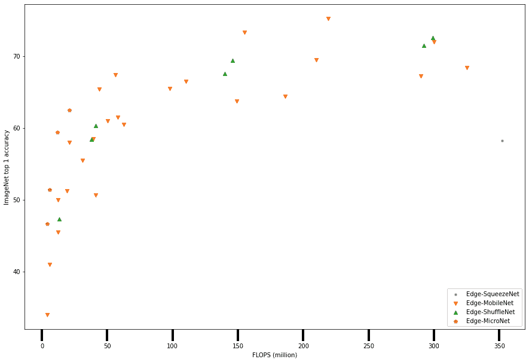

# 第三章：理解卷积神经网络

MLP（多层感知器）结构设计用于处理一维数据，无法直接处理二维或更高维度的数据，除非进行预处理。一维数据也叫做表格数据，通常包括分类数据、数值数据，甚至可能是文本数据。二维数据或更高维度的数据通常是图像数据。当图像为灰度格式时，它是二维的；当图像有 RGB 层并且能较好地表现人类视觉时，它是三维的；而多于三维的图像则是高光谱图像。通常，为了让 MLP 能够处理图像，你需要将数据展平，并有效地以一维格式表示相同的数据。展平数据在某些情况下可能是可行的，但舍弃了定义图像的空间特征，丧失了捕捉该关系到目标的潜力。此外，展平数据在处理大图像时并不合适。图像数据的一个重要特征是，目标可以出现在图像的任何空间位置。简单的 MLP 对数据输入的位置高度依赖，无法适应图像中目标的不断变化的位置和方向。

这正是 **卷积神经网络**（**CNN**）层的强项，通常是处理图像数据时机器学习专家的首选方法。迄今为止，顶尖的卷积架构始终在图像数据集上超过 MLP 架构的性能。在本章中，我们将涵盖以下内容，并重点讨论 CNN：

+   理解卷积神经网络层

+   理解池化层

+   构建 CNN 架构

+   设计一个用于实际应用的 CNN 架构

+   探索 CNN 架构家族

# 技术要求

本章包括一些在 **Python** 编程语言中的实际实现。要完成这些任务，你需要一台安装了以下库的计算机：

+   `pandas`

+   `matplotlib`

+   `seaborn`

+   `scikit-learn`

+   `numpy`

+   `keras`

+   `pytorch`

本章的代码文件可在 GitHub 上找到：[`github.com/PacktPublishing/The-Deep-Learning-Architect-Handbook/tree/main/CHAPTER_2`](https://github.com/PacktPublishing/The-Deep-Learning-Architect-Handbook/tree/main/CHAPTER_2)。

# 理解卷积神经网络层

现在，让我们专注于卷积层的基础知识，从 *图 3.1* 开始，它展示了卷积滤波器的操作过程。滤波器是一个小的权重矩阵，用于从输入数组中提取特征或模式。卷积滤波器是一种滑动图像的滤波器，执行卷积操作，通过计算点积来提取特征：


图 3.1 – 卷积滤波器在 Fashion MNIST 数据集中 T 恤图像上的操作

卷积层由多个大小相同的卷积滤波器构成。卷积滤波器是 CNN 中主要的模式检测器，每个滤波器都会学习识别图像中存在的多维模式。这些模式可以从低级模式，如线条和边缘，到中级模式，如圆形或方形，再到高级模式，如特定款式的 T 恤或鞋子，具体取决于卷积层在 CNN 中的深度。在 *第十二章*《解读神经网络》中，我们将探讨所学习的模式，并对这些模式进行定性和客观评估。

卷积滤波器可以是多维的，但对于普通图像来说，二维卷积滤波器更常用。核在 CNN 层中类似于滤波器。这些二维滤波器的权重数量与其大小相同，并在与输入图像数据相同大小的部分上进行点积操作，以得到一个单一的值；随后，这些值会加上一个偏置项。通过以滑动窗口的方式，按照定义的步幅，从上到下、从左到右系统地对同一操作进行处理，卷积滤波器将完成一次前向传播，得到一个维度较小的二维输出。在这里，步幅指的是滑动滤波器时每次移动的像素步数，最小步幅至少为 1 像素。此操作基于目标可能出现在图像中的任意空间位置，并在整个图像中使用相同的模式识别方法。

*图 3.1* 显示了一个二维卷积滤波器，大小为 5x5 像素，其中包含 25 个可学习的权重组件和一个偏置组件，以及一个 28x28 像素大小的 T 恤输入图像。滤波器的大小是可以配置为其他值的，通常范围在 1 到 7 之间，通常是正方形，但也可以设置为不规则的矩形形状。典型的滤波器大小值可能看起来太小，无法识别图像中预测 T 恤的高阶特征，但当多个滤波器按非周期性顺序一个接一个地应用时，操作结束时的滤波器会有更大部分图像的感受野。感受野是指卷积滤波器可以“看到”或响应的输入空间的区域。它决定了影响特定输出单元的输入的空间范围。为了捕捉低级特征，滤波器必须具有较小的感受野，而为了捕捉高级特征，滤波器必须具有较大的感受野。*图 3.2* 描述了三个滤波器按顺序应用时的这一概念：


图 3.2 – 第二个卷积滤波器的感受野大小为 3x3，尽管其卷积滤波器大小仅为 2x2

现在，从左到右、从上到下的滑动窗口只是一个很好地可视化过程的方法。然而，实际上，这个过程可以一次性并行处理，以利用 GPU 的并行处理能力。*图 3.3* 显示了一个 4x4 像素维度的卷积滤波器，步长为 4，在同一 28x28 T 恤图像上应用的所有窗口位置。这将导致 7x7 的数据输出大小：


图 3.3 – 在 28x28 图像上，使用 4x4 卷积滤波器，步长为 4 像素，进行所有窗口位置的操作

考虑一个 CNN 层，包含 16 个 5x5 像素的滤波器，步长为 1 像素。使用这种层配置对 T 恤图像进行前向传递时，输出的总像素数为 16x26x26（深度 x 宽度 x 高度）。在图像为 RGB 图像且有红、绿、蓝三个通道的情况下，由于卷积滤波器是二维的，相同的滤波器将以类似方式应用于三个通道，每个通道使用标准卷积层处理。对三个通道分别应用的滤波器产生的三维输出将被加总起来。卷积滤波器的数量将是输出数据通道的大小，并且将作为后续卷积层的输入通道大小。*图 3.4*展示了卷积滤波器的 3x3 输出在通道方向上的加和过程。请注意，偏置仅在每个滤波器跨越通道时添加一次，而不是按通道添加：


图 3.4 – 多通道 3x3 卷积滤波器输出的聚合

在前面的图中，**Conv** 是 *卷积层* 的缩写，并将在本章的其余部分作为简化图示的约定使用。由于了解神经网络的大小对于确保拥有足够的计算资源以容纳和处理网络是有益的，接下来我们也将计算该卷积层将包含的参数数量。参数的数量可以通过以下方式计算：

输入通道数 x 过滤器数量 x （（过滤器宽度 x 过滤器高度） + 1）

将相应的数字代入公式，你将得到 416 个参数。如果这些权重以**浮动点 32**（**fp32**）格式存储，则以字节为单位，意味着 416x32 位/8=1,664 字节。由于输出数据的大小为 16x26x26，在空间维度上的数据大小以非常缓慢的速度减少，且由于最终目标是将这些值减少到目标数据的大小，因此我们需要一些方法来减小数据的尺寸。这里引入了另一层，叫做**池化层**，来实现这一目标。

# 理解池化层

仅通过从图像的 CNN 层进行前向传播，二维输出数据的大小可能会减少，但仍然是一个相当大的尺寸。为了进一步减少数据的大小，使用了一种叫做池化层的层类型来战略性地聚合和整合值，同时保持有用的信息。可以将这个操作看作是一种图像调整大小的方法，同时尽可能保持更多的信息。该层没有学习的参数，主要是为了简化且有意义地减少输出数据。池化层通过应用类似滑动窗口滤波器的过程来工作，配置与卷积层相似，但它不是应用点积和加偏置，而是进行一种聚合。聚合函数可以是最大聚合、最小聚合或平均聚合。应用这些聚合的层分别称为最大池化、最小池化和平均池化。

考虑在第一个 CNN 层后应用一个滤波器大小为 4、步幅为 2 的平均池化层。经过一次前向传播，16x26x26 的输出将变成 16x12x12 的数据大小。这大大减少了数据的尺寸！

另一种类型的池化层应用全局聚合函数。这意味着数据的整个二维宽度和高度组件将被聚合成一个单一的值。这种池化层的变种通常被称为全局池化层。该层应用于将数据完全转化为一维结构，以便它可以与一维目标兼容。该层在`keras`库中直接可用，但在`pytorch`中则需要通过将池化滤波器的大小设置为与输入特征图的大小相同间接实现。

# 构建 CNN 架构

CNN 架构通常是通过一个个堆叠的概念逻辑块构建的。这些逻辑块的结构方式相同，具有相同类型的层和层连接，但在参数配置上可能有所不同，比如滤波器的大小、步幅、所使用的填充类型以及填充的数量。最简单的逻辑卷积块是卷积层、池化层和激活函数，按此顺序排列。**填充**是指在卷积操作后，为了保持输入图像的空间维度而在图像周围添加的额外像素。逻辑块是用来简洁而高效地描述和引用架构的一种方式。它们还使你能够以深度可扩展的方式构建 CNN 架构，而无需逐一创建和设置每个层的参数。深度与深度度相同，指的是神经网络层的数量。

可以根据目标是逐渐缩小特征图还是扩大特征图来设计参数。对于一维目标的情况，目标可能是将特征逐渐缩小为一维特征，以便将特征传递给全连接层。然后，这些全连接层可以进一步将（仍然很大的）维度映射到适合目标的维度。你可以在*图 3.5*中看到这样的架构的简单设计：


图 3.5 – 从零开始构建的简单 CNN 架构，同时遵循逻辑块类比。

在 `pytorch` 的代码中，这个例子看起来是这样的：

```py
class ConvArch(nn.Module):
  def __init__(self):
       super(ConvArch, self).__init__()
       self.conv1 = nn.Conv2d(
            in_channels=1, out_channels=12, kernel_size=4,
            stride=2, padding=0
       )
       self.conv2 = nn.Conv2d(
            in_channels=12, out_channels=5, kernel_size=3,
            stride=1, padding=0
       )
       self.fc2 = nn.Linear(5, 3)
  def forward(self, x):
       x = F.relu(
            F.avg_pool2d(
                 self.conv1(x), kernel_size=3, stride=2
            )
       )
       x = F.relu(
            F.avg_pool2d(
                 self.conv2(x), kernel_size=3, stride=1
            )
       )
       x = F.avg_pool2d(x, kernel_size=x.size()[2:])
       x = self.fc2(x.reshape((x.size()[:2])))
       return x
```

同样，CNN 架构的反向传播将由深度学习库自动处理。

我们构建的架构是基于基本的分类问题类型，这也证明了在网络末尾需要一个全连接网络的必要性；这通常被称为“头”。使用的卷积层逻辑块集被称为网络的“主干”。网络的头部可以根据问题类型替换为其他结构，但主干可以完全适配到大多数架构中，适用于任何问题类型，如目标检测、图像生成、图像描述或通过表征学习的图像识别。关于这些问题类型的讨论会在*第八章*，*探索有监督深度学习*中进一步展开。

现在我们已经成功手动创建了一个简单的 CNN，我们的理论已经与卷积网络的核心算法相契合并同步，接下来我们将能够轻松设计更先进的 CNN 主干架构。但在此之前，这就引出了一个问题：我们如何为我们的使用场景设计 CNN？

# 为实际使用设计 CNN 架构

对于实际的使用场景，CNN 不应像 MLP 那样设计。实际使用意味着目标不是为未探索的问题类型研究一个新的创新架构。今天，基于 CNN 已经取得了许多进展。这些进展通常有两种形式：

+   它设定了一个全新的基准，彻底重新设计了 CNN 架构的构建方式。

+   它是建立在现有基准 CNN 架构的基础上，同时补充和提升了基准架构的性能。

与多层感知机（MLP）的理想设计方法相比，卷积神经网络（CNN）的关键区别在于，应该使用已发布的 CNN 架构结构，而不是从零开始设计架构。CNN 架构的结构定义了层的类型以及不同类型的层如何连接；它们通常通过逻辑块实现。此外，特定结构的独特性定义了 CNN 架构的家族。新的 CNN 研究进展通常会以不同的尺寸配置出现，以便根据计算资源限制、运行时要求或数据集和问题复杂性选择合适的架构尺寸。与 MLP 设计类似，如果资源和运行时不是限制条件，在选择了 CNN 架构结构后，应该根据问题的复杂性和数据集的大小，从一个合理小的 CNN 开始。你可以逐渐测试更大的 CNN，看看当增加大小时，性能是否有所提升，反之如果性能下降。

不同的 CNN 架构结构或架构家族通常用于捕捉网络固有的不同架构问题。有些架构家族的设计方式是利用了更好的硬件资源，否则就无法执行这些架构。为了获得良好的性能，一个好的做法是在初始阶段多样化你使用的架构结构类型。选择具有相似浮点运算每秒（FLOP）的架构结构尺寸变体，并运行实验以获得性能得分，理想情况下，选择较小的尺寸以最大化探索效率。与模型的参数数量相比，考虑每秒浮点运算作为模型复杂度的指标更为相关；因为参数数量没有考虑模型的实际运行时，而模型的运行时可能会受益于并行化。一旦获得了这些数字，就选择顶尖的模型家族，并尝试更大的尺寸变体进行基准测试，以找到最适合你使用案例的模型变体。

大多数 CNN 的研究改进都基于一个简单的基线架构。这意味着对同一个基线架构所做的所有其他改进并没有一起进行基准测试。将这些改进一起测试往往是互补的，但有时也可能对模型的度量性能产生不利影响。迭代地基准测试不同的配置，可能是获得令人满意的性能提升的最系统、最扎实的方法。

研究人员如何评估他们的改进呢？为了设计出适用于实际场景的 CNN 架构，了解如何评估架构将帮助你逐步朝着可接受的度量性能目标前进。在*第十章*，《探索模型评估方法》中，我们将更详细地讨论评估策略。用于评估 CNN 改进的主要方法之一是通过在名为`ImageNet`的公开图像数据集上的 top-1 预测准确率，该数据集包含数百万张图像，并有多个类别。`ImageNet`被认为是一个高度复杂的案例，每个类别都有无限种可能的变体，从室内到室外，从真实数据到合成数据都有涵盖。

那么，我们如何判断改进是否具有价值呢？改进的目标通常是提高基于`ImageNet`数据集的 top-1 准确率，提升模型前向传递的效率，或是专门优化网络的训练时间。

然而，仅仅按照`ImageNet`上的 top-1 准确率性能改进对架构进行排名，这种评估方式是有偏的，因为在大多数情况下，模型的绝对排名在应用相同架构到不同的图像数据集时会有所不同。将其作为选择现成架构的起点是明智的，但一定要确保评估一些`ImageNet`上表现最佳的架构，以找出最适合的方案。此外，虽然`ImageNet`是通过手动努力构建的，包括查询搜索引擎并将候选图像通过 Amazon Mechanical Turk 进行验证，但它仍然包含一些标签噪声，这可能会混淆度量性能背后的含义。

至于提高模型前向传递效率的改进方向，通常是通过减少架构的参数数量、将计算密集型的逻辑组件分解成多个组件来减少操作量，或者用具有更高并行性潜力的层来替换原有层。在这一方向上进行的改进，通常会保持或提高在`ImageNet`验证数据集上的度量性能得分。这个方向的改进是针对一系列设计用于低资源边缘设备上运行的卷积神经网络（CNN）架构的主要关注点，我们稍后会深入探讨。

探索不同 CNN 架构家族以获得更好的指标性能的一个高效方法是，选择那些有公开实现的模型家族，且这些实现包括了在`ImageNet`上训练的预训练权重。通过使用预训练权重初始化你的架构，可以带来一系列好处，包括更快的训练、更少的过拟合，以及即使使用的数据集与预训练权重的训练数据集属于不同的问题子集，依然能提高泛化能力。这个过程叫做迁移学习，我们将在*第八章*《探索监督式深度学习》和*第九章*《探索无监督深度学习》中详细学习。

# 探索 CNN 架构家族

现在，我们不再回顾 CNN 多年来的发展历史，而是来看一下经过精心挑选的不同模型架构家族。这些架构家族的选择是基于它们之间有足够的差异和多样性。需要注意的一点是，神经网络正在以惊人的速度进步。考虑到这一点，本文将介绍的架构家族是确保今天依然相关的。此外，本文将只呈现架构家族中最重要的信息，将研究论文中的大量内容简化成简洁而充分的细节。

在深入探讨这个话题之前，另一个需要注意的事情是，数据集上的指标性能通常是不同架构之间的主要比较方法，因此请注意，模型的指标性能是通过训练方法和架构的集体贡献来实现的。训练方法包括与模型架构无直接关系的细节，如所使用的损失函数、数据增强策略和数据分辨率。这些主题将在*第八章*《探索监督式深度学习》中讲解。我们将在这里介绍的架构家族有**ResNet**、**DenseNet**、**MobileNet**、**EfficientNet**、**ShuffleNet**和**MicroNet**。

## 理解 ResNet 模型家族

ResNet 架构，始于 2015 年，是基于深度网络训练困难的前提提出的，并旨在解决这一问题。梯度消失是神经网络面临的一个广泛已知的问题，即网络越深，来自数据的信息越少。然而，普通的深度 CNN 架构并未出现梯度消失的问题，这通过验证梯度信息得到了证明。梯度消失的主要原因是我们使用了过多的激活函数，将数据压缩到非常小的值范围内。例如，sigmoid 函数就是一个典型，它将数据映射从 0 到 1。所以，如果不确定，建议在架构中使用 ReLU！

ResNet 的 *Res* 部分是以**残差**（residuals）一词命名的。其理念是，从残差中学习比从未经修改的特征图中学习要容易得多。残差是通过添加来自早期层到后期层的跳跃连接（skip connections）来实现的。通俗来说，这意味着将早期部分的特征图（而非拼接）添加到网络后期部分的特征图中。这种加法的结果创建了将由后续卷积层学习的残差，后续卷积层再次应用更多跳跃连接并创建更多残差。残差可以轻松地应用于任何具有不同配置的 CNN 架构，并且可以被视为对较旧基线架构的改进。然而，作者还提出了多种利用不同数量卷积层的跳跃连接的架构变体，包括 ResNet-18、ResNet-34、ResNet-50、ResNet-101 和 ResNet-152。ResNet 架构家族为残差网络的简单使用提供了一个模板，并最终使其成为研究新进展的最流行基线。实际的架构设计在这里没有正式展示，因为记住这些设计对于掌握 CNN 知识没有任何影响。相反，*图 3.6* 显示了单个逻辑块的残差计算：


图 3.6 – ResNet 模型家族中实际残差连接方法的示例

为总结整个基线 ResNet 尺寸变体，以下表格显示了所有不同尺寸变体的配置摘要：


图 3.7 – 基础 ResNet 不同尺寸变体

表格中标注的括号表示定义为逻辑块的串行卷积层的集合。ResNet 还额外做了一个改进，将多个基础逻辑块归为一个更高层次的类别，称为“层名称”（layer name）。不同尺寸变体中，层名称的分组数目是相同的。逻辑块和更高层次的分组方法仅仅是为了让你能够简单有效地描述和引用复杂的架构。逻辑块中的前两个数字，通过乘法连接，定义了卷积滤波器的大小；紧随其后的数字和逗号定义了滤波器的数量。

研究发现，跳跃连接可以使任何神经网络的损失景观更加平滑，从而使学习过程变得更加容易和稳定。这使得神经网络更容易收敛到最优解。*图 3**.8* 显示了没有跳跃连接的神经网络的损失景观，左侧地形起伏不平，充满了许多山丘和山谷；而右侧则是通过使用 ResNet 的变种添加跳跃连接后，地形变得平滑，且明显形成一个单一的山谷：


图 3.8 – 左侧为没有跳跃连接的损失景观，右侧为带有跳跃连接的损失景观

从表格中可以得出的一个显著信息是，从 ResNet-50 开始，该架构采用了 1x1 卷积滤波器。由于该滤波器仅在通道维度上操作一个单维滤波器权重，因此该操作相当于在通道维度上以窗口方式应用全连接层。由于全连接层本身就是一个网络，再加上卷积网络，这种操作通常被称为 **网络中的网络**。接下来，我们将探讨以 ResNet 架构为基础的不同改进。

### 改进 ResNets

如前所述，ResNet 被认为是一个模型家族，包含了许多不同的变种，不仅在规模上有所不同，还具有不同的架构改进。任何基于 ResNet 的 CNN 架构都属于这个模型家族。这里，我们提到了一些值得注意的架构进展，并根据 ResNet 提供了它们的主要改进描述；它们按年份排序：

+   `ImageNet` 与 ResNet 各变种相比，即使在参数数量相同的情况下，仍有明显差异，通常也有优势。

+   **挤压与激励网络** (**SE-ResNet**)（2017 年）：由于二维卷积操作没有考虑通道之间的关系，仅仅考虑特征图的局部和空间（宽度和高度）信息，因此提出了一种利用通道关系的方法，该方法包括挤压模块和激励模块。这是一种可以重复应用于现有 CNN 架构多个部分的方法。*图 3**.9* 显示了该方法的结构，其中在宽度和高度维度上应用了全局平均池化，随后使用两个全连接网络进行特征缩放和恢复至相同的尺寸，以便将通道信息进行组合：


图 3.9 – 挤压与激励结构

该结构的缩放部分是值的相乘。当与 ResNet 结合使用时，架构被称为 SE-ResNet。

+   **ResNet-D**（2019 年）：这一进展对架构参数进行了简单的调整，以提高度量性能，同时保持参数数量，尽管在 FLOP 规范略有增加。由于 ResNet 的某些路径使用步长为 2 的 1x1 卷积，舍弃了 3/4 的信息，而调整步幅大小以确保不会明确删除任何信息是其中的一种调整。他们还通过将 7x7 卷积变为三个串行的 3x3 卷积来减少计算负载。

+   **ResNet-RS**（2021 年）：这一进展结合了 ResNet-D 和压缩激励网络，并使用依赖于网络大小的图像尺寸。然而，它的增长速度比 EfficientNets（稍后会介绍）慢。

## 理解 DenseNet 架构系列

**DenseNet** 是一种架构系列，最早于 2018 年初提出。这种架构基于跳跃连接的思想，类似于 ResNet 架构系列，但更加强大，意味着它使用大量的跳跃连接。这些架构系列中的跳跃连接不同之处在于它们使用**串联**而不是通过**求和**的残差连接。求和允许较早的信息直接编码到未来层的输出中，无需修改神经元的数量，尽管稍微降低了信息的优势，需要未来层学习解码这些信息。串联增加了架构的大小，因为你需要创建额外的神经元来容纳额外的信息，从而使模型能够处理原始数据。两者都提供了使用跳跃连接的类似优势。逻辑块称为**稠密块**，其中块中每个后续层通过特征图串联可以访问块中它之前所有层的所有输出。在这些块中，使用**零填充**以确保每层输出的空间尺寸保持不变，以便可以串联特征图。这种设置促进了同一块中层之间的大量特征重用，并允许模型参数数量保持不变，同时增加了模型的学习能力。对于所有块中的每个后续层，每个块中的过滤器数量均固定为称为**增长率**的常数值，因为需要一种结构化的方式来添加层，以避免指数增加通道数。以 32 个过滤器为常量，块中第二层的输入将是具有 32 个通道的特征图，块中第三层的输入将是 64 个并串联，依此类推。

为了创建一个完整的网络架构，多个密集块依次堆叠，中间插入单独的卷积层和池化层，以逐渐减少特征图的空间维度。*图 3**.10* 显示了 DenseNet 模型家族下四种不同 DenseNet 模型架构的网络结构：


图 3.10 – DenseNet 模型家族，其中“conv”对应于批量归一化、ReLU 和卷积层的顺序层

这使得 DenseNet 能够在 top-1 `ImageNet` 精度方面超越其前身网络架构。

## 理解 EfficientNet 架构家族

EfficientNet 于 2020 年推出，通过使用自动化 **神经架构搜索** (**NAS**) 方法，创建了一个高效的小基础架构，并利用易于使用的复合缩放方法来缩放架构的深度、宽度和图像分辨率。神经架构搜索是以平衡 FLOPS 和精度的方式进行的。使用的 NAS 方法来源于另一项研究 **MnasNet**，将在*第七章*中详细介绍，深度神经*架构搜索*。

复合缩放方法简单且可以扩展到任何其他网络，尽管 ResNet-RS 表明，缩放分辨率较慢提供了更多的价值。深度、宽度和分辨率的缩放方法定义在以下方程式中，其中结果将与原始基础架构的参数相乘，以放大架构：

depth = α φ , width = β φ, resolution = γ φ

这里，φ 是可以根据需求调整为不同值的系数，其他变量是常数，应设置为优化某些内容，如我们改变系数时 FLOPS 增加率的常数。对于 EfficientNet，这些常数被限制为满足以下条件：

α ∙ β 2 ∙ γ 2 ≈ 2

这将限制系数的增加，使得 FLOPS 约增加 2 φ。EfficientNet 设置为 α = 1.2，β = 1.1，γ = 1.15。这一复合缩放策略使得可以创建七个 EfficientNet 模型，命名为 B0 到 B7。*图 3**.11* 显示了 EfficientNet-B0 的结构：


图 3.11 – EfficientNet-B0 架构结构

请注意，**MBConv** 也被称为反向残差块，将在稍后的 *理解* *MobileNetV2* 部分中对其进行详细介绍。

**EfficientNetV2**，于 2021 年发布，发现大图像分辨率会减慢训练时间，其中深度卷积在早期层较慢，且同时扩展深度、宽度和分辨率并非最优。EfficientNetV2 还使用了 NAS（神经架构搜索）来找到基础架构，但对 MBConv 块进行了修改，增加了更多的参数和操作，原因是它在某些情况下可以更快，具体取决于输入和输出数据的形状、它们在整个架构中的位置以及数据如何传输到计算处理器。稍后我们正式介绍 MBConv 时会详细解释这一点。EfficientNetV2 还使用了原始的复合缩放方法，但通过将最大图像分辨率设置为 480 并在架构的最后几个阶段添加额外层来提高网络容量。还增加了一种新的训练方法来减少训练时间；我们将在下一章详细讨论这些内容。这些改进使得四种不同的 EfficientNetV2 模型诞生，分别为**EfficientNetV2-S**、**EfficientNetV2-M**、**EfficientNetV2-L**和**EfficientNetV2-XL**。与原始的 EfficientNet 在相似 FLOP 值下，这些模型的 top-1 准确率超越了原有的 EfficientNet：


图 3.12 – EfficientNetV2-S 架构结构

EfficientNetV2-S 作为基础架构，类似于 EfficientNetB0 作为基础架构，架构结构如*图 3.12*所示。

## 了解适用于小型边缘设备的小型和快速 CNN 架构系列

一类明确的架构组在 CNN 架构的世界中占有一席之地，这些架构并非为了可扩展性或打破`ImageNet`基准而设计，而是为了小型设备而建造。小型设备通常被称为**边缘设备**，因为它们足够小巧和紧凑，可以移动，或可以物理部署并具备数据处理能力，数据就是在其产生的地方进行处理的。我们的智能手机就是能够生成图像的移动设备的例子。不是移动设备的边缘设备包括闭路电视视频摄像头和门铃摄像头。将模型部署到边缘的关键好处如下所示：

+   **减少通信延迟**：与简单的数值或类别数据相比，图像和实时视频流的数据量较大。通过在边缘进行计算，减少了需要传输到集中式服务器的数据量，从而减少了数据传输所需的时间。有时，当计算在边缘进行时，可以完全消除传输需求，从而显著简化系统。

+   **减少带宽需求**：当图像在产生的地方进行处理时，只需返回简单的数据格式，如数值型或类别型数据，从而避免了对高带宽设备的需求。

+   **增加冗余**：集中式服务器意味着单点故障。将处理分配到各个边缘设备可以确保任何一个设备的故障不会影响整个系统。

针对边缘设备的小型 CNN 架构通常在没有单一显著基准的情况下设计整个模型结构，因此没有一个合适的模型家族来对这些架构进行分类。为了方便引用这些专为此目的设计的架构，建议将以下架构视为*面向边缘的架构*。还有其他可以应用于整个架构的技术，用以进一步优化模型的效率，我们将在*第十五章*《在生产中部署深度学习模型》中进行探讨，但目前我们先来看看其中的两个架构，即**SqueezeNet**和**MobileNet**。

## 理解 SqueezeNet

SqueezeNet 于 2016 年开发，旨在构建小型且快速的 CNN，并具备前一节所描述的优势，同时强调部署到内存有限的硬件上。可以采用的三种策略如下：

+   对于一个具有 3x3 滤波器的卷积层，部分使用 1x1 滤波器来替代。这意味着 1x1 滤波器和 3x3 滤波器在理论上可以共存于一个单独的层，并应用于相同的输入。然而，具体实现会有所不同，因为 1x1 滤波器和 3x3 滤波器会在同一输入上应用并行分支路径。这被称为扩展层（expand layer）。

+   通过使用少量 1x1 滤波器来减少传递到并行 1x1 和 3x3 滤波器的数据输入通道数量。这被称为 squeeze 层。

+   在架构的后期阶段对特征图进行下采样，以便大多数卷积层可以访问基于发现的较大特征图，从而提高指标性能。通过在早期阶段较少使用步幅为 2 像素的池化层，而在后期阶段及较大间隔时更多使用，从而实现这一点。在每个卷积层后并不总是使用池化层。

创建了一个逻辑块叫做 `Fire`，它提供了便于创建多个模块以构建架构的功能。该模块使得在 squeeze 层中配置 1x1 大小滤波器的数量、在扩展层中的 1x1 滤波器和 3x3 滤波器成为可能。这在*图 3.13*中有所展示。请注意，针对 3x3 卷积层的输出应用了填充操作，以确保其可以与扩展层中 1x1 卷积层的输出进行连接：


图 3.13 – 火焰模块/逻辑块

使用了八个`Fire`模块构建了一个叫做 SqueezeNet 的架构，它保持了从历史架构**AlexNet**（本书中未介绍，因为如今已不再实际使用）中传承下来的`ImageNet`性能，同时体积缩小了 50 倍。

## 理解 MobileNet

第一个 MobileNet 版本，称为 MobileNetV1，于 2017 年推出，专为移动和嵌入式设备设计，重点优化延迟问题，并通过这一过程使得网络尺寸较小，而不是反过来。

在整个架构中，除了第一层之外，深度可分离卷积层被广泛使用，这一版本的 MobileNet 包含 28 层。该层通过将标准卷积层分解为两层——深度卷积层和点卷积层——来构建。这种两层的设计理念是，使用标准卷积滤波器计算代价较高。深度卷积层为每个输入通道使用一个独特的滤波器，每个输入通道只有一个滤波器。这种每个通道一个滤波器的设计，使得`ImageNet`中只有 1%的独特案例。该分解也使得参数数量减少了约 5 倍。这一过程本质上是一种因式分解。深度卷积逻辑模块如下图所示：


图 3.14 – 深度可分离卷积层作为逻辑模块

MobileNet 还提供了两个可配置的参数，用以减少模型的大小和计算需求，同时在一定程度上牺牲性能。第一个是宽度倍增器，用于配置整个架构中的输入和输出通道。第二个是介于 0 和 1 之间的分辨率倍增器，适用于原始的 224x224 图像尺寸，当图像输入网络时可减小输入和输出特征图的尺寸。如果需要更快的运行时，这些参数还可以适配其他架构。*图 3.15*显示了 MobileNetV1 架构的结构和层配置：


图 3.15 – MobileNetV1 架构

MobileNet 被认为是一个独特的模型家族，基于第一个版本进行了两项改进。它们分别是 MobileNetv2 和 MobileNetv3-small，二者都在 2019 年推出。

### 理解 MobileNetV2

在我们深入了解 MobileNetV2 之前，先定义一下**瓶颈层**是什么，这是该进展中使用的核心思想。瓶颈层通常是一个输出特征图较少的层，且相对于前后层有较少的输出。MobileNetV2 建立在瓶颈层是信息所在的思想上；非线性激活会在瓶颈层破坏过多的信息，因此应用了线性层，最终通过捷径连接对瓶颈层进行残差运算。MobileNetV2 基于深度可分离卷积构建，添加了没有 ReLU 的线性瓶颈层，并在瓶颈层上应用残差。这一构建模块如下图所示。它被称为**瓶颈反向残差块**：


图 3.16 – MobileNetV2 的瓶颈反向残差块，也称为 MBConv

至于整个网络架构，第一版 MobileNet 中的所有深度可分离层都被新模块替换，唯一没有替换的是第一个具有 3x3 卷积核和 32 个滤波器的卷积层，如*图 3.16*所示。一个小的额外细节是，它们使用了**ReLU6**激活函数，这在低精度计算中表现良好。MobileNetV2 架构使用所示的逻辑块来创建多个具有不同设置的重复层块。这一架构使得在相同 FLOPs 下，ImageNet 上的性能曲线比 MobileNetV2 提高了约 5%到 10%。请记住，EfficientNetV2 使用了这个块，并且还有一个版本的块将线性瓶颈层和过滤层重新融合在一起。使用两个层而不是一个层的目的是减少所需的操作次数，但对于边缘设备来说，由于内存访问的瓶颈，实际的延迟可能会有所不同。有时，使用融合版本可能会在具有更多参数的情况下提高运行时速度，从而能从中学习更多信息。

### 了解 MobileNetV3-small

对于**MobileNetV3-small**，对 MobileNetV2 进行了几处修改：

+   它使用了一种更先进的非线性函数，称为`ImageNet`。

+   在初始层和最后几层，计算量被进一步减少。

+   对于第一层，如*图 3.15*所示，32 个滤波器被减少到 16 个，并使用了硬切换非线性函数，实现了 2 毫秒的运行时间和 1000 万 FLOPS 的节省。

+   对于最后几层，最后一个 1x1 的瓶颈卷积层被移至最终平均池化层之后，同时前面的瓶颈（1x1）层和过滤（3x3）层也被移除。

+   它使用了一种平台感知的网络架构搜索的修改版本，称为 **Mnasnet**，以及一种称为 **NetAdapt** 的后搜索层减少方法来减少延迟，自动找到基于 MobileNetV1、MobileNetV2 以及 squeeze 和 excitation 网络的优化架构，同时考虑延迟和精度表现。NetAdapt 和 MnasNet 会在 *第七章*，*深度神经* *架构搜索* 中介绍。

MobileNetV3-small 最终在相同的参数和 FLOPS 下，取得了比 MobileNetV2 更高的 top-1 `ImageNet` 精度。

#### 了解 ShuffleNet 架构系列

ShuffleNet 有两个版本，ShuffleNetV1 和 ShuffleNetV2，我们将分别讨论这两个版本。

ShuffleNetV1，发布于 2017 年，重用了已知的卷积变种——**组卷积**，其中每个卷积滤波器仅负责输入数据通道的一个子集。MobileNet 通过为每个通道使用一个滤波器，采用了这一特殊的变种。组卷积通过仅在输入通道特征的小子集上操作，节省了计算成本。然而，当多个组卷积层依次堆叠时，通道间的信息不会相互作用——最终导致精度下降。ShuffleNetV1 使用通道洗牌操作，在多个组卷积层堆叠之间手动传递信息，而不牺牲 FLOPs。这使得网络既高效又小巧。

ShuffleNetV2，发布于 2018 年，基于 ShuffleNetV1，并专注于在实际应用中架构的运行时效率，同时考虑诸如内存访问成本、数据**输入输出**（**I/O**）以及网络并行度等因素。以下四种设计策略被用于打造这一新架构：

+   从输入到输出保持相等的通道宽度，以最小化内存访问成本。

+   降低组卷积以最小化内存访问成本。

+   减少网络碎片化以增加并行性。例如，单个构建模块中的卷积和池化操作的数量。

+   减少诸如 ReLU 等逐元素操作，因为它们有较高的内存访问成本：


图 3.17 – 左侧为 ShuffleNetV1 的两个构建模块，右侧为 ShuffleNetV2 的两个构建模块

在 *图 3.17* 中，左侧的前两个结构显示了 ShuffleNetV1 的两个构建模块，而右侧的最后两个结构则显示了 ShuffleNetV2 的两个构建模块。

## 了解 MicroNet，这是当前边缘计算领域的最先进架构

创建于 2021 年的 MicroNet，是在延迟和可实现的 top-1 `ImageNet` 精度表现方面的当前最先进技术，适用于 400 万到 2100 万 FLOP 范围内。MicroNet 的创新性体现在两个方面：

+   它引入了来自 MobileNet 的瓶颈/逐点卷积层和深度卷积层的因式分解版本，称为**微因式分解卷积**，其方式是减少输入数据到输出数据的连接/路径数量。这是通过使用多个分组卷积和一些膨胀卷积来实现的。膨胀卷积仅仅是内核中具有固定间距的卷积。将这些技术视为一种稀疏计算，只计算最需要的部分，以确保最小的输入到输出路径冗余。

+   它引入了一种新的激活函数，称为**动态 shift-max**，该函数利用分组卷积的输出，通过应用更高阶的非线性（两次），同时增强组间的连接。这是通过使用挤压和激励块的分组输出（每个通道生成一个单一值）作为加权机制，来获得基于组加权和的最大值。将此视为对 ShuffleNet 中通道洗牌的改进。*图 3**.18* 显示了动态 shift-max 操作结构的示意图，展示了一个来自四个组、使用分组卷积操作的 12 通道的单一示例特征图：


图 3.18 – 动态 shift-max 一般操作流程

MicroNet 利用了 ShuffleNet（通道洗牌机制）、ResNet（跳跃连接）、SENet（挤压和激励网络）和 MobileNet（从已因式分解的卷积中创建因式分解版本）等概念，并在其创新之上，创造了通过聚焦稀疏性概念和高效信息流改进的高效网络。该网络的具体细节可能令人不知所措，坦白说，也很难理解，因此此处提供的信息并不包含所有细节：


图 3.19 – 三个逻辑块的示意图，这些块被称为微块，用于构建不同大小的 MicroNet 变体

然而，*图 3**.19* 显示了逻辑块如何在今天最先进的网络中，基于相同的思想构建不同规模的网络。

### 总结用于边缘计算的 CNN 架构

为了总结边缘计算的架构，现在你已经拥有了专家在该领域中用来构建高度有效的 CNN 架构的直观知识，这些架构相比今天的大型模型，如 GPT-3，能够以极小的占用空间运行。下图展示了不同架构家族在边缘计算中的总体 top-1 `ImageNet` 精度表现与 FLOPS 图：



图 3.20 – 低于 4 亿 FLOPS 的边缘架构系列的 top-1 准确率性能

对这些结果应保持谨慎态度；模型之间的训练策略可能不同，会显著影响可实现的`ImageNet` top-1 准确率，同时在不同模型运行的随机初始化之间可能会得到不同的结果。此外，延迟并不完全由参数数量或 FLOPS 直接表示，还受到各个操作的内存访问成本、I/O 访问成本以及不同操作的并行程度的影响。

总结一下，*图 3.21* 显示了本章介绍的所有 CNN 模型系列在 FLOPS 基础上的整体性能图：


图 3.21 – 基于 FLOPS 的 ImageNet top-1 准确率的整体 CNN 模型系列性能

再次强调，我们应对这里呈现的结果保持谨慎，因为在`ImageNet`数据集上执行的训练技术并未在不同的基准测试中完全标准化。训练技术的差异可能导致结果差异巨大，且将在*第八章*，《探索监督深度学习》和*第九章*，《探索无监督深度学习》中更为详细地讨论。另一个重要的注意点是，尽管`ImageNet`被认为是一个足够大的图像数据集，可以作为基准使用，但由于数据本身在某些情况下已被证明存在噪声标签和系统性错误，保持一定的怀疑态度是必要的。`ImageNet`的修正版`ImageNet Real`已经发布，但并非所有模型都以此为基准进行测试或预训练。为了 100%确定哪种架构在特定数据集上预训练后表现更好，请在你的数据集上进行训练！此外，FLOPS 指标并不能完全代表模型的实际延迟，实际延迟可能会因代码结构、模型如何分布在多个设备上、可用的 GPU 或 CPU 数量，以及模型架构的并行程度而产生较大差异。

# 概述

CNN 是捕捉图像数据模式的首选模型。本章介绍的精选架构是核心骨干网络，可以作为基础，进一步用于解决更多定制化的下游任务，如图像目标检测和图像生成。

本章涵盖的卷积神经网络（CNN）将在后续章节中作为基础，帮助你学习其他基于深度学习的知识。请慢慢消化，并查看本书 GitHub 仓库中离线实现的深度学习库中不同架构的实现；我们这里不会呈现实际的实现代码。既然我们已经详细讲解了中低级的卷积神经网络，接下来我们将切换话题，探讨递归神经网络。
