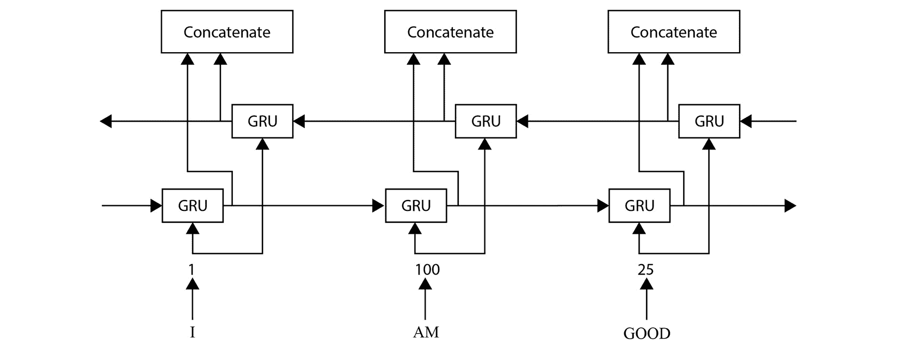

# 第四章：理解递归神经网络

**递归神经网络** (**RNN**) 是一种设计用来处理顺序数据的神经网络，能够意识到数据的顺序。顺序数据可以包括基于时间的序列数据，也可以是具有顺序但没有时间成分的数据，例如文本数据。这类神经网络的应用基于数据本身的性质。对于时间序列数据，这可以用于现在预测（利用过去和当前数据进行的预测）或目标预测。对于文本数据，可以用于语音识别和机器翻译等应用。

随着能够捕获序列数据并完全移除递归连接的神经网络（如 Transformer）的出现，过去几年递归神经网络的研究有所放缓，并且取得了更好的性能。然而，RNN 在今天的实际应用中仍然广泛使用，作为一个良好的基准或仅仅是一个替代模型，因为它们的计算量较少，内存需求低，并且具有合理的度量性能，适用于更快速的计算。

最突出的两种 RNN 层是 **长短期记忆** (**LSTM**) 和 **门控递归单元** (**GRU**) 。本书不会介绍原始的递归神经网络，而是通过 LSTM 和 GRU 作为复习。LSTM 和 GRU 的主要操作提供了一种机制，仅保留相关记忆并忽略无用的数据，这是为时间序列或顺序数据精心设计的关键归纳偏差。

在本章中，我们将更深入地探讨这两种 RNN 网络。具体来说，我们将涵盖以下主题：

+   理解 LSTM

+   理解 GRU

+   理解标准 GRU 和 LSTM 层的进展

# 技术要求

本章内容简洁明了，但仍涵盖了 `Pytorch` 库中一些实际的实现。

你可以在 GitHub 上找到本章的代码文件，链接地址为 [`github.com/PacktPublishing/The-Deep-Learning-Architect-Handbook/tree/main/CHAPTER_4`](https://github.com/PacktPublishing/The-Deep-Learning-Architect-Handbook/tree/main/CHAPTER_4)。

# 理解 LSTM

LSTM 于 1997 年发明，但仍然是广泛采用的神经网络。LSTM 使用 `tanh` 激活函数，因为它提供了非线性特性，同时提供了可以在更长序列中保留的二阶导数。`tanh` 函数有助于防止梯度爆炸和梯度消失。LSTM 层使用一系列顺序连接的 LSTM 单元。让我们深入了解 *图 4.1* 中 LSTM 单元的样子。


图 4.1 – 在一系列 LSTM 单元中的 LSTM 单元的视觉深度解析，形成了一个 LSTM 层

左侧的第一个 LSTM 单元展示了 LSTM 单元的高级结构，左侧的第二个 LSTM 单元展示了 LSTM 单元的中级操作、连接和结构，而右侧的第三个单元则是另一个 LSTM 单元，强调了 LSTM 层是由多个 LSTM 单元按顺序连接而成的。可以将 LSTM 单元视为包含四个门控机制，它们提供了忘记、学习、记住和使用序列数据的方式。你可能会好奇的一个显著问题是，为什么 sigmoid 在三条路径中被显示为一个独立的过程，这些路径从输入经过隐藏状态，到达遗忘门、记忆门和使用门。*图 4**.1* 中展示的结构是 LSTM 单元的经典图示，但没有包含关于连接权重的信息。这是因为输入通过加权求和的过程，将前一个单元的隐藏状态和当前序列数据结合起来，每一条连接都有不同的权重集。*图 4**.2* 显示了单个 LSTM 单元的最终低级结构，考虑了权重因素：


图 4.2 – LSTM 单元的低级结构

在*图 4**.2*中，W 和 B 分别代表权重和偏置。两个小写字母分别代表数据类型和门控机制。数据类型分为两类——由 h 表示的隐藏状态和由 i 表示的输入数据。涉及的门控机制包括由 F 表示的遗忘机制、由 L 表示的学习机制（学习机制涉及两个权重和偏置），以及由 U 表示的使用机制。为了正确理解一个 LSTM 单元有多少个参数，我们还需要解码隐藏状态和输入状态权重向量的维度。为了方便起见，我们假设输入向量的大小为 n，隐藏状态的大小为 m。

隐藏状态权重的维度为：

nm

而输入状态权重的维度为：

n²

另一方面，偏置是输入向量的大小。对于 Tensorflow 和使用 Tensorflow 的 Keras，偏置每个机制只添加一次。对于 PyTorch，偏置对于每个隐藏状态和输入状态权重都会添加。对于 PyTorch，偏置的参数数量可以定义为：

2n

由于有四个机制，如*图 4**.2*所示，这意味着在 PyTorch 实现中，LSTM 的参数数量可以根据以下公式计算：

参数数量 = 4(nm + n² + 2n)

现在我们了解了实际参数在单元中的位置，接下来我们深入探讨这些门控机制。

## 解码 LSTM 的遗忘机制

遗忘机制通过使用 sigmoid 激活函数与前一个单元状态相乘来实现。该门机制的名称暗示它基于当前输入序列和前一个单元输出的组合来确定需要删除的信息。可以这样理解：在`0`到`1`的范围内，过去的信息有多相关？sigmoid 机制强制将该范围限定在`0`到`1`之间。接近`0`的值会更多地遗忘前一个单元状态（长期记忆），而接近`1`的值则会更少遗忘前一个单元状态的记忆。

## 解码 LSTM 的学习机制

学习机制通过结合前一个单元输出的 sigmoid 激活函数和`tanh`激活函数，将遗忘门的输出与使用门的输出相乘，应用于当前输入序列的输出。这种机制也被称为输入门。该机制允许从当前输入序列中学习信息。学习到的信息随后会传递给记忆机制。此外，学习到的信息还会传递到下一个 LSTM 单元，用于信息使用的机制中。这两个机制将会依次介绍。

## 解码 LSTM 的记忆机制

记忆机制通过将遗忘过程剩余的信息与已学习的信息相加来实现，这就是学习门的输出。该门的输出将被视为 LSTM 单元的当前单元状态。单元状态包含所谓的 LSTM 序列的长期记忆。可以简单地将该机制视为一个操作，允许网络选择性地决定保留和记住输入的哪些部分。

## 解码 LSTM 的“信息使用”机制

信息使用机制通过在当前单元状态上应用 tanh 激活函数进行非线性处理，利用当前输入序列和前一个单元输出作为加权机制，决定应使用多少来自过去和现在的相关信息。应用使用门的输出将得到隐藏状态，这个状态也将作为下一个 LSTM 单元的前一个单元输出。

## 构建完整的 LSTM 网络

通常，要创建一个完整的 LSTM 网络，会将多个 LSTM 层连接在一起，使用多个 LSTM 单元的隐藏状态序列作为后续序列数据，应用到下一个 LSTM 层。在经过几个 LSTM 层后，前一层的隐藏状态序列通常会传递到一个全连接层，形成基于监督学习的简单 LSTM 架构的基础。*图 4.3* 显示了如何实现这一点的可视化结构：


图 4.3 – 一个简单的 LSTM 网络，包含两个 LSTM 层，并将其输入到一个全连接层

基于*图 4**.3*中描绘的网络，PyTorch 中的实现将如下所示：

1.  首先，我们需要导入 PyTorch 库中的`nn`模块：

    ```py
    import torch.nn as nn
    ```

1.  现在，我们将基于*图 4**.3*定义网络架构，这次使用顺序 API 而不是类方法：

    ```py
    RNN = nn.Sequential(
      nn.LSTM(
         input_size=10, hidden_size=20,
         num_layers=2, dropout=0,
      ),
      nn.Linear(in_features=10, out_features=10),
      nn.Softmax(),
    )
    ```

1.  LSTM 的输入大小、隐藏层大小和层数，以及线性层的输出特征大小，可以根据输入数据集和需求进行配置。注意，每个时间步或序列步的输入数据的大小可以大于一。这使得我们能够轻松地将原始特征映射到更具代表性的特征嵌入，并利用它们的描述能力。此外，通过将`dropout`参数设置为 0 到 1 之间的值，可以轻松添加 dropout 正则化器，这将在每层（除了最后一层）以指定的概率引入 dropout 层。在*步骤 2*中定义的`pytorch`中的 RNN 现在可以像任何在类中定义的 PyTorch 模型一样进行训练。

和往常一样，PyTorch 让构建 RNN 变得更加简单和快捷。接下来，我们将介绍另一种类型的 RNN，称为**门控** **递归单元**。

# 理解 GRU

**门控递归** **单元**（**GRU**）是在 2014 年发明的，基于 LSTM 中实现的思想。GRU 旨在简化 LSTM，并提供一种更快速、更高效的方式，实现与 LSTM 相同的目标——根据过去和现在的数据自适应地记住和遗忘。在学习能力和可达的性能指标方面，二者没有明显的“银弹”赢家，通常在行业中，二者会相互对比，找出哪个方法提供更好的性能水平。*图 4**.4*展示了 GRU 的结构。


图 4.4 – GRU 的低级表示

*图 4**.4*采用与*图 4**.2*中 LSTM 相同的权重和偏置符号表示。这里有三种不同的小写字母符号表示。R 代表重置门，z 代表更新门，h 代表用于获得下一个隐藏状态的权重。这意味着 GRU 单元的参数比 LSTM 单元少，具有三组权重和偏置，而不是四组。这样，GRU 网络比 LSTM 网络稍微更快。

虽然通常描述为一个单元，但需要多个 LSTM 单元依次连接的相同理论也适用于 GRU：GRU 网络层将有多个 GRU 单元依次连接在一起。GRU 只包含两个机制，称为**重置门**和**更新门**，并且只有来自前一个 GRU 单元的一个输入，以及一个输出到下一个 GRU 单元。这个单一的输入-输出明显比 LSTM 更高效，因为我们需要进行的操作更少。现在，让我们深入了解这两个机制。

## 解码 GRU 的重置门

GRU 的重置门作为一种机制，用于忘记先前单元的长期信息，也称为隐藏状态。这个机制的目标类似于 LSTM 单元中的忘记门。同样，它将在 0 到 1 的范围内，根据当前输入序列和先前单元状态，决定我们应该减少和删除多少先前获得的长期信息。

然而，GRU 的重置门在功能上与 LSTM 的忘记门不同。LSTM 的忘记门决定从长期记忆中忘记哪些信息，而 GRU 的重置门决定忘记多少先前的隐藏状态。

## 解码 GRU 的更新门

GRU 的更新门控制从长期记忆中传递到当前保持的记忆的信息量。这类似于 LSTM 中的记忆门，帮助网络记住长期信息。与前一个单元的隐藏单元相关的每个权重将学习捕捉短期依赖和长期依赖。短期依赖通常会有接近`0`的重置门输出值，更频繁地遗忘先前的信息，而长期依赖则通过学习长期依赖的权重和隐藏状态位置来进行反向操作。

在与 LSTM 的记忆门的差异方面，LSTM 的记忆门决定了从当前输入和先前的隐藏状态中记住哪些信息，而 GRU 的更新门决定了记住多少先前的隐藏状态。

GRU 是一种简单的 RNN，相比 LSTM 具有更高效的操作。现在我们已经解码了 LSTM 和 GRU，接下来，我们不再重复类似 LSTM 的仅含 GRU 的完整网络，而是探索如何在这两种方法的基础上进行改进。

# 理解相较于标准 GRU 和 LSTM 层的进展

GRU 和 LSTM 是当前最广泛使用的 RNN 方法，但有人可能会想知道如何突破标准 GRU 或标准 LSTM 能够达到的极限。构建这种直觉的一个好方法是理解这两种层类型都能够接受序列数据，而要构建一个网络，你需要多个 RNN 层。这意味着完全可以在同一个网络中结合 GRU 和 LSTM 层。然而，这并不足以被视为一种突破，因为完全的 LSTM 网络或完全的 GRU 网络随时都可以超过 GRU 和 LSTM 组合网络的性能。让我们深入了解一下可以在这些标准 RNN 层上做的另一个简单改进，叫做**双向 RNN**。

## 解码双向 RNN

GRU 和 LSTM 都依赖于数据的顺序特性。这个顺序可以是时间步递增的前向序列，也可以是时间步递减的后向序列。选择使用哪个方向通常取决于试验和错误，往往自然的选择是使用前向时间顺序。

在 1997 年，出现了一种改进叫做双向 RNN（Bidirectional RNNs），它结合了前向 RNN 和后向 RNN，旨在最大化 RNN 模型能够处理的输入数据。原始的想法是利用未来信息和历史信息来估算当前时间步的值，因为未来和历史信息是可以获取的，两个 RNN 分别处理不同的数据集。这样自然就能够在这种数据设置下实现更好的预测性能。如今，这一想法已经扩展为一个通用的层，应用于相同的序列数据估计，并且也证明能够提供预测性能的提升。*图 4.5* 展示了使用 GRU 的双向 RNN 的一个例子，其中来自前向和后向 GRU 的隐藏状态被连接在一起：



图 4.5 – 双向 GRU

连接后的隐藏状态可以传递给全连接层，进行标准的监督学习目标。以下是一个在 PyTorch 中实现双向 GRU 的示例：

```py
RNN = nn.Sequential(
  nn.GRU(
     input_size=10, hidden_size=20,
     num_layers=2, bidirectional=True
  ),
  nn.Linear(in_features=10, out_features=10),
  nn.Softmax(),
)
```

接下来，让我们探索一下基于 LSTM 做出的一个改进。

## 向 LSTM 添加窥视孔（Peepholes）

2000 年引入的窥视孔使得细胞状态（来自前一个和当前的细胞），即 LSTM 中的长期记忆，能够影响 LSTM 单元中的 sigmoid 门控机制。直觉是，长期记忆包含了过去时间步的信息，而这些信息在前一个单元的隐藏状态中不可用的短期记忆中无法获取。这使得与普通 LSTM 相比，预测性能得到了改善。*图 4.6* 展示了来自细胞状态的额外窥视孔连接：


图 4.6 – LSTM 窥视孔连接

然而，这种方法的一个陷阱是，由于状态的长期记忆特性，单元状态可能会随着时间的推移增长到非常大的值，因为其没有边界。这可能会导致门控机制饱和，始终处于打开状态，从而使门控机制有时失效。这就引出了我们将在下一小节讨论的最后一种改进。

## 为了超越 LSTM 的窥视孔连接限制，加入工作记忆

2021 年，LSTM 的窥视孔连接上进行了改进，通过使用 `tanh` 激活函数来对单元状态施加边界，从而对单元状态进行限制。这一简单的改进在实验基准测试中表现出了比未加边界的 LSTM 更好的性能，被称为 **LSTM 的工作记忆连接**。*图 4.7* 显示了 LSTM 结构中的工作记忆连接：


图 4.7 – LSTM 结构中的工作记忆连接

RNN 与标准的 MLP 类似，意思是没有一个通用的数据集可以作为不同研究项目中的参考数据集。即使使用相同的数据集，结果也可能不是最终的真理来源，因为数据集并不广泛，无法泛化到其他数据集。换句话说，在序列数据中没有类似 `ImageNet` 的通用数据集。文本数据、视频数据和其他时间序列数据之间差异很大，但本质上都被视为序列数据，并且可以输入到 RNN 中。无论是 RNN 还是 MLP，从任何地方获得的基准测试结果都需要谨慎看待，因为结果可能因数据集不同而大相径庭。然而，*图 4.8* 显示了在 `COCO` 数据集上使用 GRU、LSTM 和一个考虑生成文本自然性度量的基准版本——生成的文本自然性越高越好。


图 4.8 – 在 COCO 数据集上进行图像标题任务的 RNN 基准测试

图中显示，LSTM-WM 在不同评估分数上的单次实验中优于其他方法。再次提醒，尽管如此，COCO 数据集并不代表序列数据或时间序列数据。

在你自己的数据集上试试看，确保了解！到此为止，我们已经讲解了 RNN 的重要概念，从基础到高级。接下来，让我们总结一下本章内容。

# 总结

循环神经网络是一种神经网络，明确在其结构中包括了序列数据的归纳偏置。

存在几种不同类型的 RNN，但它们的整体结构保持相同的高层次概念。主要是它们提供了不同的方式来决定从哪些数据中学习、记住哪些数据以及在记忆阶段从记忆中忘记哪些数据。

然而，请注意，最近出现了一种叫做 transformers 的架构，它将在*第六章*《理解神经网络 Transformer》一章中介绍，*该架构证明了在处理序列数据时，递归并不是实现良好性能的必要条件*。

到此为止，我们已经完成了对 RNN 的介绍，并将在下一章简要探讨自编码器的世界。
