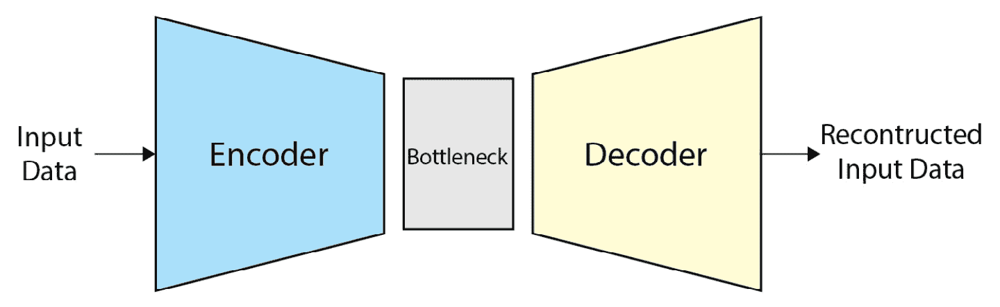
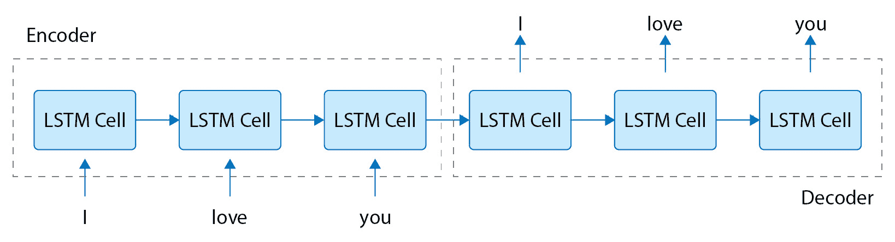
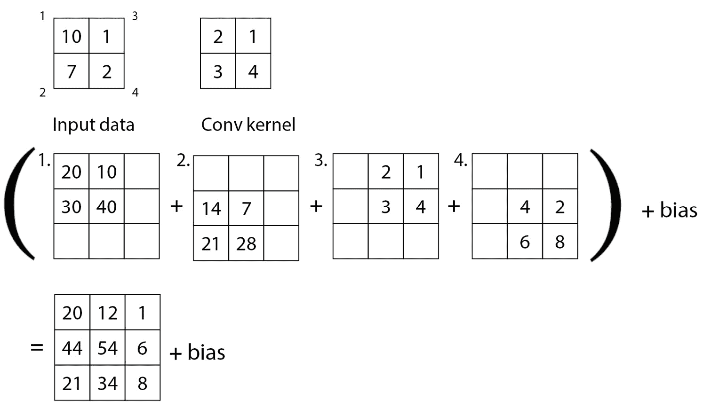
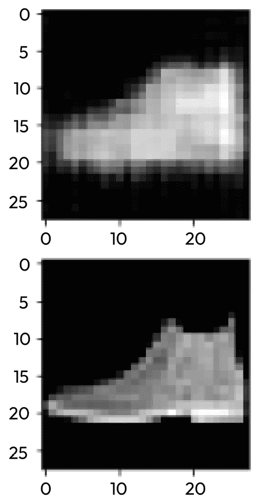

# 第五章：理解自编码器

自编码器是一种主要用于实现**表示学习**的模型类型。表示学习是一种深度学习任务，专注于生成紧凑且具代表性的特征来表示任何单个数据样本，无论是图像、文本、音频、视频还是多模态数据。经过某种形式的表示学习后，模型将能够将输入映射到更可表示的特征，这些特征可用于区分自身与其他样本输入。所获得的表示将存在于潜在空间中，不同的输入样本将共同存在。这些表示也称为**嵌入**。自编码器的应用将与表示学习应用紧密联系，一些应用包括为其他后续监督学习目标生成预测特征，比较和对比野外样本，以及执行有效的样本识别。

注意，自编码器并不是执行表示学习的唯一方式。表示学习的主题将在*第八章*，*探索监督深度学习*，以及*第九章*，*探索无监督深度学习*中进一步讨论。

现在，我们知道自编码器学习生成独特的表示或嵌入。但架构是什么样的？让我们先了解标准架构，然后再发现一些更有用的进展。

在本章中，将涵盖以下主题：

+   解码标准自编码器

+   探索自编码器变体

+   构建 CNN 自编码器

# 技术要求

本章包括一些在**Python**编程语言中的实际实现。要完成它，您需要安装以下库的计算机：

+   `pandas`

+   `Matplotlib`

+   `Seaborn`

+   `scikit-learn`

+   `NumPy`

+   `Keras`

+   `PyTorch`

代码文件可以在 GitHub 上找到：[`github.com/PacktPublishing/The-Deep-Learning-Architect-Handbook/tree/main/CHAPTER_5`](https://github.com/PacktPublishing/The-Deep-Learning-Architect-Handbook/tree/main/CHAPTER_5).

# 解码标准自编码器

自编码器更像是一个概念，而不是一个实际的神经网络架构。这是因为它们可以基于不同的基础神经网络层。处理图像时，您构建 CNN 自编码器；处理文本时，您可能希望构建 RNN 自编码器；处理包含图像、文本、音频、数字和分类数据的多模态数据集时，则使用不同层次的组合作为基础。自编码器主要基于三个组件，称为**编码器**、**瓶颈层**和**解码器**。这在*图 5**.1*中有所说明。



图 5.1 – 自编码器概念

标准自编码器的编码器通常接收高维数据，并将其压缩为比原始数据维度更小的任意尺度，这样就会生成所谓的**瓶颈表示**，瓶颈表示紧密联系着瓶颈部分，意味着它具有一个紧凑的表示，并不包含任何无用的信息。瓶颈部分随后会传递给解码器，解码器使用与编码器所用尺度完全相反的方式来扩展维度，最终生成与输入数据相同维度的输出数据。

注意

编码器和解码器结构并非仅限于自编码器，也被广泛应用于其他架构中，例如变换器（transformers）。

区别在于瓶颈部分，它承载着代表性特征。瓶颈通常被压缩为较小的维度，但有时也可以增大瓶颈的尺寸，以容纳更多具有预测能力的代表性特征。

自编码器通常是用来重建输入数据的。自编码器模型的训练过程涉及比较生成的输出数据与输入数据之间的距离。在优化过程中，模型能够生成接近输入数据的输出，当模型能够完全重建原始输入数据时，可以认为瓶颈部分比原始输入数据本身具有更加紧凑和概括性的表示。该紧凑的表示随后可以用来实现其他任务，例如样本识别，或者甚至可以通过存储较小的瓶颈特征来节省空间，而不是存储原始的庞大输入数据。编码器和解码器并不局限于单层结构，可以定义为多层结构。然而，标准自编码器只有一个单一的瓶颈特征，这也被称为**代码**，或**潜在特征**。

现在，让我们来探索自编码器的不同变种。

# 探索自编码器的变种

对于表格数据，网络结构可以非常简单。它仅使用一个包含多个全连接层的多层感知器（MLP），这些层逐渐减少编码器的特征数量，并使用多个全连接层逐渐增加解码器的输出数据，使其与输入数据的维度和大小相同。

对于时间序列或顺序数据，可以使用基于 RNN 的自编码器。关于基于 RNN 的自编码器，最常被引用的研究项目之一是使用基于 LSTM 的编码器和解码器的版本。该研究论文名为 *Sequence to Sequence Learning with Neural Networks*，作者为 Ilya Sutskever、Oriol Vinyals 和 Quoc V. Le（[`arxiv.org/abs/1409.3215`](https://arxiv.org/abs/1409.3215)）。该研究方法不是堆叠编码器 LSTM 和解码器 LSTM，而是将每个 LSTM 单元的隐藏状态输出序列垂直使用，解码器层按顺序继续编码器 LSTM 的顺序流，并以反向顺序输出重建的输入。还使用了额外的解码器 LSTM 层来并行优化，预测未来的序列。这个结构如 *图 5.2* 所示。需要注意的是，这种结构也可以通过使用原始的展平图像像素作为输入，适配到视频图像模态中。该架构也被称为 **seq2seq**。



图 5.2 – 基于 LSTM 的自编码器结构

编码器 LSTM 的隐藏状态输出可以被认为是 LSTM 自编码器的潜在特征。Transformers 是一种新型架构，也能处理顺序数据，后面将在本章介绍。它有一些变体也可以被视为一种自编码器——一些 transformers 可以是自编码器，但并非所有 transformers 都是自编码器。

对于图像数据，通过使用卷积层，我们可以通过多层卷积和池化层逐渐缩小特征，直到应用全局池化层并将数据转化为 1 维特征。这代表了自编码器的编码器生成瓶颈特征。这一工作流与我们在前一节中讨论的 CNN 相同。然而，对于解码器来说，为了将 1 维池化特征重新放大为 2 维的类似图像数据，需要一种特殊形式的卷积，称为 **反卷积**。

本节提到的变体都是关于使用标准的自编码器结构，但通过不同的神经网络类型来实现它们。还有两种额外的自编码器变体，其中一种变体基于数据输入的操作，另一种变体则是通过实际修改自编码器结构来实现数据生成目标。

对于用于数据处理的变体，其思想是在训练过程中向输入数据添加噪声，并保持原始输入数据不受噪声影响，作为目标用于预测性地重建数据。该自编码器的这种变体被称为**去噪自编码器**，因为其主要目标是*去噪*数据。由于目标已经从压缩数据转变为去噪数据，因此瓶颈特征不再限制于小尺寸。后续利用的特征不再仅仅局限于单一瓶颈特征，而是可以是网络中多个中间层的特征，或者简单地是去噪后的重建输出。该方法利用了神经网络执行自动特征工程的固有能力。去噪自编码器最著名的应用是在一个由葡萄牙保险公司 Porto Seguro 主办的基于表格数据的 Kaggle 竞赛中获得第一名的解决方案，在这个竞赛中，来自多个中间层的特征被输入到一个单独的多层感知机（MLP）中，以预测驾驶员未来是否会提出保险索赔（[`www.kaggle.com/competitions/porto-seguro-safe-driver-prediction/discussion/44629`](https://www.kaggle.com/competitions/porto-seguro-safe-driver-prediction/discussion/44629)）。

对于使用自编码器结构修改的变体，其思想是生成两个瓶颈特征向量，分别表示标准差值和均值列表，以便根据均值和标准差值对不同的瓶颈特征值进行采样。这些采样的瓶颈特征值可以传递到解码器中，生成新的随机数据输出。该自编码器的变体被称为**变分自编码器**。

现在我们已经对自编码器的变体有了一个较好的概述，接下来让我们深入研究 CNN 自编码器，并使用深度学习库构建一个 CNN 自编码器。

# 构建 CNN 自编码器

让我们先来了解一下什么是**转置卷积**。*图 5.3* 展示了一个在 2x2 大小输入上使用 2x2 大小卷积滤波器，步幅为 1 的转置卷积操作示例。



图 5.3 – 转置卷积滤波操作

在*图 5.3*中，注意每个 2x2 的输入数据都标有从`1`到`4`的数字。这些数字用于映射输出结果，输出结果呈现为 3x3 的形式。卷积核会以滑动窗口的方式将每个权重分别应用到输入数据中的每一个值，四次卷积操作的输出结果会在图的下方呈现。操作完成后，每个输出结果将逐元素相加，形成最终的输出并加上偏置。这个示例过程展示了如何将一个 2x2 的输入扩展到 3x3 的输出，而无需完全依赖填充。

让我们在下面实现一个卷积自编码器模型，并在`Fashion MNIST`图像数据集上进行训练。这个数据集包含了鞋子、包包、衣服等时尚商品的图像：

1.  让我们开始导入必要的库：

    ```py
    import torch.nn as nn
    import torchvision
    from PIL import Image
    ```

1.  接下来，我们将定义整个卷积自编码器的结构：

    ```py
    class ConvAutoencoder(nn.Module):
      def __init__(self):
        super(ConvAutoencoder, self).__init__()
        self.encoder = None
        self.decoder = None
      def forward(self, x):
        bottleneck_feature = self.encoder(x)
        reconstructed_x = self.decoder(
          bottleneck_feature
        )
        return reconstructed_x
    ```

    这里展示的代码是一个基于`PyTorch`的卷积自编码器结构，包含编码器和解码器的变量占位符。编码器负责接收一张图片并逐步减少其维度，直到只剩下一个具有小表示足迹的单维度——瓶颈特征。解码器接着会接收该瓶颈特征，并生成与原始输入图像大小相同的特征图。编码器和解码器将在接下来的两步中定义。

1.  编码器将被设计为接收一个 28x28 的灰度图像（单通道）。这个图像尺寸是 Fashion MNIST 数据集的默认大小。以下逻辑展示了定义编码器的代码，替换掉*步骤 2*中定义的占位符：

    ```py
    self.encoder = nn.Sequential(
          nn.Conv2d(1, 16, 4),
        nn.ReLU(),
        nn.MaxPool2d(2, 2),
        nn.Conv2d(16, 4, 4),
        nn.ReLU(),
        nn.AvgPool2d(9),
    )
    ```

    定义的编码器有两个卷积层，每个卷积层后面跟着非线性激活函数`ReLU`和一个池化层。卷积层的滤波器大小分别为`16`和`4`。第二个池化层是一个全局平均池化层，用于将 4x9x9 的特征图减少到 4x1x1，每个通道只有一个值来表示自己。这意味着编码器将压缩原始 28x28 图像的维度，原图的 784 个像素仅保留四个特征，压缩率高达 99.4%！

1.  解码器将接收每张图像的这四个特征，并再次生成 28x28 的输出特征图，重建原始的图像大小。整个模型没有应用填充。解码器将被如下定义，替换掉在*步骤 2*中定义的占位符解码器：

    ```py
    self.decoder = nn.Sequential(
      nn.ConvTranspose2d(4, 16, 5, stride=2),
      nn.ReLU(),
      nn.ConvTranspose2d(16, 4, 5, stride=2),
      nn.ReLU(),
      nn.ConvTranspose2d(4, 1, 4, stride=2),
      nn.Sigmoid(),
    )
    ```

    这里使用了三层卷积转置层。每个卷积层后面都有一个非线性激活层，前两层使用了`ReLU`（作为标准的非线性激活函数），最后一层使用了`sigmoid`。使用`sigmoid`是因为`fashion MNIST`数据集已经被归一化，使得其值介于`0`和`1`之间。这里定义的卷积转置层采用了与编码器类似的滤波器配置，从`16`个滤波器到`4`个，最终使用`1`个滤波器生成单通道灰度图像。

1.  现在我们已经定义了卷积自编码器，接下来让我们从`torchvision`库加载时尚 MNIST 数据集。本教程将使用`Catalyst`库来简化训练过程，因此我们将从`torchvision`中获取`fashion MNIST`数据集加载器和喂入器类，并对其进行修改，以便在`Catalyst`库中使用：

    ```py
    class FashionMNISTImageTarget(
      torchvision.datasets.FashionMNIST
    ):
      def __getitem__(self, index):
       img = self.data[index]
       img = Image.fromarray(
         img.numpy(), mode="L"
       )
       if self.transform is not None:
         img = self.transform(img)
       return img, img
    ```

    来自`torchvision`的类已经具备下载和加载`fashion MNIST`数据集的必要逻辑。然而，数据喂入方法`getitem`的格式不符合图像生成的预期格式，因此需要进行修改，以使本实验能够正常运行。

1.  请注意，`Pillow`库用于在*第 5 步*中加载图像。这是为了方便我们使用`torchvision`中的工具执行不同的转换步骤，例如图像增强。然而，在本实验中，我们将直接将`pillow`图像转换为`Pytorch`张量，使用如下的转换逻辑：

    ```py
    def transform_image(image):
        return torchvision.transforms.ToTensor()(image)
    ```

1.  现在，让我们加载`fashion MNIST`的训练和验证数据集：

    ```py
    train_fashion_mnist_data = FashionMNISTImageTarget(
      'fashion_mnist/', download=True, train=True,
      transform=transform_image,
    )
    valid_fashion_mnist_data = FashionMNISTImageTarget(
      'fashion_mnist/', download=True, train=False,
      transform=transform_image,
    )
    loaders = {
      "train": DataLoader(
        train_fashion_mnist_data, batch_size=32,
        shuffle=True
      ),
      "valid": DataLoader(
        valid_fashion_mnist_data, batch_size=32
      ),
    }
    ```

    上面的代码会将数据集下载到`fashion_mnist`文件夹中（如果该文件夹不存在）。此外，`loaders`变量也在这里定义，以便可以被`Catalyst`库使用。

1.  由于优化目标是减少重建像素值与目标像素值之间的差异，因此我们将在这里使用均方误差作为重建损失：

    ```py
    criterion = nn.MSELoss()
    ```

    需要注意的是，尽管重建损失是无监督表示学习中的常见目标，但根据具体的算法或方法，可能会使用其他的指标或目标。例如，在`Catalyst`中，我们可以用来训练我们的模型：

    ```py
    runner = dl.SupervisedRunner(
         input_key="features", output_key="scores", target_key="targets", loss_key="loss"
    )
    ```

1.  接下来，我们将定义一个通用的函数，使得通过代码执行多个训练和验证实验变得更加简单：

    ```py
    def train_and_evaluate_mlp(
      trial_number, net, epochs,
      load_on_stage_start=False, best_or_last='last',
      verbose=False
    ):
      model = net
      optimizer = optim.Adam(
        model.parameters(), lr=0.02
      )
      checkpoint_logdir = "logs/trial_{}_autoencoder".format(
    trial_number)
      runner.train(
        model=model,
        criterion=criterion,
        optimizer=optimizer,
        loaders=loaders,
        num_epochs=epochs,
        callbacks=[
                dl.CheckpointCallback(
                    logdir=checkpoint_logdir,
                    loader_key="valid",
                    metric_key="loss",
                    load_on_stage_end='best',
                )
        ],
        logdir="./logs",
        valid_loader="valid",
        valid_metric="loss",
        minimize_valid_metric=True,
        verbose=verbose,
      )
      with open(
        os.path.join(checkpoint_logdir, '_metrics.json'),
        'r'
      ) as f:
        metrics = json.load(f)
        if best_or_last == 'last':
          valid_loss = metrics['last']['_score_']
        else:
          valid_loss = metrics['best']['valid']['loss']
      return valid_loss
    ```

    这些只是基本的训练和评估模板代码，没有应用任何技巧。我们将在*第八章*中深入探讨训练监督模型的技巧，*探索监督学习* *深度学习*。

1.  现在，我们准备通过以下逻辑来训练和评估 CNN 自编码器模型：

    ```py
    cnn_autoencoder = ConvAutoencoder()
    best_valid_loss = train_and_evaluate_mlp(
        0, cnn_autoencoder, 20, load_on_stage_start=False, best_or_last='last', verbose=True
    )
    ```

    基于验证损失，表现最好的`cnn_autoencoder`权重将在训练完成 20 个 epoch 后自动加载。

1.  使用提供的训练代码训练前述模型后，在 Fashion MNIST 数据集（图像尺寸为 1x28x28）上，您应该会得到类似于 *图 5.4* 中所示的示例输入/输出对，通过以下代码：

    ```py
    input_image = valid_fashion_mnist_data[0][0].numpy()
    predicted_image = cnn_autoencoder(
      torch.unsqueeze(valid_fashion_mnist_data[0][0], 0)
    )
    predicted_image = predicted_image.detach().numpy(
    ).squeeze(0).squeeze(0)
    f, axarr = plt.subplots(2,1,  figsize=(5, 5))
    axarr[0].imshow(predicted_image, cmap='gray')
    axarr[1].imshow(input_image.squeeze(0), cmap='gray')
    ```



图 5.4 – Autoencoder 在 Fashion MNIST 数据集上的示例结果；底部表示原始图像，顶部表示重建图像

从结果来看，可以清楚地看出瓶颈特征能够相对完整地重建整个图像，它们可以作为更具代表性和紧凑的特征，代替原始输入数据使用。将瓶颈特征的表示值从 4 增加到大约 10 个特征，也应该能提高重建图像的质量。欢迎尝试并实验不同的参数！

# 总结

Autoencoder 被认为是实现跨数据模态表示学习的基本方法。可以将其架构视为一个框架，您可以在其中嵌入多种神经网络组件，从而允许您处理不同模态的数据或利用更先进的神经网络组件。

但是，请注意，它们并不是唯一的学习表示特征的方法。Autoencoder 还有许多应用，主要围绕不同的训练目标，使用相同的架构。在本章中简要介绍的两个变体是去噪自编码器和变分自编码器，它们将在 *第九章*《探索无监督深度学习》中得到详细介绍。现在，让我们再次转变思路，探索 Transformer 模型系列！
