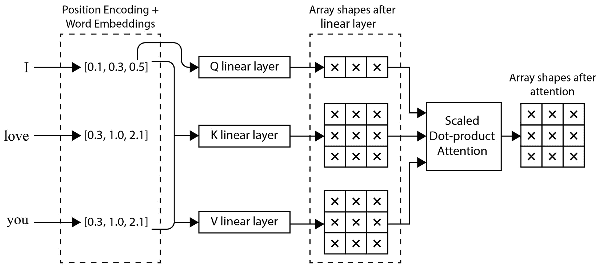

# 第六章：理解神经网络 Transformer

不要与同名的电气设备混淆，神经网络中的 Transformer 是多才多艺的 NN 变体。Transformer 能够处理并捕捉来自任何模态的数据模式，包括顺序数据如文本数据和时间序列数据、图像数据、音频数据和视频数据。

Transformer 架构于 2017 年提出，目的是取代基于 RNN 的序列到序列架构，主要聚焦于机器翻译任务，即将文本数据从一种语言转换为另一种语言。其表现优于基准的 RNN 模型，证明了我们不需要像 RNN 那样依赖数据的顺序性质（内在归纳偏置）。此后，Transformer 成为了神经网络架构家族的根基，并衍生出能够捕捉其他数据模态模式的模型变体，同时持续提升原始文本序列数据任务的性能。这表明，我们实际上不需要在模型中内置与数据模态相关的归纳偏置，而是可以让模型*学习*这些内在的结构和模式。你有顺序数据，比如视频、文本或音频吗？让神经网络学习它的顺序特性。你有图像数据吗？让神经网络学习像素之间的空间和深度关系。你大概明白了。

在我们深入探讨 Transformer 之前，先休息一下，看看本章将涵盖的主题：

+   探索神经网络中的 Transformer

+   全面解码原始 Transformer 架构

+   仅使用编码器来发现 Transformer 的改进

+   仅使用解码器来发现 Transformer 的改进

# 探索神经网络中的 Transformer

*图 6.1* 提供了 Transformer 所带来的影响概述，感谢各种 Transformer 模型变体的涌现。

图 6.1 – Transformer 的不同模态和模型分支

变压器本身的架构并没有内在的归纳偏差。归纳偏差是指学习算法对数据做出的预假设。此偏差可以在模型架构或学习过程中构建，并有助于引导模型学习数据中的特定模式或结构。传统模型，如 RNN，通过其设计引入归纳偏差，例如假设数据具有顺序结构，且元素的顺序很重要。另一个例子是 CNN 模型，这些模型专门为处理网格状数据（如图像）设计，通过使用卷积层和池化层来引入归纳偏差，表现为局部连接性和位移不变性。在这种情况下，模型架构本身对能够学习的模式施加了某些约束。

变压器的设计理念是，我们应该允许模型根据提供的所有输入数据决定如何以及在哪里聚焦。这一过程通过多个机制的汇聚来技术性地执行，每个机制以不同的方式决定关注的焦点。因此，变压器完全依赖输入数据提供的信息来确定数据是否具有任何形式的归纳偏差（如果有的话）。这些聚焦组件正式被称为注意力层（attention layers）。在变压器之上进行的改进，形成了你在*图 6.1*中看到的分支，它们在结构上并没有偏离变压器的基础结构。通常，添加不同模态的改进是通过数据设置变体来完成的，以使输入数据结构适应变压器的结构，并根据目标任务应用的变化调整不同的预测输出细节。

目前，变压器（transformers）是具有最大学习和识别能力的架构家族，能够识别现实世界中存在的高度复杂的模式。除此之外，从 2022 年中到 2023 年近一年的时间里，变压器展示了其信息处理能力仅受硬件资源能力的限制。目前，最大的变压器模型之一是 Google 提供的**PaLM**，它比基础变压器扩展了许多倍，具有天文数字般的*5400 亿*参数。此外，坊间传闻，OpenAI 的 GPT-4 多模态文本生成模型（目前作为服务提供而非开源模型）包含多个模型或单个模型，其参数总和超过一万亿。这些庞大的模型通常需要数月的训练才能实现最佳性能，并且需要高性能的、最先进的 GPU。

你可能会好奇，为什么我们要训练这样一个庞大的模型，并且会怀疑它所提供的价值是否值得。让我们评估一下其中一个 Transformer 模型——**GPT-3**，这是由 OpenAI 开发的。GPT-3 是一种语言模型，它接收输入文本并基于它认为最合适、最有用的响应生成文本预测。这个模型涉及许多 NLP 领域的任务，这些任务传统上需要为每个任务使用不同的模型来完成，这使得它成为一个**任务无关模型**。它能够完成的任务包括机器翻译、阅读理解、推理、算术处理等，并且在展示广泛的语言理解能力方面表现出色，根据查询输入的文本格式提供不同的结果。例如，终端用户的应用包括生成能实现所描述目标的任何指定语言的代码，撰写具有指定主题的小说，获取关于任何公众人物的任何请求信息，总结客户反馈，通常或聚焦于特定话题，如“客户的烦恼是什么”，以及为虚拟世界中的角色对话增加现实感。迄今为止，GPT-3 已被应用于 300 多个领域和行业，虽然这个数字看似不大，但它为更多的创新和神经网络的广泛应用铺平了道路。

Transformer 经过多年的渐进式改进和严谨研究，虽然不断演化，但并未偏离太多原始架构。这意味着，理解原始架构对于理解所有最新和最强大的改进版 Transformer（如 GPT-3）至关重要。基于此，我们来深入了解 2017 年的原始 Transformer 架构，并讨论过去五年中研究带来的哪些组件发生了变化或适应，催生了新的模型架构。

# 全面解读原始的 Transformer 架构

在我们深入探讨模型结构之前，先来谈谈 Transformer 的基本目的。

正如我们在上一章中提到的，Transformer 也是一种架构族，利用了编码器和解码器的概念。编码器将数据编码成所谓的代码，解码器则将代码解码成类似于原始未处理数据的格式。最初的 Transformer 同时使用了编码器和解码器的概念来构建整个架构，并展示了其在文本生成中的应用。随后的适应和改进则要么仅使用编码器，要么仅使用解码器来完成不同的任务。然而，在 Transformer 中，编码器的目标并不是压缩数据以实现数据的更小、更紧凑的表示，而是主要作为特征提取器。此外，Transformer 中解码器的目标并不是重新生成相同的输入。

注意

可以使用 Transformer 组件构建一个实际的自动编码器结构，而不是使用 CNN 或 RNN 组件，但本书中将不涉及这一部分内容。

原始的 Transformer 将编码器和解码器中的数据/权重维度固定为统一的单一大小，从而能够进行残差连接，使用的维度为 512。

Transformer 还利用逻辑块结构来定义其创新之处，这使得你可以轻松扩展其规模。Transformer 的核心操作是识别输入数据样本中每个数据单元应关注整个输入数据的哪一部分。这种聚焦机制是通过一种叫做**注意力层**的神经网络层来实现的。关于注意力机制的许多变种在本书中将不会涉及。

Transformer 使用了最简单的注意力变种，该变种使用 `softmax` 激活函数来实现，`softmax` 强制所有值的和为 `1.0`，通常每层会有一个最强的焦点。可以将其视为类似于 RNN 中的门控机制，具体细节可以参考 *第四章*，*理解循环神经网络*，以获得关于 RNN 的完整背景和它的工作原理。Transformer 使用多个注意力层，在这些层中，每个输入将以多种方式进行聚焦，而为了简化引用和扩展，这些层被统称为 **多头** **注意力** 层。

变压器的输入和输出是以标记（tokens）的形式存在的。标记是指代可以传递进出变压器的输入数据的单个单位。尽管变压器的结构并没有明确设计以适应这些假设，这些标记可以是顺序的或非顺序的，分组的或非分组的。通过自变压器提出以来的研究和进展，文本的标记可以是词语或子词，图像的标记可以是图像块，音频的标记可以是音频数据的顺序时间窗口，例如，一秒钟的时间窗口，视频的标记可以是单个图像帧或一组图像帧。由于模型本身没有对任何数据模态类型的内在归纳偏见，因此数据的位置信息或顺序信息是通过标记显式地编码到数据中的。这些可以从增量的离散整数位置（1, 2, 3 …）到介于离散整数值之间的连续浮动位置（1.2, 1.4556, 2.42325 …），从绝对位置到相对位置，最后，每个标记或嵌入的单一值位置可以是可学习的。原始的变压器使用了一种映射函数，将绝对整数位置映射到考虑标记数据维度和预定统一数据维度大小的相对浮动位置，但现今最先进的模型通常采用可学习的嵌入。嵌入是一个查找表，用于将任何离散的类别数据编码为原始类别的更高维度和更复杂的表示，可以准确地区分不同的类别。请注意，实际的输入数据标记本身通常也会根据输入数据（图像帧或块通常不使用嵌入，因为它们已经具有较高的维度，但文本标记是类别性的，因此会使用嵌入）应用嵌入。

*图 6.2*展示了架构的高级概览：

图 6.2 – 通过输入和输出的可视化查看变压器，其中包括用于将英语句子翻译成普通话对应句子的编码器和解码器任务

编码器和解码器结构有些相似，唯一的区别是解码器多了一个中间的`softmax`激活函数。

注

解码器还会接收除编码器输出之外的其他数据。

为了在输出数量没有约束的情况下实现数据生成，转换器被设计成一个自回归模型。自回归模型使用第一次预测的结果作为第二次预测的输入，并随后用作接下来的预测输入。下图展示了这个预测过程的一个示例，使用基于文本的数据，旨在实现从英语到普通话的机器翻译。

图 6.3 – 转换器的自回归工作流

转换器的每次前向传递都会预测一个单一的输出。在转换器输出时，预测的句末标记会被加入，表示预测完成。然而，在训练过程中，不需要执行这个自回归循环；相反，会在随机位置生成掩码，屏蔽所有目标标记之后的未来标记，以防止模型直接复制单个目标标记并获取未来标记的信息。简单来说，掩码机制在预测或推理阶段不会被使用。

除了实际的注意力机制外，多头注意力层还有一些其他关键操作。*图 6.4* 显示了解开后的多头注意力层，以及之前提到的在缩放点积注意力层中的注意力机制。

图 6.4 – 使用缩放点积注意力结构的多头注意力层

将多个注意力层视为多个不同的聚焦模式在人类对相同数据的贡献。`softmax`来自聚焦在不重要的区域。注意力机制旨在找出每个标记与整个输入标记集合的相关程度，换句话说，就是找出哪些标记与哪些标记进行了交互，并弄清楚它们之间的依赖关系。回想一下，模型的维度必须在整个架构中保持固定大小，以确保值可以在不需要额外处理的情况下相加。由于多个注意力头的输出将被连接而不是相加，因此线性层的维度必须在各个头之间均匀分配。例如，使用 8 个头和 512 的数据/权重维度，每个头的查询、键和值的线性层维度将是 512/8=64 个神经元。*图 6.5* 显示了输出及其形状的一个简单示例，工作流中每个标记的固定数据/权重维度为 3，使用与*图 6.4*相同的输入文本数据。

图 6.5 – 在上下文“I love you”中，使用词语“I”的查询与输出维度为 3 的线性层连接之前的多头注意力部分操作

对于其他两个查询词“love”和“you”，也会执行相同的操作。单个头部的操作以一种方式关注输入数据，而其他头部则以不同的方式关注输入数据。在编码器-解码器层中，查询来自解码器层，而键和值来自编码器层。这使得解码器能够选择在给定的输入文本中集中注意力的位置，以生成下一个输出。*图 6.6*展示了一个很好的方式来思考多头注意力的输出，其中四个头的多头注意力关注文本的不同部分。

图 6.6 – 带有四个头的多头注意力示例输出

Transformer 中的正则化机制与其他先前的架构（如 CNN、RNN 和 MLP）中描述的目的一致，这部分内容在这里不再赘述。这总结了 Transformer 的所有组件。这个基础架构使我们能够比旧的架构（如序列到序列或自编码器）获得更好的数据生成结果。尽管原始架构主要关注文本数据的应用，但该概念已被改编并适用于处理其他类型的数据模态，如图像、视频和音频数据。回想一下，原始模型之后的改进和适应仅使用了编码器或仅使用了解码器。在接下来的两个主题中，我们将分别深入探讨这两个不同的概念。

# 揭示仅使用编码器的 Transformer 改进

我们将讨论的第一类基于变压器的架构进展是仅使用原始变压器的编码器部分并使用相同多头注意力层的变压器。采用仅编码器的变压器线通常是因为没有使用掩蔽的多头注意力层，因为不使用下一标记预测训练设置。在这类改进中，训练目标和设置会根据不同的数据模态有所变化，并且在相同数据模态下的序列改进也会略有不同。然而，有一个概念在不同数据模态中保持相对恒定，那就是使用半监督学习方法。在变压器的情况下，这意味着首先执行一种无监督学习方法，然后再执行直接的监督学习方法。无监督学习为变压器提供了一种基于对数据特性更广泛理解来初始化其状态的方式。这一过程也被称为**预训练**模型，这只是一种无监督学习的形式。无监督学习将在*第八章*中进行更为详细的讨论，*探索无监督* *深度学习*。

一些改进是针对数据模态的特性进行的，主要包括文本特定的改进，并涉及优化任务类型的变化。其他改进则是通用的变压器架构改进，可以推广到不同的数据模态。我们将从专注于通用架构改进开始，然后再深入讨论专门为文本量身定制的改进，这些改进可能适用于其他数据模态，也可能不适用。首先，我们将介绍一种仅包含编码器结构的基础架构，称为 BERT。

`softmax`层。这个特定任务已被证明是作为预训练方法非常有效，它允许下游后续的监督任务获得更好的表现。由于标记在原始序列中的不同位置被掩蔽，因此该架构被称为双向的，因为除了过去的标记外，未来的标记也可以被注意并预测过去的标记。例如，15%的标记被掩蔽，其中 10%被随机替换为随机标记，充当噪声，这使得模型类似于去噪自编码器，并使其对噪声具有鲁棒性。标准的自回归结构通常是单向的，无法利用未来的标记。BERT 还引入了一种方法，通过单个输入表示编码多个句子。这是通过添加一个特殊的分隔符标记来实现的，该标记具有自己的学习嵌入，用于表示文本之间的分隔，以及一个额外的段落嵌入，标识该标记属于哪个句子。这还允许进行另一项任务——`softmax`。这三种嵌入（位置嵌入、段落嵌入和标记嵌入）在传递给 Transformer 之前被加在一起。*图 6.7*展示了这一架构。

图 6.7 – BERT 架构

该架构专注于表示额外输入的方式，并通过多任务学习增强模型对数据模态性质的理解，超越了之前在多个下游文本任务上的表现。

现在我们已经介绍了基础的仅编码器模型，准备探索针对仅编码器 Transformer 的不同类别的进展。此次改进将按进展类别进行探索，而非按模型分类，因为不同的模型结合了许多改进，比较实际的进展会变得困难。三种进展类型如下：

+   改进基于数据模态的预训练任务

+   在紧凑性、速度和效率方面的架构改进

+   核心/功能性架构改进

我们将跳过基于数据的改进细节，例如使用多语种数据构建多语种 BERT，或使用基于子词的标记来减少词汇量并增加词汇复用性的问题。

## 改进仅编码器的预训练任务和目标

回想一下，MLM 和 NSP 是基础 BERT 模型中使用的任务，其中 MLM 被提到是一个有助于理解文本语言的强大任务，但它可以很容易地适应来自其他数据模态的 token。相比之下，NSP 已被证明不稳定，并且并非在所有情况下都能切实帮助模型提升性能。一个改进方向是使用**句子顺序预测**（**SOP**）。与仅仅使用同一文档中正向连续句子的倒序作为负句相比，SOP 在提升下游监督任务性能方面展现了更高的一致性。从概念上讲，它学习句子之间的衔接性，而不是同时预测两句话是否来自同一主题。这一方法是在 2020 年的**ALBERT**模型中引入的，该模型主要关注于 Transformer 的效率。

另一个值得注意的改进是**替代 token 检测**（**RTD**）。RTD 来自**ELECTRA**模型，它预测一个 token 是否被随机 token 替代，并且要求学习所有 token 位置的信息，这与 MLM 只从掩码 token 位置进行学习的过程不同。这是对 MLM 目标的改进。

接下来，我们将深入探讨在架构紧凑性、速度和效率方面的改进。

## 提升仅编码器 Transformer 的架构紧凑性和效率

Transformer 已经证明它们具备极大的结构能力，能够接收随模型增长的信息。一些关于 Transformer 的研究集中在将 Transformer 模型扩展到数百亿参数的规模，无论是在仅解码器还是仅编码器模型中。使用这些庞大模型所取得的成果令人惊叹，但由于需要使用最先进的 GPU 和机器，这些机器并不是大多数人都能轻松获得或负担得起的，因此这些模型不适合实际使用。这时，架构紧凑性和效率的改进可以帮助平衡这一差距。由于我们大多数人受限于可用的硬件资源，如果模型能在保持相同性能的前提下，在架构上有效缩小尺寸，这将使得在将模型扩展到硬件资源极限时，能够提供更高的性能。

该领域的另一项显著进展再次来自 ALBERT 模型，这是一种轻量级 BERT 模型。其主要改进在于以卷积层被分解的方式分解了嵌入层，从而实现深度卷积。使用较小的嵌入维度，并通过一个全连接层将较小维度的嵌入映射到所需的相同维度。由于嵌入是必需的权重，并且对参数的数量有贡献，分解嵌入层使得变换器模型的参数数量更少，从而使得 BERT 在较少参数的情况下具有更好的性能。需要注意的是，一些改进增加了模型并行性并使用了巧妙的内存管理，但这些内容在此不作详细讨论。不过，由于有一些方法能在推理和训练阶段加速模型，因此这些内容将在*第十五章*《在生产中部署深度学习模型》中讨论，该章专门讲解部署。

## 改进仅编码器变换器的核心功能架构

该领域最显著的进展来自于 2021 年推出的**解码增强 BERT 与解耦注意力**（**DeBERTa**）模型，它被认为是当前架构的 SOTA。其主要思路是使用两个独立的位置编码嵌入，分别是相对位置和绝对位置。然而，这些位置嵌入并不是与输入令牌嵌入一起相加的，而是作为独立的查询和键被输入到变换器的层中，并拥有自己的全连接层。这使得可以获得三种显式的注意力图，具体包括内容到位置的注意力、内容到内容的注意力和位置到内容的注意力。然后，这些不同的注意力图会被加总在一起。相对位置特别用于每个中间多头注意力层的内部缩放点积注意力层，作为键或查询，取决于它是被内容关注还是关注内容。

这允许在每一层注意力机制中显式地考虑原始相对位置的关系，而不是在经过多层后可能被遗忘。我们本质上是在为相对位置数据应用一种跳跃连接的形式。相对编码使得模型能够通过概念上允许在每个相对位置上重用模式标识符，从而学习到更具泛化性的表示。这种解决方案类似于如何在单幅图像的不同分区使用相同的卷积滤波器，而不是在整个图像上使用一个全连接层，这样做无法跨整个输入空间重用模式标识符。至于绝对位置的使用，它仅仅是由于文本数据的特性需要绝对位置，以便区分不同事物的绝对重要性，例如警察比大多数人拥有更多的权力，卡车比摩托车大。然而，绝对位置仅在最后几层中添加一次，使用一种叫做**增强掩码解码器**（**EMD**）的机制。EMD 将绝对位置嵌入作为缩放点积注意力的查询组件。没有明确的理由说明为什么只在最后几层应用，实际上它可能可以扩展到每一层。

分桶

使用分桶机制将多个位置组合成一个数字，以减少嵌入的数量，从而减少参数数量。可以将其视为分组位置信息，再次增加了模型的紧凑性。

## 揭示仅编码器变换器如何适应其他数据模态

变换器能够处理其他数据模态。首先，输入数据只需要以序列格式结构化。之后，由于预训练是变换器的核心，需要为仅编码器变换器制定合适的任务目标，以实现一个能够捕捉特定数据模态理解的预训练状态。尽管使用文本引入变换器时，重点放在无监督预训练方法上，但它实际上可以是监督、无监督或半监督的，关键在于将模型的权重设置为一个状态，以便后续的监督下游任务能够加以利用。

对于图像，**Vision Transformer**（**ViT**）于 2021 年推出，形成了基于图像的变压器的基础，并证明了与卷积基础模型相比，变压器在图像任务中能实现竞争性的性能。变压器处理图像时最棘手的问题之一是图像的体积庞大，处理整个大输入空间会迅速膨胀变压器模型的大小。ViT 通过将图像拆分为系统的补丁来解决这个问题，每个补丁随后会输入到一个单一的全连接层中，从而大幅度减少每个图像补丁的维度。维度已减少的补丁数据将作为变压器的令牌嵌入。补丁转换是将图像输入以变压器可以处理的格式表示的关键过程。此外，这种基于补丁的机制引入了一些形式的图像领域归纳偏差，但架构的其余部分几乎不受图像数据归纳偏差的影响。由于变压器几乎总是与预训练方法结合使用以提高性能，ViT 采用了类似于 CNN 模型系列的预训练方式，使用监督分类预训练。

对于音频，**wav2vec 2.0**于 2020 年创建，采用了与其前身**wav2vec**相似的概念，但不同的是它在架构中采用了仅解码器的变压器。简要概述是，wav2vec 2.0 首先使用一维卷积将特定时间窗口长度的音频编码为一个较低维度的空间，作为特征向量。每个窗口的编码特征向量随后会被输入到解码器变压器中并作为令牌。这里应用了无监督预训练方法，类似于 BERT 中的 MLM，其中输入的编码特征向量的某些部分被屏蔽，任务是预测被屏蔽的编码特征向量。预训练后，模型将在下游任务中进行微调，通常在变压器输出之后接一个线性层，用于语音识别等任务。wav2vec 2.0 在下游语音识别数据集上实现了新的 SOTA，并证明了音频与变压器的兼容性极好。

**VideoBERT**，由 Google 在 2019 年创建，不仅展示了如何为 transformer 模型建模视频数据的方法，还展示了 transformer 模型以多模态方式同时学习视频和文本的联合表示的能力。需要注意的是，视频本身就是一种多模态数据，因为视频数据包含多个图像帧以及音频数据组件。在 VideoBERT 中，使用带有明确起始和结束时间戳注释的烹饪视频句对数据集来对模型进行预训练。该模型通过将一预设数量的帧通过预训练的 3D 卷积模型编码成特征向量并将其视为 token 来处理图像帧序列。这些编码后的视频 token 随后与文本数据配对，并使用类似于 MLM 的目标来预测视频和文本 token 的掩码 token。该模型可以作为视频和文本相关数据的特征提取器，或者通过在 transformer 模型输出上增加一个线性层进行微调。

不同数据模态的前述总结旨在提醒我们，transformer 不仅可以应用于文本数据，还能应用于更多的数据模态，而不是作为这些模态当前技术状态的介绍。这里的一个关键点是，不同的数据模态需要被排列成具有降维的 token 格式序列，并且需要为仅编码器的 transformers 制定合适的任务目标，以便其达到能够捕捉数据模态主要特征的预训练状态。此外，BERT 的预训练方法可以轻松适配到其他数据模态。因此，与其称之为“masked language modeling”，不如称之为“masked token modeling”。接下来，让我们揭示仅使用解码器的 transformer 改进。

# 使用仅解码器的 transformer 改进

回想一下，transformer 的解码器模块专注于自回归结构。对于仅解码器的 transformer 模型，预测 token 的自回归任务保持不变。随着编码器的移除，架构必须调整其输入，以接受多个句子，类似于 BERT 的做法。开始、结束和分隔符 token 被用来顺序编码输入数据。在预测过程中，依然会进行掩码操作，以防止模型依赖当前 token 来预测未来的输入数据 token，这与原始 transformer 及位置嵌入相似。

## 深入了解 GPT 模型家族

所有这些架构概念都是由 GPT 模型在 2018 年提出的，GPT 是**生成预训练**（Generative Pre-training）的缩写。顾名思义，GPT 也采用了无监督预训练作为初始阶段，随后进入监督微调阶段以应对下游任务。GPT 主要关注文本数据，但相同的概念也可以应用于其他数据模态。GPT 使用基础的语言建模任务进行预训练，通过给定前面的标记作为上下文，在一个固定的窗口中预测下一个标记，从而限制输入的上下文标记数量。在预训练权重后，模型会根据任何监督任务类型的目标进行微调。GPT-1 在语言建模任务目标的辅助作用下，与主要的监督任务一起使用，试图提升下游任务的表现，并且证明它只在较大的数据集上能提高表现。此外，模型首次展示了将语言建模作为预训练任务应用于其他任务的泛化能力，即使不进行微调，仍能取得良好的成绩。这种行为被称为**零-shot**，将在*第九章*，《探索无监督深度学习》中详细讨论。该模型在 7,000 本未公开的书籍上进行了预训练，具有 1.17 亿个参数和 12 个重复的解码器块。

需要明确的是，GPT 模型能够在不进行微调的情况下执行任务（少样本或零样本学习）并不意味着微调在特定领域任务中的好处可以被忽略。尽管 GPT 系列模型在各种任务中展示了令人印象深刻的能力，但对于特定应用，微调仍然可能具有优势，从而提升性能并更好地适应给定任务的独特需求。

进入下一个进展，GPT-2 在架构上没有进行实质性的变化，其主要思想是强调零-shot 学习的能力，并通过任务条件化的概念，将 GPT-1 模型在层数、嵌入维度、上下文窗口大小和词汇量上扩大了 10 倍。任务条件化的概念是指你告诉模型应该生成什么样的输出，而不是仅仅依赖于训练任务类型所决定的固定、单一的已知预测输出。为了实现类似人类的真正灵活性，它们并没有添加新的架构来适应任务条件化的思想，而是决定直接将变换器的文本输入用作任务条件化的方法。例如，像“我爱你 = ，我爱深度学习=”这样的自由形式文本输入自然引导变换器执行从英语到普通话的翻译。也可以通过另一种方式来指定任务和上下文，例如“(翻译成普通话)，我爱深度学习 =”。GPT-2 通过在各种文本领域（如新闻文章、小说、维基百科和博客）上进行语言建模目标的预训练，实现了这一点，基本上使用了比 GPT-1 训练数据集更大的数据集。这项工作展示了真正的 AI 泛化潜力，尽管目前只使用了文本和图像数据。对于图像数据，这是通过一个名为**DALL-E**的模型来实现的，该模型能够根据提供的输入文本生成图像。

最后，GPT-3 模型在 2020 年推出。它类似于之前的进展，主要变化是增加了模型各个组件的规模，并且通过不同的方式来规定任务条件，以适应不同类型的文本示例。我们这里不会深入讨论这一点。尽管 GPT-2 在零-shot 设置中表现良好，且不需要对下游任务进行微调，但只有通过微调，该模型才能在多个文本语言数据集上超越以前的基准。GPT-3 的庞大规模彻底消除了微调的需求，在没有任何微调的情况下超越了之前的基准。然而，该模型需要专门的机器进行训练，个人或小型组织难以直接使用。目前，它是 OpenAI API 服务的一部分。GPT-3 展示了在许多不同任务中的广泛适用性，无需任何微调，其中一些最引人注目的应用包括为任何编程语言生成代码、讲故事和制作非常逼真的聊天机器人。这三项改进推动了许多基于语言任务的数据集的性能限制，使其达到更高水平，并且作为机器学习普适性组件的一个例子，展示了 transformers 的巨大学习潜力，只受到硬件资源的限制。

接下来，我们将讨论一种略有不同的解码器模型，值得一提的是 **XLNet** 模型。

## 深入了解 XLNet 模型

如果你和你的朋友被给出提示“_ _ 是一座城市”，你们两个会分别预测填入空白的是“纽约”吗？这是编码器-仅 transformers 的 MLM 目标的一个缺陷，因为它们通过一次预测多个标记来学习。然而，标准的自回归模型由于其自回归的特性，只预测未来并且一次只预测一个标记，因此不会受到这个问题的影响。编码器-仅 transformers 具有双向序列支持，这有助于提高性能。XLNet 主要基于这样一个思想：使自回归模型以双向方式关注数据，就像编码器-仅模型一样，同时保持自回归模型预测单一输出的优势。

XLNet 通过在 MLM 预训练期间调节解码器单独的变换器来实现双赢。其思路是通过使用掩蔽机制，预训练模型在所有标记序列顺序的排列上进行训练。标准自回归模型在预训练时按“1-2-3-4”的顺序使用来预测第五个标记，但在 XLNet 中，可以将顺序改为“3-4-1-5”来预测第二个标记。XLNet 还引入了另一个额外的查询线性层隐藏状态，并添加了一个额外的单一固定可学习嵌入，将与每个标记嵌入一起穿过注意力层，作为与原始基于标记的内容流一起的额外流路径。这个额外路径被称为查询流。整个过程称为掩蔽的双流注意力层，如*图 6.8*所示。

图 6.8 – XLNet 工作流

内容基于流的前向传播机制对于序列排序中的任意位置具有能够关注其自身位置和之前位置的内容的能力，而基于查询的流对于序列排序中的任意位置仅具有关注其之前位置内容的能力。*图 6.8* (*`a`*) 显示了在模型中实际位置 1 的内容流的注意力操作如何能够关注其他位置的所有标记，因为“3-2-4-1”排序方式将位置 1 排列为最后一个标记。*图 6.8* (*`b`*) 显示了如何通过位置 1 的标记内容来更新额外的查询流路径数据（表示为*`g`*），并且*`g`*组件作为查询来获取下一个*`g`*作为注意力层的输出。如果模型的第四个位置需要更新，内容流中将仅关注第二和第三个位置的内容，因为根据排列后的序列顺序，第一个位置是未来的标记。基于此概念动态应用掩蔽机制，以防止每个位置的*`h`*和*`g`*在定义之前关注排列序列中的内容位置。注意，*图 6.8* (*`c`*) 中的*`w`*组件表示共享于所有位置的单一权重嵌入，适用于查询流。在预训练过程中，查询流作为最终分类输出路径，适用于 MLM 目标，其中最终的*`h`*组件会被忽略。然而，在传递到微调阶段时，查询流组件和基于查询的线性层隐藏状态会被丢弃或完全忽略。

通过在预训练期间利用单词预测的语言建模目标，同时使数据的双向上下文得以实现的创新方法，提升了下游监督学习任务的性能。

## 讨论解码器单独的变换器模型的其他进展

自 GPT 问世以来，基础的解码器架构没有发生任何具有重大影响的变化。大多数工作集中在以下三个方面：

+   将 transformer 应用于不同的任务类型

+   将模型规模扩大到数千亿个参数

+   专注于工程解决方案，以使得一个巨大的模型可以在现有的硬件资源上进行训练

其中一个最著名的工作是利用解码器 transformer 处理其他任务类型的 DALL-E 模型，由 OpenAI 团队开发。在 DALL-E 的第一版和第二版中，transformers 被用来自回归地预测一个紧凑的图像嵌入，给定文本输入和一些其他特定于实现的输入。这些图像嵌入随后通过其他机制转换成实际的图像嵌入。

对于模型扩展，GPT-3 展示了随着模型容量的增加，性能也可以得到提升。首先提到的是**Megatron**，该模型通过工程策略使 transformer 架构更加高效，实现了并行化，并且能够使用 512 个 GPU 进行训练，使其比 GPT-2 大了 5.6 倍。GPT-3 超越了 Megatron，但另一个名为**BLOOM**的模型使用 Megatron 作为基础，将其扩展到 176B，匹配了 GPT-3 的 175B 模型规模。最值得注意的并不是它比 GPT-3 更大，而是 BLOOM 开创了一个新范式——开源，这意味着研究人员和机构的集体工作和贡献也可以在大规模上训练出高效且具有优异表现的模型。过去，这些庞大的模型一直是大型企业独占的，因为它们需要极其庞大的硬件资源。除此之外，另一个在 2022 年发布的模型**PaLM**将 GPT 的规模扩展到了 5400 亿个参数，超过了其他所有较小的 GPT 变体模型的性能。**PaLM 2**通过在多个任务上提供增强的性能，超越了其前身，包括英语和多语言理解、推理和代码生成。它通过优化计算扩展法则、利用多样的多语言数据集以及实施架构改进实现了这一目标。PaLM 2 在多语言能力、分类、问答和翻译任务中表现突出，展示了其广泛的适用性。该模型还结合了控制令牌来减少毒性，并为负责任的发展和部署提供了指导原则。

在为特定任务选择变换器模型时，采取平衡的方法至关重要，除了性能指标外，还需要考虑多个因素。模型的大小和资源需求在确定所选模型的可行性和适用性方面起着重要作用。尽管像 GPT-3 这样的大型模型展现了令人印象深刻的能力，但它们的资源需求可能并不适合所有情况，特别是对于计算资源有限的个人或小型组织。

在为特定任务选择变换器模型时，权衡模型的大小、性能和资源需求是至关重要的。在某些情况下，小型模型可能提供足够的性能，同时更高效且更环保。此外，尽管模型的规模不如一些最知名的模型（如 GPT-3），但通过微调通常可以提高模型在特定领域任务中的表现。最终，最佳选择取决于特定任务的独特需求和限制，以及可用于模型训练和部署的资源。

# 总结

变换器是多功能的神经网络（NN），能够捕捉任何数据模态之间的关系，而无需在架构中引入显式的数据特定偏见。与其说是一个能够直接处理不同数据模态的神经网络架构，不如说是需要仔细考虑数据输入结构，并设计合适的训练任务目标，才能成功构建一个高效的变换器。即使对于当前的最先进（SOTA）架构，预训练的好处仍然适用。预训练这一过程是“迁移学习”概念的一部分，迁移学习将在监督学习和无监督学习章节中有更详细的讨论。目前，变换器可以执行数据生成和监督学习任务，并且越来越多的研究在探索变换器应用于未开发的细分任务和数据模态。期待未来几年中，变换器作为技术进步的前沿，带来更多深度学习的创新。

到目前为止，你已经获得了根据你的数据和需求适当地选择和设计神经网络架构所需的知识。在*第二章*到*第六章*中介绍的大多数架构和概念从零实现起来是很有挑战的，但借助像[`github.com/rwightman/pytorch-image-models`](https://github.com/rwightman/pytorch-image-models)这样的开源工作，以及许多深度学习框架的帮助，使用一个模型只是导入库并添加几行代码的问题。实际上，理解每个架构的底层实现并不是使用这些模型所必需的，因为采用公开可用的工作（包括在大数据集上预训练的权重）非常方便。今天，大多数情况下，理解像 CNN 这样的架构概念的大致原理，并且知道一些训练模型的基本内容，实际上就足以从这些几乎可以直接使用的架构/模型中获得实际好处。然而，理解这些架构的实现细节是至关重要的，在以下情况下将证明其价值：

+   当事情失败或未按预期工作时（模型未收敛到最优解或发生发散，模型错误与准备输入数据的形状不符，等等）。

+   当需要根据你的数据集、运行时要求或性能要求选择一个更合适的架构时。

+   当你发明一个崭新的神经网络层时。

+   当你想解码神经网络实际上学习了什么，或者当你想理解神经网络为什么做出某个预测时。这将在*第十一章*《解释神经网络预测》和*第十二章*《解释神经网络》中进行更深入的探讨。

+   将一个架构领域的概念应用到另一个领域。例如，DenseNet 和 ResNet 的跳跃连接可以轻松地转移到 MLPs 中。

既然你已经读完了这一章，这一章完成了神经网络架构的具体内容，给自己点个赞吧。你现在已经掌握了处理图像（CNNs）、时间序列或序列数据（RNNs）、处理表格数据（MLPs）以及万金油（transformers）模型的知识。然而，架构的性能与数据类型、数据结构、数据预处理方法、权重学习与优化方法、损失函数以及优化任务密切相关。关于这些组件的更多细节将在*第八章*《探索监督式深度学习》和*第九章*《探索无监督深度学习》中解读。

在下一章，我们将探讨一种新兴的方法，通过神经架构搜索自动设计神经网络模型。
