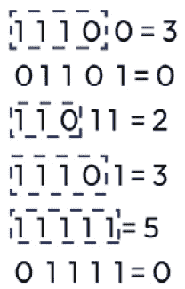
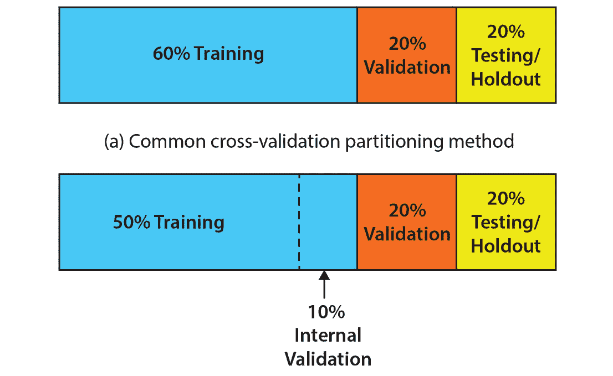
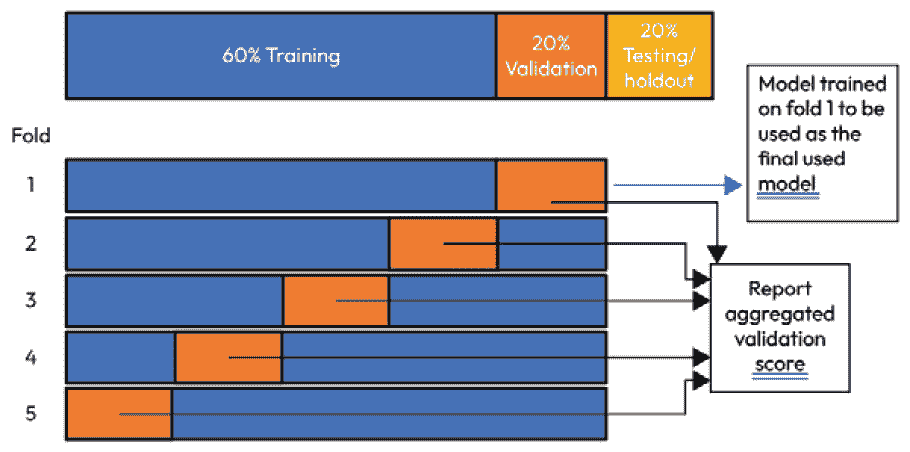
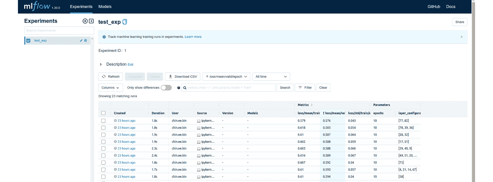
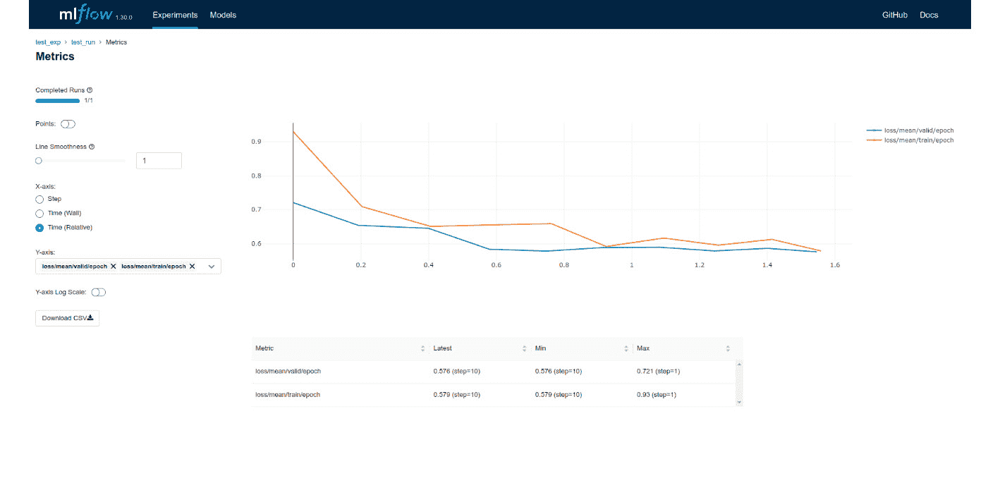
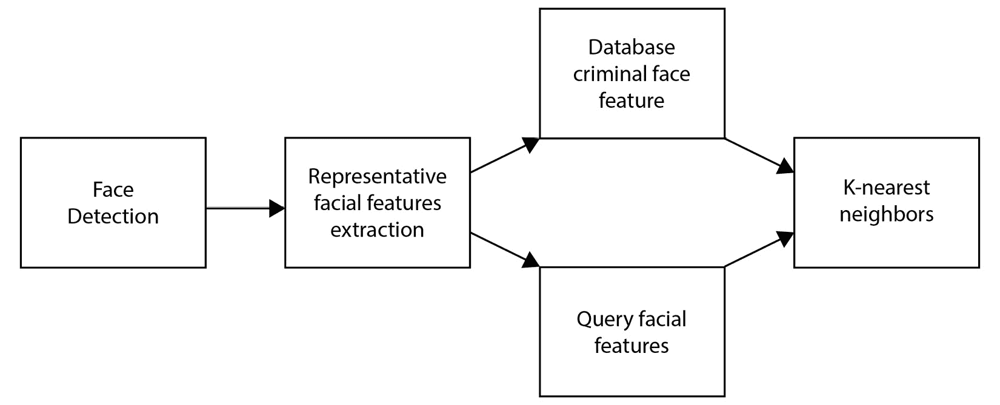
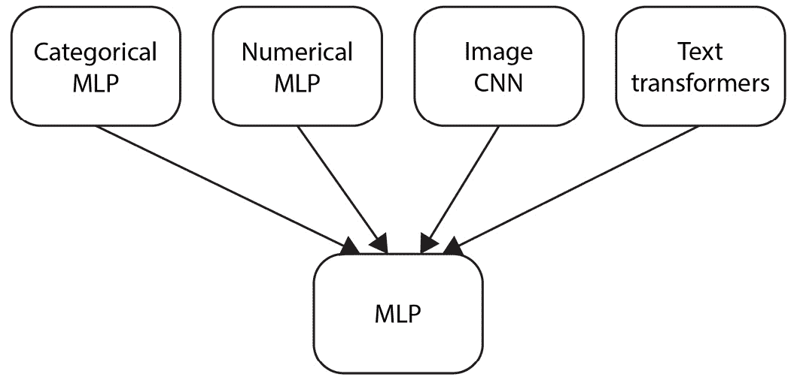

# 第八章：探索监督深度学习

*第二章*到*第六章*探讨了**深度学习**（**DL**）技术背后的核心工作原理，并包括了一些最基础的技术实现，便于理解。理解不同**神经网络**（**NNs**）工作原理的细节是很重要的。一个原因是，当任何神经网络模型出现问题时，你能够识别出根本原因并加以解决。这些章节也很重要，因为它们展示了深度学习架构如何灵活地解决各种现实问题。但这些问题到底是什么？我们应该如何在不同情况下有效训练深度学习模型？

本章将尝试具体回答前面提到的两个问题，针对监督深度学习进行讨论，但针对无监督深度学习的问题会留到下一章。本章将涵盖以下主题：

+   探索监督学习的应用场景和问题类型

+   实现神经网络层以解决基础问题类型

+   高效训练监督深度学习模型

+   探索实现和改进基于监督深度学习的解决方案的一般技术

+   分析监督深度学习中的多任务范式

# 技术要求

本章包括一些 Python 编程语言中的实际实现。为了完成这些内容，你需要一台安装了以下库的计算机：

+   `pytorch`

+   `catalyst==22.04`

+   `numpy`

+   `scikit-learn`

你可以在 GitHub 上找到本章的代码文件，链接：[`github.com/PacktPublishing/The-Deep-Learning-Architect-Handbook/tree/main/CHAPTER_8`](https://github.com/PacktPublishing/The-Deep-Learning-Architect-Handbook/tree/main/CHAPTER_8)。

# 探索监督学习的应用场景和问题类型

监督学习需要标签数据。标签、目标和真实值指的都是同一件事。提供的标签本质上监督着**机器学习**（**ML**）模型的学习过程，并为深度学习（DL）模型生成梯度和更新自身提供反馈。标签可以以多种形式存在，包括**连续数值格式**、**类别格式**、**文本格式**、**多类别格式**、**图像格式**、**视频格式**、**音频格式**以及**多目标格式**。所有这些都可以被归类为以下监督问题类型之一：

+   **二分类**：这是指目标只有两个唯一值的分类数据。

+   **多分类**：这是指目标具有多个唯一值的分类数据。

+   **回归**：这是指目标具有连续的数值数据。

+   **多目标/问题**：

    +   **多标签**：这是指目标与单一数据行关联的多个二进制标签。

    +   **多回归**：这是指目标与单一数据行关联的多个回归目标。

    +   **多个问题**：每个数据行在单一数据集中关联多个目标，或者是一个序列性质的问题链，通过不同数据集学习多个模型。

+   **监督式表示学习**：这可以有多种形式，主要目标是根据输入数据学习有意义的数据表示。学习到的表示结果可以随后的多种用途，包括**迁移学习**（**TL**），以及实现推荐系统。

这些问题的定义可能单独理解起来比较困难。为了更好地理解不同的问题，我们将查看一组广泛的应用场景，这些应用场景可以利用深度学习技术。根据之前指定的问题，以下表格列出了它们的应用场景：

| **问题类型** | **监督式深度学习模型** **应用场景** |
| --- | --- |
| 二分类 |

+   胎儿性别预测通过超声影像

+   半导体芯片质量拒绝预测，通过图像数据进行制造过程中的判断

+   使用包含文本、图像、文档、音频或任何数据的电子邮件数据来预测垃圾邮件

|

| 多分类 |
| --- |

+   文档数据主题分类

+   仇恨/有害言论或文本分类

+   一般图像目标分类

+   文本或语音数据的情感预测

|

| 回归 |
| --- |

+   **点击率**（**CTR**）预测，通过图像、文本或二者结合的方式进行广告预测

+   人类年龄预测通过面部输入图像

+   从图像预测 GPS 位置

|

| 多目标 |
| --- |

+   **文本主题分类**：多标签，单一文本数据行中可能包含多个主题。

+   **图像目标检测**：一个多目标问题，由多个回归目标和多类分类组成。首先，通过图像边界框作为多个回归目标，一个单一的*x*和*y*数值坐标，以及它的宽度和高度作为两个额外的目标，形成一个矩形形状的边界框。接下来，将使用这个边界框提取裁剪图像，用于多分类目的来预测物体的类型。

+   **图像分割**：一种多标签问题，每个像素都会作为二进制目标。

|

| 监督式表示学习 |
| --- |

+   面部特征表示用于面部识别。

+   使用**K-最近邻**（**KNN**）进行说话人识别的音频表示。

+   使用方法**分类嵌入**（**categorical embeddings**）来表示类别，每个类别在分类特征列中都有一个代表性特征向量。这个方法是可学习的，并作为查找表。与基本的独热编码相比，这种方法能够减少高基数分类数据的特征维度，但仍能保持相似的性能。

|

表 8.1 – 深度学习问题应用场景表格

二分类、多类分类和回归问题的处理相对直接。然而，多目标类型的问题设置较为复杂，需根据问题的性质进行更多的架构设计。多目标任务也可以是直接的，例如多标签或多回归问题。该任务属于更广泛的多任务解决方案的范畴，将在本章的*探索实现和改进基于深度学习的解决方案*部分进一步讨论。

接下来，我们将实现实现基础问题的基本神经网络层，包括二分类、多类分类和回归问题。

# 实现基础问题类型的神经网络层

在*第二章*到*第七章*中，尽管介绍了许多类型的神经网络层，但针对问题类型的核心层要么没有使用，要么没有解释。这里，我们将逐一讲解每一层，以便更清晰地理解和掌握直觉。

## 实现二分类层

二分类意味着类别数据有两个选项。请注意，这并不一定意味着原始数据中的类别严格表示为真或假，或者是正面或负面。两个选项可以是原始数据中的任何格式，可以是字符串、数字或符号。然而，请注意，神经网络始终只能产生数值输出。这意味着目标本身必须以数值形式表示，其中最优的数值是零和一的二进制值。这意味着，用作训练目标的数据列如果只有两个唯一值，必须经过预处理，将其映射为零或一。

通常，在神经网络中有两种方式来定义二进制输出。第一种是使用一个大小为一的线性层。第二种方法是使用一个大小为二的线性层。就任务质量指标而言，这两者之间没有显著区别，但方法一在存储和内存方面稍微占用更少的空间，因此可以随时使用这种版本。方法一的输出将通过使用 sigmoid 层约束在`0`到`1`之间。对于方法二，输出需要传入 softmax 层，这样两个输出的概率加起来为一。两种方法通常都可以通过**交叉熵**来优化。交叉熵也被称为**对数损失**。对数损失通过对数刻度衡量预测概率与真实标签之间的差异。该刻度对错误预测进行更严厉的惩罚，强调模型能够为正确类别分配高概率，为错误类别分配低概率的重要性。

将方法一中的层转换为实际的`pytorch`代码，将使用`torch`中的`nn`模块，代码如下所示：

```py
from torch import nn
final_fc_layer = nn.Sequential(
  nn.Linear(10, 1),
  nn.Softmax(),
)
```

接下来，我们将实现多类分类层。

## 实现多类分类层

针对一个有 10 个 logits 的 100 类多分类问题，`pytorch` 代码如下所示：

```py
final_fc_layer = nn.Sequential(
  nn.Linear(10, 100),
  nn.Softmax(),
)
```

多分类问题的另一个子问题是类别具有顺序关系时。这种子问题和任务被称为顺序分类。这意味着类别之间存在增量关系。一个普通的多分类层策略会将顺序类别表现为不理想，因为多分类中的类别被认为彼此之间具有平等关系。这里的一种好策略是使用基于多标签分类任务的技术，这是一个多二分类任务。

假设我们有五个顺序类别，简化起见，将其表示为从 1 到 5 的数字。在实际应用中，这可以通过任何类别数据来表示。在神经网络中，这种情况将使用五个二分类头，其中类别将按升序依次分配到各个头。这个神经网络的原始预测将以一种方式被使用，最终预测的顺序类别将从最远连续的正二分类预测的位置中得出。一旦出现负预测，右侧其余的预测头将被忽略。*图 8.1* 通过模拟五个二分类头的输出预测来描述这一策略：



图 8.1 – 使用五个二分类头的输出预测进行顺序分类处理策略

学习过程将如常使用交叉熵损失来处理多个二进制目标。此外，可以使用不依赖于概率的强健指标（如召回率或精度）来监控每个 epoch 的性能。顺序编码方法使得模型能够学习目标之间的顺序关系。

接下来，我们将深入探讨回归层的实现。

## 实现回归层

`pytorch` 代码将如下所示，使用来自 `torch` 的 `nn` 模块：

```py
final_fc_layer = nn.Linear(10, 1)
```

`0` 和 `1`。结合目标值的缩放，边界可以通过使用 sigmoid 层在神经网络中强制执行，该层也会将激活值缩放到 `0` 和 `1` 之间。在推理阶段，预测值可以通过将 `0` 和 `1` 之间的缩放值映射到先前指定的已知最小和最大边界，从而恢复为实际值。

无界方法通过允许外推来实现某种形式的泛化，而有界方法则允许在神经网络中加入已知的偏置。两种方法各有优缺点，因此选择哪种方法需要根据具体情况进行评估。

接下来，我们将深入探讨表示层的实现。

## 实现表示层

大多数方法侧重于不同数据模态的架构之间的相互作用或优化所代表特征的训练方法。这些是我们将在接下来的话题中进一步深入讨论的主题。一个真正代表表示层的关键层类型是嵌入层。嵌入层是一种将分类数据类型映射为可学习向量的层结构。通过这一层，每个类别将能够学习到一个能够与指定目标很好地对应的表示。该方法可用于将文本单词标记转换为更具代表性的特征，或者简单地作为独热编码的替代。分类嵌入使得对分类数据类型进行特征工程处理变得可能。独热编码生成的编码强制所有类别之间的距离相同。然而，分类嵌入允许根据其与目标变量及其他数据（如果有额外数据存在）的交互来获得适当的距离。

然而，分类嵌入并不是所有机器学习用例的灵丹妙药，即使它们在训练后与实际神经网络模型分离，只起到特征化作用。它们有时可以在总体上表现得比独热编码更好，反之亦然，有时可能会比独热编码表现得更差。这种方法仍然是对任何包含分类数据输入的数据集进行实验的关键方法。

# 有效训练监督深度学习模型

在*第一章*，*深度学习生命周期*中，强调了 ML 项目具有循环生命周期。换句话说，在项目生命周期中进行了大量迭代过程。为了有效训练监督学习深度模型，基于不同条件应采取许多通用方向，但绝对突出于各种问题的一点是适当的工具化。工具化更常见地称为`pytorch`或`keras`与`tensorflow`，部署的便利性，使用不同度量标准比较模型的便利性，模型调优的便利性，良好的模型训练监视可视化，以及关于进展的良好反馈（可以通过消息和通知发送警报）。如果没有真正简化整个流程的先进工具，您可以专注于使模型运行良好的重要部分，而不必处理基础设施问题，如协调将模型保存到不同文件夹中的**DataRobot**，一种付费工具，然后开源工具如 MLflow、Kubeflow 或 Metaflow 将成为下一个最佳替代方案。一旦选择了工具，进行 DL 模型训练将变得轻松。我们将使用 MLflow 作为示例工具，在以下步骤中展示 DL 模型训练的一些有效方法：

1.  数据准备

1.  配置和调优 DL 超参数

1.  执行、可视化、跟踪和比较实验

此外，我们将探讨在结束此主题之前构建模型时的一些额外提示。

让我们详细探讨每一个。

## 为 DL 训练准备数据

数据是任何 ML 模型的核心。数据最终决定了可达到的模型性能、最终训练模型的质量以及最终训练模型的有效性。在*第一章*，*深度学习生命周期*中，我们探讨了使数据集设置具备 DL 价值的条件，以及在获取数据时所需的特性，结合**探索性数据分析**（**EDA**）来验证因果关系和有效性。那里的一般想法是识别和添加对所需目标具有因果影响的额外特征和数据形式。在本节中，我们将更深入地讨论将数据转换为 DL 可训练状态的重要步骤，列在这里：

1.  数据分区

1.  数据表示

1.  数据增强

### 为 DL 训练分区数据

我们将首先介绍数据分区的步骤。对于训练、验证和测试模型来说，有一个良好的数据分区策略对于获得良好的性能模型至关重要。训练分区将严格用于训练。验证分区将在训练过程中严格用于验证模型。在深度学习中，**验证分区**通常被用作指导信号，用来指示何时停止训练或提取出使用外部数据训练的最佳性能权重。由于验证数据会影响模型的学习过程，并且会向着训练外验证数据的性质导致过拟合的方向发展，测试分区将是最终用于验证经过训练模型的泛化能力的分区。测试分区也被称为保留分区。为了更安全地防止过拟合，并确保模型的泛化能力，验证分区也可以专门用于在模型训练后仅验证一次，而不是在每个时期都用于验证。然而，这种策略要求从原始训练分区创建一个较小的内部验证分区。以下图展示了两种不同的策略：



图 8.2 – 两种不同的交叉验证数据分区策略

这种数据分区的过程被称为**交叉验证**。前面的图展示了只有单个分区设置的简单交叉验证策略。这可能会导致模型的性能指标报告对特定的结果分区设置产生偏倚。结果的分区可能具有某种固有的分布或性质，使得结果在特定分区设置中表现特别好或特别差。当发生这种情况时，在部署阶段对性能期望不匹配会造成更多操作问题。为了安全地消除这种偏差可能性，通常使用**k 折交叉验证**来报告更全面的验证分数，这些分数可以更好地反映模型在实际情况下的性能。为了执行这种分区方法，需要从原始数据集中移除单一测试集，并且在不同顺序的*k*交叉验证训练和验证分区上平均验证分数。这在*图 8**.3*中更好地可视化：



图 8.3 – K 折交叉验证作为消除度量报告偏差的策略

最后，为了测试性能报告和部署目的，模型可以重新在训练和验证数据集合并或从第一折训练的模型中提取出用于部署目的。

记住，分层划分是将数据划分为三个提到的部分的推荐策略。这意味着数据将根据与数据集关联的标签大致平均地分为三部分。这确保了任何一个分区中都不会遗漏标签，从而避免了可能导致误信息的情况。以二分类为例，假设数据集被随机划分为训练集、验证集和测试集三个部分，且每个部分的大小是预先指定的。由于每行数据是随机地分配到这三部分中的一个，因此存在分区中可能只包含二分类标签中的一个标签的概率。由于验证集或测试集通常被分配较小的数据量，它们面临这种问题的潜在概率更大。假设模型错误地只训练来预测单一标签。如果该标签正好是只在验证集和测试集里存在的标签，机器学习的从业者可能会误以为模型表现极好，实际上，它是无用的。在进行完全随机划分时，你永远不知道什么时候会不走运，所以只要可能，尽量使用分层随机划分！

这里描述的数据划分策略只构建了一个模型，这个模型将在模型部署的推理模式下使用。当最终模型部署的推理运行时长是一个关注点时，这种策略是标准选择，尤其是在需要更快的模型，而不是稍微提高精度指标时。如果可以接受牺牲一些精度性能来换取运行时长，那么可以使用一种叫做**k 折交叉验证集成**的替代策略。这是许多机器学习竞赛中广泛推荐的方法，尤其是在 Kaggle 上举办的竞赛中。该方法使用之前描述的*k*折交叉验证，但实际上使用在交叉验证过程中训练的*k*个模型，并对这*k*个模型的预测结果进行集成。一种叫做混合的方法将模型的预测结果聚合，几乎总是能提高单个模型的精度指标。这个过程可以被看作是一种利用每个*k*模型的最佳思路和专业知识的方法，从而使最终结果作为一个整体更好。这个整体可以是*k*个预测的平均值或中位数。

在进入下一个方法之前，有一个小贴士：在比较不同实验中的模型时，始终记得确保数据划分一致。误信息通常发生在当两个模型在不同的数据划分策略和数据划分下分别开发时。即使其中一个模型在性能上明显优于另一个，也并不意味着什么，这种比较没有任何意义。

接下来，我们将深入探讨不同数据模态的数据表示组件。

### 为训练深度学习模型表示不同的数据模态

到目前为止，我们已简要讨论了数值、分类、文本、音频、图像和视频模式的利用。这些是跨多个行业最常用的模式。表示不同数据模式是一个复杂的话题，因为除了常见模式外，实际上还有很多稀有的数据模式。例如，稀有模式包括化学公式（文本数据的特殊结构形式）、文档数据（另一种具有复杂位置信息的文本数据的特殊形式）和图数据。在本节中，我们仅讨论常见的非结构化模式的表示方式，以确保内容与读者的相关性。数值和分类数据被认为是结构化数据，已经在前面的章节中得到了充分的讨论。现在让我们开始讨论文本数据模式。

#### 监督式深度学习的文本数据表示

文本数据的表示方式多年来得到了极大的改进。以下是一些相关方法的列表：

+   **词频-逆文档频率（TF-IDF）与 N-gram**：这里的术语是通过 N-gram 实现的。N-gram 是相邻的*n*个文本字符序列。N-gram 是通过一种叫做分词的方法生成的。分词可以是像单个字符这样低级的表示，也可以是更高级的表示，比如单词。一旦表示为 N-gram，就可以使用以下公式计算 TF-IDF。

TF-IDF = 词频 x 逆文档频率

**词频**只是单行的计数数组。**逆文档频率**通过以下公式计算：

IDF = log( 文本样本总数  ______________________________________    包含该术语的文档数 )

这种表示法是一种高效且轻量级的从文本中提取有用信息的方式，其中稀有的词具有更高的值，而像“the”和“and”这样的常见词会被抑制。TF-IDF 的输出可以直接输入到一个简单的**多层感知器**（**MLP**）或任何机器学习模型中，生成预测模型。在简单的用例中，这种表示法足以达到良好的性能指标。然而，在需要解码文本和标签的复杂交互的更复杂的用例中，它可能表现不佳。

+   **词/标记嵌入**：词嵌入可以从头开始训练，也可以从更大的数据集上进行预训练。预训练的嵌入可以通过监督学习或无监督学习的方式在较大的数据集上进行预训练。然而，嵌入方法在训练、评估和测试阶段存在标记不匹配的问题。这意味着在查找嵌入表之前，必须对特定文本标记的预处理方式进行大量调整。这个现象在评估和测试阶段被称为**词汇外**（**OOV**）。在训练阶段，同一个单词的不同变体会有各自的含义，这在学习和资源空间利用上是低效的。实际上，像词干提取、词形还原、转小写以及已知的词对词替换等方法通常会被用来缓解 OOV 问题，但问题不会完全解决。这些词嵌入可以与**递归神经网络**（**RNNs**）或变换器模型结合使用。

+   **基于子词的分词法**：这一类方法试图解决标记不匹配问题以及标记词汇表大小过大的问题。*子词*这个词可能听起来不直观，因为我们人类使用完整的词汇来感知文本的意义。这些算法只有在无法识别单词或单词被认为是稀有时，才会执行子词分词。对于常见单词，它们将保持为完整的词标记。这类方法的例子包括**字节对编码**（**BPE**）、**WordPiece**和**SentencePiece**。我们将简要介绍这些方法，作为简单的指南：

    +   **BPE 分词法**：BPE 将文本视为字符，并在训练过程中迭代地将最常见的连续字符分组。迭代的次数决定了在训练过程中，何时停止将最常见的字符分组。此形式化方法允许稀有单词保持为子词标记，而常见单词则可以合并为一个单独的标记。这种表示方法特别用于**生成预训练变换器**（**GPT**）模型。然而，这种表示方法存在一个问题，就是同一个单词可能有多种编码方式。

    +   **WordPiece**：WordPiece 在 BPE 的基础上进行了改进，通过使用语言模型来选择最可能的标记对进行分组。这在决定如何编码特定单词时，提供了一种智能选择方式。该算法被**双向编码器表示的变换器**（**BERT**）和**高效学习分类标记替换的编码器**（**ELECTRA**）所使用。

    +   **SentencePiece**：SentencePiece 是一种优化基础分词器（如 BPE）生成的标记的方法。它使用几个组件，例如使用一种形式的 Unicode 文本转换来确保不存在依赖语言的逻辑，并使用称为子词正则化的方法，执行一种子词标记组增强形式（从预测的子词标记的前 k 个中以概率和随机方式选择单个样本来组合使用语言模型）。这个算法是 XLNet 和**A Lite BERT**（**ALBERT**）最显著使用的。

文本数据被表示为 DL 的标记。这也意味着标记数量会有严格限制，以便 NN 模型能够以正确的参数初始化。根据需要获得良好的模型性能，选择一个合理的标记大小限制。由于大小限制会影响模型大小，请确保模型大小不会过大，超过推理运行时要求。

关于缺失文本数据，在多模态数据的实际使用情况中可能会出现，使用空字符串作为插补方法是最自然的方式。在底层，这些模型通常会使用全零表示文本数组。

现在我们简要介绍了监督文本数据表示，让我们接下来探索监督音频数据表示。

#### 表示 DL 的音频数据

音频数据是带有一个或两个值数组的时间序列数据，其中数组中的每个值表示特定时间戳处的单个音频数据片段。音频数据可以表示为从原始原始数据简单归一化形式表示的东西，表示为称为声谱图的二维数据，或作为**Mel 频率倒谱系数**（**MFCCs**）。

声谱图是一个称为`wav2vec 2.0`的过程的结果，这是一种变压器类型。

STFT 过程具有可以影响结果表示的超参数。以下列表总结了这些超参数以及如何正确设置它的技巧：

+   **采样率**：这指定了在应用 STFT 之前将使用的每秒样本数（赫兹/Hz）参数。音频数据可能以不同的采样率录制，并且为了构建模型，这些数据将需要通过重采样算法统一到单一的采样率。最常用的值是 16,000 Hz。由于这个值会影响模型在给定固定时间窗口下处理的大小和运行时间，请确保仅在指标表现需要时才增加它。

+   **STFT 窗口长度**：每个窗口大小将负责特定时长和特定位置的数据。每个窗口将在同一时间窗口内为一系列频率生成一个单一的值。这个参数的典型值为 4096 或 2048。根据你的使用案例中对预测分辨率的要求来配置这个值，如果有严格的需求的话。这个参数还会影响模型的大小。

+   **窗口步幅**：这与卷积层的滤波器步幅类似，并且没有太多显著的调节方法。使用窗口长度的一个小百分比，比如 10%，应该是一个足够好的设置。

+   **是否使用 Mel 频率尺度**：**Mel 频率尺度**是音频信号频率的对数变换。从根本上讲，它是一种模仿人类如何感知音频的变换。它使高频变化的影响变小，低频变化的影响变大。当涉及到某种形式的人工判断以提高度量性能时，应使用这种变换。

对于空的音频行，可以使用预生成的单个随机噪音音频或使用与之长度相同的零数组来填充，这在多模态数据集中通常效果不错。

现在我们简要介绍了有监督的音频数据表示，接下来让我们探索有监督的图像和视频数据表示。

#### 表示图像和视频数据以供深度学习使用

图像数据在这里不需要太多介绍，因为我们已经通过一些教程直接使用了它们。关键是要在将数据输入神经网络模型（如 CNN）之前进行某种归一化，神经网络将提取出很好的特征表示。变压器（Transformers）在图像任务中也与卷积神经网络（CNN）展开了激烈的竞争，并且可以用来提取代表性特征并直接进行任务预测。需要注意的一点是，除非图像的分辨率对于识别某些模式至关重要，否则通常使用较小的图像分辨率作为模型会更有效。尽管图像分辨率较小时，人工可能无法直观看到某些模式，但计算机仍然可以识别。图像分辨率会影响训练的运行时间、生产环境中模型的运行时间，有时也会影响模型的大小，特别是对于变压器模型，因此确保合理配置。

然而，视频数据是图像数据的一种扩展形式，多个图像按顺序排列形成一个视频。这意味着视频数据是一种序列数据，就像文本一样，缺乏绝对的时间戳信息。每个连续的图像被称为**帧**。视频可以有多种帧率，通常为 24、30 或 48 **每秒帧数**（**FPS**），但一般可以是任何数字。对于**计算机视觉**（**CV**）的使用案例，确保设置较低的 FPS，以便根据具体的使用场景减少处理负担。例如，唇读的使用案例需要的 FPS 比让模型判断一个人是否在跑步的需求要低。对于帧的分辨率，图像分辨率的相同指南也适用。一旦决定了视频属性，就必须学习并提取代表性特征。当前的最先进（SoTA）特征是通过类似于基于图像的使用案例的模型提取的。这样的模型包括 3D 卷积神经网络（CNN）和 3D 变压器（transformers）。

然而，这两种数据类型之间是有交集的，那就是通过视频数据提取的图像。对于这种类型的图像数据，可以减少预测模型做出错误预测的概率。机器学习模型并不是完美的预测器，因此，每当有机会减少错误预测（如假阳性或假阴性）而不影响真实预测时，应该考虑采取这一机会。可以考虑使用来自 OpenCV 库的手动图像处理技术，在模型将图像作为输入之前执行任何初步步骤。例如，可以使用 OpenCV 中的运动检测技术作为喂给深度学习模型视频数组之前的初步条件检查器。由于大多数视频数据的使用案例需要运动，所以如果没有任何运动，预测任何东西就没有意义。这也减少了在多个未更改的视频帧上进行预测时可能出现的错误预测。OpenCV 中的运动检测器通过简单的像素值变化来工作，而不使用概率模型，因此它是更可靠的运动指示器。

现在我们已经涵盖了不同数据模态的表示，接下来我们讨论数据增强的话题。

### 增强数据以训练更好的深度学习模型

数据增强在深度学习中被广泛使用，以提高训练模型的泛化能力并提升模型的度量性能。通过考虑增强带来的额外独特变异，模型将在验证、测试和推理阶段能够关注外部数据中的这些独特变异。自然，这也会减少模型对特定模式的过度依赖，并且消除足够大小数据集带来的好处。数据增强增加了训练数据的量，从而增加了训练数据中模式的变异性。这个过程通常在每次训练迭代时随机且独立地在内存中完成。这样可以确保训练数据的额外变异性没有限制，并且不需要额外的存储空间。然而，你不能仅仅随便使用所有已知的特定模态的数据增强类型。以下是你可以对数据进行的不同类型的数据增强：

+   **图像**：通过**对比度限制自适应直方图均衡（CLAHE）**锐化图像，色相和饱和度变化，颜色通道打乱，对比度变化，亮度变化，水平/垂直翻转，灰度转换，模糊，图像遮罩，mixup（图像及其标签的加权组合），cutmix（mixup，但仅通过原始图像的随机补丁），等等。更多的增强方法可以查看[`github.com/albumentations-team/albumentations`](https://github.com/albumentations-team/albumentations)，其中有超过 70 种增强方法！

+   **文本**：同义词替换，反向翻译（将文本翻译成另一种语言后，再翻译回原语言），等等。

+   **视频**：视频 mixup（与图像 mixup 相同，但适用于视频），以及与图像相同的所有增强方法。

+   `librosa` 库。

选择使用何种增强类型需要对你在部署模型时将遇到的预期环境有一定的了解。错误的选择会为模型添加噪声，并可能在训练过程中让模型产生困惑，从而导致度量性能下降。好的选择则围绕估计在实际环境中可能出现的变异。举一个制造业应用的例子，目标是部署一个基于图像的模型，用于通过摄像头传感器预测生产线上的产品特征以进行分拣。如果假设摄像头在所有设置下几乎完美地固定直对机器，使用图像旋转增强可能就不太明智。即便你想使用该增强，旋转变化的范围也应仅限于较低的范围，比如小于 10 度的变化。如果摄像头不提供灰度图像，那么使用灰度增强也显得不太直观。

这标志着训练有效模型的数据准备阶段的结束。接下来，我们将深入探讨工作流程中的模型训练阶段。

## 配置和调优深度学习超参数

超参数配置和调优在有效训练深度学习（DL）模型中起着至关重要的作用。它们控制着模型的学习过程，并能显著影响模型的性能、泛化能力和收敛性。本节将讨论一些重要的超参数及其对训练深度学习模型的影响。

训练每个神经网络（NN）模型时需要配置的最常见且有影响力的超参数是其训练轮次、早停轮次和学习率。这三个参数被视为一组参数，合在一起构成了**学习计划**。已有一些著名的学习计划，旨在以最少的时间获得最佳模型。然而，这些方法很大程度上依赖于对模型可以收敛的总轮次数的初步估计。依赖于对总轮次数估计的方法较为脆弱，其配置策略也不容易从一个问题迁移到另一个问题。在这里，我们将重点使用验证数据集来跟踪实现最佳度量性能所需的轮次数。

早停轮次是一个控制你希望在停止之前继续训练多少轮的参数。该策略意味着，训练轮次的超参数可以设置为无限大或非常大的数字，以便找到在验证数据集上表现最好的模型。早停通过基于验证数据集动态减少所需的训练轮次。当模型提前停止时，通过保存验证数据集上表现最好的模型权重，你将能够加载这些最佳表现的权重。典型的早停轮次为`10`。

至于学习率，实际上有两个普遍有效的方向。一种方法是立即使用较大的学习率，比如`0.1`，并逐渐衰减学习率。学习率的逐渐衰减可以通过监控验证得分来实现，当验证得分在`3`到`5`轮后没有改善时，就减少一定比例的学习率。第二种方法是在使用第一种方法之前，先用较小的学习率作为暖身方法初始化神经网络（NN）的基本权重。在学习的初期，由于模型处于随机状态，学习过程可能非常不稳定，损失值似乎没有按照合理的改进趋势变化。使用暖身可以帮助初始化稳定的基础，从而使损失值稳定下降。需要注意的是，如果使用预训练权重来初始化模型，通常不需要暖身，因为模型已经处于稳定状态，特别是当预训练权重来自相似数据集时。

批量大小是深度学习模型训练中的另一个关键超参数，因为它决定了在优化过程中每次更新模型权重时使用的训练样本数量。批量大小的选择会显著影响模型的训练速度、内存需求和收敛性。较小的批量大小，如 16 或 32，能提供更准确的梯度估计，从而实现更稳定的收敛，但可能需要更多的训练迭代，并且由于计算并行性较低，训练速度较慢。另一方面，较大的批量大小，如 128 或 256，增加了并行性，能够加速训练过程并减少内存需求，但可能导致梯度估计不够准确，进而可能影响收敛的稳定性。实际上，实验不同的批量大小是非常重要的，以找到在训练速度和收敛稳定性之间提供最佳平衡的批量大小，针对你的具体问题。此外，现代深度学习框架通常支持自适应批量大小技术，可以在训练过程中自动调整批量大小，以优化学习过程。

这里讨论的基础策略是稳健的，大多数情况下能够轻松获得表现最佳的模型，尽管牺牲了一些额外的训练时间。值得注意的是，正则化方法、优化器和不同的激活函数已在*第二章*，*深度学习架构设计*中讲解过，我鼓励你参考该章节以获取更多关于这些主题的信息。

尽管配置这些超参数可以有手动策略，但总会有进一步调优超参数的空间，以优化模型的指标表现。通常，调优可以通过网格搜索、随机搜索或更智能的搜索机制来执行。网格搜索，也称为暴力搜索，探索并验证所有指定超参数值的可能组合，通过交叉验证确定给定问题的最优配置。对于更智能的调优方法，请回到*第七章*，*深度神经架构搜索*，获取更多的见解。此外，模型评估指标在这个超参数调优过程中起到重要作用，我们将在*第十章*，*探索模型评估方法*中进一步探讨。

超参数调优的核心在于过程和工作流，能够迭代地执行、可视化、跟踪并比较建模实验，每个配置都是建模实验的一部分。这引出了下一个主题——有效训练深度学习模型的实际工作流。

## 执行、可视化、跟踪并比较实验

高效执行 ML 项目的关键是快速在实验之间迭代。任何 ML 项目都需要大量的探索，无论是在项目的初期阶段，以评估用例的可行性，还是在后期阶段，以提高模型的性能。当这个探索过程能够得到优化时，本应失败的事情可以迅速失败，而有前景的事情可以迅速成功。在实际的 ML 项目中，失败是非常常见的。一旦我们承认这一点并快速失败，我们就可以利用恢复的时间来解决更有价值的用例。一个好的 MLOps 平台将帮助我们高效、有效地执行、可视化、追踪和比较实验。

让我们通过一个实际的例子来演示，使用 Iris 数据集和 MLP 模型，并使用 MLflow MLOps 平台。我们还将使用`catalyst`库，它也被认为是一个 MLOps 平台，尽管它只是部分地并主要集中于提供常见的`pytorch`深度学习模型训练工具。由于`catalyst`提供了大多数的模型版本控制和模型存储机制，我们将只利用 MLflow 中的追踪功能。这个例子的步骤如下：

1.  首先，让我们导入所有必要的库：

    ```py
    import json
    import osimport numpy as np
    import torch
    import torch.nn as nn
    import torch.nn.functional as F
    from catalyst import dl, utils
    from catalyst.contrib.datasets import MNIST
    from sklearn import datasets
    from sklearn.metrics import log_loss
    from sklearn.model_selection import train_test_split
    from sklearn.preprocessing import MinMaxScaler
    from torch import nn as nn
    from torch import optim
    from torch.utils.data import DataLoader
    from torch.utils.data import TensorDataset
    from catalyst.loggers.mlflow import MLflowLogger
    ```

1.  接下来，由于我们将使用基于`pytorch`的 MLP，我们将在`pytorch`中再次设置随机种子：

    ```py
    torch.manual_seed(0)
    ```

1.  我们将在这里使用的实际实现数据集是 Iris 数据集。该数据集包含了不同种类的花卉的花瓣和萼片长度，以及三种不同的鸢尾花类型。现在让我们加载这个数据集：

    ```py
    iris = datasets.load_iris()
    iris_input_dataset = iris['data']
    target = torch.from_numpy(iris['target'])
    ```

1.  缩放是一种正则化方法，可以减少记忆并减少偏差。让我们在这里执行简单的最小值和最大值缩放：

    ```py
    scaler = MinMaxScaler()
    scaler.fit(iris_input_dataset)
    iris_input_dataset = torch.from_numpy(scaler.transform(iris_input_dataset)).float()
    ```

1.  要训练一个模型，我们需要一个合适的交叉验证策略来验证模型的有效性和性能。我们将使用 77%的数据用于训练，33%的数据用于验证。让我们为交叉验证准备数据：

    ```py
    X_train, X_test, y_train, y_test = train_test_split(iris_input_dataset, target, test_size=0.33, random_state=42)
    ```

1.  接下来，我们需要使用准备好的`numpy`格式数据为交叉验证准备数据加载器：

    ```py
    training_dataset = TensorDataset(X_train, y_train)
    validation_dataset =  TensorDataset(X_test, y_test)
    train_loader = DataLoader(training_dataset, batch_size=10, num_workers=1)
    valid_loader = DataLoader(validation_dataset, batch_size=10, num_workers=1)
    loaders = {"train": train_loader, "valid": valid_loader}
    ```

1.  由于这是一个三类的多分类问题，我们将使用`pytorch`中的交叉熵损失函数：

    ```py
    criterion = nn.CrossEntropyLoss()
    ```

1.  我们将在这个项目中使用名为`catalyst`的`pytorch`高级封装库。在`catalyst`中训练一个模型时，我们必须定义一个名为 runner 的模型训练器类实例：

    ```py
    runner = dl.SupervisedRunner(
        input_key="features", output_key="logits", target_key="targets", loss_key="loss"
    )
    ```

1.  我们将在本项目中使用 MLP，并使用一个 MLP 构造类，它允许我们指定输入数据大小、隐藏层配置和输出数据大小。隐藏层配置是一个层大小的列表，它同时指定了层数和每一层的大小。假设我们想随机获得 20 种不同的隐藏层配置，并找出哪种配置在验证集上表现最好。首先，让我们定义一个方法，随机生成配置：

    ```py
    def get_random_configurations(
      number_of_configurations, rng
    ):
      layer_configurations = []
      for _ in range(number_of_configurations):
        layer_configuration = []
        number_of_hidden_layers = rng.randint(low=1, high=6)
        for _ in range(number_of_hidden_layers):
          layer_configuration.append(rng.randint(low=2, high=100))
          layer_configurations.append(
            layer_configuration
            )
          layer_configurations = np.array(
            layer_configurations
          )
      return layer_configurations
    rng = np.random.RandomState(1234)
    number_of_configurations = 20
    layer_configurations = get_random_configurations(
      number_of_configurations, rng
    )
    ```

1.  现在，让我们定义一个方法，允许我们训练和评估不同的 MLP 配置：

    ```py
    def train_and_evaluate_mlp(
        trial_number, layer_configuration, epochs,
    ):
    ```

    此处的试验编号清晰地区分了不同的实验。除了层配置外，我们还可以配置要运行的训练周期数。在这种方法中，我们将基于传入的层配置创建一个 MLP 模型实例：

    ```py
        model = MLP(
            input_layer_size=iris_input_dataset.shape[1],
            layer_configuration=layer_configuration,
            output_layer_size=len(np.unique(target)),
        )
    ```

1.  我们将使用 `Adam` 优化器进行梯度下降，并设置检查点目录：

    ```py
        optimizer = optim.Adam(model.parameters(), lr=0.02)
    checkpoint_logdir = "experiments"
    ```

1.  接下来，我们将在 `catalyst` 中定义一个 MLflow 日志记录助手类，用于以 MLflow 格式记录实验数据。在这个设置中，我们记录训练和验证日志损失的均值和标准差：

    ```py
        loggers = {
          "mlflow": MLflowLogger(
            experiment="test_exp", run="test_run"
          )
        }
    ```

1.  最后，我们将开始训练过程，该过程将训练指定数量的训练周期：

    ```py
        runner.train(
            model=model,
            hparams=hparams,
            criterion=criterion,
            optimizer=optimizer,
            loaders=loaders,
            num_epochs=epochs,
            callbacks=[
                dl.CheckpointCallback(
                    logdir=checkpoint_logdir,
                    #save_n_best=0,
                    loader_key="valid",
                    metric_key="loss",
                    mode="model",
                )
            ],
            logdir="./logs",
            valid_loader="valid",
            valid_metric="loss",
            minimize_valid_metric=True,
            verbose=verbose,
            loggers=loggers
        )
    ```

1.  作为最后的代码步骤，我们将循环遍历每个随机生成的层配置，并执行训练和评估过程：

    ```py
    for layer_config in layer_configurations:
        train_and_evaluate_mlp(
            trial_number,
            layer_config,
            epochs=10,
            load_on_stage_start=False
        )
    ```

1.  现在，我们需要启动 MLflow 服务器服务。我们可以通过在与包含引入代码的目录相同的目录中运行以下命令来完成此操作：

    ```py
     mlflow server –backend-store-uri mlruns
    ```

    运行此命令后，当前目录应该包含一个名为 `.catalyst` 的文件，该文件指示 `catalyst` 启用 MLflow 支持。该文件应包含以下内容：

    ```py
    [catalyst]
    cv_required = false
    mlflow_required = true
    ml_required = true
    neptune_required = false
    optuna_required = false
    ```

    一旦命令执行并且通过打开 HTTP 网站链接，你应该能够看到 MLflow 的界面，如*图 8.4*所示：



图 8.4 – MLflow 界面

该界面展示了一个方便的方式来可视化不同实验之间的性能差异，同时展示所使用的参数。数值度量值可以排序，从而获得在验证分区上表现最好的模型，如图所示。准备数据和训练模型的过程需要在不同设置或实验之间进行迭代比较。通过定量度量和实验参数，可以更客观地比较实验。当通过代码在界面中自动可视化展示，而不是手动插入到 Excel 或 Google 表格时，这使得过程更加可靠和有序。此外，如果你点击任何一个实验，你将能够交互式查看每个训练周期的损失曲线，如*图 8.5*所示：



图 8.5 – MLflow 界面，显示最佳模型的示例损失曲线

在确保迭代速度的同时，还需要正确组织和跟踪你为模型生成的所有工件。这意味着你需要为你的模型、数据集以及任何影响最终模型输出的关键组件进行版本控制。工件可以是模型权重、指标性能报告、性能图、嵌入可视化和损失可视化图。显然，这项任务可以通过手动编码来完成。然而，当实验数量增加时，组织模型内置实验的工件会变得杂乱无章。任何自定义文件、图表和指标都可以绑定到每个实验记录中，并在 MLflow 界面中查看。这里的实验可以通过使用不同的模型、不同的数据集、不同的特征化方法、模型的不同超参数，或相同数据集的不同样本大小来区分。此外，模型还可以直接存储在 MLflow 的模型注册表中，这使得 MLflow 可以直接部署该模型。

## 探索模型构建技巧

这些实际内容作为一个例子，展示了像 MLflow 这样的 MLOps 平台如何简化构建和选择正确模型的过程，既可以通过编程也可以通过可视化实现。尽管 MLOps 非常优秀并且有助于高效训练模型，但仍有一些事情是 MLOps 平台无法为你处理的，而这些事情在模型被正确利用并且预测结果被消费之前是关键的组成部分。以下是这些组件：

+   **预测一致性验证测试**：这是一个确保同一训练模型在相同数据上做出的预测是一致的测试。如果模型的预测逻辑不是确定性的，那么就不能利用该模型的预测。这个问题将在*第十章*，“*探索模型* *评估方法*”中进一步讨论。

+   `pytorch`，这可以通过以下代码全局实现：

    ```py
    import torch
    import random
    import numpy as np
    torch.manual_seed(0)
    random.seed(seed)
    np.random.seed(seed)
    ```

    在`tensorflow`和`keras`中，这可以通过以下代码全局实现：

    ```py
    import tensorflow as tf
    tf.keras.utils.set_random_seed(seed)
    ```

    该方法会自动设置`random`和`numpy`库的种子。这些全局设置可以帮助为那些没有明确设置随机数生成器种子的层设置随机种子。

实验中的最后一条建议是确保在项目开始时创建基准线。基准线是可能的解决方案的最简单版本。这个解决方案甚至可以是一个非深度学习模型，具有简单的特征。拥有基准线可以帮助确保你添加的任何改进或复杂性都是通过指标性能监控来证明其合理性的。避免为了复杂而复杂。记住，机器学习项目的价值不在于过程的复杂性，而在于能够从中提取的结果。

接下来，我们将深入探讨可以用于实现和改进利用深度学习的解决方案的实际技术。

# 探索实现和改进监督式深度学习解决方案的通用技术

请注意，在本章前面，我们专注于基于问题类型的使用场景，而不是问题本身。解决方案则是解决并处理这些问题。深度学习和机器学习在解决人员配置困难和自动化日常任务方面非常有效。此外，计算机中的机器学习模型可以比普通人更快地处理数据，从而实现更快的响应时间和更高效的过程扩展。在许多情况下，机器学习模型能够提高过程的准确性和效率。有时，它们改善当前的流程，其他时候，它们使得过去无法实现的流程变为可能。然而，单一的深度学习模型可能不足以解决问题。让我们来看一个可以通过单一深度学习模型充分解决的例子。

考虑使用深度学习模型来预测婴儿性别的使用场景，模型通过超声波图像来进行预测。传统上，医生会基于视觉对母亲子宫中婴儿的超声波图像进行性别分析，既有实时的分析，也有离线的分析，最后给出性别预测。根据以往的经验和知识，医生在解读性别时会有不同的能力和准确性。当婴儿出现异常情况时，事情可能变得更加复杂。潜在的根本问题是，经验丰富且能力强的医生稀缺且聘用成本高。如果我们有一个系统可以自动从超声波图像中解码性别，这将能为医生的判断提供很好的辅助，或者作为一种更便宜的替代品，取而代之。同样的类比也可以应用于识别任何高级影像结果中的疾病或症状，例如 X 光图像。

这个例子将一个深度学习模型描绘为解决方案的一个组成部分，并展示了在某些情况下，单一的深度学习模型足以获得期望的输出。这是一个关于人员配置问题的例子，但在效率方面的讨论较少。请注意，对于某些使用场景，可能需要以某种形式解释驱动预测的原因。换句话说，你需要解释模型做出决策的理由。为了帮助医生，指出哪些模式及其类型对决策产生了影响，比单纯给出决策本身更有帮助，因为医生可以利用这些额外的信息做出自己的判断。这将在*第十一章*，*神经网络预测的解释* 中详细介绍。

除了解释之外，并非所有问题的解决方案都能仅通过单一的机器学习（ML）或深度学习（DL）模型来完成。有时候，深度学习模型需要与一般的机器学习方法结合使用，而在其他情况下，需要将多个深度学习模型组合在一起。在某些特殊情况下，必须对中间数据进行特殊处理和准备，然后再将其输入到管道中的下一个任务。在处理此类问题时，创建和构建逻辑管道是至关重要的。让我们以一个需要多个数据集、多个深度学习模型以及构建任务管道的例子来说明问题和解决方案。

假设有一个问题：找到刚刚抢劫银行的罪犯。通过使用部署在城市中的 CCTV 摄像头，如果你已经识别出抢劫犯的面孔，可以使用人脸检测和识别解决方案。下图展示了该问题的解决方案任务管道示例：



图 8.6 – 通过 CCTV 摄像头寻找罪犯的任务管道

人脸检测是一个图像物体检测过程，其中包括一个图像边界框回归器和一个二分类器，用于预测该边界框是否为人脸。代表性的人脸特征提取利用深度学习模型，可以使用监督式表示学习方法进行训练，目的是优化人脸特征在不同个体间的区分效果。接下来，需要一个单独的任务来构建罪犯人脸特征的数据库，并将其传递给 KNN 机器学习算法，以便根据从城市 CCTV 摄像头获得的查询人脸特征，找到匹配的人脸 ID。这个解决方案展示了将一个解决方案分解为多个组件的必要性，以最终实现寻找罪犯的目标。

上述示例是更大范式的一部分，称为多任务学习和多任务问题。多任务范式是一系列主题，它不仅能够推动机器学习领域的更大发展，尤其是在深度学习中，由于其固有的灵活性，这一切变得更加可实现。在下一个主题中，我们将深入探讨多任务范式。

# 在监督式深度学习中分解多任务范式

多任务是一种涵盖广泛任务的范式，它涉及在多个问题上执行机器学习模型，并将相应的数据集与之结合，以实现目标。这个范式通常基于以下两个原因构建：

+   为了获得更好的预测性能和泛化能力。

+   将复杂的目标分解为可以通过单独的机器学习模型直接解决的小任务。这重申了前一个主题中的观点。

让我们深入探讨四种多任务技术，从多任务管道开始。

## 多任务管道

这种多任务系统的变种围绕着实现那些无法通过单一 ML 模型直接解决的方案。将高度复杂的任务分解成较小的任务，可以通过多个 ML 模型处理不同的小任务来提供解决方案。这些任务可以是顺序的或并行的，并且通常形成一个**有向无环图**（**DAG**）样的管道，类似于*图 8.6*中所示的例子。

然而，这并不意味着任务必须仅限于机器学习（ML）模型。不同产业和业务的问题可以有多种形式，灵活地分配所需组件以产生解决方案是从 ML 技术中提取价值的关键。例如，如果在分解大任务后需要人工监督来完成某个任务，不要犹豫，利用人工监督与 ML 模型共同作用来实现价值。让我们通过另一个使用多任务管道来创建解决方案的用例——**推荐系统**，来进一步了解。首先，我们需要进行有监督或无监督的表示学习以提取特征。其次，利用提取的特征，创建一个用于匹配查询特征的数据库。第三，从数据库中获取排名前 k 的最接近数据，并应用回归模型来预测前 k 数据的排名，以进行高效的高性能排名微调。

接下来，我们将探索另一种多任务范式，称为**迁移学习**（TL）。

## **迁移学习**（TL）

**迁移学习**（TL）是一种技术，涉及将从一个任务中学到的知识应用到另一个任务中。其核心原因可以是以下之一：

+   提高度量性能。

+   减少网络达到收敛状态所需的 epoch 数量。

+   允许更稳定的学习轨迹。在其他情况下，当初始学习过程不稳定时，网络可能需要更长的时间才能收敛。然而，在一些情况下，当网络没有稳定的基础开始学习时，网络根本无法收敛。迁移学习可以帮助那些最初无法学习的模型在学习过程中达到收敛。

+   提高泛化能力并减少过拟合的概率。当第二个任务仅涉及来自实际数据集的一小部分变化时，从第一个任务中学到的知识（该任务涵盖了更广泛的变化范围）有助于防止狭隘的忽视。

具体来说，DL 中的 TL 是通过在第二个任务中使用从第一个任务中学到的网络参数来实现的。这些参数涉及与网络相关的所有权重和偏置。可以将这些参数作为初始化步骤，用于同一个网络，而不是使用通常的随机初始化参数。这些被称为**预训练权重**。使用预训练权重进行网络学习的过程称为**微调**。此外，网络参数也可以选择完全冻结，并仅作为一个**特征提取器**组件，为另一个监督学习算法提供特征。

有几种自动化策略，专注于提高微调后的结果。然而，这些方法并非万能，执行起来可能需要大量时间。通过 TL 实现更好性能的实际策略是，通过评估两个任务的迁移能力来选择要训练的层数。*表 8.2*展示了根据任务相似性和第二个任务的数据集大小，决定 TL 策略的简易方法：

|  | **数据集大小** |
| --- | --- |
| **小** | **大** |
| 任务相似性 | 低 | 按照常规训练整个网络。 | 按照常规训练整个网络。 |
| 高 | 冻结所有基础网络参数，增加一个额外的线性预测层，只在数据集上训练该线性层。 | 按照常规训练整个网络。 |

表 8.2 – 深度 TL（DTL）策略指南

为了清晰起见，假设“大的”数据集是指数据集至少包含 10,000 个样本。对于任务的迁移能力/相似性，需要依靠人类直觉来进行逐个案例的评估。在本指南中，我们假设大的数据集意味着数据集具有足够的变化，能够充分代表总体。然而，在前面的图中没有展示的一个隐藏因素是第一个任务的数据集大小。当任务相似性较高、第二个任务的数据集较小、并且第一个任务的数据集较大时，TL 会产生最佳效果。第一个数据集的大小通常也限制了可以使用的神经网络的规模。假设第一个数据集的大小较小；在这种情况下，表现最佳的通常是较小的模型。当 TL 非常有益时，即使第二个数据集的数据集大小为中等或较大，较小的模型仍然可以超越较大的模型。在这种复杂情况下，需要进行平衡才能获得理想的模型。

TL 中的一个显著问题被称为**灾难性遗忘**。这是一个现象，当网络在新的任务上训练时，其在早期任务上的性能会退步。如果你不关心之前任务的性能，这个问题可以忽略不计。实际上，如果需要保持之前任务的性能，你可以按照以下步骤操作：

1.  使用统一的指标，通过额外在第一个任务的验证数据集上进行验证，来处理第一个任务和第二个任务的性能。

1.  将第一个任务和第二个任务的数据集结合起来，并作为单一模型进行训练。如果这些目标彼此不相关，则使用不同的全连接层预测头。

最后，还有一种在迁移学习（TL）中流行的技术，称为**知识蒸馏**。该方法涉及两个模型，其中一个预训练的教师模型用于将其知识蒸馏到学生模型中。通常，教师模型是一个较大的模型，能够学习更准确的信息，但运行速度较慢，而学生模型是一个较小的模型，在运行时能以合理的速度运行。该方法通过使用额外的基于相似性的损失来蒸馏知识，这通常是教师模型和学生模型之间选定层输出的损失，通常是对数层，在基础交叉熵损失的基础上进行计算。该方法鼓励学生模型生成与教师模型相似的特征。通常，这项技术用于获得一个比没有知识蒸馏时训练出的更小的、精度更高的模型，从而使部署基础设施可以更为经济。这项技术将在*第十三章*《探索偏见与公平》中作为关键技术进行实际介绍，以减轻偏见。

接下来，我们将深入探讨另一种多任务执行方式，称为多目标学习。

## 多目标学习

多目标学习是一种多任务处理过程，涉及同时训练多个不同的目标。不同的目标引导网络的学习轨迹走向不同的路径。多目标学习可以进一步细分为以下几种选项：

+   在相同输出上进行多重损失计算。

+   多个目标，由独立的神经网络预测头处理，每个预测头都有其各自的损失。这可以进一步细分为以下几类：

    +   具有实际影响和应用的多个目标。

    +   一个或多个主要目标和一个或多个辅助目标。辅助目标与各自的损失配对，这些损失被称为辅助损失。

除了选项 *2(A)*，其他选项（即 *1* 和 *2(B)*）主要用于提高指标性能。指标可以像准确率或对数损失这样简单，或更复杂，例如偏向少数类别的程度。一个更简单、直接的多目标学习示例是多标签目标类型。多标签是指一个数据行可以关联多个标签。这意味着设置将是多个二分类目标，这正是 *2(A)* 的情况。

多个目标及其相关的损失意味着在学习过程中可能会出现梯度冲突问题。这种现象通常被称为**负迁移**。负迁移的一个极端情况是，当两个损失的梯度大小相同且方向完全相反时，它们会相互抵消。这会阻碍模型的学习过程，使模型永远无法收敛。实际上，这个问题可能表现为较低的规模，并减缓收敛速度，或者更糟糕的是，可能引入巨大的波动，导致模型无法学习到任何东西。不幸的是，除了理解模型学习不佳的背景原因外，没有什么“灵丹妙药”的缓解方法。通常需要反复实验，找出如何平衡这些损失，以鼓励稳定的学习过程。

接下来，我们将深入探讨多模态神经网络的训练。

## 多模态神经网络训练

多模态神经网络是一种多任务系统，因为负责不同模态的网络在同一任务中以完全不同的路径进行学习。处理多模态神经网络的常见方法是在初始阶段为不同的数据模态分配不同的神经网络块。神经网络块包含每个模态特定的网络。不同模态的神经网络块随后会通过一系列中间全连接层和输出全连接层进行合并。如*图 8.7*所示：



图 8.7 – 典型的多模态神经网络结构

利用多模态的想法是，额外的数据输入可以帮助识别更全面的模式，从而应该提高整体指标的表现。实际上，如果没有仔细处理训练过程，这种情况通常不会发生。不同的模态存在于完全不同的分布中，并且以不同的速度和不同的路径进行学习。对所有数据模态应用单一的全局优化策略可能会产生次优的结果。一种常见且有效的策略是：

+   预训练单独的模态神经网络块（单模态）并使用临时预测输出层，直到达到一定程度的收敛

+   移除临时预测输出层，并像往常一样使用单模态训练过程中的预训练权重来训练多模态神经网络（NN）

除此之外，冻结单模态训练神经网络的权重，只训练多模态聚合的全连接层预测头也是一种有效策略。还有许多更复杂的策略来解决这个问题，但它们超出了本书的范围。

# 总结

在本章中，我们探讨了有监督的深度学习，包括它可以解决的问题类型和实现及训练深度学习模型的技术。有监督的深度学习涉及在标记数据上训练模型，以对新数据进行预测。我们还介绍了多种有监督学习的应用案例，涵盖了不同问题类型，包括二分类、多分类、回归、以及多任务学习和表示学习。本章还涵盖了有效训练深度学习模型的技术，包括正则化和超参数调优，并提供了使用流行的深度学习框架在 Python 编程语言中的实际实现。

有监督的深度学习可以广泛应用于图像分类、**自然语言处理**（**NLP**）和语音识别等实际任务。通过本章提供的知识，你应该能够识别有监督学习的应用，并有效地训练深度学习模型。

在下一章中，我们将探讨深度学习中的**无监督学习**。
