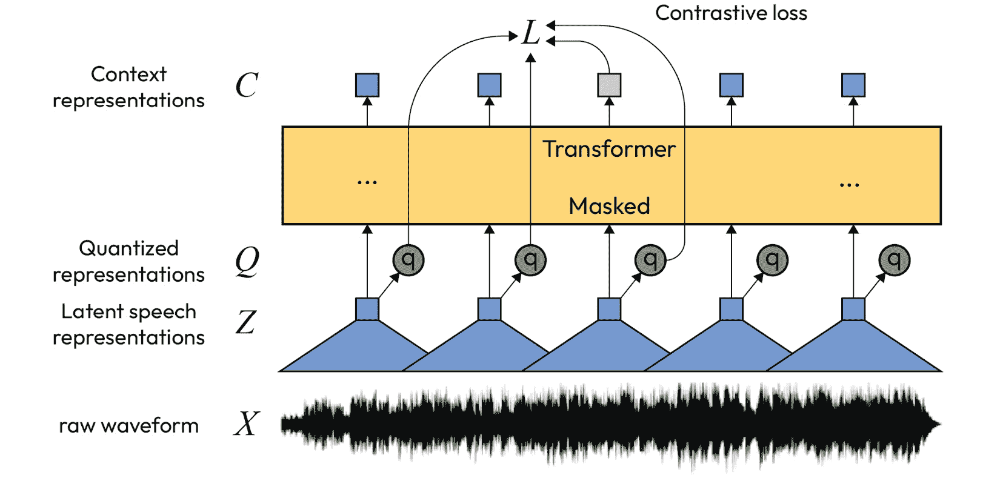
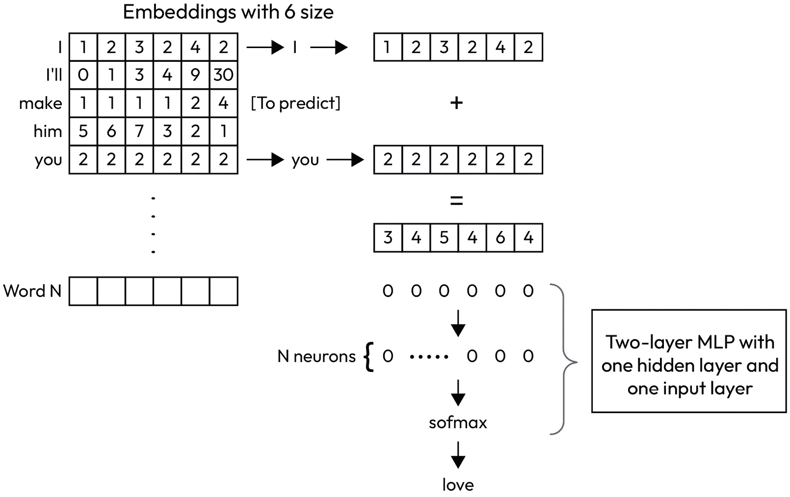
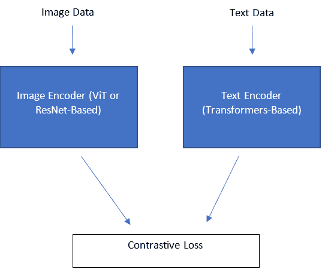
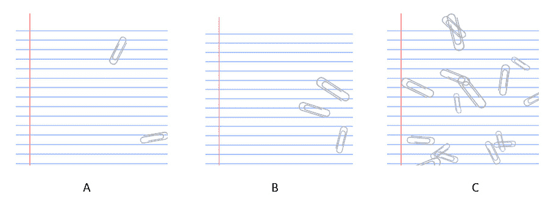

# 第九章：探索无监督深度学习

无监督学习适用于没有标签的数据。更广泛地说，无监督学习旨在揭示数据中隐藏的内在模式。监督机器学习项目中最严格和最昂贵的部分是为给定数据所需的标签。在现实世界中，有大量的无标签数据，其中包含可以学习到的丰富信息。坦率地说，获取世界上所有数据的标签是不可能的。无监督学习是解锁我们今天拥有的丰富无标签数字数据潜力的关键。让我们通过以下假设情境更好地理解这一点。

想象一下，获取一行数据的标签，无论其使用场景是什么，都需要花费 1 美元和 1 分钟，并且通过监督学习可以获得单个信息单元。要获取 10,000 个信息单元，需要花费 10,000 美元并贡献 10,000 分钟来获得 10,000 条标注数据。无论是时间还是金钱，都是令人痛苦的消耗。然而，对于无监督学习，通过相同的数据（没有标签），获取 0.01 个信息单元的成本是 0 美元和 0 分钟。由于数据量不受时间或金钱的限制，我们可以轻松地获取比 10,000 个样本多 100 倍的数据，并通过模型学习到相同的信息。当金钱和时间不再是问题时，假设无监督学习模型具备足够的容量和能力，你的模型可以学习到的知识量是无限的。

深度学习为无监督学习领域提供了竞争优势，因为它具有巨大的容量和学习复杂信息的能力。如果我们能够破解无监督深度学习的代码，它将为未来的模型铺平道路，这些模型有望接近通用智能！在本章中，我们将通过以下主题来探讨无监督深度学习的关键组成部分：

+   探索无监督深度学习应用

+   为下游任务创建预训练网络权重

+   通过无监督深度学习创建通用表示

+   探索零样本学习

+   探索无监督深度学习中的降维组件

+   检测外部数据中的异常

# 技术要求

本章包括一些**Python**编程语言中的实际实现。要完成本章内容，您需要一台安装了以下库的计算机：

+   `pandas`

+   `CLIP`

+   `numpy`

+   `pytorch`

+   `pillow`

您可以在 GitHub 上的[`github.com/PacktPublishing/The-Deep-Learning-Architect-Handbook/tree/main/CHAPTER_9`](https://github.com/PacktPublishing/The-Deep-Learning-Architect-Handbook/tree/main/CHAPTER_9)找到本章的代码文件。

# 探索无监督深度学习应用

今天，实践者已经能够利用无监督深度学习挖掘其未标记数据，从而实现以下任一应用场景。这些应用按其影响力和实用性从高到低排列：

+   为下游任务创建预训练网络权重

+   创建可以直接用于下游监督任务的通用表示，这些表示可以被预测的监督模型直接使用

+   实现一-shot 学习和零-shot 学习

+   执行降维

+   检测外部数据中的异常

+   将提供的训练数据进行聚类分组

首先需要注意的是，纯聚类仍然是无监督学习的核心应用，但对深度学习而言并非如此。**聚类**是将未标记的数据分成多个任意的聚类或类别。这对于一些应用场景非常有用，例如针对性响应的客户细分，或者通过主题建模来发现人们在社交媒体上讨论的流行话题。在聚类中，利用未标记数据样本之间的关系来寻找彼此接近的数据群体。有些聚类技术通过假设每个聚类中数据呈球形分布来分组数据，例如**K-means**。其他一些聚类技术则更具适应性，能够找到多种分布和大小的聚类，例如**HDBSCAN**。

深度学习方法未能在传统非深度学习聚类方法如简单的`k`-均值算法或 HDBSCAN 算法上带来显著的改进。然而，已经有尝试通过利用聚类本身来辅助神经网络模型的无监督预训练。为了将其作为神经网络中的一个组件实现，聚类模型必须是可微的，以便梯度可以传递到整个网络。这些方法并不优于非深度学习技术，如`k`-均值或 HDBSCAN，只不过是聚类概念的一种变体，以便在神经网络中实现聚类。无监督预训练中的一个聚类应用实例是**SwaV**，将在下一节介绍。然而，为了完整性，传统上使用的一种基于神经网络的聚类算法是自组织映射（Self-Organizing Maps），但该网络本身并不被视为深度网络。

在接下来的几节中，我们将更全面地探讨另外五个应用，按其影响力和实用性排序，如前所示。

# 为下游任务创建预训练网络权重

这种方法也被称为无监督迁移学习，它类似于有监督迁移学习，并自然地获得了与*第八章*《探索有监督深度学习》中所描述的相同好处。但是，为了回顾一下，让我们通过一个类比来说明。假设你是一名厨师，已经花了多年时间学习如何烹饪各种菜肴，从意大利面和牛排到甜点。一天，你被要求做一道从未尝试过的新菜肴，我们称之为“菜肴 X”。你不是从零开始，而是利用已有的知识和经验来简化过程。你知道如何切菜，如何使用烤箱，如何调节火候，因此不需要重新学习这些步骤。你可以将精力集中在学习“菜肴 X”所需的特定食材和技巧上。这类似于迁移学习在机器学习中的应用，适用于无监督学习和有监督学习。已经在相关任务上训练过的模型可以作为起点，从而使得模型能够更快速、有效地学习新任务。

除了能够利用世界上无尽的未标注数据，无监督迁移学习还具有另一个好处。监督学习中的标签通常包含偏差，而模型会采纳这些偏差。通过学习获得的偏差可能会妨碍获取更通用的知识，而这些知识对下游任务可能更有用。除了标签中的偏差外，还有一些情况下标签本身就是错误的。无监督的含义是，模型不会从任何标签中学习到偏差或错误。然而，需要注意的是，在某些数据集中，偏差更为显著。具有质量相关标签（这些标签通常通过人工判断得出）的复杂任务数据集，相较于像判断图片是否有脸这样的简单任务，通常会包含更多的偏差。

现在，让我们深入探讨这些技术。无监督迁移学习被评为最具影响力和实用的应用之一，特别是在自然语言处理（NLP）领域的贡献。变压器模型（Transformers），在*第六章*《理解神经网络变压器》中介绍，为使用一种更常见的无监督学习技术——**自监督学习**预训练模型的范式铺平了道路。此方法的分类问题更多的是视角的问题，并不是所有人都会同意这一分类。自监督学习仅利用共现数据之间的关系，在没有标签的情况下预训练神经网络以获得关系性知识。从这个角度来看，看看以下问题，并决定你自己的答案。

亲自试试

传统的无监督学习数据预处理技术如 **主成分分析**（**PCA**）利用数据的共现关系来构建可以更好地表示重要模式的新特征。你是否认为 PCA 是自监督学习的一个类别，其下属于监督学习的大伞下，还是属于无监督学习的大伞下？

*作者的* *答案：无监督*！

在 transformers 中使用的无监督学习技术包括遮蔽语言建模和下一句预测。这些任务帮助模型学习单词和句子之间的关系，使其能够更好地理解语言数据的含义和上下文。通过在遮蔽语言建模和下一句预测任务上训练的模型可以利用其对语言的理解在各种 NLP 下游任务上表现更好。这些技术在当今领先的 transformers（如在 *第六章* 中介绍的 DeBERTa）上已被证明具有 SoTA 的预测性能。

让我们简要介绍其他无监督预训练的例子：

+   **对视觉表征进行对比学习的简单框架**（**SimCLR**）：SimCLR 利用一种称为 **对比学习** 的方法对卷积神经网络进行预训练。对比学习是无监督深度学习中的一种关键技术，帮助神经网络通过优化相关特征之间的距离来学习数据的表示。对比学习的核心思想是将相似数据点的特征拉近，将不相似数据点的特征推远，在特征空间中使用对比损失函数进行。尽管今天有各种形式的对比损失函数，但其一般思想是最小化相似样本之间的距离，并最大化非相似样本之间的距离。这种距离可以通过不同方式衡量，如欧氏距离或余弦距离。虽然此方法需要用于学习的标签，从技术上讲是一种监督学习损失，但所学习的特征以及对类别自由样本的相似和不相似样本的选择，使得此损失函数成为无监督深度学习中的关键技术。这种对比损失的最简单表现如下：

    +   对于不相似样本：

loss = − distance

+   对于相似样本：

loss = distance

SimCLR 专注于图像数据，并使用精心设计的图像增强技术生成可以优化网络以生成更接近特征的图像对。随机裁剪和随机颜色扭曲是最通用的增强技术，可用于大多数图像数据集的 SimCLR 无监督预训练设置。

+   **在同一图像的多个视角之间交换分配**（**SwaV**）：SwaV 采用类似 SimCLR 的概念，通过卷积神经网络利用图像增强技术。它还使用聚类和嵌入的概念来优化模型，确保两张图像被映射到相同的特征空间。

    学习技术的执行步骤如下：

    1.  预设一个聚类数目，称为`K`。

    1.  使用相同的卷积神经网络对两张图像进行特征提取。

    1.  然后，使用一种外部技术，称为最优传输求解器（Optimal Transport Solver），通过一个嵌入层将两个特征分别分配到具体的聚类中，该嵌入层表示`K`聚类的代表性特征。两个特征将始终被分配到不同的聚类中。

    1.  计算卷积特征与所有聚类嵌入之间的点积，并应用 softmax 操作。

    1.  然后，将两张图像特征分配的聚类进行交换，通过交换后的聚类分配与 softmax 操作结果之间的交叉熵，来优化 CNN 和嵌入层的权重。

    这个方法的核心思想是共同学习嵌入权重和卷积网络权重，确保将同一图像的多个增强版本一致地分类在一起。这项技术可以描述为对比聚类。SwaV 和 SimCLR 在多个下游任务的表现上非常接近。

+   **SEER**：SEER 是 SwaV 的结合体，使用了极大量的无标签图像数据，规模达到十亿级别，而非更常见的百万级别，并且利用高容量模型进行预训练，使用随机、未经筛选的无标签图像。这使得 SEER 在下游的有监督任务中实现了最先进的性能，并超越了单独使用 SimCLR 和 SwaV 的结果。

+   **UP-DETR，由 SCTU 和腾讯微信 AI 的研究人员提出**：该方法预训练了一个具有编码器-解码器架构的变换器，使用 CNN 特征进行图像目标检测任务的无监督训练。UP-DETR 成功地提升了变换器在下游有监督图像目标检测数据集上的表现。值得记住的是，它将网络结构设计为允许将随机图像块单独输入到解码器中，以预测这些图像块在原始图像上的边界框。原始图像则输入到变换器的编码器部分，并与随机图像块在解码器部分进行结合。

+   **Wav2vec 2.0**：Wav2vec 2.0 展示了通过利用自监督预训练作为前置任务，如何在有限的标注数据下训练出可靠的语音识别模型。它还使用了对比损失，简单来说就是样本之间的余弦相似度。该方法使用 CNN 作为音频特征提取器，并将表示量化为一个离散值数组，可以在传递到变换器之前进行训练。这里应用了遮蔽语音建模和对比损失的无监督任务。让我们看看这两种方法是如何结合在一起的：

    1.  随机遮蔽量化潜在语音表示的某个位置。

    1.  变换器在被遮蔽的量化潜在语音表示的相同位置输出，将被用作对缺失的遮蔽量化潜在语音表示的预测。

    1.  同一样本的非遮蔽量化潜在表示的部分将用于计算对比损失，并与预测的缺失遮蔽量化潜在语音表示进行对比，这有效地强制同一音频样本的部分内容在类似的潜在领域中。

    该过程在*图 9.1*中进行了演示：

    

对于 PD：此图像已发送重新绘制。

图 9.1 – Wav2vec 2.0 模型结构

我们在这里介绍的方法是针对特定模态设计的。然而，经过一些努力，这些方法可以适配到其他模态以复制性能。例如，图像处理方法使用了数据增强和对比学习。要将该方法适配到基于文本的模态，可以使用保持语义的文本增强技术，例如词汇替换或回译，应该能够取得不错的效果。这里介绍的无监督方法所涉及的模态包括图像、文本数据和音频数据。这些模态因其在下游任务中的普适性而被选择。其他形式的模态，如图形数据或数值数据，可以根据具体使用案例进行高度定制，前提是没有任何信息可以转移到下游任务。在尝试运行无监督深度学习方法来创建预训练权重之前，考虑列出可以转移的信息，并定性评估是否值得继续。

那么，如果预训练网络权重已经能够在不同领域间生成非常通用的特征呢？就像在 ImageNet 数据集上以监督方式训练的 CNN 可以作为特征提取器一样，无法限制通过无监督方法（如 SwaV 或 Wav2vec 2.0）训练的网络作为特征提取器的即时使用。可以自己尝试一下！不过，一些无监督学习技术使用的神经网络是为了利用其生成的特征，而不是直接使用它们的权重。在下一节中，我们将探讨这一点。

# 通过无监督深度学习创建通用表示

通过无监督深度学习学到的表示可以直接用于下游监督任务，由预测监督模型使用，或者直接被最终用户使用。有一些常见的无监督方法利用神经网络，主要作为特征提取器使用。让我们来看看几个无监督特征提取器：

+   **无监督预训练词标记化器**：这些方法被变换器架构的多个变种广泛使用，并在*第八章*中引入，*监督深度学习探索*部分的*为监督深度学习表示文本数据*章节中有介绍。

+   **无监督预训练词嵌入**：这些方法利用无监督学习并尝试进行语言建模，类似于变换器中的掩码语言建模。然而，基于词嵌入的方法在度量性能上已被基于变换器的预训练方法和子词级文本标记化所超越。尽管如此，词嵌入方法今天仍然具有相关性，因为它在运行时效率上优于基于变换器的方法。请注意，并不是每个项目都有足够的 GPU 来在合理的运行时间内运行大型变换器。一些项目只能使用 CPU 处理，而词嵌入提供了一个完美的推理运行时与度量性能之间的权衡。此外，词嵌入是一些需要以单词为结果的用例的自然解决方案，比如从一种语言到另一种语言的词对词翻译，甚至是寻找同义词或反义词。生成预训练词嵌入的方法有**fastText**和**word2vec**。*图 9.2*展示了词嵌入方法的架构：



图 9.2 – 带有双层 MLP 和可训练嵌入的词嵌入架构

任务要么是根据周围单词的嵌入总和预测中间单词，要么是根据当前单词的嵌入预测周围单词。*图 9.2*展示了前一种情况。在使用包含 N 个单词的字典训练词嵌入时，MLP 完成训练后，MLP 会被丢弃，词嵌入将作为字典保存，方便在推理时进行简单查找。FastText 与 word2vec 的不同之处在于，它不是使用单词，而是使用子词来生成嵌入，因此能更好地处理缺失单词。FastText 的词嵌入是通过将构成完整单词的子词的嵌入相加来生成的。访问[`github.com/facebookresearch/fastText`](https://github.com/facebookresearch/fastText)，了解如何使用已预训练的 157 种语言的词嵌入，或者如何在自定义数据集上预训练 FastText 嵌入！

+   **自编码器**：自编码器是编码器-解码器架构，可以训练用于去噪数据并减少数据的维度，同时优化数据以使其能够被重建。它们通常通过限制在架构的瓶颈部分（即编码器之后和解码器之前）的特征数量来训练，以提取有用且核心的信息。返回到*第五章*，*理解自编码器*，了解更多内容！

+   **对比语言-图像预训练** (**CLIP**)：CLIP 是一种通过对比学习训练文本语言变换器编码器和 CNN 图像编码器的方法。它提供了一个由大约 4 亿对图像文本组成的数据集，这些图像文本是通过将多个公开数据集结合而成的。该方法生成了一个强大的图像和文本特征编码器，可以独立使用。通过在训练过程中优化生成具有与 CLIP 编码图像嵌入相似的 CLIP 编码文本嵌入的图像，这种方法成为了当前文本到图像方法的主要技术之一。*图 9.3*展示了 CLIP 架构：



图 9.3 – CLIP 架构

这里的一个小实现细节是，图像编码器和文本编码器的输出分别送入一个线性层，以便使特征的数量匹配，从而计算对比学习损失。具体来说，对于 CLIP，交叉熵损失是以以下方式应用的：

```py
cosine_similarity = np.dot(Image_embeddings, Text_embeddings.T) * np.exp(learned_variable)
labels = np.arange(number_of_samples)
loss_image = cross_entropy_loss(cosine_similarity, labels, axis=0)
loss_text = cross_entropy_loss(cosine_similarity, labels, axis=1)
loss = (loss_image + loss_text)/2
```

注意到在应用图像和文本嵌入之间的成对余弦相似度之后，仍然使用交叉熵，这展示了对比损失的多种变体，其中核心工作仍然是使用距离度量。由于 CLIP 利用了共现数据，它不属于自监督学习子类别。

+   **生成模型**：让我们看一些这些模型的例子：

    +   **变换器模型**。例如，GPT-3 和 ChatGPT。两者都是经过掩蔽语言建模和下一句预测任务训练的变换器模型。与 ChatGPT 的区别在于，它是通过人类反馈和训练使用强化学习进行微调的。两者都通过自回归方式预测生成新的文本数据。

    +   **文本到图像生成器**。例如，DALL.E 2 和 Stable Diffusion。两种方法都利用扩散模型。从高层次来看，Stable Diffusion 方法从充满噪声的基础图像开始，逐渐生成一个极高质量的图像。

    +   **生成对抗网络**（**GANs**）：GANs 在训练过程中使用两个神经网络组件，分别是**判别器**和**生成器**。判别器是一个分类器，用于区分真假图像。生成器和判别器会进行反复训练，直到判别器无法分辨生成器生成的图像是真是假。GANs 能够生成高质量的图像，但通常被基于扩散的模型所超越，因为后者能够生成更高质量的图像。

需要注意的是，使用无监督学习来学习和创建特征表示的方法并不限于基于神经网络的方法。PCA 和 TF-IDF，这些被认为是数据预处理技术，也属于这一类。然而，它们与基于深度学习的方法的主要区别在于，后者需要更多的训练时间，但提供了更好的泛化能力。

无监督表示学习的关键是利用共同出现数据之间的关系。上一节介绍的技术有公开的代码库，可以立即使用。对于大多数方法，已经有预训练的权重，可以直接利用这些权重，进一步在下游监督任务中进行微调，或作为简单的特征提取器使用。在下一节中，我们将探讨一种 CLIP 的特殊应用方式，称为零-shot 学习。

# 探索零-shot 学习

**零-shot 学习**是一种范式，涉及利用已经训练好的机器学习模型来处理新任务，而无需在新任务上进行训练或学习。该方法的核心实现了迁移学习，但与需要在下游任务中进行额外学习不同，零-shot 学习不进行任何学习。我们将在这里使用 CLIP 来实现零-shot 学习，因此它是无监督学习方法的一种扩展。

CLIP 可以用于在各种下游任务上执行零-shot 学习。回顾一下，CLIP 是通过图像-文本检索任务进行预训练的。只要 CLIP 在下游任务中应用时不进行额外的学习过程，就可以被视为零-shot 学习。经过测试的用例包括对象特征识别、视频中的动作识别、基于图像的地理定位，以及多种精细化的图像对象分类任务。此外，人们还通过一些基本方法测试并展示了零-shot 学习在物体检测中的应用。

在本章中，我们将实现一个未记录的 CLIP 零-shot 应用，即图像对象计数。计数意味着模型将执行回归任务。让我们开始实现：

1.  首先，让我们导入所有必要的库。我们将使用来自[`github.com/openai/CLIP`](https://github.com/openai/CLIP)的开源`clip`库，以利用基于视觉变换器模型的预训练 CLIP 版本：

    ```py
    import os
    from tqdm import tqdm
    import numpy as np
    import clip
    import torch
    from PIL import Image
    import pandas as pd
    ```

1.  接下来，如果安装了 CUDA 工具包，我们将以 CPU 模式或 GPU 模式加载预训练的 CLIP 模型：

    ```py
    device = "cuda" if torch.cuda.is_available() else "cpu"
    model, preprocess = clip.load('ViT-B/32', device)
    ```

    我们在这里加载的模型变量是一个类，它包含了使用加载了预训练权重的编码器模型对图像和文本进行编码的单独方法。此外，preprocess 变量是一个在将输入传递给图像编码器之前需要执行的方法。它对训练时使用的数据进行归一化处理。

1.  为了更方便地使用此模型进行预测，我们将创建一个具有以下结构的辅助方法。

    ```py
    def predict_with_pil_image(image_input, clip_labels, top_k=5):
      return similarity_score_probability, indices
    ```

    请记住，CLIP 被训练成以一种方式生成图像编码器和文本编码器的输出，使它们映射到相同的特征空间。将文本描述与图像匹配时，会生成文本和图像特征，它们的距离较近。由于我们使用的度量标准是余弦相似度，因此相似度值越高，距离越小。实现 CLIP 零-shot 学习的主要技巧是考虑多个描述来代表某个标签，并选择与图像的相似度得分最高的标签。然后，将该相似度得分与所有其他标签进行归一化，以获得概率得分。此外，`top_k` 用于控制返回多少个最高相似度得分的文本描述索引和得分。我们稍后会回到如何为零-shot 学习客观设计描述的方法，一旦我们定义了属于我们先前定义的预测方法中的代码。

1.  该方法的第一部分是预处理提供的单张图像输入和多个文本描述，这些文本描述称为 `clip_labels`。图像将根据提供的预处理器进行预处理，而多个文本描述将根据 `clip` 库提供的文本变换器中使用的子词分词器进行分词：

    ```py
    image_input = preprocess(cars_image).unsqueeze(0).to(
    device)
    text_inputs = torch.cat([clip.tokenize(cl) for cl in clip_labels]).to(device)
    ```

1.  接下来，我们将使用图像编码器和文本编码器分别对预处理后的图像和文本输入进行编码：

    ```py
    with torch.no_grad():
      image_features = model.encode_image(image_input)
      text_features = model.encode_text(text_inputs)
    ```

    在 PyTorch 中，请记住，我们需要确保在推理模式下不计算梯度，因为我们并不是在训练模型，并且不希望浪费额外的计算或内存。

1.  现在，图像和文本特征已经提取完毕，并且它们具有相同的列维度，我们将计算提供的图像输入特征与所有文本描述标签特征之间的余弦相似度得分：

    ```py
    image_features /= image_features.norm(dim=-1, keepdim=True)
    text_features /= text_features.norm(dim=-1, keepdim=True)
    similarity_score_probability = (100.0 * image_features @ text_features.T).softmax(dim=-1)
    ```

    除了相似度分数外，所有文本描述之间的相似度还通过 Softmax 进行归一化处理，以确保所有分数加起来为 1。将其视为一种方法，用于将相似度分数与其他样本进行比较。这实际上会将距离分数转化为多类预测设置，其中提供的文本描述作为标签，代表所有可能的类别。

1.  接下来，我们将提取`top_k`最高的相似度分数，并返回它们的相似度概率和索引，以指示该分数属于哪个标签：

    ```py
    percentages, indices = similarity[0].topk(5)
    similarity_score_probability = percentages.numpy() * 100.0
    indices = indices.numpy()
    ```

1.  现在方法已经完成，我们可以使用 Pillow 加载一张图片，创建一些描述，并将其输入到该方法中进行零-shot 学习！在本教程中，我们将进行物体计数。这可以从计数有多少辆车以正确统计停车位的可用性，到计数有多少人以统计需要为人群提供服务的人员。在本教程中，我们将把纸夹的数量作为一个小项目进行计数。请注意，这可以很容易地扩展到其他计数数据集和项目。我们将使用[`www.kaggle.com/datasets/jeffheaton/count-the-paperclips?resource=download`](https://www.kaggle.com/datasets/jeffheaton/count-the-paperclips?resource=download)的数据集来实现这一目标。确保将数据集下载到与代码所在相同的文件夹中。让我们加载一个简单的版本，其中的纸夹少于 2 个：

    ```py
    image = Image.open('clips-data-2020/clips/clips-25001.png')
    ```

    我们将得到以下输出：



图 9.4 – 纸夹计数示例：从容易（A）、中等（B）到困难（C）

*图 9.4 B*和*图 9.4 C*是更难的例子，我们将在处理完*图 9.4 A*的预测后再探索它们。

1.  现在，我们需要多组文本描述来涵盖所有可能的纸夹计数。仅仅使用数字作为文本的简单描述不足以接近一个良好的相似度分数。相反，让我们在数字旁边添加一些额外的文本，如下所示的代码：

    ```py
    raw_labels = list(range(100))
    clip_labels = ['{} number of paper clips where some paper clips are partially occluded'.format(label) for label in raw_labels]
    ```

    在这段代码中，我们使用了从 0 到 99 的所有数字，配合相同的周围文本。可以投入更多精力设计更多变化的前置文本。也可以使用多个前置文本与相同的原始标签。文本对图像的描述越详细，就越有可能找到一个描述，能产生与图像最接近的特征。

1.  让我们在这个例子上运行预测，看看它的表现如何：

    ```py
    percentages, indices = predict_with_pil_image(image, clip_labels)
    print("\nTop 5 predictions:\n")
    for percent, index in zip(percentages, indices):
        print(f"{raw_labels[index]}: {percent:.2f}%")
    Top 5 predictions: 2: 4.64%, 4: 4.13% ,3: 4.03%, 0: 3.83%, 1: 3.67%
    ```

    它准确地预测了两个纸夹！

1.  现在，让我们看看两个更难的例子，来自*图 9.4 B*和*图 9.4 C*：

    ```py
    medium_image = Image.open('clips-data-2020/clips/clips-25086.png'))
    hard_image = Image.open('clips-data-2020/clips/clips-25485.png')
    Top 5 predictions: 4: 3.98%, 3: 3.78%, 2: 3.71%, 6: 3.23%, 5: 3.16%
    ```

    这产生了 1 的误差，因为图像包含了三只纸夹。对*图 9.4 C*的预测结果如下：

    ```py
    Top 5 predictions: 18: 1.32%, 9: 1.29%, 0: 1.26%, 19: 1.22% ,16: 1.20%
    ```

    这产生了 2 的误差，因为图像包含了 16 只纸夹。还不错！

1.  现在，让我们在一个划分好的验证数据集（包含 1,000 个样本）上评估平均误差：

    ```py
    testing_data = pd.read_csv('train.csv')
    errors = []
    for idx, row in tqdm(testing_data.iterrows(), total=1000):
         image = Image.open(
          'clips-data-2020/clips/clips-     {}.png'.format(row['id'])
         )
        percentages, indices = predict_with_pil_image(image, clip_labels, 1)
        errors.append(abs(row['clip_count'] - raw_labels[indices[0]]))
        if idx == 1000:
            break
    print('{} average count error'.format(np.mean(errors)))
    ```

这导致了`23.8122`的平均计数误差。突然之间，这看起来并不那么实用。在一些示例中，即使描述中指出会有部分遮挡，模型仍未能正确计数部分遮挡的片段。也许可以考虑添加描述，指出这些片段的大小不同，或者甚至是在一张有线纸上。试试看并做些实验吧！

在这个数据集上，使用预训练的 SqueezeNet 特征提取器单独训练一个岭回归模型，并在*步骤 12*中的相同验证分区上验证，结果得到了`1.9102`的均方根误差。这表明，仅凭零-shot 学习在此用例中并不像监督模型那样可靠，但它可能能在较简单的图像上识别并做出不错的预测。在论文中，作者强调，基于 CLIP 的零-shot 学习在一些特定的用例和数据集上可以表现良好，并达到接近监督学习技术的性能。然而，在大多数用例和数据集上，基于 CLIP 的零-shot 学习仍然远远落后于适当的监督学习方法。本教程展示了它可以工作的一个例子，但它并不那么可靠，无法在现实世界中得到应用。然而，它确实展示了 CLIP 在基础无监督方法下的潜力。再过几年，随着更多的研究，我们肯定会看到更好的性能，可能会普遍达到甚至超越监督学习的水平！

接下来，让我们探讨无监督学习中的降维组件。

# 探索无监督深度学习的降维组件

降维是一种在需要更快运行时间以训练和推理模型，或者当模型在处理大量数据时难以学习的情况下非常有用的技术。最著名的无监督深度学习降维方法是基于自编码器的，这一点我们在*第五章*《理解自编码器》中进行了讨论。典型的自编码器网络会作为一种无监督学习方法被训练，以重构输入数据。这是通过编码器-解码器结构实现的。在推理时，仅使用编码器就能执行降维操作，因为编码器的输出会包含最紧凑的表示，这些表示可以完全重建原始输入数据。自编码器支持不同的模态，每次只能使用一种模态，这使得它成为一种非常灵活的无监督降维方法。

其他例子包括使用浅层神经网络创建词嵌入的无监督方法，例如 FastText 或 Word2vec。语言中存在的独特词汇数量是巨大的。即使将其缩小到训练数据中的唯一词汇总数，这个数字也可以轻易膨胀到 100,000 个词。编码这些词的一种简单方法是使用 one-hot 编码或 TF-IDF。当数据集中包含 100,000 个独特词汇时，这两种方法会产生 100,000 列特征。这将轻松增加内存需求，并可能决定解决方案的可行性。然而，词嵌入可以进行调整，选择在预训练语言模型时所需的特征列数。

最后，让我们学习如何检测外部数据中的异常。

# 检测外部数据中的异常

**异常检测**通常也被认为是无监督学习的重要应用之一。异常检测可以用于需要对现有数据进行任何形式过滤的情况，称为**离群值检测**，并且还可以作为推理阶段的实时检测器，检测新的外部数据，这被称为**新颖性检测**。以下是异常检测的最终用户应用实例：

+   去除数据集中的噪声，以便将其输入到有监督的特征学习过程中，从而实现更稳定的学习。

+   在生产线上去除缺陷产品。这可以涵盖从半导体晶圆的制造生产到蛋类生产的各个领域。

+   通过检测异常交易来预防欺诈。

+   通过短信、电子邮件或直接消息平台进行诈骗检测。

异常检测是一个二分类问题。这意味着人们在处理这些列举的例子时，常常采用有监督学习方法，收集大量的负样本和正样本。当已经收集并标注了包含负/异常数据的高质量数据集时，有监督学习方法会表现得很好，因为通常情况下，已经存在相当多的正/正常数据。请回到第一章的*准备数据*部分，复习一下什么是机器学习中的高质量数据！然而，实际上，我们不可能捕捉到所有可能出现的负样本和类型。异常检测特定算法被设计用来更通用地处理异常或负样本，并且能够很好地推断出未见过的示例。

用于在未用于训练的外部数据上实现异常检测的较为广为人知的深度学习方法之一是自动编码器模型。该模型执行所谓的**单类分类器**，类似于传统的单类支持向量机。这意味着自动编码器可以训练以重构输入的原始数据，以实现四种任务中的一种或多种组合——降维、去噪、通用特征提取器和异常检测。根据手头的目标，应该以不同方式训练自动编码器。对于降维、去噪和通用特征提取器，应该像之前介绍的那样正常训练自动编码器。对于异常检测，需要执行以下步骤以确保其实现期望的行为：

1.  无异常的数据将用作训练数据。如果可能存在异常，请使用简单的异常值检测算法，如局部离群因子，并移除数据中的异常值。

1.  使用异常和非异常数据的组合形成验证和保留分区。如果事先不知道这种分类，可以使用*步骤 1*中的基于异常的异常检测算法对数据进行标记。

1.  如果*步骤 2*不可行，请使用均方误差损失训练和过度拟合训练数据。这样可以确保模型只能重构具有与训练数据相同特征的数据。过拟合可以通过每个时期训练并确保训练重构损失降低来完成。

1.  如果*步骤 2*可行，请使用给定的交叉验证分区策略进行训练、验证和评估，并按照前一章节中*有效训练监督深度学习模型*部分介绍的提示进行操作。

1.  自动编码器的预测功能用于测试、验证和推断，可以根据模型通过均方误差重现输入数据的能力进行设置。需要使用阈值作为截断机制来确定哪些数据是异常的。均方误差越高，提供的数据是异常的可能性就越大。由于异常检测是二元分类问题，一旦标签可用，应使用 ROC 曲线、混淆矩阵和使用不同均方误差阈值的对数损失错误来进行性能分析。这将在下一章更全面地介绍。

在一般的异常检测中，需要注意的是，异常是一种模糊的描述，指的是什么样的数据被认为是异常。不同的算法根据数据集、特征空间和特征分布对异常有不同的定义。当一个算法在你预定义的异常情况下表现不佳时，并不意味着该算法在一般情况下就不是一个好的模型。自编码器方法并不总是能够最好地捕捉你对异常的直观理解。在无监督异常检测学习中，确保你训练多个模型，并使用适当的超参数设置，分别分析哪些模型符合你对数据异常性的直觉。

# 总结

深度学习对无监督学习领域作出了重大贡献，推动了几种创新方法的发展。但迄今为止，最具影响力的方法是无监督预训练，它利用当今互联网上丰富的免费数据来提升下游监督任务的模型性能，并创建具有普适性的表示。随着研究的深入和时间的推移，无监督学习将在缩小通往通用人工智能的差距方面发挥重要作用。总体而言，深度学习在无监督学习领域已成为一种宝贵的工具，帮助从业者充分利用互联网上大量的免费数据。

在下一章，我们将深入探讨本书第二部分的第一章，该章节旨在介绍提供关于已训练深度学习模型洞察的方法。

# 第二部分 – 多模态模型洞察

在本书的这一部分，我们深入探讨了多模态模型洞察的迷人世界，带你全面了解评估、解释和保护深度学习模型的各个方面。本部分提供了关于模型评估与提升的全面理解，同时强调了在现实应用中负责且有效地部署 AI 的重要性。在这些章节中，你将探索评估和理解模型预测的方法、解释神经网络，并解决伦理和安全问题，如偏见、公平性和对抗性表现。

到本部分结束时，你将全面理解模型评估、解释和安全性的重要性，使你能够创建健壮、可靠、公平的深度学习系统和解决方案，这些系统和解决方案不仅在性能上表现出色，还能考虑伦理问题和潜在的漏洞，同时经得起现实应用中的考验。

本部分包含以下章节：

+   *第十章*，*探索模型评估方法*

+   *第十一章*，*解释神经网络预测*

+   *第十二章*，*解释神经网络*

+   *第十三章*，*探索偏见与公平性*

+   *第十四章*，*分析对抗性表现*
