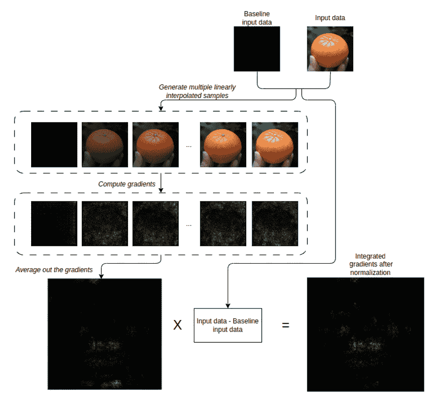
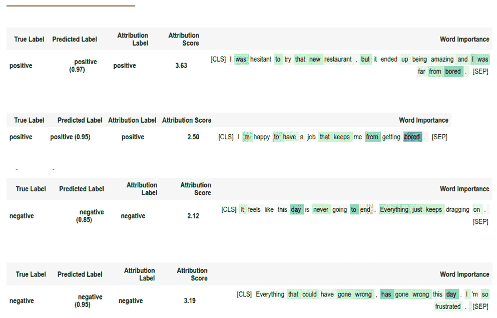

# 第十一章：解释神经网络预测

你是否曾经想过，为什么一个面部识别系统将一张肤色较深的人的照片标记为假阳性，而正确识别肤色较浅的人？或者，为什么一辆自动驾驶汽车选择转向并造成了事故，而不是刹车并避开碰撞？这些问题展示了在关键应用场景下理解模型为何做出某个预测值的重要性。通过为模型的预测提供解释，我们可以深入了解模型如何工作以及为何做出特定决策，这对于透明度、问责性、信任度、符合法规的要求以及提高表现至关重要。

本章将探讨用于解释模型预测的神经网络特定方法。此外，我们还将讨论如何量化解释方法的质量。我们还将讨论模型解释的挑战和局限性，以及如何评估其有效性。

具体来说，将涵盖以下主题：

+   探索预测解释的价值

+   解密预测解释技术

+   探索基于梯度的预测解释

+   信任和理解集成梯度

+   使用集成梯度来帮助理解预测

+   自动解释预测

+   探索预测解释中的常见陷阱及如何避免它们

# 技术要求

本章包括一些 Python 编程语言中的实际实现。要完成它，你需要在计算机上安装以下库：

+   `pandas`

+   `captum`

+   `transformers-interpret`

+   `transformers`

+   `pytorch`

+   `numpy`

代码文件可在 GitHub 上找到：[`github.com/PacktPublishing/The-Deep-Learning-Architect-Handbook/tree/main/CHAPTER_11`](https://github.com/PacktPublishing/The-Deep-Learning-Architect-Handbook/tree/main/CHAPTER_11)。

# 探索预测解释的价值

首先，通过模型的预测来解释模型的概念被称为许多其他名称，包括可解释 AI、可信 AI、透明 AI、可解释机器学习、负责任的 AI 和伦理 AI。在这里，我们将这种范式称为**预测解释**，这是一个简洁且明确的说法。

**预测解释**并不是大多数机器学习从业者采用的技术。预测解释的价值在很大程度上取决于具体的应用场景。尽管有说法认为，解释能够提高透明度、问责性、信任度、符合法规的要求，以及提升模型表现，但并不是每个人都关心这些问题。与其了解其好处，我们不如从另一个角度来审视，探索一些常见因素，这些因素促使从业者采用预测解释，通常归因于以下条件：

预测解释技术为利用您构建的模型提供以下好处：

+   **透明性**：预测解释使得模型预测的消费者能够了解理由，这反过来会增强消费者对预测结果的信任。一个透明的模型使消费者能够客观评估其智能，从而增加信任度并促进采用。

+   **问责制**：预测解释使得消费者能够进行根本原因分析，这在关键使用案例或在决策过程中有人工干预、以模型预测作为参考的使用案例中尤其重要。

+   **信任**：没有信任，没人会使用模型的预测。预测解释有助于在建立更高信任的过程中提供一小步推动。

+   **合规性要求**：一些政府执行法律，要求在某些行业（如银行和保险）中，由计算机系统做出的决策必须可解释。

+   **度量性能**：进行根本原因分析的能力可以帮助更好地理解模型的行为或训练数据集。这反过来又能使机器学习从业者通过预测解释来改进或修复发现的问题，最终提高度量性能。

这份好处清单使得在任何使用案例和模型中使用预测解释都变得值得。然而，在某些条件下，使用预测解释的价值呈指数增长。当使用是基于特定目标时，该方法的效果将加倍。让我们进一步探讨一些促使从业者采用预测解释技术的常见条件：

+   **关键和高影响力的使用案例**：在这些使用案例中，模型的决策通常会对人类福利、安全或福祉产生重大后果。全面理解模型的行为有助于降低最坏情况的发生风险。这些后果可能从数十亿的损失到实际的人命丧失。

+   **未达到成功所需的阈值**：如果机器学习项目在模型开发阶段无法达到成功的阈值，那么它就无法进入机器学习生命周期中的模型部署阶段。理解模型对不同输入的行为可以帮助判断数据质量是否差，帮助发现数据是否存在促进过拟合的偏差模式，并且通常有助于调试如何改进模型的性能。

+   **模型在最简单的例子中做出错误预测**：在最复杂的例子中做出错误预测是可以预见的，尤其是当人类在做出相同决策时也可能犯错。然而，在最简单的例子中出现错误，说明模型没有学习到正确的内容。了解模型聚焦的内容可能是理解模型失败原因的关键。

+   **监管法律要求在决策过程中对使用机器学习模型的责任进行追溯**：这意味着预测解释将不再仅仅是机器学习从业人员理解模型如何在不同输入下行为的工具，而是在模型部署后使用，帮助使用这些预测结果的人们理解为何做出某个决策，从而确保责任可追溯。

+   **模型在部署后未能做出正确预测**：你是否曾考虑过，在交叉验证设置中，具有高准确性度量性能的好模型是否意味着模型关注的是正确的内容？即使使用交叉验证分区策略，数据仍然可能偏向某些特定的条件。这意味着，当模型在实际环境中部署时，它遇到的数据可能来自于与原始模型开发数据集不同的分布和条件。在这种情况下，预测解释可以帮助揭示模型在新数据或用于模型开发的数据中的偏差和不良行为。换句话说，你需要量化正确预测和错误预测之间的差异。

在你的使用案例和开发工作流中，不使用预测解释技术也是可以的。然而，当遇到这些极端情况时，预测解释技术将是你克服障碍的关键工具。但预测解释究竟解释了什么呢？在接下来的部分，我们将简要介绍预测解释方法，并深入探讨本章将介绍的、专门针对神经网络的预测解释方法。

# 解密预测解释技术

预测解释是一种尝试解释模型决策背后逻辑的技术，给定输入数据。一些机器学习模型被设计为开箱即用时就更具透明性和可解释性。例如，决策树模型就是一个从头开始构建的模型，使用显式的条件规则将数据划分成多个分区，最终得出特定的决策，从而可以通过预测数据样本时使用的显式规则来解释预测结果。然而，像神经网络这样的模型通常被视为黑箱，没有直接的方式来获取决策背后的原因。

一个模型对数据样本的决策逻辑可以通过多种方式进行解释和展示，只要它包含关于最终决策如何做出的信息。此外，机器学习模型做出的预测可以以模型无关或特定模型的方式进行解释。使用模型的预测可以进行几种类型的解释：

+   **基于显著性（Saliency）的解释**：这也被称为重要性归因、特征重要性或特征影响

+   **透明模型逻辑基础的解释**：提供为什么做出某个决策的理由

+   **基于示例的解释**：使用相似的数据推理为什么预测某个标签

神经网络作为一个“黑箱”，只能通过基于显著性（saliency）的方法或基于示例（exemplar）的方法进行解释。然而，已经发明了绕道方法，通过使用从神经网络到更透明和可解释模型（如线性模型）的知识蒸馏方法，来实现间接的透明模型逻辑解释。此外，Transformer 中实现的注意力机制提供了一种通过其注意力图检查特征重要性的浅层方法，但在以下几个方面有所不足：

+   注意力权重并非特定于某个特征，因为它们是通过计算所有输入标记与感兴趣输出标记之间的相互作用得到的。这意味着该权重并不代表对单一特征的真正依赖。

+   注意力机制关注的输入在网络的后续部分仍然无法使用。

+   注意力图可能存在偏差，并导致某些特征被忽视。

此外，应该优先选择基于神经网络的解释技术而非模型无关的解释技术，因为它们能够提供更详细和细致的解释，同时在计算需求和时间方面更为高效。在本章中，我们将专注于使用更可靠的方法进行神经网络的基于显著性的解释。

在接下来的章节中，我们将深入探讨神经网络模型特定解释背后的核心工作——基于梯度的显著性解释。

# 探索基于梯度的预测解释

当前最先进的神经网络基于解释技术是使用通过反向传播获得的梯度的变种。基于梯度的神经网络模型解释之所以有效，是因为它们依赖于神经网络中权重在训练过程中如何通过反向传播更新的基本原理。在反向传播过程中，计算网络中权重的损失函数的偏导数，从而得到损失函数相对于权重的梯度。

这个梯度为我们提供了输入数据对整体损失的贡献程度。记住，梯度衡量的是输入值相对于损失函数的敏感度。这意味着它提供了修改特定输入值时预测结果波动的程度，代表了输入数据的重要性。输入数据可以选择为神经网络的权重，或者是整个神经网络的实际输入。在大多数情况下，基于实际输入的解释已足以提供对重要特征组的清晰解释。然而，有时需要更精细的解释来解码高度归因且重要的实际输入数据的潜在特征。

例如，考虑使用卷积神经网络（CNN）根据图像数据识别动物品种的情况。如果一张狗站在草地上的图像，某个归因方法显示狗和草地都很重要，那么草地为什么重要呢？这可能是以下几个原因之一：

+   狗的毛发和草地是通过一个卷积滤波器识别的。

+   毛发和草地通过不同的滤波器被明确区分，但由于模型可能过拟合，认为狗必须伴随草地出现，因此它们也被视为同样重要。这可能意味着训练数据集只包含带有草地的狗的图像，暗示需要添加更多没有草地的狗的图像。

这将需要更深入地挖掘在激活的滤波器中与草地和狗相关的那些重要滤波器。即便确定了那些既重要又高度激活的滤波器，并且与草地和狗有关，仍然无法确切知道该滤波器识别的模式是什么。它是一个高级特征，比如狗的形状？还是毛发？在这种情况下，直接可视化这些模式是非常有益的。这个主题将在*第十二章*中详细讨论，*解释* *神经网络*。

然而，梯度本身并不可靠，不能直接作为解释方法。更一般来说，纯梯度作为特征重要性解释方法的质量较低。然而，解释方法的质量并不是一个定量度量。生成的解释的感知质量是主观的，取决于消费者的需求。

假设某金融机构希望开发一个信用评分模型，以确定贷款批准。该机构希望使用一种解释技术来了解哪些特征对模型预测最为重要。银行可能更倾向于选择一种解释技术，重点解释那些对信用状况影响最大的特征，如信用历史、收入和未偿还的债务。这将帮助银行做出明智的贷款决策，并有效地管理风险。

另一方面，个别贷款申请人可能更倾向于获得一种更为全面的解释，解释应提供关于模型如何评估他们的具体财务状况的洞见，包括除了前三个最重要特征之外的因素，如他们的就业历史和近期的财务困境。这将帮助申请人做出明智的决策，以便在未来改善他们的信用状况。选择合适的解释技术非常重要，因为它应当针对受众及其特定需求，确保解释清晰且有助于实现其预定目的。

即便如此，仍然存在基于公理的评估方法，这些评估方法是基于一组被认为是理想的原则或公理来进行的。在所有技术中，一种名为**集成梯度**的技术因其专注于神经网络模型，并在开发过程中力求满足广泛接受的公理而脱颖而出。

接下来，我们将了解集成梯度如何解释神经网络预测，并理解该方法如何满足广泛接受的公理。

# 信任并理解集成梯度

首先，集成梯度技术在一些开源库中已经可以直接使用，例如**shap**和**captum**。我们可以直接利用这些库中的方法，而无需重新实现该方法。然而，如果在不了解技术细节的情况下使用该方法，可能会降低对解释结果的信任。如果你不信任该技术，那么解释结果本身几乎没有任何意义。因此，如果你不解释你的预测，预测结果本身也几乎没有任何意义！在这一部分，我们将深入探讨集成梯度的作用，以便你可以信任集成梯度所能解释的内容。

集成梯度在基于基本梯度的特征重要性解释方法中添加了一些额外的组成部分。这些组成部分旨在满足几个关键公理，这些公理决定了解释方法的可靠性。这些公理如下：

+   **敏感性**：对于两个数据样本，模型在这两个样本之间给出了两个不同的预测，而这两个样本唯一的不同之处在于一个特征应被赋予非零重要性分数。像 ReLU 这样的激活函数会打破这一公理，因为当输入值为零时，梯度也会被降至零，尽管两个预测之间的结果是不同的。

+   **实现不变性**：两个在所有可能数据上表现相同的模型，必须产生相同的重要性得分。假设任何外部数据以及在整个模型生命周期中接收到的数据都包括在内。

+   **完整性**：对于人类和机器学习的解释，提供反事实报告是制作高质量解释的最佳方法之一。为了评估模型的准确性表现，使用基线模型的效果相同。对于解释方法，这意味着构建一个可以产生中立预测的基线数据样本。完整性意味着每个特征列的重要性得分必须加起来等于基线样本与目标样本之间预测得分的差异。这个公理在一些使用场景中可能更有用，比如回归问题中，预测值直接作为输出，而不是在多类设置中，预测值仅用于选择最优类别。

+   **线性**：如果你线性地组合两个神经网络模型，即简单的加权相加，那么在数据样本上的组合神经网络的解释必须等于两个单独神经网络模型解释的加权相加。模型中实现的线性行为应当得到尊重。一个直接的公理专门设计用于一些方法产生无法解释的重要性值。

现在我们已经理解了可以用来比较方法的核心公理，值得注意的是，集成梯度满足所有这些公理。简而言之，集成梯度通过从一条直线路径（线性插值）中采样的样本来集成梯度，路径从选定的基线数据样本到目标数据样本，然后将其乘以目标样本和基线样本预测值之间的差异。梯度的路径积分就是梯度值沿直线路径下的曲线下面积。这个值表示输入特征值沿路径变化时，模型输出的变化。变化速率直接转化为特征重要性。通过将这个值与实际输入值和基线输入值之间的差异相乘，我们得到集成梯度中该特征对模型输出的贡献。*图 11.1*展示了这个过程，结果是通过在一个橙子图像上计算预训练的 ResNet50 模型预测的集成梯度。该模型能够预测橙子类别，并以 46%的概率预测该图像为橙子：



图 11.1 – 使用经过预训练的 ResNet50 模型计算集成梯度的示意图，该模型能够预测橙子类别的图像

更直观地说，这意味着集成梯度衡量的是当目标输入特征的值朝向中立基准样本变化时，模型预测的变化率，并提供了根据预测正确缩放的可解释的重要性：

特征重要性 = 预测差异 × 梯度路径曲线下的面积

这使得它能够捕捉模型输出对特征在整个值范围内变化的敏感度。集成梯度确保通过从基准样本到目标样本之间线性插值路径中的样本聚合梯度，确保每个特征的贡献与其对模型输出的影响成比例。使用普通梯度作为核心，集成梯度能够满足实现不变性，因为用于计算偏导数的链式法则使得梯度可以部分计算。

对于集成梯度，如果某一特征对模型输出的影响是另一特征的两倍，那么它的归因得分将是另一特征的两倍，因为该特征沿路径的梯度将是另一特征的两倍，从而满足线性关系。此外，由于重要性是通过基准输入和目标输入之间的预测差异来缩放的，集成梯度将满足完整性公理。这些是局部解释，通过个体数据样本提供预测结果的理由。作为附加优势，通过通过均值或中位数聚合所有数据样本的局部特征重要性，你可以获得模型的全局特征重要性。

接下来，我们将尝试使用集成梯度来解释模型的预测结果。

# 使用集成梯度来辅助理解预测结果

截至写作时，两个软件包提供了易于使用的类和方法来计算集成梯度，分别是`captum`和`shap`库。在本教程中，我们将使用`captum`库。`captum`库支持来自 TensorFlow 和 PyTorch 的模型。我们将在这里使用 PyTorch。在本教程中，我们将通过解释一个名为**DeBERTA**的 SoTA（最先进）变压器模型，来处理文本情感多分类任务。让我们一步一步地来了解这个用例：

1.  首先，让我们导入必要的库和方法：

    ```py
     from transformers import (
        DebertaForSequenceClassification,
        EvalPrediction,
        DebertaConfig,
        DebertaTokenizer,
        Trainer,
        TrainingArguments,
        IntervalStrategy,
        EarlyStoppingCallback
    )
    import pandas as pd
    from sklearn.model_selection import train_test_split
    import torch
    ```

1.  接下来，我们将导入为本教程自定义的文本情感数据集：

    ```py
    df = pd.read_csv('text_sentiment_dataset.csv')
    ```

    该数据包含 100 行，三种情感类别（“中立”，“积极”，“消极”）的分布均衡。稍后我们将深入分析该数据集中的几个样本。

1.  现在，我们将定义标签映射，用于将情感标签映射到数字 ID 以及反向映射：

    ```py
    label2id = {"negative": 0, "neutral": 1, "positive": 2}
    id2label = {v: k for k, v in label2id.items()}
    ```

1.  接下来，我们将创建一个方法，应用文本预处理，通过使用预训练的基于字节对编码的分词器对文本数据进行分词：

    ```py
    tokenizer = DebertaTokenizer.from_pretrained("microsoft/deberta-base")
    def preprocess_function(examples):
        inputs = tokenizer(examples["Text"].values.tolist(), padding="max_length", truncation=True)
        inputs["labels"] = [label2id[label] for label in examples["Sentiment"].values]
        return inputs
    ```

1.  为了训练一个模型，我们需要制定交叉验证策略，因此我们将在这里使用一个简单的训练和验证集划分：

    ```py
    train_df, test_df = train_test_split(df, test_size=0.2, random_state=42)
    ```

1.  由于我们将使用来自 Hugging Face Transformers 库的 PyTorch 模型，我们需要使用 PyTorch 数据集格式并拆分数据集以训练模型。在这里，我们将定义 PyTorch 数据集并初始化训练和验证数据集实例：

    ```py
    class TextClassificationDataset(torch.utils.data.Dataset):
        def __init__(self, examples):
            self.examples = examples    def __getitem__(self, index):
            return {k: torch.tensor(v[index]) for k, v in self.examples.items()}    def __len__(self):
            return len(self.examples["input_ids"])train_dataset = TextClassificationDataset(preprocess_function(train_df))
    test_dataset = TextClassificationDataset(preprocess_function(test_df))
    ```

1.  现在数据集已经预处理完成，准备好用于训练，让我们从 Hugging Face 加载我们随机初始化的 DeBERTA 模型：

    ```py
    deberta_config = {
               "model_type": "deberta-v2",
               "attention_probs_dropout_prob": 0.1,
               "hidden_act": "gelu",
               "hidden_dropout_prob": 0.1,
               "hidden_size": 768,
               "initializer_range": 0.02,
               "intermediate_size": 3072,
               "max_position_embeddings": 512,
               "relative_attention": True,
               "position_buckets": 256,
               "norm_rel_ebd": "layer_norm",
               "share_att_key": True,
               "pos_att_type": "p2c|c2p",
               "layer_norm_eps": 1e-7,
               "max_relative_positions": -1,
               "position_biased_input": False,
               "num_attention_heads": 12,
               "num_hidden_layers": 12,
               "type_vocab_size": 0,
               "vocab_size": 128100
    }
    model_config = DebertaConfig(id2label=id2label, label2id=label2id, **deberta_v3_config)
    model = DebertaForSequenceClassification(model_config)
    ```

1.  由于这是一个多类别设置，我们将使用准确率度量，它将在每个周期计算，并与交叉熵损失一起使用，后者将用于训练模型：

    ```py
    def compute_metrics(p: EvalPrediction):
        preds = p.predictions[0] if isinstance(p.predictions, tuple) else p.predictions
        preds = np.argmax(preds, axis=1)
        return {"accuracy": (preds == p.label_ids).astype(np.float32).mean().item()}
    ```

1.  现在，我们将定义训练参数：

    ```py
    training_args = TrainingArguments(
        output_dir="./results",
        num_train_epochs=1000,
        per_device_train_batch_size=8,
        per_device_eval_batch_size=16,
        warmup_steps=100,
        weight_decay=0.01,
        logging_dir="./logs",
        logging_steps=10,
        evaluation_strategy=IntervalStrategy.EPOCH,
        save_strategy=IntervalStrategy.EPOCH,
        load_best_model_at_end=True,
        learning_rate=0.000025,
        save_total_limit=2,
    )
    ```

    这将把检查点保存到`results`文件夹中，用 100 次热身迭代训练模型，在训练结束时加载最佳模型，并将模型学习率设置为非常小的 0.000025，这是正确收敛到解所必需的。

1.  接下来，我们将初始化 Hugging Face 的`trainer`实例，它将接收训练参数并利用这些参数执行实际的训练过程：

    ```py
    trainer = Trainer(
        model=model,
        args=training_args,
        train_dataset=train_dataset,
        eval_dataset=test_dataset,
        compute_metrics=compute_metrics,
        callbacks = [EarlyStoppingCallback(early_stopping_patience=20)]
    )
    ```

    请注意，使用了 20 次迭代的提前停止。当模型在指定的迭代次数内没有在验证集上有所改进时，提前停止将停止模型的训练，同时进行 1,000 次训练周期。

1.  最后，让我们进行训练并打印出最终的最佳模型评估分数！

    ```py
    trainer.train()
    trainer_v2.evaluate()
    ```

    这将产生如下输出：

    ```py
    {'eval_loss': 0.1446695625782013,
     'eval_accuracy': 0.9523809552192688,
     'eval_runtime': 19.497,
     'eval_samples_per_second': 1.077,
     'eval_steps_per_second': 0.103}
    ```

1.  95.23%的准确率对于一个多类别模型来说是一个相当不错的分数。你可能认为该模型已经足够好，能够部署，但它真的是表面看到的那么简单吗？让我们通过使用集成梯度的预测解释来调查模型的行为，看看它的表现如何。首先，让我们从`transformers_interpret`库定义解释器实例：

    ```py
    from transformers_interpret import SequenceClassificationExplainer
    cls_explainer = SequenceClassificationExplainer(model, tokenizer)
    ```

    `transformers_interpret`库在底层使用`captum`库，并实现了方法和类，使得基于 Hugging Face Transformers 库构建的模型可以轻松地解释和可视化文本重要性。在所有这些操作中，我们将重要性得分映射到颜色代码，并将令牌 ID 映射回实际的令牌字符串。

1.  接下来，我们将解释来自验证集的两个样本，分别是负标签和正标签，这些样本恰好位于前面三个索引位置：

    ```py
    for idx in [0, 8, 6, 12]:
        text = test_df['Text'].iloc[idx]
        label = test_df['Sentiment'].iloc[idx]
        word_attributions = cls_explainer(text)
        cls_explainer.visualize()
    ```

    这将导致*图 11.2*中显示的输出：



图 11.2 – 基于 transformers_interpret 的集成梯度在验证数据集上的结果

绿色高亮的词表示积极的归因，而红色高亮的词表示对预测标签类别的负面归因。绿色越深，表示对预测标签类别的积极归因越强。红色越深，表示对预测标签类别的负面归因越强。

1.  第一个和第二个示例显示了正确预测的积极情感句子。对于第一个示例，根据常识，*amazing* 是最应该对积极情感归因的词汇。对于第二个示例，*happy* 应该是对积极情感做出贡献的词汇。然而，在这两个示例中，词汇 *bored* 被错误地用作强烈的积极情感预测指标，这不是我们想要的行为。这表明数据集存在偏差，词汇 *bored* 可能在所有标记为积极情感的样本中都有出现。

1.  第三个和第四个示例展示了正确预测的负面情感。在第三个示例中，句子 *never going to end* 和 *keeps dragging on* 应该是负面情感预测的重点。在第四个示例中，词汇 *wrong* 以及短语 *has gone wrong* 和 *so frustrated* 应该是负面情感预测的重点。然而，这两个示例都始终依赖于词汇 *day* 来进行负面情感预测。这表明数据集存在偏差，词汇 *day* 经常出现在标记为负面情感的样本中。

1.  所有这些意味着，要么需要重新准备数据，要么需要添加更多的数据，以多样化词汇使用的分布，这样才能构建一个合适的模型。

本教程展示了利用预测解释可以获得的一种单一类型的好处。特别是，它展示了模型未能捕捉到可靠部署所需的行为，即便基于准确率的指标得分良好。

集成梯度技术是一种灵活的技术，可以应用于任何神经网络模型以及任何类型的输入变量类型。为了从解释结果中受益，你需要在业务目标的背景下得出有意义的见解。要从集成梯度的结果中得出有意义的见解和结论，运用常识和逻辑推理至关重要，正如在教程中手动演示的那样。然而，有一种方法可以帮助你获得有意义的见解，尤其是在数据量过大且变数太多无法手动解码时。我们将在下一节中深入讨论这个方法。

# 自动解释预测解释

一种从预测解释中得出洞见的有用方法就是使用**大型语言模型**（**LLMs**），例如 ChatGPT。ChatGPT 是一个训练用于提供与给定指令相关的逻辑推理结果的变换模型。理论上，如果你能将预测解释数据格式化，以便可以输入到变换模型中，并指示 LLM 从中获取洞见，你就能够从多个不同角度获得洞见。

在前面的教程中，我们尝试解释了四个不同样本的解释，这些样本包括两个正确预测的正面情感示例和两个正确预测的负面情感示例。现在，让我们使用 LLM 模型来获得一些洞见。这里，我们将分别为两个正确识别的正面情感和两个正确识别的负面情感示例生成洞见，因为与直接插入所有四个示例相比，这种方法往往能提供更合理的结果。我们使用了以下提示：

```py
"I have built a sentiment classification model using HuggingFace defined classes, with 3 labels "neutral", "positive", "negative". I also utilized the integrated gradients method to obtain token attributions for the examples below: First Example with correctly predicted positive sentiment [('[CLS]', 0.0), ('I', 0.04537756915960333), ('was', 0.32506422578050986), ('hesitant', -0.011328562581410014), ('to', 0.2591512168119563), ('try', 0.07210600939837246), ('that', 0.1872696259797412), ('new', 0.25720454853718405), ('restaurant', 0.09906425532043227), (',', -0.08526821845533564), ('but', 0.26155394517459857), ('it', 0.029711535733103797), ('ended', 0.03380972261608883), ('up', 0.10830705227933887), ('being', 0.09771634151976362), ('amazing', 0.08913346633282519), ('and', 0.1429717885722044), ('I', 0.3408664658447834), ('was', 0.3248006076552883), ('far', 0.11463247647745932), ('from', 0.29795241654484333), ('bored', 0.4944594024849995), ('.', 0.10894853119482743), ('', 0.0376325816741505), ('[SEP]', 0.0)] Second example with correctly predicted positive sentiment [('[CLS]', 0.0), ('I', 0.00293608614786346), ("'m", 0.30945414416090317), ('happy', -0.028173800615734133), ('to', 0.31870826361945737), ('have', 0.15675763188868433), ('a', 0.07581024366375723), ('job', -0.020856788304256305), ('that', 0.20868353147138577), ('keeps', 0.2024940149527261), ('me', 0.046306584007035426), ('from', 0.41459097144711715), ('getting', 0.059558828031696716), ('bored', 0.7089862879353616), ('.', 0.0744570784079903), ('', -0.02775527287562979), ('[SEP]', 0.0)],  Tell me anything wrong about this model to predict positive and negative attributions. Provide me a complete analysis and see if the most highly attributed words make sense for its predicted label. Judge the models based on the relative score and focus on the highest scored token individually and see whether it make sense."
```

请注意，单词令牌和归属元组的列表是前面教程中`word_attributions`变量的内容。对于这个提示，ChatGPT 模型返回了以下未修改的响应：

**根据给定的示例，模型在预测正面情感方面表现良好，因为在两个案例中预测的标签都是正确的。然而，值得注意的是，词汇归属应谨慎解读，因为它们并不总是可靠的指标，无法准确反映句子中每个单词的重要性。**

**观察第一个示例的词汇归属，我们可以看到最高归属的词是“bored”，得分为 0.494。对于正面情感的句子来说，这可能看起来很奇怪，但模型可能高估了这个词的重要性，因为它是在否定一个最初存在的负面情感。模型也许已经学会了克服无聊是人们认为积极的事情。第二高归属的词是“I”和“was”，它们的得分都在 0.3 以上，这很合理，因为它们表明了写作者的个人经验和观点。其他高度归属的词，如“to”、“from”和“new”，也似乎在句子的语境中是合适的。**

**查看第二个例子的标记归属，我们可以看到归属分数最高的词是“bored”，得分为 0.709。这可能是因为模型对“这份工作让作者不至于感到无聊”这一事实给予了很高的权重，这被视为一件积极的事情。第二高的归属词是“from”，得分为 0.415，在句子的上下文中也是合理的，因为它表示这份工作让作者避免了做某事。其他高度归属的词语，如“to”和“that”，也似乎在** **句子的上下文中有意义。**

**总体来说，虽然模型在预测积极情绪方面表现良好，但需要注意的是，标记归属可能是嘈杂的，应该谨慎解读。高度归属的词语在句子的上下文中似乎是有道理的，但重要的是要看整个句子，而不仅仅是单个词语，以便全面理解** **情绪。**

这个回应提供了对我们原始见解的不同看法，并提到一些怀疑的可能性并没有错。总体来说，这是一个不错的回应，它给我们提供了关于可能发生情况的不同视角，并表明大语言模型（LLM）可以用来解释预测结果的解释，作为一种辅助工具。现在，让我们用以下列表中的两个例子来替换归属结果，这些例子正确地识别为负面情绪：

```py
Third example with correctly predicted negative sentiment
[('[CLS]', 0.0), ('It', 0.1781266370024602), ('feels', -0.08200280620716707), ('like', -0.03204718164120957), ('this', -0.05573060889100964), ('day', 0.6176120940811932), ('is', -0.0032201843949800626), ('never', 0.20518569446424909), ('going', 0.07198217726867306), ('to', 0.45876287617527467), ('end', -0.2538220352877727), ('.', -0.01766876291225962), ('Everything', 0.2927810551003227), ('just', 0.27789343264100713), ('keeps', 0.25860811147952395), ('dragging', 0.013653081036146358), ('on', 0.12974700461873728), ('.', -0.01804386178839869), ('', 0.07940230083266143), ('[SEP]', 0.0)]
Fourth example with correctly predicted negative sentiment [('[CLS]', 0.0), ('Everything', 0.051921060773658365), ('that', 0.1853413631332932), ('could', 0.16644341050771988), ('have', 0.09960723832267326), ('gone', 0.21400474006976702), ('wrong', 0.26952621495013096), (',', -0.02550525756341266), ('has', 0.46511206263887517), ('gone', 0.21385297386310367), ('wrong', 0.2691861963676513), ('this', 0.08573245861889027), ('day', 0.5967441822322336), ('.', 0.00910580036050777), ('I', 0.16215574709799985), ("'m", -0.05665909043004983), ('so', 0.20818789342264885), ('frustrated', 0.11472844834437185), ('.', 0.00924431805079032), ('', 0.1485924275199782), ('[SEP]', 0.0)]
```

ChatGPT 模型提供了以下回应：

**从提供的例子来看，模型似乎在这两种情况下都正确地预测了负面情绪。然而，有几个方面可以分析，以确定模型是否表现良好** **或不良。**

**首先，集成梯度方法提供的标记归属指示了每个标记对模型最终预测的贡献。在这两个例子中，归属分数最高的标记是“day”和“has gone wrong”，这似乎是有道理的，因为它们表明了** **负面情绪。**

**然而，提供的标记归属存在一个问题，即某些标记的归属分数为负，这意味着它们对最终预测产生了负面影响。例如，在第一个例子中，标记“feels”具有负归属分数，但可以认为它实际上表明了负面情绪。类似地，在第二个例子中，标记“'m”具有负归属分数，但它是“I am”的缩写，表示** **负面情绪。**

**另一个需要考虑的因素是最高归因令牌的相对得分。在第一个例子中，令牌“day”的归因得分显著高于其他任何令牌，这表明它在此案例中是预测负面情绪的最重要特征。然而，在第二个例子中，存在多个归因得分相似较高的令牌，例如“has gone wrong”和“frustrated”，这表明它们在预测负面情绪时是同样重要的特征。**

**总体而言，基于提供的例子和令牌归因，模型在预测负面情绪方面表现得相当不错。然而，令牌归因的分析表明，集成梯度方法可能在将得分归因于某些令牌时存在一些问题。还需要考虑最高归因令牌的相对得分和可解释性，以确定它们在预测标签的上下文中是否合理。**

ChatGPT 的两个回答似乎都表示这种行为是有效的。由于大多数神经网络被配置为非线性模型，并具有许多非线性激活，记住该模型能够学习令牌之间的复杂交互。这意味着令牌通常是通过一种复杂的方式被模型感知的，这可能使它们彼此依赖。一个在原始上下文中具有高归因的令牌，在应用到另一个上下文时，可能不会产生相同的归因结果，因为多个令牌可能会相互依赖，作为产生强归因的前提。此外，令牌并不局限于与直接相邻的令牌进行交互，它们可以出现在文本行的任何位置。验证令牌是否过拟合的一种方法是通过预测仅包含`day`令牌的文本数据，看看它是否会预测为负面情绪，并通过预测包含`bored`令牌的文本数据，看看它是否会预测为正面情绪：

```py
from transformers import TextClassificationPipeline
full_model = TextClassificationPipeline(model=model, tokenizer=tokenizer)
print(full_model("day"))
print(full_model("day day"))
print(full_model("day day day"))
print(full_model("day day day day"))
print(full_model("bored"))
print(full_model("bored bored"))
print(full_model("bored bored bored"))
print(full_model("bored bored bored bored"))
```

这将返回以下响应：

```py
[{'label': 'neutral', 'score': 0.9857920408248901}]
[{'label': 'negative', 'score': 0.5286906361579895}]
[{'label': 'negative', 'score': 0.9102224111557007}]
[{'label': 'negative', 'score': 0.9497435688972473}]
[{'label': 'neutral', 'score': 0.9852404594421387}]
[{'label': 'positive', 'score': 0.8067558407783508}]
[{'label': 'positive', 'score': 0.974130392074585}]
[{'label': 'positive', 'score': 0.9776705503463745}]
```

有趣的是，单独使用`day`和`bored`令牌时，预测结果是中性情绪。你添加更多重复令牌时，预测结果将分别偏向负面和正面情绪。这证明模型确实对这些特定的词存在偏见，并且没有以正确的方式使用这些词，正如 ChatGPT 所说。请注意，这很可能是 ChatGPT 对你的案例做出的预测。

本教程展示了基于文本的神经网络的解释。然而，它也可以类似地应用于其他数据类型，如数值数据、分类数据或任何可以可靠地表示为文本格式的数据。特别是对于基于图像的预测解释，您可以使用像 OpenAI 的 GPT-4 这样的模型，它同时接受图像数据和文本数据。您还可以考虑使用`transformers_interpret`库中的可视化图像，并将其输入到 GPT-4 中！

接下来，我们将深入探讨在尝试解释您的预测和建议时常见的陷阱，并提供避免这些陷阱的建议。

# 探索预测解释中的常见陷阱以及如何避免它们

尽管预测解释已被证明是理解 AI 模型的宝贵工具，但有几个常见的陷阱可能会妨碍其效果。在本节中，我们将讨论这些陷阱，并提供避免它们的策略，确保预测解释继续成为理解和改进 AI 模型的有价值资源。以下是一些常见的陷阱及其解决方案：

+   **过度依赖解释**：尽管预测解释可以为模型的决策过程提供宝贵的见解，但过度依赖这些解释可能导致错误的结论。重要的是要记住，预测解释只是拼图中的一块，应该与其他评估方法结合使用，以全面了解模型的表现。这里的解决方案是使用多种评估方法的组合，包括性能指标、交叉验证和专家领域知识，来分析和验证模型的表现。

+   **误解解释结果**：解释预测结果可能是具有挑战性的，尤其是当处理复杂模型和大型数据集时。误解这些结果可能会导致关于模型行为和性能的错误结论。这里的解决方案是与领域专家合作，帮助解释结果，并确保从这些解释中得出的结论与现实世界的知识和预期一致。

+   **忽视模型的局限性**：预测解释能够提供关于模型决策过程的宝贵见解，但它们无法解决模型本身的固有局限性。承认并解决这些局限性是至关重要的，以确保模型的最佳性能。这里的解决方案是进行彻底的模型评估，识别并解决任何局限性，如过拟合、欠拟合或偏倚的训练数据。不断地重新评估并根据需要更新模型，以维持其最佳性能。

+   **针对错误受众的解释**：不同的利益相关者可能需要根据其专业知识和需求提供不同类型的解释。为目标受众提供过于技术化或过于简化的解释，会妨碍他们对预测的理解和使用。解决方案是根据目标受众的需求和专业知识量身定制解释。有时，需要对模型进行更为整体的解释，而不是逐个预测的解释，这种情况下可以考虑使用神经网络解释技术和聚合评估指标。对于非技术用户，仅通过提供原始特征重要性来解释预测是不够的，还需要通过自然语言解释从特征重要性中获得的见解，如*自动解释预测解释*部分所介绍的那样。对于有技术意识的用户，预测解释是合适的。

通过意识到这些常见的陷阱并实施避免策略，从业人员可以确保预测解释仍然是理解和改进人工智能模型的重要工具。通过将预测解释与其他评估方法结合，并与领域专家合作，可以全面了解模型的性能、行为和局限性，从而最终获得更准确、可靠的人工智能系统，更好地服务于其预期目标。

# 总结

在本章中，我们对预测解释的全貌进行了广泛的了解，深入探讨了集成梯度技术，实际应用于一个案例，并尝试通过 LLMs 手动和自动地解释集成梯度结果。我们还讨论了预测解释中的常见陷阱，并提供了避免这些陷阱的策略，确保这些解释在理解和改进人工智能模型中的有效性。

集成梯度是一种有用的技术和工具，可以为你的神经网络做出预测提供一种基于显著性的解释。通过预测解释来理解模型的过程提供了许多好处，这些好处可以帮助实现成功的机器学习项目和计划所需的标准。即使一切顺利，且机器学习应用场景并不关键，通过任何预测解释技术揭示你可能部署的模型行为，也可以帮助你改进模型的使用方式。

然而，基于显著性的解释只能帮助你了解哪些输入数据或输入神经元是重要的。但是，一个神经元从输入数据中能够检测到什么模式仍然是未知的。在下一章，我们将扩展这一方向，揭示理解神经元检测到的具体内容的技术。

通过意识到常见的陷阱并实施避免这些陷阱的策略，从业人员可以确保预测解释继续作为理解和改进 AI 模型的有价值工具。将预测解释与其他评估方法结合，并与领域专家合作，可以创造出更加准确可靠的 AI 系统，更好地服务于其预定目的。

在我们结束之前，最后要说的是，确保抽出时间通过预测解释技术（如积分梯度）来理解你的神经网络模型，并考虑潜在的陷阱，以最大化其效果！

# 进一步阅读

+   Mukund Sundararajan, Ankur Taly, Qiqi Yan. *深度网络的公理化归因*，载于：国际机器学习会议，2017\. 网址：[`arxiv.org/abs/1703.01365v2`](https://arxiv.org/abs/1703.01365v2)。
