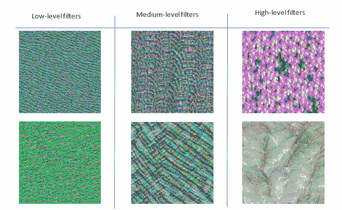
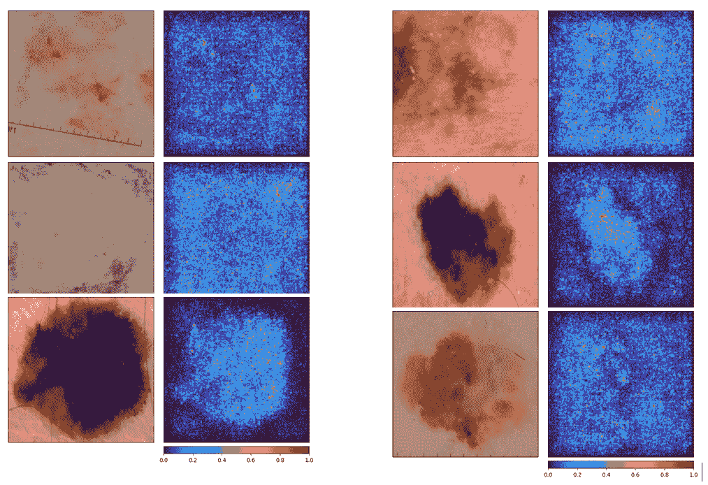
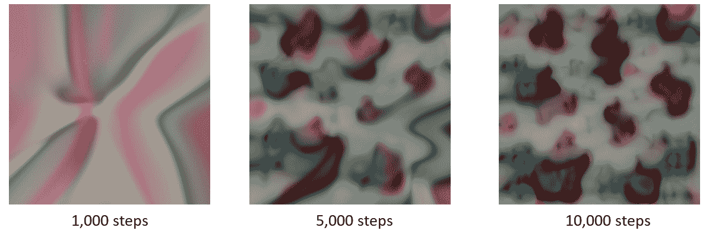
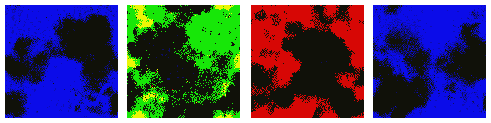

# 第十二章：解读神经网络

在尝试理解模型预测背后的原因时，局部单样本特征重要性可以是一个有价值的工具。此方法使你能够将分析重点集中在输入数据的较小部分，从而更有针对性地理解对模型输出起到重要作用的关键特征。然而，通常仍然不清楚模型使用了哪些模式来识别高度重要的特征。通过回顾来自目标样本的更多预测解释，战略性地辨别预测的实际原因，某种程度上可以规避这一问题，实际操作部分将在本章稍后介绍。然而，这种方法受到必须验证的样本数量的限制，有时仍然很难明确指出具体使用的模式。

**深度神经网络**（**DNNs**）学习低层到高层特征，帮助预测层在幕后辨识正确的标签。当我们在输入数据上使用基于局部特征重要性的解释时，我们无法确定到底是哪些低、中或高层的模式对输入数据的特征重要性做出了贡献。对于图像，这些特征从低层的简单形状到中层的人的轮廓形状，再到逐步组合成一个人的面孔或日常物品的模式。对于文本，这些特征从低层的词嵌入（表示单词的意义）到中层的语义角色（如句子中的单词角色，帮助正确表示文本意义的句子嵌入），一直到我们更熟悉的高层特征，如主题和情感。当然，这些只是我们对神经网络学习内容的理论假设。

本章将探讨一种方法，帮助清除深度神经网络学习特征中的所有模糊性，即通过输入优化直接可视化神经网络所检测到的模式。通过将直接学习的模式与激活过滤相结合进行可视化，我们可以揭示深度神经网络做出预测的实际原因。具体来说，本章将讨论以下主题：

+   解读神经元

+   寻找可解读的神经元

+   解读学习到的图像模式

+   发现反事实解释策略

# 技术要求

本章包括在 Python 编程语言中的实际实现。为完成本章，你需要一台已安装以下库的计算机：

+   `torchvision`

+   `torch`

+   `torch-lucent==0.1.8`

+   `matplotlib==3.3.0`

+   `captum`

+   `pillow`

+   `numpy`

代码文件可以在 GitHub 上找到：[`github.com/PacktPublishing/The-Deep-Learning-Architect-Handbook/tree/main/CHAPTER_12`](https://github.com/PacktPublishing/The-Deep-Learning-Architect-Handbook/tree/main/CHAPTER_12)。

# 解释神经元

神经网络层中的神经元产生的特征将被后续层使用。这些产生的特征或激活值仅仅是学习到的模式在输入数据中显著性的一个指示。但你是否曾经想过这些模式是什么？解码神经网络实际学习到的模式可以进一步提高透明度，从而帮助实现*第十一章*中*探索预测解释的价值*部分提到的目标，*解释神经网络预测*。

数据由许多复杂的模式组合成单一样本。传统上，为了辨识神经元在检测什么，必须评估大量输入数据并与其他数据进行比较，以便由人类得出定性的结论，这既耗时又很难做到准确。该方法使我们能够直观地 pinpoint 产生高激活值的实际模式，而不受其他高度相关模式的干扰。

更正式地说，通过优化进行的特征可视化在以下用例中是有用的：

+   理解与混淆标签相关的模式，而无需领域专家的帮助：

    +   这种情况在真实世界的音频数据中更为常见，在这些数据中，标签的声音常常与大量噪声混合在一起

    +   这也可能发生在图像数据中

+   直接获取真实数据来测试关于神经网络学习内容的任何假设并非易事，且无法通过基于梯度的特征归因技术在可用数据上得到证明。

神经元解释技术的核心是**神经输入优化**，这是一种修改神经网络输入数据的过程，目的是使其在选择的神经元上产生高度激活。记住，在训练过程中，我们优化神经网络的权重以减少损失值。在这种技术中，我们随机初始化一个输入并优化该输入数据，使其在选定的神经元上产生高度激活，实际上将输入数据视为神经网络的权重。梯度可以自然地计算到输入数据阶段，使得在应用学习率后，可以根据计算的梯度更新输入数据。该技术还允许你联合优化多个神经元，使它们同时高度激活，并获得一张展示两种不同神经元如何共存的图像。

*图 12.1*展示了`efficientnet-b0`模型中从低级到中级和高级模式的概念：



图 12.1 – 来自 efficientnet-b0 模型的随机滤波器优化图像示例

如果你观察高层次的滤波器模式，第一个在随机滤波器上的优化图像看起来有点像花朵，第二个图像则像叶子图案。

然而，这种技术的一个主要警告是，得到的优化输入数据可能并不能代表与神经元相关的模式的所有真实变化。即使是像图像这样的动态输入数据变量，也可以被优化以多种方式展示模式，但最终的优化输入仍然可能会遗漏一些模式的表现。解决这个警告的一个好方法是，首先获得初始的优化输入数据变体，然后执行后续优化，并确保优化后的输入数据与初始变体不同。这可以通过联合优化一个额外的组件——即初始优化输入数据与当前优化输入数据之间的负余弦相似度来实现。这一技术有助于生成多样化的输入数据示例。但在你能够优化输入数据并尝试解释神经元之前，你需要一个策略来选择最佳的神经元进行输入数据优化，这将在下一节中讨论。

# 查找需要解释的神经元

在当今的最先进架构中，拥有数百万甚至数十亿个神经元，解释每一个神经元是不可行的，坦率来说，这也是浪费时间。选择要解释的神经元应根据你的目标来决定。以下列表展示了一些不同的目标和选择合适神经元的相关方法：

+   **找出某个预测标签或类别模式的样子**：在这种情况下，你应该简单地选择一个特定的神经元，用于预测目标标签或类别。这通常是为了理解模型是否很好地捕捉了该类别的模式，或者它是否学习到了无关的特征。在多标签场景中，多个标签总是一起存在，你希望解耦这些标签，从而更好地理解与单一标签相关的输入模式，这时这也会很有用。

+   **想要理解在数据集中为什么某个特定标签可以被预测，或者一般而言所有标签的潜在原因**：在这种情况下，你应该从全局神经元重要性评分中选择潜在中间层中最具影响力的神经元。全局神经元重要性可以通过聚合集成梯度方法的结果来获得，该方法应用于你验证数据集中的所有神经元（此方法在*第十一章*，*解释神经网络预测*中有介绍）。然后可以对所有神经元的影响值进行排名，并挑选出最重要的神经元。

+   **找出基于显著性解释技术的预测原因的细分理由**：在这种情况下，您应选择具有最高激活值和最高重要性得分的神经元。高度激活的神经元并不一定意味着它对某种预测很重要。此外，重要的神经元并不意味着该神经元被激活。利用整合梯度的重要性值和激活值来获取最重要的神经元将有助于确保选择您关心的神经元。此外，如果基于初始输入数据显著性地图有一个关注区域，您可以进一步通过仅选择影响所选关注区域的神经元来过滤出更多神经元。

+   **理解多个标签或类别之间的相互作用**：在关注多个标签或类别之间的关系重要的情况下，您可以选择捕捉这些相互作用的神经元。识别在预测多个标签或类别时激活度高且重要性得分高的神经元。分析这些神经元可以帮助您理解模型如何捕捉不同标签或类别之间的关系，并可能揭示改进的潜在领域。

+   **研究模型对抗性攻击的稳健性**：在这种情况下，您应选择对输入数据的对抗性扰动敏感的神经元。您可以生成对抗性示例，有关如何操作请参见*第十四章*，*分析对抗性能*，然后使用整合梯度等技术计算神经元的重要性得分。通过可视化受对抗性扰动影响最大的神经元，您可以深入了解模型的脆弱性并探索潜在的防御措施。

+   **探索学习特征的分层结构**：在这种情况下，您应选择来自 NN 不同层的神经元，以理解模型如何学习分层特征。选择早期层的神经元以研究低级特征，选择更深层次的神经元以研究高级特征。您还可以选择多个神经元以协同优化输入数据以获得高激活，以了解同一输入数据中多神经元学习模式的存在方式。可视化这些神经元可以帮助您理解模型对数据的内部表示及其如何构建越来越复杂的特征。这可以提供关于模型学习过程及其改进潜力领域的见解。

+   **分析模型在不同数据集上的泛化能力**：为了了解模型在新数据上的泛化能力，应该选择在不同数据集上始终重要的神经元。使用集成梯度等技术计算不同数据集上的神经元重要性得分，并识别在所有数据集上保持高重要性得分的神经元。通过可视化这些神经元，你可以深入了解模型的泛化能力，并发现潜在的改进领域。

现在我们已经建立了选择神经元进行解释的方法，让我们从实际的角度开始探索如何用图像输入数据解释神经元！

# 解释学习到的图像模式

解释接收图像数据的神经网络（NN）开启了解释的新范式，即可视化神经元正在检测的内容。以音频输入数据为例，解释神经网络可以使我们听到神经元检测到的内容，类似于我们在图像数据中可视化模式的方式！根据你的目标选择你想理解的神经元，并通过对图像数据的迭代优化，激活该神经元以可视化它检测到的模式。

然而，实际上，基于神经元优化图像数据时，存在一个问题，即生成的图像通常会产生被认为是噪声、不可解释且不美观的高频模式。高频模式被定义为那些强度较高且变化迅速的像素。这主要是由于像素可以表示的值范围通常没有约束，而且单独的像素并不是我们关心的语义单元。放大生成的图像可能会使其更具可解释性，但解释效果会因为需要进行人工评估和额外工作而降低。

这个问题可以通过以下技术有效缓解：

+   频率惩罚 – 示例技术如下：

    +   在优化过程中随机使用双边滤波器对图像进行模糊处理，这样做的好处是还能保留边缘模式

    +   在优化过程中保守地惩罚相邻像素之间的变化

+   图像增强

+   图像预处理 – 示例技术如下：

    +   数据去相关

    +   快速傅里叶变换

让我们通过使用在 ImageNet 数据集上预训练的 121 层 densenet 模型，继续我们的学习之旅。

## 使用图像输入数据和集成梯度来解释预测结果

在本节中，我们将探讨预测，并通过一个实际教程来解释如何解释 CNN 模型的预测，该模型接受带有集成梯度的图像输入数据，并提供一些对模型做出预测的原因的见解。在本教程中，我们将发现预测解释中缺失的必要答案，这将为我们理解 CNN 模型提供帮助。我们将按以下步骤进行：

1.  本教程中，我们将使用`lucent`库，它提供了通过优化特征可视化来解释神经网络的方法。此外，我们还将使用`torch`库来处理 densenet 模型。我们还将使用`captum`库来使用集成梯度方法。让我们从导入所有必要的库开始：

    ```py
    import glob
    import numpy as np
    import torch
    import torch.nn as nn
    import torchvision.transforms as transforms
    from PIL import Image
    from captum.attr import IntegratedGradients
    from captum.attr import NoiseTunnel
    from captum.attr import visualization as viz
    from lucent.optvis import render, param, objectives
    from lucent.optvis.objectives import diversity
    ```

1.  接下来，我们将定义一个预训练的 densenet 模型的类：

    ```py
    class CNN(nn.Module):
      def __init__(self, num_classes, model='resnet50'):
        super(CNN, self).__init__()
        self.num_classes = num_classes
        self.chosen_model = model
        if self.chosen_model=='densenet121':
          self.model = models.densenet121(pretrained=True)
          self.classifier = nn.Sequential(
            nn.Dropout(p=0.1),
            nn.Linear(self.model.classifier.in_features, 256, bias=False),
            nn.ReLU(),
            nn.BatchNorm1d(256),
            nn.Linear(256, 128, bias=False),
            nn.ReLU(),
            nn.BatchNorm1d(128),
            nn.Linear(128, self.num_classes, bias=False),
            nn.BatchNorm1d(self.num_classes),
          )
          self.model.classifier = self.classifier
          model_parameters = filter(lambda p: p.requires_grad, self.model.parameters())
          params = sum([np.prod(p.size()) for p in model_parameters])
      def forward(self, x):
        return self.model(x)
    ```

1.  我们将使用定义好的模型类加载一个名为`HAM10000`的图像数据集上预训练的权重，该数据集包含七种不同的皮肤病变类别：

    ```py
    checkpoint = torch.load('0.8228 checkpoint.pt', map_location=torch.device('cpu'))
    model = checkpoint['model']
    ```

1.  预训练模型的预测层的第七个索引被训练用于预测黑色素瘤，这是一种皮肤癌。让我们看看`ISIC-2017`数据集中的一些黑色素瘤示例，并看看当预测这些图像时，预训练模型到底关注了什么。我们将使用`captum`库中的集成梯度方法。首先，让我们定义需要的预处理步骤，以便进行模型推理，这将把`numpy`图像数组转换为`torch`张量，调整图像大小为预训练的图像尺寸，并进行归一化：

    ```py
    resize_transform = transforms.Compose([
        transforms.ToTensor(),
        transforms.Resize((224, 224)),
    ])
    norm_transform = transforms.Normalize(
        mean=[0.485, 0.456, 0.406],
        std=[0.229, 0.224, 0.225])
    ```

    均值和标准差值直接来自 ImageNet 数据集，并用于预训练模型，因为在`HAM10000`数据集上预训练之前，它已在 ImageNet 上进行过预训练。此外，`224`的维度也来自于 ImageNet 预训练设置。由于我们需要在调整大小后的中间结果，因此我们单独定义了调整大小和归一化的逻辑。

1.  接下来，我们将使用`glob`库加载提供的数据集文件夹中的所有黑色素瘤图像：

    ```py
    all_melanoma_images = glob.glob("lesions_augmented_data/Data/test/Melanoma/*.jpg")
    ```

1.  我们将使用`captum`库实现的集成梯度和噪声隧道方法，以平滑结果中的归因噪声。让我们定义执行这些组件所需的实例，并定义我们感兴趣的`黑色素瘤`目标类的预测类索引：

    ```py
    integrated_gradients = IntegratedGradients(model)
    noise_tunnel_applyer = NoiseTunnel(integrated_gradients)
    prediction_label_index = 6
    ```

1.  现在我们可以遍历前六张图像，应用预处理，使用`captum`中的集成梯度方法，并最终可视化原始图像和获得的输入重要性热力图：

    ```py
    for melanoma_image in all_melanoma_images[:6]:
      pil_image = Image.open(melanoma_image)
      img = np.array(pil_image)
      transformed_image = resize_transform(img)
      input =  norm_transform(transformed_image).unsqueeze(0)
      attributions_ig_nt =  noise_tunnel_applyer.attribute(
        input, nt_samples=10, nt_type='smoothgrad_sq',
        target= prediction_label_index)
      _ = viz.visualize_image_attr_multiple(   np.transpose(attributions_ig_nt.squeeze().cpu().detach().numpy(), (1,2,0)),
    np.transpose(transformed_image.squeeze().cpu().detach().numpy(), (1,2,0)),
          ["original_image", "heat_map"],
          ["all", "positive"],
          cmap='turbo',
          show_colorbar=True)
    ```

    这将展示在*图 12.2*中呈现的可视化结果：



图 12.2 – 来自 ISIC-2017 数据集的六张真实黑色素瘤图像，以及模型的基于梯度的归因

在前五个例子中，模型似乎主要集中在较暗的斑点上，但它仍然会考虑周围的皮肤，尽管关注度较低。这可能表明模型在一定程度上依赖周围皮肤来预测黑色素瘤。但这也引发了一个问题：模型是在根据皮肤的暗度来预测黑色素瘤，还是在识别某种模式，还是两者兼有？在最后一个例子中，模型似乎没有特别集中，且并没有真正关注那些暗斑。这可能意味着皮肤有一些与黑色素瘤相关的模式，这些模式未必是颜色较深的。还有一些问题通过这些例子无法真正解答，具体如下：

+   这个模型是否依赖皮肤颜色来预测黑色素瘤？还是说它实际上是通过模式来预测的？

+   模型究竟检测到的模式是什么？

为了回答这些问题，我们将使用`lucent`库来可视化模型学到的模式，从而自信地预测黑色素瘤。

## 实际可视化带有图像输入数据的神经元

在本节中，我们将继续前面的教程，进一步探讨如何使用优化技术实际可视化带有图像输入数据的神经元，以获得对 CNN 模型所学模式和行为的深入理解。这个过程涉及选择要解释的神经元，为这些神经元优化图像数据，并应用正则化技术来生成可视化的可解释模式。通过可视化模型所学到的模式，我们可以更好地理解模型的预测，并回答传统特征重要性方法无法揭示的问题。

通过遵循本教程中概述的步骤，你可以可视化你的深度神经网络所学到的模式，从而更深入地理解模型的预测及其对这些预测有贡献的特征。这有助于回答关于模型是否依赖于某些特征的问题，比如皮肤颜色或黑色素瘤的形状，并提供关于模型模式和行为的宝贵见解。让我们开始吧：

1.  首先，让我们定义必要的变量。我们希望可视化`Melanoma`类别的图像模式，它位于第六个预测层索引处，因此我们必须按如下方式定义我们要优化的参数：

    ```py
    param_to_optimize = "classifier_8:6"
    ```

1.  接下来，在第一次迭代中，我们将使用 `lucent`，具体来说，CPPN 由多个卷积层组成，激活函数是由元素级的正切、平方、除法和连接操作构成的组合函数。这意味着我们不是直接优化图像，而是优化生成主网络输入图像的 CPPN 卷积网络的参数。反向传播可以一直执行到生成的输入图像的第一层 CPPN 网络。初始输入图像是一个固定图像，包含图像中心的圆形区域，圆心的值接近零，并且逐渐增加到圆边缘。然而，使用 CPPN 时，学习率通常需要较低才能正常收敛。让我们定义一个大小为 `224` 的 CPPN 配置，并使用学习率较低的 `Adam` 优化器：

    ```py
    cppn_param_f = lambda: param.cppn(224)
    cppn_opt = lambda params: torch.optim.Adam(params, 4e-3)
    ```

1.  最后，让我们利用定义的变量，使用 GPU 配置的模型可视化预测层中捕获的黑色素瘤部分的模式：

    ```py
    model.cuda()
    images = render.render_vis(
        model, param_to_optimize, cppn_param_f, cppn_opt,
        thresholds=np.linspace(0, 10000, 100, dtype=int).tolist(),
        verbose=True,
        show_inline=True
    )
    ```

    `thresholds` 列表组件控制优化步骤的数量，并可视化优化图像的中间步骤号。此外，`render_vis` 方法中内置的一个隐藏组件是 `transforms` 组件。`transforms` 组件添加了最小化的增强，例如填充、抖动、随机缩放和随机旋转，以减少优化图像中的随机噪声。之前代码的结果如 *图 12.3* 所示：



图 12.3 – 优化 CPPN 的进展，以生成在黑色素瘤类别预测中具有高激活度的图像

从这个过程中生成了一个相当好的图像，看起来像是实际的黑色素瘤。

1.  让我们来找出这张图像的黑色素瘤概率。我们可以通过定义进行推断所需的预处理方法来实现这一点：

    ```py
    inference_transform = transforms.Compose([
        transforms.ToTensor(),
        transforms.Resize((224, 224)),
        transforms.Normalize(mean=[0.485, 0.456, 0.406],
          std=[0.229, 0.224, 0.225]),
    ])
    ```

1.  在这里，我们预测从过程生成的最终优化图像的皮肤病变类别，同时禁用梯度计算：

    ```py
    def inference_lesion_model(img):
        transformed_image = inference_transform(img).unsqueeze(0)
        with torch.no_grad():
            output = torch.nn.functional.softmax(model(transformed_image), dim=1)
        return output
    output = inference_lesion_model(images[-1].squeeze())
    ```

    结果显示图像被预测为黑色素瘤的概率为 100%！

    然而，仅凭图像并不能明显表明所有不同类型的图像集可以被识别为黑色素瘤。有些类别可以在单张图像中充分表示，但有些标签确实无法在单张图像中表现出来。以背景类为例：不可能将每一个背景图像都放在一张图像中。以下是一些基于结果可能有用的问题：

    +   皮肤的颜色是否重要？

    +   黑色素瘤的形状是否重要，因为最终生成的图像似乎具有相似的黑色素瘤模式？

    +   黑色素瘤斑块的颜色重要吗？这里有一些绿色斑块，它们的图案与红色斑块相似。

1.  这里提到的用来确保多样性的损失函数可以提供更多的洞察。现在，让我们利用多样性目标与原始黑色素瘤预测层的目标一起，同时优化四张输入图像。批量模式功能不支持 `lucent` 中的 CPPN，只支持基本输入图像初始化的 `param` 模块：

    ```py
    obj = objectives.channel("classifier_8", 6) - 1e2 * diversity("input")
    batch_param_f = lambda: param.image(224, fft=True, decorrelate=True, batch=4)
    batch_images = render.render_vis(
        model, obj,
        batch_param_f,
        thresholds=np.linspace(0, 500, 50, dtype=int).tolist(),
        show_inline=True,
        verbose=True,
    )
    ```

    关于图像初始化方法的两个额外要点如下：

    +   `fft` 代表快速傅里叶变换

    +   `decorrelate` 对图像输入应用了 SVD

    这两种技术在研究中得到认可，能够加速收敛，减少高频图像，并生成更美观的图像。

    结果如*图 12.4*所示：



图 12.4 – 四张共同优化的图像，能够在黑色素瘤神经元上强烈激活

这些图像看起来非常独特。非黑色部分可能模拟了皮肤。我们来看一下每张图像对应黑色素瘤类别的概率，来验证一下：

```py
outputs = []
 for img_idx in range(4):
     img = batch_images[-1][img_idx]
    output = inference_lesion_model(img)
    outputs.append((output[0][6], output.argmax()))
```

这将产生如下的数组：

```py
 [(tensor(0.9946, device='cuda:0'), tensor(6, device='cuda:0')),
 (tensor(0.9899, device='cuda:0'), tensor(6, device='cuda:0')),
 (tensor(0.7015, device='cuda:0'), tensor(6, device='cuda:0')),
 (tensor(0.9939, device='cuda:0'), tensor(6, device='cuda:0'))]
```

它们的黑色素瘤概率都很高！由此可以得出以下结论：

+   模型在检测黑色素瘤时不太依赖皮肤的颜色。皮肤颜色所能提供的最大增益可能只是大约 3% 的概率提升。

+   模型主要依赖于底层低级模式来检测黑色素瘤。

+   模型对黑色素瘤斑块的颜色不太依赖。第一张生成图像和真实图像中的黑色素瘤颜色偏红，而批量生成图像中的黑色素瘤斑块颜色是黑色的。

+   模型能够从使用的真实图像中检测到较小的黑色素瘤信号。

这里的结果展示了每种洞察技术之间的互补性。我们将通过一些有用的笔记来结束这个话题，讲解关于神经元通过优化技术进行模式可视化的一般情况：

+   一些问题比其他问题更难收敛，有些问题根本无法收敛。准备好尝试多种设置，看看能否得到一个能够在你选择的神经元、通道或整个层上强烈激活的输入。你甚至可以选择多个神经元，看看它们如何相互作用！

+   损失函数可能会变得非常负，且输入收敛的越多，损失越负。这是好的，因为损失被定义为结果激活值的负数。

+   正则化技术是通过优化生成合理输入的关键。

+   使用真实数据和多样化的优化数据来理解模型学习到的检测模式。单一的优化数据通常无法代表神经元能够检测到的所有模式。

+   在本教程中，我们使用了最终分类层，这使得找到对选定神经元激活度高的样本变得更容易。如果选择的是一个中间神经元，请确保找到对该神经元激活度最高的数据集。

+   `lucent`库是基于`pytorch`的模型，而`lucid`库则是基于 TensorFlow 的模型，它们专注于图像可视化，但也可以适应其他输入变量类型，如文本。然而，目前在这方面的研究较少，尚未找到针对其他变量类型的良好正则化技术来实现更快的收敛。

总的来说，通过优化技术可视化神经元可以为**机器学习**（**ML**）模型的模式和行为提供有价值的洞察，但这需要实验和对输入及正则化技术的谨慎考虑。作为一个额外的收获，通过了解如何执行预测解释和神经网络（NN）解释，我们将发现一种叫做反事实解释的方法，可以使解释在一般情况下更为有效。

# 发现反事实解释策略

反事实解释或推理是一种通过考虑替代的和反事实的情境或“如果……会怎样”的情况来理解和解释任何事物的方法。在预测解释的背景下，它涉及识别输入数据的变化，这些变化会导致不同的结果。理想情况下，应该识别出最小的变化。在神经网络解释的背景下，它涉及到可视化目标标签或中间潜在特征的反面。这种方法是有意义的，因为它与人类自然解释事件和评估因果关系的方式密切相关，最终能够帮助我们更好地理解模型的决策过程。

人类倾向于从因果关系的角度思考，我们常常探索替代性可能性，以便理解事件或决策的原因。例如，当试图理解某个决策为何做出时，我们可能会问：“如果我们选择了不同的选项，会发生什么？”或“是什么因素导致了这个结果？”这种推理帮助我们识别出影响决策的关键因素，并且让我们从经验中学习。机器学习模型的反事实解释遵循类似的思维过程。通过展示如果输入实例不同将会导致不同预测的替代输入实例，反事实解释帮助我们理解在模型决策过程中，哪些输入特征最为关键。这种解释方式使得用户能够更直观地理解模型的推理过程，并有助于提高他们对模型预测的信任度。

反事实推理补充了特征重要性和神经元可视化技术。结合这些方法，可以更全面地理解模型是如何做出决策的。反过来，这也有助于用户更好地评估模型的可靠性，并根据模型的预测做出更有根据的决策。

# 摘要

神经网络解释是一种与解释模型做出的预测不同的模型理解过程。通过手动发现真实图像和优化合成图像，使其在选定神经元上高度激活进行解释，是可以一起应用的技术，以理解神经网络。实际上，当你有目标去揭示特定预测标签或类别模式的外观，洞察影响你数据集中某个特定标签预测的因素，或者所有标签的预测时，神经网络的解释会非常有用，并能详细分析预测背后的原因。

在尝试将此技术应用于你的使用案例时，可能会遇到一些小问题，因此不要害怕在你的目标是解释神经网络时，尝试调整本章中介绍的参数和组件。

在下一章，我们将探索你可以从数据和模型中获得的另一个层面的洞察，即偏见与公平性。
